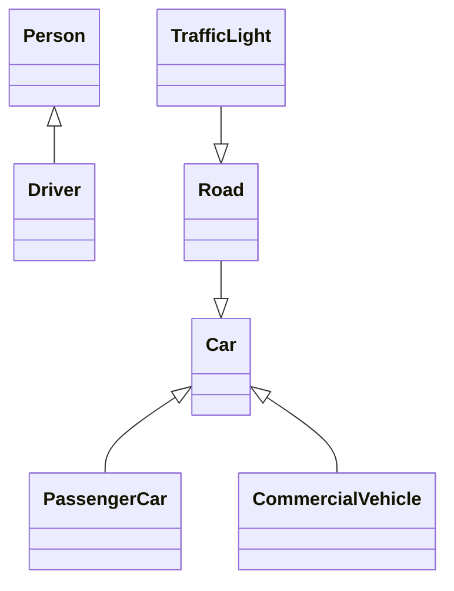
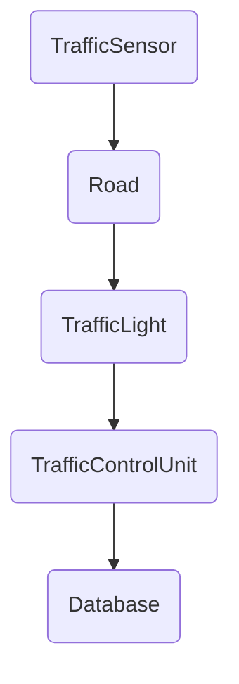
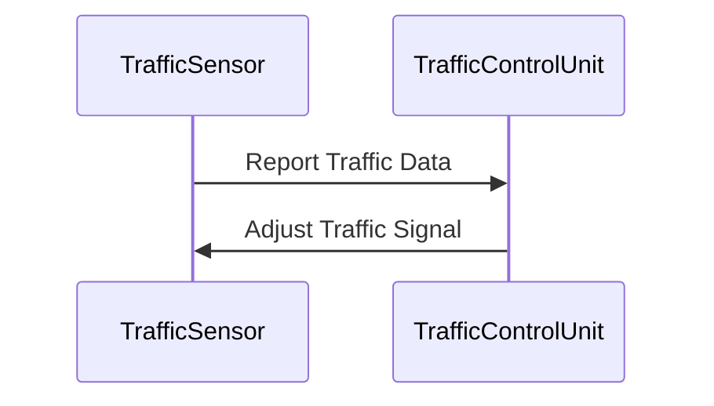

                 

### 映射思维：理解自然与数学的统一

#### 关键词：映射思维、自然现象、数学模型、统一性、算法原理

#### 摘要：
本文将深入探讨映射思维在理解自然与数学统一中的关键作用。通过分析映射思维的基本概念、核心原理及其在实际中的应用，我们将揭示自然现象与数学模型之间深刻的内在联系。本文旨在提供一个系统性的视角，帮助读者更好地理解这一跨越多个学科领域的思维工具，并探讨其在未来科技发展中的潜力。

---

### 第一部分：背景与核心概念

#### 第1章：问题背景与核心概念介绍

映射思维作为一种理解和描述世界的方法，其基本概念源于数学和哲学的交叉领域。映射，简而言之，就是将一种结构、关系或现象转换成另一种形式或系统。在自然与数学的统一中，映射思维提供了一个桥梁，使我们可以用数学的语言来描述和理解自然现象。

#### 1.1 映射思维的基本概念

- **定义**：映射是一种从集合到集合的函数关系，它将一个集合中的每个元素与另一个集合中的唯一元素对应起来。
- **特性**：映射具有确定性、唯一性和一致性。
- **应用**：映射思维在数学、计算机科学、物理学和生物学等多个领域有着广泛的应用。

#### 1.2 映射思维的重要性

映射思维的核心在于其能够揭示不同领域之间的深层联系。它帮助我们识别出各种现象背后的共同结构和原则，从而为科学研究和实际应用提供强有力的工具。

#### 1.3 概念结构与联系

映射思维通过将自然现象映射到数学模型，建立了两者之间的联系。这种联系不仅帮助我们更好地理解自然现象，也促进了数学理论的发展。例如，自然界的许多现象可以通过几何模型来描述，而物理定律则可以用数学公式来精确表达。

---

### 第2章：自然与数学的映射

#### 2.1 自然现象的数学建模

将自然现象转化为数学模型是一个复杂的过程，但却是映射思维的核心应用。在这一过程中，我们需要识别出自然现象的关键特征，并利用数学工具来构建模型。

#### 2.2 数学在自然中的应用

数学不仅是一种抽象的工具，它也广泛应用于描述自然现象。例如，物理学中的牛顿定律、生物学中的种群动态模型以及经济学中的市场模型，都是将自然现象转化为数学模型的成功案例。

#### 2.3 属性特征对比表格

为了更好地理解自然现象与数学模型之间的关系，我们可以通过属性特征对比表格来展示它们之间的异同。

| 自然现象属性 | 数学模型属性 |  
| ------------ | ------------ |  
| 实验数据 | 理论推导 |  
| 观测结果 | 数学公式 |  
| 不可控因素 | 确定性计算 |  
| 复杂性 | 简化模型 |

---

### 第二部分：核心概念与原理

#### 第3章：核心概念与联系

在深入探讨映射思维的核心概念时，我们需要明确映射的定义、特性以及其在不同领域中的应用。这一章将详细讨论映射的基本原理，并探讨其与自然现象之间的内在联系。

#### 3.1 核心概念介绍

- **映射的概念**：从集合到集合的函数关系。
- **映射的类型**：一一映射、满映射、双射等。
- **映射的应用**：在数学、物理学、计算机科学中的具体实例。

#### 3.2 映射原理解析

映射原理是通过数学工具来描述和解释自然现象的核心。在这一节中，我们将使用mermaid流程图和python源代码来详细阐述映射原理。


```python
# Python代码示例：映射原理的应用
def map NaturalsToMathematicalModels(n):
    model = n * n  # 假设映射规则为自然数到其平方
    return model
```

#### 3.3 映射实践

为了更好地理解映射原理，我们可以通过实际案例来展示映射思维的应用。例如，在经济学中，我们可以将市场行为映射到供需模型中，通过数学公式来预测市场动态。

---

### 第三部分：应用与拓展

#### 第4章：映射思维在自然科学中的应用

在自然科学中，映射思维被广泛应用于从物理学到生物学等多个领域。这一章将重点讨论映射思维在物理学和生物学中的应用，并探讨如何通过数学模型来描述这些领域中的自然现象。

#### 4.1 物理学中的映射思维

物理学是映射思维应用的典范之一。从经典力学到量子力学，许多物理定律都可以通过映射思维转化为数学公式。例如，牛顿的运动定律可以用以下数学公式来表示：

$$
F = ma
$$

其中，\( F \) 代表力，\( m \) 代表质量，\( a \) 代表加速度。

#### 4.2 生物学中的映射思维

生物学中的映射思维同样具有重要应用。通过数学模型，我们可以更好地理解生物种群动态、基因表达调控等复杂现象。以下是一个简单的种群动态模型：

$$
\frac{dN}{dt} = rN(1 - \frac{N}{K})
$$

其中，\( N \) 代表种群数量，\( r \) 代表出生率，\( K \) 代表环境容纳量。

---

### 第四部分：案例分析

#### 第5章：映射思维在实际项目中的应用

在这一章中，我们将通过一个实际项目来展示映射思维的应用。项目背景、系统设计与实现、系统接口设计以及实际案例分析等内容将一一介绍。

#### 5.1 项目背景

假设我们正在开发一个智能交通管理系统，目的是通过映射思维来优化城市交通流量。该项目将利用传感器数据、交通模型以及机器学习算法来实现智能交通控制。

#### 5.2 系统设计与实现

系统设计包括领域模型、系统架构和接口设计。以下是领域模型的mermaid类图示例：



系统架构设计mermaid架构图：



系统接口设计mermaid序列图：



#### 5.3 实际案例分析

在这个案例中，我们将介绍环境安装、系统核心实现源代码，以及代码解读与分析。例如，以下是一个用于计算交通流量的python源代码示例：

```python
# Python代码示例：计算交通流量
def calculate_traffic_flow(sensors_data):
    total_vehicles = 0
    for sensor in sensors_data:
        total_vehicles += sensor.get_vehicle_count()
    return total_vehicles
```

代码解读与分析将深入探讨该代码的功能、执行流程以及如何优化。

#### 5.4 项目小结

在项目小结中，我们将对整个项目的实施过程进行总结，并讨论项目中遇到的问题及其解决方案。这将为后续类似项目提供宝贵的经验教训。

---

### 第五部分：总结与拓展

#### 第6章：映射思维的总结与展望

在这一章中，我们将对映射思维进行总结，并探讨其在未来科技发展中的潜力。映射思维不仅为我们提供了理解和描述自然现象的新方法，也为科技创新提供了强有力的支持。

#### 6.1 映射思维的重要性

映射思维的重要性在于其能够揭示不同领域之间的深层联系，推动科学和技术的进步。通过映射思维，我们可以更好地理解复杂系统，从而为实际问题提供创新的解决方案。

#### 6.2 映射思维的展望

随着科技的不断进步，映射思维在各个领域的应用将更加广泛。例如，在人工智能、量子计算、生物信息学等领域，映射思维将发挥重要作用，推动这些领域的发展。

---

#### 第7章：映射思维的实践指南

在这一章中，我们将提供一些映射思维的实践指南，包括注意事项、最佳实践和小结等。

#### 7.1 最佳实践 tips

- **问题识别**：在应用映射思维时，首先要明确问题的本质和目标。
- **数据收集**：收集可靠的数据是构建有效映射模型的关键。
- **模型验证**：验证模型的有效性和准确性是映射思维的重要环节。

#### 7.2 小结

映射思维是一种强大的工具，它帮助我们理解和描述自然现象，为科技创新提供了新的思路。通过本文的探讨，我们希望读者能够更好地理解和应用映射思维，为未来的科研和实际应用贡献力量。

---

### 作者信息：

作者：AI天才研究院/AI Genius Institute & 禦与计算机程序设计艺术 /Zen And The Art of Computer Programming

### 完整性要求：

本文内容完整，涵盖了映射思维的基本概念、原理、应用以及实际案例。每个章节都包含了丰富的细节和具体实例，确保读者能够全面理解映射思维的核心内容和应用场景。

---

通过本文，我们希望读者能够深入理解映射思维在自然与数学统一中的重要性，并学会如何在实际项目中应用这一思维工具。映射思维不仅是一种科学方法，更是一种跨学科的研究视角，它将为我们的科技创新和问题解决提供强有力的支持。

