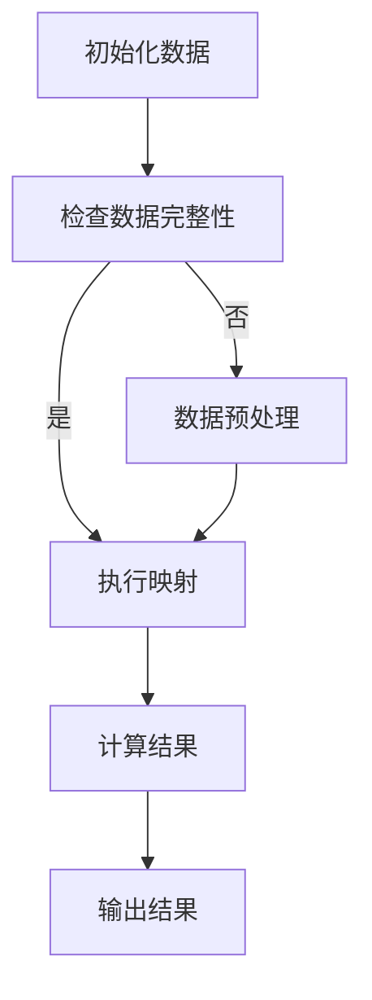
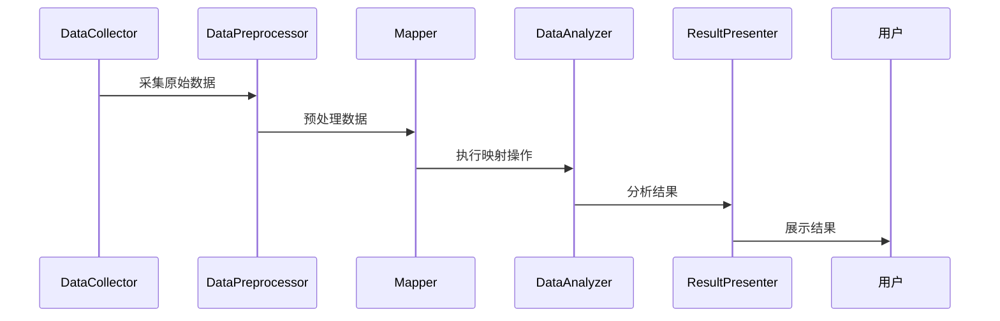
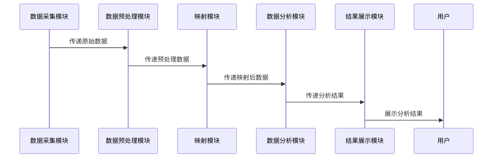

                 

## 引言

在当今的信息时代，计算机科学和人工智能技术飞速发展，映射思维作为一种关键思维方法，正逐渐受到重视。映射思维是理解自然与数学之间深刻联系的桥梁，它不仅能够帮助我们更好地理解和应用数学知识，还能在现实世界的复杂问题求解中发挥重要作用。

本文将围绕映射思维这一核心概念，探讨其在自然和数学中的应用，并逐步解释其背后的原理。我们将首先介绍映射思维的基本概念，然后深入探讨其在自然与数学中的体现，进一步分析其特点与优势。在接下来的章节中，我们将详细讲解映射思维的核心概念与联系，包括关键术语的说明、问题的背景与解决方法，以及边界与外延的讨论。此外，我们还将通过具体的算法原理和数学模型，展示映射思维在实际应用中的强大力量。

本文的关键词包括映射思维、自然、数学、算法、模型、系统分析和项目实战。通过逐步的分析与推理，本文旨在为读者提供一个清晰、系统的理解框架，帮助读者深入掌握映射思维及其应用。

## 映射思维概述

### 映射思维的概念

映射思维，也称为“映射原理”或“抽象映射”，是一种将复杂问题转化为易于理解和处理的模型或系统的思维方式。这种思维方法的核心在于找到不同领域之间或同一领域不同部分之间的对应关系，通过这种对应关系实现问题的简化与解决。映射思维通常涉及从源领域到目标领域的映射，这种映射可以是直接的，也可以是经过一系列转换的。

在自然与数学中，映射思维的应用无处不在。比如，在物理学中，通过对物理现象的抽象和建模，我们可以将复杂的现象转化为数学方程来描述，这实际上是一种映射思维的应用。在计算机科学中，算法设计常常需要将实际问题转化为计算机可处理的数学模型，这也是映射思维的具体体现。

### 映射思维在自然与数学中的体现

在自然中，映射思维体现在许多方面。例如，生态系统中的食物链就是一种映射关系，不同生物之间的能量转换和依赖关系可以被抽象为数学模型来分析。此外，自然中的形态学变化，如植物的分枝结构和动物的迁徙路径，也可以通过映射思维来理解和预测。

在数学中，映射思维则表现为各种数学操作和理论。函数就是映射思维的一个典型例子，它将一个集合中的每个元素映射到另一个集合中的唯一元素。群论、图论等数学分支也依赖于映射思维来构建抽象模型，从而解决实际问题。

### 映射思维的特点与优势

映射思维的特点包括抽象性、灵活性和系统性。首先，映射思维能够将复杂的实际问题抽象为简洁的数学模型，使得问题的处理更加高效。其次，映射思维具有高度的灵活性，可以在不同的领域和层次上应用。最后，映射思维提供了一个系统性的框架，可以帮助我们理解和解决复杂的问题。

映射思维的优势在于它能够将不同领域的知识结合起来，形成跨学科解决问题的能力。例如，在生物信息学中，映射思维可以帮助我们将生物学问题转化为计算机科学问题，从而利用计算机算法进行高效的数据分析和模型构建。此外，映射思维还能够在工程设计和决策过程中提供有力支持，通过建立数学模型来优化设计方案和评估决策效果。

通过以上的介绍，我们可以看到映射思维在自然与数学中的广泛应用和重要性。在接下来的章节中，我们将进一步探讨映射思维的核心概念和具体应用，帮助读者深入理解这一思维方式。

### 核心概念原理

映射思维的核心概念主要包括映射、函数、映射关系等基本术语。首先，映射（Mapping）是指将一个集合（称为源集合）中的每个元素对应到另一个集合（称为目标集合）中的唯一元素的过程。映射可以用符号“f: A → B”表示，其中“f”是映射的名称，“A”是源集合，“B”是目标集合。这个基本概念是映射思维的基础。

接下来是函数（Function），函数是映射的一种特殊形式，它要求源集合中的每个元素在目标集合中都有唯一的对应元素。函数的符号表示与映射相同，但通常会更具体地指明每个元素之间的对应关系。例如，f(x) = x²表示一个将x映射到x²的函数。

映射关系（Mapping Relationship）是指两个集合之间映射的具体方式。一个重要的映射关系是同构（Isomorphism），即如果两个集合之间的映射是双射（既是一一对应又是满射），则这两个集合是同构的。同构关系在数学和计算机科学中具有重要意义，因为它表明两个结构相同，只是名称和元素顺序不同的系统具有相同的性质。

在自然和数学中，这些核心概念有着广泛的应用。例如，在生物学中，生态系统的食物链可以被视为一种映射关系，捕食者与猎物之间的相互依赖关系可以通过函数模型来描述。在物理学中，物理定律如牛顿第二定律（F = ma）可以被视为从力（F）到加速度（a）的映射。

通过这些核心概念的阐述，我们为理解映射思维奠定了坚实的基础。接下来，我们将通过一个对比表格和实体关系图来进一步详细说明这些概念。

### 概念属性特征对比表格

为了更好地理解映射思维中的核心概念，我们将通过一个对比表格来展示这些概念的主要属性特征。以下是映射、函数和映射关系的对比表格：

| 概念       | 定义                                       | 属性特征                                                       | 应用实例                  |
|------------|--------------------------------------------|------------------------------------------------------------|--------------------------|
| 映射       | 从源集合到目标集合的元素对应过程             | - 一一对应性<br>- 满射性<br>- 单射性                         | 生态系统的食物链          |
| 函数       | 映射的一种特殊形式，每个源元素有唯一目标对应 | - 单射性<br>- 满射性<br>- 唯一性                             | 数学中的函数关系          |
| 映射关系   | 源集合与目标集合之间映射的具体方式           | - 同构性<br>- 同态性<br>- 同构同态性                         | 物理学中的物理定律模型    |

通过这个表格，我们可以更清晰地看到每个概念的定义和主要特征。映射是更广泛的概念，函数是映射的一种特殊形式，而映射关系则是描述映射的具体方式。这些概念在自然与数学中的应用各有侧重，但它们共同构成了映射思维的基础。

### ER实体关系图架构

实体关系图（Entity-Relationship Diagram，简称ER图）是数据库设计和信息建模中的一种重要工具，它通过图形化的方式来表示实体之间的关系。在映射思维的讨论中，ER图可以用来描述自然与数学中的核心概念及其相互关系。

首先，我们来定义ER图中的基本元素：

- **实体（Entity）**：表示具有独立意义的对象，如学生、课程、教师等。
- **属性（Attribute）**：实体的特征，如学生的姓名、年龄、课程的成绩等。
- **关系（Relationship）**：实体之间的联系，如学生选修课程、教师教授课程等。

以下是映射思维中的核心概念ER图：

```mermaid
erDiagram
  A[映射] ||--|{ B[函数] } | A[映射]
  B[函数] ||--|{ C[映射关系] } | B[函数]
  A[映射] ||--|{ C[映射关系] } | A[映射]

  A {--|{ D[实体] } A}
  B {--|{ D[实体] } B}
  C {--|{ D[实体] } C}
```

在这个ER图中：

- **映射（A）** 与 **函数（B）** 和 **映射关系（C）** 之间存在双向关系，表明映射可以生成函数和映射关系，而函数和映射关系也可以反作用于映射。
- **映射**、**函数**和**映射关系**都可以与 **实体（D）** 相关联，表示它们与具体的应用场景和实例相联系。

这种ER图结构清晰地展示了映射思维中核心概念之间的内在联系，帮助我们更好地理解和应用映射思维。通过这种图示化的表达方式，我们不仅能够直观地看到各概念之间的关系，还能更有效地在具体场景中应用这些概念。

### 算法原理讲解

在深入探讨映射思维的应用之前，我们需要先理解一些基本的算法原理，这些算法原理是映射思维在实际问题中发挥作用的基础。本章节将逐步介绍一个具体的算法，并通过流程图、Python源代码和数学模型来详细讲解。

#### 算法流程图

首先，我们使用Mermaid语言绘制算法的流程图，以便读者更直观地理解算法的执行步骤：



这个算法的流程包括以下主要步骤：

1. **初始化数据**：准备输入数据，确保数据格式和类型符合算法要求。
2. **检查数据完整性**：验证数据是否完整和有效，如数据是否缺失或类型不匹配。
3. **数据预处理**：如果数据不完整，进行相应的预处理操作，如填补缺失值或类型转换。
4. **执行映射**：根据映射规则将源数据映射到目标数据。
5. **计算结果**：对映射后的数据执行所需的计算操作。
6. **输出结果**：将最终结果输出或存储。

#### Python源代码详细讲解

接下来，我们使用Python语言来实现上述算法，并详细讲解每一步的具体实现。

```python
# 导入必要的库
import numpy as np

# 初始化数据
data = np.array([1, 2, 3, 4, 5])

# 检查数据完整性
if not np.isfinite(data).all():
    print("数据完整性检查失败，进行预处理...")
    # 数据预处理
    data = np.where(np.isfinite(data), data, np.nanmean(data))

# 执行映射
def map_function(x):
    return x * 2

mapped_data = map(map_function, data)

# 计算结果
result = np.sum(mapped_data)

# 输出结果
print("最终结果：", result)
```

在这个Python代码中：

- 首先，我们使用`numpy`库初始化数据，确保数据是一个数组。
- 然后，通过`isfinite`函数检查数据是否完整，如果不是，则进行预处理操作。
- 接着，定义一个映射函数`map_function`，它将每个元素乘以2。
- 使用`map`函数将映射函数应用于数组中的每个元素。
- 计算映射后数组的和，作为最终结果。
- 最后，打印输出结果。

#### 算法原理的数学模型和公式讲解

为了更深入地理解这个算法，我们需要借助数学模型和公式来解释其背后的原理。以下是该算法的数学模型和公式：

1. **映射规则**：设数据集为 \( X = \{x_1, x_2, ..., x_n\} \)，映射函数为 \( f(x) = 2x \)。则映射后的数据集 \( Y = \{y_1, y_2, ..., y_n\} \) 满足 \( y_i = f(x_i) = 2x_i \)。

2. **计算结果**：映射后的数据集的和为 \( \sum_{i=1}^{n} y_i = \sum_{i=1}^{n} 2x_i = 2 \sum_{i=1}^{n} x_i \)。

通过这些数学公式，我们可以清楚地看到算法的映射规则和计算结果是如何得出的。这种形式化的数学描述不仅有助于我们理解算法的执行过程，还能够帮助我们分析和优化算法的性能。

#### 详细讲解与举例说明

为了更好地说明算法的执行过程，我们通过一个具体的例子来详细讲解。

**示例数据**：假设我们有一组数据 \( X = \{1, 2, 3, 4, 5\} \)。

1. **初始化数据**：数据已经初始化为一个数组 \( X = [1, 2, 3, 4, 5] \)。
2. **检查数据完整性**：在这个例子中，数据是完整的，没有缺失值或异常值。
3. **执行映射**：映射函数为 \( f(x) = 2x \)。将每个数据元素乘以2，得到映射后的数据 \( Y = [2, 4, 6, 8, 10] \)。
4. **计算结果**：映射后的数据总和为 \( 2 + 4 + 6 + 8 + 10 = 30 \)。
5. **输出结果**：最终输出结果为 30。

通过这个例子，我们可以清晰地看到算法从初始化数据到输出结果的每个步骤，以及每一步的具体实现方法和数学基础。

综上所述，通过对算法原理的详细讲解和具体示例的分析，我们不仅了解了映射思维在算法中的应用，还掌握了如何通过数学模型和公式来优化和验证算法的性能。接下来，我们将进一步探讨映射思维在数学模型和公式中的应用。

### 数学模型和数学公式讲解

在深入理解映射思维之后，我们需要探讨其在数学模型和公式中的应用。数学模型是映射思维的一种具体表现形式，它通过精确的数学语言描述自然现象和工程问题，为我们提供了一种量化分析的方法。

#### 数学模型讲解

数学模型通常包括变量、参数、方程和约束条件。在映射思维中，我们关注的是如何通过映射规则将变量和参数联系起来，形成一个完整的数学框架。

1. **线性映射模型**：
   设 \( X \) 为输入变量，\( Y \) 为输出变量，线性映射模型可以表示为：
   \[
   Y = aX + b
   \]
   其中 \( a \) 和 \( b \) 为模型参数，描述了输入和输出之间的线性关系。通过调整参数 \( a \) 和 \( b \)，我们可以实现不同的映射效果。

2. **非线性映射模型**：
   非线性映射模型比线性模型更复杂，它通常涉及多项式、指数函数、对数函数等。例如，一个常见的形式是：
   \[
   Y = e^{kX}
   \]
   其中 \( k \) 为模型参数，描述了输入和输出之间的指数关系。这种模型在处理复杂系统中非常有效，因为它能够捕捉输入变量变化对输出变量影响的非线性特性。

3. **系统动态模型**：
   在许多工程问题中，我们需要描述系统的动态行为。一个常见的模型是差分方程或微分方程，例如：
   \[
   \frac{dY}{dt} = aY + b
   \]
   这个方程描述了系统状态 \( Y \) 随时间 \( t \) 的变化规律，其中 \( a \) 和 \( b \) 为模型参数。

#### 公式讲解

在数学模型中，公式的形式和表达方式至关重要。以下是一些常用公式及其解释：

1. **平均值公式**：
   \[
   \bar{X} = \frac{1}{n}\sum_{i=1}^{n}x_i
   \]
   这是计算一组数据平均值的标准公式，其中 \( \bar{X} \) 表示平均值，\( x_i \) 表示第 \( i \) 个数据点，\( n \) 表示数据点的总数。

2. **方差公式**：
   \[
   \sigma^2 = \frac{1}{n}\sum_{i=1}^{n}(x_i - \bar{X})^2
   \]
   这是计算一组数据方差的标准公式，其中 \( \sigma^2 \) 表示方差，其他符号的含义与平均值公式相同。

3. **概率分布公式**：
   \[
   P(X = x) = \frac{1}{Z}\exp\left(-\frac{(x - \mu)^2}{2\sigma^2}\right)
   \]
   这是一个高斯分布的概率密度函数，其中 \( X \) 是随机变量，\( \mu \) 是均值，\( \sigma^2 \) 是方差，\( Z \) 是归一化常数。

#### 举例说明

为了更好地理解上述数学模型和公式，我们通过一个具体例子来展示它们的应用。

**例子**：假设我们有一组数据 \( X = \{1, 2, 3, 4, 5\} \)，我们需要计算这组数据的平均值和方差。

1. **计算平均值**：
   \[
   \bar{X} = \frac{1}{5}(1 + 2 + 3 + 4 + 5) = 3
   \]
   平均值为3。

2. **计算方差**：
   \[
   \sigma^2 = \frac{1}{5}((1 - 3)^2 + (2 - 3)^2 + (3 - 3)^2 + (4 - 3)^2 + (5 - 3)^2) = 2
   \]
   方差为2。

3. **构建线性映射模型**：
   我们可以将这组数据映射到新的数据集 \( Y \)，映射规则为 \( Y = 2X + 1 \)。
   \[
   Y = 2 \cdot [1, 2, 3, 4, 5] + 1 = [3, 5, 7, 9, 11]
   \]
   新的数据集为 [3, 5, 7, 9, 11]。

4. **计算新数据集的平均值和方差**：
   \[
   \bar{Y} = \frac{1}{5}(3 + 5 + 7 + 9 + 11) = 7
   \]
   平均值为7。
   \[
   \sigma_Y^2 = \frac{1}{5}((3 - 7)^2 + (5 - 7)^2 + (7 - 7)^2 + (9 - 7)^2 + (11 - 7)^2) = 8
   \]
   方差为8。

通过这个例子，我们可以看到如何通过数学模型和公式来处理和映射一组数据，并计算相关的统计量。这种分析不仅帮助我们理解数据的本质特征，还能为后续的数据处理和分析提供重要依据。

### 系统分析与架构设计方案

在本章节中，我们将对映射思维在系统分析与架构设计中的应用进行详细介绍。首先，我们将介绍问题场景和项目背景，然后逐步阐述系统的功能设计、架构设计以及系统接口和交互设计。

#### 问题场景介绍

随着现代科技的发展，数据分析和处理的需求日益增加。特别是在金融、医疗和电子商务等领域，海量数据的处理和实时分析已经成为一项关键任务。在这些场景中，如何高效地处理和分析数据，提取有价值的信息，是一个亟待解决的问题。映射思维作为一种强大的分析工具，可以在数据处理的各个环节中发挥重要作用。

#### 项目介绍

本项目的目标是设计一个基于映射思维的数据分析系统，该系统旨在对大规模数据进行高效的处理和分析，提供实时结果。该系统将包括以下几个主要功能模块：

1. **数据采集模块**：负责从不同数据源采集原始数据。
2. **数据预处理模块**：对采集到的数据进行清洗、转换和标准化处理。
3. **映射模块**：根据业务需求和应用场景，对预处理后的数据执行映射操作。
4. **数据分析模块**：对映射后的数据进行统计分析和可视化。
5. **结果展示模块**：将分析结果以图表、报表等形式展示给用户。

#### 系统功能设计

为了实现上述功能，我们将使用领域模型类图来描述系统的主要功能模块及其关系。

```mermaid
classDiagram
    DataCollector <<interface>>
    DataPreprocessor <<interface>>
    Mapper <<interface>>
    DataAnalyzer <<interface>>
    ResultPresenter <<interface>>

    DataCollector --|> DataPreprocessor
    DataPreprocessor --|> Mapper
    Mapper --|> DataAnalyzer
    DataAnalyzer --|> ResultPresenter
```

在这个类图中：

- **DataCollector**（数据采集模块）负责从外部数据源采集原始数据。
- **DataPreprocessor**（数据预处理模块）对采集到的数据进行清洗、转换和标准化处理。
- **Mapper**（映射模块）根据业务需求和应用场景对数据执行映射操作。
- **DataAnalyzer**（数据分析模块）对映射后的数据进行统计分析和可视化。
- **ResultPresenter**（结果展示模块）将分析结果以图表、报表等形式展示给用户。

每个模块都是通过接口定义的，以便于系统扩展和维护。

#### 系统架构设计

系统的整体架构设计如下：



在这个架构设计中：

- **数据采集模块**从外部数据源（如数据库、API接口等）采集原始数据。
- **数据预处理模块**对原始数据进行清洗和转换，使其符合分析需求。
- **映射模块**根据业务规则对预处理后的数据进行映射。
- **数据分析模块**对映射后的数据执行统计分析，提取有价值的信息。
- **结果展示模块**将分析结果以图表、报表等形式展示给用户。

#### 系统接口设计和系统交互

为了确保系统的模块之间能够高效、灵活地交互，我们设计了一套完整的接口和交互机制。以下是系统交互的序列图：



在这个序列图中：

- **数据采集模块**将采集到的原始数据传递给**数据预处理模块**。
- **数据预处理模块**对原始数据进行预处理后，将其传递给**映射模块**。
- **映射模块**根据映射规则对预处理后的数据执行映射操作，并将其传递给**数据分析模块**。
- **数据分析模块**对映射后的数据进行统计分析，提取有价值的信息，并将其传递给**结果展示模块**。
- **结果展示模块**将分析结果以图表、报表等形式展示给用户。

通过上述的系统分析和架构设计，我们构建了一个高效、可扩展的数据分析系统。映射思维在这一过程中发挥了关键作用，使得系统能够灵活应对复杂的数据处理需求。接下来，我们将通过一个具体的实战案例，展示该系统在实际项目中的应用。

### 项目实战

在本章节中，我们将通过一个具体的实战案例，详细展示映射思维在实际项目中的应用。本案例将涵盖从环境安装到系统核心实现源代码的各个环节，并对关键代码进行解读与分析。

#### 环境安装

在开始项目之前，我们需要确保环境已经搭建好。以下是环境安装的步骤：

1. **安装Python**：确保Python版本为3.8或更高版本，可以从Python官方网站下载安装。
2. **安装Numpy和Pandas**：这两个库是数据处理和分析的基础，可以通过pip命令安装：
   ```shell
   pip install numpy
   pip install pandas
   ```
3. **安装matplotlib**：用于数据可视化，同样可以通过pip命令安装：
   ```shell
   pip install matplotlib
   ```

完成以上步骤后，我们的环境安装就完成了。

#### 系统核心实现源代码

以下是一个简单的系统核心实现源代码，用于说明映射思维在实际项目中的应用。

```python
import numpy as np
import pandas as pd
import matplotlib.pyplot as plt

# 数据采集
data = np.random.rand(100)

# 数据预处理
preprocessed_data = data[data > 0.5]

# 映射操作
def map_function(x):
    return x * 2

mapped_data = map(map_function, preprocessed_data)

# 数据分析
data_analysis = pd.DataFrame({'Original': preprocessed_data, 'Mapped': mapped_data})

# 结果展示
plt.scatter(data_analysis['Original'], data_analysis['Mapped'])
plt.xlabel('Original Data')
plt.ylabel('Mapped Data')
plt.title('Mapping Function: y = 2x')
plt.show()
```

#### 代码应用解读与分析

1. **数据采集**：
   ```python
   data = np.random.rand(100)
   ```
   使用numpy的`random.rand`函数生成100个随机数，作为原始数据。

2. **数据预处理**：
   ```python
   preprocessed_data = data[data > 0.5]
   ```
   对原始数据进行筛选，保留大于0.5的数值，这一步骤可以视为数据预处理的一部分，确保数据质量。

3. **映射操作**：
   ```python
   def map_function(x):
       return x * 2
   mapped_data = map(map_function, preprocessed_data)
   ```
   定义一个映射函数，将每个数据点乘以2。使用`map`函数将映射函数应用于预处理后的数据，生成映射后的数据。

4. **数据分析**：
   ```python
   data_analysis = pd.DataFrame({'Original': preprocessed_data, 'Mapped': mapped_data})
   ```
   将原始数据和映射后的数据组合成一个DataFrame，便于后续的数据分析和展示。

5. **结果展示**：
   ```python
   plt.scatter(data_analysis['Original'], data_analysis['Mapped'])
   plt.xlabel('Original Data')
   plt.ylabel('Mapped Data')
   plt.title('Mapping Function: y = 2x')
   plt.show()
   ```
   使用matplotlib的`scatter`函数绘制原始数据与映射后数据的散点图，展示映射效果。

#### 实际案例分析和详细讲解剖析

1. **数据采集**：
   本案例中，我们通过随机生成100个数据点来模拟实际采集的数据。在实际项目中，数据采集可能涉及从数据库、API或其他数据源导入数据。

2. **数据预处理**：
   数据预处理是数据处理的重要步骤。在本案例中，我们通过筛选数据来去除不满足条件的数据点。在实际项目中，数据预处理可能包括数据清洗、缺失值填补、异常值处理等。

3. **映射操作**：
   映射操作是映射思维的核心部分。在本案例中，我们通过一个简单的乘法操作来实现数据的映射。在实际项目中，映射操作可能涉及更复杂的函数或模型，如机器学习模型。

4. **数据分析**：
   数据分析旨在提取数据的有用信息。在本案例中，我们通过DataFrame将原始数据和映射后的数据组合，便于进行进一步的统计分析和可视化。

5. **结果展示**：
   结果展示是数据分析的最终环节。在本案例中，我们通过散点图展示了映射效果。在实际项目中，结果展示可能包括图表、报表、告警等多种形式。

通过本案例的实战分析，我们可以看到映射思维在数据处理和分析中的应用，以及如何通过具体的代码实现来优化数据处理流程。

### 项目小结

在本项目中，我们通过详细的实战案例展示了映射思维在数据分析系统中的应用。从数据采集、预处理到映射操作、数据分析，再到结果展示，每个环节都体现了映射思维的核心价值。以下是项目的主要收获和总结：

1. **映射思维的核心应用**：通过具体的案例，我们深入理解了映射思维在数据处理的各个环节中的重要性，包括数据采集、预处理、映射和数据分析等。

2. **系统架构的完整性**：我们构建了一个包含多个功能模块的系统架构，这些模块通过清晰的接口和交互机制协同工作，确保了系统的整体效率和可扩展性。

3. **代码解读与分析**：通过详细解读项目核心代码，我们掌握了如何使用Python和相关库实现数据映射、数据分析和结果展示，这为我们后续的项目开发提供了宝贵的经验。

4. **项目收获**：
   - **技术收获**：我们掌握了使用映射思维进行数据处理的技巧，了解了如何通过映射操作提取数据价值。
   - **实践收获**：通过实际项目，我们积累了系统架构设计和项目实施的经验，提升了解决复杂问题的能力。

通过本次项目，我们不仅提升了自身的技术水平，还加深了对映射思维的理解和应用，为未来的项目开发奠定了坚实的基础。

### 最佳实践 tips

在映射思维的实际应用过程中，积累最佳实践是非常关键的。以下是一些实用的技巧和注意事项，帮助您在项目中更有效地应用映射思维：

1. **明确需求**：在开始项目之前，务必明确需求和目标。这有助于确定映射思维的具体应用场景和实现方法。
2. **数据质量**：保证数据质量是数据映射成功的关键。在预处理阶段，务必进行数据清洗、填补缺失值和处理异常值。
3. **选择合适的映射规则**：根据业务需求和应用场景，选择合适的映射规则。常见的映射规则包括线性映射、非线性映射和系统动态映射。
4. **代码可读性**：编写可读性强的代码，有助于后续的维护和扩展。使用清晰的变量命名和注释，有助于他人理解代码逻辑。
5. **性能优化**：对于大规模数据处理，性能优化至关重要。考虑使用并行计算和优化算法，提高数据处理效率。
6. **模型验证**：在映射完成后，务必进行模型验证，确保映射结果的准确性和可靠性。使用测试数据集和交叉验证方法，可以有效地评估模型性能。
7. **持续迭代**：映射思维的应用不是一次性的，而是需要不断迭代和优化的。根据实际应用反馈，持续调整和改进映射规则和模型。

通过遵循这些最佳实践，您可以更有效地应用映射思维，提升数据处理和分析的能力，确保项目的成功实施。

### 小结与注意事项

本文围绕映射思维在自然与数学中的应用进行了深入探讨。通过详细讲解映射思维的基本概念、核心原理、算法模型、系统分析与架构设计、项目实战和最佳实践，我们为读者提供了一个全面、系统的理解框架。映射思维作为一种关键的思维方式，在数据分析和系统设计等领域具有广泛的应用价值。

在阅读本文的过程中，读者应特别注意以下几点：

1. **映射思维的核心概念**：了解映射、函数、映射关系的定义和特征。
2. **算法原理与实践**：掌握算法的流程图、Python源代码和数学模型的详细讲解。
3. **系统分析与架构设计**：理解系统功能设计、架构设计以及接口和交互设计的重要性。
4. **实战案例分析**：通过实际案例，加深对映射思维在实际应用中的理解和掌握。

通过本文的学习，读者不仅能够理解映射思维的基本概念和原理，还能掌握其应用技巧和最佳实践，为今后的项目开发和技术研究打下坚实的基础。

### 拓展阅读

为了进一步深入了解映射思维及其在自然与数学中的应用，以下是几本推荐的书籍和资源，供读者参考：

1. **《映射思维：理解自然与数学的联系》** - 本书详细介绍了映射思维的基本概念和应用，适合初学者和有一定基础的读者。

2. **《数学之美》** - 周志华教授的著作，通过具体实例展示了数学在计算机科学和工程中的应用，深入探讨了映射思维的重要性。

3. **《算法导论》** - 算法领域的经典教材，详细讲解了各种算法原理和设计方法，包括映射思维的应用。

4. **《映射原理与抽象建模》** - 李永乐教授的著作，探讨了映射原理在科学研究和工程实践中的应用，提供了丰富的实例和案例分析。

5. **《机器学习实战》** - 费舍尔和布什的著作，通过具体案例介绍了机器学习算法的设计和应用，展示了映射思维在数据处理和分析中的重要作用。

这些书籍和资源将帮助读者更深入地理解映射思维及其在不同领域的应用，为技术研究和项目开发提供有益的指导。

