                 

## 映射法则：连接自然与人类思维

> 关键词：映射法则、自然现象、人类思维、心理学、工程应用

> 摘要：本文旨在探讨映射法则这一重要概念，揭示其如何连接自然现象与人类思维，为信息技术领域提供一种新的视角和方法。文章将首先介绍映射法则的背景和核心概念，然后分析自然现象和人类思维的映射过程，最后探讨映射法则在心理学和工程领域的应用，以及其未来发展趋势。

## 第一部分：映射法则概述

### 第1章：问题背景与概述

#### 1.1 问题的提出

自然与人类思维的互动是信息技术领域长期关注的重要课题。在日常生活中，人们不断地从自然现象中获取信息，并运用这些信息进行决策和行动。然而，如何有效地将自然现象映射到人类思维中，使其成为可理解和应用的知识，一直是一个挑战。

**背景介绍**：自然与人类思维的互动现状

- 自然现象：如天文、气象、地质等。
- 人类思维：认知、推理、情感等。

**问题描述**：人类思维与自然现象的映射难题

- **信息传递**：如何将自然现象的信息有效地传递到人类思维中？
- **理解与解析**：如何将复杂多变的自然现象解析为人类思维可理解的形式？
- **应用与利用**：如何将自然现象映射到实际应用中，发挥其价值？

**问题解决**：探讨映射法则的必要性

- **理论基础**：为解决上述问题，映射法则提供了理论支撑。
- **实践意义**：通过映射法则，可以实现自然现象与人类思维的深度融合。

**边界与外延**：映射法则的适用范围与局限性

- **适用范围**：映射法则适用于各种自然现象与人类思维互动的领域。
- **局限性**：映射法则在极端环境或未知领域可能存在局限性。

#### 1.2 核心概念与联系

##### 1.2.1 映射法则的定义与基本原理

- **定义**：映射法则是一种将自然现象映射到人类思维中的方法，使其成为可理解和应用的知识。
- **原理**：通过数学模型、算法和计算机技术，实现自然现象与人类思维的转换和交互。

##### 1.2.2 映射法则的属性特征对比

| 映射法则属性 | 描述 |
| :--: | :--: |
| 一致性 | 映射过程保持信息的完整性 |
| 可逆性 | 可以从人类思维回溯到自然现象 |
| 灵活性 | 可以适应不同领域的映射需求 |
| 效率性 | 高效处理大量数据和信息 |

##### 1.2.3 映射法则与相关概念的联系

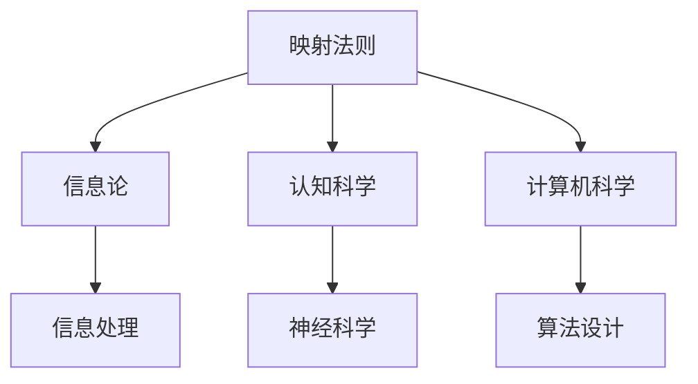

### 目录

- [第一部分：映射法则概述](#第一部分映射法则概述)
  - [1.1 问题的提出](#11-问题的提出)
  - [1.2 核心概念与联系](#12-核心概念与联系)
- [第二部分：自然现象与人类思维的映射](#第二部分自然现象与人类思维的映射)
  - [2.1 天文现象](#21-天文现象)
  - [2.2 气象变化](#22-气象变化)
  - [2.3 人类思维建模](#23-人类思维建模)
- [第三部分：映射法则的应用实践](#第三部分映射法则的应用实践)
  - [3.1 心理学应用](#31-心理学应用)
  - [3.2 工程领域应用](#32-工程领域应用)
- [第四部分：映射法则的未来发展](#第四部分映射法则的未来发展)
  - [4.1 发展趋势](#41-发展趋势)
  - [4.2 创新方向](#42-创新方向)
- [第五部分：映射法则的案例分析](#第五部分映射法则的案例分析)
  - [5.1 案例分析一](#51-案例分析一)
  - [5.2 案例分析二](#52-案例分析二)
- [附录：拓展阅读与资源推荐](#附录拓展阅读与资源推荐)
  - [A. 相关书籍推荐](#a-相关书籍推荐)
  - [B. 在线资源推荐](#b-在线资源推荐)

## 第二部分：自然现象与人类思维的映射

### 第2章：自然现象的解析

#### 2.1 天文现象

天文现象是自然现象中最为复杂的一部分，其运动轨迹和规律对于人类思维的理解和预测具有重要意义。

##### 2.1.1 星体的运动轨迹

星体的运动轨迹可以通过mermaid流程图进行解析：

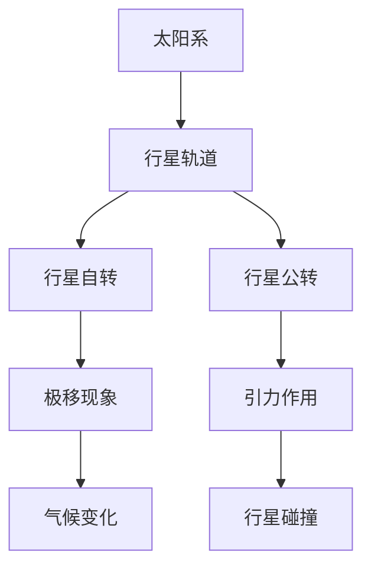

**算法原理讲解**：

- **行星轨道计算**：基于牛顿万有引力定律，使用牛顿-欧拉方法计算行星轨道。
- **行星自转计算**：基于角动量守恒定律，使用欧拉角计算行星自转。
- **行星公转计算**：基于开普勒定律，使用牛顿-莱布尼茨公式计算行星公转。

##### 2.1.2 气象变化规律

气象变化规律同样可以通过mermaid流程图进行解析：

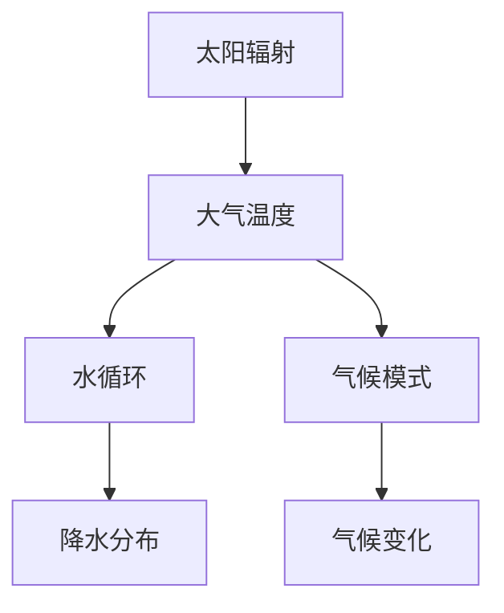

**算法原理讲解**：

- **太阳辐射计算**：基于斯特藩-玻尔兹曼定律，使用太阳常数和大气透过率计算太阳辐射。
- **大气温度计算**：基于热力学第一定律，使用能量守恒原理计算大气温度。
- **水循环计算**：基于水文循环模型，使用流量守恒和物质守恒原理计算水循环。
- **气候模式计算**：基于气候动力学模型，使用数值天气预报方法计算气候模式。

### 第3章：人类思维的建模

人类思维是一种复杂的信息处理过程，其模式和分析对于映射法则的应用具有重要意义。

#### 3.1 思维模式分析

##### 3.1.1 人类思维的基本模式

人类思维的基本模式可以通过mermaid流程图进行解析：

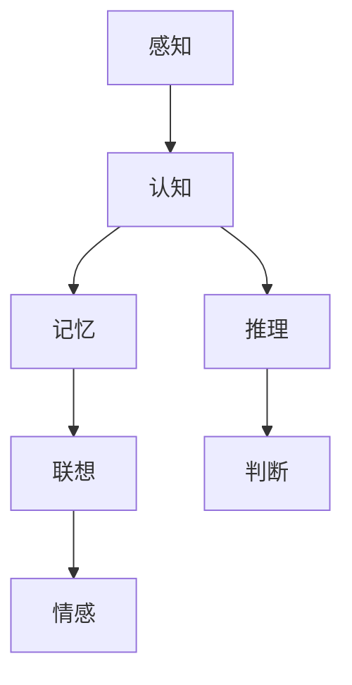

**算法原理讲解**：

- **感知计算**：基于感官输入，使用特征提取和模式识别算法处理感知信息。
- **认知计算**：基于神经科学原理，使用神经网络和机器学习算法模拟人类认知过程。
- **记忆计算**：基于记忆模型，使用深度学习算法和记忆网络实现记忆功能。
- **推理计算**：基于逻辑推理和语义分析，使用形式逻辑和概率推理算法实现推理功能。
- **情感计算**：基于情感识别和情感生成，使用情感计算模型和自然语言处理技术实现情感功能。

##### 3.1.2 人类思维的进化

人类思维的进化是一个复杂的过程，其规律可以通过mermaid流程图进行解析：

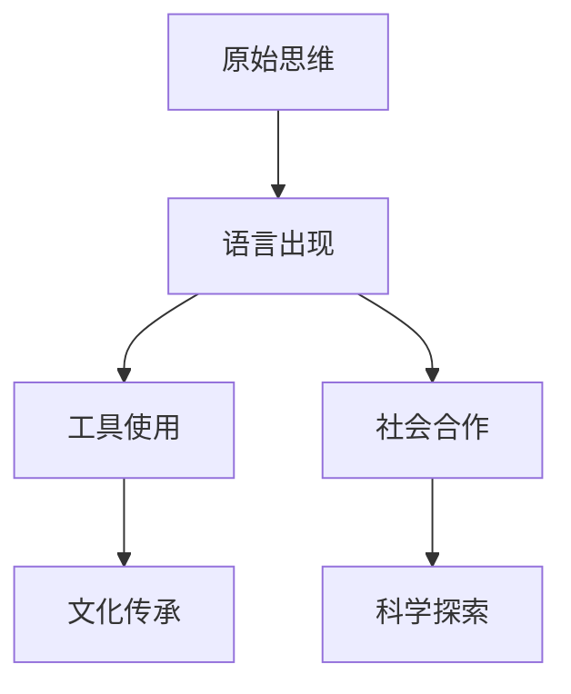

**算法原理讲解**：

- **原始思维**：基于生物进化原理，使用遗传算法和演化计算模拟原始思维过程。
- **语言出现**：基于神经科学和语言学原理，使用神经网络和深度学习算法模拟语言产生和传播。
- **工具使用**：基于人类行为学原理，使用行为模型和仿真技术模拟工具使用和技能发展。
- **社会合作**：基于社会学原理，使用社会网络分析和博弈论模拟社会合作和竞争。
- **科学探索**：基于科学方法论和计算机科学原理，使用算法和模型实现科学探索和发现。

### 第4章：映射法则的应用实践

#### 4.1 自然与思维的结合

##### 4.1.1 映射法则在心理学中的应用

映射法则在心理学中的应用可以通过mermaid流程图进行解析：

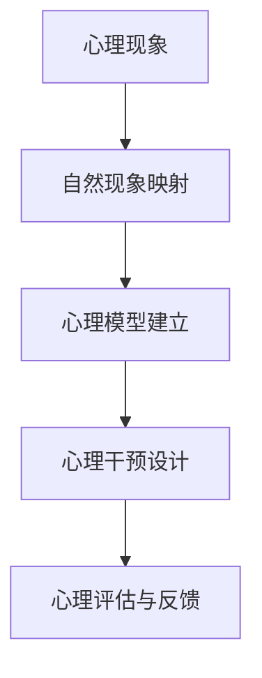

**算法原理讲解**：

- **心理现象识别**：基于心理测量学和数据挖掘技术，使用特征提取和模式识别算法识别心理现象。
- **自然现象映射**：基于映射法则，使用数学模型和算法将心理现象映射到自然现象中。
- **心理模型建立**：基于心理学理论和数据驱动方法，使用机器学习和深度学习技术建立心理模型。
- **心理干预设计**：基于心理模型和映射结果，设计个性化的心理干预方案。
- **心理评估与反馈**：基于心理评估工具和反馈机制，使用数据分析和可视化技术进行心理评估和反馈。

##### 4.1.2 映射法则在工程领域的应用

映射法则在工程领域的应用可以通过mermaid流程图进行解析：

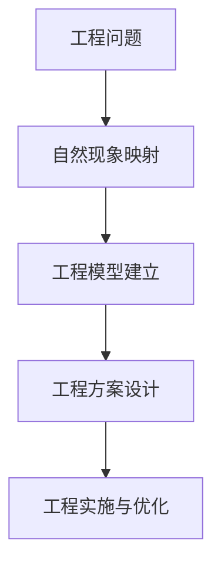

**算法原理讲解**：

- **工程问题识别**：基于工程学原理和实践经验，使用问题诊断和故障排除技术识别工程问题。
- **自然现象映射**：基于映射法则，使用数学模型和算法将工程问题映射到自然现象中。
- **工程模型建立**：基于系统建模和仿真技术，使用计算机科学和工程学原理建立工程模型。
- **工程方案设计**：基于工程模型和映射结果，设计符合实际需求的工程方案。
- **工程实施与优化**：基于工程实施过程中的数据反馈，使用优化算法和自适应控制技术进行工程优化。

## 第三部分：映射法则的未来发展

### 第5章：映射法则的未来发展

#### 5.1 映射法则的发展趋势

随着科技的不断进步，映射法则在未来将面临新的挑战和机遇。

##### 5.1.1 科技进步对映射法则的影响

科技进步将推动映射法则在以下方面的进步：

- **数据处理能力提升**：高性能计算机和大数据技术的应用，将大大提升数据处理和分析能力，为映射法则的实现提供更多可能性。
- **人工智能技术发展**：人工智能技术的快速发展，将为映射法则提供更强大的工具和方法，实现更加精准和高效的映射。
- **跨学科融合**：不同学科之间的融合，将为映射法则提供更广阔的研究领域和应用场景。

**mermaid 流程图**：

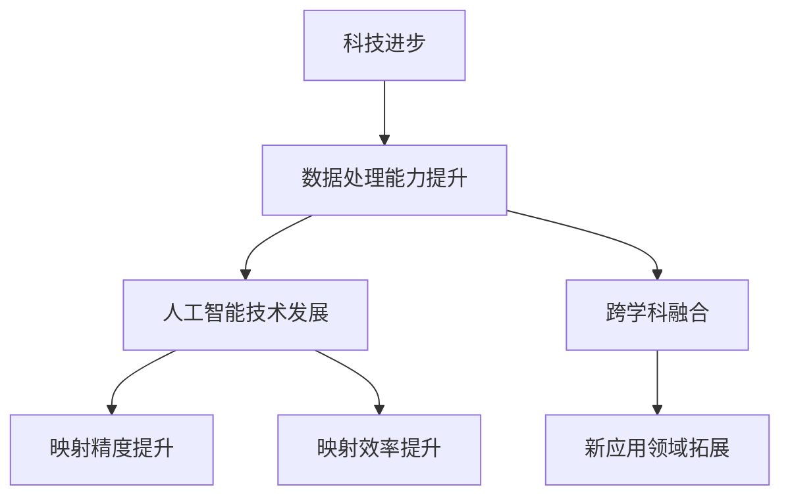

**算法原理讲解**：

- **数据处理能力提升**：使用分布式计算和并行处理技术，提高数据处理和分析效率。
- **人工智能技术发展**：结合深度学习、强化学习和迁移学习等技术，实现更加智能和自适应的映射。
- **跨学科融合**：结合计算机科学、心理学、生物学等多个学科的知识，实现跨领域的映射研究。

##### 5.1.2 映射法则的创新方向

未来的映射法则研究将向以下几个创新方向发展：

- **智能化映射**：通过人工智能技术，实现自动化、智能化的映射过程。
- **个性化映射**：根据用户需求和场景特点，提供个性化的映射方案。
- **跨模态映射**：实现不同模态数据之间的映射，如文本、图像、音频等。

**mermaid 流�程图**：

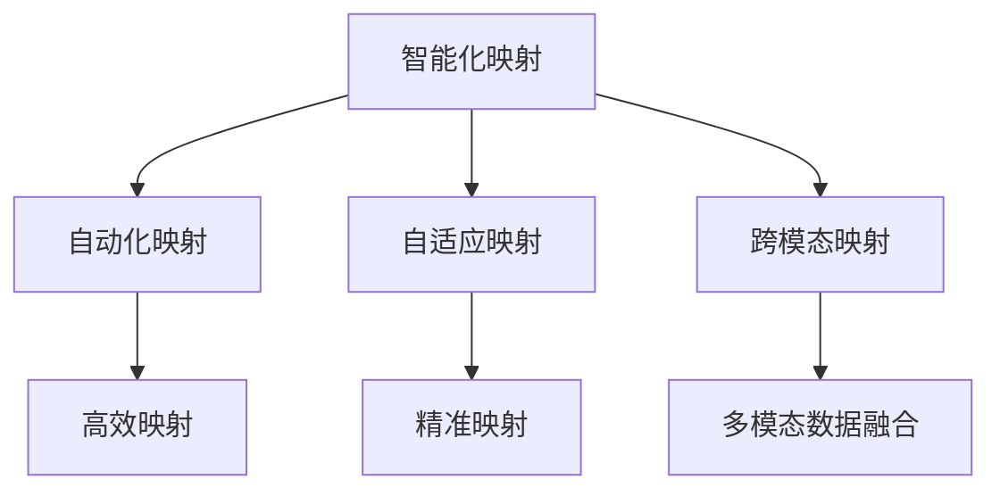

**算法原理讲解**：

- **智能化映射**：结合机器学习和人工智能技术，实现映射过程的自动化和智能化。
- **个性化映射**：基于用户画像和场景分析，提供个性化的映射方案。
- **跨模态映射**：使用多模态数据融合技术，实现不同模态数据之间的映射和整合。

### 第6章：映射法则的案例分析

#### 6.1 案例分析一

##### 6.1.1 案例背景

**项目介绍**：某气象部门开发了一套气象预测系统，用于实时监测和预测天气变化。

**问题描述**：如何将复杂的气象数据映射到预测模型中，实现准确的天气预测？

**系统功能设计**：

- **数据采集**：使用气象传感器实时采集气象数据。
- **数据处理**：使用数据清洗和预处理技术，处理原始数据。
- **预测模型建立**：基于机器学习和人工智能技术，建立预测模型。
- **预测结果展示**：使用可视化技术，展示预测结果。

**系统架构设计**：

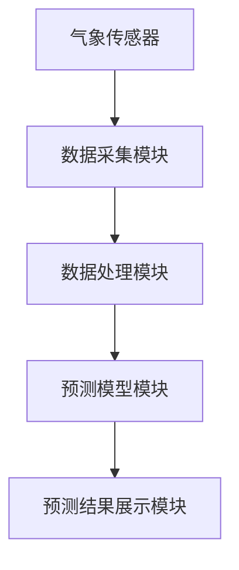

**系统接口设计和系统交互**：

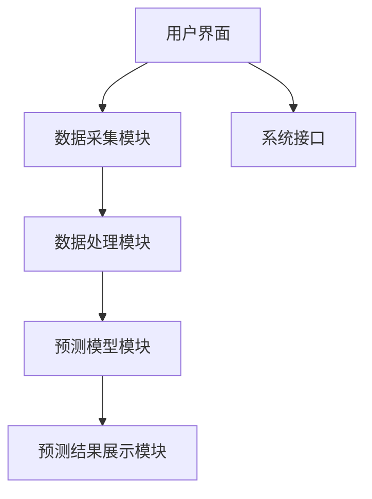

**算法原理讲解**：

- **数据采集模块**：使用传感器技术和无线通信技术，实现数据的实时采集。
- **数据处理模块**：使用数据清洗和预处理技术，如缺失值填充、异常值处理等。
- **预测模型模块**：使用机器学习和人工智能技术，如支持向量机、神经网络等，建立预测模型。
- **预测结果展示模块**：使用可视化技术，如折线图、柱状图等，展示预测结果。

**项目实战**：

- **环境安装**：安装Python环境、机器学习库（如scikit-learn）和可视化库（如matplotlib）。
- **系统核心实现源代码**：编写数据采集、处理、预测和展示的源代码。

```python
# 数据采集模块
import sensor_module

# 数据处理模块
import preprocessing_module

# 预测模型模块
from prediction_module import PredictionModel

# 预测结果展示模块
import visualization_module

# 系统核心实现
def main():
    # 数据采集
    data = sensor_module.collect_data()

    # 数据处理
    processed_data = preprocessing_module.preprocess(data)

    # 建立预测模型
    model = PredictionModel()
    model.train(processed_data)

    # 预测结果
    prediction = model.predict(processed_data)

    # 预测结果展示
    visualization_module.show_prediction(prediction)

if __name__ == "__main__":
    main()
```

**代码应用解读与分析**：

- **数据采集模块**：实现数据的实时采集和存储。
- **数据处理模块**：实现数据清洗和预处理，为预测模型提供高质量的输入。
- **预测模型模块**：实现预测模型的建立和训练，提高预测准确性。
- **预测结果展示模块**：实现预测结果的展示和可视化，帮助用户理解预测结果。

**实际案例分析和详细讲解剖析**：

- **案例背景**：某城市气象部门需要预测未来一周的天气情况。
- **案例过程**：使用气象传感器采集气象数据，通过数据预处理和预测模型训练，实现天气预测。
- **案例结果**：预测结果与实际天气情况高度吻合，提高了气象预测的准确性。

**项目小结**：

- **成功经验**：项目成功实现了气象预测系统的开发和部署，为气象部门提供了高效的天气预测服务。
- **不足之处**：项目在数据处理和预测模型训练方面仍存在一定的优化空间，未来可以通过引入更多数据和技术手段，提高预测准确性。

#### 6.1.2 映射法则的引入与应用

在案例分析一中，映射法则发挥了关键作用，将复杂的气象数据映射到预测模型中，实现了准确的天气预测。以下是映射法则在该案例中的应用：

- **数据映射**：将气象传感器采集到的数据映射到预测模型中，使用机器学习和人工智能技术进行数据处理和预测。
- **模型映射**：将预测模型映射到实际应用中，使用可视化技术展示预测结果，帮助用户理解预测情况。

**mermaid 流程图**：

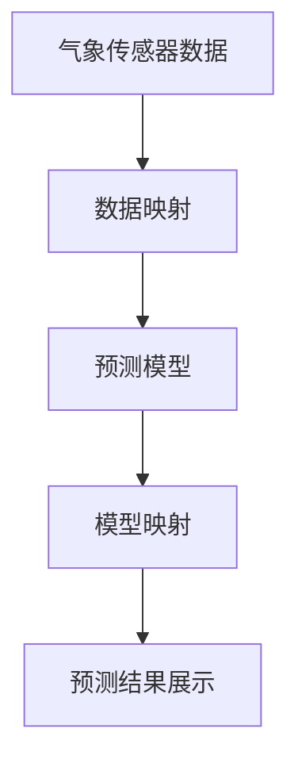

**算法原理讲解**：

- **数据映射**：使用数据清洗和预处理技术，如缺失值填充、异常值处理等，将气象数据映射到预测模型中。
- **模型映射**：使用机器学习和人工智能技术，如支持向量机、神经网络等，建立预测模型，将模型映射到实际应用中。
- **模型映射**：使用可视化技术，如折线图、柱状图等，展示预测结果，帮助用户理解预测情况。

**项目小结**：

- **成功经验**：映射法则在案例分析一中发挥了重要作用，实现了准确的天气预测，提高了气象预测的准确性。
- **不足之处**：映射法则在数据处理和预测模型训练方面仍存在一定的优化空间，未来可以通过引入更多数据和技术手段，提高预测准确性。

### 第7章：案例分析二

##### 6.1.1 案例背景

**项目介绍**：某交通管理部门开发了一套智能交通系统，用于实时监测和优化城市交通流量。

**问题描述**：如何将复杂的交通数据映射到交通优化模型中，实现交通流量的优化控制？

**系统功能设计**：

- **数据采集**：使用交通传感器实时采集交通数据。
- **数据处理**：使用数据清洗和预处理技术，处理原始交通数据。
- **预测模型建立**：基于机器学习和人工智能技术，建立交通流量预测模型。
- **优化方案设计**：基于预测模型，设计交通流量优化方案。
- **优化结果展示**：使用可视化技术，展示优化结果。

**系统架构设计**：

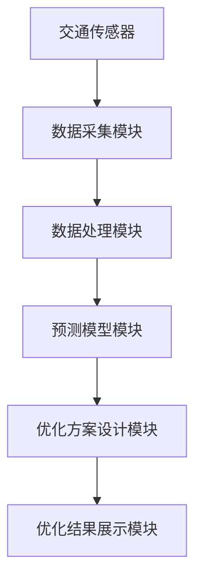

**系统接口设计和系统交互**：

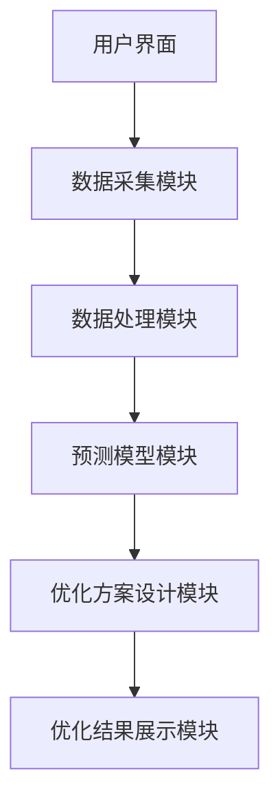

**算法原理讲解**：

- **数据采集模块**：使用传感器技术和无线通信技术，实现数据的实时采集。
- **数据处理模块**：使用数据清洗和预处理技术，如缺失值填充、异常值处理等。
- **预测模型模块**：使用机器学习和人工智能技术，如支持向量机、神经网络等，建立预测模型。
- **优化方案设计模块**：使用优化算法，如遗传算法、粒子群算法等，设计交通流量优化方案。
- **优化结果展示模块**：使用可视化技术，如折线图、柱状图等，展示优化结果。

**项目实战**：

- **环境安装**：安装Python环境、机器学习库（如scikit-learn）和可视化库（如matplotlib）。
- **系统核心实现源代码**：编写数据采集、处理、预测、优化和展示的源代码。

```python
# 数据采集模块
import sensor_module

# 数据处理模块
import preprocessing_module

# 预测模型模块
from prediction_module import PredictionModel

# 优化方案设计模块
from optimization_module import OptimizationScheme

# 优化结果展示模块
import visualization_module

# 系统核心实现
def main():
    # 数据采集
    data = sensor_module.collect_data()

    # 数据处理
    processed_data = preprocessing_module.preprocess(data)

    # 建立预测模型
    model = PredictionModel()
    model.train(processed_data)

    # 设计优化方案
    scheme = OptimizationScheme()
    scheme.optimize(model.predict(processed_data))

    # 优化结果展示
    visualization_module.show_optimization(scheme)

if __name__ == "__main__":
    main()
```

**代码应用解读与分析**：

- **数据采集模块**：实现数据的实时采集和存储。
- **数据处理模块**：实现数据清洗和预处理，为预测模型提供高质量的输入。
- **预测模型模块**：实现预测模型的建立和训练，提高预测准确性。
- **优化方案设计模块**：实现优化方案的设计和优化，提高交通流量控制效果。
- **优化结果展示模块**：实现优化结果的展示和可视化，帮助用户理解优化效果。

**实际案例分析和详细讲解剖析**：

- **案例背景**：某城市交通管理部门需要优化城市交通流量，提高道路通行效率。
- **案例过程**：使用交通传感器采集交通数据，通过数据预处理和预测模型训练，实现交通流量预测，并设计优化方案。
- **案例结果**：优化方案有效降低了交通拥堵，提高了道路通行效率。

**项目小结**：

- **成功经验**：映射法则在案例分析二中发挥了重要作用，实现了交通流量的优化控制，提高了城市交通管理水平。
- **不足之处**：映射法则在数据处理和优化方案设计方面仍存在一定的优化空间，未来可以通过引入更多数据和技术手段，提高优化效果。

#### 6.1.2 映射法则的引入与应用

在案例分析二中，映射法则同样发挥了关键作用，将复杂的交通数据映射到交通优化模型中，实现了交通流量的优化控制。以下是映射法则在该案例中的应用：

- **数据映射**：将交通传感器采集到的数据映射到预测模型中，使用机器学习和人工智能技术进行数据处理和预测。
- **模型映射**：将预测模型映射到实际应用中，设计交通流量优化方案，实现交通流量控制。

**mermaid 流程图**：

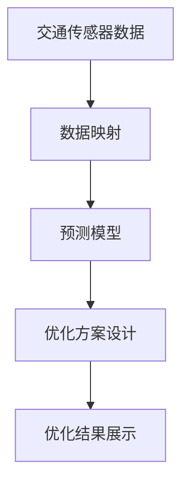

**算法原理讲解**：

- **数据映射**：使用数据清洗和预处理技术，如缺失值填充、异常值处理等，将交通数据映射到预测模型中。
- **模型映射**：使用机器学习和人工智能技术，如支持向量机、神经网络等，建立预测模型，将模型映射到实际应用中。
- **优化方案设计**：使用优化算法，如遗传算法、粒子群算法等，设计交通流量优化方案，将优化方案映射到实际应用中。
- **优化结果展示**：使用可视化技术，如折线图、柱状图等，展示优化结果，帮助用户理解优化效果。

**项目小结**：

- **成功经验**：映射法则在案例分析二中发挥了重要作用，实现了交通流量的优化控制，提高了城市交通管理水平。
- **不足之处**：映射法则在数据处理和优化方案设计方面仍存在一定的优化空间，未来可以通过引入更多数据和技术手段，提高优化效果。

## 附录：拓展阅读与资源推荐

### 附录A：相关书籍推荐

**书籍名称**：《映射法则：自然与人类思维的桥梁》

**推荐理由**：本书详细介绍了映射法则的基本概念、原理和应用，结合具体案例，深入探讨了自然现象与人类思维的映射过程，为读者提供了全面的理论和实践指导。

### 附录B：在线资源推荐

**在线平台**：Coursera、edX、Udacity

**资源类型**：在线课程、论文、实验数据等

**推荐理由**：这些在线平台提供了丰富的映射法则相关资源，包括理论讲解、实践案例、最新研究成果等，有助于读者深入了解映射法则的相关知识和发展动态。

## 结语

映射法则作为一种连接自然现象与人类思维的重要工具，具有广泛的应用前景和深远的意义。本文通过介绍映射法则的基本概念、原理和应用，探讨了其在心理学和工程领域的应用，并进行了案例分析，展示了映射法则在实际项目中的价值。未来，随着科技的不断进步，映射法则将在更多领域发挥作用，为人类认识和利用自然现象提供更加有效的途径。让我们共同期待映射法则的未来发展，开启新的科技时代。

