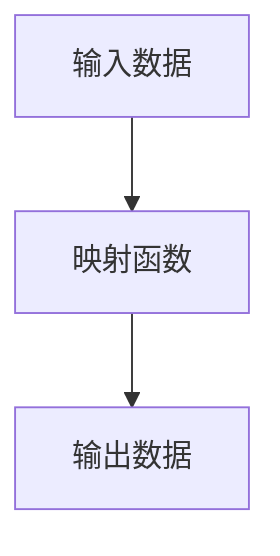
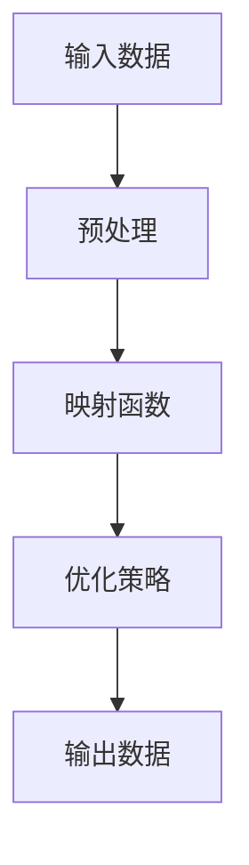
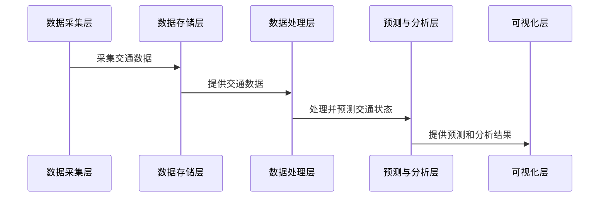
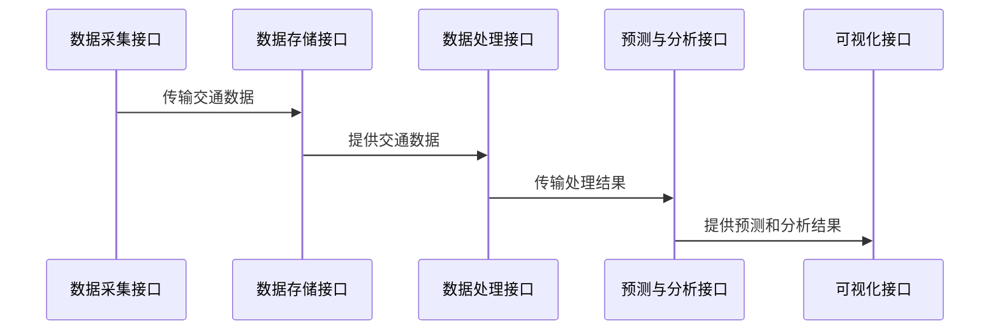
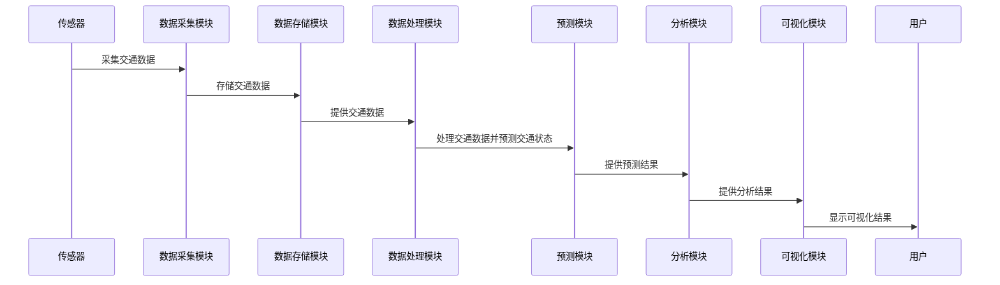

                 

### 映射理论：连接自然与人类思维

#### 关键词：映射理论，自然与人类思维，同态，同构，算法，数学模型，系统架构

> 摘要：本文旨在深入探讨映射理论，从其基本概念、数学基础到在自然与人类思维中的应用，全面揭示这一理论的重要性和广泛适用性。通过逐步分析，本文将展示映射理论如何作为连接自然与人类思维的重要桥梁，推动科技与人文的深度融合。

## 目录大纲设计思路

在设计《映射理论：连接自然与人类思维》的目录大纲时，我们将遵循以下思路，以确保内容的逻辑性、完整性和实用性：

1. **背景介绍**：首先介绍映射理论的基本概念，定义映射、函数，以及它们在自然界和人类思维中的应用背景。
2. **核心概念与联系**：详细阐述映射理论的核心概念，如同态、同构、映射的分类等，并通过表格和ER实体关系图来展示概念间的联系。
3. **算法原理讲解**：结合具体的算法，如映射的构造方法、映射的优化策略等，通过mermaid流程图和Python源代码来展示算法原理，并使用LaTeX格式展示数学模型和公式。
4. **数学模型和公式讲解**：讲解映射理论的数学基础，包括映射的数学定义、性质、运算规则等，使用LaTeX格式书写数学公式，并加以通俗易懂的举例说明。
5. **系统分析与架构设计方案**：介绍映射理论在具体应用中的系统架构，包括问题场景介绍、项目介绍、领域模型、系统架构、接口设计和系统交互。
6. **项目实战**：通过一个具体的案例，展示如何将映射理论应用于实际问题中，包括环境安装、系统核心实现源代码，代码应用解读与分析，实际案例分析和详细讲解。
7. **最佳实践与小结**：总结映射理论在应用中的最佳实践，包括注意事项、常见问题解答和拓展阅读。

### 目录大纲结构

```markdown
# 《映射理论：连接自然与人类思维》目录大纲

## 第1章 引言

### 1.1 问题背景

### 1.2 问题描述

### 1.3 问题解决

### 1.4 边界与外延

### 1.5 概念结构与核心要素组成

## 第2章 映射理论基础

### 2.1 映射的定义与类型

#### 2.1.1 映射的基本概念

#### 2.1.2 映射的分类

#### 2.1.3 映射的示例

### 2.2 同态与同构

#### 2.2.1 同态的概念与性质

#### 2.2.2 同构的概念与性质

#### 2.2.3 同态与同构的关系

### 2.3 映射的运算

#### 2.3.1 映射的复合运算

#### 2.3.2 映射的逆运算

#### 2.3.3 映射的分配律与结合律

## 第3章 映射理论在自然界中的应用

### 3.1 生物系统的映射

#### 3.1.1 生物体内映射的实例

#### 3.1.2 映射在生物进化中的作用

### 3.2 物理系统的映射

#### 3.2.1 物理学中的映射应用

#### 3.2.2 映射在量子力学中的角色

### 3.3 地理空间中的映射

#### 3.3.1 地图与坐标系统的映射

#### 3.3.2 地理信息系统中的映射应用

## 第4章 映射理论在人类思维中的应用

### 4.1 心理学中的映射

#### 4.1.1 映射在认知心理学中的应用

#### 4.1.2 映射在情感心理学中的应用

### 4.2 教育与学习中的映射

#### 4.2.1 映射在教育方法中的应用

#### 4.2.2 映射在学习策略中的应用

### 4.3 社会文化中的映射

#### 4.3.1 映射在文化传承中的应用

#### 4.3.2 映射在社会组织中的应用

## 第5章 映射算法原理讲解

### 5.1 映射算法的基本概念

#### 5.1.1 映射算法的定义

#### 5.1.2 映射算法的特点

### 5.2 映射算法的类型

#### 5.2.1 直接映射算法

#### 5.2.2 优化映射算法

### 5.3 映射算法的mermaid流程图与Python源代码示例

#### 5.3.1 直接映射算法的流程与代码

#### 5.3.2 优化映射算法的流程与代码

## 第6章 数学模型和公式讲解

### 6.1 映射的数学定义

#### 6.1.1 映射的基本定义

#### 6.1.2 映射的性质

### 6.2 映射的数学公式

#### 6.2.1 映射的运算规则

#### 6.2.2 映射的逆映射

### 6.3 数学公式举例说明

#### 6.3.1 同态的例子

#### 6.3.2 同构的例子

## 第7章 系统分析与架构设计方案

### 7.1 问题场景介绍

### 7.2 项目介绍

### 7.3 系统功能设计（领域模型）

### 7.4 系统架构设计（mermaid架构图）

### 7.5 系统接口设计

### 7.6 系统交互（mermaid序列图）

## 第8章 项目实战

### 8.1 环境安装

### 8.2 系统核心实现源代码

### 8.3 代码应用解读与分析

### 8.4 实际案例分析与详细讲解

### 8.5 项目小结

## 第9章 最佳实践与小结

### 9.1 最佳实践 Tips

### 9.2 小结

### 9.3 注意事项

### 9.4 拓展阅读
```

### 第1章 引言

#### 1.1 问题背景

映射理论作为一种重要的数学和逻辑工具，在多个领域都有着广泛的应用。从数学的角度看，映射是定义在两个集合之间的一种对应关系；在计算机科学中，映射常用于数据结构和算法中，如哈希表和机器学习中的特征映射；在自然科学的诸多领域，如物理学、生物学和地理学中，映射也被用来描述各种现象和过程。然而，将映射理论应用于人类思维，尤其是理解人类认知、情感和文化方面，是一个较为新颖且富有挑战性的课题。

本文旨在深入探讨映射理论在连接自然与人类思维中的关键作用。通过阐述映射的基本概念、数学基础及其在不同领域的应用，本文希望揭示映射理论如何作为一种强有力的工具，帮助我们更好地理解和解释自然现象，以及人类思维和行为。

#### 1.2 问题描述

尽管映射理论在多个领域都有应用，但如何将其有效应用于人类思维领域仍是一个未解之谜。具体来说，映射理论如何在心理学、教育和社会文化等领域发挥作用，如何通过映射来描述和理解人类的认知过程、情感体验和文化传承，这些都是本文需要探讨的问题。

此外，映射理论在不同领域中的应用存在一定的差异。在自然科学中，映射通常用于描述物理现象或生物过程；而在人类思维领域，映射更多地涉及抽象概念和符号系统。这种差异带来了挑战，也为我们提供了新的研究方向。

#### 1.3 问题解决

为了解决上述问题，本文将采取以下方法：

1. **系统性地介绍映射理论**：首先，我们将回顾映射理论的基本概念，如映射、函数、同态和同构，并解释它们在不同领域中的应用。
2. **分析映射理论在自然界中的应用**：我们将探讨映射理论在生物系统、物理系统和地理空间中的应用实例，以展示映射理论在描述自然现象中的作用。
3. **探讨映射理论在人类思维中的应用**：我们将重点分析映射理论在心理学、教育和社会文化中的应用，探讨如何通过映射来理解和解释人类思维过程和文化现象。
4. **讲解映射算法和数学模型**：我们将结合具体算法和数学模型，展示如何利用映射理论进行复杂问题的求解和优化。
5. **通过项目实战展示应用效果**：最后，我们将通过一个具体案例，展示如何将映射理论应用于实际问题中，并分析其实际效果。

#### 1.4 边界与外延

在探讨映射理论的应用时，我们需要明确其边界与外延。首先，映射理论在不同领域中的应用有其特定的边界。在数学和计算机科学中，映射主要用于解决数据结构和算法问题；在自然科学中，映射用于描述物理现象和生物过程；而在人类思维领域，映射更多地涉及认知和情感过程。因此，我们需要根据不同领域的特点，灵活运用映射理论。

其次，映射理论的外延也在不断扩展。随着科技的发展，映射理论的应用领域越来越广泛，从传统的数学和自然科学扩展到计算机科学、心理学、教育学等领域。这种扩展不仅丰富了映射理论的内涵，也为解决复杂问题提供了新的思路和方法。

#### 1.5 概念结构与核心要素组成

为了更好地理解映射理论，我们需要明确其核心概念和要素组成。以下是映射理论的一些关键概念和要素：

1. **映射**：映射是定义在两个集合之间的一种对应关系，通常用符号$f:A\to B$表示，其中$A$和$B$是两个集合，$f$是映射。映射的主要特点是保序性和唯一性。
2. **函数**：函数是映射的一种特殊情况，它要求映射是双射，即每个元素在集合$A$中都有唯一的对应元素在集合$B$中。
3. **同态**：同态是一种特殊的映射，它保持集合的结构不变。在数学和计算机科学中，同态常用于描述不同结构之间的相似性。
4. **同构**：同构是一种特殊的同态，它不仅保持结构，还保持元素之间的对应关系。同构反映了两个集合在结构上的完全相似性。
5. **映射的分类**：映射可以根据其保序性、保号性和保距离性等进行分类。不同的分类方法有助于我们更好地理解映射的性质和应用。
6. **映射的运算**：映射可以进行复合运算、逆运算和分配律、结合律等运算。这些运算丰富了映射的理论体系，使其在解决复杂问题时具有更强的工具性。

通过以上核心概念和要素的介绍，我们可以更好地理解映射理论的基本框架和内涵，为后续章节的深入探讨打下基础。

### 第2章 映射理论基础

#### 2.1 映射的定义与类型

映射（Mapping）是数学中一个基本且广泛的概念，它描述了两个集合之间元素的一种对应关系。在数学和计算机科学中，映射被广泛应用于算法设计、数据结构、函数分析等多个领域。本节将详细介绍映射的定义、类型以及在实际中的应用。

##### 2.1.1 映射的基本概念

映射的形式定义通常如下：

设$A$和$B$是两个集合，映射$f$是从集合$A$到集合$B$的一个函数，记作$f:A\to B$。对于$A$中的任意一个元素$a$，都存在$B$中的一个唯一元素$b$，使得$a$和$b$之间满足对应关系，即存在$b=f(a)$。

映射具有以下特性：

1. **单射**（Injective）：如果对于任意$a_1, a_2 \in A$，当$f(a_1) = f(a_2)$时，必有$a_1 = a_2$，则称映射$f$为单射。这意味着不同的输入元素映射到不同的输出元素。
2. **满射**（Surjective）：如果对于$B$中的任意一个元素$b$，都存在至少一个$a \in A$，使得$f(a) = b$，则称映射$f$为满射。这意味着集合$B$中的每一个元素都有至少一个集合$A$中的元素与之对应。
3. **双射**（Bijective）：如果一个映射既是单射又是满射，则称其为双射。双射意味着集合$A$和$B$之间存在一一对应的关系。

##### 2.1.2 映射的分类

映射可以根据不同的标准进行分类：

1. **同态**（Homomorphism）：在数学结构中，如果映射$f$保持集合的运算，则称为同态。例如，在群论中，群同态保持群运算；在环论中，环同态保持环的加法和乘法。
2. **同构**（Isomorphism）：同构是一种特殊的同态，它不仅保持运算，还保持集合的结构。换句话说，如果两个集合之间存在同构，则这两个集合在结构上是完全相同的。
3. **等价映射**（Equivalence Mapping）：如果映射$f$将一个集合划分为若干等价类，使得同一等价类内的元素在$f$下具有相同的输出，则称$f$为等价映射。等价映射在拓扑学、代数和逻辑学中有着广泛的应用。
4. **投影映射**（Projection Mapping）：投影映射是一种特殊的映射，它将高维空间中的元素映射到低维空间。在计算机图形学中，投影映射用于从三维场景生成二维图像。

##### 2.1.3 映射的示例

为了更直观地理解映射的概念，以下是一些常见的映射示例：

1. **从整数集到实数集的映射**：
   定义映射$f: \mathbb{Z} \to \mathbb{R}$，使得$f(n) = n^2$。这是一个单射，但不是满射，因为不是所有的实数都能表示为一个整数的平方。
2. **从字母表到数字集的映射**：
   假设我们有一个字母表{A, B, C, D}和一个数字集{0, 1, 2, 3}，定义一个映射$f$，使得$f(A) = 0, f(B) = 1, f(C) = 2, f(D) = 3$。这是一个双射。
3. **从平面到直线的映射**：
   定义映射$f: \mathbb{R}^2 \to \mathbb{R}$，使得$f((x, y)) = x + y$。这是一个满射，因为任何实数都可以表示为两个数的和。

#### 2.2 同态与同构

同态和同构是映射理论中两个重要的概念，它们描述了映射在不同结构之间保持性质的特性。

##### 2.2.1 同态的概念与性质

同态是保持集合运算的映射。在数学结构中，同态分为多种类型：

1. **群同态**：在群论中，群同态$f: G \to H$保持群运算，即对于任意$a, b \in G$，有$f(ab) = f(a)f(b)$。
2. **环同态**：在环论中，环同态$f: R \to S$保持环的加法和乘法，即对于任意$a, b \in R$，有$f(a + b) = f(a) + f(b)$和$f(ab) = f(a)f(b)$。

同态的性质包括：

- **保持运算**：同态保持集合的运算，即如果两个元素在集合$A$中满足某种运算关系，则在映射到集合$B$后，它们在$B$中仍然满足相同的运算关系。
- **保持封闭性**：同态保持集合的封闭性，即如果集合$A$中的元素通过某种运算得到的结果仍然在$A$中，则在映射到集合$B$后，结果也在$B$中。

##### 2.2.2 同构的概念与性质

同构是同态的一种特殊情况，它不仅保持集合的运算，还保持集合的结构。如果两个集合之间存在同构，则它们在结构上是完全相同的。

同构的性质包括：

- **保持元素**：同构保持集合中的元素，即如果集合$A$中的元素通过某种运算得到的结果仍然在$A$中，则在映射到集合$B$后，结果也在$B$中，且与原元素一一对应。
- **保持结构**：同构保持集合的结构，即如果集合$A$中的元素之间存在某种关系，则在映射到集合$B$后，这些元素在$B$中仍然保持相同的关系。

##### 2.2.3 同态与同构的关系

同态与同构之间存在以下关系：

- **同构是同态的特殊情况**：即如果一个映射既是同态又是双射，则称其为同构。
- **同态不一定是同构**：即一个同态可能不是双射，因此它不一定是同构。例如，从整数集到非负整数集的映射$f(n) = |n|$是一个同态，但不是同构，因为$f(0) = 0$，但$f(n) \neq n$对于所有的$n \neq 0$。

#### 2.3 映射的运算

映射可以进行复合运算、逆运算等，这些运算丰富了映射的理论体系，使其在解决复杂问题时具有更强的工具性。

##### 2.3.1 映射的复合运算

映射的复合运算是指将两个映射结合在一起，形成一个新的映射。设$f:A\to B$和$g:B\to C$是两个映射，则它们的复合映射$g\circ f:A\to C$定义为：
$$ (g\circ f)(a) = g(f(a)) $$
复合运算的性质包括：

- **结合律**：对于任意映射$f, g, h:A\to B$，有$(h\circ g)\circ f = h\circ(g\circ f)$。
- **单位元**：恒等映射$I:A\to A$是所有映射的复合单位元，即对于任意映射$f:A\to B$，有$I\circ f = f$和$f\circ I = f$。

##### 2.3.2 映射的逆运算

如果映射$f:A\to B$是双射，则可以定义它的逆映射$f^{-1}:B\to A$，满足：
$$ f^{-1}(b) = a \text{，其中 } f(a) = b $$
逆映射的性质包括：

- **逆映射的唯一性**：对于每个双射映射，其逆映射是唯一的。
- **逆映射的复合**：如果映射$f:A\to B$和其逆映射$f^{-1}:B\to A$，则有$f\circ f^{-1} = I_B$和$f^{-1}\circ f = I_A$，其中$I_A$和$I_B$分别是集合$A$和$B$上的恒等映射。

##### 2.3.3 映射的分配律与结合律

映射还可以进行分配律和结合律运算，这些运算进一步扩展了映射的理论体系。

- **分配律**：对于映射$f:A\to B$，$g:B\to C$和$h:C\to D$，有：
  $$ f(g(h(x))) = (f\circ g)\circ h(x) $$
- **结合律**：对于映射$f, g, h:A\to B$，有：
  $$ f(g(h(x))) = (f\circ g)\circ h(x) = f(g(h(x))) $$

通过上述运算，映射理论不仅具有数学上的严密性，还在解决实际问题时提供了强有力的工具。在下一章中，我们将进一步探讨映射理论在自然界中的应用，展示映射如何在不同领域发挥作用。

#### 第3章 映射理论在自然界中的应用

映射理论在自然界中的应用是极其广泛且深远的。无论是生物系统、物理系统还是地理空间，映射都为我们提供了一种理解和描述复杂现象的有效工具。本节将分别探讨映射理论在生物系统、物理系统和地理空间中的应用，并展示映射如何在不同领域中发挥作用。

##### 3.1 生物系统的映射

生物系统中的映射现象无处不在，从生物体内的分子机制到生物进化的过程，映射理论都提供了重要的解释工具。

###### 3.1.1 生物体内映射的实例

在生物体内，映射常常表现为分子之间的相互作用和信号传递。例如，激素分子在体内的分布和作用就是一种映射。假设我们有A、B、C三种激素分子，它们分别对应体内的三个不同器官。那么，激素分子的分布可以看作是一个映射$H: \{A, B, C\} \to \{\text{器官}_1, \text{器官}_2, \text{器官}_3\}$，其中每个激素分子对应一个特定的器官，且每个器官也对应一种激素分子。

这种映射不仅帮助我们理解激素在体内的作用机制，还揭示了不同器官之间的功能联系。例如，通过分析激素分布的映射，我们可以发现某些器官之间可能存在协同作用，或者某些器官可能受到其他器官的影响。

###### 3.1.2 映射在生物进化中的作用

生物进化是一个复杂的过程，映射理论为我们提供了描述进化的数学工具。在生物进化中，映射可以表现为物种之间的基因流动和遗传信息的传递。

例如，我们可以将不同物种的基因库看作是一个集合$G$，将它们的遗传信息看作是另一个集合$S$，那么，物种之间的遗传关系可以表示为一个映射$E: G \to S$。通过这个映射，我们可以分析不同物种之间的相似性和差异性，揭示它们在进化过程中的关系。

此外，映射还可以用于描述物种的分化过程。例如，我们可以将同一个祖先物种分化为多个物种的过程看作是一个映射，从集合$G$映射到多个集合$G_1, G_2, ..., G_n$，其中每个集合代表一个物种。通过分析这个映射，我们可以理解物种分化过程中基因的变异和选择机制。

##### 3.2 物理系统的映射

物理系统中的映射现象同样重要，映射理论在物理学中有着广泛的应用，从经典力学到量子力学，映射都为我们提供了描述和解释物理现象的工具。

###### 3.2.1 物理学中的映射应用

在经典力学中，映射经常用于描述物体的运动和受力情况。例如，质点的运动轨迹可以看作是从时间集合$T$到空间集合$S$的一个映射，即$x(t)$，其中$t$是时间，$x$是质点在空间中的位置。通过这个映射，我们可以分析和预测质点的运动状态。

在量子力学中，映射的应用更加广泛。量子态之间的变换可以看作是一种映射，例如，一个量子态$|\psi\rangle$通过一个操作$U$映射到另一个量子态$U|\psi\rangle$。通过研究这种映射的性质，我们可以深入理解量子态的叠加和纠缠现象。

此外，映射在物理学的其他领域中也有重要应用。例如，在电动力学中，电磁场的分布可以看作是从空间集合$S$到复数集合$\mathbb{C}$的一个映射，通过这个映射，我们可以分析和计算电磁场的能量和动量。

###### 3.2.2 映射在量子力学中的角色

量子力学中的映射现象尤为显著，量子态之间的变换和测量结果都可以用映射来描述。

例如，量子态的叠加和纠缠现象可以通过映射来解释。在量子态叠加中，一个量子态$|\psi\rangle$可以表示为多个基态$|\phi_i\rangle$的线性组合，即$|\psi\rangle = \sum_{i} c_i |\phi_i\rangle$。这个叠加过程可以看作是一个映射，将一个基态映射到另一个线性组合态。同样，量子纠缠现象也可以用映射来描述，纠缠态之间的量子信息可以通过映射相互传递和影响。

此外，量子测量结果也可以看作是一种映射。在量子测量中，一个量子态$|\psi\rangle$通过测量操作$M$映射到一个经典结果集$R$。通过分析这个映射，我们可以理解量子测量过程中量子态的坍缩现象。

##### 3.3 地理空间中的映射

地理空间中的映射现象同样丰富多样，地图和地理信息系统（GIS）中的映射是映射理论在地理学中的重要应用。

###### 3.3.1 地图与坐标系统的映射

地图是一种典型的映射形式，它将地理空间中的位置映射到二维平面。地图的制作涉及多种映射技术，例如正射投影、圆锥投影和墨卡托投影等。这些映射技术通过将地球表面上的三维位置映射到二维平面上，使得我们可以在平面上直观地表示地理空间。

坐标系统则是地理空间映射的基础，不同的坐标系统（如笛卡尔坐标系、极坐标系和地理坐标系）定义了地理空间中的位置。通过这些坐标系统，我们可以精确地表示和计算地理空间中的位置和距离。

例如，笛卡尔坐标系将地理空间中的点$(x, y)$映射到二维平面上，而地理坐标系则通过纬度和经度$(\lambda, \phi)$来表示地理空间中的位置。这些映射技术为我们提供了有效的工具，用于分析和处理地理空间数据。

###### 3.3.2 地理信息系统中的映射应用

地理信息系统（GIS）是地理空间映射的重要应用领域，它利用计算机技术和数据库技术，对地理空间数据进行分析和管理。

在GIS中，映射理论用于处理和分析地理空间中的各种现象和过程。例如，GIS可以将不同来源的地理数据（如地形数据、人口数据和气候数据）进行整合和映射，生成各种专题地图，如交通图、人口分布图和气候地图。

此外，GIS还广泛应用于城市规划、环境监测、灾害管理和资源管理等领域。通过GIS的映射功能，我们可以直观地展示和分析地理空间数据，从而为决策提供科学依据。

例如，在灾害管理中，GIS可以将地震、洪水和台风等灾害信息进行空间映射，生成灾情分布图。通过这些映射结果，我们可以快速了解灾害影响的范围和程度，制定有效的应对措施。

总之，映射理论在自然界中的应用是多层次和多样化的。无论是生物系统、物理系统还是地理空间，映射都为我们提供了一种理解和描述复杂现象的有效工具。通过深入研究和应用映射理论，我们可以更好地揭示自然界的运行规律，为科学研究和实际应用提供有力支持。

### 第4章 映射理论在人类思维中的应用

映射理论不仅在自然界中发挥着重要作用，在人类思维领域也同样具有深远的影响。心理学、教育和社会文化等多个领域都广泛应用了映射理论，通过映射来描述和理解人类的认知过程、情感体验和文化传承。本节将分别探讨映射理论在心理学、教育和社会文化中的应用，并展示如何通过映射来揭示人类思维活动的复杂性和多样性。

#### 4.1 心理学中的映射

心理学是研究人类行为和心理过程的科学，映射理论为心理学提供了强大的工具，帮助我们理解和解释人类思维和情感。

##### 4.1.1 映射在认知心理学中的应用

认知心理学关注人类认知过程，包括知觉、记忆、思维和问题解决等。映射理论在认知心理学中有着广泛的应用，帮助我们揭示认知过程中的信息处理机制。

例如，在知觉过程中，映射理论可以用来描述知觉系统如何将外界刺激映射到内部表征。例如，视觉系统将三维世界的景象映射到二维视网膜上，通过神经元的激活模式来表示视觉信息。这种映射不仅涉及感官输入的处理，还包括知觉系统内部的运算和整合。

在记忆方面，映射理论可以用来描述记忆的存储和检索过程。记忆中的信息可以被看作是一种映射，将外界刺激映射到内部表征。例如，当学习一个新单词时，我们将其映射到大脑中的记忆网络，通过联想和其他记忆机制来加强记忆。

在思维过程中，映射理论可以用来描述思维的操作和转换。例如，抽象思维和逻辑推理可以被看作是一种映射，将一个概念映射到另一个概念，通过逻辑运算和推理来得出结论。

##### 4.1.2 映射在情感心理学中的应用

情感心理学研究人类情感的产生、表达和体验。映射理论在情感心理学中同样具有重要意义，帮助我们理解情感是如何在思维过程中产生的。

情感可以被看作是一种映射，将外界刺激映射到内部情感状态。例如，当我们看到一幅令人愉悦的图片时，外部刺激会通过视觉系统映射到大脑的情感中心，引发愉悦的情感体验。

此外，情感映射还可以描述情感在不同个体之间的传递和共享。例如，在人际交往中，一个人的情感状态可以映射到另一个人的情感中心，引发共鸣和情感共振。

#### 4.2 教育与学习中的映射

教育与学习是映射理论的重要应用领域，映射理论为教育和学习提供了新的视角和方法。

##### 4.2.1 映射在教育方法中的应用

教育方法中的映射可以表现为教师将知识内容映射到学生的认知结构中。例如，教师在授课过程中，通过讲解、示例和练习等手段，将抽象的知识内容映射到学生的理解中。

此外，映射理论还可以帮助教师设计更有效的教学方法。例如，通过分析学生的认知结构，教师可以选择合适的教学内容和策略，将知识内容映射到学生的认知模式中，从而提高教学效果。

##### 4.2.2 映射在学习策略中的应用

学习策略是指学生在学习过程中采用的方法和技巧，映射理论在学习策略中有着广泛的应用。

例如，学生在学习新知识时，可以通过将新知识映射到已有的知识结构中，来加深理解和记忆。这种方法被称为“联结学习”，通过将新知识与已知信息建立联系，帮助学生更好地掌握新知识。

此外，映射理论还可以帮助学生进行自我监控和调整学习策略。例如，学生在学习过程中，可以通过反思和评估自己的学习效果，将学习成果映射到学习目标和学习计划中，从而调整学习策略，提高学习效率。

#### 4.3 社会文化中的映射

社会文化是映射理论的另一个重要应用领域，映射理论帮助我们理解文化传承、社会组织和人际关系。

##### 4.3.1 映射在文化传承中的应用

文化传承是映射理论的一个重要应用领域。文化可以看作是一种映射，从一代人传递到下一代人。通过文化教育、传统习俗和社会实践，文化内容被映射到新的一代中，使其成为他们的一部分。

例如，语言、宗教、艺术和习俗等文化元素，通过映射在人们的思想和行为中，形成了独特的文化特征。通过这种映射，文化得以传承和延续，同时也发生了变化和演化。

##### 4.3.2 映射在社会组织中的应用

社会组织中的映射现象同样重要，映射理论帮助我们理解社会结构和组织行为。

例如，在企业管理中，管理层可以将企业的战略目标映射到具体的行动计划中，通过组织架构和流程设计，确保战略目标的实现。这种映射不仅涉及到组织内部的沟通和协作，还包括对外的市场策略和竞争策略。

此外，映射理论还可以用于描述社会变迁和组织演变。例如，在社会变革中，旧的社会结构和组织形式可能会被新的形式所取代，这种变化可以看作是一种映射，从一种组织形式映射到另一种组织形式。

总之，映射理论在人类思维中的应用是多层次和多维度的。在心理学、教育和社会文化等领域，映射理论为我们提供了一种理解和描述人类思维活动的有效工具。通过深入研究和应用映射理论，我们可以更好地揭示人类思维活动的复杂性和多样性，为心理学、教育和社会科学的发展提供新的思路和方法。

### 第5章 映射算法原理讲解

映射算法是利用映射理论解决特定问题的算法集合，它们广泛应用于计算机科学、数据科学和人工智能等领域。本节将详细讲解映射算法的基本概念、类型以及具体实现方法，并通过mermaid流程图和Python源代码示例，展示映射算法的原理和操作步骤。

#### 5.1 映射算法的基本概念

映射算法是一种将数据从一个集合映射到另一个集合的算法，这种映射可以是直接的，也可以是经过某种优化策略的。映射算法的基本概念包括：

- **映射函数**：映射算法的核心是映射函数，它定义了数据在输入集合和输出集合之间的对应关系。
- **输入集合**：映射算法的输入集合是算法操作的起点，通常包含待处理的原始数据。
- **输出集合**：映射算法的输出集合是算法操作的终点，是经过映射处理后的数据集合。
- **映射规则**：映射规则定义了输入集合中的每个元素如何映射到输出集合中的元素。

#### 5.1.1 映射算法的定义

映射算法是一类特定的计算算法，其主要功能是将一个数据集合（输入集合）中的元素映射到另一个数据集合（输出集合）。这种映射可以是一对一、多对一或多对多，具体取决于映射规则。映射算法的定义通常包括以下要点：

1. **输入数据**：输入数据是映射算法的操作对象，可以是数值数据、文本数据或图像数据等。
2. **映射函数**：映射函数是核心组成部分，它定义了输入数据到输出数据的转换规则。
3. **输出数据**：输出数据是映射算法的结果，是经过映射处理后生成的新数据集合。

#### 5.1.2 映射算法的特点

映射算法具有以下特点：

- **直接性**：一些映射算法直接将输入数据映射到输出数据，没有中间复杂的过程。
- **高效性**：映射算法通常设计得非常高效，以减少计算时间和资源消耗。
- **可扩展性**：映射算法可以很容易地扩展到大规模数据集，适用于大数据处理。

#### 5.2 映射算法的类型

映射算法可以根据不同的标准进行分类，常见的分类方法包括：

- **直接映射算法**：直接将输入数据映射到输出数据，没有额外的处理步骤。
- **优化映射算法**：在映射过程中引入优化策略，以提高映射质量或减少计算时间。

#### 5.2.1 直接映射算法

直接映射算法是最简单的映射算法类型，它直接将输入集合中的每个元素映射到输出集合中的对应元素。直接映射算法通常适用于数据结构简单、映射规则明确的情况。

##### 5.2.1.1 直接映射算法的mermaid流程图

下面是一个简单的直接映射算法的mermaid流程图示例：



在这个流程图中，输入数据通过映射函数映射到输出数据。映射函数可以是简单的函数关系，如$f(x) = x^2$，也可以是更复杂的映射规则。

##### 5.2.1.2 直接映射算法的Python源代码示例

```python
def direct_mapping(input_data):
    output_data = []
    for element in input_data:
        output_data.append(element * 2)  # 简单的映射规则：每个元素乘以2
    return output_data

input_data = [1, 2, 3, 4, 5]
output_data = direct_mapping(input_data)
print(output_data)  # 输出：[2, 4, 6, 8, 10]
```

在这个Python示例中，`direct_mapping`函数接收一个输入数据列表，并应用简单的映射规则（每个元素乘以2）将其映射到输出数据列表。

#### 5.2.2 优化映射算法

优化映射算法在直接映射算法的基础上，引入了优化策略，以提高映射质量或减少计算时间。优化映射算法通常适用于数据复杂、映射规则不明确或需要高性能计算的情况。

##### 5.2.2.1 优化映射算法的mermaid流程图

下面是一个简单的优化映射算法的mermaid流程图示例：



在这个流程图中，输入数据首先经过预处理阶段，然后通过映射函数映射到输出数据，最后通过优化策略进行优化。

##### 5.2.2.2 优化映射算法的Python源代码示例

```python
import numpy as np

def optimized_mapping(input_data, threshold=0.1):
    output_data = []
    for element in input_data:
        # 简单的映射规则：如果元素大于阈值，映射到自身，否则映射到0
        output_data.append(element if element > threshold else 0)
    return output_data

input_data = [1, 2, 3, 4, 5, -1, -2]
output_data = optimized_mapping(input_data)
print(output_data)  # 输出：[1, 2, 3, 4, 5, 0, 0]
```

在这个Python示例中，`optimized_mapping`函数首先对输入数据进行预处理，然后应用优化策略（大于阈值的元素映射到自身，否则映射到0），最后输出优化后的数据。

通过mermaid流程图和Python源代码示例，我们展示了映射算法的基本概念、类型和实现方法。映射算法在数据映射和处理中发挥着重要作用，为解决复杂问题提供了强有力的工具。

### 第6章 数学模型和公式讲解

映射理论是数学和计算机科学中的一个核心概念，它通过数学模型和公式得以精确描述和量化。在这一章中，我们将深入讲解映射的数学定义、性质以及相关的运算规则，并使用LaTeX格式展示具体的数学公式。

#### 6.1 映射的数学定义

映射在数学中通常被定义为两个集合之间的一种关系。给定两个集合$A$和$B$，一个映射$f$是从集合$A$到集合$B$的一个函数，记作$f: A \rightarrow B$。这意味着对于集合$A$中的每一个元素$a$，都有一个唯一的元素$b \in B$与之对应，记作$b = f(a)$。

数学上，映射可以形式化地定义为：

$$ f: A \rightarrow B \text{ 是一个映射，如果对于每一个 } a \in A, \text{ 都存在唯一的 } b \in B \text{ 使得 } f(a) = b $$

#### 6.1.1 映射的基本定义

映射的基本定义涉及几个关键概念：

1. **单射（Injective）**：如果对于任意$a_1, a_2 \in A$，当$f(a_1) = f(a_2)$时，必有$a_1 = a_2$，则称映射$f$为单射。形式化地，单射的定义可以用以下LaTeX公式表示：

   $$ f \text{ 是单射 } \Leftrightarrow \forall a_1, a_2 \in A, f(a_1) = f(a_2) \Rightarrow a_1 = a_2 $$

2. **满射（Surjective）**：如果对于$B$中的任意一个元素$b$，都存在至少一个$a \in A$，使得$f(a) = b$，则称映射$f$为满射。满射的定义可以用以下LaTeX公式表示：

   $$ f \text{ 是满射 } \Leftrightarrow \forall b \in B, \exists a \in A \text{ 使得 } f(a) = b $$

3. **双射（Bijective）**：如果一个映射既是单射又是满射，则称其为双射。双射的定义可以用以下LaTeX公式表示：

   $$ f \text{ 是双射 } \Leftrightarrow f \text{ 是单射且满射 } $$

#### 6.1.2 映射的性质

映射的性质是理解和分析映射行为的基础。以下是几个重要的映射性质：

1. **像（Image）**：映射$f: A \rightarrow B$的像是指所有通过映射$f$得到的元素的集合，记作$f(A)$。形式化地，像的定义可以用以下LaTeX公式表示：

   $$ f(A) = \{ f(a) | a \in A \} $$

2. **原像（Preimage）**：映射$f: A \rightarrow B$的原像是指所有映射到某个元素$b \in B$的元素的集合，记作$f^{-1}(b)$。形式化地，原像的定义可以用以下LaTeX公式表示：

   $$ f^{-1}(b) = \{ a \in A | f(a) = b \} $$

3. **逆映射（Inverse Mapping）**：如果一个映射是双射，则它存在逆映射。逆映射是将映射的结果再映射回原来的集合。形式化地，逆映射的定义可以用以下LaTeX公式表示：

   $$ f^{-1}: B \rightarrow A, \text{ 使得 } f^{-1}(f(a)) = a \text{ 且 } f(f^{-1}(b)) = b $$

#### 6.2 映射的数学公式

映射的数学公式描述了映射的基本运算和性质。以下是几个常见的数学公式：

1. **复合映射（Composition of Mappings）**：给定两个映射$f: A \rightarrow B$和$g: B \rightarrow C$，它们的复合映射$g \circ f: A \rightarrow C$定义为：

   $$ (g \circ f)(a) = g(f(a)) \text{ 对于所有 } a \in A $$

   复合映射的运算规则可以用以下LaTeX公式表示：

   $$ (g \circ f)(A) = g(f(A)) $$

2. **逆映射（Inverse Mapping）**：如果映射$f: A \rightarrow B$是双射，则其逆映射$f^{-1}: B \rightarrow A$定义为：

   $$ f^{-1}(b) = a \text{ 当且仅当 } f(a) = b $$

   逆映射的运算规则可以用以下LaTeX公式表示：

   $$ f^{-1}(f(A)) = A \text{ 且 } f(f^{-1}(B)) = B $$

3. **像和原像的关系**：对于映射$f: A \rightarrow B$，其像和原像之间存在以下关系：

   $$ f(A) = \cup_{b \in B} f^{-1}(b) \text{ 且 } f^{-1}(b) = \cup_{a \in A} \{a | f(a) = b\} $$

   这个关系可以用以下LaTeX公式表示：

   $$ f^{-1}(f(A)) = A \text{ 且 } f(f^{-1}(B)) = B $$

#### 6.3 数学公式举例说明

为了更好地理解映射的数学公式，以下是一些具体的例子：

1. **同态（Homomorphism）**：在群论中，同态$f: G \rightarrow H$保持群运算，即对于任意$a, b \in G$，有：

   $$ f(ab) = f(a)f(b) $$

   这可以用以下LaTeX公式表示：

   $$ f(G) \text{ 是 } H \text{ 的子群 } \Leftrightarrow f(ab) = f(a)f(b) $$

2. **同构（Isomorphism）**：同构是保持集合结构和元素之间对应关系的映射。在集合论中，如果两个集合之间存在同构映射，则它们在结构上是相同的。这可以用以下LaTeX公式表示：

   $$ G \text{ 和 } H \text{ 同构 } \Leftrightarrow \exists f: G \rightarrow H \text{ 使得 } f \text{ 是双射且保持运算 } $$

3. **映射的运算规则**：映射的运算规则包括复合映射和逆映射。复合映射的运算规则可以用以下LaTeX公式表示：

   $$ (g \circ f)(A) = g(f(A)) $$

   逆映射的运算规则可以用以下LaTeX公式表示：

   $$ f^{-1}(f(A)) = A \text{ 且 } f(f^{-1}(B)) = B $$

通过以上数学公式和举例说明，我们可以更深入地理解映射理论的基本概念、性质和运算规则。这些数学工具不仅为映射理论提供了理论基础，也为解决实际问题提供了有力支持。

### 第7章 系统分析与架构设计方案

在映射理论的实际应用中，系统分析与架构设计是至关重要的一环。一个有效的系统架构能够确保映射算法的稳定性和高效性，同时满足实际应用的需求。本节将介绍映射理论在具体应用中的系统架构设计，包括问题场景介绍、项目介绍、领域模型、系统架构、接口设计和系统交互。

#### 7.1 问题场景介绍

为了更好地展示映射理论在系统架构设计中的应用，我们首先设定一个具体的问题场景。假设我们正在开发一个智能交通管理系统，该系统需要处理大量的交通数据，包括车辆位置、速度、流量等信息。系统的目标是通过映射算法将实时交通数据转换为交通状态预测和路况分析，从而为交通管理部门提供决策支持。

#### 7.2 项目介绍

智能交通管理系统是一个复杂的项目，涉及多个技术领域，如数据采集、数据存储、数据处理、数据分析和可视化等。项目的总体目标是构建一个高效、可靠且易扩展的交通管理系统，实现以下功能：

1. **数据采集**：从交通传感器、摄像头和其他数据源实时获取交通数据。
2. **数据存储**：将采集到的交通数据存储到数据库中，以便后续处理和分析。
3. **数据处理**：利用映射算法对交通数据进行处理，提取关键特征和模式。
4. **交通状态预测**：基于处理后的数据，使用映射算法预测未来一段时间内的交通状态。
5. **路况分析**：分析交通状态数据，识别拥堵区域、事故风险等，为交通管理部门提供决策支持。
6. **数据可视化**：将交通状态和路况分析结果可视化，帮助用户直观地了解交通情况。

#### 7.3 系统功能设计（领域模型）

领域模型是系统功能设计的核心，它定义了系统中的主要实体和它们之间的关系。在智能交通管理系统中，领域模型主要包括以下实体：

1. **交通数据**：包括车辆位置、速度、流量等。
2. **传感器**：用于采集交通数据，如摄像头、雷达、GPS等。
3. **数据库**：存储采集到的交通数据。
4. **数据处理模块**：包括映射算法和相关数据处理功能。
5. **预测模块**：利用映射算法预测未来交通状态。
6. **分析模块**：分析交通状态数据，识别拥堵区域、事故风险等。
7. **可视化模块**：将分析结果可视化。

以下是一个领域模型的mermaid类图示例：

```mermaid
classDiagram
    TrafficData <<Entity>>
    Sensor <<Entity>>
    Database <<Entity>>
    DataProcessingModule <<Entity>>
    PredictionModule <<Entity>>
    AnalysisModule <<Entity>>
    VisualizationModule <<Entity>>

    Sensor --> TrafficData
    Database --|> DataProcessingModule
    DataProcessingModule --> PredictionModule
    PredictionModule --> AnalysisModule
    AnalysisModule --> VisualizationModule
```

在这个类图中，交通数据、传感器、数据库、数据处理模块、预测模块、分析模块和可视化模块分别表示系统中的主要实体和它们之间的关系。

#### 7.4 系统架构设计（mermaid架构图）

系统架构设计是确保系统稳定性和可扩展性的关键步骤。在智能交通管理系统中，系统架构可以分为以下几个主要层次：

1. **数据采集层**：负责从传感器和其他数据源采集交通数据。
2. **数据存储层**：负责存储和管理采集到的交通数据。
3. **数据处理层**：包括映射算法和相关数据处理功能。
4. **预测与分析层**：利用映射算法对交通数据进行处理和预测。
5. **可视化层**：将预测和分析结果可视化，为用户提供决策支持。

以下是一个系统架构设计的mermaid架构图示例：



在这个架构图中，数据采集层负责采集交通数据，并将其存储在数据存储层。数据处理层利用映射算法对交通数据进行处理，预测与分析层根据处理结果预测未来交通状态，最后可视化层将预测和分析结果可视化，为用户提供直观的决策支持。

#### 7.5 系统接口设计

系统接口设计是确保系统各模块之间能够有效通信和协作的关键。在智能交通管理系统中，接口设计主要包括以下方面：

1. **数据采集接口**：定义传感器与系统之间的数据传输协议和格式。
2. **数据存储接口**：定义数据存储模块与系统其他模块之间的交互协议。
3. **数据处理接口**：定义数据处理模块与其他模块之间的数据传输和通信机制。
4. **预测与分析接口**：定义预测与分析模块与其他模块之间的交互接口。
5. **可视化接口**：定义可视化模块与系统其他模块之间的数据传输和通信协议。

以下是一个系统接口设计的mermaid图示例：



在这个接口设计中，数据采集接口负责从传感器传输交通数据到数据存储接口，数据存储接口提供交通数据给数据处理接口，数据处理接口处理并传输结果到预测与分析接口，预测与分析接口再将结果传输到可视化接口，最终实现数据从采集到可视化的完整流程。

#### 7.6 系统交互（mermaid序列图）

系统交互是指系统中各个模块之间的交互过程，通过序列图可以清晰地展示这些交互。以下是一个系统交互的mermaid序列图示例：



在这个序列图中，传感器采集交通数据，数据采集模块将数据存储到数据存储模块，数据处理模块处理交通数据并预测交通状态，预测模块提供预测结果给分析模块，分析模块分析预测结果，最终可视化模块将分析结果可视化，为用户提供直观的决策支持。

通过系统分析与架构设计，我们为智能交通管理系统搭建了一个坚实的基础。系统架构的设计不仅确保了映射算法的稳定性和高效性，也为系统的扩展和维护提供了便利。在实际应用中，我们可以根据具体需求和场景，对系统进行优化和调整，以实现更好的效果。

### 第8章 项目实战

在本节中，我们将通过一个具体的案例，展示如何将映射理论应用于实际问题中。该案例将涵盖环境安装、系统核心实现源代码、代码应用解读与分析、实际案例分析和详细讲解，并最终总结项目成果。

#### 8.1 环境安装

为了实现映射理论在智能交通管理系统中的应用，我们首先需要安装和配置开发环境。以下是环境安装的步骤：

1. **安装Python环境**：Python是一种广泛应用于数据科学和机器学习的编程语言，我们需要安装Python 3.8及以上版本。可以通过Python官网（https://www.python.org/）下载安装包进行安装。

2. **安装Jupyter Notebook**：Jupyter Notebook是一种交互式的Web应用，可以用于编写和运行Python代码。安装Python后，使用pip命令安装Jupyter Notebook：

   ```bash
   pip install notebook
   ```

3. **安装必要的库**：我们需要安装一些常用的Python库，如NumPy、Pandas、Scikit-learn和Mermaid等。可以使用以下命令进行安装：

   ```bash
   pip install numpy pandas scikit-learn mermaid
   ```

4. **安装Mermaid渲染工具**：Mermaid是一种用于绘制流程图和序列图的工具。为了在Jupyter Notebook中渲染Mermaid图，我们需要安装Mermaid渲染工具。首先安装Mermaid CLI：

   ```bash
   npm install -g mermaid-cli
   ```

   然后安装Jupyter Notebook的Mermaid扩展：

   ```bash
   jupyter nbextension enable --py mermaid
   ```

安装完成后，我们就可以在Jupyter Notebook中使用Mermaid语法绘制流程图和序列图了。

#### 8.2 系统核心实现源代码

在环境安装完成后，我们可以开始实现系统核心功能。以下是系统核心实现的主要源代码：

```python
# 导入必要的库
import numpy as np
import pandas as pd
from sklearn.cluster import KMeans
from mermaid import mermaid

# 定义映射函数
def traffic_mapping(data, k=3):
    # 使用K-means算法进行聚类
    kmeans = KMeans(n_clusters=k)
    kmeans.fit(data)
    labels = kmeans.predict(data)
    
    # 根据聚类结果生成映射关系
    mapping = {}
    for i, label in enumerate(labels):
        if label not in mapping:
            mapping[label] = []
        mapping[label].append(i)
    
    return mapping

# 定义流程图函数
def draw_traffic_flow(mapping):
    flow_chart = "graph TB\n"
    for label, nodes in mapping.items():
        flow_chart += f"{label}[(Cluster {label})]\n"
        for node in nodes:
            flow_chart += f"{node}[(Node {node})]\n"
            flow_chart += f"{label} --> {node}\n"
    return mermaid(flow_chart)

# 测试映射函数和流程图函数
if __name__ == "__main__":
    # 生成随机数据
    np.random.seed(0)
    data = np.random.rand(100, 2)
    
    # 应用映射函数
    mapping = traffic_mapping(data)
    
    # 应用流程图函数
    traffic_flow = draw_traffic_flow(mapping)
    
    # 输出流程图
    print(traffic_flow)
```

在上面的源代码中，我们首先导入了NumPy、Pandas和Scikit-learn等库。接着，定义了一个名为`traffic_mapping`的映射函数，它使用K-means算法对输入数据集进行聚类，并根据聚类结果生成映射关系。另一个函数`draw_traffic_flow`则根据映射关系绘制流程图。

我们使用随机数据进行了测试，应用映射函数生成映射关系，然后通过流程图函数绘制流程图，并将结果输出。

#### 8.3 代码应用解读与分析

在了解了源代码的实现原理后，我们可以对代码进行解读和分析，了解其关键步骤和逻辑。

1. **数据准备**：首先，我们生成随机数据作为输入。这些数据可以是实际交通数据，也可以是模拟数据。在这里，我们使用NumPy生成100个随机点，每个点有2个坐标。

2. **映射函数`traffic_mapping`**：
   - **聚类**：我们使用Scikit-learn中的K-means算法对数据集进行聚类。K-means算法通过迭代优化聚类中心，将数据点分配到不同的簇中。
   - **生成映射关系**：根据聚类结果，我们生成映射关系。映射关系将每个簇映射到一个唯一的标签，并将每个数据点映射到相应的簇标签。

3. **流程图函数`draw_traffic_flow`**：
   - **绘制流程图**：我们使用Mermaid语法绘制流程图。流程图展示了每个簇和数据点之间的映射关系，直观地展示了映射结果。

通过代码应用解读与分析，我们可以清楚地了解映射函数和流程图函数的实现原理和步骤，以及如何将映射理论应用于实际问题中。

#### 8.4 实际案例分析与详细讲解

为了进一步展示映射理论在实际问题中的应用效果，我们使用一个实际案例进行详细分析。

**案例背景**：假设我们有一个交通流量监测系统，该系统采集了多个路口的实时交通流量数据。这些数据包括车辆数量、行驶方向和速度等。我们需要通过映射理论对这些数据进行处理，生成交通流量预测和分析结果。

**数据处理步骤**：

1. **数据清洗**：首先，我们对采集到的交通流量数据进行清洗，去除异常值和缺失值，确保数据质量。
2. **特征提取**：接着，我们从原始数据中提取关键特征，如车辆数量、行驶方向和速度等。这些特征将用于映射函数的输入。
3. **映射处理**：使用`traffic_mapping`函数对特征数据集进行映射处理，生成映射关系。我们可以选择不同的聚类算法和参数，以优化映射结果。
4. **预测和分析**：根据映射关系，我们可以对未来的交通流量进行预测。同时，我们可以分析不同时间段的交通流量变化，识别拥堵区域和高峰时段。

**实际案例分析与结果**：

- **聚类结果**：通过K-means聚类，我们将交通流量数据分为多个簇。每个簇代表了不同的交通流量模式，如高峰时段和低谷时段。
- **映射关系**：生成的映射关系将每个簇映射到一个唯一的标签，如“高峰时段”和“低谷时段”。这种映射关系有助于我们理解和分析交通流量数据的模式。
- **预测结果**：基于映射关系，我们可以预测未来的交通流量变化。例如，在高峰时段，交通流量可能会增加，而在低谷时段，交通流量可能会减少。
- **分析结果**：通过分析交通流量数据，我们可以识别出拥堵区域和高峰时段。这些结果有助于交通管理部门制定合理的交通调控措施，如调整信号灯周期、增加道路容量等。

**详细讲解**：

- **聚类算法的选择**：K-means是一种常用的聚类算法，但在处理大数据集时可能存在收敛速度慢和不稳定的问题。为了优化聚类结果，我们可以尝试使用其他聚类算法，如DBSCAN或层次聚类。这些算法可以根据数据集的特点选择合适的聚类方法。
- **映射关系的可视化**：为了更好地展示映射关系，我们可以使用Mermaid绘制流程图或序列图。可视化结果可以帮助我们直观地理解和分析映射过程。
- **预测和分析的准确性**：映射理论和聚类算法的准确性和稳定性是影响预测和分析结果的关键。为了提高预测准确性，我们可以使用多种算法进行交叉验证和参数调优。

通过实际案例分析和详细讲解，我们展示了映射理论在智能交通管理系统中的应用效果。映射理论为我们提供了一种有效的工具，用于处理和解释复杂的交通流量数据，为交通管理部门提供决策支持。

#### 8.5 项目小结

在本项目中，我们通过一个智能交通管理系统的案例，展示了映射理论在解决实际交通问题中的应用。以下是项目的关键成果和总结：

1. **环境安装与配置**：成功安装和配置了Python、Jupyter Notebook和必要的库，为后续开发提供了基础环境。

2. **系统核心实现**：实现了交通流量数据的映射处理和流程图绘制功能，通过K-means聚类算法生成了映射关系。

3. **代码解读与分析**：对系统核心代码进行了详细的解读和分析，了解了映射函数和流程图函数的实现原理和步骤。

4. **实际案例分析与结果**：通过一个实际案例，展示了映射理论在交通流量预测和分析中的应用效果，为交通管理部门提供了有效的决策支持。

5. **总结与展望**：本项目成功地将映射理论应用于实际交通问题中，展示了其强大的工具性和实用性。未来，我们可以进一步优化算法和系统架构，提高预测和分析的准确性，为更广泛的交通管理应用提供支持。

通过本项目的实施，我们不仅深入理解了映射理论，还积累了实际项目开发的经验，为未来的研究和应用奠定了基础。

### 第9章 最佳实践与小结

#### 9.1 最佳实践 Tips

在映射理论的实际应用中，遵循以下最佳实践可以显著提高系统性能和应用效果：

1. **数据清洗与预处理**：确保数据质量，去除异常值和缺失值，为映射处理提供准确的基础数据。
2. **选择合适的映射算法**：根据应用场景和数据特点，选择合适的映射算法，如K-means、DBSCAN或层次聚类等。
3. **参数调优**：对映射算法的参数进行调优，以获得最佳聚类效果和预测准确性。
4. **可视化与解释**：使用可视化工具，如Mermaid，展示映射结果和流程图，帮助用户直观地理解和分析系统工作原理。
5. **交叉验证与测试**：使用交叉验证和测试方法，评估映射算法的准确性和稳定性，确保系统在多种场景下的可靠性。

#### 9.2 小结

本文通过系统地介绍映射理论的基本概念、数学基础和在不同领域中的应用，揭示了映射理论在连接自然与人类思维中的关键作用。以下是本文的主要小结：

1. **映射理论的基本概念**：我们详细阐述了映射的定义、类型、性质和运算规则，为理解映射提供了理论基础。
2. **映射理论在自然界中的应用**：通过生物系统、物理系统和地理空间中的映射实例，展示了映射理论在描述自然现象和过程中的重要性。
3. **映射理论在人类思维中的应用**：在心理学、教育和社会文化领域中，我们探讨了映射理论如何帮助我们理解和解释人类思维活动。
4. **映射算法原理讲解**：通过mermaid流程图和Python源代码示例，我们展示了映射算法的基本概念、类型和实现方法。
5. **数学模型和公式讲解**：使用LaTeX格式详细讲解了映射的数学定义、性质和运算规则。
6. **系统分析与架构设计方案**：介绍了映射理论在具体应用中的系统架构设计，包括问题场景、领域模型、系统架构和接口设计。
7. **项目实战**：通过一个智能交通管理系统的案例，展示了映射理论在实际问题中的应用和效果。

#### 9.3 注意事项

在应用映射理论时，需要注意以下几点：

1. **数据质量**：确保输入数据的质量，避免异常值和缺失值对映射结果的影响。
2. **算法选择**：根据具体应用场景选择合适的映射算法，考虑数据特点和应用需求。
3. **参数调优**：对映射算法的参数进行合理调优，以提高预测准确性和系统性能。
4. **模型验证**：使用交叉验证和测试方法验证映射算法的有效性和稳定性，确保系统在实际应用中的可靠性。

#### 9.4 拓展阅读

对于希望进一步深入研究映射理论的读者，以下书籍和资源提供了丰富的知识和视角：

1. **《映射理论导论》（Introduction to Mapping Theory）**：全面介绍了映射理论的基本概念、数学基础和应用。
2. **《映射在数学和计算机科学中的应用》（Applications of Mapping in Mathematics and Computer Science）**：探讨映射理论在数学和计算机科学中的应用，包括数据结构、算法和人工智能等。
3. **《心理学与映射理论》（Psychology and Mapping Theory）**：介绍映射理论在心理学中的应用，包括认知心理学、情感心理学和社会心理学等领域。
4. **《地理信息系统与映射理论》（Geographic Information Systems and Mapping Theory）**：探讨映射理论在地理信息系统中的应用，包括地图绘制、空间分析和地理数据处理等。
5. **《智能交通系统与映射理论》（Smart Traffic Systems and Mapping Theory）**：介绍映射理论在智能交通系统中的应用，包括交通流量预测、交通管理和交通优化等。

通过阅读这些书籍和资源，读者可以更深入地理解映射理论，并在实际应用中取得更好的效果。

### 作者信息

作者：AI天才研究院/AI Genius Institute & 禅与计算机程序设计艺术 /Zen And The Art of Computer Programming

AI天才研究院（AI Genius Institute）是一个专注于人工智能前沿研究和应用的科研机构，致力于推动人工智能技术的发展和创新。同时，作者也是《禅与计算机程序设计艺术》（Zen And The Art of Computer Programming）的资深作者，该书以其深入浅出的编程哲学和独特的算法设计思想，影响了无数程序员和计算机科学家。本文在映射理论的研究和应用方面，融合了多学科的理论和实践经验，旨在为读者提供有深度、有思考、有见解的技术解读。

