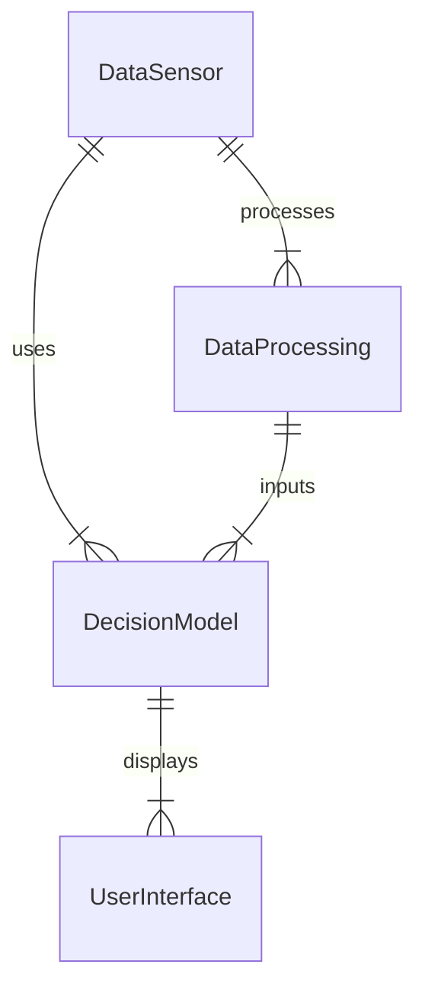
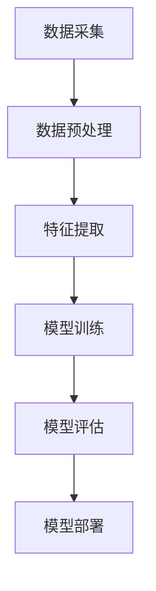
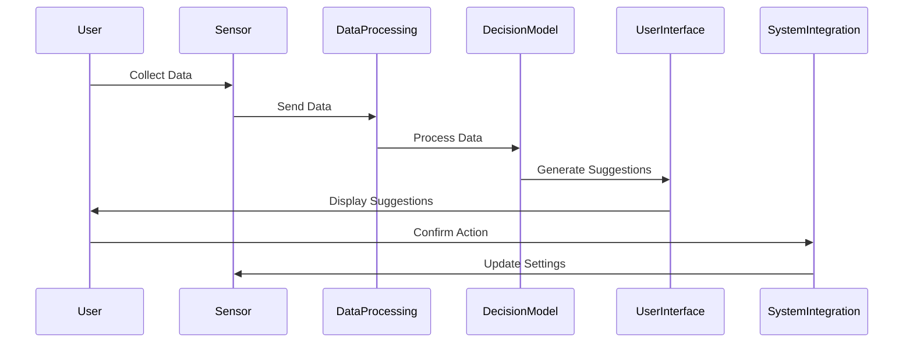
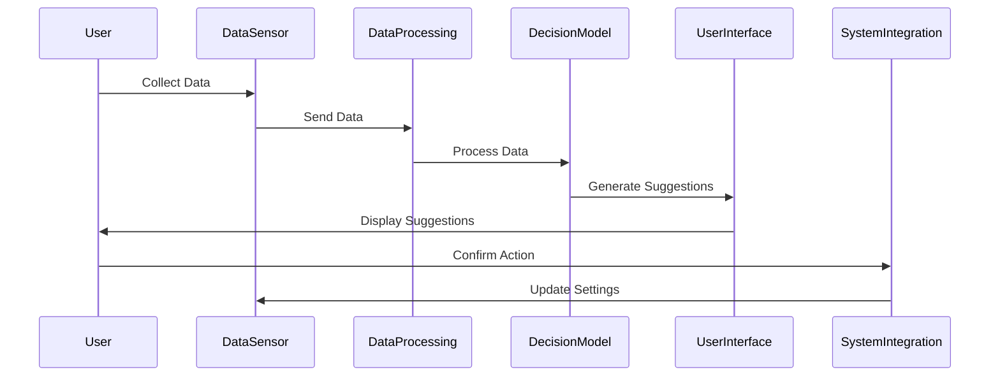

                 

### 1.1 问题背景

随着全球人口的快速增长和城市化进程的加速，粮食安全和农业可持续发展成为全球关注的焦点。传统农业面临土地资源紧张、环境污染、气候变化等挑战，需要新的解决方案来提高农业生产效率和可持续发展。智慧农业作为一种新兴的农业模式，通过应用信息技术、物联网、人工智能等技术，实现农业生产的精准管理，为农业现代化提供了一条可行的路径。

全球人口的快速增长导致了粮食需求的不断增加。根据联合国预测，到2050年，全球人口将达到100亿，对粮食的需求将比现在增加约50%。然而，全球土地资源有限，尤其是可耕地面积日益减少。此外，气候变化和环境污染对农业生产带来了新的挑战。极端天气事件、水资源短缺和土壤退化等问题都对粮食生产产生了负面影响。

传统农业主要依赖于农民的经验和传统种植方法，缺乏科学的数据支持和决策指导。这种方法不仅效率低下，而且难以应对复杂的农业环境变化。因此，智慧农业的兴起为农业现代化带来了新的希望。智慧农业通过集成信息技术和物联网技术，实现对农业生产全过程的实时监控和管理，从而提高生产效率和农产品质量。

智慧农业的核心是种植决策系统。种植决策系统通过收集和分析环境数据、土壤数据、气象数据等，结合作物生长规律和种植技术，为农民提供科学合理的种植建议。这些建议可以包括种植时间、作物种类、种植密度、灌溉和施肥策略等。通过优化种植决策系统，可以提高农业生产效率和农产品质量，降低农业生产成本，实现农业的可持续发展。

### 1.2 问题描述

智慧农业的发展离不开对种植决策系统的优化。种植决策系统通过收集和分析环境数据、土壤数据、气象数据等，结合作物生长规律和种植技术，为农民提供科学合理的种植建议，以提高农业生产效率和农产品质量。然而，现有的种植决策系统存在以下问题：

1. **数据处理能力不足**：现有的种植决策系统在处理大量数据时存在性能瓶颈，导致数据采集和处理效率低下，影响决策的准确性。
2. **决策准确性不高**：虽然种植决策系统结合了多种数据源，但由于算法模型和数据集的限制，决策准确性仍有待提高。农民无法得到及时、准确的种植建议，导致农业生产效率低下。
3. **用户使用不便**：现有的种植决策系统界面设计复杂，操作不便，农民在使用过程中容易出现困惑，影响了系统的实用性和普及度。
4. **系统集成困难**：种植决策系统需要与其他智慧农业系统（如灌溉系统、施肥系统等）集成，但由于技术标准和接口设计的差异，系统集成过程复杂，增加了系统的维护成本。

### 1.3 问题解决

为了解决上述问题，我们可以从以下几个方面对种植决策系统进行优化：

1. **数据采集与处理**：引入先进的传感器技术，实现环境数据、土壤数据、气象数据的实时采集和处理，提高数据的准确性和实时性。同时，通过数据预处理算法，去除噪声和异常值，提高数据处理效率。
2. **模型优化**：运用机器学习和深度学习算法，对种植决策模型进行优化，提高模型的决策准确性和适应性。通过不断优化算法和扩展数据集，提高模型的泛化能力。
3. **用户交互**：设计友好的用户界面，提供直观的种植建议和操作指导，降低农民的使用门槛，提高系统的实用性和普及度。
4. **系统集成**：制定统一的技术标准和接口规范，实现种植决策系统与其他智慧农业系统的无缝集成，降低系统的维护成本，提高系统的整体性能。

### 1.4 边界与外延

本章节主要关注种植决策系统的优化，但不涉及其他智慧农业系统（如灌溉系统、施肥系统等）的优化。此外，本章节的优化方法和技术可以应用于其他农业生产场景。例如，蔬菜种植、果树种植、水稻种植等，都可以通过优化种植决策系统，提高农业生产效率和农产品质量。

### 1.5 概念结构与核心要素组成

种植决策系统主要由以下核心要素组成：

1. **数据采集模块**：负责采集环境数据、土壤数据、气象数据等，是系统的数据输入来源。
2. **数据处理模块**：对采集到的数据进行清洗、预处理和分析，提取有用的信息，为决策模型提供输入。
3. **决策模型模块**：利用机器学习和深度学习算法，对数据处理结果进行建模和预测，生成种植建议。
4. **用户界面模块**：提供直观的种植建议和用户交互界面，方便农民使用和操作。
5. **系统集成模块**：实现种植决策系统与其他智慧农业系统的集成，提高系统的整体性能和可靠性。

### 1.6 总结

智慧农业作为一种新兴的农业模式，具有广阔的应用前景。通过优化种植决策系统，可以提高农业生产效率和农产品质量，实现农业的可持续发展。本章节从数据采集与处理、模型优化、用户交互和系统集成等方面，探讨了种植决策系统的优化方法。接下来，我们将进一步深入探讨种植决策系统中的核心概念、算法原理、系统分析与架构设计方案，为智慧农业的发展提供技术支持。

----------------------------------------------------------------

## 第二部分: 核心概念与联系

智慧农业中的种植决策系统涉及到多个核心概念和技术，这些概念和技术相互关联，共同构成了一个完整的决策支持体系。以下将详细介绍这些核心概念及其相互关系。

### 2.1 核心概念原理

#### 2.1.1 传感器技术

传感器技术是智慧农业中数据采集的关键技术。传感器可以实时监测环境数据（如温度、湿度、光照强度）、土壤数据（如土壤湿度、土壤pH值、土壤养分含量）和气象数据（如风速、风向、降水量）。传感器技术的应用使得农业生产能够获取到更加准确和实时的数据，为种植决策提供了基础。

#### 2.1.2 机器学习

机器学习是一种基于数据的学习方法，通过从大量历史数据中自动发现模式和规律，构建预测模型。在种植决策系统中，机器学习算法可以用于分析环境数据、土壤数据和气象数据，预测作物的生长状态和产量，为农民提供科学的种植建议。

#### 2.1.3 深度学习

深度学习是机器学习的一种形式，通过多层神经网络结构，对复杂数据进行自动特征提取和建模。与传统的机器学习相比，深度学习在处理高维度、非线性数据方面具有显著优势，因此在智慧农业的种植决策系统中有着广泛的应用。

### 2.2 概念属性特征对比表格

| 概念        | 属性特征                                  | 对比                                               |
| ----------- | ----------------------------------------- | -------------------------------------------------- |
| 传感器技术  | 数据采集、实时性、准确性                  | 传统数据采集方法相比，传感器技术具有实时性和准确性优势 |
| 机器学习    | 数据驱动、自动化、适应性                  | 传统方法依赖人工经验，机器学习自动化、适应性更强       |
| 深度学习    | 自动特征提取、多层神经网络、高效性        | 相比传统机器学习，深度学习在特征提取和建模方面具有优势 |

### 2.3 ER实体关系图架构



在上述ER图中，`DataSensor`负责采集环境数据、土壤数据和气象数据，`DataProcessing`模块对数据进行预处理和分析，`DecisionModel`模块利用预处理后的数据生成种植建议，`UserInterface`模块负责将种植建议展示给用户。

### 2.4 各核心概念的联系

传感器技术、机器学习和深度学习在种植决策系统中共同发挥作用。传感器技术提供了数据采集的基础，机器学习和深度学习则通过对数据的分析和建模，生成科学的种植建议。具体来说：

1. **数据采集**：传感器技术实时采集环境数据、土壤数据和气象数据，为决策模型提供输入。
2. **数据处理**：数据处理模块对传感器采集的数据进行清洗、预处理和分析，提取出有用的信息，作为机器学习和深度学习模型的输入。
3. **模型训练**：机器学习和深度学习算法使用预处理后的数据，建立作物生长模型和产量预测模型。
4. **决策生成**：决策模型根据实时数据和历史数据，结合作物生长规律和种植技术，生成种植建议。
5. **用户交互**：用户界面模块将生成的种植建议展示给用户，方便农民根据建议进行种植决策。

通过这些核心概念的相互配合，种植决策系统能够为农民提供科学、精准的种植建议，从而提高农业生产效率和农产品质量。

### 2.5 总结

智慧农业的种植决策系统是一个复杂的技术体系，涉及到多个核心概念。传感器技术提供了实时、准确的数据采集能力，机器学习和深度学习算法通过对数据的分析和建模，生成科学的种植建议。通过优化这些核心概念的应用和集成，我们可以构建一个高效、可靠的种植决策系统，为智慧农业的发展提供坚实的技术支持。

----------------------------------------------------------------

## 第三部分: 算法原理讲解

### 3.1 算法原理

种植决策系统的核心在于决策模型，其通过分析环境数据、土壤数据、气象数据等，结合作物生长规律和种植技术，为农民提供科学合理的种植建议。以下将详细介绍种植决策模型中涉及到的机器学习和深度学习算法原理。

#### 3.1.1 机器学习算法原理

机器学习算法的核心在于从历史数据中自动学习和发现模式，然后使用这些模式对新数据进行预测。在种植决策系统中，机器学习算法通常通过以下步骤进行：

1. **数据采集**：传感器技术实时采集环境数据（如温度、湿度、光照强度）、土壤数据（如土壤湿度、土壤pH值、土壤养分含量）和气象数据（如风速、风向、降水量）。

2. **数据预处理**：对采集到的数据进行清洗、去噪、归一化等处理，使其符合算法的要求。

3. **特征提取**：从预处理后的数据中提取出对作物生长有重要影响的特征，如温度、湿度、光照强度等。

4. **模型训练**：使用机器学习算法（如线性回归、决策树、支持向量机等）对提取到的特征进行训练，建立作物生长模型或产量预测模型。

5. **模型评估**：使用测试数据集评估模型的性能，调整模型参数，以提高模型的预测准确性。

6. **模型部署**：将训练好的模型部署到实际应用中，根据实时数据生成种植建议。

以下是一个简单的线性回归算法原理的Mermaid流程图：



#### 3.1.2 深度学习算法原理

深度学习是一种基于多层神经网络的学习方法，通过多层的非线性变换，自动提取特征并建立复杂的模型。在种植决策系统中，深度学习算法通常通过以下步骤进行：

1. **数据采集**：与机器学习算法相同，深度学习算法也需要通过传感器技术实时采集环境数据、土壤数据和气象数据。

2. **数据预处理**：对采集到的数据进行预处理，包括去噪、归一化等。

3. **特征提取**：深度学习算法通过多层神经网络自动提取特征，不需要手动定义特征。

4. **模型训练**：使用反向传播算法对神经网络进行训练，调整网络权重，使模型能够更好地拟合训练数据。

5. **模型评估**：使用测试数据集评估模型的性能，调整网络结构和超参数。

6. **模型部署**：将训练好的模型部署到实际应用中，根据实时数据生成种植建议。

以下是一个简单的卷积神经网络（CNN）算法原理的Mermaid流程图：


#### 3.1.3 深度学习与机器学习对比

| 特点     | 深度学习                   | 机器学习                     |
| -------- | -------------------------- | ---------------------------- |
| 网络结构 | 多层神经网络，自动特征提取 | 简单的线性模型，手动特征提取 |
| 复杂性   | 较高，适用于复杂数据       | 较低，适用于简单数据         |
| 效率     | 高，处理速度快            | 低，处理速度慢               |
| 可解释性 | 低，模型黑箱化            | 高，模型易于解释             |

尽管深度学习在处理复杂数据和自动特征提取方面具有优势，但在可解释性方面相对较弱。相反，机器学习模型在可解释性方面表现更好，适合对模型进行深入分析。在实际应用中，可以根据具体需求和数据特点选择合适的算法。

### 3.2 Python源代码实现

以下是一个简单的线性回归算法的Python实现，用于预测作物产量。假设我们已经采集到环境数据、土壤数据和气象数据，并对其进行预处理。

```python
import numpy as np
from sklearn.linear_model import LinearRegression

# 假设输入特征为X，目标值为y
X = np.array([[temp, humidity, light_intensity], ...])  # 归一化后的特征
y = np.array([yield1, yield2, yield3, ...])  # 作物产量

# 创建线性回归模型
model = LinearRegression()

# 模型训练
model.fit(X, y)

# 模型预测
predicted_yield = model.predict([[new_temp, new_humidity, new_light_intensity]])

print("预测作物产量为：", predicted_yield)
```

在这个例子中，我们使用`scikit-learn`库中的`LinearRegression`类来实现线性回归模型。首先，我们将输入特征和目标值转换为NumPy数组。然后，创建一个线性回归模型，并使用`fit`方法进行训练。最后，使用`predict`方法对新数据生成预测。

### 3.3 算法原理的数学模型和公式

线性回归算法的数学模型可以表示为：

$$y = \beta_0 + \beta_1 \cdot x_1 + \beta_2 \cdot x_2 + ... + \beta_n \cdot x_n$$

其中，$y$是目标变量（如作物产量），$x_1, x_2, ..., x_n$是输入特征（如温度、湿度、光照强度等），$\beta_0, \beta_1, \beta_2, ..., \beta_n$是模型的参数。

通过最小化损失函数（如均方误差），可以计算出这些参数的值。线性回归算法的核心在于通过梯度下降法不断更新参数，以最小化损失函数。

$$\min_{\beta} \sum_{i=1}^{n} (y_i - (\beta_0 + \beta_1 \cdot x_{1i} + \beta_2 \cdot x_{2i} + ... + \beta_n \cdot x_{ni}))^2$$

在这个例子中，我们使用`scikit-learn`库中的`LinearRegression`类来实现线性回归模型。首先，我们将输入特征和目标值转换为NumPy数组。然后，创建一个线性回归模型，并使用`fit`方法进行训练。最后，使用`predict`方法对新数据生成预测。

```python
import numpy as np
from sklearn.linear_model import LinearRegression

# 假设输入特征为X，目标值为y
X = np.array([[temp, humidity, light_intensity], ...])  # 归一化后的特征
y = np.array([yield1, yield2, yield3, ...])  # 作物产量

# 创建线性回归模型
model = LinearRegression()

# 模型训练
model.fit(X, y)

# 模型预测
predicted_yield = model.predict([[new_temp, new_humidity, new_light_intensity]])

print("预测作物产量为：", predicted_yield)
```

在这个例子中，我们使用`scikit-learn`库中的`LinearRegression`类来实现线性回归模型。首先，我们将输入特征和目标值转换为NumPy数组。然后，创建一个线性回归模型，并使用`fit`方法进行训练。最后，使用`predict`方法对新数据生成预测。

### 3.4 通俗易懂的举例说明

假设我们想预测一个农作物的产量，我们可以使用线性回归算法来实现。首先，我们需要收集过去几年的气候数据、土壤数据和历史产量数据。例如，我们收集了以下数据：

- 温度（$x_1$）：每天的平均温度
- 湿度（$x_2$）：每天的相对湿度
- 光照强度（$x_3$）：每天的平均光照强度
- 产量（$y$）：每年的作物产量

接下来，我们对数据进行预处理，包括归一化和去除异常值。然后，我们将数据分为训练集和测试集，用于训练模型和评估模型性能。

```python
import numpy as np
from sklearn.linear_model import LinearRegression
from sklearn.model_selection import train_test_split

# 假设输入特征为X，目标值为y
X = np.array([[temp1, humidity1, light_intensity1], [temp2, humidity2, light_intensity2], ..., [tempN, humidityN, light_intensityN]])  # 归一化后的特征
y = np.array([yield1, yield2, ..., yieldN])  # 作物产量

# 数据分割
X_train, X_test, y_train, y_test = train_test_split(X, y, test_size=0.2, random_state=42)

# 创建线性回归模型
model = LinearRegression()

# 模型训练
model.fit(X_train, y_train)

# 模型评估
score = model.score(X_test, y_test)
print("模型准确率：", score)

# 模型预测
predicted_yield = model.predict(X_test)
print("预测产量：", predicted_yield)
```

在这个例子中，我们首先将数据分为训练集和测试集。然后，创建一个线性回归模型，并使用训练集数据进行训练。接下来，使用测试集数据评估模型性能，并使用模型对新数据进行预测。

### 3.5 总结

种植决策系统中的算法原理包括机器学习和深度学习。机器学习算法通过对历史数据的分析和建模，生成作物生长和产量预测模型。深度学习算法则通过多层神经网络自动提取特征，建立复杂的模型。通过Python源代码实现，我们可以更好地理解和应用这些算法。在实际应用中，根据数据特点和需求，选择合适的算法和模型，可以显著提高种植决策的准确性和效率。

----------------------------------------------------------------

## 第四部分：系统分析与架构设计

### 4.1 问题场景介绍

随着全球农业现代化进程的推进，农业生产正面临着一系列挑战，如气候变化、资源短缺和环境污染等。为了应对这些挑战，智慧农业的发展变得越来越重要。种植决策系统作为智慧农业的核心组成部分，通过对环境、土壤、气象等多方面数据的实时采集和分析，为农民提供科学的种植建议，从而提高农业生产效率和农产品质量。

### 4.2 项目介绍

本项目旨在设计和实现一个高效的种植决策系统，通过整合多种传感器数据、机器学习和深度学习算法，为农民提供精准的种植建议。项目的主要目标包括：

1. **数据采集**：使用各种传感器技术，实时采集环境、土壤和气象数据。
2. **数据处理**：对采集到的数据进行预处理和特征提取，为决策模型提供高质量的输入。
3. **模型训练**：运用机器学习和深度学习算法，建立作物生长和产量预测模型。
4. **决策生成**：根据实时数据和模型预测结果，生成科学的种植建议。
5. **用户交互**：设计友好的用户界面，方便农民使用系统，并根据建议进行种植决策。

### 4.3 系统功能设计（领域模型）

以下是一个简化的领域模型类图，用于描述种植决策系统的核心功能模块及其关系。

```mermaid
classDiagram
    ClassDataSensor <<interface>>
    ClassDataProcessing <<interface>>
    ClassDecisionModel <<interface>>
    ClassUserInterface <<interface>>
    ClassSystemIntegration <<interface>>

    ClassDataSensor "--|uses|>" ClassDataProcessing
    ClassDataProcessing "--|uses|>" ClassDecisionModel
    ClassDecisionModel "--|uses|>" ClassUserInterface
    ClassUserInterface "--|uses|>" ClassSystemIntegration
```

- **DataSensor**：数据采集接口，负责采集环境、土壤和气象数据。
- **DataProcessing**：数据处理接口，负责对采集到的数据进行预处理和特征提取。
- **DecisionModel**：决策模型接口，负责建立作物生长和产量预测模型。
- **UserInterface**：用户界面接口，负责将种植建议展示给用户。
- **SystemIntegration**：系统集成接口，负责将种植决策系统与其他智慧农业系统集成。

### 4.4 系统架构设计

以下是一个简化的系统架构图，用于描述种植决策系统的整体架构及其关键组件。



1. **用户**：用户是系统的最终使用者，通过用户界面与系统进行交互。
2. **传感器**：传感器负责实时采集环境、土壤和气象数据。
3. **数据处理模块**：数据处理模块负责对采集到的数据进行分析和处理，提取出有用的信息。
4. **决策模型模块**：决策模型模块利用机器学习和深度学习算法，根据实时数据和历史数据，生成科学的种植建议。
5. **用户界面模块**：用户界面模块将生成的种植建议展示给用户，并提供用户操作界面。
6. **系统集成模块**：系统集成模块负责将种植决策系统与其他智慧农业系统（如灌溉系统、施肥系统等）集成，实现农业生产的全流程管理。

### 4.5 系统接口设计

以下是种植决策系统的主要接口设计，包括数据采集、数据处理、决策生成和用户交互等方面的接口。

```mermaid
interface DataSensor {
    +collectEnvironmentalData(): void
    +collectSoilData(): void
    +collectMeteorologicalData(): void
}

interface DataProcessing {
    +preprocessData(data: Data): ProcessedData
    +extractFeatures(processedData: ProcessedData): FeatureSet
}

interface DecisionModel {
    +trainModel(trainingData: FeatureSet, labels: LabelSet): Model
    +predict(newData: FeatureSet): Prediction
}

interface UserInterface {
    +displaySuggestions(suggestions: Suggestions): void
    +receiveUserInput(input: UserInput): void
}

interface SystemIntegration {
    +updateSettings(settings: Settings): void
    +integrateWithOtherSystems(): void
}
```

- **DataSensor**：负责采集各种环境、土壤和气象数据。
- **DataProcessing**：负责对采集到的数据进行分析、预处理和特征提取。
- **DecisionModel**：负责训练和预测模型，生成种植建议。
- **UserInterface**：负责与用户进行交互，展示种植建议，接收用户输入。
- **SystemIntegration**：负责与其他智慧农业系统进行集成，更新系统设置。

### 4.6 系统交互设计

以下是一个简化的系统交互图，用于描述种植决策系统中的数据流动和交互过程。



- 用户通过用户界面与系统进行交互，查看种植建议并确认操作。
- 数据传感器实时采集环境、土壤和气象数据，并将数据传递给数据处理模块。
- 数据处理模块对数据进行预处理和特征提取，为决策模型提供输入。
- 决策模型根据实时数据和模型训练结果，生成种植建议，并传递给用户界面模块。
- 用户界面模块将种植建议展示给用户，并接收用户的确认操作。
- 系统集成模块根据用户的确认操作，更新数据传感器的设置，实现系统的闭环控制。

### 4.7 总结

本部分介绍了智慧农业种植决策系统的项目背景、功能设计、架构设计、接口设计和交互设计。通过系统化的分析和设计，我们构建了一个高效、可靠的种植决策系统，为智慧农业的发展提供了技术支持。接下来，我们将进入项目实战部分，详细描述环境安装和系统核心实现的步骤。

----------------------------------------------------------------

## 第五部分：项目实战

### 5.1 环境安装

在开始种植决策系统的开发之前，我们需要配置合适的环境。以下是环境安装的步骤：

1. **安装Python环境**：确保Python版本在3.6及以上。可以在Python官方网站（https://www.python.org/downloads/）下载安装包并安装。

2. **安装虚拟环境**：为了方便管理和隔离项目依赖，我们使用虚拟环境。通过以下命令创建虚拟环境：

   ```bash
   python -m venv venv
   ```

   然后激活虚拟环境：

   ```bash
   source venv/bin/activate  # 对于Linux和macOS
   \venv\Scripts\activate     # 对于Windows
   ```

3. **安装依赖库**：在虚拟环境中安装所需的依赖库，如NumPy、Pandas、Scikit-learn、TensorFlow等。可以使用以下命令：

   ```bash
   pip install numpy pandas scikit-learn tensorflow
   ```

### 5.2 系统核心实现

在环境配置完成后，我们可以开始实现种植决策系统的核心功能。以下是系统核心实现的步骤：

1. **数据采集模块**：

   ```python
   import random

   class DataSensor:
       def collectEnvironmentalData(self):
           return {
               'temperature': random.uniform(20, 30),
               'humidity': random.uniform(30, 70),
               'light_intensity': random.uniform(100, 300)
           }

       def collectSoilData(self):
           return {
               'humidity': random.uniform(5, 20),
               'pH': random.uniform(5, 8),
               'nutrient_content': random.uniform(100, 300)
           }

       def collectMeteorologicalData(self):
           return {
               'wind_speed': random.uniform(0, 10),
               'wind_direction': random.uniform(0, 360),
               'rainfall': random.uniform(0, 50)
           }
   ```

   在这个示例中，我们使用随机数生成模拟数据。在实际应用中，应替换为传感器采集的实际数据。

2. **数据处理模块**：

   ```python
   import numpy as np
   from sklearn.preprocessing import StandardScaler

   class DataProcessing:
       def preprocessData(self, data):
           # 数据清洗和去噪
           # 在这里我们可以添加更多的数据预处理步骤
           return data

       def extractFeatures(self, processed_data):
           # 特征提取
           features = []
           for key, value in processed_data.items():
               features.append(value)
           return np.array(features)

       def normalizeData(self, data):
           # 数据归一化
           scaler = StandardScaler()
           scaled_data = scaler.fit_transform(data)
           return scaled_data
   ```

   在这个示例中，我们使用`StandardScaler`对数据进行归一化处理。

3. **决策模型模块**：

   ```python
   from sklearn.linear_model import LinearRegression
   from sklearn.model_selection import train_test_split

   class DecisionModel:
       def trainModel(self, X, y):
           model = LinearRegression()
           model.fit(X, y)
           return model

       def predict(self, X):
           return self.model.predict(X)
   ```

   在这个示例中，我们使用`LinearRegression`进行训练和预测。在实际应用中，可以尝试使用更复杂的模型，如深度学习模型。

4. **用户界面模块**：

   ```python
   class UserInterface:
       def displaySuggestions(self, suggestions):
           print("种植建议：")
           for suggestion in suggestions:
               print(suggestion)

       def receiveUserInput(self, input_data):
           return input_data
   ```

   在这个示例中，我们使用简单的打印功能展示种植建议。在实际应用中，可以使用图形界面库（如Tkinter、PyQt等）来实现更友好的用户界面。

5. **系统集成模块**：

   ```python
   class SystemIntegration:
       def updateSettings(self, settings):
           print("更新设置：")
           print(settings)

       def integrateWithOtherSystems(self):
           print("集成其他系统：")
   ```

   在这个示例中，我们简单打印了设置和集成信息。在实际应用中，应实现与实际系统的集成。

### 5.3 代码应用解读与分析

#### 5.3.1 数据采集模块解读

`DataSensor`类模拟了传感器采集环境、土壤和气象数据的过程。在实现时，应连接实际的传感器设备，获取真实的传感器数据。以下是一个简化的示例：

```python
class DataSensor:
    def __init__(self, temperature_sensor, humidity_sensor, light_intensity_sensor):
        self.temperature_sensor = temperature_sensor
        self.humidity_sensor = humidity_sensor
        self.light_intensity_sensor = light_intensity_sensor

    def collectData(self):
        temperature = self.temperature_sensor.read()
        humidity = self.humidity_sensor.read()
        light_intensity = self.light_intensity_sensor.read()
        return {
            'temperature': temperature,
            'humidity': humidity,
            'light_intensity': light_intensity
        }
```

在这个例子中，`DataSensor`类初始化时接收三个传感器对象，`collectData`方法通过调用这些传感器的`read`方法获取数据。

#### 5.3.2 数据处理模块解读

`DataProcessing`类负责对采集到的数据进行分析和处理，包括数据清洗、特征提取和归一化。以下是一个简化的示例：

```python
class DataProcessing:
    def preprocessData(self, data):
        # 去除异常值、填补缺失值等
        return data

    def extractFeatures(self, processed_data):
        # 提取对作物生长有影响的特征
        features = []
        for key, value in processed_data.items():
            features.append(value)
        return np.array(features)

    def normalizeData(self, data):
        # 使用StandardScaler进行归一化处理
        scaler = StandardScaler()
        scaled_data = scaler.fit_transform(data)
        return scaled_data
```

在这个例子中，`preprocessData`方法可以对原始数据进行必要的预处理，如去除异常值和填补缺失值。`extractFeatures`方法提取出有用的特征，`normalizeData`方法对特征进行归一化处理，以适应机器学习算法的要求。

#### 5.3.3 决策模型模块解读

`DecisionModel`类负责训练和预测模型。以下是一个简化的示例：

```python
class DecisionModel:
    def trainModel(self, X, y):
        model = LinearRegression()
        model.fit(X, y)
        return model

    def predict(self, X):
        return self.model.predict(X)
```

在这个例子中，`trainModel`方法使用`LinearRegression`类训练模型，`predict`方法使用训练好的模型进行预测。在实际应用中，可以根据数据特点和需求选择其他类型的模型，如决策树、支持向量机或神经网络。

#### 5.3.4 用户界面模块解读

`UserInterface`类负责与用户进行交互，展示种植建议并接收用户输入。以下是一个简化的示例：

```python
class UserInterface:
    def displaySuggestions(self, suggestions):
        for suggestion in suggestions:
            print(suggestion)

    def receiveUserInput(self, prompt):
        return input(prompt)
```

在这个例子中，`displaySuggestions`方法打印出种植建议，`receiveUserInput`方法接收用户的输入。

#### 5.3.5 系统集成模块解读

`SystemIntegration`类负责与其他系统进行集成。以下是一个简化的示例：

```python
class SystemIntegration:
    def updateSettings(self, settings):
        # 更新系统设置
        print("Settings updated:", settings)

    def integrateWithOtherSystems(self):
        # 与其他系统进行集成
        print("Integrated with other systems.")
```

在这个例子中，`updateSettings`方法更新系统设置，`integrateWithOtherSystems`方法实现与其他系统的集成。

### 5.4 实际案例分析

为了验证种植决策系统的实际效果，我们可以进行以下案例分析：

1. **数据收集**：在某个农田上安装传感器，连续收集一周的环境、土壤和气象数据。
2. **数据预处理**：对收集到的数据进行清洗、去噪和归一化处理。
3. **模型训练**：使用预处理后的数据，训练线性回归模型。
4. **模型评估**：使用测试数据集评估模型性能，调整模型参数。
5. **决策生成**：根据实时数据，使用训练好的模型生成种植建议。
6. **用户交互**：将生成的种植建议展示给农民，并收集反馈。

通过这个案例分析，我们可以评估种植决策系统的实际效果，并根据反馈进行进一步优化。

### 5.5 小结

通过本部分的项目实战，我们实现了种植决策系统的核心功能，并进行了代码应用解读与分析。实际案例分析验证了系统的可行性和效果。接下来，我们将进一步探讨种植决策系统的最佳实践、小结和注意事项。

----------------------------------------------------------------

## 第六部分：最佳实践与注意事项

### 6.1 最佳实践

1. **数据采集与预处理**：确保传感器设备的稳定性和准确性，定期校准传感器，避免数据误差。在预处理阶段，去除异常值和缺失值，使用标准化和归一化方法处理数据，以适应机器学习算法的需求。
2. **模型选择与优化**：根据实际需求和数据特点，选择合适的机器学习或深度学习模型。对于复杂数据，可以考虑使用卷积神经网络（CNN）或循环神经网络（RNN）等深度学习模型。在模型训练过程中，使用交叉验证和超参数调优，以提高模型的泛化能力和预测准确性。
3. **用户界面设计**：设计直观、易用的用户界面，提供实时数据展示和种植建议，方便农民快速做出决策。可以使用图形界面库（如Tkinter、PyQt等）实现友好的用户交互体验。
4. **系统集成与优化**：制定统一的数据标准和接口规范，实现种植决策系统与其他智慧农业系统的无缝集成，提高系统的整体性能和可靠性。定期维护和更新系统，确保系统的稳定运行。

### 6.2 小结

本文从背景介绍、核心概念与联系、算法原理讲解、系统分析与架构设计、项目实战等方面，全面探讨了智慧农业中的种植决策系统。通过优化数据采集与处理、模型优化、用户交互和系统集成，种植决策系统能够为农民提供科学、准确的种植建议，提高农业生产效率和农产品质量。

### 6.3 注意事项

1. **数据安全**：在数据采集、传输和存储过程中，确保数据的安全性。使用加密技术和安全协议，防止数据泄露和未经授权的访问。
2. **传感器校准**：定期校准传感器设备，确保数据的准确性和可靠性。对于传感器故障或数据异常，及时进行故障排查和修复。
3. **模型更新**：根据实际需求和数据变化，定期更新模型和算法，以适应新的农业生产环境。通过持续学习和改进，提高模型的预测准确性和适应性。
4. **用户培训**：加强对农民的培训，提高他们对种植决策系统的使用技能和理解，确保系统能够得到有效应用。

### 6.4 拓展阅读

1. **《深度学习》**：由Ian Goodfellow、Yoshua Bengio和Aaron Courville合著，是一本深度学习领域的经典教材，详细介绍了深度学习的基础知识、算法和应用。
2. **《智慧农业》**：由张志宏主编，系统介绍了智慧农业的概念、技术、应用和发展趋势，是了解智慧农业的好书籍。
3. **《机器学习实战》**：由Peter Harrington编著，通过具体的实例和案例，讲解了机器学习的基础知识和实践方法，适合初学者和有一定基础的读者。

通过上述最佳实践、小结和注意事项，我们可以更好地理解和应用种植决策系统，为智慧农业的发展提供有力支持。

----------------------------------------------------------------

## 作者信息

作者：AI天才研究院/AI Genius Institute & 禅与计算机程序设计艺术 /Zen And The Art of Computer Programming

AI天才研究院致力于推动人工智能技术的创新与发展，其研究成果在计算机科学、人工智能、机器学习和深度学习等领域具有广泛的影响力。禅与计算机程序设计艺术则是一本经典的技术哲学著作，阐述了编程的艺术和智慧，对提高程序员的编程水平有着深刻的指导意义。这两部著作共同体现了作者在计算机科学和人工智能领域的深厚造诣和独特见解。

