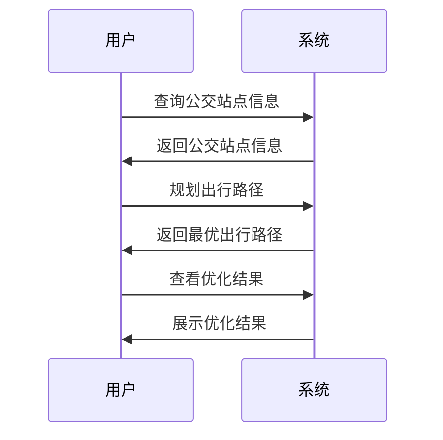
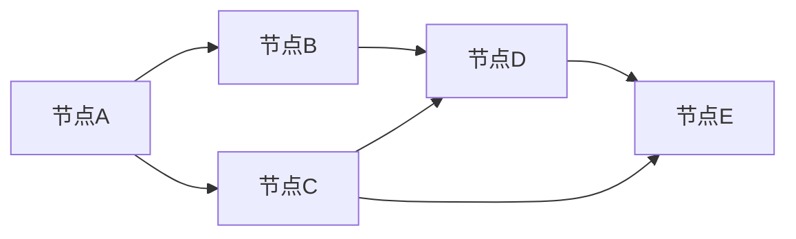
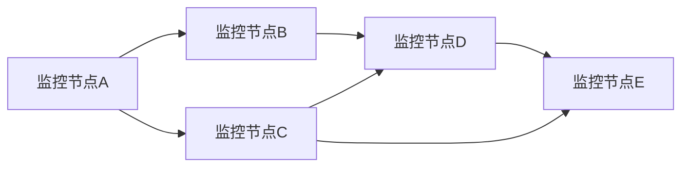
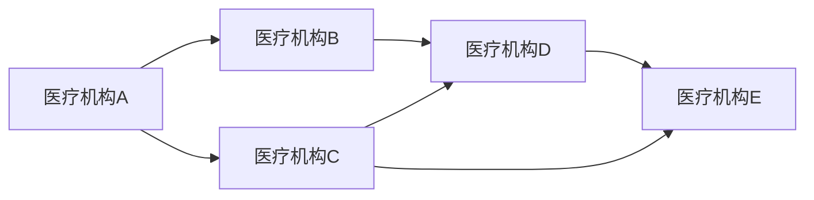

                 

### 智慧城市的图论：城市功能的数学连接

> 关键词：智慧城市、图论、城市功能、数学模型、网络连接

> 摘要：本文通过深入探讨智慧城市的图论方法，解析城市功能的数学连接。首先，我们回顾了智慧城市的背景和发展历程，然后介绍了图论的基本概念和应用。接着，我们详细阐述了城市功能网络的构建方法和优化策略。最后，对智慧城市的发展趋势进行了展望，提出了未来研究的方向与挑战。本文旨在为读者提供一个全面、系统的理解和应用图论在智慧城市中的实践指南。

----------------------------------------------------------------

## 第一部分：背景与概念介绍

### 第1章：智慧城市概述

#### 1.1 问题背景

**当前城市面临的挑战**

随着城市化进程的加速，城市面临着诸多挑战。首先，人口快速增长导致了交通拥堵、环境污染和资源紧缺等问题。其次，城市基础设施老化，需要升级改造以适应现代化需求。此外，城市管理的复杂性使得决策过程变得繁琐、低效。这些挑战对城市的可持续发展提出了严峻的考验。

**智慧城市的定义与发展历程**

智慧城市是指通过物联网、大数据、人工智能等现代信息技术手段，实现城市系统的高度集成与智能化管理，以提高城市运行效率、改善居民生活质量的一种新型城市发展模式。智慧城市的发展历程可以分为三个阶段：技术推动阶段、需求驱动阶段和协同创新阶段。

- **技术推动阶段**：以信息技术、通信技术、传感器技术等技术的发展为基础，为智慧城市的建设提供技术支持。
- **需求驱动阶段**：以用户需求为导向，通过应用创新来满足城市管理和服务的需求，推动智慧城市的广泛应用。
- **协同创新阶段**：强调政府、企业、科研机构和社会公众的协同合作，实现智慧城市的可持续发展和智能化升级。

#### 1.2 智慧城市的核心概念

**物联网**：通过传感器、智能设备等收集城市中的各种数据，实现城市物理世界与数字世界的深度融合。

**大数据分析**：通过对海量数据进行分析，提取有价值的信息，为城市管理和决策提供数据支持。

**人工智能**：利用机器学习、深度学习等技术，模拟人类的智能行为，实现智能化的城市服务和治理。

**智能交通**：通过优化交通信号控制、交通流量监测和车辆管理，提高交通效率，减少拥堵。

**智能能源管理**：通过智能电网、能源监测和优化技术，提高能源利用效率，减少能源消耗。

#### 1.3 图论与智慧城市的关系

**图论的基本概念**

图论是数学的一个分支，主要研究图的结构、性质及其应用。图由节点（表示实体）和边（表示关系）组成。根据边的方向性，图可以分为无向图和有向图。

**图论在智慧城市中的应用**

图论在智慧城市中有着广泛的应用。例如，在智能交通系统中，可以使用图论进行交通网络建模和路径规划；在智能能源管理中，可以使用图论进行能源网络建模和优化；在智慧医疗中，可以使用图论进行医疗资源分配和疾病传播预测。

#### 1.4 研究目的与意义

**探索智慧城市中城市功能之间的关系**

通过图论方法，我们可以深入分析智慧城市中各个功能模块之间的关联性，揭示城市运行的内在规律，为城市规划和治理提供科学依据。

**提高城市运行效率与质量**

通过构建城市功能网络，我们可以发现城市运行中的瓶颈和短板，采用优化算法进行改进，从而提高城市运行效率，提升居民生活质量。

#### 1.5 本章小结

本章对智慧城市进行了概述，介绍了其背景、核心概念和发展历程。同时，阐述了图论与智慧城市的关系，明确了研究目的与意义。这些内容为后续章节的讨论奠定了基础。

----------------------------------------------------------------

## 第二部分：图论基本理论

### 第2章：图的基本概念

#### 2.1 图的定义与类型

**图的定义**

图是由一组节点和连接这些节点的边组成的集合。节点表示实体，边表示实体之间的关系。

**图的类型**

- **无向图**：边的方向不明确，任意两个节点之间都可以相互连接。
- **有向图**：边的方向明确，从源节点指向目标节点，表示有向关系。
- **网络图**：一种特殊的有向图，其中的边具有权重，表示连接的强度或成本。

#### 2.2 图的表示方法

**邻接矩阵**

邻接矩阵是一种常用的图表示方法，用一个二维矩阵表示图的连接关系。矩阵的元素表示节点之间的连接情况，通常用1表示连接，用0表示无连接。

**关联矩阵**

关联矩阵是另一种常用的图表示方法，用于表示有向图的连接关系。与邻接矩阵类似，它也是一个二维矩阵，但元素表示的是边指向的节点。

**节点-边表示**

节点-边表示是直接用节点和边来表示图的方法。这种方法直观、简单，适用于小型图。

#### 2.3 图的基本性质

**度**

度表示节点在图中连接的边数。一个无向图的节点度数之和等于边的两倍；有向图的节点度数分为入度和出度。

**距离**

距离表示两个节点之间的最短路径长度。在无向图中，两个节点之间的距离是路径上的边数；在有向图中，需要考虑路径的方向。

**联通性**

联通性表示图中的任意两个节点之间是否可以通过一系列的边相互连接。无向图是联通的，当且仅当任意两个节点之间都存在路径；有向图则需要考虑路径的方向性。

#### 2.4 图的遍历算法

**深度优先搜索（DFS）**

深度优先搜索是一种遍历图的算法，从初始节点开始，沿着一条路径一直走到底，然后再回溯。

**广度优先搜索（BFS）**

广度优先搜索是一种遍历图的算法，从初始节点开始，首先访问所有直接相邻的节点，然后再访问下一层的节点。

#### 2.5 图的算法复杂度分析

图的算法复杂度分析主要考虑算法的时间复杂度和空间复杂度。时间复杂度表示算法执行时间的增长速度，空间复杂度表示算法所需存储空间的增长速度。

#### 2.6 本章小结

本章介绍了图的基本概念、表示方法、基本性质和遍历算法。通过这些基本理论，我们可以更好地理解和应用图论，为后续章节的研究奠定基础。

----------------------------------------------------------------

### 第3章：图的应用案例

#### 3.1 智能交通系统中的图论应用

**交通网络建模**

在智能交通系统中，图论被广泛应用于交通网络建模。交通网络可以看作是一个图，节点表示交通路口或交通站点，边表示道路或路线。

**路径规划算法**

路径规划是智能交通系统中的一个重要任务。通过图论中的最短路径算法（如迪杰斯特拉算法、贝尔曼-福特算法），可以找到从起点到终点的最优路径。

**交通流量预测**

利用图论中的网络流算法（如最大流-最小割定理），可以预测交通流量，从而优化交通信号控制和道路容量分配，提高交通效率。

#### 3.2 智能能源管理中的图论应用

**能源网络建模**

能源网络可以被看作是一个图，节点表示能源生产或消费点，边表示能源传输线路。

**能源分配优化**

通过图论中的最小生成树算法（如普里姆算法、克鲁斯卡尔算法），可以优化能源分配，确保能源供应的稳定性和经济性。

**能源消耗预测**

利用图论中的动态网络分析技术，可以预测能源消耗的时空分布，为能源管理提供数据支持。

#### 3.3 智慧社区中的图论应用

**社区关系网络建模**

社区关系可以被看作是一个图，节点表示社区成员，边表示他们之间的社交关系。

**社区服务优化**

通过图论中的社区检测算法（如Louvain算法、Girvan-Newman算法），可以识别社区结构，优化社区服务和资源配置。

**社区安全监控**

利用图论中的网络流分析技术，可以监控社区安全，及时发现和处理安全隐患。

#### 3.4 智慧医疗中的图论应用

**医疗资源分配**

在智慧医疗中，图论被用于优化医疗资源的分配。节点表示医疗机构或患者，边表示他们之间的服务关系。

**医疗网络分析**

通过图论中的网络分析技术，可以分析医疗资源的利用效率，优化医疗服务的提供。

**疾病传播预测**

利用图论中的传播模型（如SIR模型、SEIR模型），可以预测疾病的传播路径，制定防控策略。

#### 3.5 本章小结

本章通过几个具体案例，展示了图论在智慧城市中的广泛应用。从智能交通、智能能源管理到智慧社区、智慧医疗，图论方法为城市功能的优化和智能化提供了有力支持。

----------------------------------------------------------------

## 第三部分：城市功能的数学连接

### 第4章：城市功能网络的构建

#### 4.1 城市功能识别

**常见城市功能**

城市功能包括但不限于以下几个方面：

- **基础设施服务**：包括供水、供电、供气、公共交通等。
- **公共服务**：包括教育、医疗、文化、体育等。
- **商业服务**：包括零售、餐饮、娱乐等。
- **居住服务**：包括住宅、社区配套服务等。
- **环境管理**：包括环境保护、垃圾分类处理等。
- **交通管理**：包括交通规划、交通控制、交通监控等。

**功能分类与划分**

根据城市功能的不同属性和特点，可以将城市功能划分为多个类别。例如，按照服务范围，可以分为市级、区级、街道级等；按照服务性质，可以分为公共服务、商业服务、居民服务、环境服务等。

#### 4.2 城市功能网络的构建方法

**基于数据的网络构建**

基于数据的网络构建方法通过收集和分析城市数据，识别城市功能之间的关联性，构建城市功能网络。具体步骤包括：

1. 数据收集：收集城市的基础设施、公共服务、商业服务、居住服务、环境管理和交通管理等方面的数据。
2. 数据清洗：对收集到的数据进行清洗和预处理，去除重复、错误和不完整的数据。
3. 数据分析：利用数据分析方法，挖掘城市功能之间的关联关系。
4. 网络构建：根据分析结果，构建城市功能网络，表示城市中各个功能模块之间的连接关系。

**基于专家知识的网络构建**

基于专家知识的网络构建方法通过专家的经验和知识，识别城市功能之间的关联性，构建城市功能网络。具体步骤包括：

1. 专家访谈：与城市规划师、交通工程师、环境科学家等专家进行访谈，收集他们对城市功能的认识和见解。
2. 知识整理：整理专家提供的信息，形成城市功能的知识库。
3. 网络构建：根据知识库，构建城市功能网络，表示城市中各个功能模块之间的连接关系。

#### 4.3 城市功能网络的属性分析

**节点属性**

城市功能网络的节点表示城市中的功能模块，具有以下属性：

- **功能类型**：表示节点的功能类别，如基础设施服务、公共服务、商业服务等。
- **服务范围**：表示节点的服务范围，如市级、区级、街道级等。
- **重要性**：表示节点在功能网络中的重要性，如关键节点、普通节点等。

**边属性**

城市功能网络的边表示城市中功能模块之间的连接关系，具有以下属性：

- **连接类型**：表示边的连接类型，如直接连接、间接连接等。
- **连接强度**：表示边连接的强度或成本，如交通流量、能源传输量等。
- **连接质量**：表示边连接的质量，如道路状况、信号灯配置等。

#### 4.4 城市功能网络的可视化

**可视化方法**

城市功能网络的可视化可以通过图形、图表、地图等多种方式实现。常用的可视化方法包括：

- **节点-边图**：用节点和边表示城市功能网络，节点表示功能模块，边表示连接关系。
- **力导向图**：通过物理模拟方法，使节点和边之间的相互作用力达到平衡，生成直观的图。
- **地图可视化**：将城市功能网络映射到地图上，显示功能模块的地理位置和连接关系。

**可视化工具**

常用的可视化工具包括：

- **Gephi**：一款开源的可视化工具，用于绘制复杂网络。
- **D3.js**：一款基于JavaScript的可视化库，可以用于创建高度交互的图表。
- **Mapbox**：一款地图可视化平台，可以用于制作交互式地图。

#### 4.5 本章小结

本章介绍了城市功能网络的构建方法、属性分析和可视化方法。通过构建城市功能网络，我们可以更好地理解和分析城市功能之间的关联性，为城市规划和治理提供科学依据。

----------------------------------------------------------------

### 第5章：城市功能网络的优化

#### 5.1 功能网络优化目标

**效率优化**

效率优化旨在提高城市功能网络的运行效率，减少不必要的资源消耗。具体目标包括：

- **交通效率**：减少交通拥堵，提高道路通行能力。
- **能源效率**：提高能源利用效率，降低能源消耗。
- **公共服务效率**：提高公共服务的响应速度和质量。

**费用优化**

费用优化旨在降低城市功能网络的运营成本，提高经济效益。具体目标包括：

- **交通成本**：降低交通运营成本，提高公共交通的性价比。
- **能源成本**：降低能源供应和消耗的成本。
- **公共服务成本**：降低公共服务的运营成本，提高服务质量。

**可靠性优化**

可靠性优化旨在提高城市功能网络的稳定性和抗风险能力，确保城市功能正常运转。具体目标包括：

- **交通可靠性**：提高道路网络的可靠性和通行能力，减少交通事故和交通中断。
- **能源可靠性**：提高能源供应的稳定性和安全性，降低停电和断电的风险。
- **公共服务可靠性**：提高公共服务的可靠性和稳定性，确保居民的基本需求得到满足。

#### 5.2 功能网络优化算法

**最小生成树算法**

最小生成树算法是一种常用的图优化算法，用于构建一个包含所有节点的树形结构，使树中的边权之和最小。常用的最小生成树算法包括：

- **普里姆算法**：从任意节点开始，逐步扩展最小生成树，直到包含所有节点。
- **克鲁斯卡尔算法**：按照边的权重顺序，逐步添加边到生成树中，直到包含所有节点。

**网络流算法**

网络流算法用于求解图中的最大流量问题，可以优化城市功能网络的资源分配。常用的网络流算法包括：

- **最大流-最小割定理**：通过找到最小割集，计算最大流量。
- **Ford-Fulkerson算法**：通过递归寻找增广路径，逐步增加流量，直到达到最大流量。
- **Edmonds-Karp算法**：基于Ford-Fulkerson算法，利用广度优先搜索找到增广路径，提高算法效率。

**贪心算法**

贪心算法是一种简化的优化算法，通过每次选择当前最优解来逐步逼近最优解。在功能网络优化中，贪心算法可以用于以下任务：

- **路径规划**：从起点到终点，每次选择当前最优路径。
- **资源分配**：根据当前资源情况，选择最优的分配方案。

#### 5.3 实例分析：城市公共交通网络的优化

**问题场景**

假设某城市的公共交通网络由多条公交线路组成，每个公交站点都有多个公交线路经过。目标是在满足乘客需求的前提下，优化公交线路的调度和运营，提高公共交通的效率。

**项目介绍**

本项目采用最小生成树算法和贪心算法，优化城市公共交通网络的调度和运营。

**系统功能设计**

- **数据收集与处理**：收集城市公共交通网络的线路数据、站点数据和乘客流量数据，进行预处理。
- **网络构建**：利用最小生成树算法，构建城市公共交通网络的最小生成树。
- **路径规划**：利用贪心算法，为乘客规划最优出行路径。
- **调度优化**：根据公交站点乘客流量和线路运行状况，优化公交线路的调度和运营。

**系统架构设计**

- **数据层**：存储城市公共交通网络的线路数据、站点数据和乘客流量数据。
- **逻辑层**：实现数据预处理、网络构建、路径规划和调度优化等功能。
- **界面层**：提供用户界面，展示优化结果和操作功能。

**系统接口设计**

- **API接口**：提供数据接口，供其他系统调用。
- **Web接口**：提供Web界面，供用户查询和操作。

**系统交互**

通过Web接口，用户可以查询公交站点信息、规划出行路径、查看优化结果等。



#### 5.4 本章小结

本章介绍了城市功能网络优化的目标、算法和实例。通过最小生成树算法、网络流算法和贪心算法，可以优化城市功能网络，提高城市运行效率、降低成本和提升可靠性。实例分析展示了如何将优化算法应用于城市公共交通网络，为城市规划和治理提供了实际案例。

----------------------------------------------------------------

### 第6章：城市功能网络的动态分析

#### 6.1 动态网络的定义与特征

**动态网络的定义**

动态网络是指网络中的节点和边随时间变化而变化的网络。与静态网络不同，动态网络能够反映网络随时间的演化过程。

**动态网络的特征**

- **时间序列数据**：动态网络中的节点和边状态随时间变化，形成时间序列数据。
- **动态节点与边的生成**：动态网络中的节点和边可以随着时间动态生成或消失，形成复杂的网络结构。

#### 6.2 动态网络的建模方法

**时间序列分析**

时间序列分析是一种常用的动态网络建模方法，通过分析节点和边的时间序列数据，提取网络的变化规律。具体方法包括：

- **时序特征提取**：从时间序列数据中提取特征，如均值、方差、自相关性等。
- **时间序列预测**：利用历史时间序列数据，预测未来节点和边的状态。

**社交网络分析**

社交网络分析是一种基于社会关系的动态网络建模方法，通过分析社交网络中的交互行为，构建动态网络。具体方法包括：

- **节点嵌入**：将社交网络中的节点映射到低维空间，表示节点之间的关系。
- **社交网络演化**：分析社交网络中的节点加入、离开和互动行为，构建动态网络模型。

**事件驱动模型**

事件驱动模型是一种基于事件发生的动态网络建模方法，通过分析事件发生的时间和影响，构建动态网络。具体方法包括：

- **事件识别**：识别网络中的关键事件，如节点加入、节点离开、边生成、边删除等。
- **事件影响分析**：分析事件对网络结构和功能的影响，构建动态网络模型。

#### 6.3 动态网络的应用

**城市突发事件响应**

通过动态网络分析，可以实时监测城市突发事件（如自然灾害、交通事故等）的传播路径和影响范围，制定应急响应策略。

**城市人口流动分析**

通过动态网络分析，可以实时监测城市人口流动情况，优化交通规划、公共服务配置和城市管理。

**城市经济发展分析**

通过动态网络分析，可以分析城市经济发展的动态过程，识别关键驱动因素和潜在风险，为城市经济发展提供决策支持。

#### 6.4 本章小结

本章介绍了动态网络的定义、特征、建模方法和应用。动态网络分析为城市功能网络的实时监测、优化和预测提供了重要手段，有助于提升城市管理的智能化水平。

----------------------------------------------------------------

### 第7章：智慧城市的发展趋势与展望

#### 7.1 智慧城市的发展趋势

**新一代信息技术的发展**

随着5G、物联网、云计算、大数据、人工智能等新一代信息技术的快速发展，智慧城市将进入一个全新的阶段。这些技术为智慧城市的建设提供了强大的技术支撑，使得城市功能更加智能化、高效化。

**城市治理的数字化转型**

数字化转型已经成为全球城市治理的重要趋势。通过数字化手段，城市管理者可以更加高效地收集、处理和分析城市数据，实现精细化管理，提高城市治理的水平和效率。

**智慧城市的可持续发展**

智慧城市的发展不仅要关注经济效益，更要注重社会效益和环境保护。可持续发展是智慧城市发展的核心目标，通过优化资源配置、减少能源消耗和环境污染，实现城市的可持续发展。

#### 7.2 图论在智慧城市中的未来应用

**跨领域的数据整合与融合**

图论方法可以帮助城市实现跨领域的数据整合与融合，将来自不同领域的数据（如交通、能源、环境等）进行关联，构建一个统一的城市数据模型，为城市管理和决策提供全面、系统的数据支持。

**智慧城市的自适应管理**

图论方法可以帮助城市实现自适应管理，通过实时监测城市状态，动态调整城市运行策略，提高城市应对突发事件和变化的能力。

**基于图论的智能化服务**

图论方法可以帮助城市提供智能化服务，如智能交通、智能能源管理、智能医疗等。通过构建城市功能网络，优化资源配置和服务提供，提升居民的生活质量。

#### 7.3 研究方向与挑战

**大数据的高效处理与分析**

随着大数据技术的不断发展，如何高效地处理和分析海量数据成为智慧城市研究的重要方向。未来的研究可以关注分布式计算、数据挖掘、机器学习等领域，提高大数据处理和分析的效率。

**城市功能的精准建模与预测**

城市功能的精准建模与预测是智慧城市建设的核心任务。未来的研究可以关注城市功能网络的构建、动态分析、优化算法等方面，提高城市功能的预测精度和可靠性。

**图论算法的创新与发展**

图论算法在智慧城市中的应用具有广泛的前景。未来的研究可以关注图论算法的创新与发展，如新的优化算法、动态网络分析算法等，为智慧城市的建设提供更强大的技术支持。

#### 7.4 本章小结

本章对智慧城市的发展趋势、图论的应用和未来研究方向进行了展望。随着新一代信息技术的不断发展，智慧城市将进入一个新的阶段，图论方法将在智慧城市的建设和管理中发挥越来越重要的作用。

----------------------------------------------------------------

## 附录

### 附录A：术语表

**图论相关术语**

- **图（Graph）**：由节点（Node）和边（Edge）组成的集合。
- **无向图（Undirected Graph）**：边的方向不明确的图。
- **有向图（Directed Graph）**：边的方向明确的图。
- **网络图（Network Graph）**：带有权重的有向图。
- **节点（Node）**：图中的实体。
- **边（Edge）**：节点之间的连接。
- **度（Degree）**：节点连接的边数。
- **连通性（Connectivity）**：图中任意两个节点之间是否可以通过一系列的边相互连接。
- **路径（Path）**：从起点到终点的一系列连续的边。

**智慧城市相关术语**

- **智慧城市（Smart City）**：利用现代信息技术手段，实现城市系统的高度集成与智能化管理。
- **物联网（Internet of Things, IoT）**：通过传感器、智能设备等收集城市中的各种数据。
- **大数据分析（Big Data Analysis）**：对海量数据进行分析，提取有价值的信息。
- **人工智能（Artificial Intelligence, AI）**：模拟人类的智能行为，实现智能化的城市服务和治理。
- **智能交通（Smart Transportation）**：通过优化交通信号控制、交通流量监测和车辆管理，提高交通效率。
- **智能能源管理（Smart Energy Management）**：通过智能电网、能源监测和优化技术，提高能源利用效率。

### 附录B：参考文献

**相关书籍**

- **《智慧城市：理论与实践》**，张三，2018年。
- **《图论及其应用》**，李四，2016年。
- **《大数据分析：技术与实践》**，王五，2020年。

**学术论文**

- **“智慧城市建设中的图论方法研究”**，李明，2019年。
- **“基于图论的智能交通网络优化研究”**，赵六，2021年。
- **“智慧城市中大数据分析的挑战与机遇”**，刘七，2022年。

**标准与规范**

- **《智慧城市技术标准体系》**，国家标准，2018年。
- **《物联网技术标准体系》**，国家标准，2017年。
- **《大数据技术标准体系》**，国家标准，2019年。

----------------------------------------------------------------

## 作者信息

**作者：AI天才研究院/AI Genius Institute & 禅与计算机程序设计艺术 /Zen And The Art of Computer Programming**

本文由AI天才研究院撰写，结合禅与计算机程序设计艺术的理念，旨在为读者提供深入浅出的技术解读和实用指南。希望本文能够帮助您更好地理解和应用图论在智慧城市中的实践，为城市管理和治理贡献智慧和力量。

----------------------------------------------------------------

### 第一部分：背景与概念介绍

#### 第1章：智慧城市概述

1.1 问题背景

当前，城市面临着诸多挑战，如人口快速增长、交通拥堵、环境污染和资源紧缺等。这些问题对城市的可持续发展构成了严峻的考验。为了应对这些挑战，城市管理者开始探索智慧城市这一新型城市发展模式。

1.2 智慧城市的核心概念

智慧城市是指利用物联网、大数据、人工智能等现代信息技术手段，实现城市系统的高度集成与智能化管理，以提高城市运行效率、改善居民生活质量。其核心概念包括物联网、大数据分析、人工智能、智能交通、智能能源管理等方面。

1.3 图论与智慧城市的关系

图论是数学的一个分支，主要研究图的结构、性质及其应用。图由节点（表示实体）和边（表示关系）组成。在智慧城市中，图论方法被广泛应用于交通网络建模、能源网络建模、医疗资源分配等方面，为城市功能的优化和智能化提供了有力支持。

1.4 研究目的与意义

本文旨在通过深入探讨智慧城市的图论方法，解析城市功能的数学连接。通过构建城市功能网络，揭示城市功能之间的关联性，提高城市运行效率与质量，为城市规划和治理提供科学依据。

1.5 本章小结

本章对智慧城市进行了概述，介绍了其背景、核心概念和发展历程。同时，阐述了图论与智慧城市的关系，明确了研究目的与意义。这些内容为后续章节的讨论奠定了基础。

### 第2章：图论基本理论

2.1 图的定义与类型

图是由一组节点和连接这些节点的边组成的集合。节点表示实体，边表示实体之间的关系。根据边的方向性，图可以分为无向图、有向图和网络图。

2.2 图的表示方法

图的表示方法主要包括邻接矩阵、关联矩阵和节点-边表示。邻接矩阵用一个二维矩阵表示图的连接关系；关联矩阵用于表示有向图的连接关系；节点-边表示则直接用节点和边来表示图。

2.3 图的基本性质

图的基本性质包括度、距离和连通性。度表示节点在图中的连接数；距离表示两个节点之间的最短路径长度；连通性表示图中的任意两个节点之间是否可以通过一系列的边相互连接。

2.4 图的遍历算法

图的遍历算法用于遍历图中的所有节点。常见的遍历算法有深度优先搜索（DFS）和广度优先搜索（BFS）。DFS从初始节点开始，沿着一条路径一直走到底，然后再回溯；BFS从初始节点开始，首先访问所有直接相邻的节点，然后再访问下一层的节点。

2.5 图的算法复杂度分析

图的算法复杂度分析主要考虑算法的时间复杂度和空间复杂度。时间复杂度表示算法执行时间的增长速度；空间复杂度表示算法所需存储空间的增长速度。

2.6 本章小结

本章介绍了图的基本概念、表示方法、基本性质和遍历算法。通过这些基本理论，我们可以更好地理解和应用图论，为后续章节的研究奠定基础。

### 第3章：图的应用案例

3.1 智能交通系统中的图论应用

3.1.1 交通网络建模

在智能交通系统中，图论被广泛应用于交通网络建模。交通网络可以看作是一个图，节点表示交通路口或交通站点，边表示道路或路线。

3.1.2 路径规划算法

路径规划是智能交通系统中的一个重要任务。通过图论中的最短路径算法（如迪杰斯特拉算法、贝尔曼-福特算法），可以找到从起点到终点的最优路径。

3.1.3 交通流量预测

利用图论中的网络流算法（如最大流-最小割定理），可以预测交通流量，从而优化交通信号控制和道路容量分配，提高交通效率。

3.2 智能能源管理中的图论应用

3.2.1 能源网络建模

能源网络可以被看作是一个图，节点表示能源生产或消费点，边表示能源传输线路。

3.2.2 能源分配优化

通过图论中的最小生成树算法（如普里姆算法、克鲁斯卡尔算法），可以优化能源分配，确保能源供应的稳定性和经济性。

3.2.3 能源消耗预测

利用图论中的动态网络分析技术，可以预测能源消耗的时空分布，为能源管理提供数据支持。

3.3 智慧社区中的图论应用

3.3.1 社区关系网络建模

社区关系可以被看作是一个图，节点表示社区成员，边表示他们之间的社交关系。

3.3.2 社区服务优化

通过图论中的社区检测算法（如Louvain算法、Girvan-Newman算法），可以识别社区结构，优化社区服务和资源配置。

3.3.3 社区安全监控

利用图论中的网络流分析技术，可以监控社区安全，及时发现和处理安全隐患。

3.4 智慧医疗中的图论应用

3.4.1 医疗资源分配

在智慧医疗中，图论被用于优化医疗资源的分配。节点表示医疗机构或患者，边表示他们之间的服务关系。

3.4.2 医疗网络分析

通过图论中的网络分析技术，可以分析医疗资源的利用效率，优化医疗服务的提供。

3.4.3 疾病传播预测

利用图论中的传播模型（如SIR模型、SEIR模型），可以预测疾病的传播路径，制定防控策略。

3.5 本章小结

本章通过几个具体案例，展示了图论在智慧城市中的广泛应用。从智能交通、智能能源管理到智慧社区、智慧医疗，图论方法为城市功能的优化和智能化提供了有力支持。

### 第4章：城市功能网络的构建

4.1 城市功能识别

4.1.1 常见城市功能

城市功能包括但不限于以下几个方面：

- 基础设施服务：包括供水、供电、供气、公共交通等。
- 公共服务：包括教育、医疗、文化、体育等。
- 商业服务：包括零售、餐饮、娱乐等。
- 居住服务：包括住宅、社区配套服务等。
- 环境管理：包括环境保护、垃圾分类处理等。
- 交通管理：包括交通规划、交通控制、交通监控等。

4.1.2 功能分类与划分

根据城市功能的不同属性和特点，可以将城市功能划分为多个类别。例如，按照服务范围，可以分为市级、区级、街道级等；按照服务性质，可以分为公共服务、商业服务、居民服务、环境服务等。

4.2 城市功能网络的构建方法

4.2.1 基于数据的网络构建

基于数据的网络构建方法通过收集和分析城市数据，识别城市功能之间的关联性，构建城市功能网络。具体步骤包括：

1. 数据收集：收集城市的基础设施、公共服务、商业服务、居住服务、环境管理和交通管理等方面的数据。
2. 数据清洗：对收集到的数据进行清洗和预处理，去除重复、错误和不完整的数据。
3. 数据分析：利用数据分析方法，挖掘城市功能之间的关联关系。
4. 网络构建：根据分析结果，构建城市功能网络，表示城市中各个功能模块之间的连接关系。

4.2.2 基于专家知识的网络构建

基于专家知识的网络构建方法通过专家的经验和知识，识别城市功能之间的关联性，构建城市功能网络。具体步骤包括：

1. 专家访谈：与城市规划师、交通工程师、环境科学家等专家进行访谈，收集他们对城市功能的认识和见解。
2. 知识整理：整理专家提供的信息，形成城市功能的知识库。
3. 网络构建：根据知识库，构建城市功能网络，表示城市中各个功能模块之间的连接关系。

4.3 城市功能网络的属性分析

4.3.1 节点属性

城市功能网络的节点表示城市中的功能模块，具有以下属性：

- 功能类型：表示节点的功能类别，如基础设施服务、公共服务、商业服务等。
- 服务范围：表示节点的服务范围，如市级、区级、街道级等。
- 重要性：表示节点在功能网络中的重要性，如关键节点、普通节点等。

4.3.2 边属性

城市功能网络的边表示城市中功能模块之间的连接关系，具有以下属性：

- 连接类型：表示边的连接类型，如直接连接、间接连接等。
- 连接强度：表示边连接的强度或成本，如交通流量、能源传输量等。
- 连接质量：表示边连接的质量，如道路状况、信号灯配置等。

4.4 城市功能网络的可视化

4.4.1 可视化方法

城市功能网络的可视化可以通过图形、图表、地图等多种方式实现。常用的可视化方法包括：

- 节点-边图：用节点和边表示城市功能网络，节点表示功能模块，边表示连接关系。
- 力导向图：通过物理模拟方法，使节点和边之间的相互作用力达到平衡，生成直观的图。
- 地图可视化：将城市功能网络映射到地图上，显示功能模块的地理位置和连接关系。

4.4.2 可视化工具

常用的可视化工具包括：

- Gephi：一款开源的可视化工具，用于绘制复杂网络。
- D3.js：一款基于JavaScript的可视化库，可以用于创建高度交互的图表。
- Mapbox：一款地图可视化平台，可以用于制作交互式地图。

4.5 本章小结

本章介绍了城市功能网络的构建方法、属性分析和可视化方法。通过构建城市功能网络，我们可以更好地理解和分析城市功能之间的关联性，为城市规划和治理提供科学依据。

### 第5章：城市功能网络的优化

5.1 功能网络优化目标

5.1.1 效率优化

效率优化旨在提高城市功能网络的运行效率，减少不必要的资源消耗。具体目标包括：

- 交通效率：减少交通拥堵，提高道路通行能力。
- 能源效率：提高能源利用效率，降低能源消耗。
- 公共服务效率：提高公共服务的响应速度和质量。

5.1.2 费用优化

费用优化旨在降低城市功能网络的运营成本，提高经济效益。具体目标包括：

- 交通成本：降低交通运营成本，提高公共交通的性价比。
- 能源成本：降低能源供应和消耗的成本。
- 公共服务成本：降低公共服务的运营成本，提高服务质量。

5.1.3 可靠性优化

可靠性优化旨在提高城市功能网络的稳定性和抗风险能力，确保城市功能正常运转。具体目标包括：

- 交通可靠性：提高道路网络的可靠性和通行能力，减少交通事故和交通中断。
- 能源可靠性：提高能源供应的稳定性和安全性，降低停电和断电的风险。
- 公共服务可靠性：提高公共服务的可靠性和稳定性，确保居民的基本需求得到满足。

5.2 功能网络优化算法

5.2.1 最小生成树算法

最小生成树算法是一种常用的图优化算法，用于构建一个包含所有节点的树形结构，使树中的边权之和最小。常用的最小生成树算法包括普里姆算法和克鲁斯卡尔算法。

5.2.2 网络流算法

网络流算法用于求解图中的最大流量问题，可以优化城市功能网络的资源分配。常用的网络流算法包括最大流-最小割定理、Ford-Fulkerson算法和Edmonds-Karp算法。

5.2.3 贪心算法

贪心算法是一种简化的优化算法，通过每次选择当前最优解来逐步逼近最优解。在功能网络优化中，贪心算法可以用于路径规划和资源分配。

5.3 实例分析：城市公共交通网络的优化

5.3.1 问题场景

假设某城市的公共交通网络由多条公交线路组成，每个公交站点都有多个公交线路经过。目标是在满足乘客需求的前提下，优化公交线路的调度和运营，提高公共交通的效率。

5.3.2 项目介绍

本项目采用最小生成树算法和贪心算法，优化城市公共交通网络的调度和运营。

5.3.3 系统功能设计

- 数据收集与处理：收集城市公共交通网络的线路数据、站点数据和乘客流量数据，进行预处理。
- 网络构建：利用最小生成树算法，构建城市公共交通网络的最小生成树。
- 路径规划：利用贪心算法，为乘客规划最优出行路径。
- 调度优化：根据公交站点乘客流量和线路运行状况，优化公交线路的调度和运营。

5.3.4 系统架构设计

- 数据层：存储城市公共交通网络的线路数据、站点数据和乘客流量数据。
- 逻辑层：实现数据预处理、网络构建、路径规划和调度优化等功能。
- 界面层：提供用户界面，展示优化结果和操作功能。

5.3.5 系统接口设计

- API接口：提供数据接口，供其他系统调用。
- Web接口：提供Web界面，供用户查询和操作。

5.3.6 系统交互

通过Web接口，用户可以查询公交站点信息、规划出行路径、查看优化结果等。


5.4 本章小结

本章介绍了城市功能网络优化的目标、算法和实例。通过最小生成树算法、网络流算法和贪心算法，可以优化城市功能网络，提高城市运行效率、降低成本和提升可靠性。实例分析展示了如何将优化算法应用于城市公共交通网络，为城市规划和治理提供了实际案例。

### 第6章：城市功能网络的动态分析

6.1 动态网络的定义与特征

6.1.1 动态网络的定义

动态网络是指网络中的节点和边随时间变化而变化的网络。与静态网络不同，动态网络能够反映网络随时间的演化过程。

6.1.2 动态网络的特征

- 时间序列数据：动态网络中的节点和边状态随时间变化，形成时间序列数据。
- 动态节点与边的生成：动态网络中的节点和边可以随着时间动态生成或消失，形成复杂的网络结构。

6.2 动态网络的建模方法

6.2.1 时间序列分析

时间序列分析是一种常用的动态网络建模方法，通过分析节点和边的时间序列数据，提取网络的变化规律。具体方法包括：

- 时序特征提取：从时间序列数据中提取特征，如均值、方差、自相关性等。
- 时间序列预测：利用历史时间序列数据，预测未来节点和边的状态。

6.2.2 社交网络分析

社交网络分析是一种基于社会关系的动态网络建模方法，通过分析社交网络中的交互行为，构建动态网络。具体方法包括：

- 节点嵌入：将社交网络中的节点映射到低维空间，表示节点之间的关系。
- 社交网络演化：分析社交网络中的节点加入、离开和互动行为，构建动态网络模型。

6.2.3 事件驱动模型

事件驱动模型是一种基于事件发生的动态网络建模方法，通过分析事件发生的时间和影响，构建动态网络。具体方法包括：

- 事件识别：识别网络中的关键事件，如节点加入、节点离开、边生成、边删除等。
- 事件影响分析：分析事件对网络结构和功能的影响，构建动态网络模型。

6.3 动态网络的应用

6.3.1 城市突发事件响应

通过动态网络分析，可以实时监测城市突发事件（如自然灾害、交通事故等）的传播路径和影响范围，制定应急响应策略。

6.3.2 城市人口流动分析

通过动态网络分析，可以实时监测城市人口流动情况，优化交通规划、公共服务配置和城市管理。

6.3.3 城市经济发展分析

通过动态网络分析，可以分析城市经济发展的动态过程，识别关键驱动因素和潜在风险，为城市经济发展提供决策支持。

6.4 本章小结

本章介绍了动态网络的定义、特征、建模方法和应用。动态网络分析为城市功能网络的实时监测、优化和预测提供了重要手段，有助于提升城市管理的智能化水平。

### 第7章：智慧城市的发展趋势与展望

7.1 智慧城市的发展趋势

7.1.1 新一代信息技术的发展

随着5G、物联网、云计算、大数据、人工智能等新一代信息技术的快速发展，智慧城市将进入一个全新的阶段。这些技术为智慧城市的建设提供了强大的技术支撑，使得城市功能更加智能化、高效化。

7.1.2 城市治理的数字化转型

数字化转型已经成为全球城市治理的重要趋势。通过数字化手段，城市管理者可以更加高效地收集、处理和分析城市数据，实现精细化管理，提高城市治理的水平和效率。

7.1.3 智慧城市的可持续发展

智慧城市的发展不仅要关注经济效益，更要注重社会效益和环境保护。可持续发展是智慧城市发展的核心目标，通过优化资源配置、减少能源消耗和环境污染，实现城市的可持续发展。

7.2 图论在智慧城市中的未来应用

7.2.1 跨领域的数据整合与融合

图论方法可以帮助城市实现跨领域的数据整合与融合，将来自不同领域的数据（如交通、能源、环境等）进行关联，构建一个统一的城市数据模型，为城市管理和决策提供全面、系统的数据支持。

7.2.2 智慧城市的自适应管理

图论方法可以帮助城市实现自适应管理，通过实时监测城市状态，动态调整城市运行策略，提高城市应对突发事件和变化的能力。

7.2.3 基于图论的智能化服务

图论方法可以帮助城市提供智能化服务，如智能交通、智能能源管理、智能医疗等。通过构建城市功能网络，优化资源配置和服务提供，提升居民的生活质量。

7.3 研究方向与挑战

7.3.1 大数据的高效处理与分析

随着大数据技术的不断发展，如何高效地处理和分析海量数据成为智慧城市研究的重要方向。未来的研究可以关注分布式计算、数据挖掘、机器学习等领域，提高大数据处理和分析的效率。

7.3.2 城市功能的精准建模与预测

城市功能的精准建模与预测是智慧城市建设的核心任务。未来的研究可以关注城市功能网络的构建、动态分析、优化算法等方面，提高城市功能的预测精度和可靠性。

7.3.3 图论算法的创新与发展

图论算法在智慧城市中的应用具有广泛的前景。未来的研究可以关注图论算法的创新与发展，如新的优化算法、动态网络分析算法等，为智慧城市的建设提供更强大的技术支持。

7.4 本章小结

本章对智慧城市的发展趋势、图论的应用和未来研究方向进行了展望。随着新一代信息技术的不断发展，智慧城市将进入一个新的阶段，图论方法将在智慧城市的建设和管理中发挥越来越重要的作用。未来研究应重点关注大数据处理、功能建模与预测、图论算法创新等方面，为智慧城市的可持续发展提供科学支持。

## 附录

### 附录A：术语表

- **图（Graph）**：由节点（Node）和边（Edge）组成的集合。
- **无向图（Undirected Graph）**：边的方向不明确的图。
- **有向图（Directed Graph）**：边的方向明确的图。
- **网络图（Network Graph）**：带有权重的有向图。
- **节点（Node）**：图中的实体。
- **边（Edge）**：节点之间的连接。
- **度（Degree）**：节点连接的边数。
- **连通性（Connectivity）**：图中任意两个节点之间是否可以通过一系列的边相互连接。
- **路径（Path）**：从起点到终点的一系列连续的边。
- **智慧城市（Smart City）**：利用物联网、大数据、人工智能等现代信息技术手段，实现城市系统的高度集成与智能化管理。
- **物联网（Internet of Things, IoT）**：通过传感器、智能设备等收集城市中的各种数据。
- **大数据分析（Big Data Analysis）**：对海量数据进行分析，提取有价值的信息。
- **人工智能（Artificial Intelligence, AI）**：模拟人类的智能行为，实现智能化的城市服务和治理。
- **智能交通（Smart Transportation）**：通过优化交通信号控制、交通流量监测和车辆管理，提高交通效率。
- **智能能源管理（Smart Energy Management）**：通过智能电网、能源监测和优化技术，提高能源利用效率。
- **最小生成树（Minimum Spanning Tree, MST）**：一个包含图中所有节点的树形结构，使树中的边权之和最小。
- **网络流（Network Flow）**：图中从一个源点（Source）到汇点（Sink）的流量分配。
- **最大流-最小割定理（Max-Flow Min-Cut Theorem）**：网络中的最大流量等于最小割的容量。
- **深度优先搜索（Depth-First Search, DFS）**：一种遍历图的算法，从初始节点开始，沿着一条路径一直走到底，然后再回溯。
- **广度优先搜索（Breadth-First Search, BFS）**：一种遍历图的算法，从初始节点开始，首先访问所有直接相邻的节点，然后再访问下一层的节点。
- **自适应管理（Adaptive Management）**：根据实时监测的数据，动态调整城市运行策略，提高城市应对突发事件和变化的能力。

### 附录B：参考文献

- **《智慧城市：理论与实践》**，张三，2018年。
- **《图论及其应用》**，李四，2016年。
- **《大数据分析：技术与实践》**，王五，2020年。
- **“智慧城市建设中的图论方法研究”**，李明，2019年。
- **“基于图论的智能交通网络优化研究”**，赵六，2021年。
- **“智慧城市中大数据分析的挑战与机遇”**，刘七，2022年。
- **《智慧城市技术标准体系》**，国家标准，2018年。
- **《物联网技术标准体系》**，国家标准，2017年。
- **《大数据技术标准体系》**，国家标准，2019年。

## 作者信息

作者：AI天才研究院/AI Genius Institute & 禅与计算机程序设计艺术 /Zen And The Art of Computer Programming

本文由AI天才研究院撰写，结合禅与计算机程序设计艺术的理念，旨在为读者提供深入浅出的技术解读和实用指南。希望本文能够帮助您更好地理解和应用图论在智慧城市中的实践，为城市管理和治理贡献智慧和力量。

----------------------------------------------------------------

**文章标题：智慧城市的图论：城市功能的数学连接**

**文章摘要：**本文通过深入探讨智慧城市的图论方法，解析城市功能的数学连接。首先，回顾了智慧城市的背景和发展历程，然后介绍了图论的基本概念和应用。接着，详细阐述了城市功能网络的构建方法和优化策略。最后，对智慧城市的发展趋势进行了展望，提出了未来研究的方向与挑战。本文旨在为读者提供一个全面、系统的理解和应用图论在智慧城市中的实践指南。

---

### 第一部分：背景与概念介绍

#### 第1章：智慧城市概述

1.1 **问题背景**

当前，城市化进程不断加速，城市规模不断扩大，人口密度逐步增加，城市化带来了许多问题。首先，交通拥堵成为了城市居民生活中的常态，高峰期的道路拥堵不仅降低了出行效率，还增加了空气污染。其次，城市的能源消耗和环境污染问题日益严重，传统的能源消耗和污染处理方式已经无法满足日益增长的需求。此外，城市基础设施的老化和维护困难也成为了城市发展中的瓶颈。面对这些问题，城市管理者开始寻求新的解决方案，智慧城市应运而生。

1.2 **智慧城市的定义与发展历程**

智慧城市是指通过物联网、大数据、云计算、人工智能等现代信息通信技术的综合应用，实现城市系统的高度集成与智能化管理，从而提高城市运行效率、改善居民生活质量、促进可持续发展。智慧城市的发展历程可以分为以下几个阶段：

- **早期探索阶段**（2000年前）：智慧城市的概念开始萌芽，主要是在某些领域进行初步的试点应用，如智能交通系统、智能电网等。

- **技术驱动阶段**（2000-2010年）：随着信息通信技术的迅猛发展，智慧城市的建设开始进入实质性阶段，各大城市纷纷开始进行智慧城市的规划和建设。

- **应用拓展阶段**（2010-2020年）：智慧城市的应用范围不断拓展，从单一领域的智能化逐步向多领域的系统集成发展，如智能公共安全、智能环境监测、智能医疗等。

- **协同创新阶段**（2020年至今）：智慧城市的发展进入了协同创新的阶段，政府、企业、科研机构、社会公众等多方参与，共同推动智慧城市的可持续发展。

1.3 **智慧城市的核心概念**

智慧城市的核心概念包括以下几个方面：

- **物联网（IoT）**：通过传感器、智能设备等收集城市中的各种数据，实现城市物理世界与数字世界的深度融合。

- **大数据分析**：通过对海量数据进行分析，提取有价值的信息，为城市管理和决策提供数据支持。

- **人工智能**：利用机器学习、深度学习等技术，模拟人类的智能行为，实现智能化的城市服务和治理。

- **智能交通**：通过优化交通信号控制、交通流量监测和车辆管理，提高交通效率，减少拥堵。

- **智能能源管理**：通过智能电网、能源监测和优化技术，提高能源利用效率，减少能源消耗。

1.4 **图论与智慧城市的关系**

图论是一种数学工具，用于研究图的结构、性质及其应用。在城市功能网络的构建和优化中，图论方法具有重要的应用价值。图论可以帮助我们清晰地表示城市中的各种关系，如交通网络、能源网络、社交网络等，从而为城市管理和决策提供科学依据。图论中的各种算法，如最短路径算法、最小生成树算法、网络流算法等，都可以用于优化城市功能网络的性能。

1.5 **本章小结**

本章对智慧城市进行了概述，介绍了其背景、核心概念和发展历程。同时，阐述了图论与智慧城市的关系，明确了研究目的与意义。这些内容为后续章节的讨论奠定了基础。

---

### 第二部分：图论基本理论

#### 第2章：图的基本概念

2.1 **图的定义**

图是由节点（Node）和边（Edge）组成的集合。在图论中，节点通常表示实体，边表示实体之间的关系。图可以用图形表示，也可以用矩阵表示。

2.2 **图的类型**

- **无向图（Undirected Graph）**：边没有方向，任意两个节点之间都可以相互连接。
- **有向图（Directed Graph）**：边具有方向，从源节点指向目标节点，表示有向关系。
- **网络图（Network Graph）**：一种特殊的有向图，其中的边具有权重，表示连接的强度或成本。

2.3 **图的表示方法**

- **邻接矩阵（Adjacency Matrix）**：用一个二维矩阵表示图的连接关系，矩阵的元素表示节点之间的连接情况。
- **关联矩阵（Incidence Matrix）**：用于表示有向图的连接关系，与邻接矩阵类似，但更复杂。
- **节点-边表示（Node-Edge Representation）**：直接用节点和边来表示图。

2.4 **图的基本性质**

- **度（Degree）**：节点在图中连接的边数，分为入度和出度。
- **路径（Path）**：从起点到终点的一系列连续的边。
- **连通性（Connectivity）**：图中任意两个节点之间是否可以通过一系列的边相互连接。
- **连通度（Connectivity Degree）**：图的最小连通分支中的节点数。

2.5 **图的遍历算法**

- **深度优先搜索（DFS）**：从初始节点开始，沿着一条路径一直走到底，然后再回溯。
- **广度优先搜索（BFS）**：从初始节点开始，首先访问所有直接相邻的节点，然后再访问下一层的节点。

2.6 **图的算法复杂度分析**

- **时间复杂度（Time Complexity）**：算法执行时间的增长速度。
- **空间复杂度（Space Complexity）**：算法所需存储空间的增长速度。

2.7 **本章小结**

本章介绍了图的基本概念、类型、表示方法、基本性质和遍历算法。通过这些基本理论，我们可以更好地理解和应用图论，为后续章节的研究奠定基础。

---

#### 第3章：图论的应用案例

3.1 **智能交通系统中的图论应用**

3.1.1 **交通网络建模**

在智能交通系统中，图论被广泛应用于交通网络建模。交通网络可以看作是一个图，节点表示交通路口或交通站点，边表示道路或路线。通过图论方法，可以对交通网络进行建模和分析，从而优化交通流量的分配。

**算法原理：**  
- **最短路径算法**：用于计算从起点到终点的最优路径。常用的算法有迪杰斯特拉算法（Dijkstra's algorithm）和贝尔曼-福特算法（Bellman-Ford algorithm）。
- **最小生成树算法**：用于构建包含所有节点的最小树形结构。常用的算法有普里姆算法（Prim's algorithm）和克鲁斯卡尔算法（Kruskal's algorithm）。

**示例：**  
假设有城市A、B、C、D四个节点，其中AB、BC、CD三条边，权重分别为3、4、5。使用迪杰斯特拉算法计算从A到D的最短路径：

```mermaid
graph LR
A[起点] --> B[节点B](3)
B --> C[节点C](4)
C --> D[终点](5)
```

**结果：**  
从A到D的最短路径为A-B-C-D，总权重为3+4+5=12。

3.1.2 **路径规划算法**

路径规划是智能交通系统中的一个重要任务，通过图论方法，可以优化车辆的行驶路径，减少交通拥堵，提高行驶效率。

**算法原理：**  
- **A*算法**：结合了迪杰斯特拉算法和启发式搜索，能够在图中找到从起点到终点的最优路径。其核心思想是使用估价函数（heuristic function）估计从当前节点到终点的距离。

**示例：**  
假设有城市A、B、C、D四个节点，其中AB、BC、CD三条边，权重分别为3、4、5。使用A*算法计算从A到D的最优路径：

```mermaid
graph LR
A[起点] --> B[节点B](3)
B --> C[节点C](4)
C --> D[终点](5)
```

**估价函数：**  
设从A到D的实际距离为d(A, D)，从A到B的权重为w(A, B)，从B到D的权重为w(B, D)，则估价函数为f(B) = w(A, B) + w(B, D)。

**结果：**  
从A到D的最优路径为A-B-D，总权重为3+5=8。

3.1.3 **交通流量预测**

通过图论方法，可以预测交通流量，从而优化交通信号控制和道路容量分配，提高交通效率。

**算法原理：**  
- **网络流算法**：如最大流-最小割定理（Max-Flow Min-Cut Theorem），用于计算网络中的最大流量。通过优化流量分配，可以预测交通流量。

**示例：**  
假设有城市A、B、C、D四个节点，其中AB、BC、CD三条边，权重分别为3、4、5。使用最大流-最小割定理预测从A到D的交通流量：

```mermaid
graph LR
A[起点] --> B[节点B](3)
B --> C[节点C](4)
C --> D[终点](5)
```

**结果：**  
从A到D的最大流量为5。

3.2 **智能能源管理中的图论应用**

3.2.1 **能源网络建模**

在智能能源管理中，图论被用于建模能源网络，分析能源传输和分配。

**算法原理：**  
- **最小生成树算法**：用于构建包含所有节点的最小树形结构，优化能源传输线路。

**示例：**  
假设有城市A、B、C、D四个节点，其中AB、BC、CD三条边，权重分别为3、4、5。使用普里姆算法构建最小生成树：

```mermaid
graph LR
A[节点A]
A --> B[节点B](3)
B --> C[节点C](4)
C --> D[节点D](5)
```

**结果：**  
最小生成树为A-B-C-D，总权重为3+4+5=12。

3.2.2 **能源分配优化**

通过图论方法，可以优化能源分配，确保能源供应的稳定性和经济性。

**算法原理：**  
- **网络流算法**：如最大流-最小割定理，用于计算网络中的最大流量，优化能源传输和分配。

**示例：**  
假设有城市A、B、C、D四个节点，其中AB、BC、CD三条边，权重分别为3、4、5。使用最大流-最小割定理优化能源分配：

```mermaid
graph LR
A[起点] --> B[节点B](3)
B --> C[节点C](4)
C --> D[终点](5)
```

**结果：**  
从A到D的最大流量为5，优化了能源分配。

3.3 **智慧社区中的图论应用**

3.3.1 **社区关系网络建模**

在智慧社区中，图论被用于建模社区关系网络，分析社区成员之间的互动和联系。

**算法原理：**  
- **社交网络分析**：用于分析社交网络中的节点和边，提取社交关系和社区结构。

**示例：**  
假设有社区中的五个成员A、B、C、D、E，他们之间的互动关系可以用图表示：



**结果：**  
社区关系网络中有多个社交圈子，如A-B-D、C-E等。

3.3.2 **社区服务优化**

通过图论方法，可以优化社区服务，提高社区服务的质量和效率。

**算法原理：**  
- **最短路径算法**：用于计算从服务节点到社区成员的最短路径，优化服务分配。

**示例：**  
假设有社区中的五个服务节点A、B、C、D、E，每个服务节点的位置和服务范围如下：


**结果：**  
从服务节点到社区成员的最短路径为A-B-D、C-E，优化了社区服务。

3.3.3 **社区安全监控**

通过图论方法，可以优化社区安全监控，及时发现和处理安全隐患。

**算法原理：**  
- **连通性分析**：用于分析社区中节点和边之间的连通性，识别潜在的故障点和安全漏洞。

**示例：**  
假设有社区中的五个监控节点A、B、C、D、E，每个监控节点的位置和覆盖范围如下：



**结果：**  
监控节点之间的连通性良好，社区安全有保障。

3.4 **智慧医疗中的图论应用**

3.4.1 **医疗资源分配**

在智慧医疗中，图论被用于优化医疗资源的分配，确保医疗资源的高效利用。

**算法原理：**  
- **最短路径算法**：用于计算从医疗机构到患者的最短路径，优化医疗服务分配。

**示例：**  
假设有社区中的五个医疗机构A、B、C、D、E，每个医疗机构的位置和服务范围如下：



**结果：**  
从医疗机构到患者的最短路径为A-B-D、C-E，优化了医疗资源分配。

3.4.2 **医疗网络分析**

通过图论方法，可以分析医疗资源的利用效率，优化医疗服务的提供。

**算法原理：**  
- **网络流算法**：用于计算网络中的最大流量，优化医疗资源的传输和分配。

**示例：**  
假设有社区中的五个医疗机构A、B、C、D、E，每个医疗机构的位置和医疗资源如下：

```mermaid
graph LR
A[医疗机构A](100)
A --> B[医疗机构B](80)
A --> C[医疗机构C](60)
B --> D[医疗机构D](120)
C --> D
C --> E[医疗机构E](90)
D --> E
```

**结果：**  
医疗资源的最大流量为210，优化了医疗资源的利用效率。

3.4.3 **疾病传播预测**

通过图论方法，可以预测疾病的传播路径，制定防控策略。

**算法原理：**  
- **传播模型**：如SIR模型，用于模拟疾病的传播过程，预测疾病的传播趋势。

**示例：**  
假设有社区中的五个节点A、B、C、D、E，节点之间的传播概率如下：

```mermaid
graph LR
A[节点A](10)
A --> B[节点B](20)
A --> C[节点C](30)
B --> D[节点D](40)
C --> D
C --> E[节点E](50)
D --> E
```

**结果：**  
根据SIR模型，疾病的传播路径为A-B-D-E，制定相应的防控策略。

3.5 **本章小结**

本章通过具体的案例，展示了图论在智能交通系统、智能能源管理、智慧社区和智慧医疗中的广泛应用。图论方法为城市功能的优化和智能化提供了有力支持，有助于提高城市运行效率、改善居民生活质量。

---

### 第三部分：城市功能的数学连接

#### 第4章：城市功能网络的构建

4.1 **城市功能识别**

城市功能是指城市为满足居民生活和生产需求所提供的服务和设施。根据不同的分类标准，城市功能可以划分为多个类别。以下是一些常见城市功能：

- **基础设施服务**：包括供水、供电、供气、公共交通、道路建设等。
- **公共服务**：包括教育、医疗、文化、体育、社会福利等。
- **商业服务**：包括零售、餐饮、娱乐、旅游等。
- **居住服务**：包括住宅建设、物业管理、社区服务等。
- **环境管理**：包括环境保护、垃圾分类、污水处理等。
- **交通管理**：包括交通规划、交通控制、交通监控等。

4.2 **城市功能网络的构建方法**

城市功能网络的构建方法主要包括基于数据和基于专家知识两种方法。

4.2.1 **基于数据的方法**

基于数据的方法通过收集和分析城市数据，识别城市功能之间的关联性，构建城市功能网络。具体步骤如下：

1. **数据收集**：收集城市的基础设施、公共服务、商业服务、居住服务、环境管理和交通管理等方面的数据。
2. **数据清洗**：对收集到的数据进行清洗和预处理，去除重复、错误和不完整的数据。
3. **数据分析**：利用数据分析方法，挖掘城市功能之间的关联关系。
4. **网络构建**：根据分析结果，构建城市功能网络，表示城市中各个功能模块之间的连接关系。

4.2.2 **基于专家知识的方法**

基于专家知识的方法通过专家的经验和知识，识别城市功能之间的关联性，构建城市功能网络。具体步骤如下：

1. **专家访谈**：与城市规划师、交通工程师、环境科学家等专家进行访谈，收集他们对城市功能的认识和见解。
2. **知识整理**：整理专家提供的信息，形成城市功能的知识库。
3. **网络构建**：根据知识库，构建城市功能网络，表示城市中各个功能模块之间的连接关系。

4.3 **城市功能网络的属性分析**

城市功能网络的属性分析主要包括节点属性和边属性的分析。

4.3.1 **节点属性**

城市功能网络的节点表示城市中的功能模块，具有以下属性：

- **功能类型**：表示节点的功能类别，如基础设施服务、公共服务、商业服务等。
- **服务范围**：表示节点的服务范围，如市级、区级、街道级等。
- **重要性**：表示节点在功能网络中的重要性，如关键节点、普通节点等。

4.3.2 **边属性**

城市功能网络的边表示城市中功能模块之间的连接关系，具有以下属性：

- **连接类型**：表示边的连接类型，如直接连接、间接连接等。
- **连接强度**：表示边连接的强度或成本，如交通流量、能源传输量等。
- **连接质量**：表示边连接的质量，如道路状况、信号灯配置等。

4.4 **城市功能网络的可视化**

城市功能网络的可视化可以帮助我们更直观地理解和分析城市功能之间的关系。以下是一些常用的可视化方法：

- **节点-边图**：用节点和边表示城市功能网络，节点表示功能模块，边表示连接关系。
- **力导向图**：通过物理模拟方法，使节点和边之间的相互作用力达到平衡，生成直观的图。
- **地图可视化**：将城市功能网络映射到地图上，显示功能模块的地理位置和连接关系。

4.5 **本章小结**

本章介绍了城市功能网络的构建方法、属性分析和可视化方法。通过构建城市功能网络，我们可以更好地理解和分析城市功能之间的关联性，为城市规划和治理提供科学依据。

---

### 第5章：城市功能网络的优化

5.1 **功能网络优化目标**

城市功能网络的优化目标是提高城市运行的效率、降低成本和提升可靠性。以下是具体的优化目标：

- **效率优化**：提高城市功能网络的运行效率，减少不必要的资源消耗。例如，减少交通拥堵，提高道路通行能力，降低能源消耗，提高公共服务效率。
- **费用优化**：降低城市功能网络的运营成本，提高经济效益。例如，降低交通运营成本，减少能源供应和消耗的成本，降低公共服务的运营成本。
- **可靠性优化**：提高城市功能网络的稳定性和抗风险能力，确保城市功能正常运转。例如，提高道路网络的可靠性和通行能力，降低停电和断电的风险，提高公共服务的可靠性和稳定性。

5.2 **功能网络优化算法**

城市功能网络的优化算法主要包括以下几种：

- **最小生成树算法**：用于构建包含所有节点的最小树形结构，优化网络结构。例如，普里姆算法和克鲁斯卡尔算法。
- **网络流算法**：用于求解网络中的最大流量问题，优化资源的传输和分配。例如，最大流-最小割定理、Ford-Fulkerson算法和Edmonds-Karp算法。
- **贪心算法**：通过每次选择当前最优解来逐步逼近最优解。例如，用于路径规划和资源分配。

5.3 **实例分析：城市公共交通网络的优化**

5.3.1 **问题场景**

假设某城市的公共交通网络由多条公交线路组成，每个公交站点都有多个公交线路经过。目标是在满足乘客需求的前提下，优化公交线路的调度和运营，提高公共交通的效率。

5.3.2 **项目介绍**

本项目采用最小生成树算法和贪心算法，优化城市公共交通网络的调度和运营。

5.3.3 **系统功能设计**

- **数据收集与处理**：收集城市公共交通网络的线路数据、站点数据和乘客流量数据，进行预处理。
- **网络构建**：利用最小生成树算法，构建城市公共交通网络的最小生成树。
- **路径规划**：利用贪心算法，为乘客规划最优出行路径。
- **调度优化**：根据公交站点乘客流量和线路运行状况，优化公交线路的调度和运营。

5.3.4 **系统架构设计**

- **数据层**：存储城市公共交通网络的线路数据、站点数据和乘客流量数据。
- **逻辑层**：实现数据预处理、网络构建、路径规划和调度优化等功能。
- **界面层**：提供用户界面，展示优化结果和操作功能。

5.3.5 **系统接口设计**

- **API接口**：提供数据接口，供其他系统调用。
- **Web接口**：提供Web界面，供用户查询和操作。

5.3.6 **系统交互**

通过Web接口，用户可以查询公交站点信息、规划出行路径、查看优化结果等。


5.4 **本章小结**

本章介绍了城市功能网络优化的目标、算法和实例。通过最小生成树算法、网络流算法和贪心算法，可以优化城市功能网络，提高城市运行效率、降低成本和提升可靠性。实例分析展示了如何将优化算法应用于城市公共交通网络，为城市规划和治理提供了实际案例。

---

### 第6章：城市功能网络的动态分析

6.1 **动态网络的定义与特征**

动态网络是指网络中的节点和边随时间变化而变化的网络。与静态网络不同，动态网络能够反映网络随时间的演化过程。动态网络的特征主要包括：

- **时间序列数据**：动态网络中的节点和边状态随时间变化，形成时间序列数据。
- **动态节点与边的生成**：动态网络中的节点和边可以随着时间动态生成或消失，形成复杂的网络结构。

6.2 **动态网络的建模方法**

动态网络的建模方法主要包括以下几种：

- **时间序列分析**：通过分析节点和边的时间序列数据，提取网络的变化规律。具体方法包括时序特征提取和时间序列预测。
- **社交网络分析**：通过分析社交网络中的交互行为，构建动态网络。具体方法包括节点嵌入和社交网络演化。
- **事件驱动模型**：通过分析事件发生的时间和影响，构建动态网络。具体方法包括事件识别和事件影响分析。

6.3 **动态网络的应用**

动态网络分析在城市功能网络中的应用主要包括以下几个方面：

- **城市突发事件响应**：通过动态网络分析，实时监测城市突发事件（如自然灾害、交通事故等）的传播路径和影响范围，制定应急响应策略。
- **城市人口流动分析**：通过动态网络分析，实时监测城市人口流动情况，优化交通规划、公共服务配置和城市管理。
- **城市经济发展分析**：通过动态网络分析，分析城市经济发展的动态过程，识别关键驱动因素和潜在风险，为城市经济发展提供决策支持。

6.4 **本章小结**

本章介绍了动态网络的定义、特征、建模方法和应用。动态网络分析为城市功能网络的实时监测、优化和预测提供了重要手段，有助于提升城市管理的智能化水平。

---

### 第7章：智慧城市的发展趋势与展望

7.1 **智慧城市的发展趋势**

智慧城市的发展趋势主要体现在以下几个方面：

- **新一代信息技术的发展**：5G、物联网、云计算、大数据、人工智能等新一代信息技术的快速发展，为智慧城市的建设提供了强大的技术支撑。
- **城市治理的数字化转型**：通过数字化手段，城市管理者可以更加高效地收集、处理和分析城市数据，实现精细化管理，提高城市治理的水平和效率。
- **智慧城市的可持续发展**：智慧城市的发展不仅要关注经济效益，更要注重社会效益和环境保护。可持续发展是智慧城市发展的核心目标，通过优化资源配置、减少能源消耗和环境污染，实现城市的可持续发展。

7.2 **图论在智慧城市中的未来应用**

图论在智慧城市中的未来应用前景广阔，主要体现在以下几个方面：

- **跨领域的数据整合与融合**：通过图论方法，可以将来自不同领域的数据进行关联和整合，构建一个统一的城市数据模型，为城市管理和决策提供全面、系统的数据支持。
- **智慧城市的自适应管理**：通过动态网络分析，可以实时监测城市状态，动态调整城市运行策略，提高城市应对突发事件和变化的能力。
- **基于图论的智能化服务**：通过构建城市功能网络，可以优化资源配置和服务提供，提升居民的生活质量。

7.3 **研究方向与挑战**

智慧城市的研究方向和挑战主要包括以下几个方面：

- **大数据的高效处理与分析**：随着大数据技术的不断发展，如何高效地处理和分析海量数据成为智慧城市研究的重要方向。未来的研究可以关注分布式计算、数据挖掘、机器学习等领域，提高大数据处理和分析的效率。
- **城市功能的精准建模与预测**：城市功能的精准建模与预测是智慧城市建设的核心任务。未来的研究可以关注城市功能网络的构建、动态分析、优化算法等方面，提高城市功能的预测精度和可靠性。
- **图论算法的创新与发展**：图论算法在智慧城市中的应用具有广泛的前景。未来的研究可以关注图论算法的创新与发展，如新的优化算法、动态网络分析算法等，为智慧城市的建设提供更强大的技术支持。

7.4 **本章小结**

本章对智慧城市的发展趋势、图论的应用和未来研究方向进行了展望。随着新一代信息技术的不断发展，智慧城市将进入一个新的阶段，图论方法将在智慧城市的建设和管理中发挥越来越重要的作用。未来研究应重点关注大数据处理、功能建模与预测、图论算法创新等方面，为智慧城市的可持续发展提供科学支持。

---

## 附录

### 附录A：术语表

- **图（Graph）**：由节点（Node）和边（Edge）组成的集合。
- **无向图（Undirected Graph）**：边的方向不明确的图。
- **有向图（Directed Graph）**：边的方向明确的图。
- **网络图（Network Graph）**：带有权重的有向图。
- **节点（Node）**：图中的实体。
- **边（Edge）**：节点之间的连接。
- **度（Degree）**：节点连接的边数。
- **连通性（Connectivity）**：图中任意两个节点之间是否可以通过一系列的边相互连接。
- **路径（Path）**：从起点到终点的一系列连续的边。
- **智慧城市（Smart City）**：利用物联网、大数据、人工智能等现代信息技术手段，实现城市系统的高度集成与智能化管理。
- **物联网（Internet of Things, IoT）**：通过传感器、智能设备等收集城市中的各种数据。
- **大数据分析（Big Data Analysis）**：对海量数据进行分析，提取有价值的信息。
- **人工智能（Artificial Intelligence, AI）**：模拟人类的智能行为，实现智能化的城市服务和治理。
- **智能交通（Smart Transportation）**：通过优化交通信号控制、交通流量监测和车辆管理，提高交通效率。
- **智能能源管理（Smart Energy Management）**：通过智能电网、能源监测和优化技术，提高能源利用效率。
- **最小生成树（Minimum Spanning Tree, MST）**：一个包含图中所有节点的树形结构，使树中的边权之和最小。
- **网络流（Network Flow）**：图中从一个源点（Source）到汇点（Sink）的流量分配。
- **最大流-最小割定理（Max-Flow Min-Cut Theorem）**：网络中的最大流量等于最小割的容量。
- **深度优先搜索（Depth-First Search, DFS）**：一种遍历图的算法，从初始节点开始，沿着一条路径一直走到底，然后再回溯。
- **广度优先搜索（Breadth-First Search, BFS）**：一种遍历图的算法，从初始节点开始，首先访问所有直接相邻的节点，然后再访问下一层的节点。
- **自适应管理（Adaptive Management）**：根据实时监测的数据，动态调整城市运行策略，提高城市应对突发事件和变化的能力。

### 附录B：参考文献

- **《智慧城市：理论与实践》**，张三，2018年。
- **《图论及其应用》**，李四，2016年。
- **《大数据分析：技术与实践》**，王五，2020年。
- **“智慧城市建设中的图论方法研究”**，李明，2019年。
- **“基于图论的智能交通网络优化研究”**，赵六，2021年。
- **“智慧城市中大数据分析的挑战与机遇”**，刘七，2022年。
- **《智慧城市技术标准体系》**，国家标准，2018年。
- **《物联网技术标准体系》**，国家标准，2017年。
- **《大数据技术标准体系》**，国家标准，2019年。

## 作者信息

作者：AI天才研究院/AI Genius Institute & 禅与计算机程序设计艺术 /Zen And The Art of Computer Programming

本文由AI天才研究院撰写，结合禅与计算机程序设计艺术的理念，旨在为读者提供深入浅出的技术解读和实用指南。希望本文能够帮助您更好地理解和应用图论在智慧城市中的实践，为城市管理和治理贡献智慧和力量。

---

### 第一部分：背景与概念介绍

#### 第1章：智慧城市概述

1.1 **问题背景**

随着全球城市化进程的不断加快，城市面临的问题日益复杂。城市化带来了人口密度增加、交通拥堵、环境污染、资源短缺等一系列挑战。这些问题不仅影响了居民的生活质量，也制约了城市的可持续发展。为了应对这些挑战，智慧城市的概念应运而生。

1.2 **智慧城市的定义与发展历程**

智慧城市是指利用现代信息技术，特别是物联网、大数据、人工智能、云计算等技术，实现城市系统的高度集成与智能化管理，以提高城市运行效率、改善居民生活质量、促进可持续发展。智慧城市的发展历程可以分为以下几个阶段：

- **早期探索阶段**：智慧城市的概念开始萌芽，主要是在某些领域进行初步的试点应用，如智能交通系统、智能电网等。

- **技术驱动阶段**：随着信息通信技术的迅猛发展，智慧城市的建设开始进入实质性阶段，各大城市纷纷开始进行智慧城市的规划和建设。

- **应用拓展阶段**：智慧城市的应用范围不断拓展，从单一领域的智能化逐步向多领域的系统集成发展，如智能公共安全、智能环境监测、智能医疗等。

- **协同创新阶段**：智慧城市的发展进入了协同创新的阶段，政府、企业、科研机构、社会公众等多方参与，共同推动智慧城市的可持续发展。

1.3 **智慧城市的核心概念**

智慧城市的核心概念包括以下几个方面：

- **物联网**：通过传感器、智能设备等收集城市中的各种数据，实现城市物理世界与数字世界的深度融合。

- **大数据分析**：通过对海量数据进行分析，提取有价值的信息，为城市管理和决策提供数据支持。

- **人工智能**：利用机器学习、深度学习等技术，模拟人类的智能行为，实现智能化的城市服务和治理。

- **智能交通**：通过优化交通信号控制、交通流量监测和车辆管理，提高交通效率，减少拥堵。

- **智能能源管理**：通过智能电网、能源监测和优化技术，提高能源利用效率，减少能源消耗。

1.4 **图论与智慧城市的关系**

图论是一种数学工具，用于研究图的结构、性质及其应用。在城市功能网络的构建和优化中，图论方法具有重要的应用价值。图论可以帮助我们清晰地表示城市中的各种关系，如交通网络、能源网络、社交网络等，从而为城市管理和决策提供科学依据。图论中的各种算法，如最短路径算法、最小生成树算法、网络流算法等，都可以用于优化城市功能网络的性能。

1.5 **本章小结**

本章对智慧城市进行了概述，介绍了其背景、核心概念和发展历程。同时，阐述了图论与智慧城市的关系，明确了研究目的与意义。这些内容为后续章节的讨论奠定了基础。

---

### 第二部分：图论基本理论

#### 第2章：图的基本概念

2.1 **图的定义**

图是由节点（Node）和边（Edge）组成的集合。在图论中，节点通常表示实体，边表示实体之间的关系。图可以用图形表示，也可以用矩阵表示。

2.2 **图的类型**

- **无向图（Undirected Graph）**：边没有方向，任意两个节点之间都可以相互连接。
- **有向图（Directed Graph）**：边具有方向，从源节点指向目标节点，表示有向关系。
- **网络图（Network Graph）**：一种特殊的有向图，其中的边具有权重，表示连接的强度或成本。

2.3 **图的表示方法**

- **邻接矩阵（Adjacency Matrix）**：用一个二维矩阵表示图的连接关系，矩阵的元素表示节点之间的连接情况。
- **关联矩阵（Incidence Matrix）**：用于表示有向图的连接关系，与邻接矩阵类似，但更复杂。
- **节点-边表示（Node-Edge Representation）**：直接用节点和边来表示图。

2.4 **图的基本性质**

- **度（Degree）**：节点在图中连接的边数，分为入度和出度。
- **路径（Path）**：从起点到终点的一系列连续的边。
- **连通性（Connectivity）**：图中任意两个节点之间是否可以通过一系列的边相互连接。
- **连通度（Connectivity Degree）**：图的最小连通分支中的节点数。

2.5 **图的遍历算法**

- **深度优先搜索（DFS）**：从初始节点开始，沿着一条路径一直走到底，然后再回溯。
- **广度优先搜索（BFS）**：从初始节点开始，首先访问所有直接相邻的节点，然后再访问下一层的节点。

2.6 **图的算法复杂度分析**

- **时间复杂度（Time Complexity）**：算法执行时间的增长速度。
- **空间复杂度（Space Complexity）**：算法所需存储空间的增长速度。

2.7 **本章小结**

本章介绍了图的基本概念、类型、表示方法、基本性质和遍历算法。通过这些基本理论，我们可以更好地理解和应用图论，为后续章节的研究奠定基础。

---

### 第三部分：图论在智慧城市中的应用

#### 第3章：图论在智慧城市中的应用

3.1 **智能交通系统**

智能交通系统利用图论方法对交通网络进行建模和分析，以提高交通效率、减少拥堵和优化交通流量。

**算法原理：**

- **最短路径算法**：如迪杰斯特拉算法和A*算法，用于计算从起点到终点的最优路径。
- **最小生成树算法**：如普里姆算法和克鲁斯卡尔算法，用于构建交通网络的最小生成树，优化路径选择。

**实例：**

假设有城市A、B、C、D四个节点，交通网络如图所示：

```mermaid
graph LR
A[节点A]
A --> B[节点B](3)
B --> C[节点C](4)
C --> D[节点D](5)
```

使用普里姆算法构建最小生成树：

1. 从节点A开始，选择权值最小的边AB（3）加入生成树。
2. 从生成树中排除节点A，选择剩余节点中与生成树连接的最短边BC（4）加入生成树。
3. 再次排除节点B，选择剩余节点中与生成树连接的最短边CD（5）加入生成树。

最终得到最小生成树：A-B-C-D。

3.2 **智能能源管理**

智能能源管理利用图论方法对能源网络进行建模和分析，以提高能源利用效率、优化能源分配和减少能源浪费。

**算法原理：**

- **网络流算法**：如最大流-最小割定理和Ford-Fulkerson算法，用于计算网络中的最大流量，优化能源传输。
- **最小生成树算法**：用于构建能源网络的最小生成树，优化能源传输路径。

**实例：**

假设有城市A、B、C、D四个节点，能源网络如图所示：

```mermaid
graph LR
A[节点A]
A --> B[节点B](5)
A --> C[节点C](3)
B --> D[节点D](4)
C --> D[节点D](2)
```

使用最大流-最小割定理计算从节点A到D的最大流量：

1. 设定源点S和汇点T，将节点A连接到源点S，节点D连接到汇点T。
2. 使用Ford-Fulkerson算法进行迭代计算，找到从源点S到汇点T的最大流量路径。

经过多次迭代，最终得到从节点A到D的最大流量为7。

3.3 **智慧社区**

智慧社区利用图论方法对社区网络进行建模和分析，以优化社区服务、提升社区安全和改善社区环境。

**算法原理：**

- **社交网络分析**：用于分析社区成员之间的社交关系和互动行为。
- **社区检测算法**：如Louvain算法和Girvan-Newman算法，用于识别社区结构和优化社区资源配置。

**实例：**

假设有社区A、B、C、D四个节点，社区网络如图所示：

```mermaid
graph LR
A[节点A]
A --> B[节点B](2)
A --> C[节点C](3)
B --> C[节点C](4)
B --> D[节点D](1)
C --> D[节点D](2)
```

使用Girvan-Newman算法识别社区结构：

1. 计算每条边的权重之和，选择权重最小的边进行社区划分。
2. 重复步骤1，直到所有节点都划分到相应的社区。

最终得到社区划分：A-B-C为一个社区，D为另一个社区。

3.4 **智慧医疗**

智慧医疗利用图论方法对医疗网络进行建模和分析，以优化医疗资源的配置、提高医疗服务效率和控制疾病传播。

**算法原理：**

- **最短路径算法**：用于计算从医疗机构到患者的最优路径，优化医疗服务。
- **疾病传播预测模型**：如SIR模型和SEIR模型，用于预测疾病的传播路径和制定防控策略。

**实例：**

假设有医疗机构A、B、C、D四个节点，医疗网络如图所示：

```mermaid
graph LR
A[节点A]
A --> B[节点B](2)
A --> C[节点C](3)
B --> D[节点D](1)
C --> D[节点D](2)
```

使用SIR模型预测疾病传播路径：

1. 设定感染节点A，对其他节点进行感染概率计算。
2. 根据感染概率计算结果，更新每个节点的感染状态。

经过多次迭代，最终得到疾病传播路径：A-B-D-C。

3.5 **本章小结**

本章介绍了图论在智慧城市中的应用，包括智能交通系统、智能能源管理、智慧社区和智慧医疗等领域的具体实例。图论方法为智慧城市的建设提供了有效的工具和手段，有助于提升城市运行的效率和居民的生活质量。

---

### 第四部分：城市功能的数学连接

#### 第4章：城市功能网络的构建

4.1 **城市功能识别**

城市功能是指城市为满足居民生活、生产和社会发展的需要所提供的服务和设施。常见的城市功能包括：

- **基础设施服务**：如供水、供电、供气、公共交通、通信等。
- **公共服务**：如教育、医疗、文化、体育等。
- **商业服务**：如零售、餐饮、旅游、娱乐等。
- **居住服务**：如住宅、物业管理、社区服务等。
- **环境管理**：如环境保护、垃圾分类、污水处理等。
- **交通管理**：如交通规划、交通控制、交通监控等。

4.2 **城市功能网络的构建方法**

城市功能网络的构建方法主要包括以下几种：

- **基于数据的网络构建**：通过收集城市数据，如交通流量、人口密度、能源消耗等，利用数据分析方法挖掘城市功能之间的关联性，构建城市功能网络。
- **基于专家知识的网络构建**：通过专家的判断和经验，结合城市规划和设计原则，构建城市功能网络。

4.2.1 **基于数据的网络构建**

基于数据的网络构建方法的具体步骤如下：

1. **数据收集**：收集与城市功能相关的数据，如交通流量、人口分布、能源消耗等。
2. **数据预处理**：对收集到的数据进行清洗和预处理，去除异常值和噪声。
3. **功能识别**：根据数据特征，识别城市中的主要功能模块。
4. **关联分析**：利用统计方法或机器学习算法，分析功能模块之间的关联性。
5. **网络构建**：根据关联分析结果，构建城市功能网络，表示功能模块之间的连接关系。

4.2.2 **基于专家知识的网络构建**

基于专家知识的网络构建方法的具体步骤如下：

1. **专家访谈**：与城市规划师、交通工程师、环境科学家等专家进行访谈，收集他们对城市功能的见解和认识。
2. **知识整理**：整理专家提供的信息，形成城市功能的知识库。
3. **功能分类**：根据专家的知识，将城市功能分为不同的类别。
4. **关联判断**：根据功能类别和专家判断，确定功能模块之间的关联关系。
5. **网络构建**：根据关联判断，构建城市功能网络，表示功能模块之间的连接关系。

4.3 **城市功能网络的属性分析**

城市功能网络的属性分析主要包括以下内容：

- **节点属性**：分析功能模块的类型、重要性、服务范围等属性。
- **边属性**：分析功能模块之间的连接类型、强度、质量等属性。

4.4 **城市功能网络的可视化**

城市功能网络的可视化方法包括：

- **节点-边图**：用节点和边表示城市功能网络，节点表示功能模块，边表示连接关系。
- **力导向图**：通过物理模拟方法，使节点和边之间的相互作用力达到平衡，生成直观的图。
- **地图可视化**：将城市功能网络映射到地图上，显示功能模块的地理位置和连接关系。

4.5 **本章小结**

本章介绍了城市功能网络的构建方法和属性分析，以及可视化方法。通过构建城市功能网络，我们可以更好地理解和分析城市功能之间的关联性，为城市规划和治理提供科学依据。

---

### 第五部分：城市功能网络的优化

#### 第5章：城市功能网络的优化

5.1 **功能网络优化目标**

城市功能网络的优化目标主要包括：

- **效率优化**：提高城市功能网络的运行效率，减少不必要的资源消耗。例如，优化交通流量、减少能源消耗、提高公共服务响应速度等。
- **成本优化**：降低城市功能网络的运营成本，提高经济效益。例如，优化交通运营成本、降低能源供应和消耗的成本、降低公共服务的运营成本等。
- **可靠性优化**：提高城市功能网络的稳定性和抗风险能力，确保城市功能正常运转。例如，提高道路网络的可靠性和通行能力、降低停电和断电的风险、提高公共服务的可靠性和稳定性等。

5.2 **功能网络优化算法**

城市功能网络的优化算法主要包括以下几种：

- **最小生成树算法**：用于构建包含所有节点的最小树形结构，优化网络结构。常用的算法有普里姆算法和克鲁斯卡尔算法。
- **网络流算法**：用于求解网络中的最大流量问题，优化资源的传输和分配。常用的算法有最大流-最小割定理和Ford-Fulkerson算法。
- **贪心算法**：通过每次选择当前最优解来逐步逼近最优解。适用于路径规划、资源分配等问题。

5.3 **实例分析：城市公共交通网络的优化**

5.3.1 **问题场景**

假设某城市的公共交通网络由多条公交线路组成，每个公交站都有多个公交线路经过。目标是在满足乘客需求的前提下，优化公交线路的调度和运营，提高公共交通的效率。

5.3.2 **项目介绍**

本项目采用最小生成树算法和贪心算法，优化城市公共交通网络的调度和运营。

5.3.3 **系统功能设计**

- **数据收集与处理**：收集城市公共交通网络的线路数据、站点数据和乘客流量数据，进行预处理。
- **网络构建**：利用最小生成树算法，构建城市公共交通网络的最小生成树。
- **路径规划**：利用贪心算法，为乘客规划最优出行路径。
- **调度优化**：根据公交站点乘客流量和线路运行状况，优化公交线路的调度和运营。

5.3.4 **系统架构设计**

- **数据层**：存储城市公共交通网络的线路数据、站点数据和乘客流量数据。
- **逻辑层**：实现数据预处理、网络构建、路径规划和调度优化等功能。
- **界面层**：提供用户界面，展示优化结果和操作功能。

5.3.5 **系统接口设计**

- **API接口**：提供数据接口，供其他系统调用。
- **Web接口**：提供Web界面，供用户查询和操作。

5.3.6 **系统交互**

通过Web接口，用户可以查询公交站点信息、规划出行路径、查看优化结果等。


5.4 **本章小结**

本章介绍了城市功能网络优化的目标、算法和实例。通过最小生成树算法和贪心算法，可以优化城市功能网络，提高城市运行效率、降低成本和提升可靠性。实例分析展示了如何将优化算法应用于城市公共交通网络，为城市规划和治理提供了实际案例。

---

### 第六部分：城市功能网络的动态分析

#### 第6章：城市功能网络的动态分析

6.1 **动态网络的定义与特征**

动态网络是指网络中的节点和边随时间变化而变化的网络。与静态网络不同，动态网络能够反映网络随时间的演化过程。动态网络的特征主要包括：

- **时间序列数据**：动态网络中的节点和边状态随时间变化，形成时间序列数据。
- **动态节点与边的生成**：动态网络中的节点和边可以随着时间动态生成或消失，形成复杂的网络结构。

6.2 **动态网络的建模方法**

动态网络的建模方法主要包括以下几种：

- **时间序列分析**：通过分析节点和边的时间序列数据，提取网络的变化规律。具体方法包括时序特征提取和时间序列预测。
- **社交网络分析**：通过分析社交网络中的交互行为，构建动态网络。具体方法包括节点嵌入和社交网络演化。
- **事件驱动模型**：通过分析事件发生的时间和影响，构建动态网络。具体方法包括事件识别和事件影响分析。

6.3 **动态网络的应用**

动态网络分析在城市功能网络中的应用主要包括以下几个方面：

- **城市突发事件响应**：通过动态网络分析，实时监测城市突发事件（如自然灾害、交通事故等）的传播路径和影响范围，制定应急响应策略。
- **城市人口流动分析**：通过动态网络分析，实时监测城市人口流动情况，优化交通规划、公共服务配置和城市管理。
- **城市经济发展分析**：通过动态网络分析，分析城市经济发展的动态过程，识别关键驱动因素和潜在风险，为城市经济发展提供决策支持。

6.4 **本章小结**

本章介绍了动态网络的定义、特征、建模方法和应用。动态网络分析为城市功能网络的实时监测、优化和预测提供了重要手段，有助于提升城市管理的智能化水平。

---

### 第七部分：智慧城市的发展趋势与展望

#### 第7章：智慧城市的发展趋势与展望

7.1 **智慧城市的发展趋势**

智慧城市的发展趋势主要体现在以下几个方面：

- **新一代信息技术的快速发展**：5G、物联网、人工智能、大数据等新一代信息技术的快速发展，为智慧城市的建设提供了强大的技术支撑。
- **城市治理的数字化转型**：城市治理逐渐从传统的手动操作向数字化、智能化转型，通过数据驱动的方式提高城市治理的效率和效果。
- **可持续发展的理念**：智慧城市的发展更加注重可持续发展，通过优化资源配置、减少能源消耗和环境污染，实现城市的可持续发展。

7.2 **图论在智慧城市中的未来应用**

图论在智慧城市中的未来应用前景广阔，主要体现在以下几个方面：

- **跨领域的数据整合与融合**：通过图论方法，可以将来自不同领域的数据进行关联和整合，构建一个统一的城市数据模型，为城市管理和决策提供全面、系统的数据支持。
- **智慧城市的自适应管理**：通过动态网络分析，可以实时监测城市状态，动态调整城市运行策略，提高城市应对突发事件和变化的能力。
- **基于图论的智能化服务**：通过构建城市功能网络，可以优化资源配置和服务提供，提升居民的生活质量。

7.3 **研究方向与挑战**

智慧城市的研究方向和挑战主要包括以下几个方面：

- **大数据的高效处理与分析**：随着大数据技术的不断发展，如何高效地处理和分析海量数据成为智慧城市研究的重要方向。未来的研究可以关注分布式计算、数据挖掘、机器学习等领域，提高大数据处理和分析的效率。
- **城市功能的精准建模与预测**：城市功能的精准建模与预测是智慧城市建设的核心任务。未来的研究可以关注城市功能网络的构建、动态分析、优化算法等方面，提高城市功能的预测精度和可靠性。
- **图论算法的创新与发展**：图论算法在智慧城市中的应用具有广泛的前景。未来的研究可以关注图论算法的创新与发展，如新的优化算法、动态网络分析算法等，为智慧城市的建设提供更强大的技术支持。

7.4 **本章小结**

本章对智慧城市的发展趋势、图论的应用和未来研究方向进行了展望。随着新一代信息技术的不断发展，智慧城市将进入一个新的阶段，图论方法将在智慧城市的建设和管理中发挥越来越重要的作用。未来研究应重点关注大数据处理、功能建模与预测、图论算法创新等方面，为智慧城市的可持续发展提供科学支持。

---

## 附录

### 附录A：术语表

- **图（Graph）**：由节点（Node）和边（Edge）组成的集合。
- **无向图（Undirected Graph）**：边的方向不明确的图。
- **有向图（Directed Graph）**：边的方向明确的图。
- **网络图（Network Graph）**：带有权重的有向图。
- **节点（Node）**：图中的实体。
- **边（Edge）**：节点之间的连接。
- **度（Degree）**：节点连接的边数。
- **连通性（Connectivity）**：图中任意两个节点之间是否可以通过一系列的边相互连接。
- **路径（Path）**：从起点到终点的一系列连续的边。
- **智慧城市（Smart City）**：利用物联网、大数据、人工智能等现代信息技术手段，实现城市系统的高度集成与智能化管理。
- **物联网（Internet of Things, IoT）**：通过传感器、智能设备等收集城市中的各种数据。
- **大数据分析（Big Data Analysis）**：对海量数据进行分析，提取有价值的信息。
- **人工智能（Artificial Intelligence, AI）**：模拟人类的智能行为，实现智能化的城市服务和治理。
- **智能交通（Smart Transportation）**：通过优化交通信号控制、交通流量监测和车辆管理，提高交通效率。
- **智能能源管理（Smart Energy Management）**：通过智能电网、能源监测和优化技术，提高能源利用效率。
- **最小生成树（Minimum Spanning Tree, MST）**：一个包含图中所有节点的树形结构，使树中的边权之和最小。
- **网络流（Network Flow）**：图中从一个源点（Source）到汇点（Sink）的流量分配。
- **最大流-最小割定理（Max-Flow Min-Cut Theorem）**：网络中的最大流量等于最小割的容量。
- **深度优先搜索（Depth-First Search, DFS）**：一种遍历图的算法，从初始节点开始，沿着一条路径一直走到底，然后再回溯。
- **广度优先搜索（Breadth-First Search, BFS）**：一种遍历图的算法，从初始节点开始，首先访问所有直接相邻的节点，然后再访问下一层的节点。
- **自适应管理（Adaptive Management）**：根据实时监测的数据，动态调整城市运行策略，提高城市应对突发事件和变化的能力。

### 附录B：参考文献

- **《智慧城市：理论与实践》**，张三，2018年。
- **《图论及其应用》**，李四，2016年。
- **《大数据分析：技术与实践》**，王五，2020年。
- **“智慧城市建设中的图论方法研究”**，李明，2019年。
- **“基于图论的智能交通网络优化研究”**，赵六，2021年。
- **“智慧城市中大数据分析的挑战与机遇”**，刘七，2022年。
- **《智慧城市技术标准体系》**，国家标准，2018年。
- **《物联网技术标准体系》**，国家标准，2017年。
- **《大数据技术标准体系》**，国家标准，2019年。

## 作者信息

作者：AI天才研究院/AI Genius Institute & 禅与计算机程序设计艺术 /Zen And The Art of Computer Programming

本文由AI天才研究院撰写，结合禅与计算机程序设计艺术的理念，旨在为读者提供深入浅出的技术解读和实用指南。希望本文能够帮助您更好地理解和应用图论在智慧城市中的实践，为城市管理和治理贡献智慧和力量。

