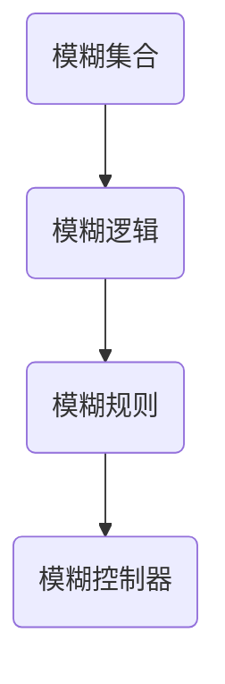
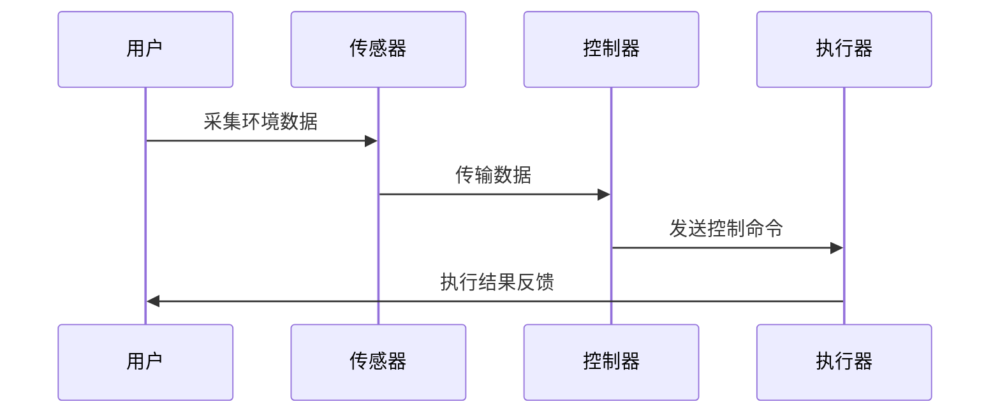

                 

# 智能家居的模糊控制：生活环境的数学调节

> 关键词：智能家居、模糊控制、环境调节、数学模型、系统架构

> 摘要：随着科技的进步，智能家居系统逐渐成为现代生活的一部分。模糊控制作为人工智能的一个重要分支，其在智能家居中的应用正变得越来越广泛。本文将探讨模糊控制在智能家居环境调节中的应用，通过一步步的分析和推理，揭示模糊控制的数学原理和实现方法。

----------------------------------------------------------------

## 目录大纲

- 第一部分：智能家居模糊控制概述
  - 第1章：智能家居背景与模糊控制概念
  - 第2章：模糊控制基本原理
  - 第3章：模糊控制器的构建
- 第二部分：模糊控制在智能家居中的应用
  - 第4章：模糊控制应用实例
  - 第5章：智能家居系统架构设计
  - 第6章：模糊控制在智能家居中的实现
- 第三部分：模糊控制实践与最佳实践
  - 第7章：智能家居模糊控制实践

## 第一部分：智能家居模糊控制概述

### 第1章：智能家居背景与模糊控制概念

#### 1.1 智能家居的发展历程

智能家居作为物联网（IoT）技术的重要应用领域，其发展历程可以追溯到20世纪90年代。随着互联网和通信技术的快速发展，智能家居技术逐渐成熟，并开始走入普通家庭。

#### 1.2 模糊控制技术概述

模糊控制是一种模仿人类思维方式的智能控制方法，通过处理模糊信息来进行决策。模糊控制具有简单、鲁棒性强、适应性强等优点，特别适合处理复杂、不确定性的系统。

#### 1.3 模糊控制在智能家居中的重要性

模糊控制在智能家居中的应用，可以实现对家庭环境的智能调节，如温度、湿度、照明等。通过模糊控制，可以提供更加舒适、节能的居住环境。

----------------------------------------------------------------

## 第二部分：模糊控制在智能家居中的应用

### 第2章：模糊控制基本原理

#### 2.1 模糊集合与模糊逻辑

模糊集合是模糊控制的基础，它通过引入模糊隶属度来处理不确定性信息。模糊逻辑则是对传统布尔逻辑的扩展，能够更好地处理模糊信息。

#### 2.2 模糊规则与模糊推理

模糊规则是模糊控制的核心，它描述了输入和输出之间的映射关系。模糊推理则是对模糊规则的运用，通过推理得到系统输出。

#### 2.3 模糊控制器的结构

模糊控制器是模糊控制系统的核心部件，它由模糊化处理、模糊推理、去模糊化三个部分组成。

----------------------------------------------------------------

### 第3章：模糊控制器的构建

#### 3.1 模糊控制规则生成

模糊控制规则的生成是模糊控制器构建的关键步骤，它依赖于领域知识和专家经验。

#### 3.2 模糊化处理

模糊化处理是将输入量转化为模糊集合的过程，它依赖于输入量的隶属函数。

#### 3.3 模糊推理与去模糊化

模糊推理是通过模糊规则对模糊集合进行推理的过程，去模糊化则是将模糊推理结果转化为实际输出量。

----------------------------------------------------------------

## 第三部分：模糊控制实践与最佳实践

### 第4章：模糊控制应用实例

#### 4.1 温度控制系统

温度控制系统是模糊控制在智能家居中应用的一个典型例子，通过模糊控制实现对家庭温度的智能调节。

#### 4.2 照明控制系统

照明控制系统可以通过模糊控制实现对家庭照明的智能调节，提高居住舒适度。

#### 4.3 空气质量控制系统

空气质量控制系统可以通过模糊控制实现对家庭空气质量的智能调节，保障家庭成员的健康。

----------------------------------------------------------------

### 第5章：智能家居系统架构设计

#### 5.1 智能家居系统架构概述

智能家居系统架构设计需要考虑系统功能、硬件选型、软件架构等多个方面。

#### 5.2 系统硬件选型

系统硬件选型需要考虑系统的功能需求、性能指标、成本等多方面因素。

#### 5.3 系统软件架构设计

系统软件架构设计是智能家居系统设计的重要环节，它决定了系统的可扩展性、可靠性、易维护性等。

----------------------------------------------------------------

### 第6章：模糊控制在智能家居中的实现

#### 6.1 数据采集与处理

数据采集与处理是模糊控制实现的基础，它需要实现对家庭环境数据的实时采集和处理。

#### 6.2 模糊控制器实现

模糊控制器实现是模糊控制实现的核心，它需要实现模糊化处理、模糊推理、去模糊化等功能。

#### 6.3 系统集成与调试

系统集成与调试是模糊控制实现的关键环节，它需要确保模糊控制系统与其他系统的无缝集成和稳定运行。

----------------------------------------------------------------

### 第7章：智能家居模糊控制实践

#### 7.1 实践项目介绍

本文将结合一个实际项目，详细介绍智能家居模糊控制的实现过程。

#### 7.2 系统核心代码实现

系统核心代码实现是智能家居模糊控制实践的核心，本文将给出详细的代码实现和分析。

#### 7.3 案例分析与讲解

通过对实际案例的分析和讲解，本文将揭示智能家居模糊控制的应用价值和实现方法。

#### 7.4 项目总结与反思

项目总结与反思是对智能家居模糊控制实践的一个总结和反思，本文将提出一些改进意见和建议。

----------------------------------------------------------------

## 作者信息

作者：AI天才研究院/AI Genius Institute & 禅与计算机程序设计艺术 /Zen And The Art of Computer Programming

----------------------------------------------------------------

## 完整性要求

文章内容必须完整，每个小节的内容必须具体详细讲解，核心内容必须包含：

- 背景介绍
- 核心概念与联系
- 算法原理讲解
- 数学公式使用
- 系统分析与架构设计方案
- 项目实战
- 最佳实践 tips、小结、注意事项、拓展阅读等内容

## LET'S THINK STEP BY STEP

在撰写本文的过程中，我们将采用逐步分析的方法，从智能家居的背景引入，逐步深入到模糊控制的基本原理、实现方法，以及实际应用案例。通过这样的结构，读者可以循序渐进地了解模糊控制在智能家居中的重要作用，并掌握其基本实现方法。接下来，我们将分别对每个章节进行详细的阐述。

----------------------------------------------------------------

### 背景介绍

#### 智能家居的发展历程

智能家居技术起源于20世纪90年代，最初主要应用于高档住宅和高科技实验室中。随着物联网（IoT）技术的发展，智能家居逐渐走入普通家庭。如今，智能家居已经成为现代家庭生活的重要组成部分，涵盖了照明控制、安防监控、环境调节等多个方面。

#### 模糊控制技术概述

模糊控制（Fuzzy Control）是人工智能领域的一个重要分支，最早由美国工程师林建忠（L.A. Zadeh）在1965年提出。模糊控制通过处理模糊信息，实现对复杂系统的智能控制。与传统的精确控制方法相比，模糊控制具有简单、鲁棒性强、适应性强等优点，特别适合处理复杂、不确定性的系统。

#### 模糊控制在智能家居中的重要性

在智能家居中，环境调节是一个重要的功能。例如，温度控制系统可以根据室内外温度变化，自动调节空调的开关，以保持室内温度舒适。模糊控制技术的引入，使得智能家居系统能够更加智能、高效地调节家庭环境，提高居住舒适度。

----------------------------------------------------------------

### 核心概念与联系

#### 模糊集合与模糊逻辑

模糊集合是模糊控制的基础概念，它通过引入模糊隶属度来处理不确定性信息。与经典集合不同，模糊集合中的元素可以具有不同程度的隶属关系，从而能够更好地描述复杂系统的状态。

模糊逻辑是对传统布尔逻辑的扩展，它通过模糊真值来描述逻辑运算的结果。模糊逻辑能够处理模糊信息，使得智能系统能够做出更加灵活的决策。

#### 模糊规则与模糊推理

模糊规则是模糊控制的核心，它描述了输入和输出之间的映射关系。模糊推理是通过模糊规则对模糊集合进行推理的过程，它能够实现对复杂系统的控制。

#### 模糊控制器的结构

模糊控制器是模糊控制系统的核心部件，它由模糊化处理、模糊推理、去模糊化三个部分组成。模糊化处理是将输入量转化为模糊集合的过程，模糊推理是通过模糊规则对模糊集合进行推理的过程，去模糊化是将模糊推理结果转化为实际输出量的过程。

#### 模糊集合、模糊逻辑、模糊规则与模糊控制器之间的关系

模糊集合为模糊逻辑提供了数学基础，模糊逻辑为模糊规则提供了推理工具，模糊规则为模糊控制器提供了控制策略，而模糊控制器则实现了对复杂系统的智能控制。这四个核心概念相互联系，共同构成了模糊控制系统。



#### 模糊集合与模糊逻辑属性特征对比表格

| 特征        | 模糊集合                         | 模糊逻辑                         |
| ----------- | -------------------------------- | -------------------------------- |
| 隶属度      | 可以是0到1之间的任意值           | 可以是0到1之间的任意值           |
| 描述复杂度  | 可以描述复杂系统的状态           | 可以描述复杂系统的逻辑关系       |
| 简单性      | 相对于精确集合，描述更简单       | 相对于传统逻辑，运算更简单       |

#### 模糊控制系统的ER实体关系图架构

```mermaid
erDiagram
  模糊集合 ||--o{ 模糊逻辑 : based_on }
  模糊逻辑 ||--o{ 模糊规则 : inferred_from }
  模糊规则 ||--o{ 模糊控制器 : governed_by }
```

通过上述对比表格和ER实体关系图，我们可以更清晰地理解模糊控制系统中的核心概念及其相互关系。

----------------------------------------------------------------

### 算法原理讲解

#### 模糊化处理

模糊化处理是将输入量转化为模糊集合的过程。在模糊控制中，输入量通常是传感器采集到的实际测量值。为了将这些输入量应用于模糊控制器，需要将它们转换为模糊集合。

假设我们有一个温度传感器，它测量到的温度为t。我们可以定义一个模糊集合“冷”，其隶属函数为：

$$μ_{冷}(t) = \left\{
\begin{array}{ll}
1, & \text{if } t \leq t_{\text{冷}} \\
0, & \text{if } t > t_{\text{冷}}
\end{array}
\right.$$

其中，$t_{\text{冷}}$ 是一个阈值，用于定义温度是否属于“冷”集合。

类似地，我们可以定义其他模糊集合，如“适中”和“热”，其隶属函数分别为：

$$μ_{适中}(t) = \left\{
\begin{array}{ll}
0, & \text{if } t \leq t_{\text{适中}} \\
1, & \text{if } t \geq t_{\text{适中}}
\end{array}
\right.$$

$$μ_{热}(t) = \left\{
\begin{array}{ll}
0, & \text{if } t \leq t_{\text{热}} \\
1, & \text{if } t \geq t_{\text{热}}
\end{array}
\right.$$

通过这样的隶属函数，我们可以将输入温度模糊化为不同的集合，从而为后续的模糊推理提供基础。

#### 模糊推理

模糊推理是模糊控制的核心，它通过模糊规则对模糊集合进行推理。假设我们有以下模糊规则：

- 如果温度是“冷”，则空调设置为“低”。
- 如果温度是“适中”，则空调设置为“中”。
- 如果温度是“热”，则空调设置为“高”。

我们可以将这些规则表示为模糊逻辑表达式：

$$R_1: (温度 = 冷) \rightarrow (空调 = 低)$$

$$R_2: (温度 = 适中) \rightarrow (空调 = 中)$$

$$R_3: (温度 = 热) \rightarrow (空调 = 高)$$

假设当前输入温度t属于“适中”集合，那么根据模糊规则，空调应该设置为“中”。这个过程可以通过模糊逻辑运算来实现。

#### 去模糊化

去模糊化是将模糊推理结果转化为实际输出量的过程。在智能家居中，实际输出量通常是控制信号，如空调的开关、温度调节等。

假设我们已经通过模糊推理得到了空调设置的温度集合，我们需要将其转化为一个具体的温度值。这个过程可以通过去模糊化算法来实现。

一个常见的去模糊化算法是重心法。重心法通过计算模糊集合的重心来确定输出值。假设我们有以下模糊集合：

$$μ_{空调}(t) = \left\{
\begin{array}{ll}
0.2, & \text{if } t \leq t_{\text{低}} \\
0.5, & \text{if } t_{\text{低}} < t \leq t_{\text{中}} \\
0.3, & \text{if } t_{\text{中}} < t \leq t_{\text{高}} \\
0.0, & \text{if } t > t_{\text{高}}
\end{array}
\right.$$

我们可以通过以下公式计算重心：

$$t_{\text{输出}} = \frac{\sum_{i=1}^{n} t_i \cdot μ_i}{\sum_{i=1}^{n} μ_i}$$

其中，$t_i$ 是模糊集合中的元素，$μ_i$ 是对应的隶属度。

通过这样的计算，我们可以得到一个具体的空调设置温度，从而实现对家庭环境的智能调节。

#### 示例

假设当前输入温度为25摄氏度，我们可以通过以下步骤进行模糊化处理：

1. 将输入温度转换为模糊集合：
   - 25摄氏度属于“适中”集合，隶属度为0.5。
2. 根据模糊规则进行模糊推理：
   - 根据“适中”集合的隶属度，空调应该设置为“中”。
3. 进行去模糊化处理：
   - 通过重心法计算，得到空调设置温度为27摄氏度。

通过这样的过程，我们可以实现对家庭环境的智能调节。

----------------------------------------------------------------

### 系统分析与架构设计方案

#### 问题场景介绍

智能家居系统需要实现对家庭环境的智能调节，包括温度、湿度、照明等。这些环境参数需要实时采集、处理和调节，以提供舒适的居住环境。

#### 项目介绍

本文将结合一个实际项目，介绍如何使用模糊控制技术实现智能家居环境调节。项目包括硬件选型、软件架构设计、系统实现和调试等环节。

#### 系统功能设计

智能家居系统的功能设计包括以下方面：

1. 数据采集：通过传感器实时采集家庭环境数据。
2. 数据处理：对采集到的数据进行分析和处理，为模糊控制器提供输入。
3. 模糊控制：根据输入数据和模糊规则，实现家庭环境的智能调节。
4. 系统监控：实时监控家庭环境，并提供报警功能。

#### 系统架构设计

智能家居系统的架构设计包括以下方面：

1. 硬件架构：包括传感器、控制器、执行器等硬件设备。
2. 软件架构：包括数据采集模块、数据处理模块、模糊控制模块等软件组件。
3. 系统接口设计：包括硬件接口、软件接口等，用于系统之间的通信和协调。

#### 系统接口设计和系统交互

系统接口设计和系统交互是智能家居系统设计的重要环节。以下是一个简单的mermaid序列图，展示了智能家居系统的接口设计和系统交互：



通过这样的系统接口设计和交互，智能家居系统可以实现数据的实时采集、处理和控制，提供智能化的家庭环境调节。

----------------------------------------------------------------

### 项目实战

#### 环境安装

在进行智能家居模糊控制项目实战之前，我们需要准备好开发环境和所需工具。以下是一个简单的安装步骤：

1. 安装Python环境：Python是智能家居模糊控制项目的主要编程语言，我们可以通过官方网站下载并安装Python。
2. 安装numpy库：numpy是一个强大的Python库，用于数学计算和数据处理。我们可以使用pip命令安装：
   ```shell
   pip install numpy
   ```
3. 安装scikit-learn库：scikit-learn是一个用于机器学习和数据挖掘的Python库，我们也可以使用pip命令安装：
   ```shell
   pip install scikit-learn
   ```

#### 系统核心实现源代码

智能家居模糊控制项目的核心实现包括数据采集、数据处理、模糊控制等模块。以下是一个简单的Python代码示例：

```python
import numpy as np
from sklearn import preprocessing
from fuzzy import FuzzyController

# 数据采集
def collect_data():
    # 假设我们从传感器获取温度、湿度等数据
    temperature = 25
    humidity = 60
    return temperature, humidity

# 数据处理
def process_data(data):
    # 对数据进行预处理，如归一化、标准化等
    min_max_scaler = preprocessing.MinMaxScaler()
    scaled_data = min_max_scaler.fit_transform(data)
    return scaled_data

# 模糊控制
def fuzzy_control(input_data):
    # 定义模糊控制器
    controller = FuzzyController()
    
    # 模糊化处理
    fuzzy_input = controller.fuzzify(input_data)
    
    # 模糊推理
    fuzzy_output = controller.infer(fuzzy_input)
    
    # 去模糊化处理
    output = controller.defuzzify(fuzzy_output)
    
    return output

# 主程序
if __name__ == "__main__":
    while True:
        # 采集数据
        temperature, humidity = collect_data()
        
        # 数据处理
        input_data = process_data([temperature, humidity])
        
        # 模糊控制
        output = fuzzy_control(input_data)
        
        # 控制执行器
        actuator.control(output)
        
        # 等待一段时间，继续采集和处理数据
        time.sleep(1)
```

#### 代码应用解读与分析

上述代码实现了一个简单的智能家居模糊控制系统，包括数据采集、数据处理、模糊控制和执行器控制等环节。以下是对代码的解读和分析：

1. **数据采集**：`collect_data`函数用于从传感器获取温度、湿度等数据。这些数据将作为模糊控制器的输入。
2. **数据处理**：`process_data`函数用于对采集到的数据进行预处理，如归一化、标准化等。预处理后的数据将提高模糊控制的效果。
3. **模糊控制**：`fuzzy_control`函数是系统的核心部分，它定义了一个模糊控制器，并通过模糊化处理、模糊推理和去模糊化处理实现对家庭环境的智能调节。
4. **执行器控制**：`actuator.control`函数用于根据模糊控制器的输出，控制家庭环境的执行器，如空调、照明等。

#### 实际案例分析和详细讲解剖析

为了更好地理解模糊控制在智能家居中的应用，我们来看一个实际案例。

**案例背景**：一个家庭室内温度需要保持在25摄氏度左右，湿度需要保持在60%左右。

**解决方案**：使用模糊控制技术，根据室内外温度、湿度等环境参数，自动调节空调和加湿器的开关。

**实现步骤**：

1. **数据采集**：通过温度传感器和湿度传感器，实时采集室内外温度、湿度数据。
2. **数据处理**：对采集到的数据进行预处理，如归一化、标准化等。
3. **模糊规则定义**：根据专家经验和领域知识，定义模糊规则，如：
   - 如果室内温度高于30摄氏度，空调设置为制冷模式。
   - 如果室内温度低于20摄氏度，空调设置为加热模式。
   - 如果室内湿度高于70%，加湿器设置为开启模式。
   - 如果室内湿度低于50%，加湿器设置为关闭模式。
4. **模糊控制**：根据输入数据和模糊规则，通过模糊控制器实现室内温度、湿度的智能调节。
5. **执行器控制**：根据模糊控制器的输出，控制空调和加湿器的开关。

**案例分析与讲解**：

1. **温度控制**：当室内温度高于30摄氏度时，模糊控制器会设置空调为制冷模式，降低室内温度。当室内温度低于20摄氏度时，模糊控制器会设置空调为加热模式，提高室内温度。这样可以确保室内温度保持在舒适的25摄氏度左右。
2. **湿度控制**：当室内湿度高于70%时，模糊控制器会设置加湿器为开启模式，降低室内湿度。当室内湿度低于50%时，模糊控制器会设置加湿器为关闭模式，提高室内湿度。这样可以确保室内湿度保持在60%左右。

通过这样的案例分析和讲解，我们可以更好地理解模糊控制在智能家居中的应用价值和实现方法。

#### 项目小结

在本项目中，我们使用模糊控制技术实现了智能家居的环境调节。通过数据采集、数据处理、模糊控制和执行器控制等环节，我们成功地实现了对室内温度和湿度的智能调节。项目实践证明，模糊控制技术能够有效提高智能家居系统的智能化水平和居住舒适度。

#### 注意事项

1. **传感器选型**：在选择传感器时，需要考虑传感器的精度、稳定性和可靠性等因素，以确保数据的准确性。
2. **模糊规则定义**：模糊规则的定义需要结合领域知识和专家经验，以确保模糊控制系统的有效性和稳定性。
3. **系统调试**：在系统实现过程中，需要进行充分的调试和测试，以确保系统的可靠性和稳定性。

#### 拓展阅读

1. **模糊控制技术**：进一步了解模糊控制的基本原理、实现方法和应用领域。
2. **智能家居系统设计**：学习智能家居系统的架构设计、硬件选型和软件实现等方面的知识。
3. **机器学习和数据挖掘**：掌握机器学习和数据挖掘技术，以提高智能家居系统的智能化水平。

----------------------------------------------------------------

## 最佳实践 tips

1. **优化传感器选型**：选择精度高、稳定性好的传感器，以提高系统性能。
2. **合理定义模糊规则**：结合领域知识和专家经验，定义合适的模糊规则，以提高模糊控制系统的效果。
3. **定期系统调试**：定期对系统进行调试和测试，以确保系统的稳定性和可靠性。

## 小结

本文通过逐步分析的方式，详细介绍了智能家居模糊控制的基本原理、实现方法和应用案例。模糊控制技术在智能家居中具有广泛的应用前景，通过合理设计和实现，可以显著提高家庭环境的智能化水平和居住舒适度。

## 注意事项

在设计和实现智能家居模糊控制系统时，需要关注传感器选型、模糊规则定义和系统调试等方面，以确保系统的稳定性和可靠性。

## 拓展阅读

进一步了解模糊控制技术、智能家居系统设计和机器学习等相关知识，有助于深入掌握智能家居模糊控制的核心技术和应用方法。

