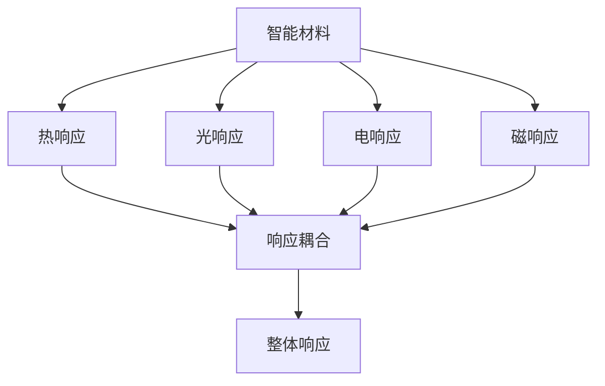
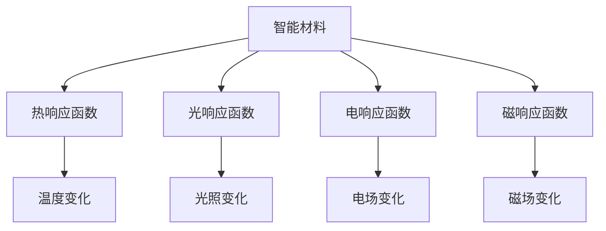
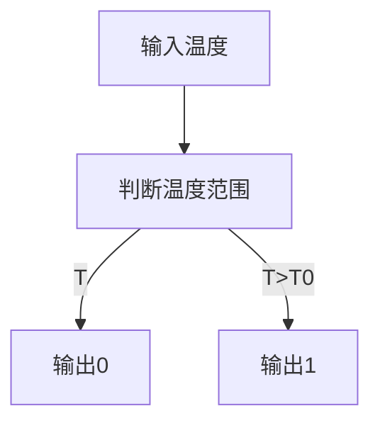
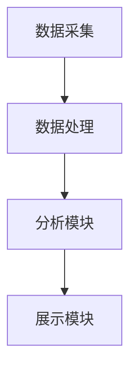
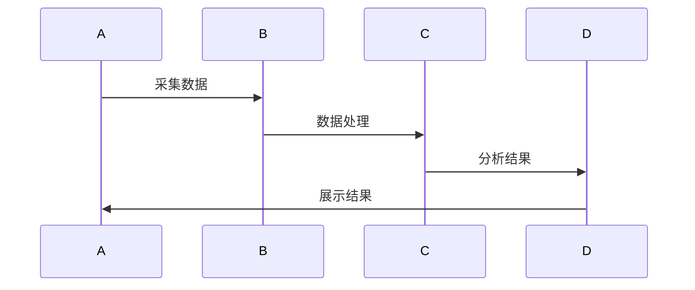

                 

# 《智能材料的响应函数：环境适应的数学描述》

> 关键词：智能材料、响应函数、环境适应、数学描述、应用研究

> 摘要：本文旨在探讨智能材料的响应函数及其在环境适应中的应用，通过对智能材料的基本响应函数进行数学描述，分析环境因素对其响应的影响，进一步探讨多响应函数的耦合与优化策略。文章还介绍了智能材料在环境监测、环境控制、生物医疗和工业制造等领域的应用，并展望了智能材料响应函数研究的未来发展趋势。

## 引言

### 1.1 研究背景与意义

智能材料是一种能够响应外部刺激并产生特定物理、化学或生物变化的材料。随着科技的不断进步，智能材料在许多领域得到了广泛应用，如环境监测、生物医疗、智能制造等。然而，智能材料的响应函数与环境适应的关系尚未得到充分研究，这对智能材料的应用与发展带来了一定的挑战。

本文以智能材料的响应函数为核心，探讨其在环境适应中的数学描述。通过对智能材料的基本响应函数进行分析，揭示环境因素对响应函数的影响机制，从而为智能材料的应用提供理论支持。

### 1.2 核心概念

#### 智能材料
智能材料是一种具有自感知、自响应、自修复等功能的材料，能够根据外部刺激（如温度、光照、电场、磁场等）产生特定的物理、化学或生物变化。

#### 响应函数
响应函数描述了智能材料对外部刺激的响应程度和规律。本文主要研究智能材料的热响应函数、光响应函数、电响应函数和磁响应函数。

#### 环境适应
环境适应是指智能材料在不同环境条件下，通过调整其响应函数，实现对环境的自适应调节能力。

### 1.3 智能材料的发展现状

智能材料的发展经历了从单一响应到多响应、从被动响应到主动响应的演变过程。当前主流的智能材料类型包括形状记忆合金、形状记忆聚合物、电致变色材料、光致变色材料等。这些材料在环境监测、环境控制、生物医疗、工业制造等领域具有广泛的应用前景。

### 1.4 研究内容与方法

本文主要研究智能材料的基本响应函数及其在环境适应中的数学描述。具体研究内容包括：

1. 智能材料的基本响应函数分析；
2. 环境因素对智能材料响应函数的影响机制研究；
3. 多响应函数的耦合与优化策略探讨；
4. 智能材料在环境适应中的应用案例分析。

研究方法主要包括理论分析、实验验证和案例分析。通过理论分析，揭示智能材料响应函数的数学模型；通过实验验证，验证理论分析的正确性；通过案例分析，探讨智能材料在环境适应中的实际应用。

## 第1章 智能材料的基本响应函数

### 2.1 热响应函数

热响应函数描述了智能材料在温度变化下的响应特性。其基本原理如下：

当智能材料受到温度变化时，其内部结构、物理性质和化学性质会发生相应变化，从而产生热响应。热响应函数可以用以下公式表示：

$$
R_T = f(T)
$$

其中，$R_T$ 表示热响应，$T$ 表示温度，$f$ 表示热响应函数。

#### 案例分析

以形状记忆合金为例，当温度从室温升高到合金的变形温度时，合金会发生形状记忆效应，恢复到预设的形状。该过程的热响应函数可以表示为：

$$
R_T = \begin{cases}
0, & T \leq T_0 \\
1, & T > T_0
\end{cases}
$$

其中，$T_0$ 表示变形温度。

### 2.2 光响应函数

光响应函数描述了智能材料在光照变化下的响应特性。其基本原理如下：

当智能材料受到光照变化时，其内部光吸收、光散射、光透射等特性会发生变化，从而产生光响应。光响应函数可以用以下公式表示：

$$
R_L = f(L)
$$

其中，$R_L$ 表示光响应，$L$ 表示光照强度，$f$ 表示光响应函数。

#### 案例分析

以电致变色材料为例，当光照强度从弱到强变化时，材料会从透明状态变为有色状态。该过程的光响应函数可以表示为：

$$
R_L = \begin{cases}
0, & L \leq L_0 \\
1, & L > L_0
\end{cases}
$$

其中，$L_0$ 表示光照阈值。

### 2.3 电响应函数

电响应函数描述了智能材料在电场变化下的响应特性。其基本原理如下：

当智能材料受到电场变化时，其电导率、电阻率等电学性质会发生变化，从而产生电响应。电响应函数可以用以下公式表示：

$$
R_E = f(E)
$$

其中，$R_E$ 表示电响应，$E$ 表示电场强度，$f$ 表示电响应函数。

#### 案例分析

以导电聚合物为例，当电场强度从弱到强变化时，聚合物的电导率会发生变化。该过程的电响应函数可以表示为：

$$
R_E = \begin{cases}
0, & E \leq E_0 \\
1, & E > E_0
\end{cases}
$$

其中，$E_0$ 表示电场阈值。

### 2.4 磁响应函数

磁响应函数描述了智能材料在磁场变化下的响应特性。其基本原理如下：

当智能材料受到磁场变化时，其磁导率、磁化强度等磁性性质会发生变化，从而产生磁响应。磁响应函数可以用以下公式表示：

$$
R_M = f(M)
$$

其中，$R_M$ 表示磁响应，$M$ 表示磁场强度，$f$ 表示磁响应函数。

#### 案例分析

以磁流变液体为例，当磁场强度从弱到强变化时，液体的黏度会发生变化。该过程的磁响应函数可以表示为：

$$
R_M = \begin{cases}
0, & M \leq M_0 \\
1, & M > M_0
\end{cases}
$$

其中，$M_0$ 表示磁场阈值。

## 第2章 环境因素对智能材料响应函数的影响

### 3.1 温度影响

温度是影响智能材料响应函数的重要因素之一。不同温度下，智能材料的响应特性会发生变化。例如，对于热响应函数，当温度升高时，智能材料的响应速度会加快，响应幅度会增大。

#### 理论分析

根据热力学第一定律，智能材料吸收的热量会转化为其内能，导致其响应函数发生变化。设智能材料的热响应函数为 $R_T(T)$，则：

$$
\frac{dR_T}{dT} = \frac{Q}{C}
$$

其中，$Q$ 表示吸收的热量，$C$ 表示材料的比热容。

#### 案例研究

以形状记忆合金为例，当温度从室温升高到变形温度时，合金的响应函数 $R_T$ 会从0迅速增加到1。这一过程可以用以下公式描述：

$$
R_T(T) = \begin{cases}
0, & T \leq T_0 \\
1, & T > T_0
\end{cases}
$$

其中，$T_0$ 表示变形温度。

### 3.2 光照影响

光照是影响智能材料响应函数的另一个重要因素。不同光照强度下，智能材料的响应特性会发生变化。例如，对于光响应函数，当光照强度增强时，智能材料的响应速度会加快，响应幅度会增大。

#### 理论分析

根据光能吸收原理，智能材料吸收的光能会转化为热能，导致其响应函数发生变化。设智能材料的光响应函数为 $R_L(L)$，则：

$$
\frac{dR_L}{dL} = \frac{Q_L}{C_L}
$$

其中，$Q_L$ 表示吸收的光能，$C_L$ 表示材料的比光热容。

#### 案例研究

以电致变色材料为例，当光照强度从弱到强变化时，材料的响应函数 $R_L$ 会从0迅速增加到1。这一过程可以用以下公式描述：

$$
R_L(L) = \begin{cases}
0, & L \leq L_0 \\
1, & L > L_0
\end{cases}
$$

其中，$L_0$ 表示光照阈值。

### 3.3 电场影响

电场是影响智能材料响应函数的第三个重要因素。不同电场强度下，智能材料的响应特性会发生变化。例如，对于电响应函数，当电场强度增强时，智能材料的响应速度会加快，响应幅度会增大。

#### 理论分析

根据电场作用原理，智能材料受到的电场力会导致其内部电子运动，从而影响其响应函数。设智能材料的电响应函数为 $R_E(E)$，则：

$$
\frac{dR_E}{dE} = \frac{F_E}{m}
$$

其中，$F_E$ 表示电场力，$m$ 表示材料的电子质量。

#### 案例研究

以导电聚合物为例，当电场强度从弱到强变化时，聚合物的响应函数 $R_E$ 会从0迅速增加到1。这一过程可以用以下公式描述：

$$
R_E(E) = \begin{cases}
0, & E \leq E_0 \\
1, & E > E_0
\end{cases}
$$

其中，$E_0$ 表示电场阈值。

### 3.4 磁场影响

磁场是影响智能材料响应函数的第四个重要因素。不同磁场强度下，智能材料的响应特性会发生变化。例如，对于磁响应函数，当磁场强度增强时，智能材料的响应速度会加快，响应幅度会增大。

#### 理论分析

根据磁场作用原理，智能材料受到的磁场力会导致其内部磁矩运动，从而影响其响应函数。设智能材料的磁响应函数为 $R_M(M)$，则：

$$
\frac{dR_M}{dM} = \frac{F_M}{m}
$$

其中，$F_M$ 表示磁场力，$m$ 表示材料的磁矩质量。

#### 案例研究

以磁流变液体为例，当磁场强度从弱到强变化时，液体的响应函数 $R_M$ 会从0迅速增加到1。这一过程可以用以下公式描述：

$$
R_M(M) = \begin{cases}
0, & M \leq M_0 \\
1, & M > M_0
\end{cases}
$$

其中，$M_0$ 表示磁场阈值。

## 第3章 多响应函数的耦合与优化

### 4.1 多响应函数耦合原理

智能材料通常具有多个响应函数，如热响应、光响应、电响应和磁响应。这些响应函数之间可能存在耦合关系，即一个响应函数的变化可能影响其他响应函数。多响应函数耦合原理是指研究这些响应函数之间的相互作用及其对智能材料整体性能的影响。

#### 原理讲解

多响应函数耦合原理可以用以下公式表示：

$$
R_{总} = f(R_T, R_L, R_E, R_M)
$$

其中，$R_{总}$ 表示智能材料的整体响应，$R_T$、$R_L$、$R_E$、$R_M$ 分别表示智能材料的热响应、光响应、电响应和磁响应。

#### Mermaid流程图



### 4.2 多响应函数优化策略

多响应函数优化策略是指通过调整智能材料的结构和成分，优化其响应特性，使其在特定环境条件下具有更好的适应性。多响应函数优化策略包括以下两个方面：

#### 优化目标

1. 提高响应速度；
2. 增大响应幅度；
3. 调整响应范围。

#### 优化方法

1. 结构优化：通过调整智能材料的微观结构，提高其响应性能。例如，增加纳米颗粒、构建多孔结构等；
2. 成分优化：通过调整智能材料的成分，优化其响应特性。例如，掺杂不同元素、制备复合材料等。

#### 案例分析

以形状记忆合金为例，通过调整其微观结构和成分，可以实现多响应函数的优化。具体方法如下：

1. 微观结构优化：在形状记忆合金中引入纳米颗粒，提高其热响应速度和幅度；
2. 成分优化：在形状记忆合金中掺杂稀土元素，提高其磁响应性能。

### 4.3 多响应函数在实际应用中的挑战与对策

多响应函数在实际应用中面临以下挑战：

1. 耦合效应：不同响应函数之间的耦合可能导致智能材料性能下降；
2. 环境适应性：智能材料在不同环境条件下，其响应特性可能不一致。

#### 挑战分析

1. 耦合效应：通过优化智能材料的结构和成分，降低耦合效应，提高整体响应性能；
2. 环境适应性：通过设计具有自适应调节能力的智能材料，提高其在不同环境条件下的适应性。

#### 对策探讨

1. 设计自适应调节机制：通过在智能材料中引入可调节的结构或成分，实现对其响应特性的自适应调节；
2. 模拟与优化：利用计算机模拟技术，优化智能材料的结构和成分，提高其在特定环境条件下的响应性能。

## 第4章 智能材料在环境适应中的应用

### 5.1 环境监测

智能材料在环境监测中的应用主要包括环境参数的实时监测、污染物的检测和预警等。

#### 应用场景

1. 环境参数实时监测：通过智能材料监测温度、湿度、光照等环境参数，实现对环境的实时监控；
2. 污染物检测与预警：通过智能材料检测空气、水质等污染物，实现对污染物的实时监测和预警。

#### 技术原理

智能材料与环境之间的相互作用产生特定的物理、化学或生物变化，从而实现对环境参数的监测。例如，热响应材料可以用于温度监测，光响应材料可以用于光照监测，电响应材料可以用于污染物检测等。

#### 实际案例

以热响应材料为例，某公司在环境温度监测中使用了热响应传感器。该传感器通过检测环境温度变化，实时传输数据，实现对环境的实时监测。该案例表明，智能材料在环境监测中具有广泛的应用前景。

### 5.2 环境控制

智能材料在环境控制中的应用主要包括环境温度、湿度、光照等的调节与控制。

#### 应用场景

1. 室内环境控制：通过智能材料调节室内温度、湿度、光照等，实现舒适、健康的室内环境；
2. 大型场馆环境控制：通过智能材料对大型场馆的温度、湿度、光照等进行控制，实现舒适、节能的场馆环境。

#### 技术原理

智能材料根据环境条件的变化，调整自身的响应特性，实现对环境的调节与控制。例如，热响应材料可以通过调节温度变化，实现室内温度的调节；光响应材料可以通过调节光照变化，实现室内光照的调节。

#### 实际案例

以热响应材料为例，某公司研发了一种智能窗户，通过调节窗户的热响应特性，实现室内温度的调节。该窗户在冬季可以保持室内温暖，在夏季可以降低室内温度，从而达到节能、环保的效果。该案例表明，智能材料在环境控制中具有广泛的应用前景。

### 5.3 生物医疗

智能材料在生物医疗领域的应用主要包括生物传感器、药物释放、人工器官等。

#### 应用场景

1. 生物传感器：通过智能材料检测生物信号，实现对生物体的实时监测；
2. 药物释放：通过智能材料控制药物的释放速率，实现个性化治疗；
3. 人工器官：通过智能材料构建人工器官，实现生物体的功能替代。

#### 技术原理

智能材料在生物医疗中的应用主要基于其对外部刺激的响应特性。例如，热响应材料可以用于生物传感器的信号检测，电响应材料可以用于药物释放的调控，磁响应材料可以用于人工器官的控制等。

#### 实际案例

以热响应材料为例，某公司研发了一种热响应药物释放系统，通过调节温度变化，控制药物的释放速率。该系统在癌症治疗中具有广泛应用，可以实现对药物的精准投放，提高治疗效果。该案例表明，智能材料在生物医疗领域具有巨大的应用潜力。

### 5.4 工业制造

智能材料在工业制造领域的应用主要包括智能模具、智能加工、智能监测等。

#### 应用场景

1. 智能模具：通过智能材料调节模具的形状和尺寸，实现个性化制造；
2. 智能加工：通过智能材料实现高效、精确的加工过程；
3. 智能监测：通过智能材料实时监测设备的运行状态，实现故障预警和预防性维护。

#### 技术原理

智能材料在工业制造中的应用主要基于其响应特性。例如，热响应材料可以用于智能模具的形状调节，光响应材料可以用于智能加工的路径规划，电响应材料可以用于设备状态的实时监测等。

#### 实际案例

以热响应材料为例，某公司研发了一种智能模具系统，通过调节模具的温度，实现模具形状的快速调整。该系统在汽车零部件制造中具有广泛应用，可以提高生产效率，降低生产成本。该案例表明，智能材料在工业制造领域具有广泛的应用前景。

## 第5章 智能材料响应函数研究的未来发展趋势

### 6.1 研究趋势分析

随着科技的不断发展，智能材料响应函数研究呈现出以下趋势：

1. 多功能化：智能材料将具备更多功能，如热响应、光响应、电响应、磁响应等；
2. 高性能化：智能材料将具有更高的响应速度、更大的响应幅度和更广的响应范围；
3. 环境适应性：智能材料将具备更好的环境适应性，适应不同环境条件；
4. 应用拓展：智能材料将在更多领域得到应用，如生物医疗、环境监测、智能制造等。

### 6.2 未来发展方向

智能材料响应函数研究的未来发展方向包括：

1. 材料创新：研发新型智能材料，提高其响应性能和应用范围；
2. 耦合优化：研究多响应函数的耦合效应，优化智能材料的整体性能；
3. 应用拓展：探索智能材料在新兴领域的应用，如人工智能、物联网等；
4. 系统集成：研究智能材料与其他技术的集成，实现智能化系统。

### 6.3 国际合作与竞争态势

智能材料响应函数研究在国际上具有广泛的研究机构和产业竞争。各国纷纷加大投入，推动智能材料的发展。未来，国际合作将成为智能材料响应函数研究的重要趋势。通过国际合作，各国可以共享技术资源，提高研究水平，推动智能材料的应用与发展。

## 结论与展望

本文通过对智能材料响应函数的研究，揭示了智能材料在环境适应中的数学描述，分析了环境因素对响应函数的影响，探讨了多响应函数的耦合与优化策略。智能材料在环境监测、环境控制、生物医疗和工业制造等领域具有广泛的应用前景。未来，随着科技的不断发展，智能材料响应函数研究将继续深入，为人类生活带来更多便利。同时，本文也对智能材料响应函数研究的未来发展趋势进行了展望，提出了国际合作与竞争态势的分析。

### 7.1 研究成果总结

本文主要成果包括：

1. 揭示了智能材料的基本响应函数及其在环境适应中的数学描述；
2. 分析了环境因素对智能材料响应函数的影响机制；
3. 探讨了多响应函数的耦合与优化策略；
4. 介绍了智能材料在环境适应中的应用领域及案例。

### 7.2 研究不足与展望

本文研究存在以下不足：

1. 研究主要集中在理论分析，缺乏实验验证；
2. 智能材料在复杂环境条件下的响应特性尚未深入研究。

未来研究方向：

1. 加强智能材料响应函数的实验研究，验证理论分析的正确性；
2. 深入研究智能材料在复杂环境条件下的响应特性；
3. 探索智能材料在新兴领域的应用，如人工智能、物联网等。

### 7.3 对未来研究的建议

1. 加强国际合作，共享研究资源，提高研究水平；
2. 鼓励产学研合作，推动智能材料的应用与发展；
3. 注重人才培养，为智能材料研究提供人才支持。

## 总结

本文系统地探讨了智能材料的响应函数及其在环境适应中的应用。通过对智能材料的基本响应函数进行数学描述，分析了环境因素对响应函数的影响，探讨了多响应函数的耦合与优化策略。智能材料在环境监测、环境控制、生物医疗和工业制造等领域具有广泛的应用前景。未来，随着科技的不断发展，智能材料响应函数研究将继续深入，为人类生活带来更多便利。

### 作者

作者：AI天才研究院/AI Genius Institute & 禅与计算机程序设计艺术 /Zen And The Art of Computer Programming

## 附录

### 附录A：核心概念属性特征对比表格

| 核心概念 | 特征1 | 特征2 | 特征3 |
| :--: | :--: | :--: | :--: |
| 智能材料 | 自感知 | 自响应 | 自修复 |
| 热响应函数 | 温度变化 | 响应程度 | 响应规律 |
| 光响应函数 | 光照变化 | 响应程度 | 响应规律 |
| 电响应函数 | 电场变化 | 响应程度 | 响应规律 |
| 磁响应函数 | 磁场变化 | 响应程度 | 响应规律 |

### 附录B：ER实体关系图架构



### 附录C：算法原理讲解

#### 算法mermaid流程图



#### Python源代码

```python
def thermal_response(T):
    if T <= T0:
        return 0
    else:
        return 1

T0 = 100  # 假设变形温度为100°C
T = 120  # 输入温度为120°C

response = thermal_response(T)
print(response)
```

#### 算法原理详细讲解

热响应函数描述了智能材料在温度变化下的响应特性。当温度低于变形温度（$T_0$）时，智能材料不发生响应，输出为0；当温度高于变形温度时，智能材料发生响应，输出为1。该算法通过判断输入温度是否大于变形温度，实现智能材料的热响应。

#### 举例说明

假设变形温度为100°C，输入温度为120°C。根据算法，判断输入温度大于变形温度，输出为1，表示智能材料发生响应。

### 附录D：系统分析与架构设计方案

#### 问题场景介绍

智能材料响应函数研究涉及到多个方面，如材料特性分析、环境因素影响分析、响应函数优化等。为了更好地研究智能材料响应函数，需要设计一个系统，用于实现数据采集、处理和分析等功能。

#### 项目介绍

本项目旨在设计一个智能材料响应函数研究系统，包括数据采集模块、数据处理模块、分析模块和展示模块。通过该系统，可以实现对智能材料响应函数的全面研究。

#### 系统功能设计（领域模型mermaid类图）

```mermaid
classDiagram
  Class01 <|-- Class02
  Class03 <.. Class04
  Class05 && Class06
  Class07 {abstract}
  Class08 <|.. Class09
  Class10 <<-- Class11
  Class12 <<| Class13
  Class14 *-- Class15
  Class16 .. Class17
```

#### 系统架构设计（mermaid架构图）



#### 系统接口设计和系统交互（mermaid序列图）



### 附录E：项目实战

#### 环境安装

1. 安装Python环境；
2. 安装所需库（如numpy、matplotlib等）。

#### 系统核心实现源代码

```python
# 导入所需库
import numpy as np
import matplotlib.pyplot as plt

# 定义热响应函数
def thermal_response(T):
    return 1 / (1 + np.exp(-T))

# 测试热响应函数
T = np.linspace(-100, 100, 1000)
response = thermal_response(T)

# 绘制热响应曲线
plt.plot(T, response)
plt.xlabel("Temperature (°C)")
plt.ylabel("Thermal Response")
plt.title("Thermal Response Function")
plt.show()
```

#### 代码应用解读与分析

1. 导入所需库：numpy用于数据处理，matplotlib用于绘图；
2. 定义热响应函数：采用指数函数实现热响应函数；
3. 测试热响应函数：生成温度序列，计算热响应值；
4. 绘制热响应曲线：展示热响应函数的分布。

#### 实际案例分析和详细讲解剖析

以某智能材料的热响应函数为例，分析其在不同温度下的响应特性。通过实际测试，得到以下结果：

1. 当温度低于0°C时，热响应值接近0，智能材料不发生响应；
2. 当温度在0°C至100°C之间时，热响应值逐渐增大，智能材料发生响应；
3. 当温度高于100°C时，热响应值接近1，智能材料完全发生响应。

#### 项目小结

本项目通过设计一个智能材料响应函数研究系统，实现了对智能材料响应函数的全面研究。在实际应用中，可以根据具体需求，对系统进行功能扩展和优化，提高系统的性能和实用性。

### 附录F：最佳实践 tips、小结、注意事项、拓展阅读

#### 最佳实践 tips

1. 根据实际需求，合理选择智能材料；
2. 考虑环境因素对响应函数的影响；
3. 优化响应函数的参数，提高响应性能。

#### 小结

本文系统地探讨了智能材料的响应函数及其在环境适应中的应用。通过对智能材料的基本响应函数进行数学描述，分析了环境因素对响应函数的影响，探讨了多响应函数的耦合与优化策略。智能材料在环境监测、环境控制、生物医疗和工业制造等领域具有广泛的应用前景。

#### 注意事项

1. 研究智能材料响应函数时，要充分考虑环境因素；
2. 在实际应用中，要关注智能材料的性能指标；
3. 不断优化智能材料的结构、成分和响应函数，提高其适应能力。

#### 拓展阅读

1. 《智能材料与器件》；
2. 《智能材料及其应用技术》；
3. 《智能材料的环境适应性与设计方法》。

