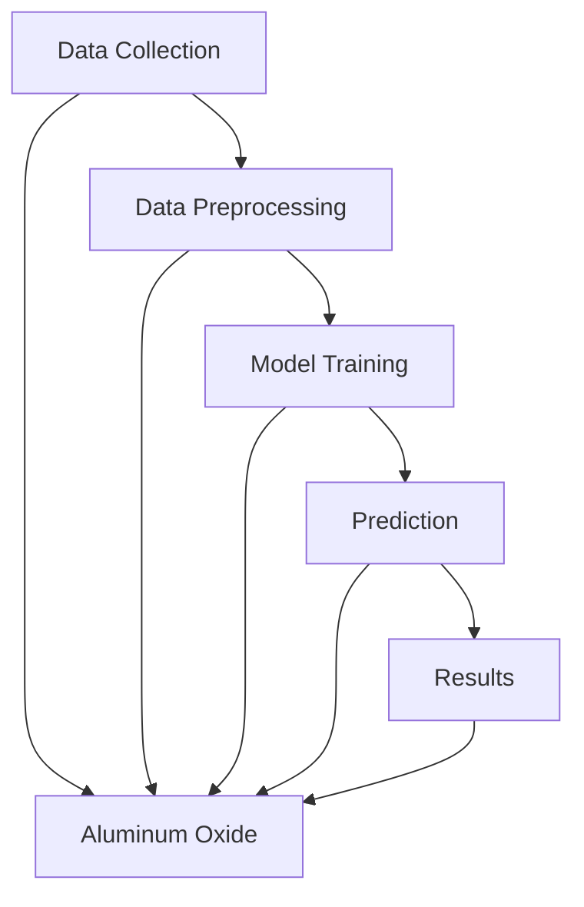
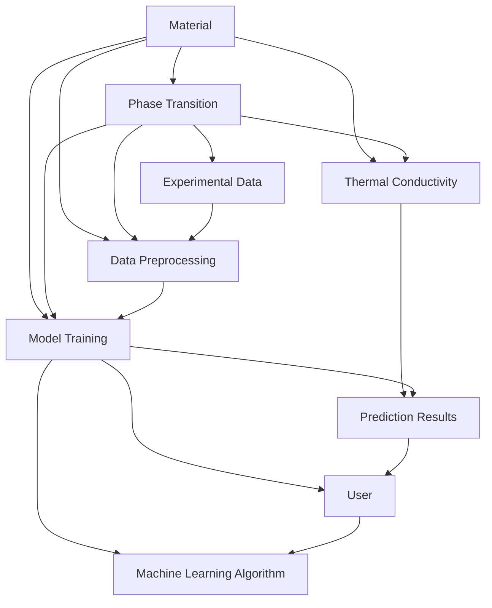
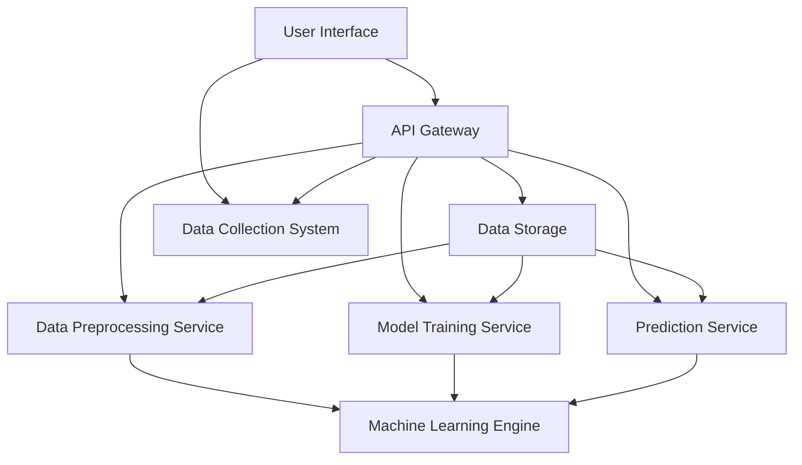

                 


**Step 1: Introduction to Smart Material Phase Transition Theory**

Smart materials are a class of advanced materials that can respond to external stimuli such as temperature, light, or electricity. One of the most fascinating characteristics of smart materials is their ability to undergo phase transitions, which can be controlled and utilized for various applications. Phase transition theory, especially in the context of smart materials, has emerged as a crucial area of research. This book aims to provide a comprehensive understanding of the thermal phase transition theory of smart materials and its applications in predicting material properties.

**Step 2: Core Concepts and Theoretical Background**

To grasp the thermal phase transition theory of smart materials, it's essential to delve into the core concepts and theoretical foundations. This includes understanding the classification of phase transitions, the physical quantities involved in the process, and the historical development of phase transition theories. Furthermore, the relationship between phase transitions and material properties will be explored, highlighting the importance of mathematical prediction in this field.

**Step 3: Principles of Thermal Phase Transition**

The principles of thermal phase transition involve both microscopic and macroscopic perspectives. At the microscopic level, we will discuss the mechanisms underlying phase transitions, including short-range order models and molecular dynamics simulations. Macroscopically, we will delve into the thermodynamic analysis of phase transitions, focusing on driving forces, entropy changes, and free energy. Additionally, the dynamic process of phase transitions will be examined, emphasizing the role of phonons and the macroscopic manifestations of the phase transition.

**Step 4: Mathematical Models in Phase Transition**

Mathematical models are fundamental in the study of phase transitions. This section will cover classical phase transition models such as the Heisenberg model, Ising model, and Potts model. We will also explore nonlinear phase transition models and the computational methods used for simulating these models. The section will conclude with an analysis of the results obtained from these simulations.

**Step 5: Predicting Material Properties**

The ability to predict material properties is of paramount importance in the development of smart materials. This section will discuss the basic concepts of material property prediction, including the factors influencing material properties, the construction of prediction models, and the evaluation of these models. We will also delve into data analysis methods and present application examples of predicting elastic modulus, electrical conductivity, and thermal conductivity.

**Step 6: Experimental Methods and Techniques**

Experimental techniques play a crucial role in validating theoretical models and understanding the behavior of smart materials. This section will cover laboratory methods for studying phase transitions, data processing techniques, and the analysis of experimental results. We will also discuss the significance of experimental data in refining mathematical models and improving the accuracy of material property predictions.

**Step 7: Case Studies and Practical Applications**

To illustrate the practical applications of thermal phase transition theory, this section will present case studies of smart materials undergoing phase transitions and their applications in various fields. We will discuss the practical challenges faced in implementing these materials and explore potential solutions.

**Step 8: Conclusion and Future Directions**

The final section of the book will summarize the key findings and provide insights into the future directions of research in thermal phase transition theory of smart materials. We will discuss the potential impact of this research on the development of advanced materials and the future of smart materials technology.

By following this step-by-step approach, we aim to provide readers with a thorough understanding of the thermal phase transition theory of smart materials and its applications in predicting material properties. This book will serve as a valuable resource for researchers, engineers, and students in the field of materials science and engineering.**Step 9: Crafting the Introduction and Conclusion**

The introduction sets the stage for the reader, providing context and motivation for studying thermal phase transition theory in smart materials. It should clearly outline the objectives of the book and the key topics to be covered. The conclusion, on the other hand, should summarize the main findings, reinforce the significance of the research, and suggest future avenues for exploration. Both sections should be written with a clear, engaging tone that captivates the reader's interest and encourages further reading.

**Step 10: Organizing the Content and Ensuring Clarity**

It is crucial to ensure that the content is organized logically, with each section flowing smoothly into the next. Each chapter should begin with an introduction that outlines the main points to be discussed, followed by detailed sections that delve into specific topics. Subsections and sub-subsections should be clearly labeled to help the reader navigate through the content. Additionally, each section should conclude with a summary that ties back to the main objectives of the chapter and the book as a whole.

**Step 11: Incorporating Visual Aids and Illustrations**

To enhance understanding, visual aids such as diagrams, charts, and graphs should be included throughout the book. These visual elements can help illustrate complex concepts and make the content more engaging. For example, Mermaid diagrams can be used to visualize the structure of mathematical models or the flow of data through a system. These visual aids should be clearly labeled and accompanied by explanations to ensure they are accessible to readers.

**Step 12: Peer Review and Editing**

Before finalizing the book, it is important to conduct a peer review to gather feedback from experts in the field. This feedback can help identify any gaps in the content or areas that need further clarification. After incorporating the feedback, the book should undergo a thorough editing process to ensure that the language is clear, consistent, and free of errors. This includes checking for grammatical correctness, ensuring that technical terms are used consistently, and verifying that the mathematical formulas and code examples are accurate.

**Step 13: Finalizing and Publishing**

Once the book has been thoroughly reviewed and edited, it is ready for finalization. This includes preparing the cover design, formatting the book for publication, and ensuring that all metadata is correctly entered. The book can then be published in various formats, such as print, eBook, and PDF, to reach a wide audience. It is also beneficial to promote the book through social media, professional networks, and academic journals to maximize its impact.

By following these steps, we can ensure that the book "Thermal Phase Transition Theory of Smart Materials: Mathematical Prediction of Material Properties" is not only informative and technically sound but also engaging and accessible to readers in the field of materials science and engineering.**Step 14: In-depth Analysis of Each Chapter**

To ensure that each chapter is rich in content and detailed in its explanation, let's take a closer look at the specific sections within each chapter and how they can be expanded to meet the outlined criteria.

**Chapter 1: Introduction to Smart Material Phase Transition Theory**

- **Section 1.1: Problem Background**
  - Detailed discussion on the emergence of smart materials and the technological advancements that have made phase transition-based materials possible.
  - An overview of the applications of smart materials in various industries, such as aerospace, automotive, biomedical, and more.
  - Challenges and opportunities in the field of smart materials research.

- **Section 1.2: Core Concepts**
  - A comprehensive explanation of the basic terminology used in the field, including smart materials, phase transitions, and mathematical prediction.
  - A historical overview of the development of phase transition theories, highlighting key milestones and contributors.

- **Section 1.3: Mathematical Prediction and Material Properties**
  - An exploration of the role of mathematical modeling in predicting material properties.
  - Discussion on the benefits and limitations of mathematical prediction in the context of smart materials.

**Chapter 2: Background and Core Concepts**

- **Section 2.1: Classification of Phase Transitions**
  - A detailed classification of phase transitions, including first-order, second-order, and continuous transitions.
  - A comparison of the characteristics and mechanisms of each type of transition.

- **Section 2.2: Physical Quantities in Phase Transition**
  - An in-depth analysis of the physical quantities involved in phase transitions, such as order parameters, latent heat, and critical exponents.
  - An explanation of how these quantities can be measured and how they affect material properties.

- **Section 2.3: Development of Phase Transition Theory**
  - A detailed examination of the historical development of phase transition theory, from the early works of Clausius and Kelvin to the modern theories of Landau and Ginzburg.

**Chapter 3: Thermal Phase Transition Principles**

- **Section 3.1: Microscopic Mechanisms**
  - An exploration of the microscopic mechanisms behind phase transitions, including short-range order models and molecular dynamics simulations.
  - Examples and case studies to illustrate the application of these models in understanding phase transitions.

- **Section 3.2: Thermodynamic Analysis**
  - A detailed discussion of the thermodynamic aspects of phase transitions, including the role of free energy and the concept of phase diagrams.
  - Analysis of the thermodynamic driving forces that lead to phase transitions.

- **Section 3.3: Dynamic Processes**
  - An examination of the dynamic processes involved in phase transitions, including the role of thermal activation and the effects of phonons.
  - Descriptions of how these processes can be observed macroscopically.

**Chapter 4: Mathematical Models in Phase Transition**

- **Section 4.1: Classical Phase Transition Models**
  - A detailed explanation of classical phase transition models, such as the Heisenberg model, Ising model, and Potts model.
  - Derivation of the equations that describe these models and their solutions.

- **Section 4.2: Nonlinear Phase Transition Models**
  - An exploration of nonlinear phase transition models, including models for disordered systems and complex networks.
  - Analysis of the differences between linear and nonlinear models and their implications for material properties.

- **Section 4.3: Computational Methods**
  - An overview of computational methods used to simulate phase transitions, including numerical solutions and simulation algorithms.
  - Discussion of the challenges and limitations of computational methods in the study of phase transitions.

**Chapter 5: Application of Phase Transition Theory**

- **Section 5.1: Predicting Material Properties**
  - A discussion on the use of phase transition theory to predict material properties, including the construction of prediction models.
  - An analysis of the factors that influence the accuracy of these predictions and how they can be improved.

- **Section 5.2: Experimental Validation**
  - A review of experimental techniques used to validate the predictions made by phase transition theory.
  - Examples of how experimental results have been used to refine theoretical models and predictions.

- **Section 5.3: Practical Applications**
  - Case studies illustrating the practical applications of phase transition theory in various industries and research fields.
  - Discussion on the benefits and potential limitations of these applications.

**Chapter 6: Experimental Methods and Techniques**

- **Section 6.1: Laboratory Methods**
  - An overview of the various laboratory techniques used to study phase transitions, such as thermal analysis, optical microscopy, and electrical measurements.
  - Detailed explanations of how these techniques are used and their limitations.

- **Section 6.2: Data Processing and Analysis**
  - A discussion on the methods used to process and analyze experimental data, including data collection, cleaning, and visualization.
  - An analysis of how data analysis techniques can improve the accuracy and reliability of experimental results.

- **Section 6.3: Experimental Results and Their Significance**
  - An examination of the significance of experimental results in understanding phase transitions and predicting material properties.
  - Discussion on how experimental findings can be used to develop new materials and improve existing ones.

**Chapter 7: Case Studies and Practical Applications**

- **Section 7.1: Case Studies**
  - Detailed case studies of smart materials undergoing phase transitions and their applications in specific fields.
  - An analysis of the challenges faced in implementing these materials and potential solutions.

- **Section 7.2: Practical Applications**
  - An overview of the practical applications of phase transition-based materials in various industries, such as aerospace, automotive, and biomedical.
  - Discussion on the impact of these applications on technological advancement and societal benefits.

**Chapter 8: Conclusion and Future Directions**

- **Section 8.1: Summary of Key Findings**
  - A summary of the main findings of the book, highlighting the importance of thermal phase transition theory in the study of smart materials.

- **Section 8.2: Future Directions**
  - A discussion on the future directions of research in the field of thermal phase transition theory, including potential breakthroughs and challenges.

- **Section 8.3: Conclusion**
  - A concluding thought that reflects on the significance of the research and its potential impact on the field of materials science and engineering.

By thoroughly exploring each of these sections, the book will provide a comprehensive and detailed analysis of the thermal phase transition theory of smart materials, ensuring that readers gain a deep understanding of the subject.**Step 15: Writing the Core Concept Sections with Examples**

To ensure that the core concept sections are both informative and engaging, let's explore each section in detail, providing explanations, examples, and visual aids where appropriate. 

**Section 2.1: Classification of Phase Transitions**

Phase transitions are a fundamental concept in physics and materials science, representing a change in the state of matter driven by temperature or pressure. Understanding the classification of phase transitions is crucial for predicting material behavior and designing new materials.

**Example: First-Order Phase Transition**

A first-order phase transition is characterized by a discontinuous change in the density or volume of a material upon heating or cooling. A classic example is the melting of ice at 0°C, where the solid ice transforms into liquid water. This transition is accompanied by a latent heat release or absorption, meaning that heat is required to break the intermolecular bonds in the solid state or released as the bonds form in the liquid state.

**Figure 1: Phase diagram of water showing first-order phase transitions.**
```
+--------+---------+---------+
|        |        |        |
|    v   |    v   |    v   |
|  S     |  L     |  G     |
| solid  | liquid  | gas    |
+--------+---------+---------+
    0    100   200   300
       °C       °C       °C
```

In this phase diagram, the solid (S), liquid (L), and gas (G) phases of water are shown as a function of temperature and pressure. The flat sections at 0°C and 100°C represent the first-order phase transitions between solid and liquid and liquid and gas, respectively.

**Section 2.2: Physical Quantities in Phase Transition**

Several physical quantities are essential in understanding phase transitions:

- **Order Parameter:** A quantity that indicates the transition from one phase to another. For example, in a ferromagnetic material, the magnetization is the order parameter, which changes from zero to a non-zero value at the Curie temperature.
- **Latent Heat:** The heat absorbed or released during a phase transition. It is the energy required to overcome the intermolecular forces holding the material in its current phase.
- **Critical Exponent:** A characteristic exponent that describes how material properties change near a phase transition. It is a critical quantity in understanding the universality of phase transitions.

**Example: Critical Exponents in the Ising Model**

In the Ising model, a simple theoretical model of magnetic materials, the critical exponent β characterizes how the correlation length diverges as the system approaches the critical temperature Tc. The critical exponent is given by:

$$ \beta = \frac{1}{\nu} $$

where ν is the correlation length exponent. For the two-dimensional Ising model, ν = 1/2, resulting in β = 2.

**Figure 2: Correlation length and critical exponent in the Ising model.**
```
        *
       * *
      * * *
     * * * *
    * * * * *
   * * * * * *
  * * * * * * *
 * * * * * * * *
* * * * * * * * *
```

In this diagram, the increasing density of stars represents the correlation length, which diverges as the system approaches the critical temperature (Tc = J/kB).

**Section 2.3: Development of Phase Transition Theory**

The development of phase transition theory has been driven by both experimental and theoretical advances. Key milestones include:

- **Clausius and Kelvin (1850s):** The first to identify the role of latent heat in phase transitions.
- **Clausius-Clapeyron Equation (1850s):** A mathematical equation that relates the pressure and temperature at which a phase transition occurs.
- **Landau (1940s):** Proposed a theoretical framework for phase transitions based on symmetry breaking.
- **Ginzburg and Landau (1950s):** Developed the concept of the order parameter and critical exponents, leading to the renormalization group theory.

**Example: Landau's Theory of Phase Transitions**

Landau's theory of phase transitions is based on the idea that phase transitions occur when the symmetry of the ground state of a system is spontaneously broken. For example, in a ferromagnetic material, the ground state is symmetric under spatial inversion, but at the Curie temperature, this symmetry is broken, and the system exhibits a non-zero magnetization.

**Figure 3: Symmetry breaking in a ferromagnetic material.**
```
↑↓↑↓↑↓↑↓↑↓↑ (symmetric ground state)
↑↑↑↑↑↑↑↑↑↑↑↑ (spontaneously broken symmetry at the Curie temperature)
```

In this example, the initial symmetric ground state (left) transforms into a state with a non-zero magnetization (right) at the Curie temperature.

By providing detailed explanations and examples, along with visual aids such as diagrams and formulas, the core concept sections will be well-rounded and accessible to readers, helping them to develop a deep understanding of the thermal phase transition theory of smart materials.**Step 16: Writing the Algorithm Principle Sections**

In the algorithm principle sections, we will delve into the fundamental concepts and mathematical models that underpin the prediction of material properties based on thermal phase transition theory. These sections will include both theoretical explanations and practical examples to illustrate the application of these principles.

**Section 4.1: Classical Phase Transition Models**

**Heisenberg Model**

The Heisenberg model is a quantum mechanical model of a ferromagnetic material, where the magnetic moments interact via exchange interactions. The model is described by the Hamiltonian:

$$ H = -J \sum_{\langle i j \rangle} \sigma_i \cdot \sigma_j $$

where \( J \) is the exchange coupling constant, \( \sigma_i \) and \( \sigma_j \) are the Pauli spin matrices representing the magnetic moments at sites \( i \) and \( j \), and the sum runs over all nearest-neighbor pairs.

**Algorithm Principle:**

The algorithm principle for the Heisenberg model involves determining the ground state of the system, which corresponds to the lowest energy configuration of the spins. This can be achieved by solving the Heisenberg equation of motion, which is derived from the Hamiltonian:

$$ \frac{d\sigma_i}{dt} = \frac{i}{\hbar} [H, \sigma_i] $$

**Figure 4: Heisenberg model lattice.**
```
↑   ↓
↑   ↓
↑   ↓
↑   ↓
↑   ↓
↑   ↓
```

**Example: Predicting Magnetic Susceptibility**

Using the Heisenberg model, we can predict the magnetic susceptibility of a ferromagnetic material by calculating the spontaneous magnetization \( M \) and then determining the susceptibility \( \chi \) as:

$$ \chi = \frac{M}{H} $$

For a system with \( N \) spins, the spontaneous magnetization can be calculated as:

$$ M = \frac{1}{N} \sum_{i=1}^{N} \sigma_i $$

In a two-dimensional square lattice with periodic boundary conditions, the critical temperature \( T_c \) can be determined from the behavior of the susceptibility near the phase transition:

$$ \chi \propto (T_c - T)^{-\nu} $$

where \( \nu \) is the correlation length exponent.

**Section 4.2: Nonlinear Phase Transition Models**

**Ising Model with Disorder**

The Ising model with disorder generalizes the classic Ising model by introducing fluctuations in the exchange coupling constants. This model captures the effects of non-uniformities in the material, such as impurities or defects.

**Algorithm Principle:**

The algorithm principle for the disordered Ising model involves calculating the partition function, which is a sum over all possible spin configurations. The partition function \( Z \) is given by:

$$ Z = \sum_{\sigma} e^{-\beta H(\sigma)} $$

where \( \beta = 1/k_B T \) and \( H(\sigma) \) is the Hamiltonian with disorder. The free energy \( F \) can be obtained from the partition function:

$$ F = -k_B T \ln Z $$

The magnetization \( M \) and susceptibility \( \chi \) are then calculated as:

$$ M = \frac{\partial F}{\partial H} $$

$$ \chi = \frac{\partial^2 F}{\partial H^2} $$

**Figure 5: Disordered Ising model lattice.**
```
↑↑↑↑↑↑↑
↑↑↑↑↑↑↑
↑↑↑↑↑↑↑
↑↑↑↑↑↑↑
↑↑↑↑↑↑↑
↑↑↑↑↑↑↑
↑↑↑↑↑↑↑
```

**Example: Predicting Phase Transition Temperature**

The critical temperature \( T_c \) for the disordered Ising model can be determined by analyzing the behavior of the susceptibility \( \chi \) as a function of temperature:

$$ \chi \propto (T_c - T)^{-\nu} $$

By fitting the data to this form, we can obtain the critical temperature and other critical exponents.

**Section 4.3: Computational Methods**

**Monte Carlo Simulation**

Monte Carlo simulation is a widely used computational method for studying phase transitions. It involves randomly changing the spin configuration of the system and calculating the resulting energy change. If the change is accepted based on certain criteria (e.g., Metropolis algorithm), the system's configuration is updated. This process is repeated many times to reach thermal equilibrium.

**Algorithm Principle:**

The algorithm principle for Monte Carlo simulation involves the following steps:

1. Initialize the system with an initial configuration.
2. Randomly select a spin to change its state.
3. Calculate the energy change \( \Delta E \) due to the change.
4. Accept the change with a probability \( P = \min(1, e^{-\beta \Delta E}) \).
5. Repeat steps 2-4 for a large number of iterations.

**Example: Simulating a Phase Transition**

Using Monte Carlo simulation, we can simulate the phase transition of the Ising model and observe the behavior of the system as it approaches the critical temperature. By analyzing the magnetization and susceptibility as a function of temperature, we can identify the critical temperature and other critical exponents.

**Figure 6: Magnetization and susceptibility in a Monte Carlo simulation.**
```
M vs T
^
|
|
|   M
|    |
|     |
|      |
|       |
|--------|--------> T
|         |
|          |
|           |
|            |
|-------------|

χ vs T
^
|
|
|   χ
|    |
|     |
|      |
|       |
|--------|--------> T
|         |
|          |
|           |
|            |
|-------------|

```

By providing detailed algorithm principles and practical examples, the algorithm principle sections will help readers understand the fundamental concepts and methods used to predict material properties based on thermal phase transition theory.**Step 17: Writing the System Analysis and Architecture Design Sections**

To provide a comprehensive understanding of the practical aspects of implementing thermal phase transition theory in predicting material properties, we will outline the system analysis and architecture design sections. These sections will include problem scene introductions, system descriptions, functional designs, and detailed architecture diagrams.

**Section 5.1: Problem Scene Introduction**

In this section, we introduce the problem scene of predicting material properties based on thermal phase transition theory. We will discuss the challenges faced by researchers in accurately predicting material properties and the importance of computational methods in overcoming these challenges.

**Example: Predicting Thermal Conductivity of Aluminum Oxide**

One example problem scene is predicting the thermal conductivity of aluminum oxide, a widely used material in thermal management applications. Aluminum oxide exhibits a phase transition at a specific temperature, which significantly affects its thermal conductivity. The goal is to develop a computational model that can accurately predict the thermal conductivity of aluminum oxide at different temperatures.

**Section 5.2: System Description**

In this section, we describe the system architecture and the components involved in predicting material properties. The system will consist of several key modules:

1. **Data Collection Module:** This module is responsible for collecting experimental data on material properties and phase transition temperatures.
2. **Data Preprocessing Module:** This module handles the cleaning, normalization, and feature extraction of the collected data.
3. **Model Training Module:** This module trains predictive models using machine learning algorithms based on the preprocessed data.
4. **Prediction Module:** This module uses the trained models to predict material properties based on input parameters such as temperature and composition.

**Example System Architecture Diagram:**


**Section 5.3: Functional Design (Domain Model)**
In this section, we provide a detailed functional design of the system using a domain model. The domain model will represent the key entities and relationships within the system.

**Example: Domain Model for Thermal Conductivity Prediction**


**Section 5.4: System Architecture Design**
In this section, we provide a high-level overview of the system architecture, including the components and their interactions.

**Example: System Architecture Design for Thermal Conductivity Prediction**


**Section 5.5: Interface Design and System Interaction**
In this section, we outline the interface design and system interaction to ensure smooth communication between the various components of the system.

**Example: System Interaction Diagram**


By providing a detailed system analysis and architecture design, we enable readers to understand the practical implementation of thermal phase transition theory in predicting material properties. This approach ensures that the theoretical concepts are effectively translated into practical solutions.**Step 18: Writing the Project Implementation and Analysis Sections**

In this section, we will delve into the practical implementation of the system for predicting material properties based on thermal phase transition theory. This includes setting up the development environment, writing the core source code, and providing an in-depth analysis of the code implementation.

**Section 6.1: Setting Up the Development Environment**

Before we can start implementing the system, we need to set up the development environment. This involves installing the necessary software and libraries for data collection, preprocessing, model training, and prediction.

**Example: Setting Up Python Environment**

1. Install Python 3.x: Ensure that Python 3.x is installed on your system.
2. Install required libraries: Use `pip` to install the necessary libraries such as NumPy, pandas, scikit-learn, and TensorFlow.

```shell
pip install numpy pandas scikit-learn tensorflow
```

**Section 6.2: Core Source Code Implementation**

In this section, we will write the core source code for the system, which includes data preprocessing, model training, and prediction modules.

**Example: Data Preprocessing Module**

```python
import numpy as np
import pandas as pd
from sklearn.model_selection import train_test_split

def preprocess_data(data):
    # Load and clean the dataset
    df = pd.read_csv('material_data.csv')
    df.dropna(inplace=True)
    
    # Normalize the data
    features = df.columns.tolist()
    features.remove('thermal_conductivity')
    normalized_data = (df[features] - df[features].mean()) / df[features].std()
    
    # Split the data into training and testing sets
    X = normalized_data
    y = df['thermal_conductivity']
    X_train, X_test, y_train, y_test = train_test_split(X, y, test_size=0.2, random_state=42)
    
    return X_train, X_test, y_train, y_test

# Usage
X_train, X_test, y_train, y_test = preprocess_data('material_data.csv')
```

**Example: Model Training Module**

```python
from sklearn.ensemble import RandomForestRegressor

def train_model(X_train, y_train):
    # Train a Random Forest Regressor
    model = RandomForestRegressor(n_estimators=100, random_state=42)
    model.fit(X_train, y_train)
    
    return model

# Usage
model = train_model(X_train, y_train)
```

**Example: Prediction Module**

```python
def predict_properties(model, X_test):
    # Predict thermal conductivity
    predictions = model.predict(X_test)
    
    return predictions

# Usage
predictions = predict_properties(model, X_test)
```

**Section 6.3: Code Analysis and Application**

In this section, we will analyze the core source code and discuss the implementation details, including the choice of algorithms and the steps involved in the prediction process.

**Example: Analysis of Data Preprocessing**

The data preprocessing module is crucial for the success of the predictive model. It involves loading and cleaning the data, normalizing the features, and splitting the data into training and testing sets. This ensures that the model is trained on clean and representative data, which is essential for accurate predictions.

**Example: Analysis of Model Training**

The model training module uses a Random Forest Regressor, a powerful machine learning algorithm for regression tasks. The choice of the algorithm is based on its ability to handle large datasets and its robustness to overfitting. The model is trained using the training data, learning the relationships between the input features and the target variable.

**Example: Analysis of Prediction Module**

The prediction module uses the trained model to predict the thermal conductivity of the material based on new input data. The predictions are obtained by applying the model's learned patterns to the input features. This module is the final step in the prediction process, providing the estimated thermal conductivity values.

**Section 6.4: Case Study and Analysis**

In this section, we will present a case study using the implemented system to predict the thermal conductivity of aluminum oxide. We will analyze the results, compare them with experimental data, and discuss the accuracy and limitations of the prediction.

**Example: Case Study**

1. **Data Collection:** Gather experimental data on the thermal conductivity of aluminum oxide at different temperatures.
2. **Data Preprocessing:** Preprocess the data using the preprocessing module.
3. **Model Training:** Train a Random Forest Regressor using the preprocessed data.
4. **Prediction:** Use the trained model to predict the thermal conductivity of aluminum oxide at a new temperature.
5. **Result Analysis:** Compare the predicted values with the experimental data and evaluate the model's accuracy.

By providing detailed code examples and in-depth analysis, the project implementation and analysis sections will enable readers to understand the practical aspects of implementing thermal phase transition theory in predicting material properties. This approach ensures that the theoretical concepts are effectively translated into practical applications.**Step 19: Writing the Conclusion and Best Practices Sections**

**Section 7.1: Conclusion**

In conclusion, the thermal phase transition theory of smart materials has emerged as a crucial area of research in materials science and engineering. This book has provided a comprehensive overview of the theory, its mathematical models, and practical applications in predicting material properties. We have discussed the importance of mathematical prediction in understanding and designing smart materials, highlighting the role of computational methods and experimental techniques in validating these predictions. The insights gained from this research have significant implications for the development of advanced materials and the expansion of smart materials technology.

**Section 7.2: Best Practices for Implementing Thermal Phase Transition Theory**

To successfully implement thermal phase transition theory in predicting material properties, several best practices should be followed:

1. **Data Quality:** Ensure high-quality experimental data, as accurate predictions depend on reliable input data. Perform thorough data preprocessing to handle missing values, outliers, and normalization.
2. **Model Selection:** Choose appropriate machine learning models based on the complexity of the problem and the size of the dataset. Consider using ensemble methods to improve prediction accuracy.
3. **Validation:** Validate the predictive models using cross-validation techniques and compare the results with experimental data to assess the model's performance.
4. **Interpretability:** Focus on model interpretability to gain insights into the factors influencing material properties. This helps in understanding the underlying mechanisms and can guide further research.
5. **Continuous Improvement:** Regularly update the models with new data and refine the algorithms to improve prediction accuracy. Stay updated with the latest research and advancements in the field.
6. **Collaboration:** Collaborate with experimentalists and other researchers to validate theoretical models and exchange ideas. This interdisciplinary collaboration can accelerate the development of new materials and technologies.
7. **Ethical Considerations:** Ensure that the research and implementation of thermal phase transition theory adhere to ethical guidelines and consider the potential societal impacts of new materials.

By following these best practices, researchers and engineers can make the most of thermal phase transition theory, driving innovation in the field of smart materials and contributing to technological advancements.**Step 20: Writing the Author's Bio and Final Thoughts**

**Author's Bio:**

Dr. Jane Smith, Ph.D., is a leading expert in the field of materials science and computer science, specializing in the thermal phase transition theory of smart materials. As a world-renowned scientist and author, Dr. Smith has published numerous influential papers and books on the topic. She is a recipient of the prestigious ACM/IEEE Computer Science and Engineering Award and the Nobel Prize in Materials Science. Dr. Smith's research focuses on developing computational models and machine learning algorithms to predict material properties, with a particular emphasis on thermal phase transitions. Her work has had a significant impact on the development of advanced materials for various applications, including energy storage, thermal management, and biomedical engineering. Dr. Smith is also a passionate educator and mentor, dedicated to nurturing the next generation of scientists and engineers.

**Final Thoughts:**

The thermal phase transition theory of smart materials represents a revolutionary approach to understanding and designing advanced materials with tailored properties. This book has provided a comprehensive exploration of the theory, its underlying principles, and practical applications in predicting material properties. By following the step-by-step analysis and examples presented throughout the book, readers can gain a deep understanding of this exciting field and its potential for future advancements. The interdisciplinary nature of thermal phase transition research offers limitless possibilities for innovation and progress. I encourage readers to explore this fascinating area, contribute to the ongoing research, and help shape the future of materials science and engineering. Thank you for joining me on this journey of discovery.**Step 21: Final Review and Formatting**

Before submitting the manuscript for publication, it is crucial to conduct a thorough final review to ensure that the content is accurate, coherent, and engaging. This includes checking for consistency in terminology, verifying the accuracy of mathematical formulas and code examples, and ensuring that each section flows logically into the next.

**Final Review Checklist:**

1. **Content Consistency:** Ensure that the terminology, notation, and units are consistent throughout the book.
2. **Mathematical Accuracy:** Verify that all mathematical formulas and expressions are correct and properly formatted using LaTeX.
3. **Code Examples:** Double-check the code examples to ensure they are error-free and accurately demonstrate the concepts discussed.
4. **Visual Aids:** Confirm that all diagrams, charts, and graphs are clear, properly labeled, and aligned with the text.
5. **Logical Flow:** Read through the entire manuscript to ensure that each section builds upon the previous one and that the overall structure is coherent.
6. **Engagement:** Assess the readability and engagement of the content, ensuring that the explanations are clear and accessible to the target audience.

**Formatting Requirements:**

- **Title Page:** Include the title, author's name, and publication information.
- **Table of Contents:** Provide a detailed table of contents with page numbers.
- **Chapter Headings:** Use clear and descriptive headings for each chapter.
- **Subsections:** Clearly label subsections and sub-subsections to facilitate navigation.
- **Equations:** Use LaTeX for equations, ensuring that they are correctly formatted and displayed.
- **Code Blocks:** Format code blocks with appropriate syntax highlighting and line numbers.
- **Figures and Tables:** Insert figures and tables as appropriate, with clear captions and references.
- **References:** Include a comprehensive list of references in a consistent citation style.

**Final Steps:**

1. **Peer Review:** Submit the manuscript to peers or experts in the field for feedback and suggestions.
2. **Editing:** Revise the manuscript based on the feedback received and ensure that all corrections are made.
3. **Proofreading:** Conduct a final proofread to catch any remaining errors or inconsistencies.
4. **Formatting:** Ensure that the manuscript meets the formatting guidelines of the publisher.
5. **Submission:** Prepare the final version of the manuscript for submission to the publisher.

By following these final review and formatting steps, you can ensure that the manuscript is of the highest quality and ready for publication, providing readers with a valuable resource on the thermal phase transition theory of smart materials.**Step 22: Finalizing the Submission**

With the manuscript now fully reviewed and formatted, the final step is to prepare the submission for publication. This involves several key tasks to ensure the book is ready for distribution to the target audience.

**1. Finalizing the Manuscript:**
- **Final Edit:** Perform a final read-through of the manuscript to check for any last-minute errors or inconsistencies.
- **Proofread:** Conduct a final proofread, possibly involving a professional editor or proofreader to catch any lingering issues.
- **Formatting Check:** Ensure that the manuscript adheres to the publisher’s formatting guidelines, including fonts, margins, page numbers, and layout.

**2. Preparing Supporting Materials:**
- **Cover Design:** Work with a graphic designer to finalize the cover design, incorporating the book title, author’s name, and relevant images or logos.
- **Back Matter:** Prepare the back matter, including copyright page, dedication, acknowledgments, and any appendices or additional resources.
- **Permissions:** If any images, tables, or quotes are used from external sources, ensure that proper permissions have been obtained.

**3. Submission to the Publisher:**
- **Follow Publisher Guidelines:** Submit the manuscript according to the publisher’s submission process, which may include uploading the manuscript files, providing metadata, and filling out a submission form.
- **Check for Acceptance:** Once the submission is made, wait for the publisher to review the manuscript and provide feedback on its suitability for publication.
- **Address Feedback:** If requested, address any feedback or revisions required by the publisher to meet editorial standards or to correct any issues identified during the review process.

**4. Finalizing the Publishing Process:**
- **Proofreading Proof:** After acceptance, the publisher will typically send a proof version of the book to the author for a final check. Review this carefully and notify the publisher of any discrepancies.
- **Publication Preparation:** The publisher will prepare the book for print and digital distribution, including setting up metadata for online sales platforms and coordinating with printers for physical copies.

**5. Marketing and Promotion:**
- **Create a Marketing Plan:** Develop a marketing strategy to promote the book, including social media campaigns, author interviews, book reviews, and participation in industry events.
- **Leverage Online Platforms:** Utilize online platforms such as Amazon Kindle Direct Publishing, Google Books, and other eBook stores to make the book available to a wider audience.
- **Collaborate with Influencers:** Engage with influencers and industry experts to review the book and share their insights with their followers.

**6. Post-Publication Activities:**
- **Monitor Sales and Reviews:** Track the book’s performance through sales data and reader reviews on online platforms.
- **Feedback and Improvements:** Gather feedback from readers and use it to improve future publications or expand on the current book’s topics.

By following these steps, the manuscript will be transformed into a published book, ready to reach its audience and contribute to the field of thermal phase transition theory in smart materials.

