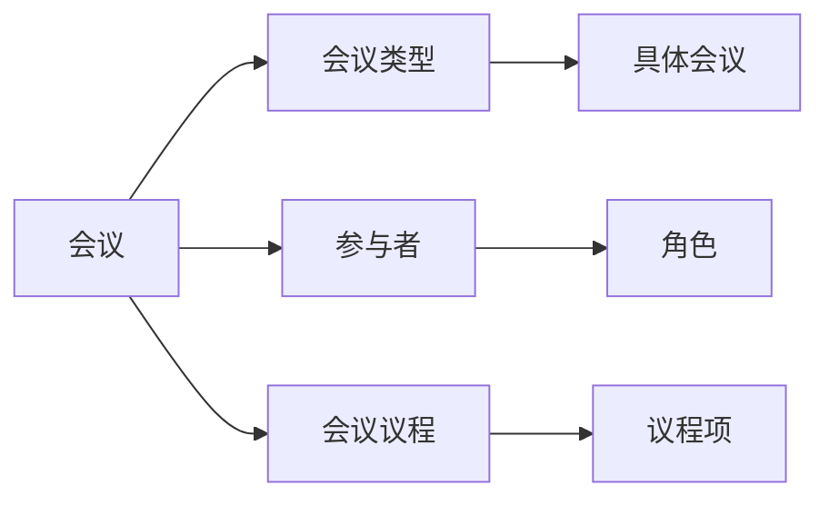

                 

### 1.1.1 问题背景

在现代企业环境中，会议已经成为团队沟通与决策的重要方式。然而，许多团队在会议管理上面临诸多挑战，导致会议效率低下，甚至影响到团队的正常运作。以下是一些常见的会议管理问题及其对团队沟通效率的影响。

首先，会议冗长、效率低下是一个普遍存在的问题。很多时候，会议在没有明确目标和议程的情况下开始，导致会议时间被无意义的内容所占据。这样的会议不仅浪费了团队成员的时间，还降低了团队的士气。

其次，冲突与决策延误也是常见的会议问题。在会议中，团队成员可能因为意见不一致而产生冲突，导致决策过程变得冗长和复杂。长时间的讨论和争论使得团队无法及时作出决策，从而延误项目的进度。

再者，会议内容的记录与跟踪不足也是一个亟待解决的问题。很多团队在会议结束后，无法有效地记录和跟踪会议达成的决策和行动计划。这导致会议内容被遗忘或遗漏，使得团队成员无法有效地执行会议决定的事项。

为了解决这些问题，提高团队沟通效率，有效的会议管理显得尤为重要。通过设定明确的目标、优化会议流程和加强团队协作，我们可以大幅提升会议的效率和质量，从而推动团队的工作进度。

### 1.1.2 问题描述

在许多团队中，会议管理中的常见问题主要体现在以下几个方面：

首先，会议冗长、效率低下。这种情况通常发生在会议没有明确的目标和议程时。团队成员在没有具体任务的情况下，往往会在讨论中迷失方向，导致会议时间被浪费。此外，冗长的会议还可能引发成员的疲劳和不满，影响团队的士气和效率。

其次，冲突与决策延误。会议中，团队成员可能因为意见不一致而产生冲突。这些冲突往往使得决策过程变得复杂和冗长，导致团队无法及时作出决策。决策的延误不仅影响了项目进度，还可能引发团队成员之间的不信任和矛盾。

再者，会议内容的记录与跟踪不足。很多团队在会议结束后，无法有效地记录和跟踪会议达成的决策和行动计划。这种情况下，团队成员很难记住会议中的重要内容，导致会议决定被遗忘或遗漏，进而影响团队的工作效率。

为了有效解决这些问题，我们需要采取以下措施：

1. **设定明确的目标**：每次会议都应该有一个明确的目标，确保会议内容围绕目标进行。这有助于提高会议的效率，避免无关内容的讨论。

2. **优化会议流程**：通过制定会议议程，确保会议内容有条不紊地进行。会议议程应包括开场、讨论、总结等环节，有助于团队成员更好地参与和跟进会议。

3. **提高团队协作与沟通效率**：通过有效的沟通和协作技巧，减少会议中的冲突和误解。团队成员应学会倾听和表达自己的观点，以确保会议的顺利进行。

### 1.1.3 问题解决

为了解决会议管理中的问题，提高团队沟通效率，我们可以采取以下措施：

1. **设定明确的目标**：每次会议都应该有明确的目标。这有助于确保会议内容围绕目标进行，避免无关内容的讨论。明确的目标可以帮助团队成员更好地集中注意力，提高会议效率。

2. **优化会议流程**：制定会议议程是优化会议流程的关键。会议议程应包括开场、讨论、总结等环节，确保会议内容有条不紊地进行。通过提前制定议程，团队成员可以提前了解会议内容，做好准备，从而提高会议效率。

3. **提高团队协作与沟通效率**：良好的沟通和协作技巧是提高会议效率的关键。团队成员应学会倾听和表达自己的观点，避免不必要的冲突。此外，可以采用一些沟通工具和技巧，如会议纪要、反馈机制等，以促进团队成员之间的沟通和协作。

4. **记录与跟踪会议内容**：会议结束后，应及时记录和跟踪会议达成的决策和行动计划。这有助于确保团队成员能够及时了解和执行会议决定的事项，从而提高工作效率。

5. **培训与指导**：对于新加入的团队成员，应进行会议管理的培训，使其了解会议的基本流程和技巧。通过培训，可以帮助团队成员更好地适应会议管理的要求，提高团队的整体沟通效率。

### 1.1.4 边界与外延

会议管理的适用范围较广，适用于各种类型的会议。以下是一些典型的会议类型及其特点：

1. **项目会议**：用于讨论项目进度、问题解决和资源分配。项目会议通常由项目经理主持，涉及项目团队成员的广泛参与。

2. **决策会议**：用于讨论并做出重要决策。决策会议通常由管理层主持，涉及决策团队成员的深度参与。

3. **培训会议**：用于培训新员工或提升团队成员的技能。培训会议通常由培训师主持，注重知识的传授和技能的提升。

4. **团队建设会议**：用于增强团队成员之间的协作和信任。团队建设会议通常由团队领导主持，通过游戏、活动等方式增强团队凝聚力。

会议管理在不同组织结构中的应用也有所不同。在扁平化的组织结构中，会议管理更注重快速决策和高效沟通，而在层级化的组织结构中，会议管理则更注重决策的层次性和流程的规范性。总之，有效的会议管理是提高团队沟通效率和项目成功率的关键，需要根据不同组织结构和会议类型进行灵活应用。

### 2.1.1 核心概念

为了更好地理解会议管理，我们需要掌握以下几个核心概念：会议类型、参与者角色以及会议议程与安排。这些概念是有效会议管理的基础，下面将逐一进行介绍。

#### 会议类型

会议类型根据目的和内容的不同，可以分为多种。以下是几种常见的会议类型及其特点：

1. **项目会议**：用于讨论项目进度、问题解决和资源分配。项目会议通常由项目经理主持，涉及项目团队成员的广泛参与。

2. **决策会议**：用于讨论并做出重要决策。决策会议通常由管理层主持，涉及决策团队成员的深度参与。

3. **培训会议**：用于培训新员工或提升团队成员的技能。培训会议通常由培训师主持，注重知识的传授和技能的提升。

4. **团队建设会议**：用于增强团队成员之间的协作和信任。团队建设会议通常由团队领导主持，通过游戏、活动等方式增强团队凝聚力。

#### 参与者角色

会议参与者角色各异，各自承担不同的职责。以下是几种常见的参与者角色及其职责：

1. **主持人**：负责引导会议流程，确保会议内容围绕主题进行，维护会议秩序。

2. **记录员**：负责记录会议内容，整理会议纪要，确保会议决定的落实。

3. **参与者**：负责参与讨论，提出自己的观点和建议，为会议决策提供支持。

4. **嘉宾**：受邀参与会议，提供专业意见或参与特定议题的讨论。

#### 会议议程与安排

会议议程与安排是会议成功的保障。一个良好的会议议程应包括以下环节：

1. **开场**：主持人简要介绍会议目的和议程，引导团队成员进入会议状态。

2. **讨论**：围绕会议主题进行深入讨论，充分交流意见和观点。

3. **总结**：会议结束时，主持人对讨论内容进行总结，明确会议达成的共识和决策。

4. **行动计划**：根据会议讨论结果，制定具体的行动计划，确保会议决定的事项得以执行。

合理的会议安排可以提高会议的效率和效果，避免无关内容的讨论，确保会议目标的达成。

### 2.1.2 概念属性特征对比表

为了更清晰地理解会议管理的核心概念，下面提供一个概念属性特征对比表，列出会议类型、参与者角色以及会议议程与安排的主要特征。

| 概念               | 特征与定义                                       |
|------------------|------------------------------------------------|
| 会议类型           | 根据目的和内容划分，如项目会议、决策会议等             |
| 会议类型 - 项目会议 | 讨论项目进度、问题解决和资源分配，项目经理主持           |
| 会议类型 - 决策会议 | 讨论并做出重要决策，管理层主持，深度参与者             |
| 会议类型 - 培训会议 | 培训新员工或提升团队成员技能，培训师主持，知识传授与技能提升 |
| 会议类型 - 团队建设会议 | 增强团队成员协作与信任，团队领导主持，团队凝聚力增强   |
| 参与者角色         | 主持人、记录员、参与者等，各自承担不同的职责           |
| 参与者角色 - 主持人 | 引导会议流程，确保会议内容围绕主题进行，维护会议秩序 |
| 参与者角色 - 记录员 | 记录会议内容，整理会议纪要，确保会议决定的落实       |
| 参与者角色 - 参与者 | 参与讨论，提出观点和建议，为会议决策提供支持         |
| 参与者角色 - 嘉宾   | 提供专业意见，参与特定议题的讨论                     |
| 会议议程与安排     | 提前准备的会议内容与流程，包括开场、讨论、总结等       |
| 会议议程与安排 - 开场 | 主持人简要介绍会议目的和议程，引导团队成员进入会议状态 |
| 会议议程与安排 - 讨论 | 围绕会议主题进行深入讨论，充分交流意见和观点         |
| 会议议程与安排 - 总结 | 会议结束时，主持人对讨论内容进行总结，明确会议达成的共识和决策 |
| 会议议程与安排 - 行动计划 | 根据会议讨论结果，制定具体的行动计划，确保会议决定的事项得以执行 |

通过这个对比表，我们可以更清晰地理解会议管理的各个核心概念及其特征，从而为实际操作提供参考。

### 2.1.3 ER实体关系图架构

为了更好地理解会议管理的核心实体及其关系，我们可以通过ER（实体-关系）图来展示。下面是一个ER图的Markdown表示：

#### 图中各个实体的关系解释：

- **会议（A）**：代表一次具体的会议活动。
- **会议类型（B）**：会议的分类，如项目会议、决策会议等，每个会议类型可以对应多个具体会议。
- **参与者（C）**：参加会议的人员，包括主持人、记录员、参与者等。
- **角色（F）**：参与者在会议中承担的职责，如主持人、记录员等。
- **会议议程（D）**：会议的具体流程和内容安排，包括开场、讨论、总结等。
- **议程项（G）**：会议议程中的具体事项，如讨论点、行动计划等。

#### 关系解释：

- **会议与会议类型（A--B）**：一次会议属于某个会议类型，一个会议类型可以包含多个会议。
- **会议与参与者（A--C）**：一次会议可以有多个参与者，每个参与者可以参加多个会议。
- **参与者与角色（C--F）**：每个参与者在一个会议中承担一个角色，一个角色可以由多个参与者承担。
- **会议与会议议程（A--D）**：一次会议包含多个议程项，一个议程项属于一个会议。
- **会议议程与议程项（D--G）**：每个议程项是会议议程的一部分，一个议程项属于一个会议议程。

通过这个ER图，我们可以更直观地理解会议管理中的各个实体及其关系，有助于设计和实施有效的会议管理策略。

### 3.1.1 会议准备

为了确保会议能够顺利进行并达到预期目标，会议准备是至关重要的一步。以下是会议准备过程中需要考虑的几个关键方面：

#### 会议议程的制定

制定会议议程是会议准备的核心任务。会议议程应包括会议的主题、时间、地点、主持人、参与者、讨论要点以及预计的议程流程。一个良好的会议议程有助于确保会议内容有条不紊地进行，避免无关话题的讨论，提高会议效率。

#### 会议材料的准备

在会议前，需要准备好相关的会议材料，如报告、文档、图表等。这些材料应提前分发给参会人员，以便他们在会议前进行预习，确保会议讨论的顺利进行。此外，对于需要展示的材料，还应提前进行技术测试，确保其在会议中能够正常展示。

#### 会议通知与参与者邀请

会议通知是确保参与者按时参加会议的重要手段。通知内容应包括会议的时间、地点、议程以及参会人员的具体职责。通知可以通过邮件、即时通讯工具或企业内部管理系统发送。在发送通知时，应考虑到不同参与者的时间安排，确保所有关键人员都能参加。

#### 会议前的沟通

在会议前，主持人应与参会人员进行沟通，了解他们的意见和建议。这有助于确保会议议程的全面性和针对性，同时也能激发参会人员的参与热情。沟通可以通过电话、邮件或即时通讯工具进行。

通过以上几个步骤的会议准备，我们可以确保会议在有序、高效的氛围中进行，从而提高团队的沟通效率和工作效率。

### 3.1.2 目标设定

会议目标的设定是确保会议顺利进行和达成预期效果的关键步骤。一个明确且合理的会议目标不仅能够指导会议的内容和流程，还能提高会议的效率，减少不必要的讨论。以下是设定会议目标时应遵循的原则和方法。

#### 明确性

会议目标必须明确，避免模糊不清。一个明确的目标有助于参会人员聚焦于关键议题，提高会议的效率和针对性。例如，如果会议目标是讨论项目进度，则应具体指出要讨论的里程碑、关键问题和潜在风险。

#### SMART原则

SMART原则是一种有效的目标设定方法，其中S（具体）、M（可衡量）、A（可实现）、R（相关）和T（时限）分别代表了目标的具体性、可衡量性、可实现性、相关性和时限性。以下是一个SMART目标示例：“在2023年6月30日之前，完成项目A的初步设计，确保所有团队成员对设计方案达成一致。”

#### 目标与团队协作的关系

会议目标不仅反映了会议的核心议题，还与团队协作紧密相关。一个明确的会议目标能够激发团队成员的参与热情，增强团队凝聚力。例如，在项目会议上，设定明确的目标可以帮助团队成员更好地分工合作，共同推进项目进度。

为了确保目标的实现，可以采取以下方法：

1. **分解目标**：将大目标分解为多个小目标，使得每个小目标都具体、可操作，便于团队成员逐步完成。

2. **设定里程碑**：设定关键里程碑，以监测目标的实现进度，并及时调整策略。

3. **责任分配**：明确每个团队成员在实现目标中的职责，确保目标落实。

通过遵循SMART原则和上述方法，我们可以有效地设定会议目标，从而提高会议的效率和团队协作的质量。

### 4.1.1 会议流程

会议流程是确保会议顺利进行、达成预期目标的关键。一个良好的会议流程应该包括开场、讨论和总结等环节，下面将详细描述这些环节及其内容。

#### 开场

开场是会议的初始环节，其目的是让参会人员迅速进入会议状态，明确会议的目标和议程。开场的内容通常包括：

1. **主持人介绍**：主持人简要介绍自己的身份和职责，确保所有参会人员了解会议的组织者和引导者。
2. **会议目标与议程**：主持人阐述会议的目标和议程，确保所有参会人员对会议的内容和流程有清晰的认识。
3. **提醒注意事项**：主持人提醒参会人员关于会议的注意事项，如保持手机静音、不随意离开会议室等。

#### 讨论

讨论是会议的核心环节，旨在充分交流意见和观点，达成共识。讨论的内容通常包括：

1. **议题说明**：主持人或议题负责人简要介绍议题的背景和重要性，确保参会人员对议题有全面了解。
2. **自由讨论**：参会人员围绕议题展开自由讨论，分享自己的观点和见解。讨论过程中，主持人应确保每个参会人员都有发言的机会，避免少数人主导讨论。
3. **决策形成**：在讨论过程中，主持人应引导参会人员达成共识，形成具体的决策或行动计划。决策应基于充分的讨论和共识，确保执行的有效性。

#### 总结

总结是会议的收尾环节，其目的是对会议内容进行归纳和总结，确保会议成果的落实。总结的内容通常包括：

1. **会议成果回顾**：主持人对会议的主要成果进行回顾，包括达成的共识、形成的决策和行动计划。
2. **行动计划**：对会议决定的事项进行具体的行动计划安排，明确责任人和完成时间，确保决策得到有效执行。
3. **会议反馈**：主持人邀请参会人员对会议进行反馈，了解会议的效率和效果，收集改进意见和建议。

通过以上环节的合理安排，会议流程能够有条不紊地进行，确保会议目标的达成和团队协作的顺畅。

### 4.1.2 参与者角色

在会议中，不同参与者承担不同的角色，各司其职，确保会议的顺利进行和目标的达成。以下是几种常见参与者角色及其职责：

#### 主持人

主持人的职责是引导整个会议的流程，确保会议目标的实现。具体职责包括：

1. **开场引导**：主持人需要简洁明了地介绍会议议程，确保所有参会人员了解会议的目标和流程。
2. **控制讨论进程**：主持人应确保讨论围绕主题进行，避免无关话题的讨论，并在必要时引导讨论方向。
3. **维护会议秩序**：主持人需维护会议的秩序，确保每个参会人员都有发言的机会，避免某些成员主导讨论。

#### 记录员

记录员的职责是记录会议内容和重要决策，确保会议结果的落实。具体职责包括：

1. **会议纪要**：记录会议的讨论内容、重要观点和决策，形成会议纪要，并在会后及时分发。
2. **整理文档**：整理会议相关的文档和材料，确保会议记录和文档的一致性。
3. **跟踪行动项**：记录会议决定的行动项，并跟踪行动的进度，确保会议决定的事项得以执行。

#### 参与者

参与者的职责是积极参与会议讨论，提出自己的意见和建议，为会议决策提供支持。具体职责包括：

1. **提出问题**：在讨论中提出问题，引导讨论的深入，确保议题的全面性。
2. **分享观点**：分享自己的观点和见解，为会议决策提供多元化的信息。
3. **遵守会议纪律**：遵守会议纪律，保持会议的秩序，尊重其他参会人员的发言。

通过明确不同参与者角色的职责，可以有效提高会议的效率和质量，确保会议目标的实现。

### 5.1.1 数字会议工具

在现代办公环境中，数字会议工具已成为提高会议效率的重要手段。这些工具不仅能够方便地安排和记录会议，还能提升团队协作和沟通的效果。以下是一些常用的数字会议工具及其主要功能：

#### Zoom

Zoom是一款广泛使用的视频会议软件，提供高清视频和音频通讯功能。其主要功能包括：

1. **远程会议**：支持多方视频会议，方便团队成员在不同地点参与讨论。
2. **屏幕共享**：参会者可以共享自己的屏幕，展示演示文稿、图表等。
3. **实时聊天**：提供实时聊天功能，方便参会者交流和提问。

#### Microsoft Teams

Microsoft Teams是一款集成通讯、协作和会议的软件平台。其主要功能包括：

1. **即时通讯**：支持文字、语音和视频通讯，方便团队成员实时交流。
2. **会议安排**：内置会议功能，可以方便地安排和邀请参会人员。
3. **文档共享**：支持文件共享和协同编辑，方便团队成员共同完成任务。

#### Google Meet

Google Meet是Google提供的视频会议工具，适合小型团队和远程工作。其主要功能包括：

1. **简易操作**：界面简洁，易于使用。
2. **多方视频会议**：支持多达250人的视频会议。
3. **实时字幕**：提供实时字幕功能，方便听力障碍者参与会议。

#### Slack

Slack是一款专业的团队协作工具，集成了多种沟通和协作功能。其主要功能包括：

1. **消息传递**：支持文本、图片、文件等多种形式的沟通。
2. **频道管理**：方便地将团队成员分配到不同频道，进行专题讨论。
3. **集成第三方应用**：可以与其他应用程序集成，如Google Calendar、Trello等，提高工作效率。

选择合适的数字会议工具，能够显著提升团队的沟通效率和工作效果。不同的工具各有特色，团队可以根据实际需求进行选择和优化。

### 5.1.2 沟通技巧

有效的沟通是确保会议顺利进行和目标达成的重要因素。以下是一些基本的沟通技巧，帮助团队成员在会议中更好地表达和倾听：

#### 倾听

倾听是有效沟通的基础。在会议中，倾听不仅意味着听到对方说的话，更重要的是理解对方的观点和感受。以下是一些倾听技巧：

1. **专注**：在对方发言时，保持专注，避免分心。通过眼神接触、点头等身体语言表达关注。
2. **不打断**：在对方讲话时，避免打断，让对方完整表达自己的观点。
3. **重复关键信息**：在对方发言结束后，重复对方的关键信息，以确保理解无误。

#### 表达

表达清晰、准确是确保沟通有效的重要条件。以下是一些表达技巧：

1. **明确目标**：在表达观点前，明确自己的目标和目的，确保发言具有针对性。
2. **简洁明了**：使用简单、清晰的词汇和句子，避免使用复杂的术语和冗长的表述。
3. **使用具体例子**：通过具体例子来说明观点，使表达更加生动和易于理解。

#### 解决沟通障碍

沟通障碍可能会影响会议的效率和效果。以下是一些解决沟通障碍的方法：

1. **避免误解**：在讨论中，及时澄清对方的观点，避免产生误解。
2. **主动沟通**：在遇到问题时，主动与他人沟通，寻求帮助或解决方案。
3. **建立信任**：通过积极的沟通和协作，建立团队成员之间的信任，提高沟通效率。

通过掌握这些沟通技巧，团队成员可以在会议中更有效地表达和倾听，从而提升团队的整体沟通水平和工作效率。

### 6.1.1 行动项的跟踪

会议结束后，行动项的跟踪是确保会议决定的事项得以有效执行的关键。以下是一些行动项跟踪的方法和步骤：

#### 制定行动计划

在会议结束时，主持人应与团队成员一起制定具体的行动计划。每个行动项应包括以下内容：

1. **任务描述**：明确需要完成的任务，如撰写报告、设计原型等。
2. **责任人**：指派任务给具体的团队成员，确保任务有专人负责。
3. **完成时间**：设定任务的完成时间，确保任务能够按时完成。

#### 建立跟踪机制

为了确保行动项的执行进度，可以建立以下跟踪机制：

1. **定期检查**：定期检查任务完成情况，可以通过每周或每月的会议进行跟踪。
2. **进度报告**：要求责任人在规定的时间节点提交进度报告，汇报任务的完成情况。
3. **反馈与调整**：根据进度报告，及时反馈问题并提供支持，必要时调整任务分配和完成时间。

#### 使用工具辅助

可以使用一些工具来辅助行动项的跟踪，如：

1. **项目管理工具**：如Trello、JIRA等，方便记录和跟踪任务进度。
2. **即时通讯工具**：如Slack、Microsoft Teams等，便于团队成员之间的实时沟通和协作。

通过以上方法，可以有效确保会议决定的事项得以落实，从而提高团队的工作效率和项目成功率。

### 6.1.2 会议总结

会议总结是确保会议效果和成果得以巩固的重要环节。以下是一些会议总结的关键步骤和要点：

#### 会议效果评估

1. **目标达成情况**：评估会议是否达成了既定的目标，包括决策的制定、问题的解决和行动计划的明确。
2. **参与度**：评估团队成员的参与程度，包括发言的积极性和贡献的大小。
3. **会议效率**：评估会议的整体时间利用率，包括是否在预定时间内完成议程。

#### 反馈与改进

1. **收集反馈**：向参会人员收集对会议效果的反馈，包括优点和需要改进的地方。
2. **问题分析**：针对反馈中提到的问题，进行分析和讨论，找出原因和解决方案。
3. **制定改进计划**：根据分析结果，制定具体的改进措施和行动计划，确保会议效果不断提升。

#### 总结报告

1. **成果回顾**：总结会议达成的成果，包括决策、行动计划和改进措施。
2. **记录存档**：将会议总结报告记录下来，作为后续参考和回顾的依据。
3. **共享与传达**：将会议总结报告分享给所有相关成员，确保大家了解会议内容和决定事项。

通过以上步骤，可以有效进行会议总结，确保会议的成果得到巩固和落实，同时为后续的会议提供参考和改进方向。

### 7.1.1 案例介绍

为了更好地展示有效会议管理的实践效果，我们介绍一个某公司的会议管理实践案例。该公司是一家中型IT企业，主要从事软件开发和解决方案提供。由于项目繁多，团队成员分布在不同地点，公司面临会议冗长、效率低下以及决策延误等挑战。

#### 成功经验

1. **明确会议目标**：每次会议开始前，公司都会明确会议的目标和议程，确保会议内容围绕主题进行。这一措施显著提高了会议的效率，避免了无关话题的讨论。

2. **优化会议流程**：公司制定了详细的会议流程，包括开场、讨论、总结和行动项跟踪等环节。通过流程化操作，确保会议内容有条不紊地进行，减少了冗长的讨论。

3. **使用会议管理工具**：公司引入了Zoom和Trello等数字会议工具，用于会议安排、记录和跟踪行动项。这些工具的使用提高了会议的效率，减少了沟通障碍。

4. **提高参与者角色意识**：公司对团队成员进行会议管理培训，明确主持人、记录员和参与者的职责。这有助于提高团队成员的会议参与度和责任感。

#### 失败经验

1. **未充分准备会议材料**：在一些会议中，由于会议材料未提前准备或准备不充分，导致讨论内容偏离主题，会议效率降低。

2. **缺乏有效的反馈机制**：公司未能建立有效的反馈机制，导致会议效果难以持续改进。部分团队成员对会议效果表示不满，但没有渠道提出改进建议。

3. **缺乏定期检查与跟进**：虽然公司制定了行动计划，但未进行定期的检查与跟进，导致部分行动项未能及时完成。

通过这个案例，我们可以看到，有效的会议管理需要明确目标、优化流程、使用工具以及提高团队成员的角色意识。同时，我们也需要认识到，有效的会议管理是一个持续改进的过程，需要不断调整和优化。

### 7.1.2 实践应用

在实际工作中，不同的会议场景需要采取不同的会议管理策略。以下是一些常见的会议场景及相应的管理策略：

#### 项目启动会议

项目启动会议是项目启动阶段的第一次会议，目的是明确项目目标、资源和时间表。管理策略包括：

1. **明确会议目标**：确保所有参与者了解项目的目标和预期成果。
2. **详细规划议程**：包括项目介绍、团队介绍、时间表和资源分配等。
3. **记录和跟进**：确保会议纪要和行动计划得到记录和跟踪。

#### 项目进度会议

项目进度会议是定期检查项目进展的会议。管理策略包括：

1. **固定会议时间和地点**：确保团队成员能够按时参加。
2. **使用项目管理工具**：如JIRA或Trello，方便跟踪任务和进度。
3. **重点讨论问题**：集中讨论项目中的关键问题，确保及时解决。

#### 决策会议

决策会议是用于讨论并做出重要决策的会议。管理策略包括：

1. **提前通知议程**：确保参与者提前了解会议内容和讨论主题。
2. **充分讨论**：鼓励团队成员提出不同的观点和建议。
3. **记录决策和行动项**：确保决策和行动计划得到明确记录和跟踪。

#### 团队建设会议

团队建设会议是增强团队凝聚力和协作能力的会议。管理策略包括：

1. **选择合适的地点和活动**：如户外拓展、团队游戏等。
2. **建立信任**：通过活动和讨论，增进团队成员之间的信任和理解。
3. **反馈与改进**：会议结束后，收集团队成员的反馈，持续改进团队协作。

通过以上策略，可以确保不同场景下的会议管理有效，从而提高团队沟通效率和工作效率。

### 8.1.1 最佳实践

在会议管理过程中，遵循一些最佳实践可以显著提高会议的效率和质量。以下是一些经过验证的有效实践：

1. **明确会议目标**：每次会议都应该有明确且具体的目标。确保会议内容围绕目标进行，避免无关话题的讨论。

2. **提前准备会议材料**：在会议前，准备相关的文档、报告和演示材料，并提前发给参会人员。这有助于参会人员提前了解会议内容，做好充分准备。

3. **制定详细的会议议程**：会议议程应包括开场、讨论、总结和行动项等环节。明确的议程有助于确保会议内容有条不紊地进行。

4. **优化参与者角色**：明确主持人、记录员和参与者的职责，确保每个角色都能充分发挥作用。主持人负责引导会议进程，记录员负责记录关键信息，参与者则积极参与讨论。

5. **使用数字会议工具**：使用Zoom、Microsoft Teams等数字会议工具，方便远程参与和协作，提高会议的灵活性和效率。

6. **定期检查和反馈**：会议结束后，进行定期的检查和反馈，确保行动项得到落实，并根据反馈持续改进会议管理。

通过遵循这些最佳实践，团队可以更有效地管理会议，提高沟通效率和工作效果。

### 8.1.2 注意事项

在会议管理过程中，需要注意以下几点，以避免常见问题：

1. **避免会议冗长**：确保会议内容紧凑，避免无关内容的讨论。每次会议应控制在必要的时间内，避免过度占用团队成员的时间。

2. **明确会议目标**：每次会议都应该有一个明确的目标，确保会议内容围绕目标进行。这有助于提高会议的效率，避免无关话题的讨论。

3. **确保充分准备**：在会议前，确保会议材料和议程准备充分。未充分的准备可能导致会议内容偏离主题，影响会议效果。

4. **注意沟通障碍**：在会议中，注意倾听和表达技巧，避免误解和沟通障碍。通过清晰的表达和积极的倾听，确保会议的顺利进行。

5. **跟踪行动项**：会议结束后，及时记录和跟踪行动项，确保会议决定的事项得以执行。定期检查行动项的进度，确保目标的实现。

通过注意这些事项，可以有效避免会议管理中的常见问题，提高会议的效率和质量。

### 8.1.3 拓展阅读

对于希望深入了解会议管理的读者，以下推荐几本相关书籍和文章，这些资源涵盖了会议管理的各个方面，从理论基础到实战技巧：

1. **《高效能人士的七个习惯》**：史蒂芬·柯维（Stephen R. Covey）的这本书中，第6个习惯“以原则为中心”提供了关于有效沟通和决策的深刻见解，对会议管理也有很大启示。
   
2. **《敏捷开发实践指南》**：Ken Schwaber和Jeff Sutherland合著的这本书详细介绍了敏捷开发的方法和最佳实践，其中关于迭代会议和回顾会议的内容对会议管理有重要指导意义。

3. **《团队协作工具与技术》**：John W. McDonald撰写的这本书介绍了多种团队协作工具和技术，包括Trello、Asana等，适合需要提升团队协作效率的读者。

4. **《如何在会议上高效沟通》**：James J. Lippert的文章详细介绍了在会议中如何进行高效沟通，包括倾听技巧、表达方法和解决冲突的策略。

5. **《会议管理：高效会议的实用指南》**：Mark Glendenning的这本书提供了实用的会议管理技巧和工具，从会议议程设计到会议后的行动项跟踪，全面覆盖会议管理的各个环节。

此外，还可以关注以下在线平台和资源：

1. **Coursera**：提供各种关于领导力和沟通技巧的课程，有助于提升会议管理能力。
   
2. **LinkedIn Learning**：拥有丰富的视频教程，涵盖从基础到高级的会议管理技巧。

3. **Microsoft Teams帮助文档**：提供详细的操作指南和使用技巧，帮助用户充分利用Microsoft Teams进行会议管理。

通过阅读这些书籍和文章，参考在线资源，读者可以进一步提升会议管理的实践能力和理论水平。

### 9.1.1 会议管理的未来发展

随着技术的不断进步，会议管理也在逐步迈向更加智能化和高效化。未来会议管理的发展趋势主要体现在以下几个方面：

首先，数字化与自动化技术的应用将成为主流。云计算、人工智能和大数据等先进技术的结合，使得会议管理工具能够实现自动化日程安排、实时数据分析和智能提醒等功能。例如，基于AI的会议管理系统可以根据参会人员的日程和偏好，自动安排会议时间和地点，提高会议的效率。

其次，智能会议系统的快速发展也将带来会议管理的新变革。智能会议系统集成了音频识别、视频分析、自然语言处理等技术，能够实现会议内容的实时转录、摘要生成和智能搜索。这些功能不仅方便了会议记录和后续的资料查找，还大大提升了会议的透明度和决策效率。

再者，远程协作和跨区域团队工作的普及，将进一步推动会议管理的创新。未来，会议管理将更加注重跨平台、跨地域的协作，支持多终端接入和无缝切换。同时，虚拟现实（VR）和增强现实（AR）技术的应用，将为远程会议带来更加沉浸式和互动性的体验。

通过这些新技术的发展，会议管理将变得更加智能、高效和便捷，为团队协作和决策提供强有力的支持。

### 9.1.2 趋势分析

会议管理的发展趋势受到多种因素的影响，主要包括技术进步、工作模式变化和企业管理理念的更新。

首先，技术进步是推动会议管理变革的关键因素。随着云计算、大数据、人工智能等技术的普及，会议管理工具的功能日益强大。例如，智能会议系统通过语音识别、图像识别等技术，可以实现会议内容的实时转录、摘要生成和智能搜索，大大提高了会议的效率和记录的准确性。

其次，工作模式的变化也对会议管理产生了深远影响。远程工作和跨区域团队的增多，使得传统的面对面会议模式逐渐转变为线上会议。在线协作工具如Zoom、Microsoft Teams等，不仅支持视频会议，还能提供文档共享、即时通讯和任务管理等功能，使得远程协作更加高效。

最后，企业管理理念的更新也推动了会议管理的发展。现代企业越来越注重团队合作和知识共享，倡导开放的沟通文化。这种文化背景下的会议管理，更加注重会议的透明性和参与度，强调每个团队成员的发言权和参与感。

总之，技术进步、工作模式变化和企业管理理念的更新共同推动了会议管理的发展趋势，使得会议管理更加智能化、高效化和便捷化。未来，会议管理将继续朝着更加智能和个性化的方向演进，为团队协作和决策提供强有力的支持。

