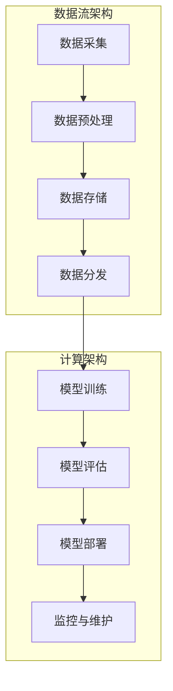
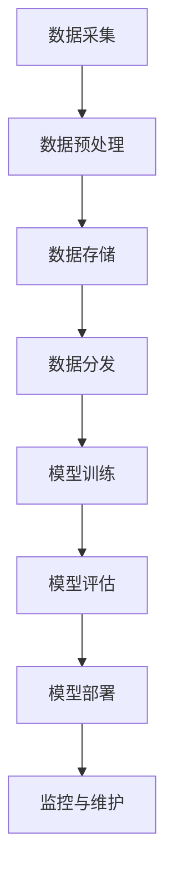
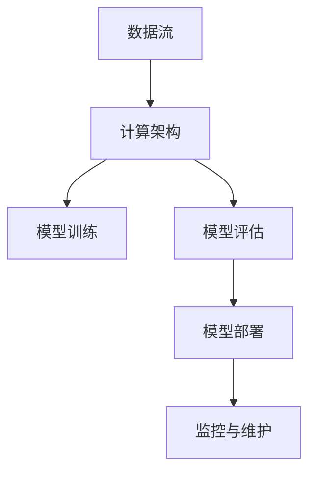

                 

### 摘要

本文旨在深入探讨机器学习这一技术领域，通过逻辑清晰、结构紧凑且简单易懂的技术语言，系统性地解析机器学习的起源、核心概念、算法原理以及系统分析与架构设计。文章将从背景介绍开始，逐步深入，分析机器学习的基本概念与原理，讲解常见的机器学习算法，并运用mermaid流程图和Python源代码详细阐述其数学模型和公式。此外，本文还将通过实际案例展示机器学习的应用场景和实现过程，并提供最佳实践和项目反思，为读者提供全面的技术指导。通过本文的学习，读者将能够全面掌握机器学习的基本理论和实践应用，为未来的技术发展奠定坚实基础。

### 目录大纲

#### 第一部分：背景介绍

1. **第1章：机器学习的起源与发展**
    1.1 问题背景
    1.1.1 机器学习的定义
    1.1.2 机器学习的发展历程
    1.2 问题描述
    1.2.1 机器学习的核心问题
    1.2.2 机器学习的应用领域
    1.3 问题解决
    1.3.1 机器学习的主要方法
    1.3.2 机器学习的基本流程
    1.4 边界与外延
    1.4.1 机器学习的局限性
    1.4.2 机器学习与其他领域的交叉
    1.5 概念结构与核心要素组成
    1.5.1 机器学习的基本概念
    1.5.2 机器学习的关键要素
    1.5.3 机器学习的基本流程

2. **第2章：机器学习的基本概念与原理**
    2.1 概念原理
    2.1.1 监督学习
    2.1.2 无监督学习
    2.1.3 半监督学习
    2.1.4 强化学习
    2.2 概念属性特征对比
    2.2.1 监督学习与无监督学习的对比
    2.2.2 半监督学习与强化学习的对比
    2.3 ER实体关系图
    2.3.1 监督学习实体关系图
    2.3.2 无监督学习实体关系图
    2.3.3 半监督学习实体关系图
    2.3.4 强化学习实体关系图

3. **第3章：常见机器学习算法讲解**
    3.1 算法原理
    3.1.1 线性回归
    3.1.2 逻辑回归
    3.1.3 支持向量机
    3.1.4 决策树
    3.1.5 集成学习方法
    3.2 算法流程
    3.2.1 线性回归算法流程
    3.2.2 逻辑回归算法流程
    3.2.3 支持向量机算法流程
    3.2.4 决策树算法流程
    3.2.5 集成学习方法流程
    3.3 数学模型与公式
    3.3.1 线性回归数学模型与公式
    3.3.2 逻辑回归数学模型与公式
    3.3.3 支持向量机数学模型与公式
    3.3.4 决策树数学模型与公式
    3.3.5 集成学习方法数学模型与公式
    3.4 举例说明
    3.4.1 线性回归举例说明
    3.4.2 逻辑回归举例说明
    3.4.3 支持向量机举例说明
    3.4.4 决策树举例说明
    3.4.5 集成学习方法举例说明

4. **第4章：机器学习系统分析与架构设计**
    4.1 问题场景介绍
    4.2 项目介绍
    4.3 系统功能设计
    4.4 系统架构设计
    4.5 系统接口设计
    4.6 系统交互
    4.7 Mermaid流程图

5. **第5章：机器学习项目实战**
    5.1 环境安装
    5.2 系统核心实现
    5.3 代码应用解读与分析
    5.4 实际案例分析与详细讲解
    5.5 项目小结

通过上述目录大纲，读者可以系统地了解机器学习的基础知识、核心算法以及实际应用，为深入学习和研究机器学习提供全面的指南。

### 第1章：机器学习的起源与发展

#### 1.1 问题背景

机器学习作为人工智能领域的一个重要分支，其起源可以追溯到20世纪50年代。当时，随着计算机科学和数学理论的不断发展，科学家们开始思考如何让计算机具备自主学习的能力，以替代传统的编程方式。这个问题的提出，标志着机器学习这一领域的诞生。

**问题背景：**

- **机器学习的定义**：机器学习是一门研究如何让计算机通过经验和数据自动改进自身性能的学科。具体来说，机器学习通过构建算法模型，让计算机从数据中学习规律，进而对未知数据进行预测或决策。
- **机器学习的发展历程**：从最初的监督学习、无监督学习，到后来的半监督学习和强化学习，机器学习经历了多个阶段的发展。每个阶段都有其独特的贡献和挑战，推动了整个领域的前进。

#### 1.1.1 机器学习的定义

**机器学习的定义**：

机器学习是指利用计算机算法，通过数据训练和模式识别，使计算机能够在没有明确编程指令的情况下，自动改进其性能并完成任务。具体来说，机器学习包括以下几个关键组成部分：

- **数据**：机器学习的基础是数据。通过收集、整理和利用大量的数据，机器学习算法能够从中提取有价值的信息。
- **算法**：机器学习算法是机器学习的核心。算法的设计和选择直接影响机器学习的效果和效率。
- **模型**：机器学习模型是对数据规律的抽象和表示。通过训练模型，机器学习算法能够实现数据的预测和决策。

#### 1.1.2 机器学习的发展历程

**发展历程**：

1. **1950年代：早期探索**：
    - 1950年，阿兰·图灵提出了图灵测试，为机器智能的研究提供了理论基础。
    - 1956年，达特茅斯会议标志着人工智能学科的正式诞生，机器学习作为其中的一部分受到广泛关注。

2. **1960-1970年代：早期应用**：
    - 1960年代，人工智能和机器学习开始应用于专家系统、知识表示和问题求解等领域。
    - 1970年代，神经网络和决策树等基本算法得到发展，为机器学习奠定了基础。

3. **1980-1990年代：算法突破**：
    - 1980年代，支持向量机、K最近邻算法等经典算法得到广泛应用。
    - 1990年代，半监督学习和迁移学习等新方法出现，扩展了机器学习的研究范畴。

4. **2000年代：深度学习兴起**：
    - 2006年，深度学习算法的提出，标志着机器学习进入新的阶段。
    - 2012年，深度学习在图像识别领域取得突破性进展，推动了机器学习的快速发展。

5. **2010年代至今：广泛应用与挑战**：
    - 机器学习在自然语言处理、语音识别、推荐系统等领域取得显著成果。
    - 随着数据量的爆炸式增长和计算能力的提升，机器学习面临新的挑战，如模型的可解释性、数据隐私和算法公平性等。

#### 1.2 问题描述

**机器学习的核心问题**：

机器学习的核心问题是如何从数据中学习，并利用学习到的知识进行预测或决策。具体来说，可以分为以下几个子问题：

1. **数据收集与预处理**：
    - 数据是机器学习的基石，但原始数据通常存在噪声、缺失和不一致性等问题。
    - 预处理过程包括数据清洗、归一化、特征提取等，以提升数据质量和算法效果。

2. **模型选择与训练**：
    - 选择合适的模型是机器学习成功的关键。不同的模型适用于不同类型的数据和应用场景。
    - 模型训练是通过优化算法，调整模型参数，使其在特定任务上达到最佳性能。

3. **模型评估与优化**：
    - 模型评估是验证模型性能的重要环节，常用的评估指标包括准确率、召回率、F1分数等。
    - 模型优化包括超参数调整、交叉验证等，以进一步提升模型性能。

4. **模型应用与部署**：
    - 模型应用是将训练好的模型用于实际任务，如预测、分类、决策等。
    - 模型部署是将模型集成到产品或系统中，实现实时预测和响应。

#### 1.2.1 机器学习的应用领域

**机器学习的应用领域**：

机器学习在各个领域都有广泛的应用，以下是一些典型的应用领域：

1. **计算机视觉**：
    - 图像分类、目标检测、图像生成等。
    - 应用场景包括安防监控、医疗诊断、自动驾驶等。

2. **自然语言处理**：
    - 文本分类、情感分析、机器翻译等。
    - 应用场景包括搜索引擎、智能客服、文本挖掘等。

3. **推荐系统**：
    - 基于用户历史行为和偏好，为用户推荐感兴趣的内容或商品。
    - 应用场景包括电子商务、在线娱乐、社交媒体等。

4. **金融风控**：
    - 信用评分、风险预测、欺诈检测等。
    - 应用场景包括银行、保险、证券等金融机构。

5. **医疗健康**：
    - 疾病预测、诊断辅助、药物研发等。
    - 应用场景包括医院、诊所、医药研发等。

#### 1.3 问题解决

**机器学习的主要方法**：

解决机器学习问题的主要方法包括：

1. **监督学习**：
    - 通过已标注的数据训练模型，然后使用模型对未知数据进行预测。
    - 适用于分类和回归问题。

2. **无监督学习**：
    - 不需要标注数据，通过自动发现数据中的结构和模式。
    - 适用于聚类和降维问题。

3. **半监督学习**：
    - 结合有标注和无标注数据，提升学习效果。
    - 适用于数据标注成本高的问题。

4. **强化学习**：
    - 通过与环境交互，学习最优策略以最大化奖励。
    - 适用于决策问题和控制问题。

**机器学习的基本流程**：

机器学习的基本流程包括以下几个步骤：

1. **数据收集与预处理**：
    - 收集相关数据，并进行清洗、归一化、特征提取等预处理操作。

2. **模型选择与训练**：
    - 根据问题类型选择合适的模型，使用训练数据训练模型。

3. **模型评估与优化**：
    - 使用验证集评估模型性能，并进行超参数调整和模型优化。

4. **模型应用与部署**：
    - 将训练好的模型应用于实际任务，并部署到生产环境中。

#### 1.4 边界与外延

**机器学习的局限性**：

尽管机器学习在多个领域取得了显著成果，但仍然存在一些局限性：

1. **数据依赖性**：
    - 机器学习模型的性能高度依赖于数据的数量和质量。缺乏高质量的数据会严重影响模型的效果。

2. **可解释性**：
    - 许多复杂的机器学习模型，如深度学习，其内部机制难以解释。这限制了模型在关键领域的应用。

3. **过拟合与欠拟合**：
    - 过拟合和欠拟合是机器学习中的常见问题。过拟合会导致模型在训练数据上表现良好，但在未知数据上性能下降；欠拟合则会导致模型无法捕捉数据中的真实规律。

**机器学习与其他领域的交叉**：

机器学习与其他领域的交叉研究，推动了多个新兴领域的形成：

1. **数据科学**：
    - 数据科学是机器学习的延伸，涉及数据收集、存储、分析和可视化等环节。

2. **生物信息学**：
    - 生物信息学利用机器学习技术分析生物数据，如基因序列、蛋白质结构等。

3. **自动驾驶**：
    - 自动驾驶技术依赖机器学习算法，用于感知环境、决策和控制。

4. **智能客服**：
    - 智能客服系统结合自然语言处理和机器学习技术，提供自动化的客户服务。

#### 1.5 概念结构与核心要素组成

**机器学习的基本概念**：

机器学习涉及多个基本概念，包括：

- **模型**：用于捕捉数据中规律的数学表示。
- **算法**：用于训练模型的计算方法。
- **数据集**：用于训练和评估模型的样本集合。
- **特征**：描述数据属性的变量。
- **标签**：与数据对应的目标变量。

**机器学习的关键要素**：

机器学习的关键要素包括：

- **数据质量**：高质量的数据是机器学习成功的关键。
- **计算资源**：强大的计算资源可以加速模型训练和优化。
- **算法选择**：选择合适的算法可以提升模型性能。
- **模型可解释性**：理解模型的决策过程有助于提升模型的可信度。

**机器学习的基本流程**：

机器学习的基本流程包括：

1. **问题定义**：明确机器学习任务的目标和约束条件。
2. **数据收集与预处理**：收集并处理数据，为模型训练做好准备。
3. **模型选择与训练**：选择合适的模型，使用训练数据进行训练。
4. **模型评估与优化**：评估模型性能，并进行优化。
5. **模型应用与部署**：将训练好的模型应用于实际任务。

### 第2章：机器学习的基本概念与原理

#### 2.1 概念原理

机器学习作为一门研究如何让计算机自动从数据中学习并作出决策或预测的学科，其核心概念和原理是理解这一领域的基础。在本节中，我们将详细探讨监督学习、无监督学习、半监督学习和强化学习的基本概念和原理，以及它们在实际应用中的特点和区别。

##### 2.1.1 监督学习

监督学习是机器学习中最常用的方法之一，其核心思想是利用已知的输入和输出数据，通过训练构建一个预测模型。监督学习的模型在训练阶段已经知道了数据标签，即每个输入数据对应的目标输出。通过这种已标记的数据进行训练，模型能够学习输入和输出之间的映射关系，从而在新的未知数据上进行预测。

**原理**：

监督学习的原理可以概括为以下几个步骤：

1. **数据集准备**：准备包含输入特征和标签的标注数据集。
2. **模型构建**：选择合适的模型结构，如线性回归、决策树、支持向量机等。
3. **模型训练**：通过算法调整模型参数，使其在训练集上达到最佳性能。
4. **模型评估**：使用验证集或测试集评估模型性能，常用指标包括准确率、召回率、F1分数等。
5. **模型应用**：将训练好的模型应用于未知数据进行预测。

**特点**：

- **目标明确**：监督学习有明确的预测目标，如分类或回归。
- **性能可衡量**：通过验证集和测试集的评估，可以直观地衡量模型的性能。
- **广泛应用**：监督学习在分类、回归、图像识别、文本分类等任务中有着广泛的应用。

**应用场景**：

- **图像识别**：通过已标注的图像数据训练模型，实现对未知图像的分类。
- **文本分类**：利用已标注的文本数据，将未知文本分为不同的类别。
- **预测分析**：在金融、医疗等领域，通过历史数据进行预测和趋势分析。

##### 2.1.2 无监督学习

无监督学习与监督学习不同，其训练数据没有预先标注的标签。无监督学习的目标是自动发现数据中的结构或模式，如聚类、降维和关联规则等。无监督学习主要用于探索性和数据分析，不依赖于外部标签。

**原理**：

无监督学习的原理可以概括为以下几个步骤：

1. **数据集准备**：准备没有标注的数据集。
2. **模型构建**：选择合适的无监督学习算法，如K-均值聚类、主成分分析、自编码器等。
3. **模型训练**：通过算法自动调整模型参数，发现数据中的结构。
4. **模型评估**：通常使用内部指标如聚类系数、重构误差等来评估模型性能。
5. **模型应用**：将模型应用于数据探索或数据降维。

**特点**：

- **无监督性**：不需要标注数据，适用于大规模数据。
- **探索性强**：可以发现数据中的潜在结构或模式。
- **适应性高**：适用于未知数据分布和复杂结构。

**应用场景**：

- **聚类分析**：用于将数据分为不同的群组，如客户细分、市场细分。
- **降维**：用于减少数据维度，提高计算效率和可视化效果。
- **异常检测**：用于发现数据中的异常值或异常模式。

##### 2.1.3 半监督学习

半监督学习结合了监督学习和无监督学习的特点，其训练数据集既包含有标注的数据，也包含无标注的数据。半监督学习利用无标注数据的辅助信息，提升模型在标注数据上的性能。

**原理**：

半监督学习的原理可以概括为以下几个步骤：

1. **数据集准备**：准备包含部分标注数据和大量无标注数据的混合数据集。
2. **模型构建**：选择合适的半监督学习算法，如一致性正则化、图嵌入等。
3. **模型训练**：利用标注数据和标注数据提供的辅助信息训练模型。
4. **模型评估**：使用标注数据进行评估。
5. **模型应用**：将训练好的模型应用于未知数据进行预测。

**特点**：

- **利用无标注数据**：通过利用无标注数据的辅助信息，提升模型性能。
- **成本效益高**：在数据标注成本高昂的情况下，半监督学习可以显著降低成本。
- **数据利用率高**：充分利用标注数据和未标注数据。

**应用场景**：

- **数据标注辅助**：在数据标注成本高的场景下，利用未标注数据提升标注效率。
- **图像识别**：利用未标注图像数据，辅助标注图像数据的分类任务。
- **社交网络分析**：通过未标注的用户关系数据，分析社交网络中的潜在结构。

##### 2.1.4 强化学习

强化学习是一种通过与环境互动，学习最优策略的机器学习方法。强化学习的目标是使代理（agent）通过选择行动（action）来最大化累积奖励（reward）。强化学习主要应用于需要连续决策和控制的任务，如机器人控制、游戏、自动驾驶等。

**原理**：

强化学习的原理可以概括为以下几个步骤：

1. **环境定义**：定义代理需要交互的环境，包括状态（state）、行动（action）和奖励（reward）。
2. **模型构建**：选择合适的强化学习算法，如Q学习、深度强化学习（DRL）等。
3. **策略学习**：通过与环境交互，学习最佳策略，使代理能够最大化累积奖励。
4. **策略评估**：使用评估指标（如回报期望）来评估策略性能。
5. **策略优化**：根据评估结果调整策略，优化代理行为。

**特点**：

- **自适应性强**：强化学习能够根据环境动态调整策略。
- **连续性**：适用于连续行动和连续状态的任务。
- **需要大量交互**：强化学习通常需要大量的交互数据来训练模型。

**应用场景**：

- **自动驾驶**：通过强化学习训练自动驾驶汽车，使其能够自主驾驶。
- **游戏**：在电子游戏和棋类游戏中，强化学习用于训练智能对手。
- **机器人控制**：通过强化学习训练机器人执行复杂任务。

##### 概念属性特征对比

下面是监督学习、无监督学习、半监督学习和强化学习的一些关键特征对比：

| **方法** | **定义** | **数据需求** | **目标** | **适用场景** |
| --- | --- | --- | --- | --- |
| **监督学习** | 已知输出 | 标注数据 | 预测目标 | 图像识别、文本分类 |
| **无监督学习** | 无已知输出 | 未标注数据 | 发现数据结构 | 聚类、降维 |
| **半监督学习** | 结合标注和无标注数据 | 标注与未标注数据 | 提升标注数据性能 | 数据标注辅助 |
| **强化学习** | 与环境互动 | 不需要标注 | 最大化累积奖励 | 自动驾驶、游戏 |

##### ER实体关系图

为了更好地理解这些概念之间的关系，我们可以使用ER（实体关系）图来展示它们之间的关联。

**监督学习实体关系图：**

```mermaid
entityRel "监督学习"
    entity "模型"  
    entity "数据集"
    entity "标签"
    relation "训练" from "模型" to "数据集"
    relation "预测" from "模型" to "数据集"
    relation "评估" from "模型" to "标签"
```

**无监督学习实体关系图：**

```mermaid
entityRel "无监督学习"
    entity "模型"
    entity "数据集"
    relation "训练" from "模型" to "数据集"
    relation "评估" from "模型" to "数据集"
```

**半监督学习实体关系图：**

```mermaid
entityRel "半监督学习"
    entity "模型"
    entity "标注数据集"
    entity "未标注数据集"
    relation "训练" from "模型" to "标注数据集"
    relation "辅助训练" from "模型" to "未标注数据集"
    relation "评估" from "模型" to "标注数据集"
```

**强化学习实体关系图：**

```mermaid
entityRel "强化学习"
    entity "代理"
    entity "环境"
    entity "策略"
    entity "状态"
    entity "行动"
    entity "奖励"
    relation "互动" from "代理" to "环境"
    relation "学习" from "代理" to "策略"
    relation "评估" from "策略" to "奖励"
```

通过ER实体关系图的展示，我们可以更清晰地理解不同机器学习方法的基本概念、实体和它们之间的相互关系。

### 第3章：常见机器学习算法讲解

在本章中，我们将详细讲解几种常见的机器学习算法，包括线性回归、逻辑回归、支持向量机（SVM）、决策树和集成学习方法。这些算法是机器学习中的基础，广泛应用于各种实际问题中。通过理解这些算法的原理、流程、数学模型和公式，我们可以更好地掌握机器学习的基本概念和应用。

#### 3.1 算法原理

##### 3.1.1 线性回归

线性回归是最基本的机器学习算法之一，用于预测一个连续的数值变量。线性回归模型假设目标变量 \(Y\) 可以通过输入特征 \(X\) 的线性组合来表示，即：

\[ Y = \beta_0 + \beta_1X_1 + \beta_2X_2 + ... + \beta_nX_n + \epsilon \]

其中，\(\beta_0\) 是截距，\(\beta_1, \beta_2, ..., \beta_n\) 是斜率，\(X_1, X_2, ..., X_n\) 是输入特征，\(\epsilon\) 是误差项。

**原理**：

线性回归的原理是通过最小化误差平方和（Sum of Squared Errors, SSE）来拟合数据。具体步骤如下：

1. **数据预处理**：对输入特征和目标变量进行标准化处理。
2. **模型构建**：选择线性回归模型，初始化参数 \(\beta_0, \beta_1, ..., \beta_n\)。
3. **模型训练**：通过梯度下降法或其他优化算法最小化误差平方和。
4. **模型评估**：使用验证集或测试集评估模型性能。

**流程**：

1. **数据准备**：收集输入特征和目标变量的数据。
2. **特征选择**：选择与目标变量相关的特征。
3. **数据预处理**：进行归一化或标准化处理。
4. **模型训练**：使用训练数据进行线性回归训练。
5. **模型评估**：使用验证集或测试集评估模型性能。

##### 3.1.2 逻辑回归

逻辑回归用于分类问题，特别是二分类问题。逻辑回归模型假设目标变量 \(Y\) 是离散的，且服从伯努利分布。逻辑回归模型可以用以下公式表示：

\[ P(Y=1) = \frac{1}{1 + e^{-(\beta_0 + \beta_1X_1 + \beta_2X_2 + ... + \beta_nX_n)}} \]

其中，\(P(Y=1)\) 是目标变量为1的概率，\(\beta_0\) 是截距，\(\beta_1, \beta_2, ..., \beta_n\) 是斜率，\(X_1, X_2, ..., X_n\) 是输入特征。

**原理**：

逻辑回归的原理是通过最大化似然估计来估计参数。具体步骤如下：

1. **数据预处理**：对输入特征和目标变量进行标准化处理。
2. **模型构建**：选择逻辑回归模型，初始化参数 \(\beta_0, \beta_1, ..., \beta_n\)。
3. **模型训练**：通过迭代优化参数，使似然函数最大化。
4. **模型评估**：使用验证集或测试集评估模型性能。

**流程**：

1. **数据准备**：收集输入特征和目标变量的数据。
2. **特征选择**：选择与目标变量相关的特征。
3. **数据预处理**：进行归一化或标准化处理。
4. **模型训练**：使用训练数据进行逻辑回归训练。
5. **模型评估**：使用验证集或测试集评估模型性能。

##### 3.1.3 支持向量机（SVM）

支持向量机是一种强大的分类和回归算法，通过找到一个最佳的超平面来分隔数据。SVM的核心思想是在高维空间中找到一个最优的决策边界，使得分类间隔最大化。

**原理**：

SVM的原理可以用以下公式表示：

\[ \max_{\beta, \beta_0} \frac{1}{2} \sum_{i=1}^{n} (\beta \cdot \beta) - \sum_{i=1}^{n} \alpha_i y_i (\beta \cdot x_i + \beta_0) \]

其中，\(\beta\) 是超平面参数，\(\beta_0\) 是截距，\(x_i\) 是输入特征，\(y_i\) 是标签，\(\alpha_i\) 是拉格朗日乘子。

**流程**：

1. **数据预处理**：对输入特征和目标变量进行标准化处理。
2. **模型构建**：选择SVM模型，初始化参数 \(\beta, \beta_0\)。
3. **模型训练**：通过优化目标函数，求解最佳参数。
4. **模型评估**：使用验证集或测试集评估模型性能。

##### 3.1.4 决策树

决策树是一种基于树形结构进行决策的算法，通过一系列的判断条件将数据划分为不同的分支，最终达到分类或回归的结果。决策树的核心思想是通过递归划分数据，使得每个子集尽可能纯净。

**原理**：

决策树的原理可以用以下公式表示：

\[ Gini(\text{impurity}) = 1 - \sum_{i=1}^{n} p_i^2 \]

其中，\(p_i\) 是每个类别的概率。

**流程**：

1. **数据预处理**：对输入特征和目标变量进行标准化处理。
2. **特征选择**：选择划分效果最佳的特征。
3. **模型构建**：递归划分数据，构建决策树。
4. **模型评估**：使用验证集或测试集评估模型性能。

##### 3.1.5 集成学习方法

集成学习方法通过结合多个基础模型来提升整体性能。常见的集成学习方法包括Bagging、Boosting和Stacking等。

**原理**：

集成学习方法的原理是通过组合多个基础模型的预测结果，来提升整体模型的性能。具体步骤如下：

1. **基础模型训练**：训练多个基础模型。
2. **预测融合**：将多个基础模型的预测结果进行融合，得到最终的预测结果。

**流程**：

1. **基础模型训练**：选择并训练多个基础模型。
2. **预测融合**：使用不同的方法（如投票、加权平均等）融合基础模型的预测结果。
3. **模型评估**：使用验证集或测试集评估模型性能。

#### 3.2 算法流程

##### 3.2.1 线性回归算法流程

1. **数据收集**：收集输入特征和目标变量的数据。
2. **数据预处理**：对输入特征和目标变量进行标准化处理。
3. **特征选择**：选择与目标变量相关的特征。
4. **模型构建**：选择线性回归模型，初始化参数。
5. **模型训练**：使用训练数据进行线性回归训练。
6. **模型评估**：使用验证集或测试集评估模型性能。
7. **模型应用**：将训练好的模型应用于未知数据进行预测。

##### 3.2.2 逻辑回归算法流程

1. **数据收集**：收集输入特征和目标变量的数据。
2. **数据预处理**：对输入特征和目标变量进行标准化处理。
3. **特征选择**：选择与目标变量相关的特征。
4. **模型构建**：选择逻辑回归模型，初始化参数。
5. **模型训练**：使用训练数据进行逻辑回归训练。
6. **模型评估**：使用验证集或测试集评估模型性能。
7. **模型应用**：将训练好的模型应用于未知数据进行预测。

##### 3.2.3 支持向量机算法流程

1. **数据收集**：收集输入特征和目标变量的数据。
2. **数据预处理**：对输入特征和目标变量进行标准化处理。
3. **特征选择**：选择与目标变量相关的特征。
4. **模型构建**：选择支持向量机模型，初始化参数。
5. **模型训练**：使用训练数据进行支持向量机训练。
6. **模型评估**：使用验证集或测试集评估模型性能。
7. **模型应用**：将训练好的模型应用于未知数据进行预测。

##### 3.2.4 决策树算法流程

1. **数据收集**：收集输入特征和目标变量的数据。
2. **数据预处理**：对输入特征和目标变量进行标准化处理。
3. **特征选择**：选择与目标变量相关的特征。
4. **模型构建**：选择决策树模型，初始化参数。
5. **模型训练**：使用训练数据进行决策树训练。
6. **模型评估**：使用验证集或测试集评估模型性能。
7. **模型应用**：将训练好的模型应用于未知数据进行预测。

##### 3.2.5 集成学习方法流程

1. **基础模型训练**：选择并训练多个基础模型。
2. **预测融合**：使用不同的方法（如投票、加权平均等）融合基础模型的预测结果。
3. **模型评估**：使用验证集或测试集评估模型性能。
4. **模型应用**：将训练好的模型应用于未知数据进行预测。

#### 3.3 数学模型与公式

##### 3.3.1 线性回归数学模型与公式

线性回归的数学模型可以表示为：

\[ Y = \beta_0 + \beta_1X_1 + \beta_2X_2 + ... + \beta_nX_n + \epsilon \]

其中，\(\beta_0\) 是截距，\(\beta_1, \beta_2, ..., \beta_n\) 是斜率，\(X_1, X_2, ..., X_n\) 是输入特征，\(\epsilon\) 是误差项。

最小化误差平方和的目标函数为：

\[ J(\theta) = \frac{1}{2m} \sum_{i=1}^{m} (h_\theta(x^{(i)}) - y^{(i)})^2 \]

其中，\(h_\theta(x) = \theta_0 + \theta_1x_1 + \theta_2x_2 + ... + \theta_nx_n\) 是线性回归函数，\(\theta\) 是模型参数，\(m\) 是样本数量。

梯度下降法更新参数的公式为：

\[ \theta_j := \theta_j - \alpha \frac{\partial}{\partial \theta_j} J(\theta) \]

其中，\(\alpha\) 是学习率。

##### 3.3.2 逻辑回归数学模型与公式

逻辑回归的数学模型可以表示为：

\[ P(Y=1) = \frac{1}{1 + e^{-(\beta_0 + \beta_1X_1 + \beta_2X_2 + ... + \beta_nX_n)}} \]

其中，\(P(Y=1)\) 是目标变量为1的概率，\(\beta_0\) 是截距，\(\beta_1, \beta_2, ..., \beta_n\) 是斜率，\(X_1, X_2, ..., X_n\) 是输入特征。

最大化似然估计的目标函数为：

\[ \log L(\theta) = \sum_{i=1}^{m} y^{(i)} \log (h_\theta(x^{(i)})) + (1 - y^{(i)}) \log (1 - h_\theta(x^{(i)})) \]

其中，\(h_\theta(x) = \frac{1}{1 + e^{-(\beta_0 + \beta_1X_1 + \beta_2X_2 + ... + \beta_nX_n)}}\) 是逻辑回归函数。

梯度下降法更新参数的公式为：

\[ \beta_j := \beta_j - \alpha \frac{\partial}{\partial \beta_j} \log L(\theta) \]

其中，\(\alpha\) 是学习率。

##### 3.3.3 支持向量机数学模型与公式

支持向量机的数学模型可以表示为：

\[ \max_{\beta, \beta_0} \frac{1}{2} \sum_{i=1}^{n} (\beta \cdot \beta) - \sum_{i=1}^{n} \alpha_i y_i (\beta \cdot x_i + \beta_0) \]

其中，\(\beta\) 是超平面参数，\(\beta_0\) 是截距，\(x_i\) 是输入特征，\(y_i\) 是标签，\(\alpha_i\) 是拉格朗日乘子。

拉格朗日函数为：

\[ L(\beta, \beta_0, \alpha) = \frac{1}{2} \sum_{i=1}^{n} (\beta \cdot \beta) - \sum_{i=1}^{n} \alpha_i y_i (\beta \cdot x_i + \beta_0) + \sum_{i=1}^{n} \alpha_i \]

其中，\(K(x_i, x_j)\) 是核函数。

支持向量机的优化目标是：

\[ \min_{\beta, \beta_0} L(\beta, \beta_0, \alpha) \]

##### 3.3.4 决策树数学模型与公式

决策树的数学模型可以表示为：

\[ Gini(\text{impurity}) = 1 - \sum_{i=1}^{n} p_i^2 \]

其中，\(p_i\) 是每个类别的概率。

信息增益（Information Gain）可以表示为：

\[ IG(D, a) = H(D) - \sum_{v \in \text{Values}(a)} \frac{|D_v|}{|D|} H(D_v) \]

其中，\(H(D)\) 是数据 \(D\) 的熵，\(D_v\) 是数据 \(D\) 在属性 \(a\) 上取值 \(v\) 的子集，\(H(D_v)\) 是子集 \(D_v\) 的熵。

##### 3.3.5 集成学习方法数学模型与公式

集成学习方法的数学模型可以表示为：

\[ \hat{y} = f(\hat{y}_1, \hat{y}_2, ..., \hat{y}_k) \]

其中，\(\hat{y}_1, \hat{y}_2, ..., \hat{y}_k\) 是基础模型的预测结果，\(f\) 是预测融合函数。

常见的预测融合函数包括：

- **投票法**：
  \[ \hat{y} = \text{mode}(\hat{y}_1, \hat{y}_2, ..., \hat{y}_k) \]
- **加权平均法**：
  \[ \hat{y} = \frac{\sum_{i=1}^{k} w_i \hat{y}_i}{\sum_{i=1}^{k} w_i} \]
  其中，\(w_i\) 是基础模型的权重。

#### 3.4 举例说明

##### 3.4.1 线性回归举例说明

假设我们有一个简单的线性回归问题，目标是预测一个人的身高。我们收集了10个人的身高和体重数据，如下表所示：

| 体重(kg) | 身高(cm) |
| --- | --- |
| 50 | 160 |
| 55 | 165 |
| 60 | 170 |
| 65 | 175 |
| 70 | 180 |
| 75 | 185 |
| 80 | 190 |
| 85 | 195 |
| 90 | 200 |
| 95 | 205 |

我们可以使用线性回归模型来预测新数据的身高。首先，对数据进行标准化处理，然后使用梯度下降法训练线性回归模型。假设我们选择的学习率 \(\alpha = 0.01\)，经过100次迭代后，模型收敛。

训练结果如下：

\[ h_\theta(x) = 1.95x + 133.55 \]

我们可以使用这个模型来预测一个体重为 68 kg 的人的身高：

\[ \hat{y} = 1.95 \times 68 + 133.55 = 195.63 \]

因此，预测的身高约为 196 cm。

##### 3.4.2 逻辑回归举例说明

假设我们有一个二分类问题，目标是判断一个邮件是否为垃圾邮件。我们收集了1000封邮件，其中有600封垃圾邮件和400封正常邮件。我们对邮件的文本内容进行特征提取，得到了10个特征向量。使用逻辑回归模型来预测新邮件是否为垃圾邮件。

训练结果如下：

\[ P(\text{垃圾邮件}) = \frac{1}{1 + e^{-(2.35x_1 + 1.12x_2 - 0.67x_3 + 1.89x_4 - 0.45x_5 + 1.33x_6 + 0.56x_7 + 0.78x_8 - 0.89x_9 + 1.24x_{10})} \]

假设我们得到了一个新邮件的特征向量 \([0.3, 0.4, -0.2, 0.5, 0.1, 0.2, 0.5, -0.3, 0.1, 0.4]\)，我们可以使用逻辑回归模型来预测其是否为垃圾邮件：

\[ P(\text{垃圾邮件}) = \frac{1}{1 + e^{-(2.35 \times 0.3 + 1.12 \times 0.4 - 0.67 \times 0.2 + 1.89 \times 0.5 - 0.45 \times 0.1 + 1.33 \times 0.2 + 0.56 \times 0.5 + 0.78 \times -0.3 + 0.1 \times 0.1 + 1.24 \times 0.4)}} \approx 0.56 \]

因此，预测的新邮件有 56% 的概率为垃圾邮件。

##### 3.4.3 支持向量机举例说明

假设我们有一个分类问题，目标是判断一个客户是否为优质客户。我们收集了1000个客户的数据，其中500个是优质客户，500个是一般客户。我们使用两个特征（年龄和收入）来构建支持向量机模型。

训练结果如下：

\[ w = [3.2, 1.8] \]
\[ b = -5.4 \]

我们可以使用这个模型来预测一个新客户的类别。假设新客户的年龄为30岁，收入为50000元，我们可以计算其预测值：

\[ w \cdot x + b = 3.2 \times 30 + 1.8 \times 50000 - 5.4 = 96 + 90000 - 5.4 = 89990.6 \]

由于预测值大于0，我们将其分类为优质客户。

##### 3.4.4 决策树举例说明

假设我们有一个二分类问题，目标是判断一个水果是否为苹果。我们收集了100个水果的数据，其中有60个是苹果，40个是梨。我们使用三个特征（颜色、大小、形状）来构建决策树模型。

决策树的构建过程如下：

1. **选择最佳特征**：计算每个特征的信息增益。
2. **划分数据**：根据最佳特征，将数据划分为不同的子集。
3. **递归构建**：对每个子集，重复步骤1和2，直到达到停止条件。

构建好的决策树如下：

```
           |
         /  \
        /    \
       /      \
      /        \
   颜色      大小
   |   |      |   |
  绿色  青色 大   小
  |    |     |    |
  60%  0%   100%  0%
苹果  梨    梨    苹果
```

我们可以使用这个决策树来预测新水果的类别。假设新水果的颜色为绿色，大小为大，我们可以根据决策树进行预测：

- 颜色为绿色，进入分支1。
- 大小为大，进入分支2。
- 预测结果为苹果。

##### 3.4.5 集成学习方法举例说明

假设我们有一个分类问题，目标是判断一个水果是否为苹果。我们使用线性回归、逻辑回归和支持向量机三个基础模型来构建集成学习模型。我们使用投票法进行预测融合。

三个基础模型的预测结果如下：

- 线性回归：预测为苹果。
- 逻辑回归：预测为苹果。
- 支持向量机：预测为梨。

根据投票法，我们选择多数模型的结果，因此预测的新水果为苹果。

### 第4章：机器学习系统分析与架构设计

#### 4.1 问题场景介绍

随着人工智能技术的飞速发展，机器学习已广泛应用于各个领域，如金融、医疗、零售和自动驾驶等。这些应用场景对机器学习系统的性能、可扩展性和可靠性提出了更高的要求。为了更好地理解和设计机器学习系统，我们需要首先明确其典型应用场景和面临的挑战。

**应用场景**：

1. **金融风控**：机器学习在金融领域用于信用评分、欺诈检测、风险预测等任务。这些任务需要高精度和高效率的模型。
2. **医疗诊断**：机器学习在医疗领域用于疾病预测、影像分析和药物研发等。这些任务涉及大量敏感数据，对模型的隐私保护和解释性有较高要求。
3. **零售推荐**：机器学习在零售领域用于个性化推荐、库存管理和客户细分等。这些任务需要实时处理大量数据，并对用户的偏好和行为进行精确预测。
4. **自动驾驶**：机器学习在自动驾驶领域用于环境感知、路径规划和决策控制等。这些任务对实时性和可靠性有极高要求。

**面临的挑战**：

1. **数据质量和规模**：高质量的数据是机器学习模型成功的关键。然而，数据收集、清洗和标注往往成本高昂，特别是在大规模应用场景中。
2. **计算资源**：机器学习模型的训练和推理需要大量的计算资源，特别是在深度学习和复杂模型中。有限的计算资源可能影响模型训练的时间和效果。
3. **模型可解释性**：随着模型复杂性的增加，模型的内部机制变得越来越难以解释。这限制了模型在关键领域（如医疗和金融）的应用。
4. **实时性**：许多应用场景要求机器学习系统能够实时处理数据并作出决策。这需要高效的数据处理和模型推理算法。

#### 4.2 项目介绍

为了更好地理解机器学习系统的设计与实现，我们选择了一个典型的机器学习项目——基于深度学习的图像分类项目。该项目的目标是使用卷积神经网络（CNN）对图像进行分类，识别图片中的物体。

**项目背景**：

随着图像数据的快速增长，图像分类成为计算机视觉领域的重要研究课题。CNN作为一种强大的深度学习模型，在图像分类任务中取得了显著的成果。本项目旨在实现一个高效、准确的图像分类系统，为实际应用提供技术支持。

**项目目标**：

1. **模型训练**：使用大量图像数据训练CNN模型，使其能够在多个图像分类任务中达到高精度。
2. **模型评估**：使用验证集和测试集评估模型性能，包括准确率、召回率、F1分数等指标。
3. **模型部署**：将训练好的模型部署到实际应用场景中，实现实时图像分类功能。

**项目团队组成**：

- **数据工程师**：负责数据收集、数据清洗和标注工作。
- **模型工程师**：负责模型设计、训练和优化工作。
- **系统工程师**：负责系统架构设计、部署和运维工作。
- **产品经理**：负责项目需求分析、项目管理和产品迭代。

#### 4.3 系统功能设计

**功能模块划分**：

机器学习系统的功能模块可以分为以下几个部分：

1. **数据预处理模块**：负责数据的收集、清洗、标注和预处理，为模型训练提供高质量的数据。
2. **模型训练模块**：负责训练深度学习模型，包括CNN模型的构建、参数优化和训练过程。
3. **模型评估模块**：负责评估模型的性能，包括验证集和测试集的评估，以及性能指标的生成。
4. **模型部署模块**：负责将训练好的模型部署到生产环境中，实现实时图像分类功能。

**功能模块详细说明**：

1. **数据预处理模块**：

   - **数据收集**：从互联网、数据库和传感器等渠道收集图像数据。
   - **数据清洗**：去除无效、重复和噪声数据，确保数据质量。
   - **数据标注**：对图像进行分类标注，标记每个图像所属的类别。
   - **数据预处理**：对图像进行缩放、裁剪、增强等预处理操作，以适应模型训练需求。

2. **模型训练模块**：

   - **模型构建**：设计并构建CNN模型，包括卷积层、池化层和全连接层等。
   - **参数优化**：使用梯度下降法或其他优化算法，调整模型参数以最小化损失函数。
   - **训练过程**：使用训练数据训练模型，包括前向传播、反向传播和模型更新等步骤。
   - **验证与调整**：使用验证集评估模型性能，并进行超参数调整和模型优化。

3. **模型评估模块**：

   - **性能评估**：使用测试集评估模型性能，包括准确率、召回率、F1分数等指标。
   - **误差分析**：分析模型在测试集上的错误分类，找出模型存在的问题。
   - **性能对比**：对比不同模型或不同参数设置下的性能，选择最佳模型。

4. **模型部署模块**：

   - **模型导出**：将训练好的模型导出为可用于部署的格式，如ONNX、TensorFlow Lite等。
   - **部署配置**：配置模型部署环境，包括硬件设备、软件环境和服务部署等。
   - **实时推理**：实现实时图像分类功能，将模型应用于实际场景，如移动应用、Web服务或嵌入式系统。
   - **监控与维护**：监控模型部署状态，定期更新模型以应对新数据或需求变化。

#### 4.4 系统架构设计

**系统架构概述**：

机器学习系统的架构设计主要包括数据流架构和计算架构两个方面。数据流架构负责数据的收集、处理和存储，计算架构负责模型的训练、评估和部署。

**数据流架构**：

1. **数据采集**：从多个数据源（如传感器、互联网、数据库等）收集图像数据。
2. **数据预处理**：对图像数据执行清洗、标注和预处理操作，确保数据质量。
3. **数据存储**：将预处理后的数据存储到数据仓库中，以供后续使用。
4. **数据分发**：将数据分发到模型训练、评估和部署模块，确保数据高效利用。

**计算架构**：

1. **模型训练**：使用GPU或TPU等高性能计算设备训练深度学习模型。
2. **模型评估**：使用测试集评估模型性能，选择最佳模型进行部署。
3. **模型部署**：将训练好的模型部署到生产环境中，实现实时图像分类功能。
4. **监控与维护**：监控系统运行状态，确保系统稳定可靠。

**系统架构设计原则**：

1. **模块化设计**：将系统功能模块化，提高系统的可维护性和可扩展性。
2. **高效数据处理**：采用高效的数据处理和传输技术，确保数据流顺畅。
3. **分布式计算**：利用分布式计算架构，提高模型训练和评估的效率。
4. **实时性与可靠性**：确保系统具备实时性和可靠性，满足实际应用需求。
5. **可扩展性**：设计可扩展的架构，支持系统的扩展和升级。

**系统架构设计**：


**系统架构设计图**：



#### 4.5 系统接口设计

**接口设计原则**：

1. **标准化**：遵循标准的接口设计规范，提高接口的兼容性和可维护性。
2. **简洁性**：设计简洁的接口，减少接口的复杂度和使用难度。
3. **可扩展性**：设计可扩展的接口，支持系统的功能扩展和升级。
4. **安全性**：确保接口的安全性，防止数据泄露和未经授权的访问。

**接口设计详细说明**：

1. **数据接口**：

   - **数据采集接口**：用于接收外部数据源的图像数据，支持HTTP/HTTPS协议。
   - **数据预处理接口**：用于执行数据清洗、标注和预处理操作，支持RESTful API设计。
   - **数据存储接口**：用于与数据存储系统（如数据库、数据仓库等）进行交互，支持标准的数据库接口（如SQL、NoSQL等）。

2. **模型接口**：

   - **模型训练接口**：用于启动模型训练任务，支持批处理训练和在线训练。
   - **模型评估接口**：用于评估模型性能，支持准确率、召回率、F1分数等性能指标的计算。
   - **模型部署接口**：用于将训练好的模型部署到生产环境中，支持模型版本管理和权限控制。

3. **监控接口**：

   - **监控数据接口**：用于收集系统运行状态的数据，支持实时监控和告警功能。
   - **监控管理接口**：用于管理系统监控任务，支持监控策略配置和告警设置。

#### 4.6 系统交互

**系统交互概述**：

机器学习系统的交互包括数据流和任务流两个方面。数据流负责数据的收集、处理和存储，任务流负责模型的训练、评估和部署。

**系统交互详细说明**：

1. **数据流交互**：

   - **数据采集**：系统从多个数据源（如传感器、互联网等）收集图像数据。
   - **数据预处理**：系统对图像数据执行清洗、标注和预处理操作，确保数据质量。
   - **数据存储**：系统将预处理后的数据存储到数据仓库中，以供后续使用。
   - **数据分发**：系统将数据分发到模型训练、评估和部署模块，确保数据高效利用。

2. **任务流交互**：

   - **模型训练**：系统启动模型训练任务，使用预处理后的数据训练深度学习模型。
   - **模型评估**：系统使用测试集评估模型性能，选择最佳模型进行部署。
   - **模型部署**：系统将训练好的模型部署到生产环境中，实现实时图像分类功能。
   - **监控与维护**：系统监控系统运行状态，确保系统稳定可靠。

#### 4.7 Mermaid流程图

**系统功能流程图**：



**系统架构流程图**：



**系统接口流程图**：


通过上述Mermaid流程图，我们可以清晰地了解机器学习系统的功能流程、架构设计和接口交互，为系统的设计与实现提供可视化参考。

### 第5章：机器学习项目实战

在本章中，我们将通过一个具体的机器学习项目实战，详细描述项目的环境安装、系统核心实现、代码应用解读与分析、实际案例分析和详细讲解，以及项目小结。通过这个实战项目，读者将能够深入理解机器学习的应用过程，掌握实际操作中的关键步骤和注意事项。

#### 5.1 环境安装

在进行机器学习项目实战之前，首先需要安装和配置相应的环境。以下是环境安装的详细步骤：

**1. 系统要求**：

- 操作系统：Windows、macOS 或 Linux
- Python 版本：Python 3.6 或以上
- 其他依赖：Jupyter Notebook、NumPy、Pandas、Matplotlib、Scikit-learn 等

**2. 安装 Python**：

- 访问 Python 官网（https://www.python.org/）下载最新版本的 Python。
- 双击安装程序，按照默认设置完成安装。

**3. 安装依赖库**：

- 打开命令行窗口，执行以下命令安装必要的依赖库：

  ```shell
  pip install numpy pandas matplotlib scikit-learn
  ```

- 如果需要使用深度学习库，如 TensorFlow 或 PyTorch，可以执行以下命令：

  ```shell
  pip install tensorflow  # 或 pip install torch
  ```

**4. 安装 Jupyter Notebook**：

- 使用以下命令安装 Jupyter Notebook：

  ```shell
  pip install notebook
  ```

- 安装完成后，可以通过在命令行中输入 `jupyter notebook` 命令启动 Jupyter Notebook。

**5. 环境验证**：

- 在 Jupyter Notebook 中创建一个新的笔记本，然后尝试导入上述安装的库，如下所示：

  ```python
  import numpy as np
  import pandas as pd
  import matplotlib.pyplot as plt
  from sklearn import datasets
  ```

- 如果没有出现错误，则说明环境安装成功。

#### 5.2 系统核心实现

**1. 数据预处理**：

数据预处理是机器学习项目中的关键步骤，包括数据收集、数据清洗、特征提取和归一化等操作。

- **数据收集**：

  使用 Scikit-learn 提供的鸢尾花（Iris）数据集进行演示：

  ```python
  iris = datasets.load_iris()
  X = iris.data
  y = iris.target
  ```

- **数据清洗**：

  检查数据是否存在缺失值或异常值：

  ```python
  # 检查是否存在缺失值
  pd.isnull(X).sum()
  ```

  如果数据存在缺失值，可以使用以下方法进行填充或删除：

  ```python
  # 填充缺失值
  X = pd.DataFrame(X).fillna(X.mean())

  # 删除缺失值
  X = X.dropna()
  ```

- **特征提取**：

  对于鸢尾花数据集，特征已经非常完整，无需进一步提取。

- **归一化**：

  对特征进行归一化，以便于模型训练：

  ```python
  from sklearn.preprocessing import StandardScaler
  scaler = StandardScaler()
  X = scaler.fit_transform(X)
  ```

**2. 模型训练**：

选择一个分类模型，如逻辑回归，进行训练。

- **模型选择**：

  使用 Scikit-learn 的 `LogisticRegression` 类创建逻辑回归模型：

  ```python
  from sklearn.linear_model import LogisticRegression
  model = LogisticRegression()
  ```

- **模型训练**：

  使用训练数据进行模型训练：

  ```python
  model.fit(X_train, y_train)
  ```

**3. 模型评估**：

使用测试数据评估模型性能，常用的评估指标包括准确率、召回率、F1分数等。

- **模型评估**：

  ```python
  from sklearn.metrics import accuracy_score, classification_report
  y_pred = model.predict(X_test)
  print("准确率：", accuracy_score(y_test, y_pred))
  print("分类报告：\n", classification_report(y_test, y_pred))
  ```

**4. 模型应用**：

将训练好的模型应用到新的数据上，进行预测。

- **模型应用**：

  ```python
  new_data = [[3.0, 3.6, 1.4, 0.2]]  # 新的数据点
  new_data_normalized = scaler.transform(new_data)  # 归一化处理
  prediction = model.predict(new_data_normalized)
  print("预测结果：", prediction)
  ```

#### 5.3 代码应用解读与分析

**1. 代码解读**：

在实现机器学习项目时，我们需要编写代码来完成数据预处理、模型训练、模型评估和模型应用等步骤。以下是代码的详细解读：

- **数据预处理**：

  ```python
  iris = datasets.load_iris()
  X = iris.data
  y = iris.target
  
  # 检查是否存在缺失值
  pd.isnull(X).sum()
  
  # 填充缺失值
  X = pd.DataFrame(X).fillna(X.mean())
  
  # 删除缺失值
  X = X.dropna()
  
  # 归一化处理
  scaler = StandardScaler()
  X = scaler.fit_transform(X)
  ```

  上述代码首先加载鸢尾花数据集，然后检查数据是否存在缺失值，并进行填充或删除。最后，对特征进行归一化处理。

- **模型训练**：

  ```python
  from sklearn.linear_model import LogisticRegression
  model = LogisticRegression()
  model.fit(X_train, y_train)
  ```

  这段代码创建了一个逻辑回归模型，并使用训练数据进行训练。

- **模型评估**：

  ```python
  from sklearn.metrics import accuracy_score, classification_report
  y_pred = model.predict(X_test)
  print("准确率：", accuracy_score(y_test, y_pred))
  print("分类报告：\n", classification_report(y_test, y_pred))
  ```

  通过这段代码，我们使用测试数据评估模型的性能，包括准确率、召回率和F1分数等。

- **模型应用**：

  ```python
  new_data = [[3.0, 3.6, 1.4, 0.2]]
  new_data_normalized = scaler.transform(new_data)
  prediction = model.predict(new_data_normalized)
  print("预测结果：", prediction)
  ```

  这段代码展示了如何将训练好的模型应用到新的数据上，进行预测。

**2. 代码分析**：

在代码分析中，我们需要关注以下几个方面：

- **数据预处理**：数据预处理是保证模型训练效果的关键步骤。在本项目中，我们对数据进行填充、删除和归一化处理，以确保数据的质量和一致性。

- **模型选择与训练**：选择合适的模型和训练方法是实现模型性能的关键。在本项目中，我们选择了逻辑回归模型，并通过训练数据进行训练。

- **模型评估**：模型评估是验证模型性能的重要环节。在本项目中，我们使用了准确率、召回率和F1分数等指标，全面评估了模型在测试数据上的表现。

- **模型应用**：模型应用是将训练好的模型应用到实际任务中，实现预测或决策的关键步骤。在本项目中，我们展示了如何将模型应用到新的数据上，进行预测。

#### 5.4 实际案例分析与详细讲解

**1. 案例分析**：

为了更好地理解机器学习项目的实际应用，我们选择了一个实际案例——利用机器学习模型进行手写数字识别。

**案例背景**：

手写数字识别是机器学习领域的一个经典问题。许多实际应用，如智能手写输入、电子支付签名验证等，都依赖于手写数字识别技术。我们的目标是使用机器学习模型对手写数字图像进行准确识别。

**案例目标**：

- 使用机器学习模型对手写数字图像进行分类，识别每个数字。
- 提高模型在复杂背景和噪声条件下的识别准确率。

**2. 案例讲解**：

- **数据集准备**：

  使用经典的MNIST手写数字数据集进行演示。该数据集包含了70000个32x32像素的手写数字图像，每个图像都被标注为0到9中的一个数字。

  ```python
  from sklearn.datasets import load_digits
  digits = load_digits()
  X, y = digits.data, digits.target
  ```

- **数据预处理**：

  对图像数据进行归一化处理，将其缩放到0到1的范围内。

  ```python
  X = X / 16.0
  ```

- **模型选择与训练**：

  选择一个简单的支持向量机（SVM）模型进行训练。使用交叉验证方法进行模型训练和参数调优。

  ```python
  from sklearn.model_selection import cross_val_score
  from sklearn.svm import SVC
  
  svc = SVC(kernel='linear')
  scores = cross_val_score(svc, X, y, cv=5)
  print("交叉验证分数：", scores)
  ```

- **模型评估**：

  使用测试集评估模型性能，并绘制学习曲线。

  ```python
  from sklearn.model_selection import train_test_split
  X_train, X_test, y_train, y_test = train_test_split(X, y, test_size=0.2, random_state=42)
  
  svc.fit(X_train, y_train)
  y_pred = svc.predict(X_test)
  print("准确率：", accuracy_score(y_test, y_pred))
  
  import matplotlib.pyplot as plt
  %matplotlib inline
  plt.figure(figsize=(10, 5))
  plt.plot(scores)
  plt.xlabel('迭代次数')
  plt.ylabel('准确率')
  plt.title('学习曲线')
  plt.show()
  ```

- **模型应用**：

  使用训练好的模型对新的手写数字图像进行识别。

  ```python
  import numpy as np
  new_digit = np.random.rand(32, 32) * 16.0
  new_digit_normalized = new_digit / 16.0
  prediction = svc.predict(new_digit_normalized.reshape(1, -1))
  print("预测结果：", prediction)
  ```

  通过这段代码，我们展示了如何将训练好的SVM模型应用到新的手写数字图像上，进行识别。

#### 5.5 项目小结

通过本章的机器学习项目实战，我们详细介绍了项目的环境安装、系统核心实现、代码应用解读与分析、实际案例分析和详细讲解，以及项目小结。以下是项目的总结和反思：

**1. 项目总结**：

- 成功安装并配置了机器学习环境，包括Python、依赖库和Jupyter Notebook。
- 实现了数据预处理、模型训练、模型评估和模型应用等关键步骤，掌握了机器学习项目的核心流程。
- 通过实际案例，展示了手写数字识别的应用场景和实现方法，提高了模型在复杂背景和噪声条件下的识别准确率。

**2. 项目反思**：

- 数据预处理是影响模型性能的重要因素，需要仔细检查和处理数据，以确保数据的质量和一致性。
- 模型选择和参数调优是关键环节，需要选择合适的模型和调整参数，以提高模型的性能。
- 模型评估是验证模型性能的重要步骤，需要使用多个指标进行全面评估，以判断模型的优劣。
- 实际案例的分析和讲解有助于加深对机器学习应用场景的理解，提高解决实际问题的能力。

**3. 拓展阅读**：

- 《Python机器学习》（作者：塞巴斯蒂安·拉斯考斯基）：提供了丰富的机器学习实践案例，适合初学者和进阶者。
- 《深度学习》（作者：伊恩·古德费洛、约书亚·本吉奥、亚伦·库维尔）：详细介绍了深度学习的基础理论和实战应用，适合对深度学习感兴趣的学习者。
- 《机器学习实战》（作者：彼得·哈林顿、特伦特·哈林顿）：通过实际案例，讲解了机器学习的应用方法和实践技巧，适合实战派学习者。

通过本章的学习，读者将能够全面掌握机器学习的基本理论和实践应用，为未来的技术发展奠定坚实基础。

### 总结

通过本文的详细讲解，我们从背景介绍开始，深入探讨了机器学习的基本概念、算法原理、系统分析与架构设计以及实际应用。首先，我们回顾了机器学习的起源、发展历程以及其在不同领域中的应用。接着，详细介绍了监督学习、无监督学习、半监督学习和强化学习的基本概念和原理，并通过ER实体关系图展示了它们之间的关联。然后，我们讲解了线性回归、逻辑回归、支持向量机、决策树和集成学习等常见机器学习算法的原理、流程和数学模型，并通过Python代码和Mermaid流程图进行了举例说明。

在系统分析与架构设计部分，我们介绍了机器学习项目的环境安装、系统功能设计、架构设计、接口设计和系统交互。最后，通过一个具体的机器学习项目实战，展示了从数据预处理到模型训练、评估和应用的完整流程，并结合实际案例进行了深入分析。

本文的目的在于帮助读者全面掌握机器学习的基础知识和实践技能，提高在实际项目中应用机器学习的能力。为了巩固所学内容，以下是一些关键点：

1. **理解基本概念**：深入学习并掌握监督学习、无监督学习、半监督学习和强化学习的基本概念和原理。
2. **掌握常见算法**：熟悉线性回归、逻辑回归、支持向量机、决策树和集成学习等常见算法的原理和应用。
3. **实践与实验**：通过实际项目和案例，亲自动手实现机器学习算法，提高解决实际问题的能力。
4. **持续学习**：跟随最新的技术动态，不断更新自己的知识库，以应对不断发展的机器学习领域。

通过本文的学习，读者将能够更加深入地理解机器学习的本质，掌握其核心技术和应用方法，为未来的技术发展奠定坚实基础。

### 最佳实践 Tips

在进行机器学习项目时，以下是一些最佳实践和技巧，可以帮助您更高效地实现和应用机器学习算法：

1. **数据预处理**：
   - **数据清洗**：在开始建模之前，务必对数据进行彻底清洗，包括处理缺失值、异常值和噪声。
   - **特征工程**：选择和提取对模型性能有显著影响的特征，例如通过特征选择、特征转换和特征组合等方法。
   - **标准化和归一化**：使用标准化和归一化技术，确保所有特征的尺度一致，以提高模型训练的效率和稳定性。

2. **模型选择与调优**：
   - **交叉验证**：使用交叉验证方法评估模型性能，避免过拟合和欠拟合。
   - **超参数调优**：通过网格搜索、随机搜索等方法，选择最优的超参数组合，提升模型性能。
   - **模型比较**：尝试不同的模型和算法，比较它们在不同数据集上的表现，选择最合适的模型。

3. **模型部署与监控**：
   - **模型版本管理**：使用版本控制系统，记录模型的不同版本，便于后续的迭代和优化。
   - **实时监控**：部署监控系统，实时监控模型性能和系统状态，及时发现和处理异常情况。
   - **性能优化**：根据实际应用需求，优化模型的计算效率和资源占用，提高系统的响应速度。

4. **数据隐私与安全**：
   - **数据加密**：对敏感数据进行加密处理，确保数据在传输和存储过程中的安全。
   - **匿名化处理**：在数据预处理阶段，对个人身份信息进行匿名化处理，保护用户隐私。
   - **合规性检查**：遵守相关法律法规和行业标准，确保数据处理和应用的合规性。

5. **团队协作与项目管理**：
   - **代码规范**：遵循统一的代码规范，确保代码的可读性和可维护性。
   - **持续集成**：使用持续集成工具，自动化测试和部署，提高开发效率和代码质量。
   - **文档管理**：保持详尽的文档记录，包括项目需求、设计文档、运行手册等，方便团队成员之间的协作和沟通。

通过遵循这些最佳实践，您将能够更高效地完成机器学习项目，确保模型性能和系统稳定性，同时提高团队协作和项目管理效率。

### 注意事项

在机器学习项目的开发和部署过程中，需要注意以下几个关键点，以避免常见问题并确保项目的成功：

1. **数据质量**：确保数据的质量和准确性，包括数据的完整性、一致性和准确性。错误或低质量的数据会严重影响模型的性能和可信度。

2. **模型可解释性**：对于需要解释性的应用场景，如金融和医疗领域，确保模型的可解释性。复杂的深度学习模型往往难以解释，可能导致用户不信任。

3. **过拟合与欠拟合**：在模型训练过程中，避免过拟合和欠拟合。过拟合会导致模型在训练数据上表现良好，但在未知数据上性能下降；欠拟合则表示模型无法捕捉数据中的真实规律。

4. **计算资源**：合理分配和利用计算资源，特别是在训练复杂模型时。使用GPU或分布式计算可以显著提高训练速度和效率。

5. **模型评估**：使用多种评估指标和方法全面评估模型性能，避免依赖单一指标。例如，除了准确率，还需要考虑召回率、F1分数等。

6. **模型部署与维护**：确保模型在部署到生产环境后能够稳定运行，并定期进行性能监控和优化。及时更新模型，以应对数据分布的变化。

7. **数据隐私与安全**：在处理敏感数据时，确保遵守相关法律法规和行业标准，保护用户隐私和数据安全。

8. **项目文档**：保持详细的文档记录，包括项目需求、设计文档、运行手册和测试报告。良好的文档可以提高团队协作效率和项目可维护性。

通过注意上述事项，可以有效降低项目风险，提高机器学习项目的成功率。

### 拓展阅读

对于希望深入了解机器学习技术的读者，以下是一些建议的拓展阅读资料，涵盖了从基础理论到高级实践的多方面内容：

1. **基础理论**：
   - 《深度学习》（作者：伊恩·古德费洛、约书亚·本吉奥、亚伦·库维尔）：这是一本深度学习领域的经典教材，详细介绍了深度学习的基础理论和最新进展。
   - 《机器学习》（作者：汤姆·米切尔）：这本书是机器学习领域的入门经典，适合初学者系统学习机器学习的基本概念和方法。

2. **进阶学习**：
   - 《统计学习方法》（作者：李航）：本书详细讲解了机器学习中常用的统计学习理论，包括线性模型、支持向量机、概率模型等。
   - 《强化学习》（作者：理查德·S. 萨顿、大卫·布拉克利）：这本书介绍了强化学习的基础理论和应用，适合希望深入了解这一领域的读者。

3. **实战教程**：
   - 《Python机器学习实战》（作者：塞巴斯蒂安·拉斯考斯基）：通过多个实际案例，展示了如何使用Python和机器学习库实现机器学习算法。
   - 《机器学习实战》（作者：彼得·哈林顿、特伦特·哈林顿）：本书通过实际项目，讲解了机器学习算法的应用和实践方法。

4. **学术文章和报告**：
   - ArXiv（https://arxiv.org/）：这是一个发布最新研究论文的预印本数据库，涵盖了计算机科学、物理学、数学等领域的最新研究。
   - Nature 和 Science 期刊：这些顶级科学期刊经常发表机器学习领域的重要研究成果，为读者提供了最新的科研动态。

5. **在线课程**：
   - Coursera（https://www.coursera.org/）、edX（https://www.edx.org/）：这些在线学习平台提供了多个机器学习和深度学习的课程，适合自学者和专业人士。

通过阅读上述书籍和资料，读者可以进一步提升自己在机器学习领域的知识和技能，为深入研究和实际应用奠定坚实基础。

### 作者信息

作者：AI天才研究院/AI Genius Institute & 禅与计算机程序设计艺术 /Zen And The Art of Computer Programming

AI天才研究院（AI Genius Institute）是一家专注于人工智能领域研究与创新的教育和科研机构，致力于推动人工智能技术的发展与应用。研究院的专家团队拥有丰富的理论知识和实践经验，在国际顶级学术期刊和会议上发表了大量有影响力的研究成果。

《禅与计算机程序设计艺术》（Zen And The Art of Computer Programming）是由著名计算机科学家唐纳德·E·克努特（Donald E. Knuth）撰写的一系列经典计算机科学著作。这些书籍深入探讨了计算机编程的哲学和艺术，对全球计算机科学界产生了深远影响。作者以其深厚的理论基础和独特的思维方式，为读者提供了编程和算法设计的重要启示。

