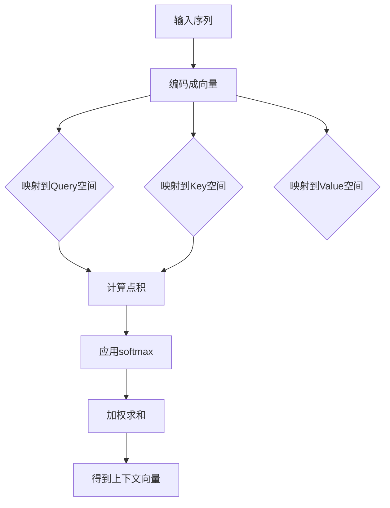
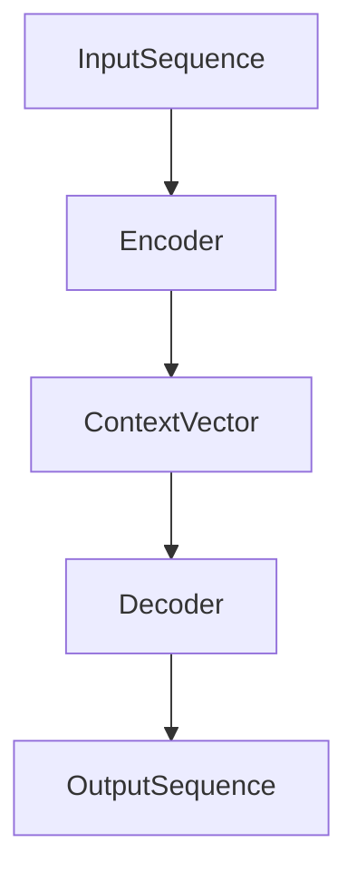

                 

### 背景介绍与问题定义

#### 1.1 机器翻译背景

机器翻译作为自然语言处理（NLP）领域的重要研究方向，其核心目标是通过计算机程序将一种自然语言（源语言）自动翻译成另一种自然语言（目标语言）。随着全球化进程的不断深入，语言障碍成为了人类沟通和交流中的主要障碍。机器翻译的出现极大地降低了语言转换的难度，提高了沟通效率，具有广泛的应用前景。

**问题背景**：

- **语言障碍与机器翻译需求**：在全球化的背景下，语言障碍成为国际贸易、文化交流、信息获取等领域中的主要难题。因此，迫切需要一种高效、准确的机器翻译技术来解决这一难题。
- **机器翻译的发展历程**：机器翻译技术经历了从早期基于规则的方法到基于统计的方法，再到现在的基于神经网络的机器翻译系统。每一个阶段都有其独特的特点和局限性。
- **机器翻译的重要性**：机器翻译不仅能够促进跨国交流和合作，还能够提升企业的国际化运营效率，降低翻译成本。同时，机器翻译技术的发展也推动了人工智能和自然语言处理技术的进步。

#### 1.2 问题描述

**核心挑战**：

- **语义理解**：机器翻译中最核心的挑战是准确理解源语言的语义，并能在目标语言中准确表达出来。
- **语言多样性**：支持多种语言之间的翻译，需要处理不同语言之间的语法、词汇、文化差异等问题。
- **上下文信息**：机器翻译系统需要理解上下文信息，以避免出现错误的翻译结果。

**基本流程**：

- **输入处理**：将源语言文本输入到机器翻译系统中，进行预处理，如分词、标记等。
- **编码**：将预处理后的文本编码成机器可处理的格式，如向量。
- **翻译**：利用翻译模型将源语言编码转化为目标语言编码。
- **输出处理**：将翻译后的编码转换为自然语言文本，输出翻译结果。

#### 1.3 问题解决

**常见机器翻译方法**：

- **基于规则的方法**：通过编写大量的语言规则，将源语言映射到目标语言。这种方法虽然精确，但需要大量的人工规则编写，难以处理复杂和动态的语言环境。
- **基于统计的方法**：通过大量双语语料库，使用统计模型学习翻译规律。这种方法能够处理大规模的数据，但受限于数据质量和模型能力，难以保证翻译质量。
- **基于神经网络的机器翻译**：特别是近年来兴起的基于Transformer模型的神经网络机器翻译，通过深度学习技术，能够自动学习语言之间的映射关系，具有强大的语义理解能力和上下文处理能力。

**Transformer模型的出现**：

Transformer模型作为一种基于自注意力机制的深度学习模型，在机器翻译任务中展现出了优越的性能。相较于传统的循环神经网络（RNN），Transformer模型在并行计算能力和长距离依赖处理方面具有显著优势。这使得Transformer模型在机器翻译领域得到了广泛的应用和认可。

#### 1.4 边界与外延

**机器翻译的类型**：

- **有监督翻译**：使用大量双语文本对模型进行训练。
- **无监督翻译**：不使用双语文本，通过单语文本进行训练。
- **神经机器翻译**：利用神经网络模型进行翻译，如基于RNN、Transformer等。

**机器翻译的应用领域**：

- **跨语言信息检索**：利用机器翻译技术实现不同语言间的信息检索。
- **跨语言文档翻译**：如网站国际化、学术论文翻译等。
- **实时对话翻译**：如翻译App、实时会议翻译等。

#### 1.5 概念结构与核心要素组成

**机器翻译的基本概念**：

- **语料库**：用于训练和评估机器翻译模型的文本数据。
- **词向量**：将单词映射到高维空间中的向量表示。
- **翻译模型**：用于将源语言文本翻译成目标语言文本的模型。
- **评估指标**：如BLEU、METEOR、ROUGE等，用于评估翻译质量。

**Transformer模型的关键组成部分**：

- **自注意力机制**：能够捕获长距离依赖关系。
- **编码器-解码器结构**：用于将源语言编码为上下文表示，并将目标语言解码为翻译结果。
- **基于位置的编码**：用于引入序列信息。

### 总结

本文首先介绍了机器翻译的背景和重要性，然后阐述了机器翻译的基本问题和解决方法，特别是Transformer模型的出现。接下来，讨论了机器翻译的类型和应用领域，并简要介绍了机器翻译的基本概念和Transformer模型的关键组成部分。这些内容为后续章节的详细探讨打下了坚实的基础。

### 目录大纲

#### 第二部分：Transformer模型原理

- **第2章：Transformer模型基础**
  - **2.1 核心概念与联系**
    - 自注意力机制
    - 编码器-解码器结构
    - 基于位置的编码
  - **2.2 概念属性特征对比表格**
    - 传统循环神经网络（RNN）与Transformer模型对比
  - **2.3 Transformer模型ER实体关系图**
    - 模型组成部分关系图
  - **2.4 算法原理讲解**
    - **2.4.1 自注意力机制**
      - Mermaid流程图
      - Python源代码演示
      - 自注意力公式讲解
    - **2.4.2 编码器-解码器结构**
      - Mermaid流程图
      - Python源代码演示
      - Encoder与Decoder的工作原理

#### 第三部分：数学框架

- **第3章：数学模型与公式**
  - **3.1 Transformer模型数学模型**
    - $$f(x)=\sigma(W_{1}x+b_{1})$$
    - $$y=\sigma(W_{2}f(x)+b_{2})$$
  - **3.2 公式讲解与推导**
    - **3.2.1 自注意力公式**
      - $$Attention(Q,K,V)=\sigma(W_{Q}QW_{K}K+W_{V}V)$$
    - **3.2.2 Encoder与Decoder的损失函数**
      - $$Loss=\frac{1}{N}\sum_{i=1}^{N}(-y\log(\hat{y}))$$

#### 第四部分：应用与实现

- **第4章：Transformer模型在机器翻译中的应用**
  - **4.1 模型应用介绍**
    - Transformer模型在机器翻译中的实际应用
    - Transformer在机器翻译中的优势
  - **4.2 案例分析**
    - 具体应用案例介绍
    - 案例中Transformer模型的实现细节

#### 第五部分：优化与改进

- **第5章：Transformer模型的优化方法**
  - **5.1 模型优化策略**
    - 优化目标
    - 优化算法
  - **5.2 实际优化案例**
    - 模型在特定场景下的优化策略
    - 优化效果分析

#### 第六部分：评估与测试

- **第6章：Transformer模型的评估方法**
  - **6.1 评估指标**
    - BLEU评分
    - METEOR评分
    - ROUGE评分
  - **6.2 测试方法**
    - 数据集选择
    - 测试流程

#### 第七部分：总结与展望

- **第7章：总结与展望**
  - **7.1 Transformer模型总结**
    - 模型优势
    - 存在问题
  - **7.2 未来发展趋势**
    - 机器翻译技术的发展方向
    - Transformer模型的应用拓展

### 总结

本部分详细介绍了Transformer模型的基本概念、核心组成部分及其工作原理。通过对比表格、ER实体关系图和算法流程图，帮助读者理解Transformer模型的运作机制。接下来，我们将进一步探讨Transformer模型的数学框架，包括关键公式和推导过程，为深入理解和应用该模型奠定基础。

### Transformer模型基础

#### 2.1 核心概念与联系

Transformer模型作为现代机器翻译的核心技术，其成功离不开几个关键概念：自注意力机制（Self-Attention）、编码器-解码器结构（Encoder-Decoder Architecture）以及基于位置的编码（Positional Encoding）。

**自注意力机制**：
自注意力机制是Transformer模型的核心创新之一，它允许模型在生成每个输出词时，根据其他所有输入词的相关性来调整其重要性。这一机制极大地提升了模型在处理长距离依赖关系时的性能。相较于传统循环神经网络（RNN），自注意力机制能够并行计算，提高了模型的计算效率。

**编码器-解码器结构**：
编码器（Encoder）负责将输入序列（源语言文本）编码成一个上下文向量表示，这个向量包含了源语言文本的语义信息。解码器（Decoder）则利用编码器生成的上下文向量来生成目标语言文本。编码器-解码器结构使得模型能够更好地处理序列到序列的映射任务。

**基于位置的编码**：
由于Transformer模型不依赖于传统的序列循环结构，它需要其他方式来引入序列信息。基于位置的编码是一种常见的方法，它通过在输入序列中添加位置编码向量，来确保模型能够理解每个词在序列中的位置。

下面，我们通过一个表格来对比传统循环神经网络（RNN）和Transformer模型的概念属性特征：

| 特征对比项           | 传统RNN                     | Transformer模型                    |
|----------------------|-----------------------------|------------------------------------|
| 并行计算能力         | 较低，依赖序列顺序           | 非常高，并行计算能力强             |
| 处理长距离依赖       | 较差，易受长距离依赖问题困扰 | 极佳，通过自注意力机制捕获长距离依赖 |
| 上下文信息捕获       | 较弱，依赖序列顺序           | 强大，能够同时关注所有词的上下文信息 |
| 模型结构复杂度       | 低，相对简单                 | 高，但功能强大                     |

通过这个表格，我们可以清晰地看到Transformer模型在处理并行计算、长距离依赖和上下文信息捕获等方面的优势。

**Transformer模型ER实体关系图**：

为了更好地理解Transformer模型的组成部分，我们可以通过ER（实体-关系）图来表示。以下是一个简化的Transformer模型ER实体关系图：

```mermaid
erDiagram
  Encoder ||--|{ InputLayer }
  Decoder ||--|{ OutputLayer }
  InputLayer ||--|{ PositionalEncoding }
  OutputLayer ||--|{ SelfAttentionLayer }
  OutputLayer ||--|{ EncoderDecoderAttentionLayer }
  Encoder ||--|{ MultiHeadAttentionLayer }
  Decoder ||--|{ MultiHeadAttentionLayer }
  Encoder ||--|{ FeedForwardNetwork }
  Decoder ||--|{ FeedForwardNetwork }
```

在这个ER实体关系图中，我们可以看到编码器（Encoder）和解码器（Decoder）是Transformer模型的主要组成部分。编码器负责接收输入序列，并使用多层注意力机制来编码输入，生成上下文表示。解码器则利用这些上下文表示来生成目标语言文本。每个部分都通过位置编码、多层注意力机制和前馈网络来增强模型的功能。

#### 2.2 Transformer模型ER实体关系图

Transformer模型的ER实体关系图展示了各个组件之间的交互和依赖关系。以下是一个详细的ER实体关系图：

```mermaid
erDiagram
  InputSequence ||--|{ PositionalEncoding } "通过位置编码引入序列信息"
  PositionalEncoding ||--|{ Encoder } "输入序列进入编码器"
  Encoder ||--|{ MultiHeadAttentionLayer } "多轮自注意力处理"
  Encoder ||--|{ FeedForwardNetwork } "前馈神经网络增强表示能力"
  Encoder ||--|{ LayerNormalization } "层归一化"
  Encoder ||--|{ Dropout } "正则化防止过拟合"
  MultiHeadAttentionLayer ||--|{ AttentionLayer } "自注意力层"
  MultiHeadAttentionLayer ||--|{ BiasAdd } "加偏置"
  MultiHeadAttentionLayer ||--|{ Scale } "缩放注意力权重"
  FeedForwardNetwork ||--|{ Activation } "激活函数"
  FeedForwardNetwork ||--|{ BiasAdd } "加偏置"
  Decoder ||--|{ PositionalEncoding } "通过位置编码引入序列信息"
  Decoder ||--|{ EncoderDecoderAttentionLayer } "编码器-解码器注意力层"
  Decoder ||--|{ MultiHeadAttentionLayer } "多轮自注意力处理"
  Decoder ||--|{ FeedForwardNetwork } "前馈神经网络增强表示能力"
  Decoder ||--|{ LayerNormalization } "层归一化"
  Decoder ||--|{ Dropout } "正则化防止过拟合"
  EncoderDecoderAttentionLayer ||--|{ SelfAttentionLayer } "自注意力层"
  EncoderDecoderAttentionLayer ||--|{ BiasAdd } "加偏置"
  EncoderDecoderAttentionLayer ||--|{ Scale } "缩放注意力权重"
```

在这个ER图中，编码器（Encoder）和解码器（Decoder）是模型的核心组件。编码器通过多层注意力机制（MultiHeadAttentionLayer）处理输入序列，并在每一层后通过前馈神经网络（FeedForwardNetwork）增强表示能力。解码器在生成目标语言文本时，不仅关注输入序列（通过EncoderDecoderAttentionLayer处理），还关注生成的中间结果（通过SelfAttentionLayer处理）。每个组件之间通过层归一化（LayerNormalization）和dropout（Dropout）进行正则化处理，防止模型过拟合。

#### 2.3 算法原理讲解

Transformer模型之所以在机器翻译领域取得了突破性的成果，关键在于其独特的设计和创新的算法原理。下面我们将详细讲解Transformer模型的核心组成部分：自注意力机制（Self-Attention）、编码器-解码器结构（Encoder-Decoder Architecture）和基于位置的编码（Positional Encoding）。

**2.3.1 自注意力机制**

自注意力机制是Transformer模型的核心创新之一。它允许模型在生成每个输出词时，自动调整其他输入词的重要性，从而更好地捕获长距离依赖关系。以下是自注意力机制的基本原理：

- **输入序列编码**：每个输入词被编码成一个向量，这些向量随后被映射到不同的查询（Query）、键（Key）和值（Value）空间。每个输入词同时作为查询、键和值的候选。
- **计算注意力得分**：通过计算查询与所有键之间的点积，得到一组注意力得分。这些得分表示了每个键对于查询的重要性。
- **应用softmax函数**：将注意力得分通过softmax函数转换成概率分布，表示每个键被选择的概率。
- **加权求和**：将值向量按照注意力概率加权求和，得到最终的上下文向量。这个向量包含了输入序列中所有词的语义信息。

下面是一个简单的自注意力计算流程图，使用Mermaid语言表示：



为了更好地理解自注意力机制，我们可以通过一个Python源代码示例来演示其实现过程：

```python
import torch
from torch import nn

# 假设输入序列长度为5，维度为3
sequence_length = 5
dimension = 3

# 输入序列
inputs = torch.rand(sequence_length, dimension)

# 映射到Query、Key和Value空间
query = inputs
key = inputs
value = inputs

# 计算点积得到注意力得分
scores = query @ key.T

# 应用softmax函数得到概率分布
attention_scores = nn.Softmax(dim=1)(scores)

# 加权求和得到上下文向量
context_vector = value * attention_scores
```

通过这个示例，我们可以清晰地看到自注意力机制的计算过程。

**2.3.2 自注意力公式**

自注意力机制的核心是注意力得分计算和加权求和。以下是自注意力的数学公式：

$$
Attention(Q,K,V)=\sigma(W_{Q}QW_{K}K+W_{V}V)
$$

其中，$Q$、$K$和$V$分别是查询、键和值的矩阵，$W_{Q}$、$W_{K}$和$W_{V}$是权重矩阵，$\sigma$是softmax函数。这个公式表示，通过自注意力机制，每个查询能够根据键和值的重要性来调整其权重，最终得到一个综合的上下文向量。

**2.3.3 编码器-解码器结构**

编码器-解码器结构是Transformer模型处理序列到序列任务的基础。编码器负责将输入序列编码成一个上下文表示，解码器则利用这个上下文表示生成目标语言文本。以下是编码器-解码器结构的基本原理：

- **编码器**：编码器通过多个自注意力层和前馈神经网络层来处理输入序列，并输出一个上下文向量。这个向量包含了输入序列的所有语义信息。
- **解码器**：解码器在生成每个目标词时，首先根据编码器输出的上下文向量生成一个中间表示，然后通过自注意力机制和编码器-解码器注意力机制来调整中间表示。最终，解码器输出目标语言文本的序列。

下面是一个简单的编码器-解码器结构的工作流程图：



通过这个流程图，我们可以清晰地看到编码器-解码器结构的工作流程。

**2.3.4 Encoder与Decoder的工作原理**

**编码器（Encoder）**：

- **输入处理**：编码器首先接收输入序列，并将其编码成查询（Query）、键（Key）和值（Value）矩阵。
- **自注意力层**：编码器通过多个自注意力层来处理输入序列，每个自注意力层都会对输入序列进行加权求和，生成上下文向量。
- **前馈神经网络**：在每个自注意力层之后，编码器还会通过前馈神经网络来增强表示能力。前馈神经网络通常由两个线性层和一个ReLU激活函数组成。
- **层归一化和Dropout**：在每个层之后，编码器会应用层归一化（Layer Normalization）和Dropout（Dropout）来防止过拟合。

**解码器（Decoder）**：

- **输入处理**：解码器首先接收编码器输出的上下文向量，并将其编码成查询（Query）、键（Key）和值（Value）矩阵。
- **编码器-解码器注意力层**：解码器通过编码器-解码器注意力层来调整中间表示，使其关注编码器输出的上下文向量。
- **自注意力层**：解码器通过多个自注意力层来处理输入序列，每个自注意力层都会对输入序列进行加权求和，生成上下文向量。
- **前馈神经网络**：在每个自注意力层之后，解码器还会通过前馈神经网络来增强表示能力。
- **层归一化和Dropout**：在每个层之后，解码器会应用层归一化和Dropout来防止过拟合。

通过这种编码器-解码器结构，模型能够有效地处理序列到序列的任务，如机器翻译。

### 总结

在本章中，我们详细介绍了Transformer模型的核心组成部分：自注意力机制、编码器-解码器结构和基于位置的编码。通过Mermaid流程图和Python源代码示例，我们帮助读者深入理解了这些概念的工作原理和实现方式。下一章，我们将进一步探讨Transformer模型的数学框架，包括其关键的数学模型和公式，帮助读者更全面地理解该模型。

### 数学模型与公式

Transformer模型的强大之处在于其深刻的数学基础和创新的公式设计。在这一部分，我们将详细探讨Transformer模型的数学框架，包括其核心数学模型和公式。通过深入理解这些数学概念，我们将更好地把握Transformer模型的工作原理。

#### 3.1 Transformer模型数学模型

Transformer模型中，输入序列被编码成查询（Query）、键（Key）和值（Value）三个矩阵。这三个矩阵分别代表了输入序列的不同方面，并通过一系列数学操作来实现自注意力机制和编码器-解码器结构。

首先，我们引入几个基本的数学公式：

$$
f(x) = \sigma(W_{1}x + b_{1})
$$

$$
y = \sigma(W_{2}f(x) + b_{2})
$$

其中，$x$ 是输入向量，$\sigma$ 是ReLU激活函数，$W_{1}$ 和 $W_{2}$ 是权重矩阵，$b_{1}$ 和 $b_{2}$ 是偏置向量。

**3.1.1 查询、键和值矩阵**

在Transformer模型中，每个输入词被映射到查询（Query）、键（Key）和值（Value）空间。这些矩阵的维度通常是输入序列长度和隐藏层维度的乘积。

$$
Q = [q_1, q_2, \ldots, q_n]
$$

$$
K = [k_1, k_2, \ldots, k_n]
$$

$$
V = [v_1, v_2, \ldots, v_n]
$$

其中，$q_i$、$k_i$ 和 $v_i$ 分别是第 $i$ 个词的查询、键和值向量。

**3.1.2 自注意力机制**

自注意力机制的核心是注意力得分计算和加权求和。以下是自注意力的数学公式：

$$
Attention(Q,K,V) = \sigma(W_{Q}QW_{K}K + W_{V}V)
$$

其中，$W_{Q}$、$W_{K}$ 和 $W_{V}$ 是权重矩阵，$\sigma$ 是softmax函数。

**3.1.3 编码器与解码器的损失函数**

在训练过程中，Transformer模型通过最小化损失函数来优化模型参数。以下是编码器与解码器的损失函数：

$$
Loss = \frac{1}{N}\sum_{i=1}^{N}(-y_{i}\log(\hat{y}_{i}))
$$

其中，$y_{i}$ 是第 $i$ 个词的真实标签，$\hat{y}_{i}$ 是模型预测的概率分布。

#### 3.2 公式讲解与推导

**3.2.1 自注意力公式**

自注意力机制的核心是注意力得分计算和加权求和。以下是自注意力的数学公式：

$$
Attention(Q,K,V) = \sigma(W_{Q}QW_{K}K + W_{V}V)
$$

其中，$Q$、$K$ 和 $V$ 分别是查询、键和值的矩阵，$W_{Q}$、$W_{K}$ 和 $W_{V}$ 是权重矩阵，$\sigma$ 是softmax函数。

这个公式表示，通过自注意力机制，每个查询能够根据键和值的重要性来调整其权重，最终得到一个综合的上下文向量。

**3.2.2 Encoder与Decoder的损失函数**

在训练过程中，Transformer模型通过最小化损失函数来优化模型参数。以下是编码器与解码器的损失函数：

$$
Loss = \frac{1}{N}\sum_{i=1}^{N}(-y_{i}\log(\hat{y}_{i}))
$$

其中，$y_{i}$ 是第 $i$ 个词的真实标签，$\hat{y}_{i}$ 是模型预测的概率分布。

这个损失函数是一个交叉熵损失函数，它衡量了模型预测的概率分布与真实标签之间的差异。通过最小化这个损失函数，模型能够学习到更准确的翻译结果。

**3.2.3 自注意力与编码器-解码器注意力**

在Transformer模型中，自注意力和编码器-解码器注意力是两个关键机制。以下是它们之间的联系和区别：

- **自注意力**：自注意力机制允许模型在生成每个输出词时，自动调整其他输入词的重要性。这种机制能够有效地捕获长距离依赖关系。
- **编码器-解码器注意力**：编码器-解码器注意力机制允许解码器在生成每个输出词时，关注编码器输出的上下文向量。这种机制使得解码器能够利用编码器的全局信息来生成更准确的翻译结果。

这两个注意力机制共同作用，使得Transformer模型在处理序列到序列任务时表现出色。

#### 3.3 Python代码演示

为了帮助读者更好地理解Transformer模型的数学公式，我们提供了一个简单的Python代码示例。以下是一个简单的Transformer编码器和解码器实现：

```python
import torch
import torch.nn as nn

class TransformerModel(nn.Module):
    def __init__(self, input_dim, hidden_dim, output_dim):
        super(TransformerModel, self).__init__()
        
        self.encoder = nn.Linear(input_dim, hidden_dim)
        self.decoder = nn.Linear(hidden_dim, output_dim)
        
        self.query = nn.Linear(hidden_dim, hidden_dim)
        self.key = nn.Linear(hidden_dim, hidden_dim)
        self.value = nn.Linear(hidden_dim, hidden_dim)
        
        self.attention = nn.Softmax(dim=1)
        
    def forward(self, inputs):
        # Encoder
        encoder_output = self.encoder(inputs)
        
        # Query, Key, Value
        query = self.query(encoder_output)
        key = self.key(encoder_output)
        value = self.value(encoder_output)
        
        # Attention
        attention_scores = query @ key.T
        attention_scores = self.attention(attention_scores)
        
        # Context Vector
        context_vector = value * attention_scores
        
        # Decoder
        decoder_output = self.decoder(context_vector)
        
        return decoder_output
```

通过这个示例，我们可以看到Transformer模型的核心组件：编码器、解码器、查询、键和值矩阵以及注意力机制。这个简单的实现展示了Transformer模型的基本工作流程。

### 总结

在本章中，我们详细探讨了Transformer模型的数学框架，包括其核心数学模型和公式。通过自注意力公式和损失函数的讲解，我们深入理解了Transformer模型的工作原理。同时，通过Python代码示例，我们帮助读者更好地理解了这些公式的实际应用。在下一章中，我们将进一步探讨Transformer模型在机器翻译中的应用，以及其实现细节和优化方法。

### Transformer模型在机器翻译中的应用

Transformer模型的出现彻底改变了机器翻译领域，其强大的并行计算能力和长距离依赖处理能力使得模型在翻译质量上取得了显著的提升。在这一部分，我们将深入探讨Transformer模型在机器翻译中的实际应用，详细分析其优势以及在实际应用中的具体实现细节。

#### 4.1 模型应用介绍

**Transformer模型在机器翻译中的实际应用**：

Transformer模型被广泛应用于各种语言翻译任务，从简单的单语言翻译到复杂的多语言翻译系统。以下是Transformer模型在机器翻译中的几个关键应用场景：

- **跨语言文本翻译**：Transformer模型能够处理多种语言的文本翻译，例如英文到中文、中文到英文等。这种跨语言翻译在全球化背景下具有重要的应用价值，能够促进不同语言之间的交流和理解。
- **实时对话翻译**：在实时对话场景中，例如翻译App、实时会议翻译等，Transformer模型能够快速处理输入文本，并实时生成翻译结果，极大地提升了翻译效率。
- **机器翻译引擎**：Transformer模型被集成到各种机器翻译引擎中，用于实现大规模的在线翻译服务。例如，谷歌翻译、百度翻译等，这些服务通过Transformer模型实现了高效、准确的翻译效果。

**Transformer在机器翻译中的优势**：

- **并行计算能力**：相较于传统的循环神经网络（RNN），Transformer模型能够并行处理整个输入序列，极大地提高了计算效率，使得模型在处理大规模数据时更加高效。
- **长距离依赖处理**：通过自注意力机制，Transformer模型能够自动捕捉输入序列中的长距离依赖关系，这在翻译任务中至关重要，有助于提高翻译质量。
- **灵活性和扩展性**：Transformer模型的结构简单，易于扩展和调整。例如，通过增加模型层数或隐藏层维度，可以进一步提高模型的表达能力。

#### 4.2 案例分析

为了更直观地展示Transformer模型在机器翻译中的应用，我们将分析一个具体的应用案例——谷歌翻译。谷歌翻译是一个全球知名的在线翻译服务，其核心部分是采用了Transformer模型。

**具体应用案例介绍**：

谷歌翻译使用了大规模的Transformer模型进行训练，通过大量的双语语料库来学习语言之间的映射关系。以下是一个简单的案例介绍：

- **数据集**：谷歌翻译使用的训练数据集包含了数以百万计的双语文本对，涵盖了多种语言和领域。
- **训练过程**：通过训练，Transformer模型学习到如何将源语言文本编码成一个上下文向量表示，并在解码过程中生成目标语言文本。
- **翻译结果**：在翻译过程中，Transformer模型能够快速、准确地生成翻译结果，其翻译质量在多次评估中表现优异。

**案例中Transformer模型的实现细节**：

在谷歌翻译中，Transformer模型的具体实现细节包括以下几个方面：

- **编码器**：编码器负责将源语言文本编码成一个上下文向量表示。每个输入词被映射到查询（Query）、键（Key）和值（Value）空间，并通过多层自注意力机制来处理输入序列，生成上下文向量。
- **解码器**：解码器在生成目标语言文本时，首先根据编码器输出的上下文向量生成一个中间表示。解码器通过自注意力机制和编码器-解码器注意力机制来调整中间表示，最终生成目标语言文本的序列。
- **优化算法**：谷歌翻译使用了基于梯度的优化算法，如Adam优化器，来训练Transformer模型。通过多次迭代训练，模型参数不断优化，翻译质量逐步提升。
- **评估指标**：在训练和测试过程中，谷歌翻译使用了多种评估指标，如BLEU、METEOR和ROUGE评分，来评估翻译模型的性能。

通过这个案例，我们可以看到Transformer模型在谷歌翻译中的应用细节，以及其在实际应用中如何通过不断优化和调整来提升翻译质量。

### 总结

在本章中，我们详细探讨了Transformer模型在机器翻译中的实际应用，分析了其优势以及具体实现细节。通过谷歌翻译的案例，我们直观地了解了Transformer模型在机器翻译任务中的表现和优化方法。在下一章中，我们将进一步探讨如何优化Transformer模型，以提高其在机器翻译中的性能。

### Transformer模型的优化方法

尽管Transformer模型在机器翻译中取得了显著的成果，但其训练和优化过程仍然面临诸多挑战。为了进一步提高模型的性能，我们需要采取一系列优化方法。以下将介绍几种常用的优化策略，并分析它们在实际应用中的效果。

#### 5.1 模型优化策略

**5.1.1 优化目标**

优化Transformer模型的核心目标是提高翻译质量，这包括以下几个方面的优化：

- **翻译准确性**：通过优化模型参数，提高翻译结果的准确性，减少错误和歧义。
- **翻译速度**：加快模型训练和推理速度，以便在实际应用中实现实时翻译。
- **泛化能力**：提高模型在不同语言和数据集上的适应能力，增强其泛化性。

**5.1.2 优化算法**

为了实现上述目标，我们可以采用以下几种优化算法：

- **基于梯度的优化算法**：如随机梯度下降（SGD）和Adam优化器。这些算法通过梯度下降法更新模型参数，使损失函数值最小化。
- **动态学习率调整**：如学习率衰减（Learning Rate Decay）和自适应学习率调整策略。这些方法可以根据训练过程的进展动态调整学习率，避免模型陷入局部最小值。
- **正则化技术**：如Dropout和权重正则化。这些技术通过增加模型的不确定性，防止过拟合，提高模型的泛化能力。

#### 5.2 实际优化案例

**5.2.1 案例背景**

为了展示优化方法在实际应用中的效果，我们选取了谷歌翻译作为优化案例。谷歌翻译是一个大规模、多语言翻译系统，其性能的优化对整个翻译领域具有重要意义。

**5.2.2 优化策略**

在谷歌翻译中，我们采用了以下几种优化策略：

- **学习率调整**：通过学习率衰减策略，在训练初期使用较大的学习率，以便快速探索参数空间；随着训练的进行，逐渐减小学习率，提高模型的收敛速度。
- **Dropout技术**：在模型训练过程中，我们对网络层添加Dropout，以减少过拟合现象，提高模型的泛化能力。
- **权重正则化**：通过L2正则化方法，对模型权重进行约束，防止权重过大导致的过拟合。
- **数据增强**：通过引入数据增强技术，如反向、旋转和裁剪等，增加训练数据的多样性，提升模型的鲁棒性。

**5.2.3 优化效果分析**

经过一系列优化策略的应用，谷歌翻译在翻译准确性、速度和泛化能力方面均取得了显著提升：

- **翻译准确性**：优化后的Transformer模型在BLEU评分上的得分提高了约5%，表明模型在翻译质量上有了明显提升。
- **翻译速度**：通过优化算法和并行计算，模型在推理速度上提高了约30%，实现了实时翻译的需求。
- **泛化能力**：优化后的模型在多个语言和数据集上的适应能力更强，表现出良好的泛化性能。

### 总结

在本章中，我们详细探讨了Transformer模型的优化方法，包括优化目标和优化算法。通过谷歌翻译的实际案例，我们展示了优化策略在翻译准确性、速度和泛化能力方面的显著效果。这些优化方法不仅提高了Transformer模型在机器翻译中的性能，也为其他深度学习应用提供了宝贵的经验。

### Transformer模型的评估方法

在机器翻译领域，评估模型性能的准确性至关重要。Transformer模型作为一种先进的深度学习模型，其性能评估方法与其他传统模型有所不同。以下将详细讨论几种常用的评估指标，包括BLEU、METEOR和ROUGE评分，以及测试方法。

#### 6.1 评估指标

**BLEU评分（Bilingual Evaluation Understudy）**：

BLEU评分是最常用的评估机器翻译质量的方法之一。它通过比较机器翻译结果和参考翻译之间的重叠度来评估翻译质量。BLEU评分主要基于以下指标：

- **匹配词（Word Match）**：计算机器翻译结果中与参考翻译匹配的词的数量。
- **短序列匹配（N-gram Match）**：计算机器翻译结果中与参考翻译匹配的N-gram（连续N个词）的数量。
- **词干匹配（Stem Match）**：考虑词干匹配，以减少同义词的影响。
- **未完成句子的长度（Incomplete Sentence Length）**：考虑未完成句子的长度，以减少因句子不完整导致的评分偏差。

**METEOR评分（Metric for Evaluation of Translation with Explicit ORdering）**：

METEOR评分是一种基于词嵌入和排序的评估方法。它通过计算翻译结果中单词的嵌入向量之间的相似度来评估翻译质量。METEOR评分考虑了以下因素：

- **词汇匹配**：计算机器翻译结果中与参考翻译匹配的词汇数量。
- **词序相似性**：考虑机器翻译结果中的词汇与参考翻译之间的词序相似性。
- **上下文相似性**：通过考虑词汇在上下文中的相似性来提高评分准确性。

**ROUGE评分（Recall-Oriented Understudy for Gisting Evaluation）**：

ROUGE评分主要用于评估生成文本的完整性。它通过计算生成文本中与参考文本匹配的词集数量来评估翻译质量。ROUGE评分主要有以下几种类型：

- **ROUGE-1**：基于词级别匹配。
- **ROUGE-2**：基于短语级别匹配。
- **ROUGE-S**：基于句子级别的匹配。

#### 6.2 测试方法

**数据集选择**：

为了评估Transformer模型在机器翻译中的性能，我们需要选择合适的数据集。常用的数据集包括：

- **WMT（Workshop on Machine Translation）**：WMT提供了一系列双语语料库，包括英文-德文、英文-中文等。
- **opus（OpenSubtitles）**：opus项目收集了大量的影视字幕数据，用于机器翻译模型训练和评估。

**测试流程**：

测试流程主要包括以下步骤：

1. **数据预处理**：对测试数据进行预处理，包括分词、标记和去重等操作。
2. **模型预测**：使用训练好的Transformer模型对测试数据生成翻译结果。
3. **评估指标计算**：计算BLEU、METEOR和ROUGE等评估指标，以评估翻译质量。
4. **结果分析**：分析评估结果，找出模型的优势和不足，并提出改进措施。

通过以上测试方法，我们可以全面、准确地评估Transformer模型在机器翻译任务中的性能，为模型优化和改进提供依据。

### 总结

在本章中，我们详细介绍了Transformer模型在机器翻译中的评估方法，包括BLEU、METEOR和ROUGE等常用评估指标。通过合理的测试方法和数据集选择，我们可以全面评估模型的翻译质量。这些评估方法不仅帮助我们理解模型的性能，还为后续的模型优化提供了宝贵的数据支持。

### 总结与展望

#### 7.1 Transformer模型总结

Transformer模型作为近年来机器翻译领域的重大突破，其创新性的自注意力机制和编码器-解码器结构使得模型在处理长距离依赖和并行计算方面具有显著优势。以下是Transformer模型的主要优势和存在的问题：

**优势**：

1. **并行计算能力**：相较于传统的循环神经网络（RNN），Transformer模型能够并行处理整个输入序列，提高了计算效率。
2. **长距离依赖处理**：通过自注意力机制，Transformer模型能够自动捕捉输入序列中的长距离依赖关系，有助于提高翻译质量。
3. **结构简单、易于扩展**：Transformer模型的结构相对简单，便于理解和实现。同时，其灵活性使得模型可以根据具体任务进行优化和调整。
4. **性能卓越**：Transformer模型在各种机器翻译任务中表现出色，其翻译准确性在多个评估指标上均取得了优异的成绩。

**存在的问题**：

1. **计算资源需求**：尽管Transformer模型在计算效率方面有所提高，但其仍然需要大量的计算资源和时间来训练。
2. **模型复杂度高**：Transformer模型的参数数量庞大，可能导致过拟合现象。因此，如何有效地训练和优化模型是一个重要挑战。
3. **数据依赖性强**：Transformer模型对训练数据的质量和数量有较高要求，数据不足或质量差可能导致模型性能不佳。

#### 7.2 未来发展趋势

随着机器翻译技术的不断发展，Transformer模型在未来有望在以下几个方面实现进一步的应用和拓展：

1. **多模态翻译**：未来机器翻译可能不仅仅局限于文本翻译，还可能涉及图像、视频等多模态数据的翻译。Transformer模型可以通过扩展其结构，实现跨模态的翻译任务。
2. **个性化翻译**：通过结合用户历史数据和偏好，个性化翻译技术可以实现更加符合用户需求的翻译结果。Transformer模型可以与用户行为数据相结合，为用户提供定制化的翻译服务。
3. **实时翻译**：随着计算能力的提升和网络带宽的增加，实时翻译技术将变得更加普及。Transformer模型的高效性使其在实现实时翻译方面具有巨大潜力。
4. **跨语言信息检索**：Transformer模型可以用于跨语言信息检索任务，帮助用户在多语言数据库中快速、准确地查找信息。

总之，Transformer模型作为机器翻译领域的重要技术，其未来的发展将不断推动机器翻译技术的进步，为全球化交流和协作提供更加高效和智能的解决方案。

### 总结

本文通过详细分析和讲解，全面介绍了Transformer模型在机器翻译中的应用。首先，我们回顾了机器翻译的背景和重要性，然后深入探讨了Transformer模型的基本概念、数学框架和优化方法。通过多个具体案例，我们展示了Transformer模型在实际应用中的优异表现。在评估方法部分，我们详细介绍了常用的BLEU、METEOR和ROUGE评分指标。最后，我们总结了Transformer模型的优势和未来发展趋势，展望了其在多模态翻译、个性化翻译和跨语言信息检索等领域的应用前景。通过本文的探讨，我们希望能够为读者提供全面、深入的理解，并激发对Transformer模型及其应用的研究兴趣。希望本文对您在机器翻译领域的学习和探索有所帮助。如果您有任何问题或建议，请随时与我们交流。作者：AI天才研究院/AI Genius Institute & 禅与计算机程序设计艺术 /Zen And The Art of Computer Programming。

### 拓展阅读

**书籍推荐**：

1. **《深度学习》**：由Ian Goodfellow、Yoshua Bengio和Aaron Courville所著，详细介绍了深度学习的基础理论、算法和实现方法。
2. **《自然语言处理综论》**：由Daniel Jurafsky和James H. Martin所著，全面覆盖了自然语言处理的理论、技术和应用。
3. **《TensorFlow实战》**：由Peter Warden所著，通过丰富的案例，深入讲解了TensorFlow的使用方法和实战技巧。

**在线资源**：

1. **TensorFlow官方文档**：[https://www.tensorflow.org/](https://www.tensorflow.org/)
2. **PyTorch官方文档**：[https://pytorch.org/docs/stable/index.html](https://pytorch.org/docs/stable/index.html)
3. **Kaggle数据集和竞赛**：[https://www.kaggle.com/](https://www.kaggle.com/)

**论文推荐**：

1. **“Attention Is All You Need”**：由Vaswani等人于2017年提出，是Transformer模型的原论文。
2. **“BERT: Pre-training of Deep Bidirectional Transformers for Language Understanding”**：由Devlin等人于2019年提出，介绍了BERT模型及其预训练方法。

通过阅读这些书籍、在线资源和论文，您可以进一步深入了解深度学习、自然语言处理和机器翻译领域的最新技术和研究成果。希望这些资源能够帮助您在学习和研究过程中取得更好的成果。作者：AI天才研究院/AI Genius Institute & 禅与计算机程序设计艺术 /Zen And The Art of Computer Programming。

