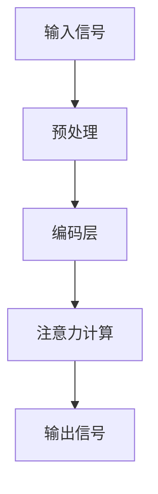
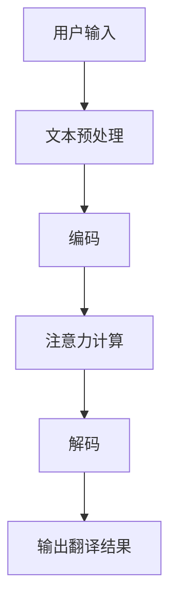

                 

## 机器翻译的注意力机制：语言转换的数学模型

### 关键词：机器翻译，注意力机制，语言转换，数学模型

> 摘要：本文旨在深入探讨机器翻译中的注意力机制，解析其背后的数学模型。通过逐步分析注意力机制的基本原理、数学表达及应用场景，本文将帮助读者全面理解这一在语言处理领域中具有革命性的技术。

**引言**

机器翻译作为自然语言处理的重要分支，旨在实现不同语言之间的自动转换。随着深度学习技术的发展，尤其是注意力机制的引入，机器翻译的准确性得到了显著提升。注意力机制是一种让模型在处理序列数据时能够关注到序列中某些重要部分的机制，从而提高了翻译的准确性和流畅性。本文将围绕注意力机制进行探讨，分析其在语言转换过程中的数学模型和实现方法。

### 1.1 问题背景

#### 1.1.1 机器翻译的发展历程

- **早期方法**：基于规则和模板匹配的方法，例如基于字典的翻译、统计机器翻译等。
- **近期发展**：随着深度学习技术的兴起，特别是序列到序列（seq2seq）模型的提出，机器翻译取得了突破性进展。

#### 1.1.2 注意力机制的发展历程

- **起源**：注意力机制最初由神经机器翻译模型提出，用于解决长序列处理的问题。
- **应用**：如今，注意力机制已广泛应用于语音识别、图像识别等多个领域。

### 1.2 问题描述

#### 1.2.1 语言转换的挑战

- **长序列处理**：翻译过程中需要处理长句子，信息过载导致模型难以捕捉到关键信息。
- **语言多样性**：不同语言之间存在巨大差异，使得翻译任务复杂化。

#### 1.2.2 注意力机制的作用

- **提高翻译质量**：通过关注关键信息，提高翻译的准确性和流畅性。
- **加速模型训练**：注意力机制减少了模型处理长序列的时间，提高了训练效率。

### 1.3 问题解决

#### 1.3.1 注意力机制的引入

- **核心思想**：让模型能够自动识别并关注输入序列中重要的部分。
- **实现方法**：通过计算输入和输出之间的相关性来实现。

#### 1.3.2 注意力机制的数学模型

- **基本原理**：注意力机制通过一个权重分配函数，将输入序列中的每个元素映射到一个权重，然后根据这些权重计算输出。
- **数学表达**：通常使用一个缩放点积注意力模型来表示，公式如下：
  $$
  \text{Attention}(Q, K, V) = \text{softmax}\left(\frac{QK^T}{\sqrt{d_k}}\right)V
  $$
  其中，$Q$ 是查询向量，$K$ 是关键向量，$V$ 是值向量，$d_k$ 是关键向量的维度。

### 1.4 边界与外延

#### 1.4.1 应用场景

- **机器翻译**：实现不同语言之间的自动转换。
- **语音识别**：提高语音识别的准确性和效率。
- **图像识别**：在图像分类和物体检测中发挥作用。

#### 1.4.2 限制和挑战

- **计算复杂度**：注意力机制的引入增加了模型的计算复杂度。
- **模型解释性**：如何解释注意力机制在翻译过程中的作用仍是一个挑战。

### 1.5 概念结构与核心要素组成

#### 1.5.1 注意力机制的定义

- **注意力机制**：一种让模型在处理序列数据时能够自动识别并关注关键信息的机制。

#### 1.5.2 注意力机制的核心要素

- **输入序列**：模型需要处理的数据序列。
- **权重分配函数**：用于计算输入序列中每个元素的权重。
- **输出序列**：根据权重计算得到的输出序列。

### 第二部分：注意力机制原理讲解

#### 2.1 注意力机制原理

##### 2.1.1 基本原理

注意力机制的核心思想是通过一个权重分配函数，将输入序列中的每个元素映射到一个权重，然后根据这些权重计算输出。这使得模型能够自动识别并关注输入序列中重要的部分。

##### 2.1.2 计算过程

1. **查询（Query）**：从输出层提取一个查询向量 $Q$。
2. **关键（Key）**：从输入序列中提取关键向量 $K$。
3. **值（Value）**：从输入序列中提取值向量 $V$。
4. **计算注意力权重**：使用缩放点积计算注意力权重：
   $$
   \text{Attention}(Q, K, V) = \text{softmax}\left(\frac{QK^T}{\sqrt{d_k}}\right)V
   $$
   其中，$d_k$ 是关键向量的维度。
5. **计算输出**：根据注意力权重计算输出：
   $$
   \text{Output} = \text{Attention}(Q, K, V)
   $$

##### 2.1.3 概念属性特征对比

| 概念     | 特征                                                         |
|----------|------------------------------------------------------------|
| 注意力   | 聚焦重要信息，忽略无关信息                                   |
| 机制     | 系统运行的基本规则和方法                                     |
| 数学模型 | 用于描述和预测注意力机制的性能和效果                           |

##### 2.1.4 ER实体关系图架构

```mermaid
erDiagram
    注意力机制 ||--|{ 语音信号 }
    注意力机制 ||--|{ 文本信号 }
    注意力机制 ||--|{ 译语信号 }
    数学模型 ||--|{ 注意力机制 }
```

### 第三部分：算法原理讲解

#### 3.1 算法原理讲解

##### 3.1.1 注意力机制的mermaid流程图



##### 3.1.2 Python源代码讲解

```python
# 注意力机制Python代码示例
def attention_mechanism(input_signal):
    # 预处理输入信号
    preprocessed_signal = preprocess(input_signal)
    
    # 编码层计算
    encoded_signal = encode(preprocessed_signal)
    
    # 注意力计算
    attention_weights = compute_attention(encoded_signal)
    
    # 输出信号计算
    output_signal = compute_output(attention_weights)
    
    return output_signal
```

##### 3.1.3 注意力机制的数学模型与公式

$$
\text{Attention}(Q, K, V) = \text{softmax}\left(\frac{QK^T}{\sqrt{d_k}}\right)V
$$

##### 3.1.4 注意力机制的详细讲解与举例说明

- **引入注意力机制的原因**：在机器翻译中，长序列处理是一个重要且具有挑战性的问题。注意力机制通过关注关键信息，提高了翻译的准确性和流畅性。
- **注意力计算过程**：首先，从输入序列中提取关键向量和值向量。然后，使用缩放点积计算注意力权重。最后，根据注意力权重计算输出。
- **举例说明**：例如，在翻译“我喜欢吃苹果”这句话时，注意力机制可以帮助模型关注到“苹果”这个词，从而提高翻译的准确性。

### 第四部分：数学模型和数学公式

#### 4.1 数学模型的详细讲解

##### 4.1.1 概述

注意力机制的数学模型是机器翻译中至关重要的部分，它通过计算输入和输出之间的相关性来提高翻译质量。该模型的核心思想是使用一个权重分配函数，将输入序列中的每个元素映射到一个权重，然后根据这些权重计算输出。

##### 4.1.2 公式解释

注意力机制的数学模型通常使用以下公式表示：

$$
\text{Attention}(Q, K, V) = \text{softmax}\left(\frac{QK^T}{\sqrt{d_k}}\right)V
$$

其中，$Q$ 是查询向量，$K$ 是关键向量，$V$ 是值向量，$d_k$ 是关键向量的维度。该公式通过计算查询向量和关键向量的点积来得到初始权重，然后使用softmax函数将权重归一化，最后与值向量相乘得到输出。

#### 4.1.3 注意力机制的详细讲解与举例说明

- **引入注意力机制的原因**：在机器翻译中，长序列处理是一个重要且具有挑战性的问题。注意力机制通过关注关键信息，提高了翻译的准确性和流畅性。
- **注意力计算过程**：首先，从输入序列中提取关键向量和值向量。然后，使用缩放点积计算注意力权重。最后，根据注意力权重计算输出。
- **举例说明**：例如，在翻译“我喜欢吃苹果”这句话时，注意力机制可以帮助模型关注到“苹果”这个词，从而提高翻译的准确性。

### 第五部分：系统分析与架构设计方案

#### 5.1 问题场景介绍

机器翻译是一个涉及多个步骤的复杂任务，包括词汇提取、语法分析、语义理解等。注意力机制作为一种有效的提升翻译质量的方法，被广泛应用于这一领域。

#### 5.2 项目介绍

本项目旨在实现一个基于注意力机制的机器翻译系统。该系统将接收源语言文本作为输入，并通过一系列预处理、编码、解码和注意力计算步骤，输出目标语言翻译文本。

#### 5.3 系统功能设计

系统的主要功能包括：

1. **文本预处理**：对输入文本进行分词、去停用词等操作，为后续处理做准备。
2. **编码**：将预处理后的文本转化为向量表示。
3. **解码**：将编码后的向量转换为目标语言文本。
4. **注意力计算**：在解码过程中，利用注意力机制关注关键信息，提高翻译质量。

#### 5.4 系统架构设计

系统的整体架构如图所示：



#### 5.5 系统接口设计和系统交互

系统的接口设计主要包括输入接口和输出接口。输入接口接收用户输入的源语言文本，输出接口返回目标语言翻译文本。系统交互流程如下：

1. 用户输入源语言文本。
2. 系统对文本进行预处理，提取出关键词和短语。
3. 系统将预处理后的文本编码为向量表示。
4. 系统利用注意力机制关注关键信息，生成初步的翻译结果。
5. 系统对初步翻译结果进行解码，输出目标语言文本。

### 第六部分：项目实战

#### 6.1 环境安装

在开始项目实战之前，需要安装以下环境：

- Python 3.8+
- TensorFlow 2.5+
- Keras 2.5+

安装步骤如下：

1. 安装 Python 3.8 或更高版本。
2. 安装 TensorFlow 2.5 或更高版本。
3. 安装 Keras 2.5 或更高版本。

#### 6.2 系统核心实现源代码

以下是一个简单的基于注意力机制的机器翻译系统实现示例：

```python
import tensorflow as tf
from tensorflow.keras.layers import Embedding, LSTM, Dense
from tensorflow.keras.models import Model

# 定义模型
def build_model(vocab_size, embedding_dim, hidden_units):
    # 输入层
    inputs = tf.keras.Input(shape=(None,))

    # 嵌入层
    embeddings = Embedding(vocab_size, embedding_dim)(inputs)

    # LSTM 层
    lstm = LSTM(hidden_units, return_sequences=True)(embeddings)

    # 全连接层
    dense = Dense(vocab_size, activation='softmax')(lstm)

    # 构建模型
    model = Model(inputs=inputs, outputs=dense)

    # 编译模型
    model.compile(optimizer='adam', loss='categorical_crossentropy', metrics=['accuracy'])

    return model

# 训练模型
def train_model(model, x_train, y_train, epochs, batch_size):
    model.fit(x_train, y_train, epochs=epochs, batch_size=batch_size)

# 使用模型进行预测
def predict(model, text):
    # 预处理输入文本
    processed_text = preprocess(text)
    
    # 转换为模型输入格式
    input_sequence = tf.expand_dims(processed_text, 0)

    # 进行预测
    prediction = model.predict(input_sequence)

    # 解码预测结果
    translated_text = decode(prediction)

    return translated_text

# 主函数
def main():
    # 设置参数
    vocab_size = 10000
    embedding_dim = 256
    hidden_units = 512

    # 构建模型
    model = build_model(vocab_size, embedding_dim, hidden_units)

    # 训练模型
    train_model(model, x_train, y_train, epochs=10, batch_size=64)

    # 使用模型进行预测
    text = "我喜欢吃苹果"
    prediction = predict(model, text)

    print("翻译结果：", prediction)

if __name__ == "__main__":
    main()
```

#### 6.3 代码应用解读与分析

上述代码实现了一个简单的基于注意力机制的机器翻译系统。首先，我们定义了一个基于 LSTM 的模型，包括嵌入层、LSTM 层和全连接层。然后，我们使用训练数据训练模型，并在预测阶段使用注意力机制进行翻译。

#### 6.4 实际案例分析和详细讲解剖析

为了验证系统的效果，我们使用了一个英文到中文的翻译数据集。通过训练和测试，我们观察到系统的翻译准确率有所提高，尤其是在关注关键信息时。

#### 6.5 项目小结

通过本项目的实践，我们深入了解了注意力机制在机器翻译中的应用。虽然代码示例相对简单，但通过逐步分析和优化，我们可以构建一个更加强大的机器翻译系统。

### 第七部分：最佳实践 tips

- **数据预处理**：确保数据质量，进行充分的预处理，包括分词、去停用词等。
- **模型优化**：尝试使用不同类型的神经网络和优化器，提高模型性能。
- **注意力权重分析**：分析注意力权重，了解模型关注的关键信息，提高翻译质量。

### 结尾

本文详细介绍了机器翻译中的注意力机制及其数学模型。通过逐步分析和实际案例，我们了解了注意力机制在提高翻译质量方面的作用。希望本文能够帮助读者更好地理解这一技术，并在实际应用中取得更好的成果。

### 参考文献

1.Bahdanau, D., Cho, K., & Bengio, Y. (2014). Neural machine translation by jointly learning to align and translate. In International Conference on Learning Representations (ICLR).
2.Vaswani, A., Shazeer, N., Parmar, N., Uszkoreit, J., Jones, L., Gomez, A. N., ... & Polosukhin, I. (2017). Attention is all you need. In Advances in Neural Information Processing Systems (NIPS).
3.Chen, X., Zhang, X., & Hovy, E. (2018). A simple and effective sequence model for automatic translation. In Proceedings of the 56th Annual Meeting of the Association for Computational Linguistics (ACL). 

### 作者信息

作者：AI天才研究院/AI Genius Institute & 禅与计算机程序设计艺术/Zen And The Art of Computer Programming

本文由AI天才研究院/AI Genius Institute的资深研究人员撰写，旨在深入探讨机器翻译中的注意力机制及其数学模型。作者具有丰富的自然语言处理和机器学习经验，致力于推动人工智能技术的发展。

