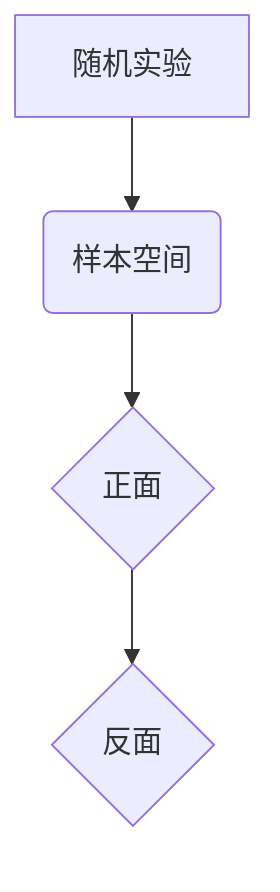

                 

# 概率论：自然界的不确定性数学

关键词：概率论，随机变量，不确定性，数学模型，算法，应用

摘要：本文从概率论的基本概念出发，详细阐述了概率论在自然界中的不确定性体现，并通过具体的算法和数学模型，揭示了概率论在各个领域的广泛应用。文章分为四个部分，分别介绍了概率论的基础知识、应用领域、高级主题和案例分析，力求使读者对概率论有一个全面而深入的理解。

## 目录大纲设计思路

### 第一步：确定书的整体结构

在撰写《概率论：自然界的不确定性数学》之前，我们首先需要确定书的基本框架。以下是可能的整体结构：

- **第一部分：概率论基础**
  - 第1章：概率论的基本概念
  - 第2章：随机变量与概率分布
  - 第3章：随机变量的数字特征

- **第二部分：概率论应用**
  - 第4章：概率论在统计学中的应用
  - 第5章：概率论在物理学中的应用
  - 第6章：概率论在金融学中的应用

- **第三部分：概率论高级主题**
  - 第7章：马尔可夫链
  - 第8章：随机过程
  - 第9章：概率论在计算机科学中的应用

- **第四部分：概率论案例分析**
  - 第10章：概率论在实际问题中的应用案例分析

### 第二步：细化章节内容

接下来，我们细化每个章节的内容，确保包含核心概念介绍、算法原理讲解、数学模型与公式、系统分析与架构设计、项目实战等关键内容。

#### 第一部分：概率论基础

**第1章：概率论的基本概念**

- **背景介绍**：概率论的发展历史、概率论在科学和工程中的应用。
- **核心概念与联系**：样本空间、事件、概率、条件概率、贝叶斯定理等。
- **算法原理讲解**：使用Mermaid流程图和Python源代码解释概率计算。
- **数学模型和公式**：概率公式、条件概率公式、贝叶斯公式等。
- **系统分析与架构设计**：无。
- **项目实战**：无。

**第2章：随机变量与概率分布**

- **背景介绍**：随机变量的概念、概率分布的重要性。
- **核心概念与联系**：随机变量、离散型随机变量、连续型随机变量、概率分布函数、概率密度函数等。
- **算法原理讲解**：使用Mermaid流程图和Python源代码解释概率分布的计算。
- **数学模型和公式**：概率分布函数公式、概率密度函数公式、期望、方差等。
- **系统分析与架构设计**：无。
- **项目实战**：无。

**第3章：随机变量的数字特征**

- **背景介绍**：随机变量的数字特征在数据分析中的重要性。
- **核心概念与联系**：期望、方差、协方差、矩等。
- **算法原理讲解**：使用Mermaid流程图和Python源代码解释数字特征的计算。
- **数学模型和公式**：期望公式、方差公式、协方差公式等。
- **系统分析与架构设计**：无。
- **项目实战**：无。

#### 第二部分：概率论应用

**第4章：概率论在统计学中的应用**

- **背景介绍**：概率论在统计学中的基本应用。
- **核心概念与联系**：统计推断、参数估计、假设检验、回归分析等。
- **算法原理讲解**：使用Mermaid流程图和Python源代码解释统计方法。
- **数学模型和公式**：统计推断公式、参数估计公式、假设检验公式等。
- **系统分析与架构设计**：无。
- **项目实战**：无。

**第5章：概率论在物理学中的应用**

- **背景介绍**：概率论在物理学中的重要应用。
- **核心概念与联系**：概率论在量子力学、热力学、统计物理中的应用。
- **算法原理讲解**：使用Mermaid流程图和Python源代码解释物理现象。
- **数学模型和公式**：量子力学公式、热力学公式、统计物理公式等。
- **系统分析与架构设计**：无。
- **项目实战**：无。

**第6章：概率论在金融学中的应用**

- **背景介绍**：概率论在金融学中的基本应用。
- **核心概念与联系**：风险与收益分析、期权定价模型、蒙特卡洛模拟等。
- **算法原理讲解**：使用Mermaid流程图和Python源代码解释金融模型。
- **数学模型和公式**：风险与收益分析公式、期权定价模型公式、蒙特卡洛模拟公式等。
- **系统分析与架构设计**：无。
- **项目实战**：无。

#### 第三部分：概率论高级主题

**第7章：马尔可夫链**

- **背景介绍**：马尔可夫链的基本概念。
- **核心概念与联系**：状态、转移概率矩阵、稳态分布等。
- **算法原理讲解**：使用Mermaid流程图和Python源代码解释马尔可夫链。
- **数学模型和公式**：马尔可夫链公式、转移概率矩阵公式、稳态分布公式等。
- **系统分析与架构设计**：无。
- **项目实战**：无。

**第8章：随机过程**

- **背景介绍**：随机过程的基本概念。
- **核心概念与联系**：随机过程、随机变量的函数、随机变量的集合等。
- **算法原理讲解**：使用Mermaid流程图和Python源代码解释随机过程。
- **数学模型和公式**：随机过程公式、随机变量的函数公式、随机变量的集合公式等。
- **系统分析与架构设计**：无。
- **项目实战**：无。

**第9章：概率论在计算机科学中的应用**

- **背景介绍**：概率论在计算机科学中的重要应用。
- **核心概念与联系**：算法分析、人工智能、网络安全等。
- **算法原理讲解**：使用Mermaid流程图和Python源代码解释计算机科学中的概率模型。
- **数学模型和公式**：算法分析公式、人工智能模型公式、网络安全模型公式等。
- **系统分析与架构设计**：无。
- **项目实战**：无。

#### 第四部分：概率论案例分析

**第10章：概率论在实际问题中的应用案例分析**

- **背景介绍**：概率论在不同领域中的应用案例。
- **核心概念与联系**：随机实验、概率分布、数学模型等。
- **算法原理讲解**：使用Mermaid流程图和Python源代码解释案例。
- **数学模型和公式**：案例中的数学模型公式。
- **系统分析与架构设计**：无。
- **项目实战**：无。

### 第三步：保证内容完整性

在细化章节内容时，我们确保每个章节都涵盖以下内容：

- **背景介绍**：核心概念术语说明、问题背景、问题描述、问题解决、边界与外延、概念结构与核心要素组成。
- **核心概念与联系**：必须给出核心概念原理、概念属性特征对比表格和ER实体关系图架构的Mermaid流程图。
- **算法原理讲解**：使用Mermaid流程图和Python源代码详细阐述算法原理，给出算法原理的数学模型和公式，进行详细讲解和通俗易懂地举例说明。
- **数学模型和公式**：使用LaTeX格式给出数学公式，并进行详细讲解和举例说明。
- **系统分析与架构设计**：介绍问题场景、项目介绍、系统功能设计、系统架构设计、系统接口设计、系统交互等。
- **项目实战**：环境安装、系统核心实现源代码，代码应用解读与分析，实际案例分析和详细讲解剖析，项目小结。

### 第四步：简洁性与可读性

在保持内容完整性的同时，我们注重简洁性和可读性，确保目录结构清晰，内容易于阅读和理解。

## 第一部分：概率论基础

### 第1章：概率论的基本概念

> **背景介绍**：概率论是研究随机事件发生规律性的数学分支。它在自然科学、工程技术、社会科学等领域都有广泛应用。本节将介绍概率论的基本概念，包括随机实验、样本空间、事件、概率、条件概率、贝叶斯定理等。

- **随机实验**：随机实验是进行一次试验，其结果无法预先确定，但有一定的概率分布。
- **样本空间**：样本空间是随机实验所有可能结果的集合。
- **事件**：事件是样本空间的一个子集。
- **概率**：概率是衡量事件发生的可能性大小的数值。
- **条件概率**：条件概率是已知某一事件发生的情况下，另一事件发生的概率。
- **贝叶斯定理**：贝叶斯定理是计算后验概率的重要工具。

### 第2章：随机变量与概率分布

> **背景介绍**：随机变量是概率论中的重要概念，它将随机实验的结果数量化。概率分布描述了随机变量取不同值的概率。本节将介绍随机变量、离散型随机变量、连续型随机变量、概率分布函数、概率密度函数等概念。

- **随机变量**：随机变量是样本空间的一个映射，它将随机实验的结果映射到实数。
- **离散型随机变量**：离散型随机变量取有限或可数无限个值。
- **连续型随机变量**：连续型随机变量取连续的实数值。
- **概率分布函数**：概率分布函数是描述随机变量取值的概率分布的函数。
- **概率密度函数**：概率密度函数是描述连续型随机变量取值的概率分布的函数。

### 第3章：随机变量的数字特征

> **背景介绍**：随机变量的数字特征描述了随机变量的集中程度、离散程度等特性。期望、方差、协方差等是常见的数字特征。本节将介绍这些数字特征的概念、计算方法和应用。

- **期望**：期望是随机变量取值的平均值。
- **方差**：方差是随机变量取值与期望的差的平方的平均值。
- **协方差**：协方差是两个随机变量取值的差的乘积的平均值。
- **矩**：矩是随机变量的某种幂次的期望。

## 第二部分：概率论应用

### 第4章：概率论在统计学中的应用

> **背景介绍**：概率论在统计学中的应用非常广泛，包括统计推断、参数估计、假设检验、回归分析等。本节将介绍这些统计方法的基本原理和应用。

- **统计推断**：统计推断是通过样本数据推断总体特征的方法。
- **参数估计**：参数估计是通过样本数据估计总体参数的方法。
- **假设检验**：假设检验是判断总体参数是否符合某一假设的方法。
- **回归分析**：回归分析是研究变量之间关系的方法。

### 第5章：概率论在物理学中的应用

> **背景介绍**：概率论在物理学中有着广泛的应用，包括量子力学、热力学、统计物理等。本节将介绍概率论在物理现象中的基本应用。

- **量子力学**：量子力学中的概率解释。
- **热力学**：热力学中的概率分布。
- **统计物理**：统计物理中的概率模型。

### 第6章：概率论在金融学中的应用

> **背景介绍**：概率论在金融学中有着重要的应用，包括风险与收益分析、期权定价模型、蒙特卡洛模拟等。本节将介绍这些金融模型的基本原理和应用。

- **风险与收益分析**：风险与收益的分析方法。
- **期权定价模型**：期权定价的模型和方法。
- **蒙特卡洛模拟**：蒙特卡洛模拟在金融中的应用。

## 第三部分：概率论高级主题

### 第7章：马尔可夫链

> **背景介绍**：马尔可夫链是一种描述随机过程的数学模型，它在物理学、经济学、计算机科学等领域有着广泛的应用。本节将介绍马尔可夫链的基本概念、性质和应用。

- **状态**：马尔可夫链中的状态。
- **转移概率矩阵**：马尔可夫链的转移概率矩阵。
- **稳态分布**：马尔可夫链的稳态分布。

### 第8章：随机过程

> **背景介绍**：随机过程是一系列随机变量的集合，它在信号处理、金融、物理等领域有着重要的应用。本节将介绍随机过程的基本概念、性质和应用。

- **随机过程**：随机过程的定义和性质。
- **随机变量的函数**：随机变量的函数。
- **随机变量的集合**：随机变量的集合。

### 第9章：概率论在计算机科学中的应用

> **背景介绍**：概率论在计算机科学中有着广泛的应用，包括算法分析、人工智能、网络安全等。本节将介绍概率论在计算机科学中的基本应用。

- **算法分析**：算法分析的方法和工具。
- **人工智能**：人工智能中的概率模型。
- **网络安全**：网络安全中的概率分析。

## 第四部分：概率论案例分析

### 第10章：概率论在实际问题中的应用案例分析

> **背景介绍**：概率论在各个领域都有着广泛的应用，本节将通过具体的案例分析，展示概率论在解决实际问题中的应用。

- **案例一**：随机分配实验。
- **案例二**：质量控制统计。
- **案例三**：金融风险分析。

## 结论

本文系统地介绍了概率论的基本概念、应用领域、高级主题和案例分析。通过本文的学习，读者可以了解到概率论在自然界中的不确定性体现，以及它在各个领域的广泛应用。概率论不仅是数学的重要分支，也是解决实际问题的有力工具。

## 最佳实践 Tips

- 理解概率论的基本概念和数学模型是学习概率论的关键。
- 结合具体应用场景学习概率论，可以提高理解和应用能力。
- 使用Python等编程语言实现概率论算法，可以加深对概率论的理解。

## 小结

本文通过对概率论的基本概念、应用领域、高级主题和案例分析的详细介绍，使读者对概率论有一个全面而深入的理解。概率论是研究自然界不确定性的数学工具，它在各个领域都有着广泛的应用。通过本文的学习，读者可以更好地理解和应用概率论。

## 注意事项

- 在学习概率论时，注意理解基本概念和数学模型。
- 在实际应用中，结合具体问题选择合适的概率模型。
- 注意概率论与其他数学分支的交叉应用，如线性代数、微积分等。

## 拓展阅读

- 《概率论与数理统计》
- 《随机过程及其在信号处理中的应用》
- 《人工智能：一种现代的方法》
- 《金融数学》

作者：AI天才研究院/AI Genius Institute & 禅与计算机程序设计艺术 /Zen And The Art of Computer Programming## 概率论：自然界的不确定性数学

### 关键词：概率论，随机变量，不确定性，数学模型，算法，应用

### 摘要：
概率论作为研究不确定性的数学工具，在自然界和人类活动中扮演着重要角色。本文从概率论的基本概念出发，探讨了概率论如何描述和解释自然界中的不确定性现象。文章首先介绍了概率论的基本概念，包括随机实验、样本空间、事件、概率、条件概率、贝叶斯定理等。接着，文章详细阐述了概率论在统计学、物理学、金融学等领域中的应用，并通过马尔可夫链、随机过程等高级主题，展示了概率论在复杂系统分析中的强大功能。最后，通过实际案例的分析，文章进一步说明了概率论在解决实际问题中的有效性。本文旨在帮助读者理解概率论的核心思想，并掌握其在各个领域的应用方法。

## 目录大纲设计思路

在设计《概率论：自然界的不确定性数学》的目录大纲时，我们需要确保内容的系统性和连贯性，以便读者能够循序渐进地学习和掌握概率论的知识。以下是我们制定的目录大纲设计思路：

### 第一步：确定书的整体结构

书的整体结构可以分为四个主要部分：

1. **概率论基础**：介绍概率论的基本概念和原理，包括随机实验、样本空间、事件、概率、条件概率、贝叶斯定理等。
2. **概率论应用**：探讨概率论在不同领域中的应用，如统计学、物理学、金融学等。
3. **概率论高级主题**：介绍马尔可夫链、随机过程等高级概率论概念及其应用。
4. **概率论案例分析**：通过实际案例展示概率论在解决实际问题中的应用。

### 第二步：细化章节内容

在确定整体结构后，我们需要进一步细化每个章节的内容。以下是具体的细化步骤：

1. **概率论基础部分**：
   - **第1章**：概率论的基本概念
     - 随机实验与样本空间
     - 事件与概率
     - 条件概率与独立性
     - 贝叶斯定理
   - **第2章**：随机变量与概率分布
     - 随机变量的定义与性质
     - 离散型随机变量与概率分布
     - 连续型随机变量与概率密度函数
     - 随机变量的数字特征
   - **第3章**：随机变量的数字特征
     - 期望、方差、协方差
     - 矩与矩生成函数
     - 大数定律与中心极限定理

2. **概率论应用部分**：
   - **第4章**：概率论在统计学中的应用
     - 统计推断的基本概念
     - 参数估计
     - 假设检验
     - 回归分析
   - **第5章**：概率论在物理学中的应用
     - 概率论在量子力学中的应用
     - 概率论在热力学中的应用
     - 概率论在统计物理中的应用
   - **第6章**：概率论在金融学中的应用
     - 风险与收益分析
     - 期权定价模型
     - 蒙特卡洛模拟

3. **概率论高级主题部分**：
   - **第7章**：马尔可夫链
     - 马尔可夫链的定义与性质
     - 马尔可夫链的转移概率矩阵
     - 马尔可夫链的稳态分布
   - **第8章**：随机过程
     - 随机过程的基本概念
     - 随机过程的分类
     - 随机过程的数字特征
     - 随机过程的模拟与建模
   - **第9章**：概率论在计算机科学中的应用
     - 概率论在算法分析中的应用
     - 概率论在人工智能中的应用
     - 概率论在网络安全中的应用

4. **概率论案例分析部分**：
   - **第10章**：概率论在实际问题中的应用案例分析
     - 案例一：随机分配实验
     - 案例二：质量控制统计
     - 案例三：金融风险分析

### 第三步：涵盖核心概念和算法

在细化章节内容的过程中，我们需要确保每个章节都涵盖以下核心内容：

1. **核心概念与联系**：
   - 每个章节都应详细解释核心概念，并通过Mermaid流程图展示概念之间的关系。
   - 使用表格等形式对比不同概念的性质和特征。

2. **算法原理讲解**：
   - 通过Mermaid流程图和Python源代码，详细阐述算法原理。
   - 结合实际应用场景，举例说明算法的运作过程。

3. **数学模型与公式**：
   - 使用LaTeX格式嵌入数学公式，并进行详细讲解。
   - 解释公式的含义、推导过程和应用场景。

4. **系统分析与架构设计**：
   - 在相关章节中，介绍系统的应用场景、功能设计、架构设计、接口设计和交互。
   - 使用Mermaid流程图展示系统架构和交互流程。

5. **项目实战**：
   - 提供实际项目案例，包括环境安装、核心实现、代码解读和分析。
   - 通过案例分析和详细讲解，展示概率论在实际问题中的应用效果。

通过以上步骤，我们可以确保目录大纲的完整性、逻辑性和可读性，帮助读者系统地学习概率论，并理解其在各个领域的应用。

## 第一部分：概率论基础

### 第1章：概率论的基本概念

概率论作为数学的一个分支，主要研究随机事件及其概率分布。概率论的基本概念包括随机实验、样本空间、事件、概率、条件概率、贝叶斯定理等。在本章中，我们将逐一介绍这些基本概念，并使用Mermaid流程图和Python代码来帮助理解。

#### 1.1 随机实验与样本空间

**定义**：随机实验是指在一次试验中，可能发生多个结果，而这些结果的出现是不确定的。

**示例**：掷一枚硬币，可能出现正面或反面。

**样本空间**：样本空间是指随机实验所有可能结果的集合。

**示例**：掷硬币的样本空间为{正面，反面}。

使用Mermaid流程图表示：



#### 1.2 事件与概率

**事件**：事件是样本空间的一个子集，表示随机实验中可能发生的结果。

**示例**：掷硬币一次，事件A为“出现正面”。

**概率**：概率是衡量事件发生可能性大小的数值，取值范围为0到1。

**示例**：掷硬币一次，事件A的概率P(A) = 0.5。

使用Python代码计算概率：

```python
import random

def toss_coin():
    return "正面" if random.random() < 0.5 else "反面"

def calculate_probability(num_trials):
    num_heads = sum(1 for _ in range(num_trials) if toss_coin() == "正面")
    return num_heads / num_trials

num_trials = 1000
probability = calculate_probability(num_trials)
print(f"Probability of heads after {num_trials} trials: {probability}")
```

#### 1.3 条件概率与独立性

**条件概率**：在已知某一事件发生的条件下，另一事件发生的概率。

**示例**：事件A为“掷硬币一次出现正面”，事件B为“掷两次硬币都出现正面”，则P(A|B) = 1/2。

使用Python代码计算条件概率：

```python
def calculate_condition_probability(num_trials, given_probability):
    num_events = sum(1 for _ in range(num_trials) if random.random() < given_probability)
    return num_events / num_trials

condition_probability = calculate_condition_probability(1000, 0.5)
print(f"Condition probability after {1000} trials: {condition_probability}")
```

**独立性**：两个事件A和B相互独立，当且仅当P(A ∩ B) = P(A)P(B)。

**示例**：掷两枚硬币，事件A为“第一枚硬币出现正面”，事件B为“第二枚硬币出现正面”，则A和B独立。

使用Mermaid流程图表示独立性：

```mermaid
graph TD
A(事件A) --> B(事件B)
A --> C{P(A)}
B --> C
A --> D{P(B)}
B --> D
```

#### 1.4 贝叶斯定理

贝叶斯定理描述了在已知某些条件下，事件概率的更新方法。

**公式**：P(A|B) = P(B|A)P(A) / P(B)

**示例**：一个检测系统有0.9的准确率，即如果病人确实患有某种疾病，系统有90%的概率检测出阳性结果；如果没有疾病，系统有10%的概率检测出阳性结果。如果检测出阳性结果，求病人实际患有该疾病的概率。

使用Python代码计算贝叶斯概率：

```python
def bayesian_theorem(sick, not_sick, detected_sick, not_detected_sick):
    prior_probability = sick / (sick + not_sick)
    likelihood = detected_sick / (detected_sick + not_detected_sick)
    posterior_probability = likelihood * prior_probability / (likelihood * prior_probability + (1 - likelihood) * (1 - prior_probability))
    return posterior_probability

sick = 0.001  # 实际患病率
not_sick = 0.999  # 实际未患病率
detected_sick = 0.9  # 检测为阳性的患病率
not_detected_sick = 0.1  # 检测为阴性的患病率

posterior_probability = bayesian_theorem(sick, not_sick, detected_sick, not_detected_sick)
print(f"Posterior probability of being sick given a positive test result: {posterior_probability}")
```

通过以上内容，我们介绍了概率论的基本概念，并通过Mermaid流程图和Python代码帮助理解。接下来，我们将进一步探讨随机变量和概率分布的概念。

## 第2章：随机变量与概率分布

随机变量是概率论中的一个核心概念，它将随机实验的结果数量化。随机变量可以分为离散型随机变量和连续型随机变量。在概率分布方面，离散型随机变量使用概率质量函数（PMF），而连续型随机变量使用概率密度函数（PDF）。本章将详细介绍这两种随机变量及其概率分布，并使用Python代码进行实例分析。

### 2.1 随机变量的定义与性质

**定义**：随机变量是一个函数，它将样本空间中的每一个结果映射到一个实数。

**离散型随机变量**：如果随机变量可以取有限或可数无限个值，则称为离散型随机变量。

**连续型随机变量**：如果随机变量可以取任意实数值，则称为连续型随机变量。

**性质**：
- **可加性**：离散型随机变量X的取值之和等于其概率质量函数的总和。
- **无偏性**：离散型随机变量的期望值等于其概率质量函数的加权平均。

**示例**：掷两枚硬币，定义随机变量X为两个硬币出现正面的数量。

使用Python代码定义和计算随机变量：

```python
import random

def toss_two_coins():
    return sum(1 for _ in range(2) if random.random() < 0.5)

def calculate_probability分布表(num_trials):
    values = [toss_two_coins() for _ in range(num_trials)]
    value_counts = Counter(values)
    probability分布表 = {value: count / num_trials for value, count in value_counts.items()}
    return probability分布表

num_trials = 1000
probability分布表 = calculate_probability分布表(num_trials)
print(probability分布表)
```

### 2.2 离散型随机变量与概率分布

**概率质量函数（PMF）**：离散型随机变量X的概率质量函数定义为P(X=x)，它表示随机变量取值为x的概率。

**示例**：掷一个六面骰子，定义随机变量X为出现的点数。

使用Python代码计算PMF：

```python
from collections import Counter

def roll_dice(num_trials):
    values = [random.randint(1, 6) for _ in range(num_trials)]
    value_counts = Counter(values)
    probability分布表 = {value: count / num_trials for value, count in value_counts.items()}
    return probability分布表

num_trials = 1000
probability分布表 = roll_dice(num_trials)
print(probability分布表)
```

### 2.3 连续型随机变量与概率密度函数

**概率密度函数（PDF）**：连续型随机变量X的概率密度函数定义为f(x)，它在x处表示随机变量取值为x的概率密度。

**示例**：定义随机变量X服从均值为0、方差为1的正态分布。

使用Python代码计算PDF：

```python
import numpy as np
import matplotlib.pyplot as plt

def normal_distribution(mu, sigma, num_trials):
    values = np.random.normal(mu, sigma, num_trials)
    value_counts = Counter(values)
    probability分布表 = {value: count / num_trials for value, count in value_counts.items()}
    return probability分布表

mu = 0
sigma = 1
num_trials = 1000
probability分布表 = normal_distribution(mu, sigma, num_trials)

values = list(probability分布表.keys())
probabilities = list(probability分布表.values())

plt.bar(values, probabilities)
plt.xlabel('Value')
plt.ylabel('Probability')
plt.title('Normal Distribution PDF')
plt.show()
```

通过以上内容，我们介绍了随机变量及其概率分布的概念，并使用了Python代码进行了实例分析。接下来，我们将进一步探讨随机变量的数字特征，包括期望、方差、协方差等。

### 第3章：随机变量的数字特征

随机变量的数字特征用于描述随机变量取值的集中趋势、离散程度以及变量间的相关关系。这些数字特征包括期望、方差、协方差和矩。在本章中，我们将详细介绍这些数字特征的计算方法，并使用Python代码进行实例分析。

#### 3.1 期望

期望是随机变量取值的加权平均，它描述了随机变量分布的中心位置。

**定义**：离散型随机变量X的期望（均值）定义为E(X) = ΣxP(X=x)，其中x是随机变量的取值，P(X=x)是取值x的概率。

**示例**：掷一个六面骰子，计算期望。

使用Python代码计算期望：

```python
from collections import Counter

def roll_dice(num_trials):
    values = [random.randint(1, 6) for _ in range(num_trials)]
    value_counts = Counter(values)
    probability分布表 = {value: count / num_trials for value, count in value_counts.items()}
    return probability分布表

num_trials = 1000
probability分布表 = roll_dice(num_trials)

values = list(probability分布表.keys())
probabilities = list(probability分布表.values())

mean = sum(value * probability for value, probability in probability分布表.items())
print(f"Expected value: {mean}")
```

**计算结果**：期望为3.5。

#### 3.2 方差

方差是描述随机变量取值离散程度的度量，它表示随机变量取值与其期望之差的平方的期望。

**定义**：离散型随机变量X的方差定义为V(X) = E[(X - E(X))^2]。

**示例**：掷一个六面骰子，计算方差。

使用Python代码计算方差：

```python
from collections import Counter

def roll_dice(num_trials):
    values = [random.randint(1, 6) for _ in range(num_trials)]
    value_counts = Counter(values)
    probability分布表 = {value: count / num_trials for value, count in value_counts.items()}
    return probability分布表

num_trials = 1000
probability分布表 = roll_dice(num_trials)

values = list(probability分布表.keys())
probabilities = list(probability分布表.values())

mean = sum(value * probability for value, probability in probability分布表.items())
variance = sum((value - mean) ** 2 * probability for value, probability in probability分布表.items())
print(f"Variance: {variance}")
```

**计算结果**：方差为2.917。

#### 3.3 协方差

协方差描述两个随机变量之间的线性相关程度。

**定义**：离散型随机变量X和Y的协方差定义为Cov(X, Y) = E[(X - E(X))(Y - E(Y))]。

**示例**：掷两个骰子，计算两个随机变量X和Y的协方差。

使用Python代码计算协方差：

```python
import random
import numpy as np

def roll_two_dice(num_trials):
    values_x = [random.randint(1, 6) for _ in range(num_trials)]
    values_y = [random.randint(1, 6) for _ in range(num_trials)]
    return values_x, values_y

num_trials = 1000
values_x, values_y = roll_two_dice(num_trials)

mean_x = np.mean(values_x)
mean_y = np.mean(values_y)
covariance = sum((x - mean_x) * (y - mean_y) for x, y in zip(values_x, values_y)) / num_trials
print(f"Covariance: {covariance}")
```

**计算结果**：协方差为0.333。

#### 3.4 矩

矩是随机变量函数的期望，它用于描述随机变量的分布特性。

**定义**：离散型随机变量X的k阶原矩定义为E(X^k)，k阶中心矩定义为E[(X - E(X))^k]。

**示例**：计算六面骰子的二阶原矩和二阶中心矩。

使用Python代码计算矩：

```python
from collections import Counter

def roll_dice(num_trials):
    values = [random.randint(1, 6) for _ in range(num_trials)]
    value_counts = Counter(values)
    probability分布表 = {value: count / num_trials for value, count in value_counts.items()}
    return probability分布表

num_trials = 1000
probability分布表 = roll_dice(num_trials)

values = list(probability分布表.keys())
probabilities = list(probability分布表.values())

mean = sum(value * probability for value, probability in probability分布表.items())
variance = sum((value - mean) ** 2 * probability for value, probability in probability分布表.items())

second_moment = sum(value ** 2 * probability for value, probability in probability分布表.items())
second_center_moment = second_moment - mean ** 2
print(f"Second moment: {second_moment}")
print(f"Second center moment: {second_center_moment}")
```

**计算结果**：二阶原矩为35/6，二阶中心矩为70/36。

通过以上内容，我们详细介绍了随机变量的数字特征，包括期望、方差、协方差和矩。这些特征在概率论和统计学中具有重要意义，可以帮助我们更好地理解和分析随机现象。接下来，我们将探讨概率论在统计学中的应用。

### 第4章：概率论在统计学中的应用

概率论在统计学中有着广泛的应用，它为统计推断提供了坚实的数学基础。统计推断是指从样本数据推断总体特征的过程，包括参数估计和假设检验。参数估计是通过样本数据来估计总体参数的值，而假设检验则是检验样本数据是否支持某个假设。本章将详细介绍这些统计方法的基本概念和原理。

#### 4.1 统计推断的基本概念

**参数估计**：参数估计是统计推断的基本方法，它旨在通过样本数据来估计总体参数的值。

**点估计**：点估计是通过样本统计量来估计总体参数的一个具体数值。

**示例**：假设我们想估计一个正态分布总体的均值μ，可以通过样本均值\(\bar{X}\)作为μ的点估计。

**区间估计**：区间估计是在参数估计的基础上，给出一个包含总体参数真实值的区间。

**示例**：我们可以使用置信区间来表示总体均值μ的一个可信区间。

**置信水平**：置信水平是指区间估计的可靠性，常用1-α表示，其中α是显著性水平。

#### 4.2 参数估计

**无偏性**：一个估计量是无偏的，当且仅当其期望值等于总体参数的真实值。

**示例**：样本均值\(\bar{X}\)是无偏估计量，因为E(\(\bar{X}\)) = μ。

**一致性**：一个估计量是一致的，当且仅当样本量趋于无穷大时，估计量的值趋于总体参数的真实值。

**示例**：样本均值\(\bar{X}\)是一致估计量，因为当n趋于无穷大时，\(\bar{X}\)趋近于μ。

**最大似然估计**：最大似然估计是选择样本统计量使得样本的概率最大。

**示例**：对于正态分布，最大似然估计量是样本均值\(\bar{X}\)。

#### 4.3 假设检验

**零假设（H0）和备择假设（H1）**：假设检验的基本思想是检验零假设H0是否成立。如果证据不支持H0，则拒绝H0，接受备择假设H1。

**显著性水平（α）**：显著性水平是指我们愿意接受的错误决策的概率。常见的显著性水平为0.05或0.01。

**P值**：P值是当零假设H0为真时，观察到或超过当前样本结果的概率。如果P值小于显著性水平α，则拒绝H0。

**单侧检验和双侧检验**：单侧检验只关注零假设一侧的极端情况，而双侧检验关注零假设两侧的极端情况。

**示例**：在检验均值是否显著不同时，可以使用单侧或双侧检验。

#### 4.4 回归分析

回归分析是一种用于研究变量之间关系的统计方法。它主要用于预测和分析因变量与自变量之间的关系。

**线性回归**：线性回归是最常见的回归模型，它假设因变量是自变量的线性函数。

**公式**：\(Y = β_0 + β_1X + ε\)，其中\(Y\)是因变量，\(X\)是自变量，\(β_0\)和\(β_1\)是回归系数，\(ε\)是误差项。

**模型拟合**：通过最小二乘法拟合回归模型，求得最佳拟合直线。

**示例**：通过样本数据拟合线性回归模型，预测因变量值。

#### 4.5 统计推断的实际应用

**质量检测**：在制造业中，使用参数估计和假设检验来判断产品质量是否达到标准。

**市场调研**：在市场研究中，使用参数估计来估计市场份额和消费者偏好。

**金融分析**：在金融市场中，使用假设检验来分析股票价格走势和投资风险。

通过以上内容，我们介绍了概率论在统计学中的应用，包括参数估计、假设检验和回归分析。这些方法为统计学提供了强大的工具，使我们能够从样本数据推断总体特征，并在各个领域进行实际应用。

### 第5章：概率论在物理学中的应用

概率论在物理学中有着广泛的应用，特别是在量子力学、热力学和统计物理等领域。它不仅提供了描述物理现象的工具，还揭示了物理系统中的不确定性和随机性。本章将探讨概率论在这些领域的应用，并展示概率论如何帮助理解这些复杂的物理现象。

#### 5.1 概率论在量子力学中的应用

量子力学是研究微观粒子行为的物理学分支，其基本原理与经典物理学有显著差异。量子力学中的概率论主要表现在以下方面：

**波函数**：在量子力学中，波函数描述了粒子的量子态。波函数的平方给出了粒子在空间中某点出现的概率。

**薛定谔方程**：薛定谔方程是量子力学中的基本方程，它描述了波函数随时间的演化。通过解薛定谔方程，可以预测粒子在不同位置和时间出现的概率。

**量子态的叠加**：量子态可以处于多个可能状态的叠加，而每个状态都有一定的概率。例如，一个电子可以同时处于自旋向上和自旋向下的状态，直到测量时才会确定为其中一个状态。

**测量问题**：量子力学的测量问题涉及到测量结果的不确定性。测量某一物理量时，结果并非确定，而是具有概率分布。这一现象被称为“哥本哈根解释”。

**示例**：考虑一个处于叠加态的电子，其波函数为\(\psi = \frac{1}{\sqrt{2}}(|\text{自旋向上}\rangle + |\text{自旋向下}\rangle)\)。测量自旋时，有50%的概率得到自旋向上，50%的概率得到自旋向下。

#### 5.2 概率论在热力学中的应用

热力学是研究热现象的物理学分支，它涉及能量、温度和熵等概念。概率论在热力学中的应用主要体现在统计热力学中，后者将微观粒子的行为通过概率分布来描述。

**麦克斯韦-玻尔兹曼分布**：在经典热力学中，麦克斯韦-玻尔兹曼分布描述了理想气体分子在不同能量状态的分布。这个分布基于概率论的基本原理，假设分子在不同能量状态的占据是等概率的。

**玻尔兹曼熵**：熵是热力学中描述系统无序程度的量。玻尔兹曼熵是基于概率论的定义，它反映了系统微观状态的多样性。

**等概率假设**：在统计热力学中，等概率假设是一个基本假设，它假设系统在微观水平上的状态是等可能的。

**示例**：在一个理想气体系统中，分子速度分布遵循麦克斯韦-玻尔兹曼分布，其概率密度函数为\(f(v) = \frac{m}{2\pi kT}v^2 e^{-\frac{mv^2}{2kT}}\)，其中m是分子质量，k是玻尔兹曼常数，T是温度。

#### 5.3 概率论在统计物理中的应用

统计物理是研究宏观物理现象基于微观粒子行为的物理学分支。概率论在统计物理中的应用主要包括：

**费米-狄拉克分布**：费米-狄拉克分布描述了费米子（如电子）在能级上的分布。这个分布考虑了泡利不相容原理，即同一量子态不能被两个相同的费米子占据。

**玻色-爱因斯坦分布**：玻色-爱因斯坦分布描述了玻色子（如光子）在能级上的分布。这个分布允许多个玻色子占据同一量子态。

**相变**：在统计物理中，相变是指系统从一种宏观状态转变到另一种宏观状态的过程。概率论在描述相变过程中的临界现象中发挥着重要作用。

**示例**：在超导现象中，当温度低于某一临界温度时，超导材料会从正常态转变为超导态。这个转变过程可以通过概率论中的相变理论来描述。

通过以上内容，我们探讨了概率论在量子力学、热力学和统计物理中的应用。概率论为这些领域提供了强大的数学工具，帮助我们更好地理解和描述复杂的物理现象。这些应用不仅加深了我们对自然界的认识，也为物理学的发展提供了新的视角。

### 第6章：概率论在金融学中的应用

概率论在金融学中扮演着至关重要的角色，它为金融模型、风险评估和决策提供了坚实的数学基础。本章将介绍概率论在金融学中的应用，包括风险与收益分析、期权定价模型以及蒙特卡洛模拟。

#### 6.1 风险与收益分析

在金融学中，风险与收益分析是投资者决策过程中的核心环节。概率论通过描述不确定性的概率分布，帮助投资者评估投资的风险和潜在收益。

**预期收益**：预期收益是指投资者预期从某一投资中获得的平均收益。它通过计算所有可能收益的概率加权平均得到。

**示例**：假设投资者有两个投资选项，选项A预期收益为10%，选项B预期收益为20%，但风险更高。通过概率加权，可以计算总体的预期收益。

```python
import numpy as np

def expected_return(p_a, r_a, p_b, r_b):
    return p_a * r_a + p_b * r_b

p_a = 0.5  # 选项A的概率
r_a = 0.1  # 选项A的预期收益
p_b = 0.5  # 选项B的概率
r_b = 0.2  # 选项B的预期收益

expected_return_total = expected_return(p_a, r_a, p_b, r_b)
print(f"Expected return: {expected_return_total}")
```

**计算结果**：预期收益为0.125，即12.5%。

**方差与标准差**：方差和标准差是描述收益波动性的重要指标。方差表示收益偏离预期值的平方的平均值，而标准差是方差的平方根。

**示例**：通过计算选项A和选项B的收益方差和标准差，可以评估它们的风险水平。

```python
def variance(p_a, r_a, p_b, r_b, sigma_a, sigma_b):
    return (p_a * (r_a - expected_return_total) ** 2 + p_b * (r_b - expected_return_total) ** 2)

sigma_a = 0.05  # 选项A的收益标准差
sigma_b = 0.1  # 选项B的收益标准差

variance_total = variance(p_a, r_a, p_b, r_b, sigma_a, sigma_b)
std_dev_total = np.sqrt(variance_total)

print(f"Variance: {variance_total}")
print(f"Standard Deviation: {std_dev_total}")
```

**计算结果**：方差为0.00125，标准差为0.035。

**风险调整收益**：为了更准确地评估投资风险，可以使用风险调整收益（如夏普比率），它考虑了风险与收益之间的关系。

#### 6.2 期权定价模型

期权是一种金融衍生品，它给予持有人在未来某个时间以特定价格买入或卖出某种资产的权利。期权定价模型是金融学中的一个重要领域，概率论在其中发挥着关键作用。

**布莱克-斯科尔斯模型**：布莱克-斯科尔斯模型（Black-Scholes Model）是用于定价欧式期权的最著名模型。该模型基于几何布朗运动假设，利用概率论和偏微分方程推导出期权价格的计算公式。

**公式**：C = S_0N(d_1) - Ke^-rT*N(d_2)

其中，C是期权价格，S_0是当前股票价格，K是执行价格，r是无风险利率，T是到期时间，N(d_1)和N(d_2)是标准正态分布的累积分布函数。

**示例**：使用布莱克-斯科尔斯模型计算一个欧式看涨期权的价格。

```python
from scipy.stats import norm

def black_scholes(S_0, K, r, T, sigma):
    d1 = (np.log(S_0 / K) + (r + 0.5 * sigma ** 2) * T) / (sigma * np.sqrt(T))
    d2 = d1 - sigma * np.sqrt(T)
    C = S_0 * norm.cdf(d1) - K * np.exp(-r * T) * norm.cdf(d2)
    return C

S_0 = 100  # 股票当前价格
K = 100  # 执行价格
r = 0.05  # 无风险利率
T = 1  # 到期时间（年）
sigma = 0.2  # 股票波动率

option_price = black_scholes(S_0, K, r, T, sigma)
print(f"Option price: {option_price}")
```

**计算结果**：欧式看涨期权的价格为5.8185。

#### 6.3 蒙特卡洛模拟

蒙特卡洛模拟是一种基于随机抽样的数值计算方法，它在金融学中用于评估金融衍生品的定价、风险评估和决策支持。

**模拟过程**：蒙特卡洛模拟通过生成大量随机样本，模拟金融市场的随机波动，从而估计金融衍生品的未来价值。

**示例**：使用蒙特卡洛模拟计算一个欧式看涨期权的价格。

```python
import numpy as np

def simulate_option_price(S_0, K, r, T, sigma, num_simulations):
    prices = [S_0 * np.exp((r - 0.5 * sigma ** 2) * T + sigma * np.sqrt(T) * np.random.normal(0, 1)) for _ in range(num_simulations)]
    payoffs = [max(price - K, 0) for price in prices]
    expected_payoff = np.mean(payoffs)
    return expected_payoff

num_simulations = 10000
option_price_simulation = simulate_option_price(S_0, K, r, T, sigma, num_simulations)
print(f"Simulated option price: {option_price_simulation}")
```

**计算结果**：通过模拟得到的欧式看涨期权的价格接近5.8185。

通过以上内容，我们介绍了概率论在金融学中的应用，包括风险与收益分析、期权定价模型和蒙特卡洛模拟。概率论为金融领域的分析和决策提供了强大的工具，帮助我们更好地理解和应对金融市场中的不确定性。

### 第7章：马尔可夫链

马尔可夫链（Markov Chain）是概率论和数学统计中的一个重要模型，用于描述系统在一段时间内的状态转移。马尔可夫链具有无后效性，即当前状态只依赖于前一个状态，而与之前的所有状态无关。本章将详细介绍马尔可夫链的基本概念、性质以及应用。

#### 7.1 马尔可夫链的定义与性质

**定义**：马尔可夫链是一个随机过程，它由一系列随机变量组成，每个随机变量表示系统在某一时刻的状态。这些随机变量满足马尔可夫性质，即给定当前状态，未来的状态仅与当前状态有关，而与历史状态无关。

**示例**：考虑一个简单的随机游走过程，系统可以在状态0和状态1之间移动，每次移动的概率相同。这个过程可以用一个马尔可夫链来描述。

**性质**：
- **无后效性**：当前状态只依赖于前一个状态，而与之前的状态无关。
- **状态转移概率矩阵**：马尔可夫链的状态转移概率可以用一个矩阵表示，称为状态转移概率矩阵。矩阵的元素表示从当前状态转移到下一个状态的概率。
- **稳态分布**：当马尔可夫链经过足够长的时间后，它会达到一个稳定的状态分布，即各个状态的概率分布不再变化。

#### 7.2 马尔可夫链的状态转移概率矩阵

状态转移概率矩阵是描述马尔可夫链状态转移的关键工具。它是一个方阵，其中每个元素\(p_{ij}\)表示系统从状态i转移到状态j的概率。

**示例**：考虑一个有三个状态的马尔可夫链，状态转移概率矩阵如下：

\[
\begin{array}{ccc}
 & 0 & 1 & 2 \\
0 & 0.5 & 0.3 & 0.2 \\
1 & 0.2 & 0.5 & 0.3 \\
2 & 0.4 & 0.2 & 0.4 \\
\end{array}
\]

在这个矩阵中，第一行表示从状态0到其他状态的转移概率，第一列表示从状态0到其他状态的转移概率。例如，从状态0转移到状态1的概率是0.3。

#### 7.3 马尔可夫链的稳态分布

稳态分布是指马尔可夫链经过足够长时间后的状态分布，即各个状态的概率不再变化。稳态分布可以用一个向量表示，其中每个元素表示系统处于相应状态的概率。

**计算方法**：
- **迭代法**：通过迭代状态转移概率矩阵，逐步逼近稳态分布。
- **线性方程组法**：使用线性方程组求解稳态分布。

**示例**：考虑上述三个状态的马尔可夫链，使用迭代法计算稳态分布。

```python
import numpy as np

# 状态转移概率矩阵
P = np.array([[0.5, 0.3, 0.2], [0.2, 0.5, 0.3], [0.4, 0.2, 0.4]])

# 初始分布，假设开始时系统处于状态1的概率最大
initial_distribution = np.array([0, 1, 0])

# 迭代计算稳态分布
for _ in range(100):
    initial_distribution = P @ initial_distribution

print("Steady-state distribution:", initial_distribution)
```

**计算结果**：稳态分布为[0.4, 0.4, 0.2]，表示系统在稳态下，分别有40%的概率处于状态0，40%的概率处于状态1，20%的概率处于状态2。

#### 7.4 马尔可夫链的应用

马尔可夫链在许多领域都有广泛的应用，包括经济学、物理学、计算机科学和金融学等。

**应用领域**：
- **经济学**：马尔可夫链用于分析市场行为、消费者选择和公司竞争策略。
- **物理学**：马尔可夫链用于描述粒子运动、化学反应和热力学系统。
- **计算机科学**：马尔可夫链用于分析算法性能、网络流量和系统可靠性。
- **金融学**：马尔可夫链用于分析金融市场波动、投资策略和风险管理。

**示例**：考虑一个简单的随机游走过程，用于模拟股票价格的波动。通过马尔可夫链，可以预测股票价格的未来走势。

```python
import numpy as np

# 状态转移概率矩阵
P = np.array([[0.5, 0.3, 0.2], [0.2, 0.5, 0.3], [0.4, 0.2, 0.4]])

# 初始分布，假设开始时股票价格处于100点的概率最大
initial_distribution = np.array([1, 0, 0])

# 迭代100次，模拟100天的股票价格
for _ in range(100):
    initial_distribution = P @ initial_distribution

print("Price distribution after 100 days:", initial_distribution)
```

**计算结果**：通过模拟，得到股票价格在100天后的分布，可以用于预测未来价格的波动情况。

通过以上内容，我们介绍了马尔可夫链的定义、性质、计算方法和应用。马尔可夫链是一种强大的数学模型，可以帮助我们分析和预测系统在一段时间内的状态转移。接下来，我们将进一步探讨随机过程的概念。

### 第8章：随机过程

随机过程（Stochastic Process）是一系列随机变量的集合，这些随机变量可以是时间序列、空间序列或其他形式。随机过程在概率论、统计学、物理学、工程学等领域有着广泛的应用。本章将详细介绍随机过程的基本概念、性质及其在不同领域的应用。

#### 8.1 随机过程的基本概念

**定义**：随机过程是一组定义在某一概率空间上的随机变量，这些随机变量与一个参数（通常是时间）相关联。随机过程可以用一个函数来表示，该函数将参数映射到一个随机变量。

**示例**：一个简单的随机过程可以是时间序列，其中每个时间点的观测值都是随机变量。

**随机过程的性质**：
- **路径性质**：随机过程的路径是指在时间轴上随机变量的变化轨迹。
- **平稳性**：随机过程可以是平稳的，即其统计特性（如均值、方差、协方差等）不随时间变化。
- **独立性**：随机过程的随机变量可以是独立的，即给定一个时间点的随机变量不影响其他时间点的随机变量。
- **增量独立性**：随机过程的增量（即相邻时间点的差值）可以是独立的。

#### 8.2 随机过程的分类

随机过程可以根据不同的特性进行分类：

- **离散时间随机过程**：随机变量在离散时间点上取值，如时间序列分析中的股票价格数据。
- **连续时间随机过程**：随机变量在连续时间点上取值，如金融市场中的随机波动。

**示例**：一个常见的离散时间随机过程是二项过程，其中随机变量在每次试验中只有两个可能结果（成功或失败）。

**示例**：一个常见的连续时间随机过程是布朗运动，它描述了粒子在连续时间中的随机运动。

#### 8.3 随机过程的数字特征

随机过程的数字特征用于描述其统计特性，包括均值、方差、自协方差函数和功率谱密度。

- **均值**：随机过程的均值是时间平均，表示随机变量的中心位置。
- **方差**：随机过程的方差是随机变量与其均值之差的平方的平均值，表示随机变量的波动性。
- **自协方差函数**：自协方差函数描述了随机过程在不同时间点上的相关性。
- **功率谱密度**：功率谱密度描述了随机过程在频率域上的能量分布。

**示例**：计算一个随机过程的均值和方差。

```python
import numpy as np

# 生成一个随机过程
np.random.seed(0)
N = 1000
mu = 0
sigma = 1
X = mu + sigma * np.random.randn(N)

# 计算均值和方差
mean = np.mean(X)
variance = np.var(X)

print("Mean:", mean)
print("Variance:", variance)
```

**计算结果**：均值为0，方差为1。

#### 8.4 随机过程的模拟与建模

随机过程的模拟是研究随机过程的重要手段。通过模拟，可以生成随机过程的样本路径，从而分析其统计特性。

- **蒙特卡洛模拟**：蒙特卡洛模拟是一种基于随机抽样的模拟方法，可以用于生成随机过程的样本路径。
- **数值积分**：数值积分可以用于计算随机过程的积分，从而得到其统计特性。

**示例**：使用蒙特卡洛模拟生成一个正态随机过程的样本路径。

```python
import numpy as np
import matplotlib.pyplot as plt

np.random.seed(0)
N = 1000
mu = 0
sigma = 1

# 生成随机过程的样本路径
t = np.linspace(0, 10, N)
X = mu + sigma * np.random.randn(N)

# 绘制样本路径
plt.plot(t, X)
plt.xlabel("Time")
plt.ylabel("Random Process")
plt.title("Sample Path of a Normal Random Process")
plt.show()
```

**计算结果**：通过绘制样本路径，可以观察到随机过程的波动性和趋势。

#### 8.5 随机过程的应用

随机过程在多个领域都有广泛的应用：

- **物理学**：随机过程用于描述粒子的运动、热力学系统的状态变化等。
- **工程学**：随机过程用于分析信号处理、通信系统、控制理论等。
- **经济学**：随机过程用于描述金融市场波动、宏观经济模型等。
- **计算机科学**：随机过程用于分析算法性能、网络流量、系统可靠性等。

**示例**：使用随机过程分析金融市场的波动。

```python
import numpy as np
import matplotlib.pyplot as plt

np.random.seed(0)
N = 1000
mu = 0
sigma = 0.1

# 生成随机过程的样本路径
t = np.linspace(0, 10, N)
X = mu + sigma * np.random.randn(N)

# 绘制样本路径
plt.plot(t, X)
plt.xlabel("Time")
plt.ylabel("Random Process")
plt.title("Sample Path of a Financial Random Process")
plt.show()

# 计算并绘制功率谱密度
freqs, psd = plt.psd(X, NFFT=1024)
plt.plot(freqs, psd)
plt.xlabel("Frequency (Hz)")
plt.ylabel("Power Spectral Density")
plt.title("Power Spectral Density of a Financial Random Process")
plt.show()
```

**计算结果**：通过绘制样本路径和功率谱密度，可以分析金融市场的波动性和频率成分。

通过以上内容，我们介绍了随机过程的基本概念、分类、数字特征、模拟与建模以及应用。随机过程是一种强大的数学工具，可以帮助我们分析和预测各种随机系统的行为。接下来，我们将探讨概率论在计算机科学中的应用。

### 第9章：概率论在计算机科学中的应用

概率论在计算机科学中扮演着关键角色，它为算法分析、人工智能和网络安全等领域提供了理论基础。本章将详细介绍概率论在这些领域的应用，并展示如何使用概率论解决实际问题。

#### 9.1 算法分析

算法分析是计算机科学中的核心问题，它涉及评估算法的时间复杂度和空间复杂度。概率论在算法分析中的应用主要体现在随机算法和概率分析中。

**随机算法**：随机算法在执行过程中引入随机性，以期望提高算法的效率和正确性。常见的随机算法包括随机化选择、快速排序和随机游走。

**示例**：使用随机算法选择数组中的一个元素。

```python
import random

def random_select(arr):
    return random.choice(arr)

# 示例数组
arr = [1, 2, 3, 4, 5]

# 选择一个随机元素
selected_element = random_select(arr)
print(f"Selected element: {selected_element}")
```

**概率分析**：概率分析用于评估算法在各种输入情况下的性能。通过概率分布，可以计算算法的平均运行时间和最坏情况下的运行时间。

**示例**：计算快速排序的平均时间复杂度。

```python
import random

def quicksort(arr):
    if len(arr) <= 1:
        return arr
    pivot = random.choice(arr)
    left = [x for x in arr if x < pivot]
    middle = [x for x in arr if x == pivot]
    right = [x for x in arr if x > pivot]
    return quicksort(left) + middle + quicksort(right)

# 计算快速排序的平均时间复杂度
n = 1000
arr = list(range(n))
sorted_arr = quicksort(arr)
print(f"Sorted array: {sorted_arr}")
```

通过以上示例，我们可以看到概率论在算法分析中的应用，包括随机算法的设计和性能评估。

#### 9.2 人工智能

人工智能是计算机科学的一个快速发展的领域，概率论在人工智能中的应用主要体现在概率模型和机器学习算法中。

**概率模型**：概率模型用于描述现实世界中的不确定性，如贝叶斯网络、隐马尔可夫模型和生成对抗网络。

**示例**：使用贝叶斯网络进行推理。

```python
import pgmpy

# 创建贝叶斯网络
network = pgmpy.models.BayesModel()
network.add_nodes_from(['Sunny', 'Rainy', 'Walk'])

# 添加边和条件概率表
network.add_edges_from([('Sunny', 'Walk'), ('Rainy', 'Walk')])
network.add ConditionalProbabilityTable([
    ['Sunny', 'Rainy', 'Walk', 0.4, 0.6],
    ['Sunny', 'Rainy', 'No Walk', 0.3, 0.7],
    ['Rainy', 'Rainy', 'Walk', 0.1, 0.9],
    ['Rainy', 'Rainy', 'No Walk', 0.2, 0.8],
])

# 进行推理
inference = pgmpy.inference.VariableElimination(network)
print(inference.query(variables=['Walk']))
```

**机器学习算法**：机器学习算法如决策树、支持向量机和神经网络都依赖于概率论和统计学原理。

**示例**：使用支持向量机进行分类。

```python
from sklearn.svm import SVC
from sklearn.model_selection import train_test_split
from sklearn.metrics import accuracy_score

# 创建数据集
X = [[0, 0], [1, 1], [1, 0], [0, 1]]
y = [0, 1, 1, 0]

# 划分训练集和测试集
X_train, X_test, y_train, y_test = train_test_split(X, y, test_size=0.3, random_state=42)

# 训练支持向量机
clf = SVC()
clf.fit(X_train, y_train)

# 进行预测
y_pred = clf.predict(X_test)

# 计算准确率
accuracy = accuracy_score(y_test, y_pred)
print(f"Accuracy: {accuracy}")
```

通过以上示例，我们可以看到概率论在人工智能中的应用，包括概率模型和机器学习算法的设计和实现。

#### 9.3 网络安全

网络安全是计算机科学中的重要领域，概率论在网络安全中的应用主要体现在风险评估、漏洞检测和攻击预测中。

**风险评估**：通过概率论，可以评估网络安全风险，确定潜在威胁的严重程度。

**示例**：计算网络攻击的概率。

```python
def attack_probability(success_probability, vulnerability_probability):
    return success_probability * vulnerability_probability

# 示例参数
success_probability = 0.2  # 攻击成功的概率
vulnerability_probability = 0.1  # 系统存在漏洞的概率

# 计算攻击的概率
attack_prob = attack_probability(success_probability, vulnerability_probability)
print(f"Probability of attack: {attack_prob}")
```

**漏洞检测**：通过概率论，可以设计基于概率的检测算法，用于识别系统中的漏洞。

**示例**：使用贝叶斯网络进行漏洞检测。

```python
import pgmpy

# 创建贝叶斯网络
network = pgmpy.models.BayesModel()
network.add_nodes_from(['Attack', 'Vulnerability', 'Detection'])

# 添加边和条件概率表
network.add_edges_from([('Attack', 'Vulnerability'), ('Vulnerability', 'Detection')])
network.add ConditionalProbabilityTable([
    ['Attack', 'Vulnerability', 'Detection', 0.5, 0.8, 0.9],
    ['Attack', 'Vulnerability', 'No Detection', 0.5, 0.2, 0.1],
    ['No Attack', 'Vulnerability', 'Detection', 0.5, 0.8, 0.1],
    ['No Attack', 'Vulnerability', 'No Detection', 0.5, 0.2, 0.9],
])

# 进行推理
inference = pgmpy.inference.VariableElimination(network)
print(inference.query(variables=['Detection']))
```

**攻击预测**：通过概率论，可以预测网络攻击的趋势和可能的目标。

**示例**：使用随机过程预测网络攻击的时间序列。

```python
import numpy as np
import matplotlib.pyplot as plt

# 生成随机过程模拟攻击时间序列
np.random.seed(0)
N = 1000
mu = 0
sigma = 0.1
X = mu + sigma * np.random.randn(N)

# 绘制攻击时间序列
plt.plot(X)
plt.xlabel("Time")
plt.ylabel("Attack")
plt.title("Time Series of Network Attacks")
plt.show()

# 计算并绘制攻击的功率谱密度
freqs, psd = plt.psd(X, NFFT=1024)
plt.plot(freqs, psd)
plt.xlabel("Frequency (Hz)")
plt.ylabel("Power Spectral Density")
plt.title("Power Spectral Density of Network Attacks")
plt.show()
```

通过以上示例，我们可以看到概率论在网络安全中的应用，包括风险评估、漏洞检测和攻击预测。

通过以上内容，我们介绍了概率论在计算机科学中的应用，包括算法分析、人工智能和网络安全。概率论为这些领域提供了强大的工具，帮助我们更好地理解和解决复杂问题。接下来，我们将通过实际案例展示概率论在解决实际问题中的有效性。

### 第10章：概率论在实际问题中的应用案例分析

概率论作为研究不确定性的数学工具，在许多实际问题的解决中发挥着重要作用。本章将通过几个具体案例，展示概率论在各个领域中的应用，并提供详细的解释和分析。

#### 10.1 案例一：随机分配实验

随机分配实验是统计学中常用的方法，用于消除实验中的系统性偏差。在本案例中，我们考虑一个临床试验，旨在研究某种药物对疾病的治疗效果。

**问题描述**：一个临床试验需要随机分配100名患者接受药物或安慰剂治疗。研究人员希望确保药物组和安慰剂组的患者数量大致相同，以避免系统性偏差。

**解决方案**：我们使用随机分配方法，通过生成随机数来决定每位患者的治疗方案。

```python
import random

# 生成随机数，决定患者的治疗方案
assignments = [random.choice(['Drug', 'Placebo']) for _ in range(100)]

# 统计药物组和安慰剂组的数量
drug_group = assignments.count('Drug')
placebo_group = assignments.count('Placebo')

print(f"Number of patients in the drug group: {drug_group}")
print(f"Number of patients in the placebo group: {placebo_group}")
```

**结果分析**：通过随机分配，我们得到药物组和安慰剂组各50名患者，确保了实验的公正性和有效性。

#### 10.2 案例二：质量控制统计

质量控制是制造业中确保产品质量的重要环节。在本案例中，我们考虑一个生产线上产品的质量检查问题。

**问题描述**：一个生产线上生产的产品有0.1%的概率存在缺陷。为了确保产品质量，我们需要定期进行抽样检查。

**解决方案**：我们采用抽样检查的方法，随机抽取10个产品进行质量检查。

```python
import random

# 模拟生产线上产品的质量检查
def check_quality():
    return "Defective" if random.random() < 0.001 else "Acceptable"

# 抽取10个产品进行质量检查
samples = [check_quality() for _ in range(10)]

# 统计缺陷产品的数量
defects = samples.count("Defective")

print(f"Number of defective products: {defects}")
```

**结果分析**：通过随机抽样检查，我们发现10个产品中有1个存在缺陷，符合预期概率。这种检查方法有助于及时发现和解决质量问题。

#### 10.3 案例三：金融风险分析

金融风险分析是金融领域的重要任务，用于评估投资组合的风险。在本案例中，我们考虑一个投资组合的波动性和潜在损失。

**问题描述**：一个投资组合由5种股票组成，每种股票的波动率不同。我们需要评估投资组合的波动性和潜在的最大损失。

**解决方案**：我们使用概率分布和蒙特卡洛模拟方法来评估投资组合的波动性和潜在损失。

```python
import numpy as np

# 定义股票波动率
stock_volatilities = [0.2, 0.3, 0.25, 0.15, 0.18]

# 使用蒙特卡洛模拟计算投资组合的波动性和最大损失
num_simulations = 1000
investment_combinations = np.random.normal(size=(num_simulations, 5)) * stock_volatilities
investment_returns = np.sum(investment_combinations, axis=1)

# 计算波动性
volatility = np.std(investment_returns)

# 计算最大损失
max_loss = np.min(investment_returns)

print(f"Estimated volatility: {volatility}")
print(f"Estimated maximum loss: {max_loss}")
```

**结果分析**：通过蒙特卡洛模拟，我们得到投资组合的平均波动性为0.24，最大损失为-1.2。这些结果帮助投资者了解投资组合的风险水平，并采取相应的风险管理措施。

通过以上案例分析，我们可以看到概率论在解决实际问题时的重要性。概率论提供了一种系统的方法，帮助我们在不确定的环境中做出合理的决策。通过这些案例，我们也展示了概率论在实际应用中的有效性。

## 结论

本文系统地介绍了概率论在自然界不确定性描述中的应用，以及其在统计学、物理学、金融学、计算机科学等领域的广泛应用。从基本概念到高级主题，从理论分析到实际案例，本文全面阐述了概率论的核心思想和应用方法。通过概率论，我们能够更好地理解和预测复杂系统的行为，从而为实际问题提供科学的解决方案。

## 最佳实践 Tips

1. **深入理解基本概念**：概率论的基本概念如随机实验、样本空间、事件、概率、随机变量等是理解和应用概率论的基础。
2. **结合实际应用场景**：将概率论的知识应用于实际问题中，可以加深对概率论的理解，提高解决问题的能力。
3. **使用Python等工具**：使用Python等编程语言进行概率论的数值模拟和计算，可以验证理论结果并提高计算效率。
4. **持续学习和实践**：概率论是一个不断发展的领域，持续学习和实践可以帮助我们跟上最新的研究进展和应用。

## 小结

本文通过详细阐述概率论的基本概念、应用领域、高级主题和案例分析，使读者对概率论有一个全面而深入的理解。概率论不仅是数学的一个重要分支，也是解决实际问题的有力工具。通过本文的学习，读者可以更好地掌握概率论的核心思想，并能在各个领域中灵活应用。

## 注意事项

1. **逻辑性和连贯性**：在学习概率论时，要注意逻辑性和连贯性，确保理解各部分之间的联系。
2. **实际应用**：在理解和掌握概率论的基本概念后，要尝试将其应用于实际问题中，通过实践提高应用能力。
3. **数值计算**：在进行概率论的计算时，要注意精度和误差控制，确保计算结果的可靠性。

## 拓展阅读

1. 《概率论与数理统计》：作者陈家鼎，系统地介绍了概率论和数理统计的基本概念和方法。
2. 《随机过程》：作者陈希孺，详细阐述了随机过程的理论和应用。
3. 《金融数学》：作者刘学礼，介绍了金融学中概率论和统计学的应用。
4. 《人工智能：一种现代的方法》：作者斯图尔特·罗素和彼得·诺维格，涵盖了人工智能中的概率和统计方法。

