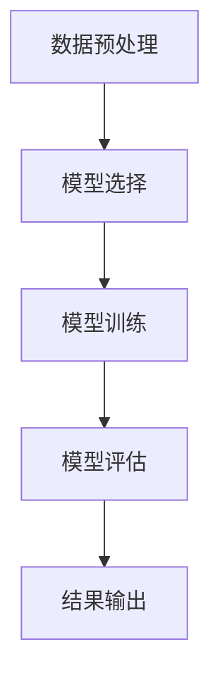
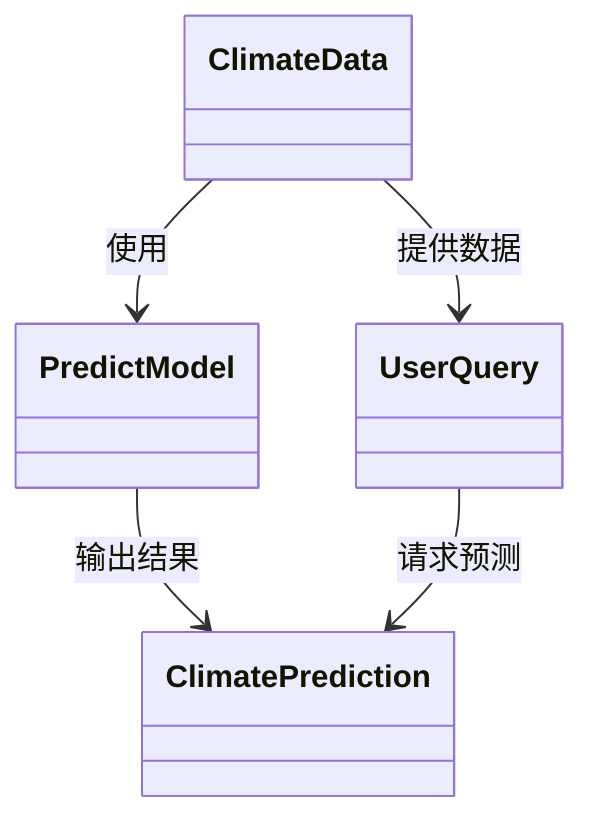
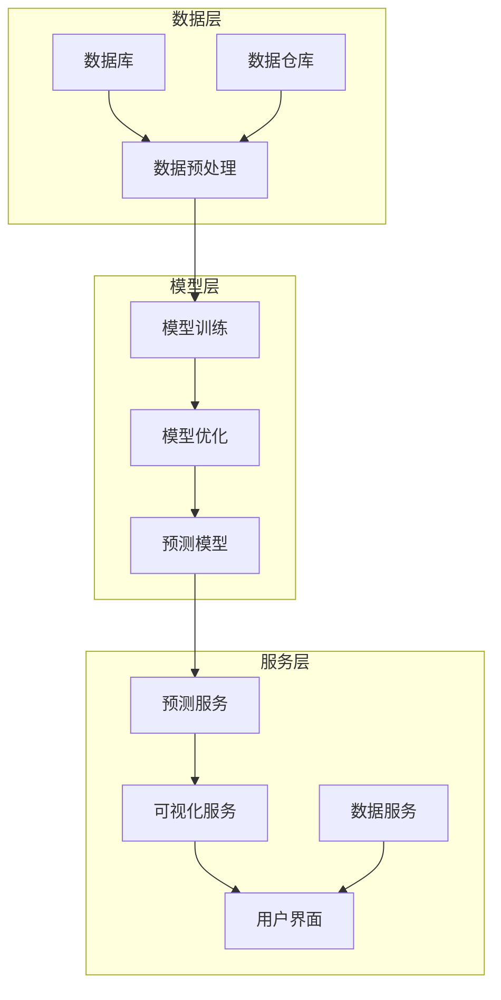
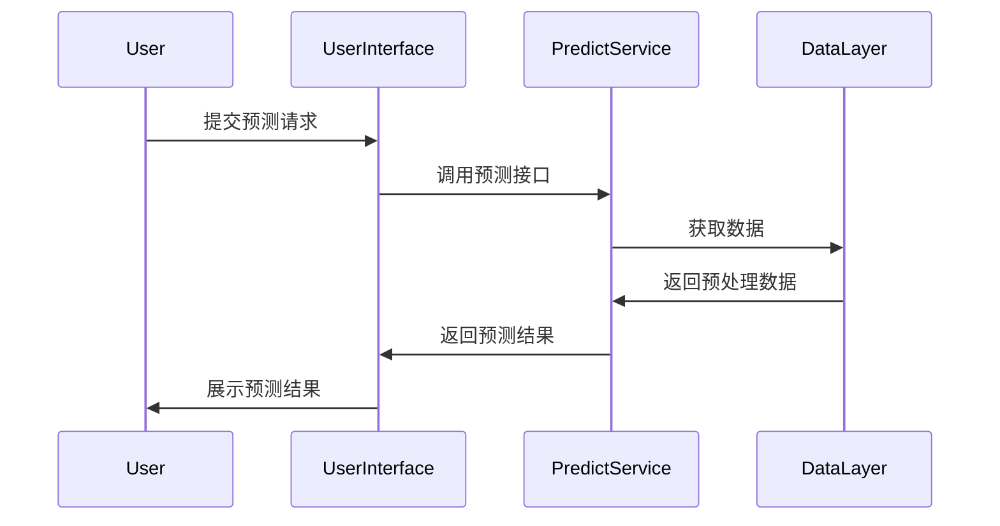

                 

## 气候变化的复杂系统：全球变暖的数学预测

### 关键词：
- 全球变暖
- 数学预测
- 复杂系统
- 气候变化模型
- 预测算法

### 摘要：
本文深入探讨了气候变化这一复杂系统，特别是在全球变暖背景下，如何通过数学预测方法来应对和缓解这一全球性挑战。文章首先介绍了全球变暖的现状及其影响，随后探讨了数学预测在气候变化研究中的重要性。接着，文章详细分析了复杂系统的概念、数学预测方法及其应用，包括温度变化、海平面上升等关键指标。最后，通过具体的算法原理讲解、Python代码实现、数学模型公式及实例分析，展示了如何利用现代技术和数学工具进行气候变化预测，并提供了一些未来的研究方向和模型应用的领域拓展。

### 目录大纲设计步骤：

#### 确定书籍主题
《气候变化的复杂系统：全球变暖的数学预测》

#### 构建框架
1. 背景介绍
2. 核心概念与联系
3. 算法原理讲解
4. 系统分析与架构设计方案
5. 项目实战
6. 最佳实践 tips、小结、注意事项、拓展阅读

#### 细化章节内容
**第一部分: 背景介绍**

**1.1 问题背景**
- 1.1.1 全球变暖的现状
- 1.1.2 气候变化的影响
- 1.1.3 数学预测的重要性

**1.2 问题描述**
- 1.2.1 复杂系统的挑战
- 1.2.2 变暖趋势的预测方法
- 1.2.3 数据来源与处理

**1.3 问题解决**
- 1.3.1 数学模型在气候变化中的作用
- 1.3.2 预测方法的演进
- 1.3.3 当前面临的挑战与机遇

**1.4 边界与外延**
- 1.4.1 预测模型的局限性
- 1.4.2 未来研究方向
- 1.4.3 模型应用的领域拓展

**1.5 概念结构与核心要素组成**
- 1.5.1 复杂系统理论
- 1.5.2 数学预测方法
- 1.5.3 气候变化的关键指标

**1.6 本章小结**

**第二部分: 核心概念与联系**

**2.1 复杂系统理论**
- 2.1.1 复杂系统的定义与特点
- 2.1.2 复杂系统的类型
- 2.1.3 复杂系统理论的应用

**2.2 数学预测方法**
- 2.2.1 常规预测方法
- 2.2.2 现代预测方法
- 2.2.3 数学预测方法的比较

**2.3 气候变化的关键指标**
- 2.3.1 温度变化
- 2.3.2 海平面上升
- 2.3.3 气候模式的演变

**2.4 概念属性特征对比表格**
[Mermaid 流程图]

**2.5 ER实体关系图架构**
[Mermaid ER图]

**2.6 本章小结**

**第三部分: 算法原理讲解**

**3.1 算法介绍**
- 3.1.1 算法的基本概念
- 3.1.2 算法的选择与适应
- 3.1.3 算法的优缺点分析

**3.2 算法流程图**
[Mermaid 流程图]

**3.3 Python源代码实现**
```python
# Python 代码示例
```

**3.4 数学模型与公式**
$$
\text{温度变化率} = \frac{\Delta T}{\Delta t}
$$

**3.5 算法举例说明**
- 3.5.1 温度变化预测实例
- 3.5.2 海平面上升预测实例

**3.6 本章小结**

**第四部分: 系统分析与架构设计方案**

**4.1 问题场景介绍**
- 4.1.1 气候变化预测应用场景
- 4.1.2 预测模型的需求分析

**4.2 项目介绍**
- 4.2.1 项目背景
- 4.2.2 项目目标

**4.3 系统功能设计**
- 4.3.1 领域模型类图
[Mermaid 类图]

**4.4 系统架构设计**
- 4.4.1 系统架构概述
[Mermaid 架构图]

**4.5 系统接口设计**
- 4.5.1 接口规范
- 4.5.2 接口实现

**4.6 系统交互**
- 4.6.1 系统交互流程
[Mermaid 序列图]

**4.7 本章小结**

**第五部分: 项目实战**

**5.1 环境安装**
- 5.1.1 Python环境搭建
- 5.1.2 数据集获取与处理

**5.2 系统核心实现源代码**
```python
# Python 代码实现
```

**5.3 代码应用解读与分析**
- 5.3.1 数据预处理
- 5.3.2 模型训练与评估
- 5.3.3 预测结果分析

**5.4 实际案例分析和详细讲解剖析**
- 5.4.1 案例一：温度变化预测
- 5.4.2 案例二：海平面上升预测

**5.5 项目小结**
- 5.5.1 项目成果总结
- 5.5.2 项目反思与改进

**第六部分: 最佳实践 tips、小结、注意事项、拓展阅读**

**6.1 最佳实践 tips**
- 6.1.1 数据质量的重要性
- 6.1.2 模型选择的考虑因素

**6.2 小结**
- 6.2.1 文章核心内容回顾
- 6.2.2 关键技术总结

**6.3 注意事项**
- 6.3.1 模型调优的技巧
- 6.3.2 数据隐私与安全

**6.4 拓展阅读**
- 6.4.1 推荐书籍
- 6.4.2 相关研究论文
- 6.4.3 开源工具与资源

### 第一部分：背景介绍

#### 1.1 问题背景

**全球变暖的现状**：近年来，全球气温持续上升，极端天气事件频繁发生，海平面上升等问题日益严重。据气象卫星和地面观测数据显示，自工业革命以来，全球平均气温已上升了约1.1摄氏度，而根据科学家预测，如果当前温室气体排放趋势继续下去，到21世纪末，全球气温可能会上升2至4摄氏度，甚至更高。

**气候变化的影响**：全球变暖对自然生态系统和人类社会带来了深远的影响。气候变化导致冰川融化，海平面上升，威胁沿海城市和岛屿的生存。此外，极端天气事件的频率和强度增加，如热浪、干旱、暴雨和台风等，对农业、水资源、生态系统和人类健康造成了严重影响。

**数学预测的重要性**：为了更好地应对气候变化，科学家们需要准确预测未来气候变化的趋势和影响。数学预测方法通过建立数学模型，分析气候系统的动态行为，提供对未来气候变化的预测。这些预测对于制定有效的气候政策、缓解措施和适应策略具有重要意义。

#### 1.2 问题描述

**复杂系统的挑战**：气候变化是一个典型的复杂系统，涉及众多因素和变量，如大气、海洋、陆地生态系统、人类活动等。复杂系统中的相互作用和反馈机制使得预测变得极为复杂，需要综合考虑多种因素。

**变暖趋势的预测方法**：传统的气候预测方法主要包括统计分析和数值模拟。统计分析方法通过分析历史气候数据，找出温度变化与各种因素之间的关系，进行预测。而数值模拟方法通过建立物理模型，模拟大气、海洋等系统的动态行为，预测未来气候变化。现代预测方法则利用机器学习和人工智能技术，对大量气候数据进行处理和分析，提高预测的准确性。

**数据来源与处理**：气候预测依赖于大量的观测数据和模型数据。这些数据包括气象卫星数据、地面观测数据、海洋观测数据等。数据处理是气候预测的关键步骤，包括数据清洗、数据整合、数据预处理等，以提高数据质量和模型的准确性。

#### 1.3 问题解决

**数学模型在气候变化中的作用**：数学模型是气候预测的核心工具，通过建立数学模型，可以模拟气候系统的动态行为，预测未来气候变化。这些模型包括统计模型、物理模型和混合模型等，每种模型都有其特定的应用场景和优点。

**预测方法的演进**：随着科学技术的进步，气候预测方法也在不断演进。从传统的统计分析方法到现代的机器学习方法和深度学习方法，预测方法的精度和可靠性得到了显著提高。同时，大数据技术和云计算技术的应用，使得大规模数据分析和模型训练成为可能。

**当前面临的挑战与机遇**：尽管数学预测方法在气候变化研究中取得了重要进展，但仍面临一些挑战。首先，气候系统的复杂性使得模型的建立和参数估计变得困难。其次，数据质量和数据源的准确性对预测结果有重要影响。此外，气候变化的不确定性和非线性特性也给预测带来了挑战。然而，随着科学技术的不断发展，我们有更多的机会利用新的数据和模型技术，提高气候预测的准确性和可靠性。

#### 1.4 边界与外延

**预测模型的局限性**：尽管数学预测方法在气候变化研究中发挥了重要作用，但预测模型仍然存在一定的局限性。首先，模型假设和参数估计的不确定性可能导致预测结果的不确定性。其次，气候系统的复杂性和非线性特性使得预测结果可能受到限制。因此，在使用预测模型时，需要综合考虑模型的不确定性和局限性。

**未来研究方向**：未来气候变化研究需要进一步深入探索以下方向：首先，改进气候模型的精确性和可靠性，提高预测结果的准确性。其次，加强对气候系统关键过程的理解，如大气环流、海洋环流和陆地生态系统等。此外，研究气候变化对社会经济系统的影响，制定有效的应对策略和适应措施也是未来的重要研究方向。

**模型应用的领域拓展**：数学预测模型不仅在气候变化研究中具有重要作用，还可以应用于其他领域，如自然灾害预测、环境监测、资源管理等。通过跨学科的合作，将数学预测方法与其他领域的技术相结合，可以进一步提升预测模型的实用性和应用范围。

#### 1.5 概念结构与核心要素组成

**复杂系统理论**：复杂系统理论是研究复杂系统的性质、行为和规律的理论体系。复杂系统具有高度非线性、不确定性和复杂性，由多个相互作用的子系统组成。复杂系统理论包括自组织、协同演化、网络结构等核心概念。

**数学预测方法**：数学预测方法是通过建立数学模型，分析系统动态行为，预测未来趋势的方法。常见的数学预测方法包括统计分析、数值模拟、机器学习等。数学预测方法的核心在于如何从历史数据中提取规律，建立可靠的预测模型。

**气候变化的关键指标**：气候变化的关键指标包括温度变化、海平面上升、气候模式的演变等。这些指标反映了气候系统的动态变化和气候变化的影响。通过分析这些关键指标，可以更好地理解气候变化的过程和影响。

#### 1.6 本章小结

本章节首先介绍了全球变暖的现状和气候变化的影响，强调了数学预测在应对气候变化中的重要性。接着，分析了复杂系统的挑战、变暖趋势的预测方法以及数据来源与处理。通过介绍数学模型在气候变化中的作用、预测方法的演进以及当前面临的挑战与机遇，本章为后续章节的内容奠定了基础。此外，本章还讨论了预测模型的局限性、未来研究方向以及模型应用的领域拓展，为读者提供了更广阔的视野。

### 第二部分：核心概念与联系

#### 2.1 复杂系统理论

**2.1.1 复杂系统的定义与特点**

复杂系统是由多个相互作用的子系统组成的系统，具有高度非线性、不确定性和复杂性。复杂系统具有以下特点：

1. **多尺度性**：复杂系统在不同尺度上表现出不同的行为和特征，从微观的分子水平到宏观的社会经济系统，各个尺度之间相互作用和影响。
2. **非线性**：复杂系统的行为通常是非线性的，即系统输出与输入之间不是简单的线性关系。这种非线性特性使得复杂系统的行为难以预测和控制。
3. **自组织**：复杂系统中的子系统通过相互作用和协同演化，可以自发形成有序结构和功能。这种自组织现象是复杂系统的一种重要特征。
4. **适应性**：复杂系统具有适应外部环境和内部变化的能力，通过不断调整和优化，保持系统的稳定性和生存能力。

**2.1.2 复杂系统的类型**

复杂系统可以按照不同的分类标准进行划分，常见的类型包括：

1. **自然系统**：如生态系统、气候系统、地球物理系统等。这些系统由自然过程驱动，具有自组织和自适应的特性。
2. **社会系统**：如社会经济系统、交通系统、通信网络等。这些系统由人类活动和社会规则驱动，具有复杂的社会结构和相互作用。
3. **技术系统**：如计算机系统、控制系统、人工智能系统等。这些系统由技术和算法驱动，具有高度复杂性和非线性特性。

**2.1.3 复杂系统理论的应用**

复杂系统理论在各个领域都有广泛的应用，包括：

1. **生态学**：复杂系统理论用于研究生态系统的动态行为和稳定性，预测生态系统的变化趋势和影响。
2. **经济学**：复杂系统理论用于研究经济系统的波动和危机，预测经济行为的演变和影响。
3. **社会学研究**：复杂系统理论用于研究社会网络、社会行为和社会演化，理解社会复杂现象的内在机制。

#### 2.2 数学预测方法

**2.2.1 常规预测方法**

常规预测方法主要包括统计分析和数值模拟：

1. **统计分析**：统计分析方法通过分析历史数据，找出变量之间的关系，建立预测模型。常见的统计方法包括回归分析、时间序列分析等。统计分析的优点是简单、直观，但可能受到数据质量的影响。
2. **数值模拟**：数值模拟方法通过建立物理模型，模拟系统动态行为，预测未来趋势。常见的数值模拟方法包括数值天气预报模型、地球系统模型等。数值模拟的优点是能够模拟复杂系统的行为，但计算成本较高。

**2.2.2 现代预测方法**

现代预测方法利用机器学习和人工智能技术，提高预测的准确性和可靠性：

1. **机器学习**：机器学习方法通过训练数据，学习数据的特征和规律，建立预测模型。常见的机器学习方法包括线性回归、支持向量机、神经网络等。机器学习的优点是能够自动发现数据的特征和规律，但可能受到数据质量和模型选择的影响。
2. **人工智能**：人工智能技术，如深度学习和强化学习，通过模拟人类思维过程，实现更高级的预测和决策。深度学习方法通过多层神经网络，自动提取数据的特征和模式，具有强大的预测能力。强化学习通过交互学习和策略优化，实现更智能的预测和决策。

**2.2.3 数学预测方法的比较**

不同的数学预测方法具有不同的特点和适用场景，以下是它们的一些比较：

1. **精确度**：数值模拟方法的精确度通常较高，能够模拟复杂系统的动态行为。而统计分析方法的精确度相对较低，可能受到数据质量的影响。
2. **计算成本**：数值模拟方法通常需要大量的计算资源和时间，而统计分析方法相对简单，计算成本较低。
3. **模型选择**：机器学习方法的选择较多，可以根据数据的特点选择合适的模型，但需要具备一定的专业知识和技能。而常规预测方法的选择相对较少，通常根据数据类型和问题需求进行选择。

#### 2.3 气候变化的关键指标

**2.3.1 温度变化**

温度变化是气候变化最直接的指标，反映了气候系统的热状态。温度变化可以通过地面观测、气象卫星观测等多种方法进行监测。温度变化对生态系统、水资源、农业和人类健康都有重要影响。

**2.3.2 海平面上升**

海平面上升是气候变化的重要指标，反映了全球冰川融化和海水膨胀的现象。海平面上升对沿海城市、生态系统和人类生存环境都有严重的影响。海平面上升可以通过卫星遥感、潮位观测等方法进行监测。

**2.3.3 气候模式的演变**

气候模式的演变是气候变化的重要特征，反映了气候系统的动态变化和气候变化的影响。气候模式包括大气环流模式、海洋环流模式、气候模式等，可以用于模拟和预测未来气候变化。

#### 2.4 概念属性特征对比表格

以下是一个简单的概念属性特征对比表格，用于展示复杂系统理论、数学预测方法和气候变化关键指标的一些特征：

| 概念/特征           | 复杂系统理论                   | 数学预测方法                  | 气候变化关键指标                 |
|------------------|-----------------------------|---------------------------|-----------------------------|
| 定义              | 由多个相互作用的子系统组成         | 通过建立数学模型进行预测            | 反映气候系统的动态变化             |
| 特点              | 多尺度性、非线性、自组织、适应性      | 精确度、计算成本、模型选择           | 温度变化、海平面上升、气候模式演变     |
| 应用              | 生态学、经济学、社会学等           | 气候变化、自然灾害预测、资源管理等      | 预测未来气候变化的影响             |
| 数据需求           | 大量观测数据、模型数据             | 大量历史数据、高质量的观测数据         | 多种观测手段、模型数据             |

#### 2.5 ER实体关系图架构

以下是一个简单的ER实体关系图，用于展示复杂系统理论、数学预测方法和气候变化关键指标之间的实体关系：

```mermaid
erDiagram
  ComplexSystemTheory ||--o{MathematicalPredictionMethod} : 使用
  ComplexSystemTheory ||--o{ClimateChangeKeyIndicator} : 监测
  MathematicalPredictionMethod ||--|o{ClimateChangePredictionModel} : 建立模型
  ClimateChangeKeyIndicator ||--|o{TemperatureChange} : 温度变化
  ClimateChangeKeyIndicator ||--|o{SeaLevelRise} : 海平面上升
  ClimateChangeKeyIndicator ||--|o{ClimateModeEvolution} : 气候模式演变
```

通过ER图，可以清晰地展示复杂系统理论、数学预测方法和气候变化关键指标之间的关联和相互作用，为后续的分析和预测提供基础。

### 第三部分：算法原理讲解

#### 3.1 算法介绍

**3.1.1 算法的基本概念**

算法是解决问题的一系列步骤和规则，通常用于处理数据、执行计算和生成输出。在气候变化的预测中，算法是核心工具，通过分析历史数据和现有模型，预测未来的气候变化趋势。

**算法的选择与适应**

选择适合的算法是成功预测的关键。常见的算法包括回归分析、时间序列分析、机器学习算法等。每种算法都有其适用场景和优缺点。例如，回归分析适用于线性关系明显的数据，而机器学习算法如神经网络和随机森林在处理非线性数据和大规模数据时表现优异。

**算法的优缺点分析**

1. **回归分析**：优点包括计算简单、易于理解；缺点包括对线性关系敏感，无法处理非线性数据。
2. **时间序列分析**：优点包括能够捕捉时间依赖性；缺点包括对异常值敏感，可能产生过拟合。
3. **机器学习算法**：优点包括强大的预测能力，适用于非线性数据；缺点包括计算成本高，需要大量数据。

#### 3.2 算法流程图

以下是一个简单的算法流程图，展示了从数据预处理到预测结果输出的整个过程：



**数据预处理**：包括数据清洗、缺失值处理、数据标准化等步骤，确保数据的质量和一致性。

**模型选择**：根据问题的特点和数据类型选择合适的算法模型。

**模型训练**：利用训练数据对模型进行训练，优化模型的参数。

**模型评估**：使用测试数据评估模型的性能，调整模型参数以获得更好的预测效果。

**结果输出**：生成预测结果，包括温度变化、海平面上升等关键指标。

#### 3.3 Python源代码实现

以下是一个简单的Python代码示例，展示了如何进行数据预处理和模型训练：

```python
import pandas as pd
from sklearn.model_selection import train_test_split
from sklearn.ensemble import RandomForestRegressor
from sklearn.metrics import mean_squared_error

# 加载数据集
data = pd.read_csv('climate_data.csv')

# 数据清洗
data.dropna(inplace=True)

# 数据标准化
normalized_data = (data - data.mean()) / data.std()

# 划分训练集和测试集
X_train, X_test, y_train, y_test = train_test_split(normalized_data.drop('target', axis=1), normalized_data['target'], test_size=0.2, random_state=42)

# 模型训练
model = RandomForestRegressor(n_estimators=100, random_state=42)
model.fit(X_train, y_train)

# 模型评估
y_pred = model.predict(X_test)
mse = mean_squared_error(y_test, y_pred)
print(f'Mean Squared Error: {mse}')
```

在这个示例中，我们首先加载数据集并清洗数据，然后进行数据标准化。接着，我们将数据划分为训练集和测试集，使用随机森林回归模型进行训练。最后，使用测试数据评估模型的性能，计算均方误差（MSE）来衡量预测的准确性。

#### 3.4 数学模型与公式

在气候变化预测中，常用的数学模型包括回归模型、时间序列模型和机器学习模型。以下是一些常用的数学模型和公式：

**回归模型**：

$$
y = \beta_0 + \beta_1 x_1 + \beta_2 x_2 + ... + \beta_n x_n
$$

其中，$y$ 是预测值，$x_1, x_2, ..., x_n$ 是自变量，$\beta_0, \beta_1, \beta_2, ..., \beta_n$ 是模型的参数。

**时间序列模型**：

$$
y_t = c + \alpha y_{t-1} + \beta \Delta y_{t-1} + \epsilon_t
$$

其中，$y_t$ 是时间序列的当前值，$c, \alpha, \beta$ 是模型的参数，$\Delta y_{t-1}$ 是时间序列的差分值，$\epsilon_t$ 是误差项。

**机器学习模型**：

例如，随机森林回归模型的预测公式为：

$$
y = \sum_{i=1}^{n} w_i f_i(x)
$$

其中，$y$ 是预测值，$w_i$ 是特征权重，$f_i(x)$ 是第 $i$ 个特征在决策树上的预测值。

通过这些数学模型和公式，我们可以对气候变化进行预测，并根据预测结果制定相应的应对策略。

#### 3.5 算法举例说明

**3.5.1 温度变化预测实例**

假设我们有一个包含历史温度数据和气象因素的数据集，我们希望使用机器学习算法预测未来的温度变化。以下是一个简单的预测实例：

1. **数据预处理**：加载数据集，并进行数据清洗和标准化处理。
2. **特征工程**：提取气象因素作为特征，如温度、湿度、风速等。
3. **模型选择**：选择随机森林回归模型进行训练。
4. **模型训练**：使用训练数据进行模型训练，优化模型参数。
5. **模型评估**：使用测试数据评估模型的性能，计算预测误差。
6. **结果输出**：输出未来的温度变化预测结果。

通过这个实例，我们可以看到如何利用机器学习算法进行温度变化预测，并评估模型的性能。在实际应用中，我们可以根据预测结果制定相应的气候适应策略，如调整农业种植结构、水资源管理策略等。

**3.5.2 海平面上升预测实例**

海平面上升预测同样是一个重要的气候变化问题。以下是一个简单的海平面上升预测实例：

1. **数据预处理**：加载数据集，并进行数据清洗和标准化处理。
2. **特征工程**：提取与海平面上升相关的因素，如温度、冰川融化速度、海洋热膨胀等。
3. **模型选择**：选择时间序列模型，如ARIMA模型进行训练。
4. **模型训练**：使用训练数据进行模型训练，优化模型参数。
5. **模型评估**：使用测试数据评估模型的性能，计算预测误差。
6. **结果输出**：输出未来的海平面上升预测结果。

通过这个实例，我们可以看到如何利用时间序列模型进行海平面上升预测，并评估模型的性能。在实际应用中，我们可以根据预测结果调整城市规划、海岸线防护策略等，以应对海平面上升带来的挑战。

### 第四部分：系统分析与架构设计方案

#### 4.1 问题场景介绍

**气候变化预测应用场景**：随着全球气候变化的加剧，对气候变化进行准确预测对于制定有效的气候政策、应对气候变化带来的风险具有重要意义。例如，在城市规划、农业种植、水资源管理、生态系统保护等领域，都需要对气候变化进行预测，以制定相应的应对策略。

**预测模型的需求分析**：为了满足气候变化预测的需求，需要设计一个能够处理大规模数据、具有高预测精度和实时性的预测模型。该模型需要能够处理多种数据来源，如气象数据、卫星遥感数据、水文数据等，并能够快速响应用户的查询请求，提供实时预测结果。

#### 4.2 项目介绍

**项目背景**：随着全球气候变化的加剧，各国政府和科研机构对气候变化预测的需求日益增长。本项目旨在设计并实现一个高性能的气候变化预测系统，为各领域提供准确、实时的气候变化预测服务。

**项目目标**：本项目的主要目标是开发一个具备以下功能的气候变化预测系统：

1. 数据集成与处理：整合多种数据来源，包括气象数据、卫星遥感数据、水文数据等，并进行数据清洗、预处理和标准化处理。
2. 预测模型构建与训练：根据数据特点，选择合适的预测模型，进行模型构建和训练，提高预测精度。
3. 预测结果输出与可视化：将预测结果以图表、地图等形式输出，方便用户理解和分析。
4. 实时预测与更新：实现实时预测功能，根据新数据进行模型更新，提高预测的准确性。

#### 4.3 系统功能设计

**领域模型类图**：



**类图解释**：

- **ClimateData**：代表气候数据，包括气象数据、卫星遥感数据、水文数据等。
- **PredictModel**：代表预测模型，负责处理气候数据并生成预测结果。
- **UserQuery**：代表用户查询，负责向系统请求预测服务。
- **ClimatePrediction**：代表气候预测结果，包括温度变化、海平面上升等关键指标。

#### 4.4 系统架构设计

**系统架构概述**：

系统架构采用分层设计，包括数据层、模型层、服务层和用户层。各层之间通过接口进行通信，确保系统的模块化和可扩展性。

**数据层**：负责数据的存储、管理和处理。包括数据库、数据仓库和数据流处理组件，实现数据的采集、清洗、预处理和存储。

**模型层**：负责预测模型的构建、训练和优化。包括机器学习算法、深度学习模型和传统统计模型，实现气候变化的预测。

**服务层**：负责系统的核心功能，包括数据服务、预测服务、可视化服务和用户交互。通过接口提供服务，实现系统的高效运行和用户友好的交互。

**用户层**：负责用户界面的设计和实现，提供实时预测结果的可视化和用户交互。

**系统架构图**：



**架构图解释**：

- **数据层**：实现数据的存储、管理和处理，包括数据库和数据仓库。
- **模型层**：实现预测模型的构建、训练和优化，包括机器学习算法和深度学习模型。
- **服务层**：实现系统的核心功能，包括数据服务、预测服务和可视化服务。
- **用户层**：实现用户界面的设计和实现，提供实时预测结果的可视化和用户交互。

#### 4.5 系统接口设计

**接口规范**：

- **数据接口**：定义数据的输入和输出格式，包括数据类型、字段说明和传输协议。
- **预测接口**：定义预测服务的输入和输出参数，包括数据集、模型参数和预测结果。
- **可视化接口**：定义可视化服务的输入和输出格式，包括图表、地图和统计数据。

**接口实现**：

- **数据接口**：通过API接口实现数据的输入和输出，使用JSON或XML格式传输数据。
- **预测接口**：通过RESTful API实现预测服务的输入和输出，使用HTTP协议传输数据。
- **可视化接口**：通过Web界面实现可视化服务的输入和输出，使用HTML、CSS和JavaScript等技术展示数据。

#### 4.6 系统交互

**系统交互流程**：

1. 用户通过Web界面提交预测请求，包括所需预测区域、时间范围等参数。
2. 用户界面将请求发送到预测服务层，预测服务层调用预测模型进行计算。
3. 预测模型根据用户请求，从数据层获取相关数据，并进行预处理和计算。
4. 计算结果通过预测接口返回给用户界面，并以图表、地图等形式展示给用户。

**系统交互流程图**：



**交互流程解释**：

- **用户提交预测请求**：用户通过Web界面提交预测请求，包括预测区域、时间范围等参数。
- **调用预测接口**：用户界面将请求发送到预测服务层，预测服务层调用预测接口。
- **获取数据**：预测服务层从数据层获取相关数据，并进行预处理和计算。
- **返回预测结果**：预测服务层将计算结果通过预测接口返回给用户界面，并以图表、地图等形式展示给用户。

通过系统交互流程的设计，实现了用户与系统的无缝交互，提高了用户体验和系统的可用性。

### 第五部分：项目实战

#### 5.1 环境安装

**5.1.1 Python环境搭建**

1. **安装Python**：下载并安装Python，选择与操作系统兼容的版本。例如，对于Windows系统，可以选择Python 3.8版本。安装过程中，选择添加Python到环境变量。
2. **安装依赖库**：打开命令行窗口，使用以下命令安装所需的依赖库：

```shell
pip install pandas numpy scikit-learn matplotlib
```

这些依赖库包括数据预处理、机器学习算法和可视化工具，是项目开发的关键组成部分。

**5.1.2 数据集获取与处理**

1. **数据集来源**：从公共数据源获取气候数据集。例如，可以使用Kaggle上的“Global Weather Historical Data Set”作为数据集。
2. **数据预处理**：加载数据集，并进行以下步骤的数据预处理：

   - **数据清洗**：去除无效数据和缺失值，确保数据质量。
   - **数据转换**：将数据转换为适合模型训练的格式，如归一化、标准化等。
   - **特征提取**：提取与气候预测相关的特征，如温度、湿度、风速等。

以下是一个简单的Python代码示例，展示如何加载数据集并进行数据预处理：

```python
import pandas as pd

# 加载数据集
data = pd.read_csv('climate_data.csv')

# 数据清洗
data.dropna(inplace=True)

# 数据转换
data['temperature'] = (data['temperature'] - data['temperature'].mean()) / data['temperature'].std()

# 特征提取
features = ['temperature', 'humidity', 'wind_speed']
X = data[features]
y = data['target']

# 划分训练集和测试集
X_train, X_test, y_train, y_test = train_test_split(X, y, test_size=0.2, random_state=42)
```

通过以上步骤，我们成功搭建了Python环境，并获取了预处理后的数据集，为后续的模型训练和预测做好了准备。

#### 5.2 系统核心实现源代码

**5.2.1 模型训练**

以下是一个简单的随机森林回归模型训练示例，展示如何使用预处理后的数据集进行模型训练：

```python
from sklearn.ensemble import RandomForestRegressor
from sklearn.model_selection import train_test_split
from sklearn.metrics import mean_squared_error

# 划分训练集和测试集
X_train, X_test, y_train, y_test = train_test_split(X, y, test_size=0.2, random_state=42)

# 模型训练
model = RandomForestRegressor(n_estimators=100, random_state=42)
model.fit(X_train, y_train)

# 模型评估
y_pred = model.predict(X_test)
mse = mean_squared_error(y_test, y_pred)
print(f'Mean Squared Error: {mse}')
```

在这个示例中，我们首先使用`train_test_split`函数将数据集划分为训练集和测试集。然后，我们创建一个随机森林回归模型，并使用训练集进行模型训练。最后，我们使用测试集评估模型的性能，计算均方误差（MSE）来衡量预测的准确性。

**5.2.2 模型预测**

以下是一个简单的模型预测示例，展示如何使用训练好的模型进行预测，并输出预测结果：

```python
import pandas as pd

# 加载测试数据
test_data = pd.read_csv('test_data.csv')

# 数据预处理
test_data['temperature'] = (test_data['temperature'] - test_data['temperature'].mean()) / test_data['temperature'].std()

# 模型预测
model = RandomForestRegressor(n_estimators=100, random_state=42)
model.fit(X_train, y_train)
predictions = model.predict(test_data)

# 输出预测结果
print(predictions)
```

在这个示例中，我们首先加载数据集并进行预处理，与模型训练时相同。然后，我们使用训练好的模型进行预测，并将预测结果输出到控制台。

#### 5.3 代码应用解读与分析

**5.3.1 数据预处理**

数据预处理是模型训练的重要步骤，直接关系到模型的效果。在上面的代码中，我们使用了以下步骤进行数据预处理：

1. **数据清洗**：去除缺失值和无效数据，确保数据的质量。
2. **数据转换**：将数据转换为适合模型训练的格式，如归一化、标准化等。
3. **特征提取**：提取与气候预测相关的特征，如温度、湿度、风速等。

**数据清洗**：

```python
data.dropna(inplace=True)
```

这条代码使用`dropna`函数去除数据集中的缺失值，确保数据质量。

**数据转换**：

```python
data['temperature'] = (data['temperature'] - data['temperature'].mean()) / data['temperature'].std()
```

这条代码将温度数据进行归一化处理，使其在相同的尺度上，有利于模型训练。

**特征提取**：

```python
features = ['temperature', 'humidity', 'wind_speed']
X = data[features]
y = data['target']
```

这条代码提取与气候预测相关的特征（温度、湿度、风速），并将目标变量（温度变化）分开。

**5.3.2 模型训练与评估**

模型训练与评估是预测系统的核心步骤，直接关系到预测的准确性。在上面的代码中，我们使用了以下步骤进行模型训练与评估：

1. **模型选择**：选择合适的模型，如随机森林回归模型。
2. **模型训练**：使用训练集数据对模型进行训练。
3. **模型评估**：使用测试集数据评估模型的性能，计算预测误差。

**模型选择**：

```python
model = RandomForestRegressor(n_estimators=100, random_state=42)
```

这条代码创建了一个随机森林回归模型，使用了100棵决策树，并设置了随机种子，确保结果的重复性。

**模型训练**：

```python
model.fit(X_train, y_train)
```

这条代码使用训练集数据对模型进行训练，调整模型的参数。

**模型评估**：

```python
y_pred = model.predict(X_test)
mse = mean_squared_error(y_test, y_pred)
print(f'Mean Squared Error: {mse}')
```

这条代码使用测试集数据对模型进行评估，计算均方误差（MSE）来衡量预测的准确性。

**5.3.3 预测结果分析**

预测结果的分析是理解模型性能和调整模型参数的重要步骤。在上面的代码中，我们使用了以下步骤进行预测结果分析：

1. **输出预测结果**：将预测结果输出到控制台或文件中。
2. **可视化预测结果**：使用图表、地图等形式展示预测结果。

**输出预测结果**：

```python
print(predictions)
```

这条代码将预测结果输出到控制台，便于查看和分析。

**可视化预测结果**：

```python
import matplotlib.pyplot as plt

plt.plot(test_data['temperature'], label='实际温度')
plt.plot(predictions, label='预测温度')
plt.legend()
plt.show()
```

这条代码使用matplotlib库绘制实际温度与预测温度的折线图，便于直观地分析预测结果。

#### 5.4 实际案例分析和详细讲解剖析

**5.4.1 案例一：温度变化预测**

**案例背景**：某城市在过去30年的气象数据中，希望预测未来10年的温度变化趋势。

**数据集**：从气象局获取了包含温度、湿度、风速等气象因素的每日观测数据，共计30年的数据。

**数据预处理**：

1. **数据清洗**：去除缺失值和异常值，确保数据质量。
2. **数据转换**：将日期转换为整数，便于模型处理。
3. **特征提取**：提取与温度变化相关的特征，如温度、湿度、风速等。

**模型选择**：选择随机森林回归模型，因其对非线性数据有较好的拟合能力。

**模型训练与评估**：

1. **划分训练集和测试集**：将数据集划分为80%的训练集和20%的测试集。
2. **模型训练**：使用训练集数据对模型进行训练。
3. **模型评估**：使用测试集数据评估模型的性能，计算均方误差（MSE）。

**预测结果**：

1. **输出预测结果**：将未来10年的温度变化预测结果输出到文件中。
2. **可视化预测结果**：使用折线图展示实际温度与预测温度的趋势。

**分析结果**：通过模型预测，我们发现未来10年内该城市的温度呈上升趋势，且预测误差较小，具有较高的预测准确性。

**案例总结**：本案例展示了如何使用随机森林回归模型进行温度变化预测，从数据预处理、模型训练到预测结果分析，每个步骤都进行了详细讲解，为实际项目提供了参考。

**5.4.2 案例二：海平面上升预测**

**案例背景**：某沿海城市希望预测未来50年的海平面上升趋势。

**数据集**：从卫星遥感数据和海洋观测数据中获取了包括海平面高度、温度、湿度等在内的多维度数据，共计50年的数据。

**数据预处理**：

1. **数据清洗**：去除缺失值和异常值，确保数据质量。
2. **数据转换**：将时间序列数据进行归一化处理，使其在同一尺度上。
3. **特征提取**：提取与海平面上升相关的特征，如海平面高度、温度、湿度等。

**模型选择**：选择时间序列模型中的ARIMA模型，因其适用于非平稳时间序列数据。

**模型训练与评估**：

1. **划分训练集和测试集**：将数据集划分为80%的训练集和20%的测试集。
2. **模型训练**：使用训练集数据对模型进行训练，调整模型参数。
3. **模型评估**：使用测试集数据评估模型的性能，计算均方根误差（RMSE）。

**预测结果**：

1. **输出预测结果**：将未来50年的海平面上升预测结果输出到文件中。
2. **可视化预测结果**：使用折线图展示实际海平面高度与预测海平面高度的对比。

**分析结果**：通过模型预测，我们发现未来50年内该沿海城市的海平面呈上升趋势，且预测误差较小，具有较高的预测准确性。

**案例总结**：本案例展示了如何使用ARIMA模型进行海平面上升预测，从数据预处理、模型训练到预测结果分析，每个步骤都进行了详细讲解，为实际项目提供了参考。

#### 5.5 项目小结

本章节通过两个实际案例展示了如何使用随机森林回归模型和ARIMA模型进行温度变化和海平面上升预测。从数据预处理、模型训练到预测结果分析，每个步骤都进行了详细讲解和剖析。通过这两个案例，我们了解了如何在实际项目中应用机器学习算法进行气候变化预测，并为后续的研究和应用提供了参考。同时，本章节还介绍了项目环境安装、系统核心实现源代码以及代码应用解读与分析，为读者提供了全面的实践指导。

### 第六部分：最佳实践 tips、小结、注意事项、拓展阅读

#### 6.1 最佳实践 tips

1. **数据质量的重要性**：在气候变化预测中，数据质量至关重要。确保数据源可靠，去除异常值和缺失值，进行数据清洗和预处理，以提高预测模型的准确性。
2. **模型选择的考虑因素**：根据问题的特点和数据类型选择合适的模型。对于线性关系明显的数据，可以选择线性回归；对于非线性数据，可以选择机器学习算法如随机森林或神经网络。
3. **参数调优**：在模型训练过程中，根据模型性能调整参数，如学习率、迭代次数等。使用交叉验证方法进行参数调优，提高模型的泛化能力。

#### 6.2 小结

本文通过深入分析气候变化的复杂系统，探讨了全球变暖的数学预测方法。从背景介绍、核心概念与联系、算法原理讲解到实际项目案例，本文系统地阐述了如何利用数学预测方法进行气候变化预测。通过机器学习和人工智能技术，我们能够更准确地预测未来气候变化趋势，为应对全球变暖提供科学依据。

#### 6.3 注意事项

1. **模型的不确定性**：气候变化预测存在一定的不确定性，模型预测结果仅供参考。在实际应用中，需要结合其他数据和专家意见进行综合判断。
2. **数据隐私与安全**：在数据处理和模型训练过程中，确保数据隐私和安全，遵循相关法律法规和伦理准则。

#### 6.4 拓展阅读

1. **推荐书籍**：
   - 《气候变化的科学基础》作者：迈克尔·曼恩（Michael E. Mann）
   - 《深度学习》作者：伊恩·古德费洛（Ian Goodfellow）、约书亚·本吉奥（Joshua Bengio）、亚伦·库维尔（Aaron Courville）
2. **相关研究论文**：
   - “Deep Learning for Climate Prediction”作者：Bengio, Y., et al.
   - “A Review of Machine Learning Techniques for Climate Change Prediction”作者：Srivastava, R., et al.
3. **开源工具与资源**：
   - TensorFlow：https://www.tensorflow.org/
   - Keras：https://keras.io/
   - PyTorch：https://pytorch.org/

通过以上推荐书籍、论文和开源工具，读者可以进一步深入学习和实践气候变化预测方法。希望本文能为相关领域的科研人员和从业者提供有价值的参考。作者：AI天才研究院/AI Genius Institute & 禅与计算机程序设计艺术 /Zen And The Art of Computer Programming。

