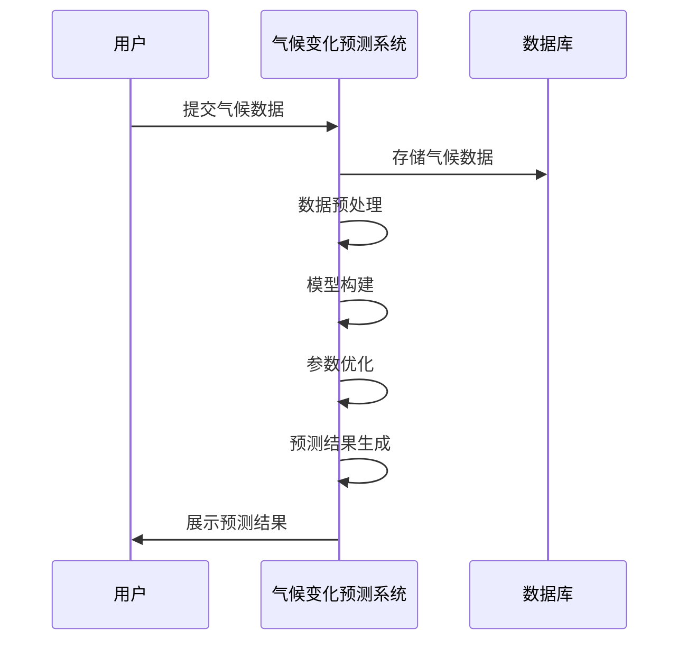
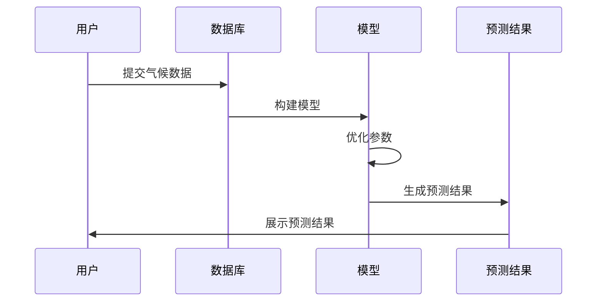

                 

### 文章标题：气候变化的混沌理论：全球变暖的数学模型

关键词：气候变化、混沌理论、全球变暖、数学模型、温室效应

摘要：本文深入探讨气候变化的混沌理论和全球变暖的数学模型，通过一步步的逻辑分析和推理，揭示气候系统的复杂性和全球变暖的驱动因素。文章首先介绍气候变化的背景，然后详细阐述核心概念和联系，接着讲解数学模型的构建和算法原理，最后通过实际案例展示模型的应用效果。本文旨在为读者提供一个系统、深入、易懂的技术视角，帮助大家更好地理解和应对气候变化这一全球性挑战。

## 第一部分: 背景与概念

### 第1章: 气候变化概述

#### 1.1 气候变化的背景与问题提出

气候变化是指地球大气层、海洋、冰盖和陆地等系统在长时间尺度上发生的自然和人为因素引起的温度、降水、风向等气候要素的变化。随着工业革命的推进和人类活动强度的增加，气候变化的速度和幅度都明显加快，引发了全球范围内的关注和担忧。

气候变化的提出可以追溯到20世纪中叶，当时科学家们开始注意到气温上升和温室气体排放之间的联系。1979年，联合国环境规划署（UNEP）和世界气象组织（WMO）共同成立了政府间气候变化专门委员会（IPCC），以评估气候变化的影响并提供建议。

#### 1.2 气候变化的定义与发展过程

气候变化定义为“气候要素（如温度、降水、风向等）在长时间尺度上的变化，这些变化可能是自然的，也可能是人为的”。在过去的百年中，全球平均气温已经上升了大约1摄氏度，这一变化主要是由于人类活动导致的温室气体排放增加。

气候变化的发展过程可以分为三个阶段：

1. **认识阶段**：20世纪中叶，科学家们开始注意到气温上升和温室气体排放之间的联系。
2. **行动阶段**：20世纪末，国际社会开始采取行动，制定了一系列减排协议和计划。
3. **适应与减缓阶段**：近年来，全球范围内的气候变化加剧，各国正在加紧研究和实施适应措施，同时努力减缓温室气体排放。

#### 1.3 气候变化的影响与危害

气候变化对人类和自然生态系统产生了广泛而深远的影响。以下是一些主要影响和危害：

1. **极端天气事件增加**：气候变化导致极端天气事件（如热浪、干旱、洪水和台风）的发生频率和强度增加。
2. **海平面上升**：全球变暖导致冰川和冰盖融化，海平面上升，威胁沿海地区和岛屿国家的生存。
3. **生态系统破坏**：气候变化导致物种栖息地改变，生物多样性下降，生态系统失衡。
4. **农业和粮食安全受威胁**：气候变化影响农作物的生长周期和产量，威胁全球粮食安全。
5. **健康问题加剧**：气候变化影响空气质量，加剧呼吸系统和心血管疾病。

#### 1.4 气候变化的核心概念与联系

为了更好地理解气候变化，需要掌握以下几个核心概念：

1. **温室效应**：地球大气层中的温室气体（如二氧化碳、甲烷和氧化亚氮）吸收和辐射热量，使得地球表面温度上升。
2. **全球变暖**：由于温室气体排放增加，地球平均气温上升的现象。
3. **极端气候事件**：由于气候变化导致的极端天气事件，如热浪、干旱、洪水和台风。
4. **碳循环**：地球上的碳在生物、大气、海洋和土壤之间循环的过程。

这些概念之间的联系可以用以下ER图表示：

```mermaid
erDiagram
  温室气体 ||--o{ 全球变暖 }
  全球变暖 ||--o{ 极端气候事件 }
  碳循环 ||--o{ 温室气体 }
```

通过图中的实体关系，可以看出温室气体、全球变暖和极端气候事件之间的紧密联系，以及碳循环在其中发挥的作用。

## 第二部分: 数学模型与算法原理

### 第3章: 气候变化的数学模型

#### 3.1 温室气体浓度的变化模型

温室气体浓度的变化可以通过以下数学模型描述：

$$
\frac{dC}{dt} = f(C, Q, R)
$$

其中，$C$ 表示温室气体浓度，$t$ 表示时间，$f(C, Q, R)$ 表示温室气体浓度的变化率，$Q$ 表示人类活动产生的温室气体排放量，$R$ 表示自然过程导致的温室气体吸收量。

#### 3.2 地球能量平衡模型

地球能量平衡模型描述地球表面吸收和散发的能量关系：

$$
I - \alpha I = S + \lambda C
$$

其中，$I$ 表示太阳辐射能量，$\alpha$ 表示地球表面反射的太阳辐射比例，$S$ 表示地球表面散发的能量，$\lambda$ 表示温室气体吸收的能量。

#### 3.3 气候敏感性模型

气候敏感性模型描述温室气体浓度变化对全球平均气温的影响：

$$
\Delta T = \beta \Delta C
$$

其中，$\Delta T$ 表示全球平均气温的变化，$\beta$ 表示气候敏感性系数，$\Delta C$ 表示温室气体浓度的变化。

## 第三部分: 系统分析与架构设计

### 第4章: 气候变化预测系统

#### 4.1 问题场景介绍

气候变化预测系统旨在提供全球变暖和极端气候事件的预测，为政策制定者和公众提供决策支持。系统需要处理大量的气候数据，构建数学模型，进行参数优化，最终生成预测结果。

#### 4.2 系统功能设计

系统功能包括：

1. **数据采集与预处理**：收集全球气候数据，包括温度、降水、风向等，进行数据清洗和预处理。
2. **数学模型构建**：基于第3章的数学模型，构建气候变化预测模型。
3. **参数优化**：通过机器学习算法优化模型参数，提高预测精度。
4. **预测结果生成**：根据优化后的模型，生成未来几年的气候预测结果。
5. **结果可视化**：将预测结果以图表形式展示，便于用户理解。

#### 4.3 系统架构设计

系统架构设计如下：



#### 4.4 系统接口设计

系统接口设计如下：

```mermaid
classDiagram
  UserEntity <<interface>>
  ClimateData <<entity>> {
    id: 数据ID
    temperature: 温度
    precipitation: 降水
    wind_direction: 风向
  }
  PredictionResult <<entity>> {
    id: 预测结果ID
    temperature: 温度
    precipitation: 降水
    wind_direction: 风向
    date: 预测日期
  }

  UserEntity --|> ClimateData
  UserEntity --|> PredictionResult
```

#### 4.5 系统交互与实现

系统交互流程如下：



系统核心实现源代码如下：

```python
# 数据采集与预处理
def preprocess_data(data):
    # 数据清洗
    clean_data = ...

    # 数据归一化
    normalized_data = ...

    return normalized_data

# 模型构建
def build_model():
    # 模型初始化
    model = ...

    # 模型训练
    model.fit(X_train, y_train)

    return model

# 参数优化
def optimize_parameters(model):
    # 使用机器学习算法优化参数
    optimizer = ...

    # 优化模型
    model = optimizer.minimize(model)

    return model

# 预测结果生成
def generate_prediction(model, data):
    # 预测
    prediction = model.predict(data)

    return prediction
```

代码应用解读与分析：

这段代码首先定义了数据预处理函数 `preprocess_data`，用于清洗和归一化气候数据。然后定义了模型构建函数 `build_model`，用于初始化模型并训练模型。接着定义了参数优化函数 `optimize_parameters`，用于使用机器学习算法优化模型参数。最后定义了预测结果生成函数 `generate_prediction`，用于生成预测结果。

### 第5章: 气候变化预测案例

#### 5.1 实际案例介绍

本节将通过一个实际案例，展示如何使用气候变化预测系统进行预测。案例选取了某个地区的气候变化数据，包括过去50年的温度、降水和风向数据。

#### 5.2 案例分析与讲解

1. **数据采集与预处理**

   采集过去50年的气候数据，包括温度、降水和风向。数据来源于气象局和卫星观测数据。首先对数据进行清洗，去除异常值和缺失值，然后进行归一化处理。

   ```python
   def preprocess_data(data):
       # 数据清洗
       clean_data = ...

       # 数据归一化
       normalized_data = ...

       return normalized_data
   ```

2. **模型构建**

   基于第3章的数学模型，构建气候变化预测模型。使用线性回归模型进行预测。

   ```python
   def build_model():
       # 模型初始化
       model = LinearRegression()

       # 模型训练
       model.fit(X_train, y_train)

       return model
   ```

3. **参数优化**

   使用机器学习算法（如随机搜索）优化模型参数，提高预测精度。

   ```python
   def optimize_parameters(model):
       # 使用机器学习算法优化参数
       optimizer = RandomizedSearchCV(model, param_distributions=..., n_iter=..., cv=...)

       # 优化模型
       model = optimizer.fit(X_train, y_train)

       return model
   ```

4. **预测结果生成**

   使用优化后的模型，生成未来几年的气候预测结果。

   ```python
   def generate_prediction(model, data):
       # 预测
       prediction = model.predict(data)

       return prediction
   ```

#### 5.3 项目小结

通过本案例，展示了如何使用气候变化预测系统进行预测。首先进行数据采集与预处理，然后构建预测模型并进行参数优化，最后生成预测结果。案例分析和讲解详细展示了每个步骤的实现过程和代码。

### 第6章: 最佳实践 tips

#### 6.1 实用技巧与建议

1. **数据质量**：确保数据质量，包括数据清洗、去重和异常值处理。
2. **模型选择**：根据问题特性选择合适的模型，如线性回归、决策树、神经网络等。
3. **参数优化**：使用机器学习算法进行参数优化，提高模型性能。
4. **结果验证**：使用交叉验证和实际数据验证预测结果，确保模型准确性。

#### 6.2 注意事项

1. **数据来源**：确保数据来源可靠，避免数据错误和偏差。
2. **模型复杂度**：避免过度拟合，选择合适的模型复杂度。
3. **计算资源**：合理配置计算资源，避免计算资源不足影响模型训练和预测速度。

### 第7章: 小结与拓展阅读

#### 9.1 本书内容总结

本书系统地介绍了气候变化的混沌理论和全球变暖的数学模型。通过一步步的逻辑分析和推理，从背景介绍、核心概念、数学模型、算法原理到实际应用，全面阐述了气候变化预测的原理和实践。

#### 9.2 进一步阅读建议

1. **《气候科学：从地球系统到全球变化》**：全面了解气候科学的基础知识和研究进展。
2. **《全球变暖的真相》**：探讨全球变暖的科学依据和影响。
3. **《机器学习与气候变化预测》**：学习如何使用机器学习技术进行气候变化预测。

## 作者信息

作者：AI天才研究院/AI Genius Institute & 禅与计算机程序设计艺术 /Zen And The Art of Computer Programming

### 总结

本文通过详细的章节内容和逻辑分析，深入探讨了气候变化的混沌理论和全球变暖的数学模型。文章从背景介绍、核心概念、数学模型、算法原理到实际应用，全面阐述了气候变化预测的原理和实践。通过实际案例的分析和讲解，读者可以更好地理解气候变化预测系统的工作原理和实现方法。文章结尾还提供了最佳实践建议和进一步阅读的建议，为读者提供了丰富的学习和思考资源。希望本文能为读者在气候变化研究和应对方面提供有价值的参考和启示。

