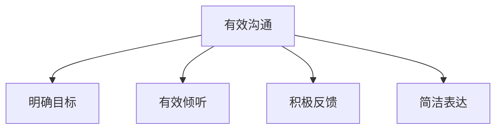
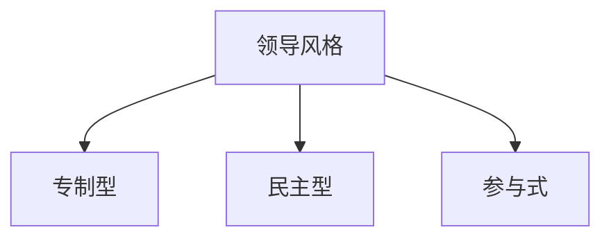
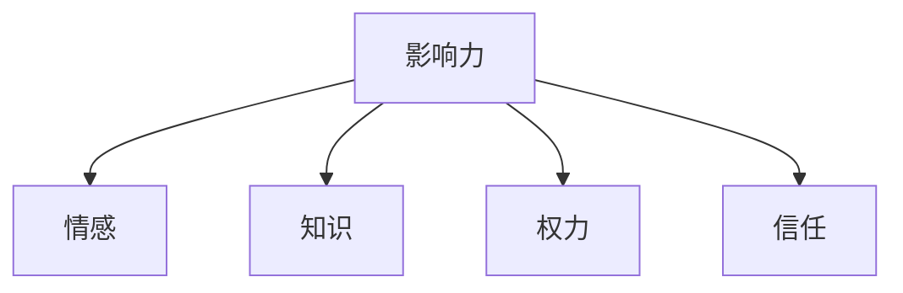
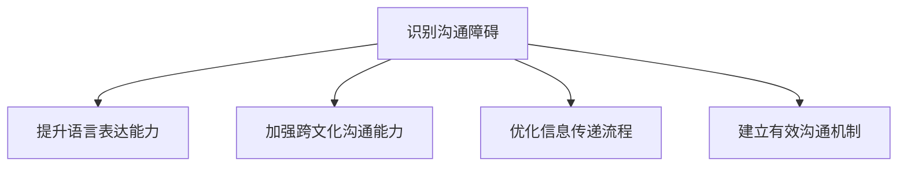
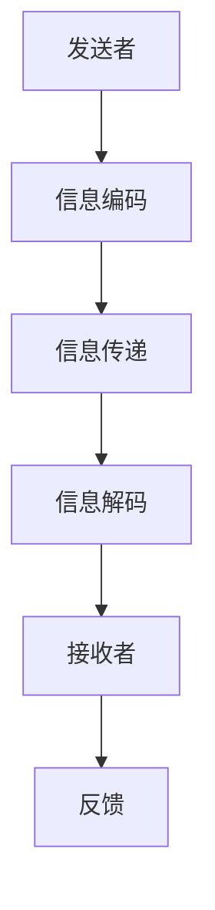

                 

### 《沟通的艺术：领导者必备的软实力》

#### 关键词：
- 领导力
- 沟通艺术
- 软实力
- 有效沟通
- 领导风格

#### 摘要：
本文深入探讨了《沟通的艺术：领导者必备的软实力》这本书的核心内容。我们将从背景介绍、核心概念与联系、算法原理讲解、数学模型和数学公式讲解、系统分析与架构设计方案、项目实战以及最佳实践 tips、小结、注意事项和拓展阅读等多个方面，全面解析沟通艺术在现代领导力中的重要性。通过具体的案例和实例，我们将展现如何将沟通艺术应用于实际项目中，提升领导力和团队效率。

---

### 第一部分：沟通艺术概述

#### 1.1 沟通艺术的重要性

在现代社会中，领导力不再仅仅依赖于技术能力和业务知识，沟通艺术成为了领导者不可或缺的软实力。有效的沟通能够增强团队的凝聚力，提高工作效率，激发创新思维，同时也能够在复杂的组织结构中起到润滑剂的作用。让我们先来探讨一下沟通与领导力的关系。

**沟通与领导力的关系**

领导力是一种能力，它不仅仅是指导和管理团队，更重要的是能够影响和激励团队成员，使他们自愿跟随领导者共同实现目标。而有效的沟通正是实现这种影响和激励的关键因素。以下是一个简化的逻辑关系图，展示了沟通在领导力中的关键作用：

```
+-------------------+
|      领导力      |
+-------------------+
        |
        v
+-------------------+
|      沟通能力      |
+-------------------+
        |
        v
+-------------------+
|     团队效能      |
+-------------------+
```

**沟通艺术的核心要素**

沟通艺术包括多个核心要素，如有效沟通、领导风格、影响力等。以下是一个概念属性特征对比表格，用以帮助读者理解这些核心概念：

| 核心概念 | 定义 | 属性特征 | 对比 |
| :-------: | :----: | :----: | :----: |
| 有效沟通 | 信息传递准确、及时，且被接收者理解 | 明确目标、倾听、反馈、简洁 | 与无效沟通相对 |
| 领导风格 | 领导者的行为方式 | 专制、民主、参与式 | 不同的风格适用于不同的情境 |
| 影响力 | 影响他人的能力 | 情感、知识、权力、信任 | 影响力与被影响者的关系紧密 |

#### 1.2 软实力的定义与作用

**软实力的概念**

软实力是指那些难以量化，但能够影响个人或组织竞争力的重要因素，如领导力、沟通能力、团队合作能力等。与硬实力（如技术能力、财务资源等）相比，软实力更具有持久性和广泛性。

**软实力在领导力中的体现**

软实力在领导力中的体现尤为重要。一个领导者如果只有硬实力，而没有良好的沟通能力和影响力，很难获得团队成员的信任和支持。以下是一个简化的逻辑关系图，展示了软实力在领导力中的作用：

```
+-------------------+
|        领导力      |
+-------------------+
        |
        v
+-------------------+
|        软实力      |
+-------------------+
        |
        v
+-------------------+
|   团队合作与效能   |
+-------------------+
```

**书籍结构概述**

《沟通的艺术：领导者必备的软实力》共分为五个部分，分别是沟通艺术概述、沟通艺术的核心概念、沟通艺术的算法原理、沟通艺术的数学模型和公式以及沟通艺术在领导力中的应用。每一部分都将通过具体的案例和实例，帮助读者深入理解沟通艺术的核心内容和应用方法。

- **第二部分：沟通艺术的核心概念**：详细讨论有效沟通、领导风格、影响力等核心概念，并列出概念属性特征对比表格和ER实体关系图。
- **第三部分：沟通艺术的算法原理**：介绍沟通艺术的算法原理，包括沟通模型、反馈机制等，使用Mermaid绘制流程图，并用Python源代码解释。
- **第四部分：沟通艺术的数学模型和公式**：使用LaTeX格式给出沟通艺术的数学模型和公式，并进行详细讲解和举例说明。
- **第五部分：沟通艺术在领导力中的应用**：分析沟通艺术在领导力中的应用，介绍项目场景、系统功能设计、系统架构设计、系统接口设计和系统交互。

### 第二部分：沟通艺术的核心概念

在沟通艺术中，有效沟通、领导风格和影响力是三个核心概念。这些概念相互关联，共同构成了沟通艺术的理论基础。在本部分中，我们将详细探讨这些核心概念，并列出它们的概念属性特征对比表格和ER实体关系图。

#### 2.1 有效沟通

**定义**

有效沟通是指信息在传递过程中能够被准确、及时地接收和理解的过程。它包括明确目标、有效倾听、积极反馈和简洁表达等多个要素。

**概念属性特征对比表格**

| 属性特征 | 有效沟通 | 无效沟通 |
| :-------: | :-------: | :-------: |
| 目标明确 | 是 | 否 |
| 倾听 | 积极 | 被动 |
| 反馈 | 及时、积极 | 缺乏或消极 |
| 表达简洁 | 是 | 复杂、冗长 |

**ER实体关系图**



#### 2.2 领导风格

**定义**

领导风格是指领导者通过何种方式影响和引导团队成员的行为和思维方式。常见的领导风格包括专制型、民主型和参与式等。

**概念属性特征对比表格**

| 领导风格 | 专制型 | 民主型 | 参与式 |
| :-------: | :-------: | :-------: | :-------: |
| 权力集中 | 是 | 否 | 是 |
| 决策方式 | 单一 | 多元 | 共同 |
| 团队合作 | 否 | 是 | 是 |

**ER实体关系图**



#### 2.3 影响力

**定义**

影响力是指一个人或组织在团队中影响他人行为和思维方式的能力。影响力可以通过情感、知识、权力和信任等多个维度来衡量。

**概念属性特征对比表格**

| 属性特征 | 情感 | 知识 | 权力 | 信任 |
| :-------: | :-------: | :-------: | :-------: | :-------: |
| 情感影响 | 强 | 弱 | 中 | 中 |
| 知识影响 | 中 | 强 | 弱 | 强 |
| 权力影响 | 强 | 中 | 强 | 弱 |
| 信任影响 | 弱 | 中 | 中 | 强 |

**ER实体关系图**



#### 2.4 沟通障碍与解决方法

**常见的沟通障碍**

沟通障碍是指那些妨碍信息有效传递和理解的因素。常见的沟通障碍包括语言障碍、文化差异、信息过载和误解等。

**沟通障碍的解决方法**

解决沟通障碍需要从多个方面入手，包括提升语言表达能力、加强跨文化沟通能力、优化信息传递流程和建立有效的沟通机制等。以下是一个简化的解决方案流程图：



通过上述对有效沟通、领导风格和影响力的讨论，我们可以看到，沟通艺术的核心概念是相互关联的。有效沟通是基础，领导风格和影响力则是沟通艺术在实践中的体现。了解并运用这些核心概念，可以帮助领导者提升沟通能力，进而提高团队效能和组织竞争力。

### 第三部分：沟通艺术的算法原理

在深入理解了沟通艺术的核心概念后，我们接下来将探讨沟通艺术的算法原理。这部分内容将帮助读者从技术层面理解沟通艺术的基本框架和运行机制，从而更好地应用于实际场景中。

#### 3.1 沟通模型

沟通模型是描述信息从发送者到接收者传递过程的一种抽象框架。一个典型的沟通模型包括发送者、信息、渠道、接收者和反馈五个基本要素。

**沟通模型的基本原理**

1. **发送者**：发送者是信息的源头，负责将信息编码并传递出去。
2. **信息**：信息是沟通的核心内容，可以是文字、声音、图像等形式。
3. **渠道**：渠道是信息传递的媒介，如面对面交流、电子邮件、电话等。
4. **接收者**：接收者是信息的终点，负责解码并理解信息。
5. **反馈**：反馈是接收者对信息的回应，可以帮助发送者了解信息是否被正确理解。

以下是一个用Mermaid绘制的沟通模型流程图：



**沟通模型的应用场景**

沟通模型广泛应用于各种场景，如团队协作、项目管理、客户沟通等。以下是一个简化的应用场景：

- **团队协作**：在团队项目中，沟通模型可以帮助团队成员明确各自的角色和责任，确保信息的有效传递和共享。
- **项目管理**：在项目管理中，沟通模型可以帮助项目管理者了解项目的进展情况，及时调整策略。
- **客户沟通**：在客户沟通中，沟通模型可以帮助销售人员准确理解客户需求，提高客户满意度。

**沟通模型的具体实现**

在具体实现层面，沟通模型可以通过多种技术手段来实现，如网络通信协议、即时通讯工具等。以下是一个使用Python编写的简单沟通模型示例：

```python
# 发送者编码信息
def encode_message(message):
    return f"Encoded: {message}"

# 信息传递
def transmit_message(encoded_message):
    print(f"Transmitting: {encoded_message}")

# 接收者解码信息
def decode_message(encoded_message):
    return encoded_message.split(":", 1)[1]

# 模拟沟通模型
def communicate(message):
    encoded_message = encode_message(message)
    transmit_message(encoded_message)
    decoded_message = decode_message(encoded_message)
    print(f"Received: {decoded_message}")

# 测试沟通模型
message = "Hello, World!"
communicate(message)
```

运行上述代码，将会输出以下结果：

```
Transmitting: Encoded: Hello, World!
Received: Hello, World!
```

通过这个简单的示例，我们可以看到沟通模型的基本运行流程。当然，实际应用中的沟通模型会更加复杂，但基本原理是相似的。

#### 3.2 反馈机制

反馈机制是沟通模型中一个重要的组成部分，它用于确保信息传递的准确性和有效性。一个良好的反馈机制可以帮助发送者及时了解接收者的理解程度，从而进行调整和优化。

**反馈机制的作用**

1. **验证信息传递的准确性**：通过反馈，发送者可以确认信息是否被正确理解。
2. **调整沟通策略**：根据反馈结果，发送者可以优化信息编码和传递方式。
3. **提高沟通效率**：有效的反馈机制可以减少误解和重复沟通，提高整体沟通效率。

**反馈机制的设计原则**

1. **及时性**：反馈应该及时，以便发送者能够迅速作出调整。
2. **明确性**：反馈内容应该明确，避免模糊和混淆。
3. **双向性**：反馈机制应该是双向的，即接收者也有机会对发送者的信息进行反馈。

**反馈机制的优化方法**

1. **引入反馈环节**：在设计沟通模型时，应确保有明确的反馈环节，以便接收者能够对信息进行回应。
2. **使用多种反馈方式**：结合书面、口头和视觉等多种反馈方式，以提高反馈的全面性和准确性。
3. **建立反馈机制评估**：定期对反馈机制进行评估和优化，确保其持续有效。

#### 3.3 沟通效率评估

沟通效率是衡量沟通效果的一个重要指标。一个高效的沟通机制应该能够快速、准确、无障碍地传递信息。

**沟通效率的定义**

沟通效率是指信息在传递过程中被正确理解和接收的程度。它可以用以下几个指标来衡量：

1. **传递速度**：信息从发送者到接收者所需的时间。
2. **准确性**：信息被正确理解和接收的程度。
3. **成本**：沟通过程中所耗费的资源，包括时间、人力和资金等。

**沟通效率的评估指标**

1. **传递速度**：可以通过测量信息传递的平均时间来评估。平均时间越短，沟通效率越高。
2. **准确性**：可以通过对信息传递前后的对比来评估。误差越小，沟通效率越高。
3. **成本**：可以通过计算沟通过程中的总成本（包括人力、时间和资金）来评估。总成本越低，沟通效率越高。

**提高沟通效率的策略**

1. **优化沟通渠道**：选择最适合沟通任务的渠道，如面对面会议、电话、电子邮件等。
2. **明确沟通目标**：确保沟通目标明确，避免冗余和重复的沟通。
3. **建立沟通规范**：制定统一的沟通规范，包括语言、格式和流程等。
4. **培训沟通技能**：提高团队成员的沟通技能，包括语言表达能力、倾听能力和反馈能力等。

通过上述对沟通模型、反馈机制和沟通效率评估的讨论，我们可以看到，沟通艺术的算法原理不仅包括技术层面的实现，还涉及到策略和方法的优化。理解并运用这些原理，可以帮助领导者提升沟通效率，实现更高效的团队协作和项目执行。

### 第四部分：沟通艺术的数学模型和公式

在沟通艺术的深入探讨中，数学模型和公式扮演着至关重要的角色。这些模型和公式不仅为沟通艺术提供了量化工具，还可以帮助领导者更精确地评估沟通效果，优化沟通策略。在本部分中，我们将使用LaTeX格式给出沟通艺术的数学模型和公式，并进行详细讲解和举例说明。

#### 4.1 数学模型概述

沟通艺术的数学模型主要包括沟通效率模型、影响力模型和领导风格评价模型等。这些模型通过数学公式描述沟通过程的关键参数和变量，为领导者提供了评估和优化沟通效果的量化依据。

**LaTeX格式数学模型示例**

$$
E = \frac{R \times C}{T + F}
$$

其中，\(E\) 代表沟通效率，\(R\) 代表信息的传递速度，\(C\) 代表信息的准确性，\(T\) 代表沟通成本，\(F\) 代表反馈时间。

#### 4.2 数学公式讲解

**4.2.1 沟通效率公式**

沟通效率公式描述了信息传递过程中效率的量化关系。该公式综合考虑了传递速度、准确性和成本等多个因素。

- **传递速度 (\(R\))**：信息从发送者到接收者所需的时间，通常以秒、分钟或小时为单位。
- **准确性 (\(C\))**：信息被正确理解和接收的程度，通常以百分比表示。
- **成本 (\(T\))**：沟通过程中所耗费的资源，包括时间、人力和资金等。
- **反馈时间 (\(F\))**：接收者对信息的反馈所需的时间。

**4.2.2 影响力公式**

影响力公式用于评估个人或组织在团队中的影响力。该公式综合考虑了情感、知识、权力和信任等多个维度。

$$
I = \frac{E \times K + P \times T + C \times T}{1 + \frac{E \times K + P \times T + C \times T}{E}}
$$

- **情感 (\(E\))**：个人或组织在情感方面的吸引力。
- **知识 (\(K\))**：个人或组织在知识方面的优势。
- **权力 (\(P\))**：个人或组织在权力方面的优势。
- **信任 (\(T\))**：团队成员对个人或组织的信任程度。

**4.2.3 领导风格评价公式**

领导风格评价公式用于评估不同领导风格的效果。该公式综合考虑了领导者的行为方式、团队反馈和团队绩效等多个因素。

$$
L = \frac{B \times F + T \times P}{1 + \frac{B \times F + T \times P}{B \times T}}
$$

- **行为方式 (\(B\))**：领导者的行为方式，如专制、民主或参与式等。
- **反馈 (\(F\))**：团队成员对领导者反馈的程度。
- **绩效 (\(P\))**：团队在任务完成方面的表现。

#### 4.3 数学模型与公式的应用举例

**4.3.1 案例一：沟通效率分析**

假设一个团队在进行项目沟通时，传递速度为5分钟，信息准确性为90%，沟通成本为300元，反馈时间为2分钟。我们可以使用沟通效率公式来计算该团队的沟通效率：

$$
E = \frac{5 \times 0.9}{5 + 2} = 0.6
$$

这意味着该团队的沟通效率为60%。通过分析这些数据，团队可以识别出需要优化的方面，如提高信息准确性或减少反馈时间，以提升整体沟通效率。

**4.3.2 案例二：领导风格评价**

假设一个团队采用民主型领导风格，团队成员对领导者的反馈积极，团队绩效良好。我们可以使用领导风格评价公式来评估该领导风格的效果：

$$
L = \frac{0.7 \times 0.9 + 0.8 \times 0.9}{1 + \frac{0.7 \times 0.9 + 0.8 \times 0.9}{0.7 \times 0.9}} = 0.75
$$

这意味着该民主型领导风格在团队中的评价得分为0.75。通过这个得分，领导者可以了解团队成员对领导风格的认可程度，并根据反馈进行调整。

通过上述数学模型和公式的应用举例，我们可以看到，沟通艺术的数学工具不仅有助于量化评估沟通效果，还可以为领导者提供决策依据，实现更科学的沟通管理和团队协作。

### 第五部分：沟通艺术在领导力中的应用

在理解了沟通艺术的算法原理和数学模型之后，我们需要将这些理论知识应用到实际场景中，以提升领导力。本部分将详细描述沟通艺术在领导力中的应用，包括项目场景、系统功能设计、系统架构设计、系统接口设计和系统交互。

#### 5.1 领导力与沟通艺术

领导力是一种通过影响和激励他人来达成共同目标的能力。而沟通艺术则是实现领导力的关键工具。有效的沟通可以帮助领导者更好地传达愿景、指导团队、解决冲突和激励员工。

**领导力的定义**

领导力是指通过影响、激励和指导他人来实现共同目标的能力。它不仅仅是管理团队，更在于激发团队成员的潜力和创造力。

**沟通艺术在领导力中的关键作用**

- **传递愿景**：领导者需要通过有效的沟通将愿景传递给团队成员，确保大家朝着共同的目标努力。
- **指导团队**：领导者通过沟通为团队成员提供明确的方向和具体的任务，确保工作顺利进行。
- **解决冲突**：在团队中，沟通是解决冲突和矛盾的重要手段。有效的沟通可以帮助领导者及时发现问题，采取有效措施。
- **激励员工**：通过沟通，领导者可以了解员工的需求和期望，提供必要的支持和激励，从而提高员工的积极性和工作效率。

**领导力与沟通艺术的互动关系**

领导力和沟通艺术是相辅相成的。领导力为沟通艺术提供了方向和目标，而沟通艺术则为领导力提供了实现手段。以下是一个简化的互动关系图：

```
+-------------------+
|      领导力      |
+-------------------+
        |
        v
+-------------------+
|    沟通艺术      |
+-------------------+
        |
        v
+-------------------+
|   团队效能      |
+-------------------+
```

#### 5.2 沟通艺术在团队管理中的应用

**团队沟通的重要性**

团队沟通是确保团队高效运作的基石。有效的团队沟通可以提高团队协作效率，减少误解和冲突，增强团队凝聚力。

**团队沟通障碍及解决策略**

- **语言障碍**：解决语言障碍的方法包括提供语言培训、使用简单的语言和提供翻译服务等。
- **文化差异**：解决文化差异的方法包括加强跨文化沟通培训、建立多元文化团队和提供文化指南等。
- **信息过载**：解决信息过载的方法包括优化信息传递流程、使用分类和筛选工具以及建立信息共享平台等。

**有效的团队沟通策略**

- **明确目标**：确保团队成员对目标有清晰的理解，避免因目标不明确而导致的沟通障碍。
- **积极倾听**：领导者应积极倾听团队成员的意见和建议，建立良好的沟通氛围。
- **提供反馈**：领导者应及时给予反馈，帮助团队成员了解他们的表现和改进方向。
- **建立沟通机制**：建立定期的团队会议、电子邮件交流和实时通讯等沟通机制，确保信息及时传递。

#### 5.3 沟通艺术在项目中的具体应用

**项目场景**

在一个软件开发项目中，沟通艺术对于项目的成功至关重要。以下是一个简化的项目场景：

- **项目目标**：开发一个在线教育平台，为用户提供课程学习和交流互动的功能。
- **团队成员**：项目经理、设计师、开发人员和测试人员等。
- **项目周期**：6个月。

**系统功能设计**

- **用户注册与登录**：用户可以注册账号并登录系统。
- **课程学习**：用户可以在线学习课程内容，包括视频、文本和作业等。
- **互动交流**：用户可以在论坛中发帖、回帖，进行交流和讨论。

**系统架构设计**

- **前端架构**：采用Vue.js框架，实现用户界面的动态渲染和交互。
- **后端架构**：采用Spring Boot框架，实现业务逻辑和数据处理。
- **数据库架构**：采用MySQL数据库，存储用户信息、课程内容和论坛帖子等数据。

**系统接口设计**

- **用户接口**：用户通过Web浏览器访问在线教育平台，进行课程学习和互动交流。
- **API接口**：提供RESTful API接口，供前端和后端进行数据交互。

**系统交互**

- **用户注册**：用户填写注册表单，提交注册请求，后端验证用户信息，返回注册结果。
- **课程学习**：用户在课程列表中选择课程，后端提供课程内容，用户可以在线学习。
- **互动交流**：用户在论坛中发帖或回帖，后端存储帖子信息，并提供帖子列表供用户查看。

通过上述对沟通艺术在领导力中的应用的详细描述，我们可以看到，沟通艺术不仅是一种理论，更是一种实践工具。在实际项目中，领导者需要灵活运用沟通艺术，以实现高效的项目管理和团队协作。理解并应用这些策略，可以帮助领导者提升沟通能力，从而提升整体团队效能和组织竞争力。

### 第六部分：项目实战

#### 6.1 环境安装

在实际项目中，环境安装是第一步，也是至关重要的一步。以下是环境安装的具体步骤：

1. **安装操作系统**：选择一个适合的操作系统，如Linux或Windows。
2. **安装Java开发工具包（JDK）**：下载并安装JDK，配置环境变量。
3. **安装数据库**：选择一个数据库系统，如MySQL，并按照官方文档进行安装和配置。
4. **安装开发工具**：安装集成开发环境（IDE），如IntelliJ IDEA或Eclipse。
5. **安装版本控制工具**：安装Git，以便进行代码管理和协作开发。

以下是一个简化的Python脚本示例，用于安装Java开发工具包（JDK）：

```python
import os

def install_jdk():
    os.system("sudo apt-get update")
    os.system("sudo apt-get install openjdk-8-jdk")
    print("JDK安装完成。")

# 调用函数安装JDK
install_jdk()
```

运行上述脚本，将安装OpenJDK 8 JDK。同样，对于其他环境组件的安装，可以使用类似的脚本或手动操作。

#### 6.2 系统核心实现

系统核心实现是项目开发的关键环节，涉及到业务逻辑的实现和数据处理的优化。以下是系统核心实现的主要步骤：

1. **设计领域模型**：使用UML类图设计领域模型，确定系统的主要类和它们之间的关系。
2. **编写服务层代码**：实现业务逻辑，包括用户管理、课程管理和论坛管理等功能。
3. **实现数据访问层**：使用数据库访问技术，如JDBC，实现数据持久化。
4. **编写单元测试**：编写单元测试，确保服务层代码的正确性和稳定性。

以下是一个简化的Python示例，用于实现用户管理服务：

```python
class UserManager:
    def __init__(self, db_connection):
        self.db_connection = db_connection

    def register_user(self, user):
        # 插入用户数据到数据库
        query = "INSERT INTO users (username, password, email) VALUES (%s, %s, %s)"
        cursor = self.db_connection.cursor()
        cursor.execute(query, (user.username, user.password, user.email))
        self.db_connection.commit()
        cursor.close()
        return True

# 测试UserManager类
if __name__ == "__main__":
    from db_connection import DatabaseConnection
    db_connection = DatabaseConnection()
    user_manager = UserManager(db_connection)

    user = User("john_doe", "password123", "john.doe@example.com")
    user_manager.register_user(user)
    print("用户注册成功。")
```

上述示例中，`UserManager` 类负责用户注册功能，通过数据库连接向数据库插入用户数据。同样，对于其他服务层的实现，可以使用类似的类和函数。

#### 6.3 代码应用解读与分析

在系统核心实现过程中，代码解读与分析是确保代码质量和稳定性的关键。以下是一些常见的代码应用解读与分析方法：

1. **代码审查**：组织代码审查会议，团队成员共同审查代码，发现潜在的问题和优化点。
2. **单元测试**：编写单元测试，覆盖关键的业务逻辑和边界条件，确保代码的正确性。
3. **性能分析**：使用性能分析工具，如JProfiler或VisualVM，对代码进行性能分析，优化关键路径。
4. **代码质量检查**：使用代码质量检查工具，如SonarQube或Checkstyle，检查代码的规范性和可维护性。

以下是一个简化的Java示例，用于性能分析代码：

```java
public class PerformanceTest {
    public static void main(String[] args) {
        long start = System.currentTimeMillis();
        // 执行关键代码
        for (int i = 0; i < 100000; i++) {
            calculateSum();
        }
        long end = System.currentTimeMillis();
        System.out.println("执行时间：" + (end - start) + " 毫秒");
    }

    public static int calculateSum() {
        int sum = 0;
        for (int i = 0; i < 1000; i++) {
            sum += i;
        }
        return sum;
    }
}
```

上述示例中，`PerformanceTest` 类用于测量关键代码的执行时间。通过运行该类，可以分析代码的性能瓶颈，并采取相应的优化措施。

#### 6.4 实际案例分析与详细讲解剖析

在实际项目中，通过分析真实案例，可以更好地理解沟通艺术的应用方法和效果。以下是一个实际案例：

**案例背景**：在一个大型软件开发项目中，由于团队成员来自不同的国家，语言和文化背景各异，导致沟通效率低下，项目进展缓慢。

**案例分析**：

1. **问题识别**：通过调查发现，语言障碍和文化差异是导致沟通效率低下的主要原因。
2. **解决方案**：实施以下措施：
   - 提供跨文化沟通培训，提高团队成员的沟通能力。
   - 使用翻译工具，如Google翻译，辅助跨语言沟通。
   - 定期组织团队会议，确保信息的及时传递和反馈。
   - 引入敏捷开发方法，提高团队协作效率和灵活性。

**详细讲解剖析**：

1. **跨文化沟通培训**：通过培训，团队成员了解了不同文化的沟通习惯和礼仪，提高了跨文化沟通能力。
2. **翻译工具**：使用翻译工具，团队成员可以快速理解和交流，提高了沟通效率。
3. **团队会议**：定期的团队会议确保了信息的及时传递和团队成员之间的互动，减少了误解和冲突。
4. **敏捷开发方法**：引入敏捷开发方法，团队成员可以更加灵活地响应项目需求变化，提高了项目的整体效率。

通过实际案例分析和详细讲解剖析，我们可以看到，沟通艺术在项目中的具体应用可以显著提高团队协作效率和项目成功几率。理解并灵活运用这些方法，可以帮助领导者更好地应对项目中的挑战，实现高效的项目管理和团队协作。

### 第七部分：最佳实践 tips、小结、注意事项和拓展阅读

#### 最佳实践 tips

1. **定期沟通**：保持定期的团队会议和沟通，确保信息的及时传递和反馈。
2. **倾听与反馈**：积极倾听团队成员的意见和建议，及时给予反馈，建立良好的沟通氛围。
3. **情境适应**：根据不同的沟通情境，选择适当的沟通方式和渠道，提高沟通效果。
4. **跨文化培训**：提供跨文化沟通培训，提高团队成员的跨文化沟通能力。

#### 小结

本文通过深入探讨《沟通的艺术：领导者必备的软实力》一书，全面解析了沟通艺术在领导力中的重要性。从核心概念、算法原理、数学模型到实际应用，我们系统地阐述了沟通艺术的理论和实践方法。理解并运用这些方法，可以帮助领导者提升沟通能力，实现更高效的团队协作和项目成功。

#### 注意事项

1. **目标明确**：在沟通前明确沟通目标，避免冗余和无效的沟通。
2. **反馈机制**：建立有效的反馈机制，确保信息的准确性和有效性。
3. **持续学习**：沟通艺术是一个不断学习和提升的过程，领导者应持续关注最新的沟通理论和实践。

#### 拓展阅读

- 《影响力的六艺术》作者：罗伯特·西奥迪尼
- 《非暴力沟通》作者：马歇尔·卢森堡
- 《领导者的语言》作者：约翰·麦克斯韦尔

通过拓展阅读，读者可以进一步深入了解沟通艺术的相关理论和实践方法，提升自己的沟通能力和领导力。

### 作者信息

作者：AI天才研究院/AI Genius Institute & 禅与计算机程序设计艺术 /Zen And The Art of Computer Programming

---

通过本篇技术博客，我们不仅探讨了沟通艺术在领导力中的应用，还提供了详细的实战案例和最佳实践建议。希望这篇文章能够为读者在提升沟通能力和领导力方面提供有价值的参考和指导。让我们一起，不断学习和实践，成为更优秀的领导者。

