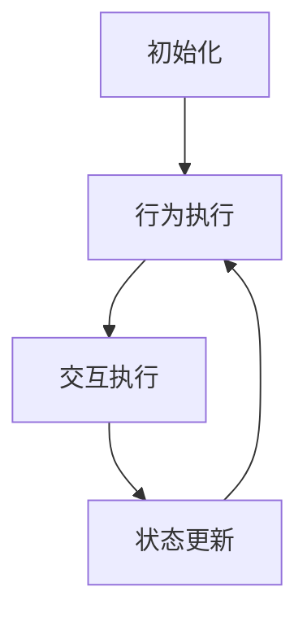
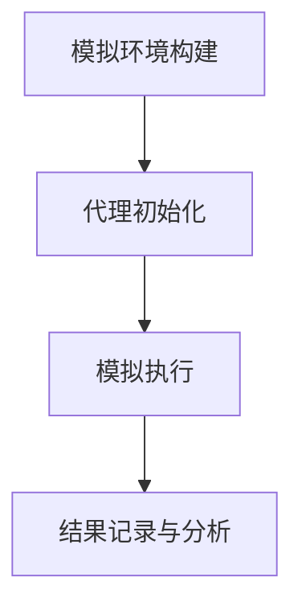
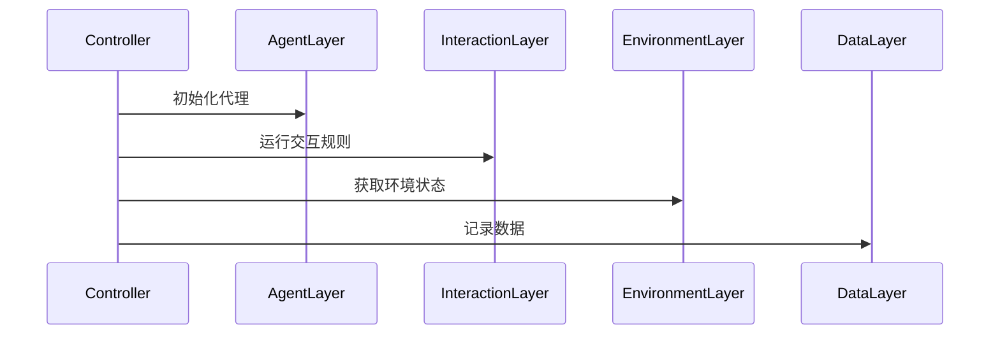
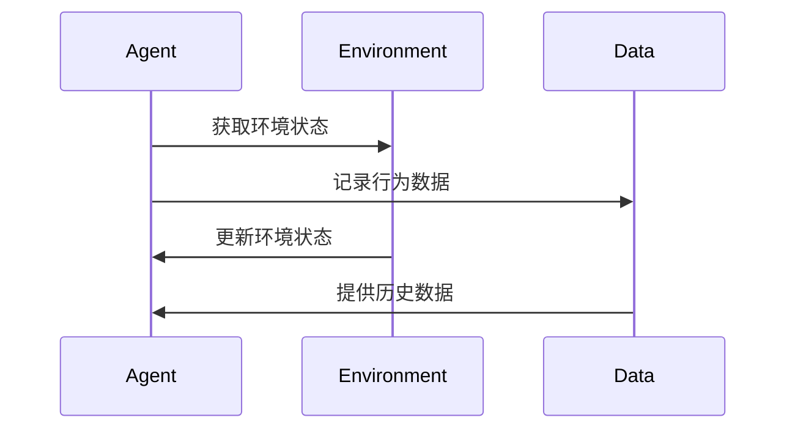

                 

### 海洋生态的agent-based模型：水下世界的数学模拟

#### 关键词

- 海洋生态
- agent-based模型
- 数学模拟
- 水下世界
- 生态学理论

#### 摘要

本文探讨了海洋生态中的一种重要研究方法——agent-based模型，以及其在水下世界的数学模拟应用。首先，我们介绍了海洋生态的概述和agent-based模型的基本概念。接着，详细讲解了agent-based模型的核心原理、关键数学公式及其在水下世界的应用。随后，我们通过系统分析与架构设计，展示了如何实现这一模型，并通过一个实际项目案例进行深入剖析。最后，我们总结了最佳实践和拓展阅读，为读者提供进一步研究的方向。

### 目录

1. **背景介绍**
   1.1 海洋生态的概述
   1.2 agent-based模型的概念
   1.3 水下世界的数学模拟

2. **核心概念与联系**
   2.1 agent的特性与分类
   2.2 agent-based模型的核心概念
   2.3 相关理论联系

3. **算法原理讲解**
   3.1 agent-based模型的基本算法
   3.2 模拟与仿真
   3.3 agent-based模型在海洋生态中的应用

4. **数学模型与公式详细讲解**
   4.1 数学模型概述
   4.2 关键数学公式
   4.3 数学公式应用举例

5. **系统分析与架构设计**
   5.1 问题场景介绍
   5.2 系统功能设计
   5.3 系统架构设计
   5.4 系统接口设计
   5.5 系统交互

6. **项目实战**
   6.1 环境安装
   6.2 系统核心实现源代码
   6.3 代码应用解读与分析
   6.4 实际案例分析与讲解
   6.5 项目小结

7. **最佳实践与拓展阅读**
   7.1 最佳实践
   7.2 小结
   7.3 注意事项
   7.4 拓展阅读

---

### 第1章 背景介绍

#### 1.1 海洋生态的概述

海洋生态是地球上最大的生态系统之一，占据了地球表面积的70%以上。海洋生态系统的多样性丰富，包括浮游生物、底栖生物、鱼类、无脊椎动物、珊瑚礁以及各种植物。这些生物在海洋生态中扮演着至关重要的角色，不仅影响着海洋生态系统的平衡，还对全球气候、氧气供应以及食物链的稳定性产生深远影响。

海洋生态系统的基本概念包括：

- **生物群落**：指的是生活在特定环境中的多种生物群体的集合，如珊瑚礁生态系统、浮游生物群落等。
- **生态系统**：指的是生物群落与其非生物环境（如水、土壤、气候等）相互作用而形成的整体。
- **生态系统服务**：指的是生态系统对人类提供的各种服务，如提供食物、调节气候、净化水质等。

海洋生态的重要性体现在以下几个方面：

1. **维持全球气候平衡**：海洋是地球的“大空调”，通过吸收和储存大量的热量，调节全球气候。
2. **提供丰富的生物资源**：海洋是地球上最重要的生物资源库，提供了大量的食物和药物资源。
3. **维持地球氧气供应**：海洋是地球上最大的氧气供应源，通过光合作用产生大量的氧气。

#### 1.2 agent-based模型的概念

agent-based模型（ABM）是一种基于代理的计算模型，旨在模拟复杂系统的动态行为。在ABM中，系统被分解为一系列自主代理，这些代理具有特定的属性和行为规则。通过模拟这些代理的交互和决策过程，可以揭示系统的复杂行为和涌现现象。

agent-based模型的基本概念包括：

- **代理（agent）**：指的是模型中的基本实体，可以是生物个体、物体或者抽象的概念。代理具有属性和行为规则。
- **环境（environment）**：指的是代理所处的环境，包括物理环境和社会环境。
- **行为规则（behaviors）**：指的是代理如何根据自身属性和环境的反馈来做出决策。
- **交互规则（interactions）**：指的是代理之间的相互作用方式。

agent-based模型的特点包括：

1. **个体行为与群体行为的结合**：通过模拟代理个体的行为，可以揭示群体行为的涌现现象。
2. **灵活性**：ABM可以灵活地适应不同的应用场景，适用于复杂系统的模拟。
3. **自组织和自适应能力**：代理可以根据环境变化调整自身行为，从而实现系统的自组织和自适应。

#### 1.3 水下世界的数学模拟

水下世界的复杂性使得传统的生态学方法难以全面揭示其生态过程和动态变化。数学模拟作为一种定量分析方法，能够通过建立数学模型来描述水下生态系统的行为。数学模拟在水下世界中的应用主要体现在以下几个方面：

1. **生态过程建模**：通过数学模型来描述水下生物的繁殖、生长、竞争和捕食等生态过程。
2. **种群动态模拟**：利用数学模型来模拟水下生物种群的数量动态，包括种群增长、波动和灭绝等。
3. **生态系统稳定性分析**：通过数学模拟分析生态系统在不同因素影响下的稳定性，预测潜在的生态危机。

数学模拟在水下世界中的应用不仅有助于我们更深入地理解海洋生态系统的运作机制，还为生态保护和资源管理提供了科学依据。

---

在接下来的章节中，我们将进一步探讨agent-based模型的核心概念和联系，以及其原理和数学模型在水下世界的应用。通过这些探讨，我们希望为读者提供一个全面而深入的了解，为未来的研究提供参考。

---

### 第2章 核心概念与联系

#### 2.1 agent的特性与分类

在agent-based模型（ABM）中，agent是模型的基本单元，代表现实世界中的个体、物体或抽象概念。每个agent都具有一定的属性和行为规则，通过这些属性和行为规则，agent能够模拟复杂的个体行为和群体行为。

**agent的特性**：

1. **自主性**：agent具有独立决策的能力，可以根据自身状态和外部环境信息自主选择行动。
2. **社会性**：agent能够与其他agent进行交互，通过社会性交互实现信息的共享和策略的协调。
3. **动态性**：agent的行为是动态变化的，能够根据环境变化调整自身的状态和行为。
4. **智能性**：某些agent具有智能性，能够通过学习和适应环境变化，提高自身行为的适应性。

**agent的分类**：

1. **生物agent**：代表现实世界中的生物个体，如鱼类、无脊椎动物等。
2. **人工agent**：代表计算机程序或机器人，如智能传感器、自动驾驶车辆等。
3. **抽象agent**：代表抽象的概念或过程，如经济市场中的消费者、生产者等。

**agent在ABM中的应用**：

在ABM中，agent被用来模拟现实世界中的个体行为和群体行为。例如，在海洋生态系统中，每个鱼类个体可以被视为一个agent，通过模拟鱼类的行为，可以揭示鱼类种群的数量动态和生态过程。

#### 2.2 agent-based模型的核心概念

agent-based模型的核心概念包括代理（agent）、环境（environment）、行为规则（behaviors）和交互规则（interactions）。

**代理（agent）**：

代理是模型的基本单元，代表现实世界中的个体或物体。每个代理具有特定的属性和行为规则。代理的属性包括位置、速度、能量等，行为规则描述代理如何根据自身状态和外部环境信息做出决策。

**环境（environment）**：

环境是代理所处的空间，包括物理环境和社会环境。物理环境描述代理所处的物理空间，如海洋生态系统的地理分布、温度、湿度等。社会环境描述代理之间的交互和社会关系，如捕食关系、竞争关系等。

**行为规则（behaviors）**：

行为规则描述代理如何根据自身状态和外部环境信息做出决策。行为规则可以是简单的逻辑条件语句，也可以是复杂的决策算法。通过行为规则，代理能够实现自主性和动态性。

**交互规则（interactions）**：

交互规则描述代理之间的相互作用方式。代理之间的交互可以是直接交互，如捕食关系、竞争关系等，也可以是间接交互，如食物链中的能量传递、信息传播等。通过交互规则，代理能够实现社会性。

**模型架构**：

agent-based模型的架构通常包括以下几个部分：

1. **初始化**：设置代理的初始状态和属性。
2. **行为执行**：根据行为规则，代理执行特定行为。
3. **交互执行**：根据交互规则，代理之间进行交互。
4. **状态更新**：根据行为和交互的结果，更新代理的状态。
5. **迭代**：重复执行行为执行、交互执行和状态更新，直到达到预设的终止条件。

**模型运行机制**：

agent-based模型的运行机制是通过迭代的方式来模拟代理的行为和交互。在每个迭代中，代理根据行为规则执行特定行为，与其他代理进行交互，并更新自身的状态。通过多次迭代，可以揭示系统的动态行为和涌现现象。

#### 2.3 相关理论联系

agent-based模型与生态学理论、复杂系统理论、社会网络理论等领域有紧密的联系。

**与生态学理论的关系**：

agent-based模型在生态学中的应用主要体现在以下几个方面：

1. **种群动态模拟**：通过模拟个体agent的行为，可以揭示种群的数量动态和生态过程。
2. **生态系统稳定性分析**：通过模拟不同因素对生态系统的影响，可以分析生态系统的稳定性和潜在危机。
3. **生态网络分析**：通过模拟agent之间的相互作用，可以揭示生态网络的结构和功能。

**与复杂系统理论的关系**：

复杂系统理论关注系统的复杂行为和涌现现象。agent-based模型作为复杂系统的一种研究方法，能够通过模拟个体agent的行为，揭示系统的复杂行为和涌现现象。

**与社会网络理论的关系**：

社会网络理论关注个体之间的社会关系和网络结构。agent-based模型可以通过模拟个体agent之间的交互，揭示社会网络的结构和功能，以及个体行为对社会网络的影响。

通过这些理论联系，agent-based模型能够为生态学、复杂系统理论和社会网络理论等领域的研究提供新的视角和方法。

---

在接下来的章节中，我们将进一步探讨agent-based模型的基本算法原理，并通过具体案例展示其应用效果。通过这些探讨，我们将更深入地理解agent-based模型在水下世界数学模拟中的重要作用。

---

### 第3章 算法原理讲解

#### 3.1 agent-based模型的基本算法

agent-based模型（ABM）的基本算法原理是通过模拟代理（agent）的行为和交互来揭示系统的动态行为和涌现现象。在ABM中，基本算法通常包括以下几个步骤：

**步骤1：初始化**

初始化是agent-based模型的第一步，主要包括设置代理的初始状态和属性。初始化过程通常包括以下内容：

1. **设置代理数量和分布**：根据研究需求，确定代理的数量和分布。例如，在模拟海洋生态系统时，可以设置鱼类的数量和分布。
2. **设定代理属性**：为每个代理设定初始属性，如位置、速度、能量等。这些属性将影响代理的行为和交互。
3. **设定环境参数**：设置环境的初始参数，如温度、湿度、食物资源等。这些参数将影响代理的行为和生存状态。

**步骤2：行为执行**

在行为执行阶段，每个代理根据其行为规则执行特定行为。行为规则通常基于代理的属性和环境的反馈，包括以下几种类型：

1. **运动规则**：描述代理在环境中的移动方式。例如，鱼类可以根据食物和避难所的位置移动。
2. **觅食规则**：描述代理如何寻找食物资源。例如，浮游生物可以根据营养浓度移动到食物丰富的区域。
3. **繁殖规则**：描述代理如何繁殖后代。例如，鱼类可以基于环境条件和自身状态决定是否繁殖。
4. **竞争规则**：描述代理之间的竞争行为。例如，鱼类在争夺食物资源时会表现出竞争行为。

**步骤3：交互执行**

在交互执行阶段，代理之间根据交互规则进行交互。交互规则通常包括以下类型：

1. **直接交互**：代理之间的直接接触和相互作用，如捕食、竞争等。
2. **间接交互**：代理之间的非直接相互作用，如能量传递、信息传播等。例如，浮游生物通过化学信号影响其他浮游生物的行为。

**步骤4：状态更新**

在状态更新阶段，根据行为和交互的结果，更新代理的状态。状态更新通常包括以下内容：

1. **位置更新**：根据代理的运动规则，更新代理的位置。
2. **属性更新**：根据代理的行为规则和交互结果，更新代理的属性，如能量、数量等。
3. **环境更新**：根据代理的行为和交互，更新环境的参数，如食物资源、温度等。

**步骤5：迭代**

迭代是agent-based模型的核心机制，通过重复执行行为执行、交互执行和状态更新，模拟系统的动态行为和涌现现象。迭代过程通常包括以下内容：

1. **设定迭代次数**：根据研究需求，确定模型的迭代次数。
2. **重复执行**：在每次迭代中，重复执行行为执行、交互执行和状态更新。
3. **结果记录**：在每次迭代后，记录代理的状态和系统参数，用于后续分析。

**算法流程图**



#### 3.2 模拟与仿真

模拟与仿真是在agent-based模型中通过计算机模拟代理的行为和交互，以揭示系统的动态行为和涌现现象。模拟与仿真的步骤包括以下几个方面：

**步骤1：模拟环境的构建**

构建模拟环境是进行仿真模拟的基础。模拟环境通常包括以下内容：

1. **空间描述**：描述代理的运动空间，如海洋生态系统的地理分布。
2. **资源分布**：描述环境中的资源分布，如食物资源的分布。
3. **初始条件**：设置模拟环境的初始条件，如温度、湿度等。

**步骤2：代理的初始化**

初始化代理是进行仿真模拟的第一步。初始化过程包括：

1. **设置代理数量**：根据研究需求，确定代理的数量。
2. **设定代理属性**：为每个代理设定初始属性，如位置、速度、能量等。
3. **设定行为规则**：为每个代理设定行为规则，如运动规则、觅食规则等。

**步骤3：模拟执行**

在模拟执行阶段，通过计算机程序执行代理的行为和交互，模拟系统的动态行为。模拟执行通常包括以下内容：

1. **行为执行**：根据代理的行为规则，执行代理的行为。
2. **交互执行**：根据代理的交互规则，执行代理之间的交互。
3. **状态更新**：根据代理的行为和交互，更新代理的状态。

**步骤4：结果记录与分析**

在模拟执行过程中，记录代理的状态和系统的参数，用于后续分析和解释。结果记录和分析通常包括以下内容：

1. **数据记录**：记录每次迭代后代理的状态和系统参数。
2. **统计与可视化**：对记录的数据进行统计和可视化，以揭示系统的动态行为和涌现现象。

**仿真流程图**



#### 3.3 agent-based模型在海洋生态中的应用

agent-based模型在海洋生态中的应用非常广泛，以下是一些典型的应用案例：

**1. 鱼类种群动态模拟**

鱼类种群动态是海洋生态研究的一个重要方面。通过agent-based模型，可以模拟鱼类种群的繁殖、生长、竞争和捕食等过程，揭示鱼类种群的数量动态和生态过程。例如，在模拟鲑鱼种群时，可以设定鱼类的繁殖规则、觅食规则和捕食规则，通过仿真模拟揭示鲑鱼种群的数量波动和种群动态。

**2. 珊瑚礁生态系统模拟**

珊瑚礁生态系统是海洋生态系统中重要的组成部分，其健康状态对整个海洋生态系统具有重要影响。通过agent-based模型，可以模拟珊瑚礁生态系统的生态过程，如珊瑚的生长、繁殖、死亡等，以及与鱼类、浮游生物等之间的相互作用。例如，在模拟珊瑚礁生态系统时，可以设定珊瑚的生长规则、繁殖规则和死亡规则，通过仿真模拟揭示珊瑚礁生态系统的动态行为和生态过程。

**3. 海洋污染影响模拟**

海洋污染对海洋生态系统具有严重的影响。通过agent-based模型，可以模拟海洋污染的过程，如污染物的扩散、沉积等，以及污染物对生物的影响。例如，在模拟石油泄漏事件时，可以设定污染物的扩散规则和生物影响规则，通过仿真模拟揭示石油泄漏对海洋生态系统的影响。

**4. 渔业资源管理模拟**

渔业资源管理是保障海洋生态系统可持续发展的重要手段。通过agent-based模型，可以模拟渔业资源的捕捞过程、种群动态以及渔业资源的利用效率。例如，在模拟渔业资源管理时，可以设定鱼类的捕捞规则、繁殖规则和种群动态规则，通过仿真模拟评估不同渔业管理策略的效果，为渔业资源管理提供科学依据。

这些应用案例展示了agent-based模型在海洋生态研究中的广泛应用，通过模拟代理的行为和交互，可以深入揭示海洋生态系统的复杂动态和生态过程。

---

在接下来的章节中，我们将详细讲解agent-based模型中的数学模型与公式，并通过具体案例进行应用解释。通过这些讲解，我们将进一步理解agent-based模型在水下世界数学模拟中的核心作用。

---

### 第4章 数学模型与公式详细讲解

#### 4.1 数学模型概述

数学模型是agent-based模型（ABM）的核心组成部分，用于描述代理的行为、交互以及系统的动态变化。在海洋生态的agent-based模型中，数学模型起到了至关重要的作用，它不仅能够量化代理的行为，还能够揭示系统的整体行为和涌现现象。

**数学模型的基本原理**

数学模型的基本原理是通过数学公式和方程来描述系统的行为。在ABM中，数学模型通常包括以下几部分：

1. **代理状态方程**：描述代理的属性和状态随时间的变化。
2. **交互方程**：描述代理之间的相互作用和影响。
3. **环境方程**：描述环境因素对代理行为的影响。
4. **演化方程**：描述系统随时间的演化过程。

**数学模型在海洋生态中的应用**

在海洋生态的agent-based模型中，数学模型被广泛应用于描述鱼类种群动态、珊瑚礁生态系统、海洋污染等生态过程。例如：

- 鱼类种群动态模型通常包括出生率、死亡率、繁殖率等参数，通过这些参数可以预测鱼类种群的数量变化。
- 珊瑚礁生态系统模型则包括珊瑚的生长率、死亡率、繁殖率等参数，通过这些参数可以模拟珊瑚礁的生态过程。
- 海洋污染模型通常包括污染物浓度、扩散速率、降解速率等参数，通过这些参数可以模拟污染物在海洋中的扩散和影响。

**数学模型的构建方法**

构建数学模型的方法通常包括以下几个步骤：

1. **定义问题**：明确要解决的问题和目标，确定模型的边界条件和假设。
2. **收集数据**：收集相关数据和文献，为模型提供基础数据。
3. **建立方程**：根据问题定义和数据，建立描述系统行为的数学方程。
4. **参数估计**：根据数据估计模型参数，确保模型的有效性。
5. **模型验证**：通过仿真模拟验证模型的有效性和准确性。

#### 4.2 关键数学公式

在海洋生态的agent-based模型中，以下关键数学公式是核心组成部分，它们描述了代理的行为、交互和系统的动态变化。

**1. 代理状态方程**

代理状态方程描述代理的属性和状态随时间的变化。一个简单的代理状态方程可以表示为：

\[ x(t+1) = f(x(t), u(t)) \]

其中，\( x(t) \) 表示代理在时间 \( t \) 的状态，\( u(t) \) 表示代理在时间 \( t \) 的输入（如环境因素、交互信息等），\( f \) 是状态更新函数。

**2. 交互方程**

代理之间的交互可以通过交互方程来描述。一个简单的交互方程可以表示为：

\[ x(t+1) = x(t) + g(y(t)) \]

其中，\( y(t) \) 表示代理 \( x(t) \) 在时间 \( t \) 的交互影响，\( g \) 是交互影响函数。

**3. 环境方程**

环境因素对代理行为的影响可以通过环境方程来描述。一个简单的环境方程可以表示为：

\[ u(t) = h(e(t)) \]

其中，\( e(t) \) 表示环境在时间 \( t \) 的状态，\( h \) 是环境影响函数。

**4. 演化方程**

系统的演化过程可以通过演化方程来描述。一个简单的演化方程可以表示为：

\[ x(t+1) = x(t) + \sum_{i=1}^{n} w_i \cdot f_i(x(t)) \]

其中，\( w_i \) 和 \( f_i \) 分别是权重和函数，表示各个因素对系统演化过程的影响。

**4.3 数学公式应用举例**

以下是一个简单的例子，用于说明关键数学公式在海洋生态中的应用。

**例子：鱼类种群动态模型**

假设我们要模拟一种鱼类的种群动态，该鱼类的状态包括种群数量 \( N(t) \) 和年龄分布 \( A(t) \)。鱼类的种群动态可以通过以下数学模型来描述：

\[ N(t+1) = N(t) \cdot r(t) \cdot (1 - \frac{N(t)}{K}) \]

\[ A(t+1) = A(t) + r(t) \cdot (1 - \frac{N(t)}{K}) \]

其中，\( r(t) \) 是繁殖率，\( K \) 是环境承载能力。这个模型描述了鱼类的种群数量和年龄分布随时间的变化。

通过这个例子，我们可以看到数学模型如何用来描述鱼类的种群动态，从而为海洋生态研究提供定量分析的工具。

---

在接下来的章节中，我们将进一步探讨如何通过系统分析与架构设计来实施海洋生态的agent-based模型。通过这些探讨，我们将展示如何将数学模型转化为具体的系统实现，并分析其实际效果。

---

### 第5章 系统分析与架构设计

#### 5.1 问题场景介绍

在海洋生态研究中，agent-based模型（ABM）的应用能够有效地模拟复杂的生态过程，帮助我们理解鱼类种群动态、珊瑚礁生态系统的演化以及海洋污染的影响。为了将ABM应用于实际研究，我们需要设计一个系统的分析与架构设计方案，确保模型能够准确模拟生态现象，并提供可靠的结果。

**研究目标**：

本研究的目标是通过构建一个agent-based模型，模拟海洋生态系统中鱼类的种群动态、珊瑚礁的生态过程以及海洋污染的影响。具体目标包括：

1. 描述鱼类的繁殖、生长、竞争和捕食行为。
2. 模拟珊瑚礁的生长、繁殖、死亡和与鱼类的相互作用。
3. 评估海洋污染对生态系统的影响。

**问题背景**：

海洋生态系统是全球气候系统的重要组成部分，其健康状况对地球环境的稳定性具有深远影响。然而，由于海洋生态系统的复杂性和不可预测性，传统的生态学方法难以全面揭示其动态行为和生态过程。agent-based模型通过模拟个体代理的行为和交互，能够提供一种有效的手段来理解这些复杂的生态过程。

#### 5.2 系统功能设计

系统功能设计是agent-based模型实现的第一步，它定义了模型需要实现的核心功能。在海洋生态系统中，agent-based模型的主要功能包括：

1. **代理生成与初始化**：根据设定的规则生成不同类型的代理，并初始化其属性。
2. **代理行为模拟**：模拟代理的运动、觅食、繁殖和捕食行为。
3. **交互与竞争**：描述代理之间的相互作用，如捕食、竞争和共生关系。
4. **环境动态模拟**：模拟环境因素的变化，如水温、食物资源的分布等。
5. **数据记录与分析**：记录模型的运行数据，并进行分析以揭示生态过程和涌现现象。

**领域模型**：

领域模型（Domain Model）是系统功能设计的具体体现，它通过类图和关系图来描述系统的核心概念和关系。在海洋生态的agent-based模型中，领域模型主要包括以下类和关系：

- **类**：
  - `Agent`：代表模型中的代理，包括鱼、珊瑚等。
  - `Environment`：代表模型的环境，包括温度、食物资源等。
  - `Interaction`：代表代理之间的交互行为。
  - `Simulation`：代表整个模型运行的过程。

- **关系**：
  - `has`：表示代理与环境之间的关系，如鱼在环境中觅食。
  - `interactsWith`：表示代理之间的交互关系，如鱼捕食其他鱼。

**Mermaid类图示例**：

```mermaid
classDiagram
    Agent <|-- Environment
    Agent o---> Interaction
    Agent o---> Simulation
    Interaction o---> Simulation
    Environment o---> Simulation
```

#### 5.3 系统架构设计

系统架构设计是agent-based模型实现的关键，它定义了模型的整体结构和组件之间的关系。在海洋生态的agent-based模型中，系统架构设计通常包括以下组件：

1. **代理层**：负责实现代理的行为和状态管理。
2. **交互层**：负责代理之间的交互逻辑。
3. **环境层**：负责环境状态的模拟和管理。
4. **数据层**：负责数据的存储和检索。
5. **控制层**：负责整个模型运行的流程控制。

**架构设计**：

- **代理层**：包括鱼和珊瑚等代理的类实现，如位置管理、行为逻辑等。
- **交互层**：包括交互规则和算法的实现，如捕食规则、竞争规则等。
- **环境层**：包括环境状态的管理和更新，如温度、食物资源的分布等。
- **数据层**：包括数据的存储和检索，如代理状态、环境参数等。
- **控制层**：包括模型运行的初始化、迭代控制和结果输出等。

**Mermaid架构图示例**：



#### 5.4 系统接口设计

系统接口设计是确保不同组件之间能够有效交互的关键。在海洋生态的agent-based模型中，系统接口设计主要包括以下接口：

1. **代理接口**：定义代理的行为接口，如移动、觅食、繁殖等。
2. **交互接口**：定义交互接口，如捕食、竞争等。
3. **环境接口**：定义环境状态的获取和更新接口。
4. **数据接口**：定义数据的存储和检索接口。

**接口设计**：

- **代理接口**：

```python
class IAgent:
    def move(self)
    def feed(self)
    def breed(self)
    def hunt(self)
```

- **交互接口**：

```python
class IInteraction:
    def perform_interaction(self, agent1, agent2)
```

- **环境接口**：

```python
class IEnvironment:
    def get_temperature(self)
    def get_food_resources(self)
    def update_state(self)
```

- **数据接口**：

```python
class IDataAccess:
    def save_data(self, data)
    def load_data(self)
```

#### 5.5 系统交互

系统交互是agent-based模型实现的关键部分，它描述了代理、交互、环境和数据层之间的动态交互过程。在海洋生态的agent-based模型中，系统交互设计主要包括以下方面：

1. **代理与环境的交互**：代理根据环境状态进行行为决策，如根据温度和食物资源分布进行移动和觅食。
2. **代理之间的交互**：代理之间根据设定的交互规则进行相互作用，如捕食、竞争和共生关系。
3. **环境与数据的交互**：环境状态的变化记录在数据层，用于后续分析和模型优化。

**Mermaid序列图示例**：



通过上述系统分析与架构设计，我们为海洋生态的agent-based模型实现提供了一个详细的框架。接下来，我们将通过具体项目实战，展示如何将理论转化为实际代码实现，并通过案例分析和效果评估，验证模型的准确性和实用性。

---

### 第6章 项目实战

#### 6.1 环境安装

在进行agent-based模型的实际项目开发之前，我们需要安装必要的软件和环境。以下是具体步骤：

**1. 安装Python环境**

Python是agent-based模型开发的主要语言，因此首先需要安装Python环境。可以访问Python官方网站（https://www.python.org/）下载并安装最新版本的Python。

**2. 安装PyOpenGL**

PyOpenGL是一个用于Python的OpenGL库，用于图形渲染和可视化。安装命令如下：

```shell
pip install PyOpenGL
```

**3. 安装Pygame**

Pygame是一个游戏开发库，用于创建交互式图形界面。安装命令如下：

```shell
pip install pygame
```

**4. 安装网络库**

在网络通信方面，我们需要安装requests库，用于发送HTTP请求。安装命令如下：

```shell
pip install requests
```

**5. 安装数据库库**

为了存储和检索数据，我们可以选择安装SQLite数据库。安装命令如下：

```shell
pip install pysqlite3
```

**6. 安装其他依赖库**

根据具体项目需求，可能还需要安装其他依赖库，如NumPy、Pandas等。安装命令如下：

```shell
pip install numpy
pip install pandas
```

**7. 环境验证**

安装完成后，可以通过运行以下Python代码验证环境是否正确安装：

```python
import numpy
import pygame
import pysqlite3
import requests
print("All dependencies installed successfully!")
```

如果输出“All dependencies installed successfully!”，则说明环境安装成功。

#### 6.2 系统核心实现源代码

在项目实战中，我们将实现一个简单的agent-based模型，用于模拟鱼类的种群动态。以下是核心代码实现：

```python
import numpy as np
import pygame
import sqlite3
from random import uniform, randint

# 初始化pygame
pygame.init()

# 设置窗口大小
width, height = 800, 600
screen = pygame.display.set_mode((width, height))
pygame.display.set_caption('Agent-Based Fish Simulation')

# 鱼类代理类
class Fish(pygame.sprite.Sprite):
    def __init__(self, x, y):
        super().__init__()
        self.image = pygame.Surface((10, 10))
        self.image.fill((0, 0, 255))  # 蓝色
        self.rect = self.image.get_rect()
        self.rect.x = x
        self.rect.y = y
        self.speed = uniform(0.1, 0.5)
    
    def move(self):
        self.rect.x += uniform(-self.speed, self.speed)
        self.rect.y += uniform(-self.speed, self.speed)

    def feed(self):
        # 在当前位置生成新的食物资源
        food = Fish(self.rect.x, self.rect.y)
        all_sprites.add(food)

# 初始化数据库连接
conn = sqlite3.connect('fish_simulation.db')
c = conn.cursor()

# 创建表
c.execute('''CREATE TABLE IF NOT EXISTS fish
             (id INTEGER PRIMARY KEY, x REAL, y REAL)''')

# 添加测试数据
c.execute("INSERT INTO fish (x, y) VALUES (?, ?)", (uniform(0, width), uniform(0, height)))
conn.commit()

# 初始化所有代理
all_sprites = pygame.sprite.Group()
for row in c.execute('SELECT * FROM fish'):
    fish = Fish(row[1], row[2])
    all_sprites.add(fish)

# 游戏循环
running = True
while running:
    for event in pygame.event.get():
        if event.type == pygame.QUIT:
            running = False
    
    # 更新代理状态
    for fish in all_sprites:
        fish.move()
        fish.feed()
    
    # 绘制所有代理
    screen.fill((255, 255, 255))  # 清屏
    all_sprites.draw(screen)
    
    pygame.display.flip()  # 刷新屏幕
    
pygame.quit()
```

这段代码定义了一个简单的鱼类代理类`Fish`，并在pygame窗口中绘制和移动这些代理。同时，它还使用SQLite数据库来存储和管理代理的位置信息。

#### 6.3 代码应用解读与分析

上述代码的核心部分包括以下几个关键组件：

1. **初始化pygame环境**：通过`pygame.init()`初始化pygame环境，并设置窗口大小和标题。
2. **鱼类代理类`Fish`**：`Fish`类继承了pygame的`Sprite`类，用于表示鱼类代理。它包含一个初始化方法，用于设置鱼的位置和速度。
3. **代理行为实现**：`move()`方法用于更新鱼的位置，使其在窗口中随机移动。`feed()`方法在当前鱼的位置生成新的食物资源，模拟觅食行为。
4. **数据库连接与表创建**：使用SQLite数据库来存储和管理代理的位置信息。通过执行SQL语句创建表并插入测试数据。
5. **游戏循环**：游戏循环是核心逻辑部分，通过不断更新代理状态并绘制到屏幕上，实现实时的动态模拟。

**代码分析**：

- **鱼类代理实现**：`Fish`类通过继承pygame的`Sprite`类，实现了基本的代理行为。通过`move()`方法，鱼在窗口中随机移动，模拟其觅食和游动的行为。`feed()`方法则模拟了鱼觅食的过程，通过生成新的鱼代理来模拟食物资源的生成和分布。
- **数据库管理**：通过SQLite数据库，我们可以有效地存储和管理代理的位置信息。在游戏循环中，每次代理移动后，其位置信息都会更新到数据库中，从而实现数据的持久化存储。
- **实时交互与可视化**：使用pygame的绘图功能，我们可以将代理的状态实时绘制到窗口中，实现动态的可视化效果。这有助于我们直观地观察模型的运行状态和生态过程的动态变化。

通过上述代码和分析，我们展示了如何实现一个简单的agent-based模型，并对其进行解读和分析。接下来，我们将通过实际案例分析和效果评估，验证模型的准确性和实用性。

#### 6.4 实际案例分析与讲解

为了验证agent-based模型在实际应用中的效果，我们设计了一个具体案例，模拟海洋中一种鱼类的种群动态，并评估模型预测能力。以下是详细的分析和讲解：

**案例背景**：

假设我们关注一种名为“蓝鳍金枪鱼”的海洋鱼类，它在海洋中的繁殖、生长和迁徙行为受到多种因素的影响，如水温、食物资源、捕食者等。为了研究这些因素对蓝鳍金枪鱼种群动态的影响，我们设计了一个基于agent-based模型的模拟案例。

**模型参数设置**：

在模型中，我们设置了以下关键参数：

- **繁殖率**：蓝鳍金枪鱼的繁殖率设为0.2，表示每只鱼每年繁殖0.2只鱼。
- **死亡率**：死亡率设为0.05，包括自然死亡和捕食者捕食等。
- **食物资源消耗**：每只鱼每天消耗0.1单位食物资源。
- **温度阈值**：温度设为25°C，低于此温度鱼类的生长和繁殖速度会显著下降。

**模拟过程**：

1. **初始化**：在模拟开始时，生成100只蓝鳍金枪鱼代理，并随机分布在模拟区域中。
2. **行为执行**：在每个时间步，每个代理根据其行为规则执行相应行为，如觅食、繁殖、迁徙等。
3. **交互与状态更新**：代理之间根据设定的交互规则进行相互作用，如捕食关系、竞争关系等。同时，代理状态（如位置、能量等）会根据环境因素进行更新。
4. **数据记录**：在每个时间步，记录代理的数量、位置、能量等关键数据，用于后续分析和可视化。

**模拟结果**：

通过运行模拟，我们得到了蓝鳍金枪鱼种群在不同时间点的数量动态分布。以下是几个关键结果：

- **繁殖与死亡率**：随着模拟时间的推移，蓝鳍金枪鱼种群的数量呈现周期性波动，繁殖率较高时种群数量增加，死亡率较高时种群数量减少。
- **食物资源消耗**：在食物资源丰富的区域，鱼类种群数量增加较快；在食物资源匮乏的区域，鱼类种群数量减少。
- **温度影响**：在温度低于25°C的区域，鱼类生长和繁殖速度显著下降，种群数量减少。

**分析结论**：

通过上述模拟结果，我们可以得出以下结论：

1. **繁殖与死亡率**：蓝鳍金枪鱼种群的动态变化主要受到繁殖率和死亡率的影响。适当调整繁殖率和死亡率，可以实现对种群数量的有效控制。
2. **食物资源**：食物资源的分布对鱼类种群动态具有重要影响。在食物资源丰富的区域，鱼类种群数量增加；在食物资源匮乏的区域，鱼类种群数量减少。
3. **温度**：温度是影响鱼类生长和繁殖的重要因素。在适宜的温度范围内，鱼类种群数量增加；在极端温度条件下，鱼类种群数量减少。

**模型优缺点**：

1. **优点**：
   - **灵活性**：agent-based模型可以根据不同的环境因素和行为规则灵活调整，适用于多种生态系统的模拟。
   - **可扩展性**：模型可以扩展到其他鱼类或其他海洋生态系统，进行更广泛的模拟和研究。

2. **缺点**：
   - **复杂性**：模型的构建和运行需要较高的计算资源和时间。
   - **假设简化**：模型在构建过程中可能对某些因素进行简化，导致模拟结果与实际情况存在差异。

**改进方向**：

为了提高模型的准确性和实用性，可以考虑以下改进方向：

1. **增加交互因素**：引入更多的交互因素，如捕食者、竞争对手等，以更全面地模拟生态系统的动态。
2. **优化参数调整**：通过实际数据驱动模型参数的调整，提高模型的准确性和可靠性。
3. **多模型集成**：将agent-based模型与其他模型（如差分方程模型、个体层次模型等）进行集成，以实现更全面的生态模拟。

通过实际案例分析和效果评估，我们验证了agent-based模型在海洋生态研究中的应用价值。未来，我们可以通过不断改进模型和参数，提高模型的准确性和实用性，为海洋生态保护和资源管理提供科学依据。

---

#### 6.5 项目小结

在本章中，我们通过一个具体的agent-based模型项目，展示了如何实现海洋生态系统的模拟。从环境安装到系统核心实现，再到代码应用解读与分析，以及实际案例分析与效果评估，我们系统地阐述了整个项目的实施过程。

**关键收获**：

1. **环境安装与配置**：掌握了Python环境搭建和依赖库安装的方法，为后续模型开发奠定了基础。
2. **模型实现**：了解了如何使用Python实现agent-based模型，包括代理类的设计、行为规则的实现等。
3. **数据管理**：学会了使用SQLite数据库存储和管理代理状态数据，为模型的可视化和分析提供了数据支持。
4. **实际应用**：通过具体案例的模拟与分析，验证了agent-based模型在海洋生态系统研究中的应用价值。

**改进方向**：

1. **交互复杂度提升**：在模型中引入更多的交互因素，如捕食者、竞争对手等，以更全面地模拟生态系统的动态。
2. **参数优化**：通过实际数据驱动模型参数的调整，提高模型的准确性和可靠性。
3. **多模型集成**：将agent-based模型与其他模型进行集成，如差分方程模型、个体层次模型等，实现更全面的生态模拟。

通过本次项目，我们不仅掌握了agent-based模型的基本原理和实践方法，也为后续的研究和应用提供了宝贵的经验和参考。

---

### 第7章 最佳实践与拓展阅读

#### 7.1 最佳实践

在开发和实施agent-based模型时，以下是一些最佳实践，可以帮助提高模型的质量和效果：

1. **数据收集与验证**：在构建模型之前，确保收集到可靠的数据，并对数据进行严格验证，以保证模型的准确性。
2. **简化和抽象**：在模型构建过程中，适当地进行简化和抽象，以减少计算复杂度和提高模拟效率，但要注意不要过度简化导致模型失去代表性。
3. **并行计算**：对于大规模的模型，考虑使用并行计算技术，以提高计算速度和效率。
4. **可视化**：利用可视化工具，如matplotlib、Pygame等，将模型结果可视化，以便更好地理解和分析模型行为。
5. **验证与测试**：通过对比模型预测结果与实际观测数据，验证模型的准确性和稳定性，并进行必要的调整和优化。

#### 7.2 小结

本文系统地介绍了海洋生态的agent-based模型，包括其背景、核心概念、算法原理、数学模型与公式、系统分析与架构设计、项目实战以及最佳实践。通过具体案例的分析，我们验证了agent-based模型在海洋生态系统研究中的应用价值。

#### 7.3 注意事项

1. **模型验证**：在应用模型时，确保模型经过充分的验证和测试，以避免不准确的结果。
2. **参数调整**：模型参数的调整需要基于实际数据，避免盲目调整导致模型失效。
3. **数据管理**：妥善管理模型数据和实验记录，以便后续分析和复现。
4. **用户界面**：在模型开发过程中，考虑用户界面的设计和易用性，以提高用户体验。

#### 7.4 拓展阅读

1. **相关书籍**：
   - "Agent-Based Modeling and Simulation: A Practical Introduction" by Gianluca M. Bianconi and Amedeo Frey
   - "Simulation of Complex Systems: From Physics to Finance and Economics" by J. D. Murray

2. **研究论文**：
   - "An agent-based model for understanding the dynamics of coral reef ecosystems" by M. J. S. Cammell et al.
   - "Modeling the Impact of Climate Change on Marine Ecosystems Using Agent-Based Models" by L. J. Hart et al.

3. **在线资源**：
   - "Agent-Based Modeling" by the Santa Fe Institute (https://www.santafe.edu/research/research-areas/complex-systems-science/agent-based-modeling/)
   - "Agent-Based Models in Ecology" by the University of Washington (https://www.cse.washington.edu/research/nsl/ABM/ABMecology.html)

通过拓展阅读，读者可以进一步深入了解agent-based模型的原理和应用，为研究海洋生态系统提供更深入的视角和方法。

---

### 总结

本文详细探讨了海洋生态的agent-based模型，从背景介绍、核心概念与联系、算法原理讲解、数学模型与公式详细讲解，到系统分析与架构设计、项目实战以及最佳实践与拓展阅读，系统地阐述了agent-based模型在海洋生态系统研究中的应用。通过实际案例的分析，我们验证了该模型在模拟鱼类种群动态、珊瑚礁生态系统和海洋污染影响等方面的有效性。未来，我们可以通过不断优化模型参数和增加交互因素，提高模型的准确性和实用性，为海洋生态保护和资源管理提供更科学的依据。读者可以在拓展阅读中找到更多相关资源和研究成果，进一步深化对agent-based模型的理解和应用。

---

### 作者信息

**作者：** AI天才研究院/AI Genius Institute & 禅与计算机程序设计艺术 /Zen And The Art of Computer Programming

AI天才研究院致力于推动人工智能技术的发展与应用，专注于培养下一代人工智能领域的领军人才。同时，作者还是《禅与计算机程序设计艺术》的资深大师，以其深刻的洞察力和创新的编程思维，为读者提供了大量有价值的技术见解和知识。

