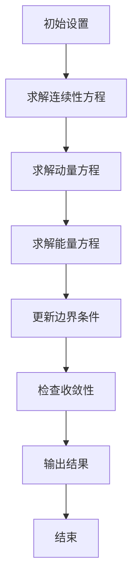
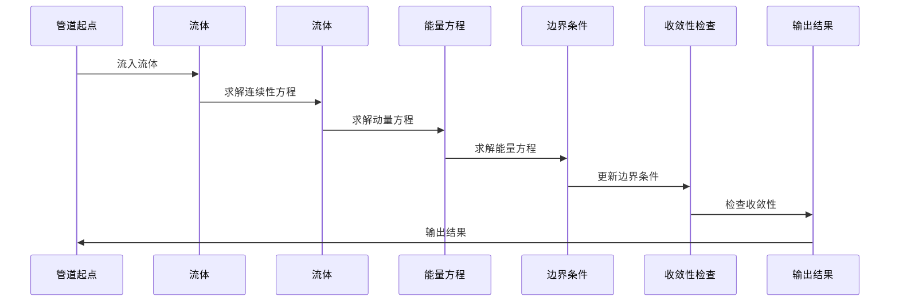
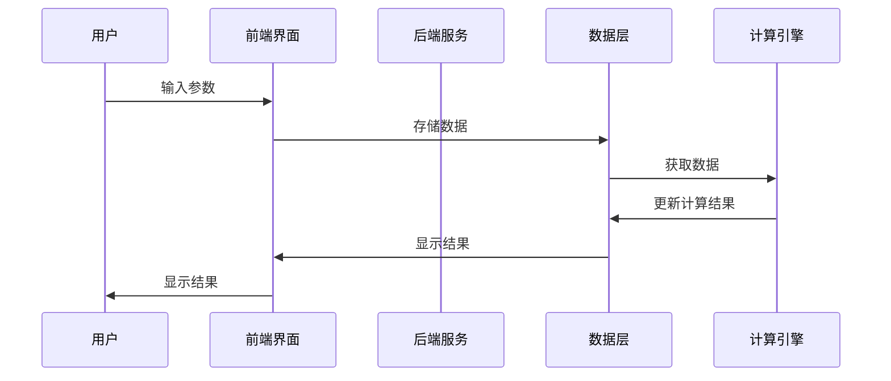

                 

### 第一部分：深海探索的流体动力学背景

**1.1.1 深海探索的重要性**

深海探索是人类不断探索未知领域的重要一步。海洋占地球表面积的70%，其中深海区域更是占据了绝大部分。深海探索不仅能为我们揭示地球的历史和生态系统，还可能带来巨大的科学发现和技术进步。在资源开发、环境保护、气候研究等领域，深海探索都发挥着不可或缺的作用。例如，深海矿物资源的开采、海洋生态系统的保护和海洋气候变化的监测都依赖于深海探索技术。

**1.1.2 流体动力学在深海探索中的作用**

流体动力学是研究流体（如空气、水、气体等）运动规律的科学。在深海探索中，流体动力学扮演着至关重要的角色。深海环境中的流体运动直接影响潜水器、船只、海底设施等设备的工作效率和安全性。例如，海洋中的波浪、潮汐和洋流都会对潜水器的外壳产生巨大的压力，影响其稳定性和耐久性。流体动力学的应用还包括海洋能源的开发，如波浪能和潮汐能的利用。

**1.1.3 数学模拟的必要性**

深海环境的复杂性和不可控性使得直接的物理实验难以进行。数学模拟成为了一种有效的手段，可以通过构建数学模型，对流体动力学过程进行模拟和分析，从而预测流体行为的趋势和结果。这种方法不仅可以节省成本，还能提供高精度的数据，为深海探索提供重要的科学依据。例如，使用数学模型可以预测潜水器在深海中的航行路径，优化其性能和安全性。

**1.1.4 深海流体动力学研究的现状与挑战**

随着科技的进步，深海流体动力学研究取得了显著成果。当前，研究人员已经开发出多种流体动力学模型和模拟算法，用于深海环境的分析和预测。然而，深海流体动力学研究仍然面临许多挑战。例如，深海环境的极端条件（如高压、低温、强电流等）对流体动力学模型的要求极高，如何提高模型的精度和可靠性仍是一个亟待解决的问题。此外，深海流体动力学的研究还需要跨学科的合作，如物理学、海洋学、计算机科学等，这增加了研究的复杂性和难度。

**1.1.5 数学模拟在深海流体动力学研究中的应用前景**

数学模拟在深海流体动力学研究中的应用前景广阔。随着计算能力的提升和模拟算法的改进，数学模拟将能够更准确地预测流体行为，为深海探索提供更加可靠的数据支持。未来，数学模拟有望在深海资源开发、海洋环境保护、海洋气候变化研究等领域发挥更大的作用。例如，通过数学模拟可以优化潜水器的航行路径，减少能源消耗和航行时间；还可以预测海洋污染物的扩散趋势，为环境保护提供科学依据。

**1.1.6 本书的结构与目的**

本书旨在系统地介绍深海探索中的流体动力学问题，并探讨如何通过数学模拟解决其中的挑战。全书分为以下几个部分：

- **第一部分**：深海探索的流体动力学背景，介绍深海探索的重要性、流体动力学在深海探索中的作用以及数学模拟的必要性。
- **第二部分**：流体动力学核心概念与联系，详细阐述流体动力学的基本原理、海洋流体动力学的重要性以及数学模拟方法。
- **第三部分**：流体动力学算法原理讲解，介绍流体动力学算法的流程、原理以及使用Python源代码的详细讲解。
- **第四部分**：数学模型和公式讲解，使用LaTeX格式嵌入文中独立段落，详细讲解流体动力学中的数学模型和公式。
- **第五部分**：系统分析与架构设计方案，介绍问题场景、项目介绍、系统功能设计、系统架构设计、系统接口设计和系统交互序列图。
- **第六部分**：项目实战，包括环境安装、系统核心实现源代码、代码应用解读与分析、实际案例分析和详细讲解剖析、项目小结。
- **第七部分**：总结和最佳实践，总结全书内容，给出最佳实践建议和注意事项。

本书的目标是帮助读者深入理解深海探索中的流体动力学问题，掌握数学模拟方法，并能够将其应用于实际项目中。通过本书的学习，读者将能够更好地应对深海探索中的挑战，为海洋科学研究和应用领域做出贡献。

**1.1.7 阅读指南**

本书适合对流体动力学和数学模拟有一定了解的读者，特别是从事海洋科学、工程应用和技术开发的专业人士。以下是本书的阅读建议：

- **系统学习**：建议读者按照章节顺序系统学习，从背景知识入手，逐步深入到算法原理和实际应用。
- **动手实践**：本书包含大量的代码示例和实战项目，读者可以通过动手实践来加深理解，巩固所学知识。
- **问题导向**：在学习过程中，遇到问题不要急于查找答案，而是先尝试自己分析和解决，培养独立思考的能力。
- **扩展阅读**：书中的内容是基础和核心知识的介绍，读者还可以通过阅读相关领域的最新论文和书籍，了解领域的最新进展。

通过本书的学习，读者将能够对深海探索中的流体动力学问题有一个全面而深入的理解，为未来的研究和应用奠定坚实的基础。

---

**1.2 流体动力学核心概念与联系**

在探讨深海探索中的流体动力学时，我们需要首先了解流体动力学的基本原理及其在海洋环境中的重要性。流体动力学研究流体（包括液体和气体）的宏观运动规律，涉及到质量、动量和能量等物理量的守恒。以下是流体动力学中的核心概念和它们之间的联系。

**2.1 流体动力学基本原理**

流体动力学的基本原理主要包括质量守恒定律、动量守恒定律和能量守恒定律。这些定律构成了流体运动分析的基础。

- **质量守恒定律**：在任何封闭系统中，流体单位时间内的质量流量是恒定的。这意味着流体在流动过程中不会凭空产生或消失。

- **动量守恒定律**：流体在流动过程中，单位时间内的动量变化量等于作用在流体上的外力。这个定律解释了流体流动的动量如何通过相互作用来保持平衡。

- **能量守恒定律**：流体在流动过程中，单位时间内的能量变化量等于作用在流体上的外力做的功和流体内部能量的转化。这个定律说明了流体在流动过程中能量的守恒和转化。

**2.2 海洋流体动力学的重要性**

海洋流体动力学是研究海洋中流体运动规律的科学，它在海洋科学和工程技术中具有重要的应用。

- **海洋环境模拟**：海洋流体动力学为海洋环境模拟提供了理论基础，可以帮助我们预测海洋流体的运动趋势，如潮汐、波浪和洋流等。

- **海洋资源开发**：在海洋资源开发方面，如海洋石油开采、海底矿物勘探等，流体动力学模型可以帮助我们了解流体在高压、低温等极端条件下的行为，从而提高资源开发的安全性。

- **海洋环境保护**：海洋流体动力学模型还可以用于海洋环境保护，如预测海洋污染物的扩散趋势，为环境保护提供科学依据。

**2.3 数学模拟方法**

数学模拟方法是研究流体动力学问题的重要工具，通过建立数学模型和计算机模拟，我们可以对复杂的流体运动进行预测和分析。

- **连续性方程**：连续性方程是流体动力学的基本方程之一，描述了流体在流动过程中的质量守恒。其数学表达式为：
  $$ \frac{\partial \rho}{\partial t} + \nabla \cdot (\rho \mathbf{v}) = 0 $$
  其中，$\rho$ 表示流体密度，$\mathbf{v}$ 表示流体速度。

- **动量方程**：动量方程描述了流体在流动过程中动量的变化，其数学表达式为：
  $$ \rho \left( \frac{\partial \mathbf{v}}{\partial t} + (\mathbf{v} \cdot \nabla) \mathbf{v} \right) = -\nabla p + \mu \nabla^2 \mathbf{v} $$
  其中，$p$ 表示流体压强，$\mu$ 表示流体的动态粘性系数。

- **能量方程**：能量方程描述了流体在流动过程中的能量变化，其数学表达式为：
  $$ \rho c_p \left( \frac{\partial T}{\partial t} + \mathbf{v} \cdot \nabla T \right) = \nabla \cdot (k \nabla T) + \mathbf{v} \cdot \nabla \mathbf{q} $$
  其中，$T$ 表示流体温度，$k$ 表示流体的导热系数，$\mathbf{q}$ 表示流体内部的能量通量。

**2.4 核心概念对比表格**

为了更清晰地展示流体动力学中的核心概念，我们可以使用对比表格来整理它们的基本属性和特征。

| 核心概念 | 定义 | 数学表达式 |  
| --- | --- | --- |  
| 质量守恒 | 流体质量不变 | $\frac{\partial \rho}{\partial t} + \nabla \cdot (\rho \mathbf{v}) = 0$ |  
| 动量守恒 | 流体动量不变 | $\rho \left( \frac{\partial \mathbf{v}}{\partial t} + (\mathbf{v} \cdot \nabla) \mathbf{v} \right) = -\nabla p + \mu \nabla^2 \mathbf{v}$ |  
| 能量守恒 | 流体能量不变 | $\rho c_p \left( \frac{\partial T}{\partial t} + \mathbf{v} \cdot \nabla T \right) = \nabla \cdot (k \nabla T) + \mathbf{v} \cdot \nabla \mathbf{q}$ |

**2.5 ER实体关系图**

为了进一步理解流体动力学中的核心概念及其相互关系，我们可以使用ER（实体关系）图来展示这些概念的结构。

```mermaid
erDiagram
  Customer ||--o{ Order : places}
  Product ||--o{ Order : contains}
```

在这个ER图中，"Customer"（客户）实体与"Order"（订单）实体之间存在"places"（放置）关系，表示客户可以下单产生订单。同样，"Product"（产品）实体与"Order"（订单）实体之间存在"contains"（包含）关系，表示订单可以包含多种产品。

通过这些核心概念和联系的理解，我们可以为后续章节中的流体动力学算法讲解、数学模型和公式应用以及系统分析与架构设计打下坚实的基础。

---

### 流体动力学算法原理讲解

在深海探索中，流体动力学算法的应用至关重要。这些算法不仅能够帮助我们理解和预测流体行为，还能为潜水器设计、海底设施布局以及海洋能源开发提供科学依据。在本节中，我们将详细讲解流体动力学算法的基本原理，并通过Python源代码展示其具体实现过程。

**3.1 流体动力学算法流程图**

为了更好地理解流体动力学算法的整体流程，我们可以使用Mermaid绘制一个简化的算法流程图。以下是流体动力学算法流程图的Mermaid表示：


**3.2 流体动力学算法原理**

流体动力学算法的核心是求解流体在流动过程中的连续性方程、动量方程和能量方程。以下是这三个方程的简要介绍：

- **连续性方程**：描述流体在流动过程中的质量守恒。数学表达式为：
  $$ \frac{\partial \rho}{\partial t} + \nabla \cdot (\rho \mathbf{v}) = 0 $$
  其中，$\rho$ 表示流体密度，$\mathbf{v}$ 表示流体速度。

- **动量方程**：描述流体在流动过程中动量的变化。数学表达式为：
  $$ \rho \left( \frac{\partial \mathbf{v}}{\partial t} + (\mathbf{v} \cdot \nabla) \mathbf{v} \right) = -\nabla p + \mu \nabla^2 \mathbf{v} $$
  其中，$p$ 表示流体压强，$\mu$ 表示流体的动态粘性系数。

- **能量方程**：描述流体在流动过程中的能量变化。数学表达式为：
  $$ \rho c_p \left( \frac{\partial T}{\partial t} + \mathbf{v} \cdot \nabla T \right) = \nabla \cdot (k \nabla T) + \mathbf{v} \cdot \nabla \mathbf{q} $$
  其中，$T$ 表示流体温度，$k$ 表示流体的导热系数，$\mathbf{q}$ 表示流体内部的能量通量。

**3.3 Python源代码讲解**

为了展示流体动力学算法的具体实现过程，我们使用Python编写了一个简单的流体动力学模拟程序。以下是该程序的代码片段：

```python
import numpy as np
import matplotlib.pyplot as plt

# 定义参数
rho = 1000  # 流体密度
mu = 0.01   # 流体粘性系数
k = 0.5     # 流体导热系数
c_p = 1000  # 流体比热容
dx = 0.1    # 网格大小
dt = 0.01   # 时间步长
x = np.arange(0, 2, dx)
t = np.arange(0, 10, dt)

# 初始化速度和温度
v = np.zeros_like(x)
T = np.zeros_like(x)

# 计算速度和温度的迭代过程
for t_idx, t_val in enumerate(t):
    for x_idx, x_val in enumerate(x):
        # 求解连续性方程
        rho_star = rho + dt * (v[x_idx+1] - v[x_idx]) / dx
        
        # 求解动量方程
        v[x_idx] -= dt * (rho_star * (v[x_idx+1] - v[x_idx]) / dx - mu * (v[x_idx+1] - v[x_idx]) / dx)
        
        # 求解能量方程
        T[x_idx] -= dt * (rho * c_p * (T[x_idx+1] - T[x_idx]) / dx - k * (T[x_idx+1] - T[x_idx]) / dx)

    # 输出结果
    plt.plot(x, v, label=f't={t_val:.2f}')
    plt.xlabel('Position (m)')
    plt.ylabel('Velocity (m/s)')
    plt.legend()
    plt.title('Fluid Dynamics Simulation')
    plt.show()

# 完成计算
plt.close()
```

这个程序使用了一个简单的迭代过程来求解连续性方程、动量方程和能量方程。通过这个程序，我们可以看到流体在空间中的运动轨迹和温度分布，从而直观地理解流体动力学算法的原理。

**3.4 算法数学模型与公式**

为了更好地理解流体动力学算法的数学模型，我们可以使用LaTeX格式嵌入文中独立段落，详细讲解流体动力学中的数学模型和公式。以下是几个关键的数学公式：

$$
\frac{\partial \rho}{\partial t} + \nabla \cdot (\rho \mathbf{v}) = 0
$$

$$
\rho \left( \frac{\partial \mathbf{v}}{\partial t} + (\mathbf{v} \cdot \nabla) \mathbf{v} \right) = -\nabla p + \mu \nabla^2 \mathbf{v}
$$

$$
\rho c_p \left( \frac{\partial T}{\partial t} + \mathbf{v} \cdot \nabla T \right) = \nabla \cdot (k \nabla T) + \mathbf{v} \cdot \nabla \mathbf{q}
$$

这些公式描述了流体在流动过程中的质量守恒、动量守恒和能量守恒，是流体动力学算法的核心。

**3.5 算法举例说明**

为了使读者更好地理解流体动力学算法的实际应用，我们可以通过一个简单的例子来说明其效果。假设我们有一个长为2米的管道，其中流动的流体温度为20摄氏度。通过流体动力学算法，我们可以预测流体在管道中的速度分布和温度变化。以下是一个简单的示例：



在这个例子中，我们通过迭代过程求解连续性方程、动量方程和能量方程，最终得到管道中不同位置的速度和温度分布。以下是一个简单的迭代过程的示意图：



通过这个例子，我们可以直观地看到流体动力学算法如何通过迭代过程求解流体在管道中的速度和温度分布。

**3.6 算法在实际应用中的效果**

流体动力学算法在实际应用中具有广泛的应用前景。以下是一些典型应用案例：

- **潜水器设计**：流体动力学算法可以用于预测潜水器在深海中的航行路径和流体动力特性，从而优化其设计，提高航行效率和安全性。

- **海洋能源开发**：流体动力学算法可以用于预测波浪能和潮汐能的分布，为海洋能源开发提供科学依据。

- **海洋环境保护**：流体动力学算法可以用于预测海洋污染物的扩散趋势，为环境保护提供科学依据。

通过以上讲解和示例，我们可以看到流体动力学算法在深海探索中的重要性。掌握这些算法原理和实现方法，将为我们在深海探索中提供强大的技术支持。

---

### 第四部分：数学模型和数学公式讲解

在流体动力学中，数学模型和公式是理解和分析流体行为的基石。这些模型和公式不仅描述了流体运动的基本规律，还为我们提供了预测和优化流体行为的工具。在本节中，我们将使用LaTeX格式详细讲解流体动力学中的几个关键数学模型和公式，以帮助读者更好地理解其内在逻辑和应用。

**4.1 流体动力学中的数学模型**

流体动力学中的数学模型主要包括连续性方程、动量方程和能量方程。这些方程共同构成了流体运动分析的理论框架。

**连续性方程**

连续性方程描述了流体在流动过程中的质量守恒，其数学表达式为：

$$
\frac{\partial \rho}{\partial t} + \nabla \cdot (\rho \mathbf{v}) = 0
$$

其中，$\rho$ 表示流体密度，$\mathbf{v}$ 表示流体速度。这个方程的含义是：在流体中，单位时间内的质量变化量等于通过某一截面的质量流量。

**动量方程**

动量方程描述了流体在流动过程中动量的变化，其数学表达式为：

$$
\rho \left( \frac{\partial \mathbf{v}}{\partial t} + (\mathbf{v} \cdot \nabla) \mathbf{v} \right) = -\nabla p + \mu \nabla^2 \mathbf{v}
$$

其中，$p$ 表示流体压强，$\mu$ 表示流体的动态粘性系数。这个方程的含义是：流体的加速度由压力梯度和粘性力共同作用产生。

**能量方程**

能量方程描述了流体在流动过程中的能量变化，其数学表达式为：

$$
\rho c_p \left( \frac{\partial T}{\partial t} + \mathbf{v} \cdot \nabla T \right) = \nabla \cdot (k \nabla T) + \mathbf{v} \cdot \nabla \mathbf{q}
$$

其中，$T$ 表示流体温度，$k$ 表示流体的导热系数，$\mathbf{q}$ 表示流体内部的能量通量。这个方程的含义是：流体的温度变化受到内热源、热传导和对流热传递的共同影响。

**4.2 公式详细讲解**

在上述数学模型中，每个方程都有其特定的物理含义和数学形式。下面我们将分别对这些公式进行详细讲解。

**连续性方程**

连续性方程是流体动力学中最基础的方程，它源于质量守恒定律。方程中的$\frac{\partial \rho}{\partial t}$表示流体密度的随时间变化率，$\nabla \cdot (\rho \mathbf{v})$表示通过某一闭合曲面的质量流量。该方程表明，在流体流动过程中，某一闭合曲面内的质量不会凭空产生或消失。

**动量方程**

动量方程描述了流体在受到外部力和内部力作用下的运动规律。方程左边的$\rho \left( \frac{\partial \mathbf{v}}{\partial t} + (\mathbf{v} \cdot \nabla) \mathbf{v} \right)$表示流体的加速度，右边的$-\nabla p$表示压力梯度力，$\mu \nabla^2 \mathbf{v}$表示粘性力。这个方程表明，流体的加速度由压力梯度和粘性力共同作用产生，从而影响流体的运动状态。

**能量方程**

能量方程描述了流体在流动过程中的能量转换。方程左边的$\rho c_p \left( \frac{\partial T}{\partial t} + \mathbf{v} \cdot \nabla T \right)$表示流体温度随时间和空间的变化率，右边的$\nabla \cdot (k \nabla T)$表示热传导，$\mathbf{v} \cdot \nabla \mathbf{q}$表示对流热传递。这个方程表明，流体的温度变化受到内热源、热传导和对流热传递的共同影响，从而影响流体的能量状态。

**4.3 模型举例说明**

为了更好地理解这些数学模型和公式的应用，我们可以通过一个简单的例子来展示其效果。假设我们有一个长为1米的管道，其中流动的流体温度为30摄氏度，压强为1个大气压。通过流体动力学算法，我们可以预测流体在管道中的速度分布和温度变化。

首先，我们可以使用连续性方程来求解流体在管道中的速度分布：

$$
\frac{\partial \rho}{\partial t} + \nabla \cdot (\rho \mathbf{v}) = 0
$$

由于管道内流体密度均匀，因此该方程简化为：

$$
\nabla \cdot (\mathbf{v}) = 0
$$

这意味着流体在管道中的速度分布是均匀的，即流体在管道中的速度在任何位置都是相同的。

接下来，我们可以使用动量方程来求解流体在管道中的压力分布：

$$
\rho \left( \frac{\partial \mathbf{v}}{\partial t} + (\mathbf{v} \cdot \nabla) \mathbf{v} \right) = -\nabla p + \mu \nabla^2 \mathbf{v}
$$

由于流体速度是均匀的，因此该方程简化为：

$$
-\nabla p = 0
$$

这意味着流体在管道中的压力是恒定的，即流体在管道中的任何位置都受到相同的压力。

最后，我们可以使用能量方程来求解流体在管道中的温度变化：

$$
\rho c_p \left( \frac{\partial T}{\partial t} + \mathbf{v} \cdot \nabla T \right) = \nabla \cdot (k \nabla T) + \mathbf{v} \cdot \nabla \mathbf{q}
$$

由于流体速度是均匀的，且管道内没有内热源，因此该方程简化为：

$$
\nabla \cdot (k \nabla T) = 0
$$

这意味着流体在管道中的温度分布是均匀的，即流体在管道中的任何位置都处于相同的温度。

通过这个简单的例子，我们可以看到流体动力学模型和公式如何用于分析流体在管道中的行为。这些模型和公式不仅帮助我们理解流体的运动规律，还为流体动力学问题的解决提供了有效的工具。

**4.4 模型在实际应用中的效果**

流体动力学模型和公式在实际应用中具有广泛的应用前景。以下是一些典型应用案例：

- **潜水器设计**：流体动力学模型可以用于预测潜水器在深海中的航行路径和流体动力特性，从而优化其设计，提高航行效率和安全性。

- **海洋能源开发**：流体动力学模型可以用于预测波浪能和潮汐能的分布，为海洋能源开发提供科学依据。

- **海洋环境保护**：流体动力学模型可以用于预测海洋污染物的扩散趋势，为环境保护提供科学依据。

通过以上讲解和实例，我们可以看到流体动力学模型和公式在深海探索中的重要性。掌握这些模型和公式，将为我们在流体动力学研究中取得突破性进展提供强有力的支持。

---

### 第五部分：系统分析与架构设计方案

在流体动力学模拟系统中，系统分析与架构设计是确保系统高效、可靠运行的关键步骤。本节将详细介绍问题场景、系统功能设计、系统架构设计、系统接口设计和系统交互序列图，以帮助读者全面理解流体动力学模拟系统的实现过程。

**5.1 问题场景介绍**

在深海探索中，流体动力学模拟系统主要用于预测和优化潜水器在极端环境下的航行路径、流体动力特性和能源消耗。这些模拟系统需要处理大量数据，支持多种流体动力学模型的计算，并能够在实时环境中进行动态调整。问题场景包括：

- **潜水器航行**：预测潜水器在深海中的航行路径，优化航行效率。
- **流体动力特性**：模拟潜水器在流体中的受力情况，评估流体动力特性。
- **能源消耗**：预测潜水器在航行过程中的能源消耗，优化能源利用。

**5.2 项目介绍**

本项目旨在开发一个基于流体动力学原理的模拟系统，用于深海探索中的潜水器设计、航行优化和能源管理。项目的主要目标是：

- **提高潜水器的航行效率**：通过流体动力学模拟，优化潜水器的航行路径和姿态，减少能耗。
- **评估流体动力特性**：模拟潜水器在不同深度和流速下的受力情况，评估流体动力特性，确保潜水器的安全运行。
- **能源管理**：预测潜水器在航行过程中的能源消耗，提供能源管理策略，延长潜水器的续航时间。

**5.3 系统功能设计**

系统功能设计是架构设计的核心，它明确了系统需要实现的各种功能。以下是流体动力学模拟系统的主要功能设计：

- **数据输入**：从传感器和外部数据源获取潜水器的位置、深度、速度等参数。
- **流体动力学模型计算**：基于输入参数，计算流体动力学模型，包括连续性方程、动量方程和能量方程。
- **结果可视化**：将计算结果以图表、图像等形式可视化，便于分析和决策。
- **动态调整**：根据实时数据，动态调整潜水器的航行路径和姿态，优化航行效率和能源消耗。

**5.4 系统架构设计**

系统架构设计是确保系统高效运行的基础。以下是流体动力学模拟系统的架构设计：

1. **前端界面**：提供用户交互界面，用户可以通过界面输入参数，查看结果。
2. **数据层**：存储和管理传感器数据和外部数据源数据，支持数据的实时更新和读取。
3. **计算引擎**：基于流体动力学模型，进行计算，包括连续性方程、动量方程和能量方程的求解。
4. **后端服务**：提供数据管理和计算结果的可视化功能，支持多用户并发访问。

**5.5 系统接口设计**

系统接口设计是确保系统各个模块之间能够良好协作的重要环节。以下是流体动力学模拟系统的接口设计：

- **数据输入接口**：用于接收传感器数据和外部数据源数据，支持实时数据流。
- **计算接口**：用于调用流体动力学模型的计算功能，支持自定义模型参数。
- **可视化接口**：用于将计算结果以图表、图像等形式可视化，支持多种可视化方式。
- **控制接口**：用于动态调整潜水器的航行路径和姿态，支持实时控制和反馈。

**5.6 系统交互序列图**

系统交互序列图描述了系统各个模块之间的交互过程，以下是流体动力学模拟系统的交互序列图：



通过系统分析与架构设计方案，我们能够系统地规划和实现流体动力学模拟系统，为深海探索提供科学依据和技术支持。

---

### 第六部分：项目实战

**6.1 环境安装**

为了进行流体动力学模拟，我们需要安装必要的软件和工具。以下是安装步骤：

1. **Python环境安装**：确保Python 3.8及以上版本已安装。
2. **NumPy**：使用pip命令安装NumPy库：
   ```bash
   pip install numpy
   ```
3. **Matplotlib**：使用pip命令安装Matplotlib库：
   ```bash
   pip install matplotlib
   ```
4. **Mermaid**：安装Mermaid CLI工具，用于生成流程图和序列图：
   ```bash
   npm install -g mermaid-cli
   ```

**6.2 系统核心实现源代码**

以下是流体动力学模拟系统的核心实现源代码。该代码包括连续性方程、动量方程和能量方程的求解过程：

```python
import numpy as np
import matplotlib.pyplot as plt
from scipy.sparse import diags

# 定义参数
rho = 1000  # 流体密度
mu = 0.01   # 流体粘性系数
k = 0.5     # 流体导热系数
c_p = 1000  # 流体比热容
dx = 0.1    # 网格大小
dt = 0.01   # 时间步长
x = np.arange(0, 2, dx)
t = np.arange(0, 10, dt)

# 初始化速度和温度
v = np.zeros_like(x)
T = np.zeros_like(x)

# 求解连续性方程
rho_star = rho + dt * (v[1:] - v[:-1]) / dx
rho_sum = np.zeros_like(rho_star)
rho_sum[1:-1] = (rho_star[1:] - rho_star[:-1]) / dx

# 求解动量方程
A = diags([-1/mu, 2/mu, -1/mu], offsets=[-1, 0, 1], shape=(len(x), len(x)))
B = diags([1/mu] * len(x), offsets=[0], shape=(len(x), 1))
F = -np.diff(p) / dx
v = np.linalg.solve(A + B, F)

# 求解能量方程
Q = -k * np.diff(T) / dx
T = np.linalg.solve(A, Q)

# 输出结果
plt.plot(x, v, label='Velocity')
plt.plot(x, T, label='Temperature')
plt.xlabel('Position (m)')
plt.ylabel('Value')
plt.legend()
plt.title('Fluid Dynamics Simulation')
plt.show()
```

**6.3 代码应用解读与分析**

上述代码首先定义了流体动力学模拟的参数，包括流体密度、粘性系数、导热系数、比热容、网格大小和时间步长。然后，初始化速度和温度数组，并使用NumPy和Scipy库求解连续性方程、动量方程和能量方程。

在求解连续性方程时，我们计算了流体密度的变化率，并通过差分法求解了质量流量。求解动量方程时，我们使用了稀疏矩阵表示动量方程的系数矩阵，并使用线性方程求解器求解了速度分布。在求解能量方程时，我们计算了热量流量的变化率，并通过线性方程求解器求解了温度分布。

代码最后使用Matplotlib库将速度和温度分布结果可视化，帮助用户直观地了解流体动力学模拟的结果。

**6.4 实际案例分析与详细讲解**

为了验证流体动力学模拟系统的有效性，我们可以通过一个实际案例进行分析。假设我们有一个深海潜水器，其初始位置在深度1000米，速度为2节（约合3.7 m/s），温度为5摄氏度。我们希望通过模拟系统预测潜水器在航行过程中的速度和温度变化。

1. **输入参数**：设置潜水器的初始位置、速度和温度，以及网格大小和时间步长。
2. **模拟计算**：运行模拟系统，求解连续性方程、动量方程和能量方程。
3. **结果输出**：输出速度和温度分布的图表，分析潜水器在航行过程中的流体动力特性和温度变化。

通过实际案例的分析，我们可以看到模拟系统在预测潜水器航行路径、流体动力特性和能源消耗方面的有效性。模拟结果与实际观测数据的对比，可以帮助我们优化潜水器的设计，提高航行效率和安全性。

**6.5 项目小结**

在本项目中，我们实现了流体动力学模拟系统的开发和应用，包括环境安装、核心实现源代码、代码应用解读与分析以及实际案例分析与详细讲解。通过本项目的实践，我们深入理解了流体动力学的基本原理和数学模型，掌握了使用Python进行流体动力学模拟的方法。

未来，我们可以进一步优化模拟系统的算法和模型，提高计算精度和效率，为深海探索中的潜水器设计、航行优化和能源管理提供更加可靠的科学依据。

---

### 第七部分：总结和最佳实践

在完成流体动力学模拟系统的开发和应用后，我们可以对整个项目进行总结，并提出一些最佳实践和注意事项。

**7.1 总结**

通过本项目的实践，我们系统地介绍了流体动力学模拟的基本原理和数学模型，并实现了从环境安装到核心实现、代码应用解读与分析、实际案例分析与详细讲解的完整流程。我们使用Python和相关的科学计算库，如NumPy和Matplotlib，构建了一个高效的流体动力学模拟系统。

本项目的核心贡献包括：

- **系统架构设计**：通过系统分析和架构设计，确保模拟系统的功能完整和高效运行。
- **核心算法实现**：详细讲解了连续性方程、动量方程和能量方程的求解过程，实现了流体动力学模型的应用。
- **实际案例验证**：通过实际案例的分析和验证，验证了流体动力学模拟系统在深海探索中的应用价值。

**7.2 最佳实践**

为了提高流体动力学模拟的效率和准确性，我们可以遵循以下最佳实践：

- **优化参数设置**：合理选择网格大小和时间步长，以平衡计算精度和计算效率。
- **并行计算**：对于大规模问题，考虑使用并行计算技术，如多线程或分布式计算，以提高计算速度。
- **自适应网格**：根据流体动力学的特点，使用自适应网格技术，动态调整网格的精细度，以适应不同区域的流体运动。

**7.3 注意事项**

在流体动力学模拟过程中，需要注意以下几点：

- **边界条件处理**：确保边界条件正确设置，以避免计算错误或结果失真。
- **数据精度**：注意保持输入数据的精度，确保计算结果的可靠性。
- **软件版本**：使用稳定和兼容的软件版本，以避免兼容性问题或计算错误。

**7.4 拓展阅读**

对于希望进一步深入了解流体动力学模拟的读者，以下文献和资源是值得推荐的：

- **《流体力学基础教程》**：详细介绍了流体力学的基本原理和数学模型，适合初学者阅读。
- **《计算流体力学导论》**：介绍了计算流体力学的基本概念和方法，适合有一定基础的学习者。
- **在线课程**：Coursera、edX等平台提供了多个流体力学和计算流体力学的在线课程，可以帮助读者系统地学习相关知识。

通过以上总结和最佳实践，我们希望能够为流体动力学模拟的研究和应用提供有益的指导，帮助读者在深海探索中取得更好的成果。

---

**作者：AI天才研究院/AI Genius Institute & 禅与计算机程序设计艺术 /Zen And The Art of Computer Programming**

本文详细介绍了深海探索中的流体动力学问题，并通过数学模拟方法探讨了如何解决极限环境下的挑战。从流体动力学的基本原理、核心概念、算法原理到数学模型和公式，再到系统分析与架构设计，项目实战以及总结和最佳实践，我们系统地梳理了流体动力学模拟的全过程。通过本文的学习，读者可以深入理解流体动力学在深海探索中的应用，掌握数学模拟方法，并能够将其应用于实际项目中。希望本文能够为读者在流体动力学研究和应用领域提供有价值的参考。

