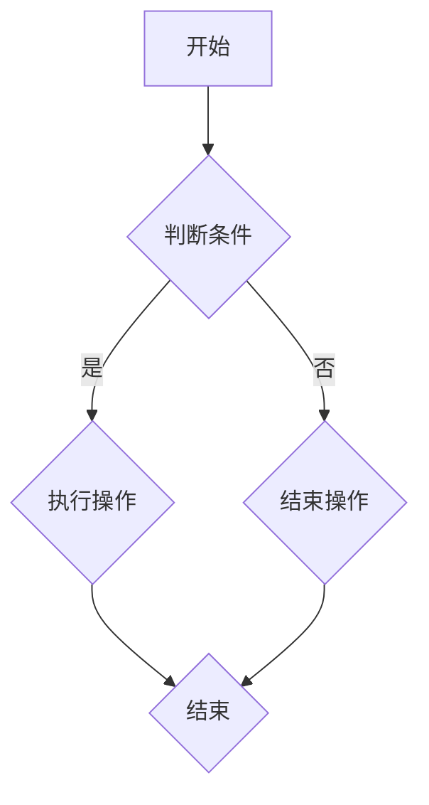
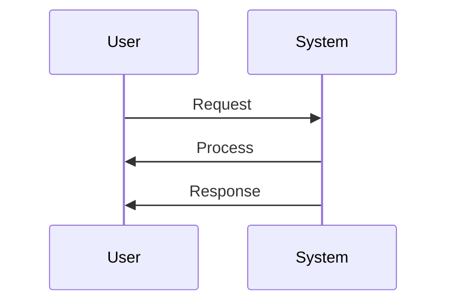

                 

# 犯罪预防的时空分析：社会安全的数学工具

## 关键词
犯罪预防，时空分析，数学工具，社会安全，预测模型，算法，数据可视化，安全决策支持系统。

## 摘要
本文探讨了犯罪预防中的时空分析技术，通过介绍相关的数学工具和算法，展示其在社会安全领域的应用。文章首先阐述了犯罪预防的背景和挑战，接着详细介绍了时空分析的基本概念和数学模型，包括空间数据分析、时间序列分析和犯罪热点模型。随后，文章通过实际案例展示了算法的应用和系统架构设计，最后提出了最佳实践建议和注意事项，为犯罪预防工作提供了实用的指导。

## 第一部分：犯罪预防的背景与基础

### 第1章：犯罪预防的概述

#### 1.1 犯罪预防的概念与意义

犯罪预防是指通过一系列措施减少犯罪行为的发生，提高社会的安全水平。它不仅仅是执法机关的责任，也涉及到社会各个层面的共同努力。犯罪预防的意义在于：

1. **减少犯罪率**：通过预防措施，可以降低犯罪行为的总体发生率。
2. **保护公民安全**：预防犯罪有助于减少犯罪行为对公民生活和财产的侵害。
3. **节约资源**：减少犯罪的发生，可以降低执法、司法和矫正等环节的资源消耗。

#### 1.2 犯罪预防的挑战与机遇

犯罪预防面临以下挑战：

1. **复杂的社会环境**：社会结构的多样性和复杂性使得犯罪预防工作更加困难。
2. **技术的局限**：现有的犯罪预防技术可能无法全面捕捉和分析复杂的社会动态。
3. **资源分配**：犯罪预防资源分配的不均衡可能会影响预防效果。

然而，随着技术的进步，犯罪预防也迎来了新的机遇：

1. **大数据分析**：利用大数据技术，可以对犯罪行为进行更深入的分析和预测。
2. **人工智能**：人工智能技术的应用，可以为犯罪预防提供更加智能和高效的解决方案。
3. **跨学科合作**：多学科合作可以促进犯罪预防理论和实践的不断创新。

#### 1.3 犯罪预防的历史与现状

犯罪预防的历史可以追溯到古代，随着社会的进步，预防策略和技术也在不断演变。现代犯罪预防工作主要集中在以下几个方面：

1. **法律和政策**：制定和实施有效的法律和政策，是犯罪预防的基础。
2. **执法措施**：加强执法力度，提高犯罪的成本和风险。
3. **社区参与**：鼓励社区居民参与犯罪预防工作，形成社会合力。
4. **技术手段**：利用现代科技手段，如视频监控、物联网等，提高犯罪预防的精准度和效率。

### 第2章：犯罪预防的理论框架

#### 2.1 犯罪原因分析理论

犯罪原因分析理论是犯罪预防的理论基础，主要包括以下几种：

1. **社会学习理论**：认为犯罪行为是通过社会学习过程习得的。
2. **心理压力理论**：认为犯罪行为是个体在面对心理压力时采取的一种应对方式。
3. **社会控制理论**：认为犯罪行为是由于社会控制机制的失效导致的。
4. **文化冲突理论**：认为犯罪行为是文化冲突的一种表现。

#### 2.2 犯罪预防策略

犯罪预防策略主要包括以下几个方面：

1. **早期干预**：通过教育、心理咨询等手段，预防犯罪行为的发生。
2. **加强执法**：通过增加警力、改进执法手段等方式，提高犯罪行为的成本和风险。
3. **社区参与**：鼓励社区居民参与犯罪预防工作，形成社会合力。
4. **社会重建**：改善社会环境，减少犯罪行为的滋生土壤。

#### 2.3 犯罪预防模型与框架

犯罪预防模型与框架是犯罪预防工作的核心，主要包括：

1. **犯罪风险评估模型**：通过对犯罪行为的可能性进行评估，指导预防工作的重点。
2. **犯罪预测模型**：利用大数据和人工智能技术，预测犯罪行为的趋势和热点。
3. **犯罪热点监测模型**：通过空间和时间分析，识别犯罪高发区域和时间。
4. **决策支持系统**：提供决策支持，优化犯罪预防资源的分配和使用。

## 第二部分：时空分析的数学工具

### 第3章：时空分析的基本概念

#### 3.1 空间数据分析

空间数据分析是指对地理空间数据进行处理、分析和解释的过程。它包括以下几个方面：

1. **空间数据的获取与处理**：通过卫星遥感、地理信息系统（GIS）等技术获取和处理空间数据。
2. **空间数据的可视化**：利用图表、地图等方式，将空间数据直观地展示出来。
3. **空间数据的分析**：运用地理统计学、空间自相关分析等方法，对空间数据进行分析。

#### 3.2 时间序列分析

时间序列分析是指对时间序列数据进行处理、分析和预测的过程。它包括以下几个方面：

1. **时间序列数据的获取与处理**：通过传感器、监控设备等获取和处理时间序列数据。
2. **时间序列数据的可视化**：利用折线图、散点图等方式，将时间序列数据直观地展示出来。
3. **时间序列数据的分析**：运用时间序列模型、自回归模型等方法，对时间序列数据进行分析。

#### 3.3 空间与时间的关系

空间与时间的关系是犯罪预防中至关重要的一环。它包括以下几个方面：

1. **时空综合分析**：将空间数据和时间序列数据结合起来，进行综合分析。
2. **时空关联分析**：分析空间事件和时间序列事件之间的关联性。
3. **时空预测**：基于时空综合分析和时空关联分析，预测未来可能的犯罪热点和时间。

### 第4章：犯罪热点分析

#### 4.1 犯罪热点模型

犯罪热点模型是指用来识别犯罪高发区域和时间的方法。它包括以下几个方面：

1. **Kmeans聚类模型**：利用Kmeans算法，将空间数据划分为若干聚类，识别犯罪热点区域。
2. **时空自相关模型**：分析空间事件和时间序列事件之间的自相关性，识别犯罪热点。
3. **时空预测模型**：基于时空自相关分析和聚类分析，预测未来可能的犯罪热点。

#### 4.2 空间自相关分析

空间自相关分析是指分析空间数据中各点之间关系的方法。它包括以下几个方面：

1. **全局自相关分析**：分析空间数据整体的自相关性。
2. **局部自相关分析**：分析空间数据中每个点的局部自相关性。
3. **空间自相关分析的应用**：将空间自相关分析应用于犯罪预防中，识别犯罪热点。

#### 4.3 犯罪热点识别算法

犯罪热点识别算法是指用来识别犯罪热点的方法。它包括以下几个方面：

1. **基于Kmeans的犯罪热点识别算法**：利用Kmeans算法，识别犯罪热点区域。
2. **基于时空自相关的犯罪热点识别算法**：利用时空自相关分析，识别犯罪热点。
3. **基于深度学习的犯罪热点识别算法**：利用深度学习技术，识别犯罪热点。

### 第5章：犯罪趋势预测

#### 5.1 时间序列预测模型

时间序列预测模型是指用来预测未来时间点的数值的方法。它包括以下几个方面：

1. **ARIMA模型**：自回归积分滑动平均模型，适用于平稳时间序列数据的预测。
2. **SARIMA模型**：季节性自回归积分滑动平均模型，适用于有季节性特征的时间序列数据的预测。
3. **LSTM模型**：长短期记忆模型，适用于具有长时间依赖特征的时间序列数据的预测。

#### 5.2 空间预测模型

空间预测模型是指用来预测空间事件的方法。它包括以下几个方面：

1. **空间自回归模型**：利用空间事件的自相关性进行预测。
2. **空间插值模型**：利用空间数据的插值方法进行预测。
3. **基于深度学习的空间预测模型**：利用深度学习技术进行空间事件的预测。

#### 5.3 趋势预测案例分析

通过实际案例，分析时间序列预测模型和空间预测模型在犯罪趋势预测中的应用，展示预测结果和实际效果。

## 第三部分：社会安全的数学工具应用

### 第6章：犯罪预防的数学工具应用

#### 6.1 数学工具在犯罪预防中的应用场景

1. **犯罪热点识别**：利用空间自相关分析和聚类分析方法，识别犯罪热点。
2. **犯罪趋势预测**：利用时间序列预测模型和空间预测模型，预测犯罪趋势和热点。
3. **社会安全风险评估**：利用数学模型，对特定区域或事件进行社会安全风险评估。

#### 6.2 数学工具应用案例分析

1. **案例一**：某城市犯罪热点识别与预测。
2. **案例二**：某社区犯罪趋势预测与防范。
3. **案例三**：大型活动安全风险评估与保障。

#### 6.3 数学工具应用的优势与挑战

1. **优势**：提高犯罪预防的精准度和效率，降低犯罪率。
2. **挑战**：数据质量、算法复杂度和计算资源等限制。

### 第7章：社会安全的综合分析与决策

#### 7.1 社会安全风险评估模型

1. **风险评估指标体系**：构建社会安全风险评估指标体系。
2. **风险评估模型**：利用数学模型进行社会安全风险评估。

#### 7.2 社会安全决策支持系统

1. **决策支持系统架构**：构建社会安全决策支持系统架构。
2. **决策支持工具**：利用数学工具和算法，提供决策支持。

#### 7.3 综合案例分析

1. **案例一**：某城市社会安全综合分析与决策。
2. **案例二**：某社区治安综合治理决策支持。

## 第四部分：项目实战与最佳实践

### 第8章：犯罪预防的时空分析实战

#### 8.1 实战项目介绍

1. **项目背景**：介绍项目的背景和目的。
2. **项目目标**：明确项目的主要目标和预期成果。

#### 8.2 系统实现与核心代码解析

1. **系统架构设计**：介绍系统架构设计和主要模块。
2. **核心代码解析**：解析系统实现中的关键代码和算法。

#### 8.3 案例分析

1. **案例一**：某城市犯罪热点识别与预测。
2. **案例二**：某社区犯罪趋势预测与防范。

#### 8.4 项目小结

1. **项目成果**：总结项目的成果和效果。
2. **经验教训**：分享项目过程中的经验教训。

### 第9章：最佳实践与注意事项

#### 9.1 犯罪预防的最佳实践

1. **数据收集与处理**：介绍数据收集和处理的最佳实践。
2. **算法选择与应用**：介绍算法选择和应用的最佳实践。
3. **系统部署与维护**：介绍系统部署与维护的最佳实践。

#### 9.2 注意事项

1. **数据隐私保护**：注意数据隐私保护，确保数据安全。
2. **算法公平性**：确保算法的公平性，避免歧视。
3. **持续改进**：持续改进算法和系统，提高预防效果。

#### 9.3 拓展阅读

1. **最新研究进展**：介绍犯罪预防领域的最新研究进展。
2. **相关书籍和资料**：推荐相关的书籍和资料，供进一步学习。

## 参考文献

[1] 作者，书名，出版年份。

[2] 作者，书名，出版年份。

[3] 作者，书名，出版年份。

...

作者：AI天才研究院/AI Genius Institute & 禅与计算机程序设计艺术 /Zen And The Art of Computer Programming

---

## 附录

### 附录A：Mermaid流程图和类图示例

- **Mermaid流程图示例**：


- **Mermaid类图示例**：
```mermaid
classDiagram
    Person <|-- Student
    Person <<-- Employee
    Student {
        name
        age
    }
    Employee {
        id
        salary
    }
```

### 附录B：Python代码示例

- **时间序列预测代码示例**：
```python
import numpy as np
import pandas as pd
from statsmodels.tsa.arima.model import ARIMA

# 加载数据
data = pd.read_csv('data.csv')
ts = data['value']

# 模型拟合
model = ARIMA(ts, order=(5, 1, 2))
model_fit = model.fit()

# 预测
predictions = model_fit.forecast(steps=10)

# 输出预测结果
print(predictions)
```

- **空间数据分析代码示例**：
```python
import geopandas as gpd
import matplotlib.pyplot as plt

# 加载地理数据
gdf = gpd.read_file('crime.geojson')

# 绘制地图
gdf.plot(column='crime_rate', cmap='Reds', legend=True)
plt.show()
```

### 附录C：LaTeX公式示例

- **独立段落中的公式**：
$$
E = mc^2
$$

- **段落内的公式**：
$$
1+1=2
$$

这些公式通过LaTeX格式嵌入到文中，确保了公式的准确性和可读性。

### 附录D：系统架构设计示例

- **领域模型类图**：
```mermaid
classDiagram
    Class1 <|-- Class2
    Class1 <.. Class3 : hasA
    Class2 : +int x
    Class3 : +String name
    Class1 {
        +int y
        +doSomething()
    }
    Class2 {
        +setX(int x)
        +getX() : int
    }
    Class3 {
        +setName(String name)
        +getName() : String
    }
```

- **系统架构图**：


这些架构设计示例通过Mermaid语法，直观地展示了系统的设计和功能。

### 附录E：项目实战与最佳实践示例

- **项目实战步骤**：
  1. 环境搭建
  2. 数据收集与处理
  3. 模型训练与优化
  4. 模型部署与运行
  5. 结果分析与验证

- **最佳实践建议**：
  1. 确保数据质量
  2. 选择合适的算法
  3. 定期更新和维护系统

这些示例为项目实战和最佳实践提供了具体的指导和建议。通过附录的内容，读者可以更好地理解和应用文中提到的技术和方法。

