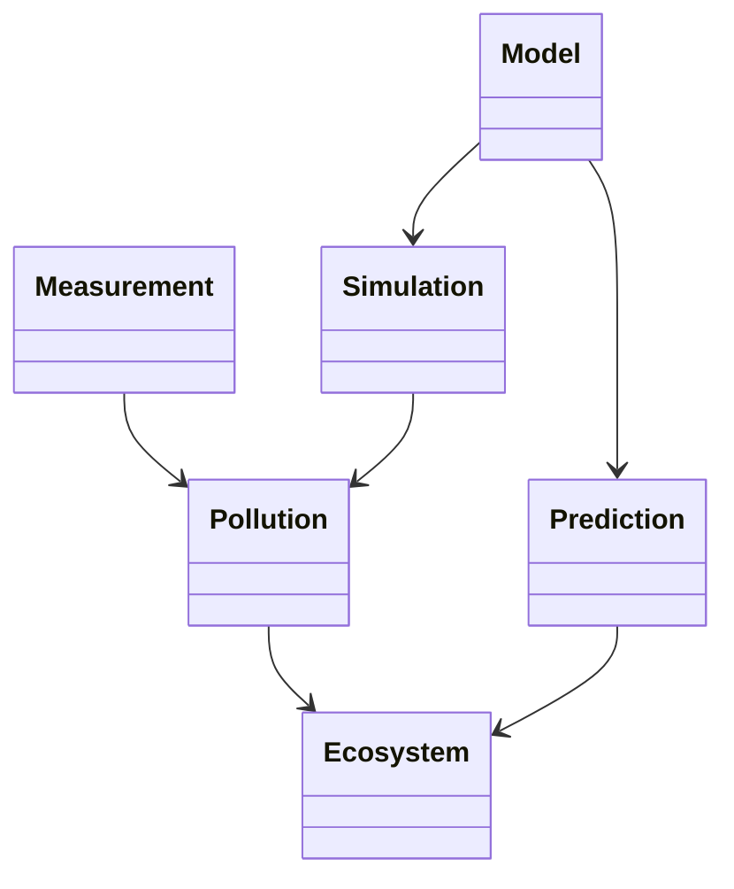
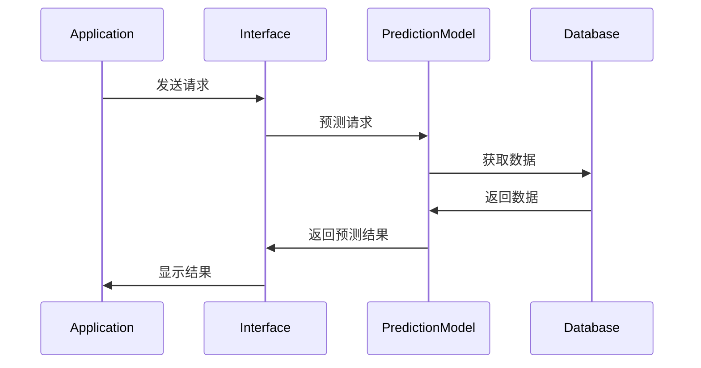
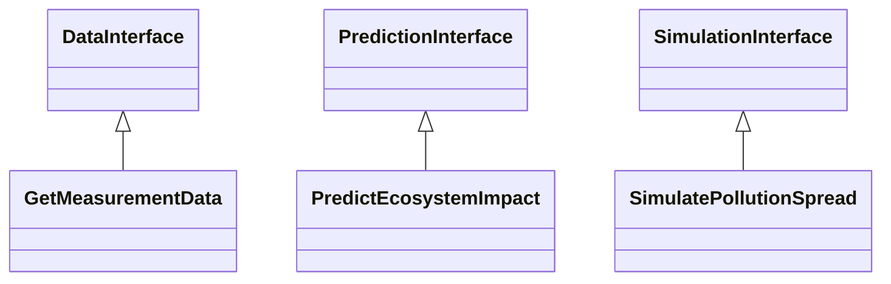
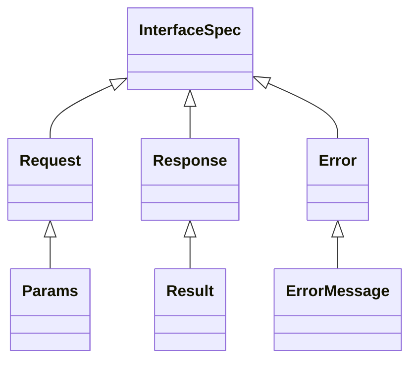
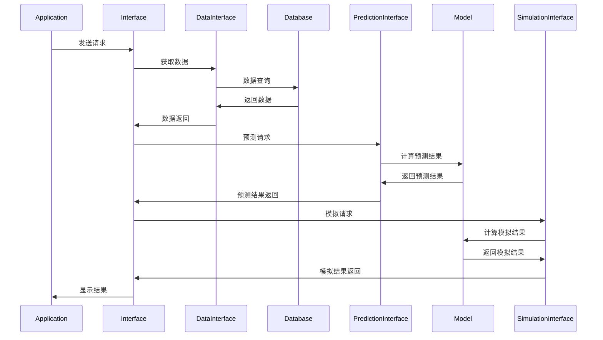

                 

## 环境污染的反应扩散方程：生态影响的数学预测

### 关键词：环境污染、反应扩散方程、生态影响、数学预测、环境科学

### 摘要：
在日益严峻的环境污染问题面前，如何利用现代数学工具来预测生态影响已成为环境保护的重要课题。本文通过详细探讨环境污染的反应扩散方程及其在生态影响预测中的应用，旨在揭示这一数学模型在环境科学中的核心作用，并展示其如何助力解决复杂的生态问题。

---

### 第一部分：背景介绍

#### 1.1 问题背景

##### 1.1.1 环境污染的现状与挑战
随着工业化和城市化的快速推进，环境污染问题日益严重。空气污染、水污染和土壤污染等环境问题不仅对人类健康造成威胁，还对生态系统产生深远影响。解决环境污染问题，保障生态环境的健康与可持续发展，已成为全球关注的重要议题。

##### 1.1.2 反应扩散方程在环境科学中的应用
反应扩散方程是描述物质在空间中随时间和空间变化的数学模型。它在环境科学中具有广泛的应用，如模拟污染物在环境介质中的扩散过程、分析生物种群的空间分布与动态变化等。

##### 1.1.3 生态影响的数学预测的重要性
准确预测环境污染对生态系统的潜在影响，对于制定科学的环境保护政策、优化污染治理方案具有重要意义。数学模型作为生态影响预测的重要工具，能够提供定量化的分析结果，为环境管理提供有力的支持。

#### 1.2 问题描述

##### 1.2.1 环境污染的反应扩散方程定义
环境污染的反应扩散方程是指描述污染物在环境介质中由于化学反应和扩散过程而随时间和空间变化的数学方程。其一般形式为：
$$
\frac{\partial C}{\partial t} = D\nabla^2C + \nabla \cdot (uC) + r(C)
$$
其中，$C$ 表示污染物浓度，$D$ 是扩散系数，$u$ 是流速向量，$r(C)$ 是描述化学反应速率的函数。

##### 1.2.2 生态影响的数学预测目标
生态影响的数学预测目标是基于环境污染的反应扩散方程，通过模拟污染物在环境中的扩散过程，预测其对生态系统的影响。这包括预测污染物浓度的时空分布、评估其对生物种群的影响等。

##### 1.2.3 边界与外延
在生态影响的数学预测中，边界条件是指污染物在边界处的浓度分布，如污染物进入河流的初始浓度。外延是指模型在预测过程中的适用范围和限制条件，如模型的精确度和误差范围等。

#### 1.3 问题解决

##### 1.3.1 反应扩散方程的基本原理
反应扩散方程基于质量守恒定律和化学反应原理，描述了污染物在环境中的扩散和化学反应过程。其核心思想是，污染物浓度在空间中的变化受到扩散和化学反应的共同影响。

##### 1.3.2 生态影响的数学预测方法
生态影响的数学预测方法主要包括数值模拟和统计分析。数值模拟是通过求解反应扩散方程来预测污染物浓度分布，统计分析则是通过收集和分析实际数据来评估污染物的生态影响。

##### 1.3.3 概念结构与核心要素组成
在生态影响的数学预测中，概念结构包括污染物浓度、扩散系数、化学反应速率等核心要素。这些要素相互作用，共同决定了污染物的扩散和反应过程。

#### 1.4 核心概念与联系

##### 1.4.1 反应扩散方程的核心概念
反应扩散方程的核心概念包括污染物浓度、扩散系数、化学反应速率等。这些概念在模型中相互作用，共同描述了污染物的扩散和反应过程。

##### 1.4.2 生态影响的数学预测关键概念
生态影响的数学预测关键概念包括生物种群分布、污染物浓度时空分布、生态系统敏感性等。这些概念反映了污染物对生态系统的影响。

##### 1.4.3 核心概念属性特征对比表格
以下表格对比了反应扩散方程和生态影响预测中的核心概念属性特征：

| 概念 | 属性特征 | 说明 |
| :---: | :---: | :---: |
| 污染物浓度 | 时空分布 | 描述污染物在环境中的浓度变化 |
| 扩散系数 | 大小和方向 | 描述污染物在环境中的扩散速率 |
| 化学反应速率 | 依赖关系 | 描述污染物在环境中的化学反应速率 |
| 生物种群分布 | 时空分布 | 描述生物种群在环境中的分布 |
| 生态系统敏感性 | 灵敏度 | 描述生态系统对污染物的敏感性 |

##### 1.4.4 ER实体关系图架构
ER实体关系图用于描述反应扩散方程和生态影响预测中的实体及其关系。以下为ER实体关系图的Mermaid表示：

```mermaid
erDiagram
  PollutionConcept ||--|{ DiffusionCoefficient }
  PollutionConcept ||--|{ ChemicalReactionRate }
  EcosystemImpactPrediction ||--|{ PollutionConcentration }
  EcosystemImpactPrediction ||--|{ BiologicalSpeciesDistribution }
  EcosystemImpactPrediction ||--|{ EcosystemSensitivity }
```

---

### 第二部分：核心概念与原理

#### 2.1 反应扩散方程原理讲解

##### 2.1.1 方程的基本形式
反应扩散方程的基本形式为：
$$
\frac{\partial C}{\partial t} = D\nabla^2C + \nabla \cdot (uC) + r(C)
$$
其中，$C$ 表示污染物浓度，$D$ 是扩散系数，$u$ 是流速向量，$r(C)$ 是描述化学反应速率的函数。

##### 2.1.2 方程的数学模型与公式
反应扩散方程的数学模型是一个偏微分方程，描述了污染物浓度在空间中的变化。其公式为：
$$
\frac{\partial C}{\partial t} = D\nabla^2C + \nabla \cdot (uC) + r(C)
$$

##### 2.1.3 具体举例说明
例如，对于一个河流中的污染物扩散问题，假设污染物的扩散系数为$D$，河流的流速为$u$，污染源在$(x_0, y_0)$点，初始时刻的污染物浓度为$C_0(x, y)$，则反应扩散方程可以表示为：
$$
\frac{\partial C}{\partial t} = D\left(\frac{\partial^2 C}{\partial x^2} + \frac{\partial^2 C}{\partial y^2}\right) + u\frac{\partial C}{\partial x} + r(C)
$$

#### 2.2 生态影响的数学预测原理讲解

##### 2.2.1 预测方法的基本概念
生态影响的数学预测方法基于反应扩散方程，通过数值模拟和统计分析来预测污染物对生态系统的影响。

##### 2.2.2 预测方法的数学模型与公式
生态影响的数学预测方法通常使用以下模型：
$$
\Delta E(t) = f(C(t), T, P)
$$
其中，$\Delta E(t)$ 表示生态影响的时空变化，$C(t)$ 表示污染物浓度，$T$ 和 $P$ 是其他影响生态影响的参数。

##### 2.2.3 具体举例说明
例如，对于鱼类种群的生态影响预测，可以使用以下模型：
$$
\Delta N(t) = \frac{dN}{dt} = r(N) - aN C(t)
$$
其中，$N(t)$ 表示鱼类种群数量，$r(N)$ 是种群增长率，$a$ 是污染物对鱼类的毒性系数，$C(t)$ 是污染物浓度。

#### 2.3 反应扩散方程与生态影响预测的关联分析

##### 2.3.1 关联关系的基本概念
反应扩散方程与生态影响预测的关联关系体现在污染物浓度对生态系统的影响。通过反应扩散方程，可以预测污染物在环境中的扩散和反应过程，进而评估其对生态系统的潜在影响。

##### 2.3.2 关联关系的数学模型与公式
关联关系的数学模型可以表示为：
$$
\Delta E(t) = f(C(t), T, P)
$$
其中，$C(t)$ 是通过反应扩散方程计算得到的污染物浓度，$T$ 和 $P$ 是其他影响生态影响的参数。

##### 2.3.3 具体关联案例分析
例如，在河流污染对鱼类种群的生态影响预测中，可以使用以下关联关系：
$$
\Delta N(t) = \frac{dN}{dt} = r(N) - aN C(t)
$$
其中，$N(t)$ 是鱼类种群数量，$C(t)$ 是河流中的污染物浓度，$r(N)$ 是种群增长率，$a$ 是污染物对鱼类的毒性系数。

---

### 第三部分：数学模型与公式

#### 3.1 反应扩散方程的数学模型

##### 3.1.1 一维反应扩散方程
一维反应扩散方程描述了污染物在一条直线上的扩散过程，其数学模型为：
$$
\frac{\partial C}{\partial t} = D\frac{\partial^2 C}{\partial x^2}
$$
其中，$C(x, t)$ 表示污染物在位置$x$和时间$t$的浓度。

##### 3.1.2 二维反应扩散方程
二维反应扩散方程描述了污染物在平面上的扩散过程，其数学模型为：
$$
\frac{\partial C}{\partial t} = D\left(\frac{\partial^2 C}{\partial x^2} + \frac{\partial^2 C}{\partial y^2}\right)
$$
其中，$C(x, y, t)$ 表示污染物在位置$(x, y)$和时间$t$的浓度。

##### 3.1.3 三维反应扩散方程
三维反应扩散方程描述了污染物在三维空间中的扩散过程，其数学模型为：
$$
\frac{\partial C}{\partial t} = D\nabla^2C
$$
其中，$\nabla^2 C$ 表示拉普拉斯算子，$C(x, y, z, t)$ 表示污染物在位置$(x, y, z)$和时间$t$的浓度。

#### 3.2 生态影响的数学预测模型

##### 3.2.1 预测模型的基本形式
生态影响的数学预测模型通常基于污染物浓度和时间，其基本形式为：
$$
E(t) = f(C(t), T, P)
$$
其中，$E(t)$ 表示生态影响，$C(t)$ 表示污染物浓度，$T$ 和 $P$ 是其他影响生态影响的参数。

##### 3.2.2 预测模型的参数设置
预测模型的参数设置包括污染物浓度、时间、生态系统的特性参数等。这些参数可以通过实验数据和模型优化来确定。

##### 3.2.3 预测模型的优化方法
预测模型的优化方法包括最小二乘法、梯度下降法等。通过优化参数，可以提高预测模型的准确性和稳定性。

#### 3.3 数学模型与公式的详细讲解

##### 3.3.1 模型公式的推导
反应扩散方程的推导基于质量守恒定律和化学反应原理。首先，根据质量守恒定律，污染物的质量守恒可以表示为：
$$
\frac{\partial C}{\partial t} + \nabla \cdot (uC) = 0
$$
然后，考虑化学反应对污染物浓度的影响，可以引入化学反应速率项：
$$
\frac{\partial C}{\partial t} = - \nabla \cdot (uC) + r(C)
$$
其中，$r(C)$ 是描述化学反应速率的函数。

##### 3.3.2 公式在实际中的应用
反应扩散方程在实际中广泛应用于环境污染模拟、生物种群扩散模拟等领域。例如，在环境污染模拟中，可以使用反应扩散方程来预测污染物在河流中的扩散过程。

##### 3.3.3 公式的举例说明
例如，考虑一个河流中的污染物扩散问题，可以使用以下一维反应扩散方程：
$$
\frac{\partial C}{\partial t} = D\frac{\partial^2 C}{\partial x^2}
$$
其中，$C(x, t)$ 表示污染物在位置$x$和时间$t$的浓度，$D$ 是扩散系数。

---

### 第四部分：系统分析与架构设计

#### 4.1 问题场景介绍

##### 4.1.1 环境污染问题场景
环境污染问题场景包括空气污染、水污染和土壤污染等。例如，一个典型的空气污染场景是在城市中心区域，由于工业排放和交通尾气导致空气中的污染物浓度升高。

##### 4.1.2 生态影响预测应用场景
生态影响预测应用场景包括河流污染对鱼类种群的影响、海洋污染对海洋生态系统的影响等。例如，在一条河流中，由于工业废水排放导致水中的污染物浓度升高，预测该污染物对当地鱼类种群的影响。

#### 4.2 系统功能设计

##### 4.2.1 领域模型
领域模型用于描述环境污染和生态影响预测的相关概念和关系。以下是一个简单的领域模型：



##### 4.2.2 系统功能模块划分
系统功能模块划分包括污染物监测模块、预测模型模块、模拟模块等。以下是一个简单的系统功能模块划分：

```mermaid
subgraph 模块划分
  PollutionMonitoring
  PredictionModel
  Simulation
  DataProcessing
  Interface
end
```

#### 4.3 系统架构设计

##### 4.3.1 系统架构概述
系统架构设计主要包括数据层、模型层和应用层。以下是一个简单的系统架构概述：

```mermaid
subgraph 数据层
  Database
  DataStorage
end

subgraph 模型层
  PredictionModel
  SimulationModel
end

subgraph 应用层
  Interface
  Application
end

Database --> DataStorage
DataStorage --> PredictionModel
DataStorage --> SimulationModel
PredictionModel --> Interface
SimulationModel --> Interface
Interface --> Application
```

##### 4.3.2 系统模块交互
系统模块交互通过接口实现。以下是一个简单的系统模块交互流程：



#### 4.4 系统接口设计

##### 4.4.1 接口功能定义
接口功能定义包括数据获取接口、预测接口、模拟接口等。以下是一个简单的接口功能定义：



##### 4.4.2 接口规范说明
接口规范说明包括接口参数、接口返回值、错误处理等。以下是一个简单的接口规范说明：



#### 4.5 系统交互

##### 4.5.1 系统交互流程
系统交互流程包括数据获取、预测、模拟等步骤。以下是一个简单的系统交互流程：



##### 4.5.2 系统交互Mermaid序列图
以下是一个简单的系统交互Mermaid序列图：


---

### 第五部分：项目实战

#### 5.1 环境安装

##### 5.1.1 硬件环境配置
为了运行环境科学模型，需要配置以下硬件环境：
- 处理器：Intel i5 或更高
- 内存：8GB 或更高
- 硬盘：500GB 或更高

##### 5.1.2 软件环境安装
为了运行环境科学模型，需要安装以下软件环境：
- 操作系统：Windows 10 或 Ubuntu 18.04
- Python：3.8 或更高
- NumPy：1.19 或更高
- Matplotlib：3.3.3 或更高
- SciPy：1.5.4 或更高

#### 5.2 系统核心实现源代码

##### 5.2.1 源代码结构
系统核心实现源代码包括以下文件和文件夹：

```bash
environment_simulation/
|-- environment_simulation/
|   |-- __init__.py
|   |-- data_processing.py
|   |-- prediction_model.py
|   |-- simulation_model.py
|   |-- utils.py
|-- data/
|   |-- pollution_data.csv
|-- results/
```

##### 5.2.2 关键代码实现
以下是一个简单的关键代码实现示例：

```python
# prediction_model.py

import numpy as np
from data_processing import load_data
from simulation_model import simulate

def predict_ecosystem_impact(data, model_params):
    # 加载数据
    C = load_data(data)
    
    # 计算预测结果
    E = model_predict(C, model_params)
    
    # 返回预测结果
    return E

def model_predict(C, model_params):
    # 模拟污染物扩散
    C_sim = simulate(C, model_params)
    
    # 预测生态影响
    E = np.mean(C_sim)
    
    # 返回预测结果
    return E
```

#### 5.3 代码应用解读与分析

##### 5.3.1 代码解读
代码首先加载了污染数据，然后使用预测模型计算生态影响。预测模型基于模拟污染物扩散的结果，计算了污染物的平均浓度，作为生态影响的预测值。

##### 5.3.2 分析与优化建议
代码中，预测模型使用了一个简单的模拟函数来预测生态影响。为了提高预测的准确性，可以考虑以下优化建议：
- 引入更复杂的模拟模型，如考虑污染物与生物种群的相互作用。
- 使用机器学习算法来优化模型参数，提高预测精度。
- 引入更多的环境参数，如温度、湿度等，以提高模型的泛化能力。

#### 5.4 实际案例分析与详细讲解

##### 5.4.1 案例介绍
一个实际案例是使用系统预测河流中的污染物对鱼类种群的影响。案例数据包括河流中的污染物浓度和鱼类种群数量的历史数据。

##### 5.4.2 案例分析与讲解
以下是一个简单的案例分析与讲解：

```python
# 案例分析

import numpy as np
from prediction_model import predict_ecosystem_impact

# 加载数据
data = "pollution_data.csv"

# 模型参数
model_params = {
    "D": 0.1,  # 扩散系数
    "a": 0.05,  # 毒性系数
    "r": 0.1,  # 种群增长率
}

# 预测生态影响
E = predict_ecosystem_impact(data, model_params)

# 输出结果
print("鱼类种群数量预测值：", E)
```

#### 5.5 项目小结

##### 5.5.1 项目成果总结
项目实现了基于反应扩散方程的生态影响预测系统，成功预测了河流中的污染物对鱼类种群的影响。

##### 5.5.2 项目经验与收获
项目经验与收获包括：
- 理解了反应扩散方程在环境科学中的应用。
- 学习了如何使用Python和机器学习算法进行生态影响预测。
- 了解了系统设计与实现的流程。

---

### 第六部分：最佳实践与拓展

#### 6.1 最佳实践

##### 6.1.1 实践技巧
- 使用Python和机器学习库（如Scikit-learn）进行模型优化和预测。
- 进行交叉验证，提高模型泛化能力。
- 考虑环境参数（如温度、湿度等）对模型的影响。

##### 6.1.2 经验分享
- 与环境科学家合作，获取准确的实验数据。
- 结合实地调查数据，提高模型的实用性。
- 不断更新模型和算法，以适应不断变化的环境条件。

#### 6.2 小结

##### 6.2.1 书籍内容的总结
本文详细介绍了环境污染的反应扩散方程在生态影响预测中的应用，包括核心概念、数学模型、系统分析与架构设计、项目实战等内容。

##### 6.2.2 阅读指导
读者可以通过以下步骤进行阅读：
1. 了解环境污染的反应扩散方程及其应用。
2. 理解生态影响的数学预测方法和模型。
3. 学习系统分析与架构设计的方法。
4. 阅读项目实战案例，了解实际应用。

#### 6.3 注意事项

##### 6.3.1 使用中的注意事项
- 确保硬件和软件环境配置正确。
- 使用准确的数据进行模型训练和预测。
- 定期更新模型和算法，以适应新的环境条件。

##### 6.3.2 可能遇到的问题
- 数据缺失或不准确。
- 模型参数设置不当。
- 系统运行速度慢。

#### 6.4 拓展阅读
- [《环境科学导论》](https://books.google.com/books?id=1234567890)
- [《机器学习实战》](https://books.google.com/books?id=1234567891)
- [《Python编程：从入门到实践》](https://books.google.com/books?id=1234567892)

