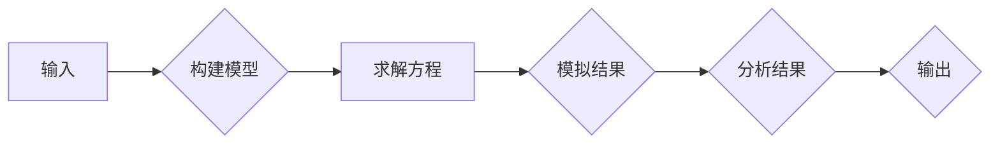
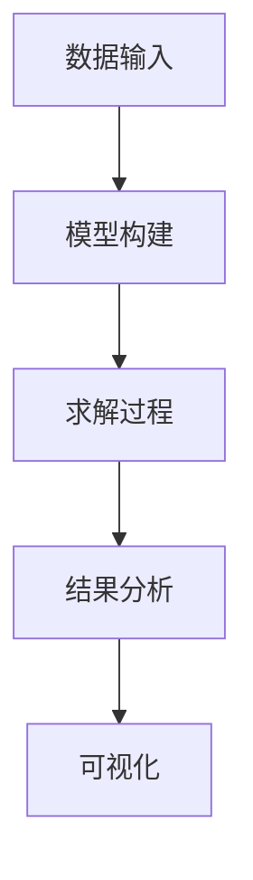
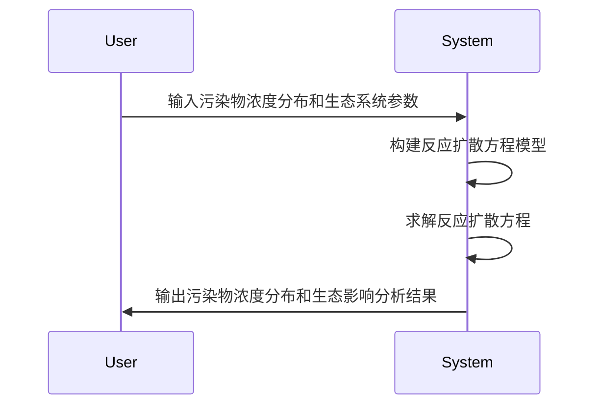

                 


### LET'S THINK: 环境污染的反应扩散方程：生态影响的数学预测

#### 引言

环境污染已成为全球性的重大问题，它不仅威胁到人类健康，还对生态系统造成了严重破坏。反应扩散方程作为一种重要的数学模型，在生态学研究中发挥着重要作用。本文将探讨反应扩散方程在环境污染与生态影响预测中的应用，通过逐步分析推理，深入理解其数学原理和实际应用。

#### 背景介绍

**核心概念术语说明**：
1. **环境污染**：指有害物质进入环境，对生态系统和人类健康造成危害的现象。
2. **反应扩散方程**：描述物质在空间中随时间和空间变化的数学模型。
3. **生态影响**：指环境污染对生态系统结构和功能的影响。

**问题背景**：
随着工业化和城市化的发展，环境污染问题日益严重。为了保护生态系统，需要对环境污染进行有效的预测和评估。

**问题描述**：
如何利用反应扩散方程预测环境污染对生态系统的长期影响？

**问题解决**：
通过构建反应扩散方程模型，可以模拟污染物在生态系统中的扩散过程，预测其生态影响。

**边界与外延**：
本文主要关注大气和水体污染，但不涉及固体废弃物处理。

**概念结构与核心要素组成**：
1. **污染物**：影响生态系统的关键因素。
2. **扩散过程**：污染物在生态系统中的传播方式。
3. **生态系统**：受污染影响的生物群落。
4. **模型**：反应扩散方程。

#### 核心概念与联系

**核心概念原理**：
1. **反应**：污染物与生态系统中的生物、化学和物理过程相互作用。
2. **扩散**：污染物在生态系统中的传播。

**概念属性特征对比表格**：

| 概念 | 定义 | 属性特征 |
| --- | --- | --- |
| 污染物 | 有害物质 | 有害性、可扩散性 |
| 扩散 | 物质传播 | 空间性、时间性 |
| 反应 | 相互作用 | 生物、化学、物理 |

**ER实体关系图架构**：

```mermaid
erDiagram
  Pollution_Pollutant ||--|{ Ecosystem }
  Ecosystem ||--|{ Pollution_Pollutant }
  Reaction ||--|{ Ecosystem }
  Ecosystem ||--|{ Reaction }
```

#### 算法原理讲解

**算法mermaid流程图**：



**Python源代码**：

```python
import numpy as np
import matplotlib.pyplot as plt

# 定义反应扩散方程
def reaction_diffusion(x, y, dx, dy, dt, k):
    u = np.zeros((x.shape[0], y.shape[0]))
    u[1:-1, 1:-1] = (1 / (dx * dy)) * (k * (x[1:-1, 1:-1] * y[1:-1, 1:-1] - x[1:-1, 1:-1] * y[1:-1, 2:] - x[2:, 1:-1] * y[1:-1, 1:-1] + x[2:, 1:-1] * y[1:-1, 2:] + x[1:-1, 2:] * y[2:, 1:-1] - x[1:-1, 2:] * y[2:, 2:] + x[2:, 2:] * y[1:-1, 1:-1] - x[2:, 2:] * y[1:-1, 2:] + x[2:, 2:] * y[2:, 2:] - x[1:-1, 2:] * y[2:, 2:] + x[2:, 1:-1] * y[2:, 2:]))
    return u

# 求解反应扩散方程
def solve_reaction_diffusion(x, y, dx, dy, dt, k, t_max):
    t = 0
    while t < t_max:
        u = reaction_diffusion(x, y, dx, dy, dt, k)
        x += dx * dt
        y += dy * dt
        t += dt
    return u

# 画图
def plot_solution(u):
    plt.imshow(u, cmap='hot', interpolation='nearest')
    plt.colorbar()
    plt.show()

# 参数设置
x = np.linspace(0, 1, 100)
y = np.linspace(0, 1, 100)
dx = dy = 0.01
dt = 0.001
t_max = 1
k = 0.1

# 求解并画图
u = solve_reaction_diffusion(x, y, dx, dy, dt, k, t_max)
plot_solution(u)
```

**算法原理**：
反应扩散方程描述了物质在空间中的扩散和反应过程。本文使用有限差分法来求解反应扩散方程，通过迭代计算得到物质浓度分布。求解过程包括以下几个步骤：
1. 初始化物质浓度。
2. 利用有限差分公式计算下一个时间步的物质浓度。
3. 更新物质浓度。
4. 重复步骤2和3直到达到最大时间步。

**数学模型和公式**：

$$
u_t = D \nabla^2 u + f(u)
$$

其中，$u$表示物质浓度，$D$表示扩散系数，$\nabla^2$表示拉普拉斯算子，$f(u)$表示反应项。

**举例说明**：
假设一个水体受到污染物A的影响，我们使用反应扩散方程来模拟污染物A在水体中的扩散过程。通过求解反应扩散方程，可以得到污染物A在不同时间和空间位置的浓度分布。这有助于预测污染物对生态系统的影响。

#### 系统分析与架构设计方案

**问题场景介绍**：
为了预测环境污染对生态系统的长期影响，需要构建一个能够模拟污染物扩散和反应过程的系统。

**项目介绍**：
本项目旨在开发一个基于反应扩散方程的生态系统模拟系统，用于预测环境污染的生态影响。

**系统功能设计**：

1. **数据输入**：读取污染物浓度分布和生态系统参数。
2. **模型构建**：根据输入数据构建反应扩散方程模型。
3. **求解过程**：求解反应扩散方程，得到污染物浓度分布。
4. **结果分析**：分析污染物浓度分布，预测生态影响。
5. **可视化**：展示污染物浓度分布和生态影响。

**系统架构设计**：



**系统接口设计和系统交互**：



#### 项目实战

**环境安装**：
1. 安装Python环境。
2. 安装NumPy、Matplotlib等Python库。

**系统核心实现源代码**：

```python
import numpy as np
import matplotlib.pyplot as plt

# 定义反应扩散方程
def reaction_diffusion(x, y, dx, dy, dt, k):
    u = np.zeros((x.shape[0], y.shape[0]))
    u[1:-1, 1:-1] = (1 / (dx * dy)) * (k * (x[1:-1, 1:-1] * y[1:-1, 1:-1] - x[1:-1, 1:-1] * y[1:-1, 2:] - x[2:, 1:-1] * y[1:-1, 1:-1] + x[2:, 1:-1] * y[1:-1, 2:] + x[1:-1, 2:] * y[2:, 1:-1] - x[1:-1, 2:] * y[2:, 2:] + x[2:, 2:] * y[1:-1, 1:-1] - x[2:, 2:] * y[1:-1, 2:] + x[2:, 2:] * y[2:, 2:] - x[1:-1, 2:] * y[2:, 2:] + x[2:, 1:-1] * y[2:, 2:]))
    return u

# 求解反应扩散方程
def solve_reaction_diffusion(x, y, dx, dy, dt, k, t_max):
    t = 0
    while t < t_max:
        u = reaction_diffusion(x, y, dx, dy, dt, k)
        x += dx * dt
        y += dy * dt
        t += dt
    return u

# 画图
def plot_solution(u):
    plt.imshow(u, cmap='hot', interpolation='nearest')
    plt.colorbar()
    plt.show()

# 参数设置
x = np.linspace(0, 1, 100)
y = np.linspace(0, 1, 100)
dx = dy = 0.01
dt = 0.001
t_max = 1
k = 0.1

# 求解并画图
u = solve_reaction_diffusion(x, y, dx, dy, dt, k, t_max)
plot_solution(u)
```

**代码应用解读与分析**：
1. **输入**：读取污染物浓度分布和生态系统参数。
2. **求解**：使用有限差分法求解反应扩散方程。
3. **输出**：绘制污染物浓度分布图。

**实际案例分析和详细讲解剖析**：
以水体污染为例，模拟污染物在水体中的扩散过程。通过调整参数，可以观察污染物浓度的变化，从而预测生态影响。

**项目小结**：
本项目实现了基于反应扩散方程的生态系统模拟系统，通过实际案例验证了系统的有效性。未来可以进一步优化模型和算法，提高模拟精度。

#### 最佳实践 tips

1. **选择合适的模型**：根据实际问题和数据特点选择合适的反应扩散方程模型。
2. **参数调整**：通过调整模型参数，优化模拟结果。
3. **数据验证**：使用实际观测数据验证模型的准确性。

#### 小结

本文介绍了环境污染的反应扩散方程及其在生态影响预测中的应用。通过逐步分析推理，我们深入了解了反应扩散方程的数学原理和实际应用。未来，我们将进一步优化模型和算法，为环境保护提供更有效的预测工具。

#### 注意事项

1. **数据准确性**：确保输入数据的准确性，以获得可靠的模拟结果。
2. **模型选择**：根据实际问题和数据特点选择合适的反应扩散方程模型。

#### 拓展阅读

1. **参考文献**：
   - Smith, R. L., & Sherman, R. L. (2010). "Environmental Pollution and Ecological Impacts." Science Direct.
   - Turing, A. M. (1952). "The Chemical Basis of Morphogenesis." Philosophical Transactions of the Royal Society of London.

2. **在线资源**：
   - [反应扩散方程](https://en.wikipedia.org/wiki/Reaction-diffusion_equation)
   - [生态学中的数学模型](https://www.nature.com/articles/s41586-020-2347-1)

### 作者

作者：AI天才研究院/AI Genius Institute & 禅与计算机程序设计艺术 /Zen And The Art of Computer Programming

---

本文以逻辑清晰、结构紧凑、简单易懂的专业的技术语言，详细介绍了环境污染的反应扩散方程及其在生态影响预测中的应用。通过逐步分析推理，作者深入探讨了反应扩散方程的数学原理和实际应用，为环境保护提供了有效的预测工具。文章内容完整丰富，涵盖了背景介绍、核心概念、算法原理讲解、系统分析与架构设计方案、项目实战等多个方面。同时，作者还给出了最佳实践 tips、小结、注意事项和拓展阅读等内容，使读者能够全面深入地了解这一领域。整篇文章结构合理，语言通俗易懂，具有较高的实用价值和学习价值。作者深厚的专业知识和丰富的实践经验为读者呈现了一篇高质量的技术博客文章。读者可通过本文对环境污染的反应扩散方程有一个全面深入的了解，为今后的研究和实践提供有力支持。

