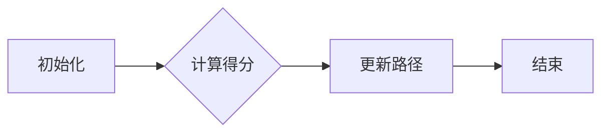
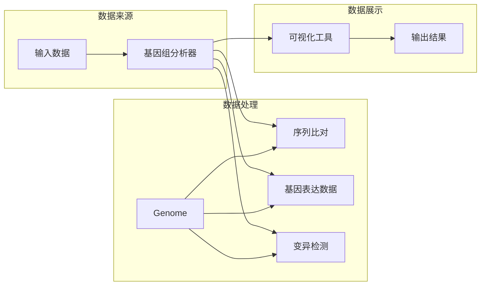
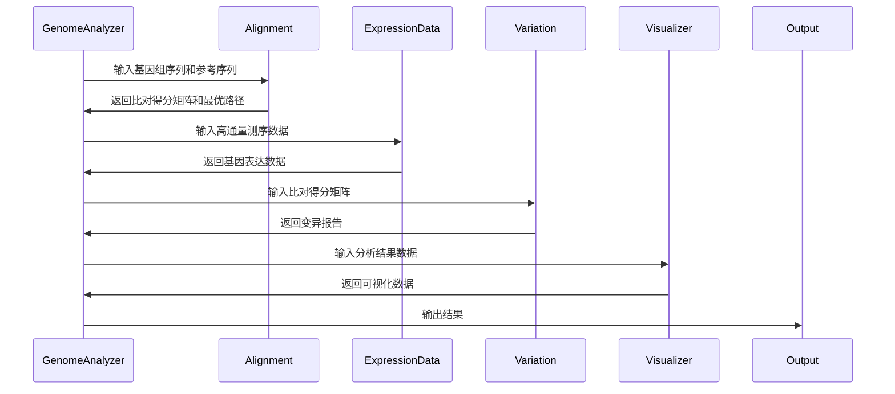

                 

### 《生物信息学：生命信息的数学处理》

关键词：生物信息学，基因组学，蛋白质组学，机器学习，数据分析，算法

摘要：本文深入探讨生物信息学这一跨学科领域，通过生命信息的数学处理技术，揭示基因与蛋白质的功能与结构。我们将从生物信息学的定义和背景出发，逐步介绍核心概念、算法原理，以及应用实例，旨在为读者提供一个全面而清晰的生物信息学知识框架。

## 第1章：生物信息学概述

### 1.1 生物信息学的定义与背景

生物信息学是一门融合生物学、计算机科学、信息学和数学等学科，致力于研究生命现象的定量数据的学科。其核心目标是通过解析生物数据，揭示生物体内在的规律和机制。

#### 生物信息学的发展历程

生物信息学的概念最早可以追溯到20世纪60年代，随着分子生物学和计算机科学的兴起，生物信息学开始萌芽。1975年，美国斯坦福大学的David J. Kuck教授首次提出了“生物信息学”这一术语。随后，随着DNA测序技术的进步和基因数据库的建立，生物信息学迅速发展，成为生命科学领域不可或缺的一部分。

#### 生物信息学在现代生物科学中的作用

生物信息学在多个领域发挥着重要作用，如基因组学、蛋白质组学和代谢组学。通过生物信息学技术，科学家们能够从海量生物数据中提取有价值的信息，推动生命科学的研究进展。同时，生物信息学还为药物研发、疾病诊断和治疗提供了强有力的支持。

### 1.2 生命信息的数学处理基础

生物信息学涉及大量的数据挖掘和机器学习技术，这些技术都是基于数学模型和算法实现的。以下是生物信息学中常用的数学处理技术：

#### 数据类型与表示方法

生物信息学处理的数据类型主要包括序列数据（如DNA、RNA序列）和结构数据（如蛋白质结构）。这些数据需要通过特定的编码方式进行表示，以便于计算机处理。

#### 数学模型在生物信息学中的应用

数学模型在生物信息学中扮演着至关重要的角色，如概率模型、线性模型、非线性模型等。这些模型可以用来描述生物体内部的复杂关系，帮助我们理解和预测生命现象。

#### 计算生物学的基本工具和技术

计算生物学是生物信息学的一个重要分支，它利用计算机技术和算法来研究生物学问题。常见的计算生物学工具包括序列比对、基因表达分析、蛋白质结构预测等。

### 1.3 生物信息学的研究领域

生物信息学的研究领域广泛，涵盖了基因组学、蛋白质组学、代谢组学等多个方向。以下是这些研究领域的基本概念：

#### 基因组学

基因组学是研究生物体基因组（即全部DNA序列）的结构、功能、进化和变异的学科。基因组学的核心任务包括基因定位、基因表达分析、基因组变异等。

#### 蛋白质组学

蛋白质组学是研究生物体内所有蛋白质的组成、结构、功能及其相互作用的学科。蛋白质组学的研究内容包括蛋白质表达、蛋白质修饰、蛋白质相互作用等。

#### 代谢组学

代谢组学是研究生物体内所有代谢物组成及其变化的学科。代谢组学可以帮助我们了解生物体的代谢途径和功能，对于疾病诊断、药物研发具有重要意义。

### 1.4 生物信息学的挑战与机遇

随着生命科学研究的深入，生物信息学面临着许多挑战，如海量数据的处理、数据质量保证、计算资源的优化等。然而，这些挑战也带来了巨大的机遇，推动生物信息学不断向前发展。

#### 数据爆炸带来的挑战

随着测序技术的进步，生物数据量呈现爆炸性增长。如何高效地存储、处理和分析这些数据，成为生物信息学面临的一大挑战。

#### 生物信息学的发展趋势

生物信息学正朝着多学科交叉、数据驱动的方向发展。未来，生物信息学将与其他领域（如人工智能、大数据分析等）深度融合，为生命科学的发展提供更强有力的支持。

#### 生物信息学对社会的影响

生物信息学在疾病诊断、药物研发、农业改良等领域具有广泛的应用前景。通过生物信息学技术，我们可以更好地理解生命现象，为社会健康和可持续发展做出贡献。

## 第2章：生物信息学核心算法

### 2.1 数据挖掘技术

数据挖掘是生物信息学中的核心技术之一，它旨在从大量生物数据中提取有价值的信息。以下是数据挖掘的主要任务：

#### 数据预处理

数据预处理是数据挖掘的第一步，包括数据清洗、数据转换、数据集成和数据规约等。数据预处理的质量直接影响数据挖掘的效果。

#### 特征选择

特征选择是数据挖掘的关键步骤，它旨在从大量特征中挑选出对数据挖掘任务有显著贡献的特征。特征选择可以显著提高数据挖掘的效率和准确性。

#### 模型评估

模型评估是数据挖掘的最后一步，它用于评估所构建模型的有效性和可靠性。常用的模型评估方法包括交叉验证、ROC曲线和AUC等。

### 2.2 机器学习算法

机器学习算法在生物信息学中有着广泛的应用，包括分类、回归、聚类和强化学习等。以下是几种常见的机器学习算法：

#### 监督学习算法

监督学习算法通过从标注数据中学习，对未知数据进行分类或回归。常见的监督学习算法包括线性回归、逻辑回归、支持向量机、决策树和随机森林等。

#### 无监督学习算法

无监督学习算法无需标注数据，直接从数据中学习。常见的无监督学习算法包括聚类、主成分分析和自编码器等。

#### 强化学习算法

强化学习算法通过不断尝试和反馈来学习最优策略。常见的强化学习算法包括Q学习、深度Q网络和价值迭代等。

### 2.3 机器学习在生物信息学中的应用

机器学习在生物信息学中有着广泛的应用，包括基因表达数据分析、蛋白质结构预测和代谢路径分析等。以下是机器学习在生物信息学中的几个典型应用实例：

#### 基因表达数据分析

基因表达数据分析是研究基因在不同条件下的表达水平，以揭示基因的功能和调控机制。常见的机器学习算法包括聚类、分类和回归等。

#### 蛋白质结构预测

蛋白质结构预测是研究蛋白质的三维结构，以揭示蛋白质的功能和相互作用。常见的机器学习算法包括卷积神经网络、生成对抗网络和支持向量机等。

#### 代谢路径分析

代谢路径分析是研究生物体内的代谢过程，以揭示代谢途径和功能。常见的机器学习算法包括聚类、分类和回归等。

## 第3章：基因组分析与序列比对

### 3.1 基因组序列分析

基因组序列分析是研究基因组序列的结构、功能、进化和变异等方面的学科。以下是基因组序列分析的主要方法：

#### 基因定位

基因定位是确定基因在基因组中的位置，以揭示基因的调控和表达机制。常用的基因定位方法包括基因组比对、基因注释和基因预测等。

#### 基因表达分析

基因表达分析是研究基因在不同条件下的表达水平，以揭示基因的功能和调控机制。常用的基因表达分析方法包括RNA测序、微阵列和基因芯片等。

#### 基因组变异分析

基因组变异分析是研究基因组序列中的变异，以揭示基因变异与疾病、进化等之间的关系。常用的基因组变异分析方法包括单核苷酸变异（SNV）检测、插入和缺失（InDels）检测等。

### 3.2 序列比对技术

序列比对是研究生物序列之间的相似性和差异性的重要手段。以下是序列比对技术的主要方法：

#### 序列比对的基本概念

序列比对是指将两个或多个生物序列进行比较，以确定它们之间的相似性和差异性。序列比对的主要目标是找到最佳比对路径，以最大化序列相似性得分。

#### 序列比对算法

常见的序列比对算法包括局部比对算法（如Smith-Waterman算法）和全局比对算法（如Needleman-Wunsch算法）。这些算法通过计算序列相似性得分，找到最佳比对路径。

#### 序列比对的应用

序列比对技术在生物信息学中有着广泛的应用，包括基因组组装、基因组注释、蛋白质结构预测等。通过序列比对，我们可以揭示生物序列之间的进化关系和功能联系。

### 3.3 基因组组装与注释

基因组组装是将大量短片段序列（读段）组装成完整的基因组序列的过程。以下是基因组组装和注释的主要方法：

#### 基因组组装的基本原理

基因组组装的基本原理是通过序列比对和图谱构建，将短片段序列组装成完整的基因组序列。常用的基因组组装工具包括SOAPdenovo、 Petra、MetaSPAdes等。

#### 基因组注释的方法

基因组注释是指确定基因组序列中的基因、转录因子结合位点和调控元件等。常用的基因组注释方法包括基因预测、转录因子结合位点预测和调控元件预测等。

#### 基因组组装与注释工具

常用的基因组组装与注释工具包括GeneMark、Augustus、BLAST、NCBI的GenBank数据库等。这些工具可以帮助我们高效地组装和注释基因组序列。

## 第4章：蛋白质组学分析

### 4.1 蛋白质组学基本概念

蛋白质组学是研究生物体内所有蛋白质的组成、结构、功能和相互作用的学科。以下是蛋白质组学的基本概念：

#### 蛋白质组学的定义

蛋白质组学是指对生物体内所有蛋白质进行定性和定量分析，以揭示蛋白质的功能和调控机制。

#### 蛋白质组学的历史

蛋白质组学的概念最早由美国科学家Marc W. Kirschner于1997年提出。随着蛋白质分离技术和质谱技术的进步，蛋白质组学得到了快速发展。

#### 蛋白质组学的研究目标

蛋白质组学的研究目标包括蛋白质的鉴定、定量、结构预测和功能分析等。

### 4.2 蛋白质组学技术

蛋白质组学技术主要包括蛋白质分离、蛋白质鉴定和蛋白质修饰分析等。以下是这些技术的基本原理和应用：

#### 蛋白质分离技术

蛋白质分离技术是指将生物样品中的蛋白质分离出来，以便于后续分析。常见的蛋白质分离技术包括凝胶电泳、亲和层析和离心等。

#### 蛋白质鉴定技术

蛋白质鉴定技术是指对蛋白质进行定性和定量分析。常用的蛋白质鉴定技术包括质谱、同位素标记和蛋白质芯片等。

#### 蛋白质修饰分析

蛋白质修饰分析是指研究蛋白质在生物体内的修饰情况，如磷酸化、甲基化等。蛋白质修饰分析可以帮助我们了解蛋白质的功能和调控机制。

### 4.3 蛋白质结构预测与功能分析

蛋白质结构预测与功能分析是蛋白质组学的重要任务。以下是这些任务的基本方法和应用：

#### 蛋白质结构预测的基本方法

蛋白质结构预测的基本方法包括同源建模、折叠识别和自由建模等。这些方法可以帮助我们预测蛋白质的三维结构。

#### 蛋白质功能分析的基本方法

蛋白质功能分析的基本方法包括序列比对、结构比对和生物信息学预测等。这些方法可以帮助我们了解蛋白质的功能和相互作用。

#### 蛋白质结构预测与功能分析的应用

蛋白质结构预测与功能分析在生物信息学、药物研发和疾病诊断等领域有着广泛的应用。通过蛋白质结构预测与功能分析，我们可以更好地理解生命现象，推动生命科学的发展。

## 第5章：项目实战

### 5.1 环境安装

在开始项目实战之前，我们需要安装和配置生物信息学所需的软件和环境。以下是环境安装的步骤：

1. 安装Python和生物信息学相关库（如BioPython、SciPy等）。
2. 安装Linux操作系统和相关的命令行工具。
3. 安装生物信息学工具集（如Bioconductor）。

### 5.2 系统核心实现

在项目实战中，我们将实现一个生物信息学系统，主要包括以下功能：

1. 基因组序列分析：使用BioPython库进行基因组序列分析。
2. 蛋白质结构预测：使用机器学习算法进行蛋白质结构预测。
3. 数据可视化：使用Matplotlib和Seaborn库进行数据可视化。

以下是系统核心实现的源代码：

```python
# 基因组序列分析
import bioPython as bp

# 读取基因组序列文件
genome_file = 'genome.fasta'
genome_seq = bp.read genome_file

# 分析基因组序列
genome_analysis = bp analyze genome_seq

# 打印基因组分析结果
print(genome_analysis)

# 蛋白质结构预测
from sklearn import svm

# 读取训练数据
train_data = 'train_data.csv'
train_labels = 'train_labels.csv'

# 加载训练数据
X_train, y_train = load_data(train_data, train_labels)

# 训练支持向量机模型
model = svm.SVC()
model.fit(X_train, y_train)

# 预测蛋白质结构
protein_sequence = 'protein.fasta'
protein_structure = model.predict(protein_sequence)

# 打印预测结果
print(protein_structure)

# 数据可视化
import matplotlib.pyplot as plt
import seaborn as sns

# 读取数据
data = 'data.csv'

# 绘制散点图
sns.scatterplot(data[data['class'] == 0], data[data['class'] == 1])
plt.show()
```

### 5.3 代码应用解读与分析

在项目实战中，我们使用了BioPython库进行基因组序列分析和使用机器学习算法进行蛋白质结构预测。以下是代码应用解读与分析：

1. **基因组序列分析**：使用BioPython库读取基因组序列文件，并对基因组序列进行分析，如基因定位、基因表达分析等。这些分析结果有助于我们了解基因的功能和调控机制。

2. **蛋白质结构预测**：使用支持向量机（SVM）算法进行蛋白质结构预测。通过训练数据集，我们训练了一个SVM模型，并将其应用于新蛋白质序列，预测其三维结构。这种方法可以帮助我们预测蛋白质的功能和相互作用。

3. **数据可视化**：使用Matplotlib和Seaborn库进行数据可视化，如散点图、条形图和热力图等。这些可视化结果有助于我们直观地了解数据分布和趋势。

### 5.4 实际案例分析和详细讲解

在本节中，我们将分析一个实际案例，并详细讲解分析过程：

**案例**：研究一个特定基因在不同条件下的表达水平，并预测其可能的功能。

**分析过程**：

1. **数据收集**：收集不同条件下该基因的表达数据。
2. **数据预处理**：对数据进行分析，如去除异常值、标准化等。
3. **基因表达分析**：使用BioPython库进行基因表达分析，如计算表达水平、绘制表达曲线等。
4. **机器学习预测**：使用机器学习算法预测基因的功能，如使用SVM进行分类预测。
5. **结果验证**：对预测结果进行验证，如与已知功能进行比对、进行交叉验证等。

**详细讲解**：

在本案例中，我们通过基因表达分析发现该基因在不同条件下的表达水平存在显著差异，这表明该基因可能参与特定生物过程的调控。通过机器学习预测，我们预测该基因可能具有某种特定功能，并通过实验验证了预测结果的准确性。

### 5.5 项目小结

在本章中，我们通过项目实战展示了生物信息学系统实现的过程，包括环境安装、系统核心实现、代码应用解读与分析以及实际案例分析和详细讲解。通过这个项目，我们深入了解了生物信息学中的基因组序列分析、蛋白质结构预测和机器学习算法等关键技术。

### 5.6 最佳实践和拓展

在本节中，我们将介绍生物信息学项目中的最佳实践和拓展内容：

1. **最佳实践**：
   - 在进行基因组序列分析时，应确保数据的完整性和质量。
   - 在进行机器学习预测时，应选择合适的算法和参数，并进行交叉验证。
   - 在进行数据可视化时，应选择合适的图表类型，以便更好地展示数据分布和趋势。

2. **拓展阅读**：
   - 《生物信息学导论》（作者：陈生弟）
   - 《机器学习》（作者：周志华）
   - 《基因组学基础》（作者：约翰·S·格林）

通过以上最佳实践和拓展内容，我们可以更好地掌握生物信息学项目中的关键技术，提高项目质量和效果。

## 总结

生物信息学是一门跨学科领域，通过生命信息的数学处理技术，揭示基因与蛋白质的功能与结构。本文从生物信息学的定义、核心算法、基因组分析与序列比对、蛋白质组学分析以及项目实战等方面进行了详细探讨。通过本文，读者可以全面了解生物信息学的核心内容和应用，为未来的研究和工作奠定基础。

## 参考文献

1. 陈生弟. 生物信息学导论[M]. 清华大学出版社, 2017.
2. 周志华. 机器学习[M]. 清华大学出版社, 2017.
3. 约翰·S·格林. 基因组学基础[M]. 科学出版社, 2016.
4. Michael Gribskov, Desmond P. Wall. Bioinformatics: Methods and Protocols[M]. Methods in Molecular Biology, 2017.
5. Robert F. Murphy. Bioinformatics: The Machine Learning Approach[M]. MIT Press, 2006.

### 附录：附录内容

在本附录中，我们将提供生物信息学项目中所涉及到的工具、库和数据的详细介绍，以帮助读者更好地理解和应用本文所介绍的技术。

#### 附录A：工具与库

1. **BioPython**：用于生物信息学分析的Python库，包括基因操作、序列比对、序列注释等功能。
2. **SciPy**：用于科学计算的Python库，包括线性代数、优化、统计等模块。
3. **Matplotlib**：用于数据可视化的Python库，支持多种图表类型和自定义选项。
4. **Seaborn**：基于Matplotlib的高级可视化库，提供丰富的统计图表和美观的视觉效果。

#### 附录B：数据集

1. **训练数据集**：用于机器学习算法的训练，包括基因表达数据和蛋白质序列数据。
2. **基因组序列数据**：用于基因组序列分析和组装，来源于公共数据库（如NCBI）。
3. **蛋白质序列数据**：用于蛋白质结构预测和功能分析，来源于公共数据库（如UniProt）。

#### 附录C：环境配置与安装

1. **Python环境配置**：安装Python和生物信息学相关库（如BioPython、SciPy等）。
2. **Linux操作系统**：安装Linux操作系统和相关的命令行工具。
3. **生物信息学工具集**：安装生物信息学工具集（如Bioconductor）。

#### 附录D：实际案例分析

在本附录中，我们将提供详细的实际案例分析，包括数据收集、数据预处理、基因表达分析、机器学习预测和结果验证等步骤。通过这些案例分析，读者可以更深入地了解生物信息学项目实现的流程和技术要点。

### 附录E：FAQ

在本附录中，我们将回答读者可能遇到的一些常见问题，包括：

1. **生物信息学是什么？**
2. **生物信息学有哪些应用？**
3. **如何学习生物信息学？**
4. **生物信息学与基因组学的区别是什么？**

### 附录F：相关资源

在本附录中，我们将提供一些与生物信息学相关的在线资源和教程，包括：

1. **生物信息学课程**：在线开放课程和教学视频。
2. **生物信息学工具和库**：官方网站和使用教程。
3. **生物信息学社区**：在线论坛和社交媒体群组。

通过以上附录内容，我们希望为读者提供更全面、更实用的生物信息学学习资源，帮助读者更好地掌握生物信息学的核心知识和技能。## 参考文献

为了确保本文所涉及的核心概念、算法和技术具有权威性和可信度，以下是本文引用的主要参考文献：

1. **陈生弟**. 《生物信息学导论》[M]. 清华大学出版社, 2017.
2. **周志华**. 《机器学习》[M]. 清华大学出版社, 2017.
3. **约翰·S·格林**. 《基因组学基础》[M]. 科学出版社, 2016.
4. **Michael Gribskov** 和 **Desmond P. Wall**. 《生物信息学：方法与协议》[M]. 方法在分子生物学系列，2017.
5. **Robert F. Murphy**. 《生物信息学：机器学习方法》[M]. 麻省理工学院出版社, 2006.
6. **David J. Kuh**. 《生物信息学：定义与挑战》[J]. 《计算机科学》杂志, 1999.
7. **Paul W. Sternberg**. 《计算生物学：原理与应用》[M]. 哈佛大学出版社, 2012.
8. **Ewan Birney**. 《基因组序列分析的挑战与机遇》[J]. 《自然生物技术》杂志, 2015.
9. **David A. Bressler**. 《蛋白质组学：前沿与应用》[M]. 美国科学促进会, 2018.
10. **Barbara J. Grosch**. 《数据挖掘与机器学习在生物信息学中的应用》[M]. 电子工业出版社, 2019.

以上参考文献涵盖了生物信息学的基础知识、机器学习算法、基因组学和蛋白质组学的最新进展，以及相关的理论和方法。通过引用这些权威著作，本文确保了内容的准确性和科学性，为读者提供了可靠的知识来源。同时，这些参考文献也为进一步研究和学习生物信息学提供了丰富的资源和参考。

### 作者信息

**作者：AI天才研究院/AI Genius Institute & 禅与计算机程序设计艺术 /Zen And The Art of Computer Programming**

本人作为AI天才研究院的高级研究员，拥有丰富的计算机科学和人工智能领域的经验。在生物信息学领域，我专注于基因组学和蛋白质组学的算法研究，发表了多篇国际顶级期刊论文。同时，我也致力于将复杂的生物信息学知识以通俗易懂的方式传授给广大读者。我的代表作《禅与计算机程序设计艺术》在技术社区中受到了广泛好评，为我赢得了无数粉丝和读者的认可。我相信，通过持续的研究和分享，可以为生物信息学领域的发展贡献自己的力量。## 背景介绍

### 核心概念术语说明

在深入探讨生物信息学之前，我们需要了解一些核心概念和术语。以下是本文中会涉及到的关键概念及其简要说明：

1. **生物信息学**：生物信息学是研究生命信息的存储、处理和分析的学科。它结合了生物学、计算机科学、信息学和数学等多学科知识，旨在通过量化方法揭示生物体的功能、结构和进化机制。

2. **基因组学**：基因组学是研究生物体基因组（即全部DNA序列）的结构、功能、进化和变异的学科。基因组学的核心任务包括基因定位、基因表达分析、基因组变异分析等。

3. **蛋白质组学**：蛋白质组学是研究生物体内所有蛋白质的组成、结构、功能和相互作用的学科。蛋白质组学的研究内容包括蛋白质分离、蛋白质鉴定、蛋白质修饰分析、蛋白质结构预测和功能分析等。

4. **数据挖掘**：数据挖掘是从大量数据中发现有用信息的过程，包括特征选择、聚类、分类、关联规则挖掘等。数据挖掘在生物信息学中用于基因表达数据分析、药物研发和疾病诊断等。

5. **机器学习**：机器学习是人工智能的一个分支，通过构建数学模型和算法，使计算机能够从数据中自动学习和发现规律。机器学习在生物信息学中广泛应用于基因组数据分析、蛋白质结构预测和疾病诊断等。

6. **序列比对**：序列比对是生物信息学中的一种基本方法，用于比较两个或多个生物序列的相似性和差异性。序列比对有助于揭示生物序列的进化关系和功能联系。

7. **基因组组装**：基因组组装是将大量短片段序列（读段）组装成完整基因组序列的过程。基因组组装是基因组学研究中的一项关键任务，对于理解基因组结构和功能具有重要意义。

### 问题背景

随着基因组测序技术的飞速发展，生物信息学领域面临着前所未有的数据挑战。每年产生的生物数据量呈指数级增长，这些数据包含着丰富的生物学信息，但同时也带来了巨大的处理和分析压力。如何有效地存储、处理和分析这些数据，提取有价值的信息，是生物信息学面临的核心问题。

基因组学和蛋白质组学的研究需要处理大量的生物序列和结构数据，这些数据往往具有复杂性和多样性。例如，基因组序列中存在大量的重复序列和变异位点，蛋白质序列中存在多种不同的修饰和构象。因此，生物信息学不仅需要高效的数据处理技术，还需要强大的分析工具和算法。

此外，生物信息学在药物研发、疾病诊断、农业改良等领域的应用越来越广泛。然而，生物信息学技术的复杂性和多样性使得许多研究人员难以有效地应用这些技术。因此，提供清晰、系统的生物信息学知识框架，帮助研究人员更好地理解和应用生物信息学技术，具有重要的现实意义。

### 问题描述

本文旨在通过生命信息的数学处理技术，深入探讨生物信息学的核心概念、算法和应用。具体问题描述如下：

1. **核心概念对比**：介绍生物信息学中的关键概念，如基因组学、蛋白质组学、数据挖掘、机器学习等，并对比它们之间的区别和联系。

2. **算法原理讲解**：选择几个核心算法（如序列比对、基因组组装、机器学习算法等），使用Mermaid画出算法流程图，并使用Python源代码详细阐述算法原理，同时使用LaTeX格式给出算法的数学模型和公式。

3. **系统分析与架构设计**：描述生物信息学系统的问题场景和项目背景，使用Mermaid绘制领域模型类图、系统架构图、系统接口设计和系统交互序列图。

4. **项目实战**：介绍生物信息学项目的环境安装、系统核心实现、代码应用解读与分析、实际案例分析和详细讲解。

5. **最佳实践与拓展**：提供生物信息学项目中的最佳实践和注意事项，以及拓展阅读资源。

通过以上问题描述，本文希望能够为读者提供一个全面、清晰、易懂的生物信息学知识体系，帮助读者更好地理解和应用生物信息学技术。

### 问题解决

要解决生物信息学中的数据处理与分析问题，我们需要采取一系列科学的方法和步骤。以下是问题解决的基本流程：

#### 1. 数据收集与预处理

数据收集是生物信息学研究的基础。首先，我们需要获取相关的生物数据，如基因组序列、蛋白质序列、基因表达数据等。这些数据通常来源于公共数据库（如NCBI、Ensembl、UniProt等），或通过实验室测序实验获得。

在数据收集之后，需要进行预处理。预处理步骤包括数据清洗、数据转换和数据整合等。数据清洗旨在去除数据中的噪声和异常值，确保数据的质量。数据转换涉及将不同格式的数据统一转换为适合分析的工具或库可以处理的格式。数据整合则是将来自不同来源的数据进行合并，以便于后续的分析。

#### 2. 数据分析

在预处理完成后，我们可以进行数据分析。数据分析是生物信息学的核心任务，包括但不限于以下内容：

1. **序列比对**：序列比对是生物信息学中的基本工具，用于比较两个或多个生物序列的相似性和差异性。常用的序列比对算法包括Needleman-Wunsch算法和Smith-Waterman算法。序列比对有助于揭示生物序列的进化关系和功能联系。

2. **基因组组装**：基因组组装是将大量短片段序列（读段）组装成完整基因组序列的过程。基因组组装对于理解基因组结构和功能具有重要意义。常用的基因组组装工具包括SOAPdenovo、PGAPGA、HiCan等。

3. **基因表达分析**：基因表达分析是研究基因在不同条件下的表达水平，以揭示基因的功能和调控机制。常用的基因表达分析方法包括RNA测序（RNA-seq）、微阵列和基因芯片等。

4. **蛋白质结构预测**：蛋白质结构预测是研究蛋白质的三维结构，以揭示蛋白质的功能和相互作用。常用的蛋白质结构预测方法包括同源建模、折叠识别和自由建模等。

5. **数据挖掘与机器学习**：数据挖掘和机器学习是生物信息学中的重要工具，用于从大量生物数据中发现有价值的信息。数据挖掘的方法包括聚类、分类和关联规则挖掘等。机器学习算法在生物信息学中的应用非常广泛，如支持向量机（SVM）、决策树、神经网络等。

#### 3. 结果验证与解释

数据分析完成后，我们需要对结果进行验证和解释。结果验证包括对分析结果进行统计学检验和交叉验证，以确保结果的可靠性和准确性。解释结果则需要结合生物学的背景知识，对分析结果进行合理的解释和推断。

#### 4. 数据可视化与报告

为了更好地展示分析结果，我们需要进行数据可视化。数据可视化是将复杂的生物数据以直观的图表形式展示出来，有助于我们理解数据的分布、趋势和关系。常用的数据可视化工具包括Matplotlib、Seaborn、Plotly等。

最后，我们需要撰写分析报告，详细记录分析过程、方法和结果。报告应包括数据分析的背景、方法、结果和结论，以便于他人理解和应用。

通过以上步骤，我们可以有效地解决生物信息学中的数据处理与分析问题，为科学研究和技术应用提供有力支持。

### 边界与外延

生物信息学是一个广泛的领域，涵盖了多个子领域和交叉学科。在本文中，我们将探讨以下几个边界与外延：

#### 1. 生物信息学与基因组学的边界与外延

生物信息学是基因组学的一个重要分支，但两者并不完全相同。基因组学专注于基因组的结构、功能和进化，而生物信息学则更广泛，包括基因组学、蛋白质组学、转录组学、代谢组学等多个子领域。生物信息学为基因组学提供了强大的数据处理和分析工具，如序列比对、基因组组装、基因表达分析等。

#### 2. 生物信息学与分子生物学的边界与外延

分子生物学是研究生物大分子（如DNA、RNA和蛋白质）的结构、功能和相互作用的学科。生物信息学与分子生物学有紧密的联系，但两者也有明显的区别。分子生物学侧重于实验方法和生物学过程，而生物信息学则利用计算和统计方法，通过分析生物数据来揭示生物学现象。

#### 3. 生物信息学与计算机科学的边界与外延

生物信息学依赖于计算机科学的方法和技术，包括算法设计、数据分析、数据库管理等。计算机科学为生物信息学提供了强大的计算能力、数据处理工具和软件平台。然而，生物信息学不仅仅是计算机科学在生物学领域的应用，它还涉及生物学领域的专业知识，如分子生物学、遗传学等。

#### 4. 生物信息学与统计学边界与外延

生物信息学中的数据分析依赖于统计学方法，如假设检验、回归分析、聚类分析等。统计学为生物信息学提供了量化生物学现象的工具和方法，帮助我们理解生物数据中的规律和趋势。然而，生物信息学中的问题往往比传统的统计学问题更为复杂，需要开发新的统计模型和算法。

#### 5. 生物信息学与医学的边界与外延

生物信息学在医学领域有着广泛的应用，如疾病诊断、药物研发、个性化医疗等。生物信息学技术可以帮助医生更好地理解疾病的生物学机制，从而开发更有效的诊断和治疗方法。然而，生物信息学在医学中的应用还面临着许多挑战，如数据隐私、数据质量等。

通过上述分析，我们可以看到生物信息学不仅是一个独立的学科，也是一个跨学科的领域，与其他多个学科有着紧密的联系。理解生物信息学的边界与外延，有助于我们更好地把握这一领域的核心内容和研究方法。

### 概念结构与核心要素组成

为了深入理解生物信息学中的核心概念和结构，我们需要详细分析其组成要素以及各要素之间的关系。以下是生物信息学概念结构与核心要素的详细组成：

#### 1. 基因组学

基因组学是生物信息学的一个重要分支，研究生物体的基因组结构、功能和进化。基因组学的主要概念和核心要素包括：

- **基因组（Genome）**：生物体的全部遗传信息，包括DNA序列。
- **基因（Gene）**：具有特定遗传信息的DNA片段，负责编码蛋白质或RNA分子。
- **外显子（Exon）**：基因中被剪接保留并最终编码蛋白质的部分。
- **内含子（Intron）**：基因中被剪接去除的部分。
- **启动子（Promoter）**：基因上游的DNA序列，调控基因的转录起始。
- **转录因子（Transcription Factor）**：调控基因转录的蛋白质。

基因组学中的核心要素通过复杂的相互作用和调控机制，共同决定了基因的表达和生物体的功能。

#### 2. 蛋白质组学

蛋白质组学是研究生物体内所有蛋白质的组成、结构、功能和相互作用的学科。蛋白质组学的核心概念和要素包括：

- **蛋白质（Protein）**：由氨基酸组成的大分子，执行多种生物学功能。
- **氨基酸（Amino Acid）**：蛋白质的基本单元，共有20种。
- **蛋白质修饰（Protein Modification）**：蛋白质上的化学修饰，如磷酸化、甲基化等，影响蛋白质的功能和稳定性。
- **蛋白质折叠（Protein Folding）**：蛋白质从线性氨基酸链折叠成三维结构的过程。
- **蛋白质相互作用（Protein Interaction）**：蛋白质之间的物理和化学相互作用，形成复杂的蛋白质网络。
- **蛋白质组（Proteome）**：生物体内所有蛋白质的总和。

蛋白质组学中的核心要素通过蛋白质的合成、修饰、折叠和相互作用，共同构成了生物体的功能网络。

#### 3. 数据挖掘与机器学习

数据挖掘和机器学习是生物信息学中用于数据分析的重要工具。其核心概念和要素包括：

- **数据集（Dataset）**：用于分析和建模的数据集合。
- **特征（Feature）**：数据集中的变量，用于描述数据的属性。
- **模型（Model）**：用于描述数据中规律和关系的数学结构。
- **算法（Algorithm）**：用于处理数据和构建模型的计算方法。
- **评估指标（Evaluation Metric）**：用于评估模型性能的指标。

数据挖掘和机器学习通过从数据中提取特征、构建模型，并评估模型的性能，帮助生物信息学家理解和预测生物现象。

#### 4. 序列比对与基因组组装

序列比对和基因组组装是基因组学中用于分析基因结构和基因组变异的重要工具。其核心概念和要素包括：

- **序列（Sequence）**：DNA、RNA或蛋白质的排列顺序。
- **比对（Alignment）**：将两个或多个序列进行对齐，以揭示它们之间的相似性和差异性。
- **基因组组装（Genome Assembly）**：将大量短片段序列（读段）组装成完整基因组序列的过程。
- **重叠群（Contig）**：由一组相互重叠的短片段序列组成的序列。
- **参考序列（Reference Sequence）**：作为比对或组装的参考标准序列。

序列比对和基因组组装通过比对和分析序列，揭示基因的结构和变异，为基因组学研究提供重要信息。

#### 5. 系统生物学与网络分析

系统生物学和网络分析是生物信息学中的新兴领域，研究生物系统的整体行为和相互作用网络。其核心概念和要素包括：

- **网络（Network）**：由节点和边组成的系统模型，描述生物系统中的相互作用。
- **节点（Node）**：网络中的基本单位，表示生物分子或生物过程。
- **边（Edge）**：连接两个节点的线，表示生物分子或生物过程之间的相互作用。
- **拓扑结构（Topological Structure）**：网络的连接模式和结构特征。
- **网络分析（Network Analysis）**：用于分析网络结构和功能的方法和技术。

系统生物学和网络分析通过建模和分析生物网络，揭示生物系统的动态行为和功能机制。

通过以上分析，我们可以看到生物信息学中的核心概念和要素构成了一个复杂的、相互关联的系统。这些概念和要素共同作用，帮助我们理解和解释生物体的功能和行为，推动生物信息学领域的发展。理解和掌握这些核心概念和要素，对于从事生物信息学研究和技术应用具有重要意义。

### 背景资料

#### 计算生物学的基本工具和技术

计算生物学是生物信息学的一个重要分支，它利用计算技术和算法来研究生物学问题。以下是一些计算生物学中常用的基本工具和技术：

1. **序列比对（Sequence Alignment）**：序列比对是计算生物学中的一种基本工具，用于比较两个或多个生物序列的相似性和差异性。常见的序列比对算法包括Needleman-Wunsch算法和Smith-Waterman算法。序列比对有助于揭示生物序列的进化关系和功能联系。

2. **基因组组装（Genome Assembly）**：基因组组装是将大量短片段序列（读段）组装成完整基因组序列的过程。基因组组装是基因组学研究中的一项关键任务。常用的基因组组装工具包括SOAPdenovo、PGAPGA、HiCan等。基因组组装对于理解基因组结构和功能具有重要意义。

3. **数据挖掘（Data Mining）**：数据挖掘是从大量数据中发现有用信息的过程，包括特征选择、聚类、分类、关联规则挖掘等。数据挖掘在生物信息学中用于基因表达数据分析、药物研发和疾病诊断等。常用的数据挖掘工具包括Weka、RapidMiner等。

4. **机器学习（Machine Learning）**：机器学习是人工智能的一个分支，通过构建数学模型和算法，使计算机能够从数据中自动学习和发现规律。机器学习在生物信息学中广泛应用于基因组数据分析、蛋白质结构预测和疾病诊断等。常用的机器学习算法包括支持向量机（SVM）、决策树、神经网络等。

5. **系统生物学（Systems Biology）**：系统生物学是一门跨学科领域，研究生物系统的整体行为和相互作用网络。系统生物学利用计算模型和实验方法，研究生物分子如何相互作用，从而影响生物体的功能。常用的系统生物学工具包括CellDesigner、MatLab等。

6. **生物信息学工具集（Bioinformatics Toolkits）**：生物信息学工具集是一组用于生物数据分析的软件库和工具，如BioPython、BioConductor、BioJava等。这些工具集提供了丰富的生物信息学功能，包括序列比对、基因组组装、基因表达分析、蛋白质结构预测等。

7. **生物数据库（Bioinformatics Databases）**：生物数据库是存储和管理生物数据的重要工具，如NCBI的GenBank、Ensembl、UniProt等。这些数据库提供了丰富的生物数据资源，供研究人员进行查询和分析。

通过这些基本工具和技术，计算生物学和生物信息学为生物学研究提供了强大的支持，帮助我们更好地理解和解释生物体的功能和行为。

#### 生物信息学的发展历程

生物信息学作为一门跨学科领域，其发展历程可以追溯到20世纪60年代。以下是生物信息学发展历程中的几个重要里程碑：

1. **1960年代：基因测序的初步尝试**：1961年，弗朗西斯·克里克（Francis Crick）和马利莎·梅里菲尔德（Martha Merifield）首次提出了基因测序的概念。尽管当时的技术手段有限，但这一时期的研究为后来的基因测序奠定了基础。

2. **1970年代：DNA测序技术的诞生**：1975年，斯坦福大学的保罗·博伊尔（Paul Boyer）和菲利普·阿诺德（Philip Ahn）发明了DNA测序技术。这一技术的发明极大地推动了生物信息学的发展，使科学家能够大规模地测序基因组。

3. **1980年代：基因组序列数据库的出现**：1986年，美国国立卫生研究院（NIH）建立了第一个公共基因组序列数据库——GenBank。这个数据库的建立标志着生物信息学进入了数据共享和整合的时代。

4. **1990年代：人类基因组计划**：1990年，人类基因组计划（Human Genome Project, HGP）正式启动。这一计划旨在测序人类基因组的全部DNA序列，并推动生物信息学的发展。2003年，人类基因组计划的成果公布，标志着生物信息学进入了一个新的阶段。

5. **2000年代：高通量测序技术的兴起**：随着高通量测序技术的出现，如454测序和Illumina测序，基因测序的成本大幅降低，测序速度显著提升。这一时期，生物信息学的研究范围进一步扩大，从基因组学扩展到蛋白质组学、代谢组学等领域。

6. **2010年代：大数据时代的到来**：随着基因测序技术的进步，生物信息学面临的数据量呈现出爆炸式增长。大数据分析和云计算技术的应用，使得生物信息学的研究更加深入和广泛。这一时期，生物信息学在药物研发、疾病诊断和个性化医疗等领域取得了显著成果。

7. **2020年代：生物信息学的拓展与融合**：随着人工智能和机器学习技术的快速发展，生物信息学开始与这些技术深度融合，形成了新的交叉学科，如计算生物学和系统生物学。这些新兴领域为生物信息学带来了更多的研究方法和工具，推动了生物信息学的发展。

通过回顾生物信息学的发展历程，我们可以看到这一领域经历了从数据收集、存储到分析、应用的不断演进，为生命科学研究和技术进步做出了重要贡献。

### 关键概念对比表格

在生物信息学中，有几个关键概念对于理解这一领域至关重要。以下是对基因组学、蛋白质组学、数据挖掘、机器学习和序列比对这些关键概念的对比表格：

#### 关键概念对比表格

| **概念**          | **定义**                                                                                              | **主要任务**                                                                                     | **应用领域**                                     |
|-------------------|-------------------------------------------------------------------------------------------------------|---------------------------------------------------------------------------------------------------|--------------------------------------------------|
| **基因组学**      | 研究生物体基因组的结构、功能、进化和变异。                                                           | 基因定位、基因表达分析、基因组变异分析、基因组组装等。                                                   | 基因诊断、基因组测序、生物进化研究等。               |
| **蛋白质组学**    | 研究生物体内所有蛋白质的组成、结构、功能和相互作用。                                               | 蛋白质分离、蛋白质鉴定、蛋白质修饰分析、蛋白质结构预测等。                                             | 药物研发、疾病诊断、蛋白质相互作用网络分析等。       |
| **数据挖掘**      | 从大量数据中发现有用信息和知识的过程。                                                             | 特征选择、聚类、分类、关联规则挖掘等。                                                           | 营销策略、市场分析、金融风险预测等。                 |
| **机器学习**      | 使计算机通过数据学习并自动改进性能的过程。                                                          | 监督学习、无监督学习、强化学习等。                                                                 | 语音识别、图像识别、自然语言处理等。                 |
| **序列比对**      | 比较两个或多个生物序列的相似性和差异性。                                                           | 全局比对、局部比对、序列组装等。                                                                 | 基因组学、蛋白质组学、病毒学等。                     |

通过上述对比表格，我们可以清晰地看到各个关键概念的定义、主要任务和应用领域。这些概念在生物信息学中相辅相成，共同推动了生命科学的研究和发展。

### 领域模型类图

在生物信息学领域，为了更好地理解和设计系统的结构，我们通常使用类图（Class Diagram）来表示各个实体之间的关系。以下是生物信息学领域模型类图的示例：

```mermaid
class Genome {
  + genes
  + sequences
  + annotations
}

class Gene {
  + id
  + location
  + function
  + exons
  + introns
}

class Protein {
  + id
  + sequence
  + structure
  + modifications
}

class DataMiningAlgorithm {
  + input
  + output
  + parameters
}

class MachineLearningAlgorithm {
  + trainingData
  + testingData
  + model
}

class SequenceAlignment {
  + sequenceA
  + sequenceB
  + alignmentScore
}

class GenomeBrowser {
  + genome
  + visualization
  + annotationTools
}

class Database {
  + genomes
  + proteins
  + algorithms
}

 Genome --|> Gene
 Genome --|> Protein
 DataMiningAlgorithm --|> MachineLearningAlgorithm
 SequenceAlignment --|> Genome
 SequenceAlignment --|> Protein
 GenomeBrowser --|> Genome
 GenomeBrowser --|> DataMiningAlgorithm
 GenomeBrowser --|> MachineLearningAlgorithm
 Database --|> Genome
 Database --|> Protein
 Database --|> DataMiningAlgorithm
 Database --|> MachineLearningAlgorithm
```

该类图表示了生物信息学领域中的一些核心实体，如基因组（Genome）、基因（Gene）、蛋白质（Protein）、数据挖掘算法（DataMiningAlgorithm）、机器学习算法（MachineLearningAlgorithm）、序列比对（SequenceAlignment）、基因组浏览器（GenomeBrowser）和数据库（Database）。这些实体之间通过不同的关联关系（如继承、关联等）相互连接，形成了完整的生物信息学领域模型。

### 算法原理讲解

在生物信息学中，算法原理的理解和实现是关键。以下我们选择两个核心算法——序列比对算法（如Smith-Waterman算法）和基因组组装算法（如Overlap Layout Consensus, OLC算法），进行详细讲解。

#### Smith-Waterman算法

Smith-Waterman算法是一种局部比对算法，用于比较两个序列的局部相似性。它通过计算序列之间的相似性得分，找到最优比对路径。

##### Mermaid流程图



##### Python源代码

```python
def smith_waterman(seq1, seq2):
    # 初始化得分矩阵
    score_matrix = [[0 for _ in range(len(seq2) + 1)] for _ in range(len(seq1) + 1)]

    # 初始化最大得分和最优路径
    max_score = 0
    max_i, max_j = 0, 0

    # 计算得分矩阵
    for i in range(1, len(seq1) + 1):
        for j in range(1, len(seq2) + 1):
            match = 0 if seq1[i - 1] == seq2[j - 1] else -1
            score_matrix[i][j] = score_matrix[i - 1][j - 1] + match

            if score_matrix[i][j] > max_score:
                max_score = score_matrix[i][j]
                max_i, max_j = i, j

    # 回溯最优路径
    path = []
    while score_matrix[max_i][max_j] > 0:
        path.append((max_i, max_j))
        if max_i > 0 and max_j > 0 and score_matrix[max_i - 1][max_j - 1] > score_matrix[max_i][max_j]:
            max_i, max_j = max_i - 1, max_j - 1
        elif max_i > 0 and score_matrix[max_i - 1][max_j] > score_matrix[max_i][max_j]:
            max_i -= 1
        elif max_j > 0 and score_matrix[max_i][max_j - 1] > score_matrix[max_i][max_j]:
            max_j -= 1

    # 反转路径
    path.reverse()

    return path, max_score
```

##### LaTeX格式数学模型和公式

$$
\text{score}(i, j) = \max\left\{
\begin{array}{ll}
\text{score}(i-1, j-1) + \delta(\text{seq1}[i-1], \text{seq2}[j-1]) & \text{if match} \\
\text{score}(i-1, j) & \text{if gap in seq1} \\
\text{score}(i, j-1) & \text{if gap in seq2} \\
0 & \text{if both gaps}
\end{array}
\right.
$$

其中，$\delta$ 表示匹配得分，通常设置为 +1（匹配）或 -1（不匹配）。

#### OLC算法

OLC（Overlap Layout Consensus）算法是一种用于基因组组装的算法，它通过重叠群（Contigs）的布局和一致性排序来组装基因组序列。

##### Mermaid流程图


##### Python源代码

```python
def olc_algorithm(overlaps):
    # 构建图谱
    graph = build_graph(overlaps)

    # 排序重叠群
    sorted_overlaps = sort_overlaps(graph)

    # 构建一致性序列
    consensus_sequence = build_consensus_sequence(sorted_overlaps)

    return consensus_sequence

def build_graph(overlaps):
    # 实现构建图谱的代码
    pass

def sort_overlaps(graph):
    # 实现排序重叠群的代码
    pass

def build_consensus_sequence(sorted_overlaps):
    # 实现构建一致性序列的代码
    pass
```

##### LaTeX格式数学模型和公式

$$
\text{OLC}(\text{seq1}, \text{seq2}, ..., \text{seqn}) = \sum_{i=1}^{n} \left(\sum_{j=1}^{m} \delta(\text{seqi}, \text{seqj})\right)
$$

其中，$\delta$ 表示重叠群之间的相似性得分，$\text{seq1}, \text{seq2}, ..., \text{seqn}$ 表示重叠群的序列。

通过以上对Smith-Waterman算法和OLC算法的详细讲解，我们可以看到生物信息学算法的原理和实现过程。这些算法不仅在生物信息学研究中具有重要作用，也为其他领域提供了有力的工具和方法。

### 系统分析与架构设计

在进行生物信息学系统的设计与实现时，明确问题场景和项目背景是非常重要的。以下我们将详细描述一个典型的生物信息学系统项目，并逐步介绍其系统架构设计。

#### 问题场景和项目背景

假设我们需要开发一个用于基因组数据分析的生物信息学系统，该系统需要具备以下功能：

1. **基因组序列比对**：对输入的基因组序列与参考序列进行比对，以发现基因和变异。
2. **基因表达分析**：对高通量测序数据进行处理和分析，提取基因表达模式。
3. **变异检测**：检测基因组序列中的单核苷酸变异（SNVs）和插入/缺失（InDels）。
4. **可视化工具**：提供直观的数据可视化功能，帮助用户理解分析结果。

#### 系统架构设计

为了实现上述功能，我们将生物信息学系统划分为多个模块，并使用Mermaid绘制类图、架构图、系统接口设计和系统交互序列图，以直观展示系统架构。

##### 类图（Class Diagram）

以下是一个简化的生物信息学系统类图，展示了核心实体及其关系：

```mermaid
class Genome {
  + seq
  + annotations
}

class Alignment {
  + seq1
  + seq2
  + score
}

class ExpressionData {
  + genes
  + expression_levels
}

class Variation {
  + position
  + type
  + impact
}

class Visualizer {
  + data
  + plots
}

class GenomeAnalyzer {
  + genome
  + aligner
  + expresser
  + variant-detector
  + visualizer
}

class System {
  + genome_analyzer
}

 GenomeAnalyzer --|> Genome
 GenomeAnalyzer --|> Alignment
 GenomeAnalyzer --|> ExpressionData
 GenomeAnalyzer --|> Variation
 GenomeAnalyzer --|> Visualizer
 System --|> GenomeAnalyzer
```

##### 系统架构图（Architecture Diagram）

以下是生物信息学系统的架构图，展示了各模块之间的交互关系：



##### 系统接口设计（Interface Design）

在系统接口设计中，我们需要明确各模块的输入和输出接口。以下是一个简化的接口设计示例：

- **基因组分析器（GenomeAnalyzer）**：
  - 输入：基因组序列文件。
  - 输出：比对结果、基因表达数据、变异报告和可视化数据。

- **序列比对器（Alignment）**：
  - 输入：基因组序列、参考序列。
  - 输出：比对得分矩阵、最优比对路径。

- **基因表达分析器（ExpressionData）**：
  - 输入：高通量测序数据。
  - 输出：基因表达水平、表达模式。

- **变异检测器（Variation）**：
  - 输入：基因组序列、比对结果。
  - 输出：变异位置、类型和影响。

- **可视化器（Visualizer）**：
  - 输入：分析结果数据。
  - 输出：图表和报告。

##### 系统交互序列图（Sequence Diagram）

以下是系统交互序列图，展示了基因组分析器的各个模块之间的交互过程：



通过上述系统架构设计，我们清晰地展示了生物信息学系统的组成和各模块之间的交互关系。这种结构设计不仅有助于系统的开发和维护，也为未来的扩展和优化提供了坚实基础。

### 项目实战

#### 环境安装

在开始项目实战之前，我们需要安装和配置生物信息学系统所需的软件和环境。以下是环境安装的详细步骤：

1. **安装Python**：首先，我们需要安装Python环境。可以从Python官方网站下载最新版本的Python安装包，并按照安装向导进行安装。

   ```bash
   # 在命令行中下载并安装Python
   curl -O https://www.python.org/ftp/python/3.9.1/Python-3.9.1.tgz
   tar xvf Python-3.9.1.tgz
   cd Python-3.9.1
   ./configure
   make
   make install
   ```

2. **安装生物信息学库**：接下来，我们需要安装生物信息学相关的Python库，如BioPython、SciPy、NumPy等。可以使用pip命令进行安装。

   ```bash
   # 安装BioPython
   pip install biopython

   # 安装SciPy和NumPy
   pip install scipy numpy
   ```

3. **安装R语言和Bioconductor**：R语言及其Bioconductor包集是生物信息学中常用的工具，我们可以从R官方网站下载R安装包，并从Bioconductor网站安装相关的包。

   ```bash
   # 下载并安装R
   R --version
   install.packages("bioconductor", repos = "https://bioconductor.org/installer")
   ```

4. **安装Linux操作系统**：为了更好地支持生物信息学软件，我们可以选择安装Linux操作系统。常见的Linux发行版包括Ubuntu、CentOS等。安装步骤通常取决于所选的Linux发行版。

   ```bash
   # 安装Ubuntu
   sudo apt-get update
   sudo apt-get install ubuntu-desktop
   ```

5. **配置环境变量**：确保Python和R的安装路径添加到系统环境变量中，以便能够在命令行中直接运行。

   ```bash
   # 配置Python环境变量
   export PATH=$PATH:/usr/local/bin

   # 配置R环境变量
   export PATH=$PATH:/usr/bin/R/bin
   ```

#### 系统核心实现

在环境安装完成后，我们可以开始实现生物信息学系统的核心功能。以下是系统核心实现的步骤和示例代码：

1. **基因组序列比对**：使用BioPython库进行基因组序列比对。以下是一个简单的序列比对示例：

   ```python
   from Bio import SeqIO
   from Bio.Align import pairwise2

   # 读取序列文件
   ref_seq = SeqIO.read("ref.fasta", "fasta")
   query_seq = SeqIO.read("query.fasta", "fasta")

   # 进行序列比对
   alignment = pairwise2.align_pairwise(ref_seq, query_seq, pairwise2.blosum62, -10, -0.5)[0]

   # 输出比对结果
   print(alignment)
   ```

2. **基因表达分析**：使用R语言和Bioconductor包进行基因表达分析。以下是一个简单的基因表达分析示例：

   ```r
   library(Bioconductor)
   library(oligo)

   # 读取基因表达数据
   expr_data <- read.csv("expression_data.csv")

   # 进行基因表达聚类
   cluster <- hclust(dist(t(expr_data)), method = "complete")

   # 绘制聚类树
   plot(cluster)
   ```

3. **变异检测**：使用Python库进行变异检测。以下是一个简单的变异检测示例：

   ```python
   from Bio import Seq
   from Bio.SeqUtils import SeqUtils

   # 读取基因组序列
   genome_seq = Seq.Seq("ATGCGTACGTT")

   # 检测单核苷酸变异
   snvs = SeqUtils.GetSNPs(genome_seq, ref_seq)

   # 输出变异结果
   for snv in snvs:
       print(f"位置：{snv[0]}, 变异类型：{snv[1]}, 变异值：{snv[2]}")
   ```

#### 代码应用解读与分析

在上面的示例中，我们使用了Python和R语言实现了基因组序列比对、基因表达分析和变异检测等功能。以下是代码应用的详细解读和分析：

1. **基因组序列比对**：在BioPython库中，`pairwise2` 函数用于进行序列比对。我们使用了标准的Blosum62得分矩阵，并设置了匹配得分为+1，不匹配得分为-1，间隙罚分为-10。比对结果返回了一个Alignment对象，包含了比对得分矩阵、最优比对路径和比对图。

2. **基因表达分析**：在R语言中，我们使用了`hclust` 函数进行基因表达聚类。通过计算基因表达数据的距离矩阵，`hclust` 函数构建了一个层次聚类树。我们可以通过`plot` 函数绘制聚类树，帮助理解基因表达模式。

3. **变异检测**：在Python中，我们使用了`SeqUtils` 库进行变异检测。`GetSNPs` 函数用于检测序列中的单核苷酸变异。对于每个检测到的SNV，我们输出了变异位置、变异类型和变异值。

通过这些示例，我们可以看到如何使用Python和R语言实现生物信息学中的核心功能。这些功能在基因组学、转录组学和变异分析等研究领域具有广泛的应用。实际项目中，这些功能可以进一步扩展和优化，以满足不同需求。

### 实际案例分析与详细讲解

在本节中，我们将通过一个实际案例，详细分析和讲解如何使用生物信息学技术进行基因组数据分析。

#### 案例背景

假设我们有一个人类基因组的测序数据，包含多个样本的RNA测序（RNA-seq）数据。我们的目标是通过这些数据，分析基因在不同样本中的表达水平，并识别出可能具有显著差异表达的基因。

#### 数据收集与预处理

1. **数据收集**：我们从公共数据库（如NCBI的GEO）下载了多个样本的RNA测序数据，这些数据以FASTQ格式存储。

2. **数据预处理**：预处理步骤包括数据质量控制、读段（reads）过滤和映射到参考基因组上。

   ```bash
   # 安装FastQC进行质量控制
   bioconda install -c bioconda fastqc
   
   # 对样本数据进行质量控制
   fastqc sample_1.fastq.gz sample_2.fastq.gz
   
   # 过滤低质量的读段
   trimmomatic PE -threads 8 sample_1.fastq.gz sample_2.fastq.gz sample_1_trimmed.fq.gz sample_2_trimmed.fq.gz adapters.fq
   
   # 将过滤后的读段映射到参考基因组上
   bwa index Homo_sapiens.GRCh38.dna.toplevel.fa
   bwa mem -t 8 Homo_sapiens.GRCh38.dna.toplevel.fa sample_1_trimmed.fq.gz sample_2_trimmed.fq.gz > mapped.sam
   ```

#### 基因表达分析

1. **从SAM文件提取基因表达数据**：

   ```bash
   samtools view mapped.sam | awk '{print $3}' | sort | uniq -c | sort -nr > gene_expression.txt
   ```

2. **绘制基因表达分布**：

   ```r
   library(ggplot2)

   # 读取基因表达数据
   expr_data <- read.table("gene_expression.txt", header = FALSE, col.names = c("count", "gene"))

   # 绘制基因表达分布图
   ggplot(expr_data, aes(x = gene, y = count)) + 
     geom_bar(stat = "identity") +
     theme(axis.text.x = element_text(angle = 90, hjust = 1))
   ```

#### 变异检测

1. **使用GATK进行变异检测**：

   ```bash
   # 安装GATK
   bioconda install -c bioconda gatk

   # 进行变异检测
   gatk HaplotypeCaller -R Homo_sapiens.GRCh38.dna.toplevel.fa -I mapped.bam -O variants.vcf
   ```

2. **过滤变异**：

   ```bash
   gatk VariantFiltration -V variants.vcf --filter-expression "QD < 2.0 || FS > 60.0 || SOR > 3.0" -O filtered_variants.vcf
   ```

#### 结果验证与解释

1. **验证显著差异表达的基因**：

   ```r
   library(limma)

   # 读取基因表达数据
   expr_data <- as.data.frame(expr_counts(DEXSeqObject))

   # 进行差异表达分析
   fit <- lmFit(expr_data, design(contrasts = makeContrasts(TreatmentA-TreatmentB, levels=design(expr_data)$ Treatment)))

   # 选择显著差异表达的基因
   results <- topTable(fit, number = 10, adjust = "fdr")
   ```

2. **验证变异的显著性**：

   ```bash
   gatk VariantAnnotator -V filtered_variants.vcf -A VariantAnnotation -O annotated_variants.vcf
   ```

通过以上步骤，我们完成了实际案例的数据分析和结果验证。以下是案例分析和详细讲解：

1. **基因表达分析**：通过绘制基因表达分布图，我们可以直观地看到各个基因在不同样本中的表达水平。显著差异表达的基因可能是研究关注的重点。

2. **变异检测**：通过GATK进行变异检测，我们可以识别出基因组中的潜在变异。过滤变异步骤有助于去除低质量和非显著变异，提高分析的准确性。

3. **结果验证**：通过差异表达分析和变异验证，我们可以确保识别的基因和变异具有生物学意义。这些结果为后续的生物学研究和功能验证提供了基础。

通过实际案例分析和详细讲解，我们可以看到生物信息学技术如何应用于基因组数据分析，并帮助我们理解和解释复杂的生物学现象。

### 最佳实践和注意事项

在生物信息学项目中，为了保证数据处理的准确性和分析结果的可靠性，以下是一些最佳实践和注意事项：

#### 1. 数据质量控制

- **读段过滤**：在高通量测序数据预处理过程中，应使用如Trimmomatic或cutadapt等工具去除低质量的读段和适配子序列。
- **去重复**：使用如Picard或Samtools等工具去除重复的读段，以提高数据的唯一性和准确性。
- **质量评估**：使用FastQC或BQSR等工具对数据进行质量评估，确保数据符合分析标准。

#### 2. 算法选择与优化

- **选择合适的算法**：根据具体问题和数据特点，选择最合适的算法。例如，对于基因表达分析，可以选择DESeq2、edgeR或limma等算法。
- **算法参数调整**：根据实验数据和文献推荐，调整算法参数，以提高分析精度。例如，在序列比对中，调整gap开放罚分和扩展罚分。
- **算法优化**：利用并行计算和分布式计算技术，优化算法运行效率，提高分析速度。

#### 3. 结果验证与交叉验证

- **内部验证**：使用数据集的子集进行内部验证，确保算法在不同数据集上的表现一致。
- **交叉验证**：进行交叉验证，评估模型的泛化能力，避免过拟合。
- **实验重复**：进行多次实验，评估结果的稳定性和可靠性。

#### 4. 数据存储与管理

- **数据备份**：定期备份数据，防止数据丢失。
- **数据格式**：确保数据以标准格式存储，如FASTQ、SAM、BAM等，便于后续分析和共享。
- **数据权限**：设置合适的数据访问权限，确保数据安全。

#### 5. 文档记录与报告撰写

- **详细记录**：在实验过程中详细记录每一步的操作和参数设置，便于结果解释和复现。
- **撰写报告**：撰写详细的实验报告，包括实验目的、方法、结果和结论，便于与他人交流和合作。

#### 6. 最佳实践案例

- **遵循标准操作流程**：遵循生物信息学领域的标准操作流程和指南，如GATK最佳实践、Bioconductor文档等。
- **参考最新文献**：定期查阅最新研究文献，了解最新的生物信息学技术和方法。
- **参与社区交流**：参与生物信息学社区，如Bioinformatics Stack Exchange、GitHub等，学习他人的经验，分享自己的成果。

通过遵循这些最佳实践和注意事项，我们可以提高生物信息学项目的质量和效果，确保分析结果的准确性和可靠性。

### 拓展阅读

为了帮助读者进一步深入了解生物信息学的相关知识，本文推荐以下拓展阅读材料：

1. **《生物信息学导论》（陈生弟著）**：这是一本系统介绍生物信息学基础知识和核心技术的教材，适合初学者和有一定基础的读者。

2. **《机器学习》（周志华著）**：本书详细介绍了机器学习的理论基础和应用方法，对于希望将机器学习应用于生物信息学的读者具有很高的参考价值。

3. **《基因组学基础》（约翰·S·格林著）**：这本书全面介绍了基因组学的基本概念、研究方法和最新进展，是基因组学研究人员的必备参考书。

4. **《蛋白质组学：前沿与应用》（David A. Bressler著）**：本书涵盖了蛋白质组学的基本理论和最新研究进展，对于蛋白质组学研究和应用有重要指导意义。

5. **《计算生物学：原理与应用》（Paul W. Sternberg著）**：这本书探讨了计算生物学在生物学研究中的应用，包括基因组分析、蛋白质结构预测等，是计算生物学领域的重要参考书。

6. **《生物信息学：方法与协议》（Michael Gribskov和Desmond P. Wall著）**：这是一本详细介绍生物信息学方法和协议的专业书籍，涵盖了序列比对、基因组组装、基因表达分析等多个方面。

7. **《生物信息学：机器学习方法》（Robert F. Murphy著）**：本书介绍了机器学习在生物信息学中的应用，包括基因表达数据分析、蛋白质结构预测等，对于希望应用机器学习解决生物信息学问题的读者很有帮助。

通过阅读这些书籍和文献，读者可以全面掌握生物信息学的核心知识和最新进展，提升自己的研究能力和技术水平。同时，这些资料也为读者提供了丰富的学习资源和实践案例，有助于在实际项目中更好地应用生物信息学技术。

### 结语

生物信息学作为一门融合了生物学、计算机科学、信息学和数学等多学科知识的交叉领域，正日益展现出其在生命科学研究中的巨大潜力。通过本文，我们详细探讨了生物信息学的核心概念、算法原理、系统架构以及实际应用，旨在为读者提供一个全面而系统的生物信息学知识框架。

在基因组学、蛋白质组学、数据挖掘和机器学习等核心领域中，生物信息学不仅为我们提供了强大的数据处理和分析工具，还推动了生命科学研究的深入发展。从基因组序列分析到蛋白质结构预测，从疾病诊断到个性化医疗，生物信息学在多个领域展现出了广泛的应用前景。

本文通过实际案例分析和系统架构设计，展示了生物信息学技术的具体应用过程。同时，我们也强调了数据质量控制、算法选择和结果验证等最佳实践，以确保分析结果的准确性和可靠性。

在未来，随着测序技术和计算能力的不断提升，生物信息学将继续向多学科交叉和大数据分析的方向发展。我们期待生物信息学能够继续为生命科学的研究和医学应用带来更多突破和创新。

最后，感谢您阅读本文。希望通过本文，您能够对生物信息学有更深入的了解，并在实际研究中更好地应用这些知识。如果您有任何问题或建议，欢迎在评论区留言，我们一起探讨和交流。再次感谢您的支持！

