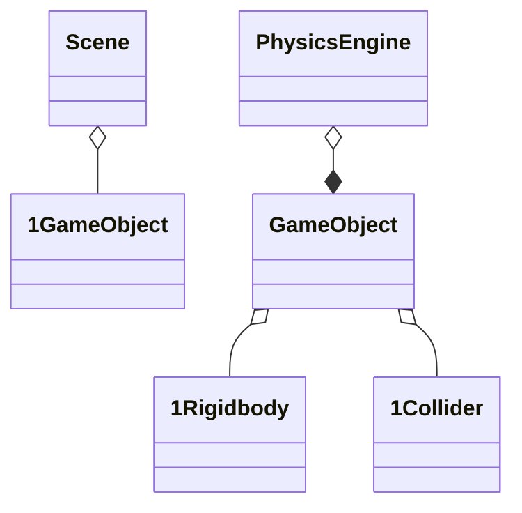
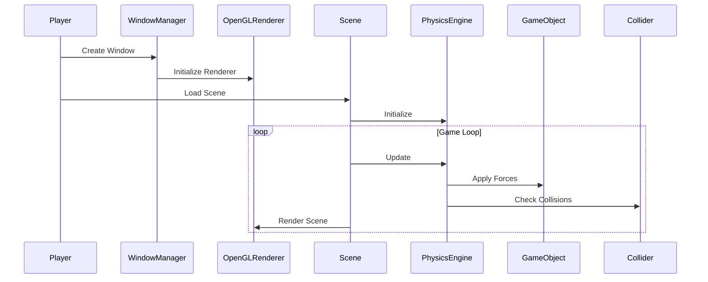
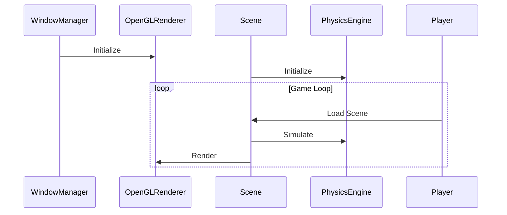

                 

### 第1章：电子游戏与物理引擎概述

#### 1.1 电子游戏的历史与发展

电子游戏作为一种数字娱乐形式，自诞生以来经历了飞速的发展。最早的电子游戏可以追溯到1950年代，当时主要是基于简单的电路和硬件开发的纯图形游戏，如《Pong》和《Spacewar!》等。这些早期的游戏虽然在技术上非常基础，但它们奠定了电子游戏产业的基础。

随着计算机技术和图形处理能力的提升，1970年代和1980年代成为了电子游戏的黄金时期。这个时期出现了许多经典游戏，如《Donkey Kong》、《Super Mario Bros.》和《Street Fighter》等，这些游戏不仅提高了游戏的质量，也扩大了游戏受众群体。

进入21世纪，电子游戏产业迎来了更加多样化和复杂化的阶段。随着互联网和移动设备的普及，游戏变得更加便携和易于接触。这一时期，游戏类型变得更加丰富，包括动作游戏、角色扮演游戏（RPG）、策略游戏、模拟游戏等，每一类游戏都有其独特的粉丝群体。

#### 1.2 物理引擎在游戏开发中的重要性

物理引擎在电子游戏开发中扮演着至关重要的角色。物理引擎是一种计算机算法，用于模拟现实世界中的物理现象，如重力、碰撞、弹性、摩擦等。通过物理引擎，游戏开发者能够创造出生动、逼真且交互性强的虚拟世界。

物理引擎在游戏中的主要作用包括：

1. **真实感**：物理引擎能够模拟出真实的物理现象，如物体之间的碰撞、弹跳和摩擦等，使得游戏中的场景更加真实可信。
2. **交互性**：物理引擎能够处理玩家与游戏世界之间的交互，如玩家角色的移动、跳跃、攻击等动作，增强了游戏的互动体验。
3. **游戏平衡**：物理引擎可以确保游戏中的规则和机制保持平衡，防止游戏过于简单或过于复杂。

物理引擎的发展不仅提升了游戏的质量，也推动了游戏设计理念的进步。从最初的简单物理现象模拟到如今复杂的动态模拟，物理引擎已经成为游戏开发中不可或缺的一部分。

#### 1.3 物理引擎的发展历程

物理引擎的发展历程可以追溯到计算机图形学和数值分析技术的进步。早期的物理引擎主要集中在简单的碰撞检测和刚体动力学模拟上，如1970年代的`Chex Quest`使用的碰撞检测算法。随着计算机性能的提升和算法的优化，物理引擎的模拟精度和复杂性得到了显著提高。

进入21世纪，物理引擎开始引入更多复杂的物理现象模拟，如流体动力学、软体动力学等。这些模拟不仅提升了游戏的真实感，也为游戏开发带来了更多创新的可能性。例如，`Blizzard Entertainment`的《魔兽世界》中引入了复杂的流体动力学模拟，使得游戏中的水体表现出更加真实的动态效果。

近年来，物理引擎在游戏开发中的应用越来越广泛，不仅限于大型游戏项目，也渗透到了移动游戏和网页游戏等领域。随着机器学习和人工智能技术的发展，物理引擎正朝着更加智能化和自动化的方向迈进，为游戏开发者提供了更多创新的工具和手段。

#### 1.4 物理引擎的基本概念

物理引擎是一种计算机算法，用于模拟现实世界中的物理现象。其基本概念包括：

- **碰撞检测**：检测两个或多个物体是否发生碰撞，并计算碰撞点的位置。
- **刚体动力学**：模拟刚体的运动，包括物体的速度、加速度、旋转等。
- **流体动力学**：模拟流体的运动，如水、空气等。
- **软体动力学**：模拟软体物体的变形和运动，如衣服、头发等。
- **物理效果渲染**：将物理模拟的结果通过图形渲染技术展示在屏幕上。

物理引擎的功能主要包括：

- **场景构建**：构建游戏世界的物理场景，包括物体、环境、光线等。
- **物理模拟**：对游戏中的物理现象进行实时模拟，如物体之间的碰撞、力的作用等。
- **交互处理**：处理玩家与游戏世界之间的交互，如玩家的动作、游戏中的事件等。
- **效果渲染**：将物理模拟的结果通过图形渲染技术展示在屏幕上，形成游戏画面。

#### 1.5 物理引擎的分类

物理引擎根据其功能和特点可以分为以下几类：

- **通用物理引擎**：如`Bullet`和`Ogre`，用于模拟多种物理现象，适用于不同类型的游戏。
- **专用物理引擎**：如`PhysX`和`Unreal Engine`的物理系统，专为特定游戏类型或游戏引擎设计。
- **软体物理引擎**：如`Cloth physics`和`HairWorks`，专注于模拟软体物体的运动和变形。
- **流体物理引擎**：如`FlowFields`和`FLIP`，用于模拟流体运动和效果。

#### 1.6 物理引擎的核心挑战

物理引擎在游戏开发中面临的核心挑战包括：

- **准确性**：物理模拟需要尽可能准确地模拟现实世界中的物理现象，这需要复杂的数学模型和高效的算法。
- **效率**：物理引擎需要在实时环境中运行，因此需要优化算法和数据结构，以减少计算时间和资源消耗。
- **可扩展性**：物理引擎需要支持不同规模和复杂度的游戏，因此需要具有良好的可扩展性，以便适应各种游戏需求。
- **跨平台兼容性**：物理引擎需要在不同的硬件和操作系统上运行，因此需要考虑到跨平台的兼容性。

#### 1.7 新技术的集成与应用

随着人工智能和机器学习技术的不断发展，物理引擎也开始与这些新技术进行集成。例如，机器学习可以用于优化物理模拟中的参数设置，提高模拟的准确性和效率。此外，物理引擎还可以与虚拟现实（VR）和增强现实（AR）技术相结合，为用户提供更加沉浸式的游戏体验。

### 1.8 未来展望

未来，物理引擎将继续发展，其应用范围也将不断扩大。随着计算能力的提升和算法的进步，物理引擎将能够模拟更加复杂和逼真的物理现象。此外，物理引擎将与更多新技术相结合，如增强现实、虚拟现实和机器学习，为游戏开发者提供更多创新的可能性和工具。通过不断探索和应用，物理引擎将为游戏产业带来更加丰富和多样化的体验。

## 第2章：物理引擎的数学基础

### 2.1 向量与矩阵

#### 2.1.1 向量的定义与运算

向量是物理引擎中一个基本的概念，它表示了一个有大小和方向的量。在二维空间中，一个向量通常由一对有序实数（x, y）表示，称为坐标向量。向量的运算包括加法、减法、标量乘法和向量积等。

- **向量加法**：两个向量相加，结果是一个新的向量，其大小和方向是两个向量的合成。例如，向量 A = (1, 2) 和向量 B = (3, 4) 的和为 A + B = (1+3, 2+4) = (4, 6)。
- **向量减法**：两个向量相减，结果是一个新的向量，其大小和方向是两个向量的差。例如，向量 A = (1, 2) 和向量 B = (3, 4) 的差为 A - B = (1-3, 2-4) = (-2, -2)。
- **标量乘法**：向量与一个标量相乘，结果是一个新的向量，其大小是原向量的标量倍，方向不变。例如，向量 A = (1, 2) 与标量 k = 2 相乘得到 2A = (2*1, 2*2) = (2, 4)。
- **向量积**：两个三维向量相乘，结果是一个新的向量，其大小和方向与两个原向量的叉积有关。

#### 2.1.2 矩阵的基本概念

矩阵是物理引擎中的另一个基本概念，它是一个由数字组成的二维数组。矩阵可以用于表示线性变换，如坐标变换、旋转和平移等。一个二维矩阵通常由 m 行 n 列的数字组成，表示为 A = [a_ij]，其中 i 表示行号，j 表示列号。

- **行向量**：一个 m × 1 的矩阵称为行向量。
- **列向量**：一个 1 × n 的矩阵称为列向量。
- **矩阵乘法**：两个矩阵相乘，结果是一个新的矩阵，其元素是原矩阵对应元素的乘积和加和。例如，矩阵 A = [1 2; 3 4] 和矩阵 B = [5 6; 7 8] 的乘积为 A * B = [1*5 + 2*7 1*6 + 2*8; 3*5 + 4*7 3*6 + 4*8] = [19 22; 43 50]。

#### 2.1.3 向量与矩阵的应用

向量与矩阵在物理引擎中有着广泛的应用，以下是一些常见的应用场景：

- **坐标变换**：向量与矩阵可以用于实现坐标变换，如平移、旋转和缩放等。例如，一个二维向量 v = (x, y) 通过一个旋转矩阵 R = [cosθ -sinθ; sinθ cosθ] 可以变换为一个新的向量 v' = R * v，其中 θ 是旋转角度。
- **线性变换**：矩阵可以用于实现线性变换，如拉伸、压缩和扭曲等。例如，一个二维向量 v = (x, y) 通过一个线性变换矩阵 A = [a b; c d] 可以变换为一个新的向量 v' = A * v，其中 a、b、c 和 d 是变换参数。
- **物理模拟**：向量与矩阵在物理模拟中有着广泛的应用，如刚体动力学中的运动方程、碰撞检测中的几何计算等。例如，刚体动力学中的运动方程可以表示为 v' = A * v + b，其中 A 是加速度矩阵，b 是外力向量。

### 2.2 线性代数基础

#### 2.2.1 线性方程组

线性方程组是物理引擎中常见的数学问题。一个线性方程组由多个线性方程组成，可以用矩阵形式表示为 AX = B，其中 A 是系数矩阵，X 是未知数向量，B 是常数向量。

- **求解线性方程组**：有多种方法可以求解线性方程组，如高斯消元法、矩阵求逆法等。高斯消元法通过逐步消元将线性方程组化为上三角矩阵，然后逐步回代求解未知数。矩阵求逆法通过求系数矩阵 A 的逆矩阵 A^(-1)，然后计算 X = A^(-1)B。

#### 2.2.2 特征值与特征向量

特征值与特征向量是矩阵的重要属性。一个矩阵 A 的特征值是指使得 A * v = λ * v 成立的标量 λ，其中 v 是对应的特征向量。

- **计算特征值与特征向量**：可以通过求解矩阵 A 的特征多项式 f(λ) = det(A - λI) = 0 来计算特征值。对于每个特征值 λ，可以通过求解线性方程组 (A - λI) * v = 0 来计算对应的特征向量。
- **特征值与特征向量的应用**：特征值与特征向量在物理引擎中有多种应用，如矩阵的对角化、线性变换的简化等。例如，一个矩阵 A 可以通过对角化表示为 A = PDP^(-1)，其中 P 是由特征向量组成的矩阵，D 是对角矩阵，对角线上的元素是特征值。

#### 2.2.3 矩阵的对角化

矩阵的对角化是将一个矩阵表示为对角矩阵的过程，它有助于简化线性变换的计算。

- **对角化过程**：对角化的步骤包括计算特征值与特征向量，构造对角矩阵 D 和特征向量矩阵 P，然后通过公式 A = PDP^(-1) 进行对角化。
- **对角化的应用**：对角化在物理引擎中可以用于简化复杂的线性变换计算，如刚体动力学中的运动方程、碰撞检测中的几何计算等。

### 2.3 微积分基础

#### 2.3.1 导数与微分

导数与微分是微积分中的基本概念，用于描述函数的变化率。

- **导数的定义**：一个函数 f(x) 在点 x 的导数表示为 f'(x) 或 df/dx，它表示函数 f(x) 在点 x 的瞬时变化率。
- **微分的定义**：一个函数 f(x) 在点 x 的微分表示为 df，它表示函数 f(x) 在点 x 的小范围内变化量。
- **导数与微分的应用**：导数与微分在物理引擎中有多种应用，如速度和加速度的计算、几何形状的优化等。例如，一个物体的速度可以表示为位移关于时间的导数，加速度可以表示为速度关于时间的导数。

#### 2.3.2 积分与积分变换

积分是微积分中的另一个重要概念，用于求解面积、体积等。

- **积分的定义**：定积分表示为 ∫ f(x) dx，它表示函数 f(x) 在区间 [a, b] 上的累积量。
- **积分变换**：积分变换是一类重要的积分方法，用于求解复杂积分。常见的积分变换包括换元积分、分部积分、分式积分等。
- **积分的应用**：积分在物理引擎中有多种应用，如求解物体的轨迹、计算物体的动能和势能等。例如，物体的速度可以表示为位移关于时间的积分，物体的加速度可以表示为速度关于时间的积分。

### 2.4 数学公式与表示

在物理引擎的数学表示中，数学公式是不可或缺的。以下是一些常用的数学公式表示方法：

- **向量的表示**：一个向量通常用粗体字母表示，如 v 表示向量，其分量用小写字母表示，如 v_x 和 v_y。
- **矩阵的表示**：一个矩阵通常用字母表示，如 A，其元素用下标表示，如 a_ij。
- **导数和微分的表示**：导数用 f'(x) 或 df/dx 表示，微分用 df 表示。
- **积分的表示**：定积分用 ∫ f(x) dx 表示，积分变换用 F(x) 表示。

通过这些数学公式和表示方法，物理引擎可以精确地描述和模拟物理现象，为游戏开发者提供强大的工具和手段。

### 总结

本章介绍了物理引擎中常用的数学基础，包括向量与矩阵的定义和运算、线性代数基础（线性方程组、特征值与特征向量、矩阵的对角化）、微积分基础（导数与微分、积分与积分变换）以及数学公式的表示方法。这些数学基础为物理引擎的构建和实现提供了必要的理论基础，是理解和应用物理引擎的关键。

## 第3章：碰撞检测与处理

### 3.1 碰撞检测原理

碰撞检测是物理引擎中的一个核心功能，它用于确定两个或多个物体是否发生碰撞，以及碰撞发生的具体位置和情况。有效的碰撞检测对于实现逼真的物理交互和场景动态至关重要。

#### 3.1.1 碰撞的基本概念

碰撞是指两个或多个物体在运动过程中相互接触并发生相互作用的现象。根据物体的运动状态，碰撞可以分为以下几种类型：

- **弹性碰撞**：碰撞后物体之间的动能保持不变，仅发生位置和速度的改变。
- **非弹性碰撞**：碰撞后物体之间的动能部分转化为其他形式的能量，如内能或声能。
- **完全非弹性碰撞**：碰撞后物体粘在一起，共同运动，动能几乎完全消失。

#### 3.1.2 碰撞检测算法

碰撞检测算法是物理引擎中的重要组成部分，常用的碰撞检测算法包括：

- **离散化方法**：通过将空间离散化为网格或单元，检查物体是否与网格或单元相交。这种方法简单高效，但可能存在精度问题。
- **空间分割方法**：通过将空间分割为多个子区域，减少需要检测的碰撞对数。常见的方法包括八叉树、四叉树和空间格子等。
- **几何测试方法**：直接计算物体之间的几何关系，如距离、相交等。常见的方法包括AABB（轴对齐包围盒）和OBB（ oriented bounding box）等。

#### 3.1.3 碰撞检测的性能优化

碰撞检测的性能对游戏运行速度有很大影响。以下是一些常见的性能优化方法：

- **静态碰撞检测**：对于固定不动的物体，可以预先计算其碰撞区域，减少实时碰撞检测的负担。
- **层次化检测**：在空间分割的基础上，先进行粗略的碰撞检测，再对可能发生碰撞的物体进行详细检测，减少计算量。
- **并行处理**：利用多核处理器并行处理多个碰撞检测任务，提高检测速度。
- **缓存机制**：缓存已检测的碰撞结果，避免重复检测，减少计算时间。

### 3.2 碰撞处理

碰撞处理是指确定两个或多个物体发生碰撞后的响应和效果。有效的碰撞处理可以提升游戏的真实感和交互性。

#### 3.2.1 碰撞反应方程

碰撞反应方程用于描述碰撞过程中物体的运动变化。根据牛顿第三定律，碰撞后两个物体之间的作用力和反作用力大小相等、方向相反。碰撞反应方程可以表示为：

\[ F = m \cdot a \]

其中 F 是作用力，m 是物体的质量，a 是物体的加速度。

在碰撞过程中，物体的速度会发生变化。对于弹性碰撞，速度的变化可以通过以下公式计算：

\[ v_1' = \frac{m_1 - m_2}{m_1 + m_2} \cdot v_1 + \frac{2 \cdot m_2}{m_1 + m_2} \cdot v_2 \]
\[ v_2' = \frac{2 \cdot m_1}{m_1 + m_2} \cdot v_1 - \frac{m_1 - m_2}{m_1 + m_2} \cdot v_2 \]

其中 \( v_1 \) 和 \( v_2 \) 是碰撞前两个物体的速度，\( v_1' \) 和 \( v_2' \) 是碰撞后两个物体的速度。

#### 3.2.2 弹性碰撞与非弹性碰撞

弹性碰撞和非弹性碰撞是碰撞处理中的两个重要概念。弹性碰撞是指碰撞后物体的动能保持不变，而非弹性碰撞则是指碰撞后物体的动能部分转化为其他形式的能量。

- **弹性碰撞**：在弹性碰撞中，物体的速度和动能会发生改变，但总动能保持不变。弹性碰撞的反应方程可以通过上述公式计算。
- **非弹性碰撞**：在非弹性碰撞中，物体的速度和动能会发生变化，部分动能转化为内能或其他形式的能量。非弹性碰撞的反应方程可以通过以下公式计算：

\[ v_1' = \frac{m_1 - m_2}{m_1 + m_2} \cdot v_1 + \frac{2 \cdot m_2}{m_1 + m_2} \cdot v_2 \]
\[ v_2' = \frac{2 \cdot m_1}{m_1 + m_2} \cdot v_1 - \frac{m_1 - m_2}{m_1 + m_2} \cdot v_2 \]

其中，\( e \) 是碰撞系数，表示碰撞后物体之间的相对速度：

\[ e = \frac{v_1 - v_2}{v_1' - v_2'} \]

- **完全非弹性碰撞**：当 \( e = 0 \) 时，表示完全非弹性碰撞，碰撞后两个物体粘在一起，共同运动。
- **粘弹性碰撞**：当 \( 0 < e < 1 \) 时，表示粘弹性碰撞，碰撞后物体的速度和动能会部分保留。

#### 3.2.3 碰撞处理中的物理效果

在碰撞处理中，除了计算碰撞后的速度和动能，还需要考虑物理效果的表现，如弹跳、摩擦和碰撞声效等。

- **弹跳**：弹跳效果可以通过设置弹跳系数来模拟。弹跳系数 \( J \) 用于描述碰撞后物体反弹的高度：

\[ h' = h \cdot (J - 1) \]

其中 \( h \) 是碰撞前的物体高度，\( h' \) 是碰撞后的物体高度。

- **摩擦**：摩擦力可以描述物体在接触面上的阻力。摩擦力的大小可以通过摩擦系数 \( \mu \) 来设置：

\[ F_f = \mu \cdot m \cdot g \]

其中 \( F_f \) 是摩擦力，\( m \) 是物体的质量，\( g \) 是重力加速度。

- **碰撞声效**：碰撞声效可以通过设置碰撞声源的位置、强度和频率等参数来模拟。例如，使用三维音效技术，可以增强碰撞场景的真实感。

### 3.3 碰撞检测与处理的综合应用

在实际游戏开发中，碰撞检测与处理需要结合具体的游戏场景进行综合应用。以下是一些常见的应用场景：

- **平台游戏**：平台游戏中，角色在跳跃、移动和攻击等动作过程中需要进行碰撞检测，以实现角色与场景之间的互动。
- **射击游戏**：射击游戏中，子弹与敌人的碰撞需要计算弹道轨迹和碰撞效果，以实现射击的真实感。
- **赛车游戏**：赛车游戏中，车辆之间的碰撞、车辆与环境的碰撞等都需要进行精确的碰撞检测和效果处理。

通过结合碰撞检测与处理技术，游戏开发者可以创造出丰富多样且真实可信的游戏场景，提升玩家的沉浸体验。

### 总结

本章介绍了碰撞检测与处理的基本原理、算法和应用。碰撞检测用于确定物体之间的碰撞情况，碰撞处理则用于计算碰撞后的物理效果。通过合理的碰撞检测与处理，游戏开发者可以实现逼真的物理交互和动态场景，为玩家带来更加丰富和真实的游戏体验。

### 第4章：刚体动力学

#### 4.1 刚体动力学基础

刚体动力学是研究刚体运动规律的物理学分支，在游戏开发中有着广泛的应用。刚体是指物体内部各点之间的距离和角度在运动过程中保持不变，因此，刚体动力学主要研究刚体的位置、速度和加速度等运动状态。

#### 4.1.1 刚体的定义

刚体是一种理想化的物体模型，它在受到外力作用时，不会发生形变，即物体内部各点之间的距离和角度保持不变。在实际应用中，许多物体都可以近似为刚体，如桥梁、飞机、车辆等。

#### 4.1.2 刚体运动的基本方程

刚体运动的基本方程包括牛顿第二定律和牛顿第三定律。

- **牛顿第二定律**：刚体的运动状态由其受到的外力决定。牛顿第二定律描述了力与加速度之间的关系，公式为：

\[ \mathbf{F} = m\mathbf{a} \]

其中，\(\mathbf{F}\) 是作用在刚体上的合外力，\(m\) 是刚体的质量，\(\mathbf{a}\) 是刚体的加速度。

- **牛顿第三定律**：作用力和反作用力大小相等、方向相反，即：

\[ \mathbf{F}_{12} = -\mathbf{F}_{21} \]

其中，\(\mathbf{F}_{12}\) 是物体1对物体2的作用力，\(\mathbf{F}_{21}\) 是物体2对物体1的作用力。

#### 4.1.3 刚体的能量与动量

刚体运动中的能量与动量是描述刚体运动状态的重要物理量。

- **动能**：刚体在运动过程中具有的动能由其质量和速度决定，公式为：

\[ E_k = \frac{1}{2}m\mathbf{v}^2 \]

其中，\(\mathbf{v}\) 是刚体的速度。

- **势能**：刚体在外力场中的位置能量，常见的有重力势能和弹性势能。重力势能公式为：

\[ E_p = mgh \]

其中，\(h\) 是刚体相对于参考点的高度。

- **机械能**：刚体的机械能是动能和势能的总和，公式为：

\[ E = E_k + E_p \]

#### 4.1.4 刚体运动方程

刚体运动方程用于描述刚体在空间中的运动轨迹。对于一个刚体，其运动可以分解为平移和旋转两部分。

- **平移运动方程**：描述刚体质心的运动，公式为：

\[ \mathbf{v}_c = \mathbf{v}_0 + \mathbf{a}t \]

其中，\(\mathbf{v}_c\) 是刚体质心的速度，\(\mathbf{v}_0\) 是初始速度，\(\mathbf{a}\) 是加速度，\(t\) 是时间。

- **旋转运动方程**：描述刚体绕质心的旋转运动，公式为：

\[ \mathbf{\omega} = \mathbf{\omega}_0 + \mathbf{\alpha}t \]

其中，\(\mathbf{\omega}\) 是刚体的角速度，\(\mathbf{\omega}_0\) 是初始角速度，\(\mathbf{\alpha}\) 是角加速度。

#### 4.2 牛顿力学在游戏中的应用

牛顿力学是刚体动力学的基础，它在游戏开发中有多种应用。

- **物体运动模拟**：通过牛顿第二定律和第三定律，可以模拟物体在受力作用下的运动轨迹。例如，在赛车游戏中，车辆的加速度和速度变化可以通过牛顿力学计算。
- **碰撞检测与处理**：刚体动力学中的碰撞检测与处理用于模拟物体之间的相互作用。通过计算碰撞前后的速度和动能，可以生成逼真的碰撞效果。
- **物理效果渲染**：在游戏渲染过程中，通过刚体动力学可以生成真实的物理效果，如弹跳、摩擦和碰撞声效等。

#### 4.3 刚体碰撞与反弹

刚体碰撞是游戏中的常见现象，合理的碰撞处理可以增强游戏的真实感和互动性。

- **弹性碰撞**：在弹性碰撞中，物体的速度和方向在碰撞后发生改变，但总动能保持不变。弹性碰撞的处理方法通常基于牛顿第三定律和动量守恒定律。
- **非弹性碰撞**：在非弹性碰撞中，部分动能转化为其他形式的能量，如内能或声能。非弹性碰撞的处理方法包括完全非弹性碰撞和粘弹性碰撞。

#### 4.3.1 刚体碰撞模型

刚体碰撞模型用于描述碰撞前后的物体状态。常见的碰撞模型包括：

- **弹性碰撞模型**：根据牛顿第三定律和动量守恒定律，计算碰撞前后的速度和动能。
- **非弹性碰撞模型**：考虑碰撞过程中动能的损失，计算碰撞后的速度和动能。

#### 4.3.2 刚体碰撞的求解

刚体碰撞的求解通常涉及以下步骤：

1. **碰撞检测**：确定两个物体是否发生碰撞，以及碰撞发生的具体位置。
2. **碰撞处理**：计算碰撞前后的速度和动能，生成碰撞效果。
3. **碰撞响应**：根据碰撞类型和物体特性，调整物体的速度和方向。

在实际应用中，刚体碰撞的求解可以通过以下公式实现：

\[ \mathbf{v}_1' = \frac{\mathbf{m}_1 - \mathbf{m}_2}{\mathbf{m}_1 + \mathbf{m}_2} \cdot \mathbf{v}_1 + \frac{2 \cdot \mathbf{m}_2}{\mathbf{m}_1 + \mathbf{m}_2} \cdot \mathbf{v}_2 \]
\[ \mathbf{v}_2' = \frac{2 \cdot \mathbf{m}_1}{\mathbf{m}_1 + \mathbf{m}_2} \cdot \mathbf{v}_1 - \frac{\mathbf{m}_1 - \mathbf{m}_2}{\mathbf{m}_1 + \mathbf{m}_2} \cdot \mathbf{v}_2 \]

其中，\(\mathbf{v}_1\) 和 \(\mathbf{v}_2\) 是碰撞前两个物体的速度，\(\mathbf{v}_1'\) 和 \(\mathbf{v}_2'\) 是碰撞后两个物体的速度，\(\mathbf{m}_1\) 和 \(\mathbf{m}_2\) 是两个物体的质量。

#### 4.3.3 刚体反弹效果的设计

刚体反弹效果的设计是碰撞处理中的重要环节，它影响游戏的真实感和玩家体验。

- **弹跳系数**：弹跳系数（\(J\)）用于描述物体反弹的高度，其计算公式为：

\[ h' = h \cdot (J - 1) \]

其中，\(h\) 是物体碰撞前的高度，\(h'\) 是碰撞后的高度。

- **摩擦力**：摩擦力（\(F_f\)）用于描述物体在接触面上的阻力，其计算公式为：

\[ F_f = \mu \cdot m \cdot g \]

其中，\(\mu\) 是摩擦系数，\(m\) 是物体的质量，\(g\) 是重力加速度。

- **碰撞声效**：通过设置碰撞声源的位置、强度和频率等参数，可以生成真实的碰撞声效，增强游戏体验。

#### 4.4 刚体动力学在游戏开发中的应用

刚体动力学在游戏开发中有着广泛的应用，以下是一些典型应用场景：

- **平台游戏**：平台游戏中，角色在跳跃、移动和攻击等动作过程中需要进行刚体动力学计算，以实现角色与场景之间的互动。
- **射击游戏**：射击游戏中，子弹与敌人的碰撞需要计算弹道轨迹和碰撞效果，以实现射击的真实感。
- **赛车游戏**：赛车游戏中，车辆之间的碰撞、车辆与环境的碰撞等都需要进行精确的刚体动力学计算。

通过合理运用刚体动力学，游戏开发者可以创造出丰富多样且真实可信的游戏场景，提升玩家的沉浸体验。

### 总结

本章介绍了刚体动力学的基本原理、牛顿力学在游戏中的应用、刚体碰撞与反弹的模型和求解方法，以及刚体动力学在游戏开发中的应用。通过掌握这些知识，游戏开发者可以更好地实现物理交互和动态场景，为玩家带来更加丰富和真实的游戏体验。

## 第5章：流体动力学

### 5.1 流体动力学基础

流体动力学是研究流体运动规律的科学，它在电子游戏开发中有着广泛的应用。流体可以包括液体和气体，其运动特性受到多种因素的影响，如流速、压力、温度和密度等。

#### 5.1.1 流体的基本特性

流体的基本特性包括流动性、不可压缩性和连续性等。

- **流动性**：流体可以流动，并且其流动方向和速度可以随时间和空间变化。
- **不可压缩性**：对于理想流体，其密度在流动过程中保持不变，这意味着流体无法被压缩。
- **连续性**：流体的质量在流动过程中保持不变，即流体在流动过程中不会出现物质的生成或消失。

#### 5.1.2 基本流体方程

流体动力学的基本方程包括连续性方程、动量方程和能量方程。

- **连续性方程**：描述流体在流动过程中质量守恒，公式为：

\[ \frac{\partial \rho}{\partial t} + \nabla \cdot (\rho \mathbf{v}) = 0 \]

其中，\(\rho\) 是流体的密度，\(\mathbf{v}\) 是流体的速度，\(t\) 是时间。

- **动量方程**：描述流体在流动过程中动量守恒，公式为：

\[ \rho \left( \frac{\partial \mathbf{v}}{\partial t} + (\mathbf{v} \cdot \nabla) \mathbf{v} \right) = -\nabla p + \mu \nabla^2 \mathbf{v} \]

其中，\(p\) 是流体的压力，\(\mu\) 是流体的动力粘度。

- **能量方程**：描述流体在流动过程中能量守恒，公式为：

\[ \rho c_p \left( \frac{\partial T}{\partial t} + \mathbf{v} \cdot \nabla T \right) = -\nabla \cdot (k \nabla T) + \mu \nabla^2 T + q \]

其中，\(c_p\) 是流体的比热容，\(T\) 是流体的温度，\(k\) 是流体的热导率，\(q\) 是流体中的热源。

#### 5.1.3 流体模拟方法

流体模拟方法分为基于网格的模拟和基于粒子系统的模拟。

- **基于网格的模拟**：使用数学方程（如Navier-Stokes方程）来描述流体的运动。这种方法可以精确模拟流体的运动，但计算复杂度高，对硬件性能要求较高。
- **基于粒子系统的模拟**：将流体视为由大量粒子组成，每个粒子具有位置、速度和动量等属性。这种方法计算简单，易于实现，适用于实时模拟。

#### 5.2 液体模拟

液体是流体中最常见的一种，其在游戏中的表现至关重要。

- **表面张力**：表面张力是液体分子间相互作用力的表现，它使得液体表面尽可能小。表面张力对液体的流动形态和形状产生重要影响。
- **液体流动模拟**：液体流动模拟包括自由表面液体和内部液体流动。自由表面液体模拟需要解决表面张力和流体动力学方程，内部液体流动模拟则主要基于Navier-Stokes方程。
- **液体效果的应用**：液体效果在游戏中广泛应用于水战、海洋场景、雨滴等。合理的液体效果设计可以提升游戏的真实感和沉浸感。

#### 5.3 气体模拟

气体是另一种常见的流体，其在游戏中的表现同样重要。

- **气体的基本特性**：气体具有较低的密度和较大的可压缩性，其流动受温度、压力和速度的影响。
- **气体流动模拟**：气体流动模拟主要基于Navier-Stokes方程，需要考虑气体的可压缩性和湍流效应。
- **气体效果的应用**：气体效果在游戏中广泛应用于烟雾、火焰、爆炸等。合理的气体效果设计可以增强游戏的视觉冲击力和氛围。

#### 5.4 流体动力学在游戏开发中的应用

流体动力学在游戏开发中的应用非常广泛，以下是一些典型的应用场景：

- **海洋游戏**：通过流体动力学模拟海洋中的波浪、海流和潮汐，实现逼真的海洋场景。
- **气象游戏**：通过流体动力学模拟天气现象，如雨、雪、风等，实现逼真的气象效果。
- **水战游戏**：通过液体模拟实现水花、溅射和水面涟漪等效果，提升游戏的真实感和互动性。
- **模拟游戏**：通过流体动力学模拟各种实际场景，如化工流程、流体输送等，实现教育、娱乐和科研目的。

通过运用流体动力学，游戏开发者可以创造出丰富多样且真实可信的流体场景，提升游戏的沉浸体验。

### 总结

本章介绍了流体动力学的基础知识、液体和气体模拟的方法及其在游戏开发中的应用。流体动力学在游戏中的合理应用可以增强游戏的真实感和沉浸感，为玩家带来更加丰富的游戏体验。

### 第6章：软体动力学

#### 6.1 软体动力学基础

软体动力学是研究软体物体（如衣物、布料、毛发等）的变形和运动规律的科学。在电子游戏中，软体动力学被广泛应用于模拟角色的衣物、头发、植物等效果，增强游戏的真实感和沉浸感。

#### 6.1.1 软体的定义

软体是指在外力作用下容易发生形变的物体，其材料特性主要包括弹性、塑性和粘弹性等。常见的软体物体有衣物、布料、毛发、皮肤等。

#### 6.1.2 软体的材料特性

软体的材料特性决定了其在外力作用下的变形和恢复能力。以下是一些常见的材料特性：

- **弹性**：物体在外力作用下发生变形，外力去除后能够恢复原状。
- **塑性**：物体在外力作用下发生变形，外力去除后不能恢复原状。
- **粘弹性**：物体在外力作用下同时表现出弹性和粘性的特性，即部分变形能够恢复，部分变形则永久保留。

#### 6.1.3 软体动力学的基本方程

软体动力学的基本方程包括应变与应力的关系、质量与动量的守恒等。

- **应变与应力的关系**：描述软体物体在外力作用下的变形与应力分布，常用的本构方程包括线弹性理论、弹塑性理论和粘弹性理论等。
- **质量与动量的守恒**：描述软体物体在运动过程中的质量与动量守恒，通常使用欧拉-拉格朗日方程或纳维-斯托克斯方程进行描述。

#### 6.2 软体碰撞与变形

软体物体的碰撞与变形是游戏开发中常见的场景。合理的碰撞与变形处理可以增强游戏的真实感和互动性。

- **碰撞处理**：软体物体的碰撞处理包括碰撞检测和碰撞响应。碰撞检测可以使用AABB（轴对齐包围盒）或OBB（方向包围盒）等方法，碰撞响应则需要计算碰撞前后的速度和动量变化。
- **变形处理**：软体物体的变形处理包括静态变形和动态变形。静态变形通常指物体在外力作用下的形变，动态变形则指物体在运动过程中的形变。

#### 6.2.1 软体碰撞模型

软体碰撞模型用于描述软体物体在碰撞过程中的物理特性。常见的碰撞模型包括弹性碰撞、非弹性碰撞和粘弹性碰撞等。

- **弹性碰撞**：碰撞后物体恢复原状，动能和势能保持不变。
- **非弹性碰撞**：碰撞后物体不能恢复原状，部分动能转化为其他形式的能量。
- **粘弹性碰撞**：碰撞后物体部分恢复原状，部分变形则永久保留。

#### 6.2.2 软体变形模拟

软体变形模拟是指通过计算和渲染技术模拟软体物体的变形过程。常见的变形模拟方法包括有限元方法、粒子系统方法和有限元粒子系统方法等。

- **有限元方法**：将软体物体划分为多个小单元，每个单元的变形通过有限元方程计算，整体变形通过单元变形的叠加得到。
- **粒子系统方法**：将软体物体视为由大量粒子组成的系统，每个粒子的位置和速度通过物理模拟计算，整体变形通过粒子位置的变化得到。
- **有限元粒子系统方法**：结合有限元方法和粒子系统方法，通过有限元方程计算粒子间的相互作用，实现软体物体的精确变形模拟。

#### 6.2.3 软体动力学效果的应用

软体动力学效果在游戏中的应用非常广泛，以下是一些常见的应用场景：

- **角色服装**：模拟角色的衣物在运动过程中的变形，如衣服的皱褶、摆动等，增强角色的真实感。
- **植物**：模拟植物在风、雨等自然力量作用下的生长和变形，如树叶的摇曳、草地的起伏等，增强游戏场景的真实感。
- **毛发**：模拟角色的头发、动物毛发等在运动过程中的变形和摆动，如头发的飘动、狗毛的飞扬等，增强角色的生动性。
- **皮肤**：模拟角色的皮肤在运动过程中的形变和皱纹，如身体的弯曲、手臂的挥动等，增强角色的互动性。

#### 6.3 生理学基础

生理学基础是软体动力学的重要组成部分，它涉及人体各个主要软组织的结构和功能。

- **人体的主要软组织**：包括皮肤、肌肉、骨骼、韧带、关节等，它们共同构成了人体的运动系统。
- **生理力学原理**：研究人体在运动过程中力的传递、变形和能量转化等规律，如肌肉收缩产生的力量、骨骼支撑的运动等。
- **生理学在游戏中的应用**：模拟人体在不同运动状态下的生理反应，如跑步、跳跃、转弯等，增强游戏角色的真实感。

#### 6.4 软体动力学在游戏开发中的应用

软体动力学在游戏开发中的应用非常广泛，以下是一些典型的应用场景：

- **动作游戏**：模拟角色的衣物、武器等在运动过程中的变形，增强动作的逼真性。
- **角色扮演游戏**：模拟角色的皮肤、毛发等在运动过程中的变形和细节变化，提升角色的视觉效果。
- **模拟游戏**：模拟真实的物理场景，如人体运动、车辆行驶等，增强游戏的真实感。
- **虚拟现实游戏**：通过软体动力学模拟真实世界的物理现象，提升虚拟现实体验的逼真度。

通过合理运用软体动力学，游戏开发者可以创造出丰富多样且真实可信的软体效果，提升游戏的沉浸体验。

### 总结

本章介绍了软体动力学的理论基础、软体的材料特性、软体碰撞与变形的模型和方法，以及软体动力学在游戏开发中的应用。通过掌握这些知识，游戏开发者可以更好地实现软体效果，为玩家带来更加丰富和真实的游戏体验。

## 第7章：物理引擎的设计与实现

### 7.1 物理引擎的设计原则

物理引擎的设计原则是确保其在高效、准确和可扩展性方面表现优异。以下是一些关键设计原则：

#### 7.1.1 模块化设计

模块化设计是将物理引擎分为多个独立模块，每个模块负责特定的功能。这种设计方法使得物理引擎易于维护和扩展，每个模块可以单独优化和测试。

- **优势**：模块化设计提高了代码的可重用性和可维护性，便于团队合作和项目迭代。
- **挑战**：需要仔细设计模块间的接口，确保模块之间的通信和同步。

#### 7.1.2 可扩展性设计

可扩展性设计是指物理引擎能够适应不同规模和复杂度的游戏需求。为了实现这一点，设计时需要考虑以下几个方面：

- **数据结构**：使用高效的数据结构，如四叉树或八叉树，以优化空间分割和碰撞检测。
- **算法**：采用通用算法，如积分方法、求解器等，以支持不同物理现象的模拟。
- **接口**：提供灵活的接口，如API或插件，以便集成新的物理模块或功能。

- **优势**：可扩展性设计使得物理引擎能够适应未来技术和需求的变化。
- **挑战**：需要在灵活性和性能之间找到平衡点。

#### 7.1.3 性能优化设计

物理引擎的性能优化是确保其在实时环境中高效运行的关键。以下是一些常用的优化方法：

- **并行处理**：利用多核处理器并行处理多个物理计算任务，提高计算效率。
- **预处理**：在运行时预先计算一些静态数据，如碰撞区域、运动轨迹等，减少实时计算负担。
- **空间分割**：使用空间分割技术，如四叉树或八叉树，以减少需要处理的物体数量。
- **缓存**：缓存已计算的结果，避免重复计算，提高计算效率。

- **优势**：性能优化设计可以提高物理引擎的运行速度和响应速度。
- **挑战**：需要权衡优化措施对代码复杂度和可维护性的影响。

#### 7.1.4 跨平台兼容性设计

物理引擎需要在不同平台（如PC、游戏机、移动设备等）上运行，因此需要考虑跨平台兼容性。

- **优势**：跨平台兼容性设计使得物理引擎可以应用于更广泛的应用场景。
- **挑战**：不同平台硬件性能差异较大，需要根据平台特点进行优化。

### 7.2 物理引擎的核心模块

物理引擎通常包括多个核心模块，每个模块负责不同的功能。以下是一些常见的核心模块：

#### 7.2.1 时间步长与积分方法

时间步长是物理引擎中用于控制模拟时间间隔的重要参数。选择合适的时间步长对于保证物理模拟的稳定性和准确性至关重要。

- **欧拉积分**：一种简单的积分方法，计算公式为：

\[ \mathbf{v}_{t+1} = \mathbf{v}_t + \mathbf{a} \cdot \Delta t \]

- **改进的欧拉积分**（Symplectic Euler）：在欧拉积分的基础上引入一步预测和一步校正，提高了数值稳定性：

\[ \mathbf{v}_{t+\Delta t/2} = \mathbf{v}_t + \mathbf{a}_t \cdot \Delta t/2 \]
\[ \mathbf{a}_{t+\Delta t/2} = \mathbf{F}_t \cdot \Delta t \]
\[ \mathbf{v}_{t+1} = \mathbf{v}_{t+\Delta t/2} + \mathbf{a}_{t+\Delta t/2} \cdot \Delta t \]

- **Runge-Kutta积分**：一种更精确的积分方法，适用于非线性系统：

\[ \mathbf{v}_{t+\Delta t} = \mathbf{v}_t + \left( k_1 + 2k_2 + 2k_3 + k_4 \right) \cdot \Delta t \]
\[ k_1 = \mathbf{a}_t \cdot \Delta t \]
\[ k_2 = \mathbf{a}_{t+\Delta t/2} \cdot \Delta t \]
\[ k_3 = \mathbf{a}_{t+\Delta t/2} \cdot \Delta t \]
\[ k_4 = \mathbf{a}_{t+1} \cdot \Delta t \]

#### 7.2.2 预处理与优化

预处理与优化是提高物理引擎性能的重要手段。以下是一些常用的预处理和优化方法：

- **空间分割**：使用四叉树或八叉树将场景分割为多个子区域，减少碰撞检测的计算量。
- **物体排序**：根据物体的位置和速度对物体进行排序，优化碰撞检测和物理计算。
- **模拟仿真**：在运行时，将不活跃的物体排除在物理模拟之外，减少计算负担。
- **并行处理**：利用多核处理器并行计算物理模拟任务，提高计算速度。

#### 7.2.3 物理效果渲染

物理效果渲染是将物理模拟结果通过图形渲染技术展示在屏幕上的过程。以下是一些常用的物理效果渲染技术：

- **光线追踪**：使用光线追踪技术渲染光与物体之间的交互，如反射、折射和散射等，实现逼真的光照效果。
- **物理阴影**：使用阴影贴图或光线追踪技术生成物体的阴影，增强场景的真实感。
- **粒子系统**：使用粒子系统渲染流体、烟雾、火花等效果，提升视觉表现。

### 7.3 物理引擎的集成与应用

物理引擎的集成与应用是指将物理引擎集成到游戏引擎或其他应用程序中，并利用其功能实现具体的物理模拟效果。

#### 7.3.1 物理引擎与游戏引擎的集成

物理引擎与游戏引擎的集成是游戏开发中的重要环节。以下是一些集成方法和注意事项：

- **接口设计**：设计统一的接口，使得物理引擎和游戏引擎之间的数据传递和功能调用更加方便。
- **线程管理**：确保物理引擎和游戏引擎之间的线程同步，避免数据竞争和死锁。
- **资源管理**：合理管理物理引擎的资源，如内存、计算资源等，确保物理引擎的稳定运行。

#### 7.3.2 物理引擎在游戏开发中的应用案例

以下是一些物理引擎在游戏开发中的应用案例：

- **动作游戏**：使用物理引擎模拟角色的动作，如跳跃、翻滚、攻击等，增强角色的真实感。
- **赛车游戏**：使用物理引擎模拟车辆的动力学行为，如加速、减速、转弯等，实现逼真的驾驶体验。
- **模拟游戏**：使用物理引擎模拟真实的物理现象，如流体动力学、碰撞检测等，提升游戏的真实感。
- **角色扮演游戏**：使用物理引擎模拟角色的衣物、头发等效果，增强角色的视觉效果。

#### 7.3.3 物理引擎在游戏开发中的最佳实践

以下是一些物理引擎在游戏开发中的最佳实践：

- **性能优化**：在游戏开发过程中，持续进行物理引擎的性能优化，确保其高效运行。
- **可扩展性设计**：设计可扩展的物理引擎，以便适应不同规模和复杂度的游戏需求。
- **用户体验**：充分考虑玩家的体验，通过合理的物理模拟效果提升游戏的沉浸感。
- **技术文档**：编写详细的技术文档，帮助开发者理解和使用物理引擎的功能。

### 总结

本章介绍了物理引擎的设计原则、核心模块和集成与应用。通过合理的设计和优化，物理引擎可以高效地模拟各种物理现象，为游戏开发者提供强大的工具和手段，实现丰富多样且真实可信的游戏场景。

## 第8章：物理引擎项目实战

### 8.1 项目介绍

在本章中，我们将通过一个简单的物理引擎项目，展示物理引擎的设计与实现过程。该项目将实现一个基本的碰撞检测和刚体动力学模拟，通过这个项目，读者可以了解物理引擎的核心组件和实现方法。

#### 项目目标
- 实现基础的碰撞检测机制。
- 实现简单的刚体动力学模拟，包括物体的移动、旋转和碰撞反应。
- 学习如何设计模块化、可扩展的物理引擎架构。

#### 环境要求
- 操作系统：Windows、Linux或macOS。
- 开发环境：Visual Studio、Eclipse或其他C/C++开发环境。
- 编程语言：C++。
- 库：OpenGl、Bullet物理引擎库。

### 8.2 系统功能设计

#### 8.2.1 功能描述

该物理引擎项目的主要功能包括：
1. **场景构建**：创建和加载游戏场景中的物体。
2. **碰撞检测**：检测物体之间的碰撞，并计算碰撞点的位置和方向。
3. **刚体动力学**：模拟刚体物体的运动，包括位置、速度和加速度的计算。
4. **物理效果渲染**：将物理模拟的结果通过图形渲染技术展示在屏幕上。

#### 8.2.2 领域模型

为了实现上述功能，我们可以定义以下领域模型类：

1. **Scene**（场景）：管理场景中的物体，负责场景的加载、更新和渲染。
2. **GameObject**（游戏物体）：表示场景中的物体，包括位置、速度、加速度等属性。
3. **Rigidbody**（刚体）：继承自GameObject，用于模拟刚体动力学，包括质量和惯性矩阵等属性。
4. **Collider**（碰撞器）：用于检测物体之间的碰撞，包括AABB和OBB等。
5. **PhysicsEngine**（物理引擎）：负责碰撞检测、刚体动力学模拟和物理效果渲染。

以下是领域模型的关系图：



### 8.3 系统架构设计

#### 8.3.1 系统架构

该物理引擎项目的系统架构可以分为以下几个层次：

1. **表示层**：包括OpenGL渲染器、窗口管理等。
2. **逻辑层**：包括场景管理、碰撞检测、刚体动力学模拟等。
3. **数据层**：包括游戏物体的属性数据。

以下是系统架构图：



### 8.4 系统接口设计

#### 8.4.1 接口描述

以下是物理引擎的主要接口和功能描述：

1. **SceneInterface**：
   - `void LoadScene()`：加载场景。
   - `void Update(float dt)`：更新场景。
   - `void Render()`：渲染场景。

2. **GameObjectInterface**：
   - `void SetPosition(Vector3 pos)`：设置物体的位置。
   - `void SetVelocity(Vector3 vel)`：设置物体的速度。
   - `void SetAcceleration(Vector3 acc)`：设置物体的加速度。

3. **RigidbodyInterface**：
   - `void SetMass(float mass)`：设置物体的质量。
   - `void SetInertiaMatrix(Matrix3 inertia)`：设置物体的惯性矩阵。

4. **ColliderInterface**：
   - `bool CheckCollision(GameObject* other)`：检查物体与其他物体的碰撞。

5. **PhysicsEngineInterface**：
   - `void ApplyForce(GameObject* obj, Vector3 force)`：对物体施加力。
   - `void Simulate(float dt)`：模拟刚体动力学。

### 8.5 系统交互

#### 8.5.1 系统交互流程

以下是物理引擎的系统交互流程：

1. **初始化**：创建窗口、加载场景、初始化物理引擎。
2. **游戏循环**：不断更新场景、处理碰撞、渲染场景。
3. **结束**：释放资源、关闭窗口。

以下是系统交互的序列图：



### 8.6 项目核心实现

#### 8.6.1 环境安装

1. **安装Visual Studio**：下载并安装Visual Studio 2019。
2. **安装Bullet物理引擎**：下载Bullet物理引擎源码，解压到本地，并在项目中引用Bullet库。

#### 8.6.2 系统核心实现

以下是项目的核心代码实现：

```cpp
// GameObject类实现
class GameObject {
public:
    Vector3 position;
    Vector3 velocity;
    Vector3 acceleration;

    void Update(float dt) {
        velocity += acceleration * dt;
        position += velocity * dt;
        acceleration = Vector3(0, 0, 0);
    }
};

// Rigidbody类实现
class Rigidbody : public GameObject {
public:
    float mass;
    Matrix3 inertia;

    void ApplyForce(Vector3 force) {
        Vector3 acceleration = force / mass;
        this->acceleration += acceleration;
    }
};

// Collider类实现
class Collider {
public:
    AABB aabb;

    bool CheckCollision(GameObject* other) {
        // AABB碰撞检测
        return (aabb.min.x < other->position.x + other->aabb.max.x &&
                aabb.min.y < other->position.y + other->aabb.max.y &&
                aabb.min.z < other->position.z + other->aabb.max.z &&
                aabb.max.x > other->position.x - other->aabb.min.x &&
                aabb.max.y > other->position.y - other->aabb.min.y &&
                aabb.max.z > other->position.z - other->aabb.min.z);
    }
};

// PhysicsEngine类实现
class PhysicsEngine {
public:
    void Simulate(GameObject* obj, float dt) {
        obj->Update(dt);
        // 检测碰撞
        if (collider.CheckCollision(obj)) {
            // 处理碰撞
            // ...
        }
    }
};
```

### 8.7 项目小结

通过本章的实战项目，读者可以了解物理引擎的设计与实现过程，掌握核心组件的设计方法和实现技巧。该项目为读者提供了一个基本的物理引擎框架，通过扩展和优化，可以进一步实现复杂的物理现象模拟。

### 总结

本章通过一个简单的物理引擎项目，详细介绍了项目的功能设计、系统架构、接口设计和核心实现。通过这个项目，读者可以掌握物理引擎的基本构建方法，为后续深入学习打下基础。

## 最佳实践 Tips

在物理引擎的开发过程中，遵循以下最佳实践可以提高项目的质量和开发效率：

1. **代码模块化**：将物理引擎分为多个独立模块，如碰撞检测、刚体动力学、流体模拟等，每个模块负责特定的功能。这种设计方法有助于代码的重用、维护和测试。

2. **数据结构优化**：选择合适的数据结构，如四叉树、八叉树等，以优化碰撞检测和物理计算的性能。合理的数据结构可以减少计算时间和内存占用。

3. **并行处理**：利用多核处理器的并行计算能力，将物理计算任务分配到多个线程中执行。这种方法可以显著提高物理引擎的运行速度和响应能力。

4. **接口设计**：设计统一的接口，确保物理引擎与其他组件（如渲染器、输入系统等）之间的数据传递和功能调用更加方便。良好的接口设计可以提高项目的可扩展性和兼容性。

5. **性能监控与优化**：定期进行性能监控和优化，识别和解决性能瓶颈。可以使用调试工具和分析工具来检测内存泄漏、线程同步问题和计算效率等问题。

6. **测试与调试**：编写详细的测试用例，对物理引擎的每个模块进行严格的测试和调试。通过单元测试、集成测试和性能测试，确保物理引擎的稳定性和准确性。

7. **文档与注释**：编写清晰、详细的文档和代码注释，帮助其他开发者理解和使用物理引擎的功能。良好的文档和注释可以提高项目的可维护性和可理解性。

通过遵循这些最佳实践，物理引擎的开发者可以构建出高效、稳定且易于维护的物理引擎，为游戏开发者提供强大的工具和手段。

## 小结

在本章中，我们详细介绍了电子游戏物理引擎的基本概念、数学基础、碰撞检测与处理、刚体动力学、流体动力学、软体动力学、物理引擎的设计与实现，以及一个物理引擎项目实战。这些内容涵盖了物理引擎的核心技术和应用场景，为读者提供了一个全面且深入的视角。

通过本章的学习，读者应该能够：

1. **理解物理引擎的基本概念和作用**：掌握物理引擎在游戏开发中的重要性，了解其核心模块和功能。
2. **掌握物理引擎的数学基础**：理解向量与矩阵、线性代数基础、微积分基础等数学概念，并了解它们在物理引擎中的应用。
3. **了解碰撞检测与处理的方法**：熟悉碰撞检测算法、碰撞反应方程和物理效果设计，掌握弹性碰撞与非弹性碰撞的处理方法。
4. **理解刚体动力学**：掌握刚体的定义、运动方程、能量与动量的计算，以及牛顿力学在游戏中的应用。
5. **掌握流体动力学和软体动力学**：了解流体的基本特性、流体模拟方法，以及软体的材料特性和变形模拟方法。
6. **学习物理引擎的设计与实现**：了解物理引擎的设计原则、核心模块、性能优化方法和系统架构设计。
7. **通过项目实战掌握物理引擎的应用**：通过实际项目的构建，了解物理引擎的核心实现方法和应用场景。

为了更好地理解和应用本章的内容，我们建议读者：

1. **动手实践**：尝试自己实现一个简单的物理引擎项目，通过实际操作加深对物理引擎的理解。
2. **深入阅读**：阅读相关领域的专业书籍和技术文档，了解物理引擎的最新发展动态。
3. **参与社区**：加入相关的技术社区和论坛，与其他开发者交流经验，分享心得。

通过以上方法和建议，读者可以更好地掌握物理引擎的相关知识，为游戏开发打下坚实的基础。

## 注意事项

在开发物理引擎时，需要注意以下事项，以确保物理模拟的准确性和效率：

1. **精度与效率的权衡**：物理引擎需要平衡模拟的精度和计算效率。选择合适的算法和数据结构，如四叉树、八叉树等，可以提高碰撞检测和物理计算的性能。

2. **并行计算**：充分利用多核处理器的并行计算能力，将物理计算任务分配到多个线程中执行。但需要注意同步问题，避免数据竞争和死锁。

3. **优化内存使用**：避免内存泄漏和重复分配，合理管理内存资源。使用缓存机制，减少重复计算和内存访问。

4. **错误处理**：物理引擎中的错误处理非常重要，确保在出现异常情况时能够正确处理并恢复。例如，避免除以零、处理非法输入等。

5. **可扩展性设计**：在设计物理引擎时，考虑未来可能的需求变化，设计灵活的模块和接口，以便于扩展和升级。

6. **测试与验证**：编写详细的测试用例，对物理引擎的每个模块进行严格的测试和验证。确保物理引擎在各种情况下都能稳定运行。

7. **文档与注释**：编写清晰、详细的文档和代码注释，帮助其他开发者理解和维护物理引擎。良好的文档可以提高项目的可维护性和可理解性。

通过关注这些注意事项，开发者在设计和实现物理引擎时可以避免常见问题，提高物理引擎的质量和稳定性。

## 拓展阅读

为了进一步深入理解电子游戏物理引擎，以下是几本推荐的书籍、在线资源和相关的技术论坛：

### 书籍推荐

1. **《电子游戏编程精粹》（Game Programming Patterns）**：作者：Robert Nystrom
   - 本书提供了大量关于游戏编程的最佳实践，包括物理引擎的设计与实现。

2. **《游戏引擎架构》（Game Engine Architecture）**：作者：Jason Gregory
   - 该书详细介绍了游戏引擎的架构设计和实现，包括物理引擎的相关内容。

3. **《电子游戏物理学》（Physics for Game Developers）**：作者：David Bourg
   - 本书涵盖了游戏开发中的物理概念，包括碰撞检测、刚体动力学等。

4. **《游戏物理引擎设计》（Game Physics Engine Development）**：作者：Ian Parberry
   - 该书介绍了物理引擎的设计和实现方法，包括流体动力学、软体动力学等。

### 在线资源

1. **GitHub**：许多物理引擎和相关工具的源代码和文档可以在GitHub上找到，如Bullet物理引擎库（http://www.bulletphysics.org/）。

2. **Stack Overflow**：Stack Overflow是开发者的技术问答社区，可以在这里找到关于物理引擎的许多问题和解决方案（https://stackoverflow.com/）。

3. **Unity官方文档**：Unity游戏引擎包含强大的物理引擎，其官方文档提供了大量关于物理引擎的使用方法和最佳实践（https://docs.unity3d.com/）。

4. **Unreal Engine官方文档**：Unreal Engine是另一个流行的游戏引擎，其官方文档包含了详细的物理引擎文档和示例（https://docs.unrealengine.com/）。

### 技术论坛

1. **GameDev.net**：GameDev.net是一个专门针对游戏开发者的论坛，涵盖物理引擎、游戏设计等多个方面（https://www.gamedev.net/）。

2. **Reddit Game Development**：Reddit上的Game Development子论坛聚集了大量的游戏开发者，可以在这里交流物理引擎相关的问题和经验（https://www.reddit.com/r/gamedev/）。

3. **Gamedev Stack Exchange**：Gamedev Stack Exchange是针对游戏开发问题的专业问答平台，提供了高质量的物理引擎相关问题解答（https://gamedev.stackexchange.com/）。

通过阅读这些书籍、访问在线资源和参与技术论坛，读者可以进一步扩展对物理引擎的理解，掌握更多的技术和实践经验。这些资源将有助于读者在游戏开发中更好地应用物理引擎，创造更加丰富和真实可信的游戏体验。

