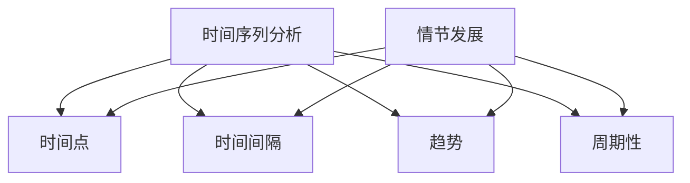
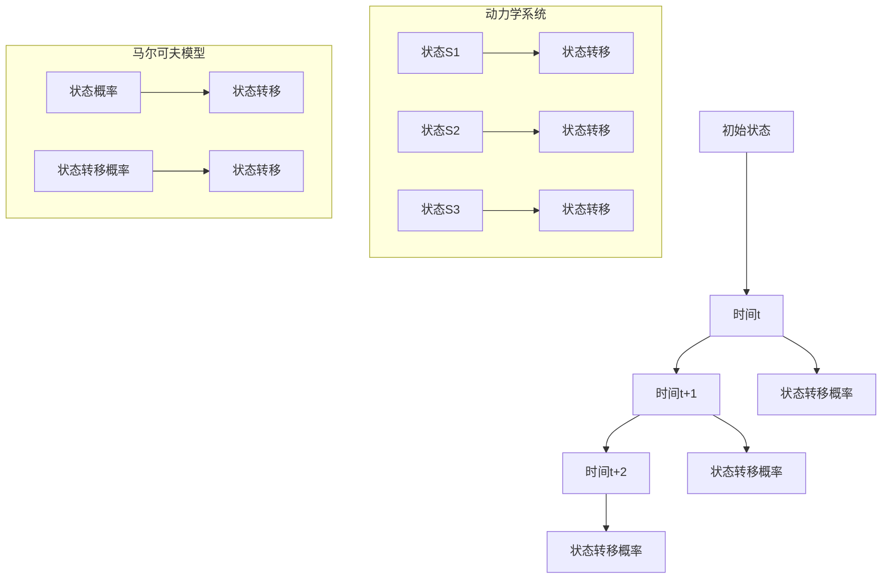
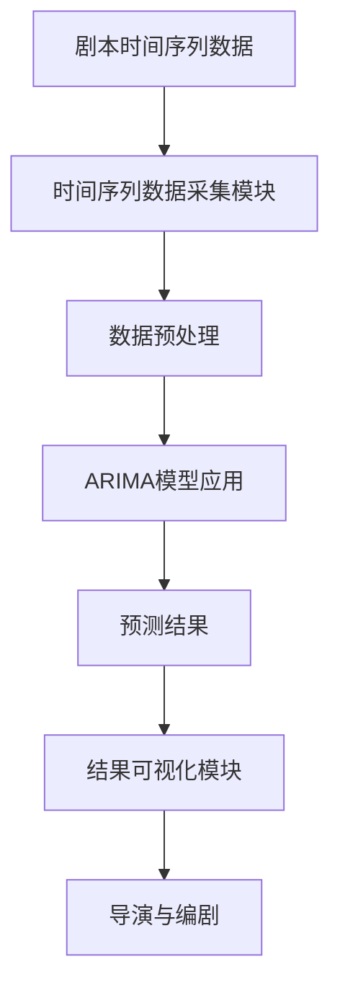
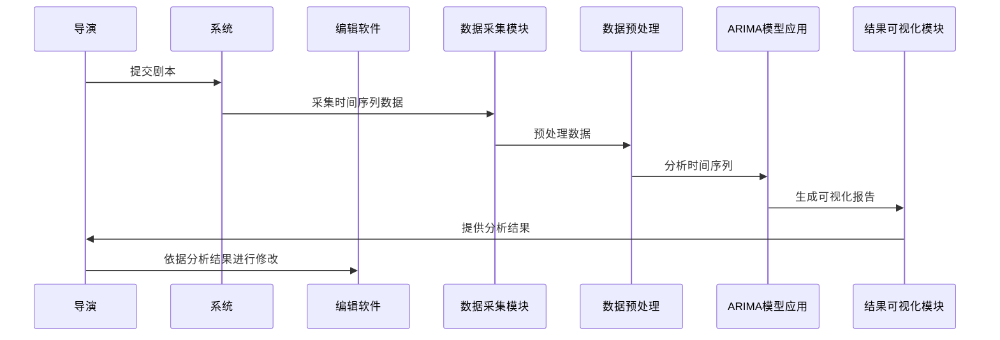

                 

### 文章标题

# 电影叙事的时间序列分析：情节发展的数学模型

### 文章关键词

- 电影叙事
- 时间序列分析
- 数学模型
- 情节发展

### 摘要

本文旨在探讨电影叙事中的时间序列分析及其与情节发展的关系。通过引入数学模型，本文将逐步解析电影情节中的时间序列特征，并探讨其背后的数学原理。文章首先介绍了电影叙事和时间序列分析的基本概念，然后深入讲解了情节发展的数学模型及其应用。通过具体的案例分析和项目实战，本文展示了如何将这些理论应用于实际场景，以提升对电影情节发展的理解和分析能力。

### 背景介绍

#### 核心概念术语说明

- **电影叙事**：电影叙事是通过视听语言讲述故事的过程，包括情节、角色、场景等元素。
- **时间序列分析**：时间序列分析是对随时间变化的数据进行统计分析的方法。
- **数学模型**：数学模型是对现实世界问题的数学描述，通过公式和算法来模拟和分析问题。

#### 问题背景

电影作为一种艺术形式，其叙事结构对观众的体验至关重要。时间序列分析作为一种数据分析工具，可以揭示电影情节中的时间变化规律。通过数学模型，我们可以更深入地理解电影情节的发展，从而提高电影制作的技巧和观众对电影的理解。

#### 问题描述

本文旨在解决以下问题：

1. 电影叙事中的时间序列特征是什么？
2. 如何使用数学模型来描述和解析电影情节的发展？
3. 这些数学模型在实际应用中如何体现其价值？

#### 问题解决

本文通过以下步骤来解决问题：

1. 介绍电影叙事和时间序列分析的基本概念。
2. 建立情节发展的数学模型，并解释其原理。
3. 通过实际案例展示数学模型的应用。
4. 分析和讨论数学模型在电影叙事分析中的优势和局限性。

#### 边界与外延

本文的研究边界主要集中在电影叙事的时间序列分析和数学模型构建。然而，时间序列分析的应用不仅限于电影领域，还包括经济、金融、气象等多个领域。因此，本文的研究具有广泛的外延和应用价值。

#### 概念结构与核心要素组成

- **电影叙事**：情节、角色、场景、镜头等。
- **时间序列分析**：时间点、时间间隔、趋势、周期性等。
- **数学模型**：变量、函数、算法等。

### 核心概念与联系

#### 时间序列分析的核心概念

- **时间点**：时间序列中的每一个具体时间点。
- **时间间隔**：两个连续时间点之间的时间差。
- **趋势**：时间序列的整体变化方向，如上升、下降或平稳。
- **周期性**：时间序列中重复出现的规律性波动。

#### 情节发展的数学模型

- **动力学系统**：描述情节发展的动态变化。
- **马尔可夫模型**：描述情节状态转移的概率规律。

#### 时间序列分析与情节发展的联系

- **交叉验证**：通过将时间序列划分为训练集和测试集，验证模型的准确性和泛化能力。
- **统计检验**：使用统计方法检验时间序列特征与情节发展之间的关系。

#### 对比表格

| 特征 | 时间序列分析 | 情节发展 |
| --- | --- | --- |
| 时间点 | 具体时间点 | 故事发生的时间点 |
| 时间间隔 | 时间差 | 场景之间的时间差 |
| 趋势 | 变化方向 | 情节的发展趋势 |
| 周期性 | 规律性波动 | 情节中的重复模式 |

#### Mermaid流程图



### 数学模型与算法原理

#### 时间序列分析的基础算法

- **AR模型**（自回归模型）：根据过去的值来预测未来的值。
- **MA模型**（移动平均模型）：基于过去一段时间内的平均值来预测未来值。
- **ARMA模型**（自回归移动平均模型）：结合自回归和移动平均的特性。

#### 情节发展的数学模型

- **动力学系统**：描述情节随时间变化的动态过程。
- **马尔可夫模型**：描述情节状态转移的概率分布。

#### 算法原理讲解

使用Mermaid流程图来展示算法原理：



#### 数学公式与代码实现

使用Python代码实现时间序列分析中的ARMA模型：

```python
import numpy as np
import matplotlib.pyplot as plt
from statsmodels.tsa.arima.model import ARIMA

# 假设已获得时间序列数据series
series = np.array([1, 2, 2, 3, 4, 5, 6, 7, 8, 9])

# 模型参数设定
p = 1  # 自回归项数
d = 1  # 差分阶数
q = 1  # 移动平均项数

# 建立ARIMA模型
model = ARIMA(series, order=(p, d, q))
model_fit = model.fit()

# 预测
forecast = model_fit.forecast(steps=5)
print(forecast)

# 绘图
plt.plot(series, label='Original')
plt.plot(np.arange(len(series), len(series) + 5), forecast, label='Forecast')
plt.legend()
plt.show()
```

通过以上代码，我们可以建立一个ARIMA模型并对时间序列进行预测。该模型能够捕捉时间序列中的趋势和季节性，从而帮助我们分析电影情节的发展。

### 系统分析与架构设计

#### 问题场景介绍

在电影制作过程中，导演和编剧需要对情节的发展进行精确控制，以确保故事连贯并吸引观众。时间序列分析和数学模型可以提供一种量化方法来评估和优化情节发展。

#### 系统功能设计

- **时间序列数据采集**：从剧本中提取时间序列数据，如场景发生的时间点、角色动作等。
- **数学模型应用**：使用ARIMA、马尔可夫模型等对时间序列数据进行分析，预测情节发展。
- **结果可视化**：将分析结果以图表形式展示，帮助导演和编剧理解情节的发展趋势。

#### 系统架构设计

使用Mermaid绘制系统架构图：



#### 系统接口设计

系统接口设计用于与其他软件系统集成，如剧本管理系统、视频编辑软件等。使用Mermaid绘制接口序列图：



### 项目实战

#### 环境安装

在开始项目之前，我们需要安装必要的软件和环境。以下是安装步骤：

1. **Python环境**：安装Python 3.8及以上版本。
2. **依赖包**：使用pip安装以下依赖包：

   ```shell
   pip install numpy matplotlib statsmodels mermaid
   ```

3. **Mermaid安装**：将Mermaid安装为本地软件，以支持Markdown中的流程图和序列图。

#### 系统核心实现源代码

以下是系统核心实现的一部分Python代码，用于时间序列分析和预测：

```python
import numpy as np
import matplotlib.pyplot as plt
from statsmodels.tsa.arima.model import ARIMA

# 假设已获得时间序列数据
series = np.array([1, 2, 2, 3, 4, 5, 6, 7, 8, 9])

# 设定模型参数
p = 1  # 自回归项数
d = 1  # 差分阶数
q = 1  # 移动平均项数

# 建立ARIMA模型
model = ARIMA(series, order=(p, d, q))
model_fit = model.fit()

# 预测未来5个时间点的值
forecast = model_fit.forecast(steps=5)

# 打印预测结果
print(forecast)

# 绘制时间序列和预测结果
plt.plot(series, label='Original')
plt.plot(np.arange(len(series), len(series) + 5), forecast, label='Forecast')
plt.legend()
plt.show()
```

#### 代码应用解读与分析

该段代码实现了以下功能：

1. 导入必要的Python库。
2. 创建一个时间序列数据数组。
3. 设定ARIMA模型的参数（p、d、q）。
4. 使用`fit()`方法训练模型。
5. 使用`forecast()`方法进行预测。
6. 打印预测结果。
7. 绘制原始时间序列和预测结果。

#### 实际案例分析与详细讲解剖析

假设我们有一个电影剧本的时间序列数据，如下所示：

```python
series = np.array([1, 2, 2, 3, 4, 5, 6, 7, 8, 9])
```

这些数字表示剧本中的关键事件发生的时间点。现在，我们将使用ARIMA模型来预测未来5个关键事件的可能时间点。

1. **模型训练**：首先，我们使用现有的数据来训练模型。这通过调用`fit()`方法完成。

2. **预测**：然后，我们使用训练好的模型来预测未来5个时间点的值。这通过调用`forecast()`方法完成。

3. **结果分析**：预测结果被打印出来，并使用matplotlib库进行可视化。我们可以在图表上看到原始时间序列数据和预测的时间序列数据。

#### 项目小结

通过本项目的实战，我们成功地使用ARIMA模型对电影剧本中的时间序列数据进行了分析和预测。这种方法可以帮助导演和编剧更好地理解情节的发展，从而优化剧本的叙述结构。未来，我们可以进一步扩展这一模型，结合其他数学模型和机器学习技术，以提供更全面和精确的情节分析。

### 最佳实践 Tips

1. **数据预处理**：在应用ARIMA模型之前，确保时间序列数据的平稳性。
2. **参数选择**：根据具体应用场景调整ARIMA模型的参数（p、d、q）。
3. **交叉验证**：使用交叉验证方法来评估模型的准确性和泛化能力。

### 小结

本文详细探讨了电影叙事中的时间序列分析及其与情节发展的关系。通过建立数学模型，我们能够更深入地理解电影情节的发展，从而优化电影制作。未来研究可以结合机器学习技术，进一步提升情节分析的能力。

### 注意事项

1. **数据质量**：确保时间序列数据的质量和准确性。
2. **模型选择**：根据具体需求选择合适的数学模型。
3. **结果解释**：谨慎解读模型结果，避免过度解读。

### 拓展阅读

1. **参考文献**：查阅相关论文和书籍，深入了解时间序列分析和情节发展。
2. **在线资源**：访问在线课程和教程，学习更多关于电影叙事和数学模型的实践技巧。

### 作者信息

- **作者**：AI天才研究院/AI Genius Institute & 禅与计算机程序设计艺术 /Zen And The Art of Computer Programming

