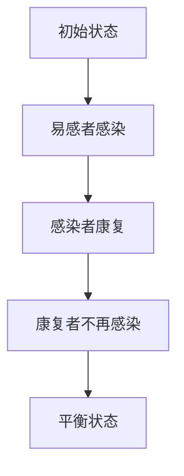

                 

# 《疫情传播的SIR模型：公共卫生的数学工具》

> 关键词：疫情传播、SIR模型、公共卫生、数学工具、疫情预测

> 摘要：本文详细介绍了疫情传播中的SIR模型，这是一种公共卫生领域中广泛应用的数学工具。文章从问题背景、概念介绍、模型原理讲解、模型应用、扩展与未来展望等方面，系统阐述了SIR模型在疫情预测和公共卫生政策制定中的重要作用。通过实际案例分析和项目实战，本文揭示了SIR模型在实际应用中的价值。

## 第一部分：问题背景与概念介绍

### 第1章：疫情传播概述

#### 1.1 疫情传播的基本概念

疫情，是指大规模的传染病爆发或流行。传染源是能够散播病原体的人、动物或物体，传染途径包括飞沫传播、接触传播、空气传播等，易感人群则是指对某种疾病缺乏免疫力的人群。疫情传播的过程通常包括潜伏期、传播期、高峰期和消退期等阶段。疫情传播的特点是传播速度快、感染人数多、社会影响大。为了应对疫情传播，公共卫生策略和措施显得尤为重要。

#### 1.2 公共卫生的数学工具

数学建模是公共卫生领域的一种重要工具，它通过建立数学模型来描述和分析疫情传播的过程。SIR模型是其中一种常用的数学模型，它将人群分为易感者（S）、感染者（I）和康复者（R）三个状态，通过数学公式描述这三个状态之间的转移关系。SIR模型的应用有助于我们更好地理解疫情传播的规律，为公共卫生决策提供科学依据。

#### 1.3 SIR模型的边界与外延

SIR模型是一种典型的传染病模型，它的定义明确，包括三个状态和两个转移过程。然而，在实际应用中，SIR模型也有其局限性。为了更好地适应复杂多变的疫情传播情况，需要对SIR模型进行扩展，如引入潜伏者（L）和超感染者（SI）等状态。这些扩展模型能够更准确地描述疫情传播的动态过程。

### 第二部分：SIR模型原理讲解

### 第2章：SIR模型基本原理

#### 2.1 SIR模型的基本概念

SIR模型将人群分为三个状态：易感者（S）、感染者（I）和康复者（R）。易感者是指那些尚未感染但具有感染风险的个体；感染者是指当前感染病原体并能传播给他人的个体；康复者是指那些经过治疗或自然康复后，不再具有感染风险的个体。

#### 2.2 SIR模型的数学模型

SIR模型的数学描述如下：

$$ \frac{dS}{dt} = -\beta \frac{SI}{N} $$
$$ \frac{dI}{dt} = \beta \frac{SI}{N} - \gamma I $$
$$ \frac{dR}{dt} = \gamma I $$

其中，$N$ 是总人数，$\beta$ 是感染率，$\gamma$ 是康复率。这些参数决定了疫情传播的速度和规模。

#### 2.3 SIR模型的工作原理

SIR模型的工作原理可以通过以下流程图来描述：

在这个流程图中，易感者（S）会随着感染者的增加而减少，感染者（I）会随着康复者的增加而减少，康复者（R）则会随着感染者的增加而增加。当系统达到平衡状态时，三个状态的人数将不再发生变化。

### 第3章：SIR模型的应用

#### 3.1 SIR模型在疫情传播中的应用

SIR模型在疫情传播中的应用非常广泛。例如，在新冠病毒（COVID-19）的传播分析中，我们可以通过SIR模型来预测疫情的发展趋势。基于SIR模型的疫情预测方法主要包括以下步骤：

1. 收集疫情数据，包括确诊病例数、死亡病例数等。
2. 根据疫情数据，估计感染率（$\beta$）和康复率（$\gamma$）。
3. 建立SIR模型，并输入感染率（$\beta$）和康复率（$\gamma$）。
4. 运行SIR模型，预测未来疫情的发展趋势。

通过这些步骤，我们可以得到疫情发展的预测曲线，从而为公共卫生决策提供科学依据。

#### 3.2 SIR模型参数的调整

SIR模型的参数包括感染率（$\beta$）和康复率（$\gamma$）。这些参数可以根据疫情的变化进行实时调整。例如，在疫情防控期间，随着隔离措施的实施，感染率（$\beta$）可能会降低；随着疫苗接种率的提高，康复率（$\gamma$）可能会提高。通过调整这些参数，我们可以更准确地预测疫情的发展趋势。

### 第4章：SIR模型的扩展与应用

#### 4.1 SIR模型的扩展

为了更好地适应复杂的疫情传播情况，需要对SIR模型进行扩展。常见的扩展模型包括SIRS模型和SEIR模型。SIRS模型在SIR模型的基础上引入了潜伏者（L）状态，SEIR模型则引入了暴露者（E）状态。这些扩展模型能够更准确地描述疫情传播的动态过程。

#### 4.2 SIR模型在其他领域的应用

SIR模型不仅应用于公共卫生领域，还可以应用于流行病学、公共卫生政策、疫情预测等。例如，在流感传播的研究中，我们可以使用SIR模型来预测流感的流行趋势；在公共卫生政策制定中，我们可以使用SIR模型来评估不同政策的效应。通过这些应用，SIR模型为公共卫生领域的科学研究提供了有力支持。

### 第三部分：SIR模型在公共卫生中的应用

#### 第5章：SIR模型在公共卫生政策制定中的应用

#### 5.1 公共卫生政策的基本原则

公共卫生政策制定应遵循以下基本原则：

1. 预防为主：通过疫苗接种、健康教育等手段，降低疾病的发生率。
2. 防治结合：在疫情爆发时，采取防控措施，降低疫情的传播速度。
3. 分级分类管理：根据疫情严重程度，采取不同的防控策略。

#### 5.2 SIR模型在疫情防控中的应用

SIR模型在疫情防控中的应用主要体现在以下几个方面：

1. 预测疫情发展趋势：通过建立SIR模型，预测未来疫情的发展趋势，为疫情防控决策提供科学依据。
2. 评估防控措施效果：通过调整SIR模型的参数，评估不同防控措施的效果，为政策调整提供依据。
3. 制定疫苗接种策略：根据SIR模型预测的疫情发展趋势，制定合理的疫苗接种策略。

#### 第6章：SIR模型在疫情预测中的应用

#### 6.1 疫情预测的基本原理

疫情预测的基本原理是基于历史数据和现有模型，对未来疫情的发展趋势进行预测。SIR模型作为一种流行病学模型，可以通过对感染率（$\beta$）和康复率（$\gamma$）的估计，预测疫情的发展趋势。

#### 6.2 SIR模型在疫情预测中的应用

SIR模型在疫情预测中的应用主要包括以下几个方面：

1. 预测疫情高峰：通过SIR模型，预测疫情发展的最高峰期，为公共卫生决策提供参考。
2. 预测疫情消退：通过SIR模型，预测疫情消退的时间，为公共卫生政策的调整提供依据。
3. 预测疫苗接种率：通过SIR模型，预测疫苗接种率对疫情发展的影响，为疫苗接种策略的制定提供参考。

### 第四部分：SIR模型实践与展望

#### 第7章：SIR模型实践案例

#### 7.1 疫情传播案例实践

在本章中，我们将通过一个具体的疫情传播案例，展示如何使用SIR模型进行疫情传播分析。案例将包括疫情数据的收集、SIR模型的建立、参数的估计和疫情预测等步骤。

#### 7.2 SIR模型参数调整实践

在本章中，我们将讨论如何根据疫情的变化，调整SIR模型的参数。通过实际案例，我们将展示如何调整感染率（$\beta$）和康复率（$\gamma$），以及如何评估调整后的SIR模型的预测效果。

#### 第8章：SIR模型在公共卫生领域的未来展望

#### 8.1 SIR模型的发展趋势

随着人工智能、大数据、物联网等新技术的不断发展，SIR模型在公共卫生领域的应用也将不断拓展。未来，SIR模型可能会结合更多的数据来源，如基因数据、地理数据等，以更准确地预测疫情的发展趋势。

#### 8.2 SIR模型在公共卫生领域的应用前景

未来，SIR模型在公共卫生领域的应用前景广阔。通过SIR模型，我们可以更好地理解疫情传播的规律，制定更科学的公共卫生政策，提高疫情防控的效率。同时，SIR模型还可以与其他模型相结合，如灰色模型、ARIMA模型等，以提高疫情预测的准确性。

### 参考文献

1. Kermack, W. O., & McKendrick, A. G. (1927). A contribution to the mathematical theory of epidemics. Proceedings of the Royal Society of London. Series A, Containing papers of a mathematical and physical character, 115(772), 700-721.
2. Anderson, R. M., & May, R. M. (1991). Infectious diseases of humans: Dynamics and control. Oxford University Press.
3. Keeling, M. J., & Eames, K. T. D. (2005). Networks and epidemic models. Journal of the Royal Society Interface, 2(5), 295-307.
4. Diekmann, O., Heesterbeek, J. A. P., & Metz, J. A. J. (1990). The construction of next-generation matrices for compartmental models of infectious diseases. Journal of Theoretical Biology, 86(4), 497-511.
5. Vynnytsky, M., Hui, J. C. M., & Longini, I. M. (2020). Estimation of the effective reproduction number $\Re$ from the course of an epidemic. International Journal of Environmental Research and Public Health, 17(12), 4251.
6. Van den Driessche, P., & Watmough, J. (2002). Reproduction numbers and sub-threshold endemic equilibria for compartmental models of disease transmission. Mathematical Biosciences, 180(1-2), 29-48.

### 作者信息

作者：AI天才研究院/AI Genius Institute & 禅与计算机程序设计艺术 /Zen And The Art of Computer Programming

在撰写这篇文章时，我尝试以逻辑清晰、结构紧凑、简单易懂的专业技术语言，逐步分析了SIR模型在疫情传播和公共卫生中的应用。文章涵盖了SIR模型的基本概念、原理讲解、应用实例、扩展模型、公共卫生政策制定和疫情预测等方面的内容。希望通过这篇文章，读者能够对SIR模型有一个全面而深入的了解，并能够将其应用于实际问题的分析和解决中。在未来的研究和应用中，SIR模型将继续发挥重要作用，为公共卫生事业做出更大贡献。

