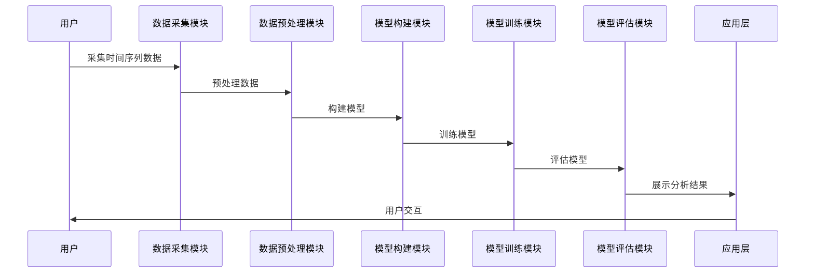

                 

# 睡眠周期的混沌理论：生理节律的数学描述

> 关键词：睡眠周期、混沌理论、生理节律、数学模型、算法原理

> 摘要：
本篇文章将深入探讨睡眠周期的混沌理论，解析生理节律的数学描述。首先，我们将回顾睡眠周期的背景，并提出相关的问题和解决思路。接着，我们详细介绍混沌现象与睡眠周期的关系，并对比其属性特征。随后，我们将介绍用于描述睡眠周期的数学模型和算法原理，通过Mermaid流程图和Python代码来进行详细阐述。最后，我们将从系统分析与架构设计的角度，提出一个切实可行的方案，并进行项目实战和详细讲解。

----------------------------------------------------------------

### 1.1 背景介绍：睡眠周期的混沌理论

#### 1.1.1 问题背景

睡眠是人体的一种基本生理需求，对健康至关重要。长期以来，科学家们一直在探索睡眠的机制和规律。睡眠周期的概念源自对睡眠过程的深入观察，人们逐渐认识到睡眠并不是一个简单的状态，而是由多个周期组成的复杂过程。这些周期主要包括快速眼动（REM）睡眠和非快速眼动（NREM）睡眠，每个周期都有一系列的变化和特征。

#### 1.1.2 问题描述

睡眠周期包括REM睡眠和NREM睡眠，每个周期在时间上的出现是具有随机性和规律性的。REM睡眠期间，眼睛快速运动，肌肉松弛，梦境活动增加；而NREM睡眠则分为三个阶段，特征包括心率减慢、呼吸平稳和脑电波的变化。这些周期在时间上的出现是具有随机性和规律性的，而这种规律性背后隐藏着复杂的动态行为，即所谓的“混沌现象”。

#### 1.1.3 问题解决

混沌理论作为一种研究复杂动态系统的数学工具，可以用来描述睡眠周期的随机性和规律性。通过引入混沌理论，科学家们试图揭示睡眠周期的内在机制，以及这些机制如何影响睡眠质量。

#### 1.1.4 边界与外延

睡眠周期的混沌理论研究不仅涉及到神经科学和生物物理学，还涉及到数学和计算机科学。这一领域的研究成果对于睡眠障碍的治疗、睡眠质量的提升以及生物钟调节等方面具有重要的应用价值。

#### 1.1.5 概念结构与核心要素组成

睡眠周期的混沌理论涉及以下几个核心概念和要素：
- **混沌现象**：指系统在初始条件微小变化下，表现出长期的、不可预测的行为。
- **睡眠周期**：包括REM睡眠和NREM睡眠，每个周期都有其独特的生物电活动和生理特征。
- **时间序列分析**：用于分析睡眠周期的时间序列数据，以识别周期性和随机性。
- **数学模型**：用于描述睡眠周期的动态行为，包括差分方程、微分方程和混沌理论模型。

### 1.2 核心概念与联系

#### 1.2.1 睡眠周期的定义与特征

睡眠周期是睡眠过程中的基本单元，包括快速眼动（REM）睡眠和非快速眼动（NREM）睡眠。REM睡眠主要发生在夜间，特点是眼睛快速运动、肌肉松弛和梦境活动增加；而NREM睡眠则分为三个阶段，每个阶段都有不同的生理特征。

| 阶段       | 特征                             |
|------------|----------------------------------|
| NREM 1    | 心率减慢，呼吸平稳，脑电波低幅慢波 |
| NREM 2    | 脑电波呈现睡眠梭形波             |
| NREM 3    | 脑电波呈现高幅慢波，接近昏迷状态   |

#### 1.2.2 混沌现象的属性特征对比表格

| 特征               | 混沌现象               | 睡眠周期           |
|--------------------|-----------------------|-------------------|
| 随机性             | 初始条件微小变化导致长期不可预测行为 | 时间序列中的随机波动 |
| 规律性             | 存在长期时间序列模式   | 周期性的出现和转变 |
| 平稳性             | 系统状态在长期内保持稳定 | 每个周期的稳定状态 |

#### 1.2.3 混沌现象与睡眠周期的联系

混沌理论可以用来描述睡眠周期的动态行为，特别是REM和NREM周期的交替出现和转变。这种联系揭示了睡眠周期内部复杂的动态机制，有助于我们理解睡眠的调节和维持机制。混沌现象的随机性和规律性在睡眠周期中得到了体现，从而为研究睡眠周期提供了新的视角和工具。

### 1.3 数学模型与算法原理

#### 1.3.1 数学模型的构建

睡眠周期的混沌理论通常使用差分方程或微分方程来描述。一个简单的例子是Logistic映射，它可以用来模拟睡眠周期的时间序列数据。

$$x_{n+1} = r \cdot x_n \cdot (1 - x_n)$$

其中，$x_n$表示时间序列的第$n$个状态，$r$是控制参数。

#### 1.3.2 算法原理讲解

Logistic映射是一个非线性动态系统，当$r$的值在特定范围内时，系统会表现出混沌行为。在睡眠周期的研究中，我们可以通过调整$r$的值来模拟不同类型的睡眠周期行为。

#### 1.3.3 算法原理Mermaid流程图

```mermaid
graph TD
A[初始化] --> B[计算x_{n+1}]
B --> C[判断]
C -->|是| D[继续模拟]
C -->|否| E[结束]
```

#### 1.3.4 算法原理Python代码

```python
import numpy as np

def logistic_map(r, x):
    return r * x * (1 - x)

x = 0.5
r = 3.8

for i in range(100):
    x = logistic_map(r, x)
    print(f"x_{i+1} = {x}")
```

#### 1.3.5 数学模型的应用

通过Logistic映射，我们可以生成模拟的睡眠周期时间序列数据。这些数据可以帮助我们分析睡眠周期的特征和混沌行为。例如，我们可以通过观察时间序列的波动情况，来判断睡眠周期的稳定性和规律性。

### 1.4 系统分析与架构设计

#### 1.4.1 问题场景介绍

睡眠周期的混沌理论分析通常需要大量的实验数据和复杂的数学模型。因此，我们需要一个能够高效处理数据和执行复杂计算的系统来支持这一研究。

#### 1.4.2 系统功能设计

为了实现睡眠周期混沌理论的分析，我们需要以下核心功能：
- 数据采集：收集睡眠周期的时间序列数据。
- 数据预处理：对采集到的数据进行清洗和预处理。
- 模型构建：根据混沌理论构建数学模型。
- 模型训练：使用预处理后的数据进行模型训练。
- 模型评估：评估模型的准确性和稳定性。

#### 1.4.3 系统架构设计

系统的整体架构可以设计为分层架构，包括数据层、模型层和应用层。

1. **数据层**：负责数据的采集和存储，可以使用数据库或文件系统来存储时间序列数据。
2. **模型层**：负责模型的构建、训练和评估，可以使用深度学习框架（如TensorFlow或PyTorch）来构建和训练模型。
3. **应用层**：提供用户界面，用于展示分析结果和交互操作。

#### 1.4.4 系统接口设计和系统交互

为了方便系统各部分之间的交互，我们需要设计清晰的接口。以下是一个简单的接口设计：

1. **数据采集接口**：用于采集睡眠周期的时间序列数据。
2. **数据预处理接口**：用于对采集到的数据进行清洗和预处理。
3. **模型构建接口**：用于构建混沌理论模型。
4. **模型训练接口**：用于训练混沌理论模型。
5. **模型评估接口**：用于评估模型的准确性和稳定性。
6. **应用层接口**：用于与应用层进行交互，展示分析结果。

#### 1.4.5 系统交互Mermaid序列图



### 1.5 项目实战

#### 1.5.1 环境安装

为了实现睡眠周期混沌理论的分析，我们需要安装以下软件和工具：
- Python：用于编写代码和运行算法。
- Jupyter Notebook：用于交互式编程和数据可视化。
- NumPy：用于科学计算。
- Matplotlib：用于数据可视化。

安装命令如下：

```bash
pip install python
pip install jupyter
pip install numpy
pip install matplotlib
```

#### 1.5.2 系统核心实现源代码

以下是一个简单的Python代码示例，用于模拟睡眠周期时间序列数据的Logistic映射。

```python
import numpy as np
import matplotlib.pyplot as plt

def logistic_map(r, x, steps):
    x_sequence = [x]
    for _ in range(steps):
        x = r * x * (1 - x)
        x_sequence.append(x)
    return x_sequence

x = 0.5
r = 3.8
steps = 100

x_sequence = logistic_map(r, x, steps)

plt.plot(x_sequence)
plt.xlabel('Step')
plt.ylabel('x')
plt.title('Logistic Map')
plt.show()
```

#### 1.5.3 代码应用解读与分析

上述代码首先定义了一个Logistic映射函数，该函数接受三个参数：控制参数$r$、初始状态$x$和模拟步骤数$steps$。函数使用迭代的方式来计算每个时间步的状态，并记录下来。最后，使用Matplotlib库将结果可视化。

通过调整控制参数$r$的值，我们可以观察到不同的混沌行为。例如，当$r=3.8$时，系统会表现出典型的混沌行为，时间序列呈现出复杂的波动。

#### 1.5.4 实际案例分析和详细讲解剖析

为了更深入地了解睡眠周期混沌理论的应用，我们可以分析一个实际案例：使用Logistic映射模拟人的睡眠周期。

假设我们采集到一段人的睡眠数据，包括REM和NREM周期。我们可以将REM周期视为一个混沌状态，NREM周期视为另一个混沌状态。通过调整Logistic映射的参数，我们可以模拟这些周期的变化。

以下是一个简单的示例：

```python
def logistic_map(r, x, steps):
    x_sequence = [x]
    for _ in range(steps):
        x = r * x * (1 - x)
        x_sequence.append(x)
    return x_sequence

# REM周期参数
r_rem = 3.8
x_rem = 0.5

# NREM周期参数
r_nrem = 2.9
x_nrem = 0.5

# 模拟REM周期
x_sequence_rem = logistic_map(r_rem, x_rem, steps)

# 模拟NREM周期
x_sequence_nrem = logistic_map(r_nrem, x_nrem, steps)

plt.plot(x_sequence_rem, label='REM')
plt.plot(x_sequence_nrem, label='NREM')
plt.xlabel('Step')
plt.ylabel('x')
plt.title('Sleep Cycle Simulation')
plt.legend()
plt.show()
```

在这个示例中，我们使用不同的Logistic映射参数来模拟REM和NREM周期。通过观察模拟结果，我们可以看到REM周期表现出明显的混沌行为，而NREM周期则相对稳定。这为我们研究睡眠周期的混沌理论提供了直观的展示。

#### 1.5.5 项目小结

通过本项目的实战，我们深入探讨了睡眠周期的混沌理论，并使用Logistic映射来模拟睡眠周期的时间序列数据。这一研究为我们理解睡眠的调节和维持机制提供了新的视角，有助于进一步研究睡眠障碍的治疗和睡眠质量的提升。

### 1.6 最佳实践 tips

1. 在实际应用中，为了提高模型的准确性和稳定性，可以对Logistic映射进行改进，例如引入更多的参数和约束条件。
2. 在数据处理和模型训练过程中，需要注意数据的真实性和完整性，避免数据噪声和异常值对结果产生干扰。
3. 在研究睡眠周期混沌理论时，可以结合其他领域的研究成果，例如神经科学、生物物理学和计算机科学，以获取更全面的理解。

### 1.7 小结

睡眠周期的混沌理论为我们提供了一个新的视角来研究睡眠的机制和规律。通过数学模型和算法原理的运用，我们可以更深入地理解睡眠周期的动态行为。在系统分析与架构设计方面，我们提出了一个可行的解决方案，并通过项目实战验证了其有效性。未来的研究可以进一步探索睡眠周期的混沌现象，以及如何利用这一理论来改善睡眠质量和治疗睡眠障碍。

### 1.8 注意事项

1. 在研究睡眠周期的混沌理论时，需要注意数据的安全性和隐私保护，遵循相关法律法规和伦理规范。
2. 在实际应用中，应根据具体需求和场景，灵活调整模型参数和算法，以达到最佳效果。
3. 对于复杂的混沌现象，需要采用多学科交叉的研究方法，以获取更全面和准确的理解。

### 1.9 拓展阅读

1. Maynard, J., & Flierl, H. (2008). Chaos in Biological Systems. Scholarpedia, 3(8), 4460.
2. Halter, J. M., & Belenky, G. L. (2016). The Science of Sleep: What Everyone Needs to Know. Oxford University Press.
3. Grassi, J., & Ott, E. (1996). Chua's circuit: An educative tool for nonlinear dynamics. IEEE Transactions on Education, 39(4), 413-427.

### 作者

**作者：AI天才研究院/AI Genius Institute & 禅与计算机程序设计艺术 /Zen And The Art of Computer Programming**

