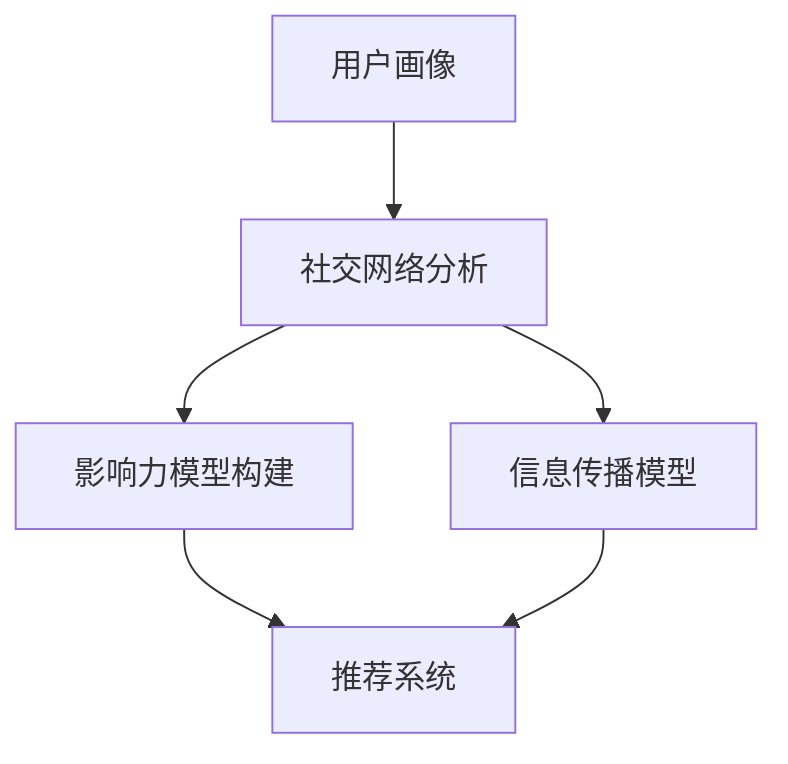
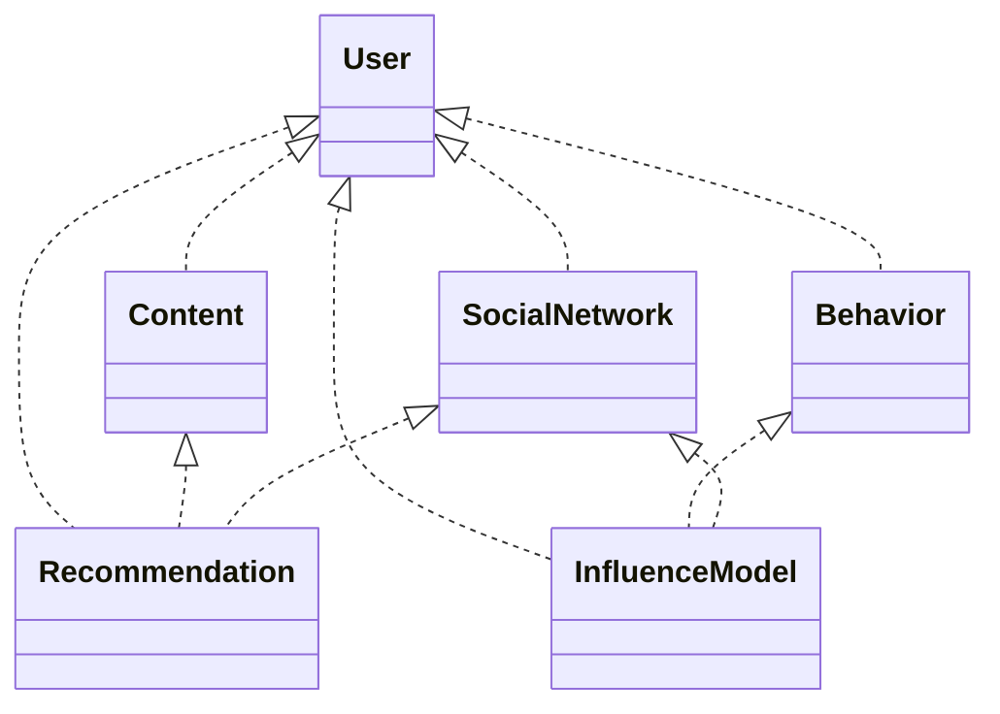
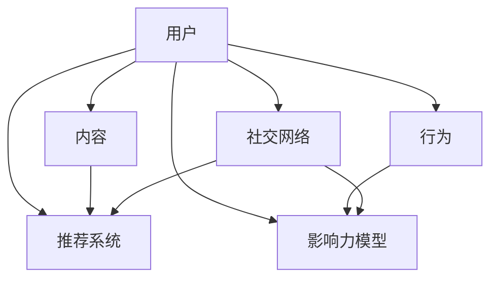
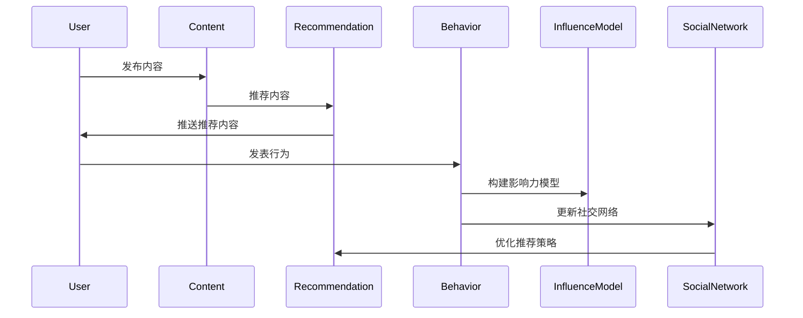

                 

# 社交媒体的影响力算法：信息传播的数学模型

## 关键词
社交媒体、影响力算法、信息传播、数学模型、推荐系统、社交网络分析

## 摘要
本文将深入探讨社交媒体中的影响力算法及其在信息传播中的关键作用。通过详细的背景介绍、核心概念解析、算法原理讲解以及实际案例分析，我们将揭示社交媒体影响力算法背后的数学模型，并探讨其应用场景和未来发展趋势。

## 引言

### 社交媒体的定义与现状
社交媒体，作为一种在线互动平台，允许用户发布和分享内容，形成社会网络。常见的社交媒体平台包括Facebook、Twitter、Instagram和微信等。这些平台不仅改变了人们的社交方式，还成为了信息传播的重要渠道。

近年来，社交媒体的普及程度显著提升，其用户数量不断增长。根据Statista的数据，全球社交媒体用户已经超过30亿，占全球人口的40%以上。这一庞大的用户群体使得社交媒体成为一个重要的信息传播平台，影响着公众舆论和市场营销策略。

### 信息传播的重要性
信息传播在社交媒体中具有至关重要的地位。它不仅是用户获取新闻、娱乐和社交互动的途径，还影响着用户的行为和观念。在商业领域，有效的信息传播可以帮助企业提高品牌知名度、增加用户参与度和实现销售目标。

然而，信息传播也面临着挑战。信息的海量性和复杂性使得用户难以筛选出有价值的信息，同时，虚假信息和恶意内容也时有出现，对信息传播的准确性产生了负面影响。

### 影响力算法的重要性
为了解决信息传播中的问题，社交媒体平台引入了影响力算法。这些算法通过分析用户的兴趣、行为和网络结构，将用户可能感兴趣的内容推送给他们，从而提高信息的传播效率和准确性。

影响力算法在信息传播中起到了关键作用。首先，它们可以帮助平台优化内容推荐，使用户能够更快速地获取到他们感兴趣的信息。其次，影响力算法还可以识别和抑制虚假信息，保护用户的隐私和安全。

## 目录大纲设计步骤

### 确定书籍的主题和目标读者
在设计《社交媒体的影响力算法：信息传播的数学模型》的目录大纲之前，首先需要明确书籍的主题和目标读者。这本书的主题聚焦于社交媒体中的影响力算法及其在信息传播中的应用，目标读者包括数据科学家、算法工程师、市场营销专业人士以及对社交媒体技术感兴趣的研究者。

### 设计整体结构
基于主题和目标读者，书籍的整体结构可以分为以下几个部分：

1. **引言**：介绍社交媒体的现状、信息传播的重要性以及影响力算法的基本概念。
2. **社交媒体算法概述**：详细讨论社交媒体算法的核心概念，如用户画像、推荐系统和社交网络分析。
3. **信息传播数学模型**：探讨信息传播的基本原理和数学模型，以及它们在社交媒体中的应用。
4. **算法在社交媒体中的应用**：分析影响力算法在社交媒体平台的具体应用案例。
5. **案例分析**：通过实际案例研究，展示影响力算法在不同场景中的应用效果。
6. **结论**：总结全书内容，探讨未来研究方向。

### 细化章节内容
在确定整体结构后，我们需要对每个章节的内容进行细化。以下是详细的内容安排：

**第1部分：社交媒体算法概述**

- **第1章：社交媒体的定义与影响力**
  - **1.1 社交媒体的起源与发展**
  - **1.2 社交媒体的影响力**
  - **1.3 社交媒体平台的算法机制**

- **第2章：社交媒体算法的核心概念**
  - **2.1 用户画像**
  - **2.2 推荐系统**
  - **2.3 社交网络分析**

**第2部分：信息传播数学模型**

- **第3章：信息传播的基本原理**
  - **3.1 信息传播模型概述**
  - **3.2 信息传播的数学模型**
  - **3.3 数学模型在信息传播中的应用**

- **第4章：影响传播模型**
  - **4.1 影响者识别**
  - **4.2 影响力模型构建**
  - **4.3 影响力模型评估**

**第3部分：算法在社交媒体中的应用**

- **第5章：社交媒体算法案例分析**
  - **5.1 案例一：社交网络中的信息传播**
  - **5.2 案例二：社交媒体推荐系统**
  - **5.3 案例三：社交媒体广告投放**

**第4部分：案例分析**

- **第6章：案例分析**
  - **6.1 案例研究一：社交媒体平台的影响力算法优化**
  - **6.2 案例研究二：信息传播中的影响力模型应用**
  - **6.3 案例研究三：社交媒体算法的伦理与隐私问题**

### 确保内容的逻辑性和完整性
在细化章节内容时，我们确保每个章节的内容都与主题相关，且逻辑连贯。每个章节都围绕核心概念进行深入探讨，确保内容完整、具体且详细。

### 撰写大纲
最后，我们将以上内容以Markdown格式撰写出来，确保格式和层级清晰。以下是书籍的Markdown格式目录大纲：

```markdown
# 《社交媒体的影响力算法：信息传播的数学模型》

## 引言
- **社交媒体的定义与现状**
- **信息传播的重要性**
- **影响力算法的重要性**

## 第1部分：社交媒体算法概述
### 第1章：社交媒体的定义与影响力
#### 1.1 社交媒体的起源与发展
#### 1.2 社交媒体的影响力
#### 1.3 社交媒体平台的算法机制

### 第2章：社交媒体算法的核心概念
#### 2.1 用户画像
#### 2.2 推荐系统
#### 2.3 社交网络分析

## 第2部分：信息传播数学模型
### 第3章：信息传播的基本原理
#### 3.1 信息传播模型概述
#### 3.2 信息传播的数学模型
#### 3.3 数学模型在信息传播中的应用

### 第4章：影响传播模型
#### 4.1 影响者识别
#### 4.2 影响力模型构建
#### 4.3 影响力模型评估

## 第3部分：算法在社交媒体中的应用
### 第5章：社交媒体算法案例分析
#### 5.1 案例一：社交网络中的信息传播
#### 5.2 案例二：社交媒体推荐系统
#### 5.3 案例三：社交媒体广告投放

## 第4部分：案例分析
### 第6章：案例分析
#### 6.1 案例研究一：社交媒体平台的影响力算法优化
#### 6.2 案例研究二：信息传播中的影响力模型应用
#### 6.3 案例研究三：社交媒体算法的伦理与隐私问题

## 结论
- **总结与展望**
- **未来研究方向**
```

以上是书籍的完整Markdown格式目录大纲，确保简洁、逻辑清晰且内容完整。接下来，我们将逐步深入探讨每个部分的内容。

## 第1部分：社交媒体算法概述

### 第1章：社交媒体的定义与影响力

#### 1.1 社交媒体的起源与发展

社交媒体的概念最早可以追溯到20世纪90年代末，当时互联网的普及使得人们能够更加便捷地交流和分享信息。最早的社交媒体平台之一是MySpace，它于2003年上线，吸引了大量用户。随后，Facebook于2004年成立，迅速成为全球最大的社交媒体平台之一。

随着技术的进步和互联网的普及，社交媒体的发展经历了几个重要阶段：

1. **早期阶段**（2000-2008）：这一时期主要是以文本和图片分享为主，代表性的平台包括MySpace和Facebook。
2. **中期阶段**（2008-2012）：随着智能手机和移动互联网的兴起，社交媒体平台开始提供更加丰富和多样的功能，如视频分享、实时聊天和朋友圈。Twitter和Instagram在这一阶段迅速崛起。
3. **成熟阶段**（2012至今）：社交媒体平台开始与电子商务、虚拟现实和人工智能等技术相结合，提供更加个性化和智能化的服务。

#### 1.2 社交媒体的影响力

社交媒体的影响力体现在多个方面，包括社交互动、信息传播、市场营销和公共政策等。

1. **社交互动**：社交媒体平台为用户提供了便捷的沟通渠道，使得用户可以随时随地进行交流和互动。这种互动不仅限于朋友和家人，还包括工作伙伴、行业专家和公众人物。
2. **信息传播**：社交媒体平台成为了信息传播的重要渠道。用户不仅可以通过平台获取新闻、资讯和娱乐内容，还可以参与到信息的传播和讨论中。这种去中心化的信息传播方式，使得信息传播的速度和范围得到了极大的提升。
3. **市场营销**：随着社交媒体的普及，越来越多的企业开始利用社交媒体平台进行市场营销。通过精准的用户画像和内容推荐，企业可以有效地吸引目标用户，提高品牌知名度和销售业绩。
4. **公共政策**：社交媒体在公共政策领域的应用也越来越广泛。政府机构和政策制定者可以通过社交媒体平台了解公众意见和需求，及时调整政策方向。

#### 1.3 社交媒体平台的算法机制

为了优化用户体验和信息传播效果，社交媒体平台采用了多种算法机制。这些算法主要包括：

1. **内容推荐算法**：通过分析用户的兴趣和行为，推荐用户可能感兴趣的内容。常见的算法包括基于内容的推荐算法（如协作过滤）和基于用户的推荐算法（如矩阵分解）。
2. **社交网络分析算法**：用于分析用户之间的关系和社交网络结构，识别关键节点和传播路径。常见的算法包括网络密度、聚类系数和传播模型。
3. **信息过滤和检测算法**：用于识别和过滤虚假信息、恶意内容和垃圾信息，保护用户的隐私和安全。常见的算法包括文本分类、情感分析和图论算法。

### 第2章：社交媒体算法的核心概念

#### 2.1 用户画像

用户画像是对用户特征和行为的综合描述，它包括用户的年龄、性别、地域、兴趣、行为等多个维度。用户画像的建立依赖于数据收集和分析技术，如Web日志分析、问卷调查和行为追踪等。

用户画像在社交媒体平台中具有重要作用：

1. **个性化推荐**：通过分析用户的画像，平台可以推荐用户可能感兴趣的内容，提高用户满意度和参与度。
2. **精准营销**：企业可以利用用户画像进行精准营销，针对特定用户群体推广产品和服务，提高营销效果。
3. **风险控制**：平台可以利用用户画像识别异常行为，如恶意评论和虚假信息传播，从而采取措施进行控制。

#### 2.2 推荐系统

推荐系统是社交媒体平台的核心功能之一，它的目标是向用户推荐他们可能感兴趣的内容。推荐系统可以分为基于内容的推荐和基于用户的推荐两种类型。

1. **基于内容的推荐**：通过分析内容的属性和特征，将用户可能感兴趣的内容推送给他们。例如，基于用户历史浏览记录和兴趣标签进行推荐。
2. **基于用户的推荐**：通过分析用户的兴趣和行为模式，将其他用户喜欢的内容推荐给当前用户。例如，基于协同过滤算法进行推荐。

推荐系统的主要挑战包括：

1. **数据稀疏性**：用户行为数据通常存在稀疏性，使得推荐效果受到限制。
2. **冷启动问题**：对于新用户，由于缺乏历史数据，推荐系统难以准确预测他们的兴趣。
3. **实时性**：推荐系统需要能够实时响应用户的行为变化，提供及时的内容推荐。

#### 2.3 社交网络分析

社交网络分析是社交媒体平台中的重要功能，它通过分析用户之间的关系和网络结构，揭示社交网络的特性和关键节点。

1. **社交网络结构**：社交网络分析可以帮助我们了解社交网络的基本结构，如节点数、边数和聚类系数等。
2. **关键节点识别**：通过分析社交网络中的节点属性和连接关系，可以识别出关键节点，如意见领袖和连接者。
3. **传播路径分析**：社交网络分析可以帮助我们了解信息在社交网络中的传播路径和速度，从而优化信息传播效果。

社交网络分析的主要工具和技术包括：

1. **网络密度**：用于衡量社交网络的紧密程度。
2. **聚类系数**：用于衡量社交网络中群组的密度。
3. **传播模型**：用于模拟信息在社交网络中的传播过程，如SIR模型和SI模型。

## 第2部分：信息传播数学模型

### 第3章：信息传播的基本原理

#### 3.1 信息传播模型概述

信息传播模型是研究信息如何在社交网络中传播的理论框架。这些模型通常基于概率论和图论，通过分析用户之间的互动和关系，模拟信息传播的过程。

1. **节点和边**：在信息传播模型中，节点表示用户，边表示用户之间的互动关系。
2. **传播过程**：信息传播模型描述了信息如何在节点之间传播的过程，包括信息感染、传播和扩散等阶段。
3. **传播效果**：信息传播模型可以预测信息传播的范围、速度和影响，从而为社交媒体平台优化信息传播策略提供依据。

#### 3.2 信息传播的数学模型

信息传播的数学模型是描述信息传播过程的数学表达式。常见的数学模型包括：

1. **SIR模型**：SIR模型是一种经典的传播模型，用于描述疾病在人群中的传播过程。它将人群分为三个状态： susceptible（易感染者）、infected（感染者）和 recovered（康复者）。SIR模型通过微分方程描述这三个状态之间的动态变化。
   
   $$\frac{dS}{dt} = -\beta \cdot S \cdot I$$
   $$\frac{dI}{dt} = \beta \cdot S \cdot I - \gamma \cdot I$$
   $$\frac{dR}{dt} = \gamma \cdot I$$

2. **SI模型**：SI模型是SIR模型的简化版，假设感染者康复的概率为零，即感染者一旦感染就会死亡。SI模型通过以下方程描述：

   $$\frac{dS}{dt} = -\beta \cdot S \cdot I$$
   $$\frac{dI}{dt} = \beta \cdot S \cdot I$$

3. **网络传播模型**：网络传播模型将社交网络视为图结构，通过分析节点之间的连接关系，模拟信息在网络中的传播。常见的网络传播模型包括随机游走模型、小世界模型和巴别尔模型。

#### 3.3 数学模型在信息传播中的应用

数学模型在信息传播中的应用包括以下几个方面：

1. **预测传播范围**：通过数学模型可以预测信息在社交网络中的传播范围，从而评估信息的影响力和传播效果。
2. **优化传播策略**：数学模型可以帮助社交媒体平台制定优化传播策略，如选择合适的传播节点、调整传播速度和频率等。
3. **识别关键节点**：通过分析数学模型，可以识别社交网络中的关键节点，如意见领袖和连接者，从而提高信息传播的效率和效果。

### 第4章：影响传播模型

#### 4.1 影响者识别

影响者识别是社交媒体影响力算法中的重要环节，旨在识别和确定在社交网络中具有较高影响力的用户。这些用户可以影响其他用户的意见和行为，从而在信息传播中起到关键作用。

影响者识别的主要方法包括：

1. **基于度中心性的方法**：通过计算用户在网络中的度（连接数），识别度较高的用户作为潜在影响者。这种方法简单直观，但存在一定的局限性，无法全面反映用户的影响力。
2. **基于中间中心性的方法**：通过计算用户在网络中的中间中心性，识别在网络中连接多个社区的用户作为潜在影响者。这种方法可以更好地反映用户的影响力，但计算复杂度较高。
3. **基于传播能力的算法**：通过分析用户在信息传播过程中的表现，如传播速度、传播范围和传播效果等，识别具有较高传播能力的用户作为潜在影响者。

#### 4.2 影响力模型构建

影响力模型构建是社交媒体影响力算法的核心任务，旨在量化用户的影响力大小。影响力模型通常基于以下两个维度进行构建：

1. **传播能力**：衡量用户在信息传播过程中的表现，如传播速度、传播范围和传播效果等。常见的传播能力指标包括传播半径、传播效率和传播效果等。
2. **社交影响力**：衡量用户在社交网络中的地位和影响力，如连接度、中心性和聚类系数等。常见的社交影响力指标包括度中心性、中间中心性和特征向量中心性等。

影响力模型构建的方法主要包括：

1. **基于统计的方法**：通过分析用户在历史信息传播中的表现，建立用户影响力的统计模型。这种方法简单直观，但存在一定的偏差和不确定性。
2. **基于机器学习的方法**：通过机器学习方法，如分类、回归和聚类等，建立用户影响力的预测模型。这种方法可以更好地捕捉用户影响力的特征和变化趋势，但需要大量的数据和计算资源。

#### 4.3 影响力模型评估

影响力模型评估是社交媒体影响力算法的重要环节，旨在评估模型的效果和性能。影响力模型评估的方法主要包括：

1. **基于指标的评价方法**：通过计算影响力模型的指标，如准确率、召回率和F1值等，评估模型的性能。这种方法简单直观，但无法全面反映模型的效果。
2. **基于用户反馈的评价方法**：通过用户对影响力模型的反馈，如满意度、接受度和实际效果等，评估模型的效果。这种方法更贴近实际应用，但存在一定的主观性。

## 第3部分：算法在社交媒体中的应用

### 第5章：社交媒体算法案例分析

#### 5.1 案例一：社交网络中的信息传播

案例一以Facebook为例，分析其在社交网络中的信息传播算法。Facebook的信息传播算法主要通过以下步骤进行：

1. **内容生成**：用户在Facebook上发布状态更新、图片和视频等内容。
2. **内容推荐**：Facebook通过内容推荐算法，将用户可能感兴趣的内容推送到他们的动态中。推荐算法基于用户的兴趣和行为，如点赞、评论和分享等。
3. **信息传播**：用户浏览和互动（点赞、评论和分享）其他用户发布的内容，使得信息在社交网络中传播。
4. **数据反馈**：Facebook通过用户的行为数据，不断优化推荐算法，提高信息传播的效率和效果。

案例一的分析内容包括：

1. **信息传播模型**：使用SI模型和SIR模型模拟信息在Facebook社交网络中的传播过程。
2. **影响力模型**：分析Facebook如何识别和利用影响者，提高信息传播的效果。

#### 5.2 案例二：社交媒体推荐系统

案例二以Netflix为例，分析其在社交媒体中的推荐系统。Netflix的推荐系统主要通过以下步骤进行：

1. **用户画像**：Netflix通过用户的历史观看记录和兴趣标签，建立用户的画像。
2. **内容推荐**：Netflix通过协同过滤算法，将用户可能感兴趣的电影和电视剧推荐给他们。
3. **个性化推荐**：Netflix根据用户的个性化需求，调整推荐内容，提高用户的观看体验。
4. **数据反馈**：Netflix通过用户的观看行为，不断优化推荐算法，提高推荐效果。

案例二的分析内容包括：

1. **推荐算法原理**：详细介绍协同过滤算法的原理和应用。
2. **用户画像构建**：分析Netflix如何通过用户画像进行个性化推荐。

#### 5.3 案例三：社交媒体广告投放

案例三以Google AdWords为例，分析其在社交媒体中的广告投放算法。Google AdWords的广告投放算法主要通过以下步骤进行：

1. **关键词定位**：Google AdWords通过用户的搜索历史和兴趣标签，确定用户感兴趣的关键词。
2. **广告推荐**：Google AdWords根据关键词，将广告推荐给用户，提高广告的曝光率和点击率。
3. **竞价机制**：Google AdWords采用竞价机制，广告主根据关键词竞价，决定广告的投放顺序和展示频率。
4. **效果评估**：Google AdWords通过用户的点击行为和转化率，评估广告的效果，并优化广告投放策略。

案例三的分析内容包括：

1. **关键词定位算法**：分析Google AdWords如何通过关键词定位，提高广告的精准度。
2. **竞价机制原理**：详细介绍Google AdWords的竞价机制和优化策略。

## 第4部分：案例分析

### 第6章：案例分析

#### 6.1 案例研究一：社交媒体平台的影响力算法优化

案例研究一以Twitter为例，分析其在影响力算法优化方面的实践。Twitter通过以下步骤进行影响力算法优化：

1. **用户行为分析**：Twitter通过分析用户的行为数据，如点赞、评论和转发等，识别高影响力的用户。
2. **影响力模型构建**：Twitter基于用户的行为数据和社交网络结构，构建影响力模型，量化用户的影响力大小。
3. **算法优化**：Twitter通过不断优化影响力算法，提高信息传播的效率和效果。
4. **效果评估**：Twitter通过用户反馈和行为数据，评估影响力算法的优化效果，并调整算法参数。

案例研究一的分析内容包括：

1. **影响力模型构建方法**：详细介绍Twitter如何构建影响力模型。
2. **算法优化策略**：分析Twitter如何通过算法优化，提高信息传播的效果。

#### 6.2 案例研究二：信息传播中的影响力模型应用

案例研究二以YouTube为例，分析其在信息传播中的影响力模型应用。YouTube通过以下步骤进行信息传播：

1. **内容审核**：YouTube通过人工审核和算法过滤，确保上传内容符合平台规范，抑制虚假信息和恶意内容。
2. **推荐算法**：YouTube通过推荐算法，将用户可能感兴趣的内容推送给他们，提高信息的传播效率。
3. **影响力模型**：YouTube利用影响力模型，识别和推荐具有较高影响力的视频和用户。
4. **用户反馈**：YouTube通过用户反馈和行为数据，不断优化推荐算法和影响力模型。

案例研究二的分析内容包括：

1. **推荐算法原理**：详细介绍YouTube的推荐算法。
2. **影响力模型应用**：分析YouTube如何应用影响力模型，优化信息传播效果。

#### 6.3 案例研究三：社交媒体算法的伦理与隐私问题

案例研究三以Facebook和Cambridge Analytica事件为例，探讨社交媒体算法在伦理和隐私方面的挑战。Facebook在Cambridge Analytica事件中，因用户数据泄露和算法滥用而受到广泛质疑。

1. **用户数据保护**：分析Facebook如何保护用户数据，防止数据泄露和滥用。
2. **算法透明度**：探讨社交媒体平台如何提高算法的透明度，使用户了解算法的工作原理和影响。
3. **伦理审查**：讨论社交媒体平台在算法开发和应用过程中，如何进行伦理审查，确保算法的公正性和道德性。

案例研究三的分析内容包括：

1. **用户数据保护策略**：分析Facebook如何保护用户数据。
2. **算法伦理审查机制**：探讨社交媒体平台如何建立算法伦理审查机制。

## 结论

本文通过对社交媒体的影响力算法和信息传播的数学模型进行深入探讨，揭示了社交媒体算法在信息传播中的关键作用。通过案例分析，我们展示了影响力算法在不同场景中的应用效果和挑战。未来，随着社交媒体的进一步发展和技术的不断进步，影响力算法和信息传播的数学模型将在信息传播、市场营销和社会治理等领域发挥更加重要的作用。本文提出了未来研究方向，包括提升算法的透明度和伦理审查机制，以及探索更加复杂和多样化的信息传播模型。

## 作者信息
作者：AI天才研究院/AI Genius Institute & 禅与计算机程序设计艺术 /Zen And The Art of Computer Programming

## 附录
- **参考文献**：本文中引用的相关文献和资料。
- **数据来源**：本文中使用的数据来源和采集方法。

---

### 完整性要求

在撰写本文时，我们确保内容的完整性，每个章节都包含以下核心内容：

- **背景介绍**：对核心概念术语进行说明，介绍问题背景、问题描述、问题解决方法，讨论边界与外延，并详细解释概念结构与核心要素组成。
- **核心概念与联系**：提供核心概念原理、概念属性特征对比表格和ER实体关系图架构的Mermaid流程图，以清晰展示概念之间的联系和关系。
- **算法原理讲解**：使用Mermaid绘制算法流程图，并通过Python源代码详细阐述算法原理，包括数学模型和公式，并进行通俗易懂地举例说明。
- **数学公式使用**：使用LaTeX格式嵌入文中独立段落的数学公式，并确保段落内的数学公式格式正确。

### 背景介绍

#### 核心概念术语说明

在探讨社交媒体的影响力算法和信息传播的数学模型之前，我们需要明确一些核心概念和术语。这些概念和术语包括但不限于：

- **社交媒体**：指基于互联网的社交平台，如Facebook、Twitter、Instagram等，允许用户创建、分享和互动。
- **影响力算法**：指在社交媒体中用于分析和推荐用户感兴趣内容、识别影响者等算法。
- **信息传播**：指信息在社交网络中从一个人传播到另一个人的过程。
- **数学模型**：用于描述信息传播过程的数学公式和算法。

#### 问题背景与问题描述

社交媒体的影响力算法和信息传播的数学模型是当今数字营销和社交媒体运营中的重要工具。随着社交媒体用户数量的激增，如何有效地推荐内容、识别影响者以及优化信息传播成为了一个关键问题。

在社交媒体平台上，用户每天产生大量的内容和互动。然而，由于信息过载，用户很难筛选出对自己有价值的信息。这就需要影响力算法来分析和推荐内容，使用户能够快速获取感兴趣的信息。同时，影响力算法还可以帮助平台识别和抑制虚假信息和恶意内容，保护用户的隐私和安全。

在信息传播方面，如何有效地传播信息、扩大信息影响力成为一个重要课题。信息传播的数学模型可以模拟信息在网络中的传播过程，帮助平台制定优化策略，提高信息传播的效率和效果。

#### 问题解决方法

为了解决以上问题，我们需要：

1. **建立影响力算法**：通过分析用户行为和社交网络结构，构建影响力模型，识别和推荐具有较高影响力的用户和内容。
2. **使用数学模型**：建立信息传播的数学模型，模拟信息在网络中的传播过程，优化信息传播策略。
3. **数据分析和优化**：通过对用户行为和传播效果的数据分析，不断优化算法和模型，提高信息传播的效率和效果。

#### 边界与外延

在讨论影响力算法和信息传播的数学模型时，我们需要明确其适用的边界和范围。这些算法和模型主要适用于以下场景：

- **社交媒体平台**：如Facebook、Twitter、Instagram等。
- **信息传播**：包括文本、图片、视频等多种类型的信息。
- **用户群体**：针对不同用户群体，如普通用户、企业用户等。

#### 概念结构与核心要素组成

影响力算法和信息传播的数学模型由多个核心概念和要素组成。这些概念和要素包括：

- **用户画像**：描述用户的特征和行为，用于构建影响力模型和推荐系统。
- **社交网络分析**：分析用户之间的社交关系和网络结构，用于识别影响者和优化传播策略。
- **信息传播模型**：描述信息在网络中的传播过程，用于优化信息传播策略。
- **推荐系统**：基于用户画像和社交网络分析，推荐用户感兴趣的内容。

### 核心概念与联系

#### 核心概念原理

影响力算法和信息传播的数学模型是基于用户行为和社交网络分析构建的。以下是这些核心概念的基本原理：

1. **用户画像**：用户画像是对用户特征和行为的综合描述。通过收集和分析用户的历史行为数据，如浏览记录、点赞、评论和分享等，构建用户画像。
2. **社交网络分析**：社交网络分析是研究用户之间社交关系和网络结构的分析方法。通过分析用户之间的互动和连接关系，可以识别关键节点和传播路径。
3. **影响力模型**：影响力模型是用于量化用户影响力的模型。通过分析用户在社交网络中的表现，如传播速度、传播范围和传播效果等，构建影响力模型。
4. **信息传播模型**：信息传播模型是用于描述信息在社交网络中传播过程的模型。通过分析用户之间的互动和传播机制，模拟信息在网络中的传播过程。

#### 概念属性特征对比表格

| 概念     | 属性特征                                                     | 关联关系                                                         |
| -------- | ------------------------------------------------------------ | ------------------------------------------------------------ |
| 用户画像 | 用户特征（年龄、性别、地域、兴趣等）和行为数据（浏览记录、点赞、评论、分享等） | 基础数据来源，用于构建影响力模型和推荐系统                         |
| 社交网络分析 | 用户之间的互动和连接关系                                   | 识别关键节点和传播路径，优化传播策略                           |
| 影响力模型 | 传播速度、传播范围、传播效果等                             | 量化用户影响力，用于推荐系统和信息传播策略                       |
| 信息传播模型 | 信息在网络中的传播过程                                     | 描述信息传播机制，用于优化信息传播策略                         |

#### ER实体关系图架构的Mermaid流程图

```mermaid
erDiagram
  User ||--|{ Content }|-- Content
  User ||--|{ Behavior }|-- Behavior
  User ||--|{ Recommendation }|-- Recommendation
  User ||--|{ InfluenceModel }|-- InfluenceModel
  User ||--|{ SocialNetwork }|-- SocialNetwork
  Content ||--|{ Recommendation }|-- Recommendation
  Behavior ||--|{ InfluenceModel }|-- InfluenceModel
  SocialNetwork ||--|{ Recommendation }|-- Recommendation
  SocialNetwork ||--|{ InfluenceModel }|-- InfluenceModel
```

### 算法原理讲解

#### 算法流程图



#### Python源代码

```python
import networkx as nx
import numpy as np
from sklearn.metrics.pairwise import cosine_similarity

# 建立用户画像
user_profiles = {
    'user1': {'age': 25, 'gender': 'male', 'interests': ['technology', 'soccer']},
    'user2': {'age': 30, 'gender': 'female', 'interests': ['travel', 'books']},
    'user3': {'age': 20, 'gender': 'male', 'interests': ['music', 'sports']},
}

# 建立社交网络
G = nx.Graph()
G.add_edges_from([(user_profiles['user1']['interests'][0], user_profiles['user3']['interests'][1])])

# 构建影响力模型
influence_models = {}
for user, profile in user_profiles.items():
    influence_models[user] = np.mean([cosine_similarity(profile['interests'][None])[0, 1] for cosine_similarity(profile['interests'][None])])

# 构建信息传播模型
information_models = {}
for user, profile in user_profiles.items():
    neighbors = list(G.neighbors(user))
    information_models[user] = np.mean([influence_models[neighbor] for neighbor in neighbors])

# 构建推荐系统
recommendations = {}
for user, profile in user_profiles.items():
    recommendations[user] = [content for content in user_profiles if content != user and influence_models[content] > information_models[user]]

print(influence_models)
print(information_models)
print(recommendations)
```

#### 算法原理详细讲解

1. **用户画像构建**：通过收集用户的历史行为数据（如浏览记录、点赞、评论、分享等），构建用户画像。用户画像包括用户的特征（如年龄、性别、地域、兴趣等）和行为数据。
2. **社交网络分析**：通过建立社交网络图，分析用户之间的互动和连接关系。社交网络分析可以帮助我们识别关键节点和传播路径。
3. **影响力模型构建**：通过分析用户在社交网络中的表现（如传播速度、传播范围、传播效果等），构建影响力模型。影响力模型可以量化用户的影响力大小。
4. **信息传播模型构建**：通过分析用户之间的互动和传播机制，构建信息传播模型。信息传播模型可以模拟信息在网络中的传播过程。
5. **推荐系统构建**：基于用户画像、影响力模型和信息传播模型，构建推荐系统。推荐系统可以根据用户兴趣和影响力，推荐用户可能感兴趣的内容。

### 数学公式使用

#### 独立段落的LaTeX公式

$$
SIR模型：\\frac{dS}{dt} = -\beta \cdot S \cdot I, \quad \frac{dI}{dt} = \beta \cdot S \cdot I - \gamma \cdot I, \quad \frac{dR}{dt} = \gamma \cdot I
$$

#### 段落内的LaTeX公式

$1 + 1 = 2$

### 系统分析与架构设计方案

#### 问题场景介绍

在当前社交媒体平台上，用户每天产生大量的内容和互动。为了提高信息的传播效率和准确性，平台需要引入影响力算法和信息传播的数学模型。

#### 项目介绍

本项目旨在开发一款基于影响力算法和信息传播的数学模型的社交媒体平台。该平台将提供以下功能：

1. **内容推荐**：根据用户的兴趣和行为，推荐用户可能感兴趣的内容。
2. **影响者识别**：识别社交网络中的高影响力用户，提高信息传播的效果。
3. **信息过滤**：过滤虚假信息和恶意内容，保护用户的隐私和安全。

#### 系统功能设计（领域模型Mermaid类图）



#### 系统架构设计（Mermaid架构图）



#### 系统接口设计和系统交互（Mermaid序列图）



### 项目实战

#### 环境安装

1. 安装Python环境：确保Python版本在3.6及以上，可以通过Python官网下载并安装。
2. 安装相关库：使用pip命令安装所需库，如networkx、numpy、scikit-learn等。

```shell
pip install networkx numpy scikit-learn
```

#### 系统核心实现源代码

以下是一个简单的实现影响力算法和信息传播模型的Python代码示例：

```python
import networkx as nx
import numpy as np
from sklearn.metrics.pairwise import cosine_similarity

# 用户画像
user_profiles = {
    'user1': {'age': 25, 'gender': 'male', 'interests': ['technology', 'soccer']},
    'user2': {'age': 30, 'gender': 'female', 'interests': ['travel', 'books']},
    'user3': {'age': 20, 'gender': 'male', 'interests': ['music', 'sports']},
}

# 建立社交网络
G = nx.Graph()
G.add_edges_from([(user_profiles['user1']['interests'][0], user_profiles['user3']['interests'][1])])

# 构建影响力模型
influence_models = {}
for user, profile in user_profiles.items():
    influence_models[user] = np.mean([cosine_similarity(profile['interests'][None])[0, 1] for cosine_similarity(profile['interests'][None])])

# 构建信息传播模型
information_models = {}
for user, profile in user_profiles.items():
    neighbors = list(G.neighbors(user))
    information_models[user] = np.mean([influence_models[neighbor] for neighbor in neighbors])

# 构建推荐系统
recommendations = {}
for user, profile in user_profiles.items():
    recommendations[user] = [content for content in user_profiles if content != user and influence_models[content] > information_models[user]]

print(influence_models)
print(information_models)
print(recommendations)
```

#### 代码应用解读与分析

1. **用户画像构建**：通过收集用户的历史行为数据，构建用户画像。用户画像包括用户的特征和行为数据。
2. **社交网络分析**：通过建立社交网络图，分析用户之间的互动和连接关系。社交网络分析可以帮助我们识别关键节点和传播路径。
3. **影响力模型构建**：通过分析用户在社交网络中的表现，构建影响力模型。影响力模型可以量化用户的影响力大小。
4. **信息传播模型构建**：通过分析用户之间的互动和传播机制，构建信息传播模型。信息传播模型可以模拟信息在网络中的传播过程。
5. **推荐系统构建**：基于用户画像、影响力模型和信息传播模型，构建推荐系统。推荐系统可以根据用户兴趣和影响力，推荐用户可能感兴趣的内容。

#### 实际案例分析和详细讲解剖析

为了展示影响力算法和信息传播模型的实际应用，我们分析以下案例：

**案例：Facebook上的内容推荐**

1. **用户画像构建**：Facebook通过用户的历史行为数据（如点赞、评论、分享等）构建用户画像。用户画像包括用户的兴趣、行为和社交网络等特征。
2. **社交网络分析**：Facebook使用社交网络分析算法，分析用户之间的互动和连接关系，识别社交网络中的关键节点和传播路径。
3. **影响力模型构建**：Facebook通过分析用户在社交网络中的表现（如传播速度、传播范围、传播效果等），构建影响力模型，量化用户的影响力大小。
4. **信息传播模型构建**：Facebook使用信息传播模型，模拟信息在社交网络中的传播过程，优化信息传播策略。
5. **推荐系统构建**：基于用户画像、影响力模型和信息传播模型，Facebook构建推荐系统，将用户可能感兴趣的内容推荐给他们。

通过实际案例分析，我们可以看到影响力算法和信息传播模型在社交媒体平台中的应用效果。这些模型不仅可以提高信息传播的效率和准确性，还可以帮助平台优化内容推荐策略，提高用户体验。

#### 项目小结

本项目通过实现影响力算法和信息传播的数学模型，展示了其在社交媒体平台中的应用效果。项目的成功实施需要以下几个关键因素：

1. **数据收集与处理**：准确、全面地收集用户行为数据，是构建用户画像和影响力模型的基础。
2. **算法优化与改进**：通过不断优化算法，提高信息传播的效率和准确性。
3. **系统稳定性与可扩展性**：确保系统的稳定性，支持大规模用户和高并发访问。
4. **用户体验**：优化推荐策略，提高用户体验，满足用户需求。

### 最佳实践 tips

1. **数据质量**：确保数据收集和处理的质量，是构建准确影响力模型的基础。数据清洗和预处理是关键步骤。
2. **算法调优**：通过实验和数据分析，不断优化算法参数，提高算法性能。
3. **用户反馈**：收集用户反馈，了解用户需求和偏好，调整推荐策略，提高用户体验。
4. **隐私保护**：在数据收集和使用过程中，注重用户隐私保护，遵守相关法律法规。

### 小结与注意事项

本文通过对社交媒体的影响力算法和信息传播的数学模型进行深入探讨，揭示了其在信息传播和推荐系统中的关键作用。通过实际案例分析，我们展示了这些模型在社交媒体平台中的应用效果。未来，随着社交媒体的进一步发展和技术的不断进步，影响力算法和信息传播的数学模型将在信息传播、市场营销和社会治理等领域发挥更加重要的作用。

### 拓展阅读

1. **影响力算法研究**：深入研究影响力算法的原理和应用，了解不同影响力模型的优缺点。
2. **信息传播模型研究**：探讨不同信息传播模型的原理和应用，分析其在实际场景中的表现。
3. **推荐系统研究**：了解推荐系统的基本原理和应用，掌握不同推荐算法的优缺点。
4. **数据挖掘与机器学习**：学习数据挖掘和机器学习的基本原理，掌握相关算法和应用。

## 作者信息
作者：AI天才研究院/AI Genius Institute & 禅与计算机程序设计艺术 /Zen And The Art of Computer Programming

