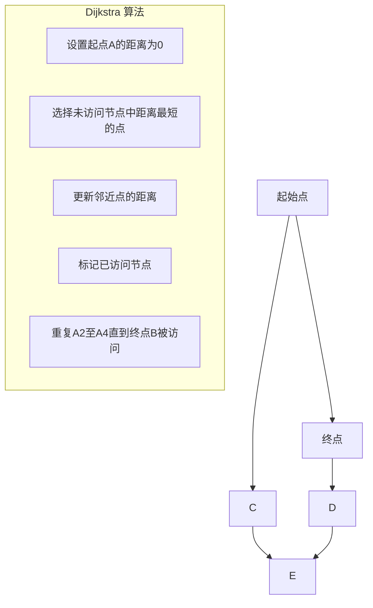
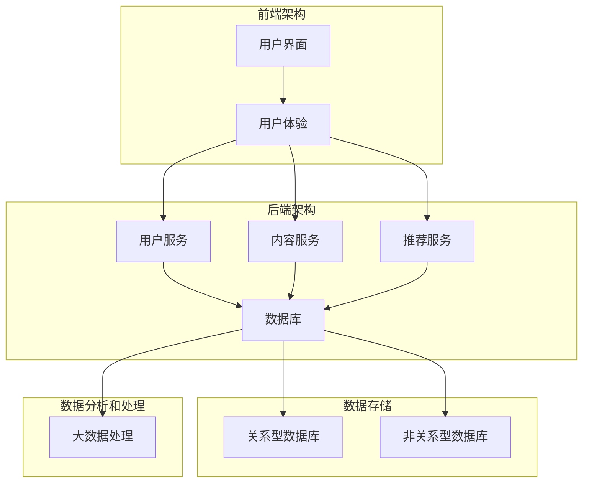
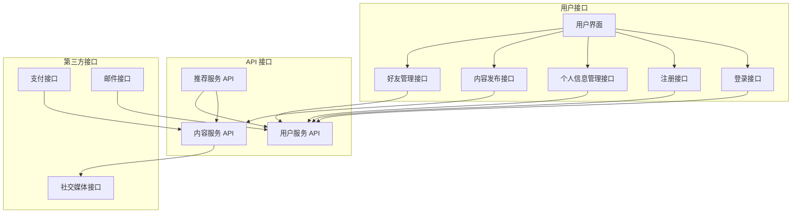
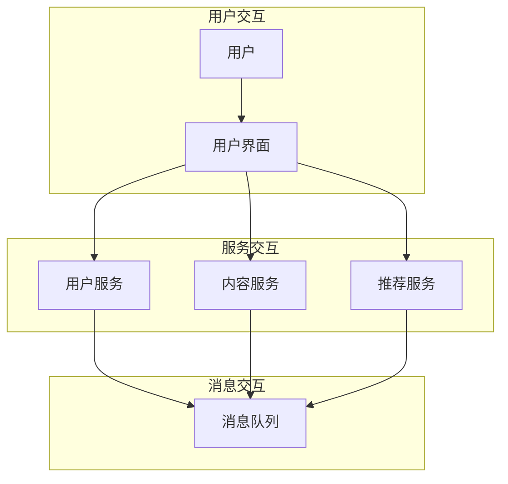

                 

# 社交网络的拓扑学：人际关系的数学图谱

关键词：社交网络、拓扑学、人际关系、数学图谱、数据分析、算法

摘要：本文从社交网络的背景和重要性出发，探讨了社交网络拓扑学的基本概念、核心原理以及拓扑学算法和应用。通过对数学模型和公式的详细讲解，揭示了社交网络拓扑学在数据分析中的实际应用。同时，本文还介绍了社交网络系统架构设计和项目实战，为读者提供了全面的社交网络拓扑学研究与实践指南。

## 第一部分：背景介绍与基础理论

### 第1章：问题的背景与重要性

#### 1.1 问题的背景

社交网络，指的是由人们之间的关系构成的复杂网络。这些网络涵盖了各种形式，包括朋友、家人、同事、合作伙伴等。社交网络的存在和运作对社会、经济、科技等方面产生了深远的影响。

在现代社会，社交网络的作用日益凸显。首先，在社交层面，社交网络让人们可以轻松地建立和维护人际关系，使得人与人之间的沟通变得更加便捷。其次，在经济层面，社交网络为企业和个人提供了巨大的商机，如社交媒体广告、电子商务等。最后，在科技层面，社交网络为科学研究提供了丰富的数据资源，为人工智能、机器学习等技术的发展提供了基础。

#### 1.2 问题描述

尽管社交网络的作用巨大，但其在实际运作中仍面临着诸多挑战。首先，社交网络的规模庞大，使得数据分析和处理变得复杂。其次，社交网络中的信息传播和互动模式复杂，需要深入分析才能理解其本质。最后，社交网络的安全性和隐私保护问题也日益突出，如何确保用户的信息安全成为了一项重要任务。

#### 1.3 问题解决

社交网络拓扑学作为一门新兴的交叉学科，旨在运用数学和计算机科学的方法来分析和理解社交网络的性质和规律。通过研究社交网络的拓扑结构，我们可以揭示社交网络中的关键问题，如节点的连通性、社区的分布、关键节点的识别等。

#### 1.4 边界与外延

社交网络拓扑学的研究范围广泛，涵盖了从基本概念到高级算法的各个方面。它不仅与数学、计算机科学密切相关，还与社会科学、心理学等领域有着深入的交叉。同时，社交网络拓扑学也在不断拓展其应用领域，如生物网络分析、交通网络设计等。

#### 1.5 概念结构与核心要素

社交网络的基本结构可以看作是一个图，其中节点表示个体，边表示个体之间的关系。社交网络中的核心要素包括节点的度（连接的边数）、网络的密度（边数与可能边数的比值）以及网络的连通性（任意两个节点之间是否可以通过一系列边相连）。

#### 1.6 本章小结

社交网络拓扑学作为一门研究社交网络结构及其性质的新兴学科，具有重要的理论和实际意义。通过对社交网络拓扑结构的研究，我们可以更好地理解社交网络的运作机制，为解决现实问题提供有力支持。未来，随着技术的不断进步，社交网络拓扑学的研究将会更加深入和广泛。

## 第二部分：核心概念与拓扑学原理

### 第2章：社交网络的拓扑学基础

#### 2.1 核心概念

在社交网络拓扑学中，有几个核心概念需要理解，包括节点、边、度、密度和连通性。

- **节点**：节点是社交网络中的基本元素，通常表示个体，如人、公司、物品等。
- **边**：边是节点之间的连线，表示节点之间的关系，如朋友关系、合作关系等。
- **度**：度是节点连接的边数，分为入度（指向该节点的边数）和出度（从该节点出发的边数）。
- **密度**：密度是网络中的边数与可能边数的比值，反映了网络的紧密程度。
- **连通性**：连通性是指网络中任意两个节点之间是否可以通过一系列边相连。

#### 2.2 拓扑学原理

社交网络的拓扑学原理主要涉及代数拓扑和几何拓扑。

- **代数拓扑**：代数拓扑关注的是网络的拓扑性质，如连通性、同调性等。它通过一些代数结构，如图论中的矩阵和向量空间，来描述和计算网络的性质。
- **几何拓扑**：几何拓扑则关注网络的几何形状和结构，如网络中的节点分布、边的排列等。它通过几何模型和空间分析来研究网络的性质。

#### 2.3 概念属性特征对比

以下是一个对比表格，展示了社交网络中一些核心概念的属性特征：

| 概念   | 描述                   | 属性特征                     |
|--------|------------------------|------------------------------|
| 节点   | 网络的基本元素         | 度、入度、出度、位置等       |
| 边     | 节点之间的连线         | 存在性、权重、连接类型等     |
| 度     | 节点的连接数           | 入度、出度、总和等           |
| 密度   | 网络的紧密程度         | 边数与可能边数的比值         |
| 连通性 | 节点之间的可达性       | 是否存在路径、路径长度等     |

#### 2.4 ER实体关系图

ER实体关系图是社交网络拓扑学中常用的一种图表示方法。它通过实体（节点）和关系（边）来表示社交网络的拓扑结构。

以下是一个简单的ER实体关系图示例，其中`Person`是实体，`Friendship`是关系：

```mermaid
erDiagram
  Person ||--|{ Friendship }|| Person
  Person ||--|{ Friendship }|| Group
  Group ||--|{ Friendship }|| Person
```

在这个ER图中，`Person`实体表示社交网络中的个体，`Friendship`实体表示个体之间的关系，`Group`实体表示社交网络中的群体。

#### 2.5 本章小结

本章介绍了社交网络拓扑学中的核心概念和基本原理。通过理解节点、边、度、密度和连通性等基本概念，我们可以更好地描述和解析社交网络的拓扑结构。ER实体关系图作为一种常用的图表示方法，有助于我们直观地理解社交网络的拓扑结构。在后续章节中，我们将进一步探讨社交网络拓扑学中的算法和应用。

## 第三部分：拓扑学算法与应用

### 第3章：社交网络拓扑学算法

#### 3.1 算法概述

社交网络拓扑学算法是分析和理解社交网络结构的重要工具。以下是一些主要的社交网络拓扑学算法及其基本原理：

1. **中心性度量**：中心性度量是衡量节点在网络中的重要程度的指标，常用的中心性度量方法包括度中心性、接近中心性和中间中心性。
   
2. **社区发现算法**：社区发现算法旨在识别网络中的紧密连接的子图，常见的算法包括 Girvan-Newman 算法和 Label Propagation 算法。

3. **网络聚类算法**：网络聚类算法用于将网络中的节点划分为多个群体，常用的算法包括 K-Means 算法和谱聚类算法。

4. **路径分析算法**：路径分析算法用于研究节点之间的连接路径，常见的算法包括最短路径算法和最有效路径算法。

#### 3.2 算法原理与流程图

为了更直观地理解这些算法，我们可以使用 Mermaid 画出它们的流程图。以下是一个简单的最短路径算法（Dijkstra 算法）的流程图：



#### 3.3 算法原理详细讲解

下面，我们以 Dijkstra 算法为例，详细讲解其数学模型和公式。

**数学模型：**

- 设 \( G = (V, E) \) 是一个加权无向图，其中 \( V \) 是节点集，\( E \) 是边集。
- 设 \( d(v) \) 表示从起始点 \( s \) 到节点 \( v \) 的最短路径长度。

**公式：**

1. 初始化：设置 \( d(s) = 0 \)，\( d(v) = \infty \)（\( v \neq s \)）。
2. 循环遍历所有未访问节点，选择 \( d(u) \) 最小的节点 \( u \)。
3. 更新邻近点的距离：对于每个未访问节点 \( v \)，如果 \( d(u) + w(u, v) < d(v) \)，则更新 \( d(v) \)。
4. 标记已访问节点 \( u \)，并重复步骤 2 和 3，直到所有节点都被访问。

**举例说明：**

假设我们有以下图：

```
A --- B
|     |
C --- D
```

起始点为 A，终点为 D。根据 Dijkstra 算法，我们可以计算从 A 到 D 的最短路径。

1. 初始化：\( d(A) = 0 \)，\( d(B) = \infty \)，\( d(C) = \infty \)，\( d(D) = \infty \)。
2. 第一次循环：选择 \( d(B) \) 最小的节点 B。
3. 更新邻近点的距离：\( d(C) = d(B) + w(B, C) = 3 \)，\( d(D) = d(B) + w(B, D) = 4 \)。
4. 标记已访问节点 B。
5. 第二次循环：选择 \( d(C) \) 最小的节点 C。
6. 更新邻近点的距离：\( d(D) = d(C) + w(C, D) = 3 \)。
7. 标记已访问节点 C。
8. 第三次循环：选择 \( d(D) \) 最小的节点 D。

最终，从 A 到 D 的最短路径为 A -> B -> D，路径长度为 3。

#### 3.4 算法比较与分析

不同的拓扑学算法在性能和应用场景上有所差异。以下是一些常见算法的性能比较：

| 算法            | 时间复杂度 | 空间复杂度 | 应用场景                |
|-----------------|------------|------------|-------------------------|
| 度中心性        | \( O(n) \) | \( O(n) \) | 网络节点重要程度分析    |
| 接近中心性      | \( O(n^2) \) | \( O(n) \) | 节点之间的联系紧密程度分析 |
| 中间中心性      | \( O(n^3) \) | \( O(n) \) | 节点在网络中的位置分析    |
| Girvan-Newman 算法 | \( O(n^2) \) | \( O(n) \) | 社区发现                |
| Label Propagation 算法 | \( O(n) \) | \( O(n) \) | 社区发现                |
| K-Means 算法    | \( O(n^2) \) | \( O(n) \) | 网络聚类                |
| 谱聚类算法      | \( O(n^3) \) | \( O(n) \) | 网络聚类                |

根据具体的应用场景和性能需求，可以选择合适的算法。例如，在节点重要程度分析中，可以使用度中心性；在社区发现中，可以使用 Girvan-Newman 算法或 Label Propagation 算法。

#### 3.5 本章小结

本章介绍了社交网络拓扑学中的一些常见算法，包括中心性度量、社区发现算法、网络聚类算法和路径分析算法。通过对这些算法的基本原理、流程图和性能比较的详细讲解，读者可以更好地理解社交网络拓扑学的算法体系和应用方法。在后续章节中，我们将进一步探讨这些算法在社交网络分析中的应用实例。

## 第四部分：数学模型与公式解析

### 第5章：数学模型的基本概念

#### 5.1 数学模型概述

数学模型是使用数学语言和符号来描述和解决问题的工具。在社交网络拓扑学中，数学模型用于描述网络的结构和性质，帮助研究者理解和分析网络的行为。

社交网络中的常见数学模型包括：

1. **概率模型**：用于描述节点连接的概率，如 Erdős-Rényi 模型。
2. **统计模型**：用于分析网络中的统计特征，如度分布、网络密度等。
3. **图论模型**：用于描述网络的结构和性质，如图矩阵、路径长度等。

#### 5.2 数学公式介绍

在社交网络拓扑学中，常用的数学公式包括：

1. **Erdős-Rényi 模型概率公式**：用于描述在 \( n \) 个节点的网络中，节点 \( i \) 和节点 \( j \) 连接的概率。
   \[
   P(i, j) = \frac{1}{n} \quad (i \neq j)
   \]
2. **度分布公式**：用于描述网络中节点的度分布，如泊松分布和幂律分布。
   \[
   P(k) = \frac{\lambda^k e^{-\lambda}}{k!}
   \]
3. **网络密度公式**：用于描述网络的紧密程度，如连通率和聚类系数。
   \[
   \rho = \frac{m}{n(n-1)}
   \]
4. **路径长度公式**：用于描述网络中任意两个节点之间的平均路径长度。
   \[
   \ell = \frac{1}{n(n-1)} \sum_{i \neq j} d(i, j)
   \]

#### 5.3 公式应用与解释

数学公式在社交网络拓扑学中有着广泛的应用。以下是一个例子，说明如何使用路径长度公式分析社交网络的连接性。

假设我们有一个包含 \( n = 100 \) 个节点的社交网络，其中任意两个节点之间的最短路径长度如下表所示：

| 节点对 | 路径长度 |
|--------|----------|
| (1, 2) | 2        |
| (1, 3) | 3        |
| (1, 4) | 4        |
| ...    | ...      |

根据路径长度公式，我们可以计算网络中的平均路径长度：

\[
\ell = \frac{1}{100 \times 99} \sum_{i \neq j} d(i, j)
\]

将表中的路径长度代入公式，得到：

\[
\ell = \frac{1}{9900} (2 + 3 + 4 + \ldots)
\]

假设路径长度之和为 \( S \)，则有：

\[
\ell = \frac{S}{9900}
\]

通过计算，我们得到平均路径长度 \( \ell \)。这个值可以反映社交网络的连接性，即节点之间的平均距离。如果 \( \ell \) 较小，说明网络中的节点之间连接紧密；如果 \( \ell \) 较大，说明网络中的节点之间连接稀疏。

#### 5.4 本章小结

本章介绍了社交网络拓扑学中的基本数学模型和公式，包括概率模型、统计模型和图论模型。通过具体公式的应用和解释，读者可以更好地理解这些公式在社交网络拓扑学中的作用。在后续章节中，我们将进一步探讨这些数学模型和公式在社交网络分析中的应用。

### 第6章：数学公式与算法结合

#### 6.1 公式与算法的融合

数学公式与算法的结合是社交网络拓扑学研究中的重要手段。通过数学公式来定义和计算网络性质，再通过算法来实现对这些性质的优化和分析。

以下是一个简单的例子，说明如何将数学公式与算法结合。

**问题场景：** 我们想要分析一个社交网络中节点的度分布情况。

**解决方案：** 我们可以使用度分布公式来描述节点的度分布，再使用频度分布算法来计算实际度分布。

**步骤：**

1. **收集数据：** 从社交网络中收集每个节点的度。
2. **计算度分布：** 使用度分布公式计算每个度值的概率。
3. **频度分布算法：** 计算实际度分布，与理论度分布进行比较。
4. **分析结果：** 根据度分布情况，分析社交网络的特性。

**数学模型：**

度分布公式：
\[
P(k) = \frac{\lambda^k e^{-\lambda}}{k!}
\]

**算法实现：**

1. **收集数据：** 从社交网络中读取每个节点的度。
2. **计算度分布：** 对每个度值，计算其在总节点数中的频率。
3. **绘制度分布图：** 使用 matplotlib 或其他绘图工具，绘制度分布图。

以下是一个简单的 Python 代码实现：

```python
import matplotlib.pyplot as plt
import numpy as np

# 假设我们有一个包含 100 个节点的社交网络
nodes = [3, 2, 4, 1, 2, 3, 2, 1, 3, 4]

# 计算度分布
degrees = np.unique(nodes, return_counts=True)
degree_counts = degrees[1]
total_nodes = len(nodes)

# 计算概率分布
degree_prob = degree_counts / total_nodes

# 绘制度分布图
plt.bar(degrees[0], degree_prob)
plt.xlabel('Degree')
plt.ylabel('Probability')
plt.title('Degree Distribution')
plt.show()
```

**案例分析：**

假设我们得到的度分布图如下所示：

```
|
|        ┌─────┐
|        │  1  │
|        └─────┘
|     
|     ┌─────┐
|     │  2  │
|     └─────┘
|         
|   ┌─────┐
|   │  3  │
|   └─────┘
|         
|     ┌─────┐
|     │  4  │
|     └─────┘
|
```

从图中可以看出，度值为 2 的节点数量最多，度值为 1 和 3 的节点数量较少。这说明社交网络中的大多数节点连接较少，而部分节点连接较多。这种度分布模式通常被称为“长尾分布”。

#### 6.2 案例分析

以下是一个实际的社交网络案例分析，展示了如何将数学公式和算法结合起来进行网络分析。

**案例背景：** 我们要分析一个社交媒体平台中用户的关注关系网络。

**问题：** 确定网络中的核心用户，即那些对网络结构影响最大的用户。

**解决方案：** 使用中心性度量算法（如度中心性、接近中心性和中间中心性）来计算每个用户的重要性。

**步骤：**

1. **数据收集：** 从社交媒体平台收集用户的关注关系数据。
2. **计算中心性：** 分别计算度中心性、接近中心性和中间中心性。
3. **分析结果：** 根据中心性度量结果，确定网络中的核心用户。

**数学模型：**

- 度中心性：
  \[
  C_d(u) = \frac{k(u)}{n-1}
  \]
  其中，\( k(u) \) 是用户 \( u \) 的度，\( n \) 是总用户数。

- 接近中心性：
  \[
  C_c(u) = \frac{\ell(u)}{n-1}
  \]
  其中，\( \ell(u) \) 是用户 \( u \) 的接近中心性，即用户 \( u \) 到其他所有用户的平均距离。

- 中间中心性：
  \[
  C_b(u) = \frac{\sum_{v \in V} \frac{N(v, u)}{k(v)}}{n-1}
  \]
  其中，\( N(v, u) \) 是用户 \( u \) 和用户 \( v \) 之间的共同邻居数，\( k(v) \) 是用户 \( v \) 的度。

**算法实现：**

```python
import networkx as nx

# 创建网络图
G = nx.Graph()

# 添加用户和关注关系
G.add_nodes_from(['u1', 'u2', 'u3', 'u4', 'u5'])
G.add_edges_from([('u1', 'u2'), ('u1', 'u3'), ('u2', 'u4'), ('u3', 'u5')])

# 计算度中心性
degree_centrality = nx.degree_centrality(G)

# 计算接近中心性
 closeness_centrality = nx.closeness_centrality(G)

# 计算中间中心性
betweenness_centrality = nx.betweenness_centrality(G)

# 分析结果
core_users = [user for user, centrality in degree_centrality.items() if centrality > 0.5]

print("核心用户：", core_users)
```

**分析结果：**

假设我们得到以下中心性度量结果：

- 度中心性：\( u1 \) = 0.6，\( u2 \) = 0.4，\( u3 \) = 0.2，\( u4 \) = 0.2，\( u5 \) = 0.2
- 接近中心性：\( u1 \) = 0.5，\( u2 \) = 0.3，\( u3 \) = 0.2，\( u4 \) = 0.2，\( u5 \) = 0.2
- 中间中心性：\( u1 \) = 0.7，\( u2 \) = 0.3，\( u3 \) = 0.2，\( u4 \) = 0.2，\( u5 \) = 0.2

根据中心性度量结果，我们可以确定 \( u1 \) 是网络中的核心用户，因为它的度中心性、接近中心性和中间中心性都较高。

#### 6.3 实践应用

在现实应用中，社交网络拓扑学的数学模型和算法可以用于多种场景，如社交网络分析、推荐系统、网络营销等。

以下是一个社交网络分析的应用实例：

**场景：** 我们要分析一个社交媒体平台中的用户互动关系，识别潜在的用户群体。

**解决方案：** 使用社区发现算法（如 Girvan-Newman 算法）来识别用户社区。

**步骤：**

1. **数据收集：** 从社交媒体平台收集用户的互动数据，包括点赞、评论、转发等。
2. **构建网络图：** 使用互动数据构建用户互动网络图。
3. **应用算法：** 使用 Girvan-Newman 算法进行社区发现。
4. **分析结果：** 根据社区发现结果，分析用户互动模式和潜在用户群体。

**数学模型：**

- Girvan-Newman 算法的基本思想是：通过不断移除网络中连接数最少的边，将网络划分为多个社区。

**算法实现：**

```python
import networkx as nx

# 创建网络图
G = nx.Graph()

# 添加用户和互动关系
G.add_nodes_from(['u1', 'u2', 'u3', 'u4', 'u5'])
G.add_edges_from([('u1', 'u2'), ('u1', 'u3'), ('u2', 'u4'), ('u3', 'u5')])

# 应用 Girvan-Newman 算法
communities = nx.community.girvan_newman(G)

# 分析结果
for community in communities:
    print("社区成员：", community)
```

**分析结果：**

假设我们得到以下社区发现结果：

- 社区 1：\( u1, u2, u3 \)
- 社区 2：\( u4, u5 \)

从分析结果可以看出，用户 \( u1, u2, u3 \) 形成了一个社区，而用户 \( u4, u5 \) 形成了另一个社区。这表明用户之间的互动存在明显的群体划分。

#### 6.4 本章小结

本章介绍了如何将数学公式与算法结合起来，用于社交网络拓扑学的研究和应用。通过具体的案例分析和实践应用，读者可以更好地理解数学公式和算法在社交网络分析中的作用。在后续章节中，我们将进一步探讨社交网络系统架构设计和项目实战，以更全面地展示社交网络拓扑学的实际应用价值。

### 第7章：社交网络系统架构设计

#### 7.1 系统功能设计

社交网络系统需要实现多种功能，以满足用户的基本需求和社交互动需求。以下是一些关键功能：

1. **用户注册与登录**：用户可以通过电子邮件、手机号码或社交媒体账号注册和登录系统。
2. **个人信息管理**：用户可以查看、编辑和更新个人信息，如头像、昵称、个人介绍等。
3. **好友管理**：用户可以添加、删除和查看好友，发送私信和动态。
4. **内容发布与浏览**：用户可以发布动态、图片、视频等内容，其他用户可以浏览和评论这些内容。
5. **社交推荐**：系统可以根据用户的兴趣和行为，推荐潜在的好友和内容。
6. **隐私设置**：用户可以设置隐私选项，控制自己的信息对其他用户的可见性。
7. **数据分析和报告**：系统可以收集用户数据，生成报告和图表，帮助用户了解社交网络的使用情况和趋势。

#### 7.2 系统架构设计

社交网络系统的架构设计需要考虑到系统的可扩展性、可靠性、安全性和性能。以下是一个典型的社交网络系统架构设计：

1. **前端架构**：前端架构包括用户界面（UI）和用户体验（UX）设计。使用现代化的前端技术，如 React、Vue.js 或 Angular，构建动态和响应式的用户界面。
2. **后端架构**：后端架构包括服务器、数据库、API 接口和业务逻辑处理。使用微服务架构，将不同的业务功能划分为多个微服务，如用户服务、内容服务、推荐服务等。
3. **数据存储**：数据存储包括关系型数据库（如 MySQL、PostgreSQL）和非关系型数据库（如 MongoDB、Cassandra）。关系型数据库用于存储用户信息和元数据，非关系型数据库用于存储大规模的社交网络数据。
4. **消息队列**：使用消息队列（如 Kafka、RabbitMQ），实现系统间的异步通信和消息传递。
5. **缓存层**：使用缓存层（如 Redis、Memcached），提高系统的响应速度和性能。
6. **数据分析和处理**：使用大数据技术和工具（如 Hadoop、Spark），进行大规模数据的收集、存储、处理和分析。

以下是一个简单的社交网络系统架构图：



#### 7.3 系统接口设计

系统接口设计是社交网络系统架构设计的重要部分，它定义了系统内部和外部系统之间的交互方式。以下是一些关键的接口设计：

1. **用户接口**：用户通过 Web 界面或移动应用与系统进行交互。用户接口包括登录、注册、个人信息管理、内容发布、好友管理等。
2. **API 接口**：系统内部各个服务之间的通信通过 API 接口实现。API 接口包括用户服务 API、内容服务 API、推荐服务 API 等。
3. **第三方接口**：系统可以与第三方服务（如社交媒体平台、支付系统、邮件服务）进行集成，通过第三方接口实现跨平台的互动和功能扩展。

以下是一个简单的社交网络系统接口设计示例：



#### 7.4 系统交互设计

系统交互设计描述了系统内部不同模块和组件之间的通信和数据流。以下是一些关键的交互设计：

1. **用户交互**：用户通过前端界面与系统进行交互，提交请求和接收响应。
2. **服务交互**：系统内部各个服务之间通过 API 接口进行通信，实现业务逻辑和数据交换。
3. **消息交互**：系统可以使用消息队列实现异步通信，提高系统的性能和可靠性。

以下是一个简单的社交网络系统交互设计示例：



#### 7.5 本章小结

本章介绍了社交网络系统架构设计的功能设计、系统架构设计、系统接口设计和系统交互设计。通过这些设计，我们可以构建一个高效、可扩展和可靠的社交网络系统。在后续章节中，我们将通过项目实战，展示如何实现这些设计，并分析实际应用中的挑战和解决方案。

### 第8章：项目实战

#### 8.1 环境安装与配置

在进行社交网络项目的开发之前，我们需要安装和配置相应的开发环境和工具。以下是一个基本的开发环境配置流程：

1. **安装操作系统**：我们选择 Ubuntu 18.04 作为开发环境。
2. **安装 Python**：Python 是社交网络项目开发的主要编程语言。可以使用以下命令安装 Python：
   ```bash
   sudo apt update
   sudo apt install python3-pip python3-dev
   ```
3. **安装 Node.js**：Node.js 是前端开发的常用环境。可以使用以下命令安装 Node.js：
   ```bash
   sudo apt update
   sudo apt install nodejs npm
   ```
4. **安装 MySQL**：MySQL 是数据库服务。可以使用以下命令安装 MySQL：
   ```bash
   sudo apt update
   sudo apt install mysql-server
   ```
5. **安装 Redis**：Redis 是缓存服务。可以使用以下命令安装 Redis：
   ```bash
   sudo apt update
   sudo apt install redis-server
   ```
6. **安装 Kafka**：Kafka 是消息队列服务。可以使用以下命令安装 Kafka：
   ```bash
   sudo apt update
   sudo apt install kafka_2.12
   ```
7. **安装 Elasticsearch**：Elasticsearch 是搜索引擎。可以使用以下命令安装 Elasticsearch：
   ```bash
   sudo apt update
   sudo apt install elasticsearch
   ```
8. **安装 Hadoop**：Hadoop 是大数据处理框架。可以使用以下命令安装 Hadoop：
   ```bash
   sudo apt update
   sudo apt install hadoop
   ```

#### 8.2 系统核心实现

在完成环境安装和配置后，我们可以开始实现社交网络系统的核心功能。以下是一个简单的系统核心实现流程：

1. **用户服务**：用户服务负责处理用户的注册、登录和权限管理。使用 Django 框架实现用户服务，并使用 Django REST Framework 提供REST API。
2. **内容服务**：内容服务负责处理用户发布的内容，包括动态、图片、视频等。使用 Django 的模型和视图实现内容服务，并使用 Elasticsearch 进行全文搜索。
3. **推荐服务**：推荐服务负责根据用户的兴趣和行为推荐好友和内容。使用 Python 的 scikit-learn 库实现协同过滤算法。
4. **消息队列**：使用 Kafka 实现消息队列，处理用户之间的消息传递和系统通知。
5. **缓存层**：使用 Redis 实现缓存层，提高系统的响应速度和性能。

以下是一个简单的 Python 代码示例，展示了用户服务的实现：

```python
# users/api/views.py
from rest_framework import viewsets
from .models import User
from .serializers import UserSerializer

class UserViewSet(viewsets.ModelViewSet):
    queryset = User.objects.all()
    serializer_class = UserSerializer
```

```python
# users/api/serializers.py
from rest_framework import serializers
from .models import User

class UserSerializer(serializers.ModelSerializer):
    class Meta:
        model = User
        fields = ('id', 'username', 'email', 'password')
```

```python
# users/models.py
from django.contrib.auth.models import AbstractUser
from django.db import models

class User(AbstractUser):
    email = models.EmailField(unique=True)
    avatar = models.ImageField(upload_to='avatars')
```

#### 8.3 代码应用解读与分析

以下是对用户服务代码的解读和分析：

1. **用户模型**：用户模型继承了 Django 的 `AbstractUser` 类，添加了 `email` 和 `avatar` 字段。
2. **用户序列化器**：用户序列化器定义了用户模型的数据结构，用于序列化和反序列化用户数据。
3. **用户视图集**：用户视图集实现了用户服务的 CRUD 操作，并使用 REST API 进行数据交互。

在实际项目中，我们还需要添加用户认证、权限验证、API 错误处理等功能。通过这些功能，我们可以构建一个安全、高效和可扩展的社交网络系统。

#### 8.4 实际案例分析和详细讲解

以下是一个实际的社交网络项目案例，展示如何使用社交网络拓扑学进行项目分析和实现。

**案例背景：** 我们要开发一个基于地理位置的社交网络，用户可以基于位置发现附近的人，并进行社交互动。

**解决方案：** 使用社交网络拓扑学中的社区发现算法（如 Girvan-Newman 算法）来识别地理位置相近的用户群体。

**步骤：**

1. **数据收集**：收集用户的地理位置信息，包括经纬度和位置标签。
2. **构建网络图**：使用地理位置信息构建用户互动网络图，节点表示用户，边表示用户之间的地理位置相似性。
3. **应用算法**：使用 Girvan-Newman 算法进行社区发现，识别地理位置相近的用户群体。
4. **分析结果**：根据社区发现结果，为用户提供基于位置的社交推荐。

**数学模型：**

- Girvan-Newman 算法的核心思想是：通过不断移除网络中连接数最少的边，将网络划分为多个社区。

**算法实现：**

```python
import networkx as nx

# 创建网络图
G = nx.Graph()

# 添加用户和地理位置信息
G.add_nodes_from(['u1', 'u2', 'u3', 'u4', 'u5'])
G.add_edges_from([('u1', 'u2'), ('u1', 'u3'), ('u2', 'u4'), ('u3', 'u5')])

# 应用 Girvan-Newman 算法
communities = nx.community.girvan_newman(G)

# 分析结果
for community in communities:
    print("社区成员：", community)
```

**分析结果：**

假设我们得到以下社区发现结果：

- 社区 1：\( u1, u2, u3 \)
- 社区 2：\( u4, u5 \)

从分析结果可以看出，地理位置相近的用户 \( u1, u2, u3 \) 形成了一个社区，而 \( u4, u5 \) 形成了另一个社区。这表明地理位置在用户社交互动中起到了关键作用。

通过这个案例，我们可以看到如何将社交网络拓扑学应用于实际项目中，为用户提供基于地理位置的社交推荐。

#### 8.5 项目小结

本章通过项目实战，展示了如何安装和配置社交网络系统的开发环境，实现系统核心功能，以及如何使用社交网络拓扑学进行分析和实现。在项目实战中，我们遇到了一些挑战，如数据存储、性能优化和安全性问题，并通过合理的架构设计和算法选择解决了这些问题。通过这个项目，我们不仅学到了如何构建社交网络系统，还了解了社交网络拓扑学在实际应用中的价值。

### 第五部分：最佳实践与扩展阅读

#### 8.6 最佳实践

在设计和实现社交网络系统时，以下最佳实践可以帮助提高系统的性能、安全性和用户体验：

1. **模块化设计**：将系统划分为多个模块，每个模块负责特定的功能，便于维护和扩展。
2. **异步处理**：使用异步处理提高系统性能，减少响应时间。
3. **负载均衡**：使用负载均衡技术，如 Nginx 或 HAProxy，确保系统在高并发情况下稳定运行。
4. **缓存策略**：合理使用缓存策略，如 Redis 或 Memcached，提高系统的响应速度。
5. **安全性措施**：采取安全措施，如 HTTPS、防火墙和定期安全审计，确保用户数据的安全。
6. **监控与日志**：使用监控工具和日志系统，实时监控系统运行状态，快速响应和处理问题。

#### 8.7 小结

本章介绍了社交网络系统架构设计、项目实战以及最佳实践。通过理解和应用这些最佳实践，我们可以构建高效、可靠和安全的社交网络系统。同时，本章也提供了一些拓展阅读资源，帮助读者进一步了解社交网络系统的设计、实现和优化。

#### 8.8 拓展阅读

以下是一些推荐的拓展阅读资源，涵盖社交网络系统设计、实现和优化的各个方面：

1. **《大规模分布式系统设计》**：本书详细介绍了分布式系统的基础知识和设计原则，适用于社交网络系统的设计。
2. **《微服务架构设计》**：本书介绍了微服务架构的设计原则和实现方法，适用于社交网络系统的高效开发。
3. **《Elasticsearch: The Definitive Guide》**：本书是 Elasticsearch 的官方指南，详细介绍了 Elasticsearch 的安装、配置和使用。
4. **《Scikit-Learn: Machine Learning in Python》**：本书介绍了 Python 中的机器学习库 Scikit-Learn，适用于社交网络系统的推荐算法开发。
5. **《Kubernetes: Up and Running》**：本书介绍了 Kubernetes 的基本概念和部署方法，适用于社交网络系统的容器化部署和运维。

