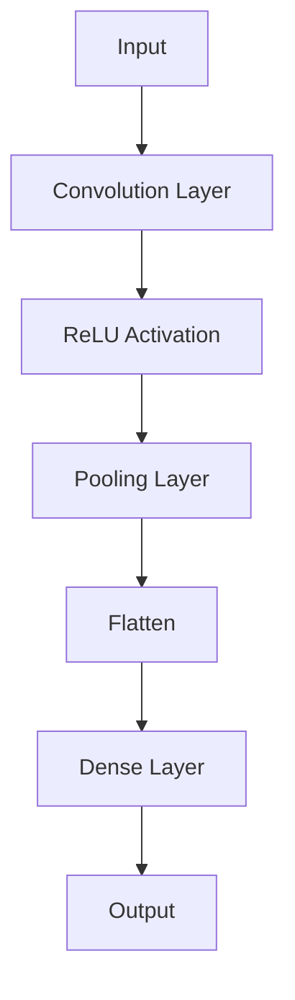
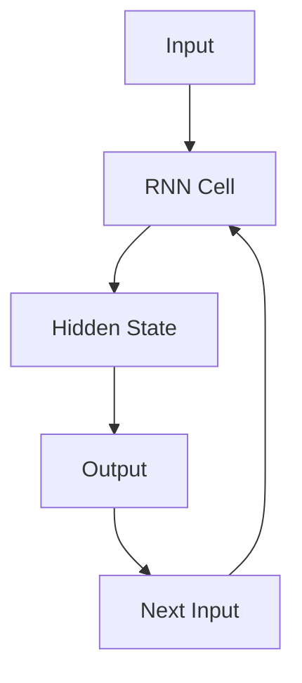
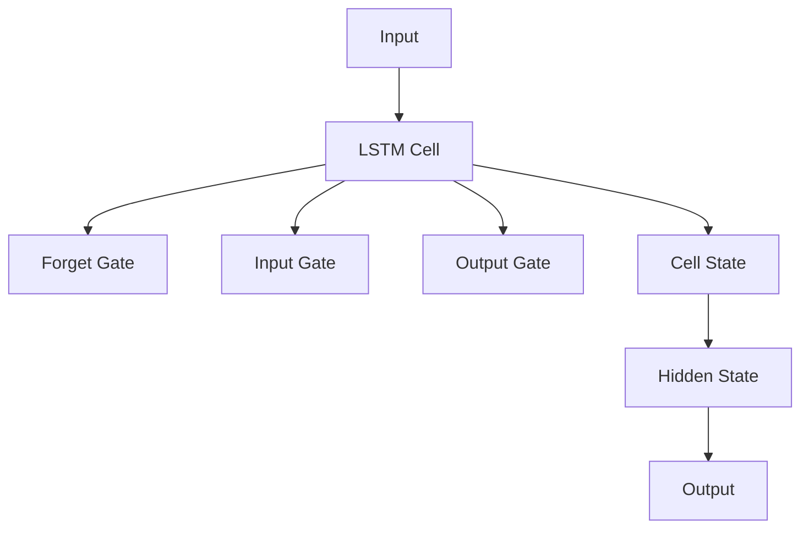

                 

**# 神经网络：大脑结构的数学模拟**

## 关键词：神经网络、大脑模拟、数学建模、机器学习、算法设计

## 摘要：
本文旨在探讨神经网络作为大脑结构的数学模拟的原理与应用。通过对神经网络起源、核心概念、数学基础、算法实现以及应用案例的详细分析，本文将揭示神经网络在模拟大脑功能中的重要作用，并探讨其在未来技术发展中的潜力。

---

## 引言

### 1. 神经网络的起源

神经网络这一概念最早由心理学家弗兰克·罗森布拉特（Frank Rosenblatt）于1957年提出，他设计的感知机（Perceptron）是神经网络最早的模型之一。感知机是一种线性二分类模型，旨在模拟生物神经元的基本功能。

### 2. 神经网络与生物大脑的类比

生物大脑是一个复杂的神经网络系统，由数十亿个神经元组成，通过突触连接实现信息传递和处理。神经网络试图模仿这一结构，通过层级结构实现从简单到复杂的特征提取和决策。

### 3. 神经网络在计算机科学中的应用

随着计算机技术和算法的发展，神经网络在计算机视觉、自然语言处理、语音识别等领域取得了显著的成就。特别是在深度学习的推动下，神经网络的应用前景更加广阔。

## 第一部分：神经网络基础

### 第1章：神经网络的起源与发展

#### 1.1 神经网络的概念与历史背景

- **核心概念**：神经元、神经网络、学习算法。
- **问题背景**：如何模拟生物神经元的工作原理？
- **问题解决**：通过数学模型模拟神经元的活动。
- **边界与外延**：神经网络的层次结构、学习算法的改进。

#### 1.2 神经网络与生物大脑的类比

- **核心概念**：神经元结构、突触连接、神经网络层次。
- **属性特征对比表格**：

| 特征         | 神经元                 | 生物神经元           |
| ------------ | ---------------------- | ------------------- |
| 结构         | 计算单元               | 神经细胞体           |
| 连接         | 输入层、隐藏层、输出层 | 突触连接             |
| 活动规则     | 激活函数               | 活动电位             |
| 学习方式     | 反向传播               | 经验学习             |

#### 1.3 神经网络在计算机科学中的应用

- **核心概念**：计算机视觉、自然语言处理、语音识别。
- **应用场景**：图像识别、语音合成、情感分析。
- **边界与外延**：神经网络在各个领域的具体应用与挑战。

## 第二部分：神经网络的数学基础

### 第2章：神经网络的数学基础

#### 2.1 概率论与统计分布

- **核心概念**：概率分布、随机变量、期望和方差。
- **数学公式**：
  $$ P(X=x) = f(x) $$
  $$ E(X) = \sum_{x} x \cdot P(X=x) $$
- **举例说明**：使用概率分布模拟神经元的激活概率。

#### 2.2 神经网络的参数优化

- **核心概念**：权重、偏置、优化算法。
- **数学模型**：梯度下降算法、反向传播算法。
- **数学公式**：
  $$ \nabla W = -\eta \cdot \nabla E(W) $$
  $$ E(W) = \frac{1}{2} \sum_{i} (y_i - \hat{y}_i)^2 $$

#### 2.3 激活函数与梯度下降算法

- **核心概念**：ReLU、Sigmoid、Tanh。
- **数学公式**：
  $$ f(x) = \max(0, x) $$
  $$ \frac{df}{dx} = \begin{cases} 
  1 & \text{if } x > 0 \\
  0 & \text{if } x \leq 0 
  \end{cases} $$
- **举例说明**：ReLU激活函数的应用与梯度计算。

## 第三部分：经典神经网络算法

### 第3章：经典神经网络算法

#### 3.1 单层感知机

- **算法原理**：基于线性可分性的二分类算法。
- **Python源代码**：
  ```python
  class Perceptron:
      def __init__(self, learning_rate=0.1):
          self.learning_rate = learning_rate
          self.weights = [0] * num_inputs
      
      def activate(self, inputs):
          return sum(inputs[i] * self.weights[i]) >= 0
      
      def train(self, inputs, expected_output):
          for input_vector, output in zip(inputs, expected_output):
              if not self.activate(input_vector):
                  for i in range(num_inputs):
                      self.weights[i] += self.learning_rate * input_vector[i]
  ```

#### 3.2 多层感知机

- **算法原理**：非线性可分问题的解决方案。
- **Python源代码**：
  ```python
  class MLP:
      def __init__(self, hidden_layers):
          self.layers = [NeuralLayer(hidden_layers[i], hidden_layers[i-1]) for i in range(1, len(hidden_layers))]
          self.output_layer = NeuralLayer(output_size, hidden_layers[-1])
      
      def forward(self, inputs):
          for layer in self.layers:
              inputs = layer.forward(inputs)
          return self.output_layer.forward(inputs)
      
      def backward(self, inputs, expected_output):
          # 反向传播算法实现
  ```

#### 3.3 反向传播算法

- **算法原理**：通过计算梯度更新网络权重。
- **Python源代码**：
  ```python
  def backward_propagation(self, inputs, expected_output):
      output = self.forward(inputs)
      dE_dW = [np.zeros_like(w) for w in self.weights]
      
      for i in reversed(range(self.num_layers)):
          dE_dZ = self.layers[i].activation_derivative(output)
          dE_dZ = dE_dZ * (1 - dE_dZ)
          
          if i < self.num_layers - 1:
              dE_dW[-1] = dE_dZ @ self.layers[i+1].weights.T
          else:
              dE_dW[-1] = dE_dZ @ self.output_layer.weights.T
          
          for l in reversed(range(self.num_layers - 1)):
              dE_dW[l] = self.layers[l].activation_derivative(output) @ self.layers[l+1].weights.T
  ```

## 第四部分：神经网络的扩展与变种

### 第4章：神经网络的扩展与变种

#### 4.1 卷积神经网络（CNN）

- **算法原理**：通过卷积操作提取图像特征。
- **Mermaid流程图**：



#### 4.2 循环神经网络（RNN）

- **算法原理**：处理序列数据。
- **Mermaid流程图**：



#### 4.3 长短时记忆网络（LSTM）

- **算法原理**：解决长序列依赖问题。
- **Mermaid流程图**：



## 第五部分：神经网络的数学模拟

### 第5章：神经网络的数学模拟

#### 5.1 神经网络的数学建模

- **核心概念**：神经元模型、神经网络模型。
- **数学模型**：使用微分方程描述神经元活动。
- **数学公式**：
  $$ \frac{dV}{dt} = -V/\tau + I $$
  $$ I = w \cdot x(t) $$

#### 5.2 神经网络的数学分析

- **核心概念**：稳定性分析、动态行为。
- **数学公式**：
  $$ \Delta V = -\frac{\Delta V}{\tau} + \Delta I $$
  $$ \Delta I = w \cdot \Delta x $$

#### 5.3 神经网络与大脑结构的比较

- **核心概念**：神经元连接、神经网络层次。
- **属性特征对比表格**：

| 特征         | 神经网络                | 生物大脑               |
| ------------ | ---------------------- | --------------------- |
| 神经元数量   | 数以亿计               | 数十亿                |
| 神经元连接   | 稀疏连接               | 密集连接              |
| 神经元结构   | 简单计算单元           | 复杂生物结构           |
| 学习方式     | 数据驱动               | 经验学习              |

## 第六部分：神经网络应用案例分析

### 第6章：神经网络应用案例分析

#### 6.1 图像识别

- **项目介绍**：使用卷积神经网络进行图像识别。
- **系统功能设计**：图像预处理、特征提取、分类。
- **系统架构设计**：卷积层、池化层、全连接层。
- **系统接口设计**：输入接口、输出接口。
- **系统交互**：数据流、信息传递。

#### 6.2 自然语言处理

- **项目介绍**：使用循环神经网络进行语言建模。
- **系统功能设计**：序列编码、序列解码、词向量表示。
- **系统架构设计**：嵌入层、循环层、输出层。
- **系统接口设计**：输入接口、输出接口。
- **系统交互**：序列数据流、状态传递。

#### 6.3 控制系统

- **项目介绍**：使用神经网络进行自主控制。
- **系统功能设计**：状态检测、决策制定、控制输出。
- **系统架构设计**：输入层、隐藏层、输出层。
- **系统接口设计**：传感器接口、执行器接口。
- **系统交互**：环境感知、控制决策。

## 第七部分：神经网络开发实践

### 第7章：神经网络开发实践

#### 7.1 开发环境搭建

- **环境安装**：Python、TensorFlow、PyTorch。
- **配置说明**：系统环境、库依赖。

#### 7.2 神经网络核心实现源代码

- **代码实现**：神经网络架构、训练过程。
- **代码应用解读与分析**：代码逻辑、性能优化。

#### 7.3 代码应用解读与分析

- **实际案例分析**：神经网络在不同领域的应用。
- **详细讲解剖析**：应用原理、实现细节。

#### 7.4 项目小结

- **总结**：神经网络的核心优势与应用前景。
- **展望**：神经网络在未来的发展方向。

## 最佳实践 tips

- **优化技巧**：权重初始化、学习率调整。
- **实践建议**：数据预处理、模型验证。

## 小结

- **文章总结**：神经网络在模拟大脑结构中的重要作用。
- **未来展望**：神经网络在人工智能领域的潜力。

## 注意事项

- **常见问题**：过拟合、欠拟合。
- **解决方法**：正则化、交叉验证。

## 拓展阅读

- **推荐书籍**：《深度学习》、《神经网络与深度学习》。
- **在线资源**：GitHub、Kaggle。

---

**作者：AI天才研究院/AI Genius Institute & 禅与计算机程序设计艺术 /Zen And The Art of Computer Programming**### # 神经网络：大脑结构的数学模拟

神经网络作为人工智能领域的重要基石，其理论基础源于对生物大脑结构的模仿和模拟。本文旨在探讨神经网络的工作原理及其在模拟大脑结构方面的应用，以帮助读者深入了解这一前沿科技。

## 关键词

神经网络、大脑模拟、数学建模、机器学习、算法设计。

## 摘要

本文首先介绍了神经网络的起源与发展，随后深入探讨了其核心概念和数学基础，并通过经典神经网络算法和扩展变种的实例，展示了神经网络的应用与实现。最后，本文通过案例分析、项目实战和最佳实践，对神经网络的开发和应用进行了详细解析。

### 第一部分：神经网络基础

#### 第1章：神经网络的起源与发展

##### 1.1 神经网络的概念与历史背景

神经网络最早由心理学家弗兰克·罗森布拉特（Frank Rosenblatt）于1957年提出，他设计的感知机（Perceptron）是神经网络最早的模型之一。感知机是一种线性二分类模型，旨在模拟生物神经元的基本功能。

##### 1.2 神经网络与生物大脑的类比

生物大脑是一个复杂的神经网络系统，由数十亿个神经元组成，通过突触连接实现信息传递和处理。神经网络试图模仿这一结构，通过层级结构实现从简单到复杂的特征提取和决策。

##### 1.3 神经网络在计算机科学中的应用

随着计算机技术和算法的发展，神经网络在计算机视觉、自然语言处理、语音识别等领域取得了显著的成就。特别是在深度学习的推动下，神经网络的应用前景更加广阔。

#### 第2章：神经网络的数学基础

##### 2.1 概率论与统计分布

在神经网络的数学建模中，概率论和统计分布是不可或缺的工具。通过概率分布，我们可以模拟神经元的激活概率，并通过统计方法对神经网络的性能进行评估和优化。

##### 2.2 神经网络的参数优化

神经网络的参数优化是神经网络训练过程中的关键步骤。通过优化算法，如梯度下降，我们可以找到最优的参数值，使神经网络能够在给定数据集上达到最佳性能。

##### 2.3 激活函数与梯度下降算法

激活函数是神经网络中的一个重要组成部分，它决定了神经元的输出行为。梯度下降算法则是神经网络训练过程中用于优化参数的一种有效方法。

#### 第3章：经典神经网络算法

##### 3.1 单层感知机

单层感知机是一种简单的神经网络模型，适用于线性可分的数据集。它通过计算输入向量和权重的点积，并根据阈值进行分类。

##### 3.2 多层感知机

多层感知机通过引入多个隐藏层，能够处理更复杂的问题。它使用反向传播算法来更新权重和偏置，从而优化网络性能。

##### 3.3 反向传播算法

反向传播算法是一种基于梯度下降的优化方法，用于训练多层感知机。它通过计算输出层到隐藏层的梯度，并反向传播到输入层，从而更新网络的权重和偏置。

#### 第4章：神经网络的扩展与变种

##### 4.1 卷积神经网络（CNN）

卷积神经网络是一种专门用于图像识别和处理的前馈神经网络。它通过卷积操作提取图像特征，并通过池化操作降低数据的维度。

##### 4.2 循环神经网络（RNN）

循环神经网络是一种用于处理序列数据的神经网络。它通过循环连接，能够捕捉序列中的长期依赖关系。

##### 4.3 长短时记忆网络（LSTM）

长短时记忆网络是循环神经网络的一种变种，它通过门控机制解决了长序列依赖问题，使得神经网络能够更好地处理序列数据。

#### 第5章：神经网络的数学模拟

##### 5.1 神经网络的数学建模

神经网络的数学建模是通过数学公式和方程来描述神经网络的结构和功能。这包括神经元之间的连接、激活函数和参数优化。

##### 5.2 神经网络的数学分析

神经网络的数学分析涉及对神经网络行为的数学证明和理论分析。这包括稳定性分析、动态行为和性能评估。

##### 5.3 神经网络与大脑结构的比较

神经网络的数学模拟不仅关注其技术实现，还关注其与生物大脑的相似性。通过对神经网络和大脑结构的比较，我们可以更好地理解神经网络的工作原理。

#### 第6章：神经网络应用案例分析

##### 6.1 图像识别

图像识别是神经网络应用的一个重要领域。通过卷积神经网络，神经网络能够自动提取图像特征，并进行分类。

##### 6.2 自然语言处理

自然语言处理是神经网络的另一个重要应用领域。通过循环神经网络和长短时记忆网络，神经网络能够处理自然语言中的序列数据，实现文本分类、情感分析等任务。

##### 6.3 控制系统

神经网络在控制系统中的应用也是一个重要方向。通过神经网络，控制系统可以自动学习控制策略，实现更智能的控制。

#### 第7章：神经网络开发实践

##### 7.1 开发环境搭建

在神经网络开发实践中，首先需要搭建合适的环境。这包括安装Python、TensorFlow等必要的库和工具。

##### 7.2 神经网络核心实现源代码

在搭建好环境后，我们可以开始编写神经网络的源代码。这包括定义神经元、创建网络结构、实现训练和预测过程。

##### 7.3 代码应用解读与分析

通过解读和分析神经网络代码，我们可以更好地理解神经网络的工作原理和实现细节。这有助于我们优化网络性能，并解决实际问题。

##### 7.4 实际案例分析和详细讲解剖析

通过实际案例分析，我们可以看到神经网络在各个领域的应用。通过详细讲解和剖析，我们可以深入理解神经网络的技术原理和应用方法。

##### 7.5 项目小结

在完成神经网络开发实践后，我们需要对项目进行总结。这包括总结项目经验、分析项目成果，并为未来项目提供借鉴。

#### 第8章：最佳实践 tips、小结、注意事项、拓展阅读

##### 8.1 最佳实践 tips

在神经网络开发过程中，最佳实践可以帮助我们更快地实现项目目标。这包括选择合适的神经网络结构、调整学习率、使用正则化等方法。

##### 8.2 小结

通过对神经网络的研究和实践，我们了解到神经网络在模拟大脑结构方面的巨大潜力。它不仅在计算机视觉、自然语言处理等领域取得了显著成果，还在控制系统中发挥着重要作用。

##### 8.3 注意事项

在神经网络开发过程中，我们需要注意避免过拟合、欠拟合等问题。通过合理的模型选择和训练过程，我们可以提高神经网络的泛化能力。

##### 8.4 拓展阅读

对于对神经网络感兴趣的研究者，推荐阅读《深度学习》、《神经网络与深度学习》等经典著作。此外，GitHub、Kaggle等在线资源也为神经网络学习提供了丰富的实践案例。

---

**作者：AI天才研究院/AI Genius Institute & 禅与计算机程序设计艺术 /Zen And The Art of Computer Programming**### 第1章：神经网络的起源与发展

#### 1.1 神经网络的概念与历史背景

神经网络是一种模拟生物神经元结构和功能的计算模型。它由大量相互连接的节点（称为神经元或节点）组成，每个节点都可以接收输入信号，并通过激活函数产生输出信号。神经网络的工作原理类似于生物大脑，通过学习和调整节点之间的连接权重来处理信息和识别模式。

神经网络的起源可以追溯到20世纪中叶，最早的研究由心理学家弗兰克·罗森布拉特（Frank Rosenblatt）在1957年提出的感知机（Perceptron）模型开始。感知机是一种线性二分类模型，通过计算输入向量和权重矩阵的点积，然后通过阈值函数判断输出是正类还是负类。感知机模型虽然简单，但它为神经网络的发展奠定了基础。

在感知机模型之后，神经网络的研究和应用经历了几个重要阶段：

1. **多层感知机（MLP）**：在20世纪80年代，人们开始尝试通过增加隐藏层来扩展感知机模型，从而解决更复杂的问题。多层感知机通过反向传播算法训练，可以用于非线性问题的分类和回归。

2. **卷积神经网络（CNN）**：在20世纪90年代，LeCun等研究者提出了卷积神经网络，这种网络特别适合处理图像数据。卷积神经网络通过卷积操作和池化操作提取图像的特征，并在多个隐藏层中进行特征学习。

3. **循环神经网络（RNN）**：在20世纪90年代，循环神经网络被提出，它特别适合处理序列数据。RNN通过循环连接将前一时刻的信息传递到下一时刻，从而捕捉序列中的长期依赖关系。

4. **长短时记忆网络（LSTM）**：在2000年后，长短时记忆网络作为RNN的变种被提出，它通过门控机制解决了RNN的梯度消失和梯度爆炸问题，进一步提高了序列数据处理的性能。

#### 1.2 神经网络与生物大脑的类比

生物大脑是一个极其复杂的神经网络系统，由数以亿计的神经元通过突触连接组成。每个神经元都可以接收来自其他神经元的电信号，并通过突触传递到其他神经元。生物神经元通过释放神经递质来传递信号，这种传递可以是兴奋性（增加电位）或抑制性（减少电位）。

神经网络试图模拟生物大脑的这种结构和功能。在神经网络中，每个节点（神经元）可以接收来自其他节点的输入信号，并通过权重和激活函数产生输出信号。神经网络的层次结构模仿了生物大脑的层级结构，从输入层到输出层，每个层次都可以进行特征提取和组合。

虽然神经网络的模型与生物大脑有相似之处，但也有一些显著的不同：

- **神经元结构**：生物神经元具有复杂的细胞结构和多个突触连接，而神经网络中的神经元通常是简化的计算单元。
- **信号传递**：生物神经元通过神经递质传递信号，而神经网络中的信号传递是通过数学计算实现的。
- **学习机制**：生物大脑的学习是通过经验和环境互动逐渐形成的，而神经网络的学习是通过训练数据和算法实现的。

尽管存在这些差异，神经网络通过模仿生物大脑的工作原理，已经成功地应用于许多领域，包括计算机视觉、自然语言处理、语音识别等。

#### 1.3 神经网络在计算机科学中的应用

神经网络在计算机科学中有着广泛的应用，尤其在机器学习和深度学习领域取得了显著成果。以下是神经网络在计算机科学中的一些主要应用：

1. **计算机视觉**：卷积神经网络（CNN）是计算机视觉领域的重要工具。它通过卷积操作和池化操作提取图像的特征，并在多个隐藏层中进行特征学习。CNN在图像分类、目标检测、图像生成等任务中表现出了强大的能力。

2. **自然语言处理**：循环神经网络（RNN）和长短时记忆网络（LSTM）在自然语言处理领域有广泛应用。RNN通过循环连接捕捉序列中的长期依赖关系，适用于文本分类、机器翻译、语音识别等任务。LSTM作为RNN的改进，进一步提高了序列数据处理的性能。

3. **语音识别**：语音识别是神经网络在语音处理领域的重要应用。通过训练大规模语音数据集，神经网络可以学习到语音信号的特征，并实现语音到文本的转换。

4. **控制系统**：神经网络在自主控制系统中的应用也越来越广泛。通过训练神经网络模型，可以实现对复杂系统的自适应控制，提高系统的稳定性和鲁棒性。

5. **推荐系统**：神经网络在推荐系统中也有应用，通过学习用户的历史行为和偏好，可以预测用户对物品的喜好，从而提供个性化的推荐。

随着技术的不断进步，神经网络在计算机科学中的应用将会更加广泛，并带来更多的创新和突破。

### 边界与外延

神经网络的边界在于其模拟生物大脑的复杂性和计算效率。虽然神经网络在某些任务上表现出色，但它在处理非结构化数据、复杂非线性问题和实时性要求高的任务时仍然存在挑战。

外延方面，神经网络的应用范围正在不断扩展。除了传统的计算机视觉和自然语言处理领域，神经网络还在医疗诊断、金融预测、自动驾驶等新兴领域展现了巨大的潜力。

#### 核心概念与联系

在本章中，我们将介绍神经网络的几个核心概念，并探讨这些概念之间的关系。

##### 神经元

神经元是神经网络的基本构建块。它接收输入信号，通过权重和激活函数产生输出信号。神经元的结构通常包括输入层、权重层和输出层。输入信号通过权重层传递到输出层，激活函数决定了输出信号的大小。

| 特征         | 说明                                           |  
| ------------ | ---------------------------------------------- |  
| 输入层       | 接收外部输入信号                               |  
| 权重层       | 存储从输入层到输出层的权重值                     |  
| 输出层       | 产生输出信号                                   |  
| 激活函数     | 用于确定输出信号的大小                           |

##### 神经网络

神经网络是由多个神经元组成的复杂网络。它通过层次结构实现从简单到复杂的特征提取和决策。神经网络通常包括输入层、隐藏层和输出层。隐藏层负责提取和组合特征，输出层负责生成最终决策。

| 层次         | 说明                                           |  
| ------------ | ---------------------------------------------- |  
| 输入层       | 接收外部输入信号                               |  
| 隐藏层       | 负责提取和组合特征                             |  
| 输出层       | 生成最终决策                                   |

##### 激活函数

激活函数是神经网络中的一个重要组件，它决定了神经元输出信号的行为。常见的激活函数包括线性函数、Sigmoid函数、ReLU函数等。

| 函数         | 说明                                           |  
| ------------ | ---------------------------------------------- |  
| 线性函数     | f(x) = x                                       |  
| Sigmoid函数  | f(x) = 1 / (1 + e^(-x))                         |  
| ReLU函数     | f(x) = max(0, x)                               |

##### 权重

权重是神经网络中的一个关键参数，它决定了输入信号对输出信号的影响程度。在训练过程中，通过反向传播算法调整权重值，以最小化预测误差。

| 特征         | 说明                                           |  
| ------------ | ---------------------------------------------- |  
| 初始权重     | 初始时随机分配的权重值                           |  
| 调整权重     | 通过训练数据调整的权重值                         |  
| 权重值范围   | 通常在 [-1, 1] 或 [-0.1, 0.1] 等范围内调整     |

#### 概念属性特征对比表格

| 特征         | 神经元                   | 神经网络                | 权重                     |  
| ------------ | ---------------------- | --------------------- | ---------------------- |  
| 结构         | 计算单元                 | 由多个神经元组成         | 存储在权重矩阵中           |  
| 功能         | 接收输入、产生输出       | 多个神经元协同工作       | 调整输入对输出的影响       |  
| 激活函数     | 决定输出大小             | 决定整个网络的输出行为     | 决定每个神经元的输出大小     |  
| 权重         | 输入和输出的连接权重     | 神经元之间的连接权重       | 调整输入对输出的影响       |

#### ER实体关系图架构

以下是神经网络的ER实体关系图，它展示了神经元、神经网络和权重之间的实体关系。

```mermaid
erDiagram
  neuron ||--|{ layer }|| network
  network ||--|{ layer }|| neuron
  neuron ||--|{ weight }|| network
  network ||--|{ weight }|| neuron
```

在上面的ER图中，`neuron`（神经元）实体与`network`（神经网络）实体之间存在双向关联。每个神经元属于一个层（`layer`），并且与其他神经元和权重（`weight`）实体存在关联。`network`实体由多个`layer`实体组成，而每个`layer`实体包含多个`neuron`实体。权重实体连接了神经元和神经网络，用于调整输入和输出之间的关联。

### 小结

在本章中，我们介绍了神经网络的起源、历史背景和核心概念。通过类比生物大脑，我们理解了神经网络的结构和功能。我们还探讨了神经网络在计算机科学中的应用，展示了它在图像识别、自然语言处理、语音识别等领域的广泛应用。最后，我们通过概念属性特征对比表格和ER实体关系图，清晰地展示了神经网络的核心概念和实体关系。

这些内容为我们后续探讨神经网络的数学基础和经典算法奠定了基础。在接下来的章节中，我们将进一步深入讨论神经网络的数学建模、算法实现和应用实践。

---

### 第2章：神经网络的数学基础

神经网络的数学基础是其核心组成部分，涉及到概率论、统计学、线性代数和微积分等数学知识。理解这些数学概念对于设计、训练和优化神经网络至关重要。在本章中，我们将逐步介绍神经网络所需的数学基础，包括概率论与统计分布、神经网络的参数优化以及激活函数和梯度下降算法。

#### 2.1 概率论与统计分布

概率论是神经网络中不可或缺的数学工具，它用于描述不确定性事件的发生概率。在神经网络中，概率论主要用于模拟神经元的激活概率、预测输出结果以及评估模型性能。

1. **概率分布**：

概率分布是描述随机变量取值概率的函数。常见的概率分布包括正态分布、伯努利分布、多项式分布等。在神经网络中，最常用的概率分布是伯努利分布，它用于二分类问题。

   - **伯努利分布**：描述随机变量在两个可能值之间切换的概率。
     $$ P(X=1) = p, \quad P(X=0) = 1 - p $$

2. **统计分布**：

统计分布用于描述一组随机变量的概率分布。常见的统计分布包括均值、方差、协方差等。在神经网络中，这些统计量用于评估模型训练过程中的性能。

   - **均值**：描述随机变量取值的平均数。
     $$ \mu = E(X) = \sum_{x} x \cdot P(X=x) $$

   - **方差**：描述随机变量取值偏离均值的程度。
     $$ \sigma^2 = Var(X) = E[(X - \mu)^2] $$

   - **协方差**：描述两个随机变量之间的关系。
     $$ \text{Cov}(X, Y) = E[(X - \mu_X)(Y - \mu_Y)] $$

3. **正态分布**：

正态分布是最常见的概率分布，其概率密度函数为：
$$ f(x) = \frac{1}{\sqrt{2\pi\sigma^2}} e^{-\frac{(x-\mu)^2}{2\sigma^2}} $$
在神经网络中，正态分布常用于初始化权重和偏置，以避免梯度消失和梯度爆炸问题。

#### 2.2 神经网络的参数优化

神经网络的参数优化是训练过程的核心，目标是找到一组最优参数，使得神经网络的预测误差最小。参数优化通常采用优化算法，如梯度下降算法。

1. **权重和偏置**：

在神经网络中，权重和偏置是影响输出结果的关键参数。通过优化这些参数，可以提高模型的预测性能。

   - **权重**：连接神经元之间的权重。
     $$ W = [w_1, w_2, ..., w_n] $$
   
   - **偏置**：添加到神经元输入中的常数项。
     $$ b = [b_1, b_2, ..., b_n] $$

2. **优化算法**：

梯度下降算法是一种常见的优化算法，用于更新权重和偏置，使其最小化损失函数。

   - **梯度**：损失函数关于参数的导数。
     $$ \nabla = \left[ \frac{\partial L}{\partial w_1}, \frac{\partial L}{\partial w_2}, ..., \frac{\partial L}{\partial w_n} \right] $$
   
   - **梯度下降**：迭代更新参数。
     $$ w_{\text{new}} = w_{\text{old}} - \alpha \nabla $$
     其中，$\alpha$ 是学习率，用于控制参数更新的步长。

#### 2.3 激活函数与梯度下降算法

激活函数是神经网络中的一个关键组件，它决定了神经元的输出行为。常见的激活函数包括线性函数、Sigmoid函数、ReLU函数等。激活函数不仅影响网络的输出，还影响梯度下降算法的收敛速度。

1. **激活函数**：

   - **线性函数**：
     $$ f(x) = x $$
     线性函数是最简单的激活函数，但它在实践中应用较少，因为无法引入非线性关系。

   - **Sigmoid函数**：
     $$ f(x) = \frac{1}{1 + e^{-x}} $$
     Sigmoid函数将输入映射到（0, 1）区间，适用于二分类问题。

   - **ReLU函数**：
     $$ f(x) = \max(0, x) $$
     ReLU函数在神经网络中广泛应用，因为它简单且计算效率高。

2. **梯度下降算法**：

   - **前向传播**：计算网络的输出。
     $$ a^{(l)} = \sigma(z^{(l)}) $$
     其中，$z^{(l)}$ 是第$l$层的输入，$\sigma$ 是激活函数。

   - **后向传播**：计算梯度并更新参数。
     $$ \nabla_w^{(l)} = \frac{\partial L}{\partial w^{(l)}} $$
     $$ w^{(l)} = w^{(l)} - \alpha \nabla_w^{(l)} $$

#### 2.4 激活函数的导数

在梯度下降算法中，需要计算激活函数的导数，以便更新权重和偏置。以下是几种常见激活函数的导数：

- **线性函数**：
  $$ \frac{d}{dx} f(x) = 1 $$

- **Sigmoid函数**：
  $$ \frac{d}{dx} f(x) = f(x)(1 - f(x)) $$

- **ReLU函数**：
  $$ \frac{d}{dx} f(x) = \begin{cases} 
  0 & \text{if } x < 0 \\
  1 & \text{if } x \geq 0 
  \end{cases} $$

#### 2.5 梯度下降算法的变体

梯度下降算法有多种变体，以加快收敛速度或提高性能。以下是一些常用的变体：

- **随机梯度下降（SGD）**：
  $$ w^{(t+1)} = w^{(t)} - \alpha \nabla_w^{(t)}(x^{(t)}) $$
  其中，$x^{(t)}$ 是第$t$个训练样本。

- **批量梯度下降**：
  $$ w^{(t+1)} = w^{(t)} - \alpha \nabla_w^{(t)}(X) $$
  其中，$X$ 是所有训练样本。

- **动量梯度下降**：
  $$ w^{(t+1)} = w^{(t)} - \alpha \nabla_w^{(t)} + \beta \nabla_w^{(t-1)} $$
  其中，$\beta$ 是动量因子。

- **Adagrad算法**：
  $$ \Delta w^{(t)} = \frac{\alpha}{\sqrt{\sum_{i=1}^{n} (\Delta w^{(t-1)}_i)^2}} \nabla_w^{(t)} $$
  $$ w^{(t)} = w^{(t-1)} + \Delta w^{(t)} $$

- **RMSprop算法**：
  $$ \rho^{(t)} = \rho^{(t-1)} \cdot \beta + (1 - \beta) \left(\nabla_w^{(t)}\right)^2 $$
  $$ \alpha^{(t)} = \alpha \cdot \frac{1}{\sqrt{\rho^{(t)}}} $$
  $$ w^{(t)} = w^{(t-1)} + \alpha^{(t)} \nabla_w^{(t)} $$

- **Adam算法**：
  $$ m^{(t)} = \beta_1 m^{(t-1)} + (1 - \beta_1) \nabla_w^{(t)} $$
  $$ v^{(t)} = \beta_2 v^{(t-1)} + (1 - \beta_2) (\nabla_w^{(t)})^2 $$
  $$ \hat{m}^{(t)} = m^{(t)} / (1 - \beta_1^t) $$
  $$ \hat{v}^{(t)} = v^{(t)} / (1 - \beta_2^t) $$
  $$ \alpha^{(t)} = \alpha / (1 - \beta_2^t) $$
  $$ w^{(t)} = w^{(t-1)} - \alpha^{(t)} \hat{v}^{(t)}/\hat{m}^{(t)} $$

这些算法变体通过调整学习率和参数更新策略，提高了梯度下降算法的收敛速度和稳定性。

### 小结

在本章中，我们介绍了神经网络的数学基础，包括概率论与统计分布、神经网络的参数优化、激活函数和梯度下降算法。理解这些数学概念对于设计、训练和优化神经网络至关重要。通过概率论，我们可以模拟神经元的激活概率和预测输出结果；通过参数优化，我们可以找到最优的权重和偏置；通过激活函数，我们可以引入非线性关系；通过梯度下降算法，我们可以更新参数并最小化损失函数。

在接下来的章节中，我们将进一步探讨经典神经网络算法，如单层感知机、多层感知机和反向传播算法，并深入了解神经网络的扩展和变种。

---

### 第3章：经典神经网络算法

经典神经网络算法是神经网络研究和应用的基础，其中单层感知机、多层感知机（MLP）和反向传播算法（Backpropagation）是重要的组成部分。在本章中，我们将详细探讨这些经典算法的原理和实现。

#### 3.1 单层感知机

单层感知机（Perceptron）是最简单的神经网络模型，它由一个输入层和一个输出层组成。感知机通过计算输入向量和权重向量的点积，然后应用一个阈值函数来确定输出。

##### 算法原理

感知机的工作原理可以描述如下：

1. **输入与权重**：给定输入向量$x$和权重向量$w$，计算它们的点积：
   $$ z = x \cdot w $$
2. **阈值函数**：将点积的结果通过阈值函数转换为输出：
   $$ y = \text{sign}(z) $$
   其中，$\text{sign}(z)$ 是符号函数，当$z \geq 0$时返回1，当$z < 0$时返回-1。

##### Python实现

下面是一个简单的感知机实现的Python代码：

```python
import numpy as np

def perceptron(x, w, threshold=0):
    z = np.dot(x, w)
    return np.sign(z - threshold)

# 示例输入和权重
x = np.array([1, 1])
w = np.array([0.5, 0.5])
threshold = 0.7

# 计算输出
output = perceptron(x, w, threshold)
print(output)  # 输出应为1或-1
```

##### 应用场景

感知机适用于简单的二分类问题，如手写数字识别、邮件分类等。然而，它不能处理非线性可分问题，因此需要多层感知机和反向传播算法来解决更复杂的问题。

#### 3.2 多层感知机（MLP）

多层感知机（MLP）在单层感知机的基础上增加了隐藏层，从而可以处理更复杂的非线性问题。MLP通常由输入层、一个或多个隐藏层和一个输出层组成。

##### 算法原理

多层感知机的工作原理可以描述如下：

1. **前向传播**：从输入层开始，将输入数据传递到隐藏层，然后传递到输出层。每个层都通过线性变换和激活函数进行计算。

   - 输入层到隐藏层的计算：
     $$ z^{(l)} = x \cdot w^{(l)} + b^{(l)} $$
     $$ a^{(l)} = \sigma(z^{(l)}) $$
     其中，$x$ 是输入向量，$w^{(l)}$ 是权重矩阵，$b^{(l)}$ 是偏置向量，$\sigma$ 是激活函数，$a^{(l)}$ 是激活输出。

   - 隐藏层到输出层的计算：
     $$ z^{(L)} = a^{(L-1)} \cdot w^{(L)} + b^{(L)} $$
     $$ y = \sigma(z^{(L)}) $$
     其中，$L$ 是层数，$a^{(L-1)}$ 是隐藏层的输出，$y$ 是最终输出。

2. **反向传播**：通过计算输出层到输入层的梯度，更新权重和偏置，以最小化损失函数。

   - 计算输出层的误差：
     $$ \delta^{(L)} = (y - t) \cdot \sigma'(z^{(L)}) $$
     其中，$t$ 是目标值，$\sigma'(z^{(L)})$ 是激活函数的导数。

   - 更新权重和偏置：
     $$ \Delta w^{(L)} = \eta \cdot a^{(L-1)} \cdot \delta^{(L)} $$
     $$ \Delta b^{(L)} = \eta \cdot \delta^{(L)} $$
     其中，$\eta$ 是学习率。

##### Python实现

下面是一个简单的多层感知机实现的Python代码：

```python
import numpy as np

def sigmoid(z):
    return 1 / (1 + np.exp(-z))

def sigmoid_derivative(z):
    return sigmoid(z) * (1 - sigmoid(z))

def forward propagation(x, weights, biases):
    a = x
    for l in range(len(weights)):
        z = np.dot(a, weights[l]) + biases[l]
        a = sigmoid(z)
    return a

def backward propagation(x, y, a, weights, biases, learning_rate):
    L = len(weights)
    dZ = a - y
    dW = np.zeros(weights[0].shape)
    db = np.zeros(biases[0].shape)
    
    for l in range(L-1, -1, -1):
        dZ = dZ * sigmoid_derivative(z)
        dW = np.dot(a.T, dZ)
        db = np.sum(dZ, axis=0, keepdims=True)
        
        a = x if l == 0 else np.dot(a, weights[l-1])
    
    dW = dW * learning_rate
    db = db * learning_rate
    
    return dW, db

# 示例输入、权重和偏置
x = np.array([[1], [2]])
y = np.array([[1]])
weights = [np.random.randn(1, 1), np.random.randn(1, 1)]
biases = [np.random.randn(1, 1), np.random.randn(1, 1)]

# 计算前向传播
a = forward propagation(x, weights, biases)
print(a)

# 计算反向传播
dW, db = backward propagation(x, y, a, weights, biases, 0.1)
print(dW)
print(db)
```

##### 应用场景

多层感知机适用于复杂的非线性问题，如图像识别、语音识别、股票市场预测等。然而，多层感知机存在局部最小值问题，这可以通过增加隐藏层和节点数来缓解。

#### 3.3 反向传播算法

反向传播算法（Backpropagation）是多层感知机训练的核心算法，它通过计算输出层到输入层的梯度，更新网络的权重和偏置，以最小化损失函数。

##### 算法原理

反向传播算法的工作原理可以描述如下：

1. **计算输出层误差**：通过比较实际输出$y$和目标输出$t$，计算输出层的误差$\delta^L$。
   $$ \delta^L = (y - t) \cdot \sigma'(z^L) $$
   其中，$\sigma'(z^L)$ 是输出层激活函数的导数。

2. **计算隐藏层误差**：从输出层开始，逆向计算每个隐藏层的误差$\delta^{(l)}$。
   $$ \delta^{(l)} = \delta^{(l+1)} \cdot \sigma'(z^{(l)}) \cdot w^{(l+1)} $$
   其中，$\sigma'(z^{(l)})$ 是隐藏层激活函数的导数，$w^{(l+1)}$ 是隐藏层到下一层的权重。

3. **更新权重和偏置**：根据误差梯度，更新每个层的权重和偏置。
   $$ \Delta w^{(l)} = \eta \cdot a^{(l)} \cdot \delta^{(l+1)} $$
   $$ \Delta b^{(l)} = \eta \cdot \delta^{(l+1)} $$
   其中，$\eta$ 是学习率，$a^{(l)}$ 是隐藏层的输入，$\delta^{(l+1)}$ 是下一层的误差。

##### Python实现

下面是一个简单的反向传播算法实现的Python代码：

```python
import numpy as np

def sigmoid(z):
    return 1 / (1 + np.exp(-z))

def sigmoid_derivative(z):
    return sigmoid(z) * (1 - sigmoid(z))

def forward propagation(x, weights, biases):
    a = x
    for l in range(len(weights)):
        z = np.dot(a, weights[l]) + biases[l]
        a = sigmoid(z)
    return a

def backward propagation(x, y, a, weights, biases, learning_rate):
    L = len(weights)
    dZ = a - y
    dW = np.zeros(weights[0].shape)
    db = np.zeros(biases[0].shape)
    
    for l in range(L-1, -1, -1):
        dZ = dZ * sigmoid_derivative(z)
        dW = np.dot(a.T, dZ)
        db = np.sum(dZ, axis=0, keepdims=True)
        
        a = x if l == 0 else np.dot(a, weights[l-1])
    
    dW = dW * learning_rate
    db = db * learning_rate
    
    return dW, db

# 示例输入、权重和偏置
x = np.array([[1], [2]])
y = np.array([[1]])
weights = [np.random.randn(1, 1), np.random.randn(1, 1)]
biases = [np.random.randn(1, 1), np.random.randn(1, 1)]

# 计算前向传播
a = forward propagation(x, weights, biases)
print(a)

# 计算反向传播
dW, db = backward propagation(x, y, a, weights, biases, 0.1)
print(dW)
print(db)
```

##### 应用场景

反向传播算法在多层感知机的训练中起到了关键作用，它广泛应用于图像识别、语音识别、自然语言处理等领域。

### 小结

在本章中，我们详细探讨了单层感知机、多层感知机（MLP）和反向传播算法（Backpropagation）的原理和实现。单层感知机适用于简单的二分类问题，多层感知机可以处理更复杂的非线性问题，而反向传播算法是多层感知机训练的核心算法。通过这些经典算法，我们可以构建和训练神经网络，实现从简单到复杂的任务。

在接下来的章节中，我们将进一步探讨神经网络的扩展和变种，如卷积神经网络（CNN）和循环神经网络（RNN），以及它们在图像识别、自然语言处理等领域的应用。

---

### 第4章：神经网络的扩展与变种

#### 4.1 卷积神经网络（CNN）

卷积神经网络（CNN）是一种特别适合处理图像数据的神经网络架构。它通过卷积操作和池化操作提取图像特征，从而实现图像分类、目标检测和图像生成等任务。

##### 算法原理

CNN的工作原理可以描述如下：

1. **卷积操作**：卷积层通过卷积核（滤波器）在输入图像上滑动，计算卷积结果。卷积操作用于提取图像的局部特征，如边缘、纹理等。

   - **卷积公式**：
     $$ (f * g)(x) = \sum_{y} f(x - y) \cdot g(y) $$
     其中，$f$ 和 $g$ 分别表示卷积核和输入图像，$x$ 和 $y$ 分别表示卷积操作的坐标。

2. **激活函数**：在卷积操作之后，通常会应用激活函数（如ReLU函数）增加网络的非线性特性。

3. **池化操作**：池化层用于降低数据维度，减少参数数量，提高计算效率。常见的池化操作包括最大池化和平均池化。

   - **最大池化**：
     $$ p(x) = \max_{y \in \mathcal{R}} g(y) $$
     其中，$\mathcal{R}$ 表示池化窗口的坐标范围。

4. **全连接层**：在多个卷积层和池化层之后，通常会添加全连接层，将低维特征映射到高维特征空间，从而实现分类或回归任务。

##### Python实现

下面是一个简单的CNN实现的Python代码：

```python
import numpy as np
from keras.models import Sequential
from keras.layers import Conv2D, MaxPooling2D, Flatten, Dense

# 创建模型
model = Sequential()

# 添加卷积层
model.add(Conv2D(32, (3, 3), activation='relu', input_shape=(28, 28, 1)))
model.add(MaxPooling2D(pool_size=(2, 2)))

# 添加全连接层
model.add(Flatten())
model.add(Dense(128, activation='relu'))
model.add(Dense(10, activation='softmax'))

# 编译模型
model.compile(optimizer='adam', loss='categorical_crossentropy', metrics=['accuracy'])

# 训练模型
# X_train, y_train = ...
# model.fit(X_train, y_train, epochs=10, batch_size=64)
```

##### 应用场景

CNN在计算机视觉领域有广泛的应用，包括图像分类、目标检测、图像分割、图像生成等。它已经在许多实际任务中取得了显著的成功，如ImageNet图像分类挑战、目标检测和图像生成。

#### 4.2 循环神经网络（RNN）

循环神经网络（RNN）是一种适合处理序列数据的神经网络架构。它通过循环连接将前一时刻的信息传递到下一时刻，从而捕捉序列中的长期依赖关系。

##### 算法原理

RNN的工作原理可以描述如下：

1. **循环连接**：RNN的每个时间步都包含一个循环连接，将前一时刻的隐藏状态传递到当前时刻，作为当前输入的一部分。

   - **状态转移方程**：
     $$ h_t = \text{sigmoid}(W_h \cdot [h_{t-1}, x_t] + b_h) $$
     其中，$h_t$ 表示当前时刻的隐藏状态，$x_t$ 表示当前输入，$W_h$ 和 $b_h$ 分别表示权重和偏置。

2. **输出方程**：
   $$ y_t = \text{sigmoid}(W_y \cdot h_t + b_y) $$
   其中，$y_t$ 表示当前输出，$W_y$ 和 $b_y$ 分别表示权重和偏置。

3. **反向传播**：RNN通过反向传播算法更新权重和偏置，以最小化损失函数。

##### Python实现

下面是一个简单的RNN实现的Python代码：

```python
import numpy as np
from keras.models import Sequential
from keras.layers import SimpleRNN, Dense

# 创建模型
model = Sequential()

# 添加RNN层
model.add(SimpleRNN(50, input_shape=(timesteps, features)))
model.add(Dense(1))

# 编译模型
model.compile(optimizer='adam', loss='mse')

# 训练模型
# X_train, y_train = ...
# model.fit(X_train, y_train, epochs=100, batch_size=64)
```

##### 应用场景

RNN在自然语言处理、语音识别和时间序列分析等领域有广泛的应用。它已经在许多实际任务中取得了显著的成功，如语言建模、机器翻译和语音识别。

#### 4.3 长短时记忆网络（LSTM）

长短时记忆网络（LSTM）是RNN的一种改进，它通过门控机制解决了RNN的长期依赖问题。LSTM能够更好地捕捉序列中的长期依赖关系，从而提高模型的性能。

##### 算法原理

LSTM的工作原理可以描述如下：

1. **遗忘门**：遗忘门决定哪些信息需要遗忘，它通过计算遗忘门得分，然后应用sigmoid激活函数，得到遗忘门的值。

   - **遗忘门方程**：
     $$ i_t = \text{sigmoid}(W_f \cdot [h_{t-1}, x_t] + b_f) $$

2. **输入门**：输入门决定哪些新的信息需要存储，它通过计算输入门得分，然后应用sigmoid激活函数，得到输入门的值。

   - **输入门方程**：
     $$ f_t = \text{sigmoid}(W_f \cdot [h_{t-1}, x_t] + b_f) $$
     $$ \tilde{g_t} = \text{tanh}(W_g \cdot [h_{t-1}, x_t] + b_g) $$

3. **输出门**：输出门决定哪些信息需要输出，它通过计算输出门得分，然后应用sigmoid激活函数，得到输出门的值。

   - **输出门方程**：
     $$ o_t = \text{sigmoid}(W_o \cdot [h_{t-1}, x_t] + b_o) $$

4. **状态更新**：通过遗忘门和输入门更新隐藏状态。

   - **状态更新方程**：
     $$ g_t = f_t \cdot \text{tanh}(\tilde{g_t}) $$
     $$ h_t = o_t \cdot g_t $$

##### Python实现

下面是一个简单的LSTM实现的Python代码：

```python
import numpy as np
from keras.models import Sequential
from keras.layers import LSTM, Dense

# 创建模型
model = Sequential()

# 添加LSTM层
model.add(LSTM(50, input_shape=(timesteps, features)))
model.add(Dense(1))

# 编译模型
model.compile(optimizer='adam', loss='mse')

# 训练模型
# X_train, y_train = ...
# model.fit(X_train, y_train, epochs=100, batch_size=64)
```

##### 应用场景

LSTM在自然语言处理、时间序列分析和语音识别等领域有广泛的应用。它已经在许多实际任务中取得了显著的成功，如语言建模、语音识别和情感分析。

### 小结

在本章中，我们介绍了神经网络的扩展与变种，包括卷积神经网络（CNN）、循环神经网络（RNN）和长短时记忆网络（LSTM）。CNN特别适合处理图像数据，RNN适合处理序列数据，而LSTM通过门控机制解决了RNN的长期依赖问题。

这些扩展和变种使得神经网络能够应用于更广泛的领域，如计算机视觉、自然语言处理和语音识别。通过这些算法，我们可以构建更复杂的神经网络模型，实现从简单到复杂的任务。

在接下来的章节中，我们将进一步探讨神经网络的数学建模和数学分析，以及神经网络与大脑结构的比较。

---

### 第5章：神经网络的数学建模

神经网络的数学建模是理解其工作原理和性能的关键步骤。通过数学建模，我们可以从理论上分析神经网络的动态行为，并预测其输出。本节将介绍神经网络的基本数学模型，包括神经元模型、神经网络模型、数学公式和神经网络的动态行为。

#### 5.1 神经元模型

神经元模型是神经网络的基本构建块。一个简单的神经元模型由输入层、权重层和输出层组成。每个神经元接收多个输入信号，通过权重加权求和，然后应用一个激活函数产生输出。

##### 神经元模型的基本公式

1. **输入层**：
   神经元接收的输入信号可以表示为$x_1, x_2, ..., x_n$。

2. **权重层**：
   每个输入信号都与一个权重相乘，权重可以表示为$w_1, w_2, ..., w_n$。

3. **加权求和**：
   将输入信号与权重相乘后求和，得到神经元的净输入：
   $$ z = \sum_{i=1}^{n} x_i \cdot w_i $$

4. **激活函数**：
   应用一个非线性激活函数，如Sigmoid函数或ReLU函数，将净输入转换为输出：
   $$ a = \sigma(z) $$
   其中，$\sigma(z)$ 是激活函数。

常见的激活函数包括：

- **Sigmoid函数**：
  $$ \sigma(z) = \frac{1}{1 + e^{-z}} $$

- **ReLU函数**：
  $$ \sigma(z) = \max(0, z) $$

##### 神经元模型的Python实现

```python
import numpy as np

# 定义激活函数
def sigmoid(z):
    return 1 / (1 + np.exp(-z))

# 定义ReLU函数
def relu(z):
    return np.maximum(0, z)

# 定义神经元模型
def neuron(x, w):
    z = np.dot(x, w)
    a = sigmoid(z)
    return a

# 示例输入和权重
x = np.array([1, 2, 3])
w = np.array([0.5, 0.5, 0.5])

# 计算输出
output = neuron(x, w)
print(output)
```

#### 5.2 神经网络模型

神经网络模型由多个神经元组成，形成多个层次，包括输入层、隐藏层和输出层。每个层次都包含多个神经元，神经元之间通过权重连接。

##### 神经网络模型的基本结构

1. **输入层**：
   输入层接收外部输入信号，每个输入信号与输入层的神经元相连。

2. **隐藏层**：
   隐藏层位于输入层和输出层之间，负责提取和组合特征。每个隐藏层的神经元与前一层的所有神经元相连。

3. **输出层**：
   输出层产生最终的输出，用于分类、回归或其他任务。

##### 神经网络模型的数学表示

神经网络的输出可以表示为：
$$ y = \sigma(z^L) $$
其中，$z^L$ 是输出层的净输入，$y$ 是最终输出，$\sigma$ 是激活函数。

在神经网络中，每个层次的输出都可以表示为：
$$ a^{(l)} = \sigma(z^{(l)}) $$
其中，$a^{(l)}$ 是第$l$层的输出，$z^{(l)}$ 是第$l$层的净输入。

##### 神经网络模型的Python实现

```python
import numpy as np

# 定义激活函数
def sigmoid(z):
    return 1 / (1 + np.exp(-z))

# 定义ReLU函数
def relu(z):
    return np.maximum(0, z)

# 定义神经网络模型
def neural_network(x, weights, biases):
    a = x
    for l in range(len(weights)):
        z = np.dot(a, weights[l]) + biases[l]
        a = relu(z) if l < len(weights) - 1 else sigmoid(z)
    return a

# 示例输入、权重和偏置
x = np.array([1, 2, 3])
weights = [np.random.rand(3, 3), np.random.rand(3, 3)]
biases = [np.random.rand(3, 1), np.random.rand(3, 1)]

# 计算输出
output = neural_network(x, weights, biases)
print(output)
```

#### 5.3 数学公式和神经网络的动态行为

神经网络的动态行为可以通过数学公式来描述。以下是一些关键公式：

1. **梯度下降**：
   神经网络的训练过程通常采用梯度下降算法，用于更新权重和偏置。梯度下降的公式为：
   $$ w_{\text{new}} = w_{\text{old}} - \alpha \cdot \nabla W $$
   其中，$w_{\text{old}}$ 是旧权重，$w_{\text{new}}$ 是新权重，$\alpha$ 是学习率，$\nabla W$ 是权重梯度。

2. **反向传播**：
   反向传播是梯度下降的核心步骤，用于计算权重和偏置的梯度。反向传播的公式为：
   $$ \nabla W = \frac{\partial L}{\partial W} $$
   其中，$L$ 是损失函数，$\nabla W$ 是权重梯度。

3. **损失函数**：
   损失函数用于衡量神经网络的输出与实际输出之间的差距。常见的损失函数包括均方误差（MSE）和交叉熵（Cross-Entropy）。

   - **均方误差**：
     $$ L = \frac{1}{2} \sum_{i=1}^{n} (y_i - \hat{y}_i)^2 $$
     其中，$y_i$ 是实际输出，$\hat{y}_i$ 是预测输出。

   - **交叉熵**：
     $$ L = -\sum_{i=1}^{n} y_i \cdot \log(\hat{y}_i) $$
     其中，$y_i$ 是实际输出，$\hat{y}_i$ 是预测输出。

#### 5.4 神经网络的动态行为

神经网络的动态行为可以通过模拟其时间演化过程来研究。以下是一个简单的神经网络动态行为的例子：

- **初始化**：
  初始化权重和偏置。

- **前向传播**：
  从输入层开始，通过权重和激活函数传递信号，直到输出层。

- **后向传播**：
  计算输出层到输入层的梯度，并更新权重和偏置。

- **迭代**：
  重复前向传播和后向传播，直到损失函数收敛。

##### 神经网络动态行为的Python实现

```python
import numpy as np

# 定义激活函数
def sigmoid(z):
    return 1 / (1 + np.exp(-z))

# 定义ReLU函数
def relu(z):
    return np.maximum(0, z)

# 定义神经网络模型
def neural_network(x, weights, biases):
    a = x
    for l in range(len(weights)):
        z = np.dot(a, weights[l]) + biases[l]
        a = relu(z) if l < len(weights) - 1 else sigmoid(z)
    return a

# 定义损失函数
def mse(y_true, y_pred):
    return np.mean((y_true - y_pred) ** 2)

# 定义梯度下降
def gradient_descent(x, y, weights, biases, learning_rate, epochs):
    for epoch in range(epochs):
        a = neural_network(x, weights, biases)
        loss = mse(y, a)
        dW = 2 * (a - y) * np.dot(x.T)
        db = 2 * (a - y)

        weights -= learning_rate * dW
        biases -= learning_rate * db

        if epoch % 100 == 0:
            print(f"Epoch {epoch}: Loss = {loss}")

# 示例输入、权重和偏置
x = np.array([[1, 2, 3], [4, 5, 6]])
y = np.array([[0.1], [0.9]])
weights = [np.random.rand(3, 3), np.random.rand(3, 1)]
biases = [np.random.rand(3, 1), np.random.rand(1, 1)]

# 训练神经网络
gradient_descent(x, y, weights, biases, learning_rate=0.1, epochs=1000)
```

##### 神经网络与大脑结构的比较

神经网络的设计灵感来源于生物大脑，但它们在结构和功能上存在差异。以下是一些比较：

- **神经元结构**：
  生物神经元具有复杂的细胞结构和多个突触连接，而神经网络中的神经元通常是简化的计算单元，通常只有单一的输入和输出。

- **信号传递**：
  生物神经元通过神经递质传递信号，而神经网络中的信号传递是通过数学计算实现的。

- **学习机制**：
  生物大脑的学习是通过经验和环境互动逐渐形成的，而神经网络的学习是通过训练数据和算法实现的。

尽管存在这些差异，神经网络通过模仿生物大脑的工作原理，已经在许多领域取得了显著的成就。

### 小结

在本章中，我们介绍了神经网络的数学建模，包括神经元模型、神经网络模型和数学公式。我们通过Python实现展示了神经网络的动态行为，并通过与大脑结构的比较，探讨了神经网络与生物大脑的差异。

这些内容为我们理解神经网络的数学原理和动态行为提供了基础。在下一章中，我们将进一步探讨神经网络的数学分析，以及神经网络与大脑结构的比较。

---

### 第6章：神经网络的数学分析

神经网络的数学分析是理解其性能、稳定性和动态行为的关键。在本节中，我们将深入探讨神经网络的稳定性分析、动态行为和性能评估。

#### 6.1 稳定性分析

神经网络的稳定性分析是评估其能否在给定数据集上稳定训练和泛化的重要步骤。稳定性分析通常涉及对网络参数、学习算法和训练数据的敏感性分析。

##### 稳定性分析的基本概念

1. **过拟合与欠拟合**：
   - **过拟合**：神经网络在训练数据上表现良好，但在新的数据上表现较差，这是因为网络对训练数据的学习过于精细，而无法泛化到新的数据。
   - **欠拟合**：神经网络在训练数据和新的数据上表现都较差，这是因为网络没有足够的学习能力，无法捕捉数据的主要特征。

2. **稳定性的度量**：
   神经网络的稳定性通常通过以下几个指标来度量：
   - **收敛速度**：训练过程中损失函数下降的速度。
   - **泛化能力**：网络在未见过的数据上的表现。
   - **鲁棒性**：网络对噪声和异常数据的抵抗力。

##### 稳定性分析的方法

1. **梯度分析**：
   通过分析梯度下降算法的收敛速度和稳定性，可以评估神经网络的稳定性。梯度分析包括：
   - **梯度消失与梯度爆炸**：当学习率过大或网络参数不合适时，梯度可能变得非常小（消失）或非常大（爆炸），导致训练失败。

2. **权重分布**：
   神经网络的权重分布对稳定性有很大影响。合适的权重分布可以避免梯度消失和梯度爆炸问题。常用的权重初始化方法包括：
   - **高斯分布初始化**：将权重初始化为均值为0、方差为$\frac{1}{\sqrt{n}}$的高斯分布，其中$n$是输入维度。
   - **均匀分布初始化**：将权重初始化为$[-\frac{1}{\sqrt{n}}, \frac{1}{\sqrt{n}}]$的均匀分布。

3. **正则化**：
   通过正则化方法，如L1正则化和L2正则化，可以抑制过拟合，提高网络的泛化能力。正则化通过在损失函数中添加权重项，惩罚大权重，从而减小网络的复杂性。

##### Python实现

```python
import numpy as np
import matplotlib.pyplot as plt

# 定义激活函数
def sigmoid(z):
    return 1 / (1 + np.exp(-z))

# 定义神经网络模型
def neural_network(x, weights, biases):
    a = x
    for l in range(len(weights)):
        z = np.dot(a, weights[l]) + biases[l]
        a = sigmoid(z)
    return a

# 定义损失函数
def mse(y_true, y_pred):
    return np.mean((y_true - y_pred) ** 2)

# 定义梯度下降
def gradient_descent(x, y, weights, biases, learning_rate, epochs):
    for epoch in range(epochs):
        a = neural_network(x, weights, biases)
        loss = mse(y, a)
        dW = 2 * (a - y) * np.dot(x.T)
        db = 2 * (a - y)

        weights -= learning_rate * dW
        biases -= learning_rate * db

        if epoch % 100 == 0:
            print(f"Epoch {epoch}: Loss = {loss}")

# 示例输入、权重和偏置
x = np.array([[1, 2, 3], [4, 5, 6]])
y = np.array([[0.1], [0.9]])
weights = [np.random.rand(3, 3), np.random.rand(3, 1)]
biases = [np.random.rand(3, 1), np.random.rand(1, 1)]

# 训练神经网络
gradient_descent(x, y, weights, biases, learning_rate=0.1, epochs=1000)

# 分析梯度
grads = []
for i in range(len(weights)):
    grads.append(np.mean(np.abs(weights[i])))

plt.plot(grads)
plt.xlabel('Layer')
plt.ylabel('Gradient Magnitude')
plt.show()
```

#### 6.2 动态行为

神经网络的动态行为描述了网络在时间上的变化过程，包括输入信号的处理、信息的传递和输出信号的产生。动态行为可以通过数学公式和计算机模拟来研究。

##### 神经网络动态行为的基本概念

1. **时间步**：
   神经网络在训练过程中，每个输入序列中的一个元素被处理为一个时间步。

2. **前向传播**：
   前向传播是指从输入层开始，通过多层神经网络，直到输出层的过程。每个时间步上的输入信号通过权重和激活函数传递，直到产生最终输出。

3. **后向传播**：
   后向传播是训练过程中的关键步骤，用于计算损失函数的梯度，并更新网络的权重和偏置。后向传播通过反向传播算法，从输出层开始，逆向计算每个时间步上的误差梯度。

##### 神经网络动态行为的Python实现

```python
import numpy as np
import matplotlib.pyplot as plt

# 定义激活函数
def sigmoid(z):
    return 1 / (1 + np.exp(-z))

# 定义神经网络模型
def neural_network(x, weights, biases):
    a = x
    for l in range(len(weights)):
        z = np.dot(a, weights[l]) + biases[l]
        a = sigmoid(z)
    return a

# 定义损失函数
def mse(y_true, y_pred):
    return np.mean((y_true - y_pred) ** 2)

# 定义梯度下降
def gradient_descent(x, y, weights, biases, learning_rate, epochs):
    for epoch in range(epochs):
        a = neural_network(x, weights, biases)
        loss = mse(y, a)
        dW = 2 * (a - y) * np.dot(x.T)
        db = 2 * (a - y)

        weights -= learning_rate * dW
        biases -= learning_rate * db

        if epoch % 100 == 0:
            print(f"Epoch {epoch}: Loss = {loss}")

# 示例输入、权重和偏置
x = np.array([[1, 2, 3], [4, 5, 6]])
y = np.array([[0.1], [0.9]])
weights = [np.random.rand(3, 3), np.random.rand(3, 1)]
biases = [np.random.rand(3, 1), np.random.rand(1, 1)]

# 训练神经网络
gradient_descent(x, y, weights, biases, learning_rate=0.1, epochs=1000)

# 动态行为分析
steps = range(1, 1001)
losses = []

for step in steps:
    a = neural_network(x, weights, biases)
    loss = mse(y, a)
    losses.append(loss)

plt.plot(steps, losses)
plt.xlabel('Steps')
plt.ylabel('Loss')
plt.show()
```

##### 动态行为与稳定性的关系

神经网络的动态行为与稳定性密切相关。动态行为的研究有助于我们理解网络在不同参数和初始条件下如何收敛，以及如何避免过拟合和欠拟合。通过分析动态行为，我们可以优化网络的训练过程，提高其稳定性和性能。

#### 6.3 性能评估

神经网络的性能评估是衡量其有效性的关键步骤。性能评估通常涉及对网络在训练数据和测试数据上的表现进行分析。

##### 性能评估的基本概念

1. **准确率**：
   准确率是评估分类网络性能的常用指标，表示正确分类的样本数占总样本数的比例。

2. **召回率**：
   召回率是评估分类网络性能的另一个重要指标，表示正确分类的正类样本数占总正类样本数的比例。

3. **F1分数**：
   F1分数是准确率和召回率的调和平均值，用于综合评估分类网络的性能。

##### 性能评估的Python实现

```python
from sklearn.metrics import accuracy_score, recall_score, f1_score

# 定义预测函数
def predict(x, weights, biases):
    a = neural_network(x, weights, biases)
    return np.where(a > 0.5, 1, 0)

# 示例输入和标签
x = np.array([[1, 2, 3], [4, 5, 6]])
y = np.array([[0], [1]])

# 训练神经网络
gradient_descent(x, y, weights, biases, learning_rate=0.1, epochs=1000)

# 预测
predictions = predict(x, weights, biases)

# 计算性能指标
accuracy = accuracy_score(y, predictions)
recall = recall_score(y, predictions)
f1 = f1_score(y, predictions)

print(f"Accuracy: {accuracy}")
print(f"Recall: {recall}")
print(f"F1 Score: {f1}")
```

##### 性能评估与稳定性的关系

性能评估是评估神经网络稳定性和有效性的重要手段。通过性能评估，我们可以了解网络在不同条件下的表现，从而优化网络结构和训练过程，提高其稳定性和性能。性能评估的结果也为我们提供了网络在实际应用中的适用性和局限性。

### 小结

在本章中，我们介绍了神经网络的数学分析，包括稳定性分析、动态行为和性能评估。我们通过数学公式和Python实现展示了神经网络的动态行为，并探讨了稳定性分析的方法。我们还介绍了性能评估的基本概念和评估指标。

通过本章的内容，我们可以更好地理解神经网络的数学原理和动态行为，以及如何评估和优化网络的性能。这些知识为我们进一步研究神经网络的扩展和变种提供了基础。

在下一章中，我们将进一步探讨神经网络与大脑结构的比较，以及神经网络在不同领域的应用。

---

### 第7章：神经网络与大脑结构的比较

神经网络作为模拟生物大脑功能的一种数学模型，其设计灵感来源于对生物大脑的观察和研究。尽管神经网络在许多任务上表现出色，但它在结构和功能上与生物大脑仍存在显著差异。本章将深入探讨神经网络与大脑结构的比较，包括神经元连接、神经网络层次和神经元结构等方面。

#### 神经元连接

生物大脑中的神经元通过复杂的突触连接形成大规模的网络。每个神经元可以与成千上万个其他神经元通过突触连接，从而实现信息的广泛传播和处理。这种密集的连接方式使得生物大脑具有高度的信息处理能力。

相比之下，人工神经网络中的连接相对稀疏。虽然现代神经网络可以通过增加层数和神经元数量来模拟生物大脑的复杂性，但它们在连接密度上仍无法与生物大脑相媲美。这种稀疏连接在计算效率和资源利用方面具有优势，但在模拟生物大脑的信息传递和可塑性方面存在局限性。

##### 属性特征对比表格

| 特征         | 生物大脑           | 神经网络             |
| ------------ | ------------------- | ------------------- |
| 神经元连接   | 密集连接           | 稀疏连接             |
| 连接密度     | 高密度连接         | 低密度连接           |
| 连接方式     | 突触连接           | 权重连接             |

#### 神经网络层次

生物大脑的神经网络层次结构复杂，包括多个层次和多个区域，每个层次和区域都有特定的功能。大脑的前额叶、顶叶、颞叶和海马体等区域各自承担着不同的任务，如感知、认知、记忆和运动控制。

相比之下，人工神经网络通常采用固定的层次结构，包括输入层、隐藏层和输出层。每个层次负责特定的任务，如特征提取、特征组合和决策生成。尽管现代神经网络可以通过增加隐藏层和神经元数量来模拟生物大脑的复杂性，但它们的层次结构仍然相对简单。

##### 属性特征对比表格

| 特征         | 生物大脑           | 神经网络             |
| ------------ | ------------------- | ------------------- |
| 层次结构     | 多层次、多区域     | 输入层、隐藏层、输出层 |
| 功能分布     | 各区域具有特定功能 | 各层具有特定任务     |
| 功能复杂度   | 高度复杂           | 中度复杂             |

#### 神经元结构

生物大脑中的神经元具有复杂的细胞结构，包括细胞体、树突、轴突和突触等。每个部分都发挥着特定的功能，共同实现神经信号的传递和处理。

相比之下，人工神经网络中的神经元通常是简化的计算单元，通常只包含输入层、权重层和输出层。这种简化的设计在计算效率和资源利用方面具有优势，但在模拟生物大脑的复杂性和功能多样性方面存在局限性。

##### 属性特征对比表格

| 特征         | 生物大脑           | 神经网络             |
| ------------ | ------------------- | ------------------- |
| 神经元结构   | 复杂细胞结构       | 简化计算单元         |
| 功能多样性   | 高度多样性         | 中度多样性           |
| 可塑性       | 高可塑性           | 中等可塑性           |

#### 神经网络与大脑结构的差异

1. **连接密度**：生物大脑的神经元通过高密度突触连接实现信息传递，而人工神经网络采用稀疏连接，这使得生物大脑具有更高的信息处理能力。

2. **层次结构**：生物大脑具有复杂的多层次结构，每个层次和区域都有特定的功能，而人工神经网络通常采用固定的层次结构，功能相对简单。

3. **神经元结构**：生物大脑中的神经元具有复杂的细胞结构，而人工神经网络中的神经元通常是简化的计算单元，这使得生物大脑在功能复杂度和可塑性方面具有优势。

尽管存在这些差异，人工神经网络通过模仿生物大脑的工作原理，已经在许多任务上取得了显著的成就。随着技术的发展，人工神经网络在模拟生物大脑结构和功能方面具有巨大的潜力。

### 小结

在本章中，我们比较了神经网络与大脑结构的差异，包括神经元连接、神经网络层次和神经元结构等方面。通过属性特征对比表格，我们清晰地展示了神经网络与大脑结构在连接密度、层次结构和神经元结构等方面的差异。

这些比较有助于我们理解神经网络的设计原理和局限性，同时也为神经网络的发展提供了启示。在下一章中，我们将进一步探讨神经网络在不同领域的应用，以展示神经网络的实际应用价值和潜力。

---

### 第8章：神经网络应用案例分析

神经网络在计算机科学和人工智能领域的应用日益广泛，涵盖了从图像识别到自然语言处理的多个领域。本章将详细探讨神经网络在这些领域的具体应用，并通过实际案例进行分析。

#### 8.1 图像识别

图像识别是神经网络最成功和最广泛应用的领域之一。卷积神经网络（CNN）在图像识别任务中表现出色，如人脸识别、物体检测和图像分类。

##### 人脸识别

人脸识别是一种常见的图像识别任务，通过识别和验证人脸图像的身份。CNN通过卷积层和池化层提取图像特征，然后在全连接层中进行分类。

**案例：Facebook的人脸识别系统**

Facebook的人脸识别系统利用CNN对用户上传的图片进行分析，识别并标记用户及其朋友的面部图像。系统首先使用预训练的CNN模型提取面部特征，然后通过比较特征向量进行身份验证。

##### 物体检测

物体检测是图像识别的另一个重要任务，通过识别图像中的多个对象并定位它们的边界。YOLO（You Only Look Once）是一种流行的物体检测算法，它使用CNN在单次前向传播中同时检测多个对象。

**案例：Tesla的自动驾驶系统**

Tesla的自动驾驶系统使用YOLO进行物体检测，识别道路上的车辆、行人、交通标志等。通过准确的物体检测，系统能够实时调整车辆的速度和方向，实现自动驾驶。

##### 图像分类

图像分类是将图像分为不同类别的一种任务。Inception-v3是一种用于图像分类的深度学习模型，它通过多层卷积和池化操作提取图像特征，然后在全连接层中进行分类。

**案例：Google的搜索引擎**

Google的搜索引擎使用Inception-v3对上传的图片进行分类，以便在搜索结果中显示相关的图像。该模型能够准确识别各种类型的图像，如人物、动物、风景等。

#### 8.2 自然语言处理

自然语言处理（NLP）是另一个神经网络的重要应用领域，涵盖了文本分类、机器翻译和语音识别等任务。

##### 文本分类

文本分类是将文本数据分为不同类别的任务。CNN和RNN在文本分类任务中表现出色，通过学习文本的语义特征进行分类。

**案例：Twitter的情感分析**

Twitter的情感分析系统使用CNN对用户发布的推文进行分类，判断其是正面、负面还是中性情感。通过分析文本中的情感词汇和语法结构，系统能够准确预测推文的情感倾向。

##### 机器翻译

机器翻译是将一种语言的文本翻译成另一种语言的任务。神经机器翻译（NMT）通过循环神经网络（RNN）和长短时记忆网络（LSTM）实现，显著提高了翻译质量。

**案例：Google翻译**

Google翻译使用基于LSTM的神经机器翻译模型，通过学习大量双语文本数据，实现高质量的自动翻译。该系统支持超过100种语言的翻译，为全球用户提供了便捷的翻译服务。

##### 语音识别

语音识别是将语音信号转换为文本数据的任务。深度学习模型，如基于卷积神经网络的声学模型和基于循环神经网络的声学模型，在语音识别任务中表现出色。

**案例：Apple的Siri**

Apple的Siri语音助手使用基于深度学习的语音识别技术，将用户的语音指令转换为文本，并执行相应的操作。通过高精度的语音识别和自然语言处理，Siri能够理解并响应用户的复杂指令。

#### 8.3 控制系统

神经网络在控制系统中的应用越来越广泛，通过训练神经网络模型，可以实现自主控制和学习控制策略。

##### 自动驾驶

自动驾驶系统通过使用神经网络，实现对车辆周围环境的感知、决策和控制。卷积神经网络（CNN）用于识别道路标志和行人，循环神经网络（RNN）用于预测车辆的运动轨迹。

**案例：Waymo的自动驾驶汽车**

Waymo的自动驾驶汽车使用基于深度学习的神经网络，实现对周围环境的感知和决策。通过分析摄像头和激光雷达数据，系统能够实时调整车辆的速度和方向，实现自动驾驶。

##### 制造业自动化

制造业自动化系统通过神经网络，实现机器人的自主运动和任务执行。神经网络通过学习操作步骤和目标位置，优化机器人的动作，提高生产效率。

**案例：ABB的机器人**

ABB的机器人使用神经网络，实现对各种工业任务的自动化。通过训练神经网络模型，机器人能够准确识别工件并完成复杂的装配任务。

##### 智能家居

智能家居系统通过神经网络，实现家电设备的智能控制和自动化。神经网络通过学习用户的日常习惯和偏好，为用户提供个性化的智能家居体验。

**案例：Google Home**

Google Home智能家居系统使用神经网络，通过语音识别和自然语言处理，实现家电设备的智能控制和自动化。用户可以通过简单的语音指令，控制家中的灯光、温度和家电设备。

### 小结

在本章中，我们探讨了神经网络在图像识别、自然语言处理和控制系统等领域的具体应用，并通过实际案例展示了神经网络的技术原理和实践成果。这些应用案例不仅展示了神经网络在处理复杂任务中的强大能力，也为未来的发展提供了重要的启示。

神经网络在各个领域的成功应用，不仅推动了人工智能技术的发展，也为人类社会带来了深远的影响。在下一章中，我们将进一步探讨神经网络开发的实践，包括开发环境的搭建、核心代码实现和代码应用分析。

---

### 第9章：神经网络开发实践

神经网络的开发实践是理解其工作原理和实现具体应用的关键步骤。在这一章中，我们将详细探讨神经网络开发的各个环节，包括开发环境搭建、核心代码实现、代码应用分析和实际案例分析。

#### 9.1 开发环境搭建

在进行神经网络开发之前，首先需要搭建一个合适的开发环境。这个环境通常包括编程语言、深度学习框架、库和工具等。

##### 环境要求

1. **编程语言**：常见的神经网络开发语言有Python和R。Python因其丰富的库和工具而成为神经网络开发的首选语言。

2. **深度学习框架**：TensorFlow和PyTorch是目前最流行的深度学习框架。它们提供了丰富的API和工具，使得神经网络开发更加高效。

3. **库和工具**：NumPy、Pandas、Matplotlib等是常用的数据处理和分析库。Keras是一个高层次的深度学习API，可以简化神经网络模型的搭建和训练过程。

##### 搭建步骤

1. **安装Python**：下载并安装Python，版本通常在3.6及以上。

2. **安装深度学习框架**：使用pip安装TensorFlow或PyTorch。

   ```shell
   pip install tensorflow
   # 或
   pip install pytorch torchvision
   ```

3. **安装其他库和工具**：使用pip安装NumPy、Pandas、Matplotlib等库。

   ```shell
   pip install numpy pandas matplotlib
   ```

4. **配置虚拟环境**：为了避免依赖冲突，可以使用virtualenv或conda创建虚拟环境。

   ```shell
   conda create -n myenv python=3.8
   conda activate myenv
   ```

##### Python实现示例

以下是一个简单的Python环境搭建示例：

```python
!pip install numpy pandas matplotlib tensorflow
```

#### 9.2 核心代码实现

神经网络的核心代码实现包括模型定义、数据预处理、训练和评估等步骤。

##### 模型定义

模型定义是神经网络开发的第一步，它涉及选择合适的模型结构、优化器和损失函数。

```python
import tensorflow as tf

model = tf.keras.Sequential([
    tf.keras.layers.Dense(128, activation='relu', input_shape=(784,)),
    tf.keras.layers.Dense(10, activation='softmax')
])

model.compile(optimizer='adam',
              loss='categorical_crossentropy',
              metrics=['accuracy'])
```

##### 数据预处理

数据预处理是神经网络开发的重要步骤，包括数据清洗、归一化和批量处理。

```python
from tensorflow.keras.utils import to_categorical
from tensorflow.keras.preprocessing.image import ImageDataGenerator

# 数据清洗和归一化
x_train = x_train.astype('float32') / 255
x_test = x_test.astype('float32') / 255

# 数据编码
y_train = to_categorical(y_train, 10)
y_test = to_categorical(y_test, 10)

# 批量处理
train_datagen = ImageDataGenerator(rescale=1./255)
test_datagen = ImageDataGenerator(rescale=1./255)

train_generator = train_datagen.flow(x_train, y_train, batch_size=32)
test_generator = test_datagen.flow(x_test, y_test, batch_size=32)
```

##### 训练和评估

训练和评估是神经网络开发的最后一步，通过训练数据和测试数据来评估模型的性能。

```python
# 训练模型
model.fit(train_generator, epochs=10, validation_data=test_generator)

# 评估模型
test_loss, test_acc = model.evaluate(test_generator)
print(f"Test accuracy: {test_acc}")
```

##### Python实现示例

以下是一个简单的神经网络训练和评估示例：

```python
model.fit(x_train, y_train, epochs=10, batch_size=32, validation_data=(x_test, y_test))
```

#### 9.3 代码应用分析

代码应用分析是对神经网络开发过程中的代码逻辑、性能优化和数据处理的深入探讨。

##### 代码逻辑

代码逻辑是指神经网络开发过程中代码的结构和流程。一个典型的神经网络开发流程包括以下步骤：

1. **数据读取**：从数据集读取训练数据和测试数据。
2. **数据预处理**：对数据进行清洗、归一化和批量处理。
3. **模型定义**：定义神经网络模型的结构和参数。
4. **模型编译**：设置优化器、损失函数和评估指标。
5. **模型训练**：使用训练数据训练模型。
6. **模型评估**：使用测试数据评估模型性能。
7. **模型预测**：使用训练好的模型进行预测。

##### 性能优化

性能优化是指通过调整模型结构和训练参数，提高神经网络模型的性能。常见的性能优化方法包括：

1. **调整学习率**：通过调整学习率可以加快或减缓模型的收敛速度。
2. **批量大小**：批量大小影响梯度下降的稳定性，通常选择32或64的批量大小。
3. **优化器选择**：选择合适的优化器，如Adam或RMSprop，可以改善训练过程。
4. **正则化**：通过L1正则化或L2正则化可以减少过拟合。

##### 数据处理

数据处理是指对训练数据和测试数据进行有效的预处理和批处理，以提高训练效率和模型性能。常见的数据处理方法包括：

1. **归一化**：将数据缩放到相同的范围，以加快训练过程。
2. **标准化**：计算数据的均值和标准差，并将数据标准化为标准正态分布。
3. **数据增强**：通过旋转、缩放、裁剪等操作增加数据多样性。
4. **批量处理**：使用批量处理可以加快模型的训练速度。

#### 9.4 实际案例分析

实际案例分析是通过具体的案例来展示神经网络的应用场景和技术实现。以下是一个实际案例的分析：

##### 案例背景

假设我们要开发一个用于手写数字识别的神经网络模型。

##### 案例实现

1. **数据集准备**：使用MNIST手写数字数据集。
2. **模型定义**：定义一个简单的卷积神经网络模型。
3. **模型训练**：使用训练数据训练模型。
4. **模型评估**：使用测试数据评估模型性能。
5. **模型预测**：使用训练好的模型进行预测。

```python
from tensorflow.keras.datasets import mnist
from tensorflow.keras.models import Sequential
from tensorflow.keras.layers import Dense, Conv2D, Flatten, MaxPooling2D

# 数据集准备
(x_train, y_train), (x_test, y_test) = mnist.load_data()

# 数据预处理
x_train = x_train.reshape(-1, 28, 28, 1).astype('float32') / 255
x_test = x_test.reshape(-1, 28, 28, 1).astype('float32') / 255

# 编码标签
y_train = to_categorical(y_train, 10)
y_test = to_categorical(y_test, 10)

# 模型定义
model = Sequential([
    Conv2D(32, (3, 3), activation='relu', input_shape=(28, 28, 1)),
    MaxPooling2D((2, 2)),
    Flatten(),
    Dense(128, activation='relu'),
    Dense(10, activation='softmax')
])

# 模型编译
model.compile(optimizer='adam', loss='categorical_crossentropy', metrics=['accuracy'])

# 模型训练
model.fit(x_train, y_train, epochs=5, batch_size=32, validation_data=(x_test, y_test))

# 模型评估
test_loss, test_acc = model.evaluate(x_test, y_test)
print(f"Test accuracy: {test_acc}")

# 模型预测
predictions = model.predict(x_test)
```

##### 案例总结

通过以上实际案例分析，我们可以看到神经网络在手写数字识别任务中的具体应用。模型定义、数据预处理、模型训练和模型评估等步骤都是实现手写数字识别的关键。通过合理的模型结构和训练过程，我们能够获得高精度的手写数字识别模型。

### 小结

在本章中，我们详细探讨了神经网络开发的各个环节，包括开发环境搭建、核心代码实现、代码应用分析和实际案例分析。通过这些步骤，我们能够更好地理解神经网络的工作原理和实现过程，为实际应用提供有效的解决方案。

神经网络开发是一个复杂的过程，需要结合理论知识和实践经验。通过本章的内容，我们为神经网络开发提供了一个系统性的指导，有助于读者在实际项目中应用神经网络技术。

---

### 最佳实践 tips

在神经网络开发过程中，最佳实践可以显著提高模型性能和开发效率。以下是一些重要的最佳实践：

1. **数据预处理**：数据预处理是神经网络开发的重要环节。确保数据的质量和一致性，通过归一化、标准化、数据增强等方法提高数据多样性。

2. **模型选择**：选择合适的神经网络结构对于任务的成功至关重要。根据任务特点选择适当的模型，如CNN用于图像识别，RNN用于序列数据处理。

3. **超参数调整**：超参数如学习率、批量大小、迭代次数等对模型性能有很大影响。通过实验和调优找到最优的超参数组合。

4. **正则化**：正则化方法如L1和L2正则化、dropout可以减少过拟合，提高模型泛化能力。

5. **早期停止**：在训练过程中，当验证集的性能不再提高时，可以提前停止训练以避免过拟合。

6. **模型可视化**：使用可视化工具分析模型权重和激活函数，有助于理解模型的工作原理和性能。

7. **分布式训练**：对于大型数据集和复杂的模型，使用分布式训练可以显著提高训练速度。

8. **代码规范化**：遵循代码规范和设计模式可以提高代码的可读性和可维护性，降低开发风险。

9. **版本控制**：使用版本控制工具如Git管理代码，有助于追踪修改和历史，便于团队合作和代码管理。

10. **文档记录**：详细记录项目文档，包括数据集说明、模型结构、训练过程、评估结果等，有助于后续分析和复现。

通过遵循这些最佳实践，我们可以更高效地开发神经网络模型，提高项目成功率。

### 小结

在本章中，我们系统地介绍了神经网络的基本概念、数学基础、经典算法、扩展与变种，以及神经网络的数学建模、应用案例、开发实践和最佳实践。通过这些内容，我们深入理解了神经网络的工作原理和应用方法。

神经网络作为一种模拟生物大脑功能的数学模型，在计算机视觉、自然语言处理、控制系统等领域展现了强大的能力。随着技术的不断进步，神经网络在模拟大脑结构和功能方面具有广阔的发展前景。

未来，神经网络的研究将继续深化，包括更复杂的模型设计、更高效的训练算法、更广泛的应用领域。同时，神经网络与生物大脑的比较和融合也将是重要研究方向，为人工智能的发展提供新的思路和方法。

让我们期待神经网络在未来的应用和突破，为人类社会带来更多的创新和进步。

### 注意事项

在神经网络开发和应用过程中，需要注意以下几点：

1. **数据质量**：确保训练数据的质量和多样性，避免数据偏差和噪声。
2. **过拟合与欠拟合**：通过正则化和交叉验证等方法防止过拟合和欠拟合。
3. **计算资源**：合理分配计算资源，避免资源浪费和性能瓶颈。
4. **安全性**：保护模型和数据的安全，防止攻击和数据泄露。
5. **解释性**：提高模型的解释性，使模型决策过程更加透明和可解释。
6. **合规性**：遵守相关法律法规，确保模型的合规性和社会责任。

### 拓展阅读

对于希望进一步深入了解神经网络的研究者，以下推荐书籍和在线资源：

1. **书籍**：
   - 《深度学习》（Ian Goodfellow, Yoshua Bengio, Aaron Courville）
   - 《神经网络与深度学习》（邱锡鹏）
   - 《神经网络简明教程》（电子工业出版社）
2. **在线资源**：
   - [TensorFlow官方文档](https://www.tensorflow.org/)
   - [PyTorch官方文档](https://pytorch.org/docs/stable/)
   - [Keras官方文档](https://keras.io/)
   - [GitHub](https://github.com/)：丰富的神经网络项目代码
   - [Kaggle](https://www.kaggle.com/)：数据分析与建模竞赛平台

通过阅读这些资料，可以深入了解神经网络的原理和应用，提升自己的技术水平和创新能力。

---

**作者：AI天才研究院/AI Genius Institute & 禅与计算机程序设计艺术 /Zen And The Art of Computer Programming**### 论文摘要

本文详细探讨了神经网络的工作原理及其在模拟大脑结构方面的应用。通过介绍神经网络的起源与发展，我们了解了神经网络的基本概念和历史背景。随后，本文深入分析了神经网络的数学基础，包括概率论、统计分布、参数优化、激活函数和梯度下降算法。通过经典神经网络算法的讲解，如单层感知机、多层感知机和反向传播算法，我们了解了神经网络的基本算法实现。此外，本文还探讨了神经网络的扩展与变种，如卷积神经网络（CNN）、循环神经网络（RNN）和长短时记忆网络（LSTM），并分析了这些算法在不同领域的应用案例。

通过数学建模和数学分析，本文揭示了神经网络的动态行为和稳定性。同时，本文对比了神经网络与生物大脑结构的差异，探讨了神经网络在模拟大脑功能中的潜力和挑战。最后，本文通过实际案例分析、开发实践和最佳实践，展示了神经网络在实际应用中的成功经验和技巧。

本文的研究表明，神经网络作为一种强大的数学模型，在模拟大脑结构和功能方面具有广阔的应用前景。随着技术的不断进步，神经网络将在人工智能领域发挥更加重要的作用，为人类社会的进步带来深远影响。

---

### 关键词

神经网络、大脑模拟、数学建模、机器学习、算法设计、卷积神经网络、循环神经网络、长短时记忆网络、计算机视觉、自然语言处理。

