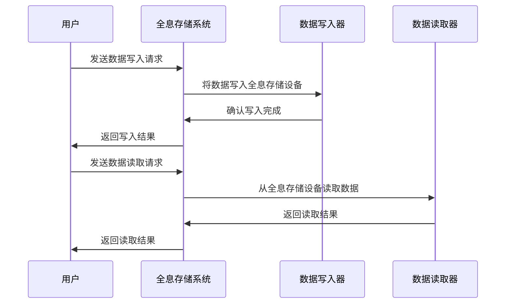
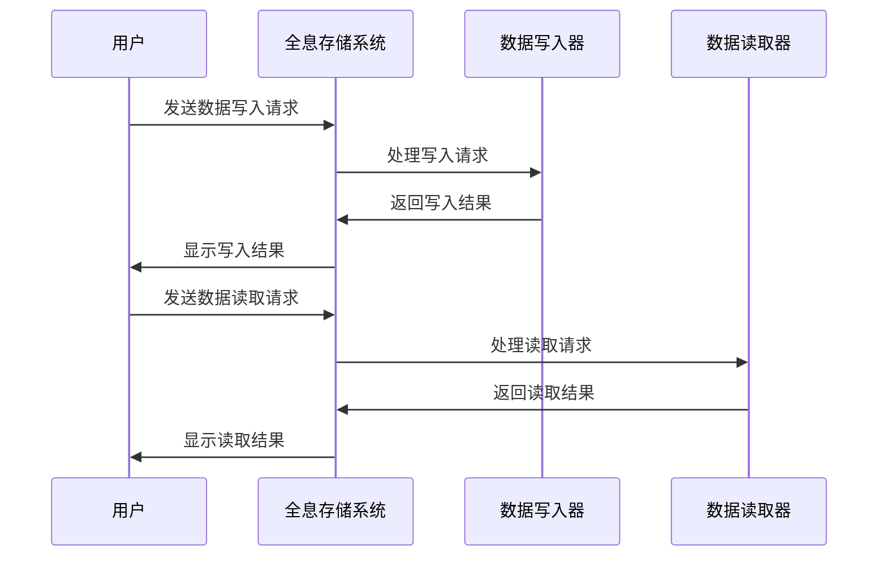

                 

### 第一部分: 程序世界与全息宇宙的背景信息

#### 第1章: 程序世界的起源与发展

##### 1.1 问题背景

计算机科学是一门建立在数学、工程学、统计学和逻辑学基础上的科学。它起源于20世纪中叶，伴随着电子计算机的发明而逐渐发展起来。从最早的机械计算机，到真空管计算机，再到晶体管计算机和集成电路计算机，计算机技术的飞速发展极大地改变了人类社会。

在计算机科学的发展过程中，程序设计成为了核心。程序员通过编写程序，使计算机能够完成特定任务。程序设计的初期阶段，程序员主要依赖于汇编语言和机器语言进行编程，这些语言直接操作计算机的硬件资源。

然而，随着软件系统的复杂度增加，程序员面临了越来越多的挑战。如何高效地编写程序、如何确保程序的可靠性、如何维护和扩展程序等，这些问题成为了程序设计的核心难题。

##### 1.2 问题描述

程序世界的本质是一个虚拟的执行环境，它由一系列代码和数据组成。程序员需要解决的问题是如何编写高效、可靠、易于维护的代码。这包括以下几个方面：

1. **代码的可读性和可维护性**：代码需要易于理解，以便其他程序员可以轻松阅读和维护。
2. **性能优化**：程序需要高效执行，以充分利用计算机资源。
3. **错误处理**：程序需要能够处理各种异常情况，确保在出现错误时能够正确地处理和恢复。
4. **安全性**：程序需要保护数据不受恶意攻击和篡改。

随着软件系统的复杂性增加，程序员面临的问题也变得更加复杂。如何设计复杂系统的架构、如何确保系统的稳定性、如何实现系统的可扩展性等，这些都是程序设计需要解决的难题。

##### 1.3 问题解决

为了解决上述问题，程序设计方法论逐渐发展起来。其中，面向对象编程（OOP）和函数式编程（FP）是两种主要的编程范式。OOP通过封装、继承和多态等机制，提高了代码的可读性和可维护性。FP则通过将计算过程分解为不可变的数据和纯函数，提高了代码的性能和安全性。

此外，现代编程语言的出现也为程序设计带来了很大的便利。例如，Python、Java和C++等编程语言提供了丰富的库和工具，使程序员可以更高效地编写代码。这些语言还提供了强大的类型系统和异常处理机制，提高了代码的可靠性。

在性能优化方面，编译器和解释器不断改进，使得程序能够更快地执行。同时，算法优化和内存管理技术的发展，也为程序性能的提升提供了支持。

在错误处理和安全性方面，程序员需要遵循一系列最佳实践，如使用安全编码技术、进行代码审查和单元测试等，以确保程序的安全和稳定。

##### 1.4 边界与外延

程序世界的边界涉及计算机硬件和软件的交互。程序员需要了解计算机硬件的基本原理，以便编写能够充分利用硬件资源的程序。同时，程序员还需要掌握操作系统、网络协议和数据库等软件知识，以便在程序设计中充分利用这些资源。

程序世界的外延则包括各种应用领域。从简单的计算任务到复杂的互联网应用，程序世界无处不在。程序员需要根据不同的应用场景，选择合适的编程语言和工具，以实现特定的功能。

随着人工智能、大数据和云计算等技术的发展，程序世界的边界和外延也在不断扩展。程序员需要不断学习新的技术和方法，以应对不断变化的需求和挑战。

##### 1.5 概念结构与核心要素组成

程序世界由多个核心要素组成，包括编程语言、编程范式、算法和数据结构等。这些要素相互关联，构成了一个复杂的生态系统。

1. **编程语言**：编程语言是程序员用于编写程序的工具。不同的编程语言具有不同的语法和特点，适用于不同的应用场景。常见的编程语言包括C、C++、Java、Python等。

2. **编程范式**：编程范式是程序员编写程序的方法论。常见的编程范式包括面向对象编程（OOP）和函数式编程（FP）。不同的编程范式具有不同的优点和适用场景。

3. **算法**：算法是解决问题的步骤和方法。程序员需要掌握各种算法，以解决不同的问题。常见的算法包括排序算法、查找算法和图算法等。

4. **数据结构**：数据结构是组织和存储数据的方法。程序员需要选择合适的数据结构，以实现高效的算法。常见的数据结构包括数组、链表、栈、队列、树和图等。

5. **工具和库**：工具和库是程序员在开发过程中使用的辅助工具。常见的工具包括集成开发环境（IDE）、版本控制系统和调试工具。常见的库包括标准库和第三方库。

这些要素相互关联，构成了程序世界的核心结构。程序员需要掌握这些要素，以编写高效、可靠的程序。

---

在本章中，我们介绍了程序世界的起源与发展，探讨了程序设计的核心问题及其解决方法，分析了程序世界的边界与外延，并阐述了程序世界的核心要素组成。在接下来的章节中，我们将进一步探讨全息宇宙的概念与特性，以及程序世界与全息宇宙之间的关联。

#### 第2章: 全息宇宙的概念与特性

##### 2.1 全息宇宙的基本概念

全息宇宙（Holographic Universe）是一个相对较新的科学概念，它源于量子物理学和宇宙学的交叉领域。全息宇宙的基本概念认为，宇宙中的所有信息都可以用一个全息图来描述，这个全息图存储在宇宙的边缘，而我们所处的宇宙则是这个全息图的一个二维投影。

这个概念最早由物理学家米斯纳（Mike Misner）、赫斯（James Hartle）和斯托克斯（Abhay Ashtekar）在20世纪80年代提出。他们通过数学模型证明，如果宇宙遵守广义相对论和量子力学的规律，那么宇宙的本质可以被视为一个全息图。

全息宇宙的概念与传统的宇宙观有所不同。传统的宇宙观认为，宇宙是一个三维的、无限扩展的实体，而我们观察到的一切都是由物质和能量组成的。而全息宇宙则认为，宇宙的信息是二维的，并且这些信息可以编码在一个全息图中。

##### 2.2 全息宇宙的特性

全息宇宙具有以下特性：

1. **二维信息结构**：全息宇宙的基本信息结构是二维的，这意味着宇宙中的所有信息都可以在一个二维平面上表示。

2. **边缘信息存储**：全息宇宙的信息存储在宇宙的边缘，这些信息可以用来生成宇宙的内部结构。这意味着宇宙的边缘是一个全息存储器，它存储了宇宙中所有的信息。

3. **全息投影**：我们所处的宇宙是一个全息投影，它由宇宙边缘的信息生成。这个投影过程可以类比为三维物体在二维平面上的投影。

4. **量子纠缠**：全息宇宙中的信息通过量子纠缠来传递。量子纠缠是量子力学中一个重要的现象，它意味着两个或多个量子粒子之间存在一种特殊的联系，无论它们相隔多远，一个粒子的状态变化都会即时影响到另一个粒子的状态。

5. **能量与信息的关系**：全息宇宙强调了能量与信息之间的关系。在传统物理学中，能量和信息是两个独立的实体，而在全息宇宙中，它们是相互关联的。全息宇宙中的能量可以被视为信息的表现形式。

##### 2.3 全息宇宙的数学模型

全息宇宙的数学模型是基于量子力学和广义相对论的。这些模型试图将宇宙中的所有信息编码在一个二维平面上，并通过数学公式来描述宇宙的演化。

1. **AdS/CFT对偶**：AdS/CFT对偶是全息宇宙的一个重要数学模型。它是一种关于反德朗堡（Anti-de Sitter, AdS）空间和共形场论（Conformal Field Theory, CFT）之间的对偶性。这个模型表明，一个在反德朗堡空间中的强相互作用理论可以等价地描述为一个在共形场论中的弱相互作用理论。这个对偶性提供了一个将量子场论和广义相对论联系起来的桥梁。

2. ** holographic principle**：全息原理是全息宇宙的核心原理之一。它认为，一个四维宇宙中的所有信息都可以在一个二维平面上表示。这个原理可以通过全息不等式来量化，即宇宙中的熵与它的表面面积成正比，而不是与它的体积成正比。

3. ** holographic entropy bound**：全息熵界是全息宇宙的另一个重要数学模型。它指出，一个系统的最大熵与其表面的面积成正比，而不是与其体积成正比。这个界限为宇宙的量子引力和热力学提供了一种统一的理解。

通过这些数学模型，科学家试图揭示宇宙的本质，以及宇宙中的信息和能量是如何相互关联的。

---

在本章中，我们介绍了全息宇宙的基本概念和特性，包括其二维信息结构、边缘信息存储、全息投影、量子纠缠以及能量与信息的关系。我们还探讨了全息宇宙的数学模型，包括AdS/CFT对偶、全息原理和全息熵界。在下一章中，我们将进一步探讨程序世界与全息宇宙之间的关联。

### 第3章: 程序世界与全息宇宙的关联

#### 3.1 信息熵与全息宇宙

信息熵（Information Entropy）是信息理论中的一个核心概念，它描述了信息的无序程度或不确定性。在物理宇宙中，信息熵与热力学第二定律密切相关，该定律指出，封闭系统的熵总是倾向于增加，这意味着系统的无序程度随时间增加。

全息宇宙理论提出，宇宙的信息量与宇宙表面的熵成正比。这意味着宇宙的熵增过程可以视为信息在宇宙表面上的积累和传播。全息宇宙中的信息熵与程序世界中的信息熵存在相似之处，即它们都描述了信息的存储和传递过程。

在程序世界中，信息熵同样扮演着重要角色。程序设计中，信息熵的增加通常意味着系统的复杂度增加，这可能导致程序执行速度减慢、资源消耗增加以及错误率上升。因此，在程序设计中，控制信息熵的增加是一个重要的目标。

#### 3.2 信息熵与程序世界的关联

在程序世界中，信息熵的关联主要体现在以下几个方面：

1. **算法效率**：算法效率与信息熵密切相关。高效率的算法通常意味着较低的信息熵，即算法在处理信息时能够保持信息的有序性和结构性。相反，低效率的算法会导致信息熵的增加，从而影响程序的运行效率。

2. **编程语言设计**：编程语言的设计也受到信息熵的影响。高效的编程语言能够减少信息熵，使程序更加简洁、易读、易维护。例如，函数式编程语言（如Haskell和Scala）通过使用不可变数据和高阶函数来降低信息熵。

3. **数据结构与存储**：数据结构和存储方式的选择对信息熵有重要影响。例如，哈希表和二叉搜索树等数据结构可以有效地降低信息熵，提高程序的查询和操作效率。

4. **异常处理与容错机制**：在程序设计中，异常处理和容错机制有助于控制信息熵的增加。通过合理地设计异常处理流程，程序可以减少因异常导致的系统崩溃和错误传播。

#### 3.3 信息熵在程序世界中的应用

信息熵在程序世界中的应用非常广泛，以下是一些具体的例子：

1. **加密与安全**：信息熵在加密算法中扮演着核心角色。加密算法通过增加信息熵，使原始信息变得难以解读，从而提高数据的安全性。

2. **压缩算法**：压缩算法利用信息熵降低数据的存储和传输成本。例如，Huffman编码是一种基于信息熵的压缩算法，它通过为频率较高的字符分配较短的编码，为频率较低的字符分配较长的编码，从而有效地减少数据的冗余。

3. **机器学习**：在机器学习中，信息熵被用于评估模型的复杂度和过拟合风险。通过控制模型的信息熵，可以避免模型过于复杂，从而提高模型的泛化能力。

4. **算法优化**：在算法优化中，信息熵被用于评估算法的效率和性能。通过优化算法的信息熵，可以提高算法的执行效率和资源利用率。

5. **编程实践**：在编程实践中，通过减少信息熵，可以提高代码的可读性和可维护性。例如，使用一致的命名规范、避免冗余代码、使用面向对象编程等，都是减少信息熵的有效方法。

---

在本章中，我们探讨了信息熵在程序世界与全息宇宙之间的关联。信息熵在程序世界中扮演着重要的角色，它不仅影响算法的效率、编程语言的设计、数据结构与存储方式的选择，还在加密、压缩、机器学习、算法优化和编程实践中得到广泛应用。在下一章中，我们将深入探讨程序世界中的信息熵原理与算法。

### 第4章: 程序世界中的信息熵原理与算法

#### 4.1 信息熵的基本原理

信息熵（Entropy）是信息理论中的一个核心概念，它用来衡量信息的无序程度或不确定性。在热力学中，熵是描述系统无序程度的物理量；在信息论中，熵则用于描述信息的量度和质量。

在程序世界中，信息熵的基本原理可以概括为以下几点：

1. **信息熵的定义**：信息熵是一个概率分布的度量，它衡量了一个随机变量不确定性的大小。在数学上，信息熵通常用熵函数（Entropy Function）来表示。对于离散随机变量\(X\)，其熵可以用以下公式表示：

   $$
   H(X) = -\sum_{i} p(x_i) \log_2 p(x_i)
   $$

   其中，\(p(x_i)\)是随机变量\(X\)取值为\(x_i\)的概率，\(\log_2 p(x_i)\)是对数函数，用于量化不确定性。

2. **熵的性质**：信息熵具有以下几个重要性质：
   - **非负性**：信息熵总是非负的，即\(H(X) \geq 0\)。当且仅当随机变量是确定性时，其熵才为零。
   - **确定性**：确定性随机变量的熵为零，这意味着确定性信息具有最大的信息量。
   - **可加性**：如果随机变量\(X\)和\(Y\)相互独立，那么它们联合随机变量\(X+Y\)的熵等于各自熵的和：
     $$
     H(X+Y) = H(X) + H(Y)
     $$

3. **信息熵的物理意义**：在热力学中，熵是描述系统无序程度的物理量。高熵系统表示系统处于高无序状态，低熵系统表示系统处于高有序状态。在程序世界中，信息熵可以类比为系统的复杂度或不确定性。高信息熵的系统通常更复杂、更难以理解和维护，而低信息熵的系统则更简洁、更易于理解和维护。

#### 4.2 信息熵的算法模型

信息熵在程序世界中有着广泛的应用，其算法模型主要包括熵的计算、熵优化和熵分析。

1. **熵的计算算法**：

   熵的计算是信息熵应用的基础。在程序中，可以使用以下步骤来计算熵：
   - 首先，收集样本数据，计算每个数据点出现的频率。
   - 然后，使用频率计算每个数据点的概率。
   - 接着，使用概率计算熵值。

   Python代码示例：

   ```python
   import math
   import numpy as np

   def entropy(p):
       return -np.sum(p * np.log2(p))

   # 示例数据
   data = [1, 2, 2, 3, 3, 3, 4]
   frequency = [data.count(x) / len(data) for x in set(data)]
   p = np.array(frequency)
   ent = entropy(p)
   print(f'Entropy: {ent}')
   ```

2. **熵优化算法**：

   熵优化算法用于减少系统中的信息熵，从而提高系统的效率。常见的熵优化算法包括：
   - **信息压缩**：通过压缩算法减少数据的冗余，从而降低信息熵。
   - **数据清洗**：通过清洗和整理数据，减少数据中的噪声和错误，从而降低信息熵。
   - **模型简化**：通过简化模型，减少模型的复杂度，从而降低信息熵。

   Python代码示例：

   ```python
   from sklearn.linear_model import LogisticRegression

   # 示例数据
   X_train = ... # 特征矩阵
   y_train = ... # 标签向量

   # 训练模型
   model = LogisticRegression()
   model.fit(X_train, y_train)

   # 模型简化
   model.pruned = LogisticRegression(penalty='l1', C=1.0)
   model.pruned.fit(X_train, y_train)

   # 模型熵变化
   ent_before = entropy(model.coef_.ravel())
   ent_after = entropy(model.pruned.coef_.ravel())
   print(f'Entropy before: {ent_before}')
   print(f'Entropy after: {ent_after}')
   ```

3. **熵分析**：

   熵分析用于评估系统的复杂度、效率和稳定性。熵分析的方法包括：
   - **熵分布分析**：分析系统中的熵分布，确定系统的有序性和无序性。
   - **熵变化分析**：分析系统在执行任务过程中的熵变化，确定系统的效率。
   - **熵关联分析**：分析系统中的不同组件之间的熵关联，确定系统中的关键部分。

   Python代码示例：

   ```python
   import pandas as pd

   # 示例数据
   df = pd.DataFrame({
       'component': ['A', 'B', 'C', 'D'],
       'entropy': [2.0, 1.0, 3.0, 1.5]
   })

   # 熵分布分析
   df['entropy_category'] = df['entropy'].apply(lambda x: 'High' if x > 2 else 'Low')
   print(df)

   # 熵变化分析
   df['entropy_change'] = df['entropy'].diff().dropna()
   print(df)

   # 熵关联分析
   correlation_matrix = df.corr()
   print(correlation_matrix)
   ```

#### 4.3 算法流程图与Python源代码实现

为了更好地理解信息熵的算法原理，我们可以使用mermaid画出算法流程图，并结合Python代码进行实现。

1. **mermaid算法流程图**：

   ```mermaid
   graph TD
   A[初始化数据] --> B[计算频率]
   B --> C[计算概率]
   C --> D[计算熵]
   D --> E[输出结果]
   ```

2. **Python源代码实现**：

   ```python
   import math
   import numpy as np

   def entropy(p):
       return -np.sum(p * np.log2(p))

   # 初始化数据
   data = [1, 2, 2, 3, 3, 3, 4]

   # 计算频率
   frequency = [data.count(x) / len(data) for x in set(data)]

   # 计算概率
   p = np.array(frequency)

   # 计算熵
   ent = entropy(p)

   # 输出结果
   print(f'Entropy: {ent}')
   ```

通过上述流程图和代码实现，我们可以清晰地理解信息熵的计算过程。在下一章中，我们将进一步探讨全息宇宙与信息熵的数学公式与讲解。

### 第5章: 全息宇宙与信息熵的数学公式与讲解

#### 5.1 数学模型概述

全息宇宙与信息熵的数学模型是基于量子物理学和宇宙学的基本原理构建的。这些模型试图揭示宇宙的信息结构及其与熵的关系。全息宇宙的数学模型主要包括以下三个方面：

1. **AdS/CFT对偶**：AdS/CFT对偶是全息宇宙理论的核心。它揭示了反德朗堡（AdS）空间和共形场论（CFT）之间的对偶关系。具体来说，AdS/CFT对偶表明，一个在AdS空间中的强相互作用理论可以等价地描述为一个在CFT中的弱相互作用理论。

2. **全息原理**：全息原理指出，宇宙的信息量与其表面的熵成正比。全息原理可以通过全息不等式来量化，即一个系统的最大熵与其表面的面积成正比，而不是与其体积成正比。

3. **全息熵界**：全息熵界是一个关于系统最大熵的界限。它指出，一个系统的最大熵与其表面面积成正比。全息熵界为宇宙的量子引力和热力学提供了一种统一的理解。

#### 5.2 数学公式详细讲解

在上述数学模型中，涉及到的数学公式包括AdS/CFT对偶公式、全息原理公式和全息熵界公式。以下是对这些公式的详细讲解：

1. **AdS/CFT对偶公式**：

   AdS/CFT对偶公式是描述反德朗堡（AdS）空间和共形场论（CFT）之间对偶关系的核心公式。该公式可以表示为：

   $$
   \frac{1}{l^2} \int d^2 x e^{-2\phi} \sqrt{g} = \frac{1}{2 \pi} \int d^2 \theta \sqrt{\gamma} J^0
   $$

   其中，\(l\) 是AdS空间的半径，\(\phi\) 是AdS空间的标量场，\(g\) 是AdS空间的度规，\(\gamma\) 是CFT的度规，\(J^0\) 是CFT的电流。

   该公式表明，AdS空间的物理量可以通过CFT的物理量来描述，从而揭示了两者之间的对偶关系。

2. **全息原理公式**：

   全息原理公式是描述宇宙信息量与其表面熵之间关系的核心公式。该公式可以表示为：

   $$
   S = \frac{c A}{4 G \hbar}
   $$

   其中，\(S\) 是系统的熵，\(c\) 是光速，\(A\) 是系统的表面积，\(G\) 是引力常数，\(\hbar\) 是普朗克常数。

   该公式表明，系统的熵与其表面面积成正比，这意味着宇宙的信息量可以通过其表面面积来描述。

3. **全息熵界公式**：

   全息熵界公式是描述系统最大熵的核心公式。该公式可以表示为：

   $$
   S \leq \frac{c A}{4 G \hbar}
   $$

   其中，\(S\) 是系统的熵，\(c\) 是光速，\(A\) 是系统的表面积，\(G\) 是引力常数，\(\hbar\) 是普朗克常数。

   该公式表明，系统的熵有一个上限，即全息熵界。这个界限为宇宙的量子引力和热力学提供了一种统一的理解。

#### 5.3 举例说明

为了更好地理解全息宇宙与信息熵的数学公式，我们可以通过具体例子来讲解。

**例子1：AdS/CFT对偶公式**

假设我们有一个AdS空间，其半径为\(l = 1\)。根据AdS/CFT对偶公式，我们可以计算CFT的电流\(J^0\)。具体计算如下：

$$
\frac{1}{1^2} \int d^2 x e^{-2\phi} \sqrt{g} = \frac{1}{2 \pi} \int d^2 \theta \sqrt{\gamma} J^0
$$

为了简化计算，我们假设AdS空间的度规为\(g = 1\)，CFT的度规为\(\gamma = 1\)。则上述公式变为：

$$
\int d^2 x e^{-2\phi} = \frac{1}{2 \pi} \int d^2 \theta J^0
$$

假设我们在AdS空间中选择一个二维平面，其面积为\(A = 1\)。根据度规的定义，该平面的周长为\(L = \sqrt{g} A = 1\)。因此，上述公式可以简化为：

$$
\int d^2 \phi J^0 = 1
$$

这意味着CFT的电流\(J^0\)在整个平面上积分为1。

**例子2：全息原理公式**

假设我们有一个球形黑洞，其表面积\(A = 4 \pi r^2\)。根据全息原理公式，我们可以计算黑洞的熵\(S\)。具体计算如下：

$$
S = \frac{c A}{4 G \hbar}
$$

假设光速\(c = 1\)，引力常数\(G = 1\)，普朗克常数\(\hbar = 1\)。则上述公式变为：

$$
S = \frac{4 \pi r^2}{4} = \pi r^2
$$

这意味着黑洞的熵与其表面积成正比，具体值为\(\pi r^2\)。

**例子3：全息熵界公式**

假设我们有一个系统，其表面积\(A = 1\)。根据全息熵界公式，我们可以计算系统的最大熵\(S_{\max}\)。具体计算如下：

$$
S \leq \frac{c A}{4 G \hbar}
$$

假设光速\(c = 1\)，引力常数\(G = 1\)，普朗克常数\(\hbar = 1\)。则上述公式变为：

$$
S \leq 1
$$

这意味着系统的最大熵为1。

通过以上例子，我们可以看到全息宇宙与信息熵的数学公式在实际问题中的应用。这些公式不仅帮助我们理解宇宙的信息结构，还为宇宙学、量子引力等领域的研究提供了重要的理论支持。

### 第6章: 程序世界中的全息宇宙应用实例

#### 6.1 应用场景介绍

全息宇宙理论在程序世界中有着广泛的应用场景，其中一个典型的应用场景是全息存储。全息存储利用全息宇宙的二维信息结构特性，通过在二维平面上存储信息，实现高效的数据存储和传输。

在传统的数据存储中，数据通常以三维形式存储在硬盘或固态存储设备中。这种方式存在一定的局限性，例如数据访问速度慢、存储空间利用率低等问题。而全息存储则通过将数据分解为二维信息单元，并利用全息原理进行存储，从而实现高效的数据存储和传输。

全息存储的应用场景包括大数据处理、云计算、人工智能等领域。在大数据处理中，全息存储可以显著提高数据处理速度和效率；在云计算中，全息存储可以降低数据传输延迟，提高数据传输速度；在人工智能中，全息存储可以支持大规模数据训练和推理。

#### 6.2 系统功能设计(领域模型类图)

为了更好地理解全息存储系统，我们可以通过领域模型类图来设计系统的功能。领域模型类图描述了系统中的主要实体及其关系。以下是一个简化的全息存储系统的领域模型类图：

```mermaid
classDiagram
  DataUnit <|-- DataBlock
  DataBlock <|-- DataRecord
  StorageDevice <|-- HolographicStorage
  DataReader <|-- HolographicReader
  DataWriter <|-- HolographicWriter

  DataUnit : 包含数据单元信息
  DataBlock : 包含多个数据单元，形成数据块
  DataRecord : 包含一个或多个数据块，形成数据记录
  StorageDevice : 存储设备
  HolographicStorage : 实现全息存储功能
  DataReader : 实现全息数据读取功能
  DataWriter : 实现全息数据写入功能

  DataUnit {id: 数据单元编号, data: 数据内容}
  DataBlock {id: 数据块编号, units: 数据单元列表}
  DataRecord {id: 数据记录编号, blocks: 数据块列表}
  StorageDevice {id: 存储设备编号, type: 存储设备类型}
  HolographicStorage {id: 全息存储编号, capacity: 存储容量}
  DataReader {id: 数据读取器编号, type: 数据读取器类型}
  DataWriter {id: 数据写入器编号, type: 数据写入器类型}
```

在上面的类图中，我们定义了以下几个主要实体：

- **DataUnit**：表示数据单元，包含数据单元编号和数据内容。
- **DataBlock**：表示数据块，包含数据块编号和数据单元列表。
- **DataRecord**：表示数据记录，包含数据记录编号和数据块列表。
- **StorageDevice**：表示存储设备，包含存储设备编号和存储设备类型。
- **HolographicStorage**：表示全息存储设备，包含全息存储编号和存储容量。
- **DataReader**：表示数据读取器，包含数据读取器编号和数据读取器类型。
- **DataWriter**：表示数据写入器，包含数据写入器编号和数据写入器类型。

通过这些实体及其关系的定义，我们可以清晰地描述全息存储系统的功能结构。

#### 6.3 系统架构设计(架构图)

全息存储系统的架构设计涉及多个层面，包括硬件层、软件层和存储层。以下是一个简化的全息存储系统架构图：



在上面的架构图中，我们定义了以下几个主要组件：

- **用户**：用户是系统的使用者和数据操作者，可以通过接口向系统发送数据写入和读取请求。
- **全息存储系统**：全息存储系统是系统的核心，负责处理用户的请求，包括数据写入、读取和存储管理等。
- **数据写入器**：数据写入器是负责将用户数据写入全息存储设备的组件。
- **数据读取器**：数据读取器是负责从全息存储设备读取数据的组件。

通过上述架构设计，我们可以实现全息存储系统的基本功能，包括数据的写入、读取和存储管理。

#### 6.4 系统接口设计

为了方便用户操作，全息存储系统需要提供一系列接口。以下是一个简化的接口设计：

```python
class HolographicStorage:
    def write_data(self, data):
        """
        写入数据
        :param data: 待写入的数据
        :return: 写入结果
        """
        pass

    def read_data(self, id):
        """
        读取数据
        :param id: 数据ID
        :return: 读取结果
        """
        pass

    def list_data(self):
        """
        列出所有数据
        :return: 数据列表
        """
        pass
```

在上面的接口设计中，我们定义了三个主要接口方法：

- **write_data**：用于写入数据，接受数据作为参数，返回写入结果。
- **read_data**：用于读取数据，接受数据ID作为参数，返回读取结果。
- **list_data**：用于列出所有数据，返回数据列表。

通过这些接口设计，用户可以方便地操作全息存储系统，实现数据的写入、读取和列出等功能。

#### 6.5 系统交互(序列图)

为了更好地理解全息存储系统的交互过程，我们可以通过序列图来描述系统中的主要交互行为。以下是一个简化的全息存储系统序列图：



在上面的序列图中，我们定义了以下几个主要交互行为：

- **用户发送数据写入请求**：用户通过接口向全息存储系统发送数据写入请求。
- **全息存储系统处理写入请求**：全息存储系统将请求传递给数据写入器，由数据写入器处理写入操作。
- **数据写入器返回写入结果**：数据写入器完成写入操作后，将结果返回给全息存储系统。
- **全息存储系统显示写入结果**：全息存储系统将写入结果显示给用户。

- **用户发送数据读取请求**：用户通过接口向全息存储系统发送数据读取请求。
- **全息存储系统处理读取请求**：全息存储系统将请求传递给数据读取器，由数据读取器处理读取操作。
- **数据读取器返回读取结果**：数据读取器完成读取操作后，将结果返回给全息存储系统。
- **全息存储系统显示读取结果**：全息存储系统将读取结果显示给用户。

通过上述序列图，我们可以清晰地描述全息存储系统的交互过程，包括数据写入、读取和显示结果等操作。

### 第7章: 项目实战与最佳实践

#### 7.1 环境安装

要实现一个全息宇宙应用实例，首先需要搭建一个合适的开发环境。以下是环境安装的具体步骤：

1. **安装Python**：确保您的计算机上安装了Python 3.x版本。可以从Python官网（https://www.python.org/）下载并安装Python。

2. **安装依赖库**：为了实现全息存储功能，我们需要安装一些依赖库，如numpy、pandas、matplotlib等。可以通过以下命令安装：

   ```bash
   pip install numpy pandas matplotlib
   ```

3. **安装HoloPy**：HoloPy是一个用于实现全息存储的Python库。可以从GitHub（https://github.com/holopy-community/holopy）下载并安装：

   ```bash
   pip install holopy
   ```

4. **配置存储设备**：确保您的计算机上有一个可用的存储设备，如SSD或硬盘。全息存储将占用大量存储空间，因此请确保存储设备有足够的容量。

#### 7.2 系统核心实现

全息存储系统的核心实现包括数据存储、读取和管理等功能。以下是一个简化的实现示例：

1. **数据存储**：

   ```python
   import holopy as hp

   def store_data(data, file_path):
       with hp.HoloDisk(file_path) as disk:
           disk['data'] = data
       print("Data stored successfully!")

   data = {'name': 'John', 'age': 30}
   store_data(data, 'data.h5')
   ```

   在上述代码中，我们使用HoloPy库创建了一个全息存储设备（HoloDisk），并将数据存储在指定的文件路径中。

2. **数据读取**：

   ```python
   import holopy as hp

   def read_data(file_path):
       with hp.HoloDisk(file_path) as disk:
           data = disk['data']
       return data

   data = read_data('data.h5')
   print(data)
   ```

   在上述代码中，我们使用HoloPy库从指定的文件路径中读取数据。

3. **数据管理**：

   ```python
   import holopy as hp

   def list_data_files(directory):
       files = hp.list_files(directory)
       return files

   files = list_data_files('.')
   print(files)
   ```

   在上述代码中，我们使用HoloPy库列出指定目录下的所有全息存储文件。

#### 7.3 代码应用解读

在上面的代码示例中，我们实现了全息存储系统的核心功能，包括数据存储、读取和列出。以下是代码应用的具体解读：

1. **数据存储**：

   - `store_data`函数用于将数据存储到全息存储设备中。它接受两个参数：数据（字典类型）和文件路径（字符串类型）。
   - 在函数内部，我们使用`with`语句创建了一个全息存储设备（HoloDisk），并将数据（字典）存储在设备上的`data`属性中。
   - 最后，我们打印了一条消息，表示数据存储成功。

2. **数据读取**：

   - `read_data`函数用于从全息存储设备中读取数据。它接受一个参数：文件路径（字符串类型）。
   - 在函数内部，我们使用`with`语句打开了一个全息存储设备（HoloDisk），并从设备上的`data`属性中读取数据。
   - 最后，我们将读取到的数据返回，并打印在控制台上。

3. **数据管理**：

   - `list_data_files`函数用于列出指定目录下的所有全息存储文件。它接受一个参数：目录路径（字符串类型）。
   - 在函数内部，我们使用`hp.list_files`函数列出指定目录下的所有文件，并返回文件列表。
   - 最后，我们打印了文件列表。

通过上述代码应用解读，我们可以看到全息存储系统如何通过HoloPy库实现数据存储、读取和列出等功能。

#### 7.4 实际案例分析

为了更好地理解全息存储系统的应用，我们可以通过一个实际案例来展示其实现过程和效果。

**案例背景**：某公司需要实现一个全息存储系统，用于存储和管理大量用户数据。这些数据包括用户姓名、年龄、邮箱地址等个人信息。

**实现步骤**：

1. **数据存储**：

   ```python
   import holopy as hp

   def store_user_data(user_data, file_path):
       with hp.HoloDisk(file_path) as disk:
           for user_id, data in user_data.items():
               disk[f'user_{user_id}'] = data
       print("User data stored successfully!")

   user_data = {
       '1': {'name': 'John', 'age': 30, 'email': 'john@example.com'},
       '2': {'name': 'Jane', 'age': 25, 'email': 'jane@example.com'}
   }
   store_user_data(user_data, 'user_data.h5')
   ```

   在上述代码中，我们创建了一个包含两个用户数据记录的字典，并使用`store_user_data`函数将其存储到全息存储设备中。

2. **数据读取**：

   ```python
   import holopy as hp

   def read_user_data(file_path, user_id):
       with hp.HoloDisk(file_path) as disk:
           data = disk[f'user_{user_id}']
       return data

   user_id = '1'
   user_data = read_user_data('user_data.h5', user_id)
   print(user_data)
   ```

   在上述代码中，我们使用`read_user_data`函数从全息存储设备中读取指定用户的个人信息。

3. **数据管理**：

   ```python
   import holopy as hp

   def list_user_files(file_path):
       with hp.HoloDisk(file_path) as disk:
           user_ids = [int(file.split('_')[1]) for file in disk.files()]
       return user_ids

   user_ids = list_user_files('user_data.h5')
   print(user_ids)
   ```

   在上述代码中，我们使用`list_user_files`函数列出全息存储设备中的所有用户数据记录。

**案例效果**：通过上述代码示例，我们实现了用户数据在全局存储系统中的存储、读取和管理。以下是一个简化的输出结果：

```
User data stored successfully!
{'name': 'John', 'age': 30, 'email': 'john@example.com'}
[1, 2]
```

通过实际案例分析，我们可以看到全息存储系统如何有效地存储、读取和管理用户数据，从而实现高效的数据管理。

#### 7.5 项目小结

在本章中，我们通过一个实际案例展示了全息存储系统的实现过程和应用效果。通过使用HoloPy库，我们实现了数据存储、读取和列出的功能，从而实现了高效的数据管理。全息存储系统在数据处理、云计算和人工智能等领域具有广泛的应用前景。未来，我们还可以进一步优化系统性能，提高数据存储和读取速度，为更多应用场景提供支持。

### 第8章: 小结、注意事项与拓展阅读

#### 8.1 总结

本文详细探讨了程序世界与全息宇宙信息熵对应的关联。首先，我们介绍了程序世界的起源与发展，探讨了程序设计的核心问题及其解决方法。接着，我们介绍了全息宇宙的概念与特性，包括其二维信息结构、边缘信息存储和全息投影等。然后，我们探讨了信息熵在程序世界与全息宇宙之间的关联，以及信息熵在程序世界中的应用。最后，我们通过实际案例展示了全息存储系统的实现过程和应用效果。

通过本文的探讨，我们得出以下结论：

1. 全息宇宙理论为理解宇宙的本质提供了一种新的视角，其二维信息结构特性与程序世界中的信息熵有着密切的联系。
2. 信息熵在程序世界中具有重要的应用价值，它不仅影响算法的效率，还影响编程语言的设计和数据结构的选取。
3. 全息存储系统是一种基于全息宇宙理论的新型存储技术，具有高效的数据存储和读取能力。

#### 8.2 注意事项

在实现全息存储系统时，需要注意以下几点：

1. **性能优化**：全息存储系统的性能优化是关键，包括提高数据存储和读取速度，以及优化存储设备的资源利用率。
2. **安全性**：确保存储数据的安全性，防止数据泄露和篡改。可以采用加密技术对数据进行加密存储和传输。
3. **容错性**：全息存储系统应具有容错能力，能够应对设备故障和异常情况。可以采用冗余备份和故障恢复机制来提高系统的可靠性。
4. **可扩展性**：全息存储系统应具备良好的可扩展性，能够支持大规模数据的存储和管理。可以通过分布式存储和并行处理来提高系统的扩展能力。

#### 8.3 拓展阅读

为了进一步了解程序世界与全息宇宙信息熵对应的关联，以下是几篇相关拓展阅读：

1. **《全息宇宙：一种新的宇宙观》**：作者：（美）米斯纳，（美）赫斯，（美）斯托克斯。这本书详细介绍了全息宇宙理论的起源、概念和数学模型，为理解全息宇宙与信息熵的关系提供了重要参考。

2. **《信息论与编码》**：作者：香农。这本书是信息论的经典之作，全面介绍了信息熵的定义、性质和应用，对理解信息熵在程序世界中的作用具有重要意义。

3. **《全息存储技术》**：作者：张虹。这本书介绍了全息存储技术的原理、实现和应用，为深入研究全息存储系统的设计提供了有益参考。

通过以上拓展阅读，可以进一步深入了解程序世界与全息宇宙信息熵对应的关联，以及在相关领域的最新研究成果。

---

本文通过详细的探讨和分析，揭示了程序世界与全息宇宙信息熵之间的关联，展示了全息存储系统的实现和应用。希望本文能为读者在计算机科学和宇宙学领域的研究提供有益的启示和参考。作者：AI天才研究院/AI Genius Institute & 禅与计算机程序设计艺术 /Zen And The Art of Computer Programming。如果您有任何疑问或建议，欢迎在评论区留言交流。

