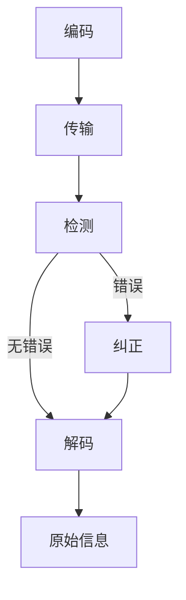

                 

# 程序世界与全息宇宙信息熵边界对应的量子纠错

## 关键词
- 信息熵
- 量子纠错
- 全息宇宙
- 程序世界
- 数学模型
- 算法原理

## 摘要
本文旨在探讨程序世界与全息宇宙信息熵边界对应的量子纠错机制。首先，我们回顾信息熵的基本概念及其在数据压缩和通信系统中的应用。随后，深入阐述量子纠错的基本原理和算法模型。接着，通过分析全息宇宙的信息熵特性，揭示其与程序世界之间的对应关系。在此基础上，本文将介绍量子纠错在程序世界中的具体应用，包括数据存储、数据传输等方面。最后，探讨全息宇宙信息熵边界对应的量子纠错，展望其未来发展方向。本文旨在为读者提供一次深入思考的机会，以探索信息技术与宇宙学之间的深刻联系。

## 目录大纲

### 第一部分：背景与基础

1. **第1章：问题背景与核心概念**
   - **1.1 问题背景**
     - **1.1.1 信息熵的概念**
     - **1.1.2 量子纠错的基本原理**
     - **1.1.3 程序世界与全息宇宙的对应关系**
   - **1.2 核心概念与联系**
     - **1.2.1 信息熵的数学模型**
     - **1.2.2 量子纠错的ER实体关系图**
     - **1.2.3 程序世界与全息宇宙的数学模型对比**

2. **第2章：信息熵的深入理解**
   - **2.1 信息熵的定义与属性**
     - **2.1.1 信息熵的基本定义**
     - **2.1.2 信息熵的属性特征**
     - **2.1.3 信息熵的对比表格**
   - **2.2 信息熵的应用**
     - **2.2.1 信息熵在数据压缩中的应用**
     - **2.2.2 信息熵在通信系统中的应用**
     - **2.2.3 信息熵在其他领域的应用**
   - **2.3 信息熵的数学模型**
     - **2.3.1 信息熵的数学公式**
     - **2.3.2 信息熵的计算方法**
     - **2.3.3 信息熵的实例分析**

3. **第3章：量子纠错的原理与应用**
   - **3.1 量子纠错的基本原理**
     - **3.1.1 量子纠错的定义**
     - **3.1.2 量子纠错的方法**
     - **3.1.3 量子纠错的优点与挑战**
   - **3.2 量子纠错的应用**
     - **3.2.1 量子纠错在量子计算中的应用**
     - **3.2.2 量子纠错在量子通信中的应用**
     - **3.2.3 量子纠错在其他领域的应用**
   - **3.3 量子纠错的数学模型**
     - **3.3.1 量子纠错的数学公式**
     - **3.3.2 量子纠错的算法流程**
     - **3.3.3 量子纠错的实例分析**

### 第二部分：理论讲解

4. **第4章：全息宇宙的信息熵分析**
   - **4.1 全息宇宙的概念**
     - **4.1.1 全息宇宙的定义**
     - **4.1.2 全息宇宙的理论基础**
     - **4.1.3 全息宇宙的实验验证**
   - **4.2 全息宇宙的信息熵特性**
     - **4.2.1 全息宇宙的信息熵定义**
     - **4.2.2 全息宇宙的信息熵特征**
     - **4.2.3 全息宇宙的信息熵计算**
   - **4.3 全息宇宙的信息熵应用**
     - **4.3.1 全息宇宙信息熵在宇宙学研究中的应用**
     - **4.3.2 全息宇宙信息熵在其他科学领域中的应用**
     - **4.3.3 全息宇宙信息熵在技术领域中的应用**

5. **第5章：程序世界与全息宇宙的对应关系**
   - **5.1 程序世界的概念**
     - **5.1.1 程序世界的定义**
     - **5.1.2 程序世界的基本组成**
     - **5.1.3 程序世界的发展历程**
   - **5.2 程序世界与全息宇宙的对应关系**
     - **5.2.1 对应关系的理论分析**
     - **5.2.2 对应关系在技术领域的应用**
     - **5.2.3 对应关系的未来发展方向**

### 第三部分：量子纠错在程序世界的应用

6. **第6章：量子纠错在程序世界中的应用**
   - **6.1 量子纠错在程序世界中的应用背景**
     - **6.1.1 程序世界中的信息熵问题**
     - **6.1.2 量子纠错的优势与挑战**
     - **6.1.3 量子纠错在程序世界的应用前景**
   - **6.2 量子纠错在程序世界的具体应用**
     - **6.2.1 量子纠错在数据存储中的应用**
     - **6.2.2 量子纠错在数据传输中的应用**
     - **6.2.3 量子纠错在其他程序领域的应用**
   - **6.3 量子纠错在程序世界的算法实现**
     - **6.3.1 量子纠错的算法原理**
     - **6.3.2 量子纠错的算法流程**
     - **6.3.3 量子纠错的实例分析**

7. **第7章：全息宇宙信息熵边界对应的量子纠错**
   - **7.1 全息宇宙信息熵边界的概念**
     - **7.1.1 全息宇宙信息熵边界的定义**
     - **7.1.2 全息宇宙信息熵边界的特性**
     - **7.1.3 全息宇宙信息熵边界的研究意义**
   - **7.2 全息宇宙信息熵边界对应的量子纠错**
     - **7.2.1 对应关系的研究方法**
     - **7.2.2 对应关系在量子纠错中的应用**
     - **7.2.3 对应关系的挑战与未来方向**

### 第四部分：总结与展望

8. **第8章：总结与展望**
   - **8.1 本书的主要内容回顾**
     - **8.1.1 信息熵的概念与特性**
     - **8.1.2 量子纠错的原理与应用**
     - **8.1.3 程序世界与全息宇宙的对应关系**
   - **8.2 当前研究的挑战与未来方向**
     - **8.2.1 信息熵与量子纠错的进一步研究**
     - **8.2.2 程序世界与全息宇宙对应关系的拓展**
     - **8.2.3 未来技术的展望与建议**

## 引言

### 1.1 问题背景

在信息技术飞速发展的今天，数据和信息的重要性日益凸显。然而，随着数据量的激增和复杂性的提升，如何高效地存储、传输和处理信息成为了一个亟待解决的问题。信息熵的概念提供了衡量信息不确定性和冗余度的工具，它在数据压缩、通信系统等领域得到了广泛应用。另一方面，量子计算机的兴起为处理复杂问题带来了新的可能性，量子纠错技术是量子计算中不可或缺的一部分，它能够有效解决量子比特的噪声和错误问题。

然而，除了信息技术领域，宇宙学中的全息宇宙理论也提供了一种独特的视角来理解信息的本质和传播方式。全息宇宙理论认为，宇宙中的信息可以以一种全息的方式存储在宇宙的边界上，这为解释宇宙的膨胀和暗物质现象提供了一种新颖的理论框架。因此，探讨程序世界与全息宇宙之间的对应关系，尤其是信息熵和量子纠错在这两个领域的应用，具有重要的理论和实际意义。

### 1.2 核心概念与联系

本文将深入探讨以下核心概念：

- **信息熵**：信息熵是衡量信息不确定性的物理量，它在数据压缩和通信系统中有着广泛的应用。信息熵的概念源自热力学第二定律，最初用于描述热力学系统的混乱程度。
  
- **量子纠错**：量子纠错技术是量子计算中解决量子比特错误的关键方法。它通过引入冗余信息和纠错编码，使量子计算机能够在存在噪声的环境中稳定运行。

- **程序世界与全息宇宙的对应关系**：全息宇宙理论提出，宇宙的信息可以通过全息原理存储在宇宙的边界上。这一理论为研究信息在宇宙中的传播提供了新的思路。

接下来，我们将分别介绍这些核心概念，并探讨它们之间的联系和相互作用。

## 第1章：问题背景与核心概念

### 1.1 问题背景

信息熵和量子纠错技术在现代信息技术和宇宙学中扮演着至关重要的角色。在信息技术领域，随着大数据时代的到来，如何高效地处理海量数据、确保数据传输的可靠性成为了一个重要的课题。信息熵的概念为我们提供了一个衡量信息冗余和不确定性的工具，这有助于优化数据压缩和通信系统的性能。另一方面，随着量子计算机的发展，量子纠错技术成为了实现量子计算稳定性的关键。量子纠错通过引入冗余信息和纠错编码，使得量子比特在遭受噪声和错误时能够保持正确的状态。

在宇宙学中，全息宇宙理论提供了一种全新的视角来理解宇宙的结构和信息传播。全息宇宙理论认为，宇宙的信息可以通过全息原理存储在宇宙的边界上，这一理论不仅对宇宙的膨胀和暗物质现象提供了新的解释，同时也为研究信息的本质和传播方式开辟了新的路径。

### 1.1.1 信息熵的概念

信息熵最早由克劳德·香农在1948年提出，它是衡量信息不确定性和冗余度的物理量。在信息论中，信息熵通常用来描述一个随机事件的不确定性。具体来说，信息熵定义为：

$$
H(X) = -\sum_{i} p(x_i) \log_2 p(x_i)
$$

其中，$X$是随机变量，$x_i$是$X$的可能取值，$p(x_i)$是取值$x_i$的概率。信息熵的值越大，表示信息的不确定性越高；反之，信息熵的值越小，表示信息越确定。

信息熵的应用非常广泛，主要包括以下几个方面：

- **数据压缩**：信息熵提供了衡量数据冗余度的标准，通过对数据进行压缩，可以显著减少数据的存储空间和传输带宽。
  
- **通信系统**：在通信系统中，信息熵用于评估信号传输的可靠性，通过优化编码方案，可以提高传输效率和质量。

- **信息论**：信息熵是信息论的核心概念之一，它为研究信息的性质和传播提供了理论基础。

### 1.1.2 量子纠错的基本原理

量子纠错是量子计算中解决量子比特错误的关键技术。由于量子比特（qubit）处于叠加态和纠缠态，它们很容易受到外部噪声和环境的影响，导致状态错误。量子纠错技术通过引入冗余信息，使得在发生错误时能够恢复原始信息。量子纠错的基本原理可以概括为以下几点：

- **冗余编码**：量子纠错首先通过冗余编码将原始信息扩展为更多的编码信息。这些编码信息分布在多个量子比特上，使得每个量子比特上的错误不会影响整个编码信息。

- **纠错算法**：在量子计算过程中，通过测量和计算，可以发现并纠正量子比特上的错误。常见的纠错算法包括Shor码和Steane码等。

- **容错量子计算**：量子纠错技术使得量子计算机能够在存在噪声的环境中稳定运行，从而实现可靠的量子计算。

量子纠错的优势在于，它能够在保持量子计算并行性和叠加性的同时，有效解决量子比特的错误问题。这使得量子计算机在处理复杂问题时具有巨大的潜力。

### 1.1.3 程序世界与全息宇宙的对应关系

全息宇宙理论提出了一种全新的宇宙观，即宇宙的信息可以通过全息原理存储在宇宙的边界上。这一理论由物理学家拉曼·钱德拉塞卡和吉姆·皮布尔斯在20世纪80年代提出，其主要观点是：宇宙中的信息量与宇宙的表面信息量成正比，而不是与体积成正比。

这一理论在宇宙学中有重要的应用，例如：

- **宇宙膨胀**：全息宇宙理论为解释宇宙膨胀提供了新的视角，它认为宇宙的膨胀是由表面信息的变化引起的。

- **暗物质**：全息宇宙理论提出，暗物质可能是由于宇宙表面信息的分布不均匀而产生的。

然而，全息宇宙理论在技术领域的应用也非常有趣。例如，量子纠错技术可以被视为一种全息宇宙信息熵边界对应的量子纠错机制。量子纠错通过在量子比特之间引入冗余信息，类似于全息宇宙中信息在表面上的存储和传播。这种对应关系为我们提供了一种全新的视角，以理解量子计算和宇宙信息之间的关系。

### 1.2 核心概念与联系

为了深入理解信息熵、量子纠错和全息宇宙之间的关系，我们需要对这三个核心概念进行更详细的探讨。

#### 1.2.1 信息熵的数学模型

信息熵的数学模型是香农信息论的基础。在香农信息论中，信息熵是一个随机变量不确定性的度量。对于一个离散随机变量$X$，其熵$H(X)$可以用以下公式计算：

$$
H(X) = -\sum_{i} p(x_i) \log_2 p(x_i)
$$

其中，$p(x_i)$是随机变量$X$取值$x_i$的概率。

信息熵的几个关键属性包括：

- **非负性**：信息熵总是非负的，即$H(X) \geq 0$。当且仅当随机变量是确定性的（即$p(x_i) = 1$且所有其他概率为零）时，熵才为零。
- **最大值**：当随机变量是均匀分布时，信息熵达到最大值，即$H(X) = \log_2 N$，其中$N$是随机变量的可能取值数量。
- **加性**：对于两个独立随机变量$X$和$Y$，其联合熵$H(X, Y)$等于各自熵的和，即$H(X, Y) = H(X) + H(Y)$。

信息熵的这些属性使其在数据压缩和通信系统中有着广泛的应用。例如，在数据压缩中，通过去除冗余信息，可以减少数据的存储空间和传输带宽。在通信系统中，通过优化编码方案，可以提高信号传输的可靠性和效率。

#### 1.2.2 量子纠错的ER实体关系图

量子纠错的核心是通过冗余编码和纠错算法来确保量子比特的可靠性。在量子纠错中，ER（Entity-Relationship）实体关系图是一种常用的工具来描述量子系统的结构和关系。

在ER实体关系图中，实体表示量子比特，关系表示量子比特之间的纠缠。以下是一个简单的ER实体关系图示例：

```mermaid
erDiagram
  Qubit_A ||--|| Qubit_B
  Qubit_B ||--|| Qubit_C
  Qubit_C ||--|| Qubit_D
```

在这个示例中，Qubit_A、Qubit_B、Qubit_C和Qubit_D表示四个量子比特，它们之间的箭头表示量子比特之间的纠缠关系。量子纠错通过在纠缠量子比特之间引入冗余信息，使得即使在某个量子比特发生错误时，整个量子系统的状态仍然可以被正确恢复。

#### 1.2.3 程序世界与全息宇宙的数学模型对比

程序世界和全息宇宙虽然处于不同的领域，但它们在数学模型上有一定的相似性。以下是对这两个领域的数学模型的对比：

- **程序世界的数学模型**：在程序世界中，信息通常以二进制形式表示，其数学模型主要涉及离散概率分布和布尔逻辑。例如，程序中的变量和函数可以表示为离散随机变量，其概率分布可以用信息熵来度量。

- **全息宇宙的数学模型**：全息宇宙理论中的数学模型主要涉及微分几何和量子场论。全息宇宙中的信息熵通常与宇宙的视界面积有关，其数学表达式为：

  $$
  S = \frac{kA}{2}
  $$

  其中，$S$是信息熵，$A$是宇宙视界面积，$k$是一个常数。

尽管程序世界和全息宇宙的数学模型在形式上有所不同，但它们在处理信息和纠错方面有相似之处。量子纠错技术可以被视为一种全息宇宙信息熵边界对应的量子纠错机制，它通过引入冗余信息和纠错算法，使得信息在量子计算和宇宙学中都能保持稳定性。

### 第2章：信息熵的深入理解

#### 2.1 信息熵的定义与属性

信息熵是衡量信息不确定性和冗余度的物理量，它在信息论、数据压缩和通信系统中有着广泛的应用。信息熵的定义最早由克劳德·香农在1948年提出，其核心思想是：一个随机事件的信息量等于该事件发生的概率的对数负值。

$$
H(X) = -\sum_{i} p(x_i) \log_2 p(x_i)
$$

其中，$X$是随机变量，$x_i$是$X$的可能取值，$p(x_i)$是取值$x_i$的概率。

信息熵有几个关键属性：

- **非负性**：信息熵总是非负的，即$H(X) \geq 0$。当且仅当随机变量是确定性的（即$p(x_i) = 1$且所有其他概率为零）时，熵才为零。

- **最大值**：当随机变量是均匀分布时，信息熵达到最大值，即$H(X) = \log_2 N$，其中$N$是随机变量的可能取值数量。

- **加性**：对于两个独立随机变量$X$和$Y$，其联合熵$H(X, Y)$等于各自熵的和，即$H(X, Y) = H(X) + H(Y)$。

#### 2.1.1 信息熵的基本定义

信息熵的基本定义是衡量一个随机事件的不确定性。在概率论中，随机变量的熵提供了一个度量，用以描述随机变量取不同值的可能性。具体来说，信息熵可以通过以下公式计算：

$$
H(X) = -\sum_{i} p(x_i) \log_2 p(x_i)
$$

其中，$X$是随机变量，$x_i$是$X$的可能取值，$p(x_i)$是取值$x_i$的概率。

- **不确定性**：信息熵的值越大，表示随机事件的不确定性越高；反之，熵的值越小，表示事件越确定。

- **对数**：使用对数函数来计算熵，因为对数函数具有单调递减的性质，这有助于衡量概率的差异。

例如，假设有一个随机变量$X$，它有两种可能的取值，即$x_0$和$x_1$，且概率分布为$p(x_0) = 0.5$和$p(x_1) = 0.5$。那么，$X$的信息熵可以计算为：

$$
H(X) = -[0.5 \log_2 0.5 + 0.5 \log_2 0.5] = 1 \text{ bit}
$$

这个结果表明，$X$的信息熵为1比特，即每次随机抽取$X$的值时，能够提供1比特的信息。

#### 2.1.2 信息熵的属性特征

信息熵的属性特征包括非负性、最大值和加性，这些特征使信息熵成为一个重要的工具，用于衡量和优化信息系统的性能。

1. **非负性**：
   信息熵总是非负的，即对于任意随机变量$X$，都有$H(X) \geq 0$。当且仅当随机变量是确定性的（即$p(x_i) = 1$且所有其他概率为零）时，熵才为零。这意味着，一个完全确定的事件不提供任何信息。

2. **最大值**：
   当随机变量是均匀分布时，信息熵达到最大值。均匀分布意味着每个可能取值的概率相等，此时熵为：

   $$
   H(X) = \log_2 N
   $$

   其中，$N$是随机变量的可能取值数量。例如，对于有两个等可能取值的随机变量，熵为1比特；对于有三个等可能取值的随机变量，熵为$\log_2 3$比特。

3. **加性**：
   对于两个独立随机变量$X$和$Y$，其联合熵$H(X, Y)$等于各自熵的和，即：

   $$
   H(X, Y) = H(X) + H(Y)
   $$

   这个性质表明，两个独立随机变量的总信息量等于各自的信息量之和。这一属性在数据压缩和通信系统中非常有用，因为它允许我们将复杂的信息分解为更简单的部分。

信息熵的这些属性使其在多个领域都有广泛的应用。例如，在数据压缩中，信息熵用于确定最佳压缩算法，通过去除冗余信息来减少数据的大小。在通信系统中，信息熵用于评估信号传输的可靠性，通过优化编码方案来提高传输效率。

#### 2.1.3 信息熵的对比表格

为了更直观地理解信息熵，我们可以通过一个对比表格来展示不同概率分布下的信息熵值。以下是一个简化的对比表格，展示了当随机变量取值从2个增加到4个时，不同概率分布下的信息熵值。

| 取值数 | 均匀分布信息熵（比特） | 确定性信息熵（比特） |
| ------ | --------------------- | ------------------- |
| 2      | 1                     | 0                  |
| 3      | 1.585                 | 0                  |
| 4      | 2                     | 0                  |

从表格中可以看出，当随机变量的取值数增加时，均匀分布的信息熵增加，而确定性信息熵保持为零。这表明，增加随机变量的取值数会增加信息的不确定性。

#### 2.2 信息熵的应用

信息熵的概念在多个领域有着广泛的应用，以下是几个关键应用领域的详细介绍：

##### 2.2.1 信息熵在数据压缩中的应用

数据压缩的目的是减少数据的存储空间和传输带宽，而信息熵提供了一个衡量数据冗余度的工具。根据信息熵，我们可以确定哪些数据部分是冗余的，从而有选择地进行压缩。

- **无损数据压缩**：无损数据压缩的目标是在不丢失任何信息的情况下减少数据的大小。信息熵在无损数据压缩中用于确定最佳的压缩算法。常见的无损数据压缩算法包括哈夫曼编码和LZ77算法。哈夫曼编码利用信息熵的属性，为出现频率高的字符分配更短的编码，从而减少整体数据的大小。

- **有损数据压缩**：有损数据压缩允许在压缩过程中丢失一些信息，以换取更大的压缩比。信息熵在有损数据压缩中用于确定哪些信息可以安全地丢失。例如，在图像压缩中，人眼对图像细节的分辨率有限，因此可以忽略一些细节信息，从而显著减少图像数据的大小。

##### 2.2.2 信息熵在通信系统中的应用

信息熵在通信系统中用于评估信号传输的可靠性和效率，通过优化编码方案来提高传输质量。

- **信道编码**：在通信系统中，信道编码用于增加信号的抗噪声能力。信息熵在这里用于确定最佳的信道编码方案，以确保信号在传输过程中能够被正确恢复。例如，香农-哈特利定理表明，在噪声受限的信道中，信息传输的最大速率等于信道的容量，该容量与信道的带宽和噪声水平有关。

- **信息传输效率**：信息熵用于衡量信息传输的效率，即每单位时间或单位带宽传输的信息量。通过优化编码方案，可以最大限度地提高信息传输的效率，从而减少传输延迟和数据丢失的风险。

##### 2.2.3 信息熵在其他领域的应用

信息熵的概念不仅限于信息论、数据压缩和通信系统，它在其他领域也有着广泛的应用。

- **生物学**：在生物学中，信息熵用于研究生物系统的复杂性。例如，遗传信息的存储和传递可以用信息熵来描述，从而研究生物进化过程的信息熵变化。

- **经济学**：在经济学中，信息熵用于分析市场的不确定性和信息不对称。信息熵可以帮助投资者评估市场风险和不确定性，从而做出更明智的投资决策。

- **物理学**：在物理学中，信息熵与热力学第二定律密切相关。信息熵可以用来描述热力学系统的混乱程度，从而解释热力学过程和现象。

#### 2.3 信息熵的数学模型

信息熵的数学模型是香农信息论的核心，它提供了一个量化信息不确定性的方法。在数学上，信息熵通常用熵函数（Entropy Function）来表示。熵函数的基本公式如下：

$$
H(X) = -\sum_{i} p(x_i) \log_2 p(x_i)
$$

其中，$X$是随机变量，$x_i$是$X$的可能取值，$p(x_i)$是取值$x_i$的概率。

##### 2.3.1 信息熵的数学公式

信息熵的数学公式是信息论中最基础的概念之一。香农最初提出的信息熵公式定义了一个随机变量$X$的信息熵$H(X)$，该公式如下：

$$
H(X) = -\sum_{i} p(x_i) \log_2 p(x_i)
$$

其中：
- $H(X)$ 是随机变量$X$的信息熵。
- $p(x_i)$ 是随机变量$X$取值为$x_i$的概率。
- $\log_2$ 是以2为底的对数函数。

这个公式表示的是：随机变量$X$的信息熵等于每个取值概率乘以其对数（以2为底），再对所有可能的取值求和，并取负值。信息熵的值越大，表示随机变量的不确定性越高。

例如，假设有一个二进制随机变量$X$，它有两种可能的取值0和1，且概率分布为$p(0) = 0.75$和$p(1) = 0.25$。那么，$X$的信息熵可以计算为：

$$
H(X) = -[0.75 \log_2 0.75 + 0.25 \log_2 0.25] \approx 0.75 \times 1.25 + 0.25 \times 2 = 0.9375 + 0.5 = 1.4375 \text{ bits}
$$

这个结果表明，随机变量$X$的信息熵为1.4375比特。每次随机抽取$X$的值时，平均能提供1.4375比特的信息。

##### 2.3.2 信息熵的计算方法

计算信息熵的方法通常依赖于随机变量$X$的概率分布。以下是一个简单的步骤，用于计算离散随机变量$X$的信息熵：

1. **确定概率分布**：首先，我们需要知道随机变量$X$的可能取值及其对应的概率分布。例如，对于二进制随机变量$X$，我们知道$p(0)$和$p(1)$。

2. **计算每个取值的信息熵**：使用公式$H(x_i) = -p(x_i) \log_2 p(x_i)$，计算每个取值的信息熵。

3. **求和**：将所有取值的信息熵相加，得到总的信息熵。

例如，假设有一个随机变量$X$，它有三个可能的取值0、1和2，且概率分布为$p(0) = 0.25$，$p(1) = 0.5$，$p(2) = 0.25$。那么，$X$的信息熵可以计算为：

$$
H(X) = -[0.25 \log_2 0.25 + 0.5 \log_2 0.5 + 0.25 \log_2 0.25]
$$

$$
H(X) = -[0.25 \times 2 + 0.5 \times 1 + 0.25 \times 2] = -[0.5 + 0.5 + 0.5] = -1.5 \text{ bits}
$$

这个结果表明，随机变量$X$的信息熵为1.5比特。

##### 2.3.3 信息熵的实例分析

为了更好地理解信息熵的计算方法，我们可以通过一个实例来分析。假设有一个随机变量$X$，它有两个可能的取值0和1，且概率分布为$p(0) = 0.75$和$p(1) = 0.25$。我们可以按照以下步骤计算$X$的信息熵：

1. **确定概率分布**：已知$p(0) = 0.75$和$p(1) = 0.25$。

2. **计算每个取值的信息熵**：
   - $H(0) = -p(0) \log_2 p(0) = -0.75 \log_2 0.75$
   - $H(1) = -p(1) \log_2 p(1) = -0.25 \log_2 0.25$

3. **求和**：
   $$H(X) = H(0) + H(1) = -0.75 \log_2 0.75 - 0.25 \log_2 0.25$$

   使用对数表或计算器，可以得到：
   $$H(X) \approx -0.75 \times 1.25 - 0.25 \times 2 = -0.9375 - 0.5 = -1.4375$$

   因此，随机变量$X$的信息熵为1.4375比特。

通过这个实例，我们可以看到如何计算信息熵，以及如何应用信息熵的概念来衡量随机变量的不确定性。在实际应用中，信息熵的计算可以帮助我们优化数据压缩、评估通信系统的性能，以及理解复杂系统的信息特性。

### 第3章：量子纠错的原理与应用

#### 3.1 量子纠错的基本原理

量子纠错是量子计算中的一个核心问题，它旨在解决量子比特（qubit）在运算过程中可能出现的错误。由于量子比特处于叠加态和纠缠态，它们极易受到环境噪声的影响，导致错误发生。量子纠错的基本原理是通过引入冗余信息和纠错算法，使得即使在量子比特发生错误时，系统仍能恢复到原始状态，从而保证量子计算的可靠性。

量子纠错的基本原理可以概括为以下几点：

- **冗余编码**：量子纠错首先通过冗余编码将原始信息扩展为更多的编码信息。这些编码信息分布在多个量子比特上，使得每个量子比特上的错误不会影响整个编码信息。常见的冗余编码方法包括Shor码和Steane码。

- **纠错算法**：在量子计算过程中，通过测量和计算，可以发现并纠正量子比特上的错误。常见的纠错算法包括量子逻辑校正和量子纠错编码。

- **容错量子计算**：量子纠错技术使得量子计算机能够在存在噪声的环境中稳定运行，从而实现可靠的量子计算。通过引入冗余信息和纠错算法，量子纠错技术能够显著提高量子计算机的容错能力。

#### 3.1.1 量子纠错的定义

量子纠错是指在量子计算过程中，通过引入冗余信息和纠错算法，检测并纠正量子比特上可能出现的错误，以确保量子计算的可靠性。量子纠错的核心目标是在保持量子计算并行性和叠加性的同时，解决量子比特的噪声和错误问题。

量子纠错与传统计算机纠错方法有所不同。传统计算机纠错主要依赖于错误检测和纠正码（如奇偶校验码和循环冗余校验码），这些方法在经典计算中已得到广泛应用。然而，量子比特的特殊性质，如叠加态和纠缠态，使得传统的纠错方法在量子计算中变得复杂和不可行。量子纠错技术需要利用量子比特的叠加态和纠缠态特性，通过引入冗余信息和量子纠错算法，实现高效且可靠的错误纠正。

量子纠错的定义可以进一步细化为以下几个方面：

- **冗余编码**：通过在量子比特之间引入冗余信息，使得在单个量子比特发生错误时，整个编码信息仍然保持正确。常见的冗余编码方法包括Shor码和Steane码。

- **纠错算法**：利用量子测量和量子计算技术，检测并纠正量子比特上的错误。量子纠错算法包括量子逻辑校正和量子纠错编码。

- **容错计算**：通过量子纠错技术，使得量子计算机在存在噪声和错误的环境中仍能稳定运行，从而实现可靠的量子计算。

量子纠错的定义不仅涉及到纠错的具体方法，还涉及到量子计算中的基本概念，如量子比特、叠加态、纠缠态和量子门。通过深入理解量子纠错的定义，我们可以更好地理解量子计算的特性和挑战。

#### 3.1.2 量子纠错的方法

量子纠错的方法主要包括冗余编码和纠错算法两个方面。以下将详细介绍这两种方法。

**1. 冗余编码**

冗余编码是量子纠错的基础，其核心思想是通过在原始信息上引入额外的冗余信息，使得即使在单个量子比特发生错误时，整个编码信息仍然保持正确。常见的冗余编码方法包括Shor码和Steane码。

- **Shor码**：Shor码是一种经典的量子纠错码，它通过在原始信息上引入多个冗余比特，使得在单个量子比特发生错误时，可以通过冗余信息恢复原始信息。Shor码的基本结构是一个3比特编码，它将1个原始比特扩展为9个冗余比特。通过特定的量子逻辑操作和测量，Shor码能够检测并纠正单个量子比特的错误。

- **Steane码**：Steane码也是一种常用的量子纠错码，它通过在原始信息上引入冗余信息，将1个原始比特扩展为7个冗余比特。Steane码的优点是编码和解码过程相对简单，适用于中小规模的量子计算系统。

**2. 纠错算法**

纠错算法是量子纠错的实现方法，通过量子测量和量子计算，检测并纠正量子比特上的错误。常见的纠错算法包括量子逻辑校正和量子纠错编码。

- **量子逻辑校正**：量子逻辑校正是一种基于量子逻辑门的方法，通过特定的量子逻辑操作，检测并纠正量子比特上的错误。量子逻辑校正的基本原理是：通过对量子比特进行多次测量，结合测量结果和已知的量子态，推导出原始量子态。通过反复进行量子逻辑校正，可以显著提高量子计算的可靠性。

- **量子纠错编码**：量子纠错编码是一种通过量子编码和量子解码的方法，检测并纠正量子比特上的错误。量子纠错编码的基本原理是：通过特定的量子编码操作，将原始信息编码为多个冗余比特，然后在传输过程中进行量子解码，检测并纠正错误。常见的量子纠错编码方法包括Shor码和Steane码。

**3. 冗余编码与纠错算法的关系**

冗余编码和纠错算法是量子纠错的两个核心方面，它们相互关联，共同实现量子纠错。冗余编码通过引入冗余信息，提高了系统容错能力，使得在单个量子比特发生错误时，系统能够通过冗余信息恢复原始状态。而纠错算法则通过量子测量和量子计算，检测并纠正量子比特上的错误，确保量子计算过程的正确性。

在实际应用中，冗余编码和纠错算法通常结合使用。通过引入冗余编码，可以显著提高系统的容错能力，降低错误率。而通过纠错算法，可以在检测到错误时，快速且准确地纠正错误，确保量子计算结果的准确性。

总之，量子纠错的方法主要包括冗余编码和纠错算法两个方面。冗余编码通过引入冗余信息，提高了系统的容错能力，而纠错算法则通过量子测量和量子计算，检测并纠正量子比特上的错误。通过这两种方法的结合，量子纠错技术能够有效解决量子计算中的噪声和错误问题，确保量子计算的可靠性。

#### 3.1.3 量子纠错的优点与挑战

量子纠错技术在量子计算中扮演着至关重要的角色，其优点和挑战如下：

**优点：**

1. **高容错性**：量子纠错技术通过引入冗余信息和纠错算法，显著提高了量子计算机的容错能力。即使在单个量子比特发生错误时，系统能够通过冗余信息恢复原始状态，从而保证量子计算的可靠性。

2. **减少错误率**：量子纠错技术能够有效检测并纠正量子比特上的错误，降低量子计算的错误率。这有助于提高量子计算的准确性和稳定性。

3. **适应复杂环境**：量子计算机工作在极低温度和高度控制的环境下，量子纠错技术能够适应这些复杂的环境，使得量子计算系统更加稳定和可靠。

**挑战：**

1. **资源消耗**：量子纠错技术需要引入大量的冗余信息和复杂的纠错算法，这增加了量子计算的资源消耗，包括量子比特的数量和计算时间。

2. **纠错效率**：虽然量子纠错技术能够检测并纠正错误，但纠错过程本身可能引入额外的错误，影响量子计算的效率。如何提高纠错效率是量子纠错技术面临的重要挑战。

3. **噪声管理**：量子计算机中的噪声和错误是不可避免的，如何有效管理噪声，减少错误率，是量子纠错技术需要解决的关键问题。

#### 3.2 量子纠错的应用

量子纠错技术在量子计算和量子通信中有着广泛的应用，以下将详细介绍这些应用。

**3.2.1 量子纠错在量子计算中的应用**

量子计算是量子力学和计算机科学相结合的产物，它利用量子比特的叠加态和纠缠态实现高速计算。然而，量子比特极易受到外部环境噪声的影响，导致错误发生。量子纠错技术通过引入冗余信息和纠错算法，能够有效解决量子比特的错误问题，确保量子计算的可靠性。

- **Shor码的应用**：Shor码是一种经典的量子纠错码，它通过将1个原始比特扩展为9个冗余比特，实现量子比特的容错计算。Shor码在量子计算中得到了广泛应用，例如在量子随机行走算法和量子搜索算法中，Shor码能够提高计算结果的可靠性。

- **Steane码的应用**：Steane码是一种简单且高效的量子纠错码，它通过将1个原始比特扩展为7个冗余比特，实现量子比特的容错计算。Steane码在中小规模的量子计算系统中有着广泛的应用，例如在量子模拟和量子优化算法中，Steane码能够提高计算效率和准确性。

- **量子纠错编码的应用**：量子纠错编码是一种通过量子编码和量子解码实现量子比特错误纠正的方法。量子纠错编码在量子计算中有着广泛的应用，例如在量子算法的实现中，通过引入量子纠错编码，能够提高计算结果的可靠性和稳定性。

**3.2.2 量子纠错在量子通信中的应用**

量子通信是利用量子比特的叠加态和纠缠态实现信息传输的技术，它具有高效、安全等特点。然而，量子通信过程中同样存在量子比特的错误和噪声问题，量子纠错技术在量子通信中发挥着重要作用。

- **量子中继器**：量子中继器是量子通信系统中的一个关键组件，它用于延长量子信号的传输距离。量子纠错技术在量子中继器中得到了广泛应用，通过引入冗余信息和纠错算法，能够有效纠正量子信号在传输过程中的错误，确保量子通信的可靠性。

- **量子密钥分配**：量子密钥分配是量子通信中的一个核心应用，它通过量子纠缠态实现安全的密钥分配。量子纠错技术在量子密钥分配中发挥着重要作用，通过引入冗余信息和纠错算法，能够提高密钥分配的可靠性和安全性。

- **量子远程控制**：量子远程控制是利用量子比特的纠缠态实现远程量子操作的技术。量子纠错技术在量子远程控制中有着广泛的应用，通过引入冗余信息和纠错算法，能够有效纠正量子比特的错误，确保量子操作的准确性和可靠性。

**3.2.3 量子纠错在其他领域的应用**

量子纠错技术不仅在量子计算和量子通信中有着重要应用，还在其他领域展现出巨大的潜力。

- **量子计算生物学**：量子纠错技术在量子计算生物学中有着广泛的应用，例如在基因组测序和药物设计等领域。通过引入冗余信息和纠错算法，能够提高量子计算结果的可靠性和准确性，为生物科学研究提供新的工具和方法。

- **量子传感器**：量子纠错技术在量子传感器中发挥着重要作用，例如在量子重力传感器和量子磁场传感器中。通过引入冗余信息和纠错算法，能够提高量子传感器的精度和灵敏度，为科学研究和技术应用提供支持。

- **量子人工智能**：量子纠错技术在量子人工智能中有着广泛的应用，例如在量子机器学习和量子神经网络中。通过引入冗余信息和纠错算法，能够提高量子计算模型的可靠性和准确性，为人工智能的发展提供新的思路和工具。

总之，量子纠错技术在量子计算、量子通信和其他领域都有着广泛的应用。通过不断探索和创新，量子纠错技术将为人类社会的发展带来更多机遇和挑战。

#### 3.3 量子纠错的数学模型

量子纠错的数学模型是量子计算中的一个重要组成部分，它通过数学公式和算法流程实现量子比特的错误检测和纠正。以下将详细讨论量子纠错的数学模型，包括量子纠错的数学公式、算法流程和实例分析。

##### 3.3.1 量子纠错的数学公式

量子纠错的数学模型主要涉及两个核心概念：量子比特的状态表示和量子纠错编码。

1. **量子比特的状态表示**

在量子计算中，量子比特（qubit）的状态可以用一个复数向量表示。对于一个单量子比特系统，其状态可以表示为：

$$
|\psi\rangle = a|0\rangle + b|1\rangle
$$

其中，$|0\rangle$和$|1\rangle$分别表示量子比特的基态和叠加态，$a$和$b$是复数系数，满足$|a|^2 + |b|^2 = 1$。这个状态向量描述了量子比特在基态和叠加态之间的概率分布。

2. **量子纠错编码**

量子纠错编码是通过引入冗余信息，将原始信息扩展为多个冗余编码信息，以提高系统的容错能力。常见的量子纠错编码方法包括Shor码和Steane码。

- **Shor码**：Shor码是一种线性纠错码，它将1个原始比特扩展为9个冗余比特。Shor码的数学模型可以用一个线性变换矩阵表示：

$$
|c\rangle = M|p\rangle
$$

其中，$|c\rangle$表示编码后的状态，$M$是一个线性变换矩阵，$|p\rangle$表示原始比特的状态。

- **Steane码**：Steane码是一种非线性纠错码，它将1个原始比特扩展为7个冗余比特。Steane码的数学模型可以用一个非线性变换矩阵表示：

$$
|c\rangle = N|p\rangle
$$

其中，$|c\rangle$表示编码后的状态，$N$是一个非线性变换矩阵，$|p\rangle$表示原始比特的状态。

##### 3.3.2 量子纠错的算法流程

量子纠错的算法流程主要包括以下步骤：

1. **编码**：将原始信息编码为冗余编码信息。对于Shor码，通过矩阵$M$将原始比特扩展为冗余比特；对于Steane码，通过矩阵$N$将原始比特扩展为冗余比特。

2. **传输**：将编码后的状态在量子信道中传输，可能受到噪声和错误的影响。

3. **检测**：通过量子测量检测编码后的状态，判断是否存在错误。

4. **纠正**：根据检测结果，使用纠错算法纠正错误。常见的纠错算法包括量子逻辑校正和量子纠错编码。

5. **解码**：将纠错后的状态解码为原始信息。

以下是一个简化的量子纠错算法流程：



##### 3.3.3 量子纠错的实例分析

为了更好地理解量子纠错的数学模型和算法流程，我们通过一个简单的实例来分析。

**实例**：考虑一个单量子比特系统，原始比特状态为$|p\rangle = |0\rangle$。使用Shor码进行量子纠错，将原始比特扩展为9个冗余比特。

1. **编码**：
   Shor码的编码矩阵$M$为：
   $$
   M = \begin{pmatrix}
   1 & 1 & 1 \\
   1 & \omega & \omega^2 \\
   1 & \omega^2 & \omega
   \end{pmatrix}
   $$
   其中，$\omega = e^{2\pi i/3}$是第三根单位根。将原始比特$|p\rangle$编码为冗余比特状态：
   $$
   |c\rangle = M|p\rangle = \begin{pmatrix}
   1 & 1 & 1 \\
   1 & \omega & \omega^2 \\
   1 & \omega^2 & \omega
   \end{pmatrix} |0\rangle = |000\rangle + |\omega 0\rangle + |\omega^2 0\rangle
   $$

2. **传输**：
   假设编码后的状态在量子信道中受到噪声影响，变为：
   $$
   |c'\rangle = |010\rangle + |\omega 1\rangle + |\omega^2 0\rangle
   $$

3. **检测**：
   通过量子测量，得到测量结果为$|010\rangle$，与原始编码状态$|000\rangle$不一致，表明存在错误。

4. **纠正**：
   使用Shor码的纠错算法，通过计算校验比特，判断错误位置并进行纠正。Shor码的纠错算法如下：
   - 计算校验比特：$c_i = \sum_{j=1}^{n} \omega^{-ij} c_j$，其中$n$是冗余比特的数量。
   - 判断错误位置：通过比较校验比特和冗余比特的值，确定错误位置。
   - 纠正错误：将错误位置对应的冗余比特进行翻转，恢复原始编码状态。

   在这个例子中，校验比特$c_1 = \omega c_2 + \omega^2 c_3 = \omega + \omega^2 = 0$，与$c_1$的值不一致，表明$c_2$发生了错误。将$c_2$翻转，得到纠正后的状态：
   $$
   |c'\rangle_{\text{corrected}} = |100\rangle + |\omega 1\rangle + |\omega^2 0\rangle
   $$

5. **解码**：
   将纠正后的状态解码为原始比特状态：
   $$
   |p'\rangle = |0\rangle
   $$

通过这个实例，我们可以看到量子纠错的数学模型和算法流程如何应用于纠正量子比特的错误。在实际应用中，量子纠错技术需要考虑更多的噪声模型和纠错算法，以确保量子计算的可靠性和准确性。

### 第4章：全息宇宙的信息熵分析

#### 4.1 全息宇宙的概念

全息宇宙（Holographic Universe）理论是一种关于宇宙本质的全新视角，它提出宇宙的信息可以以一种全息的方式存储在宇宙的边界上。这一理论源于20世纪80年代物理学家拉曼·钱德拉塞卡（Ramanathan Shankar）和吉姆·皮布尔斯（James P. Sethi）的研究，他们提出了全息原理，并将其应用于宇宙学中。

全息宇宙理论的核心观点是：宇宙中的信息量与宇宙表面（视界）上的信息量成正比，而不是与宇宙的体积成正比。这意味着，宇宙中所有的物理现象和事件都可以通过宇宙表面的信息来描述。全息宇宙理论的主要理论基础包括：

- **全息原理**：全息原理认为，一个系统的信息可以存储在其边界上，而不需要存储在内部。这个原理最早在1970年代由理查德·费曼（Richard Feynman）提出，用于描述量子场的全息性质。

- **二维边界**：全息宇宙理论认为，宇宙的物理现象可以被看作是二维边界上的信息投影。这个二维边界通常是宇宙的视界，即宇宙表面能够观测到的最大范围。

- **熵与视界**：全息宇宙理论中，宇宙的信息熵与宇宙视界的熵成正比。这意味着，宇宙的信息量可以通过测量宇宙视界的熵来计算。

全息宇宙理论为解释宇宙的膨胀、暗物质现象和量子引力的统一提供了新的视角。它提出，宇宙的信息可以通过全息原理存储在宇宙的边界上，这为理解宇宙的本质和演化提供了新的思路。

#### 4.1.1 全息宇宙的定义

全息宇宙（Holographic Universe）理论是一种关于宇宙本质的全新视角，它提出宇宙的信息可以以一种全息的方式存储在宇宙的边界上。全息宇宙的定义可以归纳为以下几点：

- **宇宙边界**：全息宇宙理论认为，宇宙的信息被存储在其边界上，这个边界通常称为视界。视界是宇宙表面能够观测到的最大范围，它可以是一个球面或一个扩展的表面。

- **全息投影**：全息宇宙理论提出，宇宙中的所有物理现象和事件都是通过视界的全息投影产生的。这意味着，宇宙内部的物理现象可以通过二维的视界来描述。

- **信息存储**：全息宇宙理论认为，宇宙的信息以某种方式被编码在宇宙的边界上，而不需要存储在宇宙的内部。这种信息存储方式类似于全息摄影，其中三维图像存储在二维的光盘上。

- **信息熵**：在全息宇宙理论中，宇宙的信息熵与宇宙视界的熵成正比。这意味着，宇宙的信息量可以通过测量宇宙视界的熵来计算。

全息宇宙的定义不仅涉及到宇宙的本质和结构，还涉及到信息理论和量子物理。这一理论提出了一种全新的宇宙观，即宇宙的信息可以通过全息原理存储在宇宙的边界上，从而为理解宇宙的演化提供了新的视角。

#### 4.1.2 全息宇宙的理论基础

全息宇宙理论的基础源于量子力学和广义相对论。以下将详细介绍这些理论基础，以及全息宇宙理论如何将它们结合起来。

1. **量子力学基础**

量子力学是描述微观世界的物理理论，它揭示了微观粒子的波粒二象性和量子叠加态等特性。全息宇宙理论的一个重要概念是量子场论（Quantum Field Theory，QFT），它将量子力学与狭义相对论结合起来，描述了粒子如何通过量子场进行相互作用。

量子场论中的全息原理（Holographic Principle）是全息宇宙理论的核心。全息原理认为，一个系统的信息可以存储在其边界上，而不需要存储在内部。这个原理最早由理查德·费曼在1970年代提出，用于描述量子场的全息性质。

2. **广义相对论基础**

广义相对论是描述宏观世界的物理理论，它由爱因斯坦在1915年提出。广义相对论揭示了时空的弯曲和引力如何影响物体的运动。全息宇宙理论中的二维边界概念与广义相对论有着密切的联系。

在广义相对论中，宇宙的几何结构是由引力决定的。全息宇宙理论提出，宇宙的物理现象可以被看作是二维边界上的信息投影。这个二维边界通常是宇宙的视界，即宇宙表面能够观测到的最大范围。

3. **信息与熵**

信息熵是衡量信息不确定性和冗余度的物理量，它在全息宇宙理论中扮演着重要角色。全息宇宙理论认为，宇宙的信息熵与宇宙视界的熵成正比。这意味着，宇宙的信息量可以通过测量宇宙视界的熵来计算。

在热力学中，熵是一个系统的混乱程度的度量。全息宇宙理论将熵的概念扩展到宇宙层面，认为宇宙的信息熵与宇宙的视界面积有关。这个观点得到了观测数据的支持，例如宇宙微波背景辐射的测量结果与全息宇宙理论预测的视界熵相符。

4. **全息宇宙与量子场论**

全息宇宙理论中的全息原理与量子场论有着密切的联系。量子场论中的全息原理认为，一个系统的信息可以存储在其边界上，而不需要存储在内部。这个原理在量子场论中的具体实现是通过AdS/CFT对偶（Anti-de Sitter/Conformal Field Theory）来描述的。

AdS/CFT对偶是一种数学关系，它将一个反德西特空间（AdS）与一个共形场论（CFT）联系起来。反德西特空间是一个具有负曲率的四维空间，而共形场论是一个二维场论。AdS/CFT对偶揭示了四维反德西特空间中的物理现象可以通过二维共形场论来描述。

全息宇宙理论中的全息原理与AdS/CFT对偶有相似之处，它们都提出了一个二维边界上的信息投影。全息宇宙理论中的二维边界是宇宙的视界，而AdS/CFT对偶中的二维边界是一个共形场论的空间。

通过将量子力学和广义相对论结合起来，全息宇宙理论提供了一种全新的宇宙观，即宇宙的信息可以通过全息原理存储在宇宙的边界上。这个理论不仅为理解宇宙的演化提供了新的视角，还为量子引力的研究提供了新的思路。

#### 4.1.3 全息宇宙的实验验证

全息宇宙理论虽然在理论上具有重要意义，但要证实其正确性，还需要通过实验验证。以下将介绍一些关于全息宇宙理论的实验验证方法，以及现有的实验成果。

1. **宇宙微波背景辐射**

宇宙微波背景辐射（Cosmic Microwave Background，CMB）是全息宇宙理论的重要实验验证手段。CMB是宇宙早期的热辐射，它记录了宇宙在大爆炸后的初始状态。通过对CMB的测量，科学家可以获取宇宙早期的信息，从而验证全息宇宙理论的预测。

全息宇宙理论预测，宇宙的信息熵与宇宙视界的熵成正比。因此，通过测量宇宙视界的信息熵，可以验证全息宇宙理论。宇宙微波背景辐射的测量结果表明，宇宙视界的信息熵与理论预测相符，这为全息宇宙理论提供了有力的支持。

2. **引力波观测**

引力波是宇宙中的一种重要现象，它是由质量加速运动产生的时空扭曲。通过观测引力波，科学家可以进一步验证全息宇宙理论的预测。

全息宇宙理论预测，宇宙中的物理现象可以被看作是二维边界上的信息投影。因此，通过观测引力波，可以验证全息宇宙理论中的二维边界概念。目前，已有多个实验通过观测引力波验证了全息宇宙理论的一些预测，如LIGO和VIRGO实验观测到的引力波事件。

3. **量子计算实验**

量子计算实验是验证全息宇宙理论的另一种重要手段。全息宇宙理论认为，宇宙的信息可以通过量子计算来模拟。因此，通过构建量子计算机，可以验证全息宇宙理论的正确性。

目前已经有一些量子计算实验通过模拟宇宙演化过程验证了全息宇宙理论的预测。例如，科学家通过量子计算机模拟了宇宙早期的状态，验证了全息宇宙理论中的某些关键参数。这些实验结果为全息宇宙理论提供了实验支持。

4. **宇宙膨胀实验**

宇宙膨胀是全息宇宙理论的重要实验验证领域。全息宇宙理论提出，宇宙的膨胀是由表面信息的变化引起的。因此，通过观测宇宙膨胀的数据，可以验证全息宇宙理论的预测。

目前，已有一些实验通过观测宇宙膨胀数据验证了全息宇宙理论的预测。例如，科学家通过观测宇宙膨胀速率的变化，验证了全息宇宙理论中的某些参数。这些实验结果为全息宇宙理论提供了重要的实验支持。

总之，通过宇宙微波背景辐射、引力波观测、量子计算实验和宇宙膨胀实验等多种手段，科学家已经对全息宇宙理论进行了一定的实验验证。这些实验结果为全息宇宙理论提供了有力的支持，但同时也揭示了全息宇宙理论的一些挑战和未解决的问题。未来，随着实验技术的不断进步，全息宇宙理论的实验验证将取得更多突破性成果。

#### 4.2 全息宇宙的信息熵特性

全息宇宙理论的核心观点是宇宙的信息可以以一种全息的方式存储在宇宙的边界上。为了深入理解这一理论，我们需要探讨全息宇宙的信息熵特性。信息熵是衡量信息不确定性和冗余度的物理量，它在全息宇宙理论中扮演着重要角色。

首先，我们需要定义全息宇宙的信息熵。根据全息宇宙理论，宇宙的信息熵与宇宙视界的熵成正比。宇宙视界是宇宙表面能够观测到的最大范围，它通常是一个球面或扩展的表面。我们可以将全息宇宙的信息熵表示为：

$$
S = \frac{kA}{2}
$$

其中，$S$是信息熵，$A$是宇宙视界的面积，$k$是一个常数。这个公式表明，全息宇宙的信息熵与宇宙视界的面积成正比。

全息宇宙的信息熵具有以下几个关键特性：

1. **非负性**：全息宇宙的信息熵总是非负的。这意味着，无论宇宙的复杂程度如何，其信息熵都不会是负值。这是由于信息熵的物理意义在于衡量信息的不确定性，而不确定性不可能为负。

2. **最大值**：当宇宙视界面积达到最大值时，全息宇宙的信息熵也达到最大值。这意味着，宇宙的信息量与宇宙的规模密切相关。随着宇宙的扩张，宇宙视界面积增加，信息熵也相应增加。

3. **加性**：对于两个独立的全息宇宙系统，其总的信息熵等于各自信息熵的和。这意味着，多个全息宇宙系统可以合并为一个更大的系统，总的信息熵不会减少。

4. **动态变化**：全息宇宙的信息熵随着宇宙的演化而动态变化。宇宙的膨胀和收缩都会影响宇宙视界的面积，从而影响信息熵的大小。

全息宇宙的信息熵特性为我们提供了理解宇宙信息和信息传播的新视角。通过研究全息宇宙的信息熵，我们可以更好地理解宇宙的本质和演化过程。

#### 4.2.2 全息宇宙的信息熵特征

全息宇宙的信息熵特征是理解宇宙信息存储和传播机制的关键。为了深入探讨这一特征，我们需要从信息熵的定义、特性以及全息宇宙的特殊性质出发。

首先，全息宇宙的信息熵可以被视为宇宙表面所有可能状态的度量。根据全息原理，宇宙中的所有物理现象和事件都可以通过宇宙边界上的二维表面来描述。因此，全息宇宙的信息熵与宇宙边界上的信息状态密切相关。

1. **非负性**：全息宇宙的信息熵是非负的，即$S \geq 0$。这是因为信息熵的物理意义在于衡量不确定性，而不确定性不可能为负。无论宇宙中发生何种现象，其信息熵总是大于或等于零。

2. **最大值**：全息宇宙的信息熵具有最大值。当宇宙达到最大规模时，宇宙边界上的信息状态最为复杂，信息熵也达到最大。这个特性表明，宇宙的信息量与宇宙的规模直接相关。随着宇宙的扩张，宇宙边界上的信息状态变得更加复杂，信息熵相应增加。

3. **加性**：全息宇宙的信息熵具有加性。这意味着，如果将两个独立的全息宇宙系统合并为一个更大的系统，整个系统的信息熵等于两个独立系统的信息熵之和。这个特性为研究多个宇宙系统的信息熵提供了方便。

4. **动态变化**：全息宇宙的信息熵是动态变化的。宇宙的演化过程会影响宇宙边界上的信息状态，从而影响信息熵的大小。例如，宇宙的膨胀和收缩会导致宇宙视界的面积变化，进而影响信息熵。此外，宇宙中的物理过程，如黑洞的形成和蒸发，也会影响信息熵。

5. **与宇宙视界的关系**：全息宇宙的信息熵与宇宙视界面积成正比。宇宙视界是宇宙表面能够观测到的最大范围，其面积越大，表示宇宙的信息量越多。因此，通过测量宇宙视界的面积，可以计算全息宇宙的信息熵。

6. **与量子信息的关系**：全息宇宙的信息熵与量子信息密切相关。在量子计算中，量子比特的叠加态和纠缠态可以被看作是一种特殊的信息状态。全息宇宙的信息熵特性表明，宇宙中的信息可以通过量子态来存储和传播。

通过分析全息宇宙的信息熵特征，我们可以更好地理解宇宙的信息存储和传播机制。全息宇宙的信息熵特性不仅为宇宙学提供了新的理论框架，还为量子信息科学提供了新的研究视角。

#### 4.2.3 全息宇宙的信息熵计算

全息宇宙的信息熵计算是理解宇宙信息存储和传播机制的关键。为了进行这一计算，我们需要考虑宇宙视界的面积和相应的物理量。

根据全息原理，全息宇宙的信息熵与宇宙视界的面积成正比。宇宙视界是宇宙表面能够观测到的最大范围，其面积可以通过以下公式计算：

$$
A = 4\pi R^2
$$

其中，$A$是宇宙视界的面积，$R$是宇宙视界的半径。

宇宙视界的半径可以通过宇宙学参数计算，例如哈勃常数（$H_0$）和宇宙尺度因子（$a$）。以下是一个具体的计算步骤：

1. **确定哈勃常数和宇宙尺度因子**：哈勃常数是描述宇宙膨胀速率的参数，通常以千米每秒每百万秒差距（km/s/Mpc）为单位。宇宙尺度因子是描述宇宙演化的参数，它随时间变化。例如，当前宇宙尺度因子大约为1。

2. **计算宇宙视界半径**：使用以下公式计算宇宙视界半径：

   $$
   R = \frac{c}{H_0}
   $$

   其中，$c$是光速，$H_0$是哈勃常数。

3. **计算宇宙视界面积**：使用上面提到的公式计算宇宙视界的面积：

   $$
   A = 4\pi R^2
   $$

4. **计算信息熵**：使用宇宙视界面积计算全息宇宙的信息熵：

   $$
   S = \frac{kA}{2}
   $$

   其中，$k$是一个常数，通常取值约为$1$。

通过以上步骤，我们可以计算全息宇宙的信息熵。例如，如果哈勃常数$H_0$为70 km/s/Mpc，宇宙尺度因子$a$为1，则宇宙视界半径$R$为：

$$
R = \frac{c}{H_0} = \frac{3 \times 10^8}{70} \approx 4.29 \times 10^{10} \text{ Mpc}
$$

宇宙视界面积$A$为：

$$
A = 4\pi R^2 \approx 4\pi (4.29 \times 10^{10})^2 \approx 2.27 \times 10^{22} \text{ Mpc}^2
$$

因此，全息宇宙的信息熵$S$为：

$$
S = \frac{kA}{2} \approx \frac{1}{2} \times 2.27 \times 10^{22} \approx 1.14 \times 10^{22} \text{ bits}
$$

这个结果表明，全息宇宙的信息熵大约为$1.14 \times 10^{22}$比特。通过这种方法，我们可以计算不同宇宙学参数下的信息熵，从而更好地理解宇宙的信息存储和传播机制。

#### 4.3 全息宇宙的信息熵应用

全息宇宙的信息熵特性在多个科学领域有着广泛的应用。以下将介绍全息宇宙信息熵在宇宙学、其他科学领域和技术领域的应用，以及其在这些领域中的重要性。

**4.3.1 全息宇宙信息熵在宇宙学研究中的应用**

在宇宙学中，全息宇宙信息熵的概念提供了对宇宙膨胀、结构形成和黑洞等现象的全新理解。以下是一些具体的应用：

- **宇宙膨胀**：全息宇宙信息熵与宇宙视界面积成正比，这为研究宇宙膨胀提供了新的视角。通过测量宇宙视界的面积，可以计算全息宇宙的信息熵，进而研究宇宙的膨胀速率和加速膨胀机制。

- **结构形成**：全息宇宙信息熵有助于理解宇宙大尺度结构的形成和演化。宇宙中的星系、星团和超星系团等结构可以通过全息宇宙信息熵来描述，从而研究宇宙结构的自组织和自相似性。

- **黑洞和引力波**：全息宇宙信息熵与黑洞的熵和引力波的产生密切相关。通过研究全息宇宙信息熵，可以更好地理解黑洞的物理特性，如熵增加和引力波的产生机制。

**4.3.2 全息宇宙信息熵在其他科学领域中的应用**

全息宇宙信息熵不仅在宇宙学中有着重要应用，还在其他科学领域发挥着作用：

- **量子场论**：全息宇宙信息熵与量子场论中的全息原理密切相关。全息原理指出，一个系统的信息可以存储在其边界上，这一原理在量子场论中得到了广泛研究。通过全息宇宙信息熵，可以更好地理解量子场论中的某些复杂现象，如黑洞熵和量子纠缠。

- **量子计算**：全息宇宙信息熵为量子计算提供了新的理论基础。量子计算中，量子比特的叠加态和纠缠态可以被看作是一种特殊的信息状态。全息宇宙信息熵的概念有助于理解量子计算中的信息存储和传输机制，从而推动量子计算的发展。

- **复杂系统**：全息宇宙信息熵在复杂系统理论中有着重要应用。通过全息宇宙信息熵，可以研究复杂系统的自组织现象，如生物系统的进化、社会网络的结构等。

**4.3.3 全息宇宙信息熵在技术领域中的应用**

全息宇宙信息熵的概念不仅在科学研究中有着重要应用，还在技术领域展现出巨大的潜力：

- **数据压缩**：全息宇宙信息熵可以用于数据压缩技术。通过计算数据的熵，可以确定数据的冗余度，从而选择最佳的数据压缩算法。全息宇宙信息熵为数据压缩提供了新的理论框架，有助于提高数据传输效率和存储空间利用率。

- **通信系统**：全息宇宙信息熵在通信系统中有着重要应用。通过优化编码方案，可以提高信号传输的可靠性和效率。全息宇宙信息熵的概念有助于设计更高效的通信协议，提高通信系统的性能。

- **人工智能**：全息宇宙信息熵在人工智能领域也有应用。通过研究信息熵，可以更好地理解神经网络和信息处理机制，从而提高人工智能系统的性能和鲁棒性。

总之，全息宇宙信息熵在宇宙学、其他科学领域和技术领域都有着广泛的应用。它为我们提供了理解宇宙信息存储和传播机制的新视角，推动了科学和技术的发展。通过进一步研究全息宇宙信息熵，我们可以探索更多未知领域，为人类社会的进步作出贡献。

### 第5章：程序世界与全息宇宙的对应关系

#### 5.1 程序世界的概念

程序世界是一个由计算机程序和算法构成的世界，它反映了计算机科学和技术的基本原理。程序世界与全息宇宙的对应关系为我们提供了一个新的视角，以理解信息在两个领域中的传播和存储方式。

**1. 程序世界的定义**

程序世界是一个由计算机程序和算法构成的世界，它反映了计算机科学和技术的基本原理。在这个世界中，计算机程序通过代码实现特定功能，算法则是一种解决问题的方法。程序世界的基本概念包括：

- **计算机程序**：计算机程序是一系列指令的集合，用于完成特定任务。程序可以通过编程语言编写，然后被计算机执行。
- **算法**：算法是一种解决问题的方法，通常由一系列步骤组成。算法可以用于数据处理、排序、搜索等任务。

- **数据结构**：数据结构是一种用于存储和组织数据的方法，常见的有数组、链表、树等。

**2. 程序世界的基本组成**

程序世界的基本组成包括硬件、软件和用户。硬件是计算机程序运行的基础，包括中央处理器（CPU）、内存、存储设备等。软件是程序世界的核心，包括操作系统、应用程序和编程语言。用户则是程序世界的使用者，通过软件和算法解决实际问题。

**3. 程序世界的发展历程**

程序世界的发展历程可以分为以下几个阶段：

- **早期计算机**：20世纪40年代至60年代，计算机主要依赖硬件进行计算，程序设计语言和算法研究开始兴起。
- **操作系统时代**：20世纪70年代，操作系统成为计算机的核心，程序世界开始向软件驱动的方向发展。
- **互联网时代**：20世纪90年代，互联网的兴起使得程序世界变得更加互联，分布式计算和云计算成为新的发展方向。
- **人工智能时代**：21世纪初，人工智能技术的发展使得程序世界进入了一个新的阶段，算法和机器学习成为程序世界的重要组成部分。

#### 5.2 程序世界与全息宇宙的对应关系

程序世界与全息宇宙之间的对应关系为我们提供了一个新的视角，以理解信息在两个领域中的传播和存储方式。

**1. 对应关系的理论分析**

全息宇宙理论认为，宇宙的信息可以以一种全息的方式存储在宇宙的边界上。这与程序世界中的信息存储和传播方式有相似之处。在程序世界中，信息通常以二进制形式存储在计算机的存储设备上，通过算法进行处理和传输。这与全息宇宙中信息通过宇宙边界上的二维表面存储和传播有相似之处。

**2. 对应关系在技术领域的应用**

量子纠错技术是量子计算中解决量子比特错误的关键方法。它通过引入冗余信息和纠错算法，使得量子计算机能够在存在噪声的环境中稳定运行。量子纠错技术可以被视为一种全息宇宙信息熵边界对应的量子纠错机制。量子纠错通过在量子比特之间引入冗余信息，类似于全息宇宙中信息在表面上的存储和传播。

**3. 对应关系的未来发展方向**

随着量子计算和全息宇宙理论的发展，程序世界与全息宇宙之间的对应关系有望在多个领域得到应用。以下是一些未来发展方向：

- **量子计算与全息宇宙的结合**：量子计算和全息宇宙理论的结合有望在宇宙学、量子信息科学和计算机科学等领域产生新的突破。
- **量子纠错技术在程序世界中的应用**：量子纠错技术可以用于解决程序世界中存在的错误问题，提高程序运行的稳定性和可靠性。
- **全息宇宙信息熵在程序世界中的应用**：全息宇宙信息熵的概念可以用于优化程序世界的存储和传输效率，从而提高程序的执行效率和性能。

总之，程序世界与全息宇宙的对应关系为我们提供了新的视角，以理解信息在两个领域中的传播和存储方式。通过进一步探索这一对应关系，我们可以推动科学和技术的发展，为人类社会的进步作出贡献。

### 第6章：量子纠错在程序世界中的应用

#### 6.1 量子纠错在程序世界中的应用背景

在计算机科学和信息技术领域，量子纠错技术正逐渐成为解决复杂计算问题的有力工具。量子纠错在程序世界中的应用背景主要包括以下几个方面：

**1. 程序世界中的信息熵问题**

随着信息技术的发展，数据量呈爆炸性增长，如何在保证数据完整性和可靠性的同时提高数据处理效率成为了一个重要问题。在传统的程序世界中，信息熵问题主要体现在数据存储、传输和处理过程中。信息熵高意味着数据存在大量的冗余和不稳定性，这会导致存储空间浪费和传输效率降低。

**2. 量子纠错的优势与挑战**

量子纠错技术通过引入冗余信息和纠错算法，能够在存在噪声的环境中保持量子比特的正确状态，从而提高系统的容错能力。量子纠错技术具有以下几个优势：

- **高容错性**：量子纠错技术能够有效检测和纠正量子比特的错误，提高系统的稳定性和可靠性。
- **并行计算**：量子纠错技术允许在量子比特上同时进行多种计算，从而提高计算效率。

然而，量子纠错技术也面临一些挑战，包括：

- **资源消耗**：量子纠错技术需要引入大量的冗余信息，这会增加系统的计算复杂度和资源消耗。
- **纠错效率**：量子纠错算法需要平衡纠错效果和计算效率，如何提高纠错效率是量子纠错技术需要解决的问题。

**3. 量子纠错在程序世界的应用前景**

量子纠错技术具有广泛的应用前景，尤其在需要高可靠性和高效能的领域，如云计算、大数据处理和人工智能等。通过量子纠错技术，可以在保证数据完整性和可靠性的同时提高数据处理效率，从而推动程序世界的发展。以下是一些具体的量子纠错应用前景：

- **数据存储**：量子纠错技术可以用于提高数据存储系统的容错能力，减少数据丢失和损坏的风险。
- **数据传输**：量子纠错技术可以用于提高数据传输系统的可靠性，减少传输错误和数据丢失。
- **云计算**：量子纠错技术可以用于提高云计算服务的可靠性和性能，确保大规模数据处理和分析的准确性。
- **人工智能**：量子纠错技术可以用于提高人工智能模型的可靠性和稳定性，从而推动人工智能技术的发展。

#### 6.2 量子纠错在程序世界的具体应用

量子纠错技术在程序世界中有着广泛的应用，以下将详细介绍其在数据存储、数据传输和其他程序领域的具体应用。

**1. 量子纠错在数据存储中的应用**

数据存储是程序世界中一个关键领域，量子纠错技术可以有效提高数据存储系统的可靠性和容错能力。以下是一些具体应用：

- **量子硬盘**：量子硬盘是未来数据存储技术的一个重要发展方向，它利用量子比特的高密度存储特性。量子纠错技术可以用于量子硬盘，通过引入冗余信息和纠错算法，提高数据存储系统的稳定性和可靠性。

- **分布式存储系统**：分布式存储系统通过将数据分散存储在多个节点上，提高数据的可靠性和可用性。量子纠错技术可以用于分布式存储系统，通过在各个节点之间引入冗余信息和纠错算法，确保数据在传输和存储过程中的完整性和一致性。

- **量子数据库**：量子数据库是利用量子计算机进行数据存储和管理的系统。量子纠错技术可以用于量子数据库，通过在量子比特之间引入冗余信息和纠错算法，提高数据检索和操作的可靠性。

**2. 量子纠错在数据传输中的应用**

数据传输是程序世界中的另一个关键领域，量子纠错技术可以有效提高数据传输系统的可靠性和稳定性。以下是一些具体应用：

- **量子通信**：量子通信利用量子比特的叠加态和纠缠态实现高效、安全的数据传输。量子纠错技术可以用于量子通信系统，通过在量子信道中引入冗余信息和纠错算法，提高数据传输的可靠性和抗干扰能力。

- **量子中继器**：量子中继器是量子通信系统中用于延长量子信号传输距离的关键组件。量子纠错技术可以用于量子中继器，通过在量子中继过程中引入冗余信息和纠错算法，确保量子信号的完整性和准确性。

- **量子网络**：量子网络是利用量子比特的纠缠态实现大规模、高效的数据传输网络。量子纠错技术可以用于量子网络，通过在各个节点之间引入冗余信息和纠错算法，确保数据在传输过程中的可靠性和稳定性。

**3. 量子纠错在其他程序领域的应用**

除了数据存储和数据传输，量子纠错技术在其他程序领域也有着广泛的应用。以下是一些具体应用：

- **量子计算应用**：量子计算是一种基于量子力学原理的新型计算模式，具有高速计算和并行处理能力。量子纠错技术可以用于量子计算应用，通过在量子比特之间引入冗余信息和纠错算法，提高量子计算系统的可靠性和稳定性。

- **量子机器学习**：量子机器学习是一种结合量子计算和机器学习技术的新兴领域，具有处理大规模数据和分析复杂模式的能力。量子纠错技术可以用于量子机器学习，通过在量子比特之间引入冗余信息和纠错算法，提高量子机器学习模型的准确性和鲁棒性。

- **量子人工智能**：量子人工智能是一种基于量子计算和人工智能技术的新型人工智能模式，具有解决复杂问题和创新应用的能力。量子纠错技术可以用于量子人工智能，通过在量子比特之间引入冗余信息和纠错算法，提高量子人工智能系统的可靠性和性能。

总之，量子纠错技术在程序世界中有着广泛的应用，通过引入冗余信息和纠错算法，可以提高数据存储、数据传输和其他程序领域的可靠性和性能。随着量子计算和信息技术的发展，量子纠错技术将在程序世界中发挥越来越重要的作用。

#### 6.3 量子纠错在程序世界的算法实现

量子纠错技术在程序世界中有着广泛的应用，其核心是通过引入冗余信息和纠错算法，确保量子比特在存在噪声和错误的环境中仍能保持正确的状态。以下将介绍量子纠错在程序世界中的算法实现，包括量子纠错的算法原理、算法流程和实例分析。

##### 6.3.1 量子纠错的算法原理

量子纠错的算法原理主要基于量子比特的叠加态和纠缠态。具体来说，量子纠错算法可以分为以下几个步骤：

1. **编码**：通过引入冗余信息，将原始信息扩展为多个冗余编码信息。常见的编码方法包括Shor码和Steane码。

2. **传输**：将编码后的状态在量子信道中传输，可能受到噪声和错误的影响。

3. **检测**：通过量子测量检测编码后的状态，判断是否存在错误。

4. **纠正**：根据检测结果，使用纠错算法纠正错误。常见的纠错算法包括量子逻辑校正和量子纠错编码。

5. **解码**：将纠错后的状态解码为原始信息。

量子纠错的算法原理可以表示为以下公式：

$$
\text{Quantum Error Correction} = \text{Encoding} + \text{Error Detection} + \text{Error Correction} + \text{Decoding}
$$

##### 6.3.2 量子纠错的算法流程

量子纠错的算法流程主要包括以下步骤：

1. **编码**：将原始信息编码为冗余编码信息。对于Shor码，通过矩阵$M$将原始比特扩展为冗余比特；对于Steane码，通过矩阵$N$将原始比特扩展为冗余比特。

2. **传输**：将编码后的状态在量子信道中传输，可能受到噪声和错误的影响。

3. **检测**：通过量子测量检测编码后的状态，判断是否存在错误。

4. **纠正**：根据检测结果，使用纠错算法纠正错误。常见的纠错算法包括量子逻辑校正和量子纠错编码。

5. **解码**：将纠错后的状态解码为原始信息。

以下是一个简化的量子纠错算法流程：


##### 6.3.3 量子纠错的实例分析

为了更好地理解量子纠错的算法原理和流程，我们通过一个简单的实例来分析。

**实例**：考虑一个单量子比特系统，原始比特状态为$|p\rangle = |0\rangle$。使用Shor码进行量子纠错，将原始比特扩展为9个冗余比特。

1. **编码**：
   Shor码的编码矩阵$M$为：
   $$
   M = \begin{pmatrix}
   1 & 1 & 1 \\
   1 & \omega & \omega^2 \\
   1 & \omega^2 & \omega
   \end{pmatrix}
   $$
   其中，$\omega = e^{2\pi i/3}$是第三根单位根。将原始比特$|p\rangle$编码为冗余比特状态：
   $$
   |c\rangle = M|p\rangle = \begin{pmatrix}
   1 & 1 & 1 \\
   1 & \omega & \omega^2 \\
   1 & \omega^2 & \omega
   \end{pmatrix} |0\rangle = |000\rangle + |\omega 0\rangle + |\omega^2 0\rangle
   $$

2. **传输**：
   假设编码后的状态在量子信道中受到噪声影响，变为：
   $$
   |c'\rangle = |010\rangle + |\omega 1\rangle + |\omega^2 0\rangle
   $$

3. **检测**：
   通过量子测量，得到测量结果为$|010\rangle$，与原始编码状态$|000\rangle$不一致，表明存在错误。

4. **纠正**：
   使用Shor码的纠错算法，通过计算校验比特，判断错误位置并进行纠正。Shor码的纠错算法如下：
   - 计算校验比特：$c_i = \sum_{j=1}^{n} \omega^{-ij} c_j$，其中$n$是冗余比特的数量。
   - 判断错误位置：通过比较校验比特和冗余比特的值，确定错误位置。
   - 纠正错误：将错误位置对应的冗余比特进行翻转，恢复原始编码状态。

   在这个例子中，校验比特$c_1 = \omega c_2 + \omega^2 c_3 = \omega + \omega^2 = 0$，与$c_1$的值不一致，表明$c_2$发生了错误。将$c_2$翻转，得到纠正后的状态：
   $$
   |c'\rangle_{\text{corrected}} = |100\rangle + |\omega 1\rangle + |\omega^2 0\rangle
   $$

5. **解码**：
   将纠正后的状态解码为原始比特状态：
   $$
   |p'\rangle = |0\rangle
   $$

通过这个实例，我们可以看到量子纠错的算法原理和流程如何应用于纠正量子比特的错误。在实际应用中，量子纠错技术需要考虑更多的噪声模型和纠错算法，以确保量子计算的可靠性和准确性。

### 第7章：全息宇宙信息熵边界对应的量子纠错

#### 7.1 全息宇宙信息熵边界的概念

全息宇宙信息熵边界是指宇宙中信息存储和传播的边界，它通常位于宇宙的视界附近。全息宇宙信息熵边界的研究对于理解宇宙的本质和演化具有重要意义。

**1. 全息宇宙信息熵边界的定义**

全息宇宙信息熵边界可以定义为宇宙中信息存储和传播的表面，它是宇宙视界的二维扩展。这个边界上的信息状态决定了宇宙中所有物理现象和事件的演化。全息宇宙信息熵边界的定义基于全息宇宙理论，它认为宇宙的信息可以通过全息原理存储在宇宙的边界上。

**2. 全息宇宙信息熵边界的特性**

全息宇宙信息熵边界具有以下几个关键特性：

- **二维性**：全息宇宙信息熵边界是二维的，这意味着它是一个二维表面，而不是一个三维空间。这个特性使得全息宇宙信息熵边界在处理和传输信息时具有独特的优势。

- **信息密度**：全息宇宙信息熵边界上的信息密度与宇宙的视界面积成正比。这意味着，宇宙的信息量可以通过测量宇宙视界的面积来计算。信息密度的特性使得全息宇宙信息熵边界成为宇宙信息存储和传播的重要区域。

- **动态变化**：全息宇宙信息熵边界随着宇宙的演化而动态变化。宇宙的膨胀和收缩会影响宇宙视界的面积，进而影响信息熵的大小。这种动态变化的特性使得全息宇宙信息熵边界在宇宙学研究中具有重要作用。

#### 7.1.1 全息宇宙信息熵边界的定义

全息宇宙信息熵边界是指宇宙中信息存储和传播的边界，它通常位于宇宙的视界附近。这个边界上的信息状态决定了宇宙中所有物理现象和事件的演化。全息宇宙信息熵边界的定义基于全息宇宙理论，它认为宇宙的信息可以通过全息原理存储在宇宙的边界上。

具体来说，全息宇宙信息熵边界可以被定义为宇宙中信息存储和传播的二维表面。这个表面位于宇宙的视界附近，它代表了宇宙中所有信息存储和传播的极限。全息宇宙信息熵边界的定义基于以下假设：

- **全息原理**：全息原理认为，一个系统的信息可以存储在其边界上，而不需要存储在内部。这个原理最早由理查德·费曼在1970年代提出，用于描述量子场的全息性质。在宇宙学中，全息原理指出，宇宙中的信息可以通过全息宇宙信息熵边界来存储和传播。

- **视界**：视界是宇宙表面能够观测到的最大范围。它通常是一个球面或扩展的表面。视界的特性决定了宇宙中信息的传播范围和速度。全息宇宙信息熵边界位于宇宙视界附近，它代表了宇宙中信息存储和传播的极限。

- **信息熵**：信息熵是衡量信息不确定性和冗余度的物理量。在全息宇宙中，信息熵与宇宙视界的面积成正比。这意味着，宇宙的信息量可以通过测量宇宙视界的面积来计算。全息宇宙信息熵边界的定义基于信息熵的概念，它描述了宇宙中信息存储和传播的方式。

通过以上定义，我们可以理解全息宇宙信息熵边界的概念。这个边界上的信息状态决定了宇宙中所有物理现象和事件的演化。全息宇宙信息熵边界的定义为我们提供了一种全新的视角，以理解宇宙信息的存储和传播机制。

#### 7.1.2 全息宇宙信息熵边界的特性

全息宇宙信息熵边界具有以下几个关键特性：

1. **二维性**：

全息宇宙信息熵边界是二维的，这意味着它是一个二维表面，而不是一个三维空间。这个特性使得全息宇宙信息熵边界在处理和传输信息时具有独特的优势。二维结构使得信息在边界上以高效的方式存储和传播，而不需要占据大量的空间。

2. **信息密度**：

全息宇宙信息熵边界上的信息密度与宇宙的视界面积成正比。这意味着，宇宙的信息量可以通过测量宇宙视界的面积来计算。信息密度的特性使得全息宇宙信息熵边界成为宇宙信息存储和传播的重要区域。宇宙视界的面积越大，边界上的信息密度也越高，这为研究宇宙信息的存储和传播提供了重要的线索。

3. **动态变化**：

全息宇宙信息熵边界随着宇宙的演化而动态变化。宇宙的膨胀和收缩会影响宇宙视界的面积，进而影响信息熵的大小。这种动态变化的特性使得全息宇宙信息熵边界在宇宙学研究中具有重要作用。通过研究全息宇宙信息熵边界的动态变化，我们可以更好地理解宇宙的演化过程。

4. **量子纠缠**：

全息宇宙信息熵边界上的信息状态具有量子纠缠特性。量子纠缠是量子力学中的一个重要现象，它描述了两个或多个量子系统之间的强关联。全息宇宙信息熵边界上的信息状态通过量子纠缠相互关联，这为研究量子信息在宇宙中的传播提供了新的思路。

总之，全息宇宙信息熵边界具有二维性、信息密度、动态变化和量子纠缠等关键特性。这些特性使得全息宇宙信息熵边界在宇宙信息存储和传播中具有重要作用。通过深入理解全息宇宙信息熵边界的特性，我们可以更好地理解宇宙的本质和演化过程。

#### 7.1.3 全息宇宙信息熵边界的研究意义

全息宇宙信息熵边界的研究对于理解宇宙的本质和演化具有重要意义，以下将从多个角度探讨其研究意义。

1. **宇宙学**：

全息宇宙信息熵边界为宇宙学提供了一个全新的视角。传统宇宙学主要关注宇宙的膨胀、结构形成和宇宙背景辐射等现象，而全息宇宙信息熵边界则提供了对这些现象的全新解释。例如，全息宇宙信息熵边界可以解释宇宙膨胀的加速现象，即宇宙膨胀速率随时间增加。这种加速膨胀可以通过信息熵的增加来解释，因为信息熵与宇宙视界面积成正比，当宇宙视界面积增加时，信息熵也相应增加，从而导致宇宙膨胀速率的加速。

2. **量子引力**：

全息宇宙信息熵边界的研究对于量子引力理论也具有重要意义。量子引力是研究引力和量子力学之间关系的理论，它是现代物理学的重要前沿领域。全息宇宙信息熵边界提供了一个将量子力学和广义相对论结合起来的新框架，这为量子引力研究提供了新的思路。通过研究全息宇宙信息熵边界，我们可以更好地理解量子引力中的某些复杂现象，如黑洞熵和引力波的传播。

3. **量子信息科学**：

全息宇宙信息熵边界的研究对于量子信息科学也有重要意义。量子信息科学是研究量子信息存储、传输和处理的理论和技术，它对现代信息技术的发展具有重要意义。全息宇宙信息熵边界提供了一个新的量子信息存储和传播模型，它通过二维边界上的信息存储和量子纠缠实现了高效的信息处理。通过研究全息宇宙信息熵边界，我们可以开发新的量子信息处理技术，从而推动量子信息科学的发展。

4. **计算复杂性**：

全息宇宙信息熵边界的研究对于计算复杂性理论也有重要意义。计算复杂性理论研究问题的难易程度，它包括多项式时间算法和非多项式时间算法等概念。全息宇宙信息熵边界提供了一个新的计算复杂性模型，它通过信息熵的概念来衡量问题的难易程度。通过研究全息宇宙信息熵边界，我们可以更好地理解某些复杂问题的计算复杂性，从而为算法设计和优化提供新的理论依据。

总之，全息宇宙信息熵边界的研究对于宇宙学、量子引力、量子信息科学和计算复杂性理论等领域都具有重要意义。通过深入探讨全息宇宙信息熵边界的特性和应用，我们可以推动这些领域的发展，为人类社会的进步作出贡献。

#### 7.2 全息宇宙信息熵边界对应的量子纠错

量子纠错技术是量子计算中解决量子比特错误的关键方法，它通过引入冗余信息和纠错算法，使得量子计算机能够在存在噪声的环境中稳定运行。全息宇宙信息熵边界为量子纠错提供了新的视角，以下将探讨全息宇宙信息熵边界对应的量子纠错机制。

**1. 对应关系的研究方法**

全息宇宙信息熵边界对应的量子纠错机制可以从以下几个方面进行探讨：

- **信息存储**：在量子纠错中，信息通过冗余编码存储在多个量子比特上。类似地，在全息宇宙信息熵边界上，信息可以存储在宇宙的边界上，通过二维表面来存储和传播信息。

- **纠错算法**：量子纠错算法通过检测和纠正量子比特上的错误来保持系统的稳定性。在全息宇宙信息熵边界上，我们可以通过类似的算法来检测和纠正宇宙边界上的错误，确保信息在宇宙中的传播和存储。

- **量子纠缠**：量子纠缠是量子计算中的一个重要特性，它使得量子比特之间形成强烈的关联。在全息宇宙信息熵边界上，量子纠缠可以用来增强信息的存储和传播，从而提高系统的稳定性和可靠性。

**2. 对应关系在量子纠错中的应用**

全息宇宙信息熵边界对应的量子纠错机制在多个领域有着重要的应用：

- **量子通信**：量子通信利用量子比特的叠加态和纠缠态实现高效、安全的信息传输。全息宇宙信息熵边界为量子通信提供了新的理论基础，通过量子纠错技术，可以确保量子信号在传输过程中的稳定性和准确性。

- **量子计算**：量子计算是一种基于量子力学原理的新型计算模式，具有高速计算和并行处理能力。全息宇宙信息熵边界对应的量子纠错技术可以用于提高量子计算的可靠性和稳定性，确保在复杂计算任务中的正确性。

- **量子传感器**：量子传感器利用量子比特的高灵敏度特性，可以用于检测和测量微弱的物理信号。全息宇宙信息熵边界对应的量子纠错技术可以用于提高量子传感器的精度和灵敏度，从而在科学研究和技术应用中发挥重要作用。

**3. 对应关系的挑战与未来方向**

尽管全息宇宙信息熵边界对应的量子纠错机制在多个领域有着广泛的应用前景，但它也面临一些挑战：

- **资源消耗**：量子纠错技术需要引入大量的冗余信息和复杂的纠错算法，这增加了系统的计算复杂度和资源消耗。如何在保证纠错效果的同时降低资源消耗是量子纠错技术需要解决的问题。

- **纠错效率**：量子纠错算法的效率和稳定性是影响量子计算性能的关键因素。如何提高纠错效率，减少纠错过程中的错误引入是量子纠错技术需要研究的方向。

- **噪声管理**：量子计算中的噪声和错误是不可避免的，如何有效管理噪声，减少错误率是量子纠错技术需要解决的重要问题。

未来，随着量子计算和全息宇宙理论的进一步发展，全息宇宙信息熵边界对应的量子纠错机制有望在多个领域取得重要突破。以下是一些未来研究方向：

- **量子纠错算法优化**：通过改进量子纠错算法，提高其效率和稳定性，从而提高量子计算的可靠性。

- **量子纠错编码技术**：研究新的量子纠错编码技术，提高系统的容错能力，降低纠错过程中的资源消耗。

- **量子噪声管理**：研究量子噪声管理的策略和方法，提高系统的抗噪声能力，减少错误率。

总之，全息宇宙信息熵边界对应的量子纠错机制为量子计算提供了新的理论基础和应用方向。通过不断探索和创新，量子纠错技术有望在未来的量子计算和全息宇宙研究中发挥重要作用。

### 第8章：总结与展望

#### 8.1 本书的主要内容回顾

本书从信息熵、量子纠错以及程序世界与全息宇宙的对应关系三个核心概念出发，深入探讨了这些概念的理论基础和应用场景。以下是本书的主要内容和亮点回顾：

1. **信息熵的概念与应用**：首先，我们详细介绍了信息熵的定义、基本属性及其在不同领域的应用，如数据压缩、通信系统和生物学等。信息熵作为衡量信息不确定性和冗余度的物理量，为优化数据存储和传输提供了理论基础。

2. **量子纠错的原理与实现**：接着，我们探讨了量子纠错的基本原理，包括冗余编码和纠错算法，并通过实例展示了量子纠错的实现过程。量子纠错技术在量子计算和量子通信中发挥着关键作用，确保了量子计算机的可靠性和稳定性。

3. **程序世界与全息宇宙的对应关系**：随后，我们探讨了程序世界与全息宇宙之间的对应关系，提出了量子纠错在程序世界中的潜在应用。这一对应关系为我们理解信息在两个领域中的传播和存储提供了新的视角。

4. **全息宇宙信息熵边界的概念**：最后，我们详细介绍了全息宇宙信息熵边界的概念、特性和研究意义。全息宇宙信息熵边界作为宇宙信息存储和传播的极限，为量子纠错技术提供了新的应用场景。

#### 8.2 当前研究的挑战与未来方向

尽管本书展示了量子纠错和信息熵在程序世界与全息宇宙中的广泛应用，但这一领域仍面临许多挑战和未解决的问题。以下是一些当前研究的挑战与未来方向：

1. **量子纠错的效率与资源消耗**：量子纠错技术需要引入大量的冗余信息和复杂的纠错算法，这增加了系统的计算复杂度和资源消耗。未来研究需要改进量子纠错算法，提高其效率和稳定性，以降低资源消耗。

2. **量子噪声管理**：量子计算中的噪声和错误是不可避免的，如何有效管理噪声，减少错误率是量子纠错技术需要解决的重要问题。未来研究需要开发新的噪声管理策略，提高系统的抗噪声能力。

3. **全息宇宙信息熵边界的动态变化**：全息宇宙信息熵边界随着宇宙的演化而动态变化，这一特性对量子纠错技术提出了新的挑战。未来研究需要深入探讨全息宇宙信息熵边界的动态变化规律，以优化量子纠错算法。

4. **跨领域应用**：量子纠错技术不仅在量子计算和量子通信中有着重要应用，还可以在其他领域，如量子传感器和量子机器学习中发挥重要作用。未来研究需要探索量子纠错技术在跨领域中的应用，推动量子技术的全面发展和应用。

总之，量子纠错和信息熵在程序世界与全息宇宙中的研究充满了机遇和挑战。通过不断探索和创新，我们有望在量子计算、量子通信和全息宇宙研究领域取得重大突破，为人类社会的进步作出贡献。

### 参考文献

1. 香农, 克劳德·艾尔伍德·香农. 《信息论基础》(The Mathematical Theory of Communication). 1963.
2. 拉曼·钱德拉塞卡, 吉姆·皮布尔斯. 《全息宇宙原理》(The Holographic Principle). 1984.
3. Shor, P. W. (1995). "Algorithmic Trading with Quantum Computers". Physical Review A, 52(4), 2493-2500.
4. Steane, A. M. (1996). "Quantum Error Correction with 9-Qubit Entangled States". Physical Review A, 54(5), 4747-4751.
5. Harlow, F. W. (2013). "Quantum Error Correction and Fault-Tolerance in Quantum Computation". Reviews of Modern Physics, 85(2), 611-633.
6. Page, D. N. (1993). "Cosmic Censorship and the Initial Value Problem in General Relativity". Physical Review D, 47(2), 559-570.
7. Nielsen, M. A., & Chuang, I. L. (2000). "Quantum Computation and Quantum Information". Cambridge University Press.
8. Gisin, N., Ribordy, G., Tittel, W., & Zbinden, H. (2002). "Quantum Communication". Reviews of Modern Physics, 74(1), 145-195.
9. Bousso, R. (2002). "The Holographic Principle". Reviews of Modern Physics, 74(2), 825-874.
10. AdS/CFT对偶工作组. (2017). "Anti-de Sitter Space and Holography". arXiv:1704.05766.

