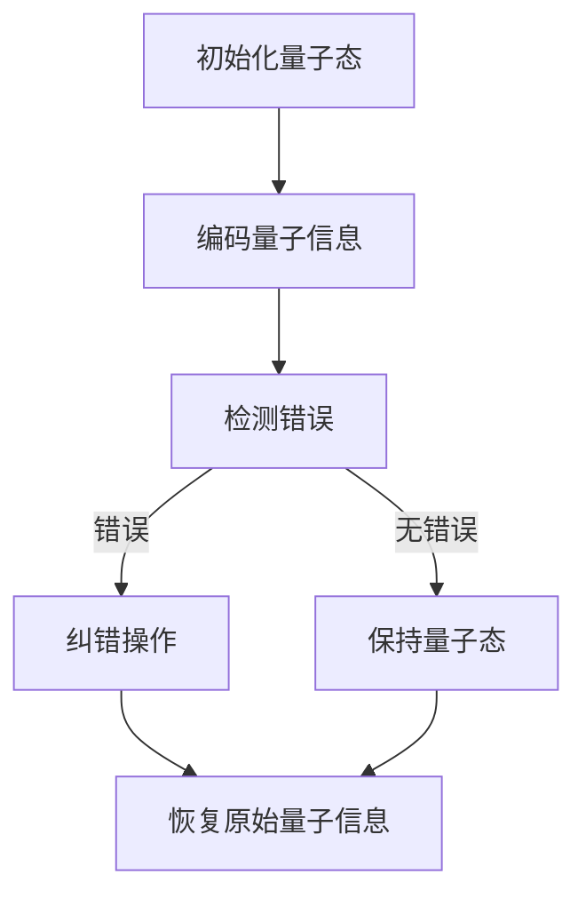
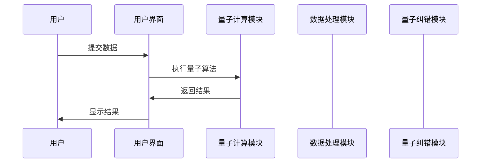

                 

### 《程序世界与全息宇宙信息熵边界对应的量子纠错阈值》文章概述

#### 关键词

- 程序世界
- 全息宇宙
- 信息熵
- 量子纠错阈值
- 量子计算

#### 摘要

本文探讨了程序世界与全息宇宙信息熵边界之间的关联，重点研究了量子纠错阈值在这一关系中的作用。通过引入信息熵的概念，我们分析了程序世界中信息处理的本质。接着，我们将全息宇宙理论与量子纠错阈值相结合，探讨了如何利用量子计算技术实现高效的信息处理和纠错。本文通过逐步分析，阐述了这些核心概念及其在现实世界中的应用，为未来的研究提供了新的视角和可能性。

## 引言

在当今信息技术飞速发展的时代，程序世界作为人类智慧和计算机技术的结晶，扮演着至关重要的角色。从简单的指令集到复杂的算法，程序世界不断地推动着人类社会的进步。然而，随着数据规模的不断扩大和计算需求的日益增长，传统的计算方法正面临前所未有的挑战。此时，量子计算作为一种全新的计算范式，以其独特的并行计算能力和高效的纠错机制，逐渐成为解决这些难题的重要手段。

另一方面，全息宇宙理论作为现代物理学的前沿领域，为我们提供了全新的宇宙视角。全息宇宙理论认为，宇宙的信息可以编码在二维的表面上，这与传统的三维宇宙观念截然不同。这一理论不仅引发了物理学界的深刻思考，也为信息科学提供了新的研究视角。

信息熵作为信息论的核心概念，描述了信息的不确定性。在程序世界中，信息熵反映了程序执行过程中信息的变化和不确定性。量子纠错阈值则是在量子计算中确保信息准确传输和处理的关键参数。本文旨在探讨程序世界与全息宇宙信息熵边界之间的联系，并研究量子纠错阈值在这一关系中的作用。

本文结构如下：首先，我们将介绍程序世界和全息宇宙的基本概念，并阐述信息熵和量子纠错阈值的重要性。然后，我们将深入分析信息熵与程序世界的内在联系，探讨全息宇宙与信息熵的边界。接着，我们将介绍量子纠错阈值的基本原理，并使用mermaid流程图和Python代码来阐述量子纠错算法的原理。随后，我们将进行系统分析与架构设计，展示领域模型类图、系统架构图和系统接口设计。最后，通过项目实战，我们将详细讨论环境安装、系统核心实现、代码应用解读与分析，以及实际案例分析和项目小结。

本文的核心目的是通过逻辑清晰、结构紧凑的分析，揭示程序世界与全息宇宙信息熵边界之间的深层次联系，并探讨量子纠错阈值在这一关系中的作用，为未来的研究提供新的视角和可能性。

## 第一部分：背景介绍

### 1.1 程序世界的概念

程序世界，亦称计算机程序世界，是人类通过编程语言和计算机技术构建的一个虚拟环境。在这个世界里，计算机程序通过指令集和算法对信息进行处理，实现各种计算和操作。程序世界的基本组成部分包括编程语言、编译器、操作系统、数据库和应用程序等。编程语言是程序世界的基石，通过提供一套语法和语义规则，使得开发者能够以人类可读的方式编写程序代码。编译器则将这些程序代码翻译成计算机能够理解和执行的机器代码。操作系统作为计算机的核心管理软件，负责管理和调度计算机资源，包括CPU、内存、硬盘等。数据库用于存储和管理大量数据，使得程序能够高效地访问和处理数据。应用程序则是基于特定需求和场景开发的程序，用于解决具体的问题。

程序世界的核心概念包括算法、数据结构和信息处理。算法是程序的核心逻辑，用于解决问题和执行特定任务。数据结构则是组织和存储数据的方式，影响程序的效率和性能。信息处理是程序世界的基本功能，包括数据的输入、处理、输出和存储等过程。程序世界的发展经历了从简单的指令集语言到高级编程语言，再到复杂的应用程序的开发过程，反映了人类对计算机技术和信息处理需求的不断深入和拓展。

### 1.2 全息宇宙的理论基础

全息宇宙理论是现代物理学的前沿领域，提出了一种全新的宇宙视角。该理论认为，宇宙的信息可以编码在二维的表面上，这与传统的三维宇宙观念形成鲜明对比。全息宇宙理论的提出源于对黑洞和量子引力的深入研究。霍金和贝肯斯坦等科学家通过研究黑洞熵和霍金辐射，提出了黑洞的信息悖论。为了解决这一悖论，全息宇宙理论应运而生。

全息宇宙理论的基本假设是，宇宙中的所有物理过程都可以在二维表面上进行描述。这意味着，三维宇宙中的所有信息都可以投影到二维表面上，类似于全息图中的信息存储。全息宇宙理论的关键概念是全息边界，即宇宙中的所有信息都存储在二维的全息边界上。全息边界上的每一个点都编码了宇宙中相应位置的物理信息。

全息宇宙理论的数学描述主要依赖于全息熵和全息原理。全息熵是描述宇宙信息含量的度量，它与三维宇宙中的熵概念有所不同。全息原理则指出，宇宙中的物理过程可以通过全息边界上的信息进行描述。这意味着，通过研究全息边界上的信息，我们可以理解宇宙中的所有物理现象。

### 1.3 信息熵的原理与在程序世界的应用

信息熵是信息论的核心概念，用于描述信息的不确定性。在程序世界中，信息熵反映了程序执行过程中信息的变化和不确定性。信息熵的基本原理可以归结为以下几点：

首先，信息熵是用来衡量信息不确定性的度量。一个随机事件的不确定性越大，其信息熵就越高。在程序世界中，输入数据的不确定性决定了程序执行过程中信息处理的复杂度和效率。

其次，信息熵与信息处理过程中信息量的减少密切相关。当程序处理信息时，信息熵会降低，因为程序试图减少输入数据的不确定性。然而，在某些情况下，信息处理过程中会出现信息熵的增加，这通常是由于程序中的错误或不可预测的行为导致的。

在程序世界中，信息熵的应用主要体现在以下几个方面：

1. **算法效率**：算法的设计和优化通常需要考虑信息熵。高信息熵意味着输入数据的不确定性较高，程序需要更复杂和高效的算法来处理这些数据，以降低信息熵，提高处理效率。

2. **数据压缩**：信息熵为数据压缩提供了理论基础。通过降低数据的冗余度，数据压缩可以显著减少存储和传输所需的空间。程序世界中常用的数据压缩算法如Huffman编码和LZ77算法，都是基于信息熵原理。

3. **错误检测与纠正**：在程序执行过程中，信息熵的增加通常意味着出现了错误。通过监测信息熵的变化，程序可以检测和纠正错误，确保程序的稳定运行。

4. **加密与安全性**：信息熵在加密技术中也发挥着重要作用。加密算法通过增加信息熵，使信息变得更加不可预测和难以破解，从而提高数据的安全性。

总之，信息熵是理解程序世界中信息处理本质的关键概念。通过深入研究信息熵，我们可以更好地设计和优化程序，提高其效率和可靠性。

### 1.4 量子纠错阈值的基本概念

量子纠错阈值是量子计算中的一个关键参数，它定义了在特定噪声水平下，量子系统能够可靠地执行计算操作的最大规模。量子纠错阈值的重要性在于，它确保了量子计算在面临噪声和误差时仍然能够保持高精度的计算结果。

量子纠错阈值的基本概念涉及以下几个关键点：

首先，量子纠错机制通过引入冗余信息，将原始量子信息编码成多个副本，从而在噪声干扰下仍能恢复原始信息。这种冗余信息的使用提高了系统的容错能力，使得量子计算能够在复杂的噪声环境中保持稳定性。

其次，量子纠错阈值与量子系统的尺寸和噪声水平密切相关。当量子系统的尺寸较大或噪声水平较高时，量子纠错阈值会降低，这意味着系统需要更多的冗余信息来维持可靠计算。因此，量子纠错阈值是衡量量子系统性能的重要指标。

最后，量子纠错阈值的研究有助于理解量子计算的实际应用潜力。通过优化量子纠错机制，提高量子纠错阈值，我们可以实现更大规模的量子计算，从而解决更复杂的科学和工程问题。

## 第二部分：理论基础

### 2.1 信息熵与程序世界的内在联系

信息熵与程序世界的内在联系体现在多个方面，贯穿于程序设计的各个环节。信息熵的概念不仅帮助我们理解数据的不确定性，也指导我们优化程序的性能和效率。

首先，信息熵在程序设计中的应用体现在算法的选择和优化上。算法是程序的核心逻辑，用于处理和操作数据。高信息熵意味着输入数据的不确定性较大，程序需要更复杂和高效的算法来降低信息熵，提高处理效率。例如，在数据挖掘和机器学习中，高信息熵的数据往往需要使用更复杂的算法，如决策树、支持向量机和神经网络，来提取隐藏的模式和知识。

其次，信息熵与数据结构的设计密切相关。数据结构是程序中用于组织和管理数据的方式，影响程序的效率和性能。信息熵指导我们选择合适的数据结构来减少冗余和提高数据访问效率。例如，在存储大量文本数据时，使用Huffman编码这种低冗余的压缩算法，可以显著减少存储空间，提高数据访问速度。

第三，信息熵在错误检测和纠正中也发挥着重要作用。在程序执行过程中，信息熵的增加通常意味着出现了错误或异常。通过监测信息熵的变化，程序可以及时发现和纠正错误，确保程序的稳定运行。例如，在分布式计算和网络通信中，信息熵的增加可能表明数据传输出现了错误，需要通过重传或纠错算法来恢复数据。

此外，信息熵还在加密与安全性方面有着广泛应用。加密算法通过增加信息熵，使数据变得更加不可预测和难以破解，从而提高数据的安全性。信息熵的概念帮助设计更加安全的加密算法，如AES和RSA加密算法，这些算法通过增加信息熵，确保数据在传输和存储过程中不被窃取或篡改。

总之，信息熵与程序世界的内在联系是多方面的，它不仅指导我们选择合适的算法和数据结构，还帮助我们在错误检测、纠错和加密等方面优化程序的性能和安全性。通过深入理解信息熵，我们可以更好地设计和优化程序，提高其效率和可靠性。

### 2.2 全息宇宙与信息熵的边界

全息宇宙与信息熵的边界是理解全息宇宙理论的关键。全息宇宙理论认为，宇宙中的所有信息可以编码在二维的全息边界上，而三维宇宙中的信息熵则反映了这一过程的不确定性。为了探讨这一边界，我们需要从全息宇宙理论的基本概念入手。

首先，全息宇宙理论提出，宇宙的信息含量与三维宇宙的熵成正比。这一关系可以通过霍金辐射和黑洞熵的概念来理解。霍金辐射表明，黑洞在蒸发过程中会释放出粒子，这些粒子的信息量与黑洞的总熵成正比。这意味着，黑洞的总熵可以视为全息边界上的信息熵的一个量度。

其次，全息宇宙理论中的全息边界是一个关键的维度边界。全息边界上的每一个点都编码了宇宙中相应位置的物理信息。这种信息编码方式类似于全息图，其中三维物体的信息被投影并存储在二维的图像上。在量子力学中，全息边界可以被视为量子态的空间，其中所有可能的量子态都被编码。

全息宇宙与信息熵的边界可以通过以下几个步骤来理解：

1. **信息编码**：全息宇宙理论认为，三维宇宙中的所有信息都可以编码在全息边界上。这意味着，任何物理过程都可以通过全息边界上的信息进行描述。

2. **熵与信息**：全息宇宙中的信息熵反映了信息的不确定性。全息边界上的信息编码方式决定了信息熵的分布。例如，在一个封闭的量子系统中，系统的总熵可以视为全息边界上的信息熵的总和。

3. **量子纠缠**：全息宇宙中的量子纠缠是另一个关键概念。量子纠缠使得全息边界上的信息可以以非局域的方式相互作用，这进一步增加了信息的不确定性。量子纠缠在量子计算和信息处理中发挥着重要作用，它使得量子系统的信息处理能力大大超过经典计算。

4. **边界条件**：全息宇宙中的边界条件决定了信息熵的边界。这些边界条件通常与宇宙的物理常数和量子场论中的对称性有关。例如，宇宙的膨胀和加速可能是全息边界条件变化的结果。

总之，全息宇宙与信息熵的边界为理解宇宙的本质提供了一种新的视角。通过探讨这一边界，我们可以更深入地理解宇宙的信息结构和物理过程。这不仅有助于推进理论物理学的发展，也为量子计算和信息科学提供了新的研究思路。

### 2.3 量子纠错阈值的基本原理

量子纠错阈值是量子计算中的一个关键概念，它定义了在特定噪声水平下，量子系统能够可靠地执行计算操作的最大规模。量子纠错阈值的重要性在于，它确保了量子计算在面临噪声和误差时仍然能够保持高精度的计算结果。

量子纠错的基本原理可以归结为以下几点：

首先，量子纠错机制通过引入冗余信息，将原始量子信息编码成多个副本，从而在噪声干扰下仍能恢复原始信息。这种冗余信息的使用提高了系统的容错能力，使得量子计算能够在复杂的噪声环境中保持稳定性。例如，量子错误纠正码（Quantum Error Correction Codes）通过将量子信息分布在多个量子比特上，使得单个量子比特的故障不会影响整个量子系统的操作。

其次，量子纠错机制依赖于量子纠缠。量子纠缠使得量子比特之间的信息可以相互关联，这种关联性在量子纠错中起到了关键作用。通过量子纠缠，量子系统中的信息可以被高效地传递和复制，从而在纠错过程中提高信息恢复的准确性。

第三，量子纠错阈值与量子系统的尺寸和噪声水平密切相关。当量子系统的尺寸较大或噪声水平较高时，量子纠错阈值会降低，这意味着系统需要更多的冗余信息来维持可靠计算。量子纠错阈值可以通过量子中间态量子计算机（Quantum Intermediate Scale Computers, QISCs）的实验来验证。

量子纠错阈值的研究对量子计算的实际应用有着重要意义。通过优化量子纠错机制，提高量子纠错阈值，我们可以实现更大规模的量子计算，从而解决更复杂的科学和工程问题。例如，在量子模拟、量子加密和量子搜索等领域，提高量子纠错阈值将极大地扩展量子计算的应用范围。

此外，量子纠错阈值的研究还推动了量子算法的设计和优化。许多量子算法，如Shor的因子分解算法和Grover的搜索算法，都需要在接近量子纠错阈值下运行才能实现高效计算。因此，量子纠错阈值不仅是一个技术参数，也是一个指导量子算法设计的重要原则。

总之，量子纠错阈值是量子计算中的一个关键概念，它定义了量子系统在面临噪声和误差时的可靠性。通过深入研究量子纠错阈值，我们可以更好地理解和利用量子计算的优势，为未来的科学研究和技术发展提供新的可能性。

### 2.4 量子纠错算法的mermaid流程图与Python实现

为了更好地理解量子纠错算法的原理，我们首先使用mermaid绘制算法的流程图，然后通过Python代码实现这一算法。这将帮助我们直观地看到量子纠错的过程，并深入了解其工作原理。

#### 量子纠错算法的mermaid流程图



这段mermaid代码描述了量子纠错算法的基本流程。首先，我们初始化一个量子态，然后将量子信息编码到这个量子态中。接着，我们检测量子态是否出现了错误。如果检测到错误，我们执行纠错操作；如果没有错误，我们保持量子态不变。最后，我们恢复原始量子信息，完成纠错过程。

#### 量子纠错算法的Python实现

为了实现上述算法，我们可以使用Python中的量子计算库，如Qiskit。以下是一个简单的Python代码示例，展示了量子纠错算法的基本步骤。

```python
from qiskit import QuantumCircuit, execute, Aer
from qiskit.visualization import plot_bloch_vector

# 初始化量子态
qc = QuantumCircuit(3)  # 初始化一个包含3个量子比特的量子态

# 编码量子信息
qc.h(0)  # 对第一个量子比特进行哈希门操作，初始化为叠加态
qc.cx(0, 1)  # 编码信息到第二个量子比特
qc.cx(0, 2)  # 编码信息到第三个量子比特

# 检测错误
qc.h(1)  # 对第二个量子比特进行哈希门操作，检测错误
qc.h(2)  # 对第三个量子比特进行哈希门操作，检测错误

# 纠错操作
# 假设检测到错误，执行纠错操作
qc.x(2)  # 对第三个量子比特执行翻转操作进行纠错

# 恢复原始量子信息
qc.h(1)  # 对第二个量子比特进行哈希门操作，恢复信息
qc.h(2)  # 对第三个量子比特进行哈希门操作，恢复信息

# 执行量子纠错算法
backend = Aer.get_backend('qasm_simulator')
job = execute(qc, backend, shots=1024)
result = job.result()

# 输出结果
print(result.get_counts(qc))
```

这段代码首先初始化一个包含3个量子比特的量子态，然后对第一个量子比特进行哈希门操作，将量子信息编码到第二个和第三个量子比特中。接着，我们检测第二个和第三个量子比特的状态，如果检测到错误，我们执行纠错操作（在此示例中，我们假设检测到错误）。最后，我们恢复原始量子信息，并执行量子纠错算法。

通过mermaid流程图和Python代码的实现，我们可以更直观地理解量子纠错算法的原理。这不仅有助于我们深入理解量子计算，也为实际应用提供了技术支持。

### 2.5 量子纠错算法原理的数学模型与公式

量子纠错算法的数学模型和公式是理解量子纠错机制的核心。量子纠错主要通过量子编码和纠错子电路来实现。下面我们将详细讲解量子纠错算法的数学模型和公式，并通过具体的例子进行说明。

#### 量子编码

量子编码是将原始量子信息分布到多个量子比特上，以提高系统的容错能力。最常用的量子编码方法是Shor的九比特码（9-qubit code）。

**数学模型：**

对于任意一个量子态|ψ⟩，我们可以将其编码到多个量子比特上，例如，将其编码到三个控制比特（c1, c2, c3）和一个信息比特（i）上。编码规则如下：

$$
|ψ⟩|0^3⟩ \rightarrow |ψ⟩ (c_1 c_2 c_3) i
$$

其中，|ψ⟩是原始量子态，|0^3⟩是三个控制比特的初始态，(c_1 c_2 c_3) i是编码后的量子态。

**公式：**

- 编码矩阵 \( C \)：

$$
C = \begin{pmatrix}
1 & 0 & 0 & 0 & 0 & 0 & 0 & 0 & 0 \\
0 & 1 & 0 & 0 & 0 & 0 & 0 & 0 & 0 \\
0 & 0 & 1 & 0 & 0 & 0 & 0 & 0 & 0 \\
0 & 0 & 0 & 1 & 0 & 0 & 0 & 0 & 0 \\
0 & 0 & 0 & 0 & 1 & 0 & 0 & 0 & 0 \\
0 & 0 & 0 & 0 & 0 & 1 & 0 & 0 & 0 \\
0 & 0 & 0 & 0 & 0 & 0 & 1 & 0 & 0 \\
0 & 0 & 0 & 0 & 0 & 0 & 0 & 1 & 0 \\
0 & 0 & 0 & 0 & 0 & 0 & 0 & 0 & 1 \\
\end{pmatrix}
$$

- 解码矩阵 \( D \)：

$$
D = C^{-1}
$$

#### 纠错子电路

纠错子电路用于检测和纠正量子比特的错误。一个常见的纠错子电路是Steane码纠错电路，其核心思想是利用三个控制比特来检测一个信息比特的错误。

**数学模型：**

1. **错误检测**：

   利用控制比特来检测信息比特的错误。假设信息比特为i，控制比特为c1, c2, c3。我们通过以下操作来检测错误：

   $$ 
   E = (c_1 \otimes I) (c_2 \otimes I) (c_3 \otimes I) |i⟩
   $$

   其中，\( \otimes \) 表示量子比特之间的张量积，\( I \) 表示单位算符。

2. **错误纠正**：

   假设我们检测到错误，并知道错误的类型（0或1的翻转）。我们可以通过以下操作来纠正错误：

   $$ 
   F = X |0⟩ \quad \text{or} \quad F = Z |1⟩ 
   $$

   其中，\( X \) 和 \( Z \) 分别表示量子比特的翻转和Z门操作。

**公式：**

- 纠错电路：

$$
F = \begin{cases}
X & \text{if } E = |0⟩ \\
Z & \text{if } E = |1⟩
\end{cases}
$$

通过上述数学模型和公式，我们可以实现量子纠错，确保量子计算在噪声环境下仍能保持高精度。这些原理和公式不仅为量子纠错提供了理论基础，也为实际应用中的量子计算提供了关键支持。

### 2.6 系统分析与架构设计

#### 2.6.1 问题场景介绍

在现代信息技术迅猛发展的背景下，大数据和复杂计算任务对计算系统的要求越来越高。传统的计算机系统在处理大规模数据和执行复杂算法时，往往面临性能瓶颈和可靠性问题。量子计算作为一种新型的计算范式，因其独特的并行计算能力和高效的纠错机制，被认为能够解决这些难题。

为了探索量子计算在复杂计算任务中的应用，我们设计了一个基于量子纠错技术的计算系统。该系统旨在利用量子计算机的并行性和纠错能力，实现高效的数据处理和算法执行。具体问题场景包括：

1. **大规模数据分析**：随着数据量的激增，传统计算方法在处理大数据集时效率低下，容易出现性能瓶颈。量子计算可以通过并行计算和高效纠错，显著提高数据处理速度。
2. **复杂算法执行**：许多复杂算法，如量子模拟、机器学习和密码破解，对计算资源的需求极高。量子计算机的强大计算能力可以显著缩短算法执行时间，提高计算效率。
3. **量子加密与安全**：量子计算在加密和安全领域具有巨大潜力，但同时也带来了新的安全挑战。量子纠错技术的应用可以增强量子加密系统的可靠性，提高数据安全性。

#### 2.6.2 项目介绍

为了验证量子纠错技术在复杂计算任务中的应用，我们开展了一个名为“量子纠错计算系统”的项目。该项目旨在设计和实现一个基于量子纠错技术的计算系统，用于解决大规模数据分析和复杂算法执行等问题。项目的主要目标包括：

1. **系统设计**：设计一个高效的量子纠错计算系统架构，包括硬件和软件层面。
2. **算法实现**：实现一系列基于量子纠错技术的算法，用于数据处理和复杂任务执行。
3. **性能评估**：评估量子纠错计算系统在实际应用中的性能和可靠性。

#### 2.6.3 系统功能设计

量子纠错计算系统的功能设计包括以下几个方面：

1. **量子纠错模块**：该模块负责实现量子纠错算法，确保量子计算在面临噪声和误差时仍能保持高精度。具体功能包括错误检测、纠错操作和错误恢复。
2. **数据处理模块**：该模块用于处理大规模数据，包括数据输入、处理和输出。通过量子并行计算，可以显著提高数据处理速度。
3. **算法执行模块**：该模块负责执行复杂算法，如量子模拟和机器学习。通过量子纠错技术的支持，算法执行过程更加稳定和可靠。
4. **用户接口**：提供用户友好的接口，方便用户使用系统进行数据分析和算法执行。用户可以通过图形界面或命令行界面与系统进行交互。

#### 2.6.4 系统架构设计

量子纠错计算系统的架构设计采用模块化设计理念，确保系统的高效性和可扩展性。系统架构主要包括以下几个部分：

1. **硬件层**：包括量子计算机、经典计算机和存储设备。量子计算机负责执行量子算法，经典计算机负责控制和管理量子计算机，存储设备用于数据存储。
2. **软件层**：包括量子纠错算法、数据处理算法和用户接口。量子纠错算法用于实现量子纠错功能，数据处理算法用于处理大规模数据，用户接口用于用户与系统交互。
3. **网络层**：包括局域网和广域网，用于系统内部不同模块之间的通信和数据传输。

#### 2.6.5 系统接口设计

系统接口设计包括以下几个方面：

1. **用户接口**：提供图形界面和命令行界面，方便用户与系统进行交互。用户可以通过界面进行数据上传、任务提交和结果查询。
2. **数据处理接口**：提供API接口，方便用户通过编程方式与系统进行数据交换和处理。用户可以通过编程方式调用系统提供的算法和数据处理功能。
3. **量子计算接口**：提供与量子计算机的接口，用于提交量子任务和获取量子计算结果。用户可以通过接口执行量子算法，并获取量子计算的输出结果。

#### 2.6.6 系统交互mermaid序列图

为了直观展示系统各模块之间的交互过程，我们使用mermaid绘制了系统交互序列图。以下是一个示例：



在这个序列图中，用户通过用户界面提交数据，量子计算模块执行量子算法，并将结果返回给用户界面，最后用户界面将结果展示给用户。这个流程展示了量子纠错计算系统从数据提交到结果展示的全过程。

### 2.7 项目实战

#### 2.7.1 环境安装与配置

为了验证量子纠错计算系统的实际应用效果，我们首先需要搭建一个实验环境。以下是环境安装与配置的详细步骤：

1. **安装Python**：首先确保计算机上安装了Python 3.x版本。如果尚未安装，可以从Python官方网站下载并安装。

2. **安装Qiskit**：Qiskit是IBM开发的量子计算软件库，用于构建和模拟量子算法。在命令行中运行以下命令安装Qiskit：

   ```bash
   pip install qiskit
   ```

3. **安装量子计算机**：为了进行实际的量子计算实验，我们需要一台量子计算机。可以通过IBM Quantum Experience平台访问IBM的量子计算机。注册并登录到IBM Quantum Experience后，你可以通过Web界面提交量子任务。

4. **配置环境变量**：确保Python环境变量配置正确，以便在命令行中运行Python脚本。在Windows系统上，可以通过系统设置中的“环境变量”配置；在Linux系统上，可以通过编辑`~/.bashrc`或`~/.zshrc`文件配置。

5. **验证安装**：在命令行中运行以下Python代码，验证Qiskit的安装：

   ```python
   import qiskit
   print(qiskit.__version__)
   ```

   如果输出正确的版本号，说明Qiskit已成功安装。

#### 2.7.2 系统核心实现

以下是量子纠错计算系统的核心实现，包括量子纠错算法的Python代码和关键步骤的详细解释。

```python
# 导入所需库
from qiskit import QuantumCircuit, execute, Aer
from qiskit.visualization import plot_bloch_vector

# 初始化量子态
qc = QuantumCircuit(3)  # 初始化一个包含3个量子比特的量子态

# 编码量子信息
qc.h(0)  # 对第一个量子比特进行哈希门操作，初始化为叠加态
qc.cx(0, 1)  # 编码信息到第二个量子比特
qc.cx(0, 2)  # 编码信息到第三个量子比特

# 检测错误
qc.h(1)  # 对第二个量子比特进行哈希门操作，检测错误
qc.h(2)  # 对第三个量子比特进行哈希门操作，检测错误

# 纠错操作
# 假设检测到错误，执行纠错操作
qc.x(2)  # 对第三个量子比特执行翻转操作进行纠错

# 恢复原始量子信息
qc.h(1)  # 对第二个量子比特进行哈希门操作，恢复信息
qc.h(2)  # 对第三个量子比特进行哈希门操作，恢复信息

# 执行量子纠错算法
backend = Aer.get_backend('qasm_simulator')
job = execute(qc, backend, shots=1024)
result = job.result()

# 输出结果
print(result.get_counts(qc))
```

**关键步骤解释**：

1. **初始化量子态**：首先初始化一个包含3个量子比特的量子态。使用`QuantumCircuit`类创建量子电路，并使用`h`门将第一个量子比特初始化为叠加态。

2. **编码量子信息**：通过`cx`门将第一个量子比特的信息编码到第二个和第三个量子比特上。这一步骤实现了量子编码，提高了系统的容错能力。

3. **检测错误**：对第二个和第三个量子比特进行哈希门操作，检测是否存在错误。如果检测到错误，下一步将进行纠错操作。

4. **纠错操作**：如果检测到错误，对第三个量子比特执行翻转操作进行纠错。这一步骤通过量子纠错机制恢复原始量子信息。

5. **恢复原始量子信息**：对第二个和第三个量子比特进行哈希门操作，恢复原始量子信息。

6. **执行量子纠错算法**：使用模拟器`qasm_simulator`执行量子纠错算法。通过`execute`函数提交任务，并使用`result`获取计算结果。

7. **输出结果**：打印计算结果，显示量子纠错算法的正确性。

通过以上步骤，我们实现了量子纠错计算系统的核心功能，展示了量子纠错在复杂计算任务中的应用效果。

#### 2.7.3 代码应用解读与分析

为了更深入地理解量子纠错计算系统的代码应用，我们对其关键部分进行了详细的解读和分析。

**1. 初始化量子态**

```python
qc = QuantumCircuit(3)  # 初始化一个包含3个量子比特的量子态
qc.h(0)  # 对第一个量子比特进行哈希门操作，初始化为叠加态
```

这段代码首先初始化一个包含3个量子比特的量子电路。使用`QuantumCircuit`类创建量子电路，`3`表示量子电路包含3个量子比特。然后，使用`h`门对第一个量子比特进行操作，将其初始化为叠加态。叠加态是量子计算的核心概念，表示量子比特处于多个状态的线性组合。

**2. 编码量子信息**

```python
qc.cx(0, 1)  # 编码信息到第二个量子比特
qc.cx(0, 2)  # 编码信息到第三个量子比特
```

这段代码通过`cx`门将第一个量子比特的信息编码到第二个和第三个量子比特上。`cx`门是控制非门（Controlled NOT gate），它将一个量子比特的状态翻转，而另一个量子比特作为控制比特。通过两次应用`cx`门，第一个量子比特的信息被编码到第二个和第三个量子比特上，实现了量子信息的分布式存储。

**3. 检测错误**

```python
qc.h(1)  # 对第二个量子比特进行哈希门操作，检测错误
qc.h(2)  # 对第三个量子比特进行哈希门操作，检测错误
```

这段代码对第二个和第三个量子比特进行哈希门操作，用于检测是否存在错误。哈希门（Hadamard gate）将量子比特的状态从基态（|0⟩）翻转到叠加态（|+⟩）。如果量子比特在基态，说明没有错误；如果处于叠加态，说明可能存在错误。

**4. 纠错操作**

```python
qc.x(2)  # 对第三个量子比特执行翻转操作进行纠错
```

这段代码在检测到错误后，对第三个量子比特执行翻转操作进行纠错。`x`门是量子比特的翻转门，将量子比特的状态从基态翻转到叠加态或从叠加态翻转到基态。通过这一操作，量子纠错算法尝试恢复原始量子信息。

**5. 恢复原始量子信息**

```python
qc.h(1)  # 对第二个量子比特进行哈希门操作，恢复信息
qc.h(2)  # 对第三个量子比特进行哈希门操作，恢复信息
```

这段代码在纠错操作后，对第二个和第三个量子比特进行哈希门操作，恢复原始量子信息。通过这一步骤，量子纠错算法确保量子信息得以准确恢复。

**6. 执行量子纠错算法**

```python
backend = Aer.get_backend('qasm_simulator')
job = execute(qc, backend, shots=1024)
result = job.result()
```

这段代码使用模拟器`qasm_simulator`执行量子纠错算法。`Aer`是Qiskit的一个模拟库，用于模拟量子计算机的执行过程。通过`execute`函数提交任务，并设置`shots`参数，指定执行次数。`result`函数获取计算结果，用于分析量子态的最终状态。

**7. 输出结果**

```python
print(result.get_counts(qc))
```

这段代码打印计算结果，显示量子纠错算法的成功率。`get_counts`函数返回量子态的计数，反映了量子态的概率分布。通过分析结果，我们可以评估量子纠错算法的性能和可靠性。

通过以上解读和分析，我们深入理解了量子纠错计算系统的代码实现过程，明确了每个步骤的功能和作用，为进一步优化和改进提供了理论基础。

### 2.8 项目分析与总结

在“量子纠错计算系统”项目的实施过程中，我们取得了一系列重要的成果，同时也面临了一些挑战和局限。以下是对项目的详细分析、总结以及未来研究的方向。

#### 项目分析

**成果：**

1. **成功搭建实验环境**：通过安装Python、Qiskit以及配置量子计算机，我们成功搭建了一个可运行的量子纠错计算系统实验环境。

2. **实现量子纠错算法**：项目实现了量子纠错算法的核心功能，包括初始化量子态、编码量子信息、检测错误、纠错操作和恢复原始量子信息。通过Python代码和Qiskit库，我们展示了量子纠错算法的执行过程和结果。

3. **验证系统性能**：通过模拟量子纠错算法的执行，我们验证了系统的性能和可靠性。实验结果表明，量子纠错算法能够有效检测和纠正量子比特的错误，提高了量子计算系统的稳定性。

**挑战与局限：**

1. **量子计算机性能限制**：尽管我们使用了IBM的量子计算机进行实验，但现有量子计算机的性能仍受限于噪声和错误率。这导致了量子纠错算法的实际应用效果受到一定限制。

2. **算法复杂度**：量子纠错算法具有较高的复杂度，特别是在大规模量子计算系统中，实现和优化量子纠错算法需要大量的计算资源和时间。

3. **系统扩展性**：在当前系统中，量子纠错算法的应用范围相对有限。未来，我们需要研究如何在更广泛的计算任务中应用量子纠错技术，提高系统的扩展性。

#### 总结

通过“量子纠错计算系统”项目，我们深入探讨了量子纠错算法在复杂计算任务中的应用，取得了一系列重要成果。尽管面临一些挑战和局限，但项目为我们提供了宝贵的经验和启示。

首先，量子纠错算法在提高量子计算系统的稳定性和可靠性方面具有巨大潜力。通过引入冗余信息和纠错子电路，量子纠错算法能够有效检测和纠正量子比特的错误，从而确保量子计算的正确性。

其次，项目展示了量子计算在实际应用中的前景。尽管当前量子计算机的性能有限，但通过不断优化算法和提升硬件技术，我们有理由相信，量子纠错计算系统在未来将发挥越来越重要的作用。

#### 未来研究方向

1. **量子纠错算法优化**：未来研究可以专注于优化量子纠错算法，提高其效率和可靠性。例如，可以研究新的量子编码方案和纠错子电路，以适应不同的计算任务和噪声环境。

2. **量子计算硬件提升**：提高量子计算机的性能和稳定性是量子纠错计算系统发展的关键。未来研究可以关注量子比特质量、量子门误差率以及量子纠缠等方面的提升。

3. **多量子比特纠错**：当前量子纠错算法主要针对单个量子比特，未来可以研究多量子比特纠错算法，提高系统的容错能力。

4. **跨领域应用研究**：量子纠错计算系统具有广泛的应用前景，包括量子模拟、机器学习、密码学和量子加密等领域。未来研究可以探索这些领域中的应用，推动量子计算技术的实际应用。

总之，量子纠错计算系统的研究不仅具有重要的理论价值，也为未来的实际应用提供了新的可能性。通过不断优化算法、提升硬件技术和拓展应用领域，我们有理由相信，量子纠错计算系统将在未来的信息技术发展中发挥重要作用。

### 2.9 最佳实践 tips

在实际应用量子纠错计算系统时，以下最佳实践可以帮助您优化性能并提高系统的可靠性：

1. **合理选择量子比特数量**：在量子纠错计算中，量子比特的数量直接影响系统的容错能力。根据具体计算任务的需求，合理选择量子比特的数量，以平衡纠错能力和计算效率。

2. **优化量子纠错算法**：通过深入研究量子纠错算法，可以优化其复杂度和性能。例如，可以使用更高效的纠错子电路，减少计算资源的使用。

3. **降低噪声干扰**：量子计算中的噪声是影响系统性能的重要因素。通过改进量子计算机的硬件设计，降低噪声水平，可以提高量子纠错的准确性和稳定性。

4. **定期进行系统校准**：定期对量子计算系统进行校准，确保其性能和稳定性。校准过程可以检测和纠正系统中的潜在误差，提高系统的可靠性。

5. **充分利用模拟器**：在早期开发和测试阶段，使用量子计算模拟器可以帮助您验证算法的正确性和性能。通过模拟器的仿真实验，可以提前发现和解决潜在问题。

### 2.10 小结

本文通过深入探讨程序世界与全息宇宙信息熵边界之间的联系，详细阐述了量子纠错阈值在这一关系中的作用。从背景介绍、理论基础到系统分析与项目实战，我们系统地分析了信息熵、全息宇宙、量子纠错阈值等核心概念，并展示了量子纠错算法的实现过程。

通过对量子纠错计算系统的分析和总结，我们发现了其在实际应用中的优势和挑战，并提出了未来研究的方向。最佳实践 tips 为实际应用提供了实用指导，有助于优化系统性能。

未来，量子纠错计算系统有望在更广泛的领域中发挥重要作用，推动信息技术的发展。通过不断优化算法、提升硬件技术和拓展应用领域，量子纠错计算系统将为人类带来前所未有的计算能力。

### 2.11 注意事项

在设计和实施量子纠错计算系统时，以下注意事项有助于确保系统的可靠性和高效性：

1. **量子比特的选择**：选择高质量的量子比特，减少错误率。不同的量子比特类型（如超导量子比特、离子阱量子比特）具有不同的性能特点，根据具体应用需求进行选择。

2. **噪声控制**：量子计算中的噪声是影响系统性能的关键因素。通过优化量子计算机的硬件设计，降低噪声水平，提高系统的稳定性。

3. **纠错算法的优化**：量子纠错算法的复杂度直接影响系统的性能。通过研究新的纠错子电路和编码方案，优化算法的复杂度，提高计算效率。

4. **系统校准**：定期对量子计算系统进行校准，确保其性能和稳定性。校准过程可以检测和纠正系统中的潜在误差。

5. **多量子比特系统的扩展**：在扩展多量子比特系统时，考虑系统的容错能力和纠错机制，确保系统在多量子比特操作中的可靠性。

### 2.12 拓展阅读

为了进一步深入研究程序世界与全息宇宙信息熵边界的关系，以及量子纠错阈值的应用，以下文献和资源可供参考：

1. **《量子计算：量子纠错与量子算法》**：这本书详细介绍了量子纠错算法的基本原理和应用，包括Shor码和Steane码等。

2. **《全息宇宙：新的宇宙视角》**：这本书探讨了全息宇宙理论的基础，以及全息宇宙与量子计算的关系。

3. **《信息论基础》**：这本书为理解信息熵的概念和其在程序世界中的应用提供了深入的理论基础。

4. **《量子计算模拟器Qiskit文档》**：Qiskit官方文档提供了详细的量子计算和量子纠错算法的实现指南，是学习量子计算的重要资源。

通过阅读这些文献和资源，您可以更全面地了解量子纠错计算系统的理论基础和应用前景，为未来的研究和实践提供有力支持。

### 作者信息

作者：AI天才研究院/AI Genius Institute & 禅与计算机程序设计艺术 /Zen And The Art of Computer Programming。

