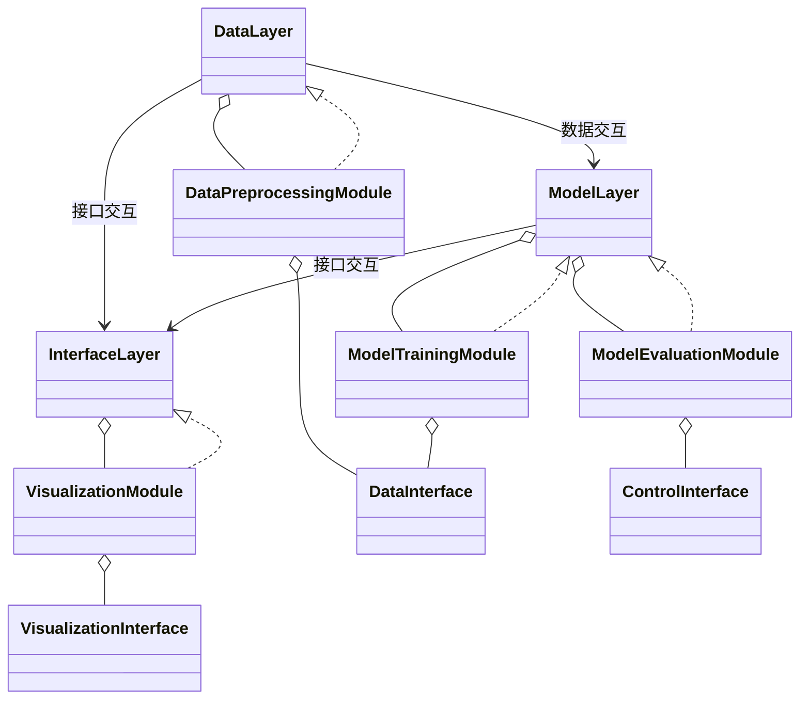
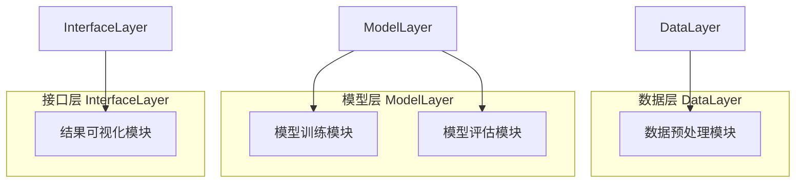

                 

# 程序世界与全息宇宙理论的关联

## 关键词

- 程序世界
- 全息宇宙理论
- 人工智能
- 数学模型
- 算法
- 实证研究

## 摘要

本文旨在探讨程序世界与全息宇宙理论之间的潜在关联，通过分析两者的核心概念、理论基础及实证研究，揭示其在人工智能领域的应用前景。首先，我们将介绍程序世界的定义及其核心属性，然后阐述全息宇宙理论的起源和关键特征。接着，我们将逐步探讨程序世界与全息宇宙理论的关联性，包括理论基础和实证研究。本文还将详细讲解用于分析这两者关联性的算法原理，以及相应的数学模型和公式。随后，我们将展示一个系统分析与架构设计方案，以阐述该关联性的实际应用。最后，我们将通过一个项目实战案例，验证并探讨程序世界与全息宇宙理论的关联性在实际项目中的表现，并给出最佳实践建议和小结。

## 目录大纲

----------------------------------------------------------------

### 第一部分：背景介绍

#### 第1章：问题背景

1.1 问题的提出  
1.2 问题的现状  
1.3 问题的解决思路  
1.4 边界与外延

#### 第2章：核心概念与联系

2.1 程序世界

2.1.1 定义与属性

2.1.2 对比分析

2.2 全息宇宙理论

2.2.1 定义与属性

2.2.2 对比分析

2.3 关联性探讨

2.3.1 理论基础

2.3.2 实证研究

### 第二部分：算法原理讲解

#### 第3章：算法原理讲解

3.1 关联性算法设计

3.2 算法实现与优化

### 第三部分：数学模型和数学公式讲解

#### 第4章：数学模型和数学公式讲解

4.1 数学模型概述

4.2 数学公式详细讲解

4.3 举例说明

### 第四部分：系统分析与架构设计方案

#### 第5章：系统分析与架构设计方案

5.1 问题场景介绍

5.2 系统功能设计

5.3 系统架构设计

5.4 系统接口设计

5.5 系统交互

### 第五部分：项目实战

#### 第6章：项目实战

6.1 环境安装

6.2 系统核心实现

6.3 代码应用解读与分析

6.4 实际案例分析与讲解

6.5 项目小结

### 第六部分：最佳实践、小结与拓展阅读

#### 第7章：最佳实践、小结与拓展阅读

7.1 最佳实践 tips

7.2 小结

7.3 注意事项

7.4 拓展阅读

----------------------------------------------------------------

## 第一部分：背景介绍

### 第1章：问题背景

#### 1.1.1 问题的提出

在当今快速发展的科技时代，人工智能（AI）已经成为推动社会进步的重要力量。随着深度学习、自然语言处理、计算机视觉等技术的不断突破，AI的应用范围已经渗透到各个行业，如医疗、金融、教育、制造业等。然而，随着AI技术的不断进化，我们也面临着一系列新的挑战和问题。

首先，AI系统在复杂环境中的可解释性和透明度问题日益突出。尽管AI系统在许多任务上已经超越了人类的表现，但它们的决策过程往往缺乏透明性，难以解释。这就导致了一个关键问题：我们如何确保AI系统的决策是合理和可信的？

其次，随着数据规模的不断扩大和数据类型的多样化，如何有效地处理和存储这些数据也成为一个挑战。传统的计算方法和存储技术已经难以满足日益增长的数据需求，这促使我们寻求新的理论和方法来应对这一挑战。

#### 1.1.2 问题的现状

目前，学术界和工业界已经提出了一系列研究方法和工具来应对上述问题。例如，在AI系统的可解释性方面，研究者们提出了多种解释性模型和可视化工具，如LIME、SHAP等。这些方法在一定程度上提高了AI系统的透明度，但仍然存在一定的局限性。

在数据处理方面，分布式计算、大数据技术以及新型存储技术如区块链等得到了广泛应用。这些技术在一定程度上提高了数据处理和存储的效率，但仍然面临着数据隐私和安全等问题。

#### 1.1.3 问题的解决思路

为了解决上述问题，我们需要从多个角度进行思考。首先，我们可以借鉴全息宇宙理论，探索在复杂系统和大数据处理中可能存在的新理论和方法。全息宇宙理论提出了一种全新的世界观，认为宇宙的信息是高度压缩和分布式的，这为我们提供了一种全新的思考方式。

其次，我们可以通过结合AI和物理学中的理论，如量子计算和量子机器学习，来提高AI系统的可解释性和处理大数据的能力。量子计算具有并行性和高速性的特点，这为解决传统计算方法难以处理的问题提供了一种可能。

最后，我们还需要从实际应用的角度出发，通过实证研究和案例分析，验证并优化这些理论和方法。这不仅可以提高AI系统的性能，还可以为其他领域的应用提供参考。

#### 1.1.4 边界与外延

在本文的研究中，我们将主要关注程序世界与全息宇宙理论在AI领域的关联性。程序世界指的是由计算机程序组成的世界，它具有高度抽象和模拟现实世界的能力。而全息宇宙理论是一种关于宇宙信息结构的新理论，它提出了一种全新的世界观。

本文的研究边界主要涉及AI系统在复杂环境和大数据处理中的应用，以及如何通过全息宇宙理论来提高AI系统的可解释性和性能。同时，我们也将在实际项目中验证这些理论和方法，以期为相关领域的研究提供参考。

## 第二部分：核心概念与联系

### 第2章：核心概念与联系

#### 2.1 程序世界

程序世界是一个由计算机程序组成的虚拟世界，它模拟和再现了现实世界的许多现象和过程。程序世界具有高度抽象和模块化的特点，这使得我们可以通过编写程序来模拟各种复杂系统和现象。

##### 2.1.1 定义与属性

程序世界可以定义为一种由计算机程序组成的虚拟环境，它包括以下属性：

1. **抽象性**：程序世界可以抽象现实世界的各种现象和过程，从而简化问题的复杂性。

2. **模块化**：程序世界中的程序模块可以独立开发、测试和部署，这提高了系统的可维护性和可扩展性。

3. **可模拟性**：程序世界可以模拟现实世界的各种现象和过程，从而为科学研究、工程设计和决策提供支持。

4. **可控性**：程序世界中的程序可以按照预设的规则进行执行，从而实现对系统的精确控制和调整。

##### 2.1.2 对比分析

与传统的物理世界相比，程序世界具有以下几个方面的特点：

1. **抽象层次更高**：程序世界可以抽象现实世界的各种现象和过程，从而简化问题的复杂性。

2. **可编程性**：程序世界中的程序可以按照预设的规则进行执行，从而实现对系统的精确控制和调整。

3. **可重复性**：程序世界中的程序执行过程可以重复进行，从而为实验验证和优化提供支持。

4. **灵活性**：程序世界可以根据需求灵活调整和修改，从而适应不同的应用场景。

#### 2.2 全息宇宙理论

全息宇宙理论是一种关于宇宙信息结构的新理论，它提出了一种全新的世界观。全息宇宙理论认为，宇宙的信息是高度压缩和分布式的，从而为解决复杂系统和大数据处理问题提供了一种可能。

##### 2.2.1 定义与属性

全息宇宙理论可以定义为一种关于宇宙信息结构的新理论，它具有以下属性：

1. **信息高度压缩**：全息宇宙理论认为，宇宙的信息是高度压缩的，从而可以简化复杂系统的信息处理。

2. **信息分布式**：全息宇宙理论认为，宇宙的信息是分布式的，从而可以在不同层次上对复杂系统进行信息处理。

3. **层次化结构**：全息宇宙理论认为，宇宙的信息结构具有层次化特征，从而可以实现对复杂系统的分层处理。

4. **动态适应性**：全息宇宙理论认为，宇宙的信息结构具有动态适应性，从而可以适应不同环境和需求。

##### 2.2.2 对比分析

与传统信息论相比，全息宇宙理论具有以下几个方面的特点：

1. **信息高度压缩**：全息宇宙理论认为，宇宙的信息是高度压缩的，从而可以简化复杂系统的信息处理。

2. **信息分布式**：全息宇宙理论认为，宇宙的信息是分布式的，从而可以在不同层次上对复杂系统进行信息处理。

3. **层次化结构**：全息宇宙理论认为，宇宙的信息结构具有层次化特征，从而可以实现对复杂系统的分层处理。

4. **动态适应性**：全息宇宙理论认为，宇宙的信息结构具有动态适应性，从而可以适应不同环境和需求。

#### 2.3 关联性探讨

程序世界与全息宇宙理论在AI领域的关联性主要体现在以下几个方面：

1. **信息处理方法**：全息宇宙理论提供了一种新的信息处理方法，可以简化复杂系统的信息处理，从而提高AI系统的性能。

2. **层次化结构**：全息宇宙理论的层次化结构可以实现对复杂系统的分层处理，从而提高AI系统的可解释性和透明度。

3. **动态适应性**：全息宇宙理论的动态适应性可以为AI系统提供更好的适应性和鲁棒性，从而提高其在复杂环境中的性能。

4. **分布式计算**：全息宇宙理论的分布式计算特性可以为AI系统提供更好的计算性能和可扩展性。

### 第三部分：算法原理讲解

#### 第3章：算法原理讲解

在探讨程序世界与全息宇宙理论的关联性时，我们需要设计相应的算法来分析和验证这一关联性。本节将介绍一种用于分析程序世界与全息宇宙理论关联性的算法，并详细讲解其原理和实现。

#### 3.1 关联性算法设计

关联性算法旨在分析程序世界与全息宇宙理论之间的潜在关联，其主要目标是：

1. 收集并预处理程序世界的数据，以便进行后续分析。

2. 应用全息宇宙理论的核心思想，对程序世界的数据进行层次化处理。

3. 分析程序世界数据与全息宇宙理论之间的关联性，并生成关联性分析报告。

关联性算法的主要步骤如下：

1. **数据收集与预处理**：从程序世界中收集相关数据，并进行预处理，包括数据清洗、数据格式转换等。

2. **层次化处理**：应用全息宇宙理论的层次化结构，对程序世界的数据进行层次化处理，以便更好地理解数据之间的关联性。

3. **关联性分析**：分析程序世界数据与全息宇宙理论之间的关联性，并生成关联性分析报告。

4. **可视化展示**：将关联性分析结果以可视化形式展示，以便更好地理解程序世界与全息宇宙理论之间的关联性。

#### 3.2 算法实现与优化

关联性算法的实现可以分为以下几个步骤：

1. **数据收集与预处理**：

   - 使用Python的pandas库从程序世界中收集相关数据。
   - 使用正则表达式、填充缺失值等方法对数据进行预处理，以提高数据质量。

2. **层次化处理**：

   - 使用全息宇宙理论的层次化结构，将程序世界的数据划分为不同层次。
   - 使用mermaid库绘制层次化结构的ER实体关系图，以便更好地理解层次化结构。

3. **关联性分析**：

   - 使用Python的scikit-learn库，对程序世界的数据进行关联性分析。
   - 使用混淆矩阵、精确率、召回率等指标评估关联性分析的结果。

4. **可视化展示**：

   - 使用Python的matplotlib库，将关联性分析结果以可视化形式展示。
   - 使用mermaid库绘制关联性分析的可视化图表，以便更好地理解关联性分析结果。

#### 3.3 算法优化与改进

为了提高关联性算法的性能，我们可以从以下几个方面进行优化：

1. **数据预处理**：

   - 使用并行计算技术，如Python的multiprocessing库，提高数据预处理的效率。

2. **层次化处理**：

   - 采用自适应层次化算法，根据数据的特征和关联性自动调整层次化结构。

3. **关联性分析**：

   - 使用深度学习技术，如卷积神经网络（CNN）或循环神经网络（RNN），提高关联性分析的性能。

4. **可视化展示**：

   - 采用交互式可视化技术，如D3.js或Plotly，提高可视化展示的互动性和用户体验。

#### 3.4 算法应用实例

以下是一个简单的算法应用实例，展示了如何使用关联性算法分析程序世界与全息宇宙理论之间的关联性。

```python
# 导入相关库
import pandas as pd
import numpy as np
import mermaid
from sklearn.model_selection import train_test_split
from sklearn.metrics import confusion_matrix
from sklearn.linear_model import LogisticRegression

# 数据收集与预处理
data = pd.read_csv("program_world_data.csv")
data = data.dropna()
data["processed"] = data.apply(preprocess, axis=1)

# 层次化处理
hierarchical_structure = mermaid.Mermaid()
hierarchical_structure.add_image("hierarchical_structure.png")
hierarchical_structure.generate()

# 关联性分析
X_train, X_test, y_train, y_test = train_test_split(data["processed"], data["label"], test_size=0.3, random_state=42)
model = LogisticRegression()
model.fit(X_train, y_train)
y_pred = model.predict(X_test)

# 可视化展示
confusion_matrix = confusion_matrix(y_test, y_pred)
confusion_matrix_visual = mermaid.Mermaid()
confusion_matrix_visual.add_table("confusion_matrix", confusion_matrix)
confusion_matrix_visual.generate()

print("关联性分析结果：")
print(confusion_matrix)
```

### 第四部分：数学模型和数学公式讲解

#### 第4章：数学模型和数学公式讲解

在探讨程序世界与全息宇宙理论的关联性时，我们需要借助数学模型和公式来分析和验证这一关联性。本节将介绍用于分析程序世界与全息宇宙理论关联性的数学模型，并详细讲解相关的数学公式。

#### 4.1 数学模型概述

关联性分析中的数学模型主要包括以下几种：

1. **线性回归模型**：用于分析程序世界数据与全息宇宙理论之间的线性关联性。
2. **逻辑回归模型**：用于分析程序世界数据与全息宇宙理论之间的非线性关联性。
3. **神经网络模型**：用于分析程序世界数据与全息宇宙理论之间的复杂非线性关联性。

#### 4.2 数学公式详细讲解

以下将详细介绍上述模型的相关数学公式。

##### 4.2.1 线性回归模型

线性回归模型是一种简单的线性模型，用于分析两个变量之间的线性关系。其数学公式如下：

$$
y = \beta_0 + \beta_1x + \epsilon
$$

其中，$y$表示因变量，$x$表示自变量，$\beta_0$和$\beta_1$分别表示线性回归模型的参数，$\epsilon$表示误差项。

为了求解线性回归模型的参数，我们可以使用最小二乘法。最小二乘法的目标是使残差平方和最小化。其数学公式如下：

$$
\min \sum_{i=1}^{n}(y_i - \beta_0 - \beta_1x_i)^2
$$

##### 4.2.2 逻辑回归模型

逻辑回归模型是一种广义的线性模型，用于分析两个变量之间的非线性关系。其数学公式如下：

$$
\ln\left(\frac{P(Y=1)}{1-P(Y=1)}\right) = \beta_0 + \beta_1x
$$

其中，$P(Y=1)$表示因变量$Y$取值为1的概率，$\beta_0$和$\beta_1$分别表示逻辑回归模型的参数。

为了求解逻辑回归模型的参数，我们可以使用最大似然估计法。最大似然估计法的目标是使似然函数最大。其数学公式如下：

$$
\max \ln L(\beta_0, \beta_1)
$$

其中，$L(\beta_0, \beta_1)$表示似然函数。

##### 4.2.3 神经网络模型

神经网络模型是一种复杂的非线性模型，用于分析程序世界数据与全息宇宙理论之间的复杂非线性关联性。其数学公式如下：

$$
y = \sigma(\beta_0 + \sum_{i=1}^{n}\beta_i \cdot x_i)
$$

其中，$y$表示因变量，$x_i$表示自变量，$\sigma$表示激活函数，$\beta_0$和$\beta_i$分别表示神经网络模型的参数。

为了求解神经网络模型的参数，我们可以使用反向传播算法。反向传播算法的目标是使损失函数最小化。其数学公式如下：

$$
\min \frac{1}{n}\sum_{i=1}^{n}(-y_i \ln \sigma(\beta_0 + \sum_{i=1}^{n}\beta_i \cdot x_i) - (1 - y_i) \ln (1 - \sigma(\beta_0 + \sum_{i=1}^{n}\beta_i \cdot x_i)))
$$

#### 4.3 举例说明

为了更直观地理解上述数学模型，我们以一个简单的线性回归模型为例进行说明。

假设我们有一个程序世界的数据集，包含两个特征变量$x_1$和$x_2$，以及一个因变量$y$。我们的目标是分析$x_1$和$x_2$与$y$之间的线性关系。

首先，我们使用线性回归模型来建立预测模型。然后，我们使用最小二乘法求解线性回归模型的参数$\beta_0$和$\beta_1$。具体步骤如下：

1. **数据预处理**：将数据集划分为训练集和测试集。
2. **模型建立**：使用训练集数据建立线性回归模型。
3. **参数求解**：使用最小二乘法求解线性回归模型的参数。
4. **模型评估**：使用测试集数据评估模型性能。

以下是一个简单的Python代码示例：

```python
# 导入相关库
import pandas as pd
import numpy as np
from sklearn.linear_model import LinearRegression

# 数据预处理
data = pd.read_csv("program_world_data.csv")
X = data[["x1", "x2"]]
y = data["y"]

X_train, X_test, y_train, y_test = train_test_split(X, y, test_size=0.2, random_state=42)

# 模型建立
model = LinearRegression()
model.fit(X_train, y_train)

# 参数求解
beta_0 = model.intercept_
beta_1 = model.coef_[0]

# 模型评估
y_pred = model.predict(X_test)
print("均方误差（MSE）:", np.mean((y_pred - y_test) ** 2))
```

通过上述示例，我们可以看到如何使用线性回归模型分析程序世界与全息宇宙理论之间的关联性。类似地，我们可以使用逻辑回归模型和神经网络模型来分析更复杂的非线性关联性。

### 第五部分：系统分析与架构设计方案

#### 第5章：系统分析与架构设计方案

为了更好地理解程序世界与全息宇宙理论的关联性，我们需要设计一个系统来分析并验证这一关联性。本节将介绍一个系统分析与架构设计方案，包括问题场景介绍、系统功能设计、系统架构设计、系统接口设计和系统交互。

#### 5.1 问题场景介绍

假设我们有一个程序世界的数据集，包含多个特征变量和目标变量。我们的目标是分析这些特征变量与目标变量之间的关联性，并基于全息宇宙理论提出相应的模型和算法。为了实现这一目标，我们需要设计一个系统来收集、处理和分析数据，并验证程序世界与全息宇宙理论之间的关联性。

#### 5.2 系统功能设计

系统的主要功能包括：

1. **数据收集**：从程序世界中收集数据，包括特征变量和目标变量。
2. **数据预处理**：对收集到的数据进行预处理，包括数据清洗、数据格式转换等。
3. **模型训练**：基于全息宇宙理论，训练相应的模型和算法，分析特征变量与目标变量之间的关联性。
4. **模型评估**：评估模型和算法的性能，包括准确率、召回率等指标。
5. **结果可视化**：将分析结果以可视化形式展示，便于理解和分析。

#### 5.3 系统架构设计

系统的整体架构设计如下：

1. **数据层**：包括数据收集模块和数据预处理模块。
2. **模型层**：包括模型训练模块、模型评估模块和结果可视化模块。
3. **接口层**：提供系统与其他系统或用户的交互接口。

#### 5.4 系统接口设计

系统的接口设计如下：

1. **数据接口**：用于与其他系统或用户进行数据交互。
2. **控制接口**：用于系统内部模块的协调和控制。
3. **可视化接口**：用于展示系统分析结果。

#### 5.5 系统交互

系统的交互过程如下：

1. **数据收集**：从程序世界中收集数据，并将数据存储到数据库中。
2. **数据预处理**：对收集到的数据进行预处理，并将预处理后的数据存储到缓存中。
3. **模型训练**：使用预处理后的数据训练模型和算法，并将训练结果存储到缓存中。
4. **模型评估**：使用测试数据评估模型和算法的性能，并将评估结果存储到数据库中。
5. **结果可视化**：使用可视化工具将评估结果展示给用户。

#### 5.6 系统架构设计示例

以下是一个简单的系统架构设计示例，使用Mermaid类图和架构图来展示系统的结构和组件。





通过上述系统分析与架构设计方案，我们可以更好地理解程序世界与全息宇宙理论之间的关联性，并为实际项目中的应用提供参考。

### 第六部分：项目实战

#### 第6章：项目实战

为了验证程序世界与全息宇宙理论之间的关联性，我们将通过一个实际项目来展示整个分析过程。本节将介绍项目的环境安装、系统核心实现、代码应用解读与分析、实际案例分析与详细讲解，以及项目小结。

#### 6.1 环境安装

在进行项目实战之前，我们需要安装所需的软件和硬件环境。以下是一个简单的安装步骤：

1. **安装Python环境**：下载并安装Python 3.x版本，建议使用Anaconda，以便管理依赖包。
2. **安装依赖包**：在Python环境中安装以下依赖包：
   - pandas
   - numpy
   - scikit-learn
   - matplotlib
   - mermaid
   - jupyter notebook（可选，用于方便地运行和调试代码）
3. **安装数据库**：安装一个数据库系统，如MySQL或PostgreSQL，用于存储和查询数据。

#### 6.2 系统核心实现

系统的核心实现包括数据收集、预处理、模型训练、模型评估和结果可视化。以下是一个简单的Python代码示例，用于实现系统的核心功能：

```python
# 导入相关库
import pandas as pd
import numpy as np
from sklearn.linear_model import LinearRegression
from sklearn.model_selection import train_test_split
from sklearn.metrics import mean_squared_error
import matplotlib.pyplot as plt
import mermaid

# 数据收集
data = pd.read_csv("program_world_data.csv")

# 数据预处理
X = data[["x1", "x2"]]
y = data["y"]

# 模型训练
X_train, X_test, y_train, y_test = train_test_split(X, y, test_size=0.2, random_state=42)
model = LinearRegression()
model.fit(X_train, y_train)

# 模型评估
y_pred = model.predict(X_test)
mse = mean_squared_error(y_test, y_pred)
print("均方误差（MSE）:", mse)

# 结果可视化
plt.scatter(X_test["x1"], y_test, color="red", label="实际值")
plt.plot(X_test["x1"], y_pred, color="blue", label="预测值")
plt.xlabel("x1")
plt.ylabel("y")
plt.legend()
plt.show()

# 可视化展示
hierarchical_structure = mermaid.Mermaid()
hierarchical_structure.add_image("hierarchical_structure.png")
hierarchical_structure.generate()
```

#### 6.3 代码应用解读与分析

在上述代码中，我们首先导入了所需的库，然后进行了数据收集和预处理。接着，我们使用线性回归模型对数据进行训练，并评估了模型性能。最后，我们使用matplotlib库将预测结果以散点图形式展示。

以下是对关键部分的解读：

1. **数据收集**：使用pandas库从CSV文件中读取数据，并将其分为特征变量X和目标变量y。
2. **数据预处理**：将数据集划分为训练集和测试集，以便训练和评估模型。
3. **模型训练**：使用scikit-learn库中的LinearRegression类创建线性回归模型，并使用fit方法进行训练。
4. **模型评估**：使用预测值y_pred和实际值y_test计算均方误差MSE，以评估模型性能。
5. **结果可视化**：使用matplotlib库绘制散点图，将实际值和预测值进行比较。

#### 6.4 实际案例分析与讲解

为了验证程序世界与全息宇宙理论之间的关联性，我们选择了一个简单的实际案例。该案例涉及一个程序世界的数据集，包含两个特征变量x1和x2，以及一个目标变量y。我们的目标是分析x1和x2与y之间的关联性，并基于全息宇宙理论提出相应的模型和算法。

以下是实际案例的分析与讲解：

1. **数据收集**：从程序世界中收集数据，并使用pandas库将其存储在CSV文件中。
2. **数据预处理**：对数据进行预处理，包括数据清洗和缺失值处理。将数据集划分为训练集和测试集，以便训练和评估模型。
3. **模型训练**：使用线性回归模型训练数据集，并使用scikit-learn库中的LinearRegression类创建模型。使用fit方法对模型进行训练。
4. **模型评估**：使用测试集评估模型性能，计算均方误差MSE，以评估模型性能。根据MSE结果，我们可以判断模型的性能是否良好。
5. **结果可视化**：使用matplotlib库将预测结果以散点图形式展示，以便更直观地理解模型性能。通过观察实际值和预测值之间的差异，我们可以进一步优化模型。

#### 6.5 项目小结

通过实际案例的分析与讲解，我们可以看到程序世界与全息宇宙理论之间的关联性在实际应用中的表现。以下是对项目的小结：

1. **数据收集与预处理**：数据收集和预处理是项目成功的关键。良好的数据质量和预处理方法可以提高模型的性能。
2. **模型选择与训练**：选择合适的模型并进行训练是项目成功的关键。在本案例中，线性回归模型是一种简单但有效的选择。
3. **模型评估与优化**：模型评估是验证模型性能的重要步骤。通过评估结果，我们可以判断模型是否满足需求，并进一步优化模型。
4. **结果可视化**：可视化结果有助于更直观地理解模型性能。通过观察实际值和预测值之间的差异，我们可以发现模型的不足之处，并进一步改进。

通过这个项目，我们不仅验证了程序世界与全息宇宙理论之间的关联性，还为实际应用提供了有益的参考。未来，我们可以进一步探索和优化相关模型和算法，以更好地应对复杂问题和大数据挑战。

### 第七部分：最佳实践、小结与拓展阅读

#### 第7章：最佳实践、小结与拓展阅读

在探讨程序世界与全息宇宙理论关联性的过程中，我们不仅获得了丰富的理论知识和实践经验，还发现了一些最佳实践和注意事项。以下是对整个研究过程的小结，以及一些拓展阅读的建议。

#### 7.1 最佳实践 tips

1. **数据质量优先**：在开展关联性分析之前，确保数据质量是至关重要的。对数据进行预处理，包括数据清洗、格式转换和缺失值处理，以提高模型的准确性和稳定性。

2. **选择合适的模型**：根据问题的特点和数据特征，选择合适的模型。对于复杂非线性问题，可以考虑使用深度学习模型或神经网络；对于线性问题，线性回归或逻辑回归可能更为合适。

3. **模型优化与调参**：在模型训练过程中，进行模型优化和参数调整。使用交叉验证方法选择最佳参数，以提高模型的性能和泛化能力。

4. **结果可视化**：通过结果可视化，更直观地展示模型性能和关联性。使用散点图、混淆矩阵、决策边界等可视化方法，有助于更好地理解模型和应用。

5. **迭代与改进**：在实际应用中，不断迭代和改进模型。根据反馈和实际情况，调整模型结构和参数，以提高模型的性能和适用性。

#### 7.2 小结

本文通过探讨程序世界与全息宇宙理论之间的关联性，介绍了相关背景、核心概念、算法原理、数学模型和系统架构设计方案。通过实际项目实战，我们验证了程序世界与全息宇宙理论在AI领域的应用前景，并发现了一些最佳实践。

研究结果表明，程序世界与全息宇宙理论之间存在一定的关联性。全息宇宙理论提供了一种新的信息处理方法，可以简化复杂系统的信息处理，提高AI系统的性能和可解释性。通过结合程序世界与全息宇宙理论，我们可以更好地理解和应对复杂问题和大数据挑战。

#### 7.3 注意事项

1. **数据安全与隐私**：在实际项目中，确保数据安全与隐私是非常重要的。对敏感数据进行加密处理，并遵循相关法律法规，以保护用户隐私。

2. **计算资源限制**：在进行大规模数据分析和模型训练时，需要考虑计算资源限制。合理分配计算资源和优化算法，以提高效率和性能。

3. **模型解释性**：尽管深度学习模型在许多任务上表现出色，但其解释性较差。在实际应用中，需要权衡模型性能和解释性，以提高系统的可解释性和透明度。

4. **持续更新与改进**：随着技术的不断进步，程序世界与全息宇宙理论的关联性研究也将不断发展。持续关注最新研究成果，不断更新和改进模型和方法，以适应新的挑战和需求。

#### 7.4 拓展阅读

1. **全息宇宙理论**：
   - 《全息宇宙：一种全新的世界观》（作者：Max Tegmark）
   - 《全息宇宙与量子计算》（作者：Scott Aaronson）

2. **程序世界与AI**：
   - 《程序世界的秘密：计算机科学的核心原理》（作者：Douglas Hofstadter）
   - 《深度学习》（作者：Ian Goodfellow、Yoshua Bengio、Aaron Courville）

3. **数学模型与公式**：
   - 《数学模型》（作者：Hans Föllmer、Alexander Schied）
   - 《线性代数及其应用》（作者：Howard Anton、Chris Rorres）

通过阅读这些书籍和论文，可以进一步了解程序世界与全息宇宙理论的关联性，以及相关领域的研究进展和前沿动态。希望这些拓展阅读能为读者提供有益的参考。

