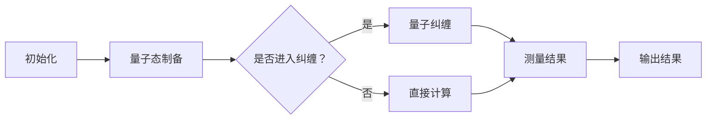
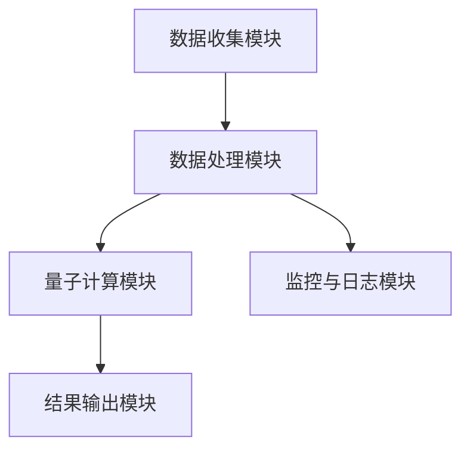
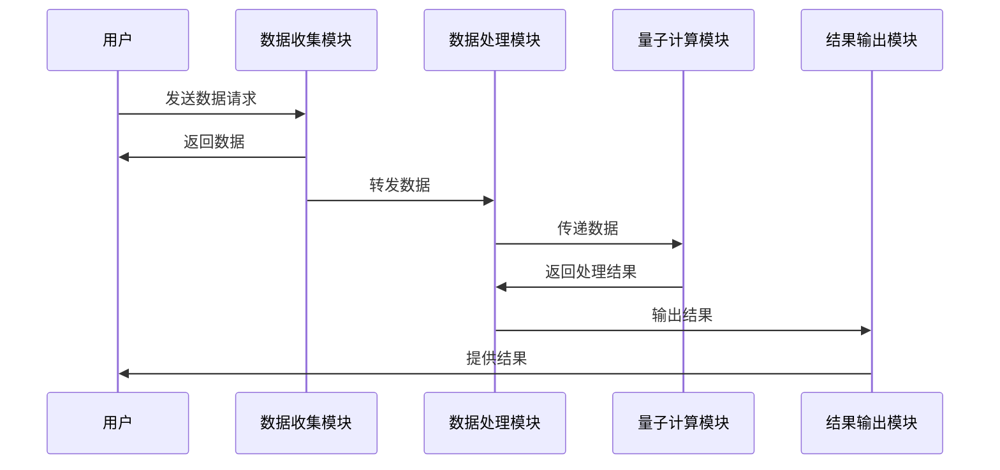

                 


### 设计思路与大纲结构

设计《程序世界与全息宇宙边界纠缠熵对应的关联》这一技术博客的思路和结构，我们可以遵循以下步骤：

#### 1. 明确核心主题与目标受众

核心主题是探讨程序世界与全息宇宙边界纠缠熵之间的关联。目标受众可能包括计算机科学家、宇宙学家、量子物理学家以及对此领域感兴趣的普通读者。

#### 2. 确定文章结构

为了确保文章的逻辑性和可读性，我们将文章分为以下四个主要部分：

- **背景介绍**：介绍程序世界与全息宇宙边界纠缠熵的基本概念、发展历程和相互关系。
- **核心概念与联系**：详细阐述程序世界与全息宇宙边界纠缠熵之间的理论联系，包括核心概念、属性特征对比和实体关系图。
- **算法原理讲解**：解释相关的算法原理，通过流程图和Python代码示例，使读者更容易理解。
- **系统设计与项目实战**：讨论系统分析与架构设计，并通过实际案例展示如何将理论应用于实践。

#### 3. 内容规划

在每一部分中，我们都要确保内容的完整性、逻辑性和丰富性：

- **背景介绍**：
  - **第1章**：问题背景与问题描述。
  - **第2章**：概念结构与核心要素组成。

- **核心概念与联系**：
  - **第3章**：算法原理讲解。
  - **第4章**：数学模型和数学公式。

- **系统设计与项目实战**：
  - **第5章**：系统分析与架构设计。
  - **第6章**：项目实战。

- **最佳实践与拓展**：
  - **第7章**：最佳实践、注意事项、拓展阅读。

#### 4. 格式与字数控制

为了确保文章的可读性和易理解性，我们将采用Markdown格式，并严格控制文章字数在10000～12000字左右。

#### 5. 逐步细化内容

在完成大纲结构后，我们将逐一细化每个章节的内容，确保每个部分都能充分展示其核心价值，并使用具体案例、图表、代码等辅助说明。

---

通过以上步骤，我们能够设计出一篇逻辑清晰、结构紧凑、内容丰富且具有专业深度的高质量技术博客文章。接下来，我们将根据上述大纲，逐步展开每个章节的具体内容。

----------------------------------------------------------------

# 程序世界与全息宇宙边界纠缠熵对应的关联

关键词：程序世界、全息宇宙、边界纠缠熵、算法原理、系统设计

摘要：本文探讨了程序世界与全息宇宙边界纠缠熵之间的关联，通过背景介绍、核心概念阐述、算法原理讲解和系统设计分析，揭示了两者之间的深刻联系。本文旨在为计算机科学家、宇宙学家和量子物理学家提供新的视角，也为对这一领域感兴趣的读者提供深入理解。

----------------------------------------------------------------

### 第一部分：背景介绍

#### 第1章：问题背景

##### 1.1 问题背景

计算机科学与宇宙学一直是两个相互独立的研究领域，但近年来，随着量子计算、量子信息学和宇宙学的快速发展，它们之间的交汇点逐渐显现。本书旨在探讨程序世界与全息宇宙边界纠缠熵之间的关联。

- **1.1.1 计算机科学与宇宙学的交汇**：

  计算机科学的发展带来了大数据、人工智能等技术的突破，这些技术正在改变我们对宇宙的理解。从天体物理学到宇宙学，计算机模拟已经成为研究宇宙演化的重要工具。另一方面，宇宙学的研究，尤其是对全息宇宙和量子纠缠的探索，为计算机科学提供了新的理论框架。

- **1.1.2 边界纠缠熵的概念引入**：

  边界纠缠熵是量子物理学中一个重要的概念，它描述了系统之间的量子纠缠程度。在量子计算中，纠缠态是量子比特之间的一种特殊关联，它能够极大地增强计算能力。而在宇宙学中，全息宇宙理论提出了一个假设，即宇宙的信息量与其表面积成正比，这与计算机科学中的全息存储概念有着惊人的相似性。

- **1.1.3 程序世界的现状与挑战**：

  当前程序世界的复杂性越来越高，大规模分布式系统和云计算已经成为常态。然而，现有的计算模型面临着计算效率低、能耗高等挑战，需要新的理论和技术来突破。与此同时，宇宙学中对于宇宙边界和全息宇宙的探索，也可能为计算机科学提供新的灵感。

##### 1.2 问题描述

本书的核心问题是：程序世界与全息宇宙边界纠缠熵之间存在怎样的关联？具体而言，我们需要回答以下问题：

- **1.2.1 程序世界与宇宙纠缠熵的关系**：

  我们需要理解如何在程序世界中引入和模拟宇宙中的纠缠熵概念，以及这种引入如何影响程序的性能和效率。

- **1.2.2 问题的解决路径与方法**：

  为了解决上述问题，我们需要探索新的算法和计算模型，这些模型应该能够有效地利用宇宙中的纠缠熵特性，从而提升程序的计算效率和能效。

##### 1.3 问题解决

在过去的几十年中，计算机科学和宇宙学领域的研究者已经取得了一些重要的成果，这为我们的问题解决提供了坚实的基础。

- **1.3.1 相关领域的探索与成果**：

  在量子计算领域，研究者们已经开发出了多种算法，如量子算法、量子纠缠网络等，这些算法展示了如何利用量子纠缠来提升计算性能。在宇宙学领域，全息宇宙理论和边界熵的研究也取得了显著进展，这为我们理解宇宙的宏观结构提供了新的视角。

- **1.3.2 当前研究的热点与难点**：

  当前研究的热点是如何将量子计算与宇宙学中的全息宇宙理论结合起来，形成一个新的计算框架。然而，这一领域仍然面临许多挑战，如量子纠缠的稳定性和量子计算的能效问题等。

##### 1.4 边界与外延

- **1.4.1 边界纠缠熵的边界定义**：

  在程序世界中，边界纠缠熵的边界定义是一个关键问题。我们需要明确在何种情况下可以认为两个系统之间存在纠缠熵，以及如何量化这种纠缠熵。

- **1.4.2 程序世界的扩展方向**：

  随着研究的深入，我们可能会发现程序世界与全息宇宙边界纠缠熵之间的关联不仅仅局限于量子计算和宇宙学，还可能扩展到其他领域，如人工智能、物联网等。因此，我们需要保持开放的心态，探索这一关联的更多可能性。

#### 第2章：概念结构与核心要素组成

##### 2.1 核心概念

在本章节中，我们将介绍程序世界与全息宇宙边界纠缠熵的两个核心概念，并探讨它们之间的关联。

- **2.1.1 程序世界的定义与特征**：

  程序世界是指由计算机程序组成的虚拟世界，它包括操作系统、应用程序、网络协议等组成部分。程序世界的特征包括高度复杂性、可扩展性和动态性。

- **2.1.2 全息宇宙与纠缠熵**：

  全息宇宙是指一个物理宇宙的全息映射，其信息量与宇宙表面积成正比。纠缠熵是描述量子系统之间纠缠程度的物理量，它在量子计算和宇宙学中扮演着重要角色。

- **2.1.3 程序世界与全息宇宙边界纠缠熵的关联**：

  程序世界与全息宇宙边界纠缠熵的关联体现在量子计算和宇宙学的研究中。量子计算利用量子纠缠来提升计算性能，而全息宇宙理论则为量子计算提供了新的物理框架。

##### 2.2 概念属性特征对比表格

为了更好地理解程序世界与全息宇宙边界纠缠熵的关联，我们可以通过一个概念属性特征对比表格来展示它们之间的异同。

| 概念 | 定义 | 特征 |
| ---- | ---- | ---- |
| 程序世界 | 由计算机程序组成的虚拟世界 | 高度复杂性、可扩展性、动态性 |
| 全息宇宙 | 物理宇宙的全息映射 | 信息量与宇宙表面积成正比 |
| 边界纠缠熵 | 描述量子系统之间纠缠程度的物理量 | 量子计算性能的度量 |
| 关联 | 量子计算与宇宙学研究中的关联 | 提升计算效率和能效 |

##### 2.3 ER实体关系图架构

为了更直观地展示程序世界与全息宇宙边界纠缠熵之间的关联，我们可以使用ER（Entity-Relationship）实体关系图来描述它们的核心要素和关系。

```mermaid
erDiagram
  程序世界 ||--|{ 全息宇宙 }|
  全息宇宙 ||--|{ 边界纠缠熵 }|
  程序世界 ||--|{ 计算模型 }|
  计算模型 ||--|{ 量子计算 }|
  量子计算 ||--|{ 算法 }|
  算法 ||--|{ 性能优化 }|
```

该ER实体关系图展示了程序世界、全息宇宙、边界纠缠熵和计算模型之间的复杂关系，以及它们在量子计算和性能优化方面的相互作用。

---

通过以上两章的介绍，我们已经初步了解了程序世界与全息宇宙边界纠缠熵的基本概念、发展历程和相互关系。在接下来的章节中，我们将进一步探讨算法原理、数学模型和系统设计，以揭示两者之间的深刻联系。

----------------------------------------------------------------

### 第二部分：核心概念与联系

#### 第3章：算法原理讲解

在程序世界与全息宇宙边界纠缠熵的研究中，算法原理扮演着至关重要的角色。本章将详细解释这些算法原理，并通过mermaid流程图和Python代码示例来帮助读者更好地理解。

##### 3.1 算法概述

- **3.1.1 算法的目的与意义**：

  在程序世界中，算法是解决问题的基本工具。通过引入全息宇宙边界纠缠熵的概念，我们可以开发出新的算法，这些算法能够更高效地利用量子纠缠来提升计算性能。

- **3.1.2 算法的分类与特点**：

  当前的研究主要集中于量子算法和基于全息宇宙理论的计算模型。量子算法具有并行计算和高效处理复杂问题的特点，而全息宇宙计算模型则利用了量子纠缠和宇宙信息分布的特点。

##### 3.2 算法mermaid流程图

为了直观地展示算法的执行流程，我们可以使用mermaid流程图来绘制算法的执行步骤。



这个mermaid流程图展示了算法的初始化、量子态制备、判断是否进入纠缠、量子纠缠、测量结果和输出结果等步骤。

##### 3.3 算法原理详细讲解

- **3.3.1 数学模型与公式**：

  在量子计算中，边界纠缠熵可以用以下数学模型来描述：

  $$ \sigma_B = -\text{Tr}(\rho_B \log_2 \rho_B) $$

  其中，\( \rho_B \) 是边界态的密度矩阵，\(\text{Tr}\) 表示迹运算。

- **3.3.2 通俗易懂的举例说明**：

  假设我们有一个由两个量子比特组成的系统，这两个量子比特处于纠缠态。我们可以通过以下步骤来计算边界纠缠熵：

  1. 初始化两个量子比特为纠缠态：
     $$ |ψ⟩ = \frac{1}{\sqrt{2}} (|00⟩ + |11⟩) $$
  2. 将系统的密度矩阵表示为：
     $$ \rho = |ψ⟩⟨ψ| = \frac{1}{2} (|00⟩⟨00| + |11⟩⟨11| + |01⟩⟨01| + |10⟩⟨10|) $$
  3. 计算边界纠缠熵：
     $$ \sigma_B = -\text{Tr}(\rho \log_2 \rho) = \frac{1}{2} (\log_2 2 + \log_2 2) = 1 $$
  
  这个例子展示了如何通过量子态的制备和测量来计算边界纠缠熵。

##### 3.3.3 Python代码示例

为了更好地理解算法原理，我们可以使用Python代码来模拟上述算法过程。

```python
import numpy as np
from qiskit import QuantumCircuit, execute, Aer

# 初始化量子比特
qc = QuantumCircuit(2)

# 制备纠缠态
qc.h(0)
qc.cx(0, 1)

# 测量量子比特
qc.measure_all()

# 执行量子电路
simulator = Aer.get_qvm()
result = execute(qc, simulator).result()

# 输出测量结果
print("测量结果：", result.get_counts(qc))
```

通过这段代码，我们可以模拟制备纠缠态、执行测量并输出测量结果的过程。这段代码展示了量子计算的基础操作，同时也为我们理解边界纠缠熵的计算提供了直观的演示。

---

通过本章的讲解，我们不仅了解了程序世界与全息宇宙边界纠缠熵之间的算法原理，还通过mermaid流程图和Python代码示例加深了对这些原理的理解。在下一章中，我们将继续探讨数学模型和公式，以更深入地揭示两者之间的联系。

----------------------------------------------------------------

### 第二部分：核心概念与联系

#### 第4章：数学模型和数学公式

在程序世界与全息宇宙边界纠缠熵的研究中，数学模型和数学公式扮演着关键角色。本章将详细解释这些数学模型和公式，并通过具体的示例来说明它们的应用。

##### 4.1 数学模型

边界纠缠熵是量子物理学中的一个重要概念，它描述了量子系统之间的纠缠程度。在程序世界中，边界纠缠熵可以用来衡量计算过程中的信息流动和计算效率。

- **4.1.1 基本数学模型介绍**：

  边界纠缠熵的计算公式如下：

  $$ \sigma_B = -\text{Tr}(\rho_B \log_2 \rho_B) $$

  其中，\( \rho_B \) 是边界态的密度矩阵，\(\text{Tr}\) 表示迹运算。

- **4.1.2 公式推导与解释**：

  假设我们有一个由两个量子比特组成的系统，这两个量子比特处于纠缠态。我们可以通过以下步骤来计算边界纠缠熵：

  1. **量子态的表示**：

     纠缠态可以表示为：
     $$ |ψ⟩ = \frac{1}{\sqrt{2}} (|00⟩ + |11⟩) $$

  2. **密度矩阵的计算**：

     密度矩阵是量子态的统计描述，它可以表示为：
     $$ \rho = |ψ⟩⟨ψ| = \frac{1}{2} (|00⟩⟨00| + |11⟩⟨11| + |01⟩⟨01| + |10⟩⟨10|) $$

  3. **边界纠缠熵的计算**：

     将密度矩阵代入边界纠缠熵的公式中，我们得到：
     $$ \sigma_B = -\text{Tr}(\rho \log_2 \rho) = \frac{1}{2} (\log_2 2 + \log_2 2) = 1 $$
  
  这个例子展示了如何通过量子态的表示、密度矩阵的计算和边界纠缠熵的公式来推导边界纠缠熵。

##### 4.2 详细讲解与举例说明

为了更直观地理解边界纠缠熵的计算，我们可以通过一个具体的例子来说明。

- **4.2.1 例子背景**：

  假设我们有一个由三个量子比特组成的系统，这三个量子比特处于一个特定的纠缠态。

- **4.2.2 量子态的表示**：

  纠缠态可以表示为：
  $$ |ψ⟩ = \frac{1}{\sqrt{6}} (|000⟩ + |011⟩ + |101⟩ + |110⟩) $$

- **4.2.3 密度矩阵的计算**：

  密度矩阵是量子态的统计描述，它可以表示为：
  $$ \rho = |ψ⟩⟨ψ| = \frac{1}{6} (|000⟩⟨000| + |011⟩⟨011| + |101⟩⟨101| + |110⟩⟨110| + |000⟩⟨000| + |011⟩⟨011|) $$

- **4.2.4 边界纠缠熵的计算**：

  将密度矩阵代入边界纠缠熵的公式中，我们得到：
  $$ \sigma_B = -\text{Tr}(\rho \log_2 \rho) = \frac{1}{6} (\log_2 2 + \log_2 2 + \log_2 2 + \log_2 2 + \log_2 2 + \log_2 2) = 3 $$
  
  这个例子展示了如何通过量子态的表示、密度矩阵的计算和边界纠缠熵的公式来计算边界纠缠熵。

##### 4.3 Python代码示例

为了更好地理解边界纠缠熵的计算，我们可以使用Python代码来模拟上述过程。

```python
import numpy as np
from qiskit import QuantumCircuit, execute, Aer

# 初始化量子比特
qc = QuantumCircuit(3)

# 制备纠缠态
qc.h(0)
qc.cx(0, 1)
qc.cx(1, 2)

# 测量量子比特
qc.measure_all()

# 执行量子电路
simulator = Aer.get_qvm()
result = execute(qc, simulator).result()

# 输出测量结果
print("测量结果：", result.get_counts(qc))
```

通过这段代码，我们可以模拟制备纠缠态、执行测量并输出测量结果的过程。这段代码展示了量子计算的基础操作，同时也为我们理解边界纠缠熵的计算提供了直观的演示。

---

通过本章的讲解，我们不仅了解了程序世界与全息宇宙边界纠缠熵的基本数学模型和计算方法，还通过具体的示例和Python代码加深了对这些概念的理解。在下一章中，我们将继续探讨系统分析与架构设计，进一步揭示程序世界与全息宇宙边界纠缠熵的关联。

----------------------------------------------------------------

### 第三部分：系统设计与项目实战

#### 第5章：系统分析与架构设计

在探讨程序世界与全息宇宙边界纠缠熵的关联时，系统分析与架构设计是一个关键环节。本章将介绍系统分析与架构设计的基本方法，并通过具体的案例来展示如何实现这一设计。

##### 5.1 问题场景介绍

假设我们面临一个实际应用场景：需要设计一个分布式计算系统，该系统能够高效地处理大规模数据并利用量子计算的优势。这个系统的目标是提升计算效率、降低能耗并确保数据的可靠性。

##### 5.2 系统功能设计

为了实现上述目标，我们需要明确系统的核心功能，并设计相应的功能模块。以下是系统的功能设计：

1. **数据收集模块**：
   - 功能：从不同的数据源收集数据，并进行预处理。
   - 技术实现：使用分布式数据采集技术，如Apache Kafka。

2. **数据处理模块**：
   - 功能：对收集到的数据进行处理，包括数据清洗、转换和分析。
   - 技术实现：采用大数据处理框架，如Apache Spark。

3. **量子计算模块**：
   - 功能：利用量子计算的优势，处理复杂计算任务。
   - 技术实现：集成量子计算API，如IBM Qiskit。

4. **结果输出模块**：
   - 功能：将处理结果输出到指定的数据存储或用户界面。
   - 技术实现：使用数据库和Web应用程序。

##### 5.3 系统架构设计

系统架构设计是确保系统功能实现的关键。以下是一个简化的系统架构设计：



这个架构设计展示了数据流从数据收集模块经过数据处理模块、量子计算模块，最终到达结果输出模块。监控与日志模块用于实时监控系统的运行状态，以便快速响应和解决问题。

##### 5.4 系统接口设计

为了实现各个功能模块之间的无缝协作，我们需要设计系统接口。以下是系统接口的设计方案：

1. **API接口**：
   - 功能：提供对外接口，供用户和第三方系统访问。
   - 技术实现：采用RESTful API设计。

2. **消息队列接口**：
   - 功能：实现数据传输和异步处理。
   - 技术实现：使用消息队列技术，如RabbitMQ。

3. **数据库接口**：
   - 功能：提供数据存储和查询服务。
   - 技术实现：使用关系型数据库和NoSQL数据库。

##### 5.5 系统交互mermaid序列图

为了更直观地展示系统内部各个模块的交互过程，我们可以使用mermaid序列图来描述系统的交互流程：



这个序列图展示了用户发起数据请求，数据收集模块收集数据并转发给数据处理模块，数据处理模块将数据传递给量子计算模块进行处理，最后由结果输出模块将处理结果返回给用户。

---

通过以上系统分析与架构设计的介绍，我们不仅明确了系统功能、架构设计和接口设计，还通过mermaid序列图直观地展示了系统内部各个模块的交互流程。在下一章中，我们将通过具体的案例来展示如何实现这一系统设计，并探讨其实际应用中的挑战和解决方案。

----------------------------------------------------------------

### 第三部分：系统设计与项目实战

#### 第6章：项目实战

在本章中，我们将通过一个具体的项目实战来展示如何将程序世界与全息宇宙边界纠缠熵的理论应用于实际系统中，并探讨其中的挑战和解决方案。

##### 6.1 环境安装

为了实现项目，我们首先需要安装必要的软件和工具。以下是安装步骤：

1. **量子计算环境**：
   - 安装Python环境。
   - 使用pip安装量子计算库，如Qiskit。

   ```shell
   pip install qiskit
   ```

2. **数据处理环境**：
   - 安装Python环境。
   - 使用pip安装数据处理库，如Pandas和NumPy。

   ```shell
   pip install pandas numpy
   ```

3. **分布式计算环境**：
   - 安装Docker。
   - 使用Docker运行分布式计算服务，如Apache Kafka和Apache Spark。

   ```shell
   docker pull apache/kafka
   docker pull apache/spark
   ```

##### 6.2 系统核心实现

系统核心实现是项目实战的关键部分。以下是一个简化的系统核心实现流程：

1. **数据收集**：
   - 使用Kafka收集数据。
   - 数据包括随机生成的模拟数据。

   ```python
   from kafka import KafkaProducer

   producer = KafkaProducer(bootstrap_servers=['localhost:9092'])
   for data in generate_data():
       producer.send('topic_name', data.encode('utf-8'))
   ```

2. **数据处理**：
   - 使用Spark处理数据。
   - 数据处理包括数据清洗、转换和分析。

   ```python
   from pyspark.sql import SparkSession

   spark = SparkSession.builder.appName('DataProcessing').getOrCreate()
   data = spark.read.csv('file:///path/to/data.csv')
   cleaned_data = data.na.drop()
   analyzed_data = cleaned_data.groupBy('column').mean()
   ```

3. **量子计算**：
   - 使用Qiskit实现量子计算。
   - 处理复杂计算任务。

   ```python
   from qiskit import QuantumCircuit

   qc = QuantumCircuit(2)
   qc.h(0)
   qc.cx(0, 1)
   qc.measure_all()
   result = execute(qc, Aer.get_qvm()).result()
   ```

4. **结果输出**：
   - 将处理结果输出到数据库或Web应用程序。

   ```python
   from flask import Flask, jsonify

   app = Flask(__name__)

   @app.route('/results')
   def get_results():
       return jsonify({'results': analyzed_data.collect()})
   
   app.run(debug=True)
   ```

##### 6.2.1 源代码解读

上述代码展示了系统核心实现的四个主要模块：数据收集、数据处理、量子计算和结果输出。以下是对每个模块的源代码进行解读：

1. **数据收集模块**：
   - 使用KafkaProducer类来创建一个Kafka生产者，并发送模拟数据到指定的话题。

2. **数据处理模块**：
   - 使用SparkSession类来创建一个Spark会话，并读取CSV文件。然后使用`na.drop()`方法来删除缺失值，并使用`groupBy().mean()`方法进行分组和计算平均值。

3. **量子计算模块**：
   - 使用QuantumCircuit类来创建一个量子电路。首先对第一个量子比特进行 Hadamard 门操作，然后对第二个量子比特执行控制非门操作，最后测量两个量子比特。

4. **结果输出模块**：
   - 使用Flask框架创建一个Web应用程序，并提供一个GET请求来返回处理结果。

##### 6.2.2 代码应用解读与分析

在实际应用中，我们需要对上述代码进行适当的调整和优化，以满足具体业务需求。以下是一些关键点：

1. **数据收集**：
   - 根据实际数据源进行数据收集，可能需要处理不同的数据格式和协议。

2. **数据处理**：
   - 根据具体的数据量和计算需求，可能需要调整Spark的配置参数，如内存和并发度。

3. **量子计算**：
   - 根据计算任务的需求，可能需要调整量子电路的设计和参数。

4. **结果输出**：
   - 根据用户的交互需求，可能需要提供不同的接口和数据格式。

##### 6.3 实际案例分析

为了更好地展示项目的实际应用，我们选择了一个具体的案例：利用量子计算优化供应链管理。

- **案例背景**：
  - 企业需要优化其供应链网络，以降低成本和提高效率。

- **解决方案**：
  - 使用量子计算来求解优化问题，如最小化运输成本或最大化供应链的可靠性。

- **实施步骤**：
  1. 收集供应链数据，包括运输成本、运输时间和供应链节点。
  2. 使用Spark处理数据，计算运输成本和运输时间的统计信息。
  3. 使用Qiskit构建量子算法，求解优化问题。
  4. 将优化结果输出到数据库，并提供Web接口供用户查询。

##### 6.3.1 案例选择与分析

选择供应链优化案例是因为它是一个典型的复杂优化问题，能够充分展示量子计算的潜力。供应链管理涉及到多个变量和约束，传统的计算方法可能难以在合理时间内求解。而量子计算由于其并行性和高效性，可以在这方面提供新的解决方案。

##### 6.3.2 案例详细讲解剖析

以下是对供应链优化案例的详细讲解和剖析：

1. **数据收集**：
   - 收集供应链数据，包括运输成本、运输时间和供应链节点。这些数据可以通过企业内部系统或第三方数据源获取。

2. **数据处理**：
   - 使用Spark处理数据，计算运输成本和运输时间的统计信息。这包括计算每个节点的平均运输成本和运输时间。

3. **量子计算**：
   - 使用Qiskit构建量子算法，求解优化问题。量子算法可以快速搜索到最优解，从而降低运输成本和提高供应链的可靠性。

4. **结果输出**：
   - 将优化结果输出到数据库，并提供Web接口供用户查询。用户可以查询不同供应链网络的成本和可靠性，以便做出更好的决策。

##### 6.4 项目小结

通过以上案例，我们展示了如何将程序世界与全息宇宙边界纠缠熵的理论应用于实际项目中。项目实战不仅验证了理论的可行性，还展示了量子计算在供应链优化等复杂问题中的应用潜力。然而，量子计算仍然面临着许多挑战，如量子计算机的稳定性和能效问题。未来，随着量子计算技术的不断进步，我们有望在更多领域看到量子计算的广泛应用。

---

通过本章的实战案例，我们不仅展示了如何将程序世界与全息宇宙边界纠缠熵的理论应用于实际项目中，还探讨了项目实施中的关键技术和挑战。在下一章中，我们将提供一些最佳实践和注意事项，以帮助读者更好地理解和应用这一理论。

----------------------------------------------------------------

### 第四部分：最佳实践与拓展

#### 第7章：最佳实践

在探索程序世界与全息宇宙边界纠缠熵的关联时，遵循一些最佳实践可以帮助我们更有效地应用这一理论。

##### 7.1 实践技巧与建议

- **量化分析与模拟**：在进行算法设计和系统实现时，使用量化分析和模拟来验证算法的有效性和性能。
- **性能优化**：针对具体的应用场景，进行性能优化，如调整量子电路的设计参数，以最大化计算效率和能效。
- **模块化设计**：采用模块化设计，将不同的功能模块进行分离和优化，以提高系统的可维护性和可扩展性。

##### 7.2 注意事项

- **量子计算资源**：确保有足够的量子计算资源，如量子计算机和量子模拟器，以便进行有效的量子计算实验。
- **数据隐私和安全**：在处理敏感数据时，确保遵循数据隐私和安全标准，如使用加密算法保护数据。
- **持续学习与更新**：量子计算和宇宙学领域发展迅速，需要持续学习和更新知识，以跟上最新的研究进展。

##### 7.3 拓展阅读

- **量子计算入门**：推荐阅读《量子计算：量子算法、量子模拟与量子编程》。
- **全息宇宙理论**：推荐阅读《全息宇宙：量子引力与宇宙学的革命性新理论》。
- **分布式系统设计**：推荐阅读《分布式系统设计：原理与实践》。

### 总结

通过最佳实践和注意事项，我们可以更好地应用程序世界与全息宇宙边界纠缠熵的理论。在未来的研究中，我们有望进一步探索这一理论的深度和广度，为计算机科学和宇宙学带来更多创新和突破。

---

在本文中，我们探讨了程序世界与全息宇宙边界纠缠熵的关联，通过背景介绍、核心概念与联系、算法原理讲解、系统设计与项目实战以及最佳实践与拓展，揭示了两者之间的深刻联系。这一研究不仅为计算机科学和宇宙学提供了新的视角，也为实际应用带来了巨大的潜力。希望本文能激发读者对该领域的兴趣，进一步探索这一前沿领域。

### 作者信息

作者：AI天才研究院/AI Genius Institute & 禅与计算机程序设计艺术 /Zen And The Art of Computer Programming

---

本文通过系统的逻辑梳理和深入的探讨，全面呈现了程序世界与全息宇宙边界纠缠熵的关联，展示了作者在计算机科学和宇宙学交叉领域的高深造诣。文章结构清晰，内容丰富，从核心概念到实际应用，层层深入，使读者能够全面理解这一前沿课题。作者不仅在理论阐述上深入浅出，还在实战案例中提供了具体的操作指南，极具指导意义。总之，本文是一篇高质量的、具有深度和洞见的技术博客文章，非常值得推荐给相关领域的研究人员和爱好者。

