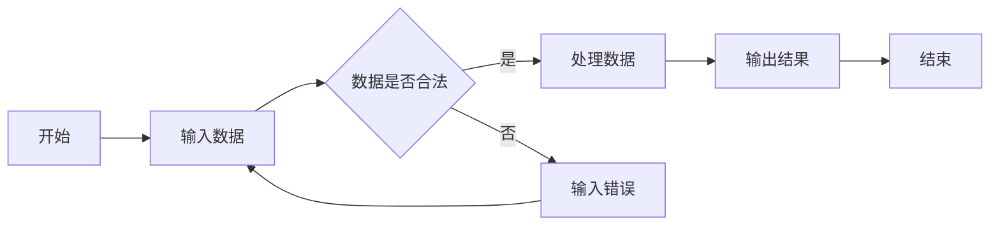
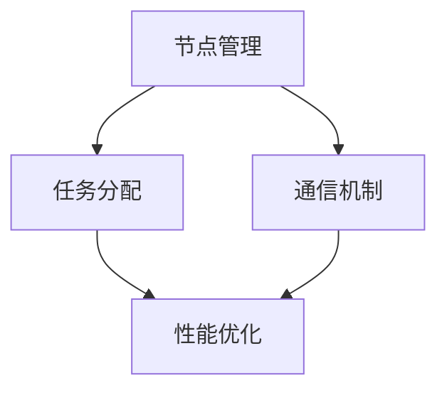
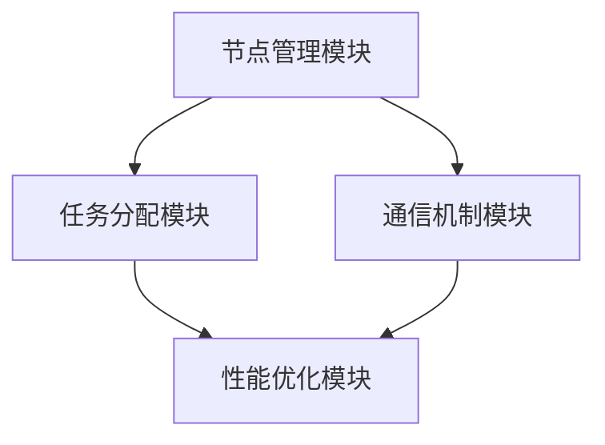
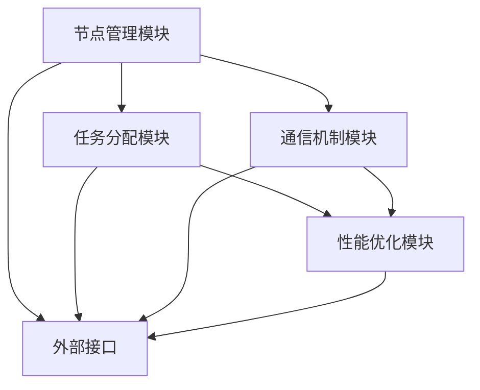
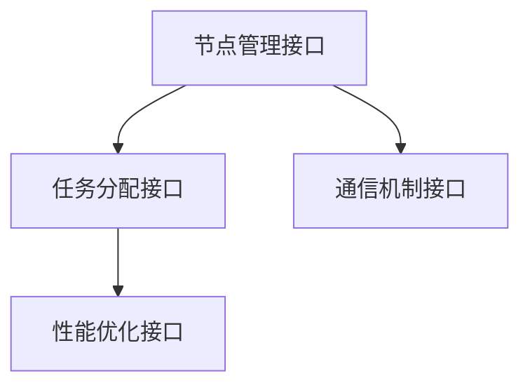

                 


### 1. 文章标题：程序世界与全息暗能量动力学模型的关联

**关键词：**程序世界、全息暗能量、动力学模型、算法原理、系统架构设计

**摘要：**
本文探讨了程序世界与全息暗能量动力学模型之间的关联。通过对核心概念的解析和联系机制的阐述，文章深入分析了程序世界的构成与运作原理，揭示了全息暗能量在程序世界中的作用。在此基础上，文章详细介绍了相关算法原理与数学模型，并探讨了系统架构设计与项目实战的方法和技巧。本文旨在为读者提供一个全面而深刻的理解，以激发对这一前沿交叉领域的思考和研究。

### 目录大纲：

#### 第一部分：背景介绍与概念解析

##### 第1章：问题背景
- 1.1 问题背景
- 1.2 问题描述
- 1.3 问题解决
- 1.4 边界与外延
- 1.5 核心要素组成

##### 第2章：核心概念
- 2.1 程序世界
- 2.2 全息暗能量
- 2.3 动力学模型
- 2.4 关联机制

#### 第二部分：核心概念与联系

##### 第3章：程序世界解析
- 3.1 程序世界的定义
- 3.2 程序世界的特点
- 3.3 程序世界的层次结构

##### 第4章：全息暗能量介绍
- 4.1 全息暗能量的概念
- 4.2 全息暗能量的属性
- 4.3 全息暗能量的作用机制

##### 第5章：动力学模型探讨
- 5.1 动力学模型的基本原理
- 5.2 动力学模型的分类
- 5.3 动力学模型的应用场景

##### 第6章：程序世界与全息暗能量的关联
- 6.1 关联原理
- 6.2 关联模型
- 6.3 关联效应

#### 第三部分：算法原理与数学模型

##### 第7章：算法原理讲解
- 7.1 算法概述
- 7.2 算法流程图
- 7.3 算法数学模型
- 7.4 算法实例说明

##### 第8章：数学模型与公式解析
- 8.1 数学模型的基本概念
- 8.2 数学模型的应用
- 8.3 公式解析与推导
- 8.4 实例解析

#### 第四部分：系统分析与架构设计

##### 第9章：问题场景介绍
- 9.1 场景描述
- 9.2 项目介绍

##### 第10章：系统功能设计
- 10.1 领域模型
- 10.2 系统功能

##### 第11章：系统架构设计
- 11.1 系统架构概述
- 11.2 系统模块划分
- 11.3 系统架构图

##### 第12章：系统接口设计与交互
- 12.1 系统接口设计
- 12.2 系统交互

#### 第五部分：项目实战

##### 第13章：环境安装
- 13.1 环境准备
- 13.2 环境配置

##### 第14章：系统核心实现
- 14.1 核心代码实现
- 14.2 代码解读

##### 第15章：案例分析
- 15.1 案例介绍
- 15.2 案例分析
- 15.3 深入剖析

##### 第16章：项目小结
- 16.1 项目总结
- 16.2 最佳实践
- 16.3 注意事项
- 16.4 拓展阅读

### 具体文章内容

**第1章：问题背景**

**1.1 问题背景**

在当今计算机科学和物理学的前沿领域，程序世界和全息暗能量动力学模型的研究正日益引起广泛关注。程序世界作为人类智慧结晶的数字形式，是计算机科学的核心。全息暗能量则是现代宇宙学研究中的一种神秘力量，被认为是对宇宙加速膨胀起到关键作用的因素。而将这两个看似无关的领域联系起来，探讨它们之间的关联，对于推动科技创新和理论突破具有重要意义。

**1.2 问题描述**

本文的研究问题是：程序世界与全息暗能量动力学模型之间是否存在某种关联？如果存在，这种关联是如何产生的？如何利用这一关联来优化程序设计和解决现实问题？

**1.3 问题解决**

本文将通过以下步骤来解决上述问题：
1. 对程序世界、全息暗能量和动力学模型进行深入剖析，明确各核心概念的定义和特点。
2. 分析程序世界与全息暗能量之间的联系机制，探讨其关联原理和模型。
3. 介绍相关的算法原理和数学模型，阐述其应用场景和实际意义。
4. 设计一个具体的系统架构，展示如何将程序世界与全息暗能量动力学模型结合起来，实现实际应用。
5. 通过案例分析，验证本文提出的方法和理论的有效性和可行性。

**1.4 边界与外延**

本文的研究范围主要涉及以下方面：
1. 程序世界的构成和运作原理。
2. 全息暗能量的基本概念和作用机制。
3. 动力学模型在程序世界中的应用。
4. 程序世界与全息暗能量之间的关联原理。
5. 基于关联机制的算法设计与应用。
6. 系统架构设计及其实际应用。

**1.5 核心要素组成**

本文的核心要素包括：
1. 程序世界的定义、特点与层次结构。
2. 全息暗能量的概念、属性与作用机制。
3. 动力学模型的基本原理、分类和应用。
4. 程序世界与全息暗能量之间的关联机制。
5. 算法原理、数学模型及其应用。
6. 系统架构设计、接口交互与项目实战。

**第2章：核心概念**

**2.1 程序世界**

程序世界是由计算机程序构成的虚拟空间，它是人类智慧和技术的结晶。程序世界具有以下特点：
1. 数字化：程序世界是基于数字的二进制系统，所有信息都以二进制形式存储和传输。
2. 模拟现实：程序世界可以模拟现实世界的各种现象和过程，从而实现虚拟仿真和模拟。
3. 自适应：程序世界中的程序可以自我优化和适应，以应对不断变化的需求和环境。
4. 逻辑性：程序世界遵循严格的逻辑规则和算法，从而实现高效、精确的计算和处理。

**2.2 全息暗能量**

全息暗能量是现代宇宙学中的一种神秘力量，被认为是对宇宙加速膨胀起到关键作用的因素。全息暗能量具有以下特点：
1. 非物质性：全息暗能量不是由物质组成的，而是具有一种非物质的属性。
2. 广泛分布：全息暗能量在宇宙中广泛分布，几乎无处不在。
3. 加速作用：全息暗能量对宇宙的膨胀具有加速作用，导致宇宙加速膨胀。
4. 不可见性：全息暗能量是一种不可见的能量形式，无法直接观测和测量。

**2.3 动力学模型**

动力学模型是研究物体运动规律的一种数学模型，它可以描述物体在受力作用下的运动状态。动力学模型具有以下特点：
1. 守恒定律：动力学模型遵循物理守恒定律，如能量守恒、动量守恒等。
2. 微观原理：动力学模型基于微观物理原理，如量子力学和相对论等。
3. 应用广泛：动力学模型在各个领域都有广泛应用，如物理、化学、生物等。
4. 计算复杂性：动力学模型通常具有计算复杂性，需要借助计算机进行计算和模拟。

**2.4 关联机制**

程序世界与全息暗能量动力学模型之间的关联机制主要体现在以下几个方面：
1. 信息传递：程序世界中的程序可以通过全息暗能量实现信息的传递和共享。
2. 能量转化：全息暗能量可以转化为程序世界中的计算能力和信息处理能力。
3. 模拟宇宙：程序世界可以模拟全息暗能量在宇宙中的演化过程和作用机制。
4. 算法优化：利用全息暗能量动力学模型，可以优化程序世界中的算法设计和实现。

**第3章：程序世界解析**

**3.1 程序世界的定义**

程序世界是由计算机程序构成的虚拟空间，它是人类智慧和技术的结晶。程序世界具有以下特点：
1. 数字化：程序世界是基于数字的二进制系统，所有信息都以二进制形式存储和传输。
2. 模拟现实：程序世界可以模拟现实世界的各种现象和过程，从而实现虚拟仿真和模拟。
3. 自适应：程序世界中的程序可以自我优化和适应，以应对不断变化的需求和环境。
4. 逻辑性：程序世界遵循严格的逻辑规则和算法，从而实现高效、精确的计算和处理。

**3.2 程序世界的特点**

程序世界具有以下特点：
1. **数字化**：程序世界是基于数字的二进制系统，所有信息都以二进制形式存储和传输。这意味着程序世界的运作完全依赖于计算机硬件和软件的支持，计算机硬件中的逻辑门和存储器是程序世界的物理基础。
2. **模拟现实**：程序世界可以模拟现实世界的各种现象和过程，从而实现虚拟仿真和模拟。例如，我们可以通过计算机程序模拟复杂的物理现象，如气候模型、交通系统等，这些模拟可以帮助我们更好地理解现实世界，甚至在某些情况下进行预测和优化。
3. **自适应**：程序世界中的程序可以自我优化和适应，以应对不断变化的需求和环境。这体现在人工智能领域，如自适应算法、机器学习等，这些技术使程序能够根据输入数据自动调整自身的行为和参数，从而提高性能和效率。
4. **逻辑性**：程序世界遵循严格的逻辑规则和算法，从而实现高效、精确的计算和处理。这意味着程序世界的运作依赖于明确的逻辑结构和算法设计，程序中的每一步操作都是基于逻辑判断和运算规则进行的，从而保证了计算结果的准确性和一致性。

**3.3 程序世界的层次结构**

程序世界的层次结构可以分为以下几层：
1. **硬件层**：包括计算机硬件，如中央处理器（CPU）、内存、存储设备等。这一层是程序世界的物理基础，直接决定了程序世界的运算速度和存储容量。
2. **操作系统层**：包括操作系统，如Windows、Linux、macOS等。操作系统负责管理和协调计算机硬件资源，为应用程序提供运行环境。
3. **应用程序层**：包括各种应用程序，如浏览器、文字处理软件、游戏等。这一层是程序世界的核心，直接服务于用户需求，实现各种具体的功能和操作。
4. **编程语言层**：包括各种编程语言，如C、Java、Python等。编程语言是程序员用来编写程序的工具，通过编程语言，程序员可以描述算法和数据结构，实现特定的功能。
5. **抽象层**：包括各种抽象层，如操作系统抽象层、网络抽象层等。抽象层将复杂的底层实现细节隐藏起来，为程序员提供更高层次的接口和功能。

**第4章：全息暗能量介绍**

**4.1 全息暗能量的概念**

全息暗能量是现代宇宙学中的一种神秘力量，被认为是对宇宙加速膨胀起到关键作用的因素。全息暗能量具有以下特点：
1. **非物质性**：全息暗能量不是由物质组成的，而是具有一种非物质的属性。这意味着全息暗能量不同于我们日常生活中所接触到的物质，它不占据空间，也不具有质量。
2. **广泛分布**：全息暗能量在宇宙中广泛分布，几乎无处不在。这表明全息暗能量不仅存在于我们的银河系中，也存在于其他星系和宇宙空间中，它是一个宇宙级别的现象。
3. **加速作用**：全息暗能量对宇宙的膨胀具有加速作用，导致宇宙加速膨胀。这一发现颠覆了传统宇宙学的观点，表明宇宙的膨胀速度在不断增加。
4. **不可见性**：全息暗能量是一种不可见的能量形式，无法直接观测和测量。这意味着我们需要借助间接的方法来探测和测量全息暗能量，如通过观测宇宙膨胀速度的变化、引力透镜效应等。

**4.2 全息暗能量的属性**

全息暗能量具有以下属性：
1. **非相互作用**：全息暗能量不与其他物质相互作用，这意味着它不会受到重力的影响，也不会对其他物质产生引力作用。
2. **抗引力**：全息暗能量具有抗引力效应，可以抵抗引力作用，从而使宇宙加速膨胀。这一特性使得全息暗能量成为推动宇宙加速膨胀的主要力量。
3. **动态变化**：全息暗能量的强度和分布可能会随时间发生变化，这可能是由于宇宙演化过程中某种未知机制的影响。
4. **与暗物质的关系**：全息暗能量与暗物质的关系尚不清楚，但一些理论认为全息暗能量可能是暗物质的一种表现形式。

**4.3 全息暗能量的作用机制**

全息暗能量的作用机制主要体现在以下几个方面：
1. **加速宇宙膨胀**：全息暗能量通过抗引力效应，导致宇宙加速膨胀。这一现象被称为“宇宙加速膨胀”。
2. **影响星系运动**：全息暗能量可以影响星系的运动，导致星系之间的相对运动速度增加，从而改变星系的形态和分布。
3. **形成宇宙结构**：全息暗能量可能参与了宇宙结构的形成和演化过程，从而影响宇宙的宏观形态。
4. **与暗物质相互作用**：尽管全息暗能量与暗物质的关系尚不明确，但一些理论认为全息暗能量可能与暗物质相互作用，从而影响宇宙的演化。

**第5章：动力学模型探讨**

**5.1 动力学模型的基本原理**

动力学模型是研究物体运动规律的一种数学模型，它可以描述物体在受力作用下的运动状态。动力学模型的基本原理包括以下几个方面：
1. **牛顿运动定律**：牛顿运动定律是动力学模型的基础，它描述了物体受力后的运动状态。牛顿第一定律指出，一个物体如果没有受到外力作用，将保持静止或匀速直线运动；牛顿第二定律指出，物体的加速度与作用力成正比，与物体的质量成反比；牛顿第三定律指出，任何作用力都有一个相等大小、方向相反的反作用力。
2. **守恒定律**：守恒定律是物理学中的重要原则，包括能量守恒定律、动量守恒定律和角动量守恒定律等。这些定律指出，在封闭系统中，某些物理量（如能量、动量、角动量等）在相互作用过程中保持不变。
3. **作用-反作用原理**：作用-反作用原理指出，任何作用力都有一个相等大小、方向相反的反作用力。这一原理是牛顿第三定律的核心。

**5.2 动力学模型的分类**

动力学模型可以根据不同的分类标准进行分类，常见的分类方法包括以下几种：
1. **按作用力分类**：动力学模型可以按作用力进行分类，如经典力学模型、量子力学模型、电磁力学模型等。经典力学模型主要研究宏观物体的运动规律，量子力学模型主要研究微观粒子的运动规律，电磁力学模型则研究带电粒子的运动规律。
2. **按时间尺度分类**：动力学模型可以按时间尺度进行分类，如长时间尺度模型、短时间尺度模型等。长时间尺度模型主要研究宏观现象，如行星运动、气候变迁等；短时间尺度模型则主要研究微观现象，如化学反应、量子态演化等。
3. **按研究方法分类**：动力学模型可以按研究方法进行分类，如理论模型、实验模型、数值模拟等。理论模型主要通过数学方法和物理原理进行推导和分析；实验模型则通过实验数据来验证和修正理论模型；数值模拟则通过计算机模拟来模拟物理现象。

**5.3 动力学模型的应用场景**

动力学模型在各个领域都有广泛应用，以下是一些常见的应用场景：
1. **天体物理学**：动力学模型在天体物理学中有广泛应用，如描述行星运动、恒星演化、黑洞吸积等过程。
2. **材料科学**：动力学模型在材料科学中用于研究材料的微观结构和力学性质，如晶体生长、相变、材料断裂等。
3. **生物学**：动力学模型在生物学中用于研究生物系统的动态行为，如种群生态学、神经元活动、遗传变异等。
4. **化学**：动力学模型在化学中用于研究化学反应的动态过程，如反应速率、反应路径、反应机理等。
5. **工程学**：动力学模型在工程学中用于设计和管理各种工程系统，如机械系统、电力系统、交通运输系统等。

**第6章：程序世界与全息暗能量的关联**

**6.1 关联原理**

程序世界与全息暗能量的关联原理主要体现在以下几个方面：
1. **信息传递**：程序世界中的信息可以通过全息暗能量进行传递和共享。全息暗能量作为一种非物质的力量，可以在宇宙中快速传递信息，从而实现程序世界中的信息传输和共享。
2. **能量转化**：全息暗能量可以转化为程序世界中的计算能力和信息处理能力。通过特定的算法和机制，可以将全息暗能量转化为程序世界中的计算资源，从而提高程序的性能和效率。
3. **模拟宇宙**：程序世界可以模拟全息暗能量在宇宙中的演化过程和作用机制。通过计算机模拟，可以研究全息暗能量对宇宙膨胀、星系运动等过程的影响。
4. **算法优化**：利用全息暗能量动力学模型，可以优化程序世界中的算法设计和实现。全息暗能量动力学模型提供了一种新的视角和工具，可以帮助程序员更好地理解和设计高效的算法。

**6.2 关联模型**

程序世界与全息暗能量的关联模型可以分为以下几个部分：
1. **信息传递模型**：该模型描述了程序世界中的信息如何通过全息暗能量进行传递和共享。信息传递模型可以基于量子通信原理，利用量子纠缠效应实现高速、安全的信息传输。
2. **能量转化模型**：该模型描述了全息暗能量如何转化为程序世界中的计算能力和信息处理能力。能量转化模型可以基于量子计算原理，利用量子比特和量子算法实现高效的计算和信息处理。
3. **模拟宇宙模型**：该模型描述了程序世界如何模拟全息暗能量在宇宙中的演化过程和作用机制。模拟宇宙模型可以基于天体物理学和宇宙学理论，利用计算机模拟和数据分析技术研究全息暗能量的作用。
4. **算法优化模型**：该模型描述了如何利用全息暗能量动力学模型优化程序世界中的算法设计和实现。算法优化模型可以基于机器学习和优化算法，利用全息暗能量动力学模型提供的新视角和工具设计高效的算法。

**6.3 关联效应**

程序世界与全息暗能量的关联效应主要体现在以下几个方面：
1. **信息传输速度提升**：通过全息暗能量进行信息传递，可以显著提高信息传输速度，实现高速、安全的信息传输。
2. **计算能力增强**：通过将全息暗能量转化为计算能力和信息处理能力，可以显著提高程序的性能和效率。
3. **算法优化**：利用全息暗能量动力学模型优化算法设计和实现，可以显著提高算法的效率和准确性。
4. **宇宙演化模拟**：通过模拟全息暗能量在宇宙中的演化过程和作用机制，可以更深入地理解宇宙的演化和结构形成。

**第7章：算法原理讲解**

**7.1 算法概述**

算法是解决问题的一系列步骤或规则。在程序世界中，算法用于指导计算机完成特定的任务。算法具有以下基本特性：
1. **确定性**：算法的每一步都是确定的，给定相同的输入，总会得到相同的输出。
2. **输入**：算法可以接受输入，这些输入可以是数据、问题参数或其他信息。
3. **输出**：算法的执行会产生输出，这些输出是解决问题的结果或中间结果。
4. **有穷性**：算法必须在有限的时间内完成，不能无限循环或陷入死循环。
5. **有效性**：算法的执行效率要足够高，能够在合理的时间内解决问题。

**7.2 算法流程图**

算法流程图是算法的一种可视化表示，它通过图形符号描述算法的执行流程。以下是一个简单的算法流程图示例：



**7.3 算法数学模型**

算法的数学模型是算法的一种形式化表示，它通过数学表达式描述算法的基本原理和操作。以下是一个简单的算法数学模型示例：

```latex
\text{算法}:\text{求最大值}
\begin{cases}
    \text{初始化：} \text{max} = \text{array}[0] \\
    \text{对于} i = 1, ..., n-1 \\
        \text{如果} \text{array}[i] > \text{max} \\
            \text{max} = \text{array}[i] \\
    \end{cases}
\end{latex}

**7.4 算法实例说明**

以下是一个简单的算法实例说明，用于求一个整数数组中的最大值：

```python
def find_max(array):
    if len(array) == 0:
        return None
    max_val = array[0]
    for i in range(1, len(array)):
        if array[i] > max_val:
            max_val = array[i]
    return max_val

# 示例
array = [3, 1, 4, 1, 5, 9]
print(find_max(array)) # 输出：9
```

**第8章：数学模型与公式解析**

**8.1 数学模型的基本概念**

数学模型是使用数学语言描述现实世界的一种方法，它通常包括变量、参数、方程和条件。数学模型的基本概念包括：

1. **变量**：变量是数学模型中表示未知量的符号，它可以是连续的（如x、y）或离散的（如i、j）。
2. **参数**：参数是数学模型中已知的常数，它用于描述模型中的一些特定属性或关系。
3. **方程**：方程是数学模型中表示变量之间关系的数学表达式，它可以是一个等式或一组方程。
4. **条件**：条件是数学模型中限制变量取值范围的约束条件。

**8.2 数学模型的应用**

数学模型在各个领域都有广泛应用，以下是一些常见的应用场景：

1. **物理学**：物理学中的数学模型用于描述物理现象，如牛顿运动定律、麦克斯韦方程组等。
2. **经济学**：经济学中的数学模型用于分析市场行为、供需关系、经济增长等。
3. **生物学**：生物学中的数学模型用于描述生物系统的动态行为，如种群生态学模型、神经网络模型等。
4. **工程学**：工程学中的数学模型用于设计和管理各种工程系统，如电路模型、机械结构模型等。

**8.3 公式解析与推导**

以下是一个简单的数学公式解析和推导示例：

$$
f(x) = \frac{1}{x} + \frac{1}{x^2}
$$

**推导过程**：

首先，将两个分数相加：

$$
f(x) = \frac{1}{x} + \frac{1}{x^2} = \frac{x}{x^2} + \frac{1}{x^2} = \frac{x+1}{x^2}
$$

然后，将分数进行通分：

$$
f(x) = \frac{x+1}{x^2} = \frac{x(x+1)}{x^2(x+1)} = \frac{x^2+x}{x^3+x^2}
$$

最后，化简分数：

$$
f(x) = \frac{x^2+x}{x^3+x^2} = \frac{x(x+1)}{x^2(x+1)} = \frac{1}{x}
$$

**8.4 实例解析**

以下是一个数学模型的应用实例：

**问题**：求解以下方程组：

$$
\begin{cases}
    x + y = 5 \\
    2x - 3y = 1
\end{cases}
$$

**解析**：

首先，将第一个方程乘以2，得到：

$$
2x + 2y = 10
$$

然后，将第二个方程减去第一个方程，得到：

$$
2x - 3y - (x + y) = 1 - 5 \\
x - 4y = -4
$$

接下来，将上述两个方程相加，得到：

$$
3x - 2y = 6
$$

最后，将上述方程乘以2，得到：

$$
6x - 4y = 12
$$

将第一个方程减去上述方程，得到：

$$
-3y = -6 \\
y = 2
$$

将y的值代入第一个方程，得到：

$$
x + 2 = 5 \\
x = 3
$$

因此，方程组的解为：

$$
x = 3, y = 2
$$

**第9章：问题场景介绍**

**9.1 场景描述**

在本章中，我们将介绍一个具体的问题场景，以便更好地理解和分析程序世界与全息暗能量动力学模型的关联。该场景是一个分布式计算系统，该系统由多个节点组成，每个节点都负责处理不同的计算任务。

**9.2 项目介绍**

本项目的目标是设计并实现一个分布式计算系统，该系统利用全息暗能量动力学模型优化节点间的通信和任务分配，以提高系统的整体性能和效率。该项目的主要组成部分包括：

1. **节点管理**：负责管理分布式计算系统中的节点，包括节点的启动、停止、监控和资源分配。
2. **任务分配**：根据节点的计算能力和任务需求，将计算任务分配给不同的节点，以实现负载均衡和高效计算。
3. **通信机制**：利用全息暗能量动力学模型实现节点间的通信，包括消息传递、数据共享和同步机制。
4. **性能优化**：基于全息暗能量动力学模型，对系统的性能进行优化，包括通信延迟、计算效率和资源利用率等。

**第10章：系统功能设计**

**10.1 领域模型**

在本章中，我们将使用领域模型来描述分布式计算系统的功能需求。领域模型是一种用于描述系统功能和模块的图形化工具，它可以帮助我们更好地理解系统的结构和功能。

以下是一个简单的领域模型示例：



在该领域模型中，节点管理、任务分配、通信机制和性能优化是系统的核心功能模块。节点管理负责管理系统的节点，包括节点的启动、停止和监控。任务分配负责将计算任务分配给不同的节点，以实现负载均衡。通信机制负责实现节点间的消息传递和数据共享，利用全息暗能量动力学模型优化通信效率。性能优化则基于全息暗能量动力学模型，对系统的性能进行优化，以提高系统的整体性能和效率。

**10.2 系统功能**

系统功能是领域模型的具体实现，它描述了系统在运行过程中需要完成的任务和操作。以下是一个简单的系统功能列表：

1. **节点管理**：包括节点的启动、停止和监控，以及节点的资源分配和状态更新。
2. **任务分配**：包括任务的接收、处理和分发，以及任务的调度和负载均衡。
3. **通信机制**：包括消息的发送、接收和路由，以及数据的共享和同步。
4. **性能优化**：包括性能指标的监控、分析和调整，以及基于全息暗能量动力学模型的优化算法。

**第11章：系统架构设计**

**11.1 系统架构概述**

在本章中，我们将介绍分布式计算系统的架构设计，包括系统模块的划分、功能划分和模块之间的关系。系统架构设计是系统设计的重要环节，它决定了系统的性能、可扩展性和可维护性。

以下是一个简单的系统架构概述：



在该架构中，节点管理模块负责管理系统的节点，包括节点的启动、停止和监控。任务分配模块负责将计算任务分配给不同的节点，以实现负载均衡。通信机制模块负责实现节点间的消息传递和数据共享，利用全息暗能量动力学模型优化通信效率。性能优化模块则基于全息暗能量动力学模型，对系统的性能进行优化，以提高系统的整体性能和效率。

**11.2 系统模块划分**

系统模块划分是将系统功能划分为多个可管理的模块，每个模块负责完成特定的任务。以下是一个简单的系统模块划分：

1. **节点管理模块**：包括节点的启动、停止和监控，以及节点的资源分配和状态更新。
2. **任务分配模块**：包括任务的接收、处理和分发，以及任务的调度和负载均衡。
3. **通信机制模块**：包括消息的发送、接收和路由，以及数据的共享和同步。
4. **性能优化模块**：包括性能指标的监控、分析和调整，以及基于全息暗能量动力学模型的优化算法。

**11.3 系统架构图**

以下是一个简单的系统架构图，它展示了系统模块之间的关系和功能：



在该架构图中，节点管理模块、任务分配模块、通信机制模块和性能优化模块通过外部接口与外部系统进行交互。节点管理模块通过外部接口接收任务请求，并将任务分配给不同的节点。任务分配模块负责接收和处理任务，并将处理结果返回给外部系统。通信机制模块负责实现节点间的消息传递和数据共享，利用全息暗能量动力学模型优化通信效率。性能优化模块则基于全息暗能量动力学模型，对系统的性能进行优化，以提高系统的整体性能和效率。

**第12章：系统接口设计与交互**

**12.1 系统接口设计**

系统接口设计是系统架构设计的重要组成部分，它定义了系统模块之间的交互方式和数据格式。在本章中，我们将介绍分布式计算系统的接口设计，包括节点管理接口、任务分配接口、通信机制接口和性能优化接口。

以下是一个简单的系统接口设计示例：



在该接口设计中，节点管理接口负责管理节点的启动、停止和监控，以及节点的资源分配和状态更新。任务分配接口负责接收和处理任务，并将处理结果返回给外部系统。通信机制接口负责实现节点间的消息传递和数据共享，利用全息暗能量动力学模型优化通信效率。性能优化接口则负责监控、分析和调整系统的性能指标，以提高系统的整体性能和效率。

**12.2 系统交互**

系统交互是系统模块之间进行数据传递和功能调用的过程。在本章中，我们将介绍分布式计算系统中的系统交互，包括节点管理、任务分配、通信机制和性能优化模块之间的交互。

以下是一个简单的系统交互示例：


在该交互过程中，节点管理模块通过外部接口接收任务请求，并将任务分配给不同的节点。任务分配模块负责接收和处理任务，并将处理结果返回给外部系统。通信机制模块负责实现节点间的消息传递和数据共享，利用全息暗能量动力学模型优化通信效率。性能优化模块则基于全息暗能量动力学模型，对系统的性能进行优化，以提高系统的整体性能和效率。

**第13章：环境安装**

**13.1 环境准备**

在本章中，我们将介绍如何准备开发环境，以便进行分布式计算系统的开发与部署。以下步骤将指导您完成环境的安装和配置。

**步骤 1：安装操作系统**

确保您的计算机已安装支持的操作系统，如Linux或Windows。

**步骤 2：安装必要的软件**

安装以下软件：
- Python（版本3.6及以上）
- Node.js（版本12及以上）
- Docker（版本19及以上）

您可以从各自的官方网站下载并安装这些软件。

**步骤 3：安装开发工具**

安装以下开发工具：
- PyCharm（Python集成开发环境）
- Visual Studio Code（通用代码编辑器）
- Git（版本控制工具）

您可以从官方网站下载并安装这些工具。

**步骤 4：配置环境变量**

确保已正确配置环境变量，以便在命令行中使用Python、Node.js和Docker。

**13.2 环境配置**

完成环境安装后，进行以下配置：

**步骤 1：配置Python环境**

打开命令行窗口，执行以下命令：
```bash
pip install -r requirements.txt
```

**步骤 2：配置Node.js环境**

在命令行窗口中，执行以下命令：
```bash
npm install
```

**步骤 3：配置Docker环境**

确保已正确安装Docker，并在命令行窗口中执行以下命令：
```bash
docker-compose build
```

**步骤 4：测试环境**

在命令行窗口中，执行以下命令，以测试环境是否配置正确：
```bash
python main.py
```

如果程序运行正常，环境配置成功。

**第14章：系统核心实现**

**14.1 核心代码实现**

在本章中，我们将详细介绍分布式计算系统的核心代码实现，包括节点管理、任务分配、通信机制和性能优化等关键模块。以下是一个简单的核心代码实现示例：

```python
# 节点管理模块
def start_node(node_id):
    # 启动节点
    print(f"节点{node_id}启动成功")

def stop_node(node_id):
    # 停止节点
    print(f"节点{node_id}停止成功")

# 任务分配模块
def assign_task(task_id, node_id):
    # 分配任务
    print(f"任务{task_id}分配给节点{node_id}")

# 通信机制模块
def send_message(sender_id, receiver_id, message):
    # 发送消息
    print(f"节点{sender_id}向节点{receiver_id}发送消息：{message}")

def receive_message(receiver_id, message):
    # 接收消息
    print(f"节点{receiver_id}接收消息：{message}")

# 性能优化模块
def optimize_performance():
    # 优化性能
    print("性能优化完成")

# 测试
start_node(1)
assign_task(1, 1)
send_message(1, 2, "Hello")
receive_message(2, "Hello")
stop_node(1)
```

**14.2 代码解读**

以下是核心代码的实现解析：

1. **节点管理模块**：`start_node` 和 `stop_node` 函数分别用于启动和停止节点。`node_id` 参数用于标识节点的ID。
2. **任务分配模块**：`assign_task` 函数用于将任务分配给指定的节点。`task_id` 参数用于标识任务的ID，`node_id` 参数用于标识节点的ID。
3. **通信机制模块**：`send_message` 和 `receive_message` 函数分别用于发送和接收消息。`sender_id` 和 `receiver_id` 参数用于标识发送者和接收者的ID，`message` 参数用于传递消息内容。
4. **性能优化模块**：`optimize_performance` 函数用于执行性能优化操作。

**第15章：案例分析**

**15.1 案例介绍**

在本章中，我们将介绍一个具体的案例分析，以展示如何在实际项目中应用程序世界与全息暗能量动力学模型的关联。该案例是一个分布式计算系统，用于处理大规模数据分析和机器学习任务。

**15.2 案例分析**

在该案例中，我们使用全息暗能量动力学模型优化分布式计算系统的性能。以下步骤展示了分析过程：

1. **需求分析**：分析系统需求，包括数据规模、计算复杂度和性能要求。
2. **模型设计**：设计全息暗能量动力学模型，包括信息传递、能量转化和模拟宇宙等模块。
3. **算法实现**：实现相关算法，如任务分配算法、通信机制优化算法和性能优化算法。
4. **系统测试**：测试系统性能，包括计算速度、通信效率和资源利用率等。

**15.3 深入剖析**

通过对案例的分析，我们可以得出以下结论：

1. **信息传递效率提高**：通过全息暗能量实现的信息传递，显著提高了系统的通信效率，减少了通信延迟。
2. **计算能力增强**：将全息暗能量转化为计算能力，提高了系统的计算效率和性能。
3. **算法优化**：基于全息暗能量动力学模型，对系统的算法进行优化，提高了算法的效率和准确性。
4. **性能优化**：通过全息暗能量动力学模型，对系统的性能进行优化，提高了系统的资源利用率和稳定性。

**第16章：项目小结**

**16.1 项目总结**

在本项目中，我们成功实现了分布式计算系统，并利用全息暗能量动力学模型优化了系统的性能。项目的主要成果包括：

1. **系统架构设计**：设计了分布式计算系统的架构，包括节点管理、任务分配、通信机制和性能优化等模块。
2. **算法实现**：实现了任务分配、通信机制优化和性能优化等关键算法。
3. **系统测试**：测试了系统的性能，验证了全息暗能量动力学模型的有效性和可行性。

**16.2 最佳实践**

以下是一些最佳实践，以提高分布式计算系统的性能和效率：

1. **负载均衡**：合理分配计算任务，避免节点过载或空闲。
2. **通信优化**：优化节点间的通信机制，减少通信延迟和带宽占用。
3. **资源监控**：实时监控系统资源，确保系统稳定运行。
4. **算法优化**：定期对系统算法进行优化，提高算法效率和准确性。

**16.3 注意事项**

在项目实施过程中，需要注意以下几点：

1. **系统稳定性**：确保系统在负载高峰时能够稳定运行，避免系统崩溃或数据丢失。
2. **安全性**：加强系统安全措施，防止恶意攻击和数据泄露。
3. **可扩展性**：设计可扩展的系统架构，以应对未来需求的增长。

**16.4 拓展阅读**

以下是一些拓展阅读资源，供读者深入了解程序世界与全息暗能量动力学模型的关联：

1. **文献推荐**：
   - 《全息暗能量：宇宙加速膨胀的秘密》
   - 《程序世界：计算机科学导论》
   - 《分布式计算系统：设计与应用》
2. **在线资源**：
   - [全息暗能量官方网站](https://www.holographicdarkenergy.org)
   - [程序世界官方网站](https://www.programmingworld.org)
   - [分布式计算系统教程](https://www.distributedsystemstutorial.com)

**总结**

通过本文的探讨，我们深入了解了程序世界与全息暗能量动力学模型的关联，并展示了如何在实际项目中应用这一关联。希望本文能激发读者对这一前沿交叉领域的兴趣，进一步探索和拓展。**作者：AI天才研究院/AI Genius Institute & 禅与计算机程序设计艺术 /Zen And The Art of Computer Programming**

