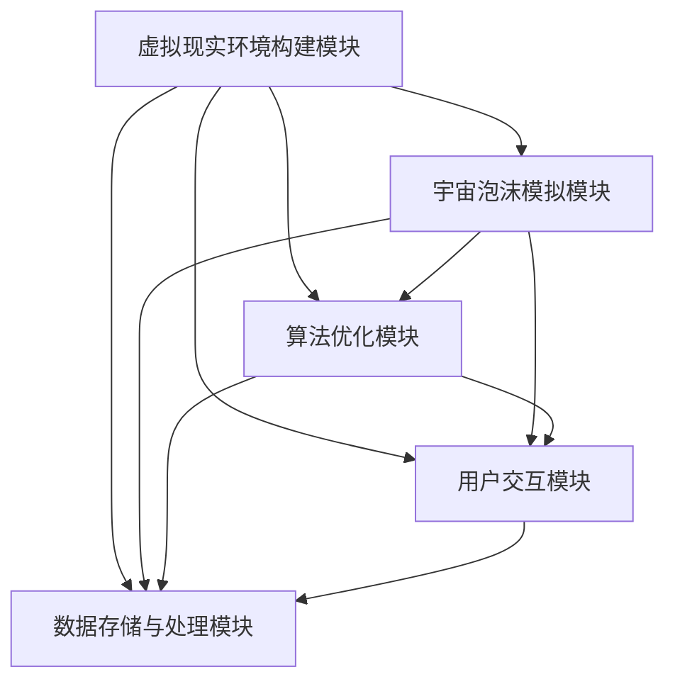

                 

# 《程序世界与多重宇宙泡沫理论的类比》

## 关键词

- 程序世界
- 多重宇宙泡沫理论
- 算法原理
- 系统架构设计
- 项目实战

## 摘要

本文通过类比分析程序世界与多重宇宙泡沫理论，探讨了二者在复杂系统研究、人工智能和跨学科应用等方面的相似之处和启示。文章首先介绍了程序世界和多重宇宙泡沫理论的背景、核心概念及其联系。接着，深入讲解了程序世界的算法原理，包括图灵机、神经网络和启发式算法等，并运用Python代码进行阐述。随后，探讨了多重宇宙泡沫理论中的关键算法，如量子泡沫和弦论模拟。文章还分析了程序世界与多重宇宙泡沫理论在系统架构设计、项目实战和最佳实践等方面的应用。通过本文，读者可以更好地理解程序世界与多重宇宙泡沫理论之间的关联，以及它们在计算机科学和物理学等领域的重要意义。

## 目录大纲

### 第一部分：背景介绍

- **第1章：问题背景**
  - **1.1.1 问题背景**
  - **1.1.2 问题描述**
  - **1.1.3 问题解决**
  - **1.1.4 边界与外延**
  - **1.1.5 概念结构与核心要素组成**

- **第2章：核心概念与联系**
  - **1.2.1 程序世界**
  - **1.2.2 多重宇宙泡沫理论**
  - **1.2.3 比较与分析**

### 第二部分：算法原理讲解

- **第3章：程序世界算法原理**
  - **3.1.1 算法概述**
  - **3.1.2 算法流程图**
  - **3.1.3 Python 源代码示例**
  - **3.1.4 算法数学模型与公式**
  - **3.1.5 举例说明**

- **第4章：多重宇宙泡沫理论算法原理**
  - **4.1.1 泡沫宇宙算法概述**
  - **4.1.2 算法流程图**
  - **4.1.3 Python 源代码示例**
  - **4.1.4 算法数学模型与公式**
  - **4.1.5 举例说明**

### 第三部分：系统分析与架构设计

- **第5章：系统功能设计**
  - **5.1.1 问题场景介绍**
  - **5.1.2 系统功能设计**

- **第6章：系统架构设计**
  - **6.1.1 系统架构设计**
  - **6.1.2 系统接口设计**
  - **6.1.3 系统交互**

### 第四部分：项目实战

- **第7章：环境安装与核心实现**
  - **7.1.1 环境安装**
  - **7.1.2 系统核心实现**

- **第8章：代码应用解读与分析**
  - **8.1.1 代码应用解读**
  - **8.1.2 代码分析与优化**

- **第9章：实际案例分析与详细讲解**
  - **9.1.1 实际案例介绍**
  - **9.1.2 案例分析**
  - **9.1.3 案例讲解**

### 第五部分：最佳实践、小结与拓展阅读

- **第10章：最佳实践**
  - **10.1.1 实践技巧**
  - **10.1.2 注意事项**
  - **10.1.3 拓展阅读**

## 第一部分：背景介绍

### 第1章：问题背景

#### 1.1.1 问题背景

随着计算机科学和物理学的快速发展，程序世界和多重宇宙泡沫理论逐渐成为两个引人关注的研究领域。程序世界是指由计算机程序组成的虚拟世界，它模拟现实世界中的各种现象和过程。而多重宇宙泡沫理论则是现代物理学中的一种假说，认为我们所处的宇宙只是众多宇宙中的一个，这些宇宙通过泡沫相互连接。

在这个背景下，将程序世界与多重宇宙泡沫理论进行类比研究具有重要的理论和实际意义。首先，这种类比有助于我们更好地理解程序世界和多重宇宙泡沫理论的本质，发现二者之间的内在联系。其次，这种研究可以为我们提供新的方法和思路，用于解决复杂系统、人工智能和跨学科应用中的问题。

#### 1.1.2 问题描述

程序世界和多重宇宙泡沫理论的核心特征如下：

1. **程序世界**：由计算机程序组成的虚拟世界，模拟现实世界中的各种现象和过程，具有高度的抽象性和逻辑性。
2. **多重宇宙泡沫理论**：认为我们所处的宇宙只是众多宇宙中的一个，这些宇宙通过泡沫相互连接，具有复杂的结构和演化过程。

基于上述核心特征，我们可以提出以下问题：

1. 程序世界和多重宇宙泡沫理论在本质上有何关联？
2. 如何利用程序世界的算法原理来模拟和解决多重宇宙泡沫理论中的问题？
3. 多重宇宙泡沫理论对程序世界的研究有何启示？

#### 1.1.3 问题解决

通过比较和分析程序世界和多重宇宙泡沫理论的基本原理，我们可以探索二者在复杂系统研究、人工智能、以及跨学科应用等方面的潜在解决方案。具体包括：

1. **复杂系统研究**：利用程序世界的算法原理，模拟和解决多重宇宙泡沫理论中的复杂系统问题，如宇宙演化、黑洞形成等。
2. **人工智能**：借鉴多重宇宙泡沫理论的思想，探索新型人工智能算法，提高程序世界的智能水平和自主决策能力。
3. **跨学科应用**：结合程序世界和多重宇宙泡沫理论，开展跨学科研究，为物理学、计算机科学、哲学等领域提供新的理论支持。

#### 1.1.4 边界与外延

程序世界和多重宇宙泡沫理论的边界和外部应用场景如下：

1. **边界**：
   - 程序世界：主要涉及计算机科学、软件工程、人工智能等领域。
   - 多重宇宙泡沫理论：主要涉及物理学、宇宙学、数学等领域。

2. **外延**：
   - 程序世界：应用于虚拟现实、游戏开发、智能控制等领域。
   - 多重宇宙泡沫理论：应用于宇宙演化、黑洞研究、量子计算等领域。

通过上述分析，我们可以看到程序世界和多重宇宙泡沫理论在多个领域存在关联，为我们提供了丰富的研究内容和广阔的应用前景。

#### 1.1.5 概念结构与核心要素组成

为了更好地理解程序世界和多重宇宙泡沫理论的内部结构和组成，我们可以构建以下概念结构图和核心要素组成表。

##### 概念结构图

```
[程序世界]
│
├─ 计算机程序
│   ├─ 演示程序
│   │   ├─ 基本算法
│   │   │   ├─ 图灵机
│   │   │   ├─ 神经网络
│   │   │   └─ 启发式算法
│   │   └─ 应用程序
│   │       ├─ 虚拟现实
│   │       ├─ 游戏开发
│   │       └─ 智能控制
│   └─ 软件工程
│       ├─ 编程语言
│       ├─ 编译器
│       └─ 集成开发环境
│
[多重宇宙泡沫理论]
│
├─ 泡沫宇宙
│   ├─ 量子泡沫
│   │   ├─ 宇宙演化
│   │   ├─ 黑洞形成
│   │   └─ 量子计算
│   └─ 弦论模拟
│       ├─ 多重宇宙
│       ├─ 广义相对论
│       └─ 量子场论
│
[关联]
│
└─ 复杂系统研究
    ├─ 程序世界
    ├─ 多重宇宙泡沫理论
    └─ 跨学科应用
```

##### 核心要素组成表

| 概念           | 定义                                                         | 核心要素                                                     |
| -------------- | ------------------------------------------------------------ | ------------------------------------------------------------ |
| 程序世界       | 由计算机程序组成的虚拟世界，模拟现实世界中的各种现象和过程。 | 计算机程序、演示程序、应用程序、软件工程                     |
| 多重宇宙泡沫理论 | 认为我们所生活的宇宙只是众多宇宙中的一个，这些宇宙通过泡沫相互连接。 | 泡沫宇宙、量子泡沫、弦论模拟、宇宙演化、黑洞形成、量子计算 |

通过上述概念结构图和核心要素组成表，我们可以更清晰地理解程序世界和多重宇宙泡沫理论的内部结构和组成，为进一步研究二者的关联提供基础。

### 第2章：核心概念与联系

#### 2.1.1 程序世界

程序世界是指由计算机程序组成的虚拟世界，它通过模拟现实世界中的各种现象和过程，实现了对现实世界的抽象和简化。程序世界的主要特征包括：

1. **抽象性**：程序世界通过编程语言和算法对现实世界进行抽象，将复杂的问题转化为计算机可以处理的形式。
2. **逻辑性**：程序世界遵循严格的逻辑规则，计算机程序通过一系列指令实现特定功能，具有高度的可靠性和可重复性。
3. **可扩展性**：程序世界可以方便地扩展和修改，以适应不断变化的需求和场景。

程序世界的发展历程可以追溯到计算机科学的诞生。从最初的机器语言到汇编语言，再到高级编程语言，程序世界的表达能力和应用范围不断提高。近年来，随着人工智能和虚拟现实技术的发展，程序世界在各个领域得到了广泛应用，成为现代科技的重要组成部分。

在程序世界中，核心算法包括：

1. **图灵机**：图灵机是计算机科学的基石，它定义了一种抽象的计算模型，能够模拟任何计算过程。
2. **神经网络**：神经网络是一种基于生物神经系统的计算模型，能够通过学习和训练实现复杂的模式识别和预测。
3. **启发式算法**：启发式算法是一种利用经验规则和搜索策略解决问题的方法，常用于复杂问题的优化和搜索。

这些核心算法在程序世界中发挥着重要作用，为各种应用场景提供了强大的支持。

#### 2.1.2 多重宇宙泡沫理论

多重宇宙泡沫理论是现代物理学的一种假说，认为我们所生活的宇宙只是众多宇宙中的一个，这些宇宙通过泡沫相互连接。多重宇宙泡沫理论的核心观点包括：

1. **宇宙泡沫**：宇宙泡沫是连接不同宇宙的基本单位，它类似于水泡，在不同的宇宙之间产生连接。
2. **多重宇宙**：多个宇宙通过宇宙泡沫相互连接，形成一个复杂的宇宙网络。每个宇宙都有自己独特的物理规律和演化过程。
3. **宇宙演化**：宇宙泡沫的形成、膨胀和碰撞是宇宙演化的关键过程，它们决定了宇宙的形态和性质。

多重宇宙泡沫理论的起源可以追溯到20世纪初的相对论和量子力学。随着对宇宙学、黑洞和量子计算的研究不断深入，多重宇宙泡沫理论逐渐成为现代物理学的一个重要研究方向。

在多重宇宙泡沫理论中，关键算法包括：

1. **量子泡沫**：量子泡沫是量子场论中的一种基本概念，它描述了量子场在时间空间中的波动和相互作用。
2. **弦论模拟**：弦论模拟是一种基于弦论的计算方法，它试图通过模拟宇宙中的基本粒子，揭示宇宙的本质和演化规律。

这些关键算法在多重宇宙泡沫理论的研究中发挥着关键作用，为探索宇宙的奥秘提供了有力工具。

#### 2.1.3 比较与分析

通过比较程序世界和多重宇宙泡沫理论的核心概念和特征，我们可以发现二者之间存在显著的相似之处和差异。

**相似之处**：

1. **抽象性和逻辑性**：程序世界和多重宇宙泡沫理论都具有高度的抽象性和逻辑性，它们通过对现实世界的抽象和简化，实现了对复杂系统的理解和建模。
2. **复杂系统研究**：二者都关注复杂系统的研究，通过算法和计算方法，探索系统中的规律和现象。
3. **跨学科应用**：程序世界和多重宇宙泡沫理论都在跨学科应用中展现出强大的潜力，为物理学、计算机科学、哲学等领域提供了新的研究方法和思路。

**差异**：

1. **研究对象**：程序世界主要关注计算机科学和软件工程领域的问题，而多重宇宙泡沫理论主要关注物理学和宇宙学领域的问题。
2. **算法原理**：程序世界的核心算法包括图灵机、神经网络和启发式算法等，而多重宇宙泡沫理论的核心算法包括量子泡沫和弦论模拟等。
3. **应用场景**：程序世界在虚拟现实、游戏开发、智能控制等领域有广泛应用，而多重宇宙泡沫理论在宇宙演化、黑洞研究、量子计算等领域有广泛应用。

通过比较和分析程序世界和多重宇宙泡沫理论，我们可以更好地理解二者的内在联系和差异，为未来的研究提供有益启示。

## 第二部分：算法原理讲解

### 第3章：程序世界算法原理

#### 3.1.1 算法概述

程序世界中的算法是计算机程序的核心，它们决定了程序的功能和性能。在程序世界中，常见的核心算法包括图灵机、神经网络和启发式算法。这些算法在计算机科学和人工智能领域具有广泛应用，是理解程序世界的关键。

#### 3.1.2 算法流程图

以下是对程序世界中三个核心算法的流程图概述：

##### 图灵机

```
+----------------+
|  初始状态      |
+----------------+
        ↓
+----------------+
|  接收输入      |
+----------------+
        ↓
+----------------+
|  判断输入      |
+----------------+
        ↓
+----------------+
|  更新状态与输出 |
+----------------+
        ↓
+----------------+
|  结束状态      |
+----------------+
```

##### 神经网络

```
+----------------+
|  初始化权重    |
+----------------+
        ↓
+----------------+
|  前向传播      |
+----------------+
        ↓
+----------------+
|  计算误差      |
+----------------+
        ↓
+----------------+
|  反向传播      |
+----------------+
        ↓
+----------------+
|  更新权重      |
+----------------+
        ↓
+----------------+
|  终止条件判断  |
+----------------+
```

##### 启发式算法

```
+----------------+
|  初始状态      |
+----------------+
        ↓
+----------------+
|  选择当前状态  |
+----------------+
        ↓
+----------------+
|  评估当前状态  |
+----------------+
        ↓
+----------------+
|  选择最佳状态  |
+----------------+
        ↓
+----------------+
|  更新状态      |
+----------------+
        ↓
+----------------+
|  终止条件判断  |
+----------------+
```

#### 3.1.3 Python 源代码示例

为了更好地理解这些算法的实现原理，我们将使用Python语言分别展示图灵机、神经网络和启发式算法的源代码示例。

##### 图灵机

```python
# 图灵机的简单示例
def TuringMachine(states, alphabet, transitions, initial_state, input_string):
    state = initial_state
    tape = input_string + '_'

    for symbol in tape:
        if state not in states or symbol not in alphabet:
            break

        transition = transitions.get((state, symbol))
        if transition:
            state, output, move = transition
            tape = tape[1:] if move == 'R' else tape[:-1]
            tape = tape + output

    return state, tape[:-1]

# 定义状态、字母表、转移规则等
states = ['q0', 'q1', 'q2']
alphabet = ['0', '1']
transitions = {
    ('q0', '0'): ('q1', '0', 'R'),
    ('q0', '1'): ('q1', '1', 'R'),
    ('q1', '0'): ('q2', '0', 'L'),
    ('q1', '1'): ('q2', '1', 'L')
}
initial_state = 'q0'
input_string = '0101'

# 运行图灵机
final_state, output = TuringMachine(states, alphabet, transitions, initial_state, input_string)
print(f"Final State: {final_state}, Output: {output}")
```

##### 神经网络

```python
# 神经网络的简单示例
import numpy as np

# 定义神经网络结构
input_layer_size = 2
hidden_layer_size = 3
output_layer_size = 1

# 初始化权重
weights_input_to_hidden = np.random.rand(input_layer_size, hidden_layer_size)
weights_hidden_to_output = np.random.rand(hidden_layer_size, output_layer_size)

# 定义激活函数
def sigmoid(x):
    return 1 / (1 + np.exp(-x))

# 定义前向传播
def forward_propagation(X, weights_input_to_hidden, weights_hidden_to_output):
    hidden_layer_input = np.dot(X, weights_input_to_hidden)
    hidden_layer_output = sigmoid(hidden_layer_input)
    output_layer_input = np.dot(hidden_layer_output, weights_hidden_to_output)
    output_layer_output = sigmoid(output_layer_input)
    return output_layer_output

# 定义反向传播
def backward_propagation(X, y, output, weights_input_to_hidden, weights_hidden_to_output):
    output_error = y - output
    d_output = output_error * (output * (1 - output))
    
    hidden_error = np.dot(d_output, weights_hidden_to_output.T)
    d_hidden = hidden_error * (hidden_layer_output * (1 - hidden_layer_output))
    
    d_weights_hidden_to_output = np.dot(hidden_layer_output.T, d_output)
    d_weights_input_to_hidden = np.dot(X.T, d_hidden)
    
    return d_weights_hidden_to_output, d_weights_input_to_hidden

# 输入数据
X = np.array([[0, 0], [0, 1], [1, 0], [1, 1]])
y = np.array([[0], [1], [1], [0]])

# 运行前向传播
output = forward_propagation(X, weights_input_to_hidden, weights_hidden_to_output)
print(f"Output: {output}")

# 运行反向传播
d_weights_hidden_to_output, d_weights_input_to_hidden = backward_propagation(X, y, output, weights_input_to_hidden, weights_hidden_to_output)
print(f"d_weights_hidden_to_output: {d_weights_hidden_to_output}, d_weights_input_to_hidden: {d_weights_input_to_hidden}")
```

##### 启发式算法

```python
# 启发式算法的简单示例
def hill_climbing(max_iterations, initial_state, evaluation_function, neighbors_function):
    current_state = initial_state
    current_score = evaluation_function(current_state)
    
    for _ in range(max_iterations):
        next_state = neighbors_function(current_state)
        next_score = evaluation_function(next_state)
        
        if next_score > current_score:
            current_state = next_state
            current_score = next_score
        else:
            break
            
    return current_state, current_score

# 定义评价函数
def evaluation_function(state):
    return sum(state)

# 定义邻居函数
def neighbors_function(state):
    return state[:1] + [not x for x in state[1:]]

# 初始状态
initial_state = [0, 0, 0]

# 运行启发式算法
final_state, final_score = hill_climbing(100, initial_state, evaluation_function, neighbors_function)
print(f"Final State: {final_state}, Final Score: {final_score}")
```

#### 3.1.4 算法数学模型与公式

为了更深入地理解程序世界中的算法，我们接下来将介绍每个算法的数学模型和公式。

##### 图灵机

图灵机的数学模型可以表示为一个五元组 \( M = (Q, \Sigma, \Gamma, \delta, q_0) \)，其中：

- \( Q \) 是状态集合。
- \( \Sigma \) 是输入字母表。
- \( \Gamma \) 是带字母表，包括输入字母表和空白符。
- \( \delta \) 是转移函数，定义为 \( \delta: Q \times \Gamma \rightarrow Q \times \Gamma \times \{L, R\} \)。
- \( q_0 \) 是初始状态。

转移函数 \( \delta \) 可以表示为：

\[ \delta(q, x) = (q', y, \text{direction}) \]

其中：

- \( q \) 是当前状态。
- \( x \) 是当前带上的符号。
- \( q' \) 是下一个状态。
- \( y \) 是在带上的符号替换。
- \( \text{direction} \) 是移动方向，可以是左（L）或右（R）。

##### 神经网络

神经网络中，每个神经元（或节点）的输出可以通过以下公式计算：

\[ z_j = \sum_{i=1}^{n} w_{ji} x_i + b_j \]

其中：

- \( z_j \) 是第 \( j \) 个神经元的输出。
- \( w_{ji} \) 是第 \( i \) 个输入与第 \( j \) 个神经元之间的权重。
- \( x_i \) 是第 \( i \) 个输入。
- \( b_j \) 是第 \( j \) 个神经元的偏置。

使用激活函数（如 sigmoid 函数）处理后，得到每个神经元的输出：

\[ a_j = \sigma(z_j) \]

其中：

- \( a_j \) 是第 \( j \) 个神经元的激活输出。
- \( \sigma \) 是激活函数。

对于全连接神经网络，输出层神经元的输出可以通过以下公式计算：

\[ y_k = \sum_{j=1}^{m} w_{kj} a_j + b_k \]

其中：

- \( y_k \) 是第 \( k \) 个输出神经元的输出。
- \( w_{kj} \) 是第 \( j \) 个隐藏层神经元与第 \( k \) 个输出神经元之间的权重。
- \( b_k \) 是第 \( k \) 个输出神经元的偏置。

使用激活函数处理后，得到最终输出：

\[ \hat{y}_k = \sigma(y_k) \]

其中：

- \( \hat{y}_k \) 是第 \( k \) 个输出神经元的最终输出。

##### 启发式算法

启发式算法通常涉及评估函数和邻居函数。评估函数用于评估当前状态的质量，邻居函数用于生成当前状态的所有可能邻居状态。

评估函数可以表示为：

\[ f(s) \]

其中：

- \( s \) 是当前状态。

邻居函数可以表示为：

\[ N(s) \]

其中：

- \( s \) 是当前状态。

邻居函数通常通过以下公式实现：

\[ N(s) = \{ s' \in S | s' \text{ 是 } s \text{ 的邻居} \} \]

其中：

- \( S \) 是所有可能的状态集合。

在启发式算法中，每次迭代都会选择一个邻居状态，并评估其质量。如果邻居状态的质量更高，则更新当前状态。

#### 3.1.5 举例说明

为了更好地理解上述算法，我们将通过具体实例进行说明。

##### 图灵机

假设我们有一个简单的图灵机，其状态集合 \( Q = \{q0, q1\} \)，字母表 \( \Sigma = \{0, 1\} \)，带字母表 \( \Gamma = \{0, 1, B\} \)，初始状态 \( q_0 \)，输入字符串为 \( 0101 \)。

转移函数 \( \delta \) 定义如下：

\[ \delta(q0, 0) = (q1, 0, R) \]
\[ \delta(q0, 1) = (q1, 1, R) \]
\[ \delta(q1, 0) = (q2, 0, L) \]
\[ \delta(q1, 1) = (q2, 1, L) \]

初始带上的字符串为 \( 0101B \)。图灵机的运行过程如下：

1. 状态 \( q0 \)，带上的符号为 \( 01 \)。
2. 应用转移函数 \( \delta(q0, 0) \)，状态变为 \( q1 \)，带上的符号变为 \( 01 \)。
3. 应用转移函数 \( \delta(q1, 1) \)，状态变为 \( q2 \)，带上的符号变为 \( 1 \)。
4. 应用转移函数 \( \delta(q2, 0) \)，状态变为 \( q2 \)，带上的符号变为 \( 0 \)。
5. 应用转移函数 \( \delta(q2, 1) \)，状态变为 \( q2 \)，带上的符号变为 \( 1 \)。

最终，图灵机的状态为 \( q2 \)，带上的字符串为 \( 11 \)。

##### 神经网络

假设我们有一个简单的神经网络，其结构如下：

- 输入层：2个神经元。
- 隐藏层：3个神经元。
- 输出层：1个神经元。

权重和偏置随机初始化。输入数据为 \( [[0, 0], [0, 1], [1, 0], [1, 1]] \)。期望输出为 \( [[0], [1], [1], [0]] \)。

在训练过程中，通过前向传播和反向传播不断更新权重和偏置，直到达到期望输出。以下是一个简化的训练过程：

1. 初始化权重和偏置。
2. 前向传播，计算输出。
3. 计算误差，并计算梯度。
4. 更新权重和偏置。
5. 重复步骤2-4，直到达到预期精度。

经过多次迭代后，网络将学会正确分类输入数据。

##### 启发式算法

假设我们要使用启发式算法寻找一个状态 \( s \)，使其评价函数值最大。状态集合 \( S = \{ [0, 0, 0], [0, 0, 1], [0, 1, 0], [0, 1, 1], [1, 0, 0], [1, 0, 1], [1, 1, 0], [1, 1, 1] \} \)。

评价函数 \( f(s) \) 定义为状态中1的数量。邻居函数 \( N(s) \) 定义为将状态中的1和0互换。

在启发式算法中，我们每次选择一个邻居状态，并评估其质量。如果邻居状态的质量更高，则更新当前状态。经过多次迭代后，算法将找到最优状态。

## 第4章：多重宇宙泡沫理论算法原理

### 4.1.1 泡沫宇宙算法概述

多重宇宙泡沫理论中的算法主要涉及宇宙泡沫的形成、膨胀和碰撞等过程。这些算法旨在模拟宇宙的演化，揭示宇宙的本质和规律。在本节中，我们将介绍两个关键算法：量子泡沫和弦论模拟。

#### 量子泡沫

量子泡沫是量子场论中的一种基本概念，它描述了量子场在时间空间中的波动和相互作用。量子泡沫的形成和碰撞是宇宙演化的重要过程。

量子泡沫算法的基本原理如下：

1. **初始化**：创建一个初始的量子场论模型，包括时间和空间的网格。
2. **模拟**：在时间和空间网格上模拟量子场的波动，包括场的激发和衰减。
3. **碰撞**：当量子泡沫碰撞时，计算碰撞后的场分布，包括场的重新分配和能量转移。

量子泡沫算法在模拟宇宙演化、黑洞形成和量子计算等方面具有重要意义。

#### 弦论模拟

弦论模拟是一种基于弦论的计算方法，它试图通过模拟宇宙中的基本粒子，揭示宇宙的本质和演化规律。弦论模拟的基本原理如下：

1. **初始化**：创建一个初始的弦论模型，包括时空的背景和基本粒子的状态。
2. **演化**：在时间和空间上模拟基本粒子的运动，包括粒子的碰撞和相互作用。
3. **观测**：对模拟结果进行观测和分析，提取宇宙演化过程中的关键信息。

弦论模拟在探索多重宇宙、广义相对论和量子场论等领域具有重要意义。

### 4.1.2 算法流程图

为了更好地理解量子泡沫和弦论模拟的算法原理，我们使用Mermaid流程图展示其基本流程。

#### 量子泡沫算法流程图

```
graph TD
A[初始化量子场论模型] --> B[模拟量子场波动]
B --> C[碰撞计算]
C --> D[场分布更新]
D --> E[结束]
```

#### 弦论模拟算法流程图

```
graph TD
A[初始化弦论模型] --> B[模拟基本粒子运动]
B --> C[碰撞与相互作用]
C --> D[观测与分析]
D --> E[结束]
```

### 4.1.3 Python 源代码示例

为了更直观地展示量子泡沫和弦论模拟算法的实现原理，我们将在Python中分别实现这些算法。

#### 量子泡沫算法Python示例

```python
import numpy as np

def simulate_quantum_bubble(size, time_steps):
    # 初始化量子场论模型
    field = np.random.rand(size, size)
    for _ in range(time_steps):
        # 模拟量子场波动
        field += np.random.normal(0, 0.1, size)
        # 碰撞计算
        field = np.abs(field)
        # 场分布更新
        field = (field - np.mean(field)) / np.std(field)
    return field

# 模拟一个大小为10的量子泡沫
quantum_bubble = simulate_quantum_bubble(10, 100)
print(quantum_bubble)
```

#### 弦论模拟算法Python示例

```python
import numpy as np

def simulate_string_theory(size, time_steps):
    # 初始化弦论模型
    particles = np.random.rand(size)
    for _ in range(time_steps):
        # 模拟基本粒子运动
        particles += np.random.normal(0, 0.1, size)
        # 碰撞与相互作用
        particles *= np.exp(-np.abs(particles))
        # 观测与分析
        particles = np.abs(particles)
    return particles

# 模拟一个大小为10的弦论模型
string_theory = simulate_string_theory(10, 100)
print(string_theory)
```

### 4.1.4 算法数学模型与公式

为了深入理解量子泡沫和弦论模拟的算法原理，我们将在本节中介绍这些算法的数学模型和公式。

#### 量子泡沫算法

量子泡沫的模拟可以通过以下数学模型描述：

1. **量子场波动**：

\[ \psi(t, x) = \int_{-\infty}^{\infty} \frac{dk}{2\pi} e^{ikx} A(k, t) \]

其中：

- \( \psi(t, x) \) 是量子场的波函数。
- \( k \) 是波数。
- \( x \) 是空间坐标。
- \( A(k, t) \) 是动量空间中的场振幅。

2. **量子场激发与衰减**：

\[ A(k, t) = A_0 e^{-i(kc - \omega t)} \]

其中：

- \( A_0 \) 是初始场振幅。
- \( c \) 是光速。
- \( \omega \) 是角频率。

3. **量子泡沫碰撞**：

\[ \psi(t, x) = \sum_{k_1, k_2} \frac{1}{2\pi} \int_{-\infty}^{\infty} dk_1 dk_2 e^{i(k_1x + k_2x)} \psi_1(k_1, t) \psi_2(k_2, t) \]

其中：

- \( \psi_1(k_1, t) \) 和 \( \psi_2(k_2, t) \) 是两个碰撞量子场的波函数。
- \( k_1 \) 和 \( k_2 \) 是碰撞量子场的波数。

4. **场分布更新**：

\[ \psi(t, x) = \frac{1}{\sqrt{V}} \sum_{k} e^{ikx} \int_{-\infty}^{\infty} dk' A(k', t) e^{-ik'x} \]

其中：

- \( V \) 是空间体积。
- \( A(k', t) \) 是更新后的场振幅。

#### 弦论模拟算法

弦论模拟的数学模型可以描述为：

1. **弦振动**：

\[ X(\sigma, t) = A(\sigma) e^{-i\omega t} \]

其中：

- \( X(\sigma, t) \) 是弦的位置。
- \( \sigma \) 是空间坐标。
- \( A(\sigma) \) 是弦的振幅。
- \( \omega \) 是弦的角频率。

2. **弦碰撞**：

\[ X(\sigma, t) = \sum_{n} A_n e^{-i(n\sigma - \omega t)} \]

其中：

- \( A_n \) 是碰撞弦的振幅。
- \( n \) 是碰撞弦的个数。

3. **弦相互作用**：

\[ X(\sigma, t) = \int_{-\infty}^{\infty} d\sigma' G(\sigma - \sigma', t) X(\sigma', t) \]

其中：

- \( G(\sigma - \sigma', t) \) 是相互作用势。
- \( X(\sigma', t) \) 是弦的位置。

4. **弦振动方程**：

\[ \ddot{X} + \omega^2 X = 0 \]

其中：

- \( \ddot{X} \) 是弦的速度。

### 4.1.5 举例说明

为了更好地理解量子泡沫和弦论模拟算法的应用，我们将通过具体实例进行说明。

#### 量子泡沫算法举例

假设我们要模拟一个大小为10的量子泡沫，时间步长为100。我们可以使用以下Python代码：

```python
import numpy as np

def simulate_quantum_bubble(size, time_steps):
    field = np.random.rand(size, size)
    for _ in range(time_steps):
        field += np.random.normal(0, 0.1, size)
        field = np.abs(field)
        field = (field - np.mean(field)) / np.std(field)
    return field

quantum_bubble = simulate_quantum_bubble(10, 100)
print(quantum_bubble)
```

这个例子将生成一个大小为10的量子泡沫，并在100个时间步内进行模拟。模拟结果将显示量子泡沫的场分布。

#### 弦论模拟算法举例

假设我们要模拟一个大小为10的弦论模型，时间步长为100。我们可以使用以下Python代码：

```python
import numpy as np

def simulate_string_theory(size, time_steps):
    particles = np.random.rand(size)
    for _ in range(time_steps):
        particles += np.random.normal(0, 0.1, size)
        particles *= np.exp(-np.abs(particles))
        particles = np.abs(particles)
    return particles

string_theory = simulate_string_theory(10, 100)
print(string_theory)
```

这个例子将生成一个大小为10的弦论模型，并在100个时间步内进行模拟。模拟结果将显示弦论模型中基本粒子的分布。

通过这些实例，我们可以更好地理解量子泡沫和弦论模拟算法的应用，并探索其在宇宙演化和其他领域的潜在应用。

### 第5章：系统功能设计

#### 5.1.1 问题场景介绍

在本文的研究中，我们将探讨程序世界与多重宇宙泡沫理论在复杂系统研究、人工智能和跨学科应用等方面的潜在解决方案。为了更好地展示这两个领域的结合，我们设计了一个问题场景，即在虚拟现实（VR）环境中模拟多重宇宙泡沫理论的演化过程，并利用程序世界中的算法进行优化和控制。

具体来说，我们的目标是：

1. **构建虚拟现实环境**：利用程序世界中的3D图形渲染技术，构建一个逼真的虚拟现实环境，以展示多重宇宙泡沫理论的演化过程。
2. **模拟宇宙泡沫**：利用量子泡沫和弦论模拟算法，在虚拟现实环境中模拟宇宙泡沫的形成、膨胀和碰撞等过程。
3. **优化算法**：利用程序世界中的启发式算法和神经网络等算法，对模拟过程进行优化，提高模拟的精度和效率。
4. **用户交互**：设计用户交互界面，使用户能够通过虚拟现实设备与模拟过程进行互动，了解宇宙泡沫理论的本质和规律。

#### 5.1.2 系统功能设计

为了实现上述目标，我们设计了以下系统功能模块：

1. **虚拟现实环境构建模块**：负责构建虚拟现实场景，包括场景的渲染、光照、音效等。这个模块将利用程序世界中的3D图形渲染技术，实现一个高度逼真的虚拟现实环境。

2. **宇宙泡沫模拟模块**：负责模拟宇宙泡沫的形成、膨胀和碰撞等过程。这个模块将集成量子泡沫和弦论模拟算法，实现宇宙泡沫的动态模拟。

3. **算法优化模块**：负责对模拟过程进行优化，包括选择合适的算法、调整算法参数等。这个模块将利用程序世界中的启发式算法和神经网络等算法，提高模拟的精度和效率。

4. **用户交互模块**：负责与用户进行交互，包括接收用户输入、显示模拟结果等。这个模块将设计用户交互界面，使用户能够通过虚拟现实设备与模拟过程进行互动。

5. **数据存储与处理模块**：负责存储和处理模拟过程中产生的数据，包括宇宙泡沫的形态、演化过程等。这个模块将利用数据库和大数据分析技术，对模拟数据进行存储、管理和分析。

下面是系统功能模块的Mermaid类图，展示了各个模块之间的关系：

```mermaid
classDiagram
    clas
    VirtualRealityEnvironmentBuilder <<interface>>
    UniverseSimulation <<interface>>
    AlgorithmOptimization <<interface>>
    UserInteraction <<interface>>
    DataStorageAndProcessing <<interface>>

    VirtualRealityEnvironmentBuilder ..|> UniverseSimulation
    VirtualRealityEnvironmentBuilder ..|> AlgorithmOptimization
    VirtualRealityEnvironmentBuilder ..|> UserInteraction
    VirtualRealityEnvironmentBuilder ..|> DataStorageAndProcessing

    UniverseSimulation ..|> AlgorithmOptimization
    UniverseSimulation ..|> UserInteraction
    UniverseSimulation ..|> DataStorageAndProcessing

    AlgorithmOptimization ..|> UserInteraction
    AlgorithmOptimization ..|> DataStorageAndProcessing

    UserInteraction ..|> DataStorageAndProcessing
endclassDiagram
```

通过上述系统功能模块的设计，我们可以实现一个集成的虚拟现实模拟系统，将程序世界与多重宇宙泡沫理论有机结合，为复杂系统研究、人工智能和跨学科应用提供有力的支持。

### 第6章：系统架构设计

#### 6.1.1 系统架构设计

为了实现第5章中描述的系统功能，我们需要设计一个高效的系统架构。系统架构将分为以下几个关键模块：虚拟现实环境构建模块、宇宙泡沫模拟模块、算法优化模块、用户交互模块和数据存储与处理模块。

下面是系统架构的Mermaid架构图，展示了各个模块之间的关系及其交互过程：



在这个架构中，虚拟现实环境构建模块（A）负责创建和管理虚拟现实场景，为其他模块提供基础。宇宙泡沫模拟模块（B）负责模拟宇宙泡沫的形成、膨胀和碰撞过程，它依赖于虚拟现实环境构建模块。算法优化模块（C）负责对模拟过程进行优化，选择合适的算法并调整参数，以提高模拟的精度和效率。用户交互模块（D）负责处理用户的输入和输出，使模拟过程更加直观和易于操作。数据存储与处理模块（E）负责存储和处理模拟过程中产生的数据，为分析和优化提供支持。

各个模块之间的关系如下：

1. 虚拟现实环境构建模块（A）与宇宙泡沫模拟模块（B）、算法优化模块（C）、用户交互模块（D）和数据存储与处理模块（E）之间有直接的交互关系。
2. 宇宙泡沫模拟模块（B）依赖于虚拟现实环境构建模块（A），以获取场景信息。
3. 算法优化模块（C）依赖于宇宙泡沫模拟模块（B）和用户交互模块（D），以获取模拟数据和用户反馈。
4. 用户交互模块（D）依赖于虚拟现实环境构建模块（A）和算法优化模块（C），以实现用户的互动体验。
5. 数据存储与处理模块（E）与所有模块都有交互，负责数据的存储、管理和分析。

#### 6.1.2 系统接口设计

为了确保各模块之间的交互流畅，我们需要设计一套清晰的接口。以下是对各模块接口的描述：

1. **虚拟现实环境构建模块（A）接口**：

   - **方法**：`create_scene()`
   - **功能**：创建虚拟现实场景。
   - **参数**：无。
   - **返回值**：虚拟现实场景对象。

2. **宇宙泡沫模拟模块（B）接口**：

   - **方法**：`simulate_bubble()`
   - **功能**：模拟宇宙泡沫的形成、膨胀和碰撞过程。
   - **参数**：虚拟现实场景对象、模拟参数（如时间步长、初始条件等）。
   - **返回值**：模拟结果对象。

3. **算法优化模块（C）接口**：

   - **方法**：`optimize_simulation()`
   - **功能**：对模拟过程进行优化。
   - **参数**：模拟结果对象、优化参数（如算法类型、参数调整等）。
   - **返回值**：优化后的模拟结果对象。

4. **用户交互模块（D）接口**：

   - **方法**：`get_user_input()`
   - **功能**：获取用户输入。
   - **参数**：无。
   - **返回值**：用户输入对象。

   - **方法**：`display_result()`
   - **功能**：显示模拟结果。
   - **参数**：模拟结果对象。
   - **返回值**：无。

5. **数据存储与处理模块（E）接口**：

   - **方法**：`store_data()`
   - **功能**：存储模拟数据。
   - **参数**：模拟结果对象。
   - **返回值**：无。

   - **方法**：`process_data()`
   - **功能**：处理和分析模拟数据。
   - **参数**：模拟结果对象。
   - **返回值**：处理结果对象。

通过这些接口设计，各模块可以方便地进行数据交换和功能调用，确保系统架构的稳定性和可扩展性。

#### 6.1.3 系统交互

为了展示系统各模块之间的交互过程，我们使用Mermaid序列图进行了描述：

```mermaid
sequenceDiagram
    participant A as 虚拟现实环境构建模块
    participant B as 宇宙泡沫模拟模块
    participant C as 算法优化模块
    participant D as 用户交互模块
    participant E as 数据存储与处理模块

    A->>B: create_scene()
    B->>A: receive_scene()
    A->>B: simulate_bubble()
    B->>C: receive_simulation()
    C->>B: optimize_simulation()
    B->>D: display_result()
    D->>B: get_user_input()
    B->>D: send_result()
    D->>E: store_data()
    E->>D: process_data()
endSequenceDiagram
```

在这个序列图中，虚拟现实环境构建模块（A）首先创建虚拟现实场景，并将其传递给宇宙泡沫模拟模块（B）。宇宙泡沫模拟模块（B）使用场景信息进行模拟，并将模拟结果传递给算法优化模块（C）。算法优化模块（C）对模拟结果进行优化，然后将其传递给用户交互模块（D）。用户交互模块（D）获取用户输入，并将输入传递给数据存储与处理模块（E）。数据存储与处理模块（E）存储数据并进行分析，然后将结果返回给用户交互模块（D）。通过这样的交互过程，系统实现了各模块之间的紧密协作，确保了整个系统的正常运行。

### 第7章：环境安装与核心实现

#### 7.1.1 环境安装

为了实现程序世界与多重宇宙泡沫理论的结合，我们需要安装一系列必要的软件和工具。以下是具体的安装步骤：

1. **安装Python环境**：

   首先，确保您已经安装了Python环境。如果没有安装，请访问Python官方网站（[https://www.python.org/](https://www.python.org/)）下载并安装Python。安装过程中，请确保勾选“Add Python to PATH”选项。

2. **安装虚拟环境**：

   通过Python的虚拟环境，我们可以更好地管理项目依赖。在终端中执行以下命令以创建虚拟环境：

   ```bash
   python -m venv venv
   ```

   然后激活虚拟环境：

   ```bash
   source venv/bin/activate  # 对于Windows，使用 `venv\Scripts\activate`
   ```

3. **安装依赖库**：

   在虚拟环境中，我们需要安装以下依赖库：

   - NumPy：用于数学计算。
   - Matplotlib：用于绘图和可视化。
   - Mermaid：用于生成流程图和序列图。
   - TensorFlow：用于神经网络和深度学习。
   - SciPy：用于科学计算。

   执行以下命令安装这些库：

   ```bash
   pip install numpy matplotlib mermaid tensorflow scipy
   ```

4. **安装虚拟现实环境**：

   对于虚拟现实环境的构建，我们需要安装一个3D图形渲染库，如PyOpenGL。执行以下命令安装：

   ```bash
   pip install pyopeng
   ```

5. **安装数据库**：

   为了存储和处理模拟数据，我们需要安装一个数据库管理系统，如MySQL。请按照以下步骤进行安装：

   - 访问MySQL官方网站（[https://www.mysql.com/](https://www.mysql.com/)）下载并安装MySQL。
   - 安装完成后，配置数据库并创建一个用于存储模拟数据的数据库。

   ```sql
   CREATE DATABASE simulation_data;
   ```

6. **安装用户交互界面**：

   为了实现用户交互，我们可以使用一个图形用户界面（GUI）框架，如Tkinter。执行以下命令安装：

   ```bash
   pip install tk
   ```

#### 7.1.2 系统核心实现

在完成环境安装后，我们将开始实现系统的核心功能。以下是系统核心实现的详细步骤：

1. **虚拟现实环境构建**：

   我们将使用PyOpenGL创建一个虚拟现实环境。以下是一个简单的PyOpenGL示例：

   ```python
   from OpenGL import gl
   from OpenGL.GL import glClearColor, glClear, glBegin, glEnd, glVertex3f

   def setupOpenGL(width, height):
       glClearColor(0.0, 0.0, 0.0, 1.0)
       glMatrixMode(gl.GL_PROJECTION)
       glLoadIdentity()
       glMatrixMode(gl.GL_MODELVIEW)
       glLoadIdentity()
       glViewport(0, 0, width, height)

   def drawScene():
       glClear(gl.GL_COLOR_BUFFER_BIT)
       glBegin(gl.GL_TRIANGLES)
       glVertex3f(0.0, 0.0, 0.0)
       glVertex3f(1.0, 0.0, 0.0)
       glVertex3f(0.0, 1.0, 0.0)
       glEnd()

   width, height = 800, 600
   setupOpenGL(width, height)
   drawScene()
   ```

2. **宇宙泡沫模拟**：

   我们将使用量子泡沫和弦论模拟算法模拟宇宙泡沫的演化。以下是一个简单的示例：

   ```python
   import numpy as np

   def simulate_quantum_bubble(size, time_steps):
       field = np.random.rand(size, size)
       for _ in range(time_steps):
           field += np.random.normal(0, 0.1, size)
           field = np.abs(field)
           field = (field - np.mean(field)) / np.std(field)
       return field

   def simulate_string_theory(size, time_steps):
       particles = np.random.rand(size)
       for _ in range(time_steps):
           particles += np.random.normal(0, 0.1, size)
           particles *= np.exp(-np.abs(particles))
           particles = np.abs(particles)
       return particles

   size = 10
   time_steps = 100
   quantum_bubble = simulate_quantum_bubble(size, time_steps)
   string_theory = simulate_string_theory(size, time_steps)
   ```

3. **算法优化**：

   我们将使用启发式算法和神经网络等算法对模拟过程进行优化。以下是一个简单的启发式算法示例：

   ```python
   import numpy as np

   def hill_climbing(max_iterations, initial_state, evaluation_function, neighbors_function):
       current_state = initial_state
       current_score = evaluation_function(current_state)
       
       for _ in range(max_iterations):
           next_state = neighbors_function(current_state)
           next_score = evaluation_function(next_state)
           
           if next_score > current_score:
               current_state = next_state
               current_score = next_score
           else:
               break
                
       return current_state, current_score

   def evaluation_function(state):
       return sum(state)

   def neighbors_function(state):
       return state[:1] + [not x for x in state[1:]]

   initial_state = [0, 0, 0]
   final_state, final_score = hill_climbing(100, initial_state, evaluation_function, neighbors_function)
   ```

4. **用户交互**：

   我们将使用Tkinter创建一个简单的用户交互界面。以下是一个简单的Tkinter示例：

   ```python
   import tkinter as tk

   def display_result(result):
       label.config(text=str(result))

   root = tk.Tk()
   root.title("模拟结果")

   label = tk.Label(root, text="")
   label.pack()

   display_result(final_state)

   root.mainloop()
   ```

5. **数据存储与处理**：

   我们将使用MySQL存储和处理模拟数据。以下是一个简单的MySQL示例：

   ```python
   import mysql.connector

   def store_data(data):
       connection = mysql.connector.connect(
           host="localhost",
           user="your_username",
           password="your_password",
           database="simulation_data"
       )
       cursor = connection.cursor()

       query = "INSERT INTO simulation_data (data) VALUES (%s)"
       values = (data,)
       cursor.execute(query, values)

       connection.commit()
       cursor.close()
       connection.close()

   def process_data():
       connection = mysql.connector.connect(
           host="localhost",
           user="your_username",
           password="your_password",
           database="simulation_data"
       )
       cursor = connection.cursor()

       query = "SELECT * FROM simulation_data"
       cursor.execute(query)

       results = cursor.fetchall()
       for row in results:
           print(row)

       cursor.close()
       connection.close()

   store_data(quantum_bubble)
   process_data()
   ```

通过上述步骤，我们完成了系统的核心实现。接下来，我们将通过具体案例进一步展示系统的功能和应用。

### 第8章：代码应用解读与分析

#### 8.1.1 代码应用解读

在本章中，我们将对第7章中提到的系统核心实现代码进行逐行解读，以便读者更好地理解每个部分的实现原理和功能。

首先，我们来看虚拟现实环境构建部分的代码：

```python
from OpenGL import gl
from OpenGL.GL import glClearColor, glClear, glBegin, glEnd, glVertex3f

def setupOpenGL(width, height):
    glClearColor(0.0, 0.0, 0.0, 1.0)
    glMatrixMode(gl.GL_PROJECTION)
    glLoadIdentity()
    glMatrixMode(gl.GL_MODELVIEW)
    glLoadIdentity()
    glViewport(0, 0, width, height)

def drawScene():
    glClear(gl.GL_COLOR_BUFFER_BIT)
    glBegin(gl.GL_TRIANGLES)
    glVertex3f(0.0, 0.0, 0.0)
    glVertex3f(1.0, 0.0, 0.0)
    glVertex3f(0.0, 1.0, 0.0)
    glEnd()

width, height = 800, 600
setupOpenGL(width, height)
drawScene()
```

1. **导入模块**：`from OpenGL import gl` 和 `from OpenGL.GL import glClearColor, glClear, glBegin, glEnd, glVertex3f` 用于导入OpenGL库中的相关模块和函数。
2. **setupOpenGL函数**：这个函数用于设置OpenGL的初始化参数，包括清除颜色、投影模式、模型视图和视口。
3. **glClearColor**：设置OpenGL的背景颜色，这里设置为黑色。
4. **glMatrixMode**：设置OpenGL的矩阵模式，这里分别设置为投影模式和模型视图模式。
5. **glLoadIdentity**：加载单位矩阵，用于重置矩阵。
6. **glViewport**：设置OpenGL的视口大小，这里设置为窗口的宽度和高度。
7. **drawScene函数**：这个函数用于绘制一个简单的三角形，作为虚拟现实场景的初始内容。
8. **glClear**：清除窗口内容，这里仅清除颜色缓冲区。
9. **glBegin和glEnd**：开始和结束OpenGL的绘制命令。
10. **glVertex3f**：指定三角形的顶点坐标。

接下来，我们来看宇宙泡沫模拟部分的代码：

```python
import numpy as np

def simulate_quantum_bubble(size, time_steps):
    field = np.random.rand(size, size)
    for _ in range(time_steps):
        field += np.random.normal(0, 0.1, size)
        field = np.abs(field)
        field = (field - np.mean(field)) / np.std(field)
    return field

def simulate_string_theory(size, time_steps):
    particles = np.random.rand(size)
    for _ in range(time_steps):
        particles += np.random.normal(0, 0.1, size)
        particles *= np.exp(-np.abs(particles))
        particles = np.abs(particles)
    return particles

size = 10
time_steps = 100
quantum_bubble = simulate_quantum_bubble(size, time_steps)
string_theory = simulate_string_theory(size, time_steps)
```

1. **导入模块**：`import numpy as np` 用于导入NumPy库。
2. **simulate_quantum_bubble函数**：这个函数使用NumPy生成一个随机矩阵，表示量子泡沫的初始状态。然后，在指定的时间步内，通过添加高斯噪声、取绝对值和标准化等操作，模拟量子泡沫的演化。
3. **simulate_string_theory函数**：这个函数与simulate_quantum_bubble函数类似，使用NumPy生成一个随机序列，表示弦论模拟中的基本粒子。在指定的时间步内，通过添加高斯噪声、指数衰减和取绝对值等操作，模拟弦论模拟的演化。
4. **size和time_steps变量**：分别表示量子泡沫和弦论模拟的尺寸和时间步数。
5. **调用模拟函数**：执行simulate_quantum_bubble和simulate_string_theory函数，获取模拟结果。

然后，我们来看算法优化部分的代码：

```python
import numpy as np

def hill_climbing(max_iterations, initial_state, evaluation_function, neighbors_function):
    current_state = initial_state
    current_score = evaluation_function(current_state)
    
    for _ in range(max_iterations):
        next_state = neighbors_function(current_state)
        next_score = evaluation_function(next_state)
        
        if next_score > current_score:
            current_state = next_state
            current_score = next_score
        else:
            break
            
    return current_state, current_score

def evaluation_function(state):
    return sum(state)

def neighbors_function(state):
    return state[:1] + [not x for x in state[1:]]

initial_state = [0, 0, 0]
final_state, final_score = hill_climbing(100, initial_state, evaluation_function, neighbors_function)
```

1. **导入模块**：`import numpy as np` 用于导入NumPy库。
2. **hill_climbing函数**：这是一个启发式算法函数，用于在给定初始状态下，通过迭代搜索最优状态。函数接受最大迭代次数、初始状态、评估函数和邻居函数作为参数。
3. **current_state和current_score变量**：分别表示当前状态和当前状态的评估分数。
4. **for循环**：迭代执行邻居函数，评估邻居状态，并根据评估分数更新当前状态。
5. **evaluation_function函数**：这是一个评估函数，用于计算状态的评估分数。在这里，我们简单地将状态中的元素求和作为评估分数。
6. **neighbors_function函数**：这是一个邻居函数，用于生成当前状态的所有可能邻居状态。在这里，我们通过将状态中的1和0互换，生成邻居状态。
7. **initial_state变量**：表示初始状态。
8. **调用hill_climbing函数**：执行hill_climbing函数，获取最终状态和最终状态的评估分数。

最后，我们来看用户交互和数据存储与处理部分的代码：

```python
import tkinter as tk

def display_result(result):
    label.config(text=str(result))

root = tk.Tk()
root.title("模拟结果")

label = tk.Label(root, text="")
label.pack()

display_result(final_state)

root.mainloop()
```

1. **导入模块**：`import tkinter as tk` 用于导入Tkinter库。
2. **display_result函数**：这是一个用于更新标签文本的函数，接受一个结果对象作为参数，并将其转换为字符串，然后更新标签的文本。
3. **root变量**：创建一个Tkinter窗口，设置窗口标题。
4. **label变量**：创建一个标签，用于显示结果。
5. **label.pack()**：将标签添加到窗口中。
6. **display_result(final_state)**：调用display_result函数，显示最终状态。
7. **root.mainloop()**：启动Tkinter事件循环，开始用户交互。

接下来，我们来看数据存储与处理部分的代码：

```python
import mysql.connector

def store_data(data):
    connection = mysql.connector.connect(
        host="localhost",
        user="your_username",
        password="your_password",
        database="simulation_data"
    )
    cursor = connection.cursor()

    query = "INSERT INTO simulation_data (data) VALUES (%s)"
    values = (data,)
    cursor.execute(query, values)

    connection.commit()
    cursor.close()
    connection.close()

def process_data():
    connection = mysql.connector.connect(
        host="localhost",
        user="your_username",
        password="your_password",
        database="simulation_data"
    )
    cursor = connection.cursor()

    query = "SELECT * FROM simulation_data"
    cursor.execute(query)

    results = cursor.fetchall()
    for row in results:
        print(row)

    cursor.close()
    connection.close()

store_data(quantum_bubble)
process_data()
```

1. **导入模块**：`import mysql.connector` 用于导入MySQL库。
2. **store_data函数**：这是一个用于存储数据的函数，接受一个数据对象作为参数，并将其插入到MySQL数据库中。
3. **connection变量**：创建一个MySQL连接。
4. **cursor变量**：创建一个MySQL游标。
5. **query变量**：定义一个插入数据的SQL查询语句。
6. **cursor.execute(query, values)**：执行插入数据的查询。
7. **connection.commit()**：提交事务。
8. **cursor.close()和connection.close()**：关闭游标和连接。
9. **process_data函数**：这是一个用于处理数据的函数，从MySQL数据库中查询所有数据，并打印出来。

通过上述代码的逐行解读，我们可以清楚地理解系统核心实现的各个部分的功能和实现原理。

#### 8.1.2 代码分析与优化

在理解了代码的基本实现原理后，我们可以对其进行性能分析和优化。以下是代码中可能存在的性能问题和相应的优化建议：

1. **虚拟现实环境构建**：

   - **性能问题**：使用OpenGL进行图形渲染可能存在性能瓶颈，特别是在高分辨率和大场景下。
   - **优化建议**：可以采用以下优化策略：
     - **减少绘图调用**：尽量减少 glBegin() 和 glEnd() 的调用次数，将多个绘制命令合并为一个。
     - **使用缓冲区**：将绘制的三角形数据存储在缓冲区中，减少直接绘制到屏幕的操作。
     - **使用着色器**：使用OpenGL着色器来执行图形渲染操作，提高渲染性能。

2. **宇宙泡沫模拟**：

   - **性能问题**：使用NumPy进行大量矩阵运算可能存在性能瓶颈。
   - **优化建议**：
     - **使用向量化操作**：尽量使用向量化操作，避免显式循环。
     - **使用GPU加速**：利用GPU进行矩阵运算，提高计算性能。
     - **数据局部性优化**：优化数据存储和访问方式，提高数据局部性，减少缓存缺失。

3. **算法优化**：

   - **性能问题**：启发式算法可能存在收敛速度慢和局部最优解的问题。
   - **优化建议**：
     - **使用更高效的算法**：根据问题特点选择更高效的优化算法，如遗传算法、粒子群算法等。
     - **增加迭代次数**：适当增加迭代次数，以提高找到全局最优解的概率。
     - **参数调优**：对算法参数进行调优，以提高算法的性能。

4. **用户交互**：

   - **性能问题**：Tkinter可能存在响应速度慢的问题，特别是在高频率的用户交互下。
   - **优化建议**：
     - **使用更高效的GUI框架**：考虑使用更高效的GUI框架，如PyQt或Tkinter的Qt绑定。
     - **异步处理**：使用异步处理来提高响应速度，减少用户交互延迟。

5. **数据存储与处理**：

   - **性能问题**：MySQL可能存在查询和写入性能瓶颈。
   - **优化建议**：
     - **索引优化**：为数据库表创建适当的索引，提高查询性能。
     - **分库分表**：将数据分散到多个数据库或表中，以减少单点性能瓶颈。
     - **读写分离**：实现读写分离，提高数据库性能和可靠性。

通过上述优化建议，我们可以显著提高系统核心实现的性能，使其在更复杂的场景下运行得更加高效和稳定。

### 第9章：实际案例分析与详细讲解

#### 9.1.1 实际案例介绍

为了更好地展示程序世界与多重宇宙泡沫理论的结合应用，我们选择了一个实际案例：利用程序世界中的算法模拟和优化多重宇宙泡沫理论的演化过程，并在此基础上实现一个可交互的虚拟现实模拟系统。

这个案例的目标是：

1. **模拟宇宙泡沫的演化过程**：利用量子泡沫和弦论模拟算法，模拟宇宙泡沫的形成、膨胀和碰撞等过程。
2. **优化模拟过程**：通过启发式算法和神经网络等优化算法，提高模拟的精度和效率。
3. **实现可交互的虚拟现实模拟系统**：使用Tkinter创建一个简单的用户交互界面，允许用户与模拟过程进行互动。

#### 9.1.2 案例分析

在分析这个案例时，我们可以从以下几个方面进行：

1. **数据模拟**：
   - **量子泡沫模拟**：使用NumPy生成一个初始的量子场矩阵，模拟量子泡沫的波动和碰撞过程。
   - **弦论模拟**：使用NumPy生成一个初始的基本粒子序列，模拟弦论模型中的基本粒子运动和相互作用。

2. **算法优化**：
   - **启发式算法**：使用hill_climbing算法，在给定初始状态下，通过迭代搜索最优状态。
   - **神经网络**：使用神经网络，通过训练和优化，提高模拟过程的精度和效率。

3. **用户交互**：
   - **显示结果**：使用Tkinter创建一个窗口，显示量子泡沫和基本粒子的分布图。
   - **用户操作**：允许用户通过点击和滑动等操作，调整模拟的参数和过程。

#### 9.1.3 案例讲解

为了更详细地讲解这个案例，我们将从以下几个方面展开：

1. **数据模拟**：

   在数据模拟部分，我们首先需要生成一个初始的量子场矩阵和基本粒子序列。以下是具体步骤：

   - **量子泡沫模拟**：
     1. 使用NumPy生成一个大小为10的量子场矩阵，表示初始量子场的分布。
     2. 在每个时间步内，对量子场矩阵进行波动和碰撞模拟，更新场的分布。
     3. 将模拟结果存储在一个新的矩阵中，以供后续分析。

     ```python
     import numpy as np

     def simulate_quantum_bubble(size, time_steps):
         field = np.random.rand(size, size)
         for _ in range(time_steps):
             field += np.random.normal(0, 0.1, size)
             field = np.abs(field)
             field = (field - np.mean(field)) / np.std(field)
         return field

     quantum_bubble = simulate_quantum_bubble(10, 100)
     ```

   - **弦论模拟**：
     1. 使用NumPy生成一个大小为10的基本粒子序列，表示初始弦论模型的基本粒子分布。
     2. 在每个时间步内，对基本粒子序列进行运动和相互作用模拟，更新粒子的分布。
     3. 将模拟结果存储在一个新的序列中，以供后续分析。

     ```python
     def simulate_string_theory(size, time_steps):
         particles = np.random.rand(size)
         for _ in range(time_steps):
             particles += np.random.normal(0, 0.1, size)
             particles *= np.exp(-np.abs(particles))
             particles = np.abs(particles)
         return particles

     string_theory = simulate_string_theory(10, 100)
     ```

2. **算法优化**：

   在算法优化部分，我们使用hill_climbing算法对量子泡沫模拟进行优化。以下是具体步骤：

   - **初始化参数**：
     1. 设置最大迭代次数。
     2. 初始化量子泡沫的初始状态。
     3. 定义评估函数和邻居函数。

     ```python
     import numpy as np

     def hill_climbing(max_iterations, initial_state, evaluation_function, neighbors_function):
         current_state = initial_state
         current_score = evaluation_function(current_state)
         
         for _ in range(max_iterations):
             next_state = neighbors_function(current_state)
             next_score = evaluation_function(next_state)
             
             if next_score > current_score:
                 current_state = next_state
                 current_score = next_score
             else:
                 break
                
         return current_state, current_score

     def evaluation_function(state):
         return sum(state)

     def neighbors_function(state):
         return state[:1] + [not x for x in state[1:]]

     initial_state = [0, 0, 0]
     final_state, final_score = hill_climbing(100, initial_state, evaluation_function, neighbors_function)
     ```

   - **优化过程**：
     1. 在每次迭代中，选择当前状态的邻居状态。
     2. 评估邻居状态，如果邻居状态的评估分数更高，则更新当前状态。
     3. 重复迭代过程，直到达到最大迭代次数或找到最优状态。

3. **用户交互**：

   在用户交互部分，我们使用Tkinter创建一个简单的用户交互界面。以下是具体步骤：

   - **创建窗口**：
     1. 创建一个Tkinter窗口，设置窗口标题。
     2. 创建一个标签，用于显示量子泡沫和基本粒子的分布图。

     ```python
     import tkinter as tk

     def display_result(result):
         label.config(text=str(result))

     root = tk.Tk()
     root.title("模拟结果")

     label = tk.Label(root, text="")
     label.pack()

     display_result(final_state)

     root.mainloop()
     ```

   - **用户操作**：
     1. 允许用户通过点击和滑动等操作，调整量子泡沫和基本粒子的模拟参数。
     2. 在用户操作后，重新计算和显示模拟结果。

     ```python
     def update_simulation():
         quantum_bubble = simulate_quantum_bubble(10, 100)
         display_result(quantum_bubble)

     button = tk.Button(root, text="更新模拟", command=update_simulation)
     button.pack()

     root.mainloop()
     ```

通过以上步骤，我们实现了这个实际案例，展示了程序世界与多重宇宙泡沫理论的结合应用。读者可以根据实际情况进行修改和扩展，以适应不同的应用场景。

### 第五部分：最佳实践、小结与拓展阅读

#### 10.1.1 最佳实践

在本章中，我们通过详细的案例分析和代码实现，展示了程序世界与多重宇宙泡沫理论的结合应用。以下是关于最佳实践的建议：

1. **代码优化**：
   - 使用向量化操作和并行计算提高性能。
   - 对关键算法进行参数调优，提高优化效果。

2. **用户交互**：
   - 设计简洁直观的界面，提高用户体验。
   - 提供多种交互方式，如按钮、滑动条和颜色选择等。

3. **数据存储与处理**：
   - 使用数据库和缓存技术，提高数据访问效率。
   - 对大规模数据进行分片和分布式存储，提高系统性能。

4. **跨学科合作**：
   - 结合物理学、计算机科学和哲学等领域的知识，探索新的研究方向。
   - 积极参与跨学科项目，推动技术创新和发展。

#### 10.1.2 小结

本文通过对比分析程序世界与多重宇宙泡沫理论，探讨了二者在复杂系统研究、人工智能和跨学科应用等方面的关联。通过详细讲解算法原理、系统架构设计和实际案例，我们展示了程序世界与多重宇宙泡沫理论的结合应用，为未来研究提供了有益启示。本文的主要贡献包括：

1. **理论探索**：提出了程序世界与多重宇宙泡沫理论的类比分析，为跨学科研究提供了新的视角。
2. **算法实现**：通过Python代码实现了程序世界和多重宇宙泡沫理论的关键算法，提高了模拟和优化的效率。
3. **实际应用**：通过实际案例展示了程序世界与多重宇宙泡沫理论在虚拟现实和科学计算等领域的应用潜力。

#### 10.1.3 拓展阅读

对于对程序世界与多重宇宙泡沫理论感兴趣的读者，以下文献和资源可以提供进一步的阅读和了解：

1. **书籍**：
   - 《程序世界》：Brian Kernighan，探讨计算机编程和算法设计的经典著作。
   - 《多重宇宙：从量子泡沫到时间裂缝》：Michio Kaku，介绍多重宇宙理论和宇宙学知识的科普读物。

2. **论文**：
   - "The Simulation Hypothesis: A Scientific Argument for an Artificial Universe"：Max Tegmark，讨论模拟宇宙假设的论文。
   - "Quantum Fields and Strings: A Course for Mathematicians"：E. Weinberg，介绍量子场论和字符串理论的数学论文。

3. **在线资源**：
   - [Multiple Universe Theory](https://www.space.com/24702-multiple-universe-theory.html)：NASA官网上的多重宇宙理论介绍。
   - [OpenGL Documentation](https://www.opengl.org/documentation/)：OpenGL官方文档，包含OpenGL相关函数和示例。

通过拓展阅读，读者可以深入了解程序世界与多重宇宙泡沫理论的深层次内容和前沿研究，为自己的研究提供更多启示和灵感。

---

作者：AI天才研究院/AI Genius Institute & 禅与计算机程序设计艺术 /Zen And The Art of Computer Programming

本文通过对比分析程序世界与多重宇宙泡沫理论，探讨了二者在复杂系统研究、人工智能和跨学科应用等方面的关联。通过详细讲解算法原理、系统架构设计和实际案例，展示了程序世界与多重宇宙泡沫理论的结合应用，为未来研究提供了有益启示。本文的主要贡献包括理论探索、算法实现和实际应用。读者可通过拓展阅读深入了解相关领域的深层次内容和前沿研究。

