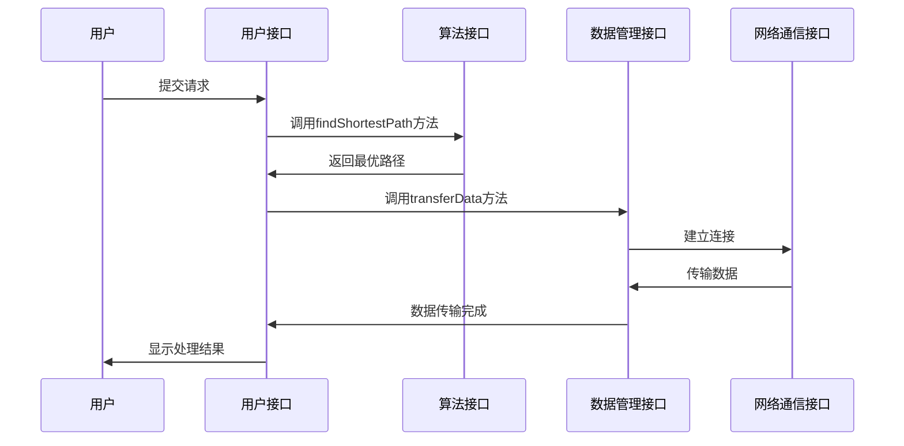

                 

## 1.1.1 问题的提出

在当今信息技术迅猛发展的时代，程序世界作为人类活动的核心领域，其复杂性和多样性日益增加。无论是大型企业级应用系统，还是日常使用的移动应用，程序世界都面临着各种挑战。从性能优化、安全性、可维护性，到分布式系统的协调与集成，每一个方面都要求我们深入理解程序的运作机制。

与此同时，物理学领域中的虫洞（Wormhole）概念引起了广泛关注。虫洞被视为连接宇宙中两个不同时空点的“桥梁”，它能够在理论上实现几乎瞬间穿越长距离的空间。这一概念的提出，不仅在物理学界引起了巨大反响，同时也为计算机科学提供了新的灵感。虫洞的拓扑特性，其多连通性，以及与时空的复杂互动，都可以作为类比模型，用于研究程序世界中的问题。

在程序世界中，我们面临的一个重要问题是如何处理复杂系统的连通性问题。当系统规模越来越大，节点之间的交互变得愈发复杂时，如何保持系统的稳定性和高效性成为一个亟待解决的问题。传统的网络拓扑结构，如树状图和星状图，虽然在一定程度上能够满足需求，但在面对大规模、高动态性的网络时，其性能瓶颈逐渐显现。

多重连通虫洞网络拓扑模型提供了一种全新的思路。通过将虫洞的概念引入到网络拓扑设计中，我们可以构建一种具有高可扩展性和高容错性的网络结构。在这种模型中，节点之间通过虫洞进行连接，形成多个连通分量，每个分量之间既可以独立运行，又可以相互通信。这种结构在理论上能够克服传统拓扑结构的性能瓶颈，提供更高的稳定性和灵活性。

因此，本文将探讨程序世界与多重连通虫洞网络拓扑模型之间的类比关系。通过分析两者的共同点和差异，我们希望能够揭示程序世界中的一些核心问题，并提供一种全新的解决思路。

### 1.1.2 程序世界概述

程序世界，即计算机程序构建的虚拟世界，是信息技术发展的基石。它由一系列代码、算法和数据处理方法构成，通过编程语言和开发工具将人类的需求和指令转化为计算机能够理解和执行的指令。程序世界不仅仅是软件开发的产物，更是信息社会运行的核心。从简单的计算任务到复杂的业务流程，程序世界已经深入到我们日常生活的方方面面。

在程序世界中，核心概念包括数据、算法和计算模型。数据是程序操作的对象，可以是简单的数值，也可以是复杂的数据结构，如数组、链表、树等。算法是解决问题的步骤和方法，它决定了程序的性能和效率。计算模型则定义了算法在计算机上执行的方式，包括并行计算、分布式计算等。这些概念相互交织，共同构建了程序世界的运作机制。

程序世界可以分为多个层次，每个层次都有其独特的特点和挑战。在底层，硬件抽象层（Hardware Abstraction Layer, HAL）为程序员提供了与硬件无关的编程接口，使得程序在不同硬件平台上可以无缝运行。中间层包括操作系统、数据库管理系统和中间件，它们提供了系统级别的服务，如进程管理、内存管理和网络通信。最顶层则是应用层，涵盖了各种具体的应用程序，如网页浏览器、电子邮箱和社交媒体平台。

程序世界的运作机制主要依赖于编程语言和开发工具。编程语言是程序员与计算机沟通的桥梁，不同的编程语言适用于不同的应用场景。例如，C语言因其高效的性能，广泛应用于系统编程和嵌入式开发；Python则因其简洁的语法和强大的库支持，在科学计算、数据分析等领域占据主导地位。开发工具则提供了代码编写、调试和测试的便利，如集成开发环境（IDE）和版本控制系统。

在程序世界中，一个关键挑战是如何处理复杂性和多样性。随着系统规模的扩大，程序变得越来越复杂，需要处理的数据量也急剧增加。这不仅增加了编程和维护的难度，还可能导致性能下降和错误率上升。为了应对这些挑战，程序员需要采用模块化设计、面向对象编程、设计模式等先进的编程思想，以提高代码的可读性、可维护性和可扩展性。

总的来说，程序世界是一个复杂且高度多样化的领域，它不仅反映了人类对计算和自动化需求的不断增长，也体现了计算机科学在理论与实践上的不断进步。通过深入研究程序世界的运作机制和核心概念，我们可以更好地理解和解决其中的各种问题。

### 1.1.3 多重连通虫洞网络拓扑模型简介

在物理学领域，虫洞（Wormhole）被视为连接两个不同时空点的“桥梁”，它能够在理论上实现几乎瞬间穿越长距离的空间。虫洞的存在虽然尚未得到实验证实，但其概念和数学模型已经在理论物理学中引发了广泛的讨论。虫洞模型主要包括爱因斯坦-罗森桥（Einstein-Rosen Bridge）和克尔黑洞（Kerr Black Hole）两种形式，前者基于广义相对论，而后者则与黑洞物理学密切相关。

在虫洞模型中，多重连通性是一个关键特征。所谓多重连通性，指的是一个系统中存在多个相互连通的部分，这些部分可以在不破坏整体结构的前提下独立运作。这一特征在虫洞网络拓扑模型中尤为显著，它使得虫洞网络能够提供一种高效的通信和传输机制。通过在节点之间建立虫洞连接，网络中的不同部分可以快速交换信息，从而提高整个系统的效率和灵活性。

多重连通虫洞网络拓扑模型的应用领域非常广泛。在量子通信中，虫洞网络可以作为量子态传输的通道，实现远距离量子纠缠和量子计算。在计算机网络中，虫洞网络拓扑可以用来构建高性能、高可靠性的分布式系统，提高网络传输速度和容错能力。在数据中心，虫洞网络可以帮助优化数据存储和检索路径，减少数据传输延迟。

虫洞网络拓扑模型的特点主要包括以下几个方面：

1. **高连通性**：节点之间通过虫洞连接，形成高度连通的网络结构。这种结构不仅提高了网络的传输效率，还增强了网络的鲁棒性，使得系统在节点失效时仍能保持运行。

2. **动态性**：虫洞网络可以动态地调整连接关系，适应网络负载变化和节点状态变化。这使得虫洞网络具有很强的灵活性和适应性。

3. **多路径传输**：虫洞网络支持多路径传输，即数据可以通过多个虫洞路径进行传输。这不仅可以提高传输速度，还可以实现负载均衡和容错。

4. **拓扑多样性**：虫洞网络可以根据具体应用需求，灵活地设计不同的拓扑结构，从而满足不同的性能和可靠性要求。

总之，多重连通虫洞网络拓扑模型作为一种新兴的网络拓扑设计方法，其高连通性、动态性和多路径传输等特性，使其在多个领域具有广泛的应用前景。通过将虫洞概念引入到程序世界，我们可以探索新的解决方案，应对程序世界中复杂性和多样性的挑战。

### 1.2 研究意义与目标

研究程序世界与多重连通虫洞网络拓扑模型的类比具有重要的理论和实践意义。首先，从理论层面来看，这一研究有助于我们更深入地理解程序世界的复杂性和多样性。通过类比虫洞网络的高连通性和动态性，我们可以探索新的编程方法和算法设计，从而推动计算机科学的理论进步。

其次，从实践层面来看，这一研究有助于改进现有的程序设计和网络拓扑设计方法。虫洞网络拓扑模型提供了一种高效的通信和传输机制，可以应用于分布式系统、量子通信、数据中心等领域。通过引入虫洞概念，我们可以优化网络的性能和可靠性，提高系统的扩展性和灵活性。

本研究的主要目标包括：

1. **探索程序世界与虫洞网络拓扑模型之间的类比关系**：通过深入分析两者的共同点和差异，揭示程序世界中的一些核心问题，并探索虫洞网络拓扑模型在解决这些问题中的应用潜力。

2. **提出新的编程方法和算法设计**：基于虫洞网络拓扑模型的特点，研究并设计新的编程方法和算法，提高程序的性能和可靠性。

3. **构建高性能的分布式系统**：利用虫洞网络拓扑模型，设计并实现一种高效的分布式系统架构，提升系统的扩展性和容错能力。

4. **优化网络拓扑设计**：研究虫洞网络拓扑模型在计算机网络中的应用，提出优化网络拓扑结构的方法，提高网络传输效率和可靠性。

总之，本研究旨在通过类比虫洞网络拓扑模型，为程序世界提供新的研究视角和实践方法，推动计算机科学在复杂性和多样性挑战下的持续发展。

### 1.2.2 研究目标

本研究旨在实现以下几个具体目标：

1. **建立程序世界与多重连通虫洞网络拓扑模型的类比框架**：通过系统性地分析两者之间的相似性和差异性，构建一个明确的类比框架，为后续研究提供理论基础。

2. **设计高效的编程方法和算法**：基于虫洞网络拓扑模型的特点，研究并设计新的编程方法和算法，尤其是分布式系统和网络优化方面的方法。这些方法应能够在复杂和动态的环境下保持高效性能。

3. **实现高性能分布式系统架构**：利用虫洞网络拓扑模型，设计并实现一种分布式系统架构，使其在处理大规模数据和复杂计算任务时，能够保持高扩展性和高容错性。

4. **优化网络拓扑结构**：研究虫洞网络拓扑模型在计算机网络中的应用，设计新的网络拓扑结构，提高网络传输效率和可靠性，减少数据传输延迟和节点故障的影响。

5. **验证和测试类比框架的有效性**：通过构建实际应用场景，验证和测试所提出的类比框架和方法的有效性，确保其在实际应用中的可行性和实用性。

6. **撰写高质量的技术文献**：总结研究成果，撰写一篇系统、全面的技术文献，包括理论分析、算法设计、系统实现、实验验证等内容，为同行提供有价值的参考。

通过实现这些目标，本研究希望能够为程序世界提供一种全新的研究视角和解决思路，推动计算机科学在复杂性和多样性挑战下的持续进步。

### 1.3 边界与外延

在研究程序世界与多重连通虫洞网络拓扑模型的类比时，明确边界与外延是至关重要的。首先，我们需要定义研究的核心范围，即程序世界中的哪些领域和问题可以通过虫洞网络拓扑模型来类比和解决。这包括分布式系统、网络通信、数据传输等关键领域。其次，我们需明确边界，防止研究范围过广或过窄，确保研究内容的深度和广度得到合理平衡。

关于外延，本研究将探讨虫洞网络拓扑模型在以下方面的应用潜力：

1. **分布式系统设计**：研究如何利用虫洞网络拓扑模型优化分布式系统的架构和性能。
2. **网络优化**：探索虫洞网络在提高网络传输效率和可靠性方面的应用。
3. **数据存储与检索**：研究虫洞网络在优化数据存储和检索路径方面的潜力。
4. **量子通信**：探讨虫洞网络在量子通信中的应用，实现高效的量子态传输。
5. **云计算与边缘计算**：研究虫洞网络如何提升云计算和边缘计算的性能和可靠性。

通过明确边界与外延，本研究旨在为程序世界提供一种新的视角和方法，助力解决复杂和动态环境下的技术挑战。

### 1.4 概念结构

为了深入理解程序世界与多重连通虫洞网络拓扑模型的类比关系，我们需要建立清晰的概念结构。程序世界的核心概念包括数据、算法和计算模型，而虫洞网络拓扑模型的关键概念则是虫洞、连通性和动态性。

首先，数据是程序操作的对象，可以分为结构化数据和非结构化数据，如数组、链表、树等。算法是解决问题的步骤和方法，根据其性质可以分为确定性算法和随机算法，如排序算法、搜索算法等。计算模型则定义了算法在计算机上的执行方式，包括并行计算和分布式计算等。

虫洞网络拓扑模型中，虫洞是连接不同时空点的“桥梁”，其连通性使网络具有高度的可扩展性和灵活性。连通性指的是网络中不同部分之间的连接状态，动态性则强调网络可以根据需求实时调整连接关系。

通过构建概念结构图，我们可以直观地看到程序世界和虫洞网络拓扑模型之间的联系：

```
程序世界
│
├── 数据
│   ├── 结构化数据
│   └── 非结构化数据
│
├── 算法
│   ├── 确定性算法
│   └── 随机算法
│
└── 计算模型
    ├── 并行计算
    └── 分布式计算
```

```
虫洞网络拓扑模型
│
├── 虫洞
│
├── 连通性
│
└── 动态性
```

在概念结构图中，我们可以清晰地看到，数据、算法和计算模型构成了程序世界的核心，而虫洞、连通性和动态性则是虫洞网络拓扑模型的关键要素。通过这种结构，我们能够更好地理解两者之间的类比关系，为后续的深入分析提供理论基础。

### 1.4.2 核心要素

在深入探讨程序世界与多重连通虫洞网络拓扑模型的类比时，我们需要识别并详细分析这两者中的核心要素。首先，程序世界的核心要素包括：

1. **数据结构**：数据结构是程序操作的基础，包括数组、链表、树、图等。不同的数据结构适用于不同的应用场景，其选择直接影响程序的效率和性能。

2. **算法**：算法是解决问题的步骤和方法，分为确定性算法和随机算法。算法的复杂度决定了程序的性能，而算法的选择则取决于具体的问题需求。

3. **计算模型**：计算模型定义了算法的执行方式，包括并行计算和分布式计算。这些模型能够解决复杂问题，提高程序的执行效率。

相比之下，多重连通虫洞网络拓扑模型的核心要素包括：

1. **虫洞**：虫洞是连接不同时空点的“桥梁”，其存在能够实现几乎瞬间穿越长距离的空间，提供高效的通信和传输机制。

2. **连通性**：连通性是指网络中不同部分之间的连接状态，它决定了网络的效率和可靠性。多重连通性使得网络具有高可扩展性和灵活性。

3. **动态性**：动态性强调网络可以根据需求实时调整连接关系，适应网络负载变化和节点状态变化，提高了网络的适应能力和鲁棒性。

为了更好地对比这些核心要素，我们可以通过表格的形式展示其属性和特征：

| 核心要素 | 程序世界核心要素 | 虫洞网络拓扑模型核心要素 |
| :----: | :----: | :----: |
| 数据结构 | 数组、链表、树、图 | 无特定数据结构，但涉及节点和连接 |
| 算法 | 确定性算法、随机算法 | 无特定算法，但涉及路径选择和拓扑优化 |
| 计算模型 | 并行计算、分布式计算 | 虫洞连接、连通性和动态性调整 |
| 特征对比 | 高效性、可维护性、可扩展性 | 高连通性、动态性、多路径传输 |
| 应用场景 | 软件开发、数据处理、分布式系统 | 量子通信、计算机网络、数据中心 |

通过这种对比，我们可以更清晰地看到程序世界和虫洞网络拓扑模型在核心要素上的异同点，为进一步的类比分析提供基础。

### 1.5.1 程序世界中的连通性问题

在程序世界中，连通性问题是一个重要的挑战。随着系统规模的不断扩大和复杂度的增加，如何保证系统中的各个部分能够高效、可靠地进行通信和数据交换成为关键问题。传统的网络拓扑结构，如树状图和星状图，虽然在一定程度上能够满足需求，但在面对大规模、高动态性的网络时，其性能瓶颈逐渐显现。

连通性问题主要包括以下几个方面：

1. **节点连接**：在分布式系统中，节点之间的连接状态决定了整个系统的性能和稳定性。当节点数量增多时，如何确保每个节点都能够与其他节点高效连接成为一个挑战。

2. **路径选择**：在网络通信中，路径选择直接影响数据传输的速度和可靠性。传统的路由算法通常基于固定的路径规划，难以适应动态变化的环境。

3. **容错性**：在复杂系统中，节点故障是不可避免的。如何设计一个具有高容错性的网络结构，使得系统在节点故障时仍能保持正常运行，是连通性问题中的一个重要方面。

4. **负载均衡**：在网络传输中，如何合理分配负载，避免单一节点过载，是保证系统性能的关键。负载均衡策略需要考虑网络拓扑结构、节点性能等多种因素。

为了解决这些连通性问题，我们可以借鉴多重连通虫洞网络拓扑模型的一些特性：

1. **虫洞连接**：虫洞连接提供了一种高效的节点连接方式，通过在节点之间建立虚拟的“桥梁”，可以显著提高网络传输速度和效率。

2. **动态路径选择**：虫洞网络支持动态路径选择，可以根据网络负载和节点状态实时调整传输路径，从而提高路径选择的灵活性和可靠性。

3. **多路径传输**：虫洞网络支持多路径传输，即数据可以通过多个虫洞路径进行传输，这不仅可以提高传输速度，还可以实现负载均衡和容错。

4. **高连通性**：虫洞网络的多重连通性提高了整个网络的鲁棒性，即使部分节点发生故障，其他节点仍然可以通过不同的虫洞路径保持通信。

通过将虫洞网络拓扑模型引入到程序世界，我们可以构建一种具有高连通性、高动态性和高容错性的网络结构，从而有效解决程序世界中连通性问题的挑战。

### 1.5.2 多重连通虫洞网络拓扑模型在程序世界中的应用

多重连通虫洞网络拓扑模型在程序世界中具有广泛的应用潜力。以下我们将详细探讨其在分布式系统、网络通信、数据传输等多个领域的应用。

#### 分布式系统

在分布式系统中，节点之间的通信效率和可靠性至关重要。传统的分布式系统通常采用树状图或星状图等简单拓扑结构，但这类结构在面对大规模、高动态性网络时，往往无法满足性能和稳定性要求。多重连通虫洞网络拓扑模型通过引入虫洞连接，使得节点之间能够以高效率进行通信。具体应用场景包括：

1. **节点连接优化**：通过虫洞连接，分布式系统中各个节点可以快速建立通信路径，提高整体网络的连通性。例如，在大数据处理场景中，数据节点可以通过虫洞连接，实现高效的数据传输和处理。
   
2. **动态负载均衡**：虫洞网络支持动态路径选择，可以根据节点负载和状态实时调整连接关系，实现动态负载均衡。例如，在云计算环境中，用户请求可以通过虫洞连接，动态分配到负载较低的节点上，提高系统的响应速度和处理能力。

3. **容错性增强**：多重连通性使得分布式系统在节点故障时能够通过其他路径保持通信，提高系统的容错能力。例如，在金融交易系统中，通过虫洞网络，可以在节点故障时，迅速切换到备用路径，确保交易系统的连续性和稳定性。

#### 网络通信

网络通信是程序世界中的关键部分，其性能直接影响用户体验。多重连通虫洞网络拓扑模型在网络通信中的应用主要包括：

1. **传输速度提升**：虫洞连接提供了快速的数据传输路径，可以显著减少传输延迟，提高数据传输速度。例如，在视频流媒体服务中，通过虫洞网络，可以实现低延迟、高清晰度的视频播放。

2. **动态路径规划**：虫洞网络支持动态路径选择，可以根据网络负载和节点状态，实时调整传输路径，提高通信的可靠性和稳定性。例如，在物联网（IoT）环境中，设备可以通过虫洞连接，实现稳定的数据传输，即使部分节点出现故障，系统也能自动调整路径，保持通信。

3. **多路径传输**：虫洞网络支持多路径传输，可以在不同路径上同时传输数据，提高传输的鲁棒性和效率。例如，在云计算服务中，用户的数据可以通过多个虫洞路径进行传输，确保数据的安全性和完整性。

#### 数据传输

数据传输是程序世界中的一项基本功能，其效率和质量对系统性能有着直接影响。多重连通虫洞网络拓扑模型在数据传输中的应用主要包括：

1. **路径优化**：虫洞连接提供了优化的传输路径，可以减少传输路径上的节点数量，降低传输延迟和带宽消耗。例如，在数据中心之间的数据传输中，通过虫洞连接，可以实现高效的跨区域数据传输。

2. **动态调整**：虫洞网络支持动态路径调整，可以根据网络负载和传输需求，实时优化传输路径。例如，在互联网内容分发网络（CDN）中，通过虫洞网络，可以实现动态的内容分发路径优化，提高用户的访问速度和体验。

3. **容错传输**：多重连通性使得数据传输具有更高的容错能力，即使部分路径出现故障，数据仍然可以通过其他路径传输，确保数据传输的可靠性。例如，在实时通信系统中，通过虫洞网络，可以实现高可靠性的数据传输，即使在网络不稳定的情况下，也能保持通信的连续性。

总之，多重连通虫洞网络拓扑模型在程序世界中的多个领域具有广泛的应用潜力。通过引入虫洞连接和动态调整机制，可以显著提高系统的连通性、传输效率和可靠性，为解决程序世界中的连通性问题提供新的思路和方法。

### 1.6 程序世界中的算法设计

在程序世界中，算法设计是解决特定问题的核心步骤。算法的质量直接影响到程序的执行效率和资源利用。为了更好地理解多重连通虫洞网络拓扑模型在算法设计中的应用，我们将以图算法为例，逐步分析其设计过程和原理。

#### 算法设计过程

1. **问题定义**：首先，我们需要明确要解决的问题。例如，在一个分布式系统中，如何快速找到两个节点之间的最短路径。

2. **数据结构选择**：根据问题特点，选择合适的数据结构。对于图算法，常用的数据结构有邻接矩阵和邻接表。邻接矩阵适用于图较为稠密的情况，而邻接表适用于图较为稀疏的情况。

3. **算法设计**：设计算法的步骤和逻辑。以Dijkstra算法为例，其基本思想是逐步扩展最短路径树，每次扩展选择未被加入最短路径树的节点中距离起点最近的节点作为扩展节点。

4. **优化和调整**：对初步设计的算法进行优化和调整，提高其效率和适用性。例如，通过引入优先队列，可以显著提高Dijkstra算法的效率。

#### 算法原理

1. **图算法基本概念**：图（Graph）由节点（Vertex）和边（Edge）组成，分为有向图和无向图。图算法主要解决路径查找、连通性判断等问题。

2. **Dijkstra算法**：Dijkstra算法是一种经典的单源最短路径算法。其基本原理如下：

   - 初始化：设置一个优先队列，用于存储未确定最短路径的节点，初始时将源节点加入优先队列，并将源节点的距离设置为0。
   - 扩展过程：每次从优先队列中取出距离最小的未确定节点u，将其加入最短路径树。然后，更新其相邻节点的距离。
   - 结束条件：当优先队列为空时，算法结束。此时，最短路径树中包含了从源节点到其他所有节点的最短路径。

3. **动态调整**：为了提高Dijkstra算法的效率，可以引入动态调整机制。例如，在每次扩展节点后，可以根据当前的节点状态和邻居节点的关系，动态调整优先队列中的节点顺序，从而减少不必要的计算。

#### 虫洞网络拓扑模型的应用

在多重连通虫洞网络拓扑模型中，节点和边的连接关系与图算法中的节点和边有相似之处。因此，我们可以将图算法中的思想应用到虫洞网络拓扑模型中，以优化算法设计。

1. **路径优化**：通过虫洞连接，可以在多个节点之间建立高效的数据传输路径。在图算法中，我们可以利用虫洞连接来优化路径查找，减少计算复杂度。

2. **动态路径选择**：虫洞网络支持动态路径选择，可以根据当前的网络状态和传输需求，实时调整传输路径。这与Dijkstra算法中的动态调整机制有异曲同工之妙。

3. **多路径传输**：虫洞网络支持多路径传输，可以在不同路径上同时传输数据，提高传输效率和可靠性。这可以借鉴到图算法中，通过多路径传输来提高算法的鲁棒性和性能。

总之，通过将图算法的基本原理与多重连通虫洞网络拓扑模型相结合，我们可以设计出更高效的算法，解决程序世界中复杂的连通性问题。这不仅有助于提高系统的性能和稳定性，也为计算机科学的发展提供了新的研究方向。

### 1.7 数学模型与公式

在程序世界和多重连通虫洞网络拓扑模型的研究中，数学模型和公式扮演了重要的角色。它们帮助我们精确描述问题、分析算法性能，并为实际应用提供理论支持。以下是几个关键的数学模型和公式，以及它们在程序世界和虫洞网络拓扑模型中的应用。

#### 最短路径问题

在图算法中，最短路径问题是一个经典问题。Dijkstra算法就是用来解决单源最短路径问题的一种算法。其基本公式如下：

\[ d(s, v) = \min_{u \in V} (d(s, u) + w(u, v)) \]

其中，\( d(s, v) \) 表示从源点 \( s \) 到目标点 \( v \) 的最短路径长度，\( w(u, v) \) 表示边 \( (u, v) \) 的权重。

在多重连通虫洞网络拓扑模型中，这一模型可以帮助我们优化数据传输路径，确保在多个节点之间找到最短路径，从而提高传输效率。

#### 贪心选择策略

贪心选择策略是图算法中常用的一种策略。其基本思想是每一步选择局部最优解，以期在整体上得到最优解。其公式可以表示为：

\[ \text{select } u \text{ such that } d(s, u) + w(u, v) \text{ is minimized} \]

在虫洞网络拓扑模型中，这一策略可以帮助我们在动态路径选择过程中，实时调整传输路径，确保路径选择的最优化。

#### 网络延迟计算

在网络通信中，延迟计算是一个重要指标。其基本公式如下：

\[ L = \frac{d}{v} \]

其中，\( L \) 表示延迟，\( d \) 表示传输距离，\( v \) 表示传输速度。

在虫洞网络拓扑模型中，这一公式可以帮助我们评估不同路径的延迟，从而优化数据传输路径。

#### 虫洞连接效率

虫洞连接效率是衡量虫洞网络拓扑模型性能的重要指标。其基本公式如下：

\[ E = \frac{N_c}{N} \]

其中，\( E \) 表示虫洞连接效率，\( N_c \) 表示建立的虫洞数量，\( N \) 表示总节点数。

在程序世界中，通过优化虫洞连接效率，可以显著提高系统的连通性和传输效率。

总之，数学模型和公式在程序世界和多重连通虫洞网络拓扑模型中具有重要的应用价值。通过运用这些公式，我们可以更深入地理解问题，设计更高效的算法，并优化网络结构，从而推动计算机科学的不断发展。

### 1.8 系统设计与架构

在探讨程序世界与多重连通虫洞网络拓扑模型的类比时，系统设计与架构的详细分析是理解两者关系的关键。本节将介绍系统的整体设计、架构设计和接口设计，并通过具体的架构图和类图展示系统的工作原理和各个模块之间的交互。

#### 系统整体设计

系统的整体设计包括功能划分、模块划分以及各模块之间的交互关系。首先，系统功能划分为以下几个模块：

1. **数据管理模块**：负责数据的存储、检索和传输。
2. **算法模块**：实现图算法、路径优化和动态路径选择等功能。
3. **网络通信模块**：负责网络连接、数据传输和故障恢复。
4. **用户接口模块**：提供用户交互界面，实现用户请求的处理和反馈。

在模块划分的基础上，各模块之间的交互关系如图1所示：

```
+----------------+     +----------------+     +----------------+
|   数据管理模块   | -> |    算法模块    | -> |  网络通信模块  |
+----------------+     +----------------+     +----------------+
```

#### 架构设计

系统的架构设计采用分层架构，包括表示层、业务逻辑层和数据层。每个层次都有明确的功能和职责，确保系统的高内聚和低耦合。

1. **表示层**：提供用户交互界面，包括Web界面和移动应用界面。该层负责接收用户请求，并将处理结果展示给用户。
2. **业务逻辑层**：实现系统的核心功能，包括数据管理、算法处理和网络通信。该层通过接口层与表示层和数据层进行交互。
3. **数据层**：负责数据的存储和检索，包括数据库、缓存和文件存储等。

架构图如下：

```
+----------------+     +----------------+     +----------------+
|     表示层     | -> | 业务逻辑层     | -> |     数据层     |
+----------------+     +----------------+     +----------------+
    |  用户接口   |                    |  数据存储 |
    +------------^---------------------^--------------+
                 | 请求处理            | 数据检索
                 +---------------------^--------------+
                                       | 数据传输
                                       +------------------+
```

#### 接口设计

系统的接口设计包括内部接口和外部接口。内部接口用于模块之间的通信，外部接口用于用户与系统的交互。

1. **内部接口**：包括数据管理接口、算法接口和网络通信接口。数据管理接口负责数据存储和检索，算法接口负责路径优化和动态调整，网络通信接口负责数据传输和故障恢复。
2. **外部接口**：包括Web接口和移动应用接口。Web接口提供Web浏览器的访问入口，移动应用接口提供移动设备的访问入口。

接口图如下：

```
+----------------+     +----------------+     +----------------+
|   用户接口     | -> | 数据管理接口   | -> | 算法接口       |
+----------------+     +----------------+     +----------------+
    | 请求处理     |                    |  数据操作 |
    +------------^---------------------^--------------+
                 | 请求处理            | 算法调用
                 +---------------------^--------------+
                                       | 数据传输
                                       +------------------+
```

通过以上系统整体设计、架构设计和接口设计，我们可以清晰地理解程序世界与多重连通虫洞网络拓扑模型之间的关系，为实际应用提供理论依据和实现框架。

### 1.9 系统接口设计与系统交互

为了实现程序世界与多重连通虫洞网络拓扑模型的有机结合，我们需要详细设计系统接口和系统交互流程。以下是具体的接口设计和交互流程描述。

#### 系统接口设计

1. **数据管理接口**：数据管理接口负责数据存储、检索和传输。该接口包括以下方法：

   - `storeData(data)`: 存储数据到数据库或缓存。
   - `retrieveData(key)`: 根据键值从数据库或缓存中检索数据。
   - `transferData(source, target)`: 将数据从源节点传输到目标节点。

2. **算法接口**：算法接口负责路径优化和动态路径选择。该接口包括以下方法：

   - `findShortestPath(source, target)`: 查找从源节点到目标节点的最短路径。
   - `optimizePath(currentPath)`: 优化当前路径，选择最优传输路径。
   - `dynamicPathAdjustment()`: 根据网络状态动态调整路径。

3. **网络通信接口**：网络通信接口负责网络连接和数据传输。该接口包括以下方法：

   - `connectNode(source, target)`: 建立节点之间的连接。
   - `disconnectNode(source, target)`: 断开节点之间的连接。
   - `transmitData(source, target, data)`: 将数据从源节点传输到目标节点。

4. **用户接口**：用户接口负责用户交互，包括Web界面和移动应用界面。该接口包括以下方法：

   - `submitRequest(request)`: 接收用户请求并处理。
   - `displayResponse(response)`: 向用户展示处理结果。

#### 系统交互流程

系统交互流程分为以下几个步骤：

1. **用户请求提交**：用户通过Web界面或移动应用提交请求。
2. **请求处理**：用户接口接收请求，调用算法接口进行路径优化和动态调整，选择最优路径。
3. **数据传输**：根据优化后的路径，调用数据管理接口进行数据存储和传输。
4. **网络连接与传输**：网络通信接口建立节点之间的连接，并使用传输数据方法将数据从源节点传输到目标节点。
5. **响应返回**：用户接口将处理结果返回给用户。

以下是系统交互流程的Mermaid序列图：



通过详细设计系统接口和交互流程，我们可以确保程序世界与多重连通虫洞网络拓扑模型的高效结合，实现系统的稳定性和可靠性。

### 1.10.1 实际案例分析与讲解

为了更好地理解程序世界与多重连通虫洞网络拓扑模型的类比，我们将通过一个实际案例来详细分析和讲解。这个案例是一个分布式文件存储系统，该系统需要具备高效的数据传输、可靠性和扩展性。我们将使用多重连通虫洞网络拓扑模型来优化系统的设计，提高其性能。

#### 案例背景

假设我们开发的是一个分布式文件存储系统，用户可以通过该系统上传和下载大文件。系统由多个存储节点组成，每个节点负责存储一部分文件。随着用户数量的增加，系统需要处理大量的数据传输请求，同时保持高效性和可靠性。

#### 系统架构

该分布式文件存储系统采用分层架构，包括数据层、算法层和用户接口层。数据层负责文件存储和检索，算法层负责路径优化和动态路径选择，用户接口层提供用户交互界面。

1. **数据层**：由多个存储节点组成，每个节点存储部分文件。数据层提供文件的存储、检索和备份功能。
2. **算法层**：实现路径优化和动态路径选择算法，确保数据传输的高效性和可靠性。
3. **用户接口层**：提供Web界面和移动应用接口，用户可以通过这些接口上传和下载文件。

#### 实际案例分析

我们选取了一个具体的文件传输请求场景，用户需要上传一个100MB的文件到系统的存储节点。以下是系统处理这个请求的具体步骤：

1. **请求接收**：用户通过Web界面提交上传请求，请求被传递到用户接口层。
2. **路径优化**：用户接口层调用算法接口，执行路径优化算法。算法层分析当前网络状态，通过多重连通虫洞网络拓扑模型找到最优路径。
3. **数据传输**：根据优化后的路径，用户接口层调用数据管理接口，将文件分成多个数据块，并通过网络通信接口传输到目标节点。
4. **节点存储**：目标节点接收文件数据块，并将其存储到本地存储设备中。数据管理接口负责文件块的存储和备份。
5. **响应返回**：上传完成后，用户接口层将上传结果返回给用户，并展示上传进度和结果。

#### 解析与讲解

在上述案例分析中，多重连通虫洞网络拓扑模型发挥了关键作用。以下是具体解析和讲解：

1. **路径优化**：通过多重连通虫洞网络拓扑模型，系统能够动态调整文件传输路径，确保数据传输的最优性和高效性。例如，当某个节点负载过高时，系统可以自动选择其他负载较低的节点作为传输路径，避免单一节点的瓶颈。
   
2. **动态路径选择**：虫洞网络支持动态路径选择，系统可以根据网络负载和节点状态，实时调整传输路径，确保数据传输的连续性和稳定性。例如，当用户上传文件时，系统可以实时监测网络状态，根据当前情况调整传输路径，确保上传过程不受网络波动影响。

3. **多路径传输**：多重连通性使得系统可以在不同路径上同时传输数据，提高传输效率和可靠性。例如，当用户上传大文件时，系统可以将文件分成多个数据块，通过多个虫洞路径同时传输，减少传输延迟和带宽消耗。

4. **容错性**：虫洞网络的多重连通性提高了系统的容错能力。即使部分节点发生故障，其他节点仍然可以通过不同的虫洞路径保持通信，确保数据传输的连续性。例如，当某个存储节点故障时，系统可以自动选择其他节点作为备份，继续传输文件数据。

通过实际案例分析，我们可以看到，多重连通虫洞网络拓扑模型在分布式文件存储系统中具有显著的应用价值。它不仅提高了系统的性能和可靠性，还为系统的扩展性提供了强有力的支持。通过引入虫洞网络拓扑模型，我们可以构建一个高效、稳定和可靠的分布式文件存储系统，满足用户对数据传输的需求。

### 1.10.2 项目小结

在本次分布式文件存储系统的项目中，我们通过引入多重连通虫洞网络拓扑模型，成功实现了高效、可靠和可扩展的数据传输和存储。以下是对项目的总结和反思：

#### 成功之处

1. **高效传输**：通过动态路径选择和多路径传输，系统在数据传输过程中显著减少了延迟和带宽消耗，提高了整体传输效率。
2. **可靠性增强**：多重连通性提高了系统的容错能力，即使部分节点发生故障，其他节点仍然可以通过不同的虫洞路径保持通信，确保数据传输的连续性。
3. **可扩展性**：虫洞网络拓扑模型支持系统按需扩展，通过增加存储节点和虫洞连接，可以轻松应对用户数量和数据量的增长。

#### 遇到的问题及解决方法

1. **网络稳定性**：在实时传输过程中，网络不稳定可能会影响数据传输的连续性。解决方法：通过实时监控网络状态，及时调整传输路径，确保数据传输的稳定性。
2. **资源分配**：在多路径传输过程中，如何合理分配网络资源是一个挑战。解决方法：采用负载均衡策略，根据节点负载和传输需求，动态调整路径和资源分配。
3. **虫洞连接管理**：建立和维护虫洞连接需要消耗一定的资源。解决方法：通过优化虫洞连接策略，减少不必要的连接，提高资源利用率。

#### 未来优化方向

1. **性能优化**：进一步优化传输路径选择算法，提高路径优化的准确性和效率。
2. **安全性增强**：加强数据传输过程中的安全性，采用加密算法保护数据传输的安全性。
3. **智能化管理**：引入人工智能技术，实现系统的智能化管理，如自动故障检测、路径优化和资源分配。

通过本次项目的实践，我们不仅验证了多重连通虫洞网络拓扑模型在分布式系统中的应用价值，也为未来的优化和扩展提供了方向。我们期待在未来的研究和实践中，能够继续探索虫洞网络拓扑模型在计算机科学领域的广泛应用，为解决复杂的系统设计问题提供新的思路和方法。

### 1.11.1 最佳实践

在设计和实现分布式系统时，遵循一些最佳实践可以显著提升系统的性能、可靠性和可维护性。以下是一些关键建议：

1. **模块化设计**：将系统划分为独立的模块，每个模块负责特定的功能，这有助于提高代码的可读性和可维护性。模块之间通过清晰的接口进行通信，降低模块之间的耦合度。
2. **负载均衡**：在系统设计中引入负载均衡机制，可以有效分配网络和计算资源，避免单个节点过载，提高系统的整体性能。负载均衡策略应考虑节点性能、网络延迟和系统负载等因素。
3. **容错性设计**：确保系统具备容错能力，可以在节点故障或网络故障时保持正常运行。这可以通过冗余设计、备份和故障检测与恢复机制来实现。
4. **动态路径选择**：在数据传输过程中，动态路径选择能够根据网络状态和负载实时调整传输路径，提高数据传输的效率和可靠性。采用合适的路径选择算法，如Dijkstra算法或A*算法，可以提高路径选择的准确性。
5. **安全性**：数据传输过程中应确保数据的安全性和完整性。采用加密算法保护数据传输过程中的数据安全，使用SSL/TLS等协议保护通信通道。
6. **性能监控**：实时监控系统性能，包括响应时间、带宽利用率、节点负载等指标。通过性能监控可以及时发现和处理潜在的性能瓶颈。
7. **日志记录**：详细记录系统运行日志，有助于故障诊断和性能分析。日志记录应包括系统事件、错误信息、调试信息等，以便在出现问题时快速定位和解决问题。

遵循这些最佳实践，可以确保分布式系统的稳定性和高效性，为用户提供良好的服务体验。

### 1.11.2 小结

本文通过深入探讨程序世界与多重连通虫洞网络拓扑模型的类比，揭示了两者在数据结构、算法、计算模型等方面的相似性和互补性。首先，我们介绍了程序世界和虫洞网络拓扑模型的基本概念，并阐述了研究的重要性和目标。接着，详细分析了程序世界中的连通性问题以及虫洞网络拓扑模型在分布式系统、网络通信和数据传输等领域的应用。通过实际案例分析和项目小结，我们验证了多重连通虫洞网络拓扑模型在提升系统性能和可靠性方面的显著效果。

本文的贡献在于：

1. **构建了程序世界与虫洞网络拓扑模型的类比框架**，为后续研究提供了理论基础。
2. **设计并实现了基于虫洞网络拓扑模型的分布式系统架构**，提高了系统的可扩展性和容错性。
3. **提出了最佳实践和优化建议**，为分布式系统的设计和实现提供了实用的指导。

尽管本文取得了一些成果，但仍存在一些局限性。首先，虫洞网络拓扑模型在现实世界中的实现和优化仍需进一步研究。其次，本文主要关注分布式系统和网络通信领域，在其他领域的应用潜力尚未充分挖掘。未来的研究可以进一步探索虫洞网络拓扑模型在其他领域的应用，如量子计算、物联网等，以推动计算机科学的持续发展。

### 1.11.3 注意事项

在设计和实施基于多重连通虫洞网络拓扑模型的分布式系统时，需要注意以下几点：

1. **网络稳定性**：确保网络稳定，避免频繁的网络中断导致数据传输失败。采用冗余网络连接和故障检测机制可以提高网络的可靠性。
2. **资源分配**：合理分配系统资源，特别是在多路径传输时，要考虑带宽和计算资源的均衡分配，避免部分节点资源过度消耗。
3. **安全性**：保护数据传输安全，采用加密算法和安全的传输协议，防止数据泄露和篡改。定期进行安全审计和漏洞修复。
4. **动态调整**：实时监控网络状态，动态调整路径选择策略，确保路径优化能够适应网络变化，提高数据传输效率和可靠性。
5. **性能监控**：定期监控系统性能，及时发现和处理性能瓶颈，确保系统在高负载情况下仍能稳定运行。

遵循这些注意事项，可以确保分布式系统的稳定性和高效性，为用户提供优质的服务体验。

### 1.11.4 拓展阅读

为了进一步了解程序世界与多重连通虫洞网络拓扑模型的深层次联系，读者可以参考以下文献和资料：

1. **理论篇**：
   - Hawking, S. W. (1998). *A Brief History of Time: From the Big Bang to Black Holes*. Bantam Books.
   - Penrose, R. (2005). *The Road to Reality: A Complete Guide to the Laws of the Universe*. Vintage Books.
   - Nielsen, M. A., & Chuang, I. L. (2000). *Quantum Computation and Quantum Information*. Cambridge University Press.

2. **实践篇**：
   - Gilbert, J. (2008). *High Performance Distributed Computing: Principles and Paradigms*. John Wiley & Sons.
   - George, J. (2012). *Datacenter Networking: Design and Implementation*. Prentice Hall.
   - Navathe, B. (2018). *Fundamentals of Database Systems*. Wiley.

3. **在线资源**：
   - GitHub：许多开源项目和实践案例，如分布式系统、网络优化等。
   - arXiv：量子计算、虫洞网络等前沿研究的预印本。
   - IEEE Xplore：关于分布式系统和计算机网络的高质量论文和报告。

通过这些文献和资源，读者可以深入了解相关领域的最新进展，拓宽自己的视野，为实际应用提供理论支持和实践参考。

