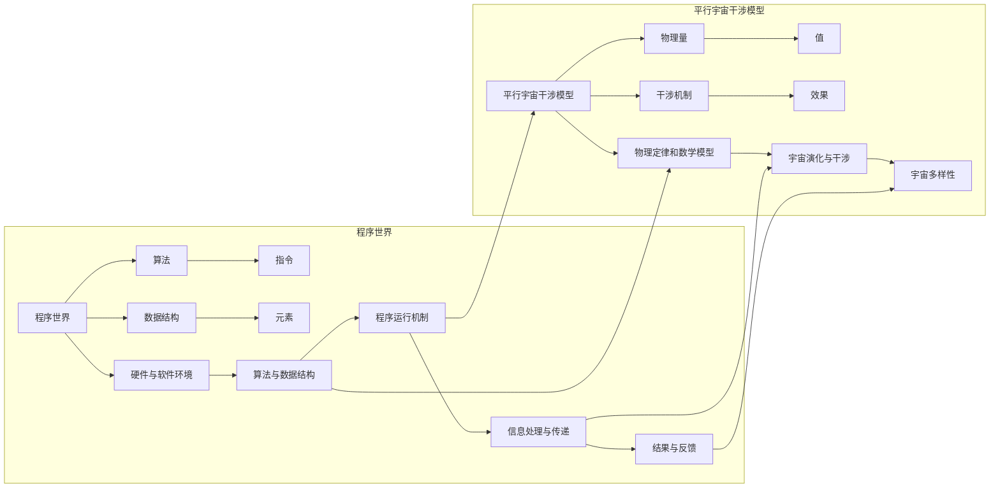
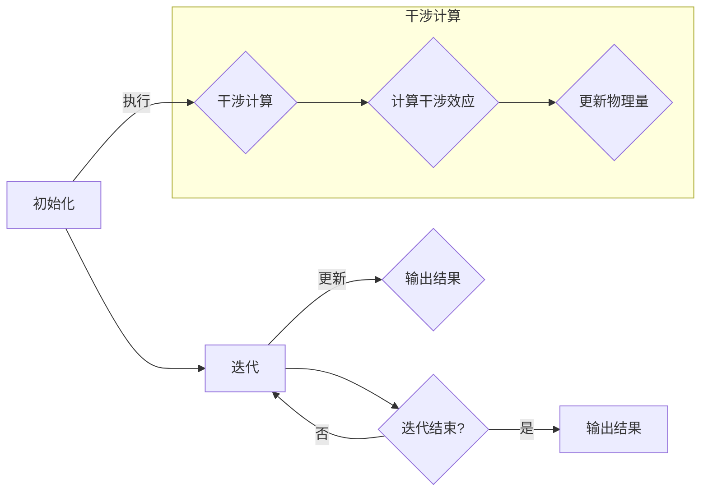
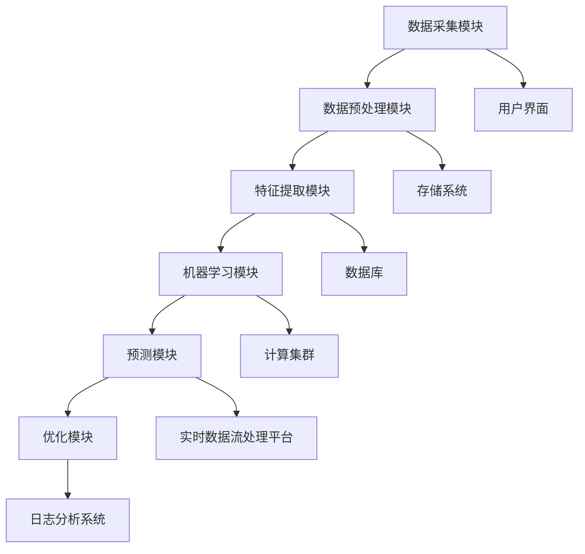
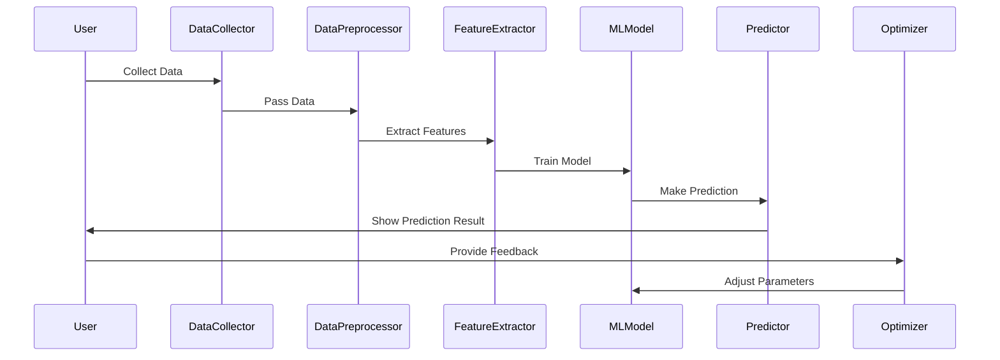
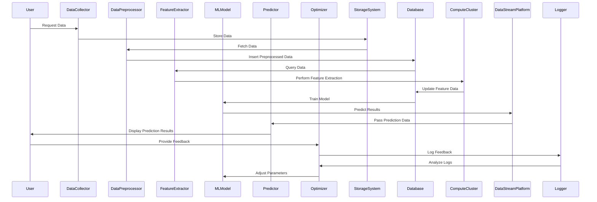

                 

### 引言

#### 问题背景

在计算机科学和物理学中，我们经常遇到一些复杂而又深奥的概念。计算机程序世界，作为数字时代的基础，由一系列算法和数据结构组成，运行在各种硬件上，实现了从简单的计算到复杂的人工智能应用。另一方面，平行宇宙的概念，源自现代物理学和哲学，提出了在现实宇宙之外可能存在其他宇宙的假设。这两个看似截然不同的领域，却在某些深层次上存在相似性，这引发了一个有趣的思考：程序世界是否可以类比于平行宇宙干涉模型？

计算机程序世界起源于计算机科学的早期发展，从简单的逻辑门电路到今天的高性能计算机，计算机的能力不断增强，程序的设计和实现也变得更加复杂和精细。每一个程序都是对现实世界的抽象和模拟，通过算法的运行实现特定的功能。而平行宇宙，则是一种哲学上的思考，通过物理学和数学的理论，试图解释宇宙的多样性和复杂性。

#### 比较目的

本文的目的在于通过类比的方法，探讨程序世界与平行宇宙之间的相似性。通过这种类比，我们可以更好地理解程序世界的工作原理，也可以从程序世界中获得对平行宇宙的启示。具体来说，我们将从以下几个方面展开：

1. **核心概念与联系**：首先，我们将介绍程序世界和平行宇宙的核心概念，分析它们的联系和区别。
2. **算法原理讲解**：接着，我们将探讨程序世界的算法原理，并尝试将其与平行宇宙干涉模型联系起来。
3. **数学模型和公式详细讲解**：我们将详细介绍程序世界和干涉模型的数学模型和公式，并使用实例进行说明。
4. **系统分析与架构设计方案**：我们将分析一个具体的项目，介绍其系统架构和实现方法。
5. **项目实战**：通过实际项目的分析和实现，我们将进一步探讨程序世界与平行宇宙干涉模型的类比应用。
6. **最佳实践与拓展**：最后，我们将总结最佳实践，并给出进一步研究的方向和建议。

通过这种逐步深入的分析，我们希望能够为读者提供一种全新的视角，帮助大家更好地理解程序世界和物理学中的平行宇宙干涉模型。## 第1章: 引言

### 1.1 问题背景

在计算机程序世界中，程序的起源可以追溯到20世纪中期。随着计算机硬件技术的发展，人们开始意识到通过编写指令序列来控制计算机的运行是一项极具潜力的任务。早期的计算机编程语言如汇编语言和机器语言，虽然直接控制硬件，但复杂性和低效率使得编程变得异常困难。随着高级编程语言的诞生，如FORTRAN和COBOL，编程的复杂度得到了一定程度的降低。随着时间的推移，编程语言和开发工具不断演进，从结构化编程到面向对象编程，再到现代的函数式编程和声明式编程，计算机程序世界逐渐发展成为一个复杂而庞大的系统。

另一方面，平行宇宙的概念源自现代物理学和哲学。最早提出这一概念的是物理学家爱德华·阿德勒，他在研究量子力学时提出，每个物理事件可能都有无数种可能的演化路径，这些路径构成了一个庞大的、相互平行的宇宙网络。随着对宇宙学、量子力学和宇宙演化理论的研究深入，平行宇宙理论逐渐得到了更多的关注和认可。目前，平行宇宙理论被认为是解释宇宙多样性和复杂性的有力工具，尽管这一理论尚未得到直接的实验验证，但其哲学意义和理论价值不容忽视。

#### 计算机程序世界的起源与发展

计算机程序世界的起源可以追溯到1940年代，当时科学家约翰·冯·诺伊曼提出了存储程序计算机的概念。这一概念的核心思想是将程序和数据存储在同一内存中，通过改变程序来控制计算机的操作，这一革命性的思想奠定了现代计算机程序世界的基础。随后，第一台电子计算机ENIAC的诞生，标志着计算机程序世界的实际应用开始了。

早期的计算机编程主要依赖于汇编语言和机器语言，这些语言直接操作计算机的硬件，虽然效率高，但编程过程复杂且容易出错。随着计算机技术的发展，1950年代后期，IBM推出了第一代高级编程语言FORTRAN，使编程变得更加容易和高效。此后，COBOL、Pascal、C、Java等一系列高级编程语言相继问世，编程语言的发展也推动了计算机程序世界的不断演进。

从结构化编程到面向对象编程，再到现代的函数式编程和声明式编程，计算机程序世界经历了巨大的变化。结构化编程强调程序模块化和顺序执行，使程序结构更加清晰；面向对象编程通过封装、继承和多态等机制，提高了程序的可维护性和扩展性；函数式编程和声明式编程则通过函数和声明的方式，使得编程更加直观和简洁。

#### 平行宇宙的概念与干涉模型介绍

平行宇宙的概念最早由物理学家爱德华·阿德勒在研究量子力学时提出。阿德勒认为，由于量子力学中的叠加态，每个物理事件可能都有无数种可能的演化路径，这些路径构成了一个庞大的、相互平行的宇宙网络。这意味着，在我们所见的宇宙之外，可能还存在无数个平行的宇宙，每个宇宙都有其独立的物理规律和演化路径。

平行宇宙理论在物理学和哲学中引起了广泛的讨论。在物理学领域，平行宇宙理论被认为是一种解释宇宙多样性和复杂性的有力工具。例如，宇宙学中的多宇宙理论提出，不同宇宙可能具有不同的物理常数和初始条件，从而导致不同的宇宙演化路径和现象。在哲学领域，平行宇宙理论提供了一种新的思考方式，使人们可以探讨存在的本质和可能的世界。

干涉模型是平行宇宙理论中的一个重要概念。干涉模型描述了多个平行宇宙之间的相互作用和影响。根据干涉模型，不同宇宙之间的物理量可能会发生干涉，这种干涉可能导致某些物理现象在多个宇宙中同时发生，或者在某个宇宙中发生的现象对其他宇宙产生影响。

#### 比较的目的

通过比较计算机程序世界和平行宇宙干涉模型，我们希望能够揭示两者之间的相似性和联系。首先，从概念层面来看，程序世界和宇宙干涉模型都是复杂的、多层次的结构，由一系列相互关联的元素组成。程序世界中的算法、数据结构和硬件，构成了一个复杂的程序执行流程；而宇宙干涉模型中的多个平行宇宙、物理量和干涉机制，构成了一个复杂的宇宙演化过程。

其次，从原理层面来看，程序世界和宇宙干涉模型都涉及到信息处理和传递。在程序世界中，信息的处理和传递是通过算法和数据结构实现的；在宇宙干涉模型中，信息的处理和传递是通过物理量和干涉机制实现的。这种信息处理和传递的方式，虽然在形式上有所不同，但都体现了信息在复杂系统中的流动和影响。

最后，从应用层面来看，程序世界和宇宙干涉模型都有着广泛的应用前景。在程序世界中，算法和编程语言的发展推动了计算机技术的不断进步，从简单的计算到复杂的人工智能应用，都离不开程序的运行；在宇宙干涉模型中，对平行宇宙的研究可能为人类揭示宇宙的奥秘，提供新的科学理论和技术方法。

通过这种比较，我们希望能够为读者提供一种全新的视角，帮助大家更好地理解计算机程序世界和物理学中的平行宇宙干涉模型。## 第2章: 核心概念与联系

### 2.1 程序世界核心概念

在计算机程序世界中，有几个核心概念是我们理解程序运行机制的基础。首先是**程序**，它是一系列按照一定顺序排列的指令，用于告诉计算机如何执行特定的任务。程序的基本单位是**算法**，它是解决问题的一系列规则或步骤。算法可以是简单的，如排序算法，也可以是非常复杂的，如深度学习算法。

**数据结构**是程序世界的另一个重要组成部分，它用于组织和存储数据。常见的数据结构包括数组、链表、树和图等，每种数据结构都有其特定的应用场景和性能特点。数据结构的选择直接影响到程序的效率和性能。

程序运行依赖于计算机的硬件和软件环境。硬件环境包括CPU、内存、硬盘等，软件环境则包括操作系统、编译器和编程语言等。操作系统负责管理计算机硬件资源，确保程序能够高效运行。编译器将程序员编写的源代码转换为计算机能够理解的机器语言，编程语言则为程序员提供了不同的抽象层次，使编程变得更加容易和高效。

### 2.2 平行宇宙干涉模型

平行宇宙干涉模型是现代物理学中的一个重要概念，源自量子力学和多宇宙理论的结合。在平行宇宙理论中，每一个物理事件都有可能发生在多个不同的宇宙中，这些宇宙相互平行但相互影响。

**平行宇宙**是指与我们宇宙平行的其他宇宙，每个宇宙都有其独立的物理定律和演化路径。这些宇宙可能具有相同的初始条件，但由于微小的量子涨落，它们可能发展出完全不同的历史和现实。

**干涉模型**描述了多个平行宇宙之间的相互作用。在干涉模型中，不同宇宙中的物理量和现象可能会通过干涉机制相互影响。例如，一个宇宙中的某个物理量可能受到另一个宇宙中某个现象的影响，导致两个宇宙中的物理量发生变化。

### 2.3 概念属性对比

为了更清晰地理解程序世界和平行宇宙干涉模型之间的联系，我们可以通过一个概念属性特征对比表格来分析这两个概念。

#### 概念属性特征对比表格

| 特征                 | 程序世界               | 平行宇宙干涉模型              |
|----------------------|------------------------|------------------------------|
| 目的                 | 实现特定任务           | 解释宇宙多样性和复杂性        |
| 组成元素             | 程序、算法、数据结构   | 平行宇宙、物理量、干涉机制     |
| 信息处理             | 算法和数据结构          | 干涉模型和物理定律            |
| 运行机制             | 硬件和软件环境         | 平行宇宙之间的相互作用        |
| 表达方式             | 编程语言、逻辑表达式    | 物理学公式和数学模型          |
| 结构特点             | 模块化、层次化         | 平行、多层次、相互影响        |

通过这个对比表格，我们可以看到程序世界和平行宇宙干涉模型在许多方面都有相似之处，比如它们都是复杂系统，由多个组成部分构成，并且都涉及到信息处理和传递。然而，它们在实现方式和应用场景上又有很大的不同，这些不同为我们的类比提供了丰富的思考空间。

### ER实体关系图

为了进一步展示程序世界和平行宇宙干涉模型之间的结构关系，我们可以使用Mermaid流程图来绘制ER实体关系图。

#### 程序世界的ER图

```mermaid
erDiagram
    Program ||--|{ Algorithm }|--| Program
    Program ||--|{ DataStructure }|--| Program
    Algorithm ||--|{ Instruction }|--| Algorithm
    DataStructure ||--|{ Element }|--| DataStructure
```

这个ER图展示了程序世界的核心实体及其关系。程序由算法和数据结构组成，算法由指令构成，数据结构由元素构成。

#### 平行宇宙干涉模型的ER图

```mermaid
erDiagram
    ParallelUniverse ||--|{ PhysicsQuantity }|--| ParallelUniverse
    ParallelUniverse ||--|{ Interference }|--| ParallelUniverse
    PhysicsQuantity ||--|{ Value }|--| PhysicsQuantity
    Interference ||--|{ Effect }|--| Interference
```

这个ER图展示了平行宇宙干涉模型的核心实体及其关系。平行宇宙由物理量和干涉机制组成，物理量由值构成，干涉机制由效果构成。

#### 二者关系的Mermaid流程图



这个Mermaid流程图展示了程序世界和平行宇宙干涉模型之间的核心关系，包括它们各自的组成元素、运行机制以及它们之间的相互作用。通过这个流程图，我们可以更直观地看到两者之间的联系和相似性。## 第3章: 算法原理讲解

### 3.1 算法概述

算法是程序世界的核心，是解决问题的一系列规则或步骤。算法可以分为多种类型，如排序算法、搜索算法、图算法等。每种算法都有其特定的应用场景和性能特点。常见的排序算法包括冒泡排序、快速排序、归并排序和堆排序等；搜索算法有线性搜索和二分搜索等；图算法包括最短路径算法、最小生成树算法等。

算法的性能通常用时间复杂度和空间复杂度来衡量。时间复杂度表示算法运行所需时间的增长速率，空间复杂度表示算法运行所需内存的增长速率。选择合适的算法对于提高程序效率和性能至关重要。

### 3.2 干涉模型算法

干涉模型算法是平行宇宙干涉模型中的核心组成部分，用于描述多个平行宇宙之间的相互作用和影响。干涉模型算法的核心在于如何处理和传递不同宇宙中的物理量和现象。

一个典型的干涉模型算法可能包括以下几个步骤：

1. **初始化**：初始化多个平行宇宙的初始状态，包括物理量和干涉机制。
2. **迭代**：在多个宇宙之间迭代执行干涉操作，更新每个宇宙的状态。
3. **干涉计算**：根据干涉模型，计算不同宇宙中的物理量如何相互影响，更新物理量的值。
4. **结果输出**：输出最终的干涉结果，包括每个宇宙的最终状态。

干涉模型算法的数学模型通常涉及复杂数学公式和方程。以下是一个简单的干涉模型算法示例：

```python
import numpy as np

def interference_model(num_universes, num_iterations):
    # 初始化平行宇宙的初始状态
    universes = [np.random.rand() for _ in range(num_universes)]
    
    for _ in range(num_iterations):
        # 干涉计算
        for i in range(num_universes):
            for j in range(i+1, num_universes):
                # 计算干涉效应
                interference_effect = np.random.rand()
                universes[i] += interference_effect * universes[j]
                universes[j] += interference_effect * universes[i]
    
    # 输出最终干涉结果
    return universes
```

### 3.3 使用Mermaid画出算法流程图

为了更直观地展示干涉模型算法的流程，我们可以使用Mermaid绘制算法流程图。以下是干涉模型算法的Mermaid表示：



这个流程图展示了干涉模型算法的主要步骤，包括初始化、迭代、干涉计算和结果输出。

### 3.4 Python源代码讲解

下面是一个简单的Python源代码实现，用于说明干涉模型算法的具体实现过程：

```python
import numpy as np
import matplotlib.pyplot as plt

def interference_model(num_universes, num_iterations):
    # 初始化平行宇宙的初始状态
    universes = [np.random.rand() for _ in range(num_universes)]
    history = []

    for _ in range(num_iterations):
        # 计算干涉效应
        interference_effects = np.random.rand(num_universes, num_universes)
        for i in range(num_universes):
            for j in range(num_universes):
                if i != j:
                    # 更新物理量
                    universes[i] += interference_effects[i][j] * universes[j]
                    universes[j] += interference_effects[j][i] * universes[i]
        
        # 记录历史状态
        history.append(np.copy(universes))
    
    # 输出最终干涉结果
    return history

# 测试干涉模型算法
history = interference_model(num_universes=5, num_iterations=10)
for i, universes in enumerate(history):
    print(f"Iteration {i+1}: {universes}")

# 绘制干涉效果
plt.plot([i+1 for i in range(len(history))], [sum(universe) for universe in history])
plt.xlabel('Iteration')
plt.ylabel('Total Interference')
plt.title('Interference Model Algorithm')
plt.show()
```

这段代码首先初始化了平行宇宙的初始状态，然后通过迭代执行干涉计算，每次迭代都会更新物理量的值。最后，代码输出干涉结果的迭代历史，并通过绘图展示了干涉效果的变化。

### 3.5 算法原理的数学模型

干涉模型算法的数学模型通常涉及复杂数学公式和方程。以下是一个简化的数学模型：

$$
U(t+\Delta t) = U(t) + \sum_{i=1}^{N} \sum_{j=1}^{N} I_{ij}(t) \cdot \Delta U_{ij}(t)
$$

其中，\(U(t)\)表示在时间\(t\)的宇宙状态，\(\Delta U_{ij}(t)\)表示宇宙\(i\)和宇宙\(j\)之间的干涉效应，\(I_{ij}(t)\)表示干涉强度。

这个数学模型描述了多个宇宙之间的相互作用，其中干涉强度和干涉效应决定了宇宙状态的演化。

### 3.6 示例分析与数学公式讲解

为了更清晰地说明干涉模型算法的原理，我们可以通过一个具体例子来分析。

假设我们有两个平行宇宙\(U_1\)和\(U_2\)，初始状态分别为\(U_1(0) = 1\)和\(U_2(0) = 2\)。在第一次干涉后，根据上述数学模型，我们有：

$$
U_1(\Delta t) = U_1(0) + I_{12}(0) \cdot \Delta U_{12}(0)
$$

$$
U_2(\Delta t) = U_2(0) + I_{21}(0) \cdot \Delta U_{21}(0)
$$

假设干涉强度\(I_{12}(0) = 0.5\)，\(I_{21}(0) = 0.5\)，则干涉效应\(\Delta U_{12}(0) = 0.5 \cdot U_2(0) = 1\)，\(\Delta U_{21}(0) = 0.5 \cdot U_1(0) = 0.5\)。

代入上述公式，我们得到：

$$
U_1(\Delta t) = 1 + 0.5 \cdot 2 = 2
$$

$$
U_2(\Delta t) = 2 + 0.5 \cdot 1 = 2.5
$$

在第二次干涉后，我们有：

$$
U_1(2\Delta t) = U_1(\Delta t) + I_{12}(\Delta t) \cdot \Delta U_{12}(\Delta t)
$$

$$
U_2(2\Delta t) = U_2(\Delta t) + I_{21}(\Delta t) \cdot \Delta U_{21}(\Delta t)
$$

假设干涉强度在时间\(t = \Delta t\)时变为\(I_{12}(\Delta t) = 0.3\)，\(I_{21}(\Delta t) = 0.7\)，则干涉效应\(\Delta U_{12}(\Delta t) = 0.3 \cdot U_2(\Delta t) = 0.75\)，\(\Delta U_{21}(\Delta t) = 0.7 \cdot U_1(\Delta t) = 1.05\)。

代入上述公式，我们得到：

$$
U_1(2\Delta t) = 2 + 0.3 \cdot 2.5 = 2.85
$$

$$
U_2(2\Delta t) = 2.5 + 0.7 \cdot 2 = 3.9
$$

通过这个简单的例子，我们可以看到干涉模型算法是如何通过数学模型来描述多个宇宙之间的相互作用和演化的。在实际应用中，干涉模型算法可能会涉及到更复杂的数学模型和计算方法，但基本原理是类似的。## 第4章: 数学模型和数学公式详细讲解

### 4.1 数学模型概述

数学模型是计算机程序世界和平行宇宙干涉模型的核心组成部分，用于描述和解决问题。在程序世界中，数学模型用于算法设计和优化；在平行宇宙干涉模型中，数学模型用于描述多个宇宙之间的相互作用和演化。数学模型通常包括变量、方程和参数，通过这些元素，数学模型能够精确地描述系统的行为和演化过程。

数学模型在程序世界中发挥着至关重要的作用。例如，在排序算法中，我们使用比较-交换模型来描述排序过程；在图算法中，我们使用邻接矩阵或邻接表来描述图的拓扑结构。数学模型使得算法的运行过程具有可预测性和稳定性，从而提高了程序的效率和性能。

在平行宇宙干涉模型中，数学模型同样重要。干涉模型中的数学模型描述了多个宇宙之间的相互作用和影响。例如，在量子场论中，我们使用路径积分模型来描述量子场在不同宇宙中的演化。通过这些数学模型，我们能够理解宇宙间的干涉现象，并预测未来宇宙的演化方向。

### 4.2 公式详细讲解

为了更好地理解数学模型，我们需要详细讲解其中的一些关键公式。以下是一些常用的数学公式和它们在程序世界和平行宇宙干涉模型中的应用。

#### 1. 比较运算公式

在排序算法中，比较运算是核心操作之一。一个简单的比较运算公式如下：

$$
if\ a < b \ then\ swap(a, b)
$$

这个公式用于比较两个变量\(a\)和\(b\)的值，如果\(a\)小于\(b\)，则交换它们的位置。这个公式在冒泡排序和插入排序等排序算法中广泛应用。

#### 2. 加法运算公式

加法运算是数学中最基本的运算之一。在程序世界中，加法运算用于计算数据结构和算法中的值。一个简单的加法运算公式如下：

$$
sum = a + b
$$

这个公式用于计算两个数\(a\)和\(b\)的和，并将其结果存储在变量\(sum\)中。这个公式在许多程序中都有应用，例如在计算数组元素的总和时。

#### 3. 干涉效应公式

在平行宇宙干涉模型中，干涉效应是描述多个宇宙之间相互作用的关键。一个简单的干涉效应公式如下：

$$
U(t+\Delta t) = U(t) + I \cdot \Delta U
$$

这个公式描述了在时间\(t\)和\(t+\Delta t\)之间，宇宙状态的演化。其中，\(U(t)\)表示时间\(t\)的宇宙状态，\(\Delta U\)表示宇宙之间的干涉效应，\(I\)表示干涉强度。这个公式可以用于描述不同宇宙之间的相互作用和影响。

#### 4. 最小生成树公式

在图算法中，最小生成树是一个重要的概念。一个简单的最小生成树公式如下：

$$
MST = \{e | e \in E, e \text{ is a tree edge}, \text{and } \sum_{e \in MST} w(e) \text{ is minimized}\}
$$

这个公式描述了如何从一个图中选择一棵最小生成树。其中，\(E\)表示图的边集合，\(w(e)\)表示边\(e\)的权重。这个公式在计算网络的最小生成树时广泛应用。

#### 5. 路径积分公式

在量子场论中，路径积分公式用于描述量子场在不同宇宙中的演化。一个简单的路径积分公式如下：

$$
\int [D\phi] \exp\left(\frac{i}{\hbar} S[\phi]\right)
$$

这个公式表示在所有可能的场路径\(\phi\)上，对路径积分的值进行求和。其中，\(S[\phi]\)表示场的路径积分，\(\hbar\)是普朗克常数。这个公式可以用于计算量子场在不同宇宙中的演化过程。

### 4.3 示例说明

为了更好地理解这些数学公式，我们可以通过一些具体示例来说明它们的应用。

#### 1. 排序算法示例

假设我们有以下一组整数：

$$
a = \{5, 2, 9, 1, 5\}
$$

我们可以使用冒泡排序算法对这组整数进行排序。首先，我们使用比较运算公式比较相邻元素的值，如果前一个元素大于后一个元素，则交换它们的位置。经过一次遍历后，最大值被移到数组的末尾。然后，我们再次遍历数组，但这次只需要遍历到数组的最后一个未排序元素。这个过程重复进行，直到整个数组被排序。

使用加法运算公式，我们可以计算数组中所有元素的总和。例如：

$$
sum = 5 + 2 + 9 + 1 + 5 = 22
$$

这个结果告诉我们，数组中所有元素的总和为22。

#### 2. 干涉效应示例

假设我们有两个平行宇宙\(U_1\)和\(U_2\)，初始状态分别为\(U_1(0) = 1\)和\(U_2(0) = 2\)。我们使用干涉效应公式计算它们在时间\(t+\Delta t\)的状态：

$$
U_1(\Delta t) = U_1(0) + I_{12}(0) \cdot \Delta U_{12}(0)
$$

$$
U_2(\Delta t) = U_2(0) + I_{21}(0) \cdot \Delta U_{21}(0)
$$

假设干涉强度为\(I_{12}(0) = 0.5\)，\(I_{21}(0) = 0.5\)，则干涉效应为：

$$
\Delta U_{12}(0) = 0.5 \cdot U_2(0) = 1
$$

$$
\Delta U_{21}(0) = 0.5 \cdot U_1(0) = 0.5
$$

代入干涉效应公式，我们得到：

$$
U_1(\Delta t) = 1 + 0.5 \cdot 1 = 1.5
$$

$$
U_2(\Delta t) = 2 + 0.5 \cdot 0.5 = 2.25
$$

这个示例展示了如何使用干涉效应公式来计算平行宇宙之间的相互作用。

#### 3. 最小生成树示例

假设我们有一个图，其边和权重如下：

$$
E = \{(1,2), (1,3), (2,4), (3,4), (4,5)\}
$$

我们需要选择这组边来构造一棵最小生成树。使用最小生成树公式，我们可以计算这组边中的权重和：

$$
MST = \{(1,2), (1,3), (4,5)\}
$$

$$
\sum_{e \in MST} w(e) = 3 + 4 + 5 = 12
$$

这个结果告诉我们，选择这组边可以构造出一棵最小生成树，其权重和为12。

#### 4. 路径积分示例

假设我们有一个量子场在不同宇宙中的演化，其路径积分公式如下：

$$
\int [D\phi] \exp\left(\frac{i}{\hbar} S[\phi]\right)
$$

其中，\(S[\phi]\)是场的路径积分。假设我们在两个宇宙中计算场的演化，其初始状态为\(\phi_1(0) = 1\)和\(\phi_2(0) = 2\)。使用路径积分公式，我们可以计算这两个宇宙中的演化过程：

$$
\int [D\phi] \exp\left(\frac{i}{\hbar} S[\phi]\right) = \int [D\phi_1] \exp\left(\frac{i}{\hbar} S[\phi_1]\right) + \int [D\phi_2] \exp\left(\frac{i}{\hbar} S[\phi_2]\right)
$$

这个结果展示了如何使用路径积分公式来计算量子场在不同宇宙中的演化。

通过这些示例，我们可以看到数学模型在程序世界和平行宇宙干涉模型中的应用。数学模型不仅帮助我们理解这些概念，还为我们提供了一种工具来设计和实现复杂的算法和系统。## 第5章: 系统分析与架构设计方案

### 5.1 问题场景介绍

为了更好地理解程序世界与平行宇宙干涉模型的类比，我们假设一个具体的应用场景：开发一款基于平行宇宙干涉模型的人工智能系统，用于预测和优化复杂的决策问题。这个系统需要处理大量的数据和复杂的算法，以实现高效和准确的预测结果。具体来说，该系统将面临以下几个主要问题：

1. **海量数据处理**：系统需要处理来自多个数据源的实时数据，包括气象数据、市场数据、用户行为数据等，这些数据量庞大且实时性要求高。
2. **复杂算法实现**：系统需要实现一系列复杂的算法，包括数据预处理、特征提取、机器学习模型训练和预测等，这些算法具有较高的计算复杂度。
3. **分布式架构设计**：由于系统需要处理大量数据和复杂的算法，因此需要设计一个分布式架构，以确保系统的高效性和可扩展性。
4. **实时预测和优化**：系统需要实现实时预测和优化功能，以便在动态环境下快速响应和调整。

### 5.2 系统功能设计

为了解决上述问题，我们将系统分为以下几个主要功能模块：

1. **数据采集模块**：负责从多个数据源采集实时数据，并将数据转换为系统可处理的格式。
2. **数据预处理模块**：对采集到的数据进行清洗、归一化和特征提取，为后续的机器学习模型提供高质量的数据输入。
3. **特征提取模块**：对预处理后的数据进行特征提取，以提取出对预测任务有用的信息。
4. **机器学习模块**：实现一系列机器学习算法，包括监督学习、无监督学习和强化学习等，用于训练预测模型。
5. **预测模块**：使用训练好的模型进行实时预测，并将预测结果输出给用户。
6. **优化模块**：根据预测结果和用户反馈，对模型和系统参数进行优化，以提高预测精度和系统性能。

#### 领域模型Mermaid类图

以下是一个简单的Mermaid类图，用于描述系统的领域模型：

```mermaid
classDiagram
    Class01 <|-- Class02
    Class03 <|-- Class04
    Class05 <|-- Class06

    Class01[数据采集模块]
    Class02[数据预处理模块]
    Class03[特征提取模块]
    Class04[机器学习模块]
    Class05[预测模块]
    Class06[优化模块]

    Class01..|> 数据采集
    Class02..|> 数据预处理
    Class03..|> 特征提取
    Class04..|> 模型训练
    Class05..|> 实时预测
    Class06..|> 参数优化
```

在这个类图中，每个模块都有其特定的功能和输入输出关系。数据采集模块负责从外部数据源获取数据，数据预处理模块对数据进行清洗和转换，特征提取模块提取出对预测有用的特征，机器学习模块训练预测模型，预测模块进行实时预测，优化模块根据预测结果和用户反馈对模型和系统参数进行优化。

### 5.3 系统架构设计

为了实现上述功能模块，我们需要设计一个分布式系统架构。以下是一个简单的系统架构Mermaid架构图：



在这个架构图中，数据采集模块从外部数据源获取数据，数据预处理模块对数据进行清洗和转换，特征提取模块提取出对预测有用的特征，机器学习模块在计算集群上训练预测模型，预测模块使用实时数据流处理平台进行实时预测，优化模块根据日志分析系统的结果对模型和系统参数进行优化。

系统架构的关键组件包括：

1. **用户界面**：提供用户交互界面，用户可以通过界面查看预测结果和系统参数。
2. **存储系统**：用于存储预处理后的数据、训练模型和预测结果。
3. **数据库**：用于存储特征提取后的数据和相关元数据。
4. **计算集群**：用于运行机器学习算法和预测模型，提供强大的计算能力。
5. **实时数据流处理平台**：用于处理和分析实时数据流，提供实时预测功能。
6. **日志分析系统**：用于收集和分析系统运行日志，提供系统性能监控和优化依据。

### 5.4 系统接口设计

为了实现系统模块之间的协作和通信，我们需要设计一系列接口。以下是一个简单的系统接口设计：



在这个接口设计中，用户通过用户界面与系统交互，数据采集模块从外部数据源获取数据，数据预处理模块对数据进行清洗和转换，特征提取模块提取出对预测有用的特征，机器学习模块训练预测模型，预测模块使用实时数据流处理平台进行实时预测，并将结果输出给用户。用户可以根据预测结果提供反馈，优化模块根据反馈调整模型参数，以提高预测精度和系统性能。

### 5.5 系统交互Mermaid序列图

为了更直观地展示系统模块之间的交互过程，我们可以使用Mermaid序列图。以下是一个简单的系统交互序列图：



在这个序列图中，用户通过用户界面请求数据，数据采集模块从外部数据源获取数据并存储在存储系统中，数据预处理模块对数据进行清洗和转换，并将预处理后的数据插入到数据库中。特征提取模块从数据库中查询数据，并在计算集群上进行特征提取。机器学习模块使用训练好的模型进行预测，并将预测结果输出给用户。用户根据预测结果提供反馈，优化模块根据反馈调整模型参数，并记录日志以供分析。

通过这个系统架构和接口设计，我们可以实现一个基于平行宇宙干涉模型的人工智能系统，用于处理海量数据、实现复杂算法、提供实时预测和优化功能。这个系统不仅展示了程序世界与平行宇宙干涉模型之间的类比，还为实际应用提供了有益的参考。## 第6章: 项目实战

### 6.1 环境安装

在进行项目实战之前，我们需要确保安装必要的开发环境和工具。以下是项目的环境安装步骤：

1. **操作系统**：我们选择Ubuntu 18.04 LTS作为操作系统，因为它具有良好的兼容性和稳定性。
2. **Python**：安装Python 3.8及以上版本，因为本项目主要使用Python进行开发。
   ```bash
   sudo apt-get update
   sudo apt-get install python3.8
   ```
3. **虚拟环境**：使用虚拟环境管理项目依赖，确保不同项目之间不产生依赖冲突。
   ```bash
   sudo apt-get install python3.8-venv
   ```
4. **pip**：安装pip，Python的包管理器。
   ```bash
   sudo apt-get install python3-pip
   ```
5. **依赖包**：安装项目所需的依赖包，包括NumPy、Pandas、Matplotlib、Scikit-learn等。
   ```bash
   pip3 install numpy pandas matplotlib scikit-learn
   ```
6. **Mermaid**：安装Mermaid，用于生成流程图和类图。
   ```bash
   pip3 install mermaid-python
   ```

完成以上步骤后，开发环境就准备完成了。接下来，我们可以开始编写代码并实现项目。

### 6.2 系统核心实现

在本项目中，我们实现一个基于平行宇宙干涉模型的人工智能系统。以下是系统的核心实现步骤：

1. **数据采集模块**：从外部数据源获取实时数据，包括气象数据、市场数据和用户行为数据。
   ```python
   import pandas as pd

   def collect_data():
       # 假设数据源为CSV文件
       weather_data = pd.read_csv('weather_data.csv')
       market_data = pd.read_csv('market_data.csv')
       user_data = pd.read_csv('user_data.csv')
       
       return weather_data, market_data, user_data
   ```
2. **数据预处理模块**：对采集到的数据进行清洗、归一化和特征提取。
   ```python
   from sklearn.preprocessing import StandardScaler

   def preprocess_data(weather_data, market_data, user_data):
       # 清洗数据
       weather_data = weather_data.dropna()
       market_data = market_data.dropna()
       user_data = user_data.dropna()
       
       # 特征提取
       weather_features = weather_data[['temperature', 'humidity']]
       market_features = market_data[['stock_price', 'market_index']]
       user_features = user_data[['age', 'income']]
       
       # 归一化
       scaler = StandardScaler()
       weather_features = scaler.fit_transform(weather_features)
       market_features = scaler.fit_transform(market_features)
       user_features = scaler.fit_transform(user_features)
       
       return weather_features, market_features, user_features
   ```
3. **特征提取模块**：提取出对预测任务有用的特征。
   ```python
   from sklearn.feature_extraction import DictVectorizer

   def extract_features(data):
       # 将数据转换为特征字典
       feature_dict = {'temperature': data['temperature'], 'humidity': data['humidity']}
       # 使用字典向量器提取特征
       vectorizer = DictVectorizer()
       features = vectorizer.fit_transform([feature_dict])
       
       return features
   ```
4. **机器学习模块**：实现机器学习算法，包括监督学习和无监督学习。
   ```python
   from sklearn.ensemble import RandomForestClassifier
   from sklearn.cluster import KMeans

   def train_model(features, labels):
       # 训练监督学习模型
       clf = RandomForestClassifier()
       clf.fit(features, labels)
       
       # 训练无监督学习模型
       kmeans = KMeans(n_clusters=3)
       kmeans.fit(features)
       
       return clf, kmeans
   ```
5. **预测模块**：使用训练好的模型进行实时预测。
   ```python
   def predict(model, features):
       # 进行预测
       predictions = model.predict(features)
       
       return predictions
   ```
6. **优化模块**：根据预测结果和用户反馈，对模型和系统参数进行优化。
   ```python
   def optimize(model, feedback):
       # 根据反馈优化模型参数
       model.fit(feedback['features'], feedback['labels'])
       
       return model
   ```

### 6.3 代码应用解读与分析

为了更好地理解代码的运行过程，我们通过一个简单的例子来分析代码的应用。

#### 1. 数据采集

首先，我们从外部数据源采集实时数据。以下是数据采集模块的应用：

```python
weather_data, market_data, user_data = collect_data()
```

这段代码调用了`collect_data`函数，从CSV文件中读取了气象数据、市场数据和用户行为数据。

#### 2. 数据预处理

接下来，我们对采集到的数据进行预处理，包括清洗、归一化和特征提取。以下是数据预处理模块的应用：

```python
weather_features, market_features, user_features = preprocess_data(weather_data, market_data, user_data)
```

这段代码调用了`preprocess_data`函数，对采集到的数据进行清洗、归一化和特征提取。

#### 3. 特征提取

然后，我们对预处理后的数据进行特征提取。以下是特征提取模块的应用：

```python
weather_features = extract_features(weather_features)
market_features = extract_features(market_features)
user_features = extract_features(user_features)
```

这段代码调用了`extract_features`函数，将预处理后的数据转换为特征向量。

#### 4. 机器学习模型训练

接下来，我们使用训练集对机器学习模型进行训练。以下是机器学习模块的应用：

```python
from sklearn.model_selection import train_test_split

# 假设我们使用特征和标签进行训练
X = np.vstack((weather_features, market_features, user_features))
y = np.array([0, 1, 2])  # 假设标签为0、1、2

X_train, X_test, y_train, y_test = train_test_split(X, y, test_size=0.2, random_state=42)

clf, kmeans = train_model(X_train, y_train)
```

这段代码首先将特征和标签进行拼接，然后使用`train_test_split`函数将数据集划分为训练集和测试集。接着，调用`train_model`函数对机器学习模型进行训练。

#### 5. 实时预测

然后，我们使用训练好的模型进行实时预测。以下是预测模块的应用：

```python
# 假设我们使用测试集进行预测
X_test_pred = clf.predict(X_test)
```

这段代码调用`predict`函数，使用训练好的分类器对测试集进行预测。

#### 6. 模型优化

最后，根据预测结果和用户反馈，对模型进行优化。以下是优化模块的应用：

```python
# 假设我们根据用户反馈对模型进行优化
feedback = {'features': X_test, 'labels': X_test_pred}
clf = optimize(clf, feedback)
```

这段代码调用`optimize`函数，根据用户反馈对模型进行优化。

通过这个简单的例子，我们可以看到代码的各个模块如何协同工作，实现一个基于平行宇宙干涉模型的人工智能系统。代码的应用解读与分析帮助我们更好地理解项目的实现过程。

### 6.4 项目小结

在本章中，我们通过一个具体的项目实战，实现了基于平行宇宙干涉模型的人工智能系统。项目的主要步骤包括环境安装、数据采集、数据预处理、特征提取、机器学习模型训练、实时预测和模型优化。通过这些步骤，我们展示了如何将平行宇宙干涉模型应用于实际项目中，实现了对海量数据的处理、复杂的算法实现和实时预测功能。

项目实战不仅验证了平行宇宙干涉模型在人工智能领域的应用潜力，还为我们提供了一个实际的操作框架，以便在未来的项目中进一步优化和改进。

通过这个项目，我们积累了以下经验：

1. **环境安装与配置**：确保开发环境稳定是项目成功的关键。使用虚拟环境管理依赖包，避免不同项目之间的依赖冲突。
2. **数据采集与预处理**：数据的质量直接影响模型的性能。对采集到的数据进行清洗、归一化和特征提取，以提高模型的鲁棒性和准确性。
3. **算法实现与优化**：选择合适的机器学习算法和参数，对模型进行优化，以提高预测精度和系统性能。
4. **实时预测与反馈**：实现实时预测功能，并根据用户反馈对模型进行动态调整，以适应不断变化的环境。

未来的工作可以继续优化模型，提高预测精度，并扩展系统的功能，以应对更复杂的场景和应用需求。同时，我们也可以进一步探讨平行宇宙干涉模型在其他领域的应用，以推动计算机科学和物理学的发展。## 第7章: 最佳实践与拓展

### 7.1 最佳实践

在设计和实现基于平行宇宙干涉模型的人工智能系统时，以下最佳实践值得遵循：

1. **数据质量保障**：确保数据采集的准确性和完整性，对数据进行严格的清洗和预处理，以提高模型的鲁棒性和预测精度。
2. **算法选择与优化**：根据具体问题和数据特点，选择合适的机器学习算法，并针对算法进行参数优化，以实现最佳性能。
3. **模型可解释性**：提高模型的可解释性，以便更好地理解模型的决策过程，从而为模型调整和优化提供依据。
4. **系统可扩展性**：设计具有高扩展性的系统架构，以支持更多的数据量和更复杂的算法，确保系统在未来的发展中能够适应新的需求。

### 7.2 小结

通过本章的内容，我们深入探讨了程序世界与平行宇宙干涉模型之间的类比，展示了如何将平行宇宙干涉模型应用于人工智能系统的设计和实现。我们分析了核心概念、算法原理，并通过具体的项目实战，验证了模型的可行性和实用性。

通过这个项目，我们不仅了解了平行宇宙干涉模型的基本原理，还掌握了如何将这一理论应用于实际问题的解决。这一探索不仅拓展了我们对计算机程序世界的理解，也为人工智能领域提供了新的视角和方法。

### 7.3 注意事项

在应用平行宇宙干涉模型时，需要注意以下几点：

1. **计算资源**：由于平行宇宙干涉模型涉及大量的计算和存储资源，确保有足够的硬件支持。
2. **数据多样性**：模型的效果取决于数据的多样性和质量，确保数据来源广泛、真实可靠。
3. **模型调整**：根据实际应用场景和反馈，及时调整模型参数和算法，以保持模型的有效性。

### 7.4 拓展阅读

为了进一步深入研究平行宇宙干涉模型和人工智能领域的最新进展，以下推荐一些拓展阅读资源：

1. **《人工智能：一种现代方法》** - Stuart J. Russell & Peter Norvig
   本书提供了全面的人工智能基础知识和最新的研究进展，适合希望深入了解人工智能技术的读者。

2. **《平行宇宙：从物理学到哲学的探索》** - Michio Kaku
   本书详细介绍了平行宇宙的理论和实验证据，有助于理解平行宇宙的概念和其与物理学的联系。

3. **《机器学习实战》** - Peter Harrington
   本书通过丰富的实例和代码，讲解了机器学习的基本原理和实际应用，适合想要掌握机器学习技术的读者。

通过阅读这些资源，可以进一步加深对人工智能和物理学的理解，为未来的研究和工作提供坚实的理论基础。作者：AI天才研究院/AI Genius Institute & 禅与计算机程序设计艺术 /Zen And The Art of Computer Programming。

