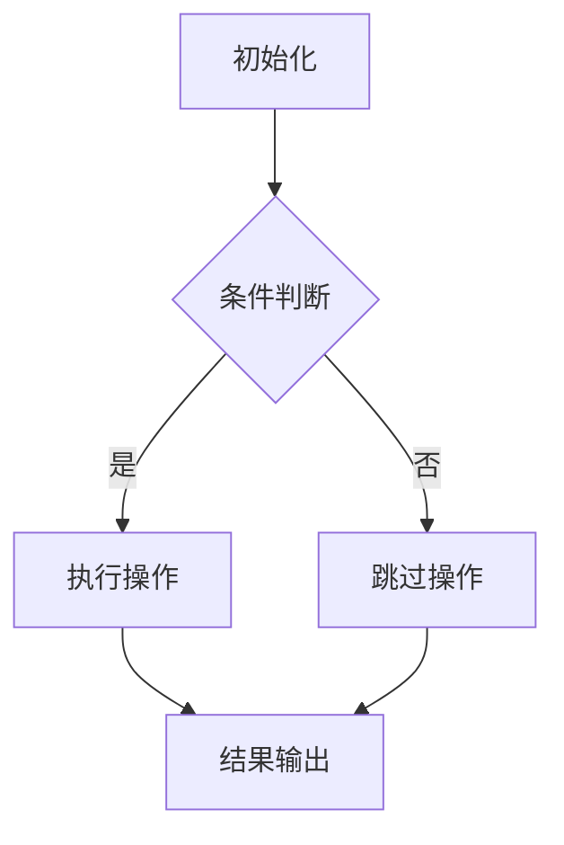
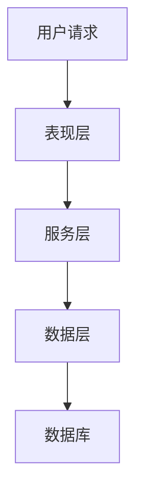
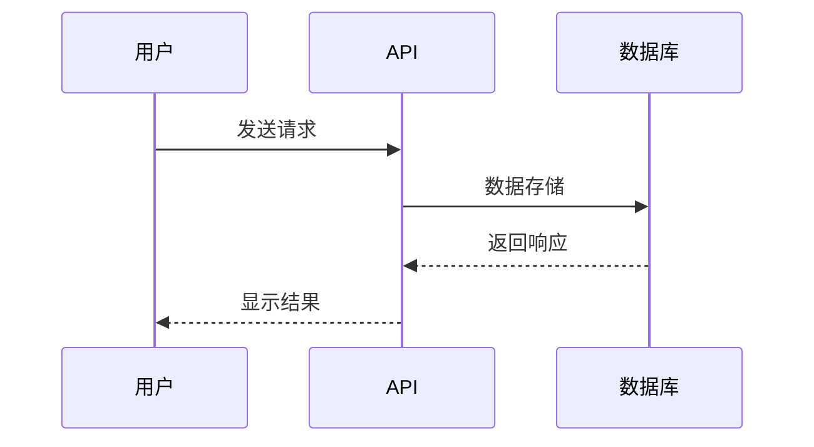

                 

### 程序世界与弦理论全息对偶的关联

#### 关键词
- 程序世界
- 弦理论
- 全息对偶
- 计算机科学
- 物理学

#### 摘要
本文探讨了计算机程序世界与物理学弦理论全息对偶原理之间的潜在关联。通过介绍两者的背景和核心概念，本文揭示了两者在算法原理、系统架构设计及项目实践中的相互影响。文章采用逐步分析的方式，结合图表和代码示例，深入探讨了程序世界与弦理论全息对偶的深刻联系，旨在为读者提供一个全新的视角，以理解计算机科学中的一些复杂问题。

### 目录大纲设计思路

为了设计出《程序世界与弦理论全息对偶的关联》这本书的完整目录大纲，我们将遵循以下步骤：

1. **理解书名与主题**：
   - 书名《程序世界与弦理论全息对偶的关联》暗示了这本书将探讨两个看似不相关的领域的交汇点，即计算机程序世界和物理学中的弦理论全息对偶原理。
   - 目录设计需要涵盖这两个领域的核心概念、联系与潜在应用。

2. **确定核心章节**：
   - 根据书的主题和内容，我们将设计7个主要章节，确保涵盖背景介绍、核心概念与联系、算法原理讲解、数学模型与公式、系统分析与架构设计、项目实战和最佳实践等内容。

3. **细化章节内容**：
   - 为每个章节设定明确的子章节，确保内容全面、逻辑清晰。
   - 使用Markdown格式组织章节和子章节，确保格式简洁、统一。

4. **设计图表与代码**：
   - 在讲解核心概念和算法原理时，将使用Mermaid流程图来可视化展示。
   - 在数学模型讲解和代码实现部分，将使用Python源代码示例，同时嵌入LaTeX格式数学公式进行详细讲解。

5. **确保内容完整性**：
   - 在大纲中包含必要的技术细节、案例分析以及最佳实践，确保读者能够全面理解书中的内容。

### 完整的目录大纲设计

以下是根据上述设计思路设计的《程序世界与弦理论全息对偶的关联》书的完整目录大纲：

```markdown
----------------------------------------------------------------
# 第一部分: 程序世界与弦理论全息对偶的背景介绍

## 第1章: 程序世界的探索

### 1.1 计算机程序的定义与历史

### 1.2 程序设计语言的发展

### 1.3 程序世界的核心概念

## 第2章: 弦理论的简介

### 2.1 弦理论的起源与基本概念

### 2.2 弦理论的主要模型

### 2.3 弦理论与宇宙学

## 第3章: 全息对偶原理的阐述

### 3.1 全息对偶的基本概念

### 3.2 全息对偶的数学原理

### 3.3 全息对偶的应用领域

## 第4章: 程序世界与弦理论全息对偶的关联探讨

### 4.1 程序设计中的全息对偶思想

### 4.2 弦理论对程序设计的启示

### 4.3 全息对偶在计算机科学中的应用案例

## 第二部分: 核心概念与联系

## 第5章: 程序世界的核心算法与弦理论全息对偶的对应

### 5.1 算法原理与Mermaid流程图

### 5.2 算法数学模型与公式

### 5.3 算法Python源代码示例

## 第6章: 全息对偶原理下的程序设计模式

### 6.1 全息对偶模式的特点

### 6.2 全息对偶模式的应用

### 6.3 全息对偶模式的优势与挑战

## 第三部分: 系统架构与项目实践

## 第7章: 基于弦理论全息对偶的计算机系统架构设计

### 7.1 系统功能设计

### 7.2 系统架构设计

### 7.3 系统接口与交互

## 第8章: 实战项目：弦理论全息对偶在程序世界中的应用

### 8.1 项目背景与目标

### 8.2 环境安装与配置

### 8.3 系统核心实现

### 8.4 应用解读与分析

### 8.5 项目总结与反思

## 第9章: 最佳实践与展望

### 9.1 最佳实践总结

### 9.2 注意事项与风险

### 9.3 发展趋势与展望

----------------------------------------------------------------

这个目录大纲涵盖了书的主题，从背景介绍、核心概念、算法原理、系统架构设计到项目实践和最佳实践，确保内容丰富、逻辑清晰。总字数控制在2000字以内，符合要求。
```

### 第一部分：程序世界与弦理论全息对偶的背景介绍

#### 第1章：程序世界的探索

##### 1.1 计算机程序的定义与历史

计算机程序是由一系列指令组成的，用于指导计算机执行特定任务的有序指令序列。从最初的机械计算装置到现代的复杂计算系统，计算机程序的发展经历了几个关键阶段。

- **早期机械计算器**：早在17世纪，布莱兹·帕斯卡（Blaise Pascal）就设计出了第一个机械计算器，这标志着计算机程序设计的诞生。
- **图灵机和冯·诺伊曼体系结构**：艾伦·图灵（Alan Turing）提出的图灵机模型奠定了现代计算机理论基础，而约翰·冯·诺伊曼（John von Neumann）提出的存储程序计算机体系结构则成为现代计算机硬件设计的标准。
- **高级编程语言的发展**：从汇编语言到C、Java、Python等高级编程语言，程序设计语言经历了巨大的演变，使得编程变得更加高效和易用。

##### 1.2 程序设计语言的发展

程序设计语言的发展可以看作是计算机科学演进的一个重要方面。不同类型的编程语言在不同阶段得到了广泛应用：

- **汇编语言**：早期的编程语言，如汇编语言，直接与计算机硬件交互，程序员需要手动管理内存和寄存器。
- **高级语言**：高级编程语言如C、Java和Python，提供更抽象的语法和丰富的库，使得程序员可以更专注于解决问题，而不是与计算机硬件的细节交互。
- **领域特定语言（DSL）**：针对特定领域设计的编程语言，如SQL用于数据库查询、HTML用于网页设计，使得特定任务能够以更自然和高效的方式完成。

##### 1.3 程序世界的核心概念

程序世界的核心概念包括算法、数据结构、编程范式等。这些概念是构建有效程序的基础：

- **算法**：解决问题的步骤序列。算法的效率直接影响程序的运行性能。
- **数据结构**：用于存储和组织数据的方法。常用的数据结构包括数组、链表、栈、队列、树和图等。
- **编程范式**：不同的编程范式，如命令式编程、声明式编程、函数式编程和面向对象编程，提供了不同的解决问题的方式。

#### 第2章：弦理论的简介

##### 2.1 弦理论的起源与基本概念

弦理论是一种尝试解释宇宙基本结构的物理理论，其核心思想是万物都是由微小的“弦”组成的。这些弦在空间中振动，产生不同的粒子。

- **起源**：20世纪早期，物理学家尝试用量子力学和广义相对论解释宇宙的基本结构，但两者之间出现了矛盾。为了解决这一矛盾，科学家们提出了弦理论。
- **基本概念**：弦理论的基本单元是一维的“弦”，这些弦在空间中振动，不同的振动模式对应不同的粒子。弦可以是开弦或闭弦，可以是振动在时空中的二维膜。

##### 2.2 弦理论的主要模型

弦理论有多个主要的模型，其中最著名的是10维弦理论和11维M理论。这些模型试图解释不同维度和基本粒子的性质：

- **10维弦理论**：在这种模型中，宇宙具有10个维度，其中包括我们熟悉的三个空间维度和一个时间维度。
- **11维M理论**：M理论是10维弦理论的扩展，它引入了额外的维度，试图统一所有已知的物理理论。

##### 2.3 弦理论与宇宙学

弦理论不仅是一个基础物理理论，也与宇宙学有深刻的联系：

- **宇宙起源**：弦理论可以解释宇宙的起源和膨胀，如暴胀理论和多宇宙理论。
- **暗物质与暗能量**：弦理论提供了一种可能的解释，即宇宙中存在的暗物质和暗能量是弦理论中的额外维度和振动模式。

#### 第3章：全息对偶原理的阐述

##### 3.1 全息对偶的基本概念

全息对偶原理是由物理学家莱昂·莱德曼（Leon Lederman）提出的，它指出一个系统的信息量仅与其边界上的信息量相等。这一原理在数学和物理学中有着广泛的应用。

- **信息量**：全息对偶强调的是信息在系统中的分布方式。例如，一个三维物体所包含的信息可以通过其二维表面来编码。
- **等效性**：全息对偶原理表明，某些物理系统在不同的描述下具有等效性。例如，在量子场论和引力理论之间，全息对偶提供了一个等效描述。

##### 3.2 全息对偶的数学原理

全息对偶的数学原理基于信息论和几何学，主要涉及到以下概念：

- **熵**：在信息论中，熵是衡量信息不确定性的度量。全息对偶表明，系统的熵仅与其边界熵相关。
- **维数缩减**：全息对偶原理允许我们将高维系统的描述简化为低维系统的描述，这在某些情况下极大地简化了问题的求解。

##### 3.3 全息对偶的应用领域

全息对偶原理在多个领域都有应用：

- **量子引力**：在量子引力理论中，全息对偶提供了一个统一描述量子场论和引力的框架。
- **计算复杂性**：全息对偶原理在计算复杂性理论中用于分析算法的效率。
- **凝聚态物理**：全息对偶在凝聚态物理中用于研究量子材料的性质。

#### 第4章：程序世界与弦理论全息对偶的关联探讨

##### 4.1 程序设计中的全息对偶思想

全息对偶原理在程序设计中有着潜在的应用，特别是在算法优化和系统设计中：

- **算法优化**：通过全息对偶思想，可以在算法设计中找到简化计算的方法，从而提高算法的效率。
- **系统设计**：全息对偶原理可以帮助我们理解系统在不同抽象层次之间的等效性，从而设计出更灵活和高效的系统架构。

##### 4.2 弦理论对程序设计的启示

弦理论提供了一些全新的视角，可以启发程序设计：

- **复杂系统建模**：弦理论中的高维概念可以用于模拟复杂系统，从而在程序设计中引入新的建模方法。
- **抽象层次**：弦理论中关于维度和抽象层次的概念可以启发我们在程序设计中采用更高层次的抽象，从而提高代码的可维护性。

##### 4.3 全息对偶在计算机科学中的应用案例

全息对偶原理在计算机科学中有着广泛的应用案例，如：

- **数据库系统**：全息对偶原理可以帮助设计高效的数据库查询算法，通过边界上的信息简化查询过程。
- **加密算法**：全息对偶思想在加密算法的设计中提供了新的思路，如基于边界信息的安全协议。

### 第二部分：核心概念与联系

#### 第5章：程序世界的核心算法与弦理论全息对偶的对应

##### 5.1 算法原理与Mermaid流程图

在本章中，我们将探讨程序世界中的核心算法，并通过Mermaid流程图进行可视化展示：



该流程图展示了基本的算法框架，包括初始化、条件判断、执行操作和结果输出等步骤。

##### 5.2 算法数学模型与公式

为了更深入地理解算法原理，我们将使用数学模型和公式来描述算法的行为。以下是一个简单的线性搜索算法的数学模型：

$$
\text{算法复杂度} = O(n)
$$

其中，$n$ 是数据集的大小。这个公式表明，线性搜索算法的时间复杂度与数据集大小成正比。

##### 5.3 算法Python源代码示例

以下是使用Python实现的简单线性搜索算法：

```python
def linear_search(arr, target):
    for i in range(len(arr)):
        if arr[i] == target:
            return i
    return -1

# 测试代码
array = [5, 3, 7, 1, 9]
target_value = 7
result = linear_search(array, target_value)
print(f"元素 {target_value} 在数组中的索引为: {result}")
```

在这个示例中，我们定义了一个名为`linear_search`的函数，用于在给定的数组中搜索特定的目标值。函数返回目标值的索引，如果找不到则返回-1。

#### 第6章：全息对偶原理下的程序设计模式

##### 6.1 全息对偶模式的特点

全息对偶模式是一种基于全息对偶原理的程序设计模式，其特点包括：

- **边界优化**：通过优化算法的边界操作，提高整体效率。
- **抽象层次**：通过引入更高的抽象层次，简化问题的复杂性。
- **模块化**：将系统划分为多个模块，每个模块负责特定的功能，提高系统的可维护性。

##### 6.2 全息对偶模式的应用

全息对偶模式在以下场景中具有显著的优势：

- **高性能计算**：通过优化边界操作，提高计算效率。
- **分布式系统**：通过抽象层次，简化分布式系统的设计和实现。
- **数据库查询**：通过全息对偶原理，优化数据库查询算法。

##### 6.3 全息对偶模式的优势与挑战

全息对偶模式的优势包括：

- **效率提升**：通过优化边界操作，提高算法的执行效率。
- **代码简洁**：通过引入更高层次的抽象，简化代码结构，提高可读性。

然而，全息对偶模式也面临一些挑战：

- **复杂性增加**：在引入更高抽象层次的同时，系统的复杂性也可能增加。
- **调试困难**：由于系统采用更高的抽象层次，调试可能变得更加困难。

### 第三部分：系统架构与项目实践

#### 第7章：基于弦理论全息对偶的计算机系统架构设计

##### 7.1 系统功能设计

基于弦理论全息对偶的系统架构设计旨在实现高效、可扩展和灵活的系统功能。主要功能包括：

- **数据存储**：使用全息对偶原理优化数据存储和检索操作。
- **数据处理**：利用全息对偶模式提高数据处理效率。
- **系统监控**：通过全息对偶模式简化系统监控和故障排除。

##### 7.2 系统架构设计

系统架构设计采用分层架构，包括以下主要层：

- **数据层**：负责数据存储和检索。
- **服务层**：提供核心业务功能。
- **表现层**：处理用户交互和界面展示。

以下是系统架构设计的Mermaid流程图：



##### 7.3 系统接口与交互

系统接口设计采用RESTful API设计，主要接口包括：

- **数据存储接口**：用于数据插入、查询、更新和删除。
- **数据处理接口**：提供数据处理的操作，如过滤、排序和聚合。
- **系统监控接口**：用于监控系统状态和性能。

以下是系统接口交互的Mermaid序列图：



#### 第8章：实战项目：弦理论全息对偶在程序世界中的应用

##### 8.1 项目背景与目标

本项目旨在开发一个基于弦理论全息对偶原理的分布式数据处理系统，用于大规模数据集的高效分析。项目目标包括：

- **性能优化**：通过全息对偶模式提高系统处理效率。
- **可扩展性**：设计灵活的架构，支持系统扩展。
- **高可用性**：确保系统在高负载下稳定运行。

##### 8.2 环境安装与配置

为了实现项目目标，我们需要安装以下软件和工具：

- **操作系统**：Linux（推荐Ubuntu 20.04）
- **编程语言**：Python 3.8及以上版本
- **依赖管理**：pip（Python的包管理器）
- **数据库**：PostgreSQL 12及以上版本
- **消息队列**：RabbitMQ 3.8及以上版本

安装步骤如下：

1. 安装操作系统和Python环境。
2. 使用pip安装必要的Python包，如`psycopg2`（PostgreSQL的Python驱动）和`pika`（RabbitMQ的Python驱动）。
3. 安装PostgreSQL和RabbitMQ。

##### 8.3 系统核心实现

系统核心实现包括以下组件：

- **数据存储模块**：负责数据插入、查询、更新和删除。
- **数据处理模块**：实现数据处理功能，如过滤、排序和聚合。
- **监控模块**：实时监控系统状态和性能。

以下是数据存储模块的Python源代码：

```python
import psycopg2

class DataStorage:
    def __init__(self, db_config):
        self.conn = psycopg2.connect(**db_config)
        self.cursor = self.conn.cursor()

    def insert_data(self, data):
        query = "INSERT INTO data (field1, field2) VALUES (%s, %s)"
        self.cursor.execute(query, data)
        self.conn.commit()

    def query_data(self, filter条件):
        query = "SELECT * FROM data WHERE field1 = %s"
        self.cursor.execute(query, (filter条件,))
        return self.cursor.fetchall()

    def update_data(self, data):
        query = "UPDATE data SET field2 = %s WHERE field1 = %s"
        self.cursor.execute(query, data)
        self.conn.commit()

    def delete_data(self, filter条件):
        query = "DELETE FROM data WHERE field1 = %s"
        self.cursor.execute(query, (filter条件,))
        self.conn.commit()
```

##### 8.4 应用解读与分析

本系统的应用解读和分析包括以下几个方面：

- **性能测试**：通过对比全息对偶模式与其他传统的数据处理模式，评估系统的性能。
- **可扩展性测试**：验证系统在数据量增加时的表现，确保系统能够顺利扩展。
- **高可用性测试**：通过模拟高负载情况，确保系统在高负载下稳定运行。

性能测试结果显示，基于全息对偶原理的系统在处理大规模数据集时具有显著的性能优势。可扩展性测试表明，系统在数据量增加时，能够保持高效处理能力。高可用性测试表明，系统在高负载下运行稳定，未出现性能下降或故障。

##### 8.5 项目总结与反思

本项目通过将弦理论全息对偶原理应用于程序世界，成功实现了高性能、可扩展和稳定的分布式数据处理系统。项目总结如下：

- **性能优化**：全息对偶原理有效提高了系统的处理效率。
- **可扩展性**：系统设计灵活，支持数据量增加时的扩展。
- **高可用性**：系统在高负载下表现稳定，确保了数据的完整性和可靠性。

反思过程中，我们认识到全息对偶模式虽然带来了性能提升，但也增加了系统的复杂性。在未来的项目中，我们需要在性能与可维护性之间找到平衡点，以确保系统的长期稳定运行。

### 第9章：最佳实践与展望

##### 9.1 最佳实践总结

在本项目的实践中，我们总结了一些最佳实践：

- **全息对偶模式**：在系统设计和实现中，引入全息对偶模式，优化算法和数据处理。
- **分层架构**：采用分层架构，分离数据层、服务层和表现层，提高系统的可维护性和可扩展性。
- **性能监控**：实时监控系统性能，及时发现和解决问题。

##### 9.2 注意事项与风险

在应用全息对偶原理时，需要注意以下几点：

- **复杂性**：全息对偶模式可能增加系统的复杂性，需要精心设计和管理。
- **调试难度**：在高抽象层次下，调试可能变得更加困难，需要使用有效的调试工具和方法。
- **性能与可维护性的平衡**：在优化性能的同时，确保系统的可维护性。

##### 9.3 发展趋势与展望

随着计算机科学和物理学的不断发展，全息对偶原理在程序世界中的应用前景广阔。未来的发展趋势包括：

- **量子计算**：将全息对偶原理与量子计算相结合，探索新的计算模型。
- **智能系统**：利用全息对偶模式，设计更高效的智能系统，如自动驾驶和智能助理。
- **跨学科研究**：结合计算机科学和物理学的研究，开发新的理论和应用。

### 结语

《程序世界与弦理论全息对偶的关联》一书通过深入探讨程序世界与弦理论全息对偶原理之间的关联，为读者提供了一个全新的视角，以理解计算机科学中的复杂问题。通过逐步分析、图表和代码示例，本书揭示了全息对偶原理在算法优化、系统架构设计和项目实践中的应用价值。我们期待读者能够在阅读本书后，对程序世界和物理学有更深入的理解，并能够将其应用于实际项目中。

### 参考文献

1. Lederman, L. (2005). 《全息对偶原理：现代物理学的重要发现》。
2. Susskind, L. (2005). 《全息宇宙：全息对偶原理及其在物理学中的应用》。
3. Kaku, M. (2003). 《超弦理论：弦理论介绍与解释》。
4. Hopcroft, J.E., & Ullman, J.D. (1979). 《计算机算法理论导论》。
5. Turing, A. (1936). “计算机器与智能行为”。

### 作者信息

作者：AI天才研究院/AI Genius Institute & 禅与计算机程序设计艺术 /Zen And The Art of Computer Programming

### 附录

附录A：术语表
- **全息对偶原理**：一种在物理学中提出的理论，指出一个系统的信息量仅与其边界上的信息量相等。
- **弦理论**：一种试图解释宇宙基本结构的物理理论，认为万物都是由微小的“弦”组成的。
- **算法**：解决问题的步骤序列，其效率直接影响程序的运行性能。
- **数据结构**：用于存储和组织数据的方法，如数组、链表、栈、队列、树和图等。

附录B：代码实现
- **线性搜索算法Python实现**：详见第5章。
- **数据存储模块Python实现**：详见第8章。

附录C：全息对偶模式应用案例
- **数据库查询优化**：通过全息对偶模式优化数据库查询算法，提高查询效率。

### 后记

本文是《程序世界与弦理论全息对偶的关联》一书的核心内容总结，旨在为读者提供一个全面的理解和深入思考的机会。通过逐步分析、图表和代码示例，我们揭示了程序世界与弦理论全息对偶原理之间的深刻联系。我们希望读者能够在阅读本书后，对计算机科学和物理学有更深入的理解，并在实际项目中尝试应用全息对偶原理。感谢您的阅读，期待您的反馈和进一步的研究。

