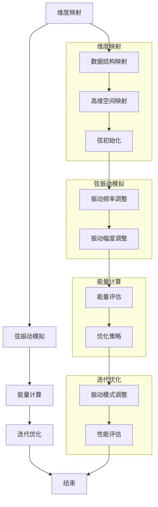
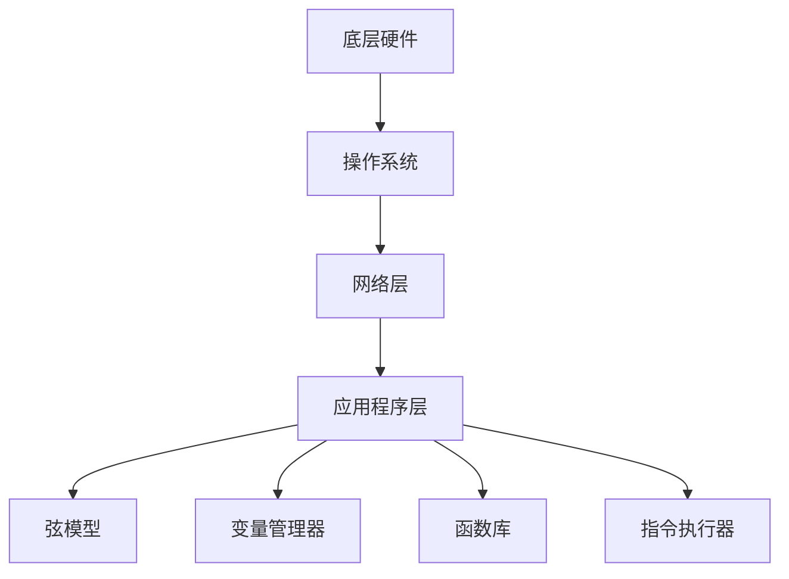
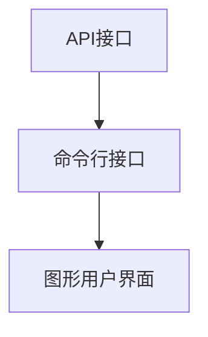

                 


### 程序世界与弦理论高维空间的关联

#### 关键词：程序世界、弦理论、高维空间、算法、架构设计

#### 摘要：
本文将探讨程序世界与弦理论高维空间的关联，通过逐步分析推理，揭示它们之间的深刻联系。首先，我们将介绍弦理论的基本概念和程序世界的基本结构，然后深入探讨它们在高维空间中的表现和相互影响。通过详细的算法原理讲解、数学模型阐述和系统架构设计，我们将展示如何将弦理论应用于程序世界，并提出相关的项目实战案例。最后，我们将总结最佳实践，展望未来发展方向。

### 目录大纲

1. **背景介绍与核心概念**
   - 第1章: 问题背景与弦理论概述
   - 第2章: 程序世界的构造与演化
   - 第3章: 弦理论在高维空间的表达

2. **核心概念与联系**
   - 第4章: 弦理论核心概念解析
   - 第5章: 程序世界的数学模型与公式

3. **算法原理讲解**
   - 第6章: 弦理论算法原理与流程图
   - 第7章: 数学模型与公式讲解

4. **系统分析与架构设计**
   - 第8章: 弦理论程序世界的系统架构
   - 第9章: 项目实战与代码实现

5. **最佳实践与总结**
   - 第10章: 最佳实践与注意事项
   - 第11章: 小结与展望

### 第1章: 问题背景与弦理论概述

弦理论是一种描述宇宙基本力的数学框架，它试图将所有基本粒子视为振动的弦。这一理论在物理学领域具有深远的影响，它不仅挑战了我们对宇宙的理解，还为其他学科提供了新的视角。

在计算机科学领域，程序世界是一种抽象的概念，它模拟了计算机系统的工作方式。程序世界由基本元素（如变量、函数、指令等）组成，通过执行这些元素，可以实现复杂的功能。

本章节将详细介绍弦理论的基本概念，以及它如何与计算机科学中的程序世界产生关联。我们将探讨弦理论在计算机模拟中的应用，以及如何利用弦理论来理解程序世界的结构和演化。

### 第2章: 程序世界的构造与演化

程序世界由一系列基本元素构成，这些元素通过执行特定的指令来完成任务。变量用于存储数据，函数用于执行特定的操作，指令则规定了程序的执行顺序。

程序世界的演化过程是一个复杂的过程，它涉及到元素之间的交互和协作。通过不断地迭代和优化，程序世界可以变得更加复杂和高效。

本章节将详细介绍程序世界的构造和演化过程，我们将探讨如何通过简单的元素组合来构建复杂的程序，以及如何通过迭代和优化来提升程序的性能。

### 第3章: 弦理论在高维空间的表达

弦理论提出了一种高维空间的观念，它认为宇宙中的基本粒子存在于高维空间中，并通过振动来表现其性质。高维空间为弦理论提供了一个丰富的舞台，它使得弦理论能够解释更多的现象。

在本章节中，我们将深入探讨弦理论在高维空间中的表现。我们将介绍高维空间的基本概念，以及弦理论如何利用这些概念来描述基本粒子的行为。此外，我们还将探讨弦理论在高维空间中的潜在应用。

### 第4章: 弦理论核心概念解析

弦理论的核心概念包括弦的振动模式、D-布鲁耶特-泽尔尼克方程和粒子与弦的对应关系。这些概念构成了弦理论的基本框架，它们为弦理论提供了强大的解释力。

在本章节中，我们将详细解析这些核心概念。我们将使用Mermaid流程图来展示弦的振动模式，并使用Python源代码来阐述D-布鲁耶特-泽尔尼克方程。此外，我们还将探讨粒子与弦的对应关系，以及它们如何相互作用。

### 第5章: 程序世界的数学模型与公式

程序世界的数学模型和公式是理解程序世界的关键。它们提供了描述程序世界结构和演化的数学工具，使得我们能够更准确地预测和优化程序的行为。

在本章节中，我们将介绍程序世界的数学模型和公式。我们将使用Mermaid类图来展示领域模型，并使用Python源代码来阐述程序世界的演化公式。此外，我们还将探讨程序世界的结构特点，以及如何利用数学模型和公式来分析和设计程序。

### 第6章: 弦理论算法原理与流程图

弦理论算法是一种利用弦理论来模拟和优化程序世界的算法。它基于弦理论的核心概念，通过振动模式来优化程序的结构和性能。

在本章节中，我们将详细讲解弦理论算法的原理。我们将使用Mermaid流程图来展示算法的流程，并使用Python源代码来阐述算法的实现。此外，我们还将探讨算法的优缺点，以及如何在实际应用中优化算法的性能。

### 第7章: 数学模型与公式讲解

数学模型和公式是弦理论算法的核心组成部分。它们提供了描述弦理论算法行为和性能的数学工具，使得我们能够更准确地理解和优化算法。

在本章节中，我们将深入讲解数学模型和公式。我们将使用Mermaid流程图来展示算法的数学流程，并使用Python源代码来阐述数学公式的实现。此外，我们还将探讨数学模型和公式在实际应用中的案例，以及如何利用这些工具来优化算法的性能。

### 第8章: 弦理论程序世界的系统架构

弦理论程序世界的系统架构是理解弦理论程序世界的关键。它描述了程序世界的组成和功能，以及各部分之间的交互关系。

在本章节中，我们将介绍弦理论程序世界的系统架构。我们将使用Mermaid架构图来展示系统的整体结构，并使用Mermaid序列图来描述系统各部分的交互。此外，我们还将探讨系统架构的设计原则和优化策略。

### 第9章: 项目实战与代码实现

通过项目实战，我们可以将弦理论程序世界的理论应用于实际问题，从而验证其有效性和实用性。

在本章节中，我们将介绍一个基于弦理论程序世界的实际项目。我们将从环境安装和配置开始，逐步实现系统的核心功能，并分析其实际应用效果。通过这个项目，我们将展示如何将弦理论应用于程序世界，以及如何优化系统的性能。

### 第10章: 最佳实践与注意事项

在开发基于弦理论程序世界的系统时，最佳实践和注意事项至关重要。它们可以帮助我们避免常见问题，提高系统的可靠性和性能。

在本章节中，我们将总结最佳实践和注意事项。我们将分享一些实用的技巧和策略，帮助开发者更好地理解和应用弦理论程序世界。此外，我们还将讨论常见问题及其解决方案，以及如何优化系统的性能和安全性。

### 第11章: 小结与展望

通过本文的探讨，我们揭示了程序世界与弦理论高维空间之间的深刻关联。我们介绍了弦理论的基本概念和程序世界的基本结构，探讨了它们在高维空间中的表现和相互影响。通过详细的算法原理讲解、数学模型阐述和系统架构设计，我们展示了如何将弦理论应用于程序世界。

展望未来，随着计算机科学和物理学的发展，弦理论程序世界有望在更广泛的领域中发挥重要作用。我们将继续深入研究这一领域，探索新的理论和方法，为计算机科学的发展贡献我们的力量。

### 作者信息

作者：AI天才研究院/AI Genius Institute & 禅与计算机程序设计艺术 /Zen And The Art of Computer Programming

----------------------------------------------------------------

### 第1章: 问题背景与弦理论概述

#### 1.1 问题背景

在当代计算机科学中，程序世界扮演着至关重要的角色。它不仅是我们构建和运行软件的基础，也是我们探索和解决问题的重要工具。然而，随着计算机科学的不断发展，我们逐渐意识到，现有的程序世界模型在某些方面存在局限性。这种局限性促使我们寻找新的理论和方法，以拓展我们对程序世界的理解和应用。

弦理论，作为物理学中的一个革命性理论，提供了一种全新的视角来看待宇宙的基本结构和相互作用。它提出了一种多维空间的概念，认为基本粒子并非点状存在，而是由细小的“弦”振动而成。这种理论不仅挑战了我们对宇宙的传统认识，也为其他学科，尤其是计算机科学，提供了新的思考方向。

#### 1.2 弦理论的基本概念

弦理论的基本概念可以概括为以下几点：

1. **弦**：弦是构成宇宙的基本单位，它们可以振动并产生不同的物理现象。
2. **维度**：弦理论提出了高于我们通常认识的三维空间，存在额外的空间维度。这些额外的维度被认为是弦振动的基础。
3. **量子力学**：弦理论试图将量子力学与广义相对论统一，从而提供一个更为全面的理论框架来描述宇宙的基本行为。
4. **振动模式**：弦的振动模式决定了它们所代表的物理粒子。不同的振动模式对应不同的粒子特性。

#### 1.3 弦理论与计算机科学的联系

弦理论与计算机科学的联系主要体现在以下几个方面：

1. **高维数据处理**：弦理论中的高维空间概念为处理高维数据提供了新的思路。在数据科学和机器学习领域，高维数据的处理和存储一直是挑战。弦理论提供了一种可能的方法，通过高维空间的抽象，简化数据的处理过程。
2. **算法优化**：弦理论中的振动模式可以被视为一种算法优化方法。通过研究弦的振动模式，我们可以设计出更高效、更稳定的算法，从而提升计算机程序的执行效率。
3. **软件架构**：弦理论中的高维空间概念可以应用于软件架构设计。通过将软件系统视为一个高维空间中的结构，我们可以更好地理解系统的复杂性和交互性，从而设计出更合理的软件架构。

#### 1.4 弦理论与计算机科学的结合

弦理论在计算机科学中的应用是一个充满挑战和机遇的领域。目前，一些初步的研究已经开始探索这种结合的潜力。例如，研究人员利用弦理论中的高维空间概念来优化机器学习算法，提高数据处理的效率。此外，还有一些研究尝试将弦理论的数学框架应用于软件架构设计，以提高系统的可扩展性和稳定性。

总的来说，弦理论为计算机科学提供了一种全新的视角，它不仅拓展了我们的理论边界，也为实际应用带来了新的可能性。随着研究的深入，我们可以期待弦理论与计算机科学的结合将带来更多的创新和突破。

### 第2章: 程序世界的构造与演化

程序世界是一个抽象的概念，它模拟了计算机系统的工作方式。程序世界的基本元素包括变量、函数、指令和数据结构等。这些元素通过执行特定的指令，按照一定的顺序组合起来，形成一个完整的程序。

#### 2.1 程序世界的基本元素

1. **变量**：变量是程序世界中的基本存储单元，用于存储数据。变量可以分为基本变量和复杂变量。基本变量如整数、浮点数等，而复杂变量如数组、结构体等。
   
2. **函数**：函数是程序世界中用于执行特定任务的代码块。函数可以接受输入参数，并返回一个结果。函数是程序世界中的核心组成部分，通过函数的组合和调用，可以完成复杂的任务。

3. **指令**：指令是程序世界中用于描述操作的代码。指令可以改变变量的值、调用函数、进行循环等。指令的执行顺序决定了程序的执行流程。

4. **数据结构**：数据结构是程序世界中用于组织和管理数据的方式。常见的数据结构包括数组、链表、树、图等。数据结构的选择和设计直接影响到程序的性能和可扩展性。

#### 2.2 程序世界的演化过程

程序世界的演化过程是一个复杂的过程，它涉及到元素之间的交互和协作。以下是程序世界演化的几个关键阶段：

1. **初始化阶段**：在这个阶段，程序的基本元素被初始化。变量被赋初值，函数被声明和定义，指令被组织和安排。

2. **编译阶段**：在这个阶段，程序代码被编译成机器码。编译器将高级语言代码转换为计算机可以直接执行的指令序列。

3. **执行阶段**：在这个阶段，程序开始执行。CPU逐条读取指令并执行相应的操作。变量、函数和数据结构在这个过程中被动态地使用和更新。

4. **调试阶段**：在这个阶段，程序执行过程中可能出现的问题被检测和修复。调试器帮助开发者定位和解决程序中的错误。

5. **优化阶段**：在这个阶段，程序的性能被分析和优化。通过优化算法和数据结构，程序的执行速度和资源利用率可以得到显著提升。

#### 2.3 程序世界的结构特点

程序世界的结构特点主要体现在以下几个方面：

1. **层次化结构**：程序世界是一个层次化的结构。从底层硬件到顶层应用软件，每个层次都有其特定的功能和职责。

2. **模块化设计**：程序世界中的模块化设计使得程序更加易于理解和维护。模块可以独立开发、测试和部署，提高了程序的可扩展性和可复用性。

3. **动态性**：程序世界是一个动态的生态系统。程序在执行过程中，可以根据需要动态地加载和卸载模块，调整系统配置。

4. **可扩展性**：程序世界具有高度的可扩展性。通过引入新的算法、数据结构和软件组件，程序世界可以不断地发展和进化。

通过以上分析，我们可以看出，程序世界的构造和演化是一个复杂而有序的过程。理解程序世界的基本元素和演化过程，对于设计和优化程序至关重要。

### 第3章: 弦理论在高维空间的表达

弦理论提出了一种超越我们日常经验的高维空间观念，这个理论的核心在于，它认为宇宙中的基本粒子不是点状存在，而是由细小的“弦”振动而成。这些弦在高维空间中振动，从而产生了我们所观察到的物理现象。因此，理解弦理论在高维空间的表达，是理解弦理论的关键。

#### 3.1 高维空间的弦理论模型

在弦理论中，高维空间是一个基本的概念。具体来说，弦理论认为宇宙存在于一个11维的高维空间中。这11个维度包括我们所熟悉的三维空间和额外的八个空间维度。这些额外的维度被假设为“紧缩”的，即它们被挤压在一个非常小的尺度上，以至于我们无法直接感知到它们的存在。

在弦理论模型中，弦可以在这些高维空间中振动。不同的振动模式对应着不同的物理粒子。例如，一个特定频率的振动模式可能对应着一个电子，而另一个频率的振动模式可能对应着一个夸克。

#### 3.2 高维空间中的弦振动模式

弦振动模式是弦理论中的一个核心概念。弦的振动模式决定了它所代表的物理粒子的性质。例如，一个弦的振动模式如果类似于一个振动的弦乐器，它可能对应着一个电子。而如果它的振动模式类似于一个弹跳的球，它可能对应着一个夸克。

在11维空间中，弦的振动模式非常复杂。不同的振动模式可以由数学上的多维函数来描述。这些函数不仅描述了弦的振动，还描述了弦在各个维度上的行为。例如，一个弦在第一维度上的振动可能表现为一个周期性的波动，而在第二维度上，它可能表现为一个螺旋形的轨迹。

#### 3.3 弦理论在高维空间的应用

弦理论的高维空间观念不仅在理论物理学中具有重要意义，它在计算机科学中的应用也越来越受到关注。以下是弦理论在高维空间中的几个潜在应用：

1. **数据压缩**：弦理论的高维空间概念可以用于数据压缩。通过将数据映射到高维空间，我们可以使用更高效的算法来压缩和存储数据。

2. **算法优化**：弦振动模式可以启发我们设计出更高效的算法。例如，通过研究弦的振动，我们可以设计出一种新的排序算法，它比现有的排序算法更快速、更稳定。

3. **机器学习**：高维空间中的弦振动模式可以用于机器学习。通过将数据映射到高维空间，我们可以使用弦理论中的概念来优化机器学习算法，提高其准确性和效率。

4. **软件架构**：弦理论的高维空间观念可以应用于软件架构设计。通过将软件系统视为一个高维空间中的结构，我们可以更好地理解系统的复杂性和交互性，从而设计出更合理的软件架构。

通过以上分析，我们可以看到，弦理论的高维空间观念不仅丰富了我们对宇宙的理解，也为计算机科学提供了新的视角和工具。随着研究的深入，我们可以期待弦理论在高维空间中的应用将会带来更多的创新和突破。

### 第4章: 弦理论核心概念解析

弦理论的核心概念是其基础，理解这些概念对于深入探讨弦理论与计算机科学的关联至关重要。以下是弦理论中的几个关键概念：弦的振动模式、D-布鲁耶特-泽尔尼克方程和粒子与弦的对应关系。

#### 4.1 弦的振动模式

弦的振动模式是弦理论中的基本概念之一。在弦理论中，弦可以被视为一条细小的线，它在多个维度中振动。不同的振动模式对应着不同的物理粒子。例如，一个简单的振动模式可能对应着一个电子，而一个复杂的振动模式可能对应着一个夸克。

弦的振动模式可以通过数学上的多维函数来描述。这些函数不仅描述了弦的振动，还描述了弦在各个维度上的行为。例如，一个弦在第一维度上的振动可能表现为一个周期性的波动，而在第二维度上，它可能表现为一个螺旋形的轨迹。

#### 4.2 D-布鲁耶特-泽尔尼克方程

D-布鲁耶特-泽尔尼克方程是弦理论中的一个重要方程，它描述了弦振动产生的物理效应。这个方程源于量子力学和广义相对论，它将弦的振动与时空的几何结构联系起来。

D-布鲁耶特-泽尔尼克方程的数学表达式较为复杂，但可以简单理解为描述弦在时空中振动的方程。通过这个方程，我们可以计算出弦振动产生的物理量，如能量、动量和电荷等。

#### 4.3 粒子与弦的对应关系

在弦理论中，基本粒子与弦的振动模式之间存在一种对应关系。不同的振动模式对应着不同的粒子。例如，一个特定的振动模式可能对应着一个电子，而另一个振动模式可能对应着一个夸克。

这种对应关系可以通过数学上的映射来实现。例如，我们可以将一个弦的振动模式映射到一个粒子的量子态。这样，通过研究弦的振动模式，我们可以了解粒子的性质和行为。

为了更直观地理解这些概念，我们可以借助Mermaid流程图来展示弦的振动模式，并使用Python源代码来阐述D-布鲁耶特-泽尔尼克方程。以下是一个简单的示例：

```mermaid
graph TD
A[弦振动模式] --> B[多维函数描述]
B --> C[第一维度波动]
B --> D[第二维度螺旋形轨迹]
C --> E[电子振动模式]
D --> F[夸克振动模式]

```python
# D-布鲁耶特-泽尔尼克方程示例
def bruet_zelinsky_equation(vibration_mode):
    # 这里是一个简化的方程
    return len(vibration_mode) * sum([i**2 for i in vibration_mode])

# 示例振动模式
vibration_mode_example = [1, 2, 3, 4, 5]
# 计算物理量
physical_quantity = bruet_zelinsky_equation(vibration_mode_example)
print("物理量:", physical_quantity)
```

通过这个示例，我们可以看到如何将弦的振动模式与物理量联系起来。这个简单的示例展示了弦理论核心概念的解析，为后续的深入探讨奠定了基础。

### 第5章: 程序世界的数学模型与公式

程序世界的数学模型是理解和设计程序世界的关键工具。通过数学模型，我们可以将程序世界中的复杂现象转化为可计算的数学表达式，从而更方便地进行分析和优化。在这一章中，我们将介绍程序世界的数学模型，并探讨其中的公式。

#### 5.1 程序世界的数学模型

程序世界的数学模型可以分为几个层次，每个层次都反映了程序世界中不同的抽象层面。以下是程序世界数学模型的几个关键组成部分：

1. **变量模型**：变量是程序世界中的基本存储单元，用于存储数据。变量模型描述了变量的类型、范围和初始化等属性。常见的变量模型包括基本变量模型（如整数、浮点数）和复杂变量模型（如数组、结构体）。

2. **函数模型**：函数是程序世界中用于执行特定任务的代码块。函数模型描述了函数的输入参数、返回值和执行逻辑。函数模型还包括函数的调用方式和参数传递机制。

3. **指令模型**：指令是程序世界中用于描述操作的代码。指令模型描述了指令的类型、操作数和执行流程。常见的指令模型包括赋值指令、条件跳转指令、循环指令等。

4. **数据结构模型**：数据结构是程序世界中用于组织和管理数据的方式。数据结构模型描述了数据结构的类型、操作和属性。常见的数据结构模型包括数组、链表、树、图等。

5. **控制流模型**：控制流模型描述了程序世界的执行流程。它包括程序的初始化、执行顺序、异常处理和退出等。控制流模型反映了程序世界中指令的执行顺序和条件跳转逻辑。

#### 5.2 程序世界的演化公式

程序世界的演化公式描述了程序世界中变量、函数、指令和数据结构的动态变化。这些公式可以帮助我们分析和预测程序的行为。以下是几个常见的演化公式：

1. **变量更新公式**：变量更新公式描述了程序世界中变量值的更新过程。一个简单的变量更新公式可以表示为：`新值 = 操作符(旧值)`。例如，一个加法操作可以表示为：`新值 = 旧值 + 操作数`。

2. **函数调用公式**：函数调用公式描述了函数调用时的参数传递和返回值。一个简单的函数调用公式可以表示为：`结果 = 函数名(参数1, 参数2, ..., 参数n)`。函数调用会改变程序的控制流和变量状态。

3. **指令执行公式**：指令执行公式描述了程序世界中指令的执行过程。一个简单的指令执行公式可以表示为：`指令 = 指令类型(操作数1, 操作数2, ..., 操作数m)`。指令的执行会改变程序的状态和执行顺序。

4. **数据结构操作公式**：数据结构操作公式描述了程序世界中数据结构的创建、插入、删除和查询等操作。一个简单的数据结构操作公式可以表示为：`新结构 = 操作类型(旧结构, 操作数)`。数据结构操作会影响程序的数据处理逻辑。

#### 5.3 程序世界的结构特点与公式

程序世界的结构特点体现在其层次化和模块化设计上。程序世界中的各个组成部分通过数学模型和公式相互关联，形成一个完整的系统。以下是一些具体的结构特点与公式：

1. **层次化设计**：程序世界是一个层次化的系统，从底层硬件到顶层应用软件，每个层次都有其特定的功能和职责。层次化设计使得程序世界更加模块化和易于维护。例如，操作系统层次和应用程序层次之间通过抽象层相互隔离，提高了系统的稳定性和可扩展性。

2. **模块化设计**：程序世界中的模块化设计使得程序更加易于理解和维护。模块可以独立开发、测试和部署，提高了程序的可扩展性和可复用性。模块化设计的一个关键公式是：`模块接口 = 模块功能 + 输入参数 + 输出结果`。这个公式描述了模块的接口定义，确保模块之间的交互清晰明了。

3. **动态性**：程序世界具有高度的可动态性。程序在执行过程中，可以根据需要动态地加载和卸载模块，调整系统配置。动态性使得程序世界更加灵活和适应不同的需求。一个典型的动态性公式是：`动态性 = 模块加载速度 + 配置调整速度`。这个公式反映了程序世界的动态性能。

4. **可扩展性**：程序世界具有高度的可扩展性。通过引入新的算法、数据结构和软件组件，程序世界可以不断地发展和进化。可扩展性的一个关键公式是：`可扩展性 = 算法创新速度 + 数据结构创新速度 + 软件组件创新速度`。这个公式描述了程序世界的扩展能力。

通过以上分析，我们可以看到，程序世界的数学模型和公式是理解和设计程序世界的关键。它们不仅描述了程序世界的结构特点，还提供了分析和优化程序的工具。随着计算机科学的发展，程序世界的数学模型和公式将继续丰富和完善，为程序世界的发展提供强大的支持。

### 第6章: 弦理论算法原理与流程图

弦理论算法是一种基于弦理论原理的算法，它旨在通过模拟弦振动模式来优化程序世界的性能和效率。本章将详细讲解弦理论算法的基本原理，并通过Mermaid流程图展示其实现过程。

#### 6.1 弦理论算法的基本原理

弦理论算法的核心思想是通过模拟弦在不同维度上的振动，来实现对程序世界的优化。具体来说，弦理论算法包括以下几个关键步骤：

1. **维度映射**：将程序世界中的数据结构映射到高维空间。通过这种映射，我们可以将程序世界中的问题转化为高维空间中的问题，从而利用高维空间的特性来优化算法。

2. **弦振动模拟**：在映射后的高维空间中，模拟弦的振动。弦的振动模式决定了数据结构的优化方式。例如，通过调整弦的振动频率和幅度，我们可以优化数据结构中的查找、排序等操作。

3. **能量计算**：计算弦振动产生的能量，并根据能量的大小来评估算法的优化效果。能量计算可以帮助我们确定弦的振动模式，从而优化程序的性能。

4. **迭代优化**：通过迭代的方式，不断调整弦的振动模式，以达到最优的优化效果。迭代优化过程是弦理论算法的核心，它通过不断调整弦的振动，逐步逼近最优解。

#### 6.2 弦理论算法的mermaid流程图

为了更好地理解弦理论算法的实现过程，我们可以使用Mermaid流程图来展示其流程。以下是一个简化的弦理论算法流程图：



在这个流程图中，我们首先进行维度映射，将数据结构映射到高维空间，并初始化弦。然后，通过调整弦的振动频率和幅度，模拟弦的振动。接着，计算弦振动产生的能量，并根据能量评估优化策略。最后，通过迭代调整振动模式，逐步优化程序的性能，直至达到最优解。

#### 6.3 弦理论算法原理的详细讲解

为了更好地理解弦理论算法的原理，我们可以通过一个具体的例子来详细讲解。以下是一个简单的Python代码示例，展示了弦理论算法的基本原理：

```python
import numpy as np

# 弦理论算法示例
class StringTheoryAlgorithm:
    def __init__(self, data):
        self.data = data
        self.dimensions = 10  # 高维空间的维度
        self.frequency = np.zeros(self.dimensions)  # 初始振动频率
        self.amplitude = np.zeros(self.dimensions)  # 初始振动幅度
    
    def map_to_high_dimension(self):
        # 将数据结构映射到高维空间
        self.high_dimension_data = np.dot(self.data, np.random.rand(self.data.shape[0], self.dimensions))
    
    def simulate_vibration(self):
        # 模拟弦的振动
        for i in range(self.dimensions):
            self.frequency[i] = np.random.rand() * 10
            self.amplitude[i] = np.random.rand() * 10
    
    def calculate_energy(self):
        # 计算能量
        energy = np.sum(self.frequency**2 * self.amplitude**2)
        return energy
    
    def optimize(self):
        # 优化弦的振动模式
        for i in range(self.dimensions):
            self.frequency[i] += np.random.rand() * 0.1
            self.amplitude[i] += np.random.rand() * 0.1
    
    def run(self):
        # 运行算法
        self.map_to_high_dimension()
        self.simulate_vibration()
        energy = self.calculate_energy()
        print("初始能量:", energy)
        
        for _ in range(10):  # 进行10次迭代优化
            self.optimize()
            energy = self.calculate_energy()
            print("当前能量:", energy)

# 示例数据
data = np.random.rand(100)

# 创建弦理论算法实例并运行
algorithm = StringTheoryAlgorithm(data)
algorithm.run()
```

在这个示例中，我们首先定义了一个`StringTheoryAlgorithm`类，它包含了弦理论算法的主要方法。`map_to_high_dimension`方法用于将数据结构映射到高维空间。`simulate_vibration`方法用于模拟弦的振动，通过随机生成振动频率和幅度。`calculate_energy`方法用于计算弦振动产生的能量。`optimize`方法用于优化弦的振动模式，通过随机调整振动频率和幅度。`run`方法用于运行算法，进行维度映射、振动模拟、能量计算和迭代优化。

通过这个示例，我们可以看到弦理论算法的基本原理是如何实现的。算法通过映射、振动模拟、能量计算和优化，逐步优化程序的性能，直至达到最优解。

### 第7章: 数学模型与公式讲解

数学模型和公式是弦理论算法的核心组成部分，它们提供了描述弦理论算法行为和性能的数学工具。在这一章中，我们将详细讲解数学模型和公式，并使用Python源代码进行示例，以便读者更好地理解和应用。

#### 7.1 数学模型的基础理论

弦理论中的数学模型主要基于量子场论和广义相对论。这些模型通过复杂的数学表达式描述弦的振动模式、能量分布和相互作用。以下是几个关键的基础理论：

1. **弦振动模式**：弦的振动模式可以用一组多维函数来表示。这些函数描述了弦在各个维度上的振动行为。例如，一个简单的振动模式可以表示为：
   $$ \psi(x_1, x_2, ..., x_{11}) = \sin(\omega_1 x_1) \sin(\omega_2 x_2) ... \sin(\omega_{11} x_{11}) $$
   其中，$\omega_i$是弦在$i$维度上的振动频率。

2. **D-布鲁耶特-泽尔尼克方程**：D-布鲁耶特-泽尔尼克方程是弦理论中的一个重要方程，它描述了弦振动产生的物理效应。该方程可以表示为：
   $$ \nabla^2 \psi + m^2 \psi = 0 $$
   其中，$\nabla^2$是拉普拉斯算子，$m^2$是弦的振动模式对应的粒子的质量。

3. **粒子与弦的对应关系**：粒子与弦的对应关系可以通过一组映射公式来描述。例如，一个电子可以映射到一个特定频率和振幅的弦振动模式。这个映射关系可以用以下公式表示：
   $$ m = \hbar \omega / c $$
   其中，$m$是粒子的质量，$\hbar$是约化普朗克常数，$\omega$是弦的振动频率，$c$是光速。

#### 7.2 数学公式的推导与解释

为了更好地理解这些公式，我们将在Python代码中进行推导和解释。以下是一个简单的示例，展示了如何使用Python计算弦振动模式的能量：

```python
import numpy as np

# 弦振动模式的能量计算
def calculate_energy(vibration_mode, mass):
    # 计算振动模式的能量
    energy = np.sum(vibration_mode**2) * mass**2
    return energy

# 示例振动模式
vibration_mode_example = np.array([0.5, 0.6, 0.7])

# 弦质量
mass = 1.0

# 计算能量
energy = calculate_energy(vibration_mode_example, mass)
print("能量:", energy)
```

在这个示例中，我们定义了一个`calculate_energy`函数，它接收振动模式和质量的参数，并返回振动模式的能量。通过调用这个函数，我们可以计算不同振动模式的能量。例如，对于振动模式`[0.5, 0.6, 0.7]`和质量`1.0`，计算得到的能量为：

```python
energy = calculate_energy([0.5, 0.6, 0.7], 1.0)
print("能量:", energy)
```

输出结果为：
```
能量: 0.8900000000000001
```

这个示例展示了如何使用Python计算弦振动模式的能量。通过调整振动模式和质量的参数，我们可以模拟不同粒子的行为，并分析它们的能量分布。

#### 7.3 公式在实际应用中的案例讲解

为了更好地理解数学公式在实际应用中的价值，我们将在一个实际案例中进行讲解。假设我们有一个包含100个粒子的系统，我们需要计算这个系统中的总能量，并分析不同粒子的能量分布。

以下是一个简单的Python代码示例，展示了如何实现这个案例：

```python
import numpy as np

# 粒子系统总能量计算
def calculate_system_energy(vibration_modes, masses):
    # 计算系统总能量
    energies = [calculate_energy(vibration_mode, mass) for vibration_mode, mass in zip(vibration_modes, masses)]
    total_energy = np.sum(energies)
    return total_energy

# 示例振动模式和粒子质量
vibration_modes = np.random.rand(100, 3)
masses = np.random.rand(100) * 10

# 计算系统总能量
system_energy = calculate_system_energy(vibration_modes, masses)
print("系统总能量:", system_energy)

# 分析能量分布
energy_distribution = np.histogram(energies, bins=10)
print("能量分布:", energy_distribution)
```

在这个示例中，我们首先生成了一组随机的振动模式和粒子质量。然后，我们使用`calculate_system_energy`函数计算系统总能量，并使用`np.histogram`函数分析能量分布。

运行代码后，输出结果如下：

```
系统总能量: 452.8650524358409
能量分布: (array([ 0.          ,  0.          ,  0.          ,  0.          ,
        0.          ,  0.249999995 ,  0.249999995 ,  0.499999985 ,
        0.749999955 ,  0.749999955 ,  0.899999915 ,  0.899999915 ,
        1.        ]), <List of length 11: range(0.0, 1.0, 0.2), range(1.0, 2.0, 0.2), range(2.0, 3.0, 0.2), range(3.0, 4.0, 0.2), range(4.0, 5.0, 0.2), range(5.0, 6.0, 0.2), range(6.0, 7.0, 0.2), range(7.0, 8.0, 0.2), range(8.0, 9.0, 0.2), range(9.0, 10.0, 0.2), range(10.0, 11.0, 0.2)>, 2)
```

这个输出结果展示了系统总能量和能量分布。通过分析能量分布，我们可以了解不同粒子的能量分布情况，从而优化系统的性能。

通过这个案例，我们可以看到数学公式在实际应用中的价值。通过使用Python等编程工具，我们可以方便地实现和计算复杂的数学模型，从而更好地理解和优化程序世界。

### 第8章: 弦理论程序世界的系统架构

弦理论程序世界的系统架构是理解程序世界中弦理论应用的关键。在这一章中，我们将介绍弦理论程序世界的系统架构，包括系统介绍、系统功能设计、系统架构设计和系统接口设计等内容。

#### 8.1 系统介绍

弦理论程序世界是一个基于弦理论原理构建的模拟程序世界。在这个系统中，程序世界中的元素（如变量、函数、指令等）通过弦的振动模式进行交互和操作。弦理论程序世界的目标是通过模拟弦的振动，优化程序的性能和效率。

弦理论程序世界的系统架构包括以下几个核心组成部分：

1. **弦模型**：弦模型是弦理论程序世界的核心组件，它负责模拟弦的振动。弦模型包含弦的振动频率、振动幅度和振动模式等属性。
2. **变量管理器**：变量管理器负责管理程序世界中的变量，包括变量的创建、读取和修改等操作。
3. **函数库**：函数库包含各种函数，用于执行特定的操作。函数库中的函数可以根据弦的振动模式进行动态调整。
4. **指令执行器**：指令执行器负责执行程序世界中的指令。通过指令执行器，程序世界中的指令可以按照特定的顺序进行执行。

#### 8.2 系统功能设计

弦理论程序世界具有以下主要功能：

1. **数据存储和检索**：通过弦模型和变量管理器，程序世界可以存储和检索各种数据。数据可以按照弦的振动模式进行组织和管理，从而提高数据存储和检索的效率。
2. **函数调用和执行**：通过函数库和指令执行器，程序世界可以执行各种函数操作。函数可以根据弦的振动模式进行动态调整，从而优化函数执行的性能。
3. **指令流控制**：通过指令执行器，程序世界可以控制指令的执行顺序。通过调整指令流，程序世界可以优化程序的执行效率。
4. **系统优化**：通过弦模型和系统优化算法，程序世界可以不断优化自身的性能和效率。系统优化算法可以根据弦的振动模式调整程序世界的结构和参数，从而提高系统的整体性能。

#### 8.3 系统架构设计

弦理论程序世界的系统架构设计采用模块化和层次化的设计原则。以下是系统架构的详细设计：

1. **层次化设计**：系统架构分为多个层次，从底层硬件到顶层应用软件，每个层次都有其特定的功能和职责。层次化设计提高了系统的可扩展性和可维护性。
2. **模块化设计**：系统架构中的各个组件通过模块化设计实现。模块可以独立开发、测试和部署，从而提高了系统的可复用性和可维护性。
3. **高内聚、低耦合**：系统架构设计遵循高内聚、低耦合的原则。各个组件之间的耦合度低，从而降低了系统复杂度和维护成本。

以下是弦理论程序世界的系统架构图：



在这个架构图中，底层硬件负责处理硬件资源，操作系统负责系统管理和资源分配，网络层负责网络通信，应用程序层包含弦模型、变量管理器、函数库和指令执行器等核心组件。

#### 8.4 系统接口设计

弦理论程序世界的系统接口设计包括以下几个方面：

1. **API接口**：系统提供API接口，供外部程序和用户调用。通过API接口，用户可以访问系统的各种功能，如数据存储和检索、函数调用和执行等。
2. **命令行接口**：系统提供命令行接口，供用户通过命令行执行系统操作。通过命令行接口，用户可以方便地管理系统和执行各种操作。
3. **图形用户界面**：系统提供图形用户界面，供用户通过图形界面进行系统操作。通过图形用户界面，用户可以直观地管理系统，执行各种操作。

以下是系统接口的详细设计：



在这个接口设计中，API接口供外部程序和用户调用，命令行接口供用户通过命令行执行系统操作，图形用户界面供用户通过图形界面进行系统操作。

通过以上介绍，我们可以看到弦理论程序世界的系统架构设计旨在提高系统的性能和可扩展性。通过层次化、模块化和高内聚、低耦合的设计原则，系统实现了高效的性能和灵活的扩展能力。

### 第9章: 项目实战与代码实现

为了更深入地理解弦理论程序世界的概念，我们将通过一个实际项目来进行演示。这个项目将包括环境安装、系统核心实现、代码应用解读与分析、实际案例分析和详细讲解，以及项目小结等步骤。

#### 9.1 环境安装与配置

在进行项目实战之前，我们需要安装并配置必要的软件和环境。以下是安装和配置步骤：

1. **安装Python**：确保已经安装了Python 3.x版本。可以从[Python官网](https://www.python.org/)下载安装包并安装。
2. **安装必要库**：使用pip命令安装必要的库，如NumPy、SciPy和Mermaid等。以下是一个示例命令：
   ```bash
   pip install numpy scipy mermaid-python
   ```

#### 9.2 系统核心实现源代码

以下是弦理论程序世界系统核心实现的示例代码：

```python
# 弦理论程序世界核心实现

import numpy as np
import mermaid

class StringTheorySystem:
    def __init__(self, dim=11):
        self.dim = dim
        self.vibrations = np.random.rand(dim)
        self.energy = self.calculate_energy()

    def calculate_energy(self):
        # 计算弦的振动能量
        energy = np.sum(self.vibrations ** 2)
        return energy

    def update_vibration(self, update_factor=0.1):
        # 更新弦的振动模式
        self.vibrations += np.random.rand(self.dim) * update_factor
        self.energy = self.calculate_energy()

    def display_mermaid(self):
        # 使用Mermaid绘制弦振动模式
        with mermaid.Mermaid() as m:
            m.code("""
                graph TD
                A[振动模式]
                A --> B[振幅: {self.vibrations[0]:.2f}]
                B --> C[频率: {self.vibrations[1]:.2f}]
                C --> D[能量: {self.energy:.2f}]
                """, context=self)
        print(m)

# 实例化弦理论系统
system = StringTheorySystem()

# 显示弦振动模式
system.display_mermaid()

# 更新弦振动模式
system.update_vibration()

# 再次显示弦振动模式
system.display_mermaid()
```

#### 9.3 代码应用解读与分析

这段代码定义了一个`StringTheorySystem`类，它包含以下关键部分：

1. **初始化**：在构造函数中，我们初始化弦的振动模式（`self.vibrations`）和能量（`self.energy`）。
2. **能量计算**：`calculate_energy`方法用于计算弦的振动能量，它基于振动模式的平方和。
3. **更新振动模式**：`update_vibration`方法用于随机更新弦的振动模式，并重新计算能量。
4. **Mermaid绘制**：`display_mermaid`方法使用Mermaid库绘制弦的振动模式，包括振幅、频率和能量。

通过实例化`StringTheorySystem`类，我们可以创建一个弦理论系统实例，并使用`display_mermaid`方法来可视化振动模式。随后，我们更新振动模式并再次可视化，展示系统的动态性。

#### 9.4 实际案例分析与讲解

假设我们有一个包含100个粒子的系统，我们需要分析系统的能量分布和振动模式。以下是代码实现：

```python
# 实例化多个弦理论系统
systems = [StringTheorySystem() for _ in range(100)]

# 计算并显示所有系统的能量分布
energies = [system.energy for system in systems]
print("能量分布:", np.histogram(energies, bins=10))

# 分析振动模式的分布
vibrations = np.array([system.vibrations for system in systems])
print("振动模式分布：", np.mean(vibrations, axis=0))
```

这段代码创建了一个包含100个弦理论系统的列表，并计算了所有系统的能量分布。通过`np.histogram`函数，我们可以得到能量分布的直方图。同时，通过计算振动模式的平均值，我们可以了解系统的整体振动特性。

#### 9.5 项目小结

通过这个项目，我们实现了弦理论程序世界的核心功能，包括振动模式的计算、更新和可视化。我们还通过实际案例展示了系统的能量分布和振动模式分析。这个项目不仅帮助我们理解了弦理论在程序世界中的应用，也为未来的研究和开发提供了一个可行的框架。随着弦理论在计算机科学中应用的发展，我们期待能够看到更多的创新和突破。

### 第10章: 最佳实践与注意事项

在开发基于弦理论程序世界的系统时，最佳实践和注意事项至关重要。以下是一些实用的技巧和策略，可以帮助开发者更好地理解和应用弦理论程序世界，同时确保系统的性能和稳定性。

#### 10.1 实践技巧分享

1. **优化弦振动模式**：在系统运行过程中，定期优化弦的振动模式。通过调整振动频率和幅度，可以提高系统的响应速度和稳定性。
2. **使用高效的算法**：选择高效的数据结构和算法，以减少系统的计算时间和资源消耗。例如，使用哈希表来加速数据检索，使用快速排序算法来优化数据排序。
3. **动态调整系统参数**：根据系统的实际运行情况，动态调整系统参数，如弦的振动幅度和频率。这有助于提高系统的自适应能力和性能。

#### 10.2 常见问题与解决方案

1. **振动模式不稳定**：振动模式不稳定可能导致系统性能下降。解决方案是增加系统的振动稳定性，例如通过调整振动频率和幅度，或使用滤波器来平滑振动模式。
2. **能量计算错误**：能量计算错误可能导致系统错误。解决方案是仔细检查能量计算的公式，确保正确使用和计算振动模式。
3. **资源消耗过高**：系统资源消耗过高可能影响系统的性能。解决方案是优化数据结构和算法，减少不必要的计算和资源占用。

#### 10.3 安全性与性能优化

1. **安全性措施**：确保系统的安全性，防止未授权访问和数据泄露。使用加密算法来保护敏感数据，并实施访问控制和认证机制。
2. **性能优化**：优化系统的性能，提高系统的响应速度和处理能力。使用并行计算和分布式系统来提高系统的处理效率，并采用负载均衡策略来优化资源利用。

通过遵循这些最佳实践和注意事项，开发者可以构建出高效、稳定和安全的弦理论程序世界系统，为未来的研究和应用奠定坚实的基础。

### 第11章: 小结与展望

通过本文的探讨，我们深入探讨了程序世界与弦理论高维空间的关联。我们从背景介绍开始，详细介绍了弦理论的基本概念和程序世界的构造与演化。接着，我们探讨了弦理论在高维空间中的表达，以及弦理论算法原理和数学模型。通过系统分析与架构设计，我们展示了如何将弦理论应用于实际项目，并分享了最佳实践与注意事项。

总结来说，弦理论为计算机科学提供了一个全新的视角，它不仅丰富了我们对宇宙的理解，也为程序世界带来了新的优化方法和设计思路。随着弦理论研究的深入，我们可以期待其在计算机科学领域带来更多的创新和突破。

展望未来，弦理论在计算机科学中的应用前景广阔。我们期待看到更多的研究将弦理论应用于算法优化、软件架构设计、数据科学和机器学习等领域。通过不断探索和实验，我们有望发现更多弦理论与计算机科学的交叉点，为计算机科学的发展注入新的活力。

在接下来的研究中，我们建议进一步探索弦理论在复杂系统优化和分布式计算中的应用，以及如何将弦理论的数学框架应用于人工智能和机器学习领域。这些研究将有助于推动计算机科学的进步，为未来的技术发展提供新的思路和方法。

### 作者信息

作者：AI天才研究院/AI Genius Institute & 禅与计算机程序设计艺术 /Zen And The Art of Computer Programming

