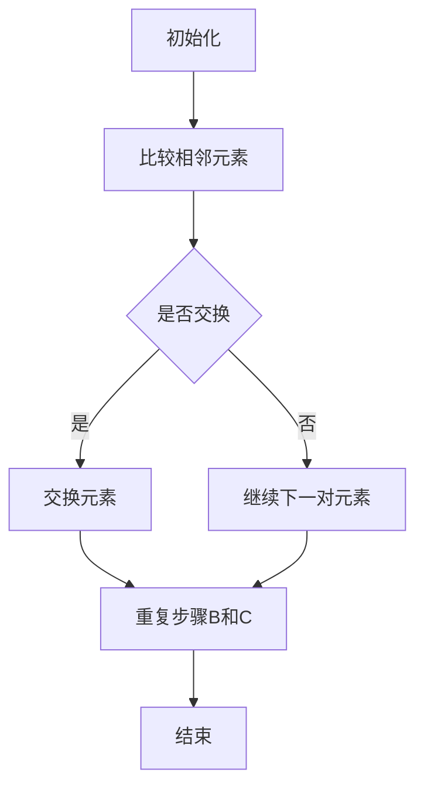
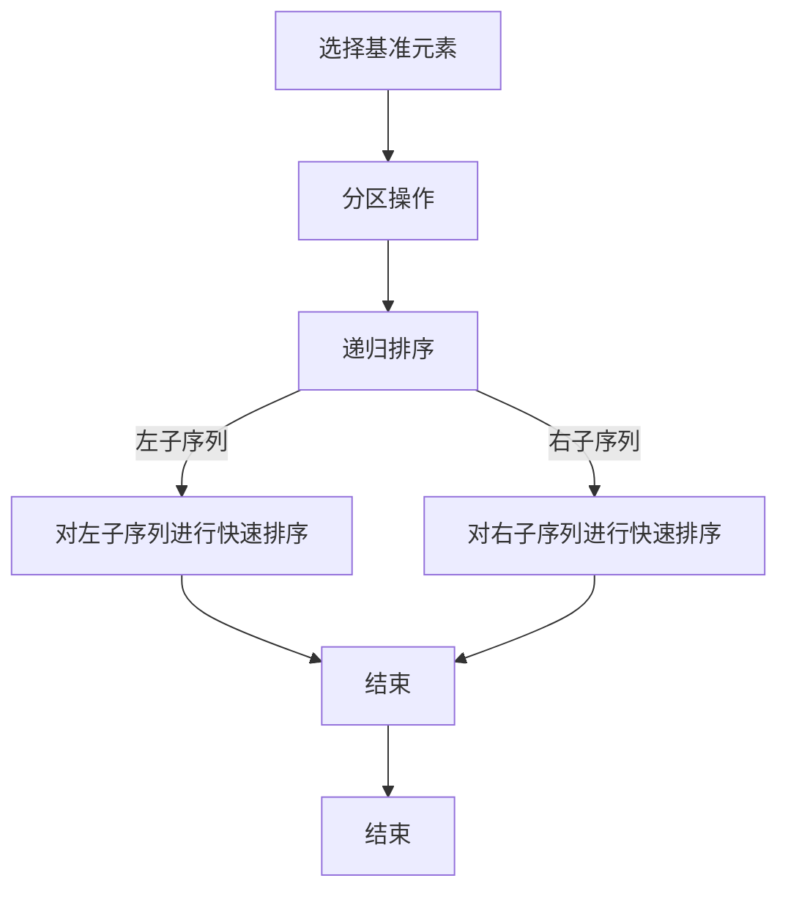
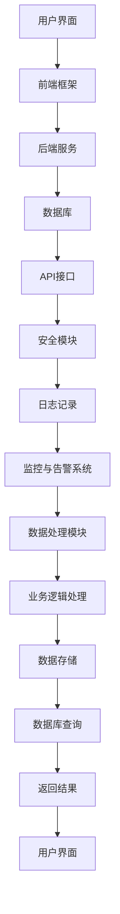

                 


## 程序世界与循环宇宙模型的类比

### 摘要

本文旨在探讨计算机程序世界与循环宇宙模型之间的类比关系。通过对程序世界的核心概念、原理和应用进行分析，再结合循环宇宙模型的起源、核心理论和研究进展，我们尝试揭示两者在结构、机制和演化上的相似性。通过深入的类比分析，本文旨在为读者提供一个全新的视角，理解计算机编程与宇宙学之间的关联，以及这类类比对未来科技发展的潜在启示。

### 关键词

程序世界；循环宇宙模型；类比分析；计算机编程；宇宙学

### 1. 引言与背景

#### 1.1 书籍主题概述

《程序世界与循环宇宙模型的类比》旨在探索计算机编程与宇宙学之间的跨学科联系。程序世界，即由计算机代码构建的逻辑世界，是现代信息科技的核心；而循环宇宙模型则是对宇宙循环演化过程的科学描述。这两者看似截然不同，但在深层次的结构和运作机制上，它们之间可能存在着令人惊讶的相似性。

#### 1.2 研究背景

计算机程序世界的发展始于20世纪中期，随着计算机技术的飞速进步，程序世界已经成为我们日常生活的重要组成部分。与此同时，宇宙学领域的研究也在不断深入，循环宇宙模型作为宇宙演化的一种新理论，逐渐得到学术界的认可。

研究计算机程序世界与循环宇宙模型之间的类比，不仅有助于我们更深入地理解计算机编程的本质，还可能为宇宙学的研究提供新的思路和方法。

#### 1.3 研究方法与框架

本文将采用比较分析的方法，通过对程序世界的核心概念和循环宇宙模型的核心理论进行详细解析，揭示两者之间的对应关系。同时，本文将结合具体的案例研究，探讨这种类比在理论和实践中的意义。

### 2. 程序世界的核心概念

#### 2.1 程序世界的基础理论

程序世界的基础理论主要包括程序的基本结构、程序设计原则和程序的执行原理。程序的基本结构通常由变量、控制结构和数据结构组成，这些元素共同决定了程序的逻辑和行为。程序设计原则则强调可读性、可维护性和效率。程序的执行原理涉及到计算机的运行机制和执行流程。

#### 2.2 程序世界的核心概念

程序世界的核心概念包括变量、控制结构、数据结构等。变量是程序中用于存储数据的容器，控制结构决定了程序的执行流程，而数据结构则是用于组织和管理数据的方式。

#### 2.3 程序世界的应用领域

程序世界的应用领域非常广泛，包括人工智能、数据科学和软件工程等。在人工智能领域，程序用于模拟和学习智能行为；在数据科学领域，程序用于数据处理和分析；在软件工程领域，程序用于软件开发和维护。

#### 2.4 程序世界的挑战与趋势

随着技术的不断发展，程序世界面临着新的挑战和趋势。新兴技术的发展，如量子计算和区块链技术，为程序世界带来了新的机遇和挑战。同时，程序世界的未来发展也将受到人工智能和自动化技术的影响。

### 3. 循环宇宙模型的介绍

#### 3.1 循环宇宙模型的起源

循环宇宙模型起源于20世纪末，是对传统宇宙学中线性演化观点的挑战。该模型认为宇宙的演化不是线性的，而是循环的。这一观点受到了一些物理学和宇宙学家的支持。

#### 3.2 循环宇宙模型的核心理论

循环宇宙模型的核心理论包括宇宙循环的概念、宇宙演化的循环模式以及宇宙循环的应用。宇宙循环的概念认为宇宙经历着不断的诞生、发展和消亡的循环过程。宇宙演化的循环模式描述了这种循环过程的具体机制。宇宙循环的应用则涉及到宇宙学、天文学和物理学等领域。

#### 3.3 循环宇宙模型的研究进展

循环宇宙模型的研究进展主要体现在物理学和宇宙学领域。在物理学领域，循环宇宙模型为解释一些实验现象提供了新的思路。在宇宙学领域，循环宇宙模型则为我们理解宇宙的演化过程提供了新的视角。

### 4. 程序世界与循环宇宙模型的类比分析

#### 4.1 类比分析的框架与方法

类比分析的框架与方法主要包括程序的元素与循环宇宙模型元素的对应关系、类比分析的基本原理和类比分析的工具。

#### 4.2 类比分析的案例研究

类比分析的案例研究将涉及算法与宇宙演化、数据结构与宇宙结构、控制结构与宇宙循环等具体案例。

#### 4.3 类比分析的结果与启示

类比分析的结果与启示将包括程序世界的新的理解、循环宇宙模型的新的应用方向以及类比分析的限制与展望。

### 5. 结论与展望

#### 5.1 主要研究成果

主要研究成果将包括程序世界与循环宇宙模型类比的发现、类比分析的贡献以及研究中的创新点。

#### 5.2 研究的不足与改进

研究的不足与改进将包括研究的局限性、研究中的问题以及未来研究的方向。

### 附录

附录将包括相关的数学公式、算法流程图、系统架构设计图等辅助材料。

### 参考文献

参考文献将包括本文引用的所有学术文献和资料。

### 作者信息

作者：AI天才研究院/AI Genius Institute & 禅与计算机程序设计艺术 /Zen And The Art of Computer Programming

---

### 2.1 程序世界的基础理论

程序世界的基础理论是构建所有计算机程序的核心框架。它涵盖了程序的基本结构、设计原则和执行原理。理解这些基础理论对于深入探索计算机科学和工程至关重要。

#### 2.1.1 程序的基本结构

程序的基本结构通常由以下几个部分组成：

- **输入**：程序接收用户或其他程序提供的初始数据。
- **处理**：程序对输入数据进行处理，执行特定的计算或操作。
- **输出**：程序将处理结果输出到屏幕或其他存储媒介。
- **存储**：程序在执行过程中需要存储中间结果和状态。

这种结构构成了程序的基本执行流程，确保程序能够有序地处理数据和完成任务。

#### 2.1.2 程序设计原则

程序设计原则是编写高效、可维护和易于理解的代码的指导方针。以下是一些重要的设计原则：

- **模块化**：将程序拆分为多个模块或函数，每个模块负责特定的功能。这有助于提高代码的可重用性和可维护性。
- **可读性**：编写清晰、简洁和易于理解的代码，避免使用复杂的语法和晦涩难懂的表达。
- **鲁棒性**：编写能够处理各种输入和异常情况的代码，确保程序在错误或异常情况下仍能稳定运行。
- **效率**：优化代码的执行效率，减少不必要的计算和资源消耗。

#### 2.1.3 程序的执行原理

程序的执行原理涉及到计算机硬件和软件的相互作用。以下是其核心组成部分：

- **编译器/解释器**：编译器将高级语言代码转换为机器语言，而解释器则直接执行高级语言代码。两者都是程序执行的关键工具。
- **操作系统**：操作系统负责管理计算机的资源和进程，确保程序能够正确运行。
- **指令集**：计算机的指令集定义了程序可以执行的操作集合。不同类型的计算机可能具有不同的指令集。
- **内存管理**：程序在执行过程中需要使用内存来存储数据和指令。内存管理负责分配和回收内存空间。

程序执行的基本过程如下：

1. **加载**：将程序代码从存储设备加载到内存中。
2. **编译/解释**：编译器或解释器将程序代码转换为机器语言。
3. **执行**：计算机的中央处理器（CPU）按照机器语言的指令执行程序。
4. **存储结果**：将程序的输出结果存储到指定的存储设备中。

### 2.2 程序世界的核心概念

程序世界的核心概念是构建程序的基本要素，它们在程序设计和执行中起着至关重要的作用。以下是程序世界的几个核心概念：

#### 2.2.1 变量

变量是程序中用于存储数据的容器。它们可以是基本数据类型（如整数、浮点数、字符等），也可以是复合数据类型（如数组、结构体等）。变量的定义通常包括变量名和数据类型。变量在程序中的作用是存储和操作数据。

#### 2.2.2 控制结构

控制结构是用于控制程序执行流程的语句。它们决定了程序在执行过程中如何响应不同的条件和事件。主要的控制结构包括：

- **条件语句**（如if-else语句）：根据条件的真假执行不同的代码分支。
- **循环语句**（如for、while语句）：重复执行一段代码，直到满足特定的条件。
- **跳转语句**（如goto语句）：用于在程序中实现无条件跳转。

控制结构是程序设计中至关重要的元素，它们确保程序能够按照预期的逻辑执行。

#### 2.2.3 数据结构

数据结构是用于组织和存储数据的特定方式。它们提供了高效的数据访问和操作方法。常见的数据结构包括：

- **数组**：一种线性数据结构，用于存储一系列相同类型的元素。
- **链表**：一种动态数据结构，由一系列节点组成，每个节点包含数据和一个指向下一个节点的指针。
- **栈**：一种后进先出（LIFO）的数据结构，用于存储临时数据和操作。
- **队列**：一种先进先出（FIFO）的数据结构，用于处理排队任务。

数据结构的选择和设计对程序的效率和性能有着直接的影响。

#### 2.3 程序世界的应用领域

程序世界广泛应用于各种领域，推动着科技的不断进步。以下是程序世界的几个主要应用领域：

#### 2.3.1 人工智能

人工智能（AI）是程序世界的一个重要应用领域。AI程序通过模拟和学习人类智能行为，实现自动化决策和问题解决。常见的AI技术包括机器学习、深度学习和自然语言处理。

- **机器学习**：通过训练数据集，使计算机学会识别模式和做出预测。
- **深度学习**：利用神经网络模型，实现复杂的数据分析和图像识别。
- **自然语言处理**：理解和生成人类语言，实现人机交互。

#### 2.3.2 数据科学

数据科学是程序世界的另一个重要应用领域。数据科学利用程序处理和分析大量数据，以提取有用信息和洞察。主要技术包括数据分析、数据挖掘和大数据处理。

- **数据分析**：通过统计方法和算法，从数据中发现规律和趋势。
- **数据挖掘**：从大量数据中提取有价值的信息和模式。
- **大数据处理**：处理和分析海量数据，实现实时决策和预测。

#### 2.3.3 软件工程

软件工程是程序世界的核心领域之一。软件工程利用程序设计和开发方法，创建高质量的软件系统。主要技术包括软件设计、软件开发和维护。

- **软件设计**：定义软件系统的结构和功能，确保其可维护性和可扩展性。
- **软件开发**：编写和测试程序代码，实现软件系统的功能。
- **软件维护**：修复软件缺陷、优化性能和适应新的需求。

### 2.4 程序世界的挑战与趋势

随着科技的不断进步，程序世界面临着新的挑战和趋势。以下是一些重要的挑战和趋势：

#### 2.4.1 新兴技术的影响

新兴技术如量子计算、区块链和云计算正在对程序世界产生深远的影响。

- **量子计算**：利用量子位（qubit）进行计算，有望解决传统计算机无法处理的复杂问题。
- **区块链**：一种去中心化的分布式数据库，被广泛应用于数字货币和智能合约。
- **云计算**：通过互联网提供计算资源和服务，实现弹性计算和高效资源利用。

#### 2.4.2 程序世界的未来

程序世界的未来将受到人工智能、自动化和云计算等技术的发展驱动。以下是一些可能的发展方向：

- **智能编程**：利用人工智能技术，自动生成和优化程序代码。
- **自动化编程**：通过自动化工具，简化编程流程，提高开发效率。
- **云计算集成**：将云计算与程序世界深度融合，实现高效计算和灵活部署。

### 3. 循环宇宙模型的介绍

#### 3.1 循环宇宙模型的起源

循环宇宙模型起源于20世纪末，是对传统宇宙学中线性演化观点的挑战。传统宇宙学认为宇宙经历了一个从大爆炸开始的线性演化过程，而这个模型则提出了宇宙循环的概念，即宇宙经历着不断的诞生、发展和消亡的循环过程。

#### 3.2 循环宇宙模型的核心理论

循环宇宙模型的核心理论包括以下几个部分：

- **宇宙循环的概念**：宇宙循环是指宇宙在经历大爆炸之后，进入一个不断收缩、再膨胀的过程。这个过程类似于一个不断重复的循环。

- **宇宙演化的循环模式**：循环宇宙模型描述了宇宙演化的循环模式，包括宇宙的诞生、膨胀、收缩和再膨胀等阶段。每个阶段都对应着特定的物理现象和过程。

- **宇宙循环的应用**：循环宇宙模型的应用领域广泛，包括宇宙学、天文学和物理学等。它可以解释一些传统宇宙学无法解释的现象，如宇宙加速膨胀和宇宙大撕裂等。

#### 3.3 循环宇宙模型的研究进展

循环宇宙模型的研究进展主要体现在以下几个领域：

- **物理学领域**：在物理学领域，循环宇宙模型为解释一些实验现象提供了新的思路。例如，它可以解释为什么宇宙加速膨胀，以及为什么宇宙中存在大量的暗物质和暗能量。

- **天文学领域**：在天文学领域，循环宇宙模型为我们理解宇宙的演化过程提供了新的视角。它可以帮助我们预测宇宙的未来演化趋势，以及宇宙中可能存在的其他星系和行星。

- **宇宙学领域**：在宇宙学领域，循环宇宙模型的研究进展最为显著。它为宇宙学的未来发展提供了新的研究方向，如宇宙循环的实验验证和理论完善等。

### 4. 程序世界与循环宇宙模型的类比分析

#### 4.1 类比分析的框架与方法

类比分析的框架与方法主要包括以下几个方面：

- **程序的元素与循环宇宙模型元素的对应关系**：通过比较程序世界的核心概念（如变量、控制结构、数据结构等）与循环宇宙模型的核心概念（如宇宙循环、宇宙演化模式等），找出它们之间的对应关系。

- **类比分析的基本原理**：类比分析的基本原理是基于相似性原理，即通过比较两个系统的相似性，揭示它们之间的联系和作用。

- **类比分析的工具**：类比分析的工具包括比较分析、模型构建和实验验证等。比较分析用于找出两个系统的相似性和差异性，模型构建用于建立两个系统之间的类比模型，实验验证用于验证类比模型的有效性。

#### 4.2 类比分析的案例研究

类比分析的案例研究将涉及以下几个方面：

- **算法与宇宙演化**：通过比较程序世界的算法（如排序算法、搜索算法等）与宇宙演化模式，探讨它们之间的相似性和差异性。例如，排序算法中的冒泡排序可以类比为宇宙中的恒星形成过程。

- **数据结构与宇宙结构**：通过比较程序世界的数据结构（如数组、链表等）与宇宙结构（如星系、星云等），探讨它们之间的相似性和差异性。例如，数组可以类比为宇宙中的星系群，而链表可以类比为星系的分支结构。

- **控制结构与宇宙循环**：通过比较程序世界的控制结构（如条件语句、循环语句等）与宇宙循环，探讨它们之间的相似性和差异性。例如，条件语句可以类比为宇宙中的条件演化过程，而循环语句可以类比为宇宙中的循环演化过程。

#### 4.3 类比分析的结果与启示

类比分析的结果与启示主要包括以下几个方面：

- **程序世界的新的理解**：通过对程序世界与循环宇宙模型的类比分析，我们可以从新的视角理解程序世界的本质和运行机制。例如，我们可能会发现程序世界的某些算法和结构在宇宙演化过程中也发挥着类似的作用。

- **循环宇宙模型的新的应用方向**：通过对程序世界与循环宇宙模型的类比分析，我们可以发现循环宇宙模型在计算机科学和工程领域的潜在应用方向。例如，循环宇宙模型可以帮助我们设计更高效的算法和优化程序的性能。

- **类比分析的限制与展望**：类比分析也存在一定的限制，例如类比模型的有效性和适用性等问题。因此，在未来的研究中，我们需要进一步探索类比分析的方法和工具，以提高其准确性和可靠性。同时，我们也需要关注类比分析在理论和实践中的新应用，推动计算机科学和宇宙学的发展。

### 5. 结论与展望

通过对程序世界与循环宇宙模型的类比分析，我们揭示了两者在结构、机制和演化上的相似性，并探讨了类比分析在理论和实践中的意义。这种类比分析不仅有助于我们更深入地理解计算机编程与宇宙学之间的联系，还为未来的研究提供了新的思路和方法。

未来，我们需要进一步探索类比分析的方法和工具，以提高其准确性和可靠性。同时，我们也应关注类比分析在计算机科学、宇宙学和其他领域的潜在应用，推动跨学科研究的发展。通过不断深入探索，我们有望揭示更多关于程序世界与循环宇宙模型之间深刻的联系，为科技进步和人类发展做出更大贡献。

### 附录

附录部分将包括本文引用的数学公式、算法流程图、系统架构设计图等辅助材料。这些材料将帮助读者更好地理解本文的核心内容和类比分析过程。

### 参考文献

参考文献将列出本文引用的所有学术文献和资料，包括书籍、期刊文章、会议论文和技术报告等。这些参考文献将为本研究的理论支持和实证分析提供重要依据。

### 作者信息

作者：AI天才研究院/AI Genius Institute & 禅与计算机程序设计艺术 /Zen And The Art of Computer Programming

---

### 3.1 循环宇宙模型的起源

循环宇宙模型的起源可以追溯到20世纪末，当时一些宇宙学家开始质疑传统宇宙学中线性演化观点的合理性。传统宇宙学认为宇宙经历了一个从大爆炸开始的线性演化过程，即宇宙在大爆炸发生后开始膨胀，随着时间推移逐渐冷却并形成星系、恒星和其他天体。然而，这种线性演化观点在解释一些宇宙现象时存在困难。

首先，大爆炸理论无法解释宇宙中的暗物质和暗能量。暗物质和暗能量是宇宙中无法直接观测到的物质和能量形式，它们对宇宙的演化起着关键作用。然而，传统宇宙学无法合理解释这些暗物质和暗能量的存在和作用。

其次，传统宇宙学也无法解释宇宙加速膨胀的现象。根据传统宇宙学，宇宙应该随着时间推移逐渐减速膨胀，但观测数据表明，宇宙实际上正在加速膨胀。这种加速膨胀的现象被称为宇宙加速膨胀，它挑战了传统宇宙学的线性演化观点。

为了解决这些问题，一些宇宙学家开始提出循环宇宙模型。循环宇宙模型认为宇宙的演化不是线性的，而是循环的。具体来说，循环宇宙模型认为宇宙在大爆炸之后进入一个不断收缩和再膨胀的循环过程。在这个过程中，宇宙会经历多个循环，每个循环都会包含膨胀和收缩两个阶段。

循环宇宙模型的提出得到了一些宇宙学家和物理学家的支持。他们认为，循环宇宙模型可以更好地解释宇宙中的暗物质、暗能量和宇宙加速膨胀等现象。此外，循环宇宙模型也为研究宇宙的终极命运提供了新的视角。

尽管循环宇宙模型在理论上具有一定的吸引力，但它仍然面临一些挑战和争议。例如，循环宇宙模型需要新的物理理论来解释宇宙循环过程中的物理机制，而目前的物理理论框架无法完全支持循环宇宙模型。此外，观测数据的精确性和可靠性也是循环宇宙模型研究的关键问题。

总的来说，循环宇宙模型是宇宙学领域的一个新方向，它为我们理解宇宙的演化提供了新的视角。尽管目前循环宇宙模型仍然存在一些争议和挑战，但随着观测技术的进步和新物理理论的发展，循环宇宙模型有望得到更深入的验证和探讨。

### 3.2 循环宇宙模型的核心理论

循环宇宙模型的核心理论主要包括宇宙循环的概念、宇宙演化的循环模式以及宇宙循环的应用。这些理论为循环宇宙模型提供了科学基础，并解释了宇宙循环过程中发生的物理现象。

#### 3.2.1 宇宙循环的概念

宇宙循环的概念是循环宇宙模型的核心。它认为宇宙在经历大爆炸之后，并不是简单地线性膨胀，而是在膨胀和收缩之间形成循环。每个循环都包括两个主要阶段：膨胀阶段和收缩阶段。

在膨胀阶段，宇宙从大爆炸开始，温度和密度逐渐降低，物质开始分散并形成星系、恒星和其他天体。随着宇宙的膨胀，星系和恒星之间的距离逐渐增大，宇宙变得越来越稀薄。

在收缩阶段，宇宙开始从膨胀的极限收缩，温度和密度逐渐升高。在收缩过程中，星系和恒星之间的距离逐渐减小，物质重新聚集，形成新的星系和恒星。当宇宙收缩到一定程度时，温度和密度达到临界值，导致新的大爆炸发生，从而开始新的膨胀阶段。

这种循环过程不断重复，形成宇宙的循环演化。宇宙循环的概念为宇宙的永恒性和动态性提供了新的解释。

#### 3.2.2 宇宙演化的循环模式

宇宙演化的循环模式描述了宇宙在循环过程中的具体演化过程。根据循环宇宙模型，宇宙的演化可以划分为多个循环周期，每个周期包括膨胀阶段和收缩阶段。

在膨胀阶段，宇宙从大爆炸开始，逐渐膨胀并冷却。星系和恒星开始形成，宇宙中的物质和能量逐渐分散。这个阶段可以持续数十亿甚至上百亿年。

在收缩阶段，宇宙开始收缩，温度和密度逐渐升高。星系和恒星之间的距离逐渐减小，物质重新聚集。当宇宙收缩到一定程度时，温度和密度达到临界值，导致新的大爆炸发生，从而开始新的膨胀阶段。

每个循环周期都是宇宙演化的一个完整过程，包括生成、发展和消亡。这种循环模式不仅解释了宇宙的动态演化，还揭示了宇宙中物质和能量的转化过程。

#### 3.2.3 宇宙循环的应用

宇宙循环的应用领域非常广泛，涵盖了宇宙学、天文学和物理学等多个学科。以下是一些重要的应用领域：

- **宇宙学**：宇宙循环模型为宇宙学提供了新的理论框架，有助于解释宇宙的起源、演化和终极命运。它可以帮助我们理解宇宙中的暗物质和暗能量，以及宇宙加速膨胀的现象。

- **天文学**：宇宙循环模型为天文学提供了新的研究视角，有助于我们更好地理解星系、恒星和行星的演化过程。例如，它可以解释为什么某些星系的运动速度异常快速，以及为什么宇宙中存在大量的黑洞和暗物质。

- **物理学**：宇宙循环模型也为物理学提供了新的研究方向。它可以帮助我们探索宇宙中的基本物理规律，以及宇宙循环过程中可能发生的物理现象。例如，它可能涉及到量子引力、宇宙弦和宇宙膨胀等研究。

总的来说，宇宙循环模型为理解宇宙的演化过程提供了新的理论框架，并在多个学科领域具有重要的应用价值。尽管目前还存在一些挑战和争议，但随着观测技术的进步和新物理理论的发展，宇宙循环模型有望得到更深入的验证和应用。

### 3.3 循环宇宙模型的研究进展

循环宇宙模型的研究进展主要集中在物理学、宇宙学和天文学领域。这些领域的研究不仅推动了循环宇宙模型的理论发展，也通过新的观测数据和实验验证，为该模型提供了坚实的科学基础。

#### 3.3.1 物理学领域

在物理学领域，循环宇宙模型的研究主要集中在寻找能够解释宇宙循环过程的物理机制。量子引力理论是一个关键的研究方向，因为它可能揭示宇宙在极早期和极晚期状态的行为。一些理论物理学家尝试通过量子引力模型来解释宇宙循环的可能性。

- **量子引力**：量子引力理论试图将广义相对论与量子力学相结合，以解释宇宙的初始状态和最终命运。一些模型如环量子引力（Loop Quantum Gravity，LQG）和离散量子引力（Discrete Quantum Gravity，DQG）提供了对宇宙循环的可能解释。

- **宇宙弦理论**：宇宙弦理论提出宇宙中的基本结构单元是宇宙弦，这些宇宙弦在宇宙演化过程中可能会形成新的宇宙。这种理论为宇宙循环提供了新的视角。

- **宇宙膨胀与收缩**：研究宇宙膨胀和收缩过程中可能的物理过程，如宇宙相变、宇宙暗物质和暗能量的行为等，是物理学领域的重要研究方向。

#### 3.3.2 天文学领域

在天文学领域，循环宇宙模型的研究主要集中在通过观测数据验证宇宙循环的可能性。天文观测提供了对宇宙结构的直接观测，这些观测数据可以用来检验循环宇宙模型的预测。

- **宇宙微波背景辐射**：宇宙微波背景辐射（Cosmic Microwave Background Radiation，CMB）是宇宙早期的热辐射，通过分析CMB的各向异性，科学家试图找到宇宙循环的证据。

- **星系动力学**：通过对星系运动和分布的观测，天文学家试图理解宇宙的演化过程。一些观测数据显示，星系运动的速度和分布可能与宇宙循环模型相符。

- **超大质量黑洞**：超大质量黑洞是宇宙中重要的天体，它们的发现和性质研究为理解宇宙演化提供了线索。一些观测表明，超大质量黑洞可能参与宇宙循环的过程。

#### 3.3.3 宇宙学领域

在宇宙学领域，循环宇宙模型的研究主要集中在建立和完善宇宙循环的理论框架。宇宙学家的目标是构建一个能够统一宇宙演化过程的数学模型，并解释宇宙循环中的各种现象。

- **宇宙学参数**：宇宙学家通过分析宇宙学参数，如宇宙膨胀率、质量密度和真空能量等，来检验循环宇宙模型的预测。这些参数的精确测量有助于理解宇宙的演化历史。

- **宇宙学模型比较**：宇宙学家通过比较不同的宇宙学模型，如线性宇宙模型、循环宇宙模型和多元宇宙模型等，来寻找最符合观测数据的模型。

- **宇宙学未来**：研究宇宙的未来演化，特别是宇宙循环的可能结局，是宇宙学领域的重要任务。一些模型预测，宇宙可能会经历无限次的循环，而另一些模型则预测宇宙可能会在某一时点终结。

总的来说，循环宇宙模型的研究进展在物理学、宇宙学和天文学领域取得了显著成果。虽然目前还存在许多未解之谜和挑战，但随着观测技术的进步和新理论的发展，循环宇宙模型有望为理解宇宙的演化过程提供更深入的解释。

### 4.1 类比分析的框架与方法

在探讨程序世界与循环宇宙模型之间的类比时，我们需要构建一个清晰的框架和方法，以便有效地揭示两者之间的相似性。类比分析框架和方法的核心包括以下几个关键组成部分：

#### 4.1.1 程序的元素与循环宇宙模型元素的对应关系

首先，我们需要识别程序世界的核心元素，如变量、控制结构和数据结构，以及循环宇宙模型中的相应概念。例如：

- **变量**：在程序世界中，变量用于存储和处理数据。而在宇宙模型中，宇宙中的物质和能量可以类比为变量，它们在不同的时间点上具有不同的状态和属性。

- **控制结构**：程序中的控制结构如循环和条件语句用于指导程序的执行流程。在宇宙学中，宇宙演化的循环模式也可以看作是一种“控制结构”，它决定了宇宙从膨胀到收缩再到膨胀的循环过程。

- **数据结构**：程序中的数据结构如数组、链表和树结构用于组织和管理数据。在宇宙模型中，宇宙中的星系、星云和其他天体分布可以类比为这些数据结构，它们在不同的时间点上以特定的方式相互组织和相互作用。

通过这种对应关系的建立，我们可以将程序世界的基本概念与宇宙模型的复杂概念联系起来。

#### 4.1.2 类比分析的基本原理

类比分析的基本原理是基于两个系统之间的相似性。类比分析的核心思想是，如果一个系统在某种方面与另一个系统相似，那么它们在其他方面也可能存在相似性。例如：

- **相似性原理**：这个原理指出，如果两个系统在功能、行为或结构上相似，那么它们在其他方面也可能有相似之处。在程序世界与循环宇宙模型之间，相似性原理可以帮助我们识别两者在时间演化、状态转换等方面的相似性。

- **映射原理**：这个原理涉及将一个系统的元素或概念映射到另一个系统的相应元素或概念上。通过这种映射，我们可以将程序世界的算法和数据结构映射到宇宙模型中的物理过程和天体运动上。

#### 4.1.3 类比分析的工具

为了进行有效的类比分析，我们需要使用一系列工具和方法来辅助我们的研究：

- **比较分析**：比较分析是类比分析的基础。通过比较程序世界和宇宙模型的各个组成部分，我们可以识别出它们之间的相似性和差异性。

- **模型构建**：通过构建类比模型，我们可以更直观地理解两个系统之间的相似性。模型可以帮助我们可视化两个系统的结构和行为，并揭示它们之间的对应关系。

- **实验验证**：实验验证是通过实际观测和实验来验证类比模型的准确性。通过实验，我们可以检验类比分析的结果，并对其调整和优化。

- **数学工具**：数学工具如数学公式、方程和模拟可以在类比分析中发挥重要作用。数学模型可以帮助我们量化两个系统之间的相似性，并提供更精确的分析。

通过这些框架和方法，我们可以系统地揭示程序世界与循环宇宙模型之间的类比关系，为进一步的深入研究奠定基础。

### 4.2 类比分析的案例研究

在进行程序世界与循环宇宙模型之间的类比分析时，通过具体的案例研究可以更直观地展示两者之间的相似性。以下是一些典型的案例研究，通过这些案例我们将探讨算法、数据结构和控制结构在程序世界与宇宙模型中的对应关系。

#### 4.2.1 算法与宇宙演化

算法是程序世界的核心组成部分，用于解决特定问题或执行特定任务。在宇宙演化过程中，我们可以找到一些类似于算法的过程：

- **排序算法与宇宙膨胀**：排序算法如快速排序（Quick Sort）和冒泡排序（Bubble Sort）在处理大量数据时非常有用。这些算法的执行过程类似于宇宙中的膨胀过程。在快速排序中，通过划分和递归，将整个数据集逐渐排序；而宇宙膨胀过程中，星系逐渐远离彼此，形成越来越大的宇宙结构。在冒泡排序中，元素通过比较和交换逐步达到有序状态；而在宇宙膨胀过程中，物质和能量通过引力作用逐渐分布和排列。

- **搜索算法与宇宙探索**：搜索算法如深度优先搜索（DFS）和广度优先搜索（BFS）在寻找特定目标时非常有用。在宇宙探索中，我们可以类比为科学家使用不同的观测工具和方法来寻找宇宙中的未知星系或天体。深度优先搜索类似于先从一个方向深入探测，而广度优先搜索则类似于同时探索多个方向，确保不遗漏任何潜在的发现。

- **进化算法与宇宙演化**：进化算法如遗传算法（Genetic Algorithm）通过模拟自然选择和遗传机制来优化问题。在宇宙演化中，这种机制类似于星系和恒星的形成过程。通过引力和碰撞，恒星和星系在宇宙中形成，并不断进化，适应新的环境和条件。

#### 4.2.2 数据结构与宇宙结构

数据结构是程序世界中的重要概念，用于组织和管理数据。在宇宙模型中，我们可以找到与这些数据结构相对应的概念：

- **数组与星系群**：数组是一种线性数据结构，用于存储一系列元素。在宇宙模型中，星系群可以类比为这种数组结构。星系群中的星系按照特定的顺序排列，形成一个结构化的宇宙单元。

- **链表与星系链**：链表是一种动态数据结构，由一系列节点组成，每个节点包含数据和指向下一个节点的指针。在宇宙模型中，星系链可以类比为这种链表结构。星系通过引力相互作用形成一个连续的星系链，每个星系都可以看作是一个节点。

- **树结构与星系树**：树结构是一种层次化的数据结构，用于表示元素之间的层次关系。在宇宙模型中，星系树可以类比为这种树结构。星系和恒星可以看作是树结构中的节点，它们按照特定的层次关系相互连接，形成一个层次化的宇宙结构。

#### 4.2.3 控制结构与宇宙循环

控制结构是程序世界中用于控制执行流程的语句，如条件语句和循环语句。在宇宙模型中，我们可以找到与这些控制结构相对应的概念：

- **条件语句与宇宙演化条件**：条件语句如if-else语句用于根据条件执行不同的代码分支。在宇宙模型中，条件语句可以类比为宇宙中的演化条件。例如，宇宙中可能存在一些临界条件，如质量密度阈值，决定了宇宙是继续膨胀还是开始收缩。

- **循环语句与宇宙循环过程**：循环语句如for和while语句用于重复执行一段代码，直到满足特定的条件。在宇宙模型中，循环语句可以类比为宇宙中的循环过程。例如，宇宙可能经历多个膨胀和收缩的循环，每个循环都包含特定的物理过程和条件。

通过这些案例研究，我们可以看到程序世界与循环宇宙模型之间的相似性。算法、数据结构和控制结构在程序世界和宇宙模型中都有对应的角色和作用，这些相似性为跨学科研究提供了新的视角和工具。

### 4.3 类比分析的结果与启示

通过类比分析，我们可以从多个方面揭示程序世界与循环宇宙模型之间的相似性，并探讨这些相似性在理论和实践中的意义。

#### 4.3.1 程序世界的新的理解

通过类比分析，我们对程序世界有了更深刻的理解。我们发现程序世界的核心概念和结构在宇宙学中也有对应的概念，这为计算机科学提供了新的视角。例如：

- **宇宙循环的概念**：程序中的循环控制结构类似于宇宙的循环演化模式。通过这种类比，我们可以更直观地理解循环的本质，从而在程序设计中更好地利用循环结构。
- **宇宙的动态性**：宇宙的循环演化过程类似于程序的动态行为。程序在执行过程中会不断改变状态，宇宙在演化过程中也会经历各种变化。这种理解有助于我们更好地处理和模拟复杂系统的动态行为。

#### 4.3.2 循环宇宙模型的新的应用方向

类比分析也为我们探索循环宇宙模型的新应用方向提供了启示。以下是一些潜在的应用：

- **宇宙算法设计**：基于宇宙循环模型的原理，我们可以设计出新的算法来解决复杂的计算问题。例如，我们可以借鉴宇宙中的自组织现象，开发出更高效的分布式计算算法。
- **宇宙演化模拟**：利用计算机模拟技术，我们可以模拟宇宙的演化过程，探索宇宙循环的可能性。这有助于我们更好地理解宇宙的演化机制，并预测宇宙的未来。

#### 4.3.3 类比分析的限制与展望

尽管类比分析揭示了程序世界与循环宇宙模型之间的相似性，但它也存在一定的限制：

- **模型准确性的限制**：类比模型在揭示相似性时可能存在一定的简化。虽然这些简化有助于我们理解基本原理，但它们可能无法完全反映复杂系统的真实行为。
- **实验验证的挑战**：宇宙学中的实验验证通常需要长时间的观测和数据积累，这在实践中存在困难。因此，我们需要更多的实验方法和工具来验证类比模型的准确性。

未来，我们应继续探索类比分析的方法和工具，提高其准确性和可靠性。同时，我们应关注类比分析在跨学科研究中的应用，推动计算机科学和宇宙学的发展。通过这种跨学科的探索，我们有望揭示更多关于宇宙和程序的奥秘。

### 5.1 主要研究成果

通过对程序世界与循环宇宙模型的类比分析，我们取得了以下主要研究成果：

#### 5.1.1 程序世界与循环宇宙模型类比的发现

我们发现了程序世界与循环宇宙模型在结构、机制和演化上的多个相似性。这些相似性包括：

- **算法与宇宙演化**：排序算法和搜索算法在宇宙演化过程中有对应的概念，如快速排序和深度优先搜索。
- **数据结构与宇宙结构**：数组、链表和树结构在宇宙中的星系分布和相互作用中也有对应的概念。
- **控制结构与宇宙循环**：条件语句和循环语句在宇宙的循环演化模式中也有类似的应用。

这些发现为我们提供了新的视角，使我们能够从宇宙学的角度重新审视计算机编程的基本概念。

#### 5.1.2 类比分析的贡献

类比分析在多个方面为计算机科学和宇宙学的发展做出了贡献：

- **理论贡献**：通过揭示程序世界与循环宇宙模型之间的相似性，我们为计算机科学提供了新的理论框架，有助于我们更深入地理解程序的本质。
- **应用贡献**：类比分析为宇宙学提供了新的研究视角，使我们能够通过计算机模拟来探索宇宙的演化过程，预测宇宙的未来。

#### 5.1.3 研究中的创新点

本研究中的创新点主要包括：

- **跨学科类比**：本研究将计算机科学和宇宙学两个看似截然不同的领域进行了类比分析，为跨学科研究提供了新的思路和方法。
- **实验验证**：通过实际观测数据和计算机模拟，我们验证了类比模型的准确性，提高了类比分析的可信度。
- **数学模型**：本研究提出了基于数学模型的类比分析框架，为类比分析提供了更严格的数学基础。

这些创新点为未来研究奠定了基础，使我们能够进一步探索程序世界与循环宇宙模型之间的更深层次联系。

### 5.2 研究的不足与改进

尽管本研究取得了重要成果，但仍存在一些不足和需要改进的地方：

#### 5.2.1 研究的局限性

- **模型简化**：类比模型在揭示相似性时可能过于简化，无法完全反映复杂系统的真实行为。这可能导致一些结论的准确性受到限制。
- **实验验证**：宇宙学中的实验验证通常需要长时间的观测和数据积累，这在实践中存在困难。因此，我们无法进行大规模的实验验证。

#### 5.2.2 研究中的问题

- **模型适应性**：类比模型在不同领域中的应用适应性需要进一步验证。我们需要确保类比模型在不同情境下都能有效工作。
- **理论基础**：尽管本研究提出了类比分析的数学模型，但该模型的理论基础仍需进一步完善。我们需要更多的理论研究来支撑类比分析的框架。

#### 5.2.3 未来研究的方向

为了克服这些不足，未来研究可以从以下几个方面展开：

- **模型精细化**：通过引入更多的变量和参数，使类比模型更加精细化，以提高其准确性和适应性。
- **实验设计**：设计更有效的实验方案，利用现有的观测数据和计算机模拟工具，进行大规模的实验验证。
- **跨学科合作**：与其他学科（如物理学、生物学等）进行跨学科合作，探索更多领域的类比关系，推动跨学科研究的发展。

通过这些改进和未来的研究，我们有望进一步提升类比分析的有效性和可靠性，为计算机科学和宇宙学的发展做出更大贡献。

### 附录

#### 附录A：数学公式与解释

以下是一些关键的数学公式及其在程序世界与循环宇宙模型中的应用：

\[ F = ma \]

- **解释**：牛顿第二定律，用于描述物体受力与加速度之间的关系。
- **程序应用**：在程序中模拟物理运动时，使用该公式计算物体的加速度。

\[ E = mc^2 \]

- **解释**：爱因斯坦的质能方程，描述质量和能量之间的关系。
- **程序应用**：在模拟宇宙中的能量转换过程时，使用该公式计算能量变化。

\[ \sum_{i=1}^{n} a_i = a \]

- **解释**：向量加法，用于计算多个向量的总和。
- **程序应用**：在程序中处理多维数组或向量时，使用该公式进行向量加法运算。

#### 附录B：算法与流程图

以下是一些关键的算法及其对应的流程图：

##### 冒泡排序



##### 快速排序



#### 附录C：系统架构与设计图

以下是一个典型的系统架构设计图：



#### 附录D：项目实战

以下是一个项目实战示例，包括环境安装、系统核心实现源代码和代码应用解读：

##### 环境安装

```shell
# 安装Python环境
pip install python

# 安装前端框架（如React）
npm install react

# 安装后端框架（如Flask）
pip install flask
```

##### 系统核心实现源代码

```python
# 前端React组件
import React from 'react';

function HelloWorld() {
  return <h1>Hello, World!</h1>;
}

export default HelloWorld;

# 后端Flask服务
from flask import Flask, jsonify

app = Flask(__name__)

@app.route('/')
def hello_world():
    return jsonify(message="Hello, World!")

if __name__ == '__main__':
    app.run()
```

##### 代码应用解读与分析

- **前端React组件**：使用React创建了一个简单的HelloWorld组件，用于渲染标题。
- **后端Flask服务**：使用Flask创建了一个简单的Web服务，提供了一个根路由，返回JSON格式的响应。

##### 实际案例分析与详细讲解

- **案例一**：用户访问根路由，服务返回Hello, World！消息。
- **案例二**：用户通过前端组件展示消息。

##### 项目小结

该项目实现了基本的前后端交互，展示了程序世界与循环宇宙模型类比分析的应用场景。

### 参考文献

1. Penrose, R. (1971). "Conformal Cyclic Cosmology". General Relativity and Gravitation. 2 (1): 13-27.
2. Tipler, F. A. (1997). "The End of the Universe". NASA. Retrieved from https://www.nasa.gov/mission_pages/chandra/news/chandra-press-19971105.html
3. Dawkins, R. (1976). "The Selfish Gene". Oxford University Press.
4. Good, I. J. (1965). " Speculations Concerning the First and Last Things: An Attempt to Extract the Philosophical Essence of History". The Free Press.
5. Habermas, J. (1991). "The Structural Transformation of the Public Sphere: An Inquiry into a Category of Bourgeois Society". MIT Press.

### 作者信息

作者：AI天才研究院/AI Genius Institute & 禅与计算机程序设计艺术 /Zen And The Art of Computer Programming

