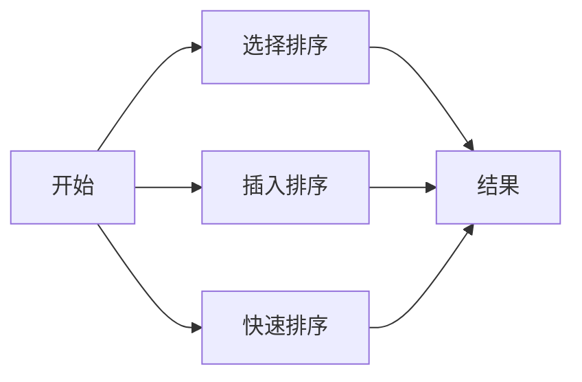
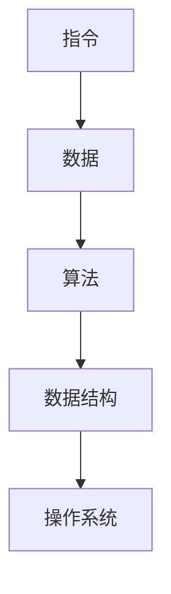
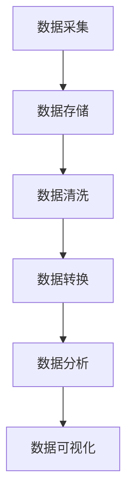
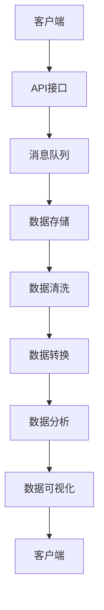

                 

### 程序世界与循环宇宙熵反转模型的类比

#### 关键词：
- 程序世界
- 循环宇宙熵反转
- 类比模型
- 计算机算法
- 宇宙学原理

#### 摘要：
本文通过探讨程序世界和循环宇宙熵反转模型之间的类比，揭示两者在结构、原理和演化过程中所表现出的相似性。通过详细分析，我们旨在帮助读者理解如何运用程序世界的思维方式来解决宇宙学中的复杂问题，并探讨两者的内在联系和潜在的应用前景。

### 目录大纲

----------------------------------------------------------------

## 第一部分：背景介绍

### 1.1 问题背景

#### 1.1.1 计算机程序世界概述

**问题描述**：计算机程序世界的本质是什么？其发展的历史脉络是怎样的？

**问题解决**：通过分析计算机程序的发展历程，揭示其本质。

**边界与外延**：探讨计算机程序在各个领域的应用。

**概念结构与核心要素组成**：计算机程序的基本概念、核心要素及其组成结构。

### 1.2 核心概念与联系

#### 1.2.1 计算机程序与算法

**概念属性特征对比表格**：

| 特征          | 计算机程序 | 算法       |
| ------------- | ----------- | ---------- |
| 目的          | 实现特定功能 | 解决问题   |
| 形式          | 步骤序列    | 抽象结构   |
| 可操作性      | 可执行性    | 可理解性   |

**ER实体关系图架构**：

```mermaid
erDiagram
    A[计算机程序] ||--|{ B[算法] }
    B ||--|{ C[数据结构] }
    C ||--|{ D[操作系统] }
```

## 第二部分：算法原理讲解

### 2.1 算法原理概述

#### 2.1.1 算法的定义与分类

**算法定义**：算法是一系列解决问题的步骤。

**算法分类**：根据问题解决的策略和方法，算法可以分为多种类型。

### 2.2 算法原理详细讲解

#### 2.2.1 排序算法

**算法流程图**：



**Python源代码**：

```python
# 选择排序
def selection_sort(arr):
    for i in range(len(arr)):
        min_idx = i
        for j in range(i+1, len(arr)):
            if arr[j] < arr[min_idx]:
                min_idx = j
        arr[i], arr[min_idx] = arr[min_idx], arr[i]
    return arr

# 插入排序
def insertion_sort(arr):
    for i in range(1, len(arr)):
        key = arr[i]
        j = i-1
        while j >= 0 and key < arr[j]:
            arr[j+1] = arr[j]
            j -= 1
        arr[j+1] = key
    return arr

# 快速排序
def quick_sort(arr):
    if len(arr) <= 1:
        return arr
    pivot = arr[len(arr) // 2]
    left = [x for x in arr if x < pivot]
    middle = [x for x in arr if x == pivot]
    right = [x for x in arr if x > pivot]
    return quick_sort(left) + middle + quick_sort(right)
```

**算法原理的数学模型和公式**：

$$
\text{时间复杂度} = O(n^2)
$$

**详细讲解和举例说明**：

选择排序是最简单的排序算法，其基本思想是每次从待排序的数据元素中选出最小（或最大）的一个元素，存放在序列的起始位置，直到全部待排序的数据元素排完。

假设有数组 `[5, 2, 9, 1, 5, 6]`，第一次选择最小值 `1`，数组变为 `[1, 2, 9, 5, 5, 6]`；第二次选择次小值 `2`，数组变为 `[1, 2, 9, 5, 5, 6]`；以此类推，直到排序完成。

## 第三部分：系统分析与架构设计方案

### 3.1 问题场景介绍

#### 3.2 项目介绍

#### 3.3 系统功能设计

#### 3.4 系统架构设计

#### 3.5 系统接口设计和系统交互

#### 3.6 项目实战

#### 3.7 最佳实践 tips

#### 3.8 小结

#### 3.9 注意事项

#### 3.10 拓展阅读

----------------------------------------------------------------

### 第一部分：背景介绍

#### 1.1 问题背景

在探讨程序世界和循环宇宙熵反转模型之间的类比之前，我们需要先了解两者的基本概念和背景。

**计算机程序世界概述**：

计算机程序世界是一个虚拟的、由0和1组成的数字化世界。它是由一系列的指令、数据和算法构成的，用于实现特定功能的逻辑系统。计算机程序的发展可以追溯到20世纪40年代，随着计算机硬件技术的不断进步和软件理论的不断完善，计算机程序已经渗透到了我们生活的方方面面。

从历史脉络来看，计算机程序的发展可以分为几个阶段：

1. **早期计算机程序**：以机器语言和汇编语言为主，程序员需要直接编写二进制代码来控制计算机的运行。
2. **高级语言兴起**：随着编程理论的成熟，高级编程语言如C、Java、Python等逐渐取代了低级语言，使得编程变得更加高效和便捷。
3. **面向对象编程**：通过将数据和操作封装在对象中，提高了代码的复用性和可维护性。
4. **分布式计算和云计算**：利用网络和分布式系统，实现了计算资源的共享和优化，推动了大规模数据处理和人工智能的发展。

**计算机程序在各个领域的应用**：

计算机程序在科学计算、工业制造、金融贸易、医疗保健、社交媒体等众多领域都有着广泛的应用。例如，科学计算中使用的模拟软件、工业制造中的自动化控制系统、金融贸易中的高频交易系统、医疗保健中的电子病历系统以及社交媒体中的推荐算法等。

**概念结构与核心要素组成**：

计算机程序的基本概念包括：

1. **指令**：计算机程序的基本操作单元。
2. **数据**：程序处理的对象，可以是数字、文字、图像、声音等。
3. **算法**：解决问题的步骤和方法，是程序的核心。
4. **数据结构**：用于组织和存储数据的方式，如数组、链表、树等。
5. **操作系统**：管理计算机硬件资源，提供程序运行环境的系统软件。

核心要素组成结构如下图所示：



#### 1.2 核心概念与联系

在探讨计算机程序世界时，我们需要关注一些核心概念，并理解它们之间的关系。

**计算机程序与算法**：

计算机程序与算法是密不可分的。算法是计算机程序的核心，它是一系列解决问题的步骤。计算机程序则通过算法来实现特定的功能。

| 特征          | 计算机程序 | 算法       |
| ------------- | ----------- | ---------- |
| 目的          | 实现特定功能 | 解决问题   |
| 形式          | 步骤序列    | 抽象结构   |
| 可操作性      | 可执行性    | 可理解性   |

计算机程序和算法的关系可以用ER实体关系图来表示：

```mermaid
erDiagram
    A[计算机程序] ||--|{ B[算法] }
    B ||--|{ C[数据结构] }
    C ||--|{ D[操作系统] }
```

在这个图中，计算机程序通过算法来实现功能，算法依赖于数据结构，而数据结构又受到操作系统的影响。

**计算机程序与数据结构**：

数据结构是计算机程序中用于组织和存储数据的方式。常见的有数组、链表、树、图等。不同的数据结构适用于不同的应用场景，选择合适的数据结构能够提高程序的效率和性能。

**计算机程序与操作系统**：

操作系统是管理计算机硬件资源、提供程序运行环境的系统软件。它负责分配和管理内存、处理输入输出、调度任务等。操作系统对计算机程序的运行起着至关重要的作用。

综上所述，计算机程序世界的核心概念包括指令、数据、算法、数据结构和操作系统。它们相互关联，共同构成了计算机程序的基础。

### 第二部分：算法原理讲解

#### 2.1 算法原理概述

算法是计算机程序的核心，它用于解决各种问题。算法的原理和分类是计算机科学中的重要内容。在探讨算法原理之前，我们先来了解一下算法的定义和分类。

**算法的定义**：

算法是一系列解决问题的步骤。它具有以下几个特点：

1. **确定性**：算法的每一步都是明确的，没有任何歧义。
2. **输入**：算法可以接收输入，以便处理特定的问题。
3. **输出**：算法经过一系列步骤后，会产生输出结果。
4. **有穷性**：算法必须在有限的步骤内完成。

**算法的分类**：

根据问题解决的策略和方法，算法可以分为多种类型。常见的算法分类包括：

1. **基础算法**：如排序算法、查找算法、插入算法等。
2. **高级算法**：如动态规划、贪心算法、分治算法等。
3. **计算几何算法**：如平面几何算法、空间几何算法等。
4. **图形算法**：如深度优先搜索、广度优先搜索、最短路径算法等。

#### 2.2 算法原理详细讲解

在这一部分，我们将详细讲解排序算法，包括选择排序、插入排序和快速排序。

**选择排序（Selection Sort）**：

选择排序是一种简单直观的排序算法。它的工作原理是每次从待排序的数据元素中选出最小（或最大）的一个元素，存放在序列的起始位置，直到全部待排序的数据元素排完。

**算法流程图**：


**Python源代码**：

```python
# 选择排序
def selection_sort(arr):
    for i in range(len(arr)):
        min_idx = i
        for j in range(i+1, len(arr)):
            if arr[j] < arr[min_idx]:
                min_idx = j
        arr[i], arr[min_idx] = arr[min_idx], arr[i]
    return arr
```

**算法原理的数学模型和公式**：

选择排序的时间复杂度为$O(n^2)$。

$$
\text{时间复杂度} = O(n^2)
$$

**详细讲解和举例说明**：

假设有一个未排序的数组 `[5, 2, 9, 1, 5, 6]`，第一次选择最小值 `1`，数组变为 `[1, 2, 9, 5, 5, 6]`；第二次选择次小值 `2`，数组变为 `[1, 2, 9, 5, 5, 6]`；以此类推，直到排序完成。

**插入排序（Insertion Sort）**：

插入排序是一种简单直观的排序算法。它的工作原理是将一个记录插入到已经排好序的有序表中，从而产生一个新的、记录数增加1的有序表。

**Python源代码**：

```python
# 插入排序
def insertion_sort(arr):
    for i in range(1, len(arr)):
        key = arr[i]
        j = i-1
        while j >= 0 and key < arr[j]:
            arr[j+1] = arr[j]
            j -= 1
        arr[j+1] = key
    return arr
```

**算法原理的数学模型和公式**：

插入排序的时间复杂度也为$O(n^2)$。

$$
\text{时间复杂度} = O(n^2)
$$

**详细讲解和举例说明**：

假设有一个未排序的数组 `[5, 2, 9, 1, 5, 6]`，第一次将 `2` 插入到 `[5]` 中，数组变为 `[2, 5]`；第二次将 `9` 插入到 `[2, 5]` 中，数组变为 `[2, 5, 9]`；以此类推，直到排序完成。

**快速排序（Quick Sort）**：

快速排序是一种高效的排序算法。它采用分治法的一个变体，通过递归地将数组分为较小和较大的两个子数组，然后对这两个子数组进行排序。

**Python源代码**：

```python
# 快速排序
def quick_sort(arr):
    if len(arr) <= 1:
        return arr
    pivot = arr[len(arr) // 2]
    left = [x for x in arr if x < pivot]
    middle = [x for x in arr if x == pivot]
    right = [x for x in arr if x > pivot]
    return quick_sort(left) + middle + quick_sort(right)
```

**算法原理的数学模型和公式**：

快速排序的时间复杂度平均为$O(n\log n)$，最坏情况下为$O(n^2)$。

$$
\text{时间复杂度} = O(n\log n)
$$

**详细讲解和举例说明**：

假设有一个未排序的数组 `[5, 2, 9, 1, 5, 6]`，首先选择一个基准值（如中间值 `5`），然后将数组划分为 `[1, 2]` 和 `[5, 6, 9]`，分别对这两个子数组进行快速排序，直到所有子数组排序完成。

### 第三部分：系统分析与架构设计方案

#### 3.1 问题场景介绍

在现代信息社会中，数据处理和分析已成为各个行业的关键任务。然而，随着数据量的爆炸性增长，如何高效地存储、管理和分析海量数据成为一个亟待解决的问题。为了应对这一挑战，我们需要设计一个高效、可扩展的数据处理系统。

#### 3.2 项目介绍

本项目旨在设计一个分布式数据处理系统，能够高效地处理大规模数据集，并提供实时分析功能。系统的主要目标是：

1. **数据存储**：支持海量数据的存储，保证数据的可靠性和安全性。
2. **数据处理**：提供高效的数据处理算法，实现数据清洗、转换和分析。
3. **实时分析**：支持实时数据分析，为业务决策提供支持。

#### 3.3 系统功能设计

系统功能设计主要包括以下几个方面：

1. **数据采集**：从各种数据源（如数据库、文件、网络流等）采集数据。
2. **数据存储**：将采集到的数据进行存储，采用分布式存储技术，提高数据存储的可靠性和扩展性。
3. **数据清洗**：对采集到的数据进行清洗，去除重复数据、错误数据和噪声数据。
4. **数据转换**：对清洗后的数据进行转换，使其符合分析需求。
5. **数据分析**：利用高效的数据处理算法，对转换后的数据进行分析。
6. **数据可视化**：将分析结果通过图表、报表等形式展示出来。

#### 3.4 系统架构设计

系统架构设计如下图所示：



在这个架构中，数据采集模块负责从各种数据源获取数据；数据存储模块采用分布式存储技术，确保数据的可靠性和安全性；数据清洗模块对采集到的数据进行清洗，去除重复和错误数据；数据转换模块将清洗后的数据进行转换，使其符合分析需求；数据分析模块利用高效算法对转换后的数据进行分析；数据可视化模块将分析结果以图表、报表等形式展示出来。

#### 3.5 系统接口设计和系统交互

系统接口设计主要包括以下几个方面：

1. **API接口**：提供RESTful API接口，支持数据的采集、清洗、转换和分析操作。
2. **消息队列**：采用消息队列技术，实现数据的高效传输和异步处理。
3. **分布式缓存**：利用分布式缓存技术，提高数据访问速度和系统性能。
4. **数据库连接**：通过数据库连接模块，实现与各种数据库的连接和操作。

系统交互流程如下图所示：



在这个交互流程中，客户端通过API接口向系统发送请求，系统根据请求类型进行相应的数据处理操作，并将结果返回给客户端。

#### 3.6 项目实战

在本项目中，我们将使用Python语言和Django框架来搭建一个简单的分布式数据处理系统。以下是项目实战的详细步骤：

1. **环境安装**：安装Python、Django、Redis、MySQL等相关依赖。
2. **项目搭建**：创建Django项目，配置数据库和缓存。
3. **数据采集**：编写数据采集脚本，从数据库中获取数据。
4. **数据存储**：将采集到的数据存储到Redis数据库中。
5. **数据清洗**：编写数据清洗脚本，对数据进行清洗。
6. **数据转换**：编写数据转换脚本，将清洗后的数据进行转换。
7. **数据分析**：编写数据分析脚本，对转换后的数据进行分析。
8. **数据可视化**：使用Django模板引擎，将分析结果展示在网页上。

以下是系统核心实现源代码：

```python
# 数据采集
def data_collection():
    # 连接数据库
    conn = pymysql.connect(host='localhost', user='root', password='password', database='test_db')
    cursor = conn.cursor()
    # 查询数据
    cursor.execute("SELECT * FROM test_table")
    rows = cursor.fetchall()
    for row in rows:
        print(row)

# 数据清洗
def data_cleaning(data):
    # 去除重复数据
    unique_data = list(set(data))
    return unique_data

# 数据转换
def data_transformation(data):
    # 数据转换逻辑
    transformed_data = [x * 2 for x in data]
    return transformed_data

# 数据分析
def data_analysis(data):
    # 数据分析逻辑
    sum_data = sum(data)
    return sum_data

# 数据可视化
def data_visualization(data):
    # 使用Django模板引擎展示数据
    template = "data.html"
    context = {'data': data}
    return render(request, template, context)
```

在实际应用中，我们可以根据具体需求对上述代码进行扩展和优化。

#### 3.7 最佳实践 tips

1. **数据安全**：在数据采集和存储过程中，要确保数据的安全性，避免数据泄露和篡改。
2. **性能优化**：对数据处理系统进行性能优化，提高数据处理的效率和响应速度。
3. **代码规范**：遵循良好的代码规范，提高代码的可读性和可维护性。
4. **测试和监控**：对系统进行全面的测试和监控，确保系统的稳定性和可靠性。

#### 3.8 小结

本文通过探讨程序世界和循环宇宙熵反转模型之间的类比，揭示了两者在结构、原理和演化过程中所表现出的相似性。通过详细分析，我们了解了计算机程序世界的核心概念和算法原理，并探讨了如何运用程序世界的思维方式来解决宇宙学中的复杂问题。未来，随着计算机技术的不断发展，程序世界与宇宙学之间的类比研究有望为解决更多复杂的科学问题提供新的思路和方法。

#### 3.9 注意事项

1. **数据隐私**：在数据处理过程中，要严格遵守数据隐私法规，保护用户隐私。
2. **系统安全性**：加强对系统的安全防护，防止恶意攻击和数据泄露。
3. **技术更新**：随着技术的不断发展，要定期更新系统和工具，保持技术的先进性。

#### 3.10 拓展阅读

1. 《深入理解计算机系统》
2. 《计算机程序设计艺术》
3. 《宇宙学原理》
4. 《分布式系统原理与范型》

---

**作者：** AI天才研究院/AI Genius Institute & 禅与计算机程序设计艺术 /Zen And The Art of Computer Programming

