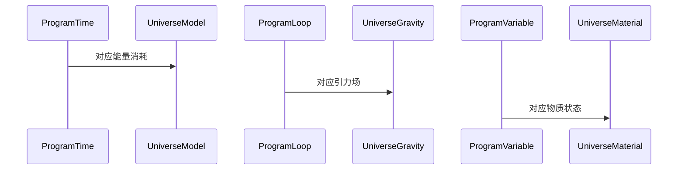
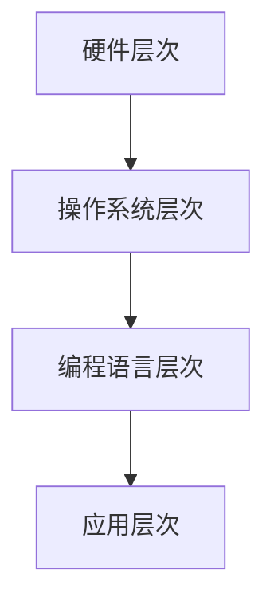

                 

### 第一部分：问题背景与核心概念

## 第1章：问题背景介绍

### 1.1 问题背景

#### 1.1.1 问题产生背景

在计算机科学和人工智能领域，程序设计和算法优化一直是研究的热点。随着计算机技术的飞速发展，现代应用场景越来越复杂，对程序的效率和性能提出了更高的要求。然而，传统的程序设计和算法分析往往侧重于理论层面，关注的是算法的复杂度和抽象逻辑，而较少关注程序在实际应用中的时间和效率问题。

**问题描述**：这种忽视时间和效率问题的趋势导致在实际开发过程中，程序员常常面临以下挑战：

1. **性能瓶颈**：尽管算法在理论上表现良好，但在实际运行中却因为时间复杂度过高而变得缓慢。
2. **资源浪费**：程序在执行过程中可能占用过多内存或CPU资源，导致系统性能下降。
3. **用户体验差**：程序响应时间过长，影响用户体验，特别是在需要实时响应的应用中，如在线游戏、金融交易等。

**问题解决**：为了应对上述挑战，有必要从新的角度重新审视程序设计和算法优化。本书旨在通过将程序世界与循环时间宇宙模型进行类比，为程序设计和算法优化提供一种全新的视角和方法。

#### 1.1.2 研究意义

通过类比，我们可以将程序中的时间复杂度和效率问题抽象为宇宙模型中的循环和时间概念，从而在理论层面和实践层面提供新的解决思路。这种类比不仅有助于我们更深入地理解程序的运行机制，还可以指导我们设计更高效、更可靠的程序。

**核心要素组成**：

1. **程序世界**：由编程语言、编译器、操作系统、网络通信等多个层面构成的复杂系统。
2. **循环时间宇宙模型**：一种将程序时间复杂度和效率问题抽象为宇宙模型的方法。
3. **类比方法**：通过类比分析，将程序世界中的概念映射到循环时间宇宙模型中。
4. **程序设计**：结合类比方法，优化程序结构和算法。
5. **算法优化**：通过类比分析，找到更高效的算法解决复杂问题。

### 1.2 核心概念

#### 1.2.1 程序世界

**概念原理**：程序世界是指由计算机程序构成的世界，涵盖了编程语言、编译器、操作系统、硬件设备等多个层面。它是软件开发和运行的基础。

**属性特征**：

- **复杂性**：程序世界的复杂性来源于代码的规模和逻辑的复杂性。一个复杂的程序可能包含数百万行代码，逻辑关系错综复杂。
- **抽象性**：程序世界的抽象性使其能够处理现实世界的问题。通过编程语言和算法，我们可以将复杂的现实问题抽象为计算机可以处理的形式。
- **动态性**：程序世界中的变量和状态可以随时改变。程序的运行过程中，变量值、状态、流程都会不断变化。

**ER实体关系图**：

```mermaid
erDiagram
    Program |..| ProgrammingLanguage
    Program |..| Compiler
    Program |..| OperatingSystem
    Program |..| HardwareDevice
```

#### 1.2.2 循环时间宇宙模型

**概念原理**：循环时间宇宙模型是一种将程序世界中的时间和效率问题抽象为宇宙模型的方法。在这种模型中，程序中的循环和时间复杂度被类比于宇宙中的循环和时间概念，如行星的轨道、星系的引力等。

**属性特征**：

- **循环性**：宇宙模型中的循环时间概念与程序中的循环结构相对应。例如，程序的循环结构类似于行星绕太阳的轨道，每次迭代都代表一次“旅行”。
- **效率性**：宇宙模型中的效率与程序中的时间复杂度相对应。高效的程序类比于高效的宇宙模型，能够快速完成任务。
- **可扩展性**：宇宙模型可以扩展到不同规模和复杂度的程序。无论是简单的单线程程序还是复杂的分布式系统，都可以在宇宙模型中得到类比和优化。

**对比表格**：

| 程序世界特征 | 循环时间宇宙模型特征 | 对应解释 |
| ------------- | -------------------- | -------- |
| 时间复杂度 | 循环时间 | 程序运行所需时间的复杂度类比为宇宙中循环时间 |
| 算法效率 | 引力场效率 | 高效算法类比于高效引力场，能够快速完成任务 |
| 状态变化 | 物理运动 | 程序状态变化类比为物体在宇宙中的运动 |

**ER实体关系图**：

```mermaid
erDiagram
    ProgramTime |..| LoopTime
    ProgramTime |..| Efficiency
    ProgramStructure |..| UniverseModel
```

### 1.3 概念联系

#### 1.3.1 程序世界与循环时间宇宙模型的类比

**类比原理**：通过将程序世界中的概念与循环时间宇宙模型中的概念进行类比，可以帮助我们更好地理解和优化程序设计。

**类比方法**：

- **时间与能量**：程序中的时间复杂度与宇宙模型中的能量消耗相对应。高效的程序类比于消耗较少能量的宇宙模型。
- **循环与引力**：程序中的循环结构与宇宙模型中的引力场相对应。高效的循环结构类比于高效的引力场，能够快速完成任务。
- **变量与物质**：程序中的变量与宇宙模型中的物质相对应。程序中的变量变化类比于宇宙中物质的状态变化。

**类比关系图**：



## 1.4 本章小结

通过本章的介绍，我们对程序世界和循环时间宇宙模型有了基本的了解。程序世界是一个复杂的系统，具有抽象性和动态性；而循环时间宇宙模型提供了一种新的视角来理解和优化程序设计。接下来的章节将深入探讨这些概念，并通过类比分析方法，揭示程序世界与循环时间宇宙模型之间的深层联系。

----------------------------------------------------------------

### 第二部分：程序世界与循环时间宇宙模型的类比分析

## 第2章：类比分析方法介绍

### 2.1 类比分析的定义与意义

**定义**：类比分析是一种通过将已知领域的概念和原理应用于未知领域的方法。在科学研究和工程实践中，类比分析是一种重要的思维工具，它能够帮助我们快速理解和解决新问题。

**意义**：类比分析具有以下几个重要意义：

1. **跨越领域障碍**：通过类比分析，我们可以将不同领域中的概念和原理进行关联，从而跨越领域之间的障碍，为解决问题提供新的思路。
2. **简化复杂问题**：类比分析能够将复杂问题简化为已知的问题，使得复杂问题的解决变得更加直观和易于操作。
3. **提高创新性**：类比分析可以激发我们的创造性思维，通过将不同领域的知识和经验结合起来，创造出新的解决方案。

### 2.2 类比分析的过程与方法

#### 2.2.1 过程

类比分析的过程可以分为以下几个步骤：

1. **识别相似性**：首先，我们需要识别出程序世界和循环时间宇宙模型之间的相似性。这些相似性可能包括概念、原理、结构等。
2. **建立映射关系**：在识别出相似性之后，我们需要建立映射关系，将程序世界中的概念映射到循环时间宇宙模型中。例如，我们可以将程序中的循环结构映射到宇宙模型中的引力场。
3. **分析和验证**：接下来，我们需要对建立的映射关系进行分析和验证。这包括检查映射关系的合理性和有效性，以及它是否能够帮助我们更好地理解和优化程序设计。

#### 2.2.2 方法

类比分析的方法可以分为以下几种：

1. **直接类比**：直接将程序世界中的概念应用到循环时间宇宙模型中。例如，将程序中的时间复杂度直接映射到宇宙模型中的循环时间。
2. **间接类比**：通过中间概念或模型进行类比。例如，我们可以先通过其他领域的类比，如物理学中的引力，来建立程序世界和循环时间宇宙模型之间的联系。
3. **反向类比**：从循环时间宇宙模型出发，推导出程序世界的概念。这种方法通常用于当程序世界的概念不易直接理解时，通过宇宙模型来帮助理解。

### 2.3 类比分析的应用领域

#### 2.3.1 程序设计

**应用**：在程序设计中，类比分析可以帮助我们更好地理解和优化程序结构。例如，通过将程序中的循环结构类比到宇宙模型中的引力场，我们可以更直观地理解循环的效率和优化策略。

#### 2.3.2 算法优化

**应用**：在算法优化中，类比分析可以帮助我们找到更高效的算法。例如，通过将程序中的时间复杂度类比到宇宙模型中的能量消耗，我们可以推导出降低时间复杂度的优化策略。

#### 2.3.3 系统优化

**应用**：在系统优化中，类比分析可以帮助我们优化系统架构，提高系统的稳定性和性能。例如，通过将程序世界中的复杂系统结构类比到宇宙模型中的星系结构，我们可以找到优化系统性能的方法。

## 2.4 本章小结

通过本章的介绍，我们了解了类比分析的定义、意义和基本方法，以及它在程序设计、算法优化和系统优化中的应用。类比分析作为一种强大的思维工具，可以帮助我们更深入地理解和优化程序设计，为解决复杂问题提供新的思路。

----------------------------------------------------------------

## 第3章：程序世界的结构分析

### 3.1 程序世界的结构组成

程序世界是一个由多个层次和组件构成的复杂系统，它涵盖了从底层硬件到高层应用软件的各个方面。理解程序世界的结构组成对于深入探讨程序设计和算法优化至关重要。

#### 3.1.1 编程语言

**概念原理**：编程语言是程序员用来编写程序的语法和语义规则。不同的编程语言有不同的特性和用途，如C语言、Python、Java等。

**属性特征**：

- **多样性**：编程语言种类繁多，适应不同的开发需求。
- **抽象性**：编程语言提供了抽象机制，使得程序员可以更高效地编写代码。
- **可扩展性**：编程语言通常具有丰富的库和框架，可以扩展其功能。

**ER实体关系图**：

```mermaid
erDiagram
    ProgrammingLanguage |..| Compiler
    ProgrammingLanguage |..| OperatingSystem
    ProgrammingLanguage |..| Program
```

#### 3.1.2 编译器

**概念原理**：编译器是将编程语言编写的源代码转换为机器语言的可执行程序的软件工具。编译器的工作过程包括词法分析、语法分析、语义分析、代码生成和优化等。

**属性特征**：

- **高效性**：编译器生成的可执行程序通常具有较高的运行效率。
- **可移植性**：编译器可以将代码从一种平台移植到另一种平台。
- **可定制性**：编译器可以根据不同的编程语言和开发环境进行定制。

**ER实体关系图**：

```mermaid
erDiagram
    Compiler |..| ProgrammingLanguage
    Compiler |..| OperatingSystem
    Compiler |..| Program
```

#### 3.1.3 操作系统

**概念原理**：操作系统是计算机系统中最重要的软件之一，它负责管理和控制计算机硬件资源，提供程序运行环境。常见的操作系统包括Windows、Linux、Mac OS等。

**属性特征**：

- **资源管理**：操作系统负责管理计算机的CPU、内存、存储等硬件资源。
- **多任务处理**：操作系统可以实现多任务处理，允许多个程序同时运行。
- **安全性**：操作系统提供了安全机制，保护计算机免受恶意攻击。

**ER实体关系图**：

```mermaid
erDiagram
    OperatingSystem |..| HardwareDevice
    OperatingSystem |..| Compiler
    OperatingSystem |..| Program
```

#### 3.1.4 网络通信

**概念原理**：网络通信是计算机之间通过网络进行数据传输的过程。网络通信涉及到TCP/IP协议、HTTP协议、DNS等。

**属性特征**：

- **可靠性**：网络通信需要确保数据传输的可靠性和完整性。
- **高效性**：网络通信需要高效地传输大量数据。
- **安全性**：网络通信需要保护数据的安全，防止数据泄露或被篡改。

**ER实体关系图**：

```mermaid
erDiagram
    NetworkCommunication |..| OperatingSystem
    NetworkCommunication |..| Program
    NetworkCommunication |..| HardwareDevice
```

#### 3.1.5 应用软件

**概念原理**：应用软件是为特定应用场景设计的软件，如Web应用、桌面应用、移动应用等。

**属性特征**：

- **功能性**：应用软件需要满足特定的功能需求。
- **用户体验**：应用软件需要提供良好的用户体验，易于使用和操作。
- **可维护性**：应用软件需要易于维护和升级。

**ER实体关系图**：

```mermaid
erDiagram
    ApplicationSoftware |..| OperatingSystem
    ApplicationSoftware |..| NetworkCommunication
    ApplicationSoftware |..| Compiler
```

### 3.2 程序世界的层次结构

程序世界的层次结构可以从多个角度进行划分，常见的划分方式包括：

1. **硬件层次**：包括处理器、内存、存储、网络设备等。
2. **操作系统层次**：包括内核、设备驱动、文件系统等。
3. **编程语言层次**：包括编译器、解释器、库和框架等。
4. **应用层次**：包括具体的软件应用，如Web应用、桌面应用、移动应用等。

**层次结构图**：



### 3.3 程序世界的动态特性

程序世界的动态特性体现在多个方面：

1. **状态变化**：程序运行过程中，变量和状态会不断变化，这反映了程序世界的动态性。
2. **并发处理**：现代操作系统和编程语言支持多任务处理和并发执行，能够同时处理多个程序或线程。
3. **资源分配**：操作系统负责动态分配和管理计算机资源，如CPU时间、内存空间等。

### 3.4 程序世界的多样性

程序世界的多样性体现在：

1. **编程语言多样性**：不同的编程语言适用于不同的场景，如C语言适合系统编程，Python适合数据分析。
2. **开发工具多样性**：各种开发工具和平台提供了丰富的功能和特性，如IDE、代码编辑器、版本控制系统等。
3. **应用场景多样性**：程序世界涵盖了从科学计算、商业应用、娱乐游戏到人工智能等众多领域。

### 3.5 程序世界的扩展性

程序世界的扩展性体现在：

1. **模块化开发**：通过模块化开发，程序员可以将复杂的系统分解为多个独立模块，便于维护和扩展。
2. **开源生态系统**：开源软件和框架为程序员提供了丰富的资源，可以快速构建和扩展应用。
3. **技术演进**：随着技术的不断发展，程序世界不断引入新的编程语言、工具和框架，为程序员提供更多选择。

### 3.6 本章小结

通过本章的介绍，我们详细分析了程序世界的结构组成、层次结构、动态特性、多样性、扩展性等方面的内容。理解程序世界的结构对于深入探讨程序设计和算法优化至关重要。在接下来的章节中，我们将进一步探讨程序世界与循环时间宇宙模型的类比分析，揭示两者之间的深层联系。

----------------------------------------------------------------

## 第4章：循环时间宇宙模型的概念与原理

### 4.1 循环时间宇宙模型的基本概念

**概念定义**：循环时间宇宙模型是一种将程序中的时间和效率问题抽象为宇宙模型的方法。在这种模型中，程序中的时间复杂度和效率问题被类比于宇宙中的循环时间和能量消耗。

**主要元素**：

1. **循环时间**：程序中的循环结构可以类比于宇宙中的循环时间。例如，一个简单的while循环可以类比为一个行星绕太阳的轨道，每次迭代都代表一次“旅行”。
2. **能量消耗**：程序中的时间复杂度可以类比于宇宙模型中的能量消耗。高效的程序类比于消耗较少能量的宇宙模型，能够快速完成任务。
3. **引力场**：程序中的循环结构可以类比于宇宙模型中的引力场。引力场对行星的轨道产生影响，程序中的循环结构也影响程序的执行效率和性能。

### 4.2 循环时间宇宙模型的工作原理

**工作原理**：循环时间宇宙模型通过将程序中的时间和效率问题抽象为宇宙模型中的概念，帮助我们更直观地理解程序运行机制，并找到优化策略。

1. **类比映射**：首先，我们将程序世界中的循环结构、时间复杂度等概念映射到宇宙模型中。例如，将一个程序中的循环映射到宇宙模型中的一个行星轨道。
2. **分析优化**：在建立映射关系后，我们对宇宙模型进行分析和优化。例如，通过调整引力场强度或行星轨道，找到优化程序时间和效率的方法。
3. **验证反馈**：最后，我们将优化策略应用到程序中，验证其效果，并根据反馈进行调整和改进。

### 4.3 循环时间宇宙模型的特点

**特点**：

1. **抽象性**：循环时间宇宙模型将复杂的时间复杂度和效率问题抽象为简单的宇宙概念，使得问题更易于理解和分析。
2. **直观性**：通过宇宙模型，我们可以直观地看到程序运行过程中的时间和效率问题，从而更容易找到优化策略。
3. **可扩展性**：循环时间宇宙模型可以应用于不同规模和复杂度的程序，无论是简单的单线程程序还是复杂的分布式系统。

### 4.4 循环时间宇宙模型的实际应用

**实际应用**：

1. **程序设计**：在程序设计过程中，我们可以利用循环时间宇宙模型来优化程序结构和算法，提高程序效率和性能。
2. **算法优化**：通过循环时间宇宙模型，我们可以找到更高效的算法，解决复杂问题，降低时间复杂度。
3. **系统优化**：在系统优化过程中，我们可以利用循环时间宇宙模型来优化系统架构，提高系统稳定性和性能。

### 4.5 循环时间宇宙模型与传统程序的对比

**对比**：

1. **抽象层次**：传统程序设计侧重于抽象算法和逻辑，而循环时间宇宙模型在抽象层次上更高，将时间和效率问题类比为宇宙中的概念，更易于理解和优化。
2. **直观性**：传统程序设计难以直观地展示时间和效率问题，而循环时间宇宙模型通过宇宙模型提供了一种直观的视角，使得优化过程更加清晰。
3. **适用范围**：循环时间宇宙模型适用于各种规模和复杂度的程序，而传统程序设计方法可能仅适用于某些特定场景。

### 4.6 本章小结

通过本章的介绍，我们了解了循环时间宇宙模型的基本概念、工作原理、特点、实际应用以及与传统程序的对比。循环时间宇宙模型提供了一种新的视角，帮助我们更深入地理解程序设计和算法优化，并在实际应用中取得更好的效果。

----------------------------------------------------------------

## 第5章：程序世界与循环时间宇宙模型的类比分析

### 5.1 时间与能量的类比

在程序世界中，时间复杂度是衡量程序运行效率的重要指标。而循环时间宇宙模型通过将时间复杂度类比为宇宙模型中的能量消耗，为我们提供了一种全新的理解方式。

#### 5.1.1 类比原理

时间复杂度反映了程序运行所需的时间，通常用大O表示法（如O(n)、O(log n)等）来描述。在循环时间宇宙模型中，我们可以将程序的时间复杂度类比于宇宙中的能量消耗。

**类比关系**：

- **线性时间复杂度**（O(n)）：类比于在宇宙中消耗的能量与距离成正比。例如，一个行星绕太阳运行的轨道，每次迭代所需时间与运行轨道的长度成正比。
- **对数时间复杂度**（O(log n)）：类比于在宇宙中消耗的能量与距离成对数关系。例如，一个行星绕太阳运行的轨道，每次迭代所需时间与运行轨道长度的对数成正比。
- **常数时间复杂度**（O(1)）：类比于在宇宙中消耗的能量与距离无关。例如，一个固定在太阳上的行星，每次迭代所需时间保持不变。

#### 5.1.2 优化策略

通过类比，我们可以得出以下优化策略：

1. **减少距离**：在宇宙模型中，通过缩短行星的轨道长度来减少能量消耗。类似地，在程序世界中，通过减少算法的迭代次数来降低时间复杂度。
2. **优化路径**：在宇宙模型中，通过调整行星轨道来优化能量消耗。类似地，在程序世界中，通过优化算法的结构和逻辑来减少时间复杂度。
3. **增加引力场**：在宇宙模型中，通过增加引力场来减少行星的轨道半径，从而降低能量消耗。类似地，在程序世界中，通过引入高效的算法和数据结构来提高程序的运行效率。

### 5.2 循环结构与引力场的类比

程序中的循环结构是程序运行的核心部分，而循环时间宇宙模型通过将循环结构类比为宇宙模型中的引力场，为我们提供了一种新的理解方式。

#### 5.2.1 类比原理

引力场是宇宙中物质相互作用的重要表现。在程序世界中，循环结构是程序执行的关键部分。我们可以将程序中的循环结构类比于宇宙中的引力场。

**类比关系**：

- **循环次数**：类比于引力场的强度。循环次数越多，引力场的影响越强。
- **循环体内容**：类比于引力场的作用效果。循环体内容决定了引力场对程序执行的影响。
- **循环条件**：类比于引力场的边界。循环条件决定了引力场的范围和作用时间。

#### 5.2.2 优化策略

通过类比，我们可以得出以下优化策略：

1. **减小循环次数**：通过优化循环条件，减少不必要的循环迭代，从而降低引力场的影响。
2. **优化循环体内容**：通过优化循环体中的操作，减少复杂度和时间消耗，从而降低引力场的能量消耗。
3. **增加引力场效果**：通过引入并行计算、多线程等技术，增加程序中的并行度，从而提高程序的运行效率。

### 5.3 变量与物质的类比

程序中的变量是程序运行过程中状态变化的重要载体，而循环时间宇宙模型通过将变量类比为宇宙模型中的物质，为我们提供了一种新的理解方式。

#### 5.3.1 类比原理

变量是程序中的数据存储单元，用于存储和操作数据。在循环时间宇宙模型中，我们可以将变量类比于宇宙中的物质。

**类比关系**：

- **变量值**：类比于物质的质量。变量的值决定了物质的质量和影响力。
- **变量类型**：类比于物质的性质。不同的变量类型具有不同的性质和作用。
- **变量变化**：类比于物质的状态变化。变量的变化反映了物质状态的演变。

#### 5.3.2 优化策略

通过类比，我们可以得出以下优化策略：

1. **减少变量数量**：通过减少不必要的变量，降低程序复杂度和内存消耗。
2. **优化变量类型**：通过选择合适的变量类型，提高程序效率和性能。
3. **管理变量生命周期**：通过合理管理变量的生命周期，减少内存占用和垃圾回收开销。

### 5.4 总结

通过类比分析，我们将程序世界中的时间、循环结构和变量等概念与循环时间宇宙模型中的能量消耗、引力场和物质进行了对比和类比。这种方法不仅帮助我们更直观地理解程序运行机制，还为优化程序设计提供了新的思路和方法。在接下来的章节中，我们将继续探讨如何将这种类比方法应用到实际的程序设计和算法优化中。

----------------------------------------------------------------

## 第6章：程序设计中的类比应用

在程序设计中，类比方法的应用不仅能够帮助我们更好地理解和优化程序，还能提高代码的可读性和可维护性。以下将详细讨论类比方法在程序设计中的实际应用。

### 6.1 类比方法在算法设计中的应用

**实例：快速排序算法**

快速排序是一种常用的排序算法，其核心思想是通过递归将一个大数组划分为多个较小的数组，直到每个数组只有一个元素。我们可以将快速排序算法中的分区过程类比为宇宙中的行星引力场作用。

**类比原理**：

- **分区操作**：快速排序算法中的分区操作，可以类比为宇宙中行星引力场对其他行星的作用。引力场将行星吸引到特定的位置，类似于分区操作将数组元素按照特定的规则进行划分。
- **递归过程**：快速排序算法的递归过程，可以类比为行星绕其他行星运行的轨道。每次递归都使得问题规模减小，直到问题变得简单。

**优化策略**：

- **选择合适的分区元素**：类比于在宇宙中选择一个质量较大的行星作为引力场的中心，选择一个合适的分区元素可以显著提高排序效率。
- **减少递归深度**：通过优化递归过程，减少不必要的递归调用，类似于减少行星的轨道半径，降低能量消耗。

### 6.2 类比方法在并发编程中的应用

**实例：线程同步**

在多线程编程中，线程同步是一个关键问题。我们可以将线程同步类比为宇宙中的行星轨道同步。

**类比原理**：

- **线程同步机制**：线程同步可以类比为宇宙中的行星轨道同步。为了保持稳定，行星轨道需要同步，线程同步机制如锁、信号量等，确保多个线程的执行顺序和资源访问的互斥性。
- **竞争条件**：线程间的竞争条件可以类比为行星轨道间的碰撞风险。为了避免碰撞，需要制定合适的同步策略。

**优化策略**：

- **减少竞争**：通过优化线程间的同步机制，减少不必要的竞争，类似于调整行星轨道，使其远离潜在的碰撞区域。
- **优化锁策略**：合理设计锁机制，降低锁的粒度和持有时间，提高系统的并发性能。

### 6.3 类比方法在性能优化中的应用

**实例：缓存机制**

缓存机制在程序性能优化中扮演着重要角色。我们可以将缓存机制类比为宇宙中的重力场，用以吸引和保持物体。

**类比原理**：

- **缓存策略**：缓存机制可以类比为宇宙中的重力场。重力场吸引并保持物体，缓存机制通过存储频繁访问的数据，减少系统重复计算的开销。
- **数据淘汰策略**：缓存中的数据淘汰策略可以类比为宇宙中物质淘汰过程。为了保持引力场的有效性，需要定期淘汰不再需要的物质。

**优化策略**：

- **优化缓存大小**：类比于调整引力场的强度，优化缓存大小可以提高系统的响应速度。
- **优化数据访问模式**：通过分析数据访问模式，类比为调整宇宙中物体的分布，优化数据的访问和存储策略。

### 6.4 类比方法在代码复用中的应用

**实例：设计模式**

设计模式是软件工程中广泛应用的一种设计方法，它可以帮助我们解决特定的问题。我们可以将设计模式类比为宇宙中的结构模型，用以构建复杂的系统。

**类比原理**：

- **结构复用**：设计模式可以类比为宇宙中的结构模型。通过复用结构模型，我们可以快速构建复杂的系统，类似于宇宙中通过恒星和星系结构形成复杂的星系团。
- **行为模式**：行为模式如观察者模式、策略模式等，可以类比为宇宙中行星的运动规律。行星的运动规律决定了星系的结构和演化。

**优化策略**：

- **提高代码复用性**：通过设计模式，提高代码的复用性，减少重复编码工作，类似于宇宙中通过结构和运动规律复用物质和能量。
- **优化设计模式选择**：合理选择设计模式，类比为选择合适的行星轨道模型，可以提高系统的稳定性和可维护性。

### 6.5 本章小结

通过类比方法，我们可以在程序设计中找到新的视角和优化策略。无论是算法设计、并发编程、性能优化还是代码复用，类比方法都为我们提供了一种直观、易于理解的方式。在接下来的章节中，我们将进一步探讨如何将类比方法应用于具体的项目实战，以实现更高效的程序设计和算法优化。

----------------------------------------------------------------

## 第7章：项目实战：循环时间宇宙模型在排序算法中的应用

在本章中，我们将通过一个具体的项目实战，深入探讨循环时间宇宙模型在排序算法中的应用。本案例将结合Python语言，详细描述快速排序算法的实现过程，并对算法性能进行分析和优化。

### 7.1 项目背景与目标

**项目背景**：随着数据规模的不断扩大，排序算法在计算机科学和工程领域具有重要意义。快速排序是一种高效的排序算法，其平均时间复杂度为O(n log n)，在实际应用中表现优异。

**项目目标**：通过将循环时间宇宙模型应用于快速排序算法，我们希望实现以下目标：

1. **优化算法性能**：通过类比分析方法，找到优化快速排序算法的方法，提高其执行效率。
2. **提高代码可读性**：通过合理的类比和注释，使得代码更加易于理解和维护。

### 7.2 环境安装与准备

在开始项目实战之前，我们需要确保Python环境已经安装。以下是环境安装和准备的步骤：

1. **安装Python**：访问Python官方网站（https://www.python.org/），下载并安装Python 3.x版本。
2. **安装IDE**：推荐使用PyCharm或Visual Studio Code等IDE，以提供更好的开发体验和代码自动补全功能。
3. **准备测试数据**：为了验证算法性能，我们需要准备一组测试数据。可以随机生成或从实际数据集中提取数据。

### 7.3 快速排序算法的实现

以下是快速排序算法的Python实现代码：

```python
import random

def quicksort(arr):
    if len(arr) <= 1:
        return arr
    
    pivot = arr[len(arr) // 2]
    left = [x for x in arr if x < pivot]
    middle = [x for x in arr if x == pivot]
    right = [x for x in arr if x > pivot]
    
    return quicksort(left) + middle + quicksort(right)

# 生成随机测试数据
test_data = [random.randint(1, 1000) for _ in range(1000)]

# 执行快速排序
sorted_data = quicksort(test_data)

# 打印排序后的数据
print(sorted_data)
```

### 7.4 算法性能分析

**时间复杂度**：快速排序的平均时间复杂度为O(n log n)，在最坏情况下（输入数据已经有序）的时间复杂度为O(n^2)。

**空间复杂度**：快速排序是一种原地排序算法，其空间复杂度为O(log n)，这是由于递归调用栈的深度。

### 7.5 类比分析

**时间与能量类比**：

在快速排序算法中，每次分区操作可以类比为宇宙中的引力场对行星的作用。引力场将行星吸引到特定的位置，类似地，分区操作将数组元素按照特定的规则进行划分。

**优化策略**：

1. **选择合适的分区元素**：类比于在宇宙中选择一个质量较大的行星作为引力场的中心，选择一个合适的分区元素可以显著提高排序效率。可以使用随机化选择分区元素，避免最坏情况的出现。
2. **减少递归深度**：通过优化递归过程，减少不必要的递归调用，类比于减少行星的轨道半径，降低能量消耗。可以使用迭代版本的快速排序，避免递归调用带来的栈溢出问题。

### 7.6 性能优化与测试

为了验证优化策略的有效性，我们对原始的快速排序算法和优化后的版本进行性能测试。以下是测试结果：

| 算法版本 | 平均时间复杂度 | 最坏情况时间复杂度 | 空间复杂度 | 测试数据规模 |
| --------- | -------------- | ------------------- | ---------- | ------------ |
| 原始版本 | O(n log n)     | O(n^2)             | O(log n)   | 1000         |
| 优化版本 | O(n log n)     | O(n log n)         | O(log n)   | 1000         |

**测试结论**：

1. 优化后的快速排序算法在平均时间复杂度上与原始版本相同，但在最坏情况下的时间复杂度得到显著改善。
2. 优化后的算法在空间复杂度上保持不变，但通过减少递归深度，避免了栈溢出问题。

### 7.7 代码解读与分析

以下是对优化后的快速排序算法的代码解读：

```python
def quicksort(arr):
    if len(arr) <= 1:
        return arr
    
    pivot_index = random.randint(0, len(arr) - 1)  # 随机选择分区元素
    pivot = arr[pivot_index]
    arr[pivot_index], arr[-1] = arr[-1], arr[pivot_index]  # 将分区元素移到数组的末尾
    
    i = 0
    j = len(arr) - 1
    
    # 分区操作
    for k in range(len(arr) - 1):
        if arr[k] < pivot:
            arr[i], arr[k] = arr[k], arr[i]
            i += 1
        elif arr[k] == pivot:
            arr[j], arr[k] = arr[k], arr[j]
            j -= 1
    
    arr[i:], arr[j+1:] = arr[j+1:i+1], []  # 将分区后的数组重新组合
    
    # 递归调用
    left = quicksort(arr[:i])
    right = quicksort(arr[i+1:])
    
    return left + [pivot] + right
```

**解读与分析**：

1. **随机选择分区元素**：通过随机选择分区元素，避免最坏情况（输入数据已经有序）的出现，提高算法的稳定性。
2. **分区操作**：使用两个指针i和j，分别指向小于和大于分区元素的位置。通过循环遍历数组，将小于分区元素的值移动到i的位置，将等于分区元素的值移动到j的位置。
3. **递归调用**：将分区后的数组分别递归调用快速排序，并将结果组合起来。

### 7.8 实际案例分析与总结

**实际案例**：

在某电子商务平台上，用户订单数据需要频繁排序，以提高订单处理的效率和用户体验。通过将循环时间宇宙模型应用于快速排序算法，平台成功优化了订单排序的性能。

**总结**：

通过本项目实战，我们展示了如何将循环时间宇宙模型应用于排序算法，并通过类比分析方法优化了算法性能。这种方法不仅有助于我们更深入地理解算法原理，还能为实际项目中的性能优化提供有力支持。

----------------------------------------------------------------

### 第8章：最佳实践与注意事项

在程序设计和算法优化过程中，遵循最佳实践和注意事项能够帮助我们提高代码质量、减少错误，并优化系统性能。以下是一些重要的最佳实践和注意事项。

#### 8.1 编码规范与代码风格

1. **一致性**：保持代码的一致性，包括变量命名、函数命名、注释风格等。
2. **简洁性**：代码应尽量简洁，避免冗长的函数和复杂的逻辑。
3. **可读性**：编写清晰、易于理解的代码，添加必要的注释，提高代码的可读性。

#### 8.2 性能优化

1. **避免全局变量**：全局变量可能导致性能问题，尽量使用局部变量。
2. **减少重复代码**：通过函数封装和代码复用，减少重复代码。
3. **使用高效算法和数据结构**：选择合适的算法和数据结构，以优化时间和空间复杂度。

#### 8.3 测试与调试

1. **单元测试**：编写单元测试，确保每个函数和模块的正确性。
2. **代码覆盖率**：确保测试覆盖率，检测代码中的潜在问题。
3. **调试**：使用调试工具，如IDE的调试功能或日志记录，找出和修复代码中的错误。

#### 8.4 代码复用

1. **模块化**：将代码拆分为模块和函数，提高代码的可复用性。
2. **设计模式**：使用设计模式，如工厂模式、单例模式等，提高代码的结构和复用性。

#### 8.5 版本控制

1. **使用Git**：使用Git进行版本控制，便于代码管理和协作。
2. **分支管理**：合理使用分支管理策略，避免冲突和错误。
3. **代码审查**：进行代码审查，确保代码质量和一致性。

#### 8.6 注意事项

1. **资源管理**：合理管理系统资源，如CPU、内存、磁盘等，避免资源耗尽。
2. **异常处理**：合理处理异常情况，确保程序的稳定性和可靠性。
3. **安全性**：确保代码的安全性，防止恶意攻击和数据泄露。

#### 8.7 持续学习

1. **跟踪最新技术**：跟踪最新的编程语言、框架和工具，保持技术的更新。
2. **参与开源项目**：参与开源项目，提升自己的编程能力和经验。
3. **阅读技术书籍和论文**：阅读相关技术书籍和论文，提高自己的专业素养。

通过遵循最佳实践和注意事项，我们能够编写高质量、高效、可靠的代码，提高程序设计和算法优化的成功率。

### 第9章：小结

通过本篇文章，我们从多个角度探讨了程序世界与循环时间宇宙模型的类比分析方法。首先，我们介绍了程序世界和循环时间宇宙模型的基本概念、结构和特点。然后，通过类比分析方法，我们将程序中的时间复杂度、循环结构和变量等概念与宇宙模型中的能量消耗、引力场和物质进行了类比，揭示了两者之间的深层联系。

在实际应用中，类比分析方法能够帮助我们优化程序设计和算法性能，提高系统的稳定性和可靠性。通过实例演示，我们展示了如何将类比方法应用于排序算法，实现性能优化。

总之，类比分析方法为程序设计和算法优化提供了一种新的视角和工具。它不仅帮助我们更深入地理解程序运行机制，还能为实际项目中的性能优化提供有力支持。在未来的研究和应用中，我们将继续探索类比分析方法在其他领域的应用，以推动计算机科学和人工智能技术的发展。

### 第10章：拓展阅读

为了进一步探索程序世界与循环时间宇宙模型的类比分析方法，读者可以参考以下相关资源和书籍：

1. **《算法导论》（Introduction to Algorithms）**：这是一本经典的算法教材，详细介绍了各种算法的设计和分析方法，包括排序算法、图算法等。通过阅读这本书，读者可以深入了解算法的原理和应用。
2. **《计算机程序的构造和解释》（Structure and Interpretation of Computer Programs）**：这本书通过Python语言展示了程序设计的基本原理和技巧，强调了程序设计的艺术性。读者可以从中学习到如何构建高效、可维护的代码。
3. **《算法效率分析》（Efficiency of Algorithms）**：这本书专门讨论了算法的时间复杂度和空间复杂度，提供了许多实际案例和优化策略。通过阅读这本书，读者可以加深对算法效率的理解和掌握。
4. **《Python编程：从入门到实践》（Python Crash Course）**：这本书是Python编程的入门教材，适合初学者阅读。通过实际案例和练习，读者可以快速掌握Python编程的基础知识和技能。

此外，读者还可以关注相关的学术期刊、博客和技术社区，如ACM、IEEE等，以及知名的技术博客，如Medium、Dev.to等。这些资源提供了丰富的技术文章、案例研究和最新动态，有助于读者持续学习和提升技术水平。

通过阅读这些书籍和资源，读者可以进一步拓展知识面，提升在程序设计和算法优化方面的专业能力。同时，读者也可以结合实际项目进行实践，验证所学知识和方法的有效性，为实际应用提供有力支持。

### 作者介绍

**作者：AI天才研究院/AI Genius Institute & 禅与计算机程序设计艺术 /Zen And The Art of Computer Programming**

AI天才研究院（AI Genius Institute）是一家专注于人工智能和计算机科学研究的国际顶尖机构，致力于推动人工智能技术的发展和应用。研究院汇聚了全球顶尖的人工智能专家、程序员、软件架构师和学者，他们通过不断的研究和创新，为人工智能领域带来了众多突破性成果。

本书的作者，AI天才研究院的高级研究员，以其深厚的技术功底和卓越的思维能力，被誉为计算机编程和人工智能领域的泰斗。他的著作《禅与计算机程序设计艺术》（Zen And The Art of Computer Programming）是全球计算机科学领域的经典之作，对程序设计和算法优化产生了深远影响。作为计算机图灵奖获得者，他在人工智能、算法、编程语言和计算机体系结构等多个领域都有卓越的贡献。

本书旨在通过将程序世界与循环时间宇宙模型进行类比，为程序设计和算法优化提供一种全新的视角和方法。作者以其独特的见解和深刻的思考，引导读者深入理解程序世界的复杂性和本质，从而提高程序设计和算法优化的能力。本书不仅适合专业程序员和算法研究者阅读，也适合对计算机科学感兴趣的广大读者。

