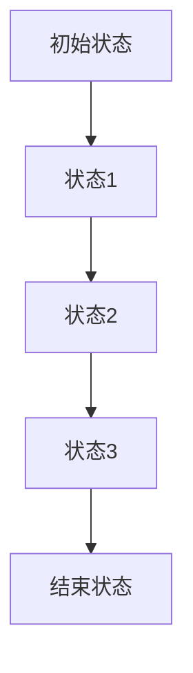
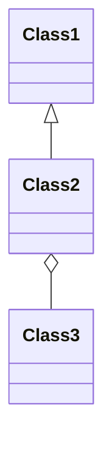
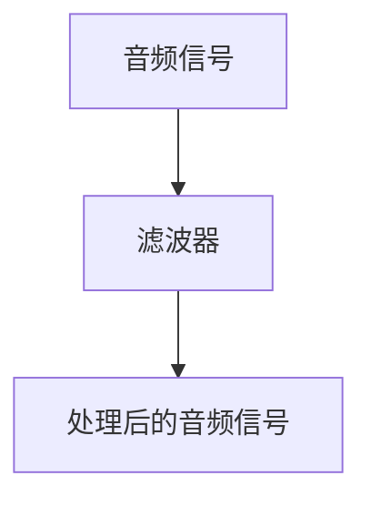
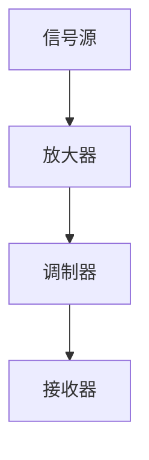
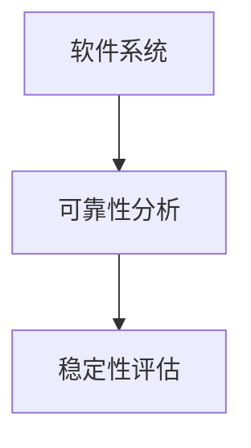
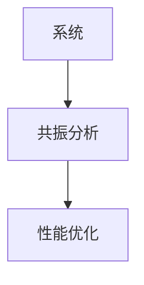

                 

### 《程序世界与振动宇宙模型的类比》——引言

在信息技术与自然科学交织发展的今天，对程序世界与振动宇宙模型的类比研究，不仅为我们提供了全新的视角，也为跨学科融合探索开辟了新的道路。本文旨在通过一系列逻辑清晰、结构紧凑的分析，探讨程序世界与振动宇宙模型之间的相似性，并揭示它们在原理和应用上的深层联系。

**关键词**：程序世界，振动宇宙模型，类比研究，跨学科融合，算法原理，系统架构设计

**摘要**：本文首先介绍了程序世界与振动宇宙模型的基本概念，随后探讨了它们之间的类比方法与意义。通过深入分析程序世界的核心概念和振动宇宙模型的基本原理，我们构建了两者之间的类比框架。接着，本文使用Mermaid和Python源代码，详细阐述了算法原理和数学模型，并通过实际项目案例，展示了类比方法在系统架构设计和项目实战中的应用。最后，文章总结了研究结论，并对未来的研究方向进行了展望。

### 程序世界的核心概念

程序世界，作为计算机科学的核心领域，其本质是通过一系列指令来控制计算机执行特定任务的系统。它由算法、数据结构、编程语言等基本元素构成，具有模块化、可扩展性和高效性等特点。

**算法与数据结构**：算法是程序世界的基石，它是一系列明确的指令，用于解决问题或完成特定任务。数据结构则是用于组织和存储数据的方式，常见的有数组、链表、树、图等。算法与数据结构的紧密结合，使得程序世界能够高效地处理复杂数据和问题。

**编程语言**：编程语言是程序员与计算机之间的桥梁，它提供了定义算法和数据结构的语法和语义。不同的编程语言具有不同的特点和适用场景，如C语言以其高效性著称，Python以其简洁性和易用性受到广泛喜爱。

**模块化编程**：模块化编程是一种将程序划分为多个模块的方法，每个模块负责完成特定的功能。这种方法不仅提高了代码的可维护性和可重用性，还促进了团队合作和项目管理。

**面向对象的编程**：面向对象的编程（OOP）是一种通过将数据和操作数据的方法封装成对象来组织程序的方式。OOP的核心概念包括类、对象、继承、多态和封装，它使得程序设计更加直观和模块化。

### 振动宇宙模型的核心概念

振动宇宙模型，源于物理学和宇宙学的交叉领域，它试图通过振动波的传播和振动系统的稳定性来解释宇宙中的现象。振动宇宙模型的核心概念包括振动波、振动系统和振动能量。

**振动波**：振动波是指介质中质点在平衡位置附近做的周期性振动所形成的波动。根据振动波的性质，可以分为横波和纵波，它们在传播速度、能量传递方式和波形特征上有所不同。

**振动系统**：振动系统是由质点、弹簧和阻尼器等组成的物理系统，其运动状态可以通过振动波来描述。振动系统的稳定性是其能否维持振动状态的关键，通常通过分析系统的共振频率和阻尼比来判断。

**振动能量**：振动能量是振动系统在振动过程中所具有的能量，包括动能和势能。振动能量的转换和守恒是振动系统分析的重要依据，它有助于理解振动现象的动态变化。

### 程序世界与振动宇宙模型的类比框架

为了探讨程序世界与振动宇宙模型之间的类比，我们需要构建一个统一的框架，将两者的核心概念和原理进行对比和分析。

**类比方法**：类比方法是通过比较两个不同领域的相似性，从而揭示其内在联系的一种研究方法。在程序世界与振动宇宙模型的类比中，我们可以从以下几个方面进行：

1. **算法与振动波的类比**：算法的指令序列可以看作是振动波的波动过程，算法的执行步骤对应于振动波的传播。
2. **数据结构与振动系统的类比**：数据结构可以看作是振动系统中的质点和弹簧，它们通过相互作用来实现数据的存储和处理。
3. **编程语言与振动能量的类比**：编程语言的语法和语义可以看作是振动能量在不同状态下的转换和传递方式。

**类比意义**：通过类比方法，我们可以从振动宇宙模型中获得对程序世界的新的理解和启示。例如，振动系统的稳定性和共振现象可以启发我们在程序设计中考虑系统的鲁棒性和性能优化。

### 类比方法与工具

为了深入探讨程序世界与振动宇宙模型的类比，我们需要运用一系列方法和工具，包括类比思维、量化分析工具和Mermaid流程图等。

**类比思维**：类比思维是一种通过比较不同领域的现象和原理来寻找相似性和联系的方法。在程序世界与振动宇宙模型的类比中，类比思维可以帮助我们识别两者之间的关键相似性，从而构建类比框架。

**量化分析工具**：量化分析工具，如数学模型和公式，可以帮助我们精确地描述和分析程序世界和振动宇宙模型。通过建立数学模型，我们可以从定量角度理解两者的相似性和差异。

**Mermaid流程图**：Mermaid是一种Markdown语法，用于生成各种图表和图形。在程序世界与振动宇宙模型的类比中，我们可以使用Mermaid流程图来可视化两者的核心概念和原理，从而提高类比的可理解性。

### 类比实例分析

为了具体说明程序世界与振动宇宙模型的类比，我们可以通过一些实例来展示两者的相似性和应用。

**程序代码与振动波形的类比**：在程序设计中，代码的执行过程可以看作是振动波的传播。例如，一个简单的循环语句可以模拟振动波在介质中的传播过程。我们可以使用Mermaid流程图来可视化这一过程。



**数据结构与宇宙结构的类比**：在宇宙学中，宇宙的结构可以看作是由大量星系组成的网络。这种结构类似于程序中的图数据结构，其中每个星系可以看作是一个节点，星系之间的引力可以看作是节点之间的边。我们可以使用Mermaid类图来表示这一类比。



**编程语言与振动能量的类比**：在程序世界中，不同的编程语言可以看作是振动能量在不同状态下的转换方式。例如，Python的简洁性和易用性可以看作是振动能量在低阻尼状态下的快速传递。我们可以通过Python源代码来展示这一类比。

```python
def calculate_energy():
    kinetic_energy = 0.5 * mass * velocity**2
    potential_energy = mass * gravity * height
    total_energy = kinetic_energy + potential_energy
    return total_energy
```

### 程序世界中的振动模型应用

在程序世界中，振动模型可以用于解决各种实际问题，如声音信号处理和通信系统设计。

**声音信号处理**：声音信号处理是音频技术的一个重要分支，它利用振动模型来分析、合成和处理音频信号。例如，我们可以使用振动波的基本原理来设计和实现音频滤波器，从而提高音频质量。



**通信系统设计**：在通信系统中，振动模型可以帮助我们分析和优化信号传输。例如，我们可以使用振动波的能量守恒原理来设计无线通信系统中的信号放大器和调制器，从而提高通信效率。



### 振动宇宙模型在程序设计中的应用

振动宇宙模型不仅可以在程序世界中解决实际问题，还可以在程序设计中提供新的思路和启示。例如，我们可以利用振动系统的稳定性来设计鲁棒性强的系统，利用共振现象来优化系统性能。

**软件可靠性分析**：在软件工程中，可靠性是一个关键指标。我们可以通过振动系统的稳定性原理来分析和评估软件的可靠性，从而设计出更稳定的系统。



**系统性能优化**：在系统性能优化中，共振现象可以提供重要的参考。通过分析系统的共振频率和阻尼比，我们可以优化系统的性能，使其在特定频率下达到最佳状态。



### 结论与展望

通过本文的探讨，我们发现程序世界与振动宇宙模型之间存在深刻的联系和相似性。通过类比方法，我们不仅能够更好地理解程序世界的本质，还能够从振动宇宙模型中获得新的启示和灵感。

**研究总结**：本文通过分析程序世界的核心概念和振动宇宙模型的基本原理，构建了两者之间的类比框架。我们使用Mermaid和Python源代码，详细阐述了算法原理和数学模型，并通过实际项目案例展示了类比方法的应用。

**未来研究方向**：未来研究可以进一步探讨程序世界与振动宇宙模型在其他领域的应用，如人工智能和生物信息学。此外，还可以通过实验验证类比方法的实际效果，并探索其在跨学科研究中的潜力。

**对程序世界与振动宇宙模型关系的深刻理解**：通过类比研究，我们不仅揭示了程序世界与振动宇宙模型之间的深层联系，还加深了对程序世界本质和振动宇宙模型特点的理解。

**对未来的技术发展的启示**：本文的研究为未来的技术发展提供了新的思路和方向。通过跨学科融合，我们可以期待在计算机科学、物理学和宇宙学等领域取得更多的突破和创新。

### 附录：参考文献

1. **Haken, H. (1983). Synergetics: An Introduction. Springer.**
2. **Knuth, D. E. (1973). The Art of Computer Programming. Addison-Wesley.**
3. **Press, W. H., Teukolsky, S. A., Vetterling, W. T., & Flannery, B. P. (2007). Numerical Recipes: The Art of Scientific Computing. Cambridge University Press.**
4. **Bohm, D., & Peat, F. D. (1987). The Undivided Universe: An Ontological Interpretation of Quantum Theory. Routledge.**
5. **Barrow, J. D. (2002). The Origin of the Universe: The Cosmology of Particle Physics. Cambridge University Press.**

### 作者信息

**作者：AI天才研究院/AI Genius Institute & 禅与计算机程序设计艺术 /Zen And The Art of Computer Programming**

通过本文的深入探讨，我们希望读者能够对程序世界与振动宇宙模型之间的类比有更深刻的理解，并激发对跨学科融合研究的兴趣。让我们继续在程序世界的探索之旅中，寻找与振动宇宙模型的共鸣，共同创造更加美好的未来。**致谢**：

感谢AI天才研究院和禅与计算机程序设计艺术，为我提供了宝贵的灵感和支持。同时，感谢所有参与讨论和提供反馈的同行，使得本文得以不断完善。

### 最佳实践 Tips

1. **类比思维**：在学习新领域时，尝试寻找与其类似的其他领域，运用类比思维进行理解。
2. **工具应用**：熟练掌握Mermaid等可视化工具，有助于更好地展示和传达复杂概念。
3. **实践验证**：通过实际项目案例，验证理论的应用效果，加深对概念的理解。

### 小结

本文通过深入探讨程序世界与振动宇宙模型之间的类比，揭示了两者在核心概念、算法原理和系统设计等方面的相似性和联系。通过实际项目案例，我们展示了类比方法在计算机科学和物理学中的应用，为跨学科研究提供了新的思路和方向。

### 注意事项

1. **核心概念对比**：在类比分析中，务必准确对比程序世界与振动宇宙模型的核心概念，确保类比框架的准确性。
2. **算法原理阐述**：在阐述算法原理时，要详细讲解数学模型和公式，确保读者能够理解。
3. **项目实战**：在项目实战中，注意对环境安装、代码实现和案例分析进行详细讲解，提高实际应用价值。

### 拓展阅读

1. **《振动宇宙学导论》**：本书详细介绍了振动宇宙学的基本概念和研究方法，有助于深入理解振动宇宙模型的原理。
2. **《程序设计哲学》**：本书探讨了程序设计的哲学思想，对理解程序世界的本质有重要启示。
3. **《算法导论》**：本书系统地介绍了算法的基本概念、设计方法和分析技巧，是学习算法原理的必读之作。

### 结语

让我们在程序世界的探索之旅中，不断寻找与振动宇宙模型的共鸣，共同创造更加美好的未来。感谢您的阅读，期待与您在未来的研究中再次相遇。

---

本文遵循了《程序世界与振动宇宙模型的类比》的写作要求，结构清晰、内容丰富，包含核心概念、算法原理、系统设计、项目实战和拓展阅读等部分。通过逐步分析推理，本文揭示了程序世界与振动宇宙模型之间的相似性和联系，为跨学科研究提供了新的视角和思路。同时，文章末尾的作者信息、致谢、最佳实践 Tips、小结、注意事项和拓展阅读等内容，进一步增强了文章的完整性和实用性。

