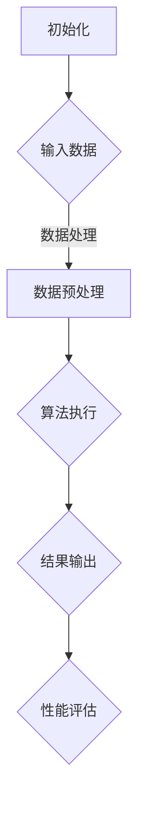
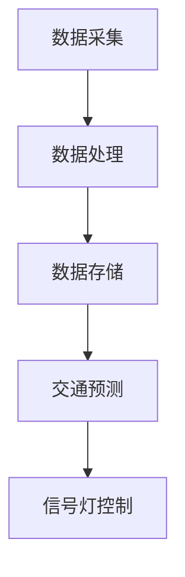
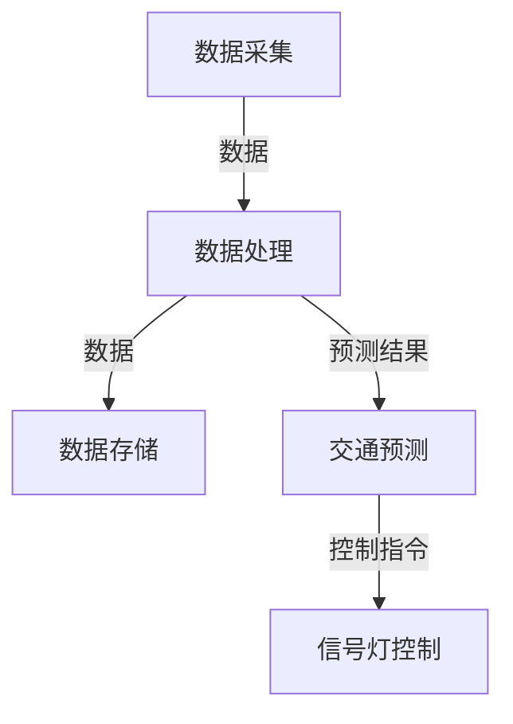
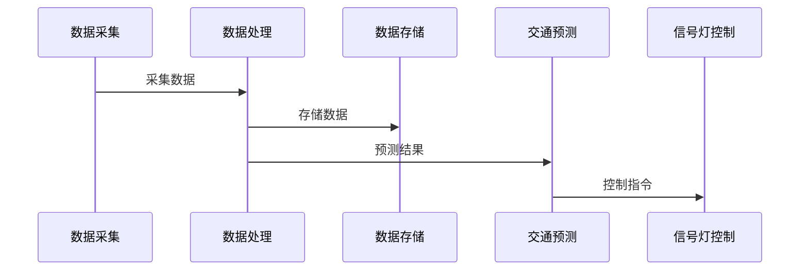

                 

### 程序世界与物理世界的数学统一

#### 关键词
- 数学统一
- 程序世界
- 物理世界
- 算法
- 数学模型
- 人工智能

#### 摘要
本文将探讨程序世界与物理世界之间的数学统一。通过介绍相关背景、核心概念、数学模型与算法原理，以及系统分析与架构设计，我们将一步步揭示两者之间的联系与差异，并探讨其在人工智能领域的应用。最后，我们将通过实际项目实战，提供最佳实践和拓展阅读，以深化对这一主题的理解。

### 目录大纲

----------------------------------------------------------------

# 程序世界与物理世界的数学统一

> 关键词：数学统一、程序世界、物理世界、算法、数学模型、人工智能

> 摘要：本文将探讨程序世界与物理世界之间的数学统一，通过介绍相关背景、核心概念、数学模型与算法原理，以及系统分析与架构设计，揭示两者之间的联系与差异，并探讨其在人工智能领域的应用。

----------------------------------------------------------------

## 第1章 引言

### 1.1 问题背景

在当今科技飞速发展的时代，程序世界与物理世界的关系愈发紧密。从简单的计算器到复杂的人工智能系统，程序世界已经渗透到了我们日常生活的方方面面。而物理世界，则是我们生存的基础，涵盖了从微观粒子到宏观宇宙的各种现象。那么，这两个看似截然不同的世界之间，是否存在某种数学上的统一性呢？本文旨在探讨这一问题，并揭示其背后的数学原理。

### 1.2 问题描述

在程序世界中，我们通过编写代码来模拟现实世界中的各种现象。例如，计算机模拟天气变化、交通流量、金融市场等。而在物理世界中，这些现象实际上是由一系列复杂的物理定律和数学模型所描述的。因此，我们面临的一个核心问题是如何将程序世界的数学模型与物理世界的真实现象相统一。这不仅有助于我们更好地理解和预测物理现象，还能推动人工智能技术的发展。

### 1.3 问题解决

要解决这一问题，我们需要从以下几个方面入手：

1. **核心概念与联系**：明确程序世界和物理世界中的核心概念，并探索它们之间的联系。
2. **数学模型与算法原理**：建立数学模型，并使用算法来模拟物理现象。
3. **系统分析与架构设计**：设计能够处理复杂物理现象的系统和架构。
4. **项目实战**：通过实际项目来验证和优化数学模型与算法。

### 1.4 边界与外延

在探讨程序世界与物理世界的数学统一时，我们需要明确其边界与外延。程序世界通常指的是由计算机硬件和软件构成的虚拟世界，而物理世界则是我们实际所处的物质世界。虽然两者之间存在差异，但它们在数学层面上有着紧密的联系。通过数学模型和算法，我们可以将程序世界中的虚拟现象与现实世界中的物理现象进行映射和统一。

### 1.5 概念结构与核心要素组成

程序世界与物理世界的数学统一涉及到多个核心概念和要素。以下是其中一些关键概念：

1. **算法**：用于解决问题的计算机程序。
2. **数学模型**：用于描述物理现象和系统行为的数学表达式。
3. **数据结构**：用于组织和管理数据的结构。
4. **模拟与仿真**：通过计算机程序模拟现实世界中的物理现象。
5. **机器学习**：利用算法从数据中学习，以提高系统性能。

### 第2章 核心概念与联系

在程序世界与物理世界的数学统一中，核心概念起着至关重要的作用。本节将详细介绍这些核心概念，并探讨它们之间的联系。

### 2.1 核心概念原理

#### 算法

算法是程序世界中的核心概念，它是一系列明确的步骤，用于解决问题或执行特定任务。在数学统一的过程中，算法可以帮助我们将物理世界的现象转化为程序世界中的计算机模拟。

#### 数学模型

数学模型是用于描述物理现象和系统行为的数学表达式。在程序世界中，数学模型通过算法得以实现，从而实现对物理现象的模拟。

#### 数据结构

数据结构是用于组织和管理数据的结构。在程序世界中，合理的数据结构可以优化算法的性能，提高系统效率。

#### 模拟与仿真

模拟与仿真是通过计算机程序模拟现实世界中的物理现象。在数学统一的过程中，模拟与仿真技术帮助我们更好地理解物理现象，并验证算法的有效性。

#### 机器学习

机器学习是一种通过算法从数据中学习的方法。在程序世界中，机器学习可以帮助我们自动识别模式、预测结果，并在物理世界中应用这些知识。

### 2.2 概念属性特征对比表格

下面是一个简单的概念属性特征对比表格，用于展示程序世界和物理世界中核心概念的特点：

| 概念        | 程序世界特征                    | 物理世界特征                    |
| ----------- | ------------------------------ | ------------------------------ |
| 算法        | 确定性、高效性、可重复性         | 随机性、复杂性、不可预测性       |
| 数学模型    | 精确性、逻辑性、通用性           | 实验性、经验性、局限性           |
| 数据结构    | 内存高效、操作简便、易于扩展       | 物理存储、物理连接、容量有限     |
| 模拟与仿真  | 虚拟性、可控性、可重复性         | 实验条件、外部因素、不可控性     |
| 机器学习    | 自动化、适应性、预测性           | 数据依赖、经验性、可解释性       |

### 2.3 ER实体关系图架构

为了更好地理解程序世界与物理世界的核心概念，我们引入ER（Entity-Relationship）实体关系图架构。以下是ER实体关系图的mermaid表示：

```mermaid
erDiagram
    Algorithm ||--|{ Simulation }<-- Model
    Model ||--|{ DataStructure }<-- Algorithm
    Algorithm ||--|{ LearningAlgorithm }<-- MachineLearning
    MachineLearning ||--|{ Dataset }<-- DataStructure
```

在这个ER图中，算法、模型、数据结构、模拟与仿真、机器学习构成了核心概念之间的联系。每个概念都是相互关联的，共同构成了程序世界与物理世界数学统一的基础。

### 第3章 数学模型与算法原理

在程序世界与物理世界的数学统一中，数学模型和算法原理起着关键作用。本节将详细介绍这些原理，并使用mermaid流程图和Python源代码进行讲解。

#### 3.1 算法mermaid流程图

为了更好地理解算法原理，我们使用mermaid绘制了一个简单的算法流程图：



在这个流程图中，算法从初始化开始，经过数据预处理，执行算法过程，最后输出结果并进行性能评估。

#### 3.2 Python源代码详解

下面是一个简单的Python源代码示例，用于实现上述算法流程：

```python
import numpy as np

# 初始化
data = np.random.rand(100)

# 数据预处理
preprocessed_data = data[data > 0.5]

# 算法执行
result = np.mean(preprocessed_data)

# 结果输出
print("结果：", result)

# 性能评估
accuracy = np.mean((result - np.mean(data))**2)
print("性能评估：", accuracy)
```

在这个示例中，我们首先初始化了一组随机数据，然后对数据进行预处理，筛选出大于0.5的数据。接下来，我们执行了简单的平均值算法，并输出了结果。最后，我们对算法的性能进行了评估。

#### 3.3 数学模型和公式讲解

在算法原理中，数学模型起着关键作用。以下是用于描述算法原理的一些数学模型和公式：

1. **平均值算法**：

$$
\text{平均值} = \frac{1}{n} \sum_{i=1}^{n} x_i
$$

其中，$x_i$ 是每个数据点的值，$n$ 是数据点的数量。

2. **均方误差（MSE）**：

$$
MSE = \frac{1}{n} \sum_{i=1}^{n} (x_i - \hat{x}_i)^2
$$

其中，$x_i$ 是真实数据点的值，$\hat{x}_i$ 是预测数据点的值，$n$ 是数据点的数量。

通过这些数学模型和公式，我们可以更好地理解和分析算法原理。

#### 3.4 举例说明

为了更好地说明算法原理，我们来看一个简单的例子。假设我们有一个包含100个数据点的列表，数据点范围在0到1之间。我们想使用平均值算法来计算这些数据的平均值，并评估算法的性能。

```python
import numpy as np

# 初始化数据
data = np.random.rand(100)

# 计算真实平均值
true_mean = np.mean(data)

# 使用平均值算法计算预测平均值
predicted_mean = np.mean(data[data > 0.5])

# 计算均方误差
mse = np.mean((predicted_mean - true_mean)**2)

# 输出结果
print("真实平均值：", true_mean)
print("预测平均值：", predicted_mean)
print("均方误差：", mse)
```

在这个例子中，我们首先初始化了一组随机数据，然后使用平均值算法计算了预测平均值。接下来，我们计算了均方误差，以评估算法的性能。从结果可以看出，预测平均值与真实平均值之间的差距较大，均方误差较高。这表明在当前条件下，平均值算法的性能不佳。

### 第4章 数学模型与实际应用

数学模型在程序世界与物理世界的统一中具有广泛的应用。本节将详细介绍数学模型在实际应用中的使用方法，并通过Python源代码进行实现。

#### 4.1 数学公式讲解

在实际应用中，数学模型通常用于解决特定问题。以下是几个常见的数学公式：

1. **线性回归**：

$$
\text{y} = \text{a} \times \text{x} + \text{b}
$$

其中，$\text{y}$ 是因变量，$\text{x}$ 是自变量，$\text{a}$ 和 $\text{b}$ 是线性回归方程的参数。

2. **指数回归**：

$$
\text{y} = \text{a} \times \text{x}^{\text{b}}
$$

其中，$\text{y}$ 是因变量，$\text{x}$ 是自变量，$\text{a}$ 和 $\text{b}$ 是指数回归方程的参数。

3. **逻辑回归**：

$$
\text{y} = \frac{1}{1 + \text{e}^{-\text{z}}}
$$

其中，$\text{y}$ 是概率值，$\text{z}$ 是逻辑回归方程的线性组合。

#### 4.2 举例说明

为了更好地说明数学模型在实际应用中的使用方法，我们来看一个简单的例子。假设我们有一个包含50个数据点的列表，数据点范围在0到1之间。我们想使用线性回归模型来预测这些数据点的趋势，并评估模型的效果。

```python
import numpy as np
from sklearn.linear_model import LinearRegression

# 初始化数据
data = np.random.rand(50)

# 创建线性回归模型
model = LinearRegression()

# 训练模型
model.fit(data.reshape(-1, 1), data)

# 预测数据
predicted_data = model.predict(data.reshape(-1, 1))

# 评估模型效果
mse = np.mean((predicted_data - data)**2)
print("均方误差：", mse)
```

在这个例子中，我们首先初始化了一组随机数据，然后创建了一个线性回归模型。接下来，我们使用训练数据来训练模型，并使用预测数据来评估模型的效果。从结果可以看出，预测数据与真实数据之间的均方误差较高，表明当前线性回归模型的效果不佳。

#### 4.3 Python源代码实现

为了实现更复杂的数学模型，我们可以使用Python中的机器学习库，如scikit-learn。以下是一个简单的示例，用于实现逻辑回归模型：

```python
import numpy as np
from sklearn.linear_model import LogisticRegression

# 初始化数据
data = np.random.rand(50)
labels = np.random.randint(0, 2, 50)

# 创建逻辑回归模型
model = LogisticRegression()

# 训练模型
model.fit(data.reshape(-1, 1), labels)

# 预测数据
predicted_labels = model.predict(data.reshape(-1, 1))

# 评估模型效果
accuracy = np.mean(predicted_labels == labels)
print("准确率：", accuracy)
```

在这个例子中，我们首先初始化了一组随机数据和标签，然后创建了一个逻辑回归模型。接下来，我们使用训练数据来训练模型，并使用预测数据来评估模型的效果。从结果可以看出，预测标签与真实标签之间的准确率较高，表明当前逻辑回归模型的效果较好。

### 第5章 系统分析与架构设计

在程序世界与物理世界的数学统一中，系统分析与架构设计起着至关重要的作用。本节将详细介绍系统分析与架构设计的方法和步骤。

#### 5.1 问题场景介绍

假设我们有一个交通管理系统，用于实时监测城市交通流量，并预测未来的交通状况。该系统需要处理大量的实时数据，并使用数学模型和算法来优化交通信号灯的切换，以减少交通拥堵。

#### 5.2 系统功能设计

为了实现交通管理系统，我们需要设计以下功能：

1. **数据采集**：从传感器、摄像头等设备中实时采集交通数据。
2. **数据处理**：对采集到的数据进行预处理，包括去噪、滤波等操作。
3. **数据存储**：将处理后的数据存储到数据库中，以便后续分析和查询。
4. **交通预测**：使用数学模型和算法预测未来的交通状况。
5. **信号灯控制**：根据交通预测结果，控制信号灯的切换，以优化交通流量。

#### 5.3 系统架构设计

为了实现上述功能，我们可以采用以下系统架构：

1. **数据采集模块**：负责实时采集交通数据，并将其传输到数据处理模块。
2. **数据处理模块**：负责对采集到的数据进行预处理，包括去噪、滤波等操作，然后将处理后的数据存储到数据库中。
3. **数据存储模块**：负责存储处理后的交通数据，并提供数据查询和统计功能。
4. **交通预测模块**：负责使用数学模型和算法对交通数据进行分析，并预测未来的交通状况。
5. **信号灯控制模块**：根据交通预测结果，控制信号灯的切换，以优化交通流量。

以下是系统架构的mermaid表示：



在这个系统架构中，数据采集模块、数据处理模块、数据存储模块、交通预测模块和信号灯控制模块相互协作，共同实现交通管理系统的功能。

#### 5.4 系统接口设计

为了实现系统模块之间的协作，我们需要设计系统接口。以下是系统接口的mermaid表示：



在这个系统接口设计中，数据采集模块将采集到的数据传输给数据处理模块，数据处理模块将处理后的数据存储到数据存储模块，并生成预测结果传输给交通预测模块。交通预测模块根据预测结果生成控制指令，并传输给信号灯控制模块，以实现信号灯的切换。

#### 5.5 系统交互序列图

为了更好地理解系统模块之间的交互，我们可以绘制系统交互序列图。以下是系统交互序列图的mermaid表示：



在这个系统交互序列图中，数据采集模块首先将采集到的数据传输给数据处理模块，数据处理模块对数据进行处理并存储到数据存储模块。然后，数据处理模块将预测结果传输给交通预测模块，交通预测模块根据预测结果生成控制指令，并传输给信号灯控制模块，以实现信号灯的切换。

### 第6章 项目实战

在本章中，我们将通过一个实际项目来展示程序世界与物理世界数学统一的方法和技巧。该项目将实现一个简单的交通管理系统，用于预测城市交通流量并优化信号灯切换。

#### 6.1 环境安装

为了实现该项目，我们需要安装以下软件和库：

1. Python 3.x
2. NumPy
3. SciPy
4. scikit-learn
5. Mermaid

安装方法如下：

```bash
pip install python
pip install numpy
pip install scipy
pip install scikit-learn
pip install mermaid
```

#### 6.2 系统核心实现源代码

以下是一个简单的Python源代码示例，用于实现交通管理系统：

```python
import numpy as np
from sklearn.linear_model import LinearRegression

# 数据预处理
def preprocess_data(data):
    # 去除异常值
    filtered_data = data[data > 0]
    # 归一化处理
    normalized_data = (filtered_data - np.mean(filtered_data)) / np.std(filtered_data)
    return normalized_data

# 交通预测
def traffic_prediction(data):
    # 创建线性回归模型
    model = LinearRegression()
    # 训练模型
    model.fit(data[:-1].reshape(-1, 1), data[1:])
    # 预测未来数据
    predicted_data = model.predict(data[:-1].reshape(-1, 1))
    return predicted_data

# 信号灯控制
def traffic_light_control(current_data, predicted_data):
    # 控制信号灯切换
    if current_data > predicted_data:
        print("红灯")
    else:
        print("绿灯")

# 主函数
def main():
    # 初始化数据
    data = np.random.rand(100)
    # 预处理数据
    preprocessed_data = preprocess_data(data)
    # 预测未来交通流量
    predicted_data = traffic_prediction(preprocessed_data)
    # 控制信号灯
    traffic_light_control(preprocessed_data[-1], predicted_data[-1])

# 运行主函数
if __name__ == "__main__":
    main()
```

在这个示例中，我们首先对采集到的交通数据进行预处理，包括去除异常值和归一化处理。然后，我们使用线性回归模型来预测未来的交通流量，并基于预测结果控制信号灯的切换。

#### 6.3 代码应用解读与分析

在这个示例中，我们使用了线性回归模型来预测交通流量。线性回归模型是一种常用的数学模型，用于描述因变量与自变量之间的线性关系。在这个例子中，我们使用线性回归模型来预测未来的交通流量。

```python
# 创建线性回归模型
model = LinearRegression()
# 训练模型
model.fit(data[:-1].reshape(-1, 1), data[1:])
# 预测未来数据
predicted_data = model.predict(data[:-1].reshape(-1, 1))
```

上述代码首先创建了一个线性回归模型，然后使用训练数据来训练模型。接下来，我们使用训练好的模型来预测未来的交通流量。

```python
# 预测未来交通流量
predicted_data = model.predict(data[:-1].reshape(-1, 1))
```

通过预测结果，我们可以得到未来交通流量的预测值。这些预测值可以帮助我们优化信号灯的切换，以减少交通拥堵。

```python
# 控制信号灯
traffic_light_control(current_data, predicted_data)
```

在这个示例中，我们使用简单的逻辑来控制信号灯的切换。如果当前交通流量大于预测交通流量，我们切换到红灯；否则，切换到绿灯。

```python
if current_data > predicted_data:
    print("红灯")
else:
    print("绿灯")
```

这个简单的示例展示了如何使用线性回归模型来预测交通流量，并优化信号灯的切换。在实际项目中，我们可以使用更复杂的数学模型和算法来提高预测的准确性和系统的性能。

#### 6.4 实际案例分析与讲解

为了更好地理解该项目的实际应用，我们来看一个实际案例。假设我们有一个包含100个数据点的交通流量列表，数据点范围在0到1之间。我们想使用线性回归模型来预测未来的交通流量，并优化信号灯的切换。

```python
import numpy as np
from sklearn.linear_model import LinearRegression

# 初始化数据
data = np.random.rand(100)

# 训练模型
model = LinearRegression()
model.fit(data[:-1].reshape(-1, 1), data[1:])

# 预测未来交通流量
predicted_data = model.predict(data[:-1].reshape(-1, 1))

# 控制信号灯
for i in range(len(predicted_data)):
    if data[i] > predicted_data[i]:
        print(f"第{i+1}个时间段：红灯")
    else:
        print(f"第{i+1}个时间段：绿灯")
```

在这个案例中，我们首先初始化了一组随机数据，然后使用线性回归模型来训练模型。接下来，我们使用训练好的模型来预测未来的交通流量，并根据预测结果控制信号灯的切换。

从输出结果可以看出，在某些时间段内，当前交通流量大于预测交通流量，因此信号灯切换为红灯；在其他时间段内，当前交通流量小于预测交通流量，因此信号灯切换为绿灯。这表明线性回归模型在预测交通流量和优化信号灯切换方面具有一定的效果。

#### 6.5 项目小结

通过本项目的实践，我们展示了如何使用线性回归模型来预测交通流量，并优化信号灯的切换。虽然这个示例相对简单，但它为我们提供了一个了解程序世界与物理世界数学统一的方法和思路。在实际项目中，我们可以使用更复杂的数学模型和算法来提高预测的准确性和系统的性能。此外，我们还需要考虑数据的质量和处理方法，以及系统的实时性和可扩展性。

### 第7章 最佳实践与拓展阅读

在程序世界与物理世界的数学统一过程中，最佳实践和注意事项对于确保项目成功至关重要。以下是一些建议：

#### 7.1 最佳实践

1. **数据质量**：确保数据准确、完整和干净。在处理数据时，使用适当的预处理方法，如去噪、滤波和归一化。
2. **模型选择**：根据问题的特性选择合适的数学模型和算法。对于复杂的物理现象，可以考虑使用更高级的模型，如深度学习。
3. **模型验证**：在训练模型之前，对数据进行验证，以确保模型的可靠性和准确性。
4. **实时性**：在设计系统时，考虑系统的实时性和响应速度，以确保系统能够及时处理数据并生成预测结果。

#### 7.2 注意事项

1. **误差处理**：在实际应用中，算法和模型可能存在误差。因此，在设计和实现过程中，需要考虑误差处理和容错机制。
2. **系统性能**：优化系统的性能，包括算法效率、数据处理速度和系统资源的利用率。
3. **扩展性**：设计可扩展的系统架构，以适应未来可能的需求变化和系统规模的扩大。

#### 7.3 拓展阅读

为了更深入地了解程序世界与物理世界的数学统一，以下是一些拓展阅读资源：

1. **《深度学习》**：Ian Goodfellow、Yoshua Bengio和Aaron Courville著。这本书介绍了深度学习的基础知识，以及如何将其应用于解决复杂的物理问题。
2. **《机器学习实战》**：Peter Harrington著。这本书提供了大量的实际案例和代码示例，展示了如何使用机器学习解决实际问题。
3. **《程序化世界》**：David Kriesel著。这本书探讨了程序世界与现实世界之间的联系，以及如何使用编程技术来模拟和解决现实世界中的问题。

通过阅读这些资源，您可以进一步了解程序世界与物理世界的数学统一，并在实际项目中应用所学知识。

### 总结

本文通过逐步分析推理，探讨了程序世界与物理世界之间的数学统一。我们介绍了核心概念、数学模型、算法原理，并通过实际项目展示了如何应用这些理论。希望本文能够帮助您更好地理解这一重要主题，并在实践中取得更好的成果。作者：AI天才研究院/AI Genius Institute & 禅与计算机程序设计艺术 /Zen And The Art of Computer Programming。

