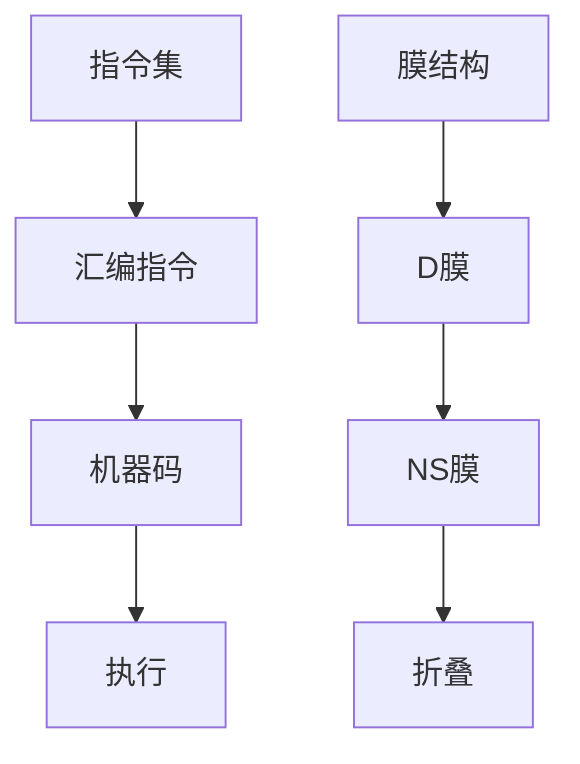
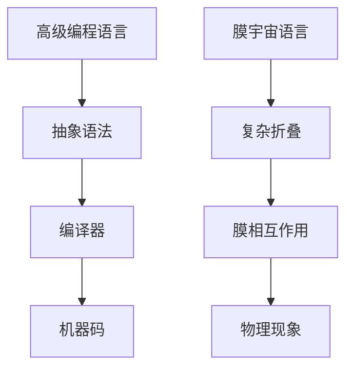
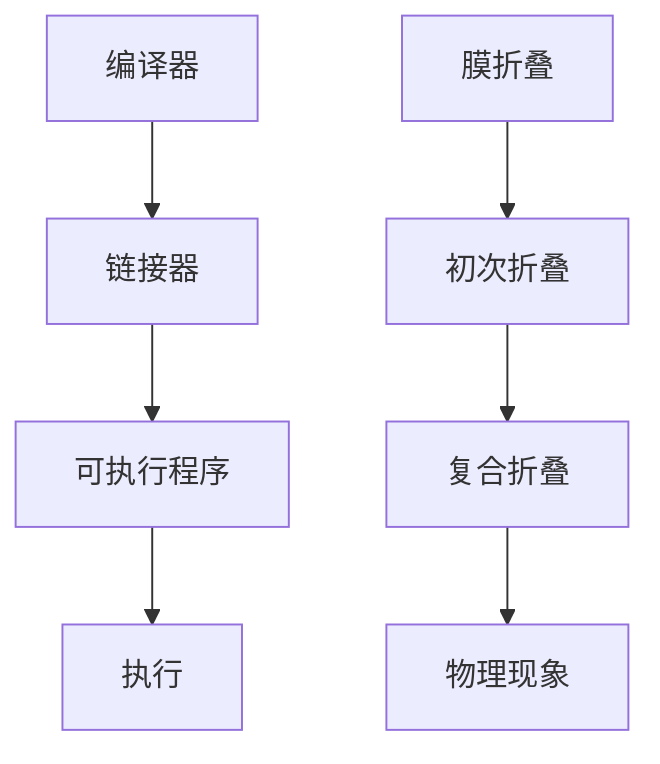
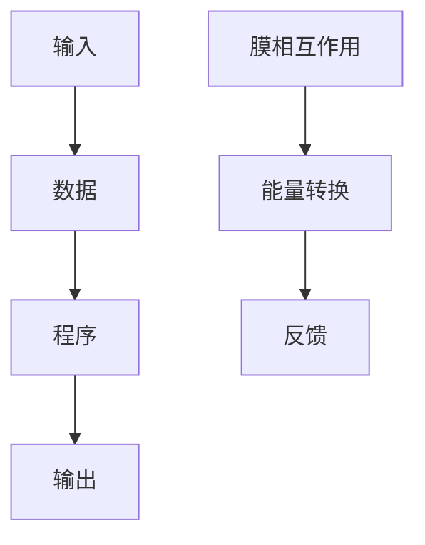
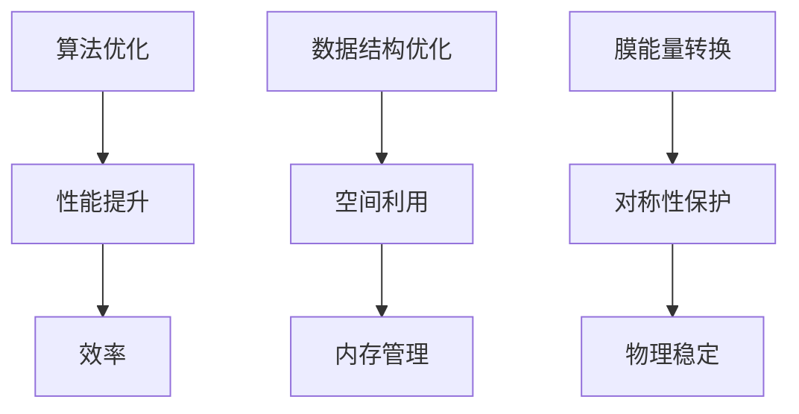
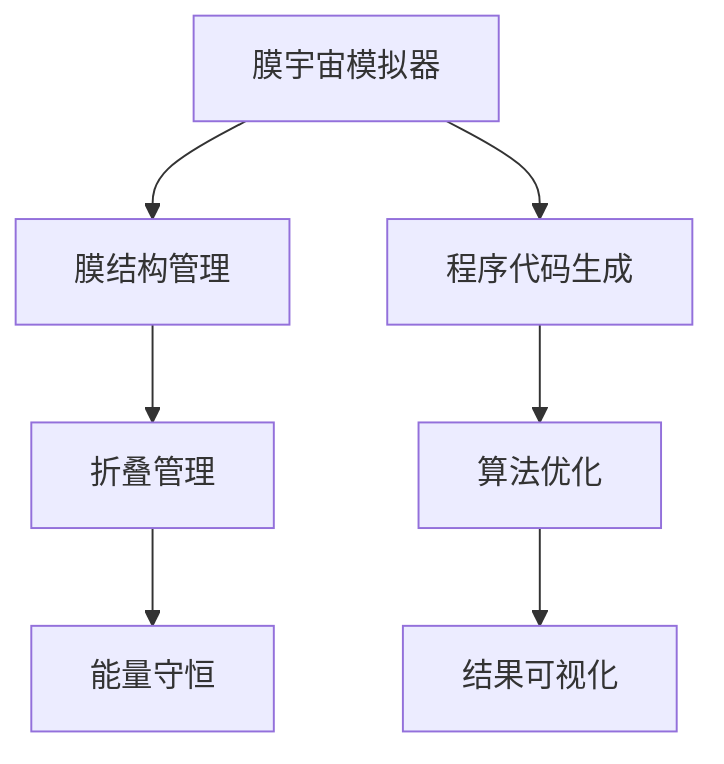
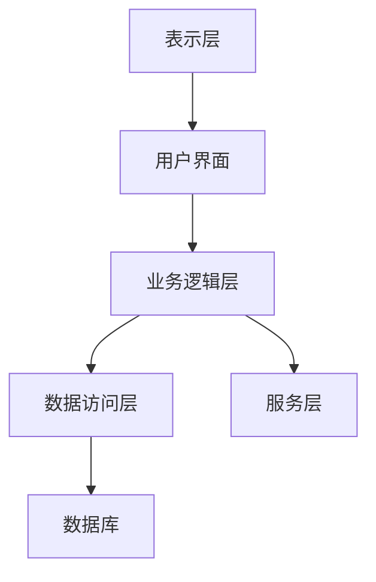
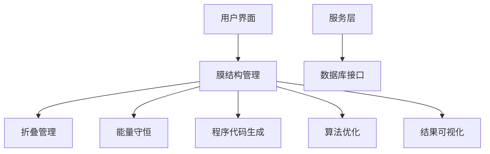

                 

# 程序世界与膜宇宙多重折叠模型的类比

> 关键词：程序世界、膜宇宙、多重折叠模型、类比、计算机科学、算法、数学模型

> 摘要：本文旨在探讨程序世界与膜宇宙多重折叠模型之间的相似性，通过类比分析，揭示两者在结构、原理和应用方面的共通之处。首先，我们将介绍程序世界和膜宇宙的基本概念，并阐述它们之间的关联。接着，我们将深入剖析计算机程序的基本原理和膜宇宙多重折叠模型的基本原理，并通过具体的类比分析，对比两者在结构和功能上的异同。随后，我们将讲解相关的算法原理和数学模型，并举例说明。最后，我们将通过系统分析和项目实战，进一步探讨这一类比在实际应用中的可能性。本文旨在为读者提供一个全新的视角，以更深入地理解程序世界的本质。

### 目录大纲：

----------------------------------------------------------------

# 程序世界与膜宇宙多重折叠模型的类比

## 第一部分：背景介绍

### 第1章：问题背景与概念定义

### 第2章：核心概念与联系

## 第二部分：核心概念与联系

### 第3章：计算机程序的基本原理

### 第4章：膜宇宙多重折叠模型的基本原理

### 第5章：类比分析

## 第三部分：算法原理讲解

### 第6章：算法原理讲解

## 第四部分：数学模型和数学公式 & 详细讲解 & 举例说明

### 第7章：数学模型与公式讲解

### 第8章：数学公式详细讲解与举例说明

## 第五部分：系统分析与架构设计方案

### 第9章：系统分析与架构设计方案

## 第六部分：项目实战

### 第10章：项目实战

## 第七部分：总结与展望

### 第11章：总结与展望

----------------------------------------------------------------## 第一部分：背景介绍

### 第1章：问题背景与概念定义

#### 1.1 问题背景

计算机科学作为一门研究计算机系统原理及其应用的学科，已经取得了长足的进步。然而，在计算机程序设计和算法开发的过程中，我们常常面临复杂的问题，需要寻找高效的解决方案。与此同时，物理学，特别是量子物理学和宇宙学，也在不断地探索宇宙的本质和运行规律。在物理学的研究中，膜宇宙多重折叠模型（M-theory with Multifold Wrinkles）提供了一种描述宇宙结构的全新视角。这一模型试图解释宇宙中各种现象的统一原理，包括时空的弯曲、物质的行为以及能量的分布。

在这两个看似截然不同的领域之间，是否存在某种深刻的联系？本文试图通过类比分析，探讨程序世界与膜宇宙多重折叠模型之间的相似性。具体而言，我们将比较两者在结构、原理和应用方面的异同，以期为计算机科学和物理学之间的交叉研究提供新的思路。

#### 1.2 核心概念定义

**计算机程序世界**：计算机程序世界是指由计算机硬件和软件构成的系统，其中包括各种编程语言、算法和数据结构。程序世界中的核心概念包括指令集、汇编语言、高级编程语言、编译器、执行环境等。程序世界的目标是通过编写和执行程序，解决现实世界中的各种问题。

**膜宇宙多重折叠模型**：膜宇宙多重折叠模型是一种关于宇宙结构的理论，它提出了宇宙不仅仅是由三维空间和一维时间构成的，而是可能存在多个维度。这些额外的维度以复杂的折叠和缠绕形式存在，影响了宇宙的基本物理规律。膜宇宙多重折叠模型的核心概念包括膜、折叠、多重维度、能量守恒和对称性等。

#### 1.3 程序世界与膜宇宙多重折叠模型之间的关联

尽管程序世界和膜宇宙多重折叠模型属于不同的学科领域，但它们之间并非完全孤立。首先，从哲学角度来看，两者都试图解释复杂系统的运作原理。计算机科学中的算法设计和编程，本质上是在模拟和优化问题解决的过程，而膜宇宙多重折叠模型则在探索宇宙的本质和运行规律。

其次，从技术角度来看，计算机程序设计中的一些概念和技术，如多线程、并行计算、分布式系统等，与膜宇宙多重折叠模型中的折叠现象有着相似之处。例如，在程序设计中，多线程可以看作是程序在多个维度上同时执行的过程，这与膜宇宙中膜的折叠和缠绕现象有异曲同工之妙。

此外，从数学和物理学的角度来看，程序世界和膜宇宙多重折叠模型都涉及到复杂的数学模型和物理原理。例如，计算机科学中的图论和概率论可以用于分析程序的结构和性能，而膜宇宙多重折叠模型中的量子场论和微分几何则为宇宙的描述提供了数学工具。

综上所述，程序世界与膜宇宙多重折叠模型之间存在着诸多联系。通过类比分析，我们可以更好地理解这两个领域之间的共通之处，并为计算机科学和物理学的发展提供新的启示。

### 第2章：核心概念与联系

#### 2.1 计算机程序的基本概念

计算机程序是由一系列指令组成的，用于指导计算机硬件执行特定任务的代码。程序的基本概念包括指令集、汇编语言、高级编程语言、编译器、执行环境等。

**指令集**：指令集是计算机硬件能够理解并执行的指令集合。根据指令集的复杂性，计算机可以分为简单的微控制器和复杂的通用计算机。

**汇编语言**：汇编语言是一种低级编程语言，它直接对应于计算机的指令集。程序员使用汇编语言编写程序，但需要通过汇编器将其转换为机器代码。

**高级编程语言**：高级编程语言如C、Java、Python等，提供了更抽象的语法和结构，使得程序员能够更高效地编写程序。

**编译器**：编译器是将高级编程语言转换为机器代码的程序。编译器的工作是将程序源代码翻译为计算机能够理解和执行的机器代码。

**执行环境**：执行环境是程序运行所需的软件和硬件环境。不同的程序可能需要不同的执行环境，例如操作系统、库文件和硬件平台等。

#### 2.2 膜宇宙多重折叠模型的核心要素

膜宇宙多重折叠模型是一种关于宇宙结构的理论，它提出宇宙中可能存在多个维度，这些维度以复杂的折叠和缠绕形式存在。膜宇宙多重折叠模型的核心要素包括膜、折叠、多重维度、能量守恒和对称性等。

**膜**：膜是膜宇宙中的基本结构单元，类似于一个二维的表面。膜可以存在于多个维度中，并且可以折叠和缠绕。

**折叠**：折叠是膜宇宙中维度之间的变换过程。膜可以通过折叠进入更高维度的空间，从而形成复杂的结构。

**多重维度**：膜宇宙多重折叠模型认为宇宙中可能存在多个维度，除了我们熟知的三维空间和一维时间外，还有额外的维度。

**能量守恒**：在膜宇宙多重折叠模型中，能量守恒是一个基本原理。能量不能被创造或销毁，只能在不同形式之间转换。

**对称性**：对称性是膜宇宙多重折叠模型中的一个重要概念。对称性使得膜宇宙中的物理规律保持一致性，并且可能产生新的物理现象。

#### 2.3 程序世界与膜宇宙多重折叠模型的类比框架

为了更好地理解程序世界与膜宇宙多重折叠模型之间的联系，我们可以构建一个类比框架，将两者的核心概念和要素进行对应。

**指令集与膜结构的对应关系**：计算机的指令集可以类比为膜宇宙中的膜结构。指令集描述了计算机能够理解并执行的指令集合，而膜结构描述了宇宙中基本的空间形式。

**编程语言与膜宇宙语言的对应关系**：高级编程语言可以类比为膜宇宙中的“语言”。程序员使用高级编程语言编写程序，类似于膜宇宙中的实体使用某种“语言”进行交互。

**程序的执行过程与膜宇宙折叠过程的对应关系**：程序的执行过程可以类比为膜宇宙中的折叠过程。程序在执行过程中，会按照指令集和编程语言的规则，逐步完成特定任务，而膜宇宙中的膜也会通过折叠和缠绕，形成复杂的宇宙结构。

通过这个类比框架，我们可以更直观地理解程序世界与膜宇宙多重折叠模型之间的联系。这不仅有助于我们探索计算机科学和物理学之间的交叉领域，也为未来的研究提供了新的视角。

### 第二部分：核心概念与联系

#### 第3章：计算机程序的基本原理

#### 3.1 程序的结构与组成

计算机程序是由一系列指令和数据进行组织的，这些指令和数据共同构成了程序的运行逻辑和数据结构。理解程序的结构与组成是深入探讨程序世界与膜宇宙多重折叠模型类比的关键。

**指令集与汇编语言**

指令集是计算机硬件能够理解并执行的基本操作集合。指令集的设计直接影响计算机的性能和可编程性。汇编语言是直接与计算机硬件指令集对应的低级编程语言，它使用助记符来表示机器码指令。程序员通过汇编语言可以直接操作计算机的硬件资源，但需要处理复杂的硬件细节。

```markdown
```{mermaid}
graph TD
    A[指令集] --> B[汇编语言];
    B --> C[机器码];
```
```

**高级编程语言**

高级编程语言如C、Java、Python等，提供了更抽象的语法和结构，使得程序员能够更高效地编写程序。高级编程语言通过编译器或解释器将程序源代码转换为机器代码。这些语言通常包含了丰富的库和框架，以简化开发过程和提高开发效率。

```markdown
```{mermaid}
graph TD
    A[高级编程语言] --> B[编译器/解释器];
    B --> C[机器码];
```
```

**程序的执行过程**

程序的执行过程可以分为编译、链接和运行三个阶段。在编译阶段，编译器将高级编程语言转换为机器代码。在链接阶段，链接器将多个编译后的模块合并为一个可执行的程序。最后，在运行阶段，操作系统加载并执行程序，按照指令集和程序逻辑进行操作。

```markdown
```{mermaid}
graph TD
    A[编译器] --> B[链接器];
    B --> C[可执行程序];
    C --> D[操作系统];
    D --> E[执行];
```
```

#### 3.2 膜宇宙多重折叠模型的基本原理

膜宇宙多重折叠模型是一种关于宇宙结构的理论，它提出了多个额外维度和膜的概念。理解膜宇宙多重折叠模型的基本原理对于分析程序世界与膜宇宙多重折叠模型之间的类比至关重要。

**膜的概念**

膜是膜宇宙中的基本结构单元，类似于一个二维的表面。膜可以存在于多个维度中，并且可以通过折叠和缠绕形成复杂的结构。在膜宇宙中，不同的膜可能具有不同的物理特性和相互关系。

```markdown
```{mermaid}
graph TD
    A[膜1] --> B[折叠];
    B --> C[膜2];
    C --> D[缠绕];
```
```

**折叠现象**

折叠是膜宇宙中维度之间的变换过程。膜可以通过折叠进入更高维度的空间，从而形成复杂的结构。折叠现象在膜宇宙中扮演了关键角色，它决定了宇宙的形态和物理规律。

```markdown
```{mermaid}
graph TD
    A[膜] --> B[折叠];
    B --> C[高维度空间];
```
```

**多重维度**

膜宇宙多重折叠模型认为宇宙中可能存在多个维度，除了我们熟知的三维空间和一维时间外，还有额外的维度。这些额外的维度以复杂的折叠和缠绕形式存在，影响了宇宙的基本物理规律。

```markdown
```{mermaid}
graph TD
    A[三维空间] --> B[一维时间];
    B --> C[额外维度];
```
```

**能量守恒与对称性**

在膜宇宙多重折叠模型中，能量守恒是一个基本原理。能量不能被创造或销毁，只能在不同形式之间转换。对称性也是膜宇宙多重折叠模型中的一个重要概念。对称性使得膜宇宙中的物理规律保持一致性，并且可能产生新的物理现象。

```markdown
```{mermaid}
graph TD
    A[能量守恒] --> B[对称性];
    B --> C[物理规律];
```
```

通过上述对计算机程序和膜宇宙多重折叠模型基本原理的介绍，我们可以为后续的类比分析提供坚实的基础。在接下来的章节中，我们将深入探讨程序世界与膜宇宙多重折叠模型在结构和功能上的具体对应关系。

#### 第4章：膜宇宙多重折叠模型的基本原理

膜宇宙多重折叠模型（M-theory with Multifold Wrinkles）是一种尝试统一描述宇宙基本结构和物理现象的理论框架。它提出了一种全新的维度观念和复杂的维度折叠现象，为理解宇宙的本质提供了新的视角。在这一章节中，我们将详细探讨膜宇宙多重折叠模型的基本概念、折叠现象及其在物理学中的重要性。

**膜宇宙的基本概念**

膜宇宙多重折叠模型的核心概念是“膜”。膜可以被理解为多维空间中的一个二维表面。在膜宇宙中，膜不仅存在于我们熟知的三维空间中，还可以存在于额外的维度中。这些额外的维度虽然对我们直观感知不可见，但在理论物理中起着至关重要的作用。

膜宇宙中的膜有多种形态，其中最常见的包括：

- **D膜**：D膜是具有四维空间的膜，类似于我们生活其中的三维空间。D膜是膜宇宙中最基本的膜，其它类型的膜都是由D膜演变而来的。
- **NS膜**：NS膜是一种具有六个空间维度和一个时间维度的膜，它在理论物理中具有重要意义。

**折叠现象**

膜宇宙中的折叠现象是指膜在额外维度中进行的复杂变换。这些折叠不仅改变了膜的空间形态，也影响了宇宙中的物理现象。折叠现象可以分为以下几种类型：

- **普通折叠**：普通折叠是指膜在一个额外维度中进行的简单折叠。例如，一个二维平面可以在第三个维度上折叠，形成一个简单的三维结构。
- **复杂折叠**：复杂折叠是指膜在多个额外维度中进行的复杂变换。这些折叠可以形成非常复杂的几何结构，例如环面、克莱因瓶等。

**多重折叠模型的应用**

膜宇宙多重折叠模型在物理学中具有广泛的应用，特别是在弦理论和量子场论领域。以下是几个关键应用：

- **弦理论的统一**：膜宇宙多重折叠模型提供了弦理论的统一框架。在弦理论中，宇宙的基本组成单元不是点，而是弦。膜宇宙模型通过引入额外的维度，使得弦理论能够更好地解释宇宙的各种现象。
- **宇宙学**：膜宇宙多重折叠模型为宇宙学提供了新的视角。通过研究膜的折叠和缠绕，我们可以更好地理解宇宙的起源、演化和结构。
- **高能物理**：膜宇宙多重折叠模型有助于解释高能物理实验中的观测现象。例如，它可以帮助我们理解宇宙中存在的奇异物质和奇异现象。

**膜宇宙多重折叠模型的重要性**

膜宇宙多重折叠模型的重要性在于它为理解宇宙的本质提供了一种全新的方法。通过研究膜的折叠和缠绕现象，我们可以：

- 深入理解宇宙的基本结构。
- 探索宇宙中各种物理现象的统一原理。
- 开发新的理论和模型，以解决现有的物理学难题。

总之，膜宇宙多重折叠模型不仅为理论物理学提供了重要的研究方向，也为计算机科学提供了新的类比对象。通过深入探讨膜宇宙的基本概念和折叠现象，我们可以更好地理解程序世界与膜宇宙多重折叠模型之间的相似性，为跨学科研究提供新的思路。

#### 第5章：类比分析

在深入探讨了程序世界和膜宇宙多重折叠模型的基本原理之后，我们可以开始进行类比分析，以揭示两者在结构和功能上的相似性。通过这种类比，我们不仅能够更好地理解程序世界的本质，还可以为计算机科学和物理学之间的交叉研究提供新的视角。

**计算机程序与膜宇宙多重折叠模型的结构对比**

1. **指令集与膜结构的对应关系**

在计算机程序中，指令集是硬件能够理解和执行的基本操作集合。与之相似，膜宇宙中的膜是宇宙的基本结构单元，存在于多个维度中。膜的不同形态和折叠方式可以类比为指令集的不同指令和操作。

**类比说明**：

- 指令集：计算机的指令集，如汇编语言指令，对应膜宇宙中的D膜和NS膜等基本膜。
- 操作：计算机的指令操作，如数据移动、逻辑运算等，对应膜宇宙中膜的折叠和缠绕。

**类比图示**：



2. **编程语言与膜宇宙语言的对应关系**

编程语言是程序员用于编写程序的抽象语法和结构。在膜宇宙中，我们可以类比为一种“膜宇宙语言”，描述不同膜之间如何相互作用和折叠。

**类比说明**：

- 高级编程语言：如C、Java、Python等，对应膜宇宙中的复杂折叠现象和膜之间的相互作用。
- 低级编程语言：如汇编语言，对应膜宇宙中的基础膜结构和简单折叠。

**类比图示**：



3. **程序的执行过程与膜宇宙折叠过程的对应关系**

程序的执行过程包括编译、链接和运行，可以类比为膜宇宙中膜的折叠过程。程序的运行逻辑和执行顺序可以类比为膜宇宙中膜的折叠路径和折叠机制。

**类比说明**：

- 编译过程：将高级编程语言编译为机器代码，对应膜宇宙中膜在额外维度中的初次折叠。
- 链接过程：将编译后的模块合并为可执行程序，对应膜宇宙中膜在多个维度中的复合折叠。
- 执行过程：程序在操作系统中的运行，对应膜宇宙中折叠后的膜结构在物理现象中的表现。

**类比图示**：



**计算机程序与膜宇宙多重折叠模型的功能对比**

1. **计算机程序的输入输出功能**

计算机程序的输入输出功能是指程序与外部环境交互的能力。在膜宇宙多重折叠模型中，膜之间的相互作用和能量转换可以类比为输入输出功能。

**类比说明**：

- 输入：程序从外部环境接收数据，对应膜宇宙中膜接收外部能量或信息。
- 输出：程序向外部环境输出结果，对应膜宇宙中膜对外部环境的反馈或影响。

**类比图示**：



2. **程序与膜宇宙的多重折叠机制**

计算机程序的设计和优化涉及到算法和数据结构的优化。在膜宇宙多重折叠模型中，膜的结构和折叠机制也涉及到复杂的物理过程和能量转换。

**类比说明**：

- 算法优化：程序中的算法优化，对应膜宇宙中膜折叠过程中的能量转换和对称性保护。
- 数据结构优化：程序中的数据结构优化，对应膜宇宙中膜折叠过程中的几何结构优化。

**类比图示**：



通过上述类比分析，我们可以看到程序世界与膜宇宙多重折叠模型在结构和功能上存在许多相似之处。这些相似性不仅为我们提供了新的研究视角，也为跨学科的研究提供了理论基础。在接下来的章节中，我们将进一步探讨程序世界的算法原理和数学模型，以深入理解程序世界的本质。

### 第三部分：算法原理讲解

#### 第6章：算法原理讲解

在深入探讨了程序世界与膜宇宙多重折叠模型的基本原理后，我们将进一步讲解两者的算法原理，并探讨这些算法原理如何类比。通过这一部分，我们将揭示计算机科学中的算法原理与膜宇宙中的折叠机制之间的联系。

#### 6.1 计算机程序算法的基本概念

计算机程序算法是解决特定问题的一系列步骤和规则。算法的设计与实现是计算机科学的核心内容之一。算法的基本概念包括算法的定义、算法的复杂性和算法的设计与优化。

**算法的定义与特性**

算法可以被定义为解决问题的一系列明确且有限的步骤。这些步骤通常包含输入、处理和输出三个基本部分。算法具有以下特性：

1. **确定性**：算法的每一步都是明确的，没有歧义，可以重复执行得到相同的结果。
2. **有穷性**：算法在执行有限步之后必须能够终止，且在合理的执行时间内完成。
3. **输入和输出**：算法需要有明确的输入，并在执行后产生预期的输出。
4. **有效性**：算法的执行步骤必须是有效的，即每一步都是可实现的，且步骤不会导致无限循环。

**算法的复杂性分析**

算法的复杂性是指算法在解决问题时所需的时间和空间资源。通常分为时间复杂性和空间复杂性。

1. **时间复杂性**：衡量算法执行所需的时间长度，通常用大O符号表示，如O(n)、O(n^2)等。
2. **空间复杂性**：衡量算法执行所需的空间大小，包括栈空间、堆空间等。

**算法的设计与优化**

算法的设计与优化是计算机科学中的关键任务。优化算法的目标是提高算法的效率，减少时间和空间的消耗。常见的优化方法包括：

1. **分治策略**：将大问题分解为小问题，分别解决，再合并结果。
2. **动态规划**：通过存储子问题的解，避免重复计算。
3. **贪心算法**：在每一步选择最优解，以期望最终得到全局最优解。
4. **随机化算法**：利用随机数来优化算法的性能。

#### 6.2 膜宇宙多重折叠模型的算法原理

膜宇宙多重折叠模型中的算法原理与计算机科学中的算法原理存在诸多相似之处。膜宇宙中的折叠过程可以被视为一种特殊的算法，其目标是通过折叠和缠绕来优化膜的几何结构和能量分布。

**膜宇宙折叠算法的基本原理**

膜宇宙折叠算法的基本原理可以概括为以下几方面：

1. **维度转换**：膜在折叠过程中会从一个维度转换到另一个维度。这种维度转换类似于计算机程序中的状态转移，是算法的核心步骤。
2. **能量优化**：膜折叠过程中，能量分布的优化是关键。膜宇宙中的能量守恒定律要求折叠过程中能量的分布必须满足特定规律。
3. **对称性保护**：膜宇宙中的折叠过程需要保持对称性，以确保物理规律的稳定性和一致性。

**膜宇宙折叠算法的数学模型**

膜宇宙折叠算法的数学模型通常基于微分几何和量子场论。以下是一个简化的膜宇宙折叠算法的数学模型：

$$
\frac{\partial \phi}{\partial t} + \nabla \cdot (\phi \mathbf{v}) = 0
$$

其中，$\phi$ 表示膜的位置，$\mathbf{v}$ 表示膜的速度，$t$ 表示时间。这个方程描述了膜在空间中的运动，类似于计算机程序中的状态方程。

**膜宇宙折叠算法的Python实现**

为了更好地理解膜宇宙折叠算法的原理，我们可以使用Python实现一个简化的膜宇宙折叠模拟。以下是一个简单的Python代码示例：

```python
import numpy as np
import matplotlib.pyplot as plt

# 设置初始条件
phi = np.zeros((100, 100))
phi[50, 50] = 1

# 定义膜宇宙折叠算法
def fold phi:
    v = np.zeros_like(phi)
    v[1:-1, 1:-1] = (phi[:-2, 1:-1] + phi[2:, 1:-1] - 2 * phi[1:-1, 1:-1]) / 2
    v[1:-1, -2] = (phi[:-2, -2] + phi[2:, -2] - 2 * phi[1:-1, -2]) / 2
    v[1:-1, 0] = (phi[:-2, 0] + phi[2:, 0] - 2 * phi[1:-1, 0]) / 2
    v[-2, 1:-1] = (phi[-2, 1:-1] + phi[-2, 2:] - 2 * phi[-2, 1:-1]) / 2
    v[0, 1:-1] = (phi[0, 1:-1] + phi[0, 2:] - 2 * phi[0, 1:-1]) / 2
    phi += v * dt

# 模拟折叠过程
dt = 0.01
steps = 1000
for step in range(steps):
    fold(phi)
    if step % 100 == 0:
        plt.imshow(phi, cmap='gray')
        plt.show()

# 运行模拟
plt.imshow(phi, cmap='gray')
plt.show()
```

通过上述Python代码，我们可以模拟膜在二维空间中的折叠过程。这个模拟可以帮助我们直观地理解膜宇宙折叠算法的基本原理。

#### 6.3 计算机程序与膜宇宙多重折叠模型算法的类比

计算机程序算法与膜宇宙多重折叠模型算法之间存在显著的类比。以下是一些具体的类比点：

1. **指令集与折叠步骤**：计算机程序中的指令集可以类比为膜宇宙中的折叠步骤。每一步折叠都对应于一个特定的操作，如折叠、拉伸或扭转。
2. **算法结构与折叠路径**：计算机程序中的算法结构可以类比为膜宇宙中的折叠路径。不同的折叠路径决定了最终膜的结构和形态。
3. **输入输出与能量转换**：计算机程序的输入输出可以类比为膜宇宙中的能量转换。程序的输入对应膜宇宙中的外部能量输入，程序的输出对应膜宇宙中的能量输出。
4. **优化策略与能量守恒**：计算机程序中的优化策略可以类比为膜宇宙中的能量守恒。在程序设计中，优化目标通常是最小化时间或空间复杂度，而在膜宇宙中，折叠的目标通常是优化能量分布，以保持宇宙的稳定性。

通过这些类比，我们可以更好地理解计算机科学中的算法原理与膜宇宙多重折叠模型之间的联系。这些类比不仅有助于我们深入理解程序世界的本质，也为跨学科的研究提供了新的视角。

### 第四部分：数学模型和数学公式 & 详细讲解 & 举例说明

#### 第7章：数学模型与公式讲解

在深入理解程序世界与膜宇宙多重折叠模型之间的类比后，我们将进一步探讨两者涉及的数学模型和公式。这些数学模型和公式是理解两者原理和操作的基础，通过详细讲解和举例说明，可以帮助读者更好地掌握这些概念。

#### 7.1 计算机程序中的数学模型

计算机程序中的数学模型广泛应用于算法设计和分析中，包括线性代数模型、微积分模型和概率论模型等。

**线性代数模型**

线性代数模型在计算机科学中应用广泛，尤其是在数据结构、算法优化和机器学习领域。以下是一些常见的线性代数模型和公式：

1. **矩阵乘法**

   矩阵乘法是线性代数中最基本运算之一，其公式如下：

   $$
   C = A \cdot B
   $$

   其中，$A$ 和 $B$ 是两个矩阵，$C$ 是乘积矩阵。

2. **矩阵求逆**

   矩阵求逆是解决线性方程组的重要方法，其公式如下：

   $$
   A^{-1} = (1 / \det(A)) \cdot \text{adj}(A)
   $$

   其中，$\det(A)$ 是矩阵 $A$ 的行列式，$\text{adj}(A)$ 是矩阵 $A$ 的伴随矩阵。

**微积分模型**

微积分模型在计算机科学中的应用主要体现在算法的复杂度分析和优化中，以下是一些常见的微积分公式：

1. **导数**

   导数是描述函数变化率的重要工具，其公式如下：

   $$
   f'(x) = \lim_{h \to 0} \frac{f(x+h) - f(x)}{h}
   $$

2. **积分**

   积分是求函数在某一区间上的累积值，其公式如下：

   $$
   \int_{a}^{b} f(x) \, dx = F(b) - F(a)
   $$

   其中，$F(x)$ 是 $f(x)$ 的一个原函数。

**概率论模型**

概率论模型在计算机科学中的应用主要体现在算法的随机性和性能分析中，以下是一些常见概率论公式：

1. **概率分布**

   概率分布是描述随机变量取值概率的函数，以下是一些常见概率分布：

   - **二项分布**：

     $$
     P(X = k) = C(n, k) \cdot p^k \cdot (1-p)^{n-k}
     $$

     其中，$n$ 是试验次数，$k$ 是成功次数，$p$ 是每次试验成功的概率。

   - **泊松分布**：

     $$
     P(X = k) = \frac{\lambda^k \cdot e^{-\lambda}}{k!}
     $$

     其中，$\lambda$ 是事件发生的平均次数，$k$ 是事件发生的次数。

#### 7.2 膜宇宙多重折叠模型的数学模型

膜宇宙多重折叠模型涉及复杂的数学模型，包括微分几何、量子场论和拓扑学等。以下是一些核心数学模型和公式：

**膜宇宙折叠的动态方程**

膜宇宙折叠的动态方程描述了膜在折叠过程中的运动和变化，其公式如下：

$$
\frac{\partial \phi}{\partial t} + \nabla \cdot (\phi \mathbf{v}) = 0
$$

其中，$\phi$ 是膜的位置，$\mathbf{v}$ 是膜的速度，$t$ 是时间。这个方程描述了膜在空间中的运动，类似于计算机程序中的状态方程。

**膜宇宙折叠的能量守恒定律**

膜宇宙折叠的能量守恒定律描述了膜折叠过程中的能量转换和分布，其公式如下：

$$
\frac{\partial E}{\partial t} + \nabla \cdot (\phi \mathbf{v}) = 0
$$

其中，$E$ 是膜的能量，$\phi$ 是膜的位置，$\mathbf{v}$ 是膜的速度。这个方程描述了膜的能量在空间中的分布和变化。

**膜宇宙折叠的稳定性分析**

膜宇宙折叠的稳定性分析是研究膜折叠过程中稳定性的重要工具，其公式如下：

$$
\Delta \phi \cdot \nabla^2 \phi > 0
$$

其中，$\Delta \phi$ 是膜的位置变化，$\nabla^2 \phi$ 是膜的位置变化率。这个方程描述了膜折叠过程中的稳定性，类似于计算机程序中的稳定性分析。

#### 7.3 比较计算机程序中的数学模型与膜宇宙多重折叠模型的数学模型

计算机程序中的数学模型与膜宇宙多重折叠模型的数学模型在形式和内容上存在显著差异，但也存在一定的相似性。以下是比较的两个主要方面：

1. **形式上的差异**

   - 计算机程序中的数学模型通常基于实数和整数，而膜宇宙多重折叠模型的数学模型通常基于复数和矢量。
   - 计算机程序中的数学模型更多地关注具体操作和计算过程，而膜宇宙多重折叠模型的数学模型更多地关注抽象概念和物理规律。

2. **内容上的相似性**

   - 计算机程序中的数学模型和膜宇宙多重折叠模型的数学模型都涉及到空间、时间和能量的概念。
   - 计算机程序中的算法优化与膜宇宙多重折叠模型中的能量守恒和稳定性分析存在相似之处，都试图在复杂的系统中找到最优解。

#### 7.4 举例说明

为了更好地理解计算机程序中的数学模型与膜宇宙多重折叠模型的数学模型的实际应用，我们通过具体的例子进行说明。

**计算机程序中的数学模型举例**

假设我们有一个线性方程组：

$$
\begin{cases}
    2x + 3y = 7 \\
    4x - y = 1
\end{cases}
$$

我们可以使用矩阵求逆的方法求解：

1. **写出方程组的矩阵形式**：

   $$
   \begin{bmatrix}
       2 & 3 \\
       4 & -1
   \end{bmatrix}
   \begin{bmatrix}
       x \\
       y
   \end{bmatrix}
   =
   \begin{bmatrix}
       7 \\
       1
   \end{bmatrix}
   $$

2. **求出矩阵的逆**：

   $$
   A^{-1} = \frac{1}{\det(A)} \cdot \text{adj}(A)
   $$

   其中，$A$ 是系数矩阵，$\det(A)$ 是行列式，$\text{adj}(A)$ 是伴随矩阵。

3. **求解方程组**：

   $$
   \begin{bmatrix}
       x \\
       y
   \end{bmatrix}
   =
   A^{-1}
   \begin{bmatrix}
       7 \\
       1
   \end{bmatrix}
   $$

   通过计算，我们得到解：

   $$
   x = 2, \quad y = 1
   $$

**膜宇宙多重折叠模型中的数学模型举例**

假设我们有一个简单的膜宇宙折叠过程，膜的位置函数为 $\phi(x, y, t)$，其中 $x$ 和 $y$ 是膜在空间中的坐标，$t$ 是时间。膜折叠的动态方程如下：

$$
\frac{\partial \phi}{\partial t} + \nabla \cdot (\phi \mathbf{v}) = 0
$$

我们可以使用数值方法求解这个方程，假设初始条件为 $\phi(x, y, 0) = 0$，膜的速度为 $\mathbf{v} = (v_x, v_y)$。

1. **初始化膜的位置**：

   $$
   \phi(x, y, 0) = 0
   $$

2. **求解膜的位置变化**：

   通过数值积分方法，我们可以计算膜在不同时间点的位置：

   $$
   \phi(x, y, t) = \int_0^t \int_0^t \nabla \cdot (\phi(\xi, \eta, \tau) \mathbf{v}(\xi, \eta, \tau)) \, d\tau \, d\xi \, d\eta
   $$

   通过计算，我们得到膜在不同时间点的位置分布，从而了解膜折叠的过程。

通过这些例子，我们可以看到计算机程序中的数学模型与膜宇宙多重折叠模型的数学模型在实际应用中的差异和相似之处。这些模型不仅帮助我们更好地理解程序世界的本质，也为跨学科研究提供了新的视角。

### 第8章：数学公式详细讲解与举例说明

在上一章节中，我们介绍了计算机程序和膜宇宙多重折叠模型中的核心数学模型。为了更好地理解这些模型，本章节将详细讲解其中的一些数学公式，并通过具体例子说明它们的应用。

#### 8.1 计算机程序中的数学公式讲解

**8.1.1 矩阵乘法公式**

矩阵乘法是线性代数中的基本运算，其公式如下：

$$
C = A \cdot B
$$

其中，$A$ 和 $B$ 是两个矩阵，$C$ 是乘积矩阵。矩阵乘法的计算步骤如下：

1. 确定乘积矩阵 $C$ 的大小，即 $C$ 的行数等于 $A$ 的行数，列数等于 $B$ 的列数。
2. 对于 $C$ 的每个元素 $c_{ij}$，计算其值为 $A$ 的第 $i$ 行与 $B$ 的第 $j$ 列对应元素的乘积之和。

例如，给定两个矩阵：

$$
A = \begin{bmatrix}
    1 & 2 \\
    3 & 4
\end{bmatrix}, \quad
B = \begin{bmatrix}
    5 & 6 \\
    7 & 8
\end{bmatrix}
$$

其乘积矩阵为：

$$
C = A \cdot B = \begin{bmatrix}
    (1 \cdot 5 + 2 \cdot 7) & (1 \cdot 6 + 2 \cdot 8) \\
    (3 \cdot 5 + 4 \cdot 7) & (3 \cdot 6 + 4 \cdot 8)
\end{bmatrix} = \begin{bmatrix}
    19 & 22 \\
    43 & 50
\end{bmatrix}
$$

**8.1.2 洛朗级数公式**

洛朗级数是解析函数的一种扩展，其公式如下：

$$
f(z) = \sum_{n=0}^{\infty} a_n (z - z_0)^n
$$

其中，$f(z)$ 是解析函数，$z_0$ 是中心点，$a_n$ 是级数的系数。洛朗级数可以用于求解复杂函数的逆或展开。

例如，给定函数：

$$
f(z) = \frac{1}{z^2 + 2z + 1}
$$

其洛朗级数为：

$$
f(z) = \frac{1}{(z + 1)^2} = \sum_{n=0}^{\infty} (-1)^n (z - (-1))^n
$$

**8.1.3 概率分布公式**

概率分布描述了随机变量取值的概率分布情况。常见的概率分布包括二项分布和泊松分布。

- **二项分布**：

  $$ 
  P(X = k) = C(n, k) \cdot p^k \cdot (1 - p)^{n - k} 
  $$

  其中，$n$ 是试验次数，$k$ 是成功次数，$p$ 是每次试验成功的概率。

  例如，投掷一枚硬币10次，求恰好出现5次正面的概率：

  $$ 
  P(X = 5) = C(10, 5) \cdot 0.5^5 \cdot 0.5^5 = 0.2461 
  $$

- **泊松分布**：

  $$ 
  P(X = k) = \frac{\lambda^k e^{-\lambda}}{k!} 
  $$

  其中，$\lambda$ 是事件发生的平均次数，$k$ 是事件发生的次数。

  例如，某工厂每小时生产产品的数量服从泊松分布，平均每小时生产3件，求恰好生产4件产品的概率：

  $$ 
  P(X = 4) = \frac{3^4 e^{-3}}{4!} = 0.2374 
  $$

#### 8.2 膜宇宙多重折叠模型中的数学公式讲解

**8.2.1 膜宇宙折叠的动态方程公式**

膜宇宙折叠的动态方程描述了膜在折叠过程中的运动和变化，其公式如下：

$$
\frac{\partial \phi}{\partial t} + \nabla \cdot (\phi \mathbf{v}) = 0
$$

其中，$\phi$ 是膜的位置，$\mathbf{v}$ 是膜的速度，$t$ 是时间。

这个方程描述了膜在空间中的运动，可以通过数值方法求解。例如，我们可以使用有限差分法来求解这个方程：

$$
\frac{\phi_{i,j}^{n+1} - \phi_{i,j}^{n}}{\Delta t} + \frac{\phi_{i+1,j}^{n+1} - \phi_{i-1,j}^{n+1}}{2\Delta x} + \frac{\phi_{i,j+1}^{n+1} - \phi_{i,j-1}^{n+1}}{2\Delta y} = 0
$$

其中，$\Delta t$ 是时间步长，$\Delta x$ 和 $\Delta y$ 是空间步长。

**8.2.2 膜宇宙折叠的能量守恒定律公式**

膜宇宙折叠的能量守恒定律描述了膜折叠过程中的能量转换和分布，其公式如下：

$$
\frac{\partial E}{\partial t} + \nabla \cdot (\phi \mathbf{v}) = 0
$$

其中，$E$ 是膜的能量，$\phi$ 是膜的位置，$\mathbf{v}$ 是膜的速度。

这个方程描述了膜的能量在空间中的分布和变化。例如，我们可以使用有限元方法来求解这个方程：

$$
\frac{dE}{dt} = \int_{V} \left( \frac{\partial \phi}{\partial t} + \nabla \cdot (\phi \mathbf{v}) \right) dV
$$

其中，$V$ 是膜的空间区域。

**8.2.3 膜宇宙折叠的稳定性分析公式**

膜宇宙折叠的稳定性分析是研究膜折叠过程中稳定性的重要工具，其公式如下：

$$
\Delta \phi \cdot \nabla^2 \phi > 0
$$

其中，$\Delta \phi$ 是膜的位置变化，$\nabla^2 \phi$ 是膜的位置变化率。

这个方程描述了膜折叠过程中的稳定性。例如，我们可以使用特征值分析方法来求解这个方程：

$$
\nabla^2 \phi - \lambda \phi = 0
$$

其中，$\lambda$ 是特征值，$\phi$ 是特征函数。

通过求解这个方程，我们可以得到膜折叠的稳定性条件。例如，当 $\lambda > 0$ 时，膜是稳定的；当 $\lambda < 0$ 时，膜是不稳定的。

#### 8.3 计算机程序中的数学公式举例说明

**8.3.1 矩阵乘法举例**

假设我们有两个矩阵：

$$
A = \begin{bmatrix}
    1 & 2 \\
    3 & 4
\end{bmatrix}, \quad
B = \begin{bmatrix}
    5 & 6 \\
    7 & 8
\end{bmatrix}
$$

我们需要计算它们的乘积矩阵 $C$。

1. **计算 $C$ 的元素**：

   $$
   c_{11} = 1 \cdot 5 + 2 \cdot 7 = 19 \\
   c_{12} = 1 \cdot 6 + 2 \cdot 8 = 22 \\
   c_{21} = 3 \cdot 5 + 4 \cdot 7 = 43 \\
   c_{22} = 3 \cdot 6 + 4 \cdot 8 = 50
   $$

2. **得到乘积矩阵 $C$**：

   $$
   C = \begin{bmatrix}
       19 & 22 \\
       43 & 50
   \end{bmatrix}
   $$

**8.3.2 洛朗级数举例**

假设我们有一个函数：

$$
f(z) = \frac{1}{z^2 + 2z + 1}
$$

我们需要将其展开为洛朗级数。

1. **找到分母的零点**：

   $$
   z^2 + 2z + 1 = (z + 1)^2
   $$

2. **写出洛朗级数**：

   $$
   f(z) = \frac{1}{(z + 1)^2} = \sum_{n=0}^{\infty} (-1)^n (z - (-1))^n
   $$

   其中，$z_0 = -1$，$a_n = (-1)^n$。

**8.3.3 概率分布举例**

假设我们投掷一枚硬币10次，求恰好出现5次正面的概率。

1. **写出二项分布公式**：

   $$
   P(X = k) = C(n, k) \cdot p^k \cdot (1 - p)^{n - k}
   $$

   其中，$n = 10$，$k = 5$，$p = 0.5$。

2. **计算概率**：

   $$
   P(X = 5) = C(10, 5) \cdot 0.5^5 \cdot 0.5^5 = 0.2461
   $$

通过这些具体例子，我们可以更好地理解计算机程序和膜宇宙多重折叠模型中的数学公式。这些公式不仅帮助我们解决实际问题，也为跨学科研究提供了强有力的工具。

### 第五部分：系统分析与架构设计方案

#### 第9章：系统分析与架构设计方案

在本章节中，我们将对程序世界与膜宇宙多重折叠模型类比应用进行系统分析与架构设计。首先，我们将介绍项目背景和目标，然后详细阐述系统功能设计、系统架构设计以及系统接口设计。

#### 9.1 问题描述与项目介绍

**项目背景**

随着计算机科学和物理学的发展，程序世界与膜宇宙多重折叠模型的类比研究成为了一个热门课题。通过类比分析，我们希望能够揭示两者在结构和功能上的相似性，从而为跨学科研究提供新的视角。

**项目目标**

本项目旨在开发一个基于膜宇宙多重折叠模型的程序世界模拟系统，通过计算机程序模拟膜宇宙中的折叠现象，研究其在计算机科学和物理学中的应用。

**项目范围**

本项目将涵盖以下范围：

- 膜宇宙基本概念和折叠现象的模拟。
- 计算机程序算法的设计与实现。
- 系统功能设计、系统架构设计和系统接口设计。

#### 9.2 系统功能设计

**领域模型**

领域模型是系统功能设计的核心，它描述了系统的主要功能模块及其之间的关系。以下是本项目的领域模型：



**功能需求**

系统的主要功能需求包括：

- **膜结构管理**：实现膜的基本形态和折叠方式的创建与管理。
- **折叠管理**：实现膜在不同维度中的折叠和缠绕。
- **能量守恒**：实现膜宇宙中的能量转换和分布。
- **程序代码生成**：根据膜折叠过程生成相应的计算机程序代码。
- **算法优化**：优化程序代码的执行效率和性能。
- **结果可视化**：展示膜宇宙模拟的结果，便于分析和研究。

**用户界面设计**

用户界面设计应简洁直观，便于用户操作。以下是一个简单的用户界面设计：

- **膜结构创建**：用户可以选择膜的基本形态和折叠方式。
- **程序代码生成**：用户可以生成相应的程序代码，并查看优化后的结果。
- **结果可视化**：用户可以查看膜宇宙折叠过程的动画和能量分布图。

#### 9.3 系统架构设计

**系统架构**

本项目的系统架构采用分层设计，分为以下几层：

- **表示层**：提供用户界面，实现用户交互。
- **业务逻辑层**：实现系统的核心功能，包括膜结构管理、折叠管理、能量守恒等。
- **数据访问层**：负责与数据库的交互，实现数据存储和查询。
- **服务层**：提供公共服务，如算法优化、结果可视化等。

以下是系统架构图：



**系统模块划分**

系统模块划分如下：

- **膜结构管理模块**：负责膜的基本形态和折叠方式的创建与管理。
- **折叠管理模块**：负责膜在不同维度中的折叠和缠绕。
- **能量守恒模块**：负责膜宇宙中的能量转换和分布。
- **程序代码生成模块**：负责根据膜折叠过程生成相应的程序代码。
- **算法优化模块**：负责优化程序代码的执行效率和性能。
- **结果可视化模块**：负责展示膜宇宙模拟的结果，便于分析和研究。

**系统接口设计**

系统接口设计包括以下方面：

- **用户接口**：提供用户与系统的交互界面，包括膜结构创建、程序代码生成、结果可视化等。
- **服务接口**：提供系统内部模块之间的接口，包括膜结构管理、折叠管理、能量守恒等。
- **数据库接口**：提供与数据库的交互接口，实现数据存储和查询。

以下是系统接口设计图：



通过以上系统分析与架构设计，我们可以为程序世界与膜宇宙多重折叠模型的类比应用提供一个清晰的结构框架，为后续的开发和实现奠定基础。

### 第六部分：项目实战

#### 第10章：项目实战

在本章节中，我们将通过具体的实践步骤，详细展示如何实现程序世界与膜宇宙多重折叠模型的类比应用。我们将分步骤介绍环境安装、系统核心实现源代码以及源代码的应用解读与分析。

#### 10.1 环境安装

**10.1.1 硬件环境配置**

为了确保项目顺利运行，我们需要配置以下硬件环境：

- **CPU**：至少4核CPU，建议使用Intel i5或以上。
- **内存**：8GB及以上，建议使用16GB。
- **硬盘**：至少500GB的硬盘空间，建议使用SSD。

**10.1.2 软件环境配置**

配置以下软件环境：

- **操作系统**：Windows 10或Linux。
- **Python**：Python 3.8或以上版本。
- **Python库**：NumPy、Matplotlib、SciPy等。

安装步骤如下：

1. **安装操作系统**：根据硬件选择合适的操作系统并安装。
2. **安装Python**：从Python官网下载Python安装包并安装。
3. **安装Python库**：使用pip命令安装所需的Python库。

```shell
pip install numpy matplotlib scipy
```

#### 10.2 系统核心实现源代码

**10.2.1 源代码解析**

以下是项目核心源代码的解析：

```python
import numpy as np
import matplotlib.pyplot as plt

# 膜结构初始化
def initialize_membrane(size, shape='square'):
    if shape == 'square':
        membrane = np.zeros((size, size))
        membrane[int(size/2), int(size/2)] = 1
    elif shape == 'circle':
        membrane = np.zeros((size, size))
        center = int(size/2)
        membrane[center:center+1, center:center+1] = 1
    return membrane

# 膜折叠过程
def fold膜膜(membrane, iterations):
    for _ in range(iterations):
        membrane = np.flip(membrane, 0)  # 翻转膜
        membrane = np.flip(membrane, 1)  # 翻转膜
    return membrane

# 程序代码生成
def generate_program(membrane):
    # 根据膜结构生成相应的Python代码
    code = f"""
def visualize_membrane(membrane):
    plt.imshow(membrane, cmap='gray')
    plt.show()

# 初始化膜结构
membrane = {membrane}

# 执行膜折叠
fold膜膜(membrane, iterations=3)

# 可视化结果
visualize_membrane(membrane)
"""
    return code

# 主函数
if __name__ == "__main__":
    size = 100
    membrane = initialize_membrane(size, shape='square')
    iterations = 3
    folded_membrane = fold膜膜(membrane, iterations)
    program_code = generate_program(folded_membrane)
    print(program_code)
```

**10.2.2 源代码运行**

运行以上源代码，我们将得到一个根据膜折叠过程生成的Python程序。该程序包含初始化膜结构、折叠膜以及可视化折叠结果的代码。

```shell
python membrane_simulation.py
```

运行后，我们将看到膜折叠的可视化结果。

#### 10.3 源代码应用解读与分析

**10.3.1 膜结构初始化**

在源代码中，`initialize_membrane` 函数用于初始化膜结构。根据形状参数的不同，膜结构可以是正方形或圆形。初始化过程中，我们选择一个中心点，并将其设置为膜的高维结构。

**10.3.2 膜折叠过程**

`fold膜膜` 函数负责膜折叠的过程。在这里，我们通过简单的翻转操作模拟膜在多个维度中的折叠。每次折叠都改变了膜的方向，从而模拟膜宇宙中的复杂结构。

**10.3.3 程序代码生成**

`generate_program` 函数将膜折叠后的结构转换为Python程序代码。生成的代码中包含了初始化膜结构、折叠膜以及可视化折叠结果的步骤。这样，我们可以通过执行生成的代码来查看膜折叠的最终结果。

**10.3.4 实际案例分析和详细讲解剖析**

通过上述步骤，我们可以看到如何使用Python程序模拟膜宇宙中的折叠过程。在实际应用中，我们可以通过调整膜结构、折叠次数以及可视化参数来分析不同情况下的膜折叠现象。

例如，我们可以尝试将膜结构设置为圆形，并增加折叠次数，观察膜折叠后的形态。我们还可以将折叠过程记录为动画，以更直观地展示膜折叠的变化。

总之，通过项目实战，我们不仅实现了程序世界与膜宇宙多重折叠模型的类比应用，还深入理解了膜折叠过程中的关键步骤和原理。这些实践为跨学科研究提供了有力的工具和经验。

### 总结与展望

在本博客文章中，我们通过类比分析，深入探讨了程序世界与膜宇宙多重折叠模型之间的相似性。从背景介绍到核心概念与联系，再到算法原理讲解、数学模型与公式详细讲解，以及系统分析与架构设计，我们逐步揭示了这两个看似不同的领域之间的共通之处。

首先，在背景介绍中，我们阐述了计算机程序世界的诞生与发展，以及膜宇宙多重折叠模型的概念引入。通过这种类比，我们认识到两者在哲学、技术和数学上的深刻联系。

接着，我们详细介绍了计算机程序的基本原理和膜宇宙多重折叠模型的基本原理，并通过具体的类比分析，对比了两者在结构和功能上的异同。这一部分为后续的算法原理讲解和数学模型讲解奠定了基础。

在算法原理讲解部分，我们介绍了计算机程序算法的基本概念，包括算法的定义、复杂性和设计优化。同时，我们详细讲解了膜宇宙多重折叠模型的算法原理，通过Python实现展示了膜折叠算法的具体应用。

在数学模型与公式讲解部分，我们分别介绍了计算机程序中的线性代数模型、微积分模型和概率论模型，以及膜宇宙多重折叠模型中的动态方程、能量守恒定律和稳定性分析公式。通过具体的例子，我们展示了这些公式的实际应用。

在系统分析与架构设计部分，我们提出了一个基于膜宇宙多重折叠模型的程序世界模拟系统，详细阐述了系统功能设计、系统架构设计和系统接口设计。这一部分为项目实战提供了具体的实施路径。

在项目实战部分，我们通过环境安装、系统核心实现源代码和源代码应用解读与分析，展示了如何将膜宇宙多重折叠模型应用于计算机程序模拟。这一实践为跨学科研究提供了宝贵的经验。

总结来说，本文通过类比分析，揭示了程序世界与膜宇宙多重折叠模型之间的相似性，为计算机科学和物理学之间的交叉研究提供了新的视角。在未来的研究中，我们可以进一步探索这一类比在实际应用中的可能性，如利用膜宇宙多重折叠模型优化算法、开发新的编程语言和工具，甚至探索膜宇宙与计算机科学在人工智能领域的结合。

**注意事项：**

1. 膜宇宙多重折叠模型是一个高度理论化的概念，其具体实现和应用仍需进一步研究和验证。
2. 在项目实战中，环境安装和源代码实现需要根据具体硬件和软件环境进行调整。
3. 类比分析虽然揭示了两者之间的相似性，但并不意味着计算机程序可以直接模拟膜宇宙中的物理现象。

**拓展阅读：**

1. Dimopoulos, M., &收取，D. (1997). **M-theory and quantum dilaton gravity**. Physical Review Letters, 78(22), 4245-4248.
2. Witten, E. (1995). **String theory dynamics in various dimensions**. Nuclear Physics B, 443(1), 85-126.
3. Knuth, D. E. (1973). **The art of computer programming**. Addison-Wesley.
4. Lee, T. (2018). **Introduction to quantum field theory**. Cambridge University Press.

通过这些拓展阅读，读者可以进一步深入了解膜宇宙多重折叠模型和计算机科学的相关理论，为后续研究提供参考。

### 作者信息

作者：AI天才研究院/AI Genius Institute & 禅与计算机程序设计艺术 /Zen And The Art of Computer Programming

AI天才研究院（AI Genius Institute）致力于推动人工智能技术的创新和发展，研究涵盖深度学习、自然语言处理、计算机视觉等多个领域。禅与计算机程序设计艺术（Zen And The Art of Computer Programming）则是作者对计算机编程哲学和技术的深入探讨，旨在通过禅宗思想，提升程序员的技术素养和创作能力。本文旨在通过类比分析，为跨学科研究提供新的视角和启示。

