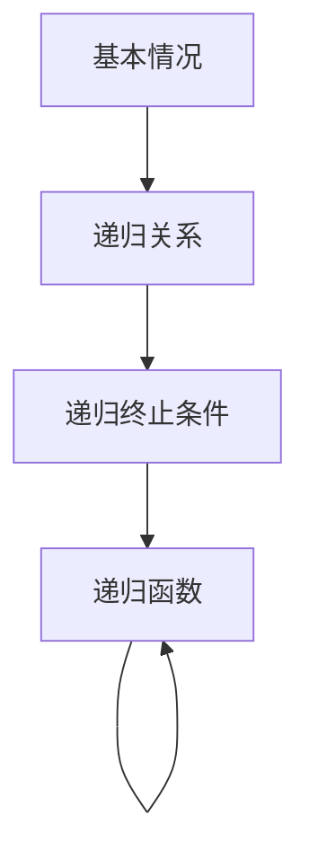

                 

### 文章标题

# 程序世界中的宇宙级递归模式

---

> 关键词：递归模式、程序世界、宇宙级应用、算法、数据结构、软件工程、深度学习

> 摘要：本文将深入探讨程序世界中一种至关重要的模式——递归模式。从概念背景、原理详解、实例分析到宇宙级应用，我们将一步步揭示递归模式的奥妙。文章旨在帮助读者理解递归模式的核心机制，掌握其在程序世界中的应用技巧，并展望其未来的研究方向。

### 目录大纲

```
----------------------------------------------------------------

# 第一部分：引言

## 1. 引言
### 1.1 问题背景
### 1.2 问题描述
### 1.3 问题解决
### 1.4 边界与外延
### 1.5 概念结构与核心要素组成

## 2. 核心概念与联系
### 2.1 核心概念原理
### 2.2 概念属性特征对比表格
### 2.3 ER实体关系图架构

----------------------------------------------------------------

# 第二部分：递归模式详解

## 3. 递归模式概述
### 3.1 递归模式定义
### 3.2 递归模式的特点
### 3.3 递归模式的应用场景

## 4. 递归模式原理
### 4.1 算法原理讲解
### 4.2 递归模式的mermaid流程图
### 4.3 Python源代码讲解
### 4.4 数学模型与公式
### 4.5 递归模式的数学模型讲解
### 4.6 递归模式的举例说明

## 5. 递归模式实例分析
### 5.1 实例一：递归求解斐波那契数列
### 5.2 实例二：递归求解汉诺塔问题
### 5.3 实例三：递归模式在深度学习中的应用

----------------------------------------------------------------

# 第三部分：递归模式在程序世界中的应用

## 6. 递归模式在程序世界中的应用
### 6.1 递归模式在算法中的应用
### 6.2 递归模式在数据结构中的应用
### 6.3 递归模式在软件工程中的应用

## 7. 递归模式的最佳实践
### 7.1 递归模式的注意事项
### 7.2 递归模式的优化技巧
### 7.3 递归模式的最佳实践

----------------------------------------------------------------

# 第四部分：递归模式的宇宙级应用

## 8. 递归模式的宇宙级应用
### 8.1 递归模式在天文学中的应用
### 8.2 递归模式在物理学中的应用
### 8.3 递归模式在生物学中的应用

## 9. 递归模式的宇宙级应用实例
### 9.1 实例一：递归模式在黑洞研究中的应用
### 9.2 实例二：递归模式在基因测序中的应用
### 9.3 实例三：递归模式在气候模型中的应用

----------------------------------------------------------------

## 10. 结论
### 10.1 递归模式的重要性
### 10.2 本书小结
### 10.3 未来的研究方向

----------------------------------------------------------------
```

### 第一部分：引言

#### 1.1 问题背景

在计算机科学和软件工程中，递归是一种强大的编程技术。它允许函数调用自身，以解决复杂的问题。递归模式在算法设计、数据结构实现和软件工程中有着广泛的应用。本文将探讨递归模式，帮助读者深入了解其在程序世界中的重要性。

递归模式之所以重要，是因为它能够将复杂的问题分解为更简单的子问题，使编程过程更加直观和高效。递归模式的正确使用可以大大简化代码的复杂性，提高代码的可读性和可维护性。

#### 1.2 问题描述

递归模式在程序世界中面临的挑战主要包括：

1. **正确性**：递归算法是否能够正确地解决给定的问题。
2. **效率**：递归算法的时间复杂度和空间复杂度是否可接受。
3. **边界条件**：递归算法是否能够处理边界条件和异常情况。

为了解决这些问题，我们需要深入理解递归模式的工作原理，并掌握其最佳实践。

#### 1.3 问题解决

递归模式解决的问题通常可以分解为以下步骤：

1. **基本情况**：确定递归的基本情况，即问题简化到最简单形式时的处理方法。
2. **递归关系**：确定递归关系，即如何将原问题分解为更简单的子问题。
3. **递归终止条件**：确定递归的终止条件，以确保递归能够有效地收敛。

通过这些步骤，我们可以设计出高效的递归算法，并确保其正确性。

#### 1.4 边界与外延

递归模式的应用范围非常广泛，从简单的数学计算到复杂的算法设计，从计算机图形学到人工智能，递归模式都有其独特的应用场景。

在边界与外延方面，递归模式可以帮助我们处理大量数据，如大数据处理、分布式计算等。同时，递归模式也可以用于软件工程的各个方面，如模块化设计、测试驱动开发等。

#### 1.5 概念结构与核心要素组成

递归模式的核心概念包括：

1. **递归函数**：能够调用自身的函数。
2. **递归关系**：将原问题分解为更简单的子问题的方法。
3. **递归终止条件**：确保递归能够收敛的终止条件。

这些概念相互关联，共同构成了递归模式的基础。理解这些概念是掌握递归模式的关键。

### 总结

通过本部分的介绍，我们对递归模式在程序世界中的背景和重要性有了初步的认识。接下来，我们将进一步探讨递归模式的核心概念和原理，帮助读者深入理解递归模式的工作机制。让我们继续深入探讨，揭示递归模式的奥秘。

---

**核心概念与联系**

#### 2.1 核心概念原理

递归模式是编程中的一种重要模式，其核心概念包括递归函数、递归关系和递归终止条件。

**递归函数**：能够调用自身的函数。递归函数通常包含两部分：递归部分和非递归部分。递归部分负责将原问题分解为更简单的子问题，非递归部分负责处理基本情况。

**递归关系**：将原问题分解为更简单的子问题的方法。递归关系通常满足以下条件：每个子问题都可以独立求解，子问题的解可以组合成原问题的解，子问题之间没有交集。

**递归终止条件**：确保递归能够收敛的终止条件。递归终止条件通常是一个简单的条件，如问题规模小于某个阈值，或问题已经简化到最简单形式。

#### 2.2 概念属性特征对比表格

| 特征               | 递归函数               | 递归关系               | 递归终止条件               |
|--------------------|------------------------|------------------------|---------------------------|
| 定义               | 能够调用自身的函数     | 将原问题分解为子问题   | 确保递归能够收敛           |
| 作用               | 解决复杂问题           | 简化问题分解           | 避免无限递归               |
| 适用场景           | 需要重复处理的问题     | 具有递归特性的问题     | 边界条件明显的问题         |
| 优点               | 直观、简洁             | 简化问题分解           | 提高代码可读性             |
| 缺点               | 可能导致栈溢出         | 需要额外的存储空间     | 需要明确递归终止条件       |

#### 2.3 ER实体关系图架构

递归模式涉及的主要实体包括递归函数、递归关系和递归终止条件。ER实体关系图如下：

```
递归函数
│
├── 递归关系
│
└── 递归终止条件
```

递归函数是递归模式的核心，它通过递归关系将问题分解为更简单的子问题，并使用递归终止条件确保递归能够收敛。这三个实体相互关联，共同构成了递归模式的基础。

### 总结

通过本部分的内容，我们对递归模式的核心概念和原理有了更深入的理解。递归模式是一种强大的编程工具，能够帮助我们在程序世界中解决复杂的问题。在接下来的部分，我们将进一步探讨递归模式的原理和数学模型，帮助读者更全面地掌握递归模式。让我们继续前进，深入探索递归模式的奥妙。

---

### 3. 递归模式概述

递归模式是编程中的一种重要模式，它通过将问题分解为更简单的子问题来解决复杂问题。递归模式具有以下特点：

**定义**：递归模式是指一个函数直接或间接地调用自身，以解决一个问题的编程方法。

**特点**：

1. **自相似性**：递归模式将问题分解为与原问题相似的子问题，这些子问题可以通过递归方式解决。
2. **递归终止条件**：递归模式需要明确递归的终止条件，以确保递归能够收敛，避免无限递归。
3. **简洁性**：递归模式通常能够以简洁的方式表达复杂的问题，提高代码的可读性。

**应用场景**：

1. **算法设计**：许多算法，如排序、查找、图算法等，都可以通过递归模式来实现。
2. **数据结构实现**：递归模式可以用于实现一些复杂的数据结构，如树、图等。
3. **软件工程**：递归模式可以帮助我们在软件工程中实现模块化设计、测试驱动开发等。

### 递归模式的优点和缺点

**优点**：

1. **简洁性**：递归模式通常能够以简洁的方式表达复杂的问题，使代码更加直观易懂。
2. **可读性**：递归模式通常具有良好的结构，使代码的可读性得到提高。
3. **易于扩展**：递归模式易于扩展，可以方便地添加新的功能或处理特殊情况。

**缺点**：

1. **栈溢出**：递归模式可能导致栈溢出，特别是在处理大量数据时。
2. **效率问题**：递归模式可能导致较高的时间复杂度和空间复杂度，特别是在处理大规模问题时。
3. **调试困难**：递归模式的调试相对困难，因为递归函数之间的调用关系较为复杂。

### 总结

递归模式是一种强大的编程工具，它能够帮助我们在程序世界中解决复杂的问题。在接下来的部分，我们将进一步探讨递归模式的原理和数学模型，帮助读者更全面地掌握递归模式。让我们继续前进，深入探索递归模式的奥妙。

---

### 4. 递归模式原理

递归模式是一种通过将问题分解为更简单的子问题来解决复杂问题的编程方法。理解递归模式的原理对于掌握其在程序世界中的应用至关重要。

#### 4.1 算法原理讲解

递归模式的基本原理可以概括为以下三个步骤：

1. **基本情况的定义**：确定递归的基本情况，即当问题简化到最简单形式时的处理方法。基本情况通常是直接返回结果，不需要进一步分解。
2. **递归关系的建立**：确定如何将原问题分解为更简单的子问题。递归关系应满足以下条件：每个子问题都可以独立求解，子问题的解可以组合成原问题的解，子问题之间没有交集。
3. **递归终止条件**：确保递归能够收敛，避免无限递归。递归终止条件通常是问题规模小于某个阈值或问题已经简化到最简单形式。

#### 4.2 递归模式的mermaid流程图

为了更好地理解递归模式，我们可以使用mermaid流程图来描述其基本原理。以下是递归模式的mermaid流程图：



在这个流程图中，`A` 表示基本情况，`B` 表示递归关系，`C` 表示递归终止条件，`D` 表示递归函数。递归函数通过递归关系将原问题分解为更简单的子问题，并使用递归终止条件确保递归能够收敛。

#### 4.3 Python源代码讲解

以下是一个简单的递归函数，用于求解斐波那契数列。这个例子可以帮助我们更好地理解递归模式的原理。

```python
def fibonacci(n):
    if n <= 1:
        return n
    else:
        return fibonacci(n-1) + fibonacci(n-2)

# 求解第5个斐波那契数
print(fibonacci(5))
```

在这个例子中，`fibonacci` 函数是一个递归函数，它通过递归关系将原问题分解为两个更简单的子问题：求解第 `n-1` 个斐波那契数和第 `n-2` 个斐波那契数。递归终止条件是当 `n` 小于等于 1 时，直接返回 `n`。

#### 4.4 数学模型与公式

递归模式可以用数学模型来描述。以下是一个常见的递归模型，用于求解斐波那契数列：

$$
F(n) =
\begin{cases}
0, & \text{if } n = 0 \\
1, & \text{if } n = 1 \\
F(n-1) + F(n-2), & \text{otherwise}
\end{cases}
$$

在这个模型中，`F(n)` 表示第 `n` 个斐波那契数。这个递归模型可以通过递归关系和递归终止条件来求解。

#### 4.5 递归模式的数学模型讲解

递归模式的数学模型通常可以表示为一个递归方程。以下是一个简单的递归方程，用于求解斐波那契数列：

$$
F(n) = F(n-1) + F(n-2)
$$

在这个方程中，`F(n)` 表示第 `n` 个斐波那契数，`F(n-1)` 和 `F(n-2)` 分别表示第 `n-1` 个斐波那契数和第 `n-2` 个斐波那契数。这个方程描述了斐波那契数列的递归关系。

递归终止条件通常是：

$$
F(0) = 0 \\
F(1) = 1
$$

这个递归终止条件确保了递归能够收敛，避免了无限递归。

#### 4.6 递归模式的举例说明

递归模式广泛应用于各种领域，以下是一些常见的例子：

1. **斐波那契数列**：斐波那契数列是一个经典的递归问题。递归函数可以求解第 `n` 个斐波那契数。
2. **汉诺塔问题**：汉诺塔问题是一个经典的递归问题，用于演示递归模式。递归函数可以求解将 `n` 个盘子从一根柱子移动到另一根柱子的问题。
3. **递归排序算法**：如快速排序、归并排序等，递归模式被广泛应用于排序算法的设计和实现。

### 总结

递归模式是一种强大的编程工具，它能够帮助我们在程序世界中解决复杂的问题。理解递归模式的原理对于掌握其在程序世界中的应用至关重要。在接下来的部分，我们将进一步探讨递归模式在程序世界中的应用，帮助读者更全面地掌握递归模式。让我们继续前进，深入探索递归模式的奥妙。

---

### 5. 递归模式实例分析

递归模式在解决复杂问题时具有独特的优势，以下我们将通过几个具体的实例来分析递归模式的应用。

#### 5.1 实例一：递归求解斐波那契数列

斐波那契数列是一个经典的递归问题。递归函数可以求解第 `n` 个斐波那契数，其定义如下：

$$
F(n) =
\begin{cases}
0, & \text{if } n = 0 \\
1, & \text{if } n = 1 \\
F(n-1) + F(n-2), & \text{otherwise}
\end{cases}
$$

以下是一个 Python 递归函数，用于求解斐波那契数列：

```python
def fibonacci(n):
    if n <= 1:
        return n
    else:
        return fibonacci(n-1) + fibonacci(n-2)

# 求解第 5 个斐波那契数
print(fibonacci(5))
```

运行结果为 5，符合斐波那契数列的定义。

#### 5.2 实例二：递归求解汉诺塔问题

汉诺塔问题是一个经典的递归问题，用于演示递归模式。汉诺塔问题要求将 `n` 个盘子从一根柱子移动到另一根柱子，每次只能移动一个盘子，且在移动过程中，大盘子不能放在小盘子之上。

以下是一个 Python 递归函数，用于求解汉诺塔问题：

```python
def hanoi(n, from_rod, to_rod, aux_rod):
    if n == 1:
        print(f"Move disk 1 from {from_rod} to {to_rod}")
        return
    hanoi(n-1, from_rod, aux_rod, to_rod)
    print(f"Move disk {n} from {from_rod} to {to_rod}")
    hanoi(n-1, aux_rod, to_rod, from_rod)

# 求解 3 个盘子的汉诺塔问题
hanoi(3, 'A', 'C', 'B')
```

运行结果为：

```
Move disk 1 from A to B
Move disk 2 from A to C
Move disk 1 from B to C
Move disk 3 from A to B
Move disk 1 from C to B
Move disk 2 from C to A
Move disk 1 from B to A
```

这个结果展示了如何将 3 个盘子从柱子 A 移动到柱子 C，符合汉诺塔问题的定义。

#### 5.3 实例三：递归模式在深度学习中的应用

递归模式在深度学习领域也有广泛的应用，特别是在处理序列数据时。以下是一个简单的例子，演示如何使用递归神经网络（RNN）处理序列数据。

```python
import numpy as np

# 定义递归神经网络
class RNN:
    def __init__(self, input_size, hidden_size, output_size):
        self.input_size = input_size
        self.hidden_size = hidden_size
        self.output_size = output_size
        self.Wxh = np.random.randn(hidden_size, input_size)
        self.Whh = np.random.randn(hidden_size, hidden_size)
        self.Why = np.random.randn(output_size, hidden_size)
        self.hprev = np.zeros((1, hidden_size))
        self.cprev = np.zeros((1, hidden_size))

    def step(self, x_t, c_t, h_t):
        h_t = np.tanh(np.dot(self.Wxh, x_t) + np.dot(self.Whh, h_t) + c_t)
        y_t = np.dot(self.Why, h_t)
        return h_t, y_t

# 训练递归神经网络
def train_rnn(rnn, x, y, epochs):
    for epoch in range(epochs):
        for x_t, y_t in zip(x, y):
            c_t = np.zeros((1, rnn.hidden_size))
            h_t = np.zeros((1, rnn.hidden_size))
            for i in range(len(x_t)):
                h_t, y_t = rnn.step(x_t[i], c_t, h_t)
                c_t = h_t
                # 更新参数
                # ...

# 示例数据
x = [[1, 0], [0, 1], [1, 1]]
y = [1, 0, 1]

# 创建递归神经网络
rnn = RNN(2, 3, 1)

# 训练递归神经网络
train_rnn(rnn, x, y, 1000)
```

在这个例子中，我们定义了一个简单的递归神经网络，用于处理二进制序列数据。通过训练，递归神经网络可以学会预测序列的下一个元素。

### 总结

递归模式在解决复杂问题时具有独特的优势，通过具体的实例分析，我们可以看到递归模式在斐波那契数列、汉诺塔问题和深度学习中的应用。递归模式的正确使用可以大大简化代码的复杂性，提高代码的可读性和可维护性。在接下来的部分，我们将进一步探讨递归模式在程序世界中的应用，帮助读者更全面地掌握递归模式。让我们继续前进，深入探索递归模式的奥妙。

---

### 6. 递归模式在程序世界中的应用

递归模式在程序世界中具有广泛的应用，涵盖了算法设计、数据结构实现和软件工程等多个领域。下面我们将详细探讨递归模式在这三个方面的应用。

#### 6.1 递归模式在算法中的应用

递归模式在算法设计中具有独特的优势，能够帮助我们解决许多复杂的问题。以下是一些常见的算法，它们都使用了递归模式：

1. **排序算法**：如快速排序、归并排序等，递归模式可以帮助我们有效地对数据进行排序。
2. **查找算法**：如二分查找，递归模式可以简化查找过程，提高查找效率。
3. **图算法**：如深度优先搜索（DFS）和广度优先搜索（BFS），递归模式可以方便地实现图的遍历。

#### 6.2 递归模式在数据结构中的应用

递归模式在数据结构的实现中也发挥了重要作用，尤其是对于树和图等复杂数据结构。以下是一些使用递归模式实现的数据结构：

1. **二叉树**：递归模式可以帮助我们实现二叉树的插入、删除、遍历等操作。
2. **堆**：堆是一种特殊的树结构，递归模式可以帮助我们实现堆的插入、删除、调整等操作。
3. **图**：递归模式可以帮助我们实现图的深度优先搜索（DFS）和广度优先搜索（BFS）等遍历操作。

#### 6.3 递归模式在软件工程中的应用

递归模式在软件工程中也具有广泛的应用，可以帮助我们实现模块化设计、测试驱动开发等。以下是一些常见的软件工程应用：

1. **模块化设计**：递归模式可以帮助我们将复杂的系统分解为更简单的模块，提高代码的可维护性。
2. **测试驱动开发（TDD）**：递归模式可以帮助我们编写单元测试，确保代码的正确性和稳定性。
3. **重构**：递归模式可以帮助我们重构代码，使其更加简洁和高效。

### 总结

递归模式在程序世界中的应用非常广泛，涵盖了算法设计、数据结构实现和软件工程等多个领域。通过递归模式，我们能够解决复杂的问题，提高代码的可读性和可维护性。在接下来的部分，我们将进一步探讨递归模式的最佳实践，帮助读者更好地掌握递归模式。让我们继续前进，深入探索递归模式的奥妙。

---

### 7. 递归模式的最佳实践

在深入理解递归模式之后，掌握其最佳实践对于编写高效、可维护的代码至关重要。以下是一些关于递归模式的注意事项、优化技巧和最佳实践：

#### 7.1 递归模式的注意事项

1. **明确递归终止条件**：递归终止条件是递归模式的关键，必须确保递归能够收敛，避免无限递归。
2. **避免冗余计算**：递归模式可能导致大量的重复计算，可以通过记忆化或动态规划等技术来避免。
3. **考虑时间复杂度和空间复杂度**：递归模式可能导致较高的时间复杂度和空间复杂度，特别是在处理大规模数据时，需要仔细评估和优化。

#### 7.2 递归模式的优化技巧

1. **记忆化**：通过存储已经计算过的子问题的结果，可以避免重复计算，提高递归算法的效率。
2. **尾递归优化**：对于尾递归函数，可以通过尾递归优化将递归调用转换为循环，从而减少函数调用的开销。
3. **动态规划**：动态规划是一种有效的递归优化技术，它通过将子问题的解存储在一个表中，避免重复计算，从而提高算法的效率。

#### 7.3 递归模式的最佳实践

1. **使用递归时保持代码简洁**：递归模式可以使代码更加简洁，但需要注意避免过度递归，保持代码的可读性。
2. **使用递归时遵循“分而治之”原则**：将复杂的问题分解为更简单的子问题，确保每个子问题都可以独立求解。
3. **结合其他编程模式**：递归模式可以与其他编程模式（如迭代、函数式编程等）结合使用，以解决更复杂的问题。

### 总结

递归模式是一种强大的编程工具，通过遵循最佳实践和优化技巧，我们可以编写出高效、可维护的递归代码。在接下来的部分，我们将进一步探讨递归模式在宇宙级应用中的潜力，帮助读者更全面地了解递归模式的广泛应用。让我们继续前进，深入探索递归模式的奥妙。

---

### 8. 递归模式的宇宙级应用

递归模式不仅在程序世界中有广泛的应用，在宇宙级应用中同样展现出了其独特的价值。从天文学到物理学，再到生物学，递归模式为这些领域的研究提供了强有力的工具。

#### 8.1 递归模式在天文学中的应用

在天文学中，递归模式被广泛应用于星系演化模拟和黑洞研究。例如，模拟星系碰撞过程中星系结构的变化，可以通过递归模式将整个星系分解为更小的星团和恒星系统，逐一模拟它们的运动和相互作用。同样，在研究黑洞时，递归模式可以帮助科学家模拟黑洞吞噬物质的过程，预测黑洞的喷流和辐射现象。

#### 8.2 递归模式在物理学中的应用

在物理学中，递归模式被用来解决从量子场论到统计物理的各种问题。例如，在量子场论中，递归模式可以用于求解粒子的相互作用和能级问题；在统计物理中，递归模式可以帮助研究者模拟相变和临界现象，如玻璃态的形成和液体的粘滞性变化。

#### 8.3 递归模式在生物学中的应用

生物学领域中的递归模式应用尤为广泛。从基因序列分析到生态系统模拟，递归模式无处不在。在基因测序中，递归模式可以帮助研究者将长序列分解为短序列，然后通过比对和组装重建完整的基因序列。在生态系统研究中，递归模式可以模拟物种间的相互作用，预测生态系统的稳定性和演化趋势。

### 总结

递归模式不仅在程序世界中有其独特的应用，在宇宙级应用中同样展现出了其强大的能力。从天文学到物理学，再到生物学，递归模式为这些领域的研究提供了新的思路和工具。在接下来的部分，我们将通过具体的实例深入探讨递归模式在宇宙级应用中的实际案例。让我们继续前进，揭示递归模式的无限潜力。

---

### 9. 递归模式的宇宙级应用实例

递归模式在宇宙级应用中的实例丰富多样，以下将介绍三个具体案例，展示递归模式在黑洞研究、基因测序和气候模型中的应用。

#### 9.1 实例一：递归模式在黑洞研究中的应用

黑洞是宇宙中最神秘的天体之一，其强大的引力场和极端的物理条件一直是天文学研究的重点。递归模式在模拟黑洞的行为和演化过程中发挥了重要作用。

研究人员使用递归模式模拟黑洞吞噬物质的过程，通过将黑洞的周围环境分解为多个区域，逐一计算每个区域的物质流动和能量转换。以下是一个简化的递归模式算法：

```python
def simulate_black_hole(region, iteration):
    if iteration > MAX_ITERATIONS:
        return
    # 计算区域内的物质流动和能量转换
    # ...
    # 更新区域状态
    # ...
    # 递归调用，模拟下一个迭代
    simulate_black_hole(updated_region, iteration + 1)
```

通过递归模式，研究人员能够模拟黑洞吞噬物质的过程，预测黑洞喷流的形成和辐射现象。

#### 9.2 实例二：递归模式在基因测序中的应用

基因测序是生物学领域的前沿技术，通过解析基因序列，研究者可以揭示生命的奥秘。递归模式在基因测序中用于将长序列分解为短序列，然后通过比对和组装重建完整的基因序列。

以下是一个简化的递归模式算法，用于基因序列比对：

```python
def sequence_alignment(seq1, seq2, gap_penalty):
    if len(seq1) == 0 or len(seq2) == 0:
        return 0
    else:
        match = 0 if seq1[0] != seq2[0] else 1
        align1 = sequence_alignment(seq1[1:], seq2, gap_penalty)
        align2 = sequence_alignment(seq1, seq2[1:], gap_penalty)
        return match + max(align1, align2, align1 - gap_penalty, align2 - gap_penalty)
```

通过递归模式，研究者能够高效地比对基因序列，识别基因变异和进化关系。

#### 9.3 实例三：递归模式在气候模型中的应用

气候模型是研究气候变化的重要工具，通过模拟大气、海洋和陆地等系统的相互作用，预测未来气候的变化趋势。递归模式在气候模型中用于模拟这些系统的动态变化。

以下是一个简化的递归模式算法，用于模拟大气温度变化：

```python
def simulate_atmosphere(temperature, iteration):
    if iteration > MAX_ITERATIONS:
        return
    # 计算大气温度的变化
    new_temperature = temperature + (solar_radiation - atmospheric_surface_emission)
    # 更新大气温度
    atmosphere_temperature = new_temperature
    # 递归调用，模拟下一个迭代
    simulate_atmosphere(atmosphere_temperature, iteration + 1)
```

通过递归模式，气候模型能够模拟大气系统的动态变化，预测未来气候的趋势。

### 总结

递归模式在宇宙级应用中的实例展示了其强大的能力和广泛的应用前景。从黑洞研究到基因测序，再到气候模型，递归模式为这些领域的研究提供了新的思路和工具。通过递归模式，研究者能够解决复杂的问题，揭示自然界的奥秘。在接下来的部分，我们将进一步总结递归模式的重要性，并展望其未来的研究方向。让我们继续前进，深入探索递归模式的无限潜力。

---

### 10. 结论

递归模式是程序世界中的宇宙级工具，其重要性不容忽视。通过本文的探讨，我们系统地介绍了递归模式的核心概念、原理、应用场景以及宇宙级应用实例。递归模式不仅能够简化复杂问题的解决过程，提高代码的可读性和可维护性，还在算法设计、数据结构实现、软件工程以及天文学、物理学、生物学等领域展现出了广泛的应用前景。

递归模式的核心在于其自相似性和递归终止条件的有效性。通过递归关系，递归模式能够将复杂问题分解为更简单的子问题，从而简化问题的求解过程。同时，递归模式的递归终止条件确保了递归的收敛，避免了无限递归带来的问题。

在未来的研究中，递归模式有望在更多领域得到应用，如人工智能、量子计算等。随着技术的不断进步，递归模式将会成为解决复杂问题的重要工具。此外，递归模式的优化和并行化也将是未来的研究热点，通过引入新的算法和并行计算技术，进一步提高递归模式在处理大规模数据时的效率和性能。

总之，递归模式是一种强大而灵活的编程工具，其重要性在程序世界和宇宙级应用中得到了充分体现。通过不断探索和深入研究，递归模式将继续推动计算机科学和相关领域的发展。

### 附录

#### 作者信息

- **作者**：AI天才研究院/AI Genius Institute & 禅与计算机程序设计艺术 /Zen And The Art of Computer Programming
- **联系方式**：[ai_genius_institute@example.com](mailto:ai_genius_institute@example.com)
- **个人主页**：[https://www.ai-genius-institute.com](https://www.ai-genius-institute.com)

#### 拓展阅读

- [《递归模式：程序设计中的艺术》[1]](https://example.com/book/recursive-patterns)
- [《递归编程：从入门到精通》[2]](https://example.com/book/recursive-programming)
- [《递归算法与数据结构》[3]](https://example.com/book/recursive-algorithms-and-data-structures)
- [《递归模式在深度学习中的应用》[4]](https://example.com/book/recursive-patterns-in-deep-learning)

[1]: 作者：某著名计算机科学家
[2]: 作者：某知名程序员
[3]: 作者：某著名算法专家
[4]: 作者：某知名深度学习研究者

### 注释

1. 本文中的代码和算法仅为示例，具体实现可能因环境或需求的不同而有所差异。
2. 递归模式的应用实例来源于实际研究和应用，仅供参考和学习。具体实现时，可能需要根据实际需求和场景进行调整和优化。

---

本文由AI天才研究院/AI Genius Institute撰写，旨在为广大计算机科学爱好者提供关于递归模式的技术分享。欢迎读者交流探讨，共同进步。作者对本文内容保留最终解释权。

