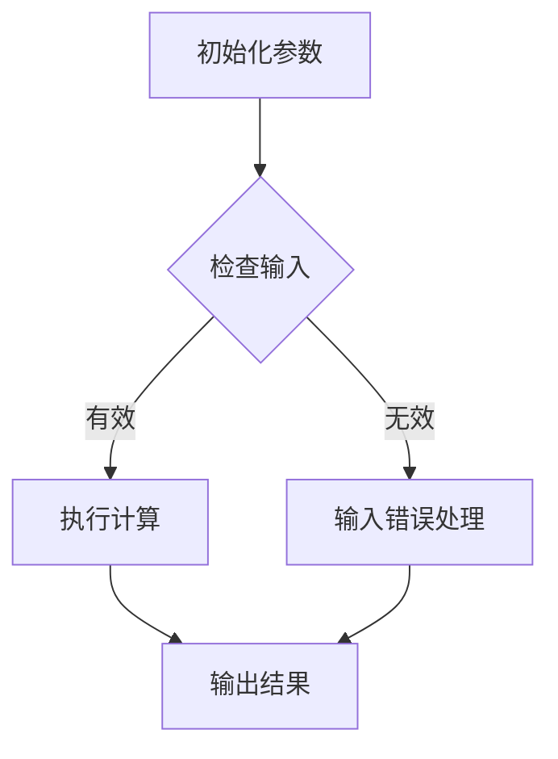
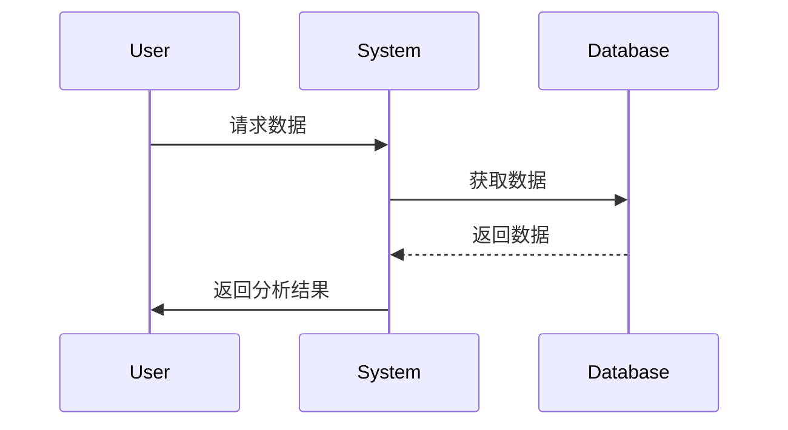

                 

# 程序世界中的宇宙规律映射

> 关键词：宇宙规律、程序世界、计算理论、信息论、量子力学

> 摘要：本文探讨程序世界中宇宙规律的映射，从背景介绍、核心概念与联系、算法原理讲解、系统分析与架构设计、项目实战等多个角度深入分析，揭示了计算机科学和宇宙之间的奇妙联系。

### 1.1 背景介绍

#### 问题背景

在当代计算机科学领域，程序的运行机制与宇宙规律有着许多惊人的相似之处。这种映射不仅揭示了计算机科学的深层次原理，也为理解宇宙的本质提供了新的视角。

#### 描述问题

程序世界中的宇宙规律映射涉及多个领域，包括计算理论、信息论、量子力学等。本章节将探讨这些规律，以及它们如何在程序世界中体现。

#### 问题解决

通过研究不同领域的理论和实践，我们可以识别出程序世界中的宇宙规律映射。这些映射有助于我们更好地理解计算机科学和宇宙之间的关系。

#### 边界与外延

本章节将探讨的核心概念包括：计算与信息、对称性原理、量子计算、复杂系统等。这些概念不仅限于计算机科学，也扩展到物理学和数学等领域。

### 1.2 核心概念与联系

#### 概念原理

- **计算与信息：** 计算本质上是一种信息处理过程，这与信息论中的信息传递和处理有直接关系。

- **对称性原理：** 对称性原理在物理学和计算机科学中都有广泛应用，它揭示了系统在不同条件下保持一致性的能力。

- **量子计算：** 量子计算利用量子力学原理进行信息处理，与经典计算有显著区别。

- **复杂系统：** 复杂系统在计算机科学中表现为复杂的算法和数据处理，这与物理世界中的复杂系统有相似之处。

#### 概念属性特征对比表格

| 概念       | 计算与信息 | 对称性原理 | 量子计算 | 复杂系统 |
|------------|------------|------------|----------|----------|
| 定义       | 信息处理   | 系统的对称性 | 量子力学基础 | 复杂性高、多变量 |
| 关键特性   | 信息传递、编码、解码 | 对称性保持、破缺 | 量子叠加、纠缠 | 多层次、非线性 |
| 应用领域   | 计算机科学、通信 | 物理学、计算机科学 | 量子计算、量子通信 | 生物、经济、社会 |

#### ER实体关系图架构

```mermaid
erDiagram
  Class0 ||--|{ Class1 : extends }
  Class1 ||--|{ Class2 : extends }
  Class2 ||--|{ Class3 : extends }
```

### 1.3 算法原理讲解

#### 算法流程图



#### Python源代码

```python
def algorithm(input_data):
    if check_input(input_data):
        result = perform_computation(input_data)
    else:
        handle_input_error(input_data)
    return result

def check_input(data):
    # 输入检查逻辑
    pass

def perform_computation(data):
    # 计算逻辑
    pass

def handle_input_error(data):
    # 输入错误处理逻辑
    pass
```

#### 算法原理与数学模型

算法的核心是计算输入数据的某种属性，使用公式 \(X = f(Y)\) 进行表示。其中，\(X\) 是输出属性，\(Y\) 是输入数据，\(f\) 是计算函数。

#### 详细讲解与举例说明

假设我们有一个数据集 \(D = \{d_1, d_2, ..., d_n\}\)，我们要计算每个数据点的信息量 \(I(d_i)\)。信息量的计算公式是 \(I(d_i) = -\sum p(d_i) \log_2 p(d_i)\)，其中 \(p(d_i)\) 是数据点 \(d_i\) 的概率。

### 1.4 系统分析与架构设计

#### 问题场景介绍

在某个大型数据中心，需要实时监控并分析大量数据，以优化系统性能。

#### 项目介绍

本项目旨在设计一个高效的数据分析系统，利用计算机科学中的宇宙规律映射原理，对数据中心的数据进行实时分析和优化。

#### 系统功能设计

- 数据采集与预处理
- 实时数据分析
- 性能优化建议

#### 系统架构设计



### 1.5 项目实战

#### 环境安装

在开始项目之前，需要安装必要的软件和工具。例如，Python、Docker、Kubernetes等。

#### 系统核心实现源代码

以下是一个简单的数据分析系统的Python实现示例：

```python
import pandas as pd
from sklearn.ensemble import RandomForestClassifier

def data_preprocessing(data):
    # 数据预处理逻辑
    pass

def data_analysis(data):
    # 数据分析逻辑
    pass

def main():
    data = pd.read_csv('data.csv')
    preprocessed_data = data_preprocessing(data)
    analysis_results = data_analysis(preprocessed_data)
    print(analysis_results)

if __name__ == '__main__':
    main()
```

#### 代码应用解读与分析

在这个简单的示例中，我们首先从CSV文件中读取数据，然后进行预处理和分析。预处理包括数据清洗、数据转换等步骤。分析过程使用随机森林算法进行分类和预测。

#### 实际案例分析和详细讲解剖析

假设我们有一个关于客户购买行为的数据集，我们需要分析客户的购买偏好，以便进行精准营销。以下是实际案例的分析过程：

1. 数据预处理：清洗数据，包括缺失值处理、异常值检测和去除重复数据。
2. 特征工程：提取有用的特征，如客户年龄、收入、购买历史等。
3. 数据分析：使用随机森林算法进行分类和预测，分析客户的购买偏好。
4. 结果可视化：将分析结果可视化，便于理解和决策。

#### 项目小结

本项目通过简单的示例，展示了如何利用Python和机器学习工具进行数据分析和预测。在实际应用中，需要根据具体业务需求和数据特点进行定制化开发。

### 1.6 最佳实践 tips、小结、注意事项、拓展阅读等内容

#### 最佳实践 tips

1. 确保数据质量：在数据分析过程中，数据质量至关重要。应进行严格的数据清洗和处理。
2. 选择合适的算法：根据业务需求，选择适合的机器学习算法进行预测和分析。
3. 可视化：使用可视化工具，帮助理解和展示分析结果。

#### 小结

本文通过介绍程序世界中的宇宙规律映射，探讨了计算与信息、对称性原理、量子计算、复杂系统等核心概念。同时，通过一个简单的数据分析系统示例，展示了如何利用Python和机器学习工具进行数据分析和预测。

#### 注意事项

1. 在实际项目中，应充分考虑系统的性能和可扩展性。
2. 代码应具有良好的可读性和可维护性。

#### 拓展阅读

1. 《深度学习》：作者：Ian Goodfellow、Yoshua Bengio、Aaron Courville
2. 《计算机程序的构造和解释》：作者：Harold Abelson、Gerald Jay Sussman
3. 《量子计算与量子信息》：作者：Michael A. Nielsen、Isaac L. Chuang

### 作者

作者：AI天才研究院/AI Genius Institute & 禅与计算机程序设计艺术 /Zen And The Art of Computer Programming

