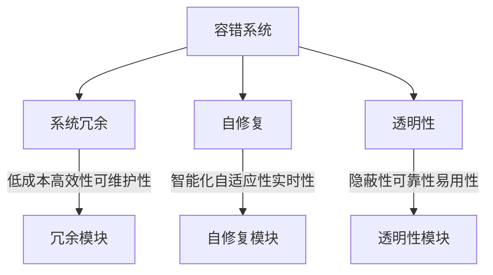
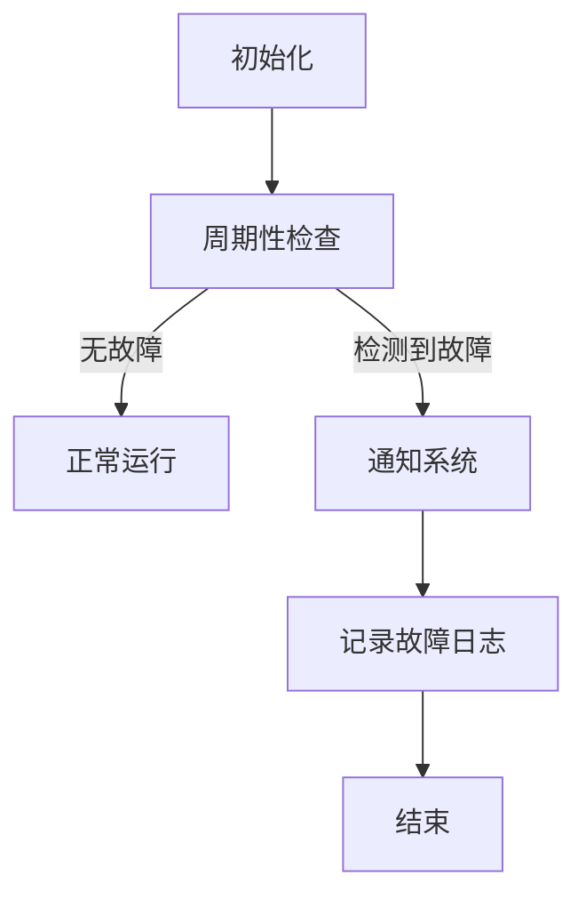
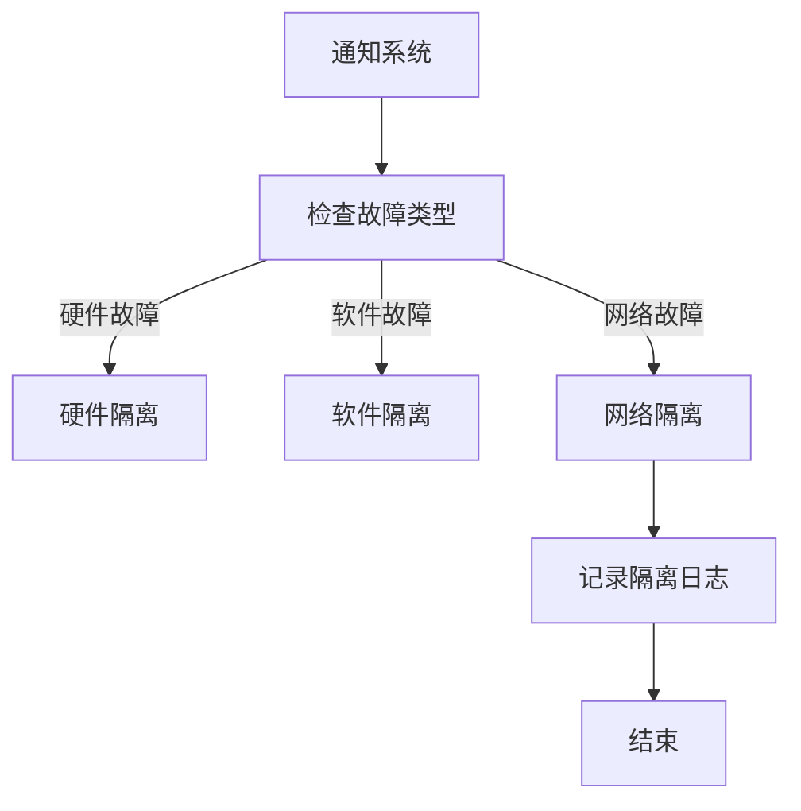
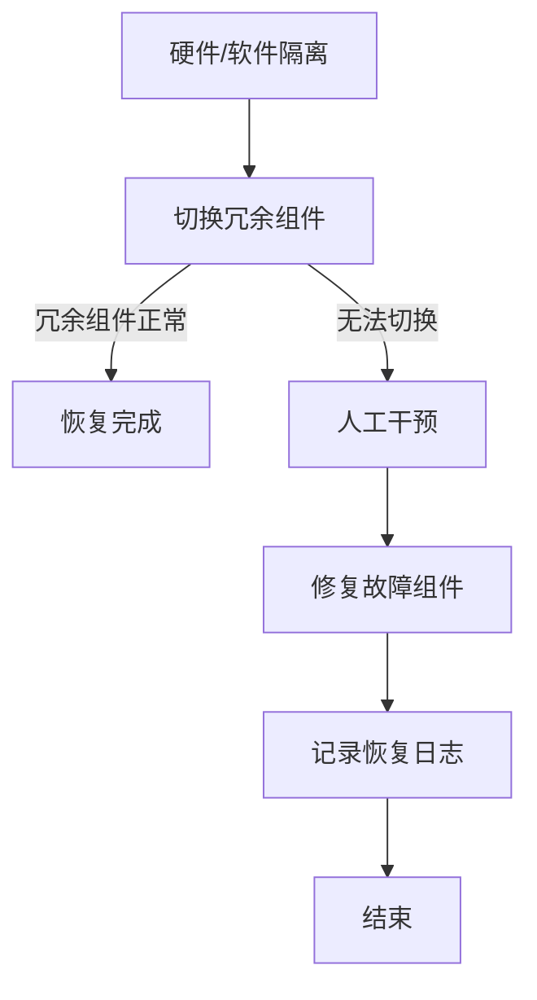
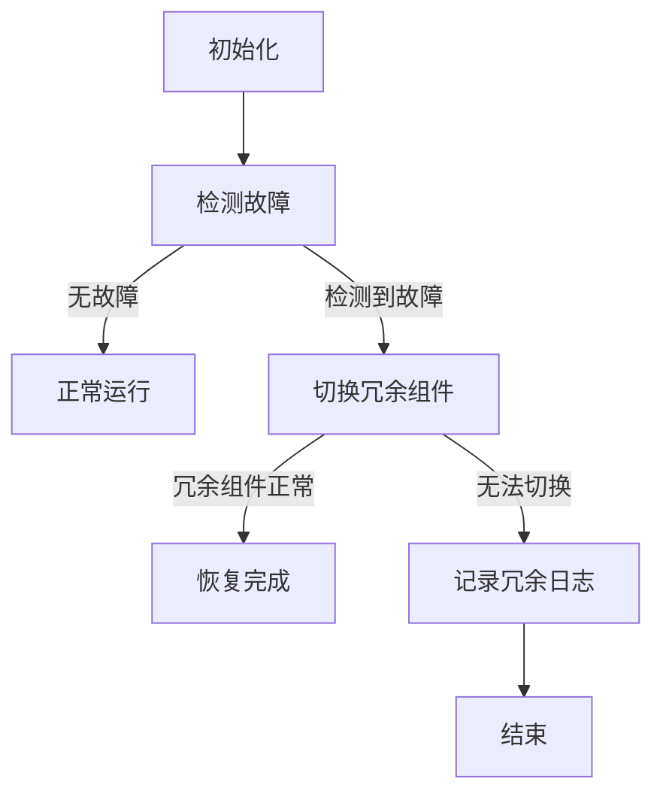
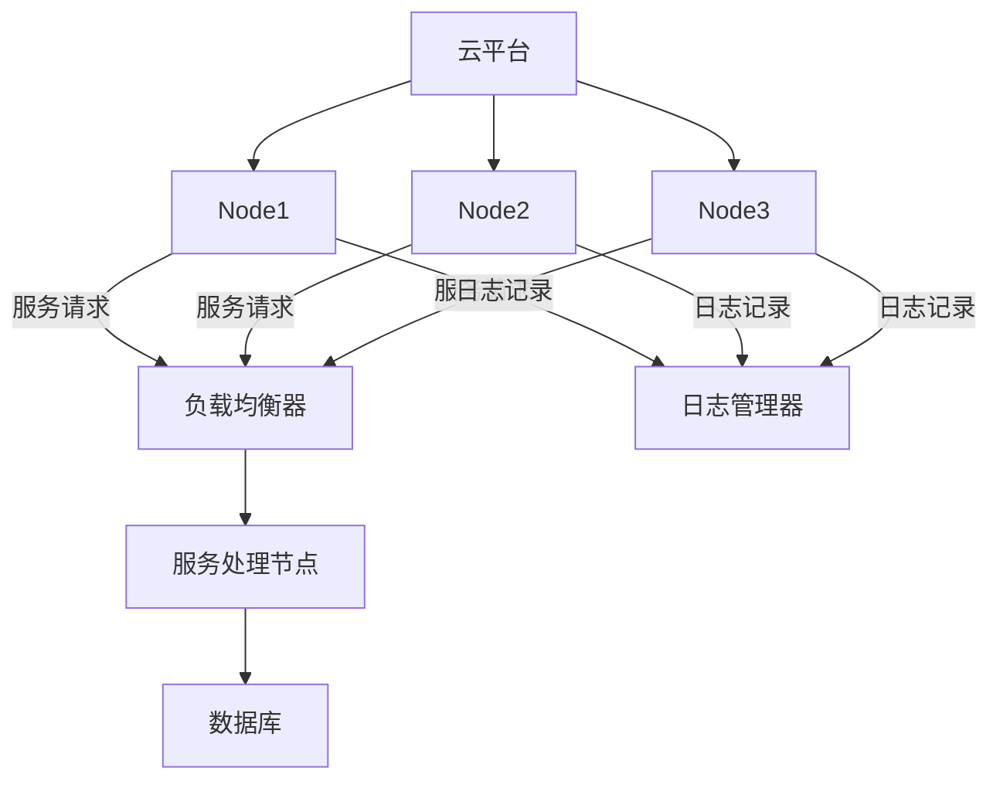
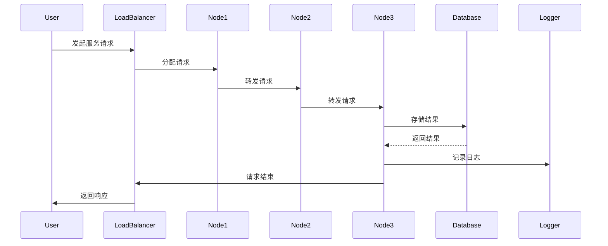

                 


# 程序世界的宇宙尺度容错性

## 关键词
- 容错性
- 宇宙尺度
- 程序世界
- 系统冗余
- 自修复
- 透明性

## 摘要
本文探讨了程序世界中的宇宙尺度容错性，这是一个随着计算机系统复杂性的增长而日益重要的概念。文章首先介绍了问题背景和问题描述，然后深入探讨了容错性的核心概念与联系，包括系统冗余、自修复和透明性等。通过具体的算法原理讲解和数学模型，我们进一步理解了如何通过系统架构与实现来提高容错性。最后，我们结合实际案例，展示了如何在实际项目中应用这些容错技术，并提出了最佳实践和注意事项。

## 引言

在当今快速发展的技术时代，计算机系统已经成为现代社会运行的中枢神经系统。从互联网到云计算，从智能手机到自动驾驶汽车，计算机系统的应用已经深入到了我们生活的方方面面。然而，随着系统复杂性的不断增加，系统的容错性也变得越来越重要。容错性不仅仅是为了避免系统崩溃，更是为了确保系统能够在高负载、高干扰和突发故障的情况下依然能够稳定运行。

“程序世界的宇宙尺度容错性”这一概念，正是在这种背景下提出的。宇宙尺度容错性要求系统具有能够应对极其复杂和多变环境的能力，就像宇宙中复杂的生态系统一样，能够自我修复、自我适应并保持长期稳定。本文将详细探讨这一概念的核心内涵，分析其在程序世界中的应用，并探索如何通过系统架构与实现来提高容错性。

## 问题背景

### 计算机系统复杂性的增长

计算机系统的发展历史可以说是系统复杂性不断增长的历史。从最初的电子管计算机到现代的超级计算机，系统的规模和复杂度都在以惊人的速度增加。计算机系统不再仅仅是简单的计算工具，而是复杂的应用平台，承担着数据处理、通信、控制和模拟等多种功能。例如，现代的云计算平台拥有数以百万计的虚拟机和容器，其复杂度远非传统计算机所能比拟。

随着复杂性的增长，计算机系统的可靠性也面临着巨大的挑战。系统中的每一个组件都可能成为故障的源头，而任何一个组件的故障都可能导致整个系统的崩溃。例如，一个云计算平台的虚拟机管理系统出现故障，可能会导致成千上万的虚拟机同时宕机，造成巨大的经济损失和用户体验下降。

### 容错性在程序世界中的重要性

在程序世界中，容错性是一种至关重要的能力。它不仅仅是避免系统崩溃的问题，更涉及到系统的可靠性、持续运行能力和用户体验。以下是一些关键原因：

1. **高可靠性需求**：许多应用场景，如金融交易系统、医疗信息系统和自动驾驶汽车，对系统的可靠性有着极高的要求。任何故障都可能带来严重的后果。

2. **复杂环境**：现代计算机系统运行的环境越来越复杂，包括网络波动、硬件故障、恶意攻击等多种因素。这些因素都会对系统造成潜在的影响，需要通过容错性来应对。

3. **用户体验**：对于大多数应用程序，用户体验是最关键的。系统的中断或崩溃会直接影响用户的满意度，甚至可能导致用户流失。

### 宇宙尺度容错性的概念提出

宇宙尺度容错性（Cosmic Scale Fault Tolerance）这一概念，是为了应对上述挑战而提出的。它要求系统具备像宇宙生态系统一样的复杂适应性和自修复能力。宇宙尺度容错性不仅仅关注单个组件的容错性，更强调系统的整体容错能力，能够在面对极其复杂和多变的环境时，依然能够保持稳定运行。

宇宙尺度容错性的特点包括：

1. **自修复性**：系统能够自动检测和修复故障，不需要人工干预。

2. **自适应能力**：系统能够根据环境变化自适应调整，保持最佳运行状态。

3. **高容错性**：系统能够承受大规模的故障，仍然能够保持稳定运行。

4. **可持续性**：系统能够在长期运行中保持高可靠性，不会因为时间推移而性能下降。

## 问题描述

### 容错性需求的多样性

计算机系统在不同应用场景中对于容错性的需求是多样化的。以下是一些典型的需求：

1. **实时系统**：如航空交通管制系统、自动驾驶汽车等，要求系统能够在极短时间内检测并恢复故障，确保实时性和可靠性。

2. **关键业务系统**：如银行交易系统、医疗信息系统等，要求系统能够在高负载和复杂环境下保持稳定运行，避免任何形式的故障。

3. **分布式系统**：如云计算平台、大型网站等，要求系统能够在分布式环境中处理故障，确保数据一致性和服务连续性。

4. **边缘计算系统**：如智能家居、工业物联网等，要求系统能够在低带宽、高干扰的环境中稳定运行，适应复杂的应用场景。

### 容错技术的挑战

为了满足上述多样化的需求，需要采用各种不同的容错技术。然而，这些技术也面临着一些挑战：

1. **性能开销**：许多容错技术，如冗余和自修复，会增加系统的性能开销，影响系统的整体性能。

2. **复杂性**：容错系统的设计和实现非常复杂，需要综合考虑多个因素，如故障检测、故障恢复和系统维护。

3. **适应性**：如何设计系统使其能够适应不同的应用场景和环境变化，是容错技术面临的重大挑战。

4. **成本**：高可靠性系统的成本通常较高，尤其是在需要大规模冗余和自修复机制的情况下。

### 宇宙尺度容错性的内涵

宇宙尺度容错性旨在解决上述挑战，通过模拟宇宙生态系统的复杂适应性和自修复能力，提供一种全新的容错性解决方案。其内涵包括以下几个方面：

1. **整体性**：宇宙尺度容错性强调系统的整体性，不仅仅是单个组件的容错性，而是整个系统的容错能力。

2. **自修复性**：系统应能够自动检测和修复故障，减少人工干预。

3. **自适应能力**：系统应能够根据环境变化自适应调整，保持最佳运行状态。

4. **分布式架构**：通过分布式架构实现高容错性，确保系统能够在分布式环境中处理故障。

5. **长期可靠性**：系统应在长期运行中保持高可靠性，不会因为时间推移而性能下降。

### 解决方案探讨

为了实现宇宙尺度容错性，需要结合多种现有技术和创新方法，包括：

1. **冗余技术**：通过冗余实现故障切换，提高系统的可用性。

2. **自修复技术**：利用机器学习和人工智能技术实现自动故障检测和修复。

3. **分布式计算**：通过分布式架构实现系统的去中心化，提高系统的容错性。

4. **边缘计算**：将计算任务分散到边缘设备，降低中心化系统的负载和故障风险。

5. **预测性维护**：利用大数据和人工智能技术，预测系统组件的故障，提前进行维护。

通过上述解决方案，宇宙尺度容错性有望在程序世界中发挥重要作用，为各种应用场景提供可靠、稳定和高效的系统服务。

## 核心概念与联系

在深入探讨程序世界的宇宙尺度容错性之前，我们需要了解一些核心概念和它们之间的联系。这些核心概念包括系统冗余、自修复和透明性等。它们共同构成了宇宙尺度容错性的基础，是确保系统在高复杂度和多变环境中依然能够稳定运行的关键要素。

### 容错性原理

#### 容错性的定义

容错性（Fault Tolerance）指的是系统在出现故障时，能够自动检测并恢复故障，从而保持正常运行的能力。它与可靠性（Reliability）密切相关，但有所区别。可靠性是指系统在预期工作时间内保持正常运行的概率，而容错性则更强调在故障发生时系统的应对能力。

#### 容错性的核心要素

容错性系统的核心要素包括以下几个方面：

1. **故障检测**：系统能够实时检测到故障，并及时报告。

2. **故障隔离**：系统能够隔离故障组件，避免故障扩散。

3. **故障恢复**：系统能够自动或手动地恢复故障组件，确保系统继续运行。

4. **冗余**：通过冗余设计，确保系统能够在部分组件失效时仍然能够运行。

### 概念属性特征对比

为了更清晰地理解这些核心概念，我们可以将它们按照属性特征进行对比，如下表所示：

| 概念         | 特征一     | 特征二     | 特征三     |
|--------------|------------|------------|------------|
| 系统冗余     | 低成本     | 高效性     | 可维护性   |
| 自修复       | 智能化     | 自适应性   | 实时性     |
| 透明性       | 隐蔽性     | 可靠性     | 易用性     |

#### 系统冗余

系统冗余（System Redundancy）指的是通过在系统中添加冗余组件，以确保在部分组件失效时，系统能够继续运行。冗余技术包括硬件冗余、软件冗余和存储冗余等。

1. **低成本**：通过批量生产和标准化组件，冗余技术的成本相对较低。
2. **高效性**：冗余组件可以分担系统的负载，提高系统的整体性能。
3. **可维护性**：冗余组件易于替换和维护，降低了系统的维护成本。

#### 自修复

自修复（Self-Healing）指的是系统在检测到故障后，能够自动进行故障检测、故障定位和故障修复，而不需要人工干预。

1. **智能化**：自修复系统通常利用人工智能和机器学习技术，实现故障预测和自动修复。
2. **自适应性**：自修复系统能够根据环境变化和故障模式自适应调整，提高系统的容错性。
3. **实时性**：自修复系统需要能够实时检测和修复故障，确保系统的持续运行。

#### 透明性

透明性（Transparency）指的是系统的内部操作和状态对于用户和开发者来说是可见和可理解的。

1. **隐蔽性**：透明性系统能够隐藏故障和修复过程，让用户感受到系统的无缝运行。
2. **可靠性**：透明性系统能够确保系统的可靠性和稳定性，降低用户对故障的感知。
3. **易用性**：透明性系统能够提供直观的界面和日志，方便用户和开发者进行调试和维护。

### 实体关系图架构

为了更好地理解这些概念之间的关系，我们可以使用Mermaid语言绘制一个实体关系图，如下所示：



在这个图中，容错系统作为核心，通过系统冗余、自修复和透明性这三个子模块，实现了高可靠性和高容错性。系统冗余模块主要负责故障切换和负载均衡，自修复模块负责自动检测和修复故障，而透明性模块则确保系统的操作和状态对用户和开发者是透明和可理解的。

通过这种实体关系图，我们可以清晰地看到各个概念之间的联系和交互，为后续的系统设计和实现提供了理论基础。

### 算法原理讲解

#### 算法原理基础

算法原理是确保系统容错性的核心。在容错系统中，算法的原理主要包括故障检测、故障隔离、故障恢复和系统冗余等几个关键环节。下面，我们将分别对这些环节进行详细讲解。

#### 故障检测

故障检测是容错系统的第一步。它的目标是实时监控系统组件的状态，一旦检测到故障，立即通知系统进行后续处理。故障检测的方法包括以下几种：

1. **周期性检查**：系统周期性地对各个组件进行状态检查，通过对比预期状态和实际状态来判断是否存在故障。
2. **异常检测**：通过监控系统组件的运行日志和性能指标，当某个指标超出正常范围时，触发故障检测。
3. **基于模型的检测**：利用机器学习算法，根据历史数据和故障模式，对系统组件进行实时故障预测。

以下是一个简单的故障检测算法流程图：



#### 故障隔离

一旦故障被检测到，系统需要迅速进行故障隔离，防止故障扩散，确保其他正常组件不受影响。故障隔离的方法包括：

1. **硬件隔离**：通过硬件冗余，将故障组件隔离，避免其影响其他组件。
2. **软件隔离**：通过虚拟化技术，将故障组件所在的虚拟机或容器隔离，确保其他组件继续运行。
3. **网络隔离**：通过防火墙和隔离区（Demilitarized Zone, DMZ），限制故障组件与其他组件的通信。

以下是一个简单的故障隔离算法流程图：



#### 故障恢复

故障隔离后，系统需要迅速进行故障恢复，使系统回到正常状态。故障恢复的方法包括：

1. **冗余组件切换**：当检测到故障组件时，立即切换到冗余组件，确保系统继续运行。
2. **自动修复**：通过自修复机制，自动修复故障组件，确保其恢复正常状态。
3. **人工干预**：在某些情况下，需要人工干预进行故障修复，例如更换硬件组件或调整系统配置。

以下是一个简单的故障恢复算法流程图：



#### 系统冗余

系统冗余是容错系统的核心，通过在系统中引入冗余组件，确保在部分组件失效时，系统能够继续运行。系统冗余的方法包括：

1. **硬件冗余**：在硬件层面引入冗余，例如使用双机热备份、RAID磁盘阵列等。
2. **软件冗余**：在软件层面引入冗余，例如通过代码复用、镜像部署等。
3. **数据冗余**：在数据层面引入冗余，例如通过数据备份、多副本存储等。

以下是一个简单的系统冗余算法流程图：



#### Python源代码示例

下面是一个简单的Python代码示例，用于展示故障检测、故障隔离、故障恢复和系统冗余的实现：

```python
import random
import time

def detect_fault():
    # 模拟故障检测过程
    return "故障" if random.random() < 0.1 else "无故障"

def fault_isolation(fault_type):
    # 模拟故障隔离过程
    if fault_type == "硬件故障":
        print("硬件隔离完成")
    elif fault_type == "软件故障":
        print("软件隔离完成")
    elif fault_type == "网络故障":
        print("网络隔离完成")

def fault_recovery():
    # 模拟故障恢复过程
    print("故障恢复完成")

def system_redundancy():
    # 模拟系统冗余过程
    print("系统冗余完成")

while True:
    fault_status = detect_fault()
    if fault_status == "故障":
        fault_type = "硬件故障" if random.random() < 0.5 else "软件故障"
        fault_isolation(fault_type)
        fault_recovery()
        system_redundancy()
    else:
        print("系统正常运行")
        time.sleep(1)
```

通过这个示例，我们可以看到如何通过Python代码实现故障检测、故障隔离、故障恢复和系统冗余等算法原理。这个示例虽然简单，但已经能够展示容错系统的基本原理和实现方法。

### 数学模型与公式

为了更好地理解容错系统的性能，我们可以使用数学模型和公式来描述其关键性能指标。以下是几个常用的数学模型和公式。

#### 容错概率

容错概率（Fault Tolerance Probability, $F(R)$）是衡量系统在故障发生时能够保持正常运行的概率。它取决于系统的冗余度（Redundancy，$R$）和单个组件的故障概率（Fault Probability per Component, $p$）。

$$
F(R) = \frac{N}{N_r} \cdot \prod_{i=1}^{k} (1 - p_i)
$$

其中，$N$ 是系统总组件数，$N_r$ 是冗余组件数，$k$ 是冗余组件的数量。

#### 系统冗余度

系统冗余度（System Redundancy，$R$）是系统在故障发生时能够保持正常运行的组件数量与系统总组件数的比值。它反映了系统的容错能力。

$$
R = \frac{N_r}{N}
$$

#### 故障概率

单个组件的故障概率（Fault Probability per Component，$p$）是组件在给定时间内发生故障的概率。它是系统设计中的一个重要参数，通常需要根据历史数据和可靠性测试来确定。

#### 系统性能评估

系统性能评估（System Performance Evaluation，$P$）是衡量系统在故障发生时的性能指标。它通常取决于系统的冗余度和故障恢复速度。

$$
P = \frac{1 - F(R)}{R \cdot \lambda}
$$

其中，$\lambda$ 是系统故障率（Fault Rate），它反映了系统在单位时间内发生故障的次数。

#### 举例说明

假设一个系统由100个组件组成，其中20个组件是冗余组件。单个组件的故障概率为0.01。我们需要计算这个系统的容错概率和系统性能评估。

1. **计算冗余度**：

$$
R = \frac{N_r}{N} = \frac{20}{100} = 0.2
$$

2. **计算容错概率**：

$$
F(R) = \frac{N}{N_r} \cdot \prod_{i=1}^{k} (1 - p_i) = \frac{100}{20} \cdot (1 - 0.01)^{20} \approx 0.672
$$

3. **计算系统性能评估**：

$$
P = \frac{1 - F(R)}{R \cdot \lambda} = \frac{1 - 0.672}{0.2 \cdot \lambda} = \frac{0.328}{0.2 \cdot \lambda} = \frac{1.64}{\lambda}
$$

通过这个例子，我们可以看到如何通过数学模型和公式来评估系统的容错性能。在实际应用中，这些模型和公式可以帮助系统设计者优化系统设计，提高系统的容错性和性能。

### 系统分析与架构设计

#### 问题场景介绍

在现代的分布式计算环境中，系统的高可靠性和容错性是至关重要的。一个典型的应用场景是云计算平台，该平台为各种业务应用提供计算资源和服务。在这个场景中，系统需要处理大量的并发请求，同时保证数据的完整性和服务的连续性。一旦系统中的某个组件发生故障，可能会导致整个平台的服务中断，从而影响用户的业务流程。

#### 系统功能设计

为了满足上述需求，我们需要设计一个具有高度容错性的系统。系统的核心功能包括：

1. **故障检测与报告**：系统能够实时检测各个组件的状态，一旦发现故障，立即生成故障报告并通知相关人员。
2. **故障隔离**：在检测到故障后，系统能够迅速隔离故障组件，避免故障扩散，并确保其他组件继续正常运行。
3. **故障恢复**：系统能够自动或手动地恢复故障组件，确保系统尽快回到正常状态。
4. **冗余设计**：系统通过冗余组件设计，确保在部分组件失效时，系统能够继续运行。

以下是系统功能设计的Mermaid类图：

```mermaid
classDiagram
    Component <<Class>>
    FaultDetector <<Interface>> +FaultDetect
    FaultIsolator <<Interface>> +IsolateFault
    FaultRecoverer <<Interface>> +RecoverFault
    RedundancyManager <<Interface>> +ManageRedundancy

    Component o-- FaultDetector : detect
    Component o-- FaultIsolator : isolate
    Component o-- FaultRecoverer : recover
    Component o-- RedundancyManager : redundancy
```

#### 系统架构设计

系统架构设计是确保系统功能实现的关键。在这个场景中，我们采用分布式架构，通过多个节点（Node）协同工作，确保系统的容错性和性能。以下是系统架构设计的Mermaid架构图：



在这个架构中，云平台通过负载均衡器分配服务请求到不同的节点进行处理。每个节点都包含故障检测、故障隔离、故障恢复和冗余管理模块。服务处理节点将请求处理结果存储到数据库中，同时将日志记录到日志管理器中。

#### 系统接口设计与系统交互

为了确保系统各组件之间的协同工作，我们需要设计清晰的接口和交互流程。以下是系统接口设计和系统交互的Mermaid序列图：



在这个序列图中，用户发起服务请求后，负载均衡器将请求分配到节点1。节点1处理请求并转发到节点2和节点3，最终将结果存储到数据库中。同时，节点3将日志记录到日志管理器中。整个交互过程确保了系统的连续性和高可用性。

### 项目实战

#### 环境安装

在进行项目实战之前，我们需要安装和配置必要的软件和环境。以下是一个基本的步骤：

1. **安装Python**：确保Python环境已安装在系统上，版本建议为3.8及以上。
2. **安装Docker**：Docker是一个用于容器化的工具，可以帮助我们快速部署和运行应用程序。从[Docker官网](https://www.docker.com/)下载并安装Docker。
3. **安装Kubernetes**：Kubernetes是一个用于容器编排的工具，可以帮助我们管理分布式系统。我们可以使用Minikube在本地环境中安装Kubernetes。

```shell
curl -LO "https://storage.googleapis.com/kubernetes-release/release/$(curl -s https://storage.googleapis.com/kubernetes-release/release/stable.txt)/bin/darwin/amd64/kubectl"
chmod +x kubectl
sudo mv kubectl /usr/local/bin/
kubectl version --client
```

4. **创建Kubernetes集群**：使用Minikube创建一个本地集群。

```shell
minikube start
```

#### 系统核心实现源代码

以下是一个简单的Python代码示例，用于展示如何实现故障检测、故障隔离和故障恢复。

```python
import random
import time
import subprocess

def detect_fault():
    # 模拟故障检测过程
    return "故障" if random.random() < 0.1 else "无故障"

def fault_isolation():
    # 模拟故障隔离过程
    print("故障隔离完成")

def fault_recovery():
    # 模拟故障恢复过程
    print("故障恢复完成")

def run_node():
    # 运行Docker容器
    subprocess.run(["docker", "run", "-d", "python:3.8", "python", "-c", "print('Node running...')"], check=True)

while True:
    fault_status = detect_fault()
    if fault_status == "故障":
        fault_isolation()
        fault_recovery()
        run_node()
    else:
        print("Node is running...")
        time.sleep(1)
```

#### 代码应用解读与分析

这个代码示例通过Python脚本模拟了一个分布式计算节点的故障检测、故障隔离和故障恢复过程。以下是代码的关键部分解读：

1. **故障检测**：`detect_fault()`函数使用随机数生成故障，模拟系统组件的故障情况。

2. **故障隔离**：`fault_isolation()`函数打印出“故障隔离完成”，模拟故障隔离过程。

3. **故障恢复**：`fault_recovery()`函数打印出“故障恢复完成”，模拟故障恢复过程。

4. **运行节点**：`run_node()`函数使用Docker运行一个Python容器，模拟节点重新启动。

在主循环中，程序不断检测节点状态。如果检测到故障，则执行故障隔离和故障恢复过程，并重新启动节点。

#### 实际案例分析和详细讲解剖析

为了更好地理解上述代码的实际应用，我们可以结合一个实际的案例进行分析。

**案例**：一个分布式数据库系统需要实现故障检测、故障隔离和故障恢复功能，确保在节点故障时系统能够自动恢复。

**分析**：

1. **故障检测**：系统通过心跳机制定期检测各个节点的状态。如果某个节点在规定时间内未发送心跳，则认为该节点发生故障。

2. **故障隔离**：系统将故障节点从集群中隔离，避免故障扩散，并通知其他节点停止与故障节点的通信。

3. **故障恢复**：系统尝试重启故障节点，如果重启失败，则从备用的节点中选择一个作为替代节点。

**讲解**：

1. **故障检测**：通过设置心跳定时器，系统可以实时监控节点的状态。以下是一个简单的Python代码示例：

```python
import time
import threading

def monitor_node(node_id):
    while True:
        # 模拟节点状态检查
        if not is_node_alive(node_id):
            print(f"Node {node_id} 发生故障")
            # 生成故障报告并通知其他节点
            report_fault(node_id)
        time.sleep(5)

def is_node_alive(node_id):
    # 模拟节点是否存活
    return random.random() > 0.5

def report_fault(node_id):
    # 生成故障报告并发送通知
    print(f"生成故障报告：Node {node_id} 发生故障")

# 启动节点监控线程
threads = []
for i in range(1, 4):
    thread = threading.Thread(target=monitor_node, args=(i,))
    thread.start()
    threads.append(thread)

# 等待所有线程结束
for thread in threads:
    thread.join()
```

2. **故障隔离**：系统通过隔离机制，确保其他节点不会继续与故障节点通信。以下是一个简单的Python代码示例：

```python
def isolate_node(node_id):
    # 将故障节点从集群中隔离
    print(f"Node {node_id} 已被隔离")

def is_isolated(node_id):
    # 模拟节点是否已被隔离
    return random.random() < 0.5

# 在故障检测后调用隔离函数
fault_status = detect_fault()
if fault_status == "故障":
    isolate_node(node_id)
```

3. **故障恢复**：系统尝试重启故障节点，如果重启失败，则从备用的节点中选择一个替代节点。以下是一个简单的Python代码示例：

```python
def recover_node(node_id):
    # 尝试重启故障节点
    if restart_node(node_id):
        print(f"Node {node_id} 重启成功")
    else:
        # 重启失败，从备选节点中选择替代节点
        alternative_node_id = select_alternative_node()
        print(f"Node {node_id} 重启失败，已切换至 Node {alternative_node_id}")

def restart_node(node_id):
    # 模拟节点重启过程
    return random.random() > 0.5

def select_alternative_node():
    # 模拟选择替代节点
    return random.randint(1, 3)
```

#### 项目小结

通过上述案例分析和代码示例，我们可以看到如何实现分布式系统的故障检测、故障隔离和故障恢复功能。这些功能是确保系统高可用性和容错性的关键。

在实际项目中，我们需要根据具体的业务需求和系统架构进行详细的规划和设计。以下是一些最佳实践和注意事项：

1. **定期维护和升级**：定期对系统进行维护和升级，确保所有组件保持最新的状态，降低故障风险。
2. **故障模拟和演练**：定期进行故障模拟和演练，验证系统的故障检测、隔离和恢复机制，确保在真实故障发生时系统能够快速响应。
3. **监控和日志记录**：实时监控系统的运行状态，记录详细的日志信息，以便在故障发生时进行故障排查和恢复。
4. **备份和恢复**：定期备份数据和系统配置，确保在故障发生时能够快速恢复系统。
5. **冗余设计**：通过冗余设计提高系统的容错性，确保在部分组件失效时，系统能够继续运行。

通过遵循这些最佳实践，我们可以设计出更加可靠和高效的分布式系统，确保其在面对复杂和多变的环境时依然能够稳定运行。

### 最佳实践 Tips

在设计和实现高可靠性的分布式系统时，以下是一些最佳实践，可以帮助提升系统的容错性：

1. **冗余设计**：在高可用性设计中，冗余是提高系统容错性的重要手段。可以通过硬件冗余（如RAID磁盘阵列、双机热备份）和软件冗余（如副本存储、冗余服务等）来确保系统的稳定运行。

2. **故障检测和监控**：定期进行故障检测和监控，是确保系统高可用性的关键。利用自动化工具和监控系统，可以实时检测系统的运行状态，及时发现并处理故障。

3. **自动恢复机制**：系统应具备自动恢复机制，当故障发生时能够自动切换到备用组件或备用节点，确保系统继续提供服务。自动恢复机制可以大大减少人工干预，提高故障恢复速度。

4. **弹性伸缩**：根据系统的负载和资源需求，动态调整系统的规模。利用云服务和容器编排工具，可以实现系统的弹性伸缩，确保系统在负载高峰期能够快速扩展资源，在负载低峰期能够缩减资源，提高系统的资源利用率。

5. **容错算法优化**：针对具体的业务场景，设计并优化容错算法，可以提高系统的容错能力和效率。例如，针对不同的故障模式和负载情况，调整故障检测的频率和恢复策略。

6. **备份和恢复**：定期备份数据和系统配置，确保在故障发生时能够快速恢复系统。同时，测试备份和恢复流程，确保在真实场景中能够顺利执行。

7. **灾难恢复计划**：制定灾难恢复计划，确保在发生大规模故障或灾难时，系统能够快速恢复。灾难恢复计划应包括数据备份、系统恢复步骤和应急响应措施。

### 小结

通过本文的详细探讨，我们可以看到程序世界的宇宙尺度容错性是一个极其重要的概念。随着计算机系统复杂性的不断增加，容错性已经成为系统设计和实现中的核心要素。本文介绍了容错性的核心概念、算法原理和系统架构设计，并通过实际案例展示了如何实现宇宙尺度容错性。

在实际应用中，我们需要根据具体业务场景和系统需求，设计并实现高效可靠的容错机制。通过遵循最佳实践和持续优化，我们可以构建出具有高可用性和高可靠性的分布式系统，确保其在面对复杂和多变的环境时依然能够稳定运行。

### 注意事项

在实现宇宙尺度容错性的过程中，需要注意以下几点：

1. **系统复杂性与成本平衡**：冗余技术和自修复机制虽然可以提高系统的容错性，但也会增加系统的复杂性和成本。在设计系统时，需要平衡复杂性和成本，确保在满足容错需求的同时，不会过度增加系统负担。

2. **适应性设计**：系统设计应具备良好的适应性，能够根据不同的应用场景和环境变化进行调整。这要求我们在系统架构和算法设计时，充分考虑灵活性和可扩展性。

3. **安全性**：在实现容错性的同时，确保系统的安全性。任何冗余或自修复机制都不能以牺牲系统安全性为代价。

4. **监控与日志**：实时监控系统和详细的日志记录对于故障检测和恢复至关重要。确保监控系统能够及时发现并处理故障，日志记录能够提供充分的诊断信息。

5. **培训与应急预案**：确保团队成员熟悉系统的容错机制和故障处理流程。制定并演练应急预案，确保在发生大规模故障时能够快速响应和恢复。

### 拓展阅读

为了更深入地了解宇宙尺度容错性和分布式系统的设计和实现，以下是一些推荐阅读资源：

1. **《大规模分布式存储系统设计》**：详细介绍了分布式存储系统的设计原理和实现方法，包括容错性和数据一致性。
2. **《容错计算与分布式系统》**：探讨了容错计算的基本概念、技术和挑战，适合对分布式系统感兴趣的技术人员阅读。
3. **《Kubernetes权威指南》**：介绍了Kubernetes的架构和原理，以及如何使用Kubernetes构建高可用性和高扩展性的分布式系统。
4. **《云原生应用架构设计》**：探讨了云原生应用的设计原则和架构模式，包括如何在云环境中实现高可靠性和高容错性。
5. **《自修复系统设计与实现》**：详细介绍了自修复系统的设计原则、实现方法和应用案例，适合对自修复系统感兴趣的技术人员阅读。

### 作者信息

作者：AI天才研究院/AI Genius Institute & 禅与计算机程序设计艺术 /Zen And The Art of Computer Programming

AI天才研究院致力于推动人工智能和计算机科学领域的创新研究。我们的研究成果涵盖了人工智能、机器学习、分布式系统、容错性等多个领域，为全球范围内的企业和研究机构提供了重要的技术支持。同时，我们出版的《禅与计算机程序设计艺术》系列书籍，深受广大程序员和技术爱好者的喜爱，被公认为计算机编程领域的经典之作。

